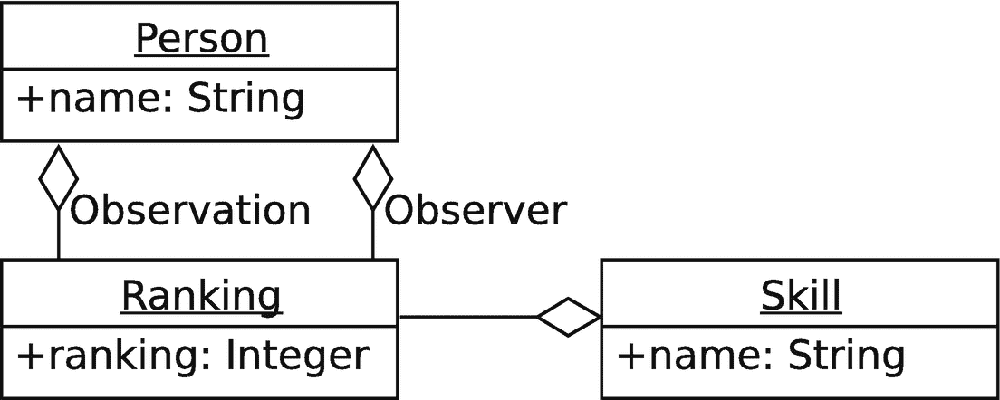

# 三、构建简单的应用

在这一章中，我们将创建一个应用的外壳，这将允许我们演示一些使用 Hibernate 的系统中常见的概念。我们将涵盖以下内容:

*   对象模型设计，包括对象之间的关系

*   查看和修改持久数据的操作(插入、读取、更新和删除)

通常，我们会使用一个服务层来封装一些操作，事实上，随着我们的继续，我们会添加一个服务层，但是此时我们想了解更多如何与 Hibernate 本身进行交互。这里的目标是不要把时间浪费在一个“可以扔掉的”示例应用上我们肯定不会有一个完整而理想的代码库，但它将是一个在现实世界中如何使用 Hibernate 的模型。

当然，这种说法有一个警告:不同的应用和架构师有不同的方法。这只是创建这种应用的一种方式；其他人会采取和这个一样有效的不同方法。

此外，我们的模型将是渐进的，这意味着它的质量不会很高。我们将继续介绍各种新概念；我们将有很多机会回到以前编写的代码并对其进行改进。

## 一个简单的应用

我们试图创建的是一个应用，允许在各种技能领域的同行排名。

这个概念大概是这样的:John 认为 Tracy 非常擅长 Java，所以在 1 到 10 的范围内，他给 Tracy 打了 7 分。萨姆认为特蕾西很正派，但并不伟大；他会给特蕾西 5 分。根据这两个排名，人们可能会猜测 Tracy 在 Java 中是 6。实际上，这样一个小样本集，你将无法判断这个排名是否准确，但在 20 个这样的排名之后，你将有机会得到一个真正合法的同行评估。

因此，我们想要的是一种方式，让观察者为特定的人提供给定技能的排名。我们还想要一种方法来确定每个人的实际排名，以及一种方法来找出谁对于给定的技能排名“最好”。

如果你着眼于应用设计来看这些段落，你会看到我们有四种不同类型的实体——数据库中要管理的对象——和一些服务。

我们的实体是这些:人(是观察者和主体；因此，我们可以使用一个既可以指观察者又可以指主题的单一类型)、技能和等级。

我们的关系看起来像这样:

一个主体——一个人——拥有零项、一项或多项技能。一个人的技能各有零个、一个或多个排名。

排名有一个分数(“在 1 到 10 的范围内”)和一个观察者(提交特定排名的人)。

## 关系和基数

在我们开始深入研究对象模型之前，有必要回顾一下数据库术语中关系是如何指定的。

考虑一个人和一个联邦身份号码。一个人可能没有联邦身份证，所以考虑两个数据库表是有意义的(一个`Person`表和一个`FIN`表，代表“联邦身份证号”)。我们可以将这表达为“一对零或一”的关系，这意味着一个`Person`记录可以有零个或一个`FIN`记录。我们还可以从`FIN`表的角度来表达这种关系，例如`FIN`与`Person`具有“一对一”的关系，这意味着每一个`FIN`记录都与一个且恰好一个`Person`记录相关。

您看到的关系类型通常属于以下几组:

1.  **一对一**，或者 1:1。在这种情况下，关系的双方都只有一个记录或实体。在 Hibernate 中，这是一个被标记为*而不是*可选的关系。

2.  **一到零或者一个**。在这种关系下,“目的地”记录——“0 或 1”是可选的，但在其他方面它符合 1:1 的关系。

3.  **一对多**，或 1:M。这可能显示为一个`Person`和他们的`BankAccount`记录之间的关系，例如，因为一个人可能有储蓄账户、支票账户和循环贷款。

4.  **多对多**，或 M:M，有了这种结构，关系双方的基数都很高；您可以在这里想象一个由`SchoolCourse`和`Student`组成的结构，因为每个学生可以注册许多不同的课程，并且每个课程可以有许多学生。通常，这不是一个特别有效的结构，在实践中——你更可能有一个学校课程有许多`Schedule`记录，代表在特定时间注册的每个学生，每个`Student`也有多个`Schedule`记录，这意味着`Course`到`Schedule`是一个 1:M 关系，正如`Student`和`Schedule`之间的关系一样。

5.  **多对一**或 M:1 是 1:M 的逆表达式，用于表示对另一个实体类型的依赖性。

我们将在本章和其他章节中讨论这些关系类型的使用。

## 第一次尝试

我们的项目将允许我们写、读和更新不同科目的排名，并告诉我们谁在某项技能上的平均分数最高。

起初，它不会非常有效地完成这些事情，但是随着时间的推移，我们将实现我们对(某种程度上)敏捷开发实践的渴望，并且我们将学习相当多的关于如何使用 Hibernate 读写数据的知识。

像往常一样，我们将使用测试驱动开发。让我们写一些测试，然后试着让它们通过。我们最初的代码将非常原始，只测试我们的数据模型，但最终我们将测试服务。

我们的数据模型如下所示。正如您所看到的，它有三种对象类型和三种关系:一个人以两种方式与一个排名相关联(作为主题和观察者)，每个排名都有一个关联的技能。



图 3-1

简单的实体关系图

可能值得指出的是，这种数据模型并不理想。就目前而言，这没什么——我们正在努力构建一些东西，为我们提供一个起点，我们将在前进的过程中考虑我们的全部需求。

我们也不可否认地低估了我们的实体。例如，一个人可以不仅仅是一个名字。(一个人也可以是一个数字，对吗？…哦，等等，这一点也不好笑，因为我们最终将为每个人添加一个数字标识符作为人工密钥。)也许我们会在开发模型时解决这个问题和其他问题。

所以让我们从设计我们的对象开始。

因为我们的问题描述集中在一个人的概念上(作为主体和观察者)，让我们从那个开始。可以表示一个人的最简单的 JavaBean 可能看起来像清单 [3-1](#PC1) 。

```java
package chapter03.simple;
public class Person {
  String name;
  public Person() {}
  public void setName(String name) { this.name=name; }
  public String getName() { return name; }
}

Listing 3-1A POJO Representing Our Person Object

```

请注意，这些类的“简单”版本在本书的源代码中并不存在，因为它们实际上并没有贡献价值，并且我们将要编写的内容也不会用到它们。你卑微的作者试图找出一种方法来有效地表示代码库编写时的不同阶段，但是失败了；能有所帮助，但在书中表现出来却是一场噩梦。

为了简洁起见，从现在开始我们将忽略简单的赋值函数和访问函数(分别是`Person`类中的`setName()`和`getName()`),除非我们需要包含它们。这里我们也将忽略`toString()`、`equals()`和`hashCode()`的实现，尽管本章的示例代码中有这样的例子。

这个`Person`实现只包含了一个`Person`的概念，忽略了其他的对象类型。让我们看看他们长什么样，这样我们就可以重访`Person`，可以说是充实它。

`Skill`类看起来几乎和`Person`类一模一样，这是应该的；它们可以从一个公共基类继承，但是现在让我们把它们完全分开，如清单 [3-2](#PC2) 所示。

```java
package chapter03.simple;
public class Skill {
  private String name;
  public Skill() {}
}

Listing 3-2A POJO Representing Our Skill Object

```

`Ranking`类稍微复杂一点，但也没复杂多少。实际上，它所做的只是编码 UML 中显示的关联的一个方面。值得注意的是，当我们设计我们的对象时，我们根本不必考虑数据库关联；一个`Ranking`有一个匹配主题的属性，所以这就是它所使用的。此时我们只需要考虑对象之间的关系，因为 Hibernate 可以帮助我们映射数据库中的关系。看看清单 [3-3](#PC3) 。

```java
package chapter03.simple;
public class Ranking {
  private Person subject;
  private Person observer;
  private Skill skill;
  private Integer ranking;
  public Ranking() { }
  // accessors and mutators omitted for brevity
}

Listing 3-3A POJO Representing Our Ranking Object

```

## 写入数据

至此，我们有了一个完全可用的 Java 数据模型。我们可以使用这种数据模型(稍加修改以包含清单中没有包含的赋值函数和访问函数)来创建代表`Person`类型、`Skill`类型和`Rankings`的实体；我们可以使用关联来提取足够的数据以满足我们的需求。创建我们的数据模型可能如清单 [3-4](#PC4) 所示。

```java
package chapter03.simple;
import org.testng.annotations.Test;
public class ModelTest {
  @Test
  public void testModelCreation() {
    Person subject=new Person();
    subject.setName("J. C. Smell");
    Person observer=new Person();
    observer.setName("Drew Lombardo");
    Skill skill=new Skill();
    skill.setName("Java");
    Ranking ranking=new Ranking();
    ranking.setSubject(subject);
    ranking.setObserver(observer);
    ranking.setSkill(skill);
    ranking.setRanking(8);
    // just to give us visual verification
     System.out.println(ranking);
  }
}

Listing 3-4A Test That Populates a Simple Model

```

然而，能够使用数据模型并不等同于能够持久化或查询数据模型。这是了解数据模型如何工作的良好开端，但还没有到实际使用它的地步。

为了让 Hibernate 与我们的模型一起工作，我们将首先通过用`@Entity`注释标记它来将`Person`对象转换成一个实体。 <sup>[1](#Fn1)</sup> 接下来，我们将名称标记为数据模型的列(带有`@Column`)，然后我们将添加一个人工键——一个唯一的标识符——以允许我们使用名称以外的东西作为主键。

我们将在后面描述更多关于`@Id`和`@GeneratedValue`注释的内容；目前，这将属性标记为由数据库自动生成的唯一主键。密钥生成的形式将取决于数据库本身。(在这种情况下，密钥生成将使用数据库序列。这可能不是你想要的；这也是你可以控制的。)

Person 对象现在看起来类似于清单 [3-5](#PC5) 中所示的内容。

```java
package chapter03.hibernate;

import javax.persistence.*;
import java.util.Objects;

@Entity
public class Person {
  @Column(unique = true)
  private String name;
  @Id
  @GeneratedValue(strategy = GenerationType.AUTO)
  private Long id;

  public Person() {
  }

}

Listing 3-5src/main/java/chapter03/hibernate/Person.java

```

请注意，我们在这里没有显示`Person`的完整源代码；源代码还包括变异函数、访问函数、`toString()`、`equals()`和`hashCode()`。

现在，我们可以创建一个将实例写入数据库的测试。这里有一段用于此目的的代码。同样，我们将在未来的迭代中对这段代码进行相当多的重构；参见清单 [3-6](#PC6) 。

```java
package chapter03.hibernate;

import org.hibernate.Session;
import org.hibernate.SessionFactory;
import org.hibernate.Transaction;
import org.hibernate.boot.MetadataSources;
import org.hibernate.boot.registry.StandardServiceRegistry;
import org.hibernate.boot.registry.StandardServiceRegistryBuilder;
import org.testng.annotations.BeforeClass;
import org.testng.annotations.Test;

public class PersonTest {
  SessionFactory factory;

  @BeforeClass
  public void setup() {
    StandardServiceRegistry registry =
        new StandardServiceRegistryBuilder()
            .configure()
            .build();
    factory = new MetadataSources(registry)
        .buildMetadata()
        .buildSessionFactory();
  }

  @Test
  public void testSavePerson() {
    try (Session session = factory.openSession()) {
      Transaction tx = session.beginTransaction();
      Person person = new Person();
      person.setName("J. C. Smell");

      session.save(person);

      tx.commit();
    }
  }
}

Listing 3-6src/test/java/chapter03/hibernate/PersonTest.java

```

这是我们在第 [1](01.html) 和 [2](02.html) 章节中的`Message`示例的近似镜像，做了一些修改以反映我们正在保存一个`Person`而不是一个`Message`，正如人们可能预期的那样。

实际测试非常简单。它创建了一个`Person`，除了持久化它，它什么也不做。我们甚至没有试图验证它的持久化——我们只是在运行持久化机制。假设是这种情况(确实如此)，我们也可以假设相同的代码适用于`Skill`对象；但是`Ranking`对象——及其关联——还需要一点工作。

在编写一个`Ranking`对象之前，我们需要考虑的一件事是如何找到我们的一个实体。首先，这种能力将在简单的持久化测试中帮助我们:验证不仅执行了`save()`方法，而且它实际上也持久化了我们的数据。另一方面，在`testSavePerson()`代码中，当我们知道`Person`不存在时，我们正在创建一个`Person`；然而，对于`Ranking`，我们完全期望重用`Person`实例以及`Skill`实例。

所以我们需要创建一个机制来查询我们的数据库。我们将创建一个方法，使用查询从会话中返回一个`Person`引用；我们将在未来重新审视查询机制，对其进行一些优化。

### 完善数据模型

为了清楚起见，本章的其他实体如下:`Ranking`和`Skill`。我们会在后面提到这些。

```java
package chapter03.hibernate;

import javax.persistence.*;

@Entity
public class Skill {
  @Column
  private String name;
  @Id
  @GeneratedValue(strategy = GenerationType.AUTO)
  private Long id;

  public Skill() {
  }

  public Long getId() {
    return id;
  }

  public void setId(Long id) {
    this.id = id;
  }

  public String getName() {
    return name;
  }

  public void setName(String name) {
    this.name = name;
  }

  @Override
  public String toString() {
    return "Skill{" +
        "id=" + id +
        ", name='" + name + '\'' +
        '}';
  }
}

Listing 3-8src/main/java/chapter03/hibernate/Skill.java

```

```java
package chapter03.hibernate;

import javax.persistence.*;

@Entity
public class Ranking {
  @Id
  @GeneratedValue(strategy = GenerationType.AUTO)
  private Long id;
  @ManyToOne
  private Person subject;
  @ManyToOne
  private Person observer;
  @ManyToOne
  private Skill skill;
  @Column
  private Integer ranking;

  public Ranking() {
  }

  public Long getId() {

    return id;
  }

  public void setId(Long id) {
    this.id = id;
  }

  public Person getSubject() {
    return subject;
  }

  public void setSubject(Person subject) {
    this.subject = subject;
  }

  public Person getObserver() {
    return observer;
  }

  public void setObserver(Person observer) {
    this.observer = observer;
  }

  public Skill getSkill() {
    return skill;
  }

  public void setSkill(Skill skill) {
    this.skill = skill;
  }

  public Integer getRanking() {
    return ranking;
  }

  public void setRanking(Integer ranking) {
    this.ranking = ranking;
  }

  @Override
  public String toString() {
    return "Ranking{" +
        "id=" + id +
        ", subject=" + subject +
        ", observer=" + observer +
        ", skill=" + skill +
        ", ranking=" + ranking +
        '}';
  }

}

Listing 3-7src/main/java/chapter03/hibernate/Ranking.java

```

这两个类都还有改进和完善的空间——它们不包括`equals()`和`hashCode()`,`toString()`甚至还没有做得很好——但这对于本书的这个阶段来说已经足够了。

## 阅读日期

清单 [3-9](#PC9) 是查找给定名称的`Person`的代码。这个代码片段使用了 Hibernate 查询语言(HQL)，它与 SQL 有着松散的联系；我们将在后面的章节中看到更多关于 HQL 的内容。

```java
private Person findPerson(Session session, String name) {
  Query<Person> query = session.createQuery(
      "from Person p where p.name=:name",
      Person.class
  );
  query.setParameter("name", name);
  Person person = query.uniqueResult();
  return person;
}

Listing 3-9A Method to Find a Specific Person

```

这段代码声明了对`org.hibernate.query.Query` ( [`https://docs.jboss.org/hibernate/orm/6.0/javadocs/org/hibernate/query/Query.html`](https://docs.jboss.org/hibernate/orm/6.0/javadocs/org/hibernate/query/Query.html) )的引用，它构建了一个 SQL select 语句的粗略模拟。这种形式的查询从从`Person`实体创建的表中选择数据(该实体可能有也可能没有表名“person”)，别名为“p”，仅限于其“name”属性等于命名参数(称为“name”)的对象。它还指定了查询的引用类型(用`Person.class`)，以减少类型转换和不正确返回类型的潜在错误。 <sup>[2](#Fn2)</sup>

然后，我们将参数值“name”设置为我们要搜索的名称。

因为此时我们只对一个可能的匹配感兴趣(这是我们目前实现的一个限制)，所以我们返回一个唯一的结果:单个对象。如果我们的数据库中有五个同名的记录，将会抛出一个异常；我们可以通过使用`query.setMaxResults(1)`并返回`query.list()`中的第一个(也是唯一的)条目来解决这个问题，但是解决这个问题的正确方法是弄清楚如何非常具体地返回正确的`Person`。

如果没有找到结果，将返回一个信号值-`null`。<sup>[3](#Fn3)T4】</sup>

精明的读者(因此，他们所有人)会注意到我们传递了一个`Session`给这个方法，并且这个方法被声明为`private`。这是为了让我们更干净地管理资源；我们正在构建微小的功能块，我们不希望每一个微小的功能都经历一个获取资源的过程。我们期望调用者将管理`Session`,并暗示会影响该方法的事务。如果我们需要公开这个方法的一个版本，它不会给调用者增加会话管理的负担，我们可以重载这个方法名——我们也会这么做。(这个方法实际上是专门为我们服务中的其他方法而设计的——这些方法是那些期望获得`Session`并管理事务的方法。)

我们现在可以编写一个`findPerson()`方法，如果存在一个同名的`Person`，则返回该名称，如果没有找到，则创建一个新的`Person`对象；参见清单 [3-10](#PC10) 。

```java
private Person savePerson(Session session, String name) {
  Person person = findPerson(session, name);
  if (person == null) {
    person = new Person();
    person.setName(name);
    session.save(person);
  }
  return person;
}

Listing 3-10A Method to Create or Return a Specific Person

```

我们构建一个`Ranking`(在`RankingTest`中)的第一个代码片断可能看起来类似于清单 [3-11](#PC11) 中所示。

这个方法假设了一个正在工作的`saveSkill()`方法，这个方法还没有展示出来；我们将很快展示整个类的*，包括每一个方法。*

```java
@Test
public void testSaveRanking() {
  try (Session session = factory.openSession()) {
    Transaction tx = session.beginTransaction();

    Person subject = savePerson(session, "J. C. Smell");
    Person observer = savePerson(session, "Drew Lombardo");
    Skill skill = saveSkill(session, "Java");

    Ranking ranking = new Ranking();
    ranking.setSubject(subject);
    ranking.setObserver(observer);
    ranking.setSkill(skill);
    ranking.setRanking(8);
    session.save(ranking);

    tx.commit();
  }
}

Listing 3-11A Method to Test Creating a Ranking

```

章节代码按照原样对这个方法进行了编码，但是这个方法也为我们提供了另一个方法的开端， <sup>[4](#Fn4)</sup> 这个方法抽象了所有重复的代码，这样我们就可以提供四条重要的信息并非常快速地生成数据。

记住这一点，让我们再次看看查询。我们已经展示了查询可以返回单个结果；让我们来看看按顺序返回多个结果的查询，要知道在许多方面，我们离高效甚至正确还很远。

我们的需求之一是能够确定给定的`Skill`对给定的`Person`的排序。让我们编写另一个测试作为概念证明。

首先，我们将编写一个方法，为 J. C. Smell 增加几个排名；我们已经展示过他在 Java 中有一个 8。让我们加上一个 6 和一个 7，很明显，他的平均技能是 7。这样，我们的测试方法可能看起来如清单 [3-12](#PC12) 所示。

```java
@Test
public void testRankings() {
  populateRankingData();
  try (Session session = factory.openSession()) {
    Transaction tx = session.beginTransaction();

    Query<Ranking> query = session.createQuery(
        "from Ranking r "
            + "where r.subject.name=:name "
            + "and r.skill.name=:skill", Ranking.class);
    query.setParameter("name", "J. C. Smell");

    query.setParameter("skill", "Java");

    IntSummaryStatistics stats = query.list()
        .stream()
        .collect(

            Collectors.summarizingInt(Ranking::getRanking)
        );

    long count = stats.getCount();
    int average = (int) stats.getAverage();

    tx.commit();
    session.close();
    assertEquals(count, 3);
    assertEquals(average, 7);
  }
}

private void populateRankingData() {
  try (Session session = factory.openSession()) {
    Transaction tx = session.beginTransaction();
    createData(session, "J. C. Smell", "Gene Showrama", "Java", 6);
    createData(session, "J. C. Smell", "Scottball Most", "Java", 7);
    createData(session, "J. C. Smell", "Drew Lombardo", "Java", 8);
    tx.commit();
  }
}

private void createData(Session session,
                        String subjectName,
                      String observerName,
                        String skillName,
                        int rank) {
  Person subject = savePerson(session, subjectName);
  Person observer = savePerson(session, observerName);
  Skill skill = saveSkill(session, skillName);

  Ranking ranking = new Ranking();
  ranking.setSubject(subject);
  ranking.setObserver(observer);
  ranking.setSkill(skill);
  ranking.setRanking(rank);
  session.save(ranking);
}

Listing 3-12A Method to Test Ranking Operations

```

`testRanking()`方法使用了一个稍微高级一点的查询:该查询遍历来自`Ranking`对象的属性树，以匹配主题名称和技能名称。有了我们的对象模型中的实体引用，不需要了解特定的数据库语法或功能就可以很容易地进行`SQL JOIN`;Hibernate 负责为我们编写所有的 SQL，我们可以“自然地”使用这些对象

顺便说一下，这不是查询工具的一个特别好的用途；随着我们的进展，我们将会反复讨论它，特别是在本章的最后一节，我们将使用 Hibernate 的查询功能来完成所有计算平均值的工作。 <sup>[5](#Fn5)</sup>

## 更新数据

如果我们想改变数据呢？假设 Gene Showrama 在我们的示例代码中将 J. C. Smell 在 Java 中排名为 6，他意识到自己已经改变了看法。让我们看看我们必须做些什么来更新数据。

首先，让我们将排名平均值计算例程重构为一个可重用的方法。接下来，我们将编写测试来更新数据，然后重新计算平均值，测试它以确保我们的数据被正确持久化。参见清单 [3-13](#PC13) 。

```java
private int getAverage(String subject, String skill) {
  try (Session session = factory.openSession()) {
    Transaction tx = session.beginTransaction();

    Query<Ranking> query = session.createQuery(
        "from Ranking r "
            + "where r.subject.name=:name "
            + "and r.skill.name=:skill", Ranking.class);
    query.setParameter("name", subject);
    query.setParameter("skill", skill);

    IntSummaryStatistics stats = query.list()
        .stream()
        .collect(
            Collectors.summarizingInt(Ranking::getRanking)
        );

    int average = (int) stats.getAverage();
    tx.commit();
    return average;
  }
}

@Test
public void changeRanking() {
  populateRankingData();
  try (Session session = factory.openSession()) {
    Transaction tx = session.beginTransaction();
    Query<Ranking> query = session.createQuery(
        "from Ranking r "
            + "where r.subject.name=:subject and "
            + "r.observer.name=:observer and "
            + "r.skill.name=:skill", Ranking.class);
    query.setParameter("subject", "J. C. Smell");
    query.setParameter("observer", "Gene Showrama");
    query.setParameter("skill", "Java");
    Ranking ranking = query.uniqueResult();
    assertNotNull(ranking, "Could not find matching ranking");
    ranking.setRanking(9);
    tx.commit();
  }
  assertEquals(getAverage("J. C. Smell", "Java"), 8);
}

Listing 3-13A Method to Test Ranking Operations

```

我们在这里做什么？在我们用已知值填充数据之后，我们将构建一个查询来定位我们想要更改的特定的`Ranking`(Java 上的“J. C. Smell”的一个`Ranking`，由“Gene Showrama”编写)。我们检查以确保我们有一个有效的`Ranking`——这是应该的，因为该数据是由我们的`populateRankingData()`方法创建的——然后我们做一些非常奇怪的事情。

我们设置一个新的排名分数，用`ranking.setRanking(9);` …就这样。我们提交当前事务，并让会话关闭，因为我们已经完成了它。

Hibernate 观察数据模型，当某些东西发生变化时，它会自动更新数据库以反映这些变化。 <sup>[6](#Fn6)</sup> 事务提交对数据库的更新，以便其他会话——包含在我们很快将看到的`findRanking()`方法中——可以看到它。

对此有一些警告(当然还有变通办法)。当 Hibernate 为您加载一个对象时，它就是一个“托管对象”——也就是说，它是由那个会话管理的。突变(更改)和访问通过一个特殊的过程将数据写入数据库，或者如果会话尚未加载数据，则从数据库中提取数据，因为有些数据可能无法自动检索。(例如，一个对象可能有一个大的二进制对象，我们不希望每次检索该实体时都加载它。这里的代理将在具体访问实体时加载它，而不是在第一次检索实体时。)我们称这个对象处于“持久状态”，这就引出了一个概念，当我们在 Java 中使用持久化时，这个概念将变得很重要。 <sup>[7](#Fn7)</sup>

## 持久化上下文

与会话相关的对象有四种状态:持久、暂时、分离或删除。

当我们创建一个新对象时，它是*短暂的*——也就是说，Hibernate 没有给它分配标识符，数据库也不知道这个对象。这并不意味着数据库可能没有数据。想象一下，如果我们在 Java 上为 Gene Showrama 的 J. C. Smell 手动创建一个`Ranking`。新的排序在数据库中有一个类似物，但是 Hibernate 不知道内存中的对象与数据库中的对象表示是等价的。

当我们在一个新对象上调用`save()`时，我们将它标记为“持久的”，当我们查询一个对象的会话时，它也处于持久状态。更改反映在当前事务中，在提交事务时写入。这就是在`changeRanking()`中发生的事情——我们正在改变一个处于*持久状态*的对象，当事务被提交时，对处于持久状态的对象的任何更改都会将其更改写入数据库。我们可以通过使用`Session.merge()`将一个瞬态对象转换成一个持久对象，这个我们还没有见过(但是我们会的)。

分离的对象是一个持久对象，它的会话已经被关闭，或者已经被从`Session`中逐出。在我们更改`Ranking`的例子中，当会话关闭时，我们更改的`Ranking`对象对于`findRanking()`调用来说处于分离状态，即使我们从数据库中加载了它，并且它曾经处于持久状态。

移除的对象是在当前事务中标记为删除的对象。当对该对象引用调用`Session.delete()`时，该对象变为移除状态。请注意，处于已删除状态的对象在数据库中被删除，但不会在内存中被删除，就像对象可以存在于数据库中而没有内存中的表示一样。

## 删除数据

我们最不希望看到的是如何删除数据，或者更确切地说，如何将数据移动到持久化上下文的删除状态——这几乎是一回事。(直到事务被提交，它才真正被“删除”，即使这样，内存中的表示也是可用的，直到它超出范围，正如我们在“删除状态”一节中所描述的那样)

举例来说，Gene Showrama 已经意识到他确实没有足够的信息来为 J. C. Smell 在 Java 上提供有效的排名，所以他希望删除它。这个代码与我们的更新非常相似:我们将找到`Ranking`，然后调用`Session.delete()`。

我们可以重构寻找`Ranking`(来自`changeRanking()`测试)的机制，这将给我们一个处于持久状态的`Ranking`。然后，我们通过会话删除它，并提交更改；然后，我们可以请求新的平均值，看看我们的更改是否反映在数据库中。

我们的代码如清单 [3-14](#PC14) 所示。

```java
private Ranking findRanking(Session session,
                            String subject, String observer, String skill) {
  Query<Ranking> query = session.createQuery(
      "from Ranking r "
          + "where r.subject.name=:subject and "
          + "r.observer.name=:observer and "
          + " r.skill.name=:skill", Ranking.class);
  query.setParameter("subject", subject);
  query.setParameter("observer", observer);
  query.setParameter("skill", skill);
  Ranking ranking = query.uniqueResult();
  return ranking;
}

@Test
public void removeRanking() {
  populateRankingData();
  try (Session session = factory.openSession()) {
    Transaction tx = session.beginTransaction();
    Ranking ranking = findRanking(session, "J. C. Smell",
        "Gene Showrama", "Java");
    assertNotNull(ranking, "Ranking not found");
    session.delete(ranking);
    tx.commit();
  }
  assertEquals(getAverage("J. C. Smell", "Java"), 7);
}

Listing 3-14Removing a Ranking

```

这就像魔术一样，除了它不是:它只是 Hibernate 管理数据库，以反映我们向它显示的变化。

## 关于事务的注释

我们也多次提到“事务”，在每个会话引用中都使用它们。那么它们是什么呢？

事务是数据库的“捆绑工作单元”。 <sup>[8](#Fn8)</sup>

当您启动一个事务时，您说您希望看到数据库在某个时间点(“现在”)的状态，并且任何修改只影响从该起始点开始存在的数据库。

更改是作为一个整体提交的，因此在事务完成之前，其他事务看不到它们。这意味着事务允许应用定义离散的工作单元，用户只需决定事务开始或结束的界限。如果事务被放弃——也就是说，`commit()`没有被显式调用——那么事务的更改将被放弃，数据库保持不变。

事务可以被中止(使用`Transaction.rollback()`方法回滚)，这样作为事务的一部分发生的任何更改都会被丢弃。这允许您保证数据模型的一致性。

例如，假设您正在创建一个订单输入系统，订单由一个`Order`对象、`LineItem`对象和一个`Customer`对象组成。如果您正在编写一个有七个行项目的订单，而第六个行项目由于无效数据而失败， <sup>[9](#Fn9)</sup> 您不希望一个不完整的订单在数据库中徘徊。您可能希望回滚更改，并给用户一个机会用正确的数据再试一次。

当然，事务的定义也有例外，Hibernate 提供了多种类型的事务(例如，您可能有一个允许读取未提交数据的事务，即“脏读”)。此外，不同的数据库可能以自己的方式定义事务边界。幸运的是，这对于数据库来说是一个非常重要的问题，所以每个数据库都倾向于记录事务是如何定义的。<sup>[10](#Fn10)T3】</sup>

## 排名的全面测试

我们已经看到了测试的许多部分，但是让我们把它们放在一起。等等，这不是一个简短的列表，但这是完整的*类，包括用于打印的标签等等。*

```java
package chapter03.hibernate;

import org.hibernate.Session;
import org.hibernate.SessionFactory;
import org.hibernate.Transaction;
import org.hibernate.boot.MetadataSources;
import org.hibernate.boot.registry.StandardServiceRegistry;
import org.hibernate.boot.registry.StandardServiceRegistryBuilder;
import org.hibernate.query.Query;
import org.testng.annotations.AfterMethod;
import org.testng.annotations.BeforeMethod;
import org.testng.annotations.Test;

import java.util.IntSummaryStatistics;
import java.util.stream.Collectors;

import static org.testng.Assert.assertEquals;
import static org.testng.Assert.assertNotNull;

public class RankingTest {
  private SessionFactory factory;

  @BeforeMethod
  public void setup() {
    StandardServiceRegistry registry =
        new StandardServiceRegistryBuilder()
            .configure()
            .build();
    factory = new MetadataSources(registry)
        .buildMetadata()
        .buildSessionFactory();
  }

  @AfterMethod
  public void shutdown() {
    factory.close();
  }

  //tag::testSaveRanking[]
  @Test
  public void testSaveRanking() {
    try (Session session = factory.openSession()) {
      Transaction tx = session.beginTransaction();

      Person subject = savePerson(session, "J. C. Smell");
      Person observer = savePerson(session, "Drew Lombardo");
      Skill skill = saveSkill(session, "Java");

      Ranking ranking = new Ranking();
      ranking.setSubject(subject);
      ranking.setObserver(observer);
      ranking.setSkill(skill);
      ranking.setRanking(8);
      session.save(ranking);

      tx.commit();
    }
  }
  //end::testSaveRanking[]

  //tag::testRankings[]
  @Test
  public void testRankings() {
    populateRankingData();
    try (Session session = factory.openSession()) {
      Transaction tx = session.beginTransaction();

      Query<Ranking> query = session.createQuery(
          "from Ranking r "
              + "where r.subject.name=:name "
              + "and r.skill.name=:skill", Ranking.class);
      query.setParameter("name", "J. C. Smell");

      query.setParameter("skill", "Java");

      IntSummaryStatistics stats = query.list()
          .stream()
          .collect(

              Collectors.summarizingInt(Ranking::getRanking)
          );

      long count = stats.getCount();
      int average = (int) stats.getAverage();

      tx.commit();
      session.close();
      assertEquals(count, 3);
      assertEquals(average, 7);
    }
  }
  //end::testRankings[]

  //tag::changeRanking[]
  @Test
  public void changeRanking() {
    populateRankingData();
    try (Session session = factory.openSession()) {
      Transaction tx = session.beginTransaction();
      Query<Ranking> query = session.createQuery(
          "from Ranking r "
              + "where r.subject.name=:subject and "
              + "r.observer.name=:observer and "
              + "r.skill.name=:skill", Ranking.class);
      query.setParameter("subject", "J. C. Smell");
      query.setParameter("observer", "Gene Showrama");
      query.setParameter("skill", "Java");
      Ranking ranking = query.uniqueResult();
      assertNotNull(ranking, "Could not find matching ranking");
      ranking.setRanking(9);
      tx.commit();
    }
    assertEquals(getAverage("J. C. Smell", "Java"), 8);
  }
  //end::changeRanking[]

  //tag::removeRanking[]
  @Test
  public void removeRanking() {
    populateRankingData();
    try (Session session = factory.openSession()) {
      Transaction tx = session.beginTransaction();
      Ranking ranking = findRanking(session, "J. C. Smell",
          "Gene Showrama", "Java");
      assertNotNull(ranking, "Ranking not found");
      session.delete(ranking);
      tx.commit();
    }

    assertEquals(getAverage("J. C. Smell", "Java"), 7);
  }
  //end::removeRanking[]

  //tag::getAverage[]
  private int getAverage(String subject, String skill) {
    try (Session session = factory.openSession()) {
      Transaction tx = session.beginTransaction();

      Query<Ranking> query = session.createQuery(
          "from Ranking r "
              + "where r.subject.name=:name "
              + "and r.skill.name=:skill", Ranking.class);
      query.setParameter("name", subject);
      query.setParameter("skill", skill);

      IntSummaryStatistics stats = query.list()
          .stream()
          .collect(
              Collectors.summarizingInt(Ranking::getRanking)
          );

      int average = (int) stats.getAverage();
      tx.commit();
      return average;
    }
  }
  //end::getAverage[]

  //tag::populateRankingData[]
  private void populateRankingData() {
    try (Session session = factory.openSession()) {
      Transaction tx = session.beginTransaction();
      createData(session, "J. C. Smell", "Gene Showrama", "Java", 6);
      createData(session, "J. C. Smell", "Scottball Most", "Java", 7);
      createData(session, "J. C. Smell", "Drew Lombardo", "Java", 8);
      tx.commit();
    }
  }

  private void createData(Session session,
                          String subjectName,
                          String observerName,
                          String skillName,
                          int rank) {
    Person subject = savePerson(session, subjectName);
    Person observer = savePerson(session, observerName);
    Skill skill = saveSkill(session, skillName);

    Ranking ranking = new Ranking();
    ranking.setSubject(subject);
    ranking.setObserver(observer);
    ranking.setSkill(skill);
    ranking.setRanking(rank);
    session.save(ranking);
  }
  //end::populateRankingData[]

  //tag::findPerson[]
  private Person findPerson(Session session, String name) {
    Query<Person> query = session.createQuery(
        "from Person p where p.name=:name",
        Person.class
    );
    query.setParameter("name", name);
    Person person = query.uniqueResult();
    return person;
  }
  //end::findPerson[]

  private Skill findSkill(Session session, String name) {
    Query<Skill> query = session.createQuery(
        "from Skill s where s.name=:name",
        Skill.class

    );
    query.setParameter("name", name);
    Skill skill = query.uniqueResult();
    return skill;
  }

  private Skill saveSkill(Session session, String skillName) {
    Skill skill = findSkill(session, skillName);
    if (skill == null) {
      skill = new Skill();
      skill.setName(skillName);
      session.save(skill);
    }
    return skill;
  }

  //tag::savePerson[]
  private Person savePerson(Session session, String name) {
    Person person = findPerson(session, name);
    if (person == null) {
      person = new Person();
      person.setName(name);
      session.save(person);
    }
    return person;
  }
  //end::savePerson[]

  //tag::findRanking[]
  private Ranking findRanking(Session session,
                              String subject, String observer, String skill) {
    Query<Ranking> query = session.createQuery(
        "from Ranking r "
            + "where r.subject.name=:subject and "
            + "r.observer.name=:observer and "
            + " r.skill.name=:skill", Ranking.class);
    query.setParameter("subject", subject);
    query.setParameter("observer", observer);
    query.setParameter("skill", skill);
    Ranking ranking = query.uniqueResult();
    return ranking;
  }
  //end::findRanking[]

}

Listing 3-15src/test/java/chapter03/hibernate/RankingTest.java

```

## 编写我们的示例应用

到目前为止我们看到了什么？我们已经看到了以下内容:

1.  对象模型的创建

2.  对象模型到数据模型的映射，虽然不完整，但是很简单

3.  将数据从对象模型写入数据库

4.  将数据从数据库读入对象模型

5.  通过我们的对象模型更新数据库中的数据

6.  通过我们的对象模型从数据库中删除数据

有了所有这些，我们就可以开始设计我们的实际应用了，有了对象模型工作的知识(尽管还没有考虑效率)和示例代码来执行我们需求指定的大多数任务。

我们将像编写示例代码一样设计我们的应用；也就是说，我们将定义一个应用层(服务)并从测试中调用该应用。在现实世界中，我们将编写一个使用这些服务的用户界面层，就像测试一样。

澄清一下，我们的用户交互是

1.  添加观察者对主题的排名。

2.  由观察者更新主题的排名。

3.  删除观察者对某一主题的排名。

4.  查找某一科目特定技能的平均排名。

5.  查找某个主题的所有排名。

6.  找到某项技能排名最高的科目。

这听起来很多，但是我们已经写了大部分代码；我们只需要将其重构为一个服务层，以便于使用。

我们将把这些方法放到一个接口中，从清单 [3-16](#PC16) 开始，但是在我们这样做之前，我们想抽象出一些基本的服务——主要是会话的获取。为此，我们将向父项目添加一个新模块——“util”模块——目前只有一个类，即`SessionUtil`。

在应用服务器(如 WildFly、GlassFish 或 Geronimo)中，通过资源注入访问持久化 API 应用部署者为 Java 持久化 API 配置一个上下文，应用自动获取一个`EntityManager`(相当于`Session`的 JPA)。将 Hibernate 配置为 JPA 提供者是完全可能的(也可能是更好的);然后，您可以使用 Hibernate APIs，并将其转换为`Session`。

您也可以通过 Spring 或 Guice 之类的库获得同样的资源注入。例如，使用 Spring，您可以配置一个持久化提供者，就像在 Java EE 应用服务器中一样，Spring 会自动提供一个资源，通过它您可以获取`Session`对象。

然而，尽管这些平台(Spring、Jakarta EE 和其他平台)都非常有用和实用(在 Jakarta EE 的情况下，可能是必要的)，但我们将在很大程度上避免使用它们，因为我们希望限制我们对 Hibernate 所做工作的范围，而不是讨论各种竞争性的架构选择。

在源代码中，除了章节模块之外，还有一个“util”模块。`com.autumncode.hibernate.util.SessionUtil`类是一个单独的类，它提供了对`SessionFactory`的访问——到目前为止，我们已经把它放入了测试初始化代码中。它看起来就像你在清单 [3-16](#PC16) 中看到的一样。

```java
package com.autumncode.hibernate.util;

import org.hibernate.Session;
import org.hibernate.SessionFactory;
import org.hibernate.Transaction;
import org.hibernate.boot.MetadataSources;
import org.hibernate.boot.registry.StandardServiceRegistry;
import org.hibernate.boot.registry.StandardServiceRegistryBuilder;
import org.slf4j.Logger;
import org.slf4j.LoggerFactory;

import java.util.function.Consumer;
import java.util.function.Function;

public class SessionUtil {
  private static final SessionUtil instance = new SessionUtil();
  private static final String CONFIG_NAME = "/configuration.properties";
  private SessionFactory factory;
  private Logger logger = LoggerFactory.getLogger(this.getClass());

  private SessionUtil() {
    initialize();
  }

  public static Session getSession() {
    return getInstance().factory.openSession();
  }

  public static void forceReload() {
    getInstance().initialize();
  }

  private static SessionUtil getInstance() {
    return instance;
  }

  private void initialize() {
    logger.info("reloading factory");
    StandardServiceRegistry registry =
      new StandardServiceRegistryBuilder()
        .configure()
        .build();
    factory = new MetadataSources(registry)
      .buildMetadata()
      .buildSessionFactory();
  }
}

Listing 3-16../util/src/main/java/com/autumncode/hibernate/util/SessionUtil.java

```

这个类有一个“forceReload()”方法(在初始化时使用),它为我们提供了一个简单的方法来重新加载一个新的数据库上下文。如果我们需要将数据库重置为一个已知的状态，我们可以调用这个方法并强制 Hibernate 重新初始化自己。我们将在本书的后面部分看到这一点(特别是在第 [13 章](13.html))，我们将数据库设置为当我们使用它时自动删除；重新初始化意味着数据库将被删除，并在原始状态下重新创建。 <sup>[11](#Fn11)</sup>

`SessionUtil`的实际源代码有一些额外的方法。这就是为什么有这么多导入的类没有被使用，比如`Consumer`。我们将在本书的后面介绍它们。

我们实际上有一个非常非常简单的测试，断言它返回一个`Session`，如清单 [3-17](#PC17) 所示。

```java
package com.autumncode.hibernate.util;

import com.autumncode.util.model.Thing;
import org.hibernate.Session;
import org.hibernate.query.Query;
import org.testng.annotations.Test;

import static org.testng.Assert.assertEquals;
import static org.testng.Assert.assertNotNull;

public class SessionBuilderTest {
  @Test
  public void testSessionFactory() {
    try (Session session = SessionUtil.getSession()) {
      assertNotNull(session);
    }
  }

}

Listing 3-17../util/src/test/java/com/autumncode/hibernate/util/SessionBuilderTest.java

```

和`SessionUtil`一样，在实际的章节源代码中有额外的方法没有包括在这里；我们很快就会覆盖它们。

如你所见，`SessionUtil`类不做任何我们到目前为止还没有做过的事情；它只是在一个具有一般可见性的类中实现。我们可以将对该模块的依赖添加到其他项目中，并立即有一个干净的方法来获取会话——如果需要，我们可以通过 Jakarta EE 持久化机制，或通过 Spring， <sup>[12](#Fn12)</sup> 使用该类作为获取会话的抽象。

想要更详细地查看`util`项目吗？我们将在第 7 章中介绍它。

## 添加排名

我们希望能够做的第一件事是添加一个排名。让我们首先通过创建我们的客户端代码来做这件事，这会给我们一个我们需要写什么的想法。参见清单 [3-18](#PC18) 。

```java
package chapter03.application;

import org.testng.annotations.Test;

import static org.testng.Assert.assertEquals;

public class AddRankingTest {
  RankingService service = new HibernateRankingService();

  @Test
  public void addRanking() {
    service.addRanking("J. C. Smell", "Drew Lombardo", "Mule", 8);
    assertEquals(service.getRankingFor("J. C. Smell", "Mule"), 8);
  }
}

Listing 3-18src/test/java/chapter3/application/AddRankingTest.java

```

我们还没有编写接口或它的实现——我们将在下一个清单中纠正。在这里，我们只是在测试 API，看看它看起来怎么样，是否适合我们需要做的事情。

查看清单 [3-19](#PC19) 中的代码，我们可以很容易地说`addRanking()`在逻辑上给 J. C. Smell 增加了一个等级，正如德鲁·伦巴多(Drew Lombardo)所观察到的，关于技能等级为 8 的骡子。很容易混淆参数。我们必须确保给它们起个清晰的名字，但是即使有了清晰的名字，也有可能产生混淆。

同样，我们可以说`getRankingFor()`相当清楚地检索了 J. C. Smell 在 Mule 的技能排名。再次，类型混淆的可能性潜伏着；如果我们调用`getRankingFor("Mule", "J. C. Smell");`，编译器将无法立即告诉我们，虽然我们可能能够在代码中减轻这种情况， <sup>[13](#Fn13)</sup> 使用这种结构，总是会有混淆的可能性。

公平地说，API 的这一方面足够清晰，并且易于测试；让我们开始写一些代码。

清单 [3-19](#PC19) 中显示的测试代码给出了 RankingService 的结构，至少有这两种方法。

```java
package chapter03.application;

import chapter03.hibernate.Person;

import java.util.Map;

public interface RankingService {
  int getRankingFor(String subject, String skill);

  void addRanking(String subject, String observer, String skill, int ranking);

}

Listing 3-19src/main/java/chapter3/application/RankingService.java

```

示例代码中完整的`RankingService`有更多的方法。像往常一样，我们会看到他们，并根据需要添加他们，我们很快就会看到完整的班级。

现在让我们看看一些`HibernateRankingService`，它们将重用我们编写的大部分代码来测试我们的数据模型。

我们在这个类中所做的事情相当简单:我们有一个顶级方法(公开可见的方法)来获取一个会话，然后将该会话和其余的数据委托给一个 worker 方法。worker 方法处理数据操作，并且在很大程度上是来自`RankingTest`的`createData()`方法的副本，并且也使用我们为`RankingTest`编写的其他实用方法。

我们为什么要这么做？大多数情况下，我们预计其他方法可能需要使用`addRanking()`来参与现有的会话。参见清单 [3-20](#PC20) ，这只是另一个部分清单。

```java
  @Override
  public void addRanking(String subjectName,
                         String observerName,
                         String skillName,
                         int rank) {
    try (Session session = SessionUtil.getSession()) {
      Transaction tx = session.beginTransaction();

      addRanking(session, subjectName, observerName,
          skillName, rank);

      tx.commit();
    }

  }

  private void addRanking(Session session,
                          String subjectName,
                          String observerName,
                          String skillName,
                          int rank) {
    Person subject = savePerson(session, subjectName);
    Person observer = savePerson(session, observerName);
    Skill skill = saveSkill(session, skillName);

    Ranking ranking = new Ranking();
    ranking.setSubject(subject);
    ranking.setObserver(observer);
    ranking.setSkill(skill);
    ranking.setRanking(rank);
    session.save(ranking);
  }

Listing 3-20src/main/java/chapter3/application/HibernateRankingService.java

```

这使得我们的`getRankingFor()`方法没有实现；然而，正如`addRanking()`从`RankingTest`中被提升到接近完成，我们可以复制`getAverage()`的代码并改变`Session`的获取方式，如清单 [3-21](#PC21) 所示。

```java
  @Override
  public int getRankingFor(String subject, String skill) {
    try (Session session = SessionUtil.getSession()) {
      Transaction tx = session.beginTransaction();

      int average = getRankingFor(session, subject, skill);
      tx.commit();
      return average;
    }
  }

  private int getRankingFor(Session session, String subject,
                            String skill) {
    Query<Ranking> query = session.createQuery(
        "from Ranking r "
            + "where r.subject.name=:name "
            + "and r.skill.name=:skill", Ranking.class);
    query.setParameter("name", subject);
    query.setParameter("skill", skill);

    IntSummaryStatistics stats = query
        .list()
        .stream()
        .collect(

            Collectors.summarizingInt(Ranking::getRanking)
        );

    return (int) stats.getAverage();
  }

Listing 3-21src/main/java/chapter3/application/HibernateRankingService.java

```

就像使用`addRanking()`方法一样，publicly visible 方法分配一个`Session`，然后委托给一个内部方法，这是出于同样的原因:我们可能想要计算现有会话的平均值。(在下一节中，当我们想要更新一个`Ranking`时，我们将看到它的实际应用。)

声明一下，这个内部方法仍然很糟糕。它可以工作，但是我们可以对它进行一些优化。然而，我们的数据集如此之小，以至于没有意义。我们会到达那里的。

现在，当我们运行测试时(使用顶层目录中的`mvn test`,或者通过您的 IDE，如果您正在使用的话),`AddRankingTest`通过了，没有任何戏剧性的变化——这正是我们想要的。更令人满意的是，如果我们想摆弄一下`HibernateRankingService`的内部，我们可以；一旦有东西坏了，我们就能知道，因为我们的测试要求东西正常工作。

此外，如果你非常仔细地看——好吧，不是那么仔细，因为这是相当明显的——你会发现我们还设法满足了我们的另一个要求:确定给定科目技能的平均排名。尽管如此，我们还没有一个严格的测试。我们也会到达那里。

## 更新排名

接下来，我们处理(不太可能)更新一个`Ranking`的情况。这可能非常简单，但是我们需要考虑如果预先存在的`Ranking`不存在会发生什么。想象一下 Drew Lombardo 试图将 J. C. Smell 对 Mule 的掌握程度更改为 8，而他并没有为 J. C .和 Mule 提供任何优先排名。

我们可能不需要考虑太多，因为在这种情况下，我们很可能只是添加了`Ranking`，但其他更关键的应用可能需要额外的时间来思考。

实际上，让我们创建两个测试:一个使用现有的`Ranking`，另一个使用不存在的`Ranking`；见清单 [3-22](#PC22) 。

```java
package chapter03.application;

import org.testng.annotations.Test;

import static org.testng.Assert.assertEquals;

public class UpdateRankingTest {
  RankingService service = new HibernateRankingService();
  static final String SCOTT = "Scotball Most";
  static final String GENE = "Gene Showrama";
  static final String CEYLON = "Ceylon";

  @Test
  public void updateExistingRanking() {
    service.addRanking(GENE, SCOTT, CEYLON, 6);
    assertEquals(service.getRankingFor(GENE, CEYLON), 6);
    service.updateRanking(GENE, SCOTT, CEYLON, 7);
    assertEquals(service.getRankingFor(GENE, CEYLON), 7);
  }

  @Test
  public void updateNonexistentRanking() {
    assertEquals(service.getRankingFor(SCOTT, CEYLON), 0);
    service.updateRanking(SCOTT, GENE, CEYLON, 7);
    assertEquals(service.getRankingFor(SCOTT, CEYLON), 7);
  }
}

Listing 3-22src/test/java/chapter3/application/UpdateRankingTest.java

```

这两个测试非常简单。

`updateExistingRanking()`首先添加一个`Ranking`，然后检查它是否被正确添加；它更新相同的`Ranking`，然后确定平均值是否已经改变。由于这是该科目和该技能的唯一`Ranking`，所以平均值应该与变化后的`Ranking`相匹配。

`updateNonExistentRanking()`做几乎相同的事情:它确保我们没有这个主题和技能(即，它检查 0，我们的“不存在排名”的信号值)，然后“更新”那个`Ranking`(根据我们的要求，它应该添加`Ranking`)，然后检查结果平均值。

现在让我们看看用于实现这一点的服务代码，如清单 [3-23](#PC23) 所示。 <sup>[14](#Fn14)</sup>

```java
  @Override
  public void updateRanking(String subject,
                            String observer,
                            String skill,
                            int rank) {
    try (Session session = SessionUtil.getSession()) {
      Transaction tx = session.beginTransaction();

      Ranking ranking = findRanking(session, subject,
          observer, skill);
      if (ranking == null) {
        addRanking(session, subject, observer, skill, rank);
      } else {
        ranking.setRanking(rank);
      }
      tx.commit();
    }
  }

Listing 3-23src/main/java/chapter3/application/HibernateRankingService.java

```

值得考虑的是，这段代码的效率可能会更高。由于已经更改的记录中没有要保留的状态，所以我们*可以*可行地删除已经存在的记录，然后添加一个新记录。

然而，如果排名有某种时间戳——可能是`createTimestamp`和`lastUpdatedTimestamp`属性——那么在这种情况下，更新(如我们在这里所做的)更有意义。我们的数据模型不完整； <sup>[15](#Fn15)</sup> 我们可以预料到在某个时候会添加这样的字段。

## 删除排名

移除一个`Ranking`需要考虑两个条件:一个是`Ranking`存在(当然！)，另一个就是不存在。这可能是因为我们的架构需求要求移除一个不存在的`Ranking`是一个错误；但是在这种情况下，我们将假设删除只是试图验证`Ranking`不存在。

我们的测试代码如清单 [3-24](#PC24) 所示。

```java
package chapter03.application;

import org.testng.annotations.Test;

import static org.testng.Assert.assertEquals;

public class RemoveRankingTest {

  RankingService service = new HibernateRankingService();

  @Test
  public void removeRanking() {
    service.addRanking("R1", "R2", "RS1", 8);
    assertEquals(service.getRankingFor("R1", "RS1"), 8);
    service.removeRanking("R1", "R2", "RS1");
    assertEquals(service.getRankingFor("R1", "RS1"), 0);
  }

  @Test
  public void removeNonexistentRanking() {
    service.removeRanking("R3", "R4", "RS2");
  }
}

Listing 3-24src/test/java/chapter3/application/RemoveRankingTest.java

```

这些测试应该很容易通过。

第一个测试(`removeRanking()`)创建了一个`Ranking`，并验证它给出了一个已知的平均值，然后移除它，这应该会将平均值改回 0(这表明不存在那个`Ranking`的数据，如前所述)。

第二个测试调用了不应该存在的`removeRanking()`(因为我们没有在任何地方创建它)；它应该不会改变这个主题。

值得指出的是，我们的测试已经相当完整了，但是还不够完整。例如，我们的一些测试可能会无意中向数据库添加数据，这取决于服务是如何编写的。虽然这对这个应用来说不是很重要，但是考虑一下如何在测试运行后验证整个数据库状态是值得的。

像 Spring Boot 和 Quarkus 这样的应用框架自动化了数据库初始化机制。还有一些库，比如 Flyway 和 Liquibase，可以根据需要为您填充数据库。

当然，我们需要`removeRanking`的代码。

```java
@Override
public void removeRanking(String subject,
                          String observer,
                          String skill) {
  try (Session session = SessionUtil.getSession()) {
    Transaction tx = session.beginTransaction();

    removeRanking(session, subject, observer, skill);

    tx.commit();
  }
}

private void removeRanking(Session session,
                           String subject,
                           String observer,
                           String skill) {
  Ranking ranking = findRanking(session, subject,
      observer, skill);
  if (ranking != null) {
    session.delete(ranking);
  }
}

Listing 3-25src/main/java/chapter3/application/HibernateRankingService.java

```

## 查找科目技能的平均排名

我们正在接近开始耗尽为测试我们的数据模型而编写的代码库的点。是时候验证为给定主题计算给定技能平均排名的代码了。我们已经使用这些代码来验证我们的其他需求(实际上，到目前为止所有的需求)，但是我们使用的数据有限。让我们用更多的数据来验证`getRankingFor()`方法是否真的在做它应该做的事情。

我们的测试代码如清单 [3-26](#PC26) 所示。

```java
package chapter03.application;

import org.testng.annotations.Test;

import static org.testng.Assert.assertEquals;

public class FindAverageRankingTest {
  RankingService service = new HibernateRankingService();

  @Test
  public void validateRankingAverage() {
    service.addRanking("A", "B", "C", 4);
    service.addRanking("A", "B", "C", 5);
    service.addRanking("A", "B", "C", 6);
    assertEquals(service.getRankingFor("A", "C"), 5);
    service.addRanking("A", "B", "C", 7);
    service.addRanking("A", "B", "C", 8);
    assertEquals(service.getRankingFor("A", "C"), 6);
  }
}

Listing 3-26src/test/java/chapter3/application/FindAverageRankingTest.java

```

我们实际上对服务没有任何改变——它使用了我们已经在“添加排名”一节中看到的`getRankingFor()`方法。

## 查找某个主题的所有排名

我们在这里寻找的是给定主题的技能列表及其平均值。

关于如何表示这些数据，我们有几种选择；我们是否想要一个`Map<String, Integer>`，这样我们就可以很容易的定位一个技能对应什么技能等级？我们要不要一个队列，让技能等级按顺序排列？

这将取决于交互的架构需求。在这个级别(对于这个特殊的应用设计)，我们将使用一个`Map<String, Integer>`；它以简单的数据结构为我们提供了所需的数据(一组技能及其平均排名)。最终，我们可能会重新审视这个需求，并更有效地满足它。

像往常一样，让我们编写测试代码，然后让它正常运行；参见清单 [3-27](#PC27) 。

```java
package chapter03.application;

import org.testng.annotations.Test;

import java.util.Map;

import static org.testng.Assert.assertEquals;
import static org.testng.Assert.assertNotNull;

public class FindAllRankingsTest {
  RankingService service = new HibernateRankingService();

  @Test
  public void findAllRankingsEmptySet() {
    assertEquals(service.getRankingFor("Nobody", "Java"), 0);
    assertEquals(service.getRankingFor("Nobody", "Python"), 0);
    Map<String, Integer> rankings = service.findRankingsFor("Nobody");

    // make sure our dataset size is what we expect: empty
    assertEquals(rankings.size(), 0);
  }

  @Test
  public void findAllRankings() {
    assertEquals(service.getRankingFor("Somebody", "Java"), 0);
    assertEquals(service.getRankingFor("Somebody", "Python"), 0);
    service.addRanking("Somebody", "Nobody", "Java", 9);
    service.addRanking("Somebody", "Nobody", "Java", 7);
    service.addRanking("Somebody", "Nobody", "Python", 7);
    service.addRanking("Somebody", "Nobody", "Python", 5);
    Map<String, Integer> rankings = service.findRankingsFor("Somebody");

    assertEquals(rankings.size(), 2);
    assertNotNull(rankings.get("Java"));
    assertEquals(rankings.get("Java"), new Integer(8));
    assertNotNull(rankings.get("Python"));
    assertEquals(rankings.get("Python"), new Integer(6));
  }
}

Listing 3-27src/test/java/chapter3/application/FindAllRankingsTest.java

```

当然，我们在这里有两个测试:第一个测试寻找一个没有数据的主题，它验证我们得到了一个空的数据集。

第二个验证我们没有主题的数据，填充一些数据，然后寻找排名平均值集。然后，它确保我们有我们期望的平均数，并验证排名本身就是我们期望的。

同样，也许编写更完整的测试是可行的，但是这些测试确实验证了我们的简单需求是否得到满足。我们仍然没有检查副作用，但这超出了本章的范围。 <sup>[16](#Fn16)</sup>

所以我们来看看`findRankingsFor()`的代码。像往常一样，我们将有一个公共方法，然后是一个参与现有`Session`的内部方法，如清单 [3-28](#PC28) 所示。

```java
@Override
public Map<String, Integer> findRankingsFor(String subject) {
  Map<String, Integer> results;
  try (Session session = SessionUtil.getSession()) {
    return findRankingsFor(session, subject);
  }
}

private Map<String, Integer> findRankingsFor(Session session,
                                             String subject) {
  Map<String, Integer> results = new HashMap<>();

  Query<Ranking> query = session.createQuery(

      "from Ranking r where "
          + "r.subject.name=:subject order by r.skill.name",
      Ranking.class);
  query.setParameter("subject", subject);
  List<Ranking> rankings = query.list();
  String lastSkillName = "";
  int sum = 0;
  int count = 0;
  for (Ranking r : rankings) {
    if (!lastSkillName.equals(r.getSkill().getName())) {
      sum = 0;
      count = 0;
      lastSkillName = r.getSkill().getName();
    }
    sum += r.getRanking();
    count++;
    results.put(lastSkillName, sum / count);
  }
  return results;
}

Listing 3-28src/main/java/chapter3/application/HibernateRankingService.java

```

内部`findRankingsFor()`方法(和我们所有计算平均值的方法一样)真的不是很有吸引力。当我们遍历排名时，它使用控制中断机制来计算平均值。 <sup>[17](#Fn17)</sup>

根据维基百科关于控制中断( [`https://en.wikipedia.org/wiki/Control_break`](https://en.wikipedia.org/wiki/Control_break) )的页面，“使用 SQL 等第四代语言，编程语言应该自动处理控制中断的大部分细节。”这是绝对正确的，这也是为什么我一直指出所有这些程序的低效率。我们正在手动做一些数据库(和 Hibernate)应该能够为我们做的事情——它确实能够做到。我们只是还没有使用这种能力。当我们查看下一个应用需求时，我们将最终实现这一点。

可以使用 Java 中的 Streams API 将排名列表转换为技能和技能平均值的地图。然而，它几乎和这里使用的控制中断一样不自然，对大多数人来说更难阅读。最后，因为平均值无论如何都应该由数据库来计算，所以使用 Streams API 来完成这个任务是多余的。

无论如何，新的测试应该能够通过(也许不能顺利通过，因为实际的底层服务没有考虑效率)，这允许我们转移到最后一个(也可能是最复杂的)需求。

## 找到技能排名最高的科目

有了这个需求，我们想要找出对于一个给定的技能谁排名最高；如果我们有三个人的 Java 排名，我们希望他们的平均分是最好的。如果这项技能没有排名，我们需要一个空响应作为信号值。去参加考试；让我们看看清单 [3-29](#PC29) 。

```java
package chapter03.application;

import chapter03.hibernate.Person;
import org.testng.annotations.Test;

import static org.testng.Assert.assertEquals;
import static org.testng.Assert.assertNull;

public class FindBestRankingTest {

  RankingService service = new HibernateRankingService();

  @Test
  public void findBestForNonexistentSkill() {
    Person p = service.findBestPersonFor("no skill");
    assertNull(p);
  }

  @Test
  public void findBestForSkill() {
    service.addRanking("S1", "O1", "Sk1", 6);
    service.addRanking("S1", "O2", "Sk1", 8);
    service.addRanking("S2", "O1", "Sk1", 5);
    service.addRanking("S2", "O2", "Sk1", 7);
    service.addRanking("S3", "O1", "Sk1", 7);
    service.addRanking("S3", "O2", "Sk1", 9);
    // data that should not factor in!
    service.addRanking("S1", "O2", "Sk2", 2);

    Person p = service.findBestPersonFor("Sk1");
    assertEquals(p.getName(), "S3");
  }

}

Listing 3-29src/test/java/chapter3/application/FindBestRankingTest.java

```

我们的第一个测试应该是显而易见的:给定一个不存在的技能，我们不应该得到一个`Person` back。(这符合我们建议使用信号值而不是异常的既定惯例。)

我们的第二个测试创建了三个主题，每个主题都具有“Sk1”中的技能，不管那是什么。(是“作为测试数据的能力。”)S1 平均为 7，S2 平均为 6，S3 平均为 8。因此，我们应该期待 S3 成为最佳排名的拥有者。我们加入了一些离群数据，只是为了确保我们的服务仅限于它试图找到的实际数据。

请注意，我们实际上并没有返回技能的平均值！对于实际的应用，这很可能是一个需求；这很容易通过立即调用`getRankingFor()`来实现，但是考虑到目前为止该方法的设计，这是一个非常昂贵的操作(涉及一系列数据库往返)。不久我们将再次讨论这个问题；这里，我们使用尽可能少的对象类型。

所以让我们看看清单 [3-30](#PC30) 中的一些代码。我们最终将进入一个更强大的查询(看看我们如何更有效地编写一些其他的查询)。

```java
@Override
public Person findBestPersonFor(String skill) {
  Person person = null;
  try (Session session = SessionUtil.getSession()) {
    Transaction tx = session.beginTransaction();

    person = findBestPersonFor(session, skill);

    tx.commit();
  }
  return person;
}

private Person findBestPersonFor(Session session, String skill) {
  Query<Object[]> query = session.createQuery(
      "select r.subject.name, avg(r.ranking)"
          + " from Ranking r where "
          + "r.skill.name=:skill "
          + "group by r.subject.name "
          + "order by avg(r.ranking) desc", Object[].class);
  query.setParameter("skill", skill);
  query.setMaxResults(1);
  List<Object[]> result = query.list();
  if (result.size() > 0) {
    // we want the first (and only) row
    Object[] row=result.get(0);
    String personName=row[0].toString();

    return findPerson(session, personName);
  }
  return null;
}

Listing 3-30src/main/java/chapter3/application/HibernateRankingService.java

```

我们的公共方法遵循我们到目前为止已经建立的约定:创建一个会话，然后委托给一个内部方法。

不过，内部方法做了一些我们到目前为止还没有见过的事情，从一种不同类型的查询开始。

我们的大多数查询都是“FROM class alias WHERE condition”形式，这相当简单。Hibernate 正在生成使用表名的 SQL，并且可以自动执行连接来遍历数据树(例如“r.skillname”)，但是总体形式非常简单。

这里，我们有一个实际的`SELECT`子句。下面是用代码编写的完整查询:

```java
select r.subject.name, avg(r.ranking)
  from Ranking r
  where r.skill.name=:skill
  group by r.subject.name
  order by avg(r.ranking)
  desc

```

这实际上返回元组，元组是对象数组的集合。(这被称为“投影”，我们实际上可以创建一个表示投影的类，但是我们将在后面的章节中演示。)

我们的“select”子句指定元组将有两个值:从与排名相关的主题名称中提取的值和一个计算值，在这种情况下，该计算值是特定组中所有排名的平均值。

“where”子句将整个数据集限制为技能名称与参数匹配的那些排名。

“group by”子句意味着值集被一起处理，这又意味着平均排名(查询返回的元组的第二个值)将限于每个主题。

“order by”子句意味着 Hibernate 将在排序较低的主题之前给我们排序最高的主题。

我们还将查询的最大结果数设置为…1，因为我们只对给定技能排名最高的人感兴趣；如果一项技能很受欢迎(比如“Java”)，可能会有成千上万的排名，而我们正在寻找最佳人选*——所以我们只希望返回一个元素。*

实际上，在这里设置最大行数的应用是有限的；该查询返回字节流，不会在第一次请求时传输整个数据集；它会根据需要检索信息块，所以即使查询结果有很多兆字节，它也只会提供我们使用的信息。但是，使用最大行数也可以告诉*数据库*可能的优化参数。

我们能以编程的方式完成所有这些吗？当然，我们可以；这就是我们在大部分代码中看到的，我们手动计算平均技能值。然而，这节省了往返数据时间；数据库实际上执行计算并返回一个足够大的数据集来完成它的任务。在这种计算中，数据库通常会针对效率进行调整，所以如果我们不像本例中那样使用嵌入式数据库，我们可能也会节省时间。 <sup>[18](#Fn18)</sup>

## 把这一切放在一起

如前所述，这是本章的`RankingService`和`HibernateRankingService`的完整列表。`//tag::`和`//end::`的评论是为了发表；当本章被呈现时，它使用实际的示例源，而不是从源复制到章节中。(因此，如果作者注意到了什么，并在“活动源代码”中修复了它，则该章会自动更正。)

```java
package chapter03.application;

import chapter03.hibernate.Person;
import chapter03.hibernate.Ranking;
import chapter03.hibernate.Skill;
import com.autumncode.hibernate.util.SessionUtil;
import org.hibernate.Session;
import org.hibernate.Transaction;
import org.hibernate.query.Query;

import java.util.HashMap;
import java.util.IntSummaryStatistics;
import java.util.List;
import java.util.Map;
import java.util.stream.Collectors;

public class HibernateRankingService implements RankingService {
  //tag::getRankingFor[]
  @Override
  public int getRankingFor(String subject, String skill) {
    try (Session session = SessionUtil.getSession()) {
      Transaction tx = session.beginTransaction();

      int average = getRankingFor(session, subject, skill);
      tx.commit();
      return average;
    }
  }

  private int getRankingFor(Session session, String subject,
                            String skill) {
    Query<Ranking> query = session.createQuery(
        "from Ranking r "
            + "where r.subject.name=:name "
            + "and r.skill.name=:skill", Ranking.class);
    query.setParameter("name", subject);
    query.setParameter("skill", skill);

    IntSummaryStatistics stats = query
        .list()
        .stream()
        .collect(
            Collectors.summarizingInt(Ranking::getRanking)
        );

    return (int) stats.getAverage();
  }
  //end::getRankingFor[]

  //tag::addRanking[]

  @Override
  public void addRanking(String subjectName,
                         String observerName,
                         String skillName,
                         int rank) {
    try (Session session = SessionUtil.getSession()) {
      Transaction tx = session.beginTransaction();

      addRanking(session, subjectName, observerName,
          skillName, rank);

      tx.commit();
    }
  }

  private void addRanking(Session session,
                          String subjectName,
                          String observerName,
                          String skillName,
                          int rank) {
    Person subject = savePerson(session, subjectName);
    Person observer = savePerson(session, observerName);
    Skill skill = saveSkill(session, skillName);

    Ranking ranking = new Ranking();
    ranking.setSubject(subject);
    ranking.setObserver(observer);
    ranking.setSkill(skill);
    ranking.setRanking(rank);
    session.save(ranking);
  }
  //end::addRanking[]

  //tag::updateRanking[]
  @Override
  public void updateRanking(String subject,
                            String observer,
                            String skill,
                            int rank) {
    try (Session session = SessionUtil.getSession()) {
      Transaction tx = session.beginTransaction();

      Ranking ranking = findRanking(session, subject,
          observer, skill);
      if (ranking == null) {
        addRanking(session, subject, observer, skill, rank);
      } else {
        ranking.setRanking(rank);
      }
      tx.commit();
    }
  }
  //end::updateRanking[]

  //tag::removeRanking[]
  @Override
  public void removeRanking(String subject,
                            String observer,
                            String skill) {
    try (Session session = SessionUtil.getSession()) {
      Transaction tx = session.beginTransaction();

      removeRanking(session, subject, observer, skill);

      tx.commit();
    }
  }

  private void removeRanking(Session session,
                             String subject,
                             String observer,
                             String skill) {
    Ranking ranking = findRanking(session, subject,
        observer, skill);
    if (ranking != null) {
      session.delete(ranking);
    }
  }
  //end::removeRanking[]

  //tag::findRankingsFor[]
  @Override
  public Map<String, Integer> findRankingsFor(String subject) {
    Map<String, Integer> results;
    try (Session session = SessionUtil.getSession()) {
      return findRankingsFor(session, subject);
    }
  }

  private Map<String, Integer> findRankingsFor(Session session,
                                               String subject) {
    Map<String, Integer> results = new HashMap<>();

    Query<Ranking> query = session.createQuery(
        "from Ranking r where "
            + "r.subject.name=:subject order by r.skill.name",
        Ranking.class);
    query.setParameter("subject", subject);
    List<Ranking> rankings = query.list();
    String lastSkillName = "";
    int sum = 0;
    int count = 0;
    for (Ranking r : rankings) {
      if (!lastSkillName.equals(r.getSkill().getName())) {
        sum = 0;
        count = 0;
        lastSkillName = r.getSkill().getName();
      }
      sum += r.getRanking();
      count++;
      results.put(lastSkillName, sum / count);
    }
    return results;
  }
  //end::findRankingsFor[]

  //tag::findBestPersonFor[]
  @Override
  public Person findBestPersonFor(String skill) {
    Person person = null;
    try (Session session = SessionUtil.getSession()) {
      Transaction tx = session.beginTransaction();

      person = findBestPersonFor(session, skill);

      tx.commit();
    }
    return person;
  }

  private Person findBestPersonFor(Session session, String skill) {
    Query<Object[]> query = session.createQuery(
        "select r.subject.name, avg(r.ranking)"
            + " from Ranking r where "
            + "r.skill.name=:skill "
            + "group by r.subject.name "
            + "order by avg(r.ranking) desc", Object[].class);
    query.setParameter("skill", skill);
    query.setMaxResults(1);
    List<Object[]> result = query.list();
    if (result.size() > 0) {
      // we want the first (and only) row
      Object[] row=result.get(0);
      String personName=row[0].toString();

      return findPerson(session, personName);
    }
    return null;
  }
  //end::findBestPersonFor[]

  private Ranking findRanking(Session session, String subject,
                              String observer, String skill) {
    Query<Ranking> query = session.createQuery(
        "from Ranking r where "
            + "r.subject.name=:subject and "
            + "r.observer.name=:observer and "
            + "r.skill.name=:skill", Ranking.class);
    query.setParameter("subject", subject);
    query.setParameter("observer", observer);
    query.setParameter("skill", skill);
    Ranking ranking = query.uniqueResult();
    return ranking;
  }

  private Person findPerson(Session session, String name) {
    Query<Person> query = session.createQuery(
        "from Person p where p.name=:name",
        Person.class);
    query.setParameter("name", name);
    Person person = query.uniqueResult();
    return person;
  }

  private Skill findSkill(Session session, String name) {
    Query<Skill> query = session.createQuery(
        "from Skill s where s.name=:name", Skill.class);
    query.setParameter("name", name);
    Skill skill = query.uniqueResult();
    return skill;
  }

  private Skill saveSkill(Session session, String skillName) {
    Skill skill = findSkill(session, skillName);
    if (skill == null) {
      skill = new Skill();
      skill.setName(skillName);
      session.save(skill);
    }
    return skill;
  }

  private Person savePerson(Session session, String name) {
    Person person = findPerson(session, name);
    if (person == null) {
      person = new Person();
      person.setName(name);
      session.save(person);
    }

    return person;
  }

}

Listing 3-32src/main/java/chapter3/application/HibernateRankingService.java

```

```java
//tag::preamble[]
package chapter03.application;

import chapter03.hibernate.Person;

import java.util.Map;

public interface RankingService {
  int getRankingFor(String subject, String skill);

  void addRanking(String subject, String observer, String skill, int ranking);

  //end::preamble[]
  void updateRanking(String subject, String observer, String skill, int ranking);

  void removeRanking(String subject, String observer, String skill);

  Map<String, Integer> findRankingsFor(String subject);

  Person findBestPersonFor(String skill);
}

Listing 3-31src/main/java/chapter3/application/RankingService.java

```

## 摘要

在这一章中，我们已经看到了如何从问题定义到对象模型，以及一个测试驱动设计来测试模型的例子。我们还略微涉及了与持久化和事务相关的对象状态的概念。

然后，我们将重点放在应用需求上，构建一系列可以满足这些需求的操作。我们讲述了如何创建、读取、更新和删除数据，以及如何使用 Hibernate 的查询语言对计算数据执行相当复杂的查询。

在下一章，我们将看看 Hibernate 的架构和基于 Hibernate 的应用的生命周期。

<aside aria-label="Footnotes" class="FootnoteSection" epub:type="footnotes">Footnotes [1](#Fn1_source)

用`@Entity`标记一个实体感觉几乎是合乎逻辑的。

  [2](#Fn2_source)

Hibernate 5 中增加了在查询中返回类型的功能，这一点很受欢迎。

  [3](#Fn3_source)

返回像`null`这样的信号值是*这个代码*的一种风格选择。有很多方法可以在这种查询中抛出异常。我们只是在这里使用一个信号值*。*

*  [4](#Fn4_source)

我们将在本章的后面看到`createData`方法。

  [5](#Fn5_source)

我们可以让数据库生成一组数字的平均值，而不是让 Java 流为我们计算它，这也相当容易。然而，在数据库中执行可以避免将数据从数据库转移到我们的代码中，这样可以节省大量时间，并且可能减少网络流量。一般来说，用数据库做更好，正如我们将看到的，这也很容易。

  [6](#Fn6_source)

它通常通过使用代理对象来实现这一点。当您更改对象中的数据值时，代理会记录该更改，以便事务知道在事务提交时将数据写入数据库。如果这听起来像是魔术，它不是——但做起来也不简单。感谢 Hibernate 的作者。

  [7](#Fn7_source)

我们将在下一章更详细地讨论托管对象这个话题。

  [8](#Fn8_source)

在下一章中，我们将会反复讨论事务。

  [9](#Fn9_source)

请注意，Hibernate 具有验证功能，使得数据验证变得非常容易；文本描述手动验证的方式相当乏味。

  [10](#Fn10_source)

参见 [`www.h2database.com/html/advanced.html#transaction_isolation`](http://www.h2database.com/html/advanced.html%2523transaction_isolation) 以获取 H2 的事务凭证为例。其他数据库也有类似的文档。

  [11](#Fn11_source)

除了我们在本书中看到的测试之外，使用`create-drop`做任何事情都是不可取的。这里由`SessionUtil`公开的功能在这里和极少数其他地方*是有用的。*

  [12](#Fn12_source)

注意 Spring 有自己的方式来管理 Hibernate `Session`引用；在 Spring 应用中使用它是不明智的。

  [13](#Fn13_source)

字符串混淆的解决方法是…不愉快的。我们可以用像`PersonName`和`SkillName`这样的类型来污染我们的类型系统，这样我们在引用 J. C .时就必须传入一个`PersonName`，但是这往往会让理论家们非常高兴——因为不可能偶然传入一个`SkillName`——但是这让那些不得不用 API 编程的人相当沮丧，因为他们最终不得不使用所有这些语义相似但对产品贡献很少实际*值*的类型。它“更加类型安全”,但也是日复一日使用的负担。

  [14](#Fn14_source)

我们向我们的`RankingService`添加了很多方法，除非你修改了`RankingService`接口，否则一些代码还不能编译，因为我们使用了`@Override`来确保方法签名匹配。我们将在几个部分中包括完整的`RankingService`源代码，以及*完整完整的* `HibernateRankingService`源代码，并且*那些*完整的清单将在本章编写时被成功编译，我保证。

  [15](#Fn15_source)

这不是一个“真正的应用”，尽管它可能是；然而，这里实现它仅仅是为了作为一个粗略的例子。

  [16](#Fn16_source)

检查副作用的一种可能是清除整个数据集(正如我们在 RankingTest 代码中所做的那样，通过关闭每个测试的 SessionFactory)，然后清除我们期望写入的数据，并查找任何无关的数据。当然还有其他的可能性，但是所有这些都超出了我们的讨论范围。

  [17](#Fn17_source)

几乎所有对 SQL 有一定了解的人都可能对我们如何从数据库中提取数据感到愤怒。没关系——这里的做法*很差劲。它简单易懂，达到了解释的目的……但是从 CPU 的角度来看，它的效率不是很高。*

  [18](#Fn18_source)

即使有了嵌入式数据库，它也可以更快；嵌入式数据库可以使用我们的应用代码通常无法访问的数据的内部访问，甚至在我们考虑通过使用索引进行高效查询的可能性之前。

 *</aside>