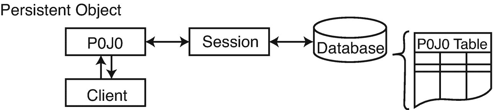
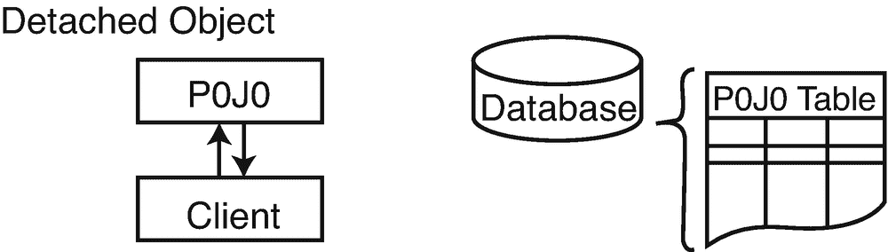

# 4.持久性生命周期

在本章中，我们将讨论 Hibernate 中持久对象的生命周期。这些持久对象可以是 POJOs，不需要任何特殊的标记接口或与 Hibernate 相关的继承。Hibernate 受欢迎的部分原因是它能够使用普通的对象模型。

我们还将介绍一些用于从 Hibernate 创建、检索、更新和删除持久对象的`Session`接口的方法。

## 生命周期介绍

将 Hibernate 添加到应用之后，您不需要更改现有的 Java 对象模型来添加持久标记接口或任何其他类型的 Hibernate 提示。相反，Hibernate 处理应用用`new`操作符创建的普通 Java 对象或其他对象创建的普通 Java 对象。

出于 Hibernate 的目的，这些可以分为两类:Hibernate 有实体映射的对象和 Hibernate 不能直接识别的对象。正确映射的实体对象将由被映射的字段和属性组成，这些字段和属性本身或者是对正确映射的实体的引用，或者是对这些实体的集合的引用，或者是“值”类型(原语、原语包装、字符串或它们的数组)。

给定一个映射到 Hibernate 的对象实例，它可以处于四种不同状态中的任何一种:暂时、持久、分离或删除。 <sup>[1](#Fn1)</sup>

*短暂的*对象只存在于内存中。Hibernate 不管理瞬态对象，也不保存对瞬态对象的更改。如果你有一个`Person` POJO，并且你用`new Person()`创建了一个实例，那么这个对象就是*瞬态*，并且只要它处于*瞬态*状态，就不期望它以某种方式在数据库中被表示出来。

要持久化对瞬态对象的更改，您必须请求会话将瞬态对象保存到数据库，这时 Hibernate 会给对象分配一个标识符，并将对象标记为处于*持久*状态。

持久对象存在于数据库中，Hibernate 管理持久对象的持久性。我们在图 [4-1](#Fig1) 中展示了对象和数据库之间的关系。如果持久性对象的字段或属性发生了变化，Hibernate 会在应用将这些变化标记为已提交时保持数据库表示的最新状态。



图 4-1

*持久对象* *由休眠*维护

*分离的*对象在数据库中有表示，但对对象的更改不会反映在数据库中，反之亦然。对象和数据库的暂时分离如图 [4-2](#Fig2) 所示。分离的对象可以通过关闭与它相关联的会话来创建，或者通过调用会话的`evict()`方法将其从会话中逐出来创建。

考虑分离实体的一个原因是从数据库中读取一个对象，在内存中修改该对象的属性，然后将结果存储在数据库之外的某个地方。这将是对对象进行深层复制的一种替代方法。



图 4-2

分离的对象存在于数据库中，不受 Hibernate 维护

为了持久保存对分离对象所做的更改，应用必须将其重新附加到有效的 Hibernate 会话。当您的应用调用新会话上的`load()`、`refresh()`、`merge()`、`update()`或`save()`方法之一并引用分离的对象时，分离的实例可以与新的 Hibernate 会话相关联。调用后，分离的对象将是由新的 Hibernate 会话管理的持久对象。

*移除的*对象是由 Hibernate 管理的对象(换句话说，是持久对象),它们已经被传递给会话的`remove()`方法。当应用将会话中保存的更改标记为已提交时，数据库中对应于已删除对象的条目将被删除。

Hibernate 3 之前的版本支持生命周期和可验证的接口。这些允许您的对象使用对象上的方法监听保存、更新、删除、加载和验证事件。在 Hibernate 3 中，这个函数移到了事件和拦截器中，旧的接口被移除了。从 Hibernate 4 开始，还支持 JPA 持久性生命周期，因此可以将事件嵌入到对象中，并用注释进行标记。

## 实体、类和名称

实体用映射表示 Java 对象，映射允许它们存储在数据库中。映射指示对象的字段和属性应该如何存储在数据库表中。但是，您可能希望特定类型的对象在数据库中以两种不同的方式表示。例如，您可以为用户创建一个 Java 类，但是在数据库中有两个不同的表来存储用户。这可能不是最好的数据库设计，但类似的问题在遗留系统中很常见。其他不容易修改的系统可能依赖于现有的数据库设计，Hibernate 足够强大，可以覆盖这种场景。在这种情况下，Hibernate 如何选择使用哪个？

代表实体的对象将是一个普通的 Java 类。它还将有一个实体名称。默认情况下，实体的名称将与类类型的名称相同。 <sup>[2](#Fn2)</sup> 但是，您可以选择通过映射或注释来改变这一点，从而区分映射到不同表的相同类型的对象。因此，`Session` API 中有一些方法需要提供一个实体名称来确定适当的映射。如果省略了这一点，要么是因为不需要这种区分，要么是因为为了方便起见，该方法假设了最常见的情况——实体名称与类名相同——并复制了另一个更具体的方法的功能，该方法允许显式指定实体名称。

## 标识符

标识符或标识列映射到关系数据库中主键的概念。主键是一个或多个列的唯一集合，可用于指定特定的数据集合。

有两种标识符:自然的和人工的。

一个*自然*标识符是应用认为有意义的东西——例如，一个用户 ID，或者一个社会安全号码 <sup>[3](#Fn3)</sup> 或者等同物。

*人工*标识符的值是任意的。到目前为止，我们的代码使用数据库生成的值(标识列)，这些值与该标识符关联的数据没有任何关系。这倾向于在关联和其他这样的交互方面产生更大的灵活性，因为在许多情况下，人工标识符可以比自然标识符小。

为什么人工标识符会比自然标识符更好？嗯，有几个可能的原因。人工标识符可能比自然标识符更好的一个原因是，人工标识符可能是比自然标识符更小的类型(在内存中)。

考虑一封用户电子邮件。在大多数情况下，用户的电子邮件地址不会改变，对于给定的用户来说，它们往往是唯一的；然而，电子邮件地址可能至少有 20 个字节长 <sup>[4](#Fn4)</sup> (也可能更长)。整数用户 ID(long 或 int)的长度可能是 4 或 8 个字节，不会更长。

另一个更有说服力的原因是，人工标识符不会随着数据的自然生命周期而改变。例如，电子邮件地址可能会随着时间而改变；有人可能会放弃旧的电子邮件地址，而选择一个新的。任何依赖该电子邮件地址作为自然标识符的东西都必须被同步改变以允许更新。

还有一个原因是人工标识符很简单。数据库(和 Hibernate)允许使用复合标识符——由一个对象的多个属性构建的标识符。然而，这意味着当您引用数据库中的一个特定对象或行时，您必须将所有列包含在标识符中，无论是作为嵌入对象还是作为一组单独的列。这当然是可行的；一些数据模型需要它(例如，由于遗留或其他业务原因)。然而，出于效率的考虑，大多数人通常更喜欢人工密钥。

在 Hibernate 中，对象属性用@Id 注释标记为标识符，如清单 [4-1](#PC1) 所示。

```java
@Id
public Long id;

Listing 4-1A Typical Identifier Field

```

在清单 [4-1](#PC1) 中，您会看到一个`Long`——H2 的“大整数”——它被标记为一个大概的人工标识符。需要先分配该值，然后才能持久保存具有该属性的对象。

不过，在我们目前的示例代码中，我们没有手动分配标识符。我们使用了另一个注释`@GeneratedValue`，它告诉 Hibernate 它负责分配和维护标识符。发生这种情况的机制很大程度上取决于 Hibernate 配置和使用的数据库。

你可能已经错过了，但是`@Id`并不意味着一个标识符被自动分配。如果您不想自己分配标识符值，您必须使用一个`@GeneratedValue`注释！

有五种不同的生成可能性:标识、序列、表、自动和无。身份生成依赖于自然的表排序。这是通过使用`GenerationType.IDENTITY`选项在`@GeneratedValue`注释中请求的，如清单 [4-2](#PC2) 所示。

```java
@Id
@GeneratedValue(strategy=GenerationType.IDENTITY)
public Long id;

Listing 4-2An Autogenerated Identity Field

```

身份生成非常方便，使用起来感觉非常自然。但是，在知道标识符之前，它需要将数据实际插入数据库，并且使用`IDENTITY`禁用插入的 JDBC 批处理(同样，因为在插入行的之后*检测到标识符)。Hibernate 文档建议使用其他的生成策略，这一点毋庸置疑。*

*序列*机制依赖于数据库创建表序列的能力(这倾向于将其限制在 PostgreSQL、Oracle 和其他一些数据库)。对应的是`GenerationType.SEQUENCE`策略。

*表*机制使用一个表，其目的是存储人工标识符块；您可以让 Hibernate 为您生成，或者您可以用一个附加的@TableGenerator 注释来指定表的所有细节。要通过表使用人工密钥生成，请使用`GenerationType.TABLE`策略。

第四种人工密钥生成策略是*自动*，它通常映射到`IDENTITY`策略，但是依赖于所讨论的数据库。(它应该默认为对所讨论的数据库有效的东西。)要使用这个，使用`GenerationType.AUTO`策略。

第五种策略实际上根本不是策略:它依赖于手动分配标识符。如果用一个空的标识符调用`Session.persist()`,就会抛出一个`IdentifierGenerationException`。

## 实体和协会

实体可以包含对其他实体的引用，可以直接作为嵌入的属性或字段，也可以通过某种集合(数组、集合、列表等)间接引用。).这些关联使用基础表中的外键关系来表示。这些外键将依赖于参与表所使用的标识符，这是更喜欢小(和人工)键的另一个原因。

当实体对中只有一个实体包含对另一个实体的引用时，关联是*单向的*。如果关联是相互的，那么它被称为是*双向的*。

设计实体模型时的一个常见错误是试图使所有关联都是双向的。不属于对象模型自然组成部分的关联不应该被强制加入其中。Hibernate 查询语言通常提供了一种更自然的方式来访问相同的信息。

在关联中，其中一个(且只有一个)参与类被称为“管理关系”如果关联的两端都管理关系，那么当客户端代码在关联的两端都调用适当的 set 方法时，我们就会遇到问题。应该维护两个外键列——每个方向一个(存在循环依赖的风险)——还是只维护一个？

理想情况下，我们希望规定只有对关系一端的更改才会导致对外键的任何更新；事实上，Hibernate 允许我们通过将关联的一端标记为由另一端管理(由关联注释的`mappedBy`属性标记)来做到这一点。

`mappedBy`纯粹是关于如何保存实体之间的外键关系。这与拯救实体本身无关。尽管如此，它们经常与完全正交的级联功能相混淆(在本章的“级联操作”一节中描述)。

虽然 Hibernate 允许我们指定对一个关联的更改将导致对数据库的更改，但是它不允许我们将对关联一端的更改自动反映到 Java POJOs 的另一端。

让我们来看看一些代码。这是第四章[T2 的`pom.xml`，来自这本书的源代码；这不是特别有启发性，因为它很大程度上是其他章节的项目模型的直接复制，但它是很好的彻底。](04.html)

```java
<?xml version="1.0" encoding="UTF-8"?>
<project xmlns:xsi="http://www.w3.org/2001/XMLSchema-instance"
         xmlns:="http://maven.apache.org/POM/4.0.0"
         xsi:schemaLocation="http://maven.apache.org/POM/4.0.0
         http://maven.apache.org/xsd/maven-4.0.0.xsd">
    <parent>
        <artifactId>hibernate-6-parent</artifactId>
        <groupId>com.autumncode.books.hibernate</groupId>
        <version>5.0</version>
    </parent>

    <modelVersion>4.0.0</modelVersion>
    <artifactId>chapter04</artifactId>

    <dependencies>
        <dependency>
            <groupId>com.autumncode.books.hibernate</groupId>
            <artifactId>util</artifactId>
            <version>${project.version}</version>
        </dependency>
    </dependencies>
</project>

Listing 4-3pom.xml

```

让我们在`chapter04.broken`包中创建一个例子，一个`Message`和一个`Email`关联，没有“拥有对象”首先是`Message`类，如清单 [4-4](#PC4) 所示。

```java
package chapter04.broken;

import javax.persistence.*;

@Entity
public class Message {
  @Id
  @GeneratedValue(strategy = GenerationType.AUTO)
  Long id;

  @Column
  String content;

  @OneToOne
  Email email;

  public Message() {
  }

  public Message(String content) {
    setContent(content);
  }

  // accessors and mutators ignored for brevity

  @Override
  public String toString() {
    // note use of email.subject because otherwise properly constructed
    // relationships would cause an endless loop that never ends
    // and therefore runs endlessly.
    return String.format(
        "Message{id=%d, content='%s', email.subject='%s'}",
        id,
        content,
        (email != null ? email.getSubject() : "null")
    );
  }
}

Listing 4-4A Broken Model, Beginning with Message

```

清单 [4-5](#PC5) 是`Email`级。

```java
package chapter04.broken;

import javax.persistence.*;

@Entity
public class Email {
  @Id
  @GeneratedValue(strategy = GenerationType.AUTO)
  Long id;
  @Column
  String subject;
  @OneToOne
  // (mappedBy = "email")
  Message message;

  public Email() {
  }

  public Email(String subject) {
    setSubject(subject);
  }

  // accessors and mutators ignored for brevity

  @Override
  public String toString() {
    // note use of message.content because otherwise properly constructed
    // relationships would cause an endless loop that never ends
    // and therefore runs endlessly.
    return String.format(
        "Email{id=%s, subject=`%s`, message.content=%s}",
        id,
        subject,
        (message != null ? message.getContent() : "null")
    );
  }
}

Listing 4-5A Broken Model’s Email Class

```

对于这些类，没有“拥有关系”；电子邮件中的`mappedBy`属性被注释掉。这意味着我们需要更新电子邮件和信息，以使我们的关系在两个方向上正确建模。先看完整的`chapter04.broken.BrokenInversionTest`类，看到源码后再分解。

```java
package chapter04.broken;

import com.autumncode.hibernate.util.SessionUtil;
import org.hibernate.Session;
import org.hibernate.Transaction;
import org.testng.annotations.Test;

import static org.testng.Assert.*;

public class BrokenInversionTest {
  @Test()
  public void testBrokenInversionCode() {
    Long emailId;
    Long messageId;
    Email email;
    Message message;

    try (Session session = SessionUtil.getSession()) {
      Transaction tx = session.beginTransaction();

      email = new Email("Broken");
      message = new Message("Broken");

      email.setMessage(message);
      // message.setEmail(email);

      session.save(email);
      session.save(message);

      emailId = email.getId();
      messageId = message.getId();

      tx.commit();
    }

    assertNotNull(email.getMessage());
    assertNull(message.getEmail());

    try (Session session = SessionUtil.getSession()) {
      email = session.get(Email.class, emailId);
      System.out.println(email);
      message = session.get(Message.class, messageId);
      System.out.println(message);
    }

    assertNotNull(email.getMessage());
    assertNull(message.getEmail());
  }
}

Listing 4-6src/main/java/chapter04/broken/BrokenInversionTest.java

```

对`message.getEmail()`的最后一次调用将返回`null`(假设使用了简单的访问器和赋值器)。为了获得想要的效果，两个实体都必须更新。如果`Email`实体拥有关联，这仅仅确保外键列值的正确赋值。没有`message.setEmail(email)`的*没有*的隐式调用。这必须显式给出，如清单 [4-7](#PC7) 所示。

```java
package chapter04.broken;

import com.autumncode.hibernate.util.SessionUtil;
import org.hibernate.Session;
import org.hibernate.Transaction;
import org.testng.annotations.Test;

import static org.testng.Assert.assertNotNull;

public class ProperSimpleInversionTest {
  @Test
  public void testProperSimpleInversionCode() {
    Long emailId;
    Long messageId;
    Email email;
    Message message;

    try (Session session = SessionUtil.getSession()) {
      Transaction tx = session.beginTransaction();

      email = new Email("Proper");
      message = new Message("Proper");

      email.setMessage(message);
      message.setEmail(email);

      session.save(email);
      session.save(message);

      emailId = email.getId();
      messageId = message.getId();

      tx.commit();
    }

    assertNotNull(email.getMessage());
    assertNotNull(message.getEmail());

    try (Session session = SessionUtil.getSession()) {
      email = session.get(Email.class, emailId);
      System.out.println(email);
      message = session.get(Message.class, messageId);
      System.out.println(message);
    }

    assertNotNull(email.getMessage());
    assertNotNull(message.getEmail());
  }
}

Listing 4-7src/main/java/chapter04/broken/ProperSimpleInversionTest.java

```

最后一个断言是`assertNotNull()`，在`BrokenInversionTest`中是`assertNull()`。

对于刚接触 Hibernate 的用户来说，对这一点感到困惑是很常见的。发生这种情况的原因是 Hibernate 正在使用实体的实际当前状态。在`BrokenInversionTest.java`中，当您在电子邮件中设置消息，而不是在消息中设置电子邮件时，Hibernate 在对象模型中保存实际的关系，而不是试图推断一个关系，即使该关系是预期的。额外的关系将是一个意想不到的副作用，即使它在这种特殊情况下可能是有用的。

如果我们包括映射(mappedBy 属性)，我们会得到不同的结果。我们将修改`Message`(通过将它移动到一个新的包中，`chapter04.mapped`)和`Email`(通过移动它并包含前面清单中注释掉的`mappedBy`属性)。

除了包和实体名(这意味着 Hibernate 将使用“Message2”作为该类型的表名)，代码与“破损”版本相同，如清单 [4-8](#PC8) 所示。

```java
package chapter04.mapped;

import javax.persistence.*;

@Entity(name = "Message2")
public class Message {
  @Id
  @GeneratedValue(strategy = GenerationType.AUTO)
  Long id;

  @Column
  String content;

  @OneToOne
  Email email;

  public Message() {
  }

  public Message(String content) {
    setContent(content);
  }

  // accessors and mutators omitted

  @Override
  public String toString() {
    // note use of email.subject because otherwise properly constructed
    // relationships would cause an endless loop that never ends
    // and therefore runs endlessly.
    return String.format(
        "Message{id=%d, content='%s', email.subject='%s'}",
        id,
        content,
        (email != null ? email.getSubject() : "null")
    );
  }
}

Listing 4-8src/main/java/chapter04/mapped/Message.java

```

`Email`代码除了更改实体名称和包之外，还添加了`mappedBy`属性。这实际上给`Message`数据库表示添加了一列，表示电子邮件 ID。参见清单 [4-9](#PC9) 。

```java
package chapter04.mapped;

import javax.persistence.*;

@Entity(name = "Email2")
public class Email {
  @Id
  @GeneratedValue(strategy = GenerationType.AUTO)
  Long id;
  @Column
  String subject;
  @OneToOne(mappedBy = "email")
  Message message;

  public Email() {
  }

  public Email(String subject) {
    setSubject(subject);
  }

  // accessors and mutators omitted

  @Override
  public String toString() {
    // note use of message.content because otherwise properly constructed
    // relationships would cause an endless loop that never ends
    // and therefore runs endlessly.
    return String.format(
        "Email{id=%s, subject=`%s`, message.content=%s}",
        id,
        subject,
        (message != null ? message.getContent() : "null")
    );
  }
}

Listing 4-9src/main/java/chapter04/mapped/Email.java

```

使用`Message`中包含的映射，会有一些意想不到的结果。我们之前的测试无法重新建立一些关系，需要在`Email`和`Message`中设置它们。这里，我们有几乎相同的构造，但是没有相同的结果:我们只需要设置关系的一边，而不是手动维护两个引用。

首先我们来看测试代码，如清单 [4-10](#PC10) 所示；注意，这个测试使用了`chapter04.mapped`包，所以它得到了我们刚刚看到的`Email`和`Message`类。

```java
package chapter04.mapped;

import com.autumncode.hibernate.util.SessionUtil;
import org.hibernate.Session;
import org.hibernate.Transaction;
import org.testng.annotations.Test;

import static org.testng.Assert.*;
import static org.testng.Assert.assertNotNull;

public class ImplicitRelationshipTest {
  @Test
  public void testImpliedRelationship() {
    Long emailId;
    Long messageId;
    Email email;
    Message message;

    try (Session session = SessionUtil.getSession()) {
      Transaction tx = session.beginTransaction();

      email = new Email("Inverse Email");
      message = new Message("Inverse Message");

      // email.setMessage(message);
      message.setEmail(email);

      session.save(email);
      session.save(message);

      emailId = email.getId();
      messageId = message.getId();

      tx.commit();
    }

    assertEquals(email.getSubject(), "Inverse Email");
    assertEquals(message.getContent(), "Inverse Message");
    assertNull(email.getMessage());
    assertNotNull(message.getEmail());

    try (Session session = SessionUtil.getSession()) {
      email = session.get(Email.class, emailId);
      System.out.println(email);
      message = session.get(Message.class, messageId);
      System.out.println(message);
    }

    assertNotNull(email.getMessage());
    assertNotNull(message.getEmail());
  }
}

Listing 4-10src/test/java/chapter04/mapped/ImplicitRelationshipTest.java

```

这个测试通过了，尽管我们没有设置`Email's Message`。

那个`mappingBy`属性就是原因。在数据库中，`Message2`表将有一个名为“email_id”的列，当我们更新`Message's email`属性时，它被设置为`Email's`的唯一标识符。当我们关闭会话并重新加载时，仅通过该列设置关系，这意味着关系设置“正确”,即使我们在第一次创建数据时没有正确创建关系。

如果我们要管理`Email`实体中的关系(即，在`Message.java`中设置`mappedBy`属性，而不是`Email.java`，情况将会相反:设置`Message's email`属性不会反映在数据库中，但是设置`Email's message`属性会。

以下是对这些观点的总结:

1.  您必须显式管理关联的两端。

2.  只有对关联所有者的更改才会在数据库中生效。

3.  当您从数据库加载一个分离的实体时，它将反映数据库中持久化的外键关系。

表 [4-1](#Tab1) 显示了如何选择应该成为双向关联所有者的关系方。请记住，要使关联成为所有者，您必须将另一端标记为由另一端映射。

表 4-1

标记关联的所有者

<colgroup><col class="tcol1 align-left"> <col class="tcol2 align-left"></colgroup> 
| 一对一 | 任何一端都可以成为所有者，但其中一个(且只有一个)应该成为所有者；如果不指定这一点，将会导致循环依赖。 |
| 一对多 | “一”端必须成为关联的所有者。 |
| 多对一 | 从相反的角度来看，这与一对多关系相同，因此同样的规则也适用:多端必须成为关联的所有者。 |
| 多对多 | 关联的任何一端都可以成为所有者。 |

如果这一切看起来相当混乱，请记住关联所有权只与数据库中的外键管理有关，随着您进一步使用 Hibernate，事情会变得更加清楚。关联和映射将在接下来的几章中详细讨论。

## 保存实体

创建用 Hibernate 映射映射的类的实例不会自动将对象保存到数据库中。在您显式地将对象与有效的 Hibernate 会话相关联之前，该对象是暂时的*，就像任何其他 Java 对象一样。在 Hibernate 中，我们使用`save()`或`persist()`中的一个，它是`Session`接口上的`save()`方法的同义词，来在数据库中存储一个瞬态对象，如下所示:*

```java
public Serializable save(Object object)
public Serializable save(String entityName, Object object)

```

两个`save()`方法都将一个瞬态对象引用(不能是`null`)作为参数。Hibernate 希望为瞬态对象的类找到一个映射(注释或 XML 映射);Hibernate 不能 <sup>[6](#Fn6)</sup> 持久化任意未映射的对象。如果已经将多个实体映射到一个 Java 类，那么可以用`entityName`参数指定要保存哪个实体(Hibernate 不会只知道 Java 类名)。

这些`save()`方法都创建一个新的`org.hibernate.event.spi.SaveOrUpdateEvent`事件。事件是 Hibernate 中相当高级的主题，大多数读者不需要，但是感兴趣的读者可以在 Hibernate 6 文档的“事件”一章的 [`https://red.ht/3iGN7tZ`](https://red.ht/3iGN7tZ) 阅读更多内容。

最简单的方法是，我们用 Java 创建一个新对象，设置它的一些属性，然后通过会话保存它。这里有一个简单的对象，如清单 [4-11](#PC12) 所示。

```java
package chapter04.model;

import javax.persistence.*;

@Entity
public class SimpleObject {
  @Id
  @GeneratedValue(strategy = GenerationType.AUTO)
  Long id;
  @Column
  String key;
  @Column
  Long value;

  public SimpleObject() {
  }

  // mutators and accessors not included for brevity
  // equals() and hashCode() will be covered later in this chapter
}

Listing 4-11src/main/java/chapter04/model/SimpleObject.java

```

清单 [4-12](#PC13) 展示了如何在`testSaveLoad()`方法中保存这个对象，如`chapter04.general.SaveLoadTest`所示。

```java
package chapter04.general;

import chapter04.model.SimpleObject;
import com.autumncode.hibernate.util.SessionUtil;
import org.hibernate.Session;
import org.hibernate.Transaction;
import org.testng.annotations.Test;

import static org.testng.Assert.*;

public class SaveLoadTest {
  @Test
  public void testSaveLoad() {
    Long id = null;
    SimpleObject obj;

    try (Session session = SessionUtil.getSession()) {
      Transaction tx = session.beginTransaction();

      obj = new SimpleObject();
      obj.setKey("sl");
      obj.setValue(10L);

      session.save(obj);
      assertNotNull(obj.getId());
      // we should have an id now, set by Session.save()
      id = obj.getId();

      tx.commit();
    }

    try (Session session = SessionUtil.getSession()) {
      // we're loading the object by id
      SimpleObject o2 = session.load(SimpleObject.class, id);
      assertEquals(o2.getKey(), "sl");
      assertNotNull(o2.getValue());
      assertEquals(o2.getValue().longValue(), 10L);

      SimpleObject o3 = session.load(SimpleObject.class, id);

      // since o3 and o2 were loaded in the same session, they're not only
      // equivalent - as shown by equals() - but equal, as shown by ==.
      // since obj was NOT loaded in this session, it's equivalent but
      // not ==.
      assertEquals(o2, o3);
      assertEquals(obj, o2);
      assertEquals(obj, o3);

      assertSame(o2, o3);
      assertFalse(o2 == obj);

      assertSame(obj, o3);
      assertFalse(obj == o3);
    }
  }
}

Listing 4-12src/test/java/chapter04/general/SaveLoadTest.java

```

保存已经持久化的对象是不合适的。这样做将更新对象，这实际上将最终创建一个具有新标识符的副本。这可以在`DuplicateSaveTest`，清单 [4-13](#PC14) 中看到。

```java
package chapter04.general;

import chapter04.model.SimpleObject;
import com.autumncode.hibernate.util.SessionUtil;
import org.hibernate.Session;
import org.hibernate.Transaction;
import org.testng.annotations.Test;

import java.util.List;

import static org.testng.Assert.*;

public class DuplicateSaveTest {
  @Test
  public void duplicateSaveTest() {
    Long id;
    SimpleObject obj;

    try (Session session = SessionUtil.getSession()) {
      Transaction tx = session.beginTransaction();

      obj = new SimpleObject();

      obj.setKey("Open Source and Standards");
      obj.setValue(10L);

      session.save(obj);
      assertNotNull(obj.getId());

      id = obj.getId();

      tx.commit();
    }

    try (Session session = SessionUtil.getSession()) {
      Transaction tx = session.beginTransaction();

      obj.setValue(12L);

      // this is not good behavior!
      session.save(obj);

      tx.commit();
    }

    // note that save() creates a new row in the database!
    // this is wrong behavior. Don't do this!
    assertNotEquals(id, obj.getId());

    try (Session session = SessionUtil.getSession()) {
      List<SimpleObject> objects=session
          .createQuery("from SimpleObject", SimpleObject.class)
          .list();

      // again, this is a value we DO NOT WANT.
      assertEquals(objects.size(), 2);
    }
  }
}

Listing 4-13src/test/java/chapter04/general/DuplicateSaveTest.java

```

当这个测试运行时，两个标识符应该是相等的，但是它们不是；检查这些值产生了等效的对象，除了 id，它们是按指定的`SimpleObject @Id`代顺序分配的。

但是，您可以用`Session.saveOrUpdate()`(当然也可以用`Session.update()`)更新一个对象。

如果对象不存在，`saveOrUpdate()`会调用`save()`，而`update()`不会；如果您的目标是确保数据库中存在一个对象，那么`saveOrUpdate()`会稍微安全一些；`update()`如果数据库中不存在该对象，将会失败并出现异常。例如，如果您试图更新订单发票，这将是合适的；如果它还不存在，您不会想要创建一个。

清单 [4-14](#PC15) 显示了另一个类`SaveOrUpdateTest`。

```java
package chapter04.general;

import chapter04.model.SimpleObject;
import com.autumncode.hibernate.util.SessionUtil;
import org.hibernate.Session;
import org.hibernate.Transaction;
import org.testng.annotations.Test;

import java.util.List;

import static org.testng.Assert.*;

public class SaveOrUpdateTest {
  @Test
  public void testSaveOrUpdateEntity() {
    Long id;
    SimpleObject obj;
    try (Session session=SessionUtil.getSession()) {
      Transaction tx = session.beginTransaction();
      // this only works for simple objects
      session
          .createQuery("delete from SimpleObject")
          .executeUpdate();
      tx.commit();
    }

    try (Session session = SessionUtil.getSession()) {
      Transaction tx = session.beginTransaction();

      obj = new SimpleObject();

      obj.setKey("Open Source and Standards");
      obj.setValue(14L);

      session.save(obj);
      assertNotNull(obj.getId());

      id = obj.getId();

      tx.commit();
    }

    try (Session session = SessionUtil.getSession()) {
      Transaction tx = session.beginTransaction();

      obj.setValue(12L);

      // if the key didn't exist in the database,
      // it would after this call.
      session.saveOrUpdate(obj);

      tx.commit();
    }

    // saveOrUpdate() will update a row in the database
    // if one matches. This is what one usually expects.
    assertEquals(id, obj.getId());

    try (Session session = SessionUtil.getSession()) {
      List<SimpleObject> objects=session
          .createQuery("from SimpleObject", SimpleObject.class)
          .list();

      assertEquals(objects.size(), 1);
    }
  }
}

Listing 4-14src/test/java/chapter04/general/SaveOrUpdateTest.java

```

在生产代码中尝试匹配这种代码结构是不明智的。

对象从瞬时状态(创建时)变为持久状态(第一次保存时)，然后返回瞬时状态(会话关闭时)。然后，我们在对象处于瞬态时更新它，并在调用`Session.saveOrUpdate()`时将它移回持久状态。

理想情况下，您首先要做的是从会话中加载对象(就像我们在其他大多数显示更新的例子中所做的那样)；这意味着更新发生在持久对象上，我们实际上根本不需要调用`Session.save()`、`Session.update()`或`Session.saveOrUpdate()`。 <sup>[7](#Fn7)</sup> 显式调用更新方法之一不是错误，但也不是必须的。

一旦对象处于持久状态，Hibernate 就会在您更改对象的字段和属性时管理数据库本身的更新。

Hibernate 在跟踪更改方面非常有效，它只跟踪更改过的字段。在正常情况下，如果您有一个有 30 个属性的实体，并且更改了一个，Hibernate 将发出一个相当小的 SQL `UPDATE`来修改数据库记录。

## 对象相等和相同

当我们讨论 Hibernate 中的持久对象时，我们还需要考虑 Hibernate 中对象相等性和身份扮演的角色。当我们在 Hibernate 中有一个持久对象时，这个对象既代表特定 Java 虚拟机(JVM)中的一个类的实例，也代表数据库表中的一行(或多行)。

从同一个 Hibernate 会话再次请求一个持久对象会返回一个类的同一个 Java 实例，这意味着您可以使用标准的 Java `==`等式语法来比较对象。但是，如果您从多个 Hibernate 会话中请求一个持久对象，Hibernate 将从每个会话中提供不同的实例，如果您比较这些对象实例，`==`操作符将返回`false`。

考虑到这一点，如果您在两个不同的会话中比较对象，您将需要在您的 Java 持久性对象上实现`equals()`方法，无论如何您应该经常这样做。(只是别忘了一起实现`hashCode()`。)

实现`equals()`可能会很有趣。Hibernate 将实际的对象包装在代理中(出于各种性能增强的原因，比如按需加载数据)，所以您需要考虑类层次结构的等价性；不要检查实际类型的等效性，而是检查类型是否为*可分配的*或*兼容的*。与实际的字段相比，在你的`equals()`和`hashCode()`方法中使用访问器通常更有效。

大多数 ide 会生成`equals()`和`hashCode()`来使用实例引用本身，而不是访问器。这对于大多数对象来说非常有效，并且是正确的行为；毕竟，访问器通常是返回引用的单行方法。然而，一个访问器没有*有*成为一行方法；它可能会创建一个引用的副本或计算一个值，这两种操作可能会也可能不会很昂贵。但是，在 Hibernate 的情况下，调用访问器也使代理有机会从数据库加载属性(如果它还不存在的话),这在大多数情况下是一个重要且有用的特性。

清单 [4-15](#PC16) 是我们一直在使用的 SimpleObject 实体的`equals()`和`hashCode()`的实现，由 IntelliJ IDEA<sup>T5】8</sup>生成并修改为使用访问器。

```java
package chapter04.model;

import javax.persistence.*;

@Entity
public class SimpleObject {
  @Id
  @GeneratedValue(strategy = GenerationType.AUTO)
  Long id;
  @Column
  String key;
  @Column
  Long value;

  public SimpleObject() {
  }

  // mutators and accessors not included for brevity

  @Override
  public boolean equals(Object o) {
    if (this == o) return true;
    if (!(o instanceof SimpleObject)) return false;

    SimpleObject that = (SimpleObject) o;

    // we prefer the method versions of accessors, because of Hibernate's proxies.
    if (getId() != null
        ? !getId().equals(that.getId())
        : that.getId() != null)
      return false;
    if (getKey() != null
        ? !getKey().equals(that.getKey())
        : that.getKey() != null)
      return false;
    return getValue() != null
        ? getValue().equals(that.getValue())
        : that.getValue() == null;
  }

  @Override
  public int hashCode() {
    int result = getId() != null ? getId().hashCode() : 0;
    result = 31 * result + (getKey() != null ? getKey().hashCode() : 0);
    result = 31 * result + (getValue() != null ? getValue().hashCode() : 0);
    return result;
  }
}

Listing 4-15src/main/java/chapter04/model/SimpleObject.java

```

`TestSaveLoad.java`类展示了等式的各种可能性和条件，如我们前面看到的清单 [4-12](#PC13) 所示。

注意，在该代码中，`o2`和`o3`是*等于*(它们持有相同的引用)，而`o2`和`obj`是*等价的*(引用不同但持有相同的数据)。同样，您不应该在生产代码中依赖这一点；对象等价应该总是用`equals()`来测试。

## 加载实体

Hibernate 的`Session`接口提供了几种从数据库加载实体的`load()`方法。每个`load()`方法都需要对象的主键作为标识符。 <sup>[9](#Fn9)</sup>

除了 ID 之外，Hibernate 还需要知道使用哪个类名或实体名来查找具有该 ID 的对象。如果您没有将类类型传递给`load()`，您还需要将结果转换为正确的类型。基本的`load()`方法如下:

```java
public <T> T load(Class<T> theClass, Object id)
public Object load(String entityName, Object id)
public void load(Object object, Object id)

```

最后一个`load()`方法将一个`Object`作为第一个参数。该对象应该与您想要加载的对象具有相同的类类型，并且应该是空的(即，已构造，但其值对于您的应用来说缺乏意义-例如，考虑使用通过默认构造函数构造的对象)。Hibernate 将使用您请求的对象填充该对象。虽然这类似于 Java 中的其他库调用——即`java.util.List.toArray()`——但这种语法可能没有太大的实际好处。

其他的`load()`方法以锁模式作为参数。 <sup>[10](#Fn10)</sup> 锁模式指定 Hibernate 是否应该在缓存中查找对象，以及 Hibernate 应该对表示该对象的数据行使用哪个数据库锁级别。Hibernate 开发人员声称 Hibernate 通常会为您选择正确的锁模式，尽管我们已经看到手动选择正确的锁非常重要的情况。此外，您的数据库可以选择自己的锁定策略——例如，锁定整个表而不是表中的多行。按照限制最少到限制最多的顺序，您可以使用以下各种锁定模式: <sup>[11](#Fn11)</sup>

*   `NONE`:不使用行级锁定，使用缓存对象(如果可用)；这是休眠默认设置。

*   `READ`:防止其他`SELECT`查询在事务提交之前读取事务中的数据(因此可能是无效的)。

*   `UPGRADE`:使用`SELECT FOR UPDATE` SQL 语法(或等效语法)锁定数据，直到事务完成。(这个其实已经弃用了；用`PESSIMISTIC_WRITE`代替。)

*   `UPGRADE_NOWAIT`:使用`NOWAIT`关键字(对于 Oracle)，如果有另一个线程使用该行，则立即返回错误；否则，这就类似于`UPGRADE`。

*   `UPGRADE_SKIPLOCKED`:跳过已经被其他更新锁定的行的锁定，但在其他方面类似于`UPGRADE`。

*   `OPTIMISTIC`:该模式假设更新不会经历争用。该实体的内容将在接近交易结束时得到验证。

*   `OPTIMISTIC_FORCE_INCREMENT`:这类似于`OPTIMISTIC`，除了它强制对象的版本在接近事务结束时递增。

*   `PESSIMISTIC_READ`和`PESSIMISTIC_WRITE`:这两个都在访问行时立即获得锁。

*   `PESSIMISTIC_FORCE_INCREMENT`:这将在访问行时立即获得锁，并立即更新实体版本。

所有这些锁定模式都是`org.hibernate.LockMode`枚举上的静态字段。(我们将在第 [8](08.html) 章更详细地讨论与事务相关的锁定和死锁。)使用锁定模式的`load()`方法如下:

```java
public <T> T load(Class<T> theClass, Object id, LockMode lockMode)
public Object load(String entityName, Object id, LockMode lockMode)

```

除非你确定对象存在，否则不应该使用`load()`方法。如果您不确定，那么使用`get()`方法之一。如果在数据库中没有找到惟一的 ID，`load()`方法将抛出一个异常，而`get()`方法将仅仅返回一个空引用。

与`load()`非常相似，`get()`方法接受一个标识符和一个实体名或一个类。还有两个`get()`方法将锁定模式作为参数。`get()`方法如下:

```java
public <T> T get(Class<T> entityType, Object id)
public Object get(String entityName, Object id)
public <T> T get(Class<T> entityType, Object id, LockMode lockMode)
public Object get(String entityName, Object id, LockMode lockMode)

```

也有使用`LockOption`的`load`和`get`变体，但是大多数用户最终会指定映射到`LockMode`特性的组合。

如果您需要确定给定对象的实体名称(默认情况下，这与类名相同)，您可以在`Session`接口上调用`getEntityName()`方法，如下所示:

```java
public String getEntityName(Object object)

```

使用`get()`和`load()`方法很简单。例如，通过 web 应用，某人可以为 ID 为 1 的供应商选择一个`Supplier`详细页面 <sup>[12](#Fn12)</sup> 。如果我们不确定供应商是否存在，我们使用`get()`方法来检查是否为空，如下所示:

```java
// get an id from some other Java class, for instance, through a web application
Supplier supplier = session.get(Supplier.class,id);
if (supplier == null) {
    System.out.println("Supplier not found for id " + id);
    return;
}

```

我们还可以从 Hibernate 中检索实体名称，并将其用于`get()`或`load()`方法。如上所述，如果找不到具有该 ID 的对象，`load()`方法将抛出一个异常。

```java
String entityName = session.getEntityName(supplier);
Supplier secondarySupplier = (Supplier) session.load(entityName,id);

```

还值得指出的是，您可以查询实体，这允许您查找具有特定标识符的对象，以及匹配其他标准的对象集。还有一个 Criteria API，允许您使用声明性机制来构建查询。这些主题将在后面的章节中讨论。

## 合并实体

当您希望将分离的实体再次更改为持久状态时，将执行合并，并将分离的实体的更改迁移到(或覆盖)数据库。合并操作的方法签名如下:

```java
Object merge(Object object)
Object merge(String entityName, Object object)

```

合并与`refresh()`相反，它用数据库中的值覆盖分离实体的值。首先，让我们构建一个实用方法(在它自己的类中)来帮助我们验证一个对象的值。

```java
package chapter04.general;

import chapter04.model.SimpleObject;
import com.autumncode.hibernate.util.SessionUtil;
import org.hibernate.Session;

import static org.testng.Assert.assertEquals;

public class ValidateSimpleObject {
  public static SimpleObject validate(
      Long id,
      Long expectedValue,
      String expectedKey) {
    SimpleObject so = null;
    try (Session session = SessionUtil.getSession()) {
      // will throw an Exception if the id isn't found
      // in the database
      so = session.load(SimpleObject.class, id);

      assertEquals(so.getKey(), expectedKey);
      assertEquals(so.getValue(), expectedValue);
    }

    return so;
  }
}

Listing 4-16src/test/java/chapter04/general/ValidateSimpleObject.java

```

现在我们可以看一看`MergeTest`。

```java
package chapter04.general;

import chapter04.model.SimpleObject;
import com.autumncode.hibernate.util.SessionUtil;
import org.hibernate.Session;
import org.hibernate.Transaction;
import org.testng.annotations.Test;

public class MergeTest {
  @Test
  public void testMerge() {
    Long id;
    try (Session session = SessionUtil.getSession()) {
      Transaction tx = session.beginTransaction();

      SimpleObject simpleObject = new SimpleObject();

      simpleObject.setKey("testMerge");
      simpleObject.setValue(1L);

      session.save(simpleObject);

      id = simpleObject.getId();

      tx.commit();
    }

    SimpleObject so = ValidateSimpleObject.validate(id, 1L, "testMerge");

    // the 'so' object is detached here.
    so.setValue(2L);

    try (Session session = SessionUtil.getSession()) {
      // merge is potentially an update, so we need a TX
      Transaction tx = session.beginTransaction();

      session.merge(so);

      tx.commit();
    }

    ValidateSimpleObject.validate(id, 2L, "testMerge");
  }
}

Listing 4-17src/test/java/chapter04/general/MergeTest.java

```

这段代码创建一个实体(a `SimpleObject`)然后保存它；然后它验证对象的值(用来自`ValidateSimpleObject`的`validate()`方法)，这本身返回一个分离的实体。我们更新分离的对象并`merge()`它——它应该更新数据库中写入的值，这是我们验证的。

## 刷新实体

Hibernate 提供了一种机制来刷新持久对象的数据库表示，覆盖内存中对象可能有的值。使用会话接口上的`refresh()`方法之一来刷新持久对象的实例，如下所示:

```java
public void refresh(Object object)
public void refresh(Object object, LockMode lockMode)

```

如上所述，这些方法将从数据库重新加载对象的属性，覆盖它们；因此，`refresh()`是`merge()`的逆。合并用先前瞬态对象的值覆盖数据库，而`refresh()`用数据库中的值覆盖瞬态对象中的值。

Hibernate 通常会很好地为您处理这个问题，所以您不必经常使用`refresh()`方法。然而，也有 Java 对象表示与对象的数据库表示不同步的情况。例如，如果您使用 SQL 来更新数据库，Hibernate 将不会意识到表示发生了变化。但是，您不需要经常使用这种方法。 <sup>[13](#Fn13)</sup> 与`load()`方法类似，`refresh()`方法可以以一个锁模式作为自变量；请参阅上一节“加载实体”中对锁模式的讨论。

让我们看看清单 [4-18](#PC27) 中使用 refresh()的代码——基本上是我们看到的演示`merge()`的代码的逆。

```java
package chapter04.general;

import chapter04.model.SimpleObject;
import com.autumncode.hibernate.util.SessionUtil;
import org.hibernate.Session;
import org.hibernate.Transaction;
import org.testng.annotations.Test;

public class RefreshTest {
  @Test
  public void testRefresh() {
    Long id;
    try (Session session = SessionUtil.getSession()) {
      Transaction tx = session.beginTransaction();

      SimpleObject simpleObject = new SimpleObject();

      simpleObject.setKey("testMerge");
      simpleObject.setValue(1L);

      session.save(simpleObject);

      id = simpleObject.getId();

      tx.commit();
    }

    SimpleObject so = ValidateSimpleObject.validate(id, 1L, "testMerge");

    // the 'so' object is detached here
    so.setValue(2L);

    try (Session session = SessionUtil.getSession()) {
      // note that refresh is a read,
      // so no TX is necessary unless an update occurs later
      session.refresh(so);
    }

    ValidateSimpleObject.validate(id, 1L, "testMerge");
  }
}

Listing 4-18src/test/java/chapter04/general/RefreshTest.java

```

这段代码与`merge()`测试相同，有两处变化:第一处是它调用了`refresh()`而不是`merge()`(惊喜！);另一个是它期望对象的数据从数据库恢复到原始状态，验证`refresh()`覆盖了瞬态对象的数据。

在本书之前的版本中，`merge()`和`refresh()`测试——以及他们使用的`validate()`方法——都在同一个类中。在这里，它们被分开，主要是因为这允许使用完整的源代码清单。

## 更新实体

Hibernate 自动将对持久对象所做的更改保存到数据库中。 <sup>[14](#Fn14)</sup> 如果一个持久对象的属性发生了变化，相关的 Hibernate 会话将使用 SQL 把这个变化排队保存到数据库中。从开发人员的角度来看，您不需要做任何工作来存储这些更改，除非您想强制 Hibernate 提交队列中的所有更改。您还可以确定会话是否是脏的，是否需要提交更改。当您提交 Hibernate 事务时，Hibernate 会为您处理这些细节。

`flush()`方法强制 Hibernate 刷新会话，如下所示:

```java
public void flush() throws HibernateException

```

您可以使用 is dirty()方法确定会话是否脏，如下所示:

```java
public boolean isDirty() throws HibernateException

```

您还可以通过`setHibernateFlushMode()` <sup>[15](#Fn15)</sup> 方法指示 Hibernate 为会话使用刷新模式。`getHibernateFlushMode()`方法返回当前会话的刷新模式，如下所示:

```java
public void setHibernateFlushMode(FlushMode flushMode)
public FlushMode getHibernateFlushMode()

```

可能的冲洗模式如下:

*   `ALWAYS`:每个查询在执行之前都会刷新会话。这会非常慢。

*   `AUTO` : Hibernate 管理查询刷新，保证查询返回的数据是最新的。

*   `COMMIT` : Hibernate 在事务提交时刷新会话。

*   `MANUAL`:您的应用需要使用 flush()方法来管理会话刷新。Hibernate 从不刷新会话本身。

默认情况下，Hibernate 使用`AUTO`刷新模式。通常，您应该使用事务边界来确保进行适当的刷新，而不是试图在适当的时间“手动”刷新。

## 删除实体

为了方便从数据库中删除实体，`Session`接口提供了一个`delete()`方法，如下所示:

```java
public void delete(Object object)
public void delete (String entityName, Object object)

```

这个方法接受一个持久对象作为参数。该参数也可以是一个瞬态对象，其标识符设置为需要擦除的对象的 ID。

在最简单的形式中，您只是删除一个与其他对象没有关联的对象，这很简单；但是许多对象确实与其他对象有关联。为了实现这一点，Hibernate 可以被配置为允许从一个对象到其相关对象的级联删除。

例如，考虑这样一种情况，您有一个包含子对象集合的父对象，您想删除所有子对象。处理这个问题最简单的方法是在 Hibernate 映射中对集合的元素使用 cascade 属性。如果将“级联”属性设置为“删除”或“全部”,删除将级联到所有关联的对象。Hibernate 会帮你删除这些:删除父对象会删除相关的对象。

Hibernate 还支持批量删除，即应用对数据库执行删除 HQL 语句。这对于一次删除多个对象非常有用，因为每个对象不需要为了删除而加载到内存中，如下所示:

```java
session.createQuery("delete from User").executeUpdate();

```

与针对每个实体标识符单独发出`delete()`调用相比，网络流量大大减少，内存需求也大大减少。

批量删除不会导致级联操作的执行。如果需要级联行为，您将需要自己执行适当的删除(就像使用 SQL 一样)或使用会话的`delete()`方法。

## 级联操作

当您在实体上执行本章中描述的操作之一时，这些操作不会在关联的实体上执行，除非您明确地告诉 Hibernate 执行它们。当操作影响关联的实体时，它们被称为“级联”操作，因为操作从一个对象流向另一个对象。

例如，当我们尝试提交事务时，清单 [4-19](#PC33) 中的代码将会失败，因为与`Email`实体相关联的`Message`实体还没有被持久化到数据库中，所以`Email`实体不能在它的表中被准确地表示(用它的外键表示到适当的消息行上)。

```java
try(Session session = SessionUtil.getSession()) {
  Transaction tx=session.beginTransaction();
  Email email = new Email("Email title");
  Message message = new Message("Message content");
  email.setMessage(message);
  message.setEmail(email);
  session.save(email);
  tx.commit();
}

Listing 4-19A Failed save() Due to Cascading

```

理想情况下，我们希望保存操作从电子邮件实体传播到其关联的消息对象。我们通过为实体的属性和字段设置级联操作(或者为整个实体分配一个适当的默认值)来实现这一点。因此，如果至少为电子邮件实体的消息属性设置了`PERSIST`级联操作，清单 [4-19](#PC33) 中的代码将正确执行。Java 持久性 API 支持的级联类型如下:

*   `PERSIST`

*   `MERGE`

*   `REFRESH`

*   `REMOVE`

*   `DETACH`

*   `ALL`

值得指出的是，Hibernate 有自己的级联配置选项， <sup>[16](#Fn16)</sup> 代表了其中的一个超集；然而，我们很大程度上遵循 Java 持久性 API 规范进行建模，因为这通常比特定于 Hibernate 的建模更常见: <sup>[17](#Fn17)</sup>

*   `CascadeType.PERSIST`表示`save()`或`persist()`业务级联到相关实体；对于我们的`Email`和`Message`示例，如果`Email's @OneToOne`注释包含`PERSIST`，保存`Email`也会保存`Message`。

*   `CascadeType.MERGE`表示当所属实体合并时，相关实体合并为托管状态。

*   `CascadeType.REFRESH`对`refresh()`操作做同样的事情。

*   `CascadeType.REMOVE`删除所有实体时，删除与此设置相关的所有相关实体。

*   如果要进行手动分离，则分离所有相关实体。

*   `CascadeType.ALL`是所有级联操作的简写。

级联配置选项接受一组`CascadeType`引用；因此，要在一对一关系的级联操作中仅包括刷新和合并，您可能会看到以下内容:

```java
@OneToOne(cascade={CascadeType.REFRESH, CascadeType.MERGE})
EntityType otherSide;

```

还有一个级联操作不是正常集合的一部分，称为孤儿移除，当一个拥有的对象从其拥有关系中移除时，它会从数据库中移除该拥有的对象。但是，不建议将其用作级联类型；建议使用注释选项`orphanRemoval`，这样`@OneToMany`的注释可能看起来像`OneToMany(orphanRemoval=true)`。

假设我们有一个`Library`实体，它包含一个`Book`实体的列表。这是我们在`Library`和`Book`的列表。

```java
package chapter04.orphan;

import javax.persistence.*;

@Entity
public class Book {
  @Id
  @GeneratedValue(strategy = GenerationType.AUTO)
  Long id;
  @Column
  String title;
  @ManyToOne
  Library library;

  public Book() {
  }

  public Long getId() {
    return id;
  }

  public void setId(Long id) {
    this.id = id;
  }

  public String getTitle() {
    return title;
  }

  public void setTitle(String title) {
    this.title = title;
  }

  public Library getLibrary() {
    return library;
  }

  public void setLibrary(Library library) {
    this.library = library;
  }

}

Listing 4-21src/main/java/chapter04/orphan/Book.java

```

```java
package chapter04.orphan;

import javax.persistence.*;
import java.util.ArrayList;
import java.util.List;

@Entity
public class Library {
  @Id
  @GeneratedValue(strategy = GenerationType.AUTO)
  Long id;
  @Column
  String name;
  @OneToMany(orphanRemoval = true, mappedBy = "library")
  List<Book> books = new ArrayList<>();

  public Library() {
  }

  public Long getId() {
    return id;
  }

  public void setId(Long id) {
    this.id = id;
  }

  public String getName() {
    return name;
  }

  public void setName(String name) {
    this.name = name;
  }

  public List<Book> getBooks() {
    return books;
  }

  public void setBooks(List<Book> books) {
    this.books = books;
  }
}

Listing 4-20src/main/java/chapter04/orphan/Library.java

```

请注意在@OneToMany 注释中使用了 orphanRemoval。现在让我们看一些测试代码，这些代码相当冗长，因为我们需要验证我们的初始数据集，更改它，然后重新验证；参见清单 [4-22](#PC37) 。

```java
package chapter04.orphan;

import com.autumncode.hibernate.util.SessionUtil;
import org.hibernate.Session;
import org.hibernate.Transaction;
import org.hibernate.query.Query;
import org.testng.annotations.Test;

import java.util.List;

import static org.testng.Assert.assertEquals;
import static org.testng.Assert.assertNull;

public class OrphanRemovalTest {
  @Test
  public void orphanRemovalTest() {
    Long id = createLibrary();

    try (Session session = SessionUtil.getSession()) {
      Transaction tx = session.beginTransaction();

      Library library = session.load(Library.class, id);
      assertEquals(library.getBooks().size(), 3);

      library.getBooks().remove(0);
      assertEquals(library.getBooks().size(), 2);

      tx.commit();
    }

    try (Session session = SessionUtil.getSession()) {
      Transaction tx = session.beginTransaction();

      Library l2 = session.load(Library.class, id);
      assertEquals(l2.getBooks().size(), 2);

      Query<Book> query = session
        .createQuery("from Book b", Book.class);
      List<Book> books = query.list();
      assertEquals(books.size(), 2);

      tx.commit();
    }
  }

  @Test
  public void deleteLibrary() {
    Long id = createLibrary();
    try (Session session = SessionUtil.getSession()) {
      Transaction tx = session.beginTransaction();
      Library library = session.load(Library.class, id);
      assertEquals(library.getBooks().size(), 3);
      session.delete(library);
      tx.commit();
    }

    try (Session session = SessionUtil.getSession()) {
      Transaction tx = session.beginTransaction();
      Library library = session.get(Library.class, id);
      assertNull(library);
      List<Book> books=session
        .createQuery("from Book b", Book.class)
        .list();
      assertEquals(books.size(), 0);
    }
  }

  private Long createLibrary() {
    Library library = null;
    try (Session session = SessionUtil.getSession()) {
      Transaction tx = session.beginTransaction();

      library = new Library();
      library.setName("orphanLib");
      session.save(library);

      Book book = new Book();
      book.setLibrary(library);
      book.setTitle("book 1");
      session.save(book);
      library.getBooks().add(book);

      book = new Book();
      book.setLibrary(library);
      book.setTitle("book 2");
      session.save(book);
      library.getBooks().add(book);

      book = new Book();
      book.setLibrary(library);
      book.setTitle("book 3");
      session.save(book);
      library.getBooks().add(book);

      tx.commit();
    }

    return library.getId();
  }
}

Listing 4-22src/test/java/chapter04/orphan/OrphanRemovalTest.java

```

这并不复杂:它构建了一个包含三本书的图书馆。然后，它从数据库加载图书馆，验证它看起来像它应该的那样(“一个有三本书的图书馆”)，并从图书馆中删除一本。它不删除被删除的`Book`实体；它只是将它从图书馆的图书集中删除，从而使它成为孤儿。

在提交了图书馆对象的新状态之后——通过`tx.commit()`——我们从数据库中重新加载图书馆，并验证它现在只有两本书。我们搬走的那本书从图书馆不见了。

但是，这并不意味着它实际上已经被删除了，所以我们然后查询数据库中所有的`Book`实体，看看我们是否有两个或三个。我们应该只有两个，事实也的确如此。更新库时，我们删除了孤立对象。

如果你想让这本书在搬走后*还在，或者被分配到其他图书馆，那么`orphanRemoval`是不正确的；你会希望*这本书能够作为一个孤儿存在。

## 延迟加载、代理和集合包装器

考虑典型的互联网 web 应用:在线商店。这家商店有一份产品目录。在最粗糙的层次上，这可以被建模为管理一系列产品实体的目录实体。在大型商店中，可能有成千上万的产品被分成不同的重叠类别。

当客户访问商店时，必须从数据库中加载目录。我们可能不希望实现将代表成千上万个产品的每个实体都加载到内存中。对于一个足够大的零售商来说，考虑到机器上可用的物理内存量，这甚至是不可能的。即使这是可能的，它也可能会削弱网站的性能。

相反，我们只希望加载目录，也可能加载类别。只有当用户深入到类别中时，才应该从数据库中加载该类别中产品的子集。

为了解决这个问题，Hibernate 提供了一个名为 *lazy loading* 的工具。启用时(这是使用 XML 映射时的默认设置，而不是使用注释时的默认设置，默认设置为*急切加载*，实体的关联实体只有在被直接请求时才会被加载，这可以提供相当可观的性能优势，这是可以想象的。例如，以下代码仅从数据库中加载一个实体:

```java
Email email = session.get(Email.class,new Integer(42));

```

但是，如果访问了类的关联，并且延迟加载生效，则仅在需要时从数据库中提取关联。例如，在下面的代码片段中，关联的消息对象将被加载，因为它被显式引用:

```java
// surely this email is about the meaning of life, the universe, and everything
Email email = session.get(Email.class,new Integer(42));
String text = email.getMessage().getContent();

```

Hibernate 将这种行为强加于您的实体的最简单方法是提供它们的代理实现。 <sup>[18](#Fn18)</sup> Hibernate 通过替换从实体的类中派生的代理来拦截对实体的调用。如果缺少请求的信息，那么在将控制权交给父实体的实现之前，将从数据库中加载该信息。在将关联表示为集合类的情况下，会创建一个包装器(本质上是集合的代理，而不是它所包含的实体的代理)并替换原始集合。

Hibernate 只能通过会话访问数据库。如果当我们试图访问一个还没有加载的关联(通过代理或集合包装器)时，一个实体从会话中分离出来，Hibernate 抛出一个`LazyInitializationException`。解决方法是通过将实体附加到会话来确保实体再次持久化，或者在实体从会话分离之前访问所有需要的字段。

如果您需要确定一个代理、一个持久化集合或者一个属性是否已经被延迟加载，您可以调用`org.hibernate.Hibernate`类上的`isInitialized(Object proxy)`和`isPropertyInitialized(Object proxy, String propertyName)`方法。您还可以通过调用`org.hibernate.Hibernate`类上的`initialize(Object proxy)`方法来强制代理或集合完全填充。如果使用此方法初始化集合，还需要初始化集合中包含的每个对象，因为只有集合保证会被初始化。

## 查询对象

Hibernate 提供了几种不同的方法来查询存储在数据库中的对象。显然，如果您已经知道一个对象的标识符，您可以使用该标识符从数据库中加载它。标准查询 API 是一个 Java API，用于将查询构造为一个对象。HQL 是一种面向对象的查询语言，类似于 SQL，您可以使用它来检索与查询匹配的对象。我们将在第 9 章[和第 10 章](09.html)[中进一步讨论这些问题。如果您有使用 SQL 的遗留应用，或者如果您需要使用 HQL 和条件查询 API 不支持的 SQL 特性，Hibernate 提供了一种直接对数据库执行 SQL(通过“原生查询”)以检索对象的方法。](10.html)

## 摘要

Hibernate 提供了一个简单的 API，用于通过会话接口创建、检索、更新和删除关系数据库中的对象。理解 Hibernate 中瞬时对象、持久对象和分离对象之间的区别，将使您理解对对象的更改如何更新数据库表。

我们已经提到了创建映射的需要，以便将数据库表与您想要持久化的 Java 对象的字段和属性相关联。下一章将详细介绍这些，并讨论为什么需要它们以及它们可以包含什么。

<aside aria-label="Footnotes" class="FootnoteSection" epub:type="footnotes">Footnotes [1](#Fn1_source)

如果这些术语有点熟悉，你可能已经读过第 3 章。

  [2](#Fn2_source)

正如我们在第 [3](03.html) 章看到的，HQL 使用的是实体名，而不是类名；但是因为我们没有指定任何定制的实体名，类名和实体名是相同的。

  [3](#Fn3_source)

美国社会安全管理局表示，他们有足够的社会安全号码来分配“几代人”的唯一身份。(参见 [`www.ssa.gov/history/hfaq.html`](https://www.ssa.gov/history/hfaq.html) ，Q20。)对于自然标识符来说，这可能已经足够好了，尽管隐私倡导者会理所当然地抱怨；另外，请注意“几代人”可能还不够。程序员们绝对肯定，没有人还会有两位数年份的数据…直到 2000 年，花了很多工时来修复。

  [4](#Fn4_source)

在早期的印刷中，这里的数字是“十”但是`”@gmail.com”`有十个字符长，都是它自己。公平地说，担心几十个字节可能是不明智的，但浪费内存也是不明智的。

  [5](#Fn5_source)

例如，你的作者至少有七个“主要电子邮件地址”可供选择。

  [6](#Fn6_source)

更正:Hibernate *不*持久化任意未映射的对象。这是一件好事。

  [7](#Fn7_source)

我们在第三章[中看到 Hibernate 在不调用`save()`的情况下更新一个对象](03.html) : `chapter03.hibernate.RankingTest’s changeRanking()`方法对一个持久对象进行就地更新。

  [8](#Fn8_source)

以防你不知道:IDEA 是 Java 的 IDE。它有一个免费的社区版和一个商业“终极”版。可见于 [`http://jetbrains.com/idea`](http://jetbrains.com/idea) 。

  [9](#Fn9_source)

像往常一样，除了我们在这里讨论的，还有更多内容。随着我们不断了解 Hibernate 的功能，我们将在这个列表中添加更多的方法。为了简单起见，我们保持列表较小。

  [10](#Fn10_source)

也有接受`LockOption`参数的表单，但是`LockMode`表单甚至在 Hibernate 的文档中也被描述为指定锁选项的一种便捷方式。

  [11](#Fn11_source)

在 [`https://docs.jboss.org/hibernate/orm/6.0/javadocs/org/hibernate/LockMode.html`](https://docs.jboss.org/hibernate/orm/6.0/javadocs/org/hibernate/LockMode.html) 可以看到`LockMode`的文档。

  [12](#Fn12_source)

不是这个`java.util.function.Supplier`，而是一个*的商业实体*，名为`Supplier`。

  [13](#Fn13_source)

如果你发现自己经常使用`refresh()`，你可能会想办法消除你不得不使用`refresh()`的原因。并不是说`refresh()`不好，而是它是一种不应该经常使用的纠正措施。

  [14](#Fn14_source)

我们已经几次提到 Hibernate 更新附加到`Session`的对象，以及测试代码。

  [15](#Fn15_source)

为了避免 Java 持久性 API 标准中的定义和含义，`setHibernateFlushMode()`的名称已经从 Hibernate 的早期版本中改变了。

  [16](#Fn16_source)

如果你想看到 Hibernate 的层叠选项的完整列表，请看 [`https://docs.jboss.org/hibernate/orm/6.0/javadocs/org/hibernate/annotations/CascadeType.html`](https://docs.jboss.org/hibernate/orm/6.0/javadocs/org/hibernate/annotations/CascadeType.html) 。

  [17](#Fn17_source)

这就是关于标准的事情:他们是标准的。

  [18](#Fn18_source)

代理是我们在`equals()`和`hashCode()`示例中使用访问器的原因。如果需要的话，使用访问器给代理一个加载信息的机会。

 </aside>*