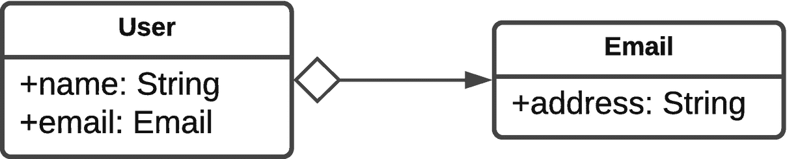
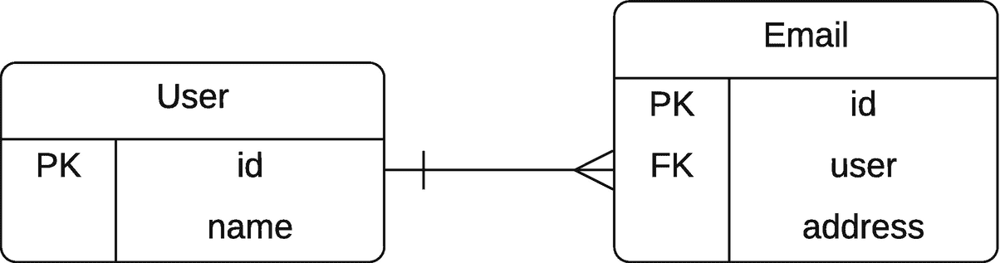
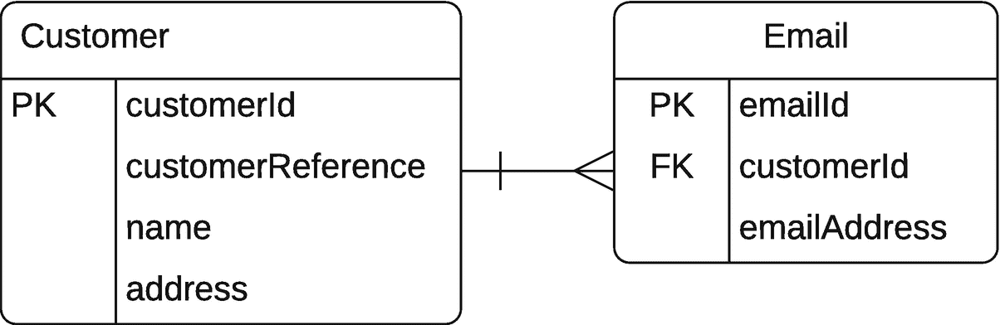

# 五、映射概述

Hibernate 的目的是允许您将数据库视为存储 Java 对象。然而，在实践中，关系数据库不存储对象——它们将数据存储在表和列中。不幸的是，没有简单的方法可以将存储在关系数据库中的数据与 Java 对象表示的数据一致地关联起来。 <sup>[1](#Fn1)</sup>

面向对象的关联和关系的关联之间的区别是根本性的。考虑一个简单的类来表示用户，另一个类来表示电子邮件地址，如图 [5-1](#Fig1) 所示。



图 5-1

简单的实体关系图

这里，`User`对象包含引用`Email`对象的字段。协会有方向；给定一个`User`对象，您可以确定其关联的`Email`对象。比如考虑上市 [5-1](#PC1) 。

```java
User user = getUserSomehow();
Email email = user.email;

Listing 5-1Acquiring the Email Object

from User

```

然而，反之则不然。在数据库中表示这种关系的自然方式，如图 [5-2](#Fig2) 所示，表面上是相似的。



图 5-2

相关的联系

尽管如此，这种联系的方向实际上是相反的。给定一个`Email`行，您可以立即确定它在数据库中属于哪个用户行；这种关系是由外键约束规定的。通过适当使用 SQL，有可能逆转数据库世界中的关系——这是另一个不同之处。

考虑到这两个世界之间的差异，有必要手动干预以确定您的 Java 类应该如何在数据库表中表示。

## 为什么映射不容易实现自动化

为什么不能创建简单的规则来将 Java 对象存储在数据库中，以便可以轻松地检索它们，这并不总是显而易见的。例如，最显而易见的规则是 Java 类必须与单个表相关。例如，图 [5-2](#Fig2) 中定义的`User`类的实例肯定可以用一个简单的表来表示，如清单 [5-2](#PC2) 所示。

```java
public class User {
  String name;
  String password;
}

Listing 5-2A Simple User Class

with a Password

```

确实可以，但一些问题出现了:

*   如果你保存一个用户两次，你会得到多少行？

*   你可以保存一个没有名字的用户吗？

*   允许你保存一个没有密码的用户吗？

当您开始考虑引用其他类的类时，还有一些额外的问题需要考虑。看看清单 [5-3](#PC3) 中显示的客户和电子邮件类。

```java
public class Customer {
  int customerId;
  int customerReference;
  String name;
  Email email;
}

public class Email {
  String address;
}

Listing 5-3Customer and Email Classes

```

基于此，出现了以下问题:

*   唯一客户是通过其客户 ID 还是客户证明来识别的？

*   一个电子邮件地址可以被多个客户使用吗？

*   客户可以有多个电子邮件 ID 吗？

*   客户表中是否应该表示这种关系？

*   是否应该在电子邮件表中表示这种关系？

*   这种关系应该在第三个(链接)表中表示吗？

根据对这些问题的回答，您的数据库表可能会有很大的不同。你可以尝试一个合理的设计，如图 [5-3](#Fig3) 所示，基于你对现实世界中可能发生的情况的直觉。



图 5-3

相关的联系

这里，我们有一个表，其中一个客户有一个假的客户 Id；电子邮件地址只能由一个客户使用，关系由`Email`表维护。

让 JBoss Tools 或 IDEA Ultimate 之类的工具从数据库表中生成 Hibernate 实体是完全可能的(实际上也相当常见),因为工具可以访问实际的数据库结构；工具可以看出`customerId`是`Email`的外键，期望在`Customer`表中有相应的值，并且可以找出合适的名称(列名),这可能是一种惯用的映射。

但是 Hibernate 并不强制要求这些；你可以拥有 Hibernate **可以**映射的多层模式关系，但是一个工具可能会设计得很糟糕。

## 主键

大多数提供 SQL 访问的关系数据库都准备接受没有预定义主键的表。Hibernate 没那么宽容；即使创建的表没有主键，Hibernate 也会要求您指定一个主键。对于熟悉 SQL 和数据库，但不熟悉 ORM 工具的用户来说，这似乎有悖常理。因此，让我们更深入地检查没有主键时出现的问题。

首先，如果没有主键，就不可能(容易地)唯一标识表中的一行。例如，考虑表 [5-1](#Tab1) 。

表 5-1

一种表，其中的行不容易被唯一标识

<colgroup><col class="tcol1 align-left"> <col class="tcol2 align-left"></colgroup> 
| 

用户

 | 

年龄

 |
| --- | --- |
| `dminter` | `35` |
| `dminter` | `40` |
| `dminter` | `55` |
| `dminter` | `40` |
| `jlinwood` | `57` |

该表清楚地包含了关于用户及其各自年龄的信息。然而，有四个用户具有相同的标识符(*戴夫*明特、*丹尼斯*明特、*丹尼尔*明特和*达希尔*明特)。在系统中的其他地方可能有办法区分他们——也许是通过电子邮件地址或用户号码。但是如果你想知道用户 ID 为 32 的 Dashiel Minter 的年龄，就没有办法从表 [5-1](#Tab1) 中获取。

虽然 Hibernate 不允许您省略主键，但是它允许您从一组列中形成主键，形成一个“组合键”例如，表 [5-2](#Tab2) 可以用组合键`usernumber`和`user`来标识。

表 5-2

可能存在复合主键的表

<colgroup><col class="tcol1 align-left"> <col class="tcol2 align-left"> <col class="tcol3 align-left"></colgroup> 
| 

用户

 | 

用户编号

 | 

年龄

 |
| --- | --- | --- |
| `dminter` | `1` | `35` |
| `dminter` | `2` | `40` |
| `dminter` | `3` | `55` |
| `dminter` | `32` | `40` |
| `jlinwood` | `1` | `57` |

`User`和`Usernumber`都不包含唯一的条目，但是它们组合起来唯一地标识了特定用户的年龄，因此它们可以作为主键被 Hibernate 接受。

为什么 Hibernate 需要唯一标识条目，而 SQL 不需要？因为 Hibernate 表示的是 Java 对象，这些对象总是唯一可识别的。新 Java 开发人员犯的经典错误是使用`==`操作符而不是`equals()`方法来比较字符串。您可以区分对代表相同文本的两个 String 对象的引用和对同一`String`对象的两个引用。 <sup>[2](#Fn2)</sup> SQL 没有这样的义务，可以说在某些情况下，放弃进行区分的能力是可取的。

例如，如果 Hibernate 不能用主键唯一地标识一个对象，那么下面的代码在基础表中可能会有几种结果:

```java
String customer = getCustomerFromHibernate("dcminter");
customer.setAge(10);
saveCustomerToHibernate(customer);

```

假设该表最初包含表 [5-3](#Tab3) 中所示的数据。

表 5-3

更新不明确的表

<colgroup><col class="tcol1 align-left"> <col class="tcol2 align-left"></colgroup> 
| 

用户

 | 

年龄

 |
| --- | --- |
| `dminter` | `35` |
| `dminter` | `40` |

结果表中应包含以下哪一项？

*   用户 dcminter 的单行，年龄设置为 10

*   用户的两行，两个年龄都设置为 10 岁

*   用户的两行，一行年龄设置为 10，另一行设置为 40(更新第一个`dminter`记录)

*   用户的两行，一行年龄设置为 10，另一行设置为 30(更新*第二个*T0】记录)

*   用户有三行，一行年龄设置为 10，其他的年龄设置为 35 和 40(总共创建一个新的`dminter`记录)

有很多关于我们虚构的`saveCustomerToHibernate()`在这里做什么的假设，其中一些表面上听起来绝对疯狂…但是这里考虑的想法是，如果我们说“将*记录的年龄*设置为一个给定值”，数据库的状态可能是什么？**

 *简而言之，Hibernate 开发人员决定在创建映射时强制使用主键，这样就不会出现这个问题。Hibernate 确实提供了一些工具，允许您在绝对必要的情况下解决这个问题(您可以创建视图或存储过程来“伪造”适当的键，或者您可以使用传统的 JDBC 来访问表数据)，但是在使用 Hibernate 时，如果可能的话，最好是使用正确指定了主键的表。

## 惰性装载

当您将类从数据库加载到内存中时，您不一定希望所有的信息都被加载。举一个(相当)极端的例子，加载电子邮件列表不应该导致每封电子邮件的全文和附件都被加载到内存中。

首先，电子邮件的全部内容可能需要比实际可用内存更多的内存。

第二，即使电子邮件能够被存储，也可能需要很长时间才能获得所有这些信息。(请记住，数据通常通过网络从数据库进程传输到应用，即使您的网络很快，数据传输仍然需要时间。)

如果您要在 SQL 中解决这个问题，您可能会为查询选择适当字段的子集以获得列表，或者限制数据的范围。以下是选择数据子集的示例:

```java
SELECT from, to, date, subject FROM email WHERE username = 'dcminter';

```

Hibernate 将允许您设计与此非常相似的查询，但它也提供了一种更灵活的方法，称为延迟加载。某些关系可以被标记为“懒惰”，它们不会从数据库中被加载，直到它们被真正需要。

Hibernate 的默认设置是类(包括像`Set`和`List`这样的集合)应该被延迟加载。例如，当从数据库加载下一个清单中给出的 User 类的实例时，加载后立即初始化的字段只有`userId`和`username` : <sup>[3](#Fn3)</sup>

```java
public class User {
   int userId;
   String username;
   EmailAddress emailAddress;
   Set<Role> roles;
}

```

根据这一定义，如果会话仍处于活动状态，那么当访问`emailAddress`和`roles`的适当对象时，将从数据库中加载这些对象。

这只是默认行为；映射可用于指定哪些类和字段应该以这种方式运行。

## 联合

当我们看到为什么映射过程不能自动化时，我们讨论了 Java 中可能看起来像这样的类:

```java
public class Customer {
   int customerId;
   int customerReference;
   String name;
   StreetAddress address;
}
public class StreetAddress {
   String address;
}

```

我们也给出了它所提出的以下五个问题:

*   唯一客户是通过其客户 ID 还是客户证明来识别的？

*   一个给定的电子邮件地址可以被多个客户使用吗？

*   客户表中是否应该表示这种关系？

*   是否应该在电子邮件表中表示这种关系？

*   这种关系应该在第三个(链接)表中表示吗？

第一个问题可以简单回答；这取决于您将哪个列指定为主键。剩下的四个问题是相关的，它们的答案取决于对象关系。此外，如果您的客户类使用集合类或数组来表示与 EmailAddress 的关系，那么一个用户可能会有多个电子邮件地址: <sup>[4](#Fn4)</sup>

```java
public class Customer {
   int customerId;
   int customerReference;
   String name;
   Set<EmailAddress> email;
}

```

所以，你应该再加一个问题:一个客户可以有一个以上的邮箱吗？该集合可能包含单个条目，因此您不能自动推断出这种情况。

先前选项的关键问题如下:

*   Q1:一个电子邮件地址可以属于多个用户吗？

*   Q2:客户可以有一个以上的电子邮件地址吗？

这些问题的答案可以形成一个真值表，如表 [5-4](#Tab4) 所示。

表 5-4

决定实体关系的基数

<colgroup><col class="tcol1 align-left"> <col class="tcol2 align-left"> <col class="tcol3 align-left"></colgroup> 
| 

Q1 回答

 | 

Q2 回答

 | 

`Customer`和`Email`的关系

 |
| --- | --- | --- |
| 不 | 不 | 一对一 |
| 是 | 不 | 多对一 |
| 不 | 是 | 一对多 |
| 是 | 是 | 多对多 |

这是表示对象之间关系的基数 <sup>[5](#Fn5)</sup> 的四种方式。然后，可以用各种方式在映射表中表示每个关系。

## 一对一的联系

类之间的一对一关联可以用多种方式表示。最简单的方法是，在同一个表中维护两个类的属性。例如，用户和电子邮件类之间的一对一关联可以表示为单个表，如表 [5-5](#Tab5) 所示。

表 5-5

一个组合的`User` / `Email`表

<colgroup><col class="tcol1 align-left"> <col class="tcol2 align-left"> <col class="tcol3 align-left"></colgroup> 
| 

身份

 | 

用户名

 | 

电子邮件

 |
| --- | --- | --- |
| `1` | `dminter` | `dminter@example.com` |
| `2` | `jlinwood` | `jlinwood@example.com` |
| `3` | `jbo` | `whackadoodle@example.com` |

或者，实体可以用相同的主键(如此处所示)在不同的表中维护，或者用一个键从一个实体维护到另一个实体，如表 [5-6](#Tab6) 和 [5-7](#Tab7) 所示。

表 5-7

`Email`一对一的牌桌

<colgroup><col class="tcol1 align-left"> <col class="tcol2 align-left"></colgroup> 
| 

身份

 | 

电子邮件

 |
| --- | --- |
| `1` | `dminter@example.com` |
| `2` | `jlinwood@example.com` |
| `3` | `whackadoodle@example.com` |

表 5-6

`User`一对一的牌桌

<colgroup><col class="tcol1 align-left"> <col class="tcol2 align-left"></colgroup> 
| 

身份

 | 

用户名

 |
| --- | --- |
| `1` | `dminter` |
| `2` | `jlinwood` |
| `3` | `jbo` |

可以创建从一个实体到另一个实体的强制外键关系，但是这不应该在两个方向上都应用，因为这样会创建循环依赖。也可以完全省略外键关系，依靠 Hibernate 来管理键的选择和分配。

使用外键关系！如果您的数据集非常非常小，它们可能不会有太大帮助——但在任何真实的数据库环境中，它们可以防止处理数据时出现一些真正令人沮丧的延迟。

如果这两个表不适合共享主键，那么可以维护这两个表之间的外键关系，对外键列应用一个`UNIQUE`约束。例如，重用我们刚刚看到的`User`表，可以适当地填充`Email`表，如表 [5-8](#Tab8) 所示。

表 5-8

与辅助外键一对一的`Email`表

<colgroup><col class="tcol1 align-left"> <col class="tcol2 align-left"> <col class="tcol3 align-left"></colgroup> 
| 

身份

 | 

使用者辩证码

 | 

电子邮件

 |
| --- | --- | --- |
| `34` | `1` | `dminter@example.com` |
| `37` | `2` | `jlinwood@example.com` |
| `639` | `3` | `whackadoodle@example.com` |

这样做的好处是，通过删除外键列上的唯一约束，关联可以很容易地从一对一变为多对一。

## 一对多和多对一关联

一对多关联(或者从另一个类的角度来看，多对一关联)可以简单地用外键来表示，没有额外的约束。

该关系也可以通过使用链接表来维护。这将在每个关联表中维护一个外键，该外键本身将形成链接表的主键。对于多对多的关系，链接表实际上是强制性的，但是对于在关系的一端基数为 1 的关系，当关系的状态没有在对象本身中反映出来时(比如在`List`中某个东西可能在哪里)，或者当对象不应该有对另一个实体的显式引用时，倾向于使用链接表。

表 5-11

在 1:M 关系中连接电子邮件和用户的链接表

<colgroup><col class="tcol1 align-left"> <col class="tcol2 align-left"></colgroup> 
| 

使用者辩证码

 | 

电子邮件 ID

 |
| --- | --- |
| `1` | `1` |
| `1` | `2` |
| `2` | `3` |
| `2` | `4` |

表 5-10

简单的电子邮件表

<colgroup><col class="tcol1 align-left"> <col class="tcol2 align-left"></colgroup> 
| 

身份

 | 

电子邮件

 |
| --- | --- |
| `1` | `dcminter@example.com` |
| `2` | `dave@example.com` |
| `3` | `jlinwood@example.com` |
| `4` | `jeff@example.com` |

表 5-9

一个简单的用户表

<colgroup><col class="tcol1 align-left"> <col class="tcol2 align-left"></colgroup> 
| 

身份

 | 

用户名

 |
| --- | --- |
| `1` | `dcminter` |
| `2` | `jlinwood` |

可以将附加列添加到链接表中，以维护关联中实体的排序信息。

必须将唯一约束应用于关系的“一”方(表 [5-11](#Tab11) 中用户电子邮件表的`UserID`列)；否则，链接表可以表示`User`和`Email`实体之间所有可能关系的集合，这是一个多对多的集合关联。

## 多对多关联

正如上一节末尾所提到的，如果在使用链接表时没有对关系的“一”端应用惟一的约束，那么它就变成了一种有限的多对多关系。可以表示`User`和`Email`的所有可能组合，但是对于同一个用户来说，不可能将同一个电子邮件地址实体关联两次，因为这需要复制复合主键。

如果不是将外键一起用作复合主键，而是给链接表一个自己的主键(通常是一个代理键)，那么两个实体之间的关联就可以转化为完全的多对多关系，如表 [5-12](#Tab12) 所示。

表 5-12

多对多用户/电子邮件链接表

<colgroup><col class="tcol1 align-left"> <col class="tcol2 align-left"> <col class="tcol3 align-left"></colgroup> 
| 

身份

 | 

使用者辩证码

 | 

电子邮件 ID

 |
| --- | --- | --- |
| `1` | `1` | `1` |
| `2` | `1` | `2` |
| `3` | `1` | `3` |
| `4` | `1` | `4` |
| `5` | `2` | `1` |
| `6` | `2` | `2` |

表 [5-12](#Tab12) 可能描述了一种情况，其中用户`dcminter`接收发送到四个地址中任何一个的所有电子邮件，而`jlinwood`只接收发送到他自己账户的电子邮件。(“EmailId”是接收的电子邮件地址，两个用户 Id 都引用编号为 1 和 2 的电子邮件地址；只有`dcminter`有 id 为 3 和 4 的电子邮件地址的参考。)

当链接表有自己独立的主键时，应该考虑这样一种可能性，即需要创建一个新的类来将链接表的内容表示为一个独立的实体。这允许您在链接对象中嵌入一个附加状态(比如“这个电子邮件地址被使用了多少次？”).

## 将映射应用于关联

应用映射来表达在基础表中形成关联的各种不同方式；没有绝对正确的方法来表示它们。 <sup>[6](#Fn6)</sup>

除了基本的方法选择之外，映射还用于指定表表示的细节。虽然 Hibernate 倾向于尽可能使用合理的默认值，但通常最好覆盖这些值。例如，Hibernate 自动生成的外键名实际上是随机的，而有见识的开发人员可以应用一个名称(例如，`FK_USER_EMAIL_LINK`)来帮助在运行时调试违反约束的情况。

## 其他支持的功能

虽然 Hibernate 可以为映射确定许多合理的默认值，但是大多数默认值都可以被基于注释和基于 XML 的 <sup>[7](#Fn7)</sup> 方法中的一种或两种方法覆盖。有些直接应用于映射；其他的，比如外键名，实际上只有在映射用于创建数据库模式时才是相关的。最后，一些映射还可以提供一个配置一些特性的地方，这些特性可能不是最纯粹意义上的“映射”。

除了已经提到的特性之外，本章的最后几节还将讨论 Hibernate 支持的特性。

## (数据库)列类型和大小的规范

Java 提供了基本类型，并允许用户声明接口和类来扩展这些类型。关系数据库通常提供一小部分“标准”类型，然后提供额外的专有类型。

将自己局限于专有类型仍然会导致问题，因为在这些类型和 Java 原语类型之间只有近似的对应关系。

有问题类型的一个典型例子是`java.lang.String`(Hibernate 将其视为原始类型，因为它被频繁使用)，默认情况下，它将被映射到固定大小的字符数据数据库类型。通常，如果选择了一个无限大小的字符字段，数据库的性能会很差，但是冗长的`String`字段会被截断，因为它们被持久化到数据库中。在大多数数据库中，您会选择将一个冗长的`String`字段表示为`TEXT`、`CLOB`或 long `VARCHAR`类型(假设数据库支持特定类型)。这就是 Hibernate 不能为您完成所有映射的原因之一，也是您在创建使用 ORM 的应用时仍然需要理解一些数据库基础知识的原因之一。

通过指定映射细节，开发人员可以在存储空间、性能和对原始 Java 表示的保真度之间做出适当的权衡。

## 继承关系到数据库的映射

没有 SQL 标准来表示表中数据的继承关系；虽然一些数据库实现为此提供了专有的语法，但并不是所有的都这样。Hibernate 提供了几种可配置的方法来表示继承关系，这种映射允许用户为他们的模型选择合适的方法。

## 主关键字

正如本章前面所述(在“主键”一节中)，Hibernate 要求使用主键来标识实体。可以通过配置来选择代理键、从业务数据中选择的键和/或复合主键。

当使用代理键时，Hibernate 还允许从一系列可移植性和效率不同的技术中选择键生成技术。(这显示在第 [4](04.html) 章的“标识符”部分。)

## 使用基于 SQL 公式的属性

有时，希望实体的属性不是作为直接存储在数据库中的数据来维护，而是作为对该数据执行的函数来维护——例如，小计字段不应该由 Java 逻辑直接管理，而是作为其他一些属性的聚合函数来维护。

## 强制性和唯一性约束

除了主键或外键关系的隐式约束，您还可以指定字段不能重复——例如,`username`字段通常应该是唯一的。 <sup>[8](#Fn8)</sup>

字段也可以是强制性的，例如，要求消息实体同时具有主题和消息文本。生成的数据库模式将包含相应的`NOT NULL`和`UNIQUE`约束，因此用无效数据破坏表非常非常困难(相反，如果试图这样做，应用逻辑将抛出异常)。

请注意，主键隐含地既是强制的又是唯一的。

## 摘要

本章概述了为什么需要映射，以及除了这些绝对需求之外，它们还支持哪些特性。它讨论了各种类型的关联，以及在什么情况下您会选择使用它们。下一章着眼于如何指定映射。

<aside aria-label="Footnotes" class="FootnoteSection" epub:type="footnotes">Footnotes [1](#Fn1_source)

如果有简单、一致和准确的方法来关联对象结构和关系数据库，像这样的书可能就不会存在了。

  [2](#Fn2_source)

比较对象的等价性时，使用`equals()`。这就像比较两个门把手:这两个*是互相像*，还是同一个门把手*？`equals()`方法检查它们是否相似。`==`操作员检查它们是否是同一个门把手。*

*  [3](#Fn3_source)

这是有条件的。在我们看到的大多数例子中，大多数列都是通过它们的属性引用直接访问的，不管是什么类型，延迟加载都是很常见的。如有疑问，请具体说明并测试。

  [4](#Fn4_source)

事实上，我们的 ERD 指出一个`Customer`实际上可以有多个电子邮件地址，有鱼尾纹；`Email`表上的“鱼尾纹”表示一对多关系。

  [5](#Fn5_source)

*基数*指的是编号，所以关系中的基数表示每个参与者有多少被关系的任何一方引用。

  [6](#Fn6_source)

事实上，没有完美、正确的方法来概括实体之间的关系，这就是为什么像 Hibernate 这样出色的工具还没有取代优秀的数据库分析师。

  [7](#Fn7_source)

我们实际上没有在 XML 配置上花太多时间，这是有充分理由的:除非绝对必要，否则大多数人不会在现实世界中使用它。它也过于冗长，尤其是与注释相比。

  [8](#Fn8_source)

当你的作者重读“一个`username`字段应该经常是唯一的”时，一个想法出现了:什么时候一个*曾经*希望不是这样？

 *</aside>*