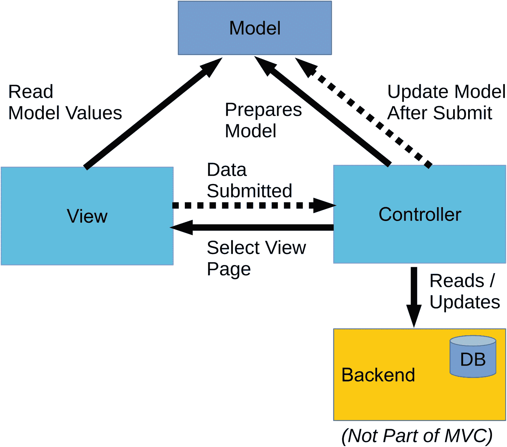
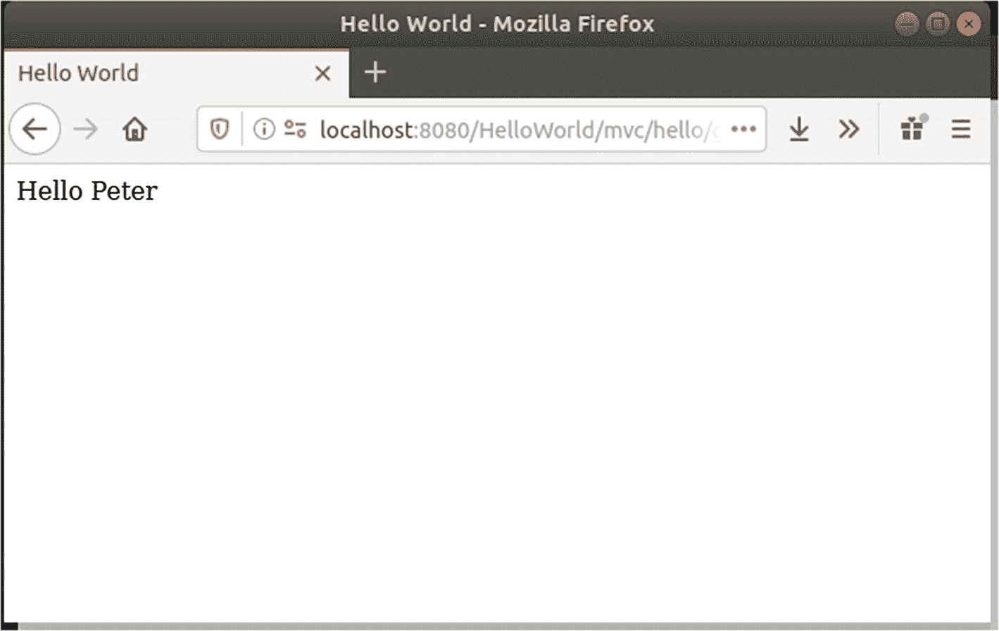
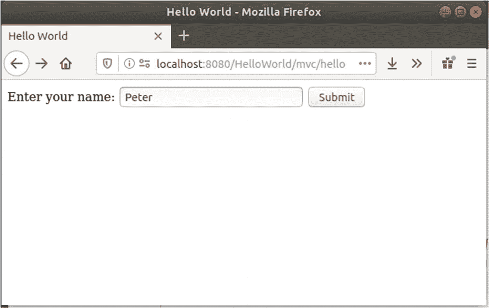

# 一、关于 MVC：模型、视图、控制器

MVC 是一种软件设计模式。它描述了软件分成三个部分:

*   **模型**:管理一个应用的数据。这要从狭义上来理解。当然，不平凡的应用的任何部分都以这样或那样的方式处理应用的数据，但是来自 MVC 的模型对应于对用户可见的数据项，并且可能受到用户交互的改变。该模型与数据呈现给用户或任何应用工作流的方式无关，因此可以说该模型是 MVC 应用的核心部分。毫不奇怪，开发模型是任何 MVC 软件项目的第一步。

*   **视图**:描述数据和控制元素(输入、按钮、复选框、菜单等)向用户的呈现。视图可以提供不同的模式，如分页或非分页表、格式化列表或链接表等等。一个视图也可以使用不同的技术，比如安装在用户 PC 上的 GUI 组件、移动电话上的应用或者要在浏览器中查看的网页。

*   **控制器**:处理用户输入并准备视图部件工作所需的数据集。虽然视图显示了模型项，但是视图永远不需要知道数据是如何存储的，以及如何从一些持久存储(数据库)中检索数据。这是管制员的责任。因为用户输入决定了应用下一步要做什么，所以控制器也包含应用逻辑。任何计算和数据转换都发生在 MVC 的控制部分。

例如，考虑一个读书俱乐部应用。在这种情况下，模型由书籍(包括租赁状态)、书籍存储位置(建筑物、房间或书架)和成员等元素组成。对于搜索应用模块，通常将书籍、用户等列表定义为模型值。

图书俱乐部应用的视图部分将包含显示图书、显示成员、显示图书位置、允许成员租借图书、添加俱乐部成员、显示图书和成员列表以及各种搜索功能等页面。从技术上讲，这通常与模板引擎密切相关，模板引擎定义模型元素的占位符、循环的快捷方式(表格和列表)以及其他视图元素，如菜单和按钮。

控制器处理用户输入的数据。例如，如果视图当前显示书籍的搜索页面，并且用户输入书籍的名称并点击搜索按钮，则控制器被告知哪个按钮被点击。然后，控制器读取请求参数(在本例中是书的名称)和一些可能的模型值(例如，用户名和用户是否登录)，查询数据库，构建结果列表，根据该列表创建模型，最后决定接下来显示哪个视图页面。

在实现细节上存在一些混乱。这来自于视图元素和模型元素之间的数据流的技术细节。MVC 没有假设*何时更新视图元素和模型元素，以及选择哪个过程来保持它们同步。这就是为什么对于 MVC，你会在文献中发现许多不同的图。*

对于 Java MVC，我们可以把我们对 MVC 的想法缩小到以下—一个模型(存储在内存中)定义了应用的状态；视图显示模型值并将用户交互发送到控制器；控制器准备模型数据，处理用户输入并相应地改变模型值，然后决定接下来显示哪个视图页面。这种 MVC 模型如图 [1-1](#Fig1) 所示。



图 1-1

Java MVC 设计模式

## MVC 的历史

MVC 的出现可以追溯到 20 世纪 70 年代。它作为一个编程概念被引入计算机语言 Smalltalk。那时，它还没有名字。直到 20 世纪 80 年代后期，MVC 这个名字才被明确使用。它出现在期刊*物体技术杂志*的一篇文章中。

MVC 稳步地变得越来越广泛，它的思想被如此广泛地采用，以至于从 MVC 演化出了变体。我们不会在本书中讨论这些变体，但有一个简短的列表包括:

*   **PAC(表现-抽象-控制)** **和 HMVC(分层 MVC)** **。**这是 MVC 的一个变种，其中子模块有它们自己的类似 MVC 的结构，只是后来才由它们构造了一个视图页面。

*   **MVA(模型-视图-适配器)** **。**在这种模式中，视图和模型是分离的，只有控制器(在这种情况下称为适配器)在模型和视图之间起中介作用。视图不能直接访问模型值。

*   **MVP(模型-视图-演示者)** **。**在 MVP 中，视图包含通知控制器(在这种情况下称为演示者)视图相关数据变化的逻辑。然后，演示者执行一些活动，并最终回调视图，以便通知用户有关数据更改的信息。

*   **MVVM(模型-视图-视图-模型)** **。**在 MVVM 中，引入了一些自动化，将模型值转换成视图元素，反之亦然。

随着互联网的兴起，MVC 的真正威力在 20 世纪 90 年代显露出来。尽管一些技术细节发生了变化，例如数据流的确切技术特征和数据穿越层边界的时间点，但思想仍然是相同的:模型保存应用状态，视图呈现浏览器页面，控制器处理浏览器和模型之间的交互，并决定显示哪个视图页面。

发明了各种 MVC web 框架； [`https://en.wikipedia.org/wiki/Comparison\_of\_web\_frameworks`](https://en.wikipedia.org/wiki/Comparison/_of/_web/_frameworks) 向您展示了一个全面的列表(在页面上再往下，MVC 功能也被列出)。

## Web 应用中的 MVC

如果我们试图让 Web 应用以 MVC 方式工作，它们会受到一些限制。最重要的区别来自 HTTP 协议的无状态特性，它用于视图(浏览器窗口)和控制器(HTTP 服务器)之间的通信。事实上，web 应用框架处理 HTTP 协议的方式导致了不同 MVC 实现之间的决定性差异。

更详细地说，关于 web 应用的 MVC 的重要问题如下:

*   **会话:**我们已经指出了 HTTP 的无状态本质。因此，如果浏览器发送一个请求，可能是因为用户在一个文本字段中输入了一些字符串，然后按了提交按钮，那么服务器如何知道是哪个用户在执行请求呢？这通常由会话来处理，会话由作为 cookie、请求或 POST 参数传输的会话 ID 来标识。会话由框架透明地处理，因此您不必从应用代码内部创建和维护会话。

*   **从视图中访问模型值:**对于 web 应用，某种模板引擎通常会处理视图生成。在那里，我们可以使用类似于`${user.firstName}`的表达式来读取模型条目的内容。

*   **传输数据范围:**如果从网页向服务器提交数据，我们基本上有两种选择。首先，可以传输完整的表格。第二，只有更改过的数据才能发送到服务器。后者减少了网络流量，但是需要一些脚本逻辑(JavaScript)来在网页上执行数据收集。

*   **更新视图:**对于 web 应用，更新视图的方式至关重要。要么在控制器发出请求后加载整个页面，要么只将网页中实际需要更新的部分从服务器传输到浏览器。同样，后一种方法减少了网络流量。

从这几点可以看出，为 web 应用编写一个 MVC 框架并不是一件非常简单的任务。这也是为什么有大量不同的 MVC 框架可以用于 web 应用。在本书的其余部分，我将向您展示，如果您的 Java 平台需要 MVC 软件，为什么选择 Java MVC 并不是最糟糕的事情。

## 面向 Java 的 MVC

在 Java 生态系统中，一个名为 Struts 的框架在 2000 年左右进入了软件世界。它是一个面向 web 应用的 MVC 框架，集成了 Java EE/Jakarta EE 和 Tomcat(一个归结为 web 功能的服务器产品)。尽管它不是 Java EE/Jakarta EE 规范的一部分，但它已经被用于许多软件项目，并且仍在被使用。相反，Java EE/Jakarta EE 将 JSF (Java Server Faces)命名为专用 web 框架。与 MVC 相反，JSF 使用面向组件的方法来创建 web 应用。

JSF 为任何 Java EE/Jakarta EE 8 或更高版本的产品开箱即用。直到版本 7，如果你想使用 MVC，Struts 是你可以使用的突出框架之一。然而，为了让 Struts 工作，必须向应用添加一个外部库，而且 Struts 总感觉像是一个扩展，而不太像是与 Java EE/Jakarta EE 无缝集成的东西。

在 Java EE 8/Jakarta EE 8 中，MVC 世界以 Java MVC 规范的形式重新进入了游戏。在 Java EE/Jakarta EE 世界中，它仍然是一个二等公民，但是有理由支持 MVC 而不是 JSF。在本章的最后，我们将讨论 MVC 相对于其他框架如 JSF 的优缺点。

## 最后，Java MVC (JSR-371)

最新的 Java EE/Jakarta EE MVC 实现在名称 *Java MVC* 下运行，并由 JSR-371 管理。它是第一个适用于 Java EE/Jakarta EE 服务器版本 8 或更高版本的 MVC 框架。事实上，JSR 描述了一个界面。为了让 Java MVC 真正工作，您需要添加一个实现库。

Note

我们使用 Eclipse Krazo 作为 Java MVC 实现库。 [`https://projects.eclipse.org/proposals/eclipse-krazo`见](https://projects.eclipse.org/proposals/eclipse-krazo)

或者

[T2`https://projects.eclipse.org/projects/ee4j.krazo`](https://projects.eclipse.org/projects/ee4j.krazo)

我们稍后将看到如何为您的 web 应用安装 Eclipse Krazo。

Java MVC 是包含在 Java EE/Jakarta EE 中的 REST 技术 JAX-RS 的一个精简而巧妙的扩展。这种关系赋予 Java MVC 一种现代感，并允许一种简洁和高度综合的编程风格。

我们已经知道 MVC 允许一些关于实现细节的混乱。图 [1-1](#Fig1) 描述了 Java MVC 是如何很好地工作的:对浏览器窗口中第一页的请求路由到控制器，控制器准备模型值(有或没有查询一些后端的附加数据)。控制器然后决定接下来显示哪个视图页面(浏览器页面)(可能是登录页面)。视图可以访问模型值。通过用户输入并提交给控制器的数据集，控制器获取请求参数(例如，登录名和密码)，可能查询后端(用户数据库)，更新模型，最后选择新的视图页面(例如，成功认证后的欢迎页面)。

但是有一个额外的特性可以与 Java MVC 无缝集成。您可以决定让 web 应用的一部分使用 AJAX 进行更细粒度的前端-后端通信，而不是总是在每次 HTTP 请求后加载一个完整的新页面。因为我们在 Java EE/Jakarta EE 8(或更高版本)环境中使用 Java MVC，所以我们可以使用 JAX-RS 来实现开箱即用。

## 为什么选择 MVC

有这么多的 web 前端技术，很难决定在您的项目中使用哪一种。新的 Java MVC 当然是一个选择，它可能非常适合您的需求。为了帮助你做决定，这里列出了 Java MVC 的利与弊。

缺点:

*   MVC 似乎是一种老式的设计模式。虽然这是真的，但它也被证明对许多项目都很有效，Java MVC 允许开发人员混合使用更现代的 web 开发技术。

*   MVC 迫使开发人员了解 HTTP 的内部机制。MVC 据说也是一种基于动作的设计模式。web 环境中的动作意味着 HTTP 请求和响应。MVC 不像其他框架那样真正隐藏 HTTP 通信的内部。

*   MVC 不像其他框架那样引入双向数据绑定。对于双向数据绑定，前端输入字段的变化会立即反映在模型值的变化中。相反，在 MVC 控制器中，您必须显式地实现模型值的更新。

优点:

*   因为与其他框架相比，它更接近 HTTP 通信的内部机制，尽管引入了一些复杂性，但这引入了更少的侵入性内存管理。看看 JSF，它为每个浏览器请求构建了一个完整的组件树(和组件数据树)。相比之下，MVC 应用可以用极小的内存占用来定制。

*   Java MVC 是 Java EE/Jakarta EE 8 规范的一部分。这有助于更可靠地处理维护。

*   如果你习惯了 Struts 或者类似的前端框架，那么切换到 Java MVC 感觉比切换到其他前端设计模式的其他产品更自然。

## 你好世界在哪里？

在许多与软件相关的开发指导书中，您会在第一章中找到一个非常简单的“Hello World”示例。对于 Jakarta EE，这意味着我们必须提供一种快捷方式来执行以下操作:

*   写一个简单的程序，比如输出字符串`"Hello World"`。

*   从字符串构建一个可部署的工件(例如一个`.war`文件)。

*   运行 Jakarta EE 服务器。

*   在服务器上部署应用(`.war`文件)。

*   将客户端(例如，浏览器)连接到服务器。

*   观察输出。

这是一大堆东西，所以与其构建一个快速而肮脏的设置来运行这样一个示例，我更愿意首先从总体上谈谈 Java/Jakarta Enterprise Edition(Java/Jakarta EE)，然后讨论开发工作流，只有在这之后，才介绍一个简单的第一个项目。通过这种方式，我们可以确保您的第一个 Java MVC 应用被正确开发和运行。

如果您认为一个简单的 Hello World 示例会对您有所帮助，下面的段落将向您展示如何创建一个这样的示例。请注意，我们不会使用本书剩余部分中显示的开发过程——这只是一种简单、快速、可能不太干净的方法。您也可以安全地跳过这一部分，因为我们在第 [4](04.html) 章创建了一个合适的 Hello World 项目。

1.  首先确保 OpenJDK 8 安装在你的电脑上。前往 [`https://jdk.java.net/java-se-ri/8-MR3`](https://jdk.java.net/java-se-ri/8-MR3) 下载。在本节的其余部分，我们将 OpenJDK 8 文件夹称为`OPENJDK8_DIR`。

2.  从 [`https://projects.eclipse.org/projects/ee4j.glassfish/downloads`](https://projects.eclipse.org/projects/ee4j.glassfish/downloads) 下载并安装 GlassFish 5.1(选择“全概要”变种)。在本节的其余部分，我们将 GlassFish 安装文件夹称为`GLASSFISH_INST_DIR`。

3.  在`GLASSFISH_INST_DIR/glassfish/config/asenv.conf` (Linux)或`GLASSFISH_INST_DIR/glassfish/config/asenv.bat` (Windows)文件中，添加以下行:

```java
         REM Windows:
         REM Note, if the OPENJDK8_DIR contains spaces, wrap it
         REM inside "..."
         set AS_JAVA=OPENJDK8_DIR

         # Linux:
         AS_JAVA="OPENJDK8_DIR"

```

必须用 OpenJDK 8 安装的安装文件夹替换`OPENJDK8_DIR`。

1.  启动 GlassFish 服务器:

```java
         REM Windows:
         chdir GLASSFISH_INST_DIR
         bin\asadmin start-domain

         # Linux:
         cd GLASSFISH_INST_DIR
         bin/asadmin start-domain

```

您必须将`GLASSFISH_INST_DIR`替换为 GlassFish 的安装文件夹。

1.  在文件系统的任意位置创建一个名为`hello_world`的文件夹。其内容必须是(说明如下):

1.  从 [`https://mvnrepository.com`](https://mvnrepository.com) 中获取`lib`文件夹的罐子。在搜索字段中输入不带版本和`.jar`扩展名的每个名称，选择版本，然后获取 JAR 文件。

2.  Java 代码如下所示:

```java
         build
           |- <empty>
         src
           |- java
           |    |- book
           |         |- javamvc
           |              |- helloworld
           |                   |- App.java
           |                   |- RootRedirector.java
           |                   |- HelloWorldController.java
           |- webapp
           |    |- META-INF
           |    |    |- MANIFEST.MF
           |    |- WEB-INF
           |         |- lib
           |         |    |- activation-1.1.jar
           |         |    |- javaee-api-8.0.jar
           |         |    |- javax.mail-1.6.0.jar
           |         |    |- javax.mvc-api-1.0.0.jar
           |         |    |- jstl-1.2.jar
           |         |    |- krazo-core-1.1.0-M1.jar
           |         |    |- krazo-jersey-1.1.0-M1.jar
           |         |- views
           |         |    |- greeting.jsp
           |         |    |- index.jsp
           |         |- beans.xml
           |         |- glassfish-web.xml
         make.bat
         make.sh

```

1.  作为`MANIFEST.MF`，写下以下内容:

```java
         // App.java:
         package book.javamvc.helloworld;

         import javax.ws.rs.ApplicationPath;
         import javax.ws.rs.core.Application;

         @ApplicationPath("/mvc")
         public class App extends Application {
         }

         // RootRedirector.java
         package book.javamvc.helloworld;

         import javax.servlet.FilterChain;
         import javax.servlet.annotation.WebFilter;
         import javax.servlet.http.HttpFilter;
         import javax.servlet.http.HttpServletRequest;
         import javax.servlet.http.HttpServletResponse;
         import java.io.IOException;

         /**
          * Redirecting http://localhost:8080/HelloWorld/
          * This way we don't need a <welcome-file-list> in web.xml
          */
         @WebFilter(urlPatterns = "/")
         public class RootRedirector extends HttpFilter {
             @Override
             protected void doFilter(HttpServletRequest req,
                    HttpServletResponse res,
                   FilterChain chain) throws IOException {
                  res.sendRedirect("mvc/hello");
             }
         }

         // HelloWorldController.java
         package book.javamvc.helloworld;

         import javax.inject.Inject;
         import javax.mvc.Controller;
         import javax.mvc.Models;
         import javax.mvc.binding.MvcBinding;
         import javax.ws.rs.FormParam;
         import javax.ws.rs.GET;
         import javax.ws.rs.POST;
         import javax.ws.rs.Path;
         import javax.ws.rs.core.Response;

         @Path("/hello")
         @Controller
         public class HelloWorldController {
             @Inject
             private Models models;

             @GET
             public String showIndex() {
                 return "index.jsp";
             }

             @POST
             @Path("/greet")
             public Response greeting(@MvcBinding @FormParam("name")
                    String name) {
                 models.put("name", name);

                 return Response.ok("greeting.jsp").build();
             }
         }

```

1.  视图文件如下所示:

```java
         Manifest-Version: 1.0

```

```java
         <%-- index.jsp --%>
         <%@ page contentType="text/html;charset=UTF-8"
             language="java" %>
         <%@ taglib prefix="c"
             uri="http://java.sun.com/jsp/jstl/core" %>
         <html>
           <head>
             <meta charset="UTF-8">
             <title>Hello World</title>
         </head>
         <body>
           <form method="post"
               action="${mvc.uriBuilder('HelloWorldController#
                      greeting').build()}">
             Enter your name: <input type="text" name="name"/>
             <input type="submit" value="Submit" />
           </form>
         </body>
         </html>

         <%-- greeting.jsp --%>
         <%@ page contentType="text/html;charset=UTF-8"
             language="java" %>
         <%@ taglib prefix="c"
             uri="http://java.sun.com/jsp/jstl/core" %>
         <html>
         <head>
             <meta charset="UTF-8">
             <title>Hello World</title>
         </head>
         <body>
           Hello ${name}
         </body>
         </html>

```

(删除换行和`HelloWorldController#`后的空格。)

1.  作为`beans.xml`，创建一个空文件(尽管文件必须存在！).

2.  `glassfish-web.xml`的内容如下:

1.  名为`make.sh`的 Linux 构建文件如下所示:

```java
       <?xml version="1.0" encoding="UTF-8"?>
       <glassfish-web-app error-url="">
           <class-loader delegate="true"/>
       </glassfish-web-app>

```

```java
         #!/bin/bash
         JAVA_HOME=/path/to/your/openjdk-8

         rm -rf build/*
         cp -a src/webapp/* build
         mkdir build/WEB-INF/classes

         $JAVA_HOME/bin/javac \
             -cp src/webapp/WEB-INF/lib/javaee-api-8.0.jar:
                 src/webapp/WEB-INF/lib/javax.mvc-api-1.0.0.jar \
             -d build/WEB-INF/classes \
             src/java/book/javamvc/helloworld/*

         cd build
         $JAVA_HOME/bin/jar cf ../HelloWorld.war *
         cd ..

```

(删除`:`后的换行符和空格。)

1.  Windows 构建文件`make.bat`如下所示:

```java
         set JAVA_HOME=C:\dev\java-se-8u41-ri

         mkdir build
         CD build && RMDIR /S /Q .
         CD ..
         rmdir build

         xcopy src\webapp build /s /e /i
         mkdir build\WEB-INF\classes

         %JAVA_HOME%\bin\javac ^
             -cp src\webapp\WEB-INF\lib\javaee-api-8.0.jar;
                 src\webapp\WEB-INF\lib\javax.mvc-api-1.0.0.jar ^
             -d build\WEB-INF\classes ^

             src\java\book\javamvc\helloworld/*

         cd build
         %JAVA_HOME%\bin\jar cf ..\HelloWorld.war *
         cd ..

```

(删除`;`后的换行符和空格。)

要从控制台内部构建应用，进入`hello_world`文件夹并启动脚本:

```java
# Linux
cd hello_world
./make.sh

rem Windows
chdir hello_world
make

```

除了一些可以安全忽略的 Windows 构建脚本的错误消息之外，您最终会在主文件夹中找到`HelloWorld.war` web 应用。在那里，您可以通过以下方式部署应用:

```java
# Linux
GLASSFISH_INST_DIR/bin/asadmin deploy --force=true \
    HelloWorld.war

rem Windows
GLASSFISH_INST_DIR\bin\asadmin deploy --force=true ^
    HelloWorld.war

```

对于`GLASSFISH_INST_DIR`，您必须替换 GlassFish 安装文件夹。

要查看它的运行情况，请在浏览器的地址栏中输入以下 URL:

```java
http://localhost:8080/HelloWorld

```

参见图 [1-2](#Fig2) 和 [1-3](#Fig3) 。



图 1-3

Hello World 响应页面



图 1-2

Hello World 起始页

## 练习

*   **练习 1:** 确定 MVC 的三个组成元素。

*   **练习 2:** 对或错:模型的职责是与企业信息系统(例如，数据库)对话。

*   **练习 3:** 对或错:对于 MVC，将用户生成的数据传递给模型元素是自动完成的。

*   **练习 4:** 对或错:视图可以读取和访问模型值。

*   **练习 5:** 下列哪一项是正确的:(A)会话是模型对象，(B)会话是 HTTP 协议内部的属性，(C)您必须从应用代码内部创建和处理会话。

*   **练习 6:** 从版本 7 开始，Java MVC 成为 Java EE/Jakarta EE 规范的一部分。

## 摘要

MVC 代表模型-视图-控制器，是一种软件设计模式。模型管理应用的数据(限于向用户显示的内容，并受用户更改的影响)；视图表示图形用户界面(GUI)；控制器准备模型，处理用户输入，并决定在视图中显示什么(显示哪个视图页面)。

MVC 起源于 20 世纪 70/80 年代的桌面应用，后来被用来处理 web 应用。

Java 企业应用的 MVC(Java EE/Jakarta EE)被称为 Java MVC ，由 JSR-371 处理。从版本 8 开始，Java MVC 成为 Java EE/Jakarta EE 规范的一部分。

为了使用 Java MVC，需要在应用中添加一个实现。Eclipse Krazo 就是这样一个实现。

Java MVC 有助于节省内存，但是开发人员在某种程度上必须了解 HTTP 协议的特征。用户会话由 cookie、请求或 POST 参数处理。会话由框架透明地处理。

在下一章，我们将更详细地讨论 Java MVC 与 Java EE/Jakarta EE 的关系。