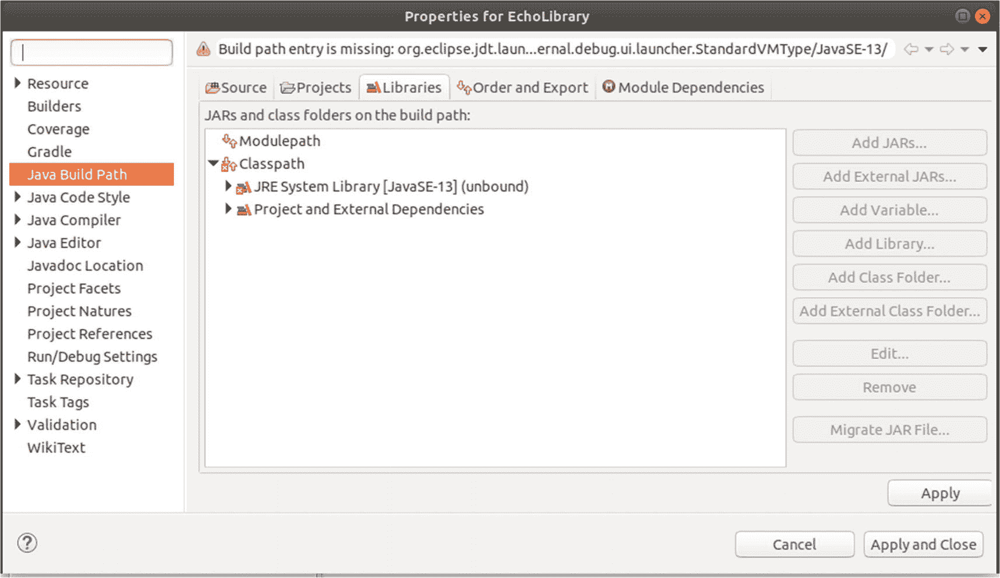
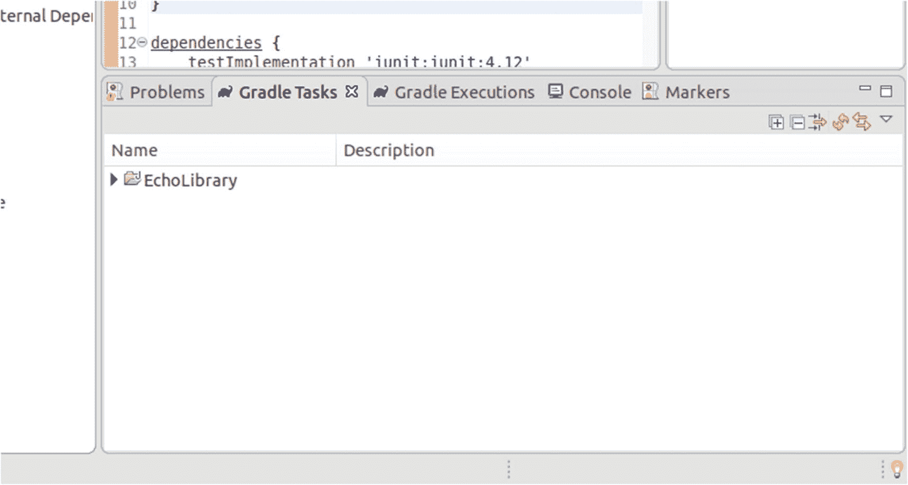
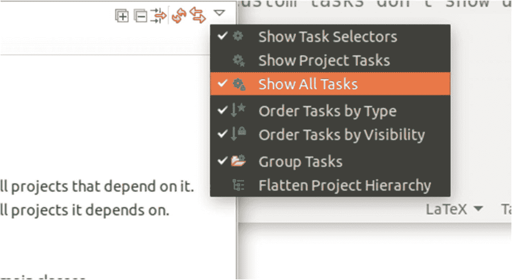
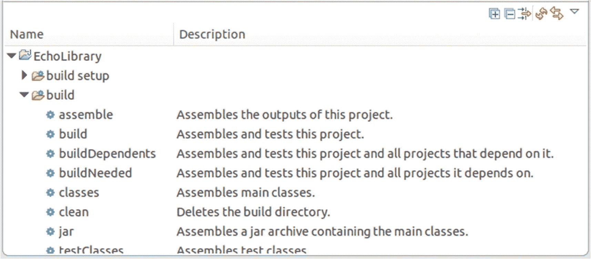
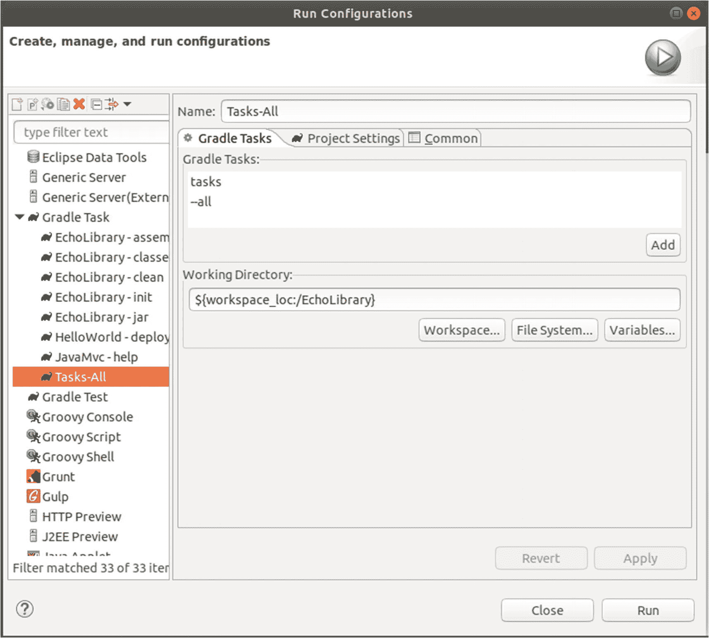
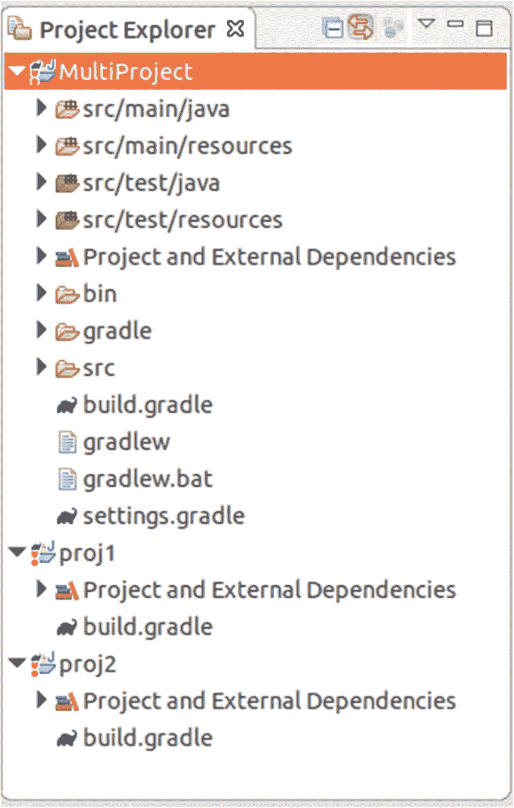
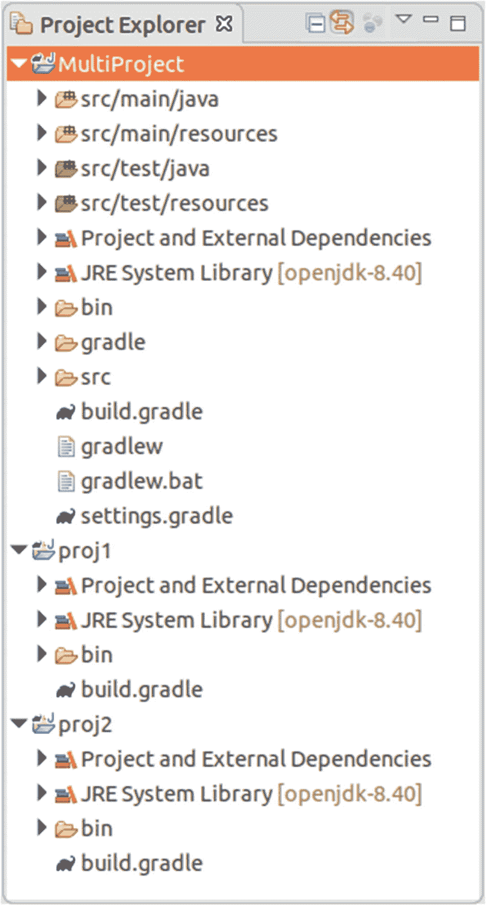

# 三、开发工作流程

在这一章中，我们将讨论开发技术、过程和工具，你可以在本书的例子和任何使用 Java MVC 的后续项目中使用它们。

## 使用 Gradle 作为构建框架

Gradle 是一个现代的构建框架/构建自动化工具。它提供了一种纯粹的声明式配置风格，但是如果需要的话，您也可以以 Groovy(或 Kotlin)脚本片段的形式添加命令式构建代码。

Note

最佳实践表明，对于构建脚本来说，声明性编程(它告诉构建脚本必须做什么，而不是*它应该如何做*)优于命令性编程(精确的逐步说明)。

在本书的其余部分，我们使用 Gradle 进行构建自动化，因为它具有非常简洁的构建配置，可以从控制台(Linux bash 和 Windows 控制台)和像 Eclipse 这样的 ide 内部使用。Gradle 构建脚本可以只有三行，但也可以包含任意长的代码。我们将使用 Gradle 作为工具，在本章的稍后部分将描述它的更多特性。

Caution

如果要使用 OpenJDK 8 构建和运行应用，必须添加一个有效的`cacerts`文件。只需安装 OpenJDK 版本 10，然后复制`OpenJDK10-INST-DIR/lib/security/cacerts to OpenJDK8-INST-DIR/lib/security/cacerts`文件即可。

## 使用 Eclipse 作为 IDE

Eclipse 是一个 IDE(集成开发环境),提供了大量有助于开发 Java 企业项目的功能。它是免费提供的，您可以免费将其用于商业和非商业项目。

Eclipse 可以通过插件进行扩展，很多插件都是社区开发的，可以免费使用。然而，插件也可能来自供应商，你可能需要购买许可证才能使用它们。在本书中，我们将只使用免费插件。如果你想尝试专有插件，在这种情况下，这可能会促进你的开发，请访问位于 [`https://marketplace.eclipse.org`](https://marketplace.eclipse.org) 的 Eclipse marketplace，并咨询每个 plugin . Eclipse . org development，它们都有使用许可

### 安装 Eclipse

Eclipse 有几种变体。要下载其中任何一款，请前往 [`https://www.eclipse.org/downloads/`](https://www.eclipse.org/downloads/) 或 [`https://www.eclipse.org/downloads/packages/`](https://www.eclipse.org/downloads/packages/) 。在本书中，我们将使用面向企业 Java 开发人员的 Eclipse IDE 变体。

Note

如果您选择下载安装程序，您将被要求提供变体。要从一开始就选择企业版本，请单击下载包链接，并在下一页选择企业版本。

在本书中，我们将使用 Eclipse 版本 2020-03，但是您也可以使用更高的版本。请记住，如果你陷入困境而没有明显的解决方案，降级到 Eclipse 2020-03 是一个选择。

使用任何适合您需要的安装文件夹。插件安装和版本升级放在您选择的文件夹中，因此请确保适当的文件访问权限。在我的 Linux 机器上，我通常将 Eclipse 放在一个名为:

```java
/opt/eclipse-2019-09

```

(或者你有的任何版本。)然后，我让它对我的 Linux 用户可写:

```java
cd /opt
USER=...   # enter user name here
GROUP=... # enter group name here
chown -R $USER.$GROUP eclipse-2019-09

```

这改变了 Eclipse 安装的所有文件的所有权，这对于单用户工作站是有意义的。相反，如果 Eclipse 有不同的用户，您可以创建一个名为`eclipse`的新组，并授予该组写访问权限:

```java
cd /opt
groupadd eclipse
chgrp -R eclipse eclipse-2019-09
chmod -R g+w eclipse-2019-09
USER=...   # enter your username here
usermod -a -G eclipse $USER

```

`chgrp ...`命令改变组所有权，而`chmod ...`命令允许所有组成员进行写访问。`usermod ...`命令将特定用户添加到新组中。

Note

你需要`root`来执行这些命令。还要注意的是，`usermod`命令不会影响 PC 上当前活动的窗口管理器会话。例如，您必须重新启动您的系统，或者根据您的发行版，注销并重新登录，该命令才能生效。

最后一步，您可以提供一个指向 Eclipse 安装文件夹的符号链接:

```java
cd /opt
ln -s eclipse-2019-09 eclipse

```

这使得在您的系统上切换不同的 Eclipse 版本更加容易。

在 Windows 系统上，安装程序会为您设置访问权限，任何普通用户通常都可以安装插件。这取决于 Windows 版本和系统配置。企业环境通常有更细粒度的访问权限，普通用户不能安装插件和升级，超级用户用于管理目的。可以使用 Windows 访问权限管理来配置这些权限。

### 配置 Eclipse

启动时，Eclipse 使用系统上安装的默认 Java 版本。万一它找不到或者您安装了几个 Java 版本，您可以明确地告诉 Eclipse 选择哪个 Java。为此，请打开此文件

```java
ECLIPSE-INST/eclipse.ini

```

并添加两行:

```java
-vm
/path/to/your/jdk/bin/java

```

在`-vmargs`线的正上方:

```java
...
openFile
--launcher.appendVmargs
-vm
/path/to/your/jdk/bin/java
-vmargs
...

```

Note

`eclipse.ini`文件的格式取决于 Eclipse 版本。检查 [`https://wiki.eclipse.org/Eclipse.ini`](https://wiki.eclipse.org/Eclipse.ini) 的正确语法。在该网站上，您还可以找到指定 Java 可执行文件路径的精确说明。这里显示的语法是针对 Eclipse 2020-03 的。

在 Windows PCs 上，您可以按如下方式指定路径:

```java
...
-vm C:\path\to\your\jdk\bin\javaw
...

```

不要使用转义反斜杠，就像你对 Java 相关文件所期望的那样。

为了看 Java Eclipse 用哪个版本运行(不是构建项目！)，启动 Eclipse，然后导航到 help➤about eclipse ide➤installation details➤configuration 选项卡。在窗格中，找到以`java.runtime.version=....`开头的行

### 添加 Java 运行时

Eclipse 本身是一个 Java 应用，在上一节中，我们学习了如何告诉 Eclipse 根据自己的兴趣选择哪个 Java 版本。对于开发本身，您必须告诉 Eclipse 使用哪个 Java 版本来编译和运行它托管的应用。

为此，请注意您想要用于 Eclipse 开发的所有 JDK 安装的路径。然后，启动 Eclipse。

Note

当您启动 Eclipse 时，它会要求您提供一个*工作空间*。该文件夹可以包含几个不同或相关的项目。您可以选择一个现有的工作区，或者使用一个新的文件夹来创建一个空的工作区。

在月蚀里面，去 window➤preferences➤java➤installed jres。通常 Eclipse 足够聪明，可以自动提供它自己启动时使用的 JRE。如果这对你来说足够了，你在这里什么都不用做。否则，单击添加...按钮来注册更多的 JRE。在随后的对话框中，选择标准虚拟机作为 JRE 类型。

Note

对于 Java 8，除了顾名思义，您必须提供 JDK 安装的路径，而不是严格意义上的 JRE 安装。

选中复选框以标记您的主 JRE。不要忘记单击“应用”或“应用并关闭”按钮来注册您的更改。

### 添加插件

Eclipse 可以通过许多有用的插件进行扩展。有些是你开发所必需的，有些只是改进你的开发工作流程。在这本书里，我们不会使用太多多余的插件，我会在需要的时候提供插件安装说明。

作为例外，我们现在将安装一个 Gradle 插件。稍后我们将看到我们可以从控制台使用 Gradle，但是 Eclipse 中的 Gradle 插件允许我们直接从 ide 内部使用 Gradle。打开 Help➤Install 新软件...并在对话框中输入 Eclipse Buildship (Gradle)和 [`http://download.eclipse.org/buildship/updates/latest`](http://download.eclipse.org/buildship/updates/latest) 。选择所有功能并完成向导。

### Eclipse 日常使用

Eclipse 提供了许多函数，您可以通过打开内置的帮助来了解它们。为了给你一个起点，下面是帮助你最大限度地利用 Eclipse 的技巧:

*   您可以通过将光标放在标识符上并按 F3 键来获得标识符的定义。这适用于变量(导航到它们的声明)和类/接口(导航到它们的定义)。您甚至可以用这种方式检查被引用的和 Java 标准库类。Eclipse 将下载源代码并显示代码。这是通过查看代码来深入了解库的好方法。

*   若要快速查找资源，如文件、类或接口，请按 Ctrl+Shift+R。

*   开始输入代码并按 Ctrl+Space，Eclipse 将显示如何完成输入的建议。例如，键入`new SimpleDa`，然后按 Ctrl+Space。提供的列表将包含`SimpleDateFormat`类的所有构造函数。更好的是，您可以通过键入`new SiDF`并按 Ctrl+Space 来使其更短，因为 Eclipse 会猜测出缺少的小写字母。另外一个好处是，您不必为以这种方式引入的类和接口编写`import`语句。Eclipse 将为您添加`import` s。

*   让 Eclipse 通过按 Shift+Ctrl+O 为所有尚未解析的类添加`import`(将 O 视为“组织导入”)。

*   通过按 Ctrl+Alt+F 来格式化您的代码。这也适用于 XML 和其他文件类型。

*   让 Eclipse 通过在类型标志符上按 F4 向您显示超类型和子类型。

*   使用 F5 更新 Project Explorer 视图，以防在 Eclipse 外部添加或删除文件。

*   对于新的 Eclipse 安装，通过选择 Window➤Show View➤Other 打开 Problems 视图...➤General➤Problems.这将很容易为您指出 Eclipse 检测到的任何问题(编译器问题、配置问题等等)。

*   从 Window➤Show View➤Other 打开任务视图...➤General➤Tasks 获得您在代码注释中输入的所有“TODO”事件的列表。

*   如果“TODO”对您来说不够精细，您可以通过右键单击代码编辑器左侧任意位置的竖条来添加书签。书签随后会在书签视图中列出。

## 更多关于 Gradle 的信息

有了 Eclipse 和 Gradle 插件，我们可以提高对 Gradle 框架的了解。为了保持简单，我们从一个非常简单的非 Java MVC 项目开始。

Note

您可以在 [`https://docs.gradle.org/current/userguide/userguide.html`](https://docs.gradle.org/current/userguide/userguide.html) 找到 Gradle 用户手册。

### 一个基本的梯度项目

为了更多地了解 Gradle，我们构建了一个简单的`EchoLibrary`库，只有一个类和一个方法，将一个字符串打印到控制台。启动 Eclipse，会要求您提供一个工作区。选择您选择的任何文件夹。

Note

您可以将本书中的所有示例项目添加到一个名为`JavaMVCBook`的工作空间中，以便将所有东西放在一起，但这取决于您。

去 File➤New➤Other...➤Gradle➤Gradle 项目。选择`EchoLibrary`作为项目名称。您可以使用 Gradle 项目选项的默认设置。完成后，新建项目向导准备项目，并向保存 Gradle 配置的项目添加一些文件。

我们要做的下一件事是确保项目可以使用现有的 JSE 安装。Gradle 项目向导可能会尝试使用不存在的 JRE，并且会出现一个错误标记。见图 3-1 。


图 3-1

项目错误标记(红色感叹号)

要修复这种不匹配或检查是否使用了正确的 JRE，请右键单击该项目，然后选择“Properties➤Java”“构建 Path➤Libraries.”见图 3-2 。



图 3-2

JRE 不匹配

如果不匹配，请单击“类路径”,然后选择“添加库”,删除无效条目...➤JRE 系统图书馆。添加您向 Eclipse 注册的版本 8 JRE。然后单击应用并关闭按钮。

接下来，右键单击`src/main/-java` ➤New➤Package.，添加一个名为`book.javamvc.echo`的包在包内，添加一个包含以下内容的`Echo`类:

```java
package book.javamvc.echo;

public class Echo {
    public void echo(String msg) {
        System.out.println(msg);
    }
}

```

### Gradle 主要概念

默认情况下，Gradle 在项目的根文件夹中使用一个名为`build.gradle`的中心构建文件。在我们开始讨论这个文件之前，我们首先需要了解 Gradle 的主要概念:

*   Gradle 有一个核心，为构建相关的活动提供基础设施。活动本身存在于 Gradle 插件中，这些插件需要在构建文件中指定，并且运行在核心之上。对于每个项目，您可以指定哪些插件将用于 Gradle 构建。有编译 Java 类的插件；用于将工件打包成 ZIP、WAR 或 EAR 文件；用于运行应用；以及将应用发布到 Maven 存储库中。还有各种分析插件，IDE 集成插件，实用插件等等。你当然可以开发自己的插件。

*   插件执行任务。例如，Java 插件有一个用于编译 Java 类的`compileJava`任务和一个用于压缩和收集几个编译好的类的`jar`任务。

*   每个 Gradle build 由一个*初始化*、一个*配置*和一个*执行*阶段组成。在初始化阶段，Gradle 确定子项目是否需要包含在构建中。(我们后面再讲子项目。)在配置阶段，Gradle 评估依赖关系并构建任务图，任务图包含构建需要执行的所有任务。所有对象上的配置总是在每个 Gradle 版本中运行。这是很重要的一点，也是刚开始使用 Gradle 的人容易犯的错误。这意味着对于一个任务执行，看似完全不相关的任务的配置也被调用。因此，出于性能原因，任何任务的配置都应该非常快。任务的配置不应该做任何依赖于任务是否实际执行的事情。在执行阶段，任务实际上完成了它们的工作(编译、移动、压缩等等)。

Note

许多 Gradle 手册和教程在开始时都围绕用户定义的任务，这实际上对 Gradle 的初学者有一点误导。在许多甚至更大的项目中，相应的`build.gradle`文件指定和配置插件，但几乎从不直接处理任务。从技术的角度来看，任务是重要的，但是通过谈论不同的阶段和插件架构来开始 Gradle 的介绍会导致对 Gradle 功能的更彻底的理解。

### 标准梯度项目布局

所有 Gradle 插件默认期望的项目布局如下:

```java
src
  |- main
  |     |- java
  |     |     |- <java source files>
  |     |- resources
  |           |- <resource files>
  |
  |- test
        |- java
        |     |- <java source files>
        |- resources
              |- <resource files>
build
  |- <any files built by Gradle>

build.gradle       <Gradle build file>
settings.gradle    <(Sub-)Project settings>
gradle.properties  <optional project properties>

```

Note

如果你了解 Maven 构建框架，`src`文件夹的布局对你来说会很熟悉。

我们将在后面的章节中学习如何改变项目结构。

### 中央 Gradle 构建文件

Eclipse 中的 Gradle 项目向导在项目的根文件夹中创建了一个示例文件`build.gradle`。对于任何 Gradle 项目，包括不使用 Eclipse 的项目，这都是主要的构建文件。Eclipse 插件提供了一个带有一些示例条目的基本构建文件，但是您当然可以从头开始构建这个文件。

Caution

Eclipse Gradle 插件有时会有一个关于何时何地显示构建文件的有趣想法。如果在项目浏览器中找不到该文件，请打开 Gradle 任务视图并右键单击该项目，然后选择“打开 Gradle 构建脚本”选项。

构建文件通常从定义要使用的插件开始，然后配置插件。如果需要，带有操作说明的用户定义的任务也可以转到构建文件。还可以向现有任务中添加 Groovy 或 Kotlin 代码，这使您能够根据需要微调插件。

Note

在本书中，我们只展示 Groovy 代码用于 Gradle 构建。Groovy 是动态类型的，正因为如此，与静态类型的 Kotlin 相比，它可能更简洁一些。此外，Groovy 专门是一种脚本语言，因此它配备了许多用于脚本目的的实用程序，而 Kotlin 是一种大规模计算机语言，是 Java 的竞争对手。

插件通常对它们的默认值有一个非常精确和合理的想法，所以你的项目没有太多需要配置的。因此，构建文件可能相当小。这种“约定胜于配置”的风格并不是 Gradle 的发明，但是 Gradle——以优雅为设计目标——欣然接受了这一理念。

回到`EchoLibrary`示例项目。我们关闭向导创建的示例文件`build.gradle`,并用以下内容覆盖其内容:

```java
// The EchoLibrary build file
plugins {
    id 'java-library'
}

java {
    sourceCompatibility = JavaVersion.VERSION_1_8
    targetCompatibility = JavaVersion.VERSION_1_8
}
repositories {
    jcenter()
}

dependencies {
    testImplementation 'junit:junit:4.12'
}

```

前三行`plugins { id 'java-library' }`指定我们想要使用`java-library`插件。名字告诉所有人，我们事实上想要建立一个 Java 库，但是你可以在用户手册的插件部分了解细节。

`java { sourceCompatibility = JavaVersion.VERSION_1_8; targetCompatibility = JavaVersion.VERSION_1_8 }`设置指定了我们库的 JRE 版本。可能的值可以在`org.gradle.api.JavaVersion`类中查找，但是在那里你不会发现任何令人惊讶的东西(`JDK 13 = JavaVersion.VERSION_1_13`等等)。

Note

Gradle 使用你的操作系统的默认 JDK 来编译类。你应该*而不是*使用你的 Gradle 项目配置来设置 JDK 路径，因为那样你会引入一些不必要的依赖。毕竟，JRE 13 可以很好地处理 JRE 8 文件，也许其他开发人员也想在他们自己的系统上使用相同的构建脚本。相反，您可以在 Gradle 调用之前，更改操作系统的`JAVA_HOME`环境变量来指定一个 JDK 路径。

`repositories { jcenter() }`行指出 Gradle 将在哪里加载你的项目所依赖的库。`jcenter()`指向 Bintray 的 JCenter，但是您也可以将`google()`用于 Android 项目，将`mavenCentral()`用于 Maven Central。或者，您可以指定一个定制的 URL，如`repositories { maven { url "` [`http://my.company.com/myRepo`](http://my.company.com/myRepo) `" } }`，这对于私有或公司所有的存储库来说很方便。请参阅 Gradle 手册中名为“声明存储库”的部分

`dependencies`部分指出了我们的项目需要哪些库。对于`EchoLibrary`的例子，我们没有对外部库的依赖，但是对于单元测试，我们没有在这种情况下编写单元测试，但是对于有倾向的读者来说，这是一个很好的练习，我们添加了对 JUnit 测试库的依赖。

所有其他设置——如源文件的位置、生成的 JAR 文件的命名方式和写入位置、存储和缓存下载的依赖项的位置等——都由插件默认设置处理。

这个带有少量设置的构建文件现在可以用来执行各种构建任务。

### 运行梯度任务

Gradle 中与构建相关的和用户触发的活动被称为*任务*。从处理的角度来看，Gradle 的主要目标是调用任务。

Eclipse Gradle 插件有一个 Gradle 任务和一个 Gradle 执行视图。此外，诊断输出会显示在标准控制台视图中。安装 Gradle 插件后，默认情况下会打开两个与 Gradle 相关的视图。见图 3-3 。



图 3-3

gradle views(分级视图)

如果这不适合你，那就去 Window➤Show View➤Other 吧...➤Gradle 打开了一个格雷尔视图。控制台视图可从 Window➤Show View➤Console.获得

“分级任务”视图以树形视图列出所有可用的任务；见图 3-4 。可以使用“视图”菜单(菜单中的小向下三角形)过滤显示的任务范围。如果您引入任何自定义任务，这是启用“显示所有任务”项目的好时机。否则，自定义任务不会显示在列表中。见图 3-5 。



图 3-5

分级任务视图菜单



图 3-4

分级任务视图树

Caution

如果更改项目结构，例如添加、删除或重命名自定义任务，则必须单击菜单中的“刷新所有项目的任务”按钮(弯曲的双箭头)。否则，视图不会反映这些变化。

为了从 Gradle Tasks 视图中运行 Gradle task，首先必须在树中找到它。根据您在树中查找位置的精确程度，您还可以使用菜单过滤器来查找任务。找到后，双击它运行任务。诊断输出，包括任何错误消息，都显示在 Gradle 执行和控制台视图中。

任务可能有控制其功能的选项参数。例如，有一个`tasks`任务，它只列出了所有任务的某个子集。更准确地说，任务有一个`group`属性，其中一个组叫做`other`。如果在没有参数的情况下运行`tasks`任务，则属于`other`组的任务不会包含在输出中。要使用该命令显示所有任务，您必须添加一个`--all`参数。要从 Eclipse 中这样做，请转到 Run➤Run 配置，导航到 Gradle Task，并添加一个新条目，如图 3-6 所示(单击添加按钮两次以输入`tasks`和`--all`)。单击 Run 并切换到控制台视图查看输出。



图 3-6

自定义分级任务运行配置

对于`EchoLibrary`的例子，构建一个库 JAR 很可能是主要任务。你可以在`build`部分找到。一旦运行了它，最终的 JAR 就会出现在`build/libs`文件夹中。

Caution

可以从 Eclipse 项目视图中过滤掉`build`文件夹。在这种情况下，如果你想看到它，打开小三角形的项目视图菜单，转到过滤器和定制，并从 Gradle Build 文件夹条目中删除复选标记。

### Gradle 任务说明

任务由插件定义，插件也可能修改或覆盖其他插件定义的任务，所以任务和插件之间没有一对一的关系。此外，Gradle 本身还定义了独立于插件的任务。表 3-1 定义了您通常在 Java 项目中使用的大多数任务。

表 3-1

梯度任务

<colgroup><col class="tcol1 align-left"> <col class="tcol2 align-left"> <col class="tcol3 align-left"></colgroup> 
| 

名字

 | 

组

 | 

描述

 |
| --- | --- | --- |
| `help` | `help` | 显示帮助消息。 |
| `projects` | `help` | 显示项目名称并列出所有子项目的名称(如果适用)。我们将在本章后面讨论子项目。 |
| `tasks` | `help` | 显示项目中可运行的任务。您必须添加`--all`选项来包含来自`other`组的任务。要查看属于某个组的任务，添加`--group <groupName>`选项(对于`groupname`，使用`build`、`build setup`、`documentation`、`help`、`verification`或`other`)。 |
| `dependencies` | `help` | 独立于插件。计算并显示项目的所有依赖项。您可以使用它来确定项目依赖于哪些库，包括可传递的依赖项(间接引入的依赖项，作为依赖项的依赖项)。 |
| `init` | `build setup` | 添加当前目录所需的文件，作为 Gradle 构建的根目录。通常只在新项目开始时这样做一次。使用 Eclipse Gradle 插件和新的 Gradle 项目向导，可以自动调用这个任务。这项任务不依赖于 Gradle 插件被激活。 |
| `wrapper` | `build setup` | 将 Gradle 包装添加到项目中。然后，可以在没有在操作系统级别安装 Gradle 的情况下执行 Gradle 构建(必须安装 Java)。使用 Eclipse Gradle 插件和新的 Gradle 项目向导，可以自动调用这个任务。这项任务不依赖于 Gradle 插件被激活。 |
| `check` | `verification` | 生命周期任务。抽象地定义在基础插件中，并由激活的插件具体化。取决于`test`，但可能会运行额外的检查。 |
| `test` | `verification` | 运行所有单元测试。 |
| `assemble` | `build` | 生命周期任务。抽象地定义在基础插件中，并由激活的插件具体化。任何生成发行版或其他可消费工件的插件都应该使组装任务依赖于它。在自定义任务中，您可以编写类似于`assemble.dependsOn( someTask )`的代码。调用此任务会绕过任何测试。 |
| `build` | `build` | 生命周期任务。抽象地定义在基础插件中，并由激活的插件具体化。依赖于`check`和`assemble`任务，并因此执行所有测试，然后根据激活的插件生成一个发行版或其他可消耗的工件。 |
| `clean` | `build` | 生命周期任务。删除`build`目录。如果您希望确保后续的构建执行所有的构建步骤，甚至是那些看似可以从先前的构建操作中重用的步骤，那么您可以调用此任务。您通常不会在日常工作中调用这个任务，因为如果设置得当，Gradle 应该能够确定哪些准备任务需要执行，哪些不需要执行(因为之前的构建)。 |
| `classes` | `build` | 任何插件，在其构建过程中的某个地方，需要构建该任务中提供的 Java 类。它的职责是从源代码的`main`部分(不是测试类)创建 Java 类。 |
| `testClasses` | `build` | 类似于`classes`任务，但是处理来自源代码的`test`部分。 |
| `jar` | `build` | 组装一个包含来自`main`部分的类的 JAR 档案。 |
| `ear` | `build` | 只针对 EAR 插件。从子项目(web 应用和 EJB)组装 EAR 档案。 |
| `javadoc` | `documentation` | 从`main`部分为源代码生成 JavaDoc API 文档。 |
| `compileJava` | `other` | 从`main`部分编译 Java 源代码。 |
| `compileTestJava` | `other` | 从`test`部分编译 Java 源代码。 |

每个插件的文档也可能描述该插件特别感兴趣的更多任务。

### 外挂程式等级

如果您正在为 Java MVC 和其他 Java 和 JEE/Jakarta EE 相关项目进行开发，下面的列表显示了您最常遇到的插件:

*   **Base** :提供大多数构建通用的基本任务和约定。

*   **Java** :任何类型的 Java 项目。

*   **Java 库**:扩展`Java`插件，向消费者提供关于 API 的知识。

*   **Java 平台**:不包含任何源代码，但描述了一组通常一起发布的相互关联的库。

*   **应用**:隐式应用`Java`插件，并允许声明一个`main`类作为应用入口点。

*   **WAR** :扩展了`Java`插件，增加了以 WAR 文件形式构建 web 应用的能力。

*   **EAR** :允许创建一个 EAR 文件。

*   **Maven Publish** :增加了将工件发布到 Maven 仓库的功能。

*   Ivy Publish :添加将工件发布到 Ivy 存储库中的功能。

*   **分发**:增加了简化工件分发的功能。

*   **Java 库分发**:增加了简化工件分发的功能，特别关注 Java 库。

*   **Checkstyle** :增加 Checkstyle 检查。

*   **PMD** :增加 PMD 支票。

*   **JaCoCo** :添加 JaCoCo 检查。

*   **CodeNarc** :增加 CodeNarc 检查。

*   **签名**:增加签名功能。

*   **项目报告插件**:允许生成构建报告。

你可以通过查看 Gradle 用户手册，特别是标题为“Gradle 插件参考”的章节来了解更多关于每个插件的信息。

### 关于存储库的更多信息

如果 Gradle 确定项目引用了这样的库，它就会从存储库中加载库。您可以在`build.gradle`中的`repositories { }`部分指定存储库:

```java
repositories {
    repoSpec1 (repository specification, see below)
    repoSpec2
    ...
}

```

您可以使用以下内容作为存储库规范:

*   `mavenCentral()`

硬编码指向位于 [`https://repo.maven.apache.org/maven2/`](https://repo.maven.apache.org/maven2/) 的公开可用的 Maven 资源库

*   `jcenter()`

硬编码指向位于 [`https://jcenter.bintray.com/`](https://jcenter.bintray.com/) 的公开可用的 Maven 资源库

*   `google()`

硬编码指向位于 [`https://maven.google.com/`](https://maven.google.com/) 的公开可用的 Android 专用 Maven 库

*   `flatDir { ... }`

指向包含库的文件夹。准确的语法是`flatDir { dirs '/path1/to/folder', '/path2/to/folder', ... }.`它不支持元信息，所以如果一个依赖项可以在一个`flatDir`存储库中和另一个具有元信息的存储库*中查找(Maven、Ivy 等等)，后者优先。*

*   `maven { ... }`

给定一个显式 URL，指向一个 Maven 存储库。精确的语法是

`maven { url "http://repo.mycompany.com/maven2" }`

*   `ivy { ... }`

指向一个给定显式 URL 的 Ivy 存储库。精确的语法是

`ivy { url "http://repo.mycompany.com/ivy" }`

*   `mavenLocal()`

使用本地 Maven 缓存(通常在`HOME-DIR/.m2`中)

对于您指定为存储库位置的 URL，Gradle 还支持`https:`、`file:`、`sftp:`和`s3:`(亚马逊 s3 服务)协议，或者`gcs:`(谷歌云存储)。前三个，当然还有标准的`http://`协议，使用标准的 URL 语法。如果需要，Gradle 手册会解释更多关于`s3:`和`gcs`的语法。

如果您需要提供连接到存储库的凭证，您可以在`credentials { }`部分指定它们:

```java
repositories {
    maven {
        url "http://repo.mycompany.com/maven2"
        credentials {
            username "user"
            password "password"
        }
    }
}

```

这是用于基本认证的。有关更高级的身份验证方案，请参见 Gradle 手册中的“声明存储库”一节。

### 关于依赖性的更多信息

Gradle 中心对`configurations`的依赖性。(依赖相关的)配置是一个依赖范围，这意味着它描述了一个使用场景。例如，假设您有一组仅对测试重要的依赖项，另一组是某个库的内部功能所需的依赖项，还有一组是内部功能所需的依赖项并被转发给客户端(因为它们出现在公共方法调用中)。所有这些都是不同的范围，或*配置*。

依赖相关的配置是由插件定义的，但是关于配置名有一个常识，内部配置也是互相继承的，这就导致了不同插件之间的配置名匹配。表 3-2 列出了你在 Java 相关项目中经常遇到的配置。

表 3-2

梯度构型

<colgroup><col class="tcol1 align-left"> <col class="tcol2 align-left"></colgroup> 
| 

名字

 | 

描述

 |
| --- | --- |
| `implementation` | 编译源代码的`main`部分所需的任何依赖项都可以使用这种配置。依赖关系也将在运行时使用。 |
| `compile` | 已弃用。替换为`implementation`。您经常在博客和教程中发现这一点，所以添加这一点供您参考。用`implementation`代替。 |
| `compileOnly` | 依赖项只需要编译源代码的`main`部分。在运行时，某种容器将提供依赖，因此项目不需要将这种依赖添加到可交付的工件中。 |
| `runtimeOnly` | 编译源代码的`main`部分不需要依赖关系，但是依赖关系会被添加到可交付的工件中。 |
| `api` | 仅适用于 Java 库插件，标识了也必须传输到库客户端的依赖项，因为依赖项中的类型出现在公共方法调用中。 |
| `providedCompile` | 只针对战争插件；与`implementation`相同，但是依赖关系将*而不是*添加到 WAR 文件中。 |
| `providedRuntime` | 只针对战争插件；与`runtime`相同，但是依赖关系将*而不是*添加到 WAR 文件中。 |
| `deploy` | 只针对 EAR 插件；将依赖项添加到 EAR 文件的根目录。 |
| `earlib` | 只针对 EAR 插件；将依赖项添加到 EAR 文件的`lib`文件夹中。 |
| `testImplementation` | 编译源代码的`test`部分所需的任何依赖项都可以使用这种配置。依赖关系也将在运行时使用。 |
| `testCompile` | 已弃用。替换为`testImplementation`。您经常在博客和教程中发现这一点，所以添加这一点供您参考。用`testImplementation`代替。 |
| `testCompileOnly` | 与`compileOnly`相似，但用于信号源的`test`部分。 |
| `testRuntimeOnly` | 与`runtimeOnly`相似，但用于信号源的`test`部分。 |

一旦确定了所需的配置，就可以在`build.gradle`文件的`dependencies { }`部分指定一个列表:

```java
dependencies {
   implementation 'org.apache.commons:commons-math3:3.6.1'
   // This is the same:
   implementation group:'org.apache.commons',
        name:'commons-math3',
        version:'3.6.1'

   // You can combine:
   implementation 'org.apache.commons:commons-math3:3.6.1',
       'org.apache.commons:commons-lang3:3.10'
   // or like that:
   implementation(
        [ group:'org.apache.commons',
          name:'commons-math3', version:'3.6.1' ],
        [ group:'org.apache.commons',
          name:'commons-lang3', version:'3.10' ]
   )
   // or like that:
   implementation 'org.apache.commons:commons-math3:3.6.1'
   implementation 'org.apache.commons:commons-lang3:3.10'

   testImplementation 'junit:junit:4.12'
}

```

正常情况下，任何间接依赖关系都是自动解决的，它来自于依赖关系的依赖关系。这样的依赖被称为*传递*依赖。因此，如果您声明了对某个库 A 的依赖，而库 A 又依赖于库 B 和库 C，那么 Gradle 会负责在构建中包含 B 和库 C，而不需要在`build.gradle`中显式声明对 B 和库 C 的依赖。如果您想防止 Gradle 包含可传递的依赖项，您可以使用`transitive = false`来标记它们:

```java
dependencies {
    implementation (group: 'org.eclipse.jetty',
                    name: 'jetty-webapp',
                    version: '9.4.28.v20200408') {
        transitive = false
    }
}

```

如果您调用`dependencies`任务，您可以研究这种可传递的依赖性。输出将是依赖关系和传递依赖关系的树状表示，例如，如下所示:

```java
...
runtimeClasspath - Runtime classpath of source set 'main'.
\--- com.sparkjava:spark-core:2.8.0
    +--- org.slf4j:slf4j-api:1.7.25
    +--- org.eclipse.jetty:jetty-server:9.4.12
    |   +--- javax.servlet:javax.servlet-api:3.1.0
    |   +--- org.eclipse.jetty:jetty-http:9.4.12
    |   |   +--- org.eclipse.jetty:jetty-util:9.4.12
    |   |   \--- org.eclipse.jetty:jetty-io:9.4.12
    |   |       \--- org.eclipse.jetty:jetty-util:9.4.12
...

```

(这里提到的依赖是`implementation com.sparkjava:spark-core:- 2.8.0`。)

### 改变项目结构

我们了解到，通过坚持默认的项目结构，我们不必花费时间来配置项目，告诉它在哪里可以找到资源和资源。

如果出于某种原因，您需要一个定制的项目布局，将下面几行添加到您的`build.gradle`文件中:

```java
sourceSets {
    main {
        java {
            srcDirs = ['src99/main/java']
        }
        resources {
            srcDirs = ['src99/main/resources']
        }
    }
    test {
        java {
            srcDirs = ['src99/test/java']
        }
        resources {
            srcDirs = ['src99/test/resources']
        }
    }
}

```

因为所有的目录设置都被指定为列表(见`[ ... ]`)，所以你也可以在几个文件夹中分配资源和资源(使用逗号作为分隔符)。

为了更改 Gradle 存放临时和最终输出文件的构建文件夹，在您的`build.gradle`文件中写入以下内容:

```java
project.buildDir = 'gradle-build'

```

### Gradle 构建文件是一个 Groovy 脚本

让我们修改`EchoLibrary`示例`build.gradle`文件:

```java
// The EchoLibrary build file
plugins {
    id 'java-library'
}
java {
    sourceCompatibility = JavaVersion.VERSION_1_8
    targetCompatibility = JavaVersion.VERSION_1_8
}
repositories {
    jcenter()
}

dependencies {
    testImplementation 'junit:junit:4.12'
}

```

除了`jcenter()`中可疑的`()`以及`A B`和`A = B`构造的奇怪混合，这个文件看起来可能像一个配置文件，其语法仅限于设置一些属性。然而，事实要悲观得多。事实上，`build.gradle`文件是一个 Groovy 脚本，Groovy 是一种运行在 JVM 引擎之上的成熟的脚本语言。

虽然我们已经说过，对于构建定义文件，声明式编程风格比声明式编程风格更可取，但在某些情况下，添加编程语言结构(如条件语句、开关结构、循环和对 IO(文件和控制台)、数学、流、日期和时间以及您可能想到的任何其他库对象的调用)是可以接受的。此外，构建文件中的`{ }`括号实际上并不表示块，而是闭包。所以`dependencies { }`构造实际上是`dependencies( { } )`的快捷方式，任何`A B`构造实际上都是一个方法调用`A( B )`。

例如，如果您想仅在定义了某个系统属性的情况下添加一个`runtimeOnly`依赖项，并且还想输出相应的诊断消息，您可以编写以下代码:

```java
...
dependencies {
  if(System.getProperty("add.math") != null) {
    println("MATH added")
    runtimeOnly group: 'org.apache.commons',
                name: 'commons-math3', version: '3.6.1'
  }
  ...
  testImplementation 'junit:junit:4.12'
}
...

```

现在，您可以调用添加了额外选项`-Dadd.math`的任何任务来查看条件语句和控制台输出的工作情况。

### 脚本变量

为了增加可读性和维护优化，您可以将变量(属性)添加到构建文件中。为此，您可以使用一个`ext { }`调用:

```java
...
ext {
    MATH_VERSION = '3.6.1'
    JUNIT_VERSION = '4.12'
}

dependencies {
  implementation group: 'org.apache.commons',
      name: 'commons-math3', version: MATH_VERSION
  testImplementation "junit:junit:${JUNIT_VERSION}"
}
...

```

为了让`${}`替换生效，双引号是必需的——这是 Groovy 语言的一个特性(`GString`对象)。否则在 Groovy 中你可以使用单引号和双引号来表示字符串。

如果变量范围被限制在当前闭包内(在一个`{ }`内)，你也可以使用标准的 Groovy 局部变量声明:

```java
...
dependencies {
  def MATH_VERSION = '3.6.1'
  def JUNIT_VERSION = '4.12'

  implementation group: 'org.apache.commons',
      name: 'commons-math3', version: MATH_VERSION
  testImplementation "junit:junit:${JUNIT_VERSION}"
}
...

```

### 自定义任务

我们可以在`build.gradle`文件中定义自己的任务。因为我们可以在构建脚本中使用 Groovy 语言，所以这里的可能性是无限的。我们可以添加日志记录、在归档中包含非标准文件、执行加密、在服务器上部署工件、以非标准方式发布文件、执行计时、调用额外的准备和清理步骤等等。

要定义您自己的任务，您可以在您的`build.gradle`脚本文件中的任意位置编写以下内容:

```java
task hello {
  group = 'build'
  description = 'Hello World'

  println 'Hello world! CONFIG'

  doFirst {
    println 'Hello world! FIRST'
  }

  doLast {
    println 'Hello world! LAST'
  }
}

```

`group`和`description`设置都是可选的；该组的缺省值是`other`，如果省略描述，将会取一个空字符串。`group`的可能值有`build`、`build setup`、`documentation`、`help`、`verification`和`other`。

要执行一个自定义任务，您可以像处理内置任务或插件定义的任务一样处理。然而，为了让 Eclipse Gradle 插件能够看到新任务，您首先必须右键单击项目，然后选择 Gradle➤Refresh Gradle 项目。然后，您将在 Gradle Tasks 视图的树形视图中看到新任务，并可以通过双击它来执行它。

主`{ }`中的指令在配置阶段执行。要知道这样的指令对于所有声明的任务都是无条件执行的！对于任务执行问题，您可以将指令放入`doFirst { }`或`doLast { }`中。每个任务都有一个动作列表；如果您使用`doFirst`，指令被添加到动作列表中，如果您使用`doLast`，动作被添加到动作列表中。

稍后可以通过编写以下内容向任务的动作列表添加说明:

```java
hello.doLast {
  println 'Hello world! MORE LAST'
}

hello.doFirst {
  println 'Hello world! MORE FIRST'
}

```

您可以将自定义任务添加到受抚养人的现有任务列表中，或将现有任务添加到受抚养人的新任务列表中。为此，请编写以下代码，例如:

```java
build.dependsOn hello
hello.dependsOn build

```

这背后的神奇之处在于，在`build.gradle`脚本中，任何任务都可以通过其名称直接获得。所以，如果你写`build.dependsOn hello`，任何`build`任务的执行都会首先导致`hello`的执行。在`hello.dependsOn build`中，`hello`任务的执行首先产生`build`执行。这样，就可以将任务相关性关系添加到现有的标准和非标准任务中。

### Gradle 包装

如果您使用`wrapper`任务或 Eclipse Gradle 插件来启动一个新项目，将会安装包装器脚本，这允许您在操作系统上没有任何 Gradle 安装的情况下运行 Gradle(尽管 Java 必须工作)。您可以从以下文件中看到这一点:

```java
gradlew

gradlew.bat

gradle
  |- wrapper
        |- gradle-wrapper.jar
        |- gradle-wrapper.properties

```

`gradlew`和`gradlew.bat`分别是 Linux 和 Windows 的梯度启动脚本。`gradle`文件夹包含独立的 Gradle 安装。

Eclipse Gradle 插件不使用这些包装脚本。相反，在启动第一个 Gradle 任务时，会从`USER_HOME/gradle`内部启动一个 Gradle *守护进程*。这个守护进程在后台运行，任何从 Eclipse 触发的 Gradle 任务执行都会联系这个守护进程来进行实际的构建工作。这允许更快的任务执行。

如果从控制台调用 Gradle，将使用包装器，并且这样的守护进程也将启动。我们在“使用控制台开发”一节中讨论了面向控制台的开发方式。

### 多项目构建

Gradle 项目可以有子项目。除了收集展示某种相互关系的项目之外，由一个主项目和一个或多个子项目构建的层次结构对于 EAR 项目也很重要，在 EAR 项目中，我们通常有一个 web 应用，可能有一些 EJB，也可能有一些库。

要从 Eclipse 内部构建这样一个多项目，首先要像前面描述的那样创建一个普通的 Gradle 项目。然后，打开`settings.gradle`文件并添加以下行:

```java
include 'proj1', 'proj2'

```

当然，您可以为子项目选择不同的名称。接下来，在项目文件夹中创建两个文件夹，名称分别为`proj1`和`proj2`(或者您选择的任何名称)。在每个新文件夹中添加一个空的`build.gradle`文件。您可以稍后在那里添加任何与子项目相关的构建指令。

右键单击该项目，然后选择“gradle➤refresh·格拉德项目”。Eclipse 将更新项目浏览器，并将主项目和两个子项目显示为不同的条目；参见图 3-7 。



图 3-7

Eclipse 中的 Gradle 多项目

由于 Gradle 插件中的一个错误，您必须修复所有三个条目的 JRE 库分配。在每一个上，右键单击，然后选择 Properties➤Libraries.删除错误的条目，然后单击 Add Library(添加到 classpath)➤JRE 系统 Library➤Workspace 默认的 JRE(或者任何适合您需要的东西))。错误标记现在应该消失了，如图 3-8 所示。



图 3-8

Eclipse 中的 Gradle 多项目，已修复

每个子项目可以使用自己的`build.gradle`文件独立配置，但是也可以从根项目的`build.gradle`文件中引用子项目:

```java
// referring to a particular sub-project
project(':proj1') { proj ->
    // adding a new task to proj1
    task('hello').doLast { task ->
       println "I'm $task.project.name" }
}

// we can directly address tasks
project(':proj1').hello {
  doLast { println "I'm $project.name" }
}

// or, referring to all sub-projects
subprojects {
    task hello {
        doLast { task ->
        println "I'm $task.project.name"
    }
  }
}

// or, referring

to the root project and all sub-projects
allprojects {
    task hello {
        doLast { task ->
        println "I'm $task.project.name"
    }
  }
}

```

我们可以通过`rootProject`变量从子项目的配置中处理根项目:

```java
task action {
    doLast {
        println("Root project: " +
            "${rootProject.name}")
    }
}

```

您可以在 Gradle 用户手册的“配置多项目构建”和“创作多项目构建”章节中了解更多关于多项目构建的信息。我们将在第九章使用多项目。

### 添加部署任务

定制任务的一个很好的候选是部署过程。我们可以使用标准的`build`任务来创建 WAR 或 EAR 文件，但是为了在本地开发服务器上部署它，一个定制的 Gradle 任务就派上了用场。在本书中，我们将使用以下任务在本地 GlassFish 服务器上进行部署和“取消部署”:

```java
task localDeploy(dependsOn: build,
             description:">>> Local deploy task") {
  doLast {
    def FS = File.separator
    def glassfish = project.properties['glassfish.inst.dir']
    def user = project.properties['glassfish.user']
    def passwd = project.properties['glassfish.passwd']

    File temp = File.createTempFile("asadmin-passwd",
        ".tmp")
    temp << "AS_ADMIN_${user}=${passwd}\n"

    def sout = new StringBuilder()
    def serr = new StringBuilder()
    def libsDir = "${project.projectDir}${FS}build" +
        "${FS}libs"
    def procStr = """${glassfish}${FS}bin${FS}asadmin
        --user ${user} --passwordfile ${temp.absolutePath}
        deploy --force=true
        ${libsDir}/${project.name}.war"""
    // For Windows:
    if(FS == "\\") procStr = "cmd /c " + procStr
    def proc = procStr.execute()

    proc.waitForProcessOutput(sout, serr)
    println "out> ${sout}"
    if(serr.toString()) System.err.println(serr)

    temp.delete()
  }
}

task localUndeploy(
             description:">>> Local undeploy task") {
  doLast {
    def FS = File.separator
    def glassfish = project.properties['glassfish.inst.dir']
    def user = project.properties['glassfish.user']
    def passwd = project.properties['glassfish.passwd']

    File temp = File.createTempFile("asadmin-passwd",
        ".tmp")
    temp << "AS_ADMIN_${user}=${passwd}\n"

    def sout = new StringBuilder()
    def serr = new StringBuilder()
    def procStr = """${glassfish}${FS}bin${FS}asadmin
        --user ${user} --passwordfile ${temp.absolutePath}
        undeploy ${project.name}"""
    // For Windows:
    if(FS == "\\") procStr = "cmd /c " + procStr
    def proc = procStr.execute()

    proc.waitForProcessOutput(sout, serr)
    println "out> ${sout}"
    if(serr.toString()) System.err.println(serr)

    temp.delete()
  }
}

```

这些任务依赖于属性文件。Gradle 自动尝试读取一个名为`gradle.properties`的属性文件，如果它存在，就从属性中创建一个映射，并将其放入`project.properties`变量中。我们在项目文件夹中创建这样一个文件，如下所示:

```java
glassfish.inst.dir = /path/to/glassfish/inst
glassfish.user = admin
glassfish.passwd =

```

这些任务创建一个临时密码文件；这只是 GlassFish 避免手动输入密码的方式。`"...".execute()`创建一个在操作系统上运行的进程；对于 Windows 变体，我们必须在前面加上一个`cmd /c`。

我们现在可以通过分别调用`localDeploy`或`localUndeploy`任务来执行部署或“取消部署”。由于我们添加了一个`dependsOn: build`作为部署的任务依赖，所以没有必要构建一个可部署的工件；这是自动完成的。

## 使用控制台开发

因为 Eclipse Gradle 插件在项目文件夹中安装了包装脚本，所以可以从控制台(Linux 中的 bash 终端，Windows 中的命令解释器)而不是 Eclipse GUI 中完成所有与构建相关的工作。这是风格的问题；使用控制台，您可以避免切换 Eclipse 视图以及折叠和滚动树。此外，如果您必须添加任务选项或参数，与 GUI 相比，使用控制台要简单快捷得多。如果您没有 GUI，因为您想在服务器上进行构建，那么使用控制台是您唯一的选择。

本节介绍如何使用控制台进行 Gradle 构建。可以自由混合控制台和 GUI 触发的构建，因此您可以同时使用这两种方法。

如果您没有使用 Eclipse Gradle 插件来启动 Gradle 项目，那么您可以使用`wrapper`任务来创建包装器。在这种情况下，Gradle 必须安装在您的操作系统上。Linux 脚本如下所示:

```java
java -version
# observe output

# if you want to specify a different JDK:
export JAVA_HOME=/path/to/the/jdk

cd /here/goes/the/project

gradle init wrapper

```

对于 Windows，其内容如下:

```java
java -version
# observe output

# if you want to specify a different JDK: set JAVA_HOME=C:\path\to\the\jdk

chdir \here\goes\the\project

gradle init wrapper

```

这里假设`gradle`在`PATH`中(在 Windows 中，`gradle.bat`在你的`PATH`中)。否则，您必须指定`gradle`命令的完整路径。例如:`C:\gradle\bin\gradle.bat.`

要检查包装器的安装，可以通过以下方式列出项目目录中的可用任务:

```java
./gradlew tasks
# Windows:   gradlew tasks

```

输出应该是这样的:

```java
> Task :tasks

--------------------------------------------------------
All tasks runnable from root project
--------------------------------------------------------

Build Setup tasks
-----------------
init - Initializes a new Gradle build.wrapper - Generates Gradle wrapper files.

[...]

```

如果输入以下内容，您可以看到`gradlew`(对于 Windows 为`gradlew.bat`)包装器命令的完整概要:

```java
./gradlew -help
# Windows:   gradlew -help

```

表 3-3 中显示了有趣且重要的选项参数的非详尽列表。指定要在选项列表后面执行的任何任务。

表 3-3

Gradle 命令选项

<colgroup><col class="tcol1 align-left"> <col class="tcol2 align-left"></colgroup> 
| 

[计]选项

 | 

描述

 |
| --- | --- |
| `-?, -h, –help` | 显示此帮助消息。 |
| `-Dprop=val` | 设置 JVM 属性。可以在脚本内部使用`System.getProperty("prop")`来读取。 |
| `-Pprop=val` | 设置项目属性。可以在脚本内部使用`prop`直接读取。 |
| `-w, –warn` | 添加警告级别诊断输出。 |
| `-i, –info` | 添加了一些信息级别的诊断输出。 |
| `-d, –debug` | 出错时启用调试消息。 |
| `-q, –quiet` | 仅显示错误级别消息(安静)。 |
| `–offline` | 通常，Java 构建任务中引用的库被下载到缓存中。如果您想禁用网络访问，请使用此选项。 |
| `–status` | 显示 Gradle 守护程序的状态。通常在第一次启动时，会启动一个后台进程(守护进程)来加速后续的 Gradle 调用。使用它来显示守护程序的状态。 |
| `–stop` | 停止正在运行的守护进程。 |
| `-v, –version` | 显示版本信息。 |

任务可以有选项和参数。为了使用`tasks`任务(显示所有任务)，例如，你可以添加`--all`作为一个选项:

```java
./gradlew tasks --all
# Windows:   gradlew tasks --all

```

这显示了来自`other`组的任务(通常被丢弃)。如果您运行`./gradlew help --task <task>`，您可以查看任何特定任务的信息(选项)。

为了对构建脚本执行性能问题进行故障排除，还有另一个名为`--profile`的选项，它将导致性能报告被添加到`build/reports/profile`中。

对于我们的小示例项目，导航到项目文件夹，然后执行以下命令:

```java
./gradlew build
# Windows:   gradlew build

```

名为`EchoLibrary.jar`的输出 JAR 在`build/libs`文件夹中生成。

Note

为了简单起见，在本书的其余部分，我们将只显示控制台 Gradle 命令，并且只显示 Linux 版本。

## 安装 MVC

为了能够使用 Java MVC，从 Gradle 的角度来看，我们需要检查一些东西。首先，我们将 Java MVC 配置为一个 web 应用。出于这个原因，我们创建一个 web 项目并使用 WAR 插件。在`build.gradle`中，添加以下内容:

```java
plugins {
    id 'war'
}

```

接下来，我们在`build.gradle`的 dependencies 部分添加 Jakarta EE 8 API、Java MVC API 和一个 Java MVC 实现。这伴随着一个存储库规范、通常的 JUnit 测试库包含，以及我们想要使用 Java 1.8 的指示:

```java
plugins {
    id 'war'
}

java {
    sourceCompatibility = 1.8
    targetCompatibility = 1.8
}

repositories {
    jcenter()
}

dependencies {
   testImplementation 'junit:junit:4.12'

   implementation 'javax:javaee-api:8.0'
   implementation 'javax.mvc:javax.mvc-api:1.0.0'
   implementation 'org.eclipse.krazo:krazo-jersey:1.1.0-M1'

   // more dependencies...
}

// ... more tasks

```

就是这样；构建过程将确保下载所有的库，并在`./gradlew`构建期间将 Java MVC 添加到 web 应用中。

## 练习

*   **练习 1:** 对还是错？使用命令式编程(逐步说明)是构建脚本的首选编程风格。

*   **练习 2:** 对还是错？对于命令式代码片段，您可以在 Gradle 构建脚本中使用 C++代码。

*   **练习 3:** 对还是错？Eclipse 为自己的功能和构建项目使用相同的 JRE。

*   **练习 4:** 确定梯度构建流程的三个阶段。

*   **练习 5:** 对还是错？使用标准的 Gradle Java 项目布局，Java 类进入`src/java/main`。

*   **练习 6:** 对还是错？要使用的 Gradle 插件在`settings.gradle`文件中指定。

*   **练习 7:** Gradle 根据需要下载项目依赖项。真的还是假的？从哪里下载在`build.gradle`中的`downloads { }`部分指定。

*   **练习 8:** 用 Gradle 行话描述一下什么是*配置*。

*   **练习 9:** 使用 Eclipse Gradle 插件，创建一个包含两个类的`GraphicsPrimitives` Java 库:`Circle`和`Rectangle`。将其配置为使用 JRE 1.8。根据需要修改所有 Gradle build 配置文件。

*   **练习 10:** 如果您有两个自定义任务:

*   `"Hi, I’m A"`在什么情况下打印到控制台？

*   **练习 11:** 对还是错？Gradle 包装器只有在操作系统上安装了 Gradle 的情况下才能工作。

*   **练习 12:** 描述需要做什么才能让 Gradle 在`/opt/jdk8`(或者对于 Windows，在`C:\jdk8`)使用 JDK。

```java
task a {
    println "Hi, I'm A"
}

task b {
    println "Hi, I'm B"
}

```

## 摘要

在这一章中，我们讨论了开发技术、过程和工具，你可以在本书的例子和任何使用 Java MVC 的后续项目中使用它们。

Gradle 是一个现代的构建框架/构建自动化工具。您可以使用声明式配置风格，但也可以以 Groovy(或 Kotlin)脚本片段的形式添加命令式构建代码。最佳实践表明，对于构建脚本，声明式编程(它告诉*构建脚本必须做什么*，而不是*它应该如何做*)优于命令式编程(精确的逐步说明)。

Eclipse 是一个 IDE(集成开发环境),提供了大量有助于开发 Java 企业项目的功能。它可以通过插件进行扩展，从而增加额外的功能。对于本书，我们使用面向企业 Java 开发人员的 Eclipse IDE 变体。

对于这本书，我们需要 Eclipse Gradle 插件。Gradle 也可以从控制台使用，但是 Eclipse 中的 Gradle 插件允许我们直接从 ide 内部使用 Gradle。打开 Help➤Install 新软件，输入 Eclipse Buildship (Gradle)和 [`http://download.eclipse.org/buildship/updates/latest in the dialog`](http://download.eclipse.org/bui) 。选择所有功能并完成向导。

要在 Eclipse 中启动一个 Gradle 项目，请访问 File➤New➤Other...➤Gradle➤Gradle 项目。

主要的梯度概念如下。Gradle 有一个核心，为构建相关的活动提供基础设施。Gradle 插件是在主构建文件中指定的。它们运行在内核之上，并向内核添加功能。每个插件都以任务的形式展示与构建相关的活动。每个 Gradle build 由一个*初始化*、一个*配置*和一个*执行*阶段组成。在初始化阶段，Gradle 确定子项目是否需要包含在构建中。在配置阶段，Gradle 评估依赖项并构建一个任务图，其中包含构建所需执行的所有任务。所有对象上的配置总是在每个 Gradle 版本中运行。在执行阶段，任务完成它们的工作(编译、移动、压缩等等)。

所有 Gradle 插件的默认项目布局如下:

```java
src
  |- main
  |     |- java
  |     |     |- <java source files>
  |     |- resources
  |           |- <resource files>
  |
  |- test
        |- java
        |     |- <java source files>
        |- resources
              |- <resource files>
build
  |- <any files built by Gradle>

build.gradle       <Gradle build file>

settings.gradle    <(Sub-)Project settings>

gradle.properties  <optional project properties>

```

Eclipse 的 Gradle 项目向导在项目的根文件夹中创建了一个示例构建配置文件`build.gradle`。对于任何 Gradle 项目，包括不使用 Eclipse 的项目，这都是主要的构建文件。Eclipse 插件提供了一个带有一些示例条目的基本构建文件。

构建文件通常从定义要使用的插件开始，然后配置插件。带有操作说明的用户定义的任务也可以转到构建文件。此外，可以向现有任务添加 Groovy 或 Kotlin 代码，这使您能够根据需要微调插件。

插件通常对它们的默认值有一个非常精确和合理的概念，所以你的项目可能没有太多需要配置的。因此，构建文件可能相当小。这种“约定胜于配置”的风格并不是 Gradle 的发明，但是 Gradle 欣然接受了这个想法。

Eclipse Gradle 插件有 Gradle 任务和 Gradle 执行视图。此外，诊断输出进入标准控制台视图。安装 Gradle 插件后，默认情况下会打开两个与 Gradle 相关的视图。

为了从 Gradle Tasks 视图中运行 Gradle 任务，首先必须在树中找到任务。根据您在树中查看的精确程度，您还可以使用菜单中的过滤器来查找任务。找到后，双击它运行任务。诊断输出，包括任何错误消息，显示在 Gradle 执行和控制台视图中。

如果 Gradle 确定项目引用了这样的库，它就会从存储库中加载库。您可以在`build.gradle`中的`repositories { }`部分指定存储库:

```java
repositories {
    repoSpec1   (repository specification, see below)
    repoSpec2
   ...
}

```

您可以使用以下内容作为存储库规范:

*   `mavenCentral()`

    硬编码指向位于 [`https://repo.maven.apache.org/maven2/`](https://repo.maven.apache.org/maven2/) 的公开可用的 Maven 资源库

*   `jcenter()`

    硬编码指向位于 [`https://jcenter.bintray.com/`](https://jcenter.bintray.com/) 的公开可用的 Maven 资源库

*   `google()`

    硬编码指向位于 [`https://maven.google.com/`](https://maven.google.com/) 的公开可用的 Android 专用 Maven 库

*   `flatDir { ... }`

    指向包含库的文件夹。精确的语法是

    `flatDir { dirs '/path1/to/folder', '/path2/to/folder', ... }`

    不支持元信息，所以如果可以在一个`flatDir`存储库中和另一个具有元信息的存储库*中查找依赖关系(Maven、Ivy 等等)，后者优先。*

*   `maven { ... }`

    给定一个显式 URL，指向一个 Maven 存储库。精确的语法是

    `maven { url "`[`http://repo.mycompany.com/maven2"`](http://repo.mycompany.com/maven2)

*   **—**`ivy { ... }`

    指向一个给定显式 URL 的 Ivy 存储库。精确的语法是

    `ivy { url` [`"http://repo.mycompany.com/ivy`](http://repo.mycompany.com/ivy) `"`

*   **蓝色区域()**

    使用本地 Maven 缓存(通常在`HOME-DIR/.m2`)。

Gradle 中心对`configurations`的依赖性。依赖相关的配置是一个依赖范围，这意味着它描述了一个使用场景，如测试、编译、供应等等。依赖相关的配置是由插件定义的，但是关于配置名有一个常识，内部配置也是互相继承的，这就导致了不同插件之间的配置名匹配。

一旦确定了所需的配置，就可以在`build.gradle`文件的`dependencies { }`部分指定一个列表:

```java
dependencies {
   implementation 'org.apache.commons:commons-math3:3.6.1'
   // This is the same:
   implementation group:'org.apache.commons',
        name:'commons-math3',
        version:'3.6.1'

   // You can combine:
   implementation 'org.apache.commons:commons-math3:3.6.1',
        'org.apache.commons:commons-lang3:3.10'
   // or like that:
   implementation(
     [ group:'org.apache.commons',
       name:'commons-math3', version:'3.6.1' ],
     [ group:'org.apache.commons',
       name:'commons-lang3', version:'3.10' ]
)
   // or like that:
   implementation 'org.apache.commons:commons-math3:3.6.1'
   implementation 'org.apache.commons:commons-lang3:3.10'

   testImplementation 'junit:junit:4.12'
}

```

在`build.gradle`中，可以为 IO(文件和控制台)、数学、流、日期和时间以及您可能想到的任何其他内容添加编程语言结构，如条件语句、开关结构、循环和对库对象的调用。此外，构建文件中的`{ }`括号实际上并不表示块，而是闭包。因此，`dependencies { }`构造实际上是`dependencies( { } )`的快捷方式，任何`A B`构造实际上都是一个方法调用`A( B )`。

为了增加可读性和维护优化，您可以将变量(属性)添加到构建文件中。为此，使用一个`ext { }`调用:

```java
...
ext {
   MATH_VERSION = '3.6.1'
   JUNIT_VERSION = '4.12'
}

dependencies {
  implementation group: 'org.apache.commons',
      name: 'commons-math3', version: MATH_VERSION
  testImplementation "junit:junit:${JUNIT_VERSION}"
}
...

```

为了让`${}`替换生效，双引号是必需的。这是一个 Groovy 语言特性(`GString`对象)。否则，在 Groovy 中，您可以使用单引号和双引号来表示字符串。

我们可以在`build.gradle`文件中定义自己的任务。因为我们可以在构建脚本中使用 Groovy 语言，所以可能性是无限的。我们可以添加日志记录、在归档中包含非标准文件、执行加密、在服务器上部署工件、以非标准方式发布文件、执行计时、调用额外的准备和清理步骤等等。

要定义您自己的任务，您可以在您的`build.gradle`脚本文件中的任意位置编写以下内容:

```java
task hello {
  group = 'build'
  description = 'Hello World'

  println 'Hello world! CONFIG'

  doFirst {
    println 'Hello world! FIRST'
  }

  doLast {
    println 'Hello world! LAST'
  }
}

```

`group`和`description`设置都是可选的；`group`的缺省值是`other`，如果您省略描述，将会取一个空字符串。`group`的所有可能值是`build`、`build setup`、`documentation`、`help`、`verification`和`other`。

您可以将自定义任务添加到受抚养人的现有任务列表中，或将现有任务添加到受抚养人的新任务列表中。为此，请编写以下代码，例如:

```java
build.dependsOn hello
hello.dependsOn build

```

这背后的神奇之处在于，在`build.gradle`脚本中，任何任务都可以通过其名称直接获得。所以，如果你写`build.dependsOn hello`，任何`build`任务的执行都会首先导致`hello`的执行。对于`hello.dependsOn build`，任务`hello`的执行首先产生一个`build`的执行。这样，就可以将任务相关性关系添加到现有的标准和非标准任务中。

因为 Eclipse Gradle 插件在项目文件夹中安装了包装脚本，所以可以从控制台(Linux 中的 bash 终端，Windows 中的命令解释器)而不是 Eclipse GUI 中完成所有与构建相关的工作。这是风格的问题；使用控制台，您可以避免切换 Eclipse 视图以及折叠和滚动树。此外，如果您必须添加任务选项或参数，与 GUI 相比，使用控制台要简单快捷得多。如果您没有 GUI，因为您想在服务器上进行构建，那么使用控制台是您唯一的选择。

如果您没有使用 Eclipse Gradle 插件来启动 Gradle 项目，那么您可以使用`wrapper`任务来创建包装器。在这种情况下，Gradle 必须安装在您的操作系统上。Linux 脚本如下所示:

```java
java -version
# observe output

# if you want to specify a different JDK:
export JAVA_HOME=/path/to/the/jdk

cd /here/goes/the/project

gradle init wrapper

```

Windows 脚本如下所示:

```java
java -version
# observe output

# if you want to specify a different JDK:
set JAVA_HOME=C:\path\to\the\jdk

chdir \here\goes\the\project

gradle init wrapper

```

这里假设`gradle`在`PATH`中(在 Windows 中，`gradle.bat`在你的`PATH`中)。否则，您必须指定`gradle`命令的完整路径。比如:`C:\gradle\bin\gradle.bat`。

如果输入以下内容，您可以看到`gradlew`(对于 Windows 为`gradlew.bat`)包装器命令的完整概要:

```java
./gradlew -help
# Windows:   gradlew -help

```

任务也可以有选项和参数。为了使用`tasks`任务(显示所有任务)，例如，你可以添加`--all`作为一个选项:

```java
./gradlew tasks --all
# Windows:   gradlew tasks --all

```

这显示了来自`other`组的任务(通常被丢弃)。如果您运行`./gradlew help --task <task>`，您可以查看任何特定任务的信息(选项)。

为了能够使用 Java MVC，从一个渐变的角度来看，我们需要验证一些事情。首先，我们将 Java MVC 配置为一个 web 应用。出于这个原因，我们创建一个 web 项目并使用 WAR 插件。在`build.gradle`中，添加以下内容:

```java
plugins {
    id 'war'
}

```

接下来，我们在`build.gradle`的 dependencies 部分添加 Jakarta EE 8 API、Java MVC API 和一个 Java MVC 实现。这伴随着一个存储库规范、通常的 JUnit 测试库包含，以及我们想要使用 Java 1.8 的指示:

```java
plugins {
    id 'war'
}

java {
    sourceCompatibility = 1.8
    targetCompatibility = 1.8
}
repositories {
    jcenter()
}

dependencies {
   testImplementation 'junit:junit:4.12'

   implementation 'javax:javaee-api:8.0'
   implementation 'javax.mvc:javax.mvc-api:1.0.0'
   implementation 'org.eclipse.krazo:krazo-jersey:1.1.0-M1'

   // more dependencies...
}
// ... more tasks

```

在下一章，我们将讨论一个干净的`"Hello World"`风格的项目，使用我们刚刚描述的开发工作流程。