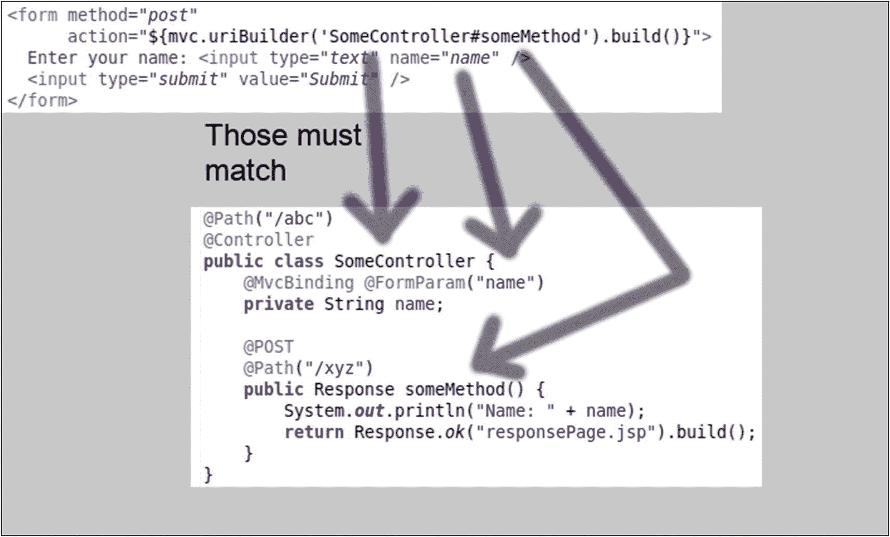

# 五、开始使用 Java MVC

在我们彻底处理 Java MVC 部分——模型、视图和控制器——之前，我们首先需要讨论一些从用例角度看待 Java MVC 的主题。这介于基本的 Hello World 章节和随后的 Java MVC 实现概念之间。本章的目的是逐步提高你对 Java MVC 开发的熟练程度。具体来说，我们将讨论如何处理来自表单帖子的数据、解析查询参数、转换输入数据类型以及处理异常。

## 处理表单中的用户输入

在 Java MVC 世界中，前端(浏览器)和控制器之间的数据传输可以通过网页上的`<form>`元素、前端用户提交发起的`POST`请求以及控制器类中的方法参数来实现。两个示例参数的相应视图代码如下所示:

```java
<%@ page contentType="text/html;charset=UTF-8"
    language="java" %>
<%@ taglib prefix="c"
    uri="http://java.sun.com/jsp/jstl/core" %>
<html>
...
<body>
  ...
  <form method="post"
        action="${mvc.uriBuilder(
                'SomeController#someMethod').build()}">
    P1 Parameter: <input type="text" name="p1" />
    P2 Parameter: <input type="text" name="p2" />
    ...
  </form>
  ...
</body>
</html>

```

这里使用的`mvc`对象是指`mvc`，一个自动提供的`MvcContext`实例(在`javax.mvc`包中)，它的方法`uriBuilder()`实现了 MVC 项目相关的 URIs/URL 的通用构造。

作为由`<form>`的动作属性寻址的控制器，我们取一个类似如下的类:

```java
...
import javax.mvc.binding.MvcBinding;
import javax.ws.rs.FormParam;
...

@Path("/abc")
@Controller
public class SomeController {
    ...

    @POST
    @Path("/xyz")
    public Response someMethod(
          @MvcBinding @FormParam("p1") String p1,
          @MvcBinding @FormParam("p2") String p2,
          ...more parameters...
    ) {
        // handle user input ...
        ...
        return Response.ok("responsePage.jsp").build();
    }
}

```

我们将在本章后面的单独章节中讨论控制器。目前，`@Controller`注释将该类标识为 Java MVC 控制器，`@Path`注释用于构建控制器及其方法使用的 URL(子)路径。从`@FormParam("p1")`开始的`p1`对应提交的`<form>`中的一个`<input name = "p1" >`，相应的一个`@FormParam("p2")`对应一个`<input name = "p2">`。

也可以避免使用方法参数，而是将用户数据传递给控制器实例字段。这种*数据绑定*使用以下结构:

```java
...
import javax.mvc.binding.MvcBinding;
import javax.ws.rs.FormParam;
...

@Path("/abc")
@Controller
public class SomeController {
    @MvcBinding @FormParam("p1")
    private String p1;

    @MvcBinding @FormParam("p2")
    private String p2;

    ...

    @POST
    @Path("/xyz")
    public Response someMethod() {
        // handle user input via "p1" and "p2" fields
        ...
       return Response.ok("responsePage.jsp").build();
    }
}

```

通常最好在方法中声明参数，因为其他方法可能有其他参数，将所有这些参数放在类级别会导致混乱。

对于表单参数，我们知道`@FormParam`注释直接将方法参数或字段连接到一个`<form>`输入元素。见图 [5-1](#Fig1) 。在下一节中，我们将讨论清单中显示的第二个参数注释，`@MvcBinding`。



图 5-1

表单到控制器的连接

## Java MVC 中的异常处理

上一节 Java 代码清单中使用的`@MvcBinding`注释引入了一些关于异常处理的魔法。通常，因为 Java MVC 位于 JAX-RS 之上，所以在输入数据处理期间抛出的异常只能由特殊的异常映射器捕获。这个过程不太适合 Java MVC 世界。我们希望在控制器和表单提交之间有一个明确的关系，一个异常处理映射器类引入了一种额外的“控制器”类型，严格来说，与任何 MVC 概念都没有关系。相反，通过使用`@MvcBinding`注释，无论是否有错误，都将调用相同的控制器和控制器方法，并且由验证不匹配和转换错误导致的传递错误将被提供给`javax.mvc.binding.BindingResult`的注入实例。

然后，您可以通过使用`BindingResult`实例的方法以编程方式检查任何错误:

```java
...
import javax.mvc.binding.MvcBinding;
import javax.mvc.binding.BindingResult;
import javax.ws.rs.FormParam;
import javax.validation.constraints.Size;
...

@Path("/abc")
@Controller
public class SomeController {
    @Named
    @RequestScoped
    public static class ErrorMessages {
      private List<String> msgs = new ArrayList<>();

      public List<String> getMsgs() {
        return msgs;
      }

      public void setMsgs(List<String> msgs) {
        this.msgs = msgs;
      }

      public void addMessage(String msg) {
        msgs.add(msg);
      }
    }

    // Errors while fetching parameters
    // automatically go here:
    private @Inject BindingResult br;

    // We use this to pass over error messages
    // to the response page:
    private @Inject ErrorMessages errorMessages;

    ...

    @POST
    @Path("/xyz")
    public Response someMethod(
          @MvcBinding @FormParam("p1")
           @Size(min=3,max=10)
               String p1,
          @MvcBinding @FormParam("p2")
               String p2)
    {
        // ERROR HANDLING //////////////////////////
        if(br.isFailed()) {
          br.getAllErrors().stream().
                 forEach((ParamError pe) -> {
            errorMessages.addMessage(pe.getParamName() +
                  ": " + pe.getMessage());
          });
    }
    // END ERROR HANDLING //////////////////////

    // handle user input via "p1" and "p2" params
    ...

    // advance to response page
    return Response.ok("responsePage.jsp").build();
  }
}

```

这里，我们为错误消息使用了一个内部类。当然，您也可以在自己的文件中为消息使用自己的类。还要遵守`p1`参数的`@Size`约束。这属于 bean 验证，我们后面会详细讲。这里使用的`@Size`约束意味着，如果输入的字符串少于三个字符或多于十个字符，验证错误将通过`BindingResult`键入的`br`字段提交。

在响应页面上，您可能会呈现如下错误:

```java
<%@ page contentType="text/html;charset=UTF-8"
    language="java" %>
<%@ taglib prefix="c"
    uri="http://java.sun.com/jsp/jstl/core" %>
<html>
...
<body>
  <div style="color:red">
  <c:forEach var="e" items="${errorMessages.msgs}">
      ${e}
  </c:forEach>
  </div>
...
</body>
</html>

```

凭借`@Named`注释，`${errorMessages. ...}`连接到`ErrorMessages`的注入实例(第一个字母降低)。

在正常响应页面中显示错误消息的另一种方法是将页面流转移到不同的视图页面。这很容易，因为我们在控制器方法中决定下一步去哪里。因此，我们可以这样写:

```java
...
@POST
@Path("/xyz")
public Response someMethod(...) {
    // ERROR HANDLING //////////////////////////
    if(br.isFailed()) {
      br.getAllErrors().stream().
          forEach((ParamError pe) -> {
        errorMessages.addMessage(pe.getParamName() +
           ": " + pe.getMessage());
    });
    // advance to error page
    return Response.ok("errorPage.jsp").build();
  }
  // END ERROR HANDLING //////////////////////

  // handle user input via "p1" and "p2" params
  ...

  // advance to response page
  return Response.ok("responsePage.jsp").build();
}
...

```

## 非字符串 POST 参数

在上一节中，我们只使用了`String`类型的`POST`参数。在 Java MVC 中，还可以使用数值类型`int`、`long`、`float`、`double`、`BigDecimal`、`BigInteger`和`boolean` ( `true`或`false`)。因此，可以编写以下内容:

```java
<%@ page contentType="text/html;charset=UTF-8"
    language="java" %>
<%@ taglib prefix="c"
    uri="http://java.sun.com/jsp/jstl/core" %>
<html>
...
<body>
  ...
  <form method="post"
        action="${mvc.uriBuilder(
                'SomeController#someMethod').build()}">
    Int Parameter: <input type="text"
        name="theInt" />
    Double Parameter: <input type="text"
        name="theDouble" />
    Boolean Parameter: <input type="text"
        name="theBoolean" />
    ...
  </form>
  ...
</body>
</html>

```

在控制器类中，编写以下内容:

```java
...
import javax.mvc.binding.MvcBinding;
import javax.ws.rs.FormParam;
...

@Path("/abc")
@Controller
public class SomeController {
    ...

    @POST
    @Path("/xyz")
    public Response someMethod(
        @MvcBinding @FormParam("theInt")
            int theInt,
        @MvcBinding @FormParam("theDouble")
            double theDouble,
        @MvcBinding @FormParam("theBoolean")
            boolean theBoolean)
    {
        // handle user input via the fields
        ...
        return Response.ok("responsePage.jsp").build();
    }
}

```

Java MVC 负责将`POST`参数正确地转换成指定的 Java 类型。

如果无法正确执行转换，可能是因为在`theInt`输入字段中输入了“x”，例如，可以使用注入的`BindingResult`(如前一节所述)来捕捉转换错误。

## 处理查询参数

HTTP 动词包括`POST`、`GET`、`PUT`、`DELETE`等。到目前为止，在浏览器到控制器的通信中，我们讨论了通过 HTML `<form>`元素传输数据的`POST`请求，以及请求登录页面的`GET`请求。考虑以下情况:在登录页面上，要求用户输入一些数据，然后提供一个提交按钮，将数据传输到控制器，并前进到响应页面。在响应页面上，我们想要添加一个后退按钮。该按钮需要以下附加功能:在字段中输入的所有数据应该再次显示。我们如何做到这一点？控制器`@FormParam`字段不能使用，因为它们只适用于表单`POST` s。

到目前为止，我们还没有使用会话数据存储，这延长了单个请求/响应周期。如果有的话，将用户输入存储在那里，然后用它来预置输入字段将是一种有效的方法。事实上，使用会话是可能的，但是我们将在本章的后面讨论它。此外，不使用会话可以减少内存占用并简化状态管理。

我们能做的和 Java MVC 支持的是查询参数的使用。如果`GET`打开，例如 [`http://xyz.com/the-app/start`](http://xyz.com/the-app/start) ，查询参数将添加到以`?`开始并使用`&`作为分隔符的附加字符串中:

[T2`http://xyz.com/the-app/start?name=John&birthday=19971230`](http://xyz.com/the-app/start%253Fname%253DJohn%2526birthday%253D19971230)

要在控制器中获取这样的查询参数，可以使用`@QueryParam`注释:

```java
...
import javax.mvc.binding.MvcBinding;
import javax.ws.rs.GET;
import javax.ws.rs.Path;
import javax.ws.rs.QueryParam;

@Path("/")
@Controller
public class SomeController {
    private @Inject BindingResult br;

    @GET
    @Path("/start")
    public String someMethod(
        @MvcBinding @QueryParam("name") String name,
        @MvcBinding @QueryParam("birthday") String birthday
  ) {
     if(name != null) {
       // handle "name" parameter
     }
     if(birthday != null) {
       // handle "birthday" parameter
     }

     // advance to page
     return "index.jsp";
  }
  ...
}

```

同样，与`POST`参数一样，也可以使用字段来获取查询参数:

```java
...
import javax.mvc.binding.MvcBinding;
import javax.ws.rs.GET;
import javax.ws.rs.Path;
import javax.ws.rs.QueryParam;

@Path("/")
@Controller
public class SomeController {
    private @Inject BindingResult br;

    @MvcBinding @QueryParam("name")
    private String name;

    @MvcBinding @QueryParam("birthday")
    private String birthday);

    @GET
    @Path("/start")
    public String someMethod() {
      if(name != null) {
        // handle "name" parameter
      }
      if(birthday != null) {
        // handle "birthday" parameter
      }

      // advance to page
      return "index.jsp";
    }
    ...
}

```

在 JSP 页面上，用于发出这种参数化的`GET`请求的专用元素是一个`<a>`链接:

```java
<a href="${mvc.uriBuilder('SomeController#someMethod').
          queryParam('name', userData.name).
          queryParam('birthday', userData.birthday).
          build()}">Link</a>

```

该代码片段使用了一个`userData`变量，该变量可以作为以下内容的实例注入:

```java
@Named
@RequestScoped
public class UserData {
  private String name;
  private String birthday;
  // Getters, setters...
}

```

显然，这个对象必须在控制器动作中填充数据，控制器动作最终调用带有`<a>`链接的页面。

对于请求参数，与`POST`请求一样，同样的转换规则也适用于非字符串类型的参数。您可以使用类型为`string`、数字类型为`int`、`long`、`float`、`double`、`BigDecimal`、`BigInteger`和`boolean` ( `true`或`false`)的字段或方法参数。被传递的查询参数被适当地转换。同样，因为我们用`@MvcBinding`标记了参数，所以这里应用了针对`POST`参数描述的处理异常的相同方法。

创建用先前输入的值填充原始页面的后退链接的详细过程如下:

1.  在数据输入页面(名为`dataInput.jsp`)上，值从`<form>`元素内部发布。

2.  在相应的控制器类和方法中，我们通过`@FormParam`注释的字段或方法参数检索数据，并以编程方式将值传输到注入的对象中(用`@Named`标记)。

3.  在后续页面(名为`responsePage.jsp`)上，我们创建了一个反向链接，其中包含来自注入对象的查询参数。

4.  在相应的控制器类和方法中，我们通过`@QueryParam`带注释的字段或方法参数检索数据，并以编程方式将值传输到注入的对象中(用`@Named`标记)。

5.  我们修改了`dataInput.jsp`中的`<input>`元素，增加了`value`属性:`<input ... value = "${injectedObject.field}">`，其中`injectedObject`对应于注入类`InjectedObject`的字段。

6.  对于验证和转换错误，我们注入一个`BindingResult`的实例。我们在控制器方法中使用它来检查错误。为此，我们必须将`@MvcBinding`添加到所有表单和查询参数中。

Note

可以同时使用表单(`POST`)参数和查询参数。只需将`queryParam( 'name', value )`方法调用添加到`<form>`动作的 URI 生成器中。但是，我们不想把事情搞得太复杂，所以在本书中不进一步考察这种混合。

## 练习

*   **练习 1:** 以下哪一项是正确的？网页上的`<form>`元素连接到:(A)控制器类的方法`userPosts()`。(B)由表单的`action = "..."`属性和控制器类及其方法使用的`@Path`注释确定的控制器类的某个方法。(C)注入控制器的某个模型元素。

*   **练习 2:** 描述 Java 类成为 Java MVC 控制器类的最低要求。

*   **练习 3:**JAX-RS 和 Java MVC 最明显的相似之处是什么？两者最突出的区别是什么？

*   **练习 4:**`@MvcBinding`标注的目的是什么？

*   **练习 5:** 将本章描述的错误处理添加到上一章的`HelloWorld`应用中。

*   **练习 6:** 继续上一个练习，添加一个验证约束，确保用户只输入英文字母作为姓名。提示:相应的正则表达式读作`[A-Za-z]*`。

*   **练习 7:** 添加一个返回链接到上一章中`HelloWorld`应用的响应页面。添加用户名作为查询参数，并确保输入的用户名再次出现在起始页的输入字段中。

## 摘要

在 Java MVC 世界中，前端(浏览器)和控制器之间的数据传输可以通过网页上的`<form>`元素(和/或查询参数)、前端用户提交(或链接点击)发起的`POST`(或`GET`)请求以及控制器类中的方法参数来实现。

`@Controller`注释将类标识为 Java MVC 控制器，而`@Path`注释用于构建控制器及其方法使用的 URL(子)路径。

通常，因为 Java MVC 位于 JAX-RS 之上，所以在输入数据处理期间抛出的异常只能由特殊的异常映射器捕获。

这个过程不太适合 Java MVC 世界。相反，通过使用`@MvcBinding`注释，无论是否有错误，都将调用相同的控制器和控制器方法，并且由于验证不匹配和转换错误导致的传递错误将被提供给`javax.mvc.binding.BindingResult`的注入实例。

除了在 Java MVC 中发布字符串类型的参数(和/或传递字符串类型的查询参数)，还可以使用数值类型`int`、`long`、`float`、`double`、`BigDecimal`、`BigInteger`和`boolean` ( `true`或`false`)。Java MVC 负责将`POST`参数正确地转换成指定的 Java 类型。

如果不能正确执行转换，可能是因为在整型输入字段中输入了“x ”,那么可以使用注入的`BindingResult`来捕捉转换错误。

在这个更加以用例为中心的 Java MVC 视图之后，我们在下一章继续讨论一个更加以概念为中心的视图，从模型开始，从 Java MVC 的视图和控制器部分开始。