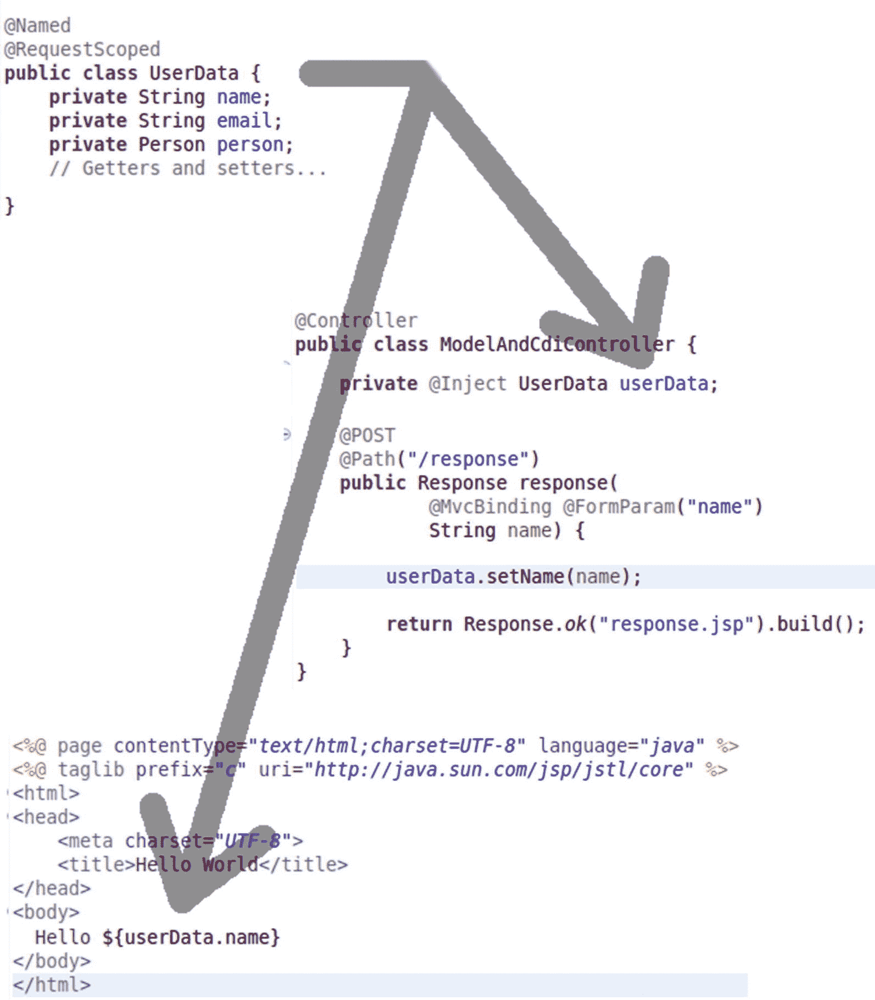
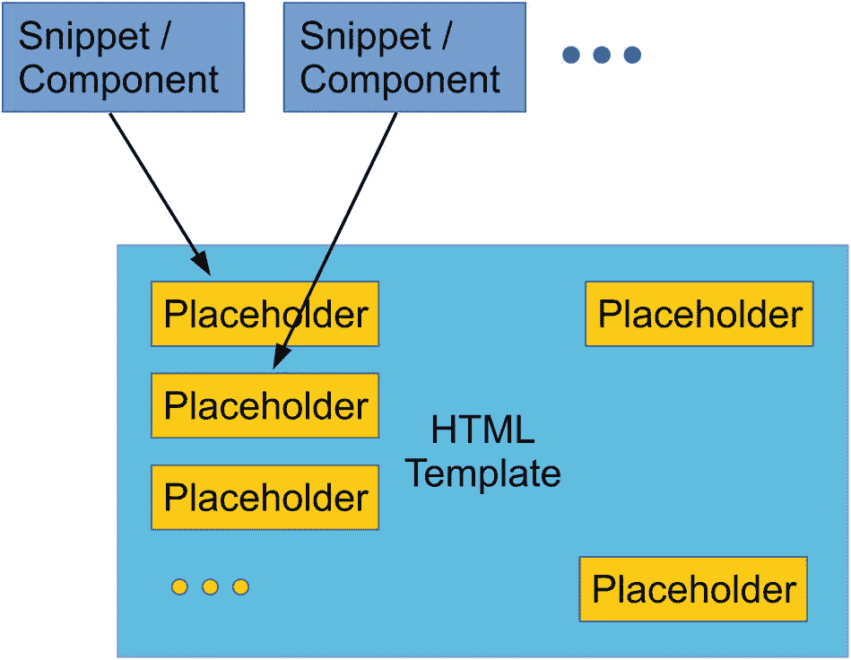
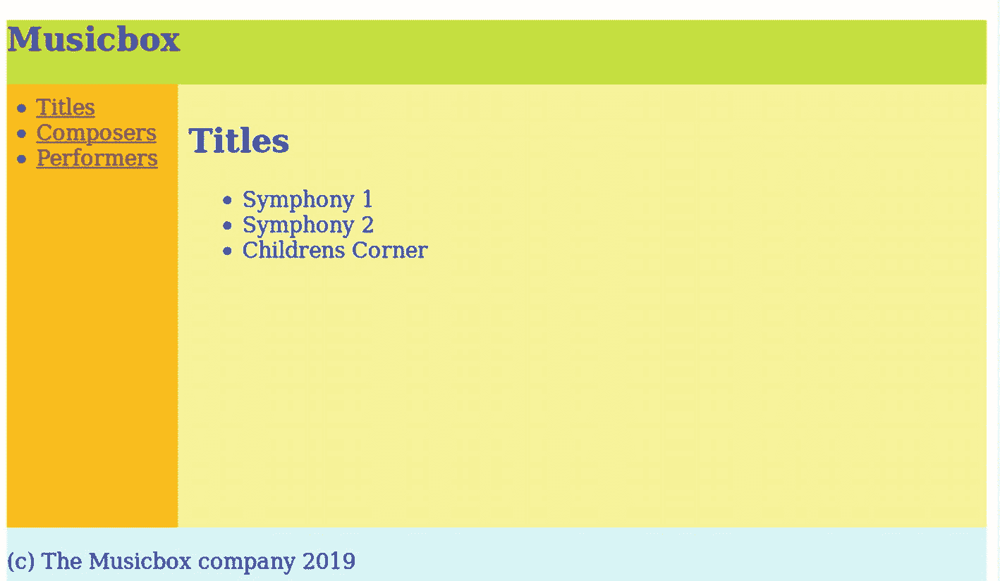
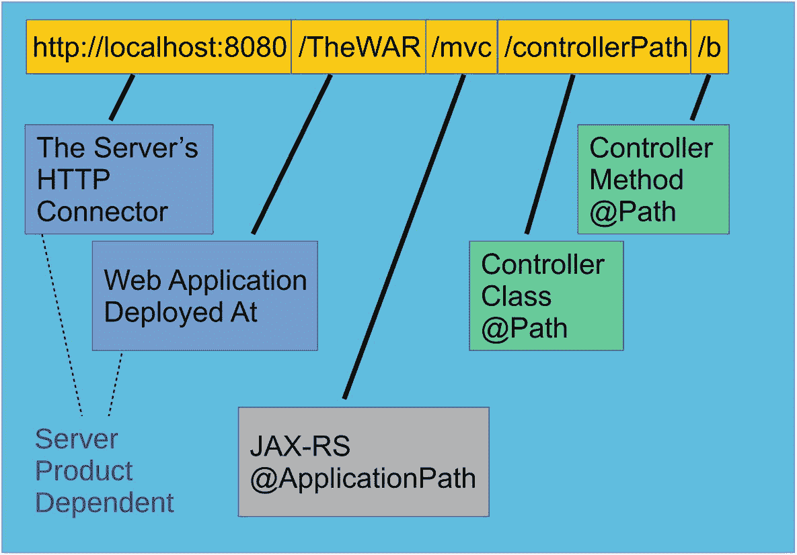

# 六、深入的 Java MVC

在这一章中，我们彻底地处理了 Java MVC 提供的各种特性。请注意，本章并不能替代官方的 Java MVC 规范(在撰写本书时，最新版本是 1.0)，您可以在以下网址找到该规范:

```java
https://download.oracle.com/otndocs/jcp/mvc-1-final-spec

```

相反，这一章涵盖了你最常遇到的模式，我们也将通过一些例子片段。

## 模型

对于 Java MVC 的*模型*部分，不要与数据库模型混淆，MVC 框架的最初想法是相当原始的。模型类只是 Java bean 类(具有字段、getters 和 setters 的类)，开发人员会以类似于下面的方式(这是伪代码，不是真正的 Java)以编程方式将它们添加到视图中:

```java
...
// inside some controller
String name = ...; // somehow via form POST
int i1 = ...;    // somehow via form POST

   HttpRequest req = ..; // somehow via framework

   MyBean b = new MyBean(); b.setName(name); b.setSomeInt(i1);

   req.setBean("beanName", b);

   // somehow advance to response page
   ...

```

在响应视图中，您可能会使用类似下面的表达式来访问模型 beans:

```java
Hello ${beanName.name}

```

其中`beanName`对应于来自伪代码的`setBean()`方法参数，`name`对应于字段名。

### Java MVC 中的 CDI

Java MVC 是一个现代框架，它的模型能力取代了简单引用 beans 的概念。它通过在 CDI 2.0 版本中为 Jakarta EE 8 引入 CDI(上下文和依赖注入)技术来实现这一点。CDI 不是一项小技术——它的规范 PDF 有 200 多页！不用说，我们不能介绍 CDI 的每一个概念，但是我们讨论了最重要的思想，并把我们的调查集中在 Java MVC 使用 CDI 的方式上。

Note

你可以在 [`https://jakarta.ee/specifications/cdi/2.0/`](https://jakarta.ee/specifications/cdi/2.0/) 找到 CDI 规范。

基本思想是相同的:我们希望实例化 bean 类(主要包含字段及其 getters 和 setters 的数据类),并将这些实例提供给控制器和视图。前 CDI 和 CDI 方式的主要区别在于，我们不自己实例化这样的模型类，而是让 CDI 来做。

为了告诉 Java MVC 我们希望模型类由 CDI 控制并对视图页面可用，我们使用了来自`javax.inject`包的`@Named`注释:

```java
import javax.enterprise.context.RequestScoped;
import javax.inject.Named;

@Named
@RequestScoped
public class UserData {
  private String name;
  private String email;
  // Getters and setters...
}

```

我们还使用`@RequestScoped`注释将对象实例的生命周期绑定到一个 HTTP 请求/响应周期。我们将在下一节中更多地讨论作用域。

一旦我们通过`@Named`向 CDI 框架宣布了一个 bean，在 Java MVC 中就会发生两件事。首先，我们可以使用`@Inject`(包`javax.inject`)从任何 Java MVC 控制器内部和任何其他 CDI 控制的类内部引用 bean 实例。其次，我们可以通过使用首字母小写的类名:`${userData.name}`和`${userData.email}`来使用视图页面中的实例。见图 6-1 。



图 6-1

Java MVC 中的 CDI

如果您想为 CDI beans 使用不同的名称，您可以使用带参数的`@Named`:

```java
import javax.enterprise.context.RequestScoped;
import javax.inject.Named;
@Named("user")
@RequestScoped
public class UserData {
  private String name;
  private String email;
  // Getters and setters...
}

```

然后，您可以在视图页面中使用更改后的名称:`${user.name}`。因为在`@Inject`中，引用是通过类名而不是注释参数发生的，所以为了注入到 Java 类中，您仍然要使用`@Inject private UserName userName;`，即使名称已经改变。

### 模型对象范围

如果您使用 CDI 来管理模型数据，那么模型类实例从属于由 CDI 管理的生命周期控件。这意味着 CDI 决定什么时候构造 beans，什么时候放弃它们。在注入的 beans 中，CDI 控制实例生命周期的方式是通过一个叫做 *scope* 的特性。在 Java MVC 中，存在以下作用域:

*   **请求范围** **:** 注入 bean 的实例是在 HTTP 请求期间创建的，并且只在 HTTP 请求和发送给客户端(浏览器)的响应的生命周期内有效。请求范围变量的一个典型使用场景是将`POST`表单数据或`GET`查询参数传递给响应中定义的视图层页面。因此，您将`@Named`请求范围 bean 注入控制器，在那里设置它们的字段，并在视图层使用 bean。因为请求作用域 beans 的生命周期很短，所以它们有助于保持 web 应用的低内存占用并避免内存泄漏。

*   **会话范围:**一个会话绑定到一个浏览器窗口，跨越几个 HTTP 请求/响应周期。每当用户进入 web 应用时，会话就开始，并在超时或显式会话取消时终止。会话范围内的数据对象占主导地位，直到触发某个超时或显式关闭会话。当需要维护生命周期超过一个 HTTP 请求/响应周期的状态时，可以使用会话范围的对象。会话数据简化了状态处理，但是极大地增加了 web 应用消耗内存或造成不稳定的内存泄漏的危险。

*   **重定向范围** **:** 为了支持`POST` -redirect- `GET`设计模式，Java MVC 为 CDI beans 定义了一个*重定向范围*。如果您想避免浏览器用户在`POST`动作终止前点击 reload 按钮时的重新发布，您可以使用这种模式。具有重定向范围的 beans 的生命周期跨越了`POST`和随后的`GET`(因为浏览器接收重定向代码 303)。在 Java MVC 控制器中，通过从处理`POST`的方法内部返回一个`Response.seeOther( URI.create("response/path" )).build()`或一个字符串`"redirect:response/path"`来启动`POST` -redirect- `GET`。流程如下:
    1.  用户在表单中输入数据并提交。Java MVC 控制器被调用。

    2.  控制器通过表单参数工作，最后方法返回`Response.seeOther( URI.create("response/path" )).build()`或`"redirect:response/path"`。

    3.  浏览器自动发送一个*重定向*到给定的路径。

    4.  `response/path`路径(相应地修改)指向另一个带有`GET`动词的控制器方法。它前进到一个视图页面，显示对用户请求的适当响应。

重定向范围 CDI beans 的生命周期是从最初的`POST`请求到随后的`GET`请求生成的响应，这是两个 HTTP 请求/响应周期。

*   **应用范围** **:** 任何应用范围内与用户无关的数据都可以使用这个范围。在取消部署 web 应用或停止服务器之前，数据一直有效。

*   **依赖作用域** **:** 这是伪作用域。这意味着 CDI bean 的作用域与激活它的 bean 的作用域相同。如果没有显式设置范围，则默认为依赖范围。

为了定义注入 bean 的范围，可以使用以下注释之一:

```java
@RequestScoped
@SessionScoped
@ApplicationScoped
@RedirectScoped
@Dependent

```

都是来自`javax.enterprise.context`包，除了`RedirectScoped`是 Java MVC 扩展，属于`javax.mvc.annotation`包。

### 简化模型数据容器

除了使用标有`@Named`注释的 CDI beans，您还可以使用`Models`的注入实例(在`javax.mvc`包中)。在控制器中，您可以编写以下内容:

```java
import javax.inject.Inject;
import javax.mvc.Controller;
import javax.mvc.Models;
...

@Path("/abc")
@Controller
public class SomeController {
    @Inject private Models models;

    ...
    // inside any method:
    models.put("name", name);
    ...
}

```

然后，模型值可从内部视图页面获得，无需前缀:

```java
Hello ${name}

```

仅在需要处理少量数据时使用`Models`接口。否则，您将面临无结构、不可理解的代码的风险。

Note

`Models`数据有请求范围。

如果您需要来自`Models`对象的模型值(仍然在同一个请求/响应周期内！)，可以使用`get()`方法:

```java
   Object o = models.get("someKey");

   // or, if you know the type
   String s = models.get("someKey", String.class);
}

```

## 视图:JSP

Java MVC 的视图部分负责向客户端(浏览器)呈现前端，包括输入和输出。那些连接到控制器方法的 Java MVC 视图文件在`WEB-INF/views`文件夹中，或者，因为我们使用 Gradle 作为构建框架，所以在`src/main/webapp/WEB-INF/views`文件夹中。

Java MVC 开箱即用，支持两种视图引擎——JSP(Java server Pages)和 Facelets(JSF 的视图声明语言，JavaServer Faces)。通过设计，基于 CDI 的扩展机制可以包含其他视图引擎。在本节中，我们将讨论 Java MVC 视图的 JSP 变体。

Note

有关 JSP 规范，请参见 [`https://download.oracle.com/otndocs/jcp/jsp-2_3-mrel2-spec/`](https://download.oracle.com/otndocs/jcp/jsp-2_3-mrel2-spec/) 。

### JSP 基础

JSP 允许开发人员将静态内容(例如 HTML)和由 JSP 元素表示的动态内容交织在一起。一个 JSP 页面被内部编译成一个继承自`Servlet`的大 Java 类。包含 JSP 代码的文件以`.jsp`结尾。

Note

对于 GlassFish，您可以在`GLASSFISH_INST/glassfish/domains/domain1/generated/jsp/-[PROJECT-NAME]`文件夹中看到生成的 servlets。

### 指令

JSP 指令为容器提供了方向。表 6-1 给出了指令的描述，表 6-2 具体列出了 JSP `page`指令。

表 6-2

jsp 指令页

<colgroup><col class="tcol1 align-left"> <col class="tcol2 align-left"></colgroup> 
| 

名字

 | 

描述

 |
| --- | --- |
| `buffer="..."` | 使用它来设置输出缓冲区的大小。可能的值:`none`(无缓冲)，或`Nkb`，其中`N`是一个数字，`kb`代表千字节(例如:8kb)。 |
| `autoFlush="true"&#124;"false"` | 输出缓冲区填满后自动刷新。否则，将引发异常。默认为`true`。 |
| `contentType="..."` | 设置输出的内容类型。例子:`text/html`、`text/xml`。要指定字符编码，添加`;charset=...`，如`contentType = "text/html;charset=UTF-8"`所示 |
| `errorPage="..."` | 指定在引发异常时显示的错误页面。这是一个相对 URL。示例:`errorPage = "error.jsp"` |
| `isErrorPage="true"&#124;"false"` | 如果`true`，将该 JSP 视为错误页面。 |
| `extends="some.pckg.SomeClass"` | 使生成的 servlet 扩展给定的类。这样，您可以提供自己的 servlet 实现。 |
| `import="..."` | 工作方式与 Java `import`语句完全一样。 |
| `info="..."` | 在此添加描述 JSP 的任何文本。 |
| `isThreadSafe="true"&#124;"false"` | 如果`false`，一次只有一个线程将处理 JSP。默认为`true`。 |
| `language="..."` | 指示使用的编程语言。这里写`java`。 |
| `session="true"&#124;"false"` | 如果选择`true`，将启用会话。默认为`true`。 |
| `isELIgnored="true"&#124;"false”"` | 如果为`true`，则表达式语言构造`${ ... }`不被求值。默认是`false`。 |
| `isScriptingEnabled="true"&#124;"false"` | 如果`true`，则启用动态 JSP 脚本。默认为`true`，设置为`false`除了真正的静态页面之外，通常没有任何意义。 |

表 6-1

jsp 指令

<colgroup><col class="tcol1 align-left"> <col class="tcol2 align-left"></colgroup> 
| 

名字

 | 

描述

 |
| --- | --- |
| `<% page ... %>` | 依赖于页面的属性。可能的参数如表 6-2 所示(空格分隔列表)。 |
| `<% include file="relative url" %>` | 在此位置包含另一个文件。例如:`<% include file = "header1a.jsp" %>` |
| `<% taglib uri="uri" prefix="prefix" %>` | 包括标签库。标记库文档中显示了精确的语法。 |

带有最常见指令的基本 JSP 文件头如下所示:

```java
<%@ page language="java"
    contentType="text/html;charset=UTF-8" %>
<%@ taglib prefix = "c"
    uri = "http://java.sun.com/jsp/jstl/core" %>
<%@ taglib prefix = "fmt"
    uri = "http://java.sun.com/jsp/jstl/fmt" %>

```

这意味着文本编辑器使用 UTF-8(我假设是这样)。两个`taglib`指的是 JSTL (JavaServer Pages 标准标记库)标记库。这个`taglib`的`core`和`fmt`部分指的是许多 web 应用通用的有用标签。

Note

JSTL 有更多的部件，我们不会用在 Java MVC 中。如果你想了解更多关于 JSTL 的信息，请前往 [`https://jcp.org/aboutJava/communityprocess/final/jsr052/index.html`](https://jcp.org/aboutJava/communityprocess/final/jsr052/index.html) 。

### 静态内容

要生成静态内容，只需将它逐字写入 JSP 文件中:

```java
<%@ page language="java"
    contentType="text/html;charset=UTF-8" %>
<%@ taglib prefix = "c"
    uri = "http://java.sun.com/jsp/jstl/core" %>
<%@ taglib prefix = "fmt"
    uri = "http://java.sun.com/jsp/jstl/fmt" %>

<html>
<head>
    <meta charset="UTF-8">
    <title>Model And CDI</title>
</head>
<body>
    <%-- The string inside action is dynamic contents --%>
    <form method="post"
        action="${mvc.
                 uriBuilder('ModelAndCdiController#response').
                 build()}">
      Enter your name: <input type="text" name="name" />
      <input type="submit" value="Submit" />
    </form>
</body>
</html>

```

这段代码将按原样输出，但有三个例外。最上面的指令是包含注释的`<%-- ... --%>`，以及代表由 JSP 引擎内部的处理步骤处理的表达式的`${ ... }`。

### Java Scriptlets 和 Java 表达式

因为 JSP 被转录成 Java 类，所以 JSP 允许 Java 代码和表达式包含在 JSP 页面中。语法如下:

```java
<%=
    Any Java code
    ...
%>

<%=
    Any Java expression (semicolons not allowed)
    ...
%>

```

第二个构造`<%= ... %>`，将表达式结果添加到 servlet 的输出流中。

Caution

不要过度使用这些结构。毕竟，Java 是面向对象的语言，而不是前端模板语言。

### 隐式对象

在`<%= ... %>`或`<% ... %>`中，有几个你可以使用的隐式对象:

*   `out`**:**`JspWriter`(扩展`java.io.Writer`)类型的 servlet 的输出流。

*   `request`:请求，类型`HttpServletRequest`。

*   `response`:响应，类型`HttpServletResponse`。

*   `session`:session，类型`HttpSession`。

*   `application`:应用，类型`ServletContext`。

*   `config`:servlet 配置，类型`ServletConfig`。

*   `page`:servlet 本身，类型`Object`(运行时类型`javax.servlet.http.HttpServlet`)。

*   `pageContext`:页面上下文，类型`PageContext`。

您可以使用这些对象来实现奇特的结果，但是请记住，如果您使用它们，您会以某种方式离开正式的开发模式。这可能会使其他人难以阅读您的代码，并且通过将功能放入视图页面，模型、视图和控制器之间的自然界限被打破。

### JavaBeans 组件

带有`@Named`注释的 CDI beans 被直接提供给 JSP:

```java
@Named
public class UserName {
  private String name;
  // Getters and setters...
}

JSP:
...
Hello ${userName.name}

```

如果您将模型数据添加到注入的`javax.mvc.Models` CDI bean 中，您可以直接访问它而无需前缀:

```java
Controller:

import javax.mvc.Models;
...
@Controller
public class SomeController {
  @Inject private Models models;
  ...
  // inside any method:
  models.put("name", name);
  ...
}

JSP:
...
Hello ${name}

```

在这两种情况下，您都在 JSP 中使用了一个*表达式语言*构造`${ ... }`。我们将在下一节讨论表达式语言。

Caution

由于隐式对象，您可以直接从 JSP 内部引用`POST`或查询参数。然而，这不像 MVC，因为它引入了控制器无法触及的第二个模型层，并且它将控制器的责任转移到视图。所以不要这样做，总是使用注入的 CDI beans 来代替。

### 表达式语言

像`${ ... }`这样的 JSP 页面中的构造被视为一个表达式，由表达式语言处理程序处理。表达式元素包括:

*   `name:`直接引用 CDI 托管 bean 或隐式对象。在呈现视图时，表达式导致使用`toString()`方法来生成输出。例如:`${user}`。

*   `value.property:`指的是一个`value`对象的`property`字段(必须有一个 getter)，或者如果`value`是一个 map，则是一个由`property`键控的 map 条目。例子:`${user.firstName}`(在`user` CDI bean 中必须有一个`getFirstName()`)和`${receipt.amount}` ( `receipt`是一个 map，`amount`是其中的一个 key)。

*   `value[property]:`指的是一个`value`对象的字段 value-of- `property`(必须有一个 getter)，或者如果`value`是一个映射，或者如果`property`计算为一个`int`(用于索引)并且如果`value`是一个列表或数组，则是一个由 value-of- `property`键控的映射条目。`property`也可以是字面意思，如`42`或`1.3`或`'someString'`或`"someString"`。示例:`${user['firstName']}`(与`${user.firstName}`相同)和`${list[2]}`(列表或数组中的第三个元素)。

*   `unaryOperator value:`将`unaryOperator`应用于`value`。一元运算符有(求反)、`not`或`!`和`empty`(值为`null`或空)。

*   `value1 binaryOperator value2:`将`binaryOperator`应用于`value1`和`value2`。二元运算符有:
    *   算术:`+`、`-`、`*`、`/`、`div`、`%`、`mod`(取模)

    *   逻辑:`and`和`&&`，`or`和`||`

    *   关系:`==`和`eq`、`!=`和`ne`、`<`和`lt`、`>`和`gt <` =、和`le`、`>=`和`ge`

*   `value1 ternaryOperatorA value2 ternaryOperatorB value3:`将`ternaryOperator`应用于`value1`、`value2`和`value3`。只有一个:`a ? b : c`评估为`b`如果`a`为真；否则，计算结果为`c`。

有几个隐式对象可以在表达式中使用，如表 6-3 所示。

表 6-3

EL 隐式对象

<colgroup><col class="tcol1 align-left"> <col class="tcol2 align-left"></colgroup> 
| 

名字

 | 

描述

 |
| --- | --- |
| `pageScope` | 具有来自`page`作用域的作用域变量的映射。 |
| `requestScope` | 具有来自`request`作用域的作用域变量的映射。 |
| `sessionScope` | 具有来自`session`作用域的作用域变量的映射。 |
| `applicationScope` | 具有来自`application`作用域的作用域变量的映射。 |
| `paramValues` | 将请求参数作为字符串集合的映射。在 Java MVC 应用中，通常不会通过表达式访问这样的数据，所以不要使用它。 |
| `param` | 将请求参数作为字符串的映射(每个请求参数的第一个)。在 Java MVC 应用中，通常不会通过表达式访问这样的数据，所以不要使用它。 |
| `headerValues` | 将 HTTP 请求头作为字符串集合的映射。 |
| `header` | 将 HTTP 请求头作为字符串的映射(每个头的第一个)。要访问某个标题，你可以写`${header["user-agent"]}`。 |
| `initParam` | 带有上下文初始化参数的映射。 |
| `cookie` | 将 cookie 名称映射到`javax.servlet.http.Cookie`的实例。 |
| `pageContext` | 类型为`javax.servlet.jsp.PageContext`的对象。允许您访问各种对象，如请求、响应和会话。 |

### 输出

如果您喜欢使用标签进行动态输出，您可以使用如下的`<c:out>`标签:

```java
Hello <c:out value="${userData.name}" />

<%-- Similar to --%>
Hello ${userData.name}

```

然而，它们并不完全相同。如果没有额外的`escapeXml = "false"`，标签将例如用`>`替换`>`，用`<`替换`<`。如果`${userData.name}`恰好是`<John>`，你在`Hello ${userData.name}`的浏览器窗口里什么也看不到。浏览器看到一个`<John>`，它将其解释为一个(无效的)标签。相反，标签变量输出一个显示为`<John>`的`<John>`。

`<c:out>`的属性如下:

*   `escapeXml`:是否对特殊 XML 字符进行转义。不需要；默认为`true`。

*   `value`:要打印的数值。必选。通常你在这里写一个类似于`${someBean.someProperty}`的表达式。

*   `default`:值出问题时默认写入。不需要。

### 变量

使用`<c:set>`标签，我们可以引入变量，以便在页面上进一步使用。在 Java MVC 世界中，最常见的使用场景是引入别名来提高可读性。像设置会话范围变量这样的任务不应该在 JSP 内部完成，因为这是控制器的责任。

```java
<c:set var="firstName" value=${user.firstName} />
<%-- We can henceforth use 'firstName' in expressions
     Instead of 'user.firstName' --%>
Hi ${firstName}

```

`<c:set>`标签的完整属性集如下所示:

*   `value`:用于新变量(或属性)的值。通常，您在这里编写一个类似于`${someBean.someProperty}`的表达式。

*   `var`:存储值的新变量的名称。不是必需的，但是如果没有给出，`target`和`property`必须使用。

*   `scope`:在`var="..."`中给定的变量的范围。默认为`page`(仅当前渲染的页面)。

*   `target`:存储值的对象或贴图。不需要。

*   `property`:如果指定了`target`，属性(字段)或关键字(用于地图)的名称。不需要。

### 环

对于列表或数组上的循环，可以使用`<c:forEach>`标签(`c`表示`jstl/core taglib`):

```java
<c:forEach items="${theList}" var="item">
  ${item} <br/>
</c:forEach}

```

`items="..."`中的表达式可以是任何数组或字符串、原语或其他对象的列表。

您将经常在 HTML 表格中使用这样的循环。在控制器中，您构建一个 item 对象列表，每个项目代表表中的一行:

```java
// probably inside a models package:
@Named
@RequestScoped
public class Members {
  private List<Member> list = new ArrayList<>();
  public void add(Member member) {
     list.add(member);
  }
  // Getters, setters...
}

public class Member {
  private int id;
  private String firstName;
  private String lastName;
  // Constructors, getters, setters...
}

// probably inside a controllers package:
@Controller
public class MyController {
    @Inject private Members members;

    // inside a method:
    members.add(new Member(...));
    members.add(new Member(...));
    ...
}

```

在 JSP 中，我们现在可以通过`${members. ...}`访问`Members`对象，并从列表中构建一个表:

```java
<%@ page contentType="text/html;charset=UTF-8"
    language="java" %>
<%@ taglib prefix="c"
    uri="http://java.sun.com/jsp/jstl/core" %>
<html>
<head>
    <meta charset="UTF-8">
    <title>Table</title>
</head>
<body>
  <table>
    <thead>
      <tr>
        <th>ID</th>
        <th>Last Name</th>
        <th>First Name</th>
      </tr>
    </thead>
    <tbody>
      <c:forEach items="${members.list}" var="item">
        <tr>
           <td>${item.id}</td>
           <td>${item.lastName}</td>
           <td>${item.firstName}</td>
        </tr>
      </c:forEach>
    </tbody>
  </table>
</body>
</html>

```

`<c:forEach>`标签的所有可能属性如下:

*   `items:`要迭代的项目。不是必需的，但是如果缺少，循环将迭代一个整数。这是你可能写一个类似于`${someBean.someListOrArray}`的表达式的地方。

*   `var:`页面范围变量的名称，该变量将被生成并保存循环中的每一项。不需要。

*   `begin:`元素开始。不需要；默认为`0`(第一项)。

*   `end:`结束元素。不需要；默认值是最后一个元素。

*   `step:`这一步。不需要；默认为`1`。

*   `varStatus:`循环状态变量的名称(页面范围)。不需要。该变量将保存一个类型为`javax.servlet.jsp.jstl.core.LoopTagStatus`的对象。

如果您想在一个整数值范围循环中使用`<c:forEach>`标记，您不需要指定`items`属性，而是使用`begin`和`end`属性:

```java
<c:forEach begin="1" end="10" var="i">
  ${i}<br/>
</c:forEach>

```

### 条件分支

对于 JSP 内部的条件分支，您可以使用`<c:if>`和`<c:choose>`标签之一。简单的`<c:if>`测试允许进行简单的条件检查，无需替代方案和`else`分支:

```java
<c:if test="${showIncome}">
   <p>Your income is: <c:out value="${income}"/></p>
</c:if>

```

使用下面的结构可以轻松地实现一个`if-else`:

```java
<c:if test="${showIncome}">
   <p>Your income is: <c:out value="${income}"/></p>
</c:if><c:if test="${!showIncome}">
   <p>Your income is: ***</p>
</c:if>

```

然而，对于真正的`if-elseif-elseif-...-else`，`<choose>`标签是更好的选择:

```java
<c:choose>
    <c:when test="${income <= 1000}">
       Income is not good.
    </c:when>
    <c:when test="${income > 10000}">
       Income is very good.
    </c:when>
    <c:otherwise>
       Income is undetermined...
    </c:otherwise>
</c:choose>

```

### 饼干

通过使用隐式的`cookie`对象，可以直接从 JSP 内部读取 Cookies:

```java
Cookie name: ${cookie.theCookieName.name} <p/>
Cookie value: ${cookie.theCookieName.value} <p/>

```

其中`theCookieName`被替换为 cookie 名称。然后，`${cookie.theCookieName}`引用了一个类型为`javax.servlet.http.Cookie`的对象。但是，只有名称和值可用。

出于测试目的，您可以在控制器方法中创建一个名为`theCookieName`的 cookie(随意设置 cookie 属性):

```java
@Controller
@Path("abc")
public class MyController {
  @GET
  public Response myResponse() {
      ...
      // This is a subclass of Cookie:
      NewCookie ck = new NewCookie("theCookieName",
          "cookieValue",
          "the/path",
          "my.domain.com",
          42,
          "Some Comment",
          3600*24*365,
          false);

      return Response.
          ok("responsePage.jsp").
           cookie(ck).
          build();
  }
  ...
}

```

在响应页面(或稍后的页面)中，您可以编写所示的 JSP 代码来研究 cookie。

Caution

对于本地测试服务器，您必须将`localhost`设置为 cookie 域。此外，您必须设置适当的路径值，为了简单起见，可能是`/`(它匹配所有路径)。

## 视图:Facelets

除了 JSP 之外，Java MVC 支持其他视图技术是 *Facelets* 。Facelets 是专门为 JSF 创建的模板框架，JSF (JavaServer Faces)是 Jakarta EE 专用的主要前端技术。JSF 是基于组件的，而 Java MVC 是基于动作的。这就是问题出现的地方:Java MVC 在某种程度上是 JSF 的竞争对手，所以 Java MVC 和 Facelets 乍一看似乎不匹配。好消息是，因为 JSF 和 Facelets 是高度解耦的，我们不必使用 JSF 组件，Facelets 作为一个简单的模板引擎也可以用于 Java MVC。这很好，因为与 JSP 相比，Facelets 更适合现代编程风格，JSP 有时被认为是老派的，尽管令人尊敬。

但是，我们并不是无意将 Facelets 作为 Java MVC 的模板引擎放在第二位的。几十年来，JSP 已经被证明是有价值的，它们更接近前端开发人员经常使用的基本编程范例。此外，如果您有一些 JSF 编程经验，使用 Facelets 可以避免尝试使用 Java MVC 的 JSF 特性的危险，这很容易搞乱您的应用设计。相比之下，Facelets 应用了更高程度的抽象，如果由熟练的开发人员使用，它允许更精简和更干净的应用设计。

话虽如此，使用哪种前端技术完全取决于您。本节将向您展示如何使用 Facelets for Java MVC。

### Facelets 文件

Java MVC 的 Facelets 文件与 JSP 文件放在同一个文件夹中:文件夹`WEB-INF/views`，或者，因为我们使用 Gradle 作为构建框架，所以放在文件夹`src/main/webapp/WEB-INF/views`中。

Facelets 文件是 XML 文件，这可能是 JSP 和 Facelets 之间最显著的区别。Facelets 中没有类似于`\ci{<\% ... \%>}`的指令，也不能使用不是有效 XML 的遗留 HTML 结构，但是 JSP 允许使用。

### Facelets 配置

我们在 JSP 编程中实现的，避免了提供`web.xml`配置文件的需要，也可以在 Facelets 中实现。首先，我们提供了一个`App`类来将`mvc`添加到 URL 上下文路径中:

```java
package any.project.package;

import javax.ws.rs.ApplicationPath;
import javax.ws.rs.core.Application;

@ApplicationPath("/mvc")
public class App extends Application {
}

```

该类故意为空；上下文路径元素仅由注释添加。

接下来，我们添加一个重定向器，它允许我们使用基本 URL [`http://the.server:8080/WarName/`](http://the.server:8080/WarName/) 来启动应用(这是针对 GlassFish 的，`WarName`需要替换为 WAR 文件名)。重定向器将这样的请求转发给 [`http://the.server:8080/WarName/mvc/facelets`](http://the.server:8080/WarName/mvc/facelets) ，我们将使用它作为在控制器类中配置的登录页面的入口点。名字不重要；我们称之为`RootRedirector`:

```java
package any.project.package;

import javax.servlet.FilterChain;
import javax.servlet.annotation.WebFilter;
import javax.servlet.http.HttpFilter;
import javax.servlet.http.HttpServletRequest;
import javax.servlet.http.HttpServletResponse;
import java.io.IOException;

@WebFilter(urlPatterns = "/")
public class RootRedirector extends HttpFilter {
  private static final long serialVersionUID =
        7332909156163673868L;

@Override
  protected void doFilter(final HttpServletRequest req,
        final HttpServletResponse res,
        final FilterChain chain) throws      IOException {
      res.sendRedirect("mvc/facelets");
  }
}

```

剩下要做的就是注意在控制器中,“facelets”路径将导致登录页面上的`GET`:

```java
import javax.mvc.Controller;
import javax.ws.rs.GET;
import javax.ws.rs.Path;
import javax.ws.rs.core.Response;

@Path("/facelets")
@Controller
public class MyFaceletsController {
    @GET
    public Response showIndex() {
        return Response.ok("index.xhtml").build();
    }
    ...
}

```

### 通过 Facelets 进行模板化

Facelets 允许我们引入参数化的模板 HTML 页面、要包含在页面中的 HTML 片段(组件)、这种片段的占位符，以及修饰器和类似精心制作的列表视图的重复。在接下来的页面中，我们首先使用 Facelets 标记，然后开发一个示例应用来帮助您入门。

要使用 Facelets，必须将 Facelets 名称空间添加到 XHTML 文件中:

```java
<?xml version='1.0' encoding='UTF-8' ?>
<!DOCTYPE html>
<html lang="en"
      xmlns:="http://www.w3.org/1999/xhtml"
      xmlns:ui="http://java.sun.com/jsf/facelets">
    <h:head>
        <title>Facelet Title</title>
    </h:head>
<body>
  ...
</body>
</html>

```

在接下来的小节中，我们将解释可以包含在 XHTML 文件中的 Facelets 标签，以应用或混合模板、包含 XHTML 片段或传递参数。

#### <include>标签</include>

包括另一个 XHTML 文件，如

```java
<ui:include src="incl.xhtml" />

```

如果包含的文件包含一个`<ui:composition>`或者一个`<ui:component>`，那么只有`<ui:composition>`或者`<ui:component>`标签的内部内容会被包含。这使得设计者可以独立于他们后来通过服务器连接在一起的文件来设计包含的文件。

#### <composition>标签，第一个变体</composition>

如果使用*而不使用*??，例如

```java
<ui:composition>
    ...
</ui:composition>

```

它定义了 HTML 元素的子树(集合)。其背后的思想是，如果您使用`<ui:include>`并且包含的文件包含一个`<ui:composition> ... </ui:composition>`，那么只有`<ui:composition> ... </ui:composition>`的内部内容将被包含。标签本身及其周围的任何内容都将被忽略。因此，您可以让页面设计人员创建一个完全有效的 XHTML 文件，在有趣的部分加上`<ui:composition> ... </ui:composition>`，并在任何其他 JSF 页面中编写`<ui:include>`来提取这些部分。

#### <composition>标签，第二个变体</composition>

如果它。*与*连用，如在

```java
<ui:composition template="templ.xhtml">
    ...
</ui:composition>

```

它定义了一组 XHTML 片段，这些片段将被传递到模板文件中的占位符中(对应于`template = "..."`属性)。

这和没有`template="..."`的`<ui:composition>`相比是完全不同的使用场景。在模板文件中，你有一个或多个像`<ui:insert name="name1" />`这样的元素，在带有`<ui:composition template="...">`的文件中，你在和`<ui:composition template="..."> ... </ui:composition>`中使用`<ui:define>`标签

```java
<ui:composition template="templ.xhtml">
    <ui:define name = "someName"> ... </ui:define>
    <ui:define name = "someName2"> ... </ui:define>
    ...
</ui:composition>

```

定义用于`<ui:insert>`标签的内容。标签周围的任何东西都将被忽略，所以你可以让设计者使用非 JSF 感知的 HTML 编辑器创建代码片段，然后用 ?? 提取感兴趣的部分来具体化模板文件。

#### <insert>标签</insert>

使用它来定义模板文件中的占位符。模板文件中的`<ui:insert name="name1"/>`标签意味着引用该模板的任何文件都可以定义占位符的内容。这个定义必须发生在`<ui:composition>`、`<ui:component>`、`<ui:decorate>`或`<ui:fragment>`内部。

通常你不需要在这个标签中提供内容。如果您添加内容，如

```java
<ui:insert name="name1">
    Hello
</ui:insert>

```

如果没有另外定义占位符，它将被视为默认值。

#### <define>标签</define>

这个标签声明了将在插入点插入什么:

```java
<ui:define name="theName">
    Contents...
</ui:define>

```

由于插入点只能存在于模板文件中，`<ui:define>`标签只能出现在通过`<ui:composition template = "...">`引用模板文件的文件中

#### <param>标签

指定一个参数，该参数传递给一个`<ci:include>`编辑的文件，或者传递给在`<ui:composition template = "..."> ...`中指定的模板，只需将它作为子元素添加即可，如下所示:

```java
<ui:include src="comp1.xhtml">
    <ui:param name="p1" value="Mark" />
</ui:include>

```

在引用的文件中，添加`#{paramName}`以使用参数:

```java
<h:outputText value="Hello #{p1}" />

```

#### <component>标签</component>

这与第一个没有模板规范的变体`<ui:composition>`相同，但是它向 JSF 组件树添加了一个元素。此标签支持以下属性:

*   `id`:组件树中元素的 ID。不需要；如果不指定，JSF 会自动生成一个 ID。可能是 EL(表达式语言)字符串值。

*   `binding`:用于将组件绑定到 Java 类(必须从`javax.faces.component.UIComponent`继承)。不需要。可能是 EL 字符串值(类名)。

*   `rendered`:是否渲染组件。不需要。可能是 EL 布尔值。

通常的做法是使用`<ui:param>`将参数传递给组件。例如，您可以告诉组件使用特定的 ID。调用者如下:

```java
<ui:include src="comp1.xhtml">
    <ui:param name="id" value="c1" />
</ui:include>

```

被叫方(`comp1.xhtml`)如下:

```java
<ui:component id="#{id}">
    ...
</ui:component>

```

### <decorate>标签</decorate>

类似于`<ui:composition>`，但是这个标签不*不*忽略它周围的 XHTML 代码:

```java
...
I'm written to the output!
<ui:decorate template="templ.xhtml">
    <ui:define name="def1">
        I'm passed to "templ.xhtml", you can refer to
        me in "templ.xhtml" via
        <ui:insert name="def1"/&gth;
    </ui:define>
</ui:include>
...

```

与`<ui:composition>`相反，带有`<ui:decorate>`的文件将包含完全有效的 XHTML 代码，包括`html`、`head`和`body`，模板文件将被插入到`<ui:decorate>`出现的地方。因此，它不能包含`html`、`head`或`body`。这或多或少是一个扩展的`include`，其中传递的数据不是由属性给出，而是列在标记体中。

您通常应用`<ui:decorate>`标签来进一步细化代码片段。您可以将它们包装成更多的`<div>`来应用更多的样式、添加标签或标题等等。

#### <fragment>标签</fragment>

这个标签与`<ui:decorate>`相同，但是它在 JSF 组件树中创建了一个元素。它具有以下属性:

*   `id`:组件树中元素的 ID。不需要；如果不指定，JSF 会自动生成一个 ID。可能是 EL(表达式语言)字符串值。

*   `binding`:用于将组件绑定到 Java 类(必须从`javax.faces.component.UIComponent`继承)。不需要。可能是 EL 字符串值(类名)。

*   `rendered`:组件是否渲染。不需要。可能是 EL 布尔值。

您可以使用它来提取现有的代码片段，并将它们部分转换为组件。例如，考虑以下代码:

```java
<DOCTYPE html>
<html ...><head>...</head>
<h:body>
  ...
  <table>
      Some table|
  </table>
  ...
</h:body></html>

```

如果我们现在将表提取到一个不同的文件中，名为`table1_frag.xhtml`:

```java
<!-- Caller: ############################# -->
<!-- original file                        -->
<DOCTYPE html>
<html ...><head>...</head>
<h:body>
  ...
  <ui:include src="table1_frag.xhtml"/>
  ...
</h:body></html>

<!-- Callee: ############################# -->
<!-- table1_frag.xhtml                     -->
<div xmlns:="http://www.w3.org/1999/xhtml"
  xmlns:h="http://xmlns.jcp.org/jsf/html"
xmlns:f="http://xmlns.jcp.org/jsf/core"
xmlns:ui="http://java.sun.com/jsf/facelets"
xmlns:pt="http://xmlns.jcp.org/jsf/passthrough">
  <div>I am the table caption</div>
  <ui:fragment>
    <table>
      [Some table|
    </table>
  </ui:fragment>
  </div>

```

我们引入了 XHTML(标题)和一个新组件(表格)。

#### <repeat>标签</repeat>

这不一定是与模板相关的标记，但是它被用来在集合或数组中循环。它的属性是:

*   `begin`:不需要。如果指定了，迭代从列表或数组开始。可能是一个`int`值表达式。

*   `end`:不需要。如果指定，迭代在列表或数组中结束。可能是一个`int`值表达式。

*   `step`:不需要。如果指定，则在列表或数组内单步执行。可能是一个`int`值表达式。

*   `offset`:不需要。如果指定，偏移量将被添加到迭代值中。可能是一个`int`值表达式。

*   `size`:不需要。如果指定，它是从集合或数组中读取的最大元素数。不得大于数组大小。

*   `value`:要迭代的列表或数组。一个`Object`值表达式。必选。

*   `var`:保存当前迭代项的表达式语言变量的名称。可能是一个`String`值表达式。

*   `varStatus`:不需要。用于保存迭代状态的变量的名称。具有只读值的 POJO:`begin`(`int`)，`end` ( `int`)，`index` ( `int`)，`step` ( `int`)，`even` ( `boolean`)，`odd` ( `boolean`)，`first` ( `boolean`)或`last` ( `boolean`)。

*   `rendered`:是否渲染组件。不需要。可能是 EL 布尔值。

Note

JSTL (Java 标准标签库)集合为循环提供了一个`<c:forEach>`标签。由于观念上的差异，JSF 和 JSTL 并没有很好地合作。在教程和博客中，你会发现很多 JSTL 循环的例子。然而，最好使用`<ui:repeat>`来避免问题。

#### <debug>标签</debug>

在项目的开发阶段将它添加到您的页面中。使用热键，标签将导致 JSF 组件树和其他信息显示在页面上。使用`hotkey="x"`属性改变热键。然后 Shift+Ctrl+x 将显示组件(注意，默认的`d`不支持 Firefox 浏览器！).第二个可选属性是`rendered="true|false"`(你也可以使用一个 EL 布尔表达式)来打开或关闭这个组件。

Note

这个标签只在开发项目阶段有效。在`WEB-INF/web.xml`里面，你可以添加这个标签:

```java
<context-param>
   <param-name>javax.faces.PROJECT_STAGE</param-name>
   <param-value>Development</param-value>
</context-param>

```

指定项目阶段(任意一个`Development`(默认)`UnitTest`、`SystemTest`或`Production`)。

### Facelets 项目示例

我们用音乐盒数据库构建了一个示例 Facelets 项目，它显示了标题、作曲家和表演者的类似设计页面。我们在 web 应用的每个页面上都有一个页眉、页脚和一个菜单，不管用户当前使用的是哪种功能。Facelets 很好地让我们分离出了常见的页面部分，因此我们只需编写一次代码。见图 [6-2 。



图 6-2

使用 Facelets 进行模板化

在 Eclipse 中启动一个新的 Gradle 项目，并将其命名为`MusicBox`。使用`build.gradle`文件并将其内容替换为:

```java
plugins {
    id 'war'
}

java {
    sourceCompatibility = JavaVersion.VERSION_1_8
    targetCompatibility = JavaVersion.VERSION_1_8
}

repositories {
    jcenter()
}

dependencies {
   testImplementation 'junit:junit:4.12'
   implementation 'javax:javaee-api:8.0'
   implementation 'javax.mvc:javax.mvc-api:1.0.0'
   implementation 'org.eclipse.krazo:krazo-jersey:1.1.0-M1'
   implementation 'jstl:jstl:1.2'
   implementation 'com.google.guava:guava:28.0-jre'
}

task localDeploy(dependsOn: war,
             description:">>> Local deploy task") {
  doLast {
    def FS = File.separator
    def glassfish = project.properties['glassfish.inst.dir']
    def user = project.properties['glassfish.user']
    def passwd = project.properties['glassfish.passwd']

    File temp = File.createTempFile("asadmin-passwd",
        ".tmp")
    temp << "AS_ADMIN_${user}=${passwd}\n"

    def sout = new StringBuilder()
    def serr = new StringBuilder()
    def libsDir =
        "${project.projectDir}${FS}build${FS}libs"
    def proc = """${glassfish}${FS}bin${FS}asadmin
       --user ${user} --passwordfile ${temp.absolutePath}
       deploy --force=true
       ${libsDir}/${project.name}.war""".execute()
    proc.waitForProcessOutput(sout, serr)
    println "out> ${sout}"
    if(serr.toString()) System.err.println(serr)

    temp.delete()
  }
}

task localUndeploy(
             description:">>> Local undeploy task") {
  doLast {
    def FS = File.separator
    def glassfish = project.properties['glassfish.inst.dir']
    def user = project.properties['glassfish.user']
    def passwd = project.properties['glassfish.passwd']

    File temp = File.createTempFile("asadmin-passwd",
        ".tmp")
    temp << "AS_ADMIN_${user}=${passwd}\n"

    def sout = new StringBuilder()
    def serr = new StringBuilder()
    def proc = """${glassfish}${FS}bin${FS}asadmin
        --user ${user} --passwordfile ${temp.absolutePath}
        undeploy ${project.name}""".execute()
    proc.waitForProcessOutput(sout, serr) println "out> ${sout}"
    if(serr.toString()) System.err.println(serr)

    temp.delete()
  }
}

```

除了依赖处理之外，这个构建文件还引入了两个定制任务，用于在本地服务器上部署和取消部署`MusicBox` web 应用。番石榴库只是一个简化基本开发需求的有用工具的集合。

为了连接到`asadmin`工具，我们在项目根目录下创建另一个名为`gradle.properties`的文件:

```java
glassfish.inst.dir = /path/to/glassfish5.1
glassfish.user = admin
glassfish.passwd =

```

您应该输入自己的 GlassFish 服务器安装路径。空密码是 Glassfish 的默认设置。如果您对此进行了更改，则必须在该文件中输入密码。

对于`musicbox`数据，我们创建三个 Java 类。为了简单起见，它们返回静态信息。在现实生活中，您将连接到数据库来获取数据。创建一个名为`book.javamvc.musicbox.model`的包，并添加以下内容:

```java
// Composers.java:
package book.javamvc.musicbox.model;

import java.io.Serializable;
import java.util.List;

import javax.enterprise.context.SessionScoped;
import javax.inject.Named;

import com.google.common.collect.Lists;

@SessionScoped
@Named
public class Composers implements Serializable {
    private static final long serialVersionUID =
        -5244686848723761341L;

    public List<String> getComposers() {
        return Lists.newArrayList("Brahms, Johannes",
              "Debussy, Claude");
    }
}

// Titles.java:
package book.javamvc.musicbox.model;

import java.io.Serializable;
import java.util.List;

import javax.enterprise.context.SessionScoped;
import javax.inject.Named;

import com.google.common.collect.Lists;

@SessionScoped
@Named
public class Titles implements Serializable {
    private static final long serialVersionUID =
        -1034755008236485058L;

    public List<String> getTitles() {
        return Lists.newArrayList("Symphony 1",
            "Symphony 2", "Childrens Corner");
    }
}

// Performers.java:
package book.javamvc.musicbox.model;

import java.io.Serializable;
import java.util.List;

import javax.enterprise.context.SessionScoped;
import javax.inject.Named;

import com.google.common.collect.Lists;

@SessionScoped
@Named
public class Performers implements Serializable {
    private static final long serialVersionUID =
        6941511768526140932L;

    public List<String> getPerformers() {
        return Lists.newArrayList(
            "Gewandhausorchester Leipzig",
            "Boston Pops");
    }
}

```

为了让 CDI 正常工作，创建一个名为`src/main/webapp/WEB-INF/beans.xml`的空文件。再加一个文件，叫`src/main/webapp/WEB-INF/glassfish-web.xml`。它应包含以下内容:

```java
<?xml version="1.0" encoding="UTF-8"?>
<glassfish-web-app error-url="">
    <class-loader delegate="true"/>
</glassfish-web-app>

```

在我们进入视图编码之前，图 6-3 展示了我们想要实现的印象。为了应用 Facelets 功能，我们添加了一个名为`src/main/webapp/WEB-INF/frame.xhtml`的模板文件:



图 6-3

Musicbox Facelets 应用

```java
<!DOCTYPE html>
<html lang="en"
      xmlns:="http://www.w3.org/1999/xhtml"
      xmlns:ui="http://java.sun.com/jsf/facelets">
<head>
  <title>Musicbox</title>
  <link rel="stylesheet" href="../../css/style.css" />
</head>

<body>
  <div class="header-line">
      <ui:insert name="header">
        <h2>Top Section</h2>
      </ui:insert>
  </div>
  <div class="center-line">
      <div class="menu-column">
        <ui:insert name="menu">
          <ul><li>Menu1</li><li>Menu2</li></ul>
        </ui:insert>
      </div>
      <div class="contents-column">
         <ui:insert name="contents">
            Contents
         </ui:insert>
      </div>
    </div>
    <div class="bottom-line">
        <ui:insert name="footer">Footer</ui:insert>
    </div>
</body>
</html>

```

这个模板文件定义了一个通用的页面结构，并通过`<ui:insert>`标签声明了几个占位符。我们引用的 CSS 文件叫做`style.css`，它被发送到`src/main/webapp/css/style.css`:

```java
body { color: blue; }
.header-line { height: 3em; background-color: #CCF000; }
.bottom-line { clear: both; height: 1.5em; }
.menu-column { float: left; width: 8em;
    background-color: #FFC000; height: calc(100vh - 7em); }
.menu-column ul { margin:0.5em; padding: 0;
    list-style-position: inside; }
.contents-column { float: left; padding: 0.5em;
    background-color: #FFFF99;
    width: calc(100% - 9em); height: calc(100vh - 8em); }
.bottom-line { padding-top: 1em;
    background-color: #CCFFFF; }

```

对于常见的页面元素，我们在`src/main/webapp/common`文件夹中定义了几个 XHTML 文件:

```java
<!-- File commonHeader.xhtml -->
<!DOCTYPE html>
<div xmlns:="http://www.w3.org/1999/xhtml"
     xmlns:ui="http://java.sun.com/jsf/facelets">
  <h2>Musicbox</h2>
</div>

<!-- File commonMenu.xhtml -->
<!DOCTYPE html>
<div xmlns:="http://www.w3.org/1999/xhtml"
      xmlns:ui="http://java.sun.com/jsf/facelets">
  <ul>
    <li><a href="titles">Titles</a></li>
    <li><a href="composers">Composers</a></li>
    <li><a href="performers">Performers</a></li>
  </ul>
</div>

<!-- File commonFooter.xhtml -->
<!DOCTYPE html>
<div xmlns:="http://www.w3.org/1999/xhtml"
      xmlns:ui="http://java.sun.com/jsf/facelets">
  (c) The Musicbox company 2019
</div>

```

在`commonMenu.xhtml`中，我们提供了`<a>`到标题、作曲家和表演者页面的链接。`href`属性不直接对应 XHTML 页面；相反，它们指向控制器内部的方法。这是一个在`book.javamvc.musicbox.controller`包中名为`MusicBoxController.java`的 Java 类:

```java
package book.javamvc.musicbox.controller;

import java.util.ArrayList;
import java.util.List;

import javax.enterprise.context.RequestScoped;
import javax.inject.Inject;
import javax.inject.Named;
import javax.mvc.Controller;
import javax.mvc.binding.BindingResult;
import javax.mvc.binding.MvcBinding;
import javax.mvc.binding.ParamError;
import javax.ws.rs.FormParam;
import javax.ws.rs.GET;

import javax.ws.rs.POST;
import javax.ws.rs.Path;
import javax.ws.rs.core.NewCookie;
import javax.ws.rs.core.Response;

@Path("/musicbox")
@Controller
public class MusicBoxController {
    private @Inject BindingResult br;

    @GET
    public Response showIndex() {
        return Response.ok("titles.xhtml").build();
    }

    @GET
    @Path("/titles")
    public Response showTitles() {
        return Response.ok("titles.xhtml").build();
    }

    @GET
    @Path("/composers")
    public Response showComposers() {
        return Response.ok("composers.xhtml").build();
    }

    @GET
    @Path("/performers")
    public Response showPerformers() {
        return Response.ok("performers.xhtml").build();
    }

    @POST
    @Path("/response")
    public Response response(
          @MvcBinding @FormParam("name")
          String name) {
        if(br.isFailed()) {
            // ... handle errors
      }

        // ... handle user POSTs

        // ... advance to response page
        return Response.ok("response.xhtml").build();
    }
}

```

在这个例子中没有实现`response()`方法。如果您想包含表单，此处显示的内容可以帮助您入门。

`src/main/webapp/WEB-INF/views`文件夹中的`titles.xhtml`、`composers.xhtml`、`performers.xhtml`三个页面文件是指模板文件和常用页面元素:

```java
<!-- File titles.xhtml ********************** -->
<!DOCTYPE html>
<html lang="en"
      xmlns:="http://www.w3.org/1999/xhtml"
      xmlns:ui="http://java.sun.com/jsf/facelets">

<body>
<ui:composition template="frame.xhtml">

  <ui:define name="header">
    <ui:include src="/common/commonHeader.xhtml" />
  </ui:define>

  <ui:define name="menu">
    <ui:include src="/common/commonMenu.xhtml" />
  </ui:define>

  <ui:define name="contents">
    <h2>Titles</h2>
    <ul>
      <ui:repeat var="t" value="${titles.titles}"
            varStatus="status">
        <li>${t}</li>
      </ui:repeat>
    </ul>
  </ui:define>

  <ui:define name="footer">
    <ui:include src="/common/commonFooter.xhtml" />
  </ui:define>

</ui:composition>

</body>
</html>

<!-- File composers.xhtml ********************** -->
<!DOCTYPE html>
<html lang="en"
      xmlns:="http://www.w3.org/1999/xhtml"
      xmlns:ui="http://java.sun.com/jsf/facelets">

<body>
<ui:composition template="frame.xhtml">

  <ui:define name="header">
    <ui:include src="/common/commonHeader.xhtml" />
  </ui:define>

  <ui:define name="menu">
    <ui:include src="/common/commonMenu.xhtml" />
  </ui:define>

  <ui:define name="contents">
    <h2>Composers</h2>
    <ul>
      <ui:repeat var="c" value="${composers.composers}"
            varStatus="status">
        <li>${c}</li>
      </ui:repeat>
    </ul>
  </ui:define>

  <ui:define name="footer">
    <ui:include src="/common/commonFooter.xhtml" />
  </ui:define>

</ui:composition>
</body>
</html>

<!-- File performers.xhtml ********************** -->
<!DOCTYPE html>
<html lang="en"

      xmlns:="http://www.w3.org/1999/xhtml"
      xmlns:ui="http://java.sun.com/jsf/facelets"
      xmlns:c="http://java.sun.com/jsp/jstl/core">
<body>
<ui:composition template="frame.xhtml">

  <ui:define name="header">
    <c:if test="true">
    <ui:include src="/common/commonHeader.xhtml" />
    </c:if>
  </ui:define>

  <ui:define name="menu">
    <ui:include src="/common/commonMenu.xhtml" />
  </ui:define>

  <ui:define name="contents">
    <h2>Performers</h2>
    <ul>
      <ui:repeat var="p" value="${performers.performers}"
            varStatus="status">
        <li>${p}</li>
      </ui:repeat>
    </ul>
  </ui:define>

  <ui:define name="footer">
    <ui:include src="/common/commonFooter.xhtml" />
  </ui:define>

</ui:composition>
</body>
</html>

```

您可以看到我们使用了`<ui:composition>`标签来应用页面模板。

Caution

网页故意不使用任何 JSF 标签。如果你寻找 Facelets 教程，在大多数情况下，他们将包括 JSF 标签。我认为在 Java MVC 项目中使用 Facelets *和* JSF 标签是一种危险的做法。Java MVC(基于动作)和 JSF(基于组件)的不同设计范例很可能会导致难以解决的问题。然而，可以同时使用 Facelets 和 JSTL；请参见下一节。

通过运行 Gradle 任务`localDeploy`来构建和部署应用。然后将浏览器指向`http://localhost:8080/MusicBox`以查看应用的运行情况。见图 6-3 。

### 混合 Facelets 和 JSTL

我们已经指出，对于 Java MVC，出于稳定性原因，我们不想混合 JSF 组件和 Facelets 页面。然而，这导致了功能的严重缺乏，包括一个缺失的`if-else`构造。在 JSF 世界中，您通过`rendered`属性打开和关闭组件(或组件子树)。那么，如果我们想使用 Facelets for Java MVC，并且需要在视图页面上进行条件分支，我们该怎么办呢？答案简单得惊人。因为我们不使用 JSF 组件，所以我们可以简单地添加 JSTL 标签库，而没有任何破坏正常页面呈现的危险。然后我们可以使用`<c:if>`和`<c:choose>`标签。

例如，考虑我们想要基于某种条件添加一个消息框。这样就可以写出以下内容:

```java
<!DOCTYPE html>
<html lang="en"
      xmlns:="http://www.w3.org/1999/xhtml"
      xmlns:ui="http://java.sun.com/jsf/facelets"
      xmlns:c="http://java.sun.com/jsp/jstl/core">
<head>
  ...
</head>
<body>
    ...
    <c:if test="${pageControl.showMessages}">
      <div class="messages">
        ... the messages ...
      </div>
    </c:if>
    ...
</body>
</html>

```

因为 JSP 和 JSTL 已经在我们的`build.gradle`文件中处理好了，我们只需要添加 JSTL 名称空间，以便能够使用 JSTL。

### 统一表达式

对于 JSF，表达式语言处理已经扩展到使用*延迟*表达式，用`#{ ... }`代替`${ ... }`表示。在 JSF 组件对表单发起的请求做出反应之前，不会对这种延迟表达式进行求值。这样，就有可能使用表达式作为`lvalue`,也就是说你可以给它们分配用户输入。因此，`#{ someBean.someProperty }`既可用于输出，也可用于输入。

立即表达式和延迟表达式的组合，更准确地说是增强表达式语言，也称为*统一表达式*。

对于 Java MVC，表单输入由控制器方法专门处理。从设计上来说，没有将表单输入自动连接到 CDI beans 的功能。出于这个原因，我们不需要延迟表达式，为了使事情更清楚，作为一个经验法则，考虑:

Caution

不要在 Java MVC Facelets 视图中使用延迟表达式`#{ ... }`。

## 控制器

控制器类描述了 Java MVC 应用的动作部分。他们负责准备模型，接受用户请求，更新模型，并决定在请求后显示哪些视图页面。

### 控制器基础

要将一个类标记为 Java MVC 控制器，向该类添加`@Controller`注释(在`javax.mvc`包中)和`@Path`注释(在`javax.ws.rs`包中):

```java
...
import javax.mvc.Controller;
import javax.ws.rs.Path;
...

@Path("/controllerPath")
@Controller
public class MyController {
    ...
}

```

`@Path`将确保控制器作用于以`WEB_APPLICATION_BASE/mvc/controllerPath`开始的 URL，其中`WEB_APPLICATION_BASE`依赖于 Jakarta EE 服务器产品(例如，对于 GlassFish，它是 e [`http://the.server:8080/TheWarName`](http://the.server:8080/TheWarName) )，而`/mvc`被配置为某个类中的应用路径:

```java
...
import javax.ws.rs.ApplicationPath;
import javax.ws.rs.core.Application;
...

@ApplicationPath("/mvc")
public class App extends Application {
}

```

您不必将`controllerPath`用于`@Path`参数；这只是一个例子。

### 获取页面

对于那些*不是*的页面，你可以使用`GET`动词并标记相应的方法:

```java
import javax.mvc.Controller; import javax.ws.rs.GET; import javax.ws.rs.Path;
import javax.ws.rs.core.Response;

@Path("/controllerPath")
@Controller
public class MyController {
    @GET
    public Response showIndex() {
        return Response.ok("index.jsp").build();
    }

    @GET
    @Path("/b")
    public String showSomeOtherPage() {
        return "page_b.jsp";
    }
}

```

在这个代码片段中，您可以看到两种可能的返回类型——您返回一个指向 JSP(或 Facelets 页面)的字符串，然后使用后缀`.xhtml`，或者您返回一个`Response`对象。虽然返回一个字符串更容易，但是有了`Response`实例，您有了更多的选择。例如，您可以精确地指定 HTTP 状态代码，并实际指定状态代码(如 OK、服务器错误、已接受、已创建、无内容、未修改、查看其他、临时重定向或不可接受)。您还可以设置编码、缓存控制、HTTP 头、语言、媒体类型、过期时间和上次修改时间，并添加 cookies。详见`javax.ws.rs.core.Response`类的 API 文档。

触发路径是通过连接 classat `@Path`注释和 methong`@Path`注释来计算的，然后在应用的 URL 路径前面加上前缀。例如，如果您在本地 GlassFish 服务器上部署了一个名为`TheWAR.war`的 WAR，并在端口 8080(默认)上运行了一个 HTTP 连接器，并且在包层次结构中的任意位置添加了这个类:

```java
...
import javax.ws.rs.ApplicationPath;
import javax.ws.rs.core.Application;
...

@ApplicationPath("/mvc")
public class App extends Application {
}

```

那么这个控制器:

```java
import javax.mvc.Controller;
import javax.ws.rs.GET;
import javax.ws.rs.Path;
import javax.ws.rs.core.Response;

@Path("/controllerPath")
@Controller
public class MyController {
    @GET
    public Response showIndex() {
        return Response.ok("index.jsp").build();
    }

    @GET
    @Path("/b")
    public String showSomeOtherPage() {
        return "page_b.jsp";
    }
}

```

将确保应用以下映射:

```java
http://localhost:8080/TheWAR/mvc/controllerPath
    -> method showIndex()
http://localhost:8080/TheWAR/mvc/controllerPath/b
    -> method showSomeOtherPage()

```

见图 6-4 。



图 6-4

控制器 URL

### 准备模型

如果需要为被调用的页面准备模型值，可以在控制器中注入 CDI beans，并从控制器方法内部调整它们的值。

```java
import javax.mvc.Controller;
import javax.ws.rs.GET;
import javax.ws.rs.Path;
import javax.ws.rs.core.Response;
import javax.inject.Inject;

@Path("/controllerPath")
@Controller
public class MyController {
    // The controller is under custody of CDI, so
    // we can inject beans.
    @Inject private SomeDataClass someModelInstance;

    @GET
    public Response showIndex() {
        // Preparing the model:
        someModelInstance.setVal(42);
        ...

        return Response.ok("index.jsp").build();
    }

    @GET
    @Path("/b")
    public String showSomeOtherPage() {
        // Preparing the model:
        someModelInstance.setVal(43);

        return "page_b.jsp";
    }
}

```

然后，可以从调用的视图页面内部使用更新或初始化的模型。我们在前面与视图相关的文本小节中对此进行了描述。

### 将数据发布到控制器中

为了将用户输入从表单传输到控制器方法，您用`@POST`注释标记该方法，并添加表单字段作为该方法的参数:

```java
@POST
@Path("/response")
public Response response(
    @MvcBinding @FormParam("name") String name,
    @MvcBinding @FormParam("userId") int userId) {

    // Handle form input, set model data, ...

    return Response.ok("response.jsp").build();
}

```

参数类型可以选择`String`、`int`、`long`、`float`、`double`、`BigDecimal`、`BigInteger`、`boolean` ( `true`或`false`)。如果您选择除了`String`之外的任何类型，Java MVC 确保用户输入被适当地转换。

`@MvcBinding`允许 Java MVC 忽略注入的`BindingResult`对象中的验证和转换错误。然后，您可以在`POST`方法中以编程方式处理这些错误:

```java
...
import javax.mvc.binding.MvcBinding;
import javax.mvc.binding.ParamError;
import javax.mvc.binding.BindingResult;
import javax.ws.rs.FormParam;
...

@Path("/controllerPath")
@Controller
public class MyController {

    // Errors while fetching parameters
    // automatically go here:
    private @Inject BindingResult br;

    @POST
    @Path("/response")
    public Response response(
        @MvcBinding @FormParam("name") String name,
        @MvcBinding @FormParam("userId") int userId) {

        // ERROR HANDLING //////////////////////////
        if(br.isFailed()) {
          br.getAllErrors().stream().
               forEach((ParamError pe) -> {
            ...
          });
      }
      // END ERROR HANDLING //////////////////////

      // Handle form input, set model data, ...

      return Response.ok("response.jsp").build();
    }
}

```

除了将表单输入作为方法参数传递，您还可以使用控制器字段来接收数据:

```java
import javax.mvc.Controller;
import javax.ws.rs.GET;
import javax.ws.rs.Path;
import javax.ws.rs.core.Response;
import javax.inject.Inject;

@Path("/controllerPath")
@Controller
public class MyController {
    // Errors while fetching parameters
    // automatically go here:
    private @Inject BindingResult br;

    @MvcBinding @FormParam("name")
    private String name;

    @MvcBinding @FormParam("userId")
    private int userId;

    @POST
    @Path("/response")
    public Response response() {
        // Handle form input, set model data, ...

        return Response.ok("response.jsp").build();
    }
}

```

通常，建议使用方法参数，因为类实例字段在某种程度上表明参数传递是控制器类的责任，而不考虑使用哪种方法，而实际上取决于方法，哪些参数有意义。

如果您需要让查询参数( [`http://xyz.com/app?a=3&b=4`](http://xyz.com/app%253Fa%253D3%252526b%253D4) 中的`a`和`b`)对控制器方法可用，您基本上可以做与提交参数相同的事情。不同的是，您必须对查询参数使用`QueryParam`注释，如下所示:

```java
...
import javax.mvc.binding.MvcBinding;
import javax.ws.rs.GET;
import javax.ws.rs.Path;
import javax.ws.rs.QueryParam;

@Path("/")
@Controller
public class SomeController {
    private @Inject BindingResult br;
    @GET
    @Path("/start")
    public String someMethod(
          @MvcBinding @QueryParam("name") String name,
          @MvcBinding @QueryParam("birthday") String birthday
    ) {
        if(name != null) {
        // handle "name" parameter
      }
      if(birthday != null) {
        // handle "birthday" parameter
      }

      // advance to page
      return "index.jsp";
    }
    ...
}

```

这对于`@GET`和`@POST`带注释的方法是可能的。

## 练习

*   **练习 1:** 在两章前的`HelloWorld`应用中，删除控制器中的`Models`字段，代之以添加一个新的请求作用域模型类`UserData`，它有一个字段`name`。相应地更新控制器和视图。

*   **练习 2:** 哪个是真的？JSP 由一个`Servlet`处理。或者，每个 JSP 被转换成一个新的`Servlet`。

*   **练习 3:**Facelets 和 JSP 哪个视图技术更新？

*   **练习 4:** 对还是错？为了在 Java MVC 中使用 Facelets，您还必须使用 JSF。

## 摘要

对于 Java MVC 的*模型*部分，MVC 框架的最初想法是相当不变的。模型类只是 Java bean 类(具有字段、getters 和 setters 的类)，开发人员可以通过编程将它们添加到视图中。在响应视图中，您可以使用类似于`Hello ${beanName.name}`的表达式来访问模型 beans。然而，Java MVC 是一个现代框架，它的模型能力取代了简单引用 beans 的概念。它通过在 CDI 2.0 版本中为 Jakarta EE 8 引入 CDI(上下文和依赖注入)技术来实现这一点。基本思想还是一样的:我们希望实例化 bean 类(主要包含字段及其 getters 和 setters 的数据类),并将这些实例提供给控制器和视图。前 CDI 和 CDI 方式的主要区别在于，我们不自己实例化模型类，而是让 CDI 来做。

为了告诉 Java MVC 我们想要一个模型类由 CDI 控制并对视图页面可用，我们使用了来自`javax.inject`包的`@Named`注释。我们还可以添加`@RequestScoped`注释，将对象实例的生命周期绑定到一个 HTTP 请求/响应周期。

一旦我们通过`@Named`向 CDI 框架宣布了一个 bean，在 Java MVC 中就会发生两件事。首先，我们可以使用`@Inject`(在`javax.inject`包中)从任何 Java MVC 控制器内部和任何其他 CDI 控制的类内部引用 bean 实例。其次，我们可以通过使用首字母小写的类名:`${userData.name}`和`${userData.email}`来使用视图页面中的实例。

如果您使用 CDI 来管理模型数据，那么模型类实例从属于由 CDI 管理的生命周期控件。这意味着 CDI 决定什么时候构造 beans，什么时候放弃它们。在注入的 beans 中，CDI 控制实例生命周期的方式是通过一个叫做 *scope* 的特性。在 Java MVC 中，存在以下作用域:请求作用域、会话作用域、重定向作用域和应用作用域。

除了使用标有`@Named`注释的 CDI beans，还可以使用`Models`的注入实例(在`javax.mvc`包中)。模型值可以从内部视图页面获得，没有前缀:`Hello ${name}`。

Java MVC 的视图部分负责向客户端(浏览器)呈现前端，包括输入和输出。那些连接到控制器方法的 Java MVC 视图文件放在`WEB-INF/-views`文件夹中，或者，因为我们使用 Gradle 作为构建框架，所以放在`src/main/webapp/WEB-INF/views`文件夹中。

Java MVC 开箱即用，支持两种视图引擎——JSP(Java server Pages)和 Facelets(JSF 视图声明语言，JavaServer Faces)。通过设计，其他视图引擎可以包含在基于 CDI 的扩展机制中。

JSP 允许您交错静态内容，例如 HTML 和由 JSP 元素表示的动态内容。一个 JSP 页面被内部编译成一个继承自`Servlet`的大 Java 类。包含 JSP 代码的文件以`.jsp`结尾。JSP 指令`<% ... %>`提供了容器的方向。要生成静态内容，只需在 JSP 文件中逐字编写即可。因为 JSP 被转录成 Java 类，所以 JSP 允许将 Java 代码和 Java 表达式包含到 JSP 页面中。在`<%= ... %>`或`<% ... %>`中，有几个你可以使用的隐式对象:

*   `out`:servlet 的类型`JspWriter`的输出流(扩展`java.io.Writer`)。

*   `request`:请求，类型`HttpServletRequest`。

*   `response`:响应，类型`HttpServletResponse`。

*   `session`:session，类型`HttpSession`。

*   `application`:应用，类型`ServletContext`。

*   `config`:servlet 配置，类型`ServletConfig`。

*   `page`:servlet 本身，类型`Object`(运行时类型`javax.servlet.http.HttpServlet`)。

*   `pageContext`:页面上下文，类型`PageContext`。

您可以使用这些对象来实现奇特的事情，但是请记住，如果您使用它们，您会以某种方式离开正式的开发模式。这可能会使其他人难以阅读您的代码，并且通过将功能放入视图页面，模型、视图和控制器之间的自然界限被打破。

带有`@Named`注释的 CDI beans 被直接提供给 JSP:`Hello ${userName.name}`。如果您将模型数据添加到注入的`javax.mvc.Models` CDI bean 中，您可以直接访问它而不需要前缀，如在`Hello ${name}`中所示。

像`${ ... }`这样的 JSP 页面中的构造被视为表达式，由表达式语言处理程序处理。表达式中可以使用几个隐式对象:`pageScope`、`requestScope`、`sessionScope`、`applicationScope`、`paramValues`、`param`、`headerValues`、`header`、`initParam`、`cookie`和`pageContext`。

如果您喜欢使用标签进行动态输出，您可以使用如下的`<c:out>`标签:`Hello <c:out value="${userData.name}" />`。

通过使用`<c:set>`标签，您可以引入变量以便在页面中进一步使用。

对于列表或数组上的循环，可以使用`<c:forEach>`标签(`c`表示`jstl/core taglib`)。如果您想对一个整数值范围循环使用`<c:forEach>`标记，您可以使用`begin`和`end`属性，比如`<c:forEach begin="1" end="10" var="i">`。

对于 JSP 内部的条件分支，您可以使用`<c:if>`和`<c:choose>`标签之一。

通过使用隐式的`cookie`对象，可以直接从 JSP 内部读取 Cookies。

除了 JSP 之外，Java MVC 支持的另一种视图技术叫做 *Facelets* 。Facelets 是专门为 JSF 创建的模板框架。Java MVC 的 Facelets 文件与 JSP 文件放在同一个文件夹中，即`WEB-INF/views`文件夹，或者，因为我们使用 Gradle 作为构建框架，所以放在`src/main/webapp/WEB-INF/views`文件夹中。Facelets 文件是 XML 文件，这可能是 JSP 和 Facelets 之间最显著的区别。

Facelets 允许您引入参数化的模板 HTML 页面、要包含在页面中的 HTML 片段(组件)、这种片段的占位符，以及诸如精心制作的列表视图之类的装饰器和重复。

对于 Java MVC，出于稳定性原因，我们不想将 JSF 组件混合到 Facelets 页面中。然而，这导致了严重的功能缺失，包括一个缺失的`if-else`构造。在 JSF 世界中，您通过`rendered`属性打开和关闭组件(或组件子树)。那么，如果我们想使用 Facelets for Java MVC，并且需要在某个视图页面上进行条件分支，我们该怎么做呢？答案简单得惊人。因为我们不使用 JSF 组件，所以我们可以简单地添加 JSTL 标签库，而不会破坏正常的页面呈现。然后我们可以使用`<c:if>`和`<choose>`标签。

对于 JSF，表达式语言处理已经扩展到使用*延迟*表达式，用`#{ ... }`代替`${ ... }`表示。在 JSF 组件对表单发起的请求做出反应之前，不会对这些延迟表达式进行求值。这样，就有可能使用表达式作为`lvalue`,也就是说你可以给它们分配用户输入。因此,`#{ someBean.someProperty }`可用于输出和输入。立即表达式和延迟表达式的组合，更准确地说是增强表达式语言，也被称为*统一表达式*。对于 Java MVC，表单输入由控制器方法专门处理。从设计上来说，没有将表单输入自动连接到 CDI beans 的功能。由于这个原因，我们不需要延迟表达式。

Caution

不要在 Java MVC Facelets 视图中使用延迟表达式`#{ ... }`。

控制器类描述了 Java MVC 应用的动作部分。他们负责准备模型，接受用户请求，更新模型，并决定在请求后显示哪些视图页面。要将一个类标记为 Java MVC 控制器，向该类添加`@Controller`注释(在`javax.mvc`包中)和`@Path`注释(在`javax.ws.rs`包中)。

对于那些*而非*表单发布结果的页面，您可以使用`GET`动词并用`@GET`注释标记相应的方法。

在标有`@GET`或`@POST`的控制器方法中，要么返回一个指向 JSP(或 Facelets 页面)的字符串，然后使用后缀`.xhtml`，要么返回一个`Response`对象。虽然返回一个字符串更容易，但是有了`Response`实例，你有了更多的选择。例如，您可以精确地指定 HTTP 状态代码，并实际指定状态代码(如 OK、服务器错误、已接受、已创建、无内容、未修改、查看其他、临时重定向或不可接受)。您还可以设置编码、缓存控制、HTTP 头、语言、媒体类型、过期时间和上次修改时间，并添加 cookies。

触发路径是通过连接类的'`@Path`注释和方法的`@Path`注释，然后在应用的 URL 路径前面加上前缀来计算的。

如果需要为被调用的页面准备模型值，可以在控制器中注入 CDI beans，并在控制器方法中调整它们的值。然后，可以从调用的视图页面内部使用更新或初始化的模型。

为了将用户输入从表单传输到控制器方法，您用一个`@POST`注释来标记该方法，并添加表单字段作为该方法的参数。参数类型可以选择`String`、`int`、`long`、`float`、`double`、`BigDecimal`、`BigInteger`、`boolean` ( `true`或`false`)。如果您选择除了`String`之外的任何类型，Java MVC 确保用户输入被适当地转换。

`@MvcBinding`允许 Java MVC 忽略注入的`BindingResult`对象中的验证和转换错误。然后，您可以在`POST`方法中以编程方式处理这些错误。

如果您需要让查询参数( [`http://xyz.com/app?a=3&b=4`](http://xyz.com/app%253Fa%253D3%252526b%253D4) 中的`a`和`b`)对控制器方法可用，您基本上可以做与提交参数相同的事情。不同的是，您必须为查询参数使用`QueryParam`注释。这对于`@GET`和`@POST`带注释的方法是可能的。

在下一章，我们将讨论 Java MVC 更高级的主题。*