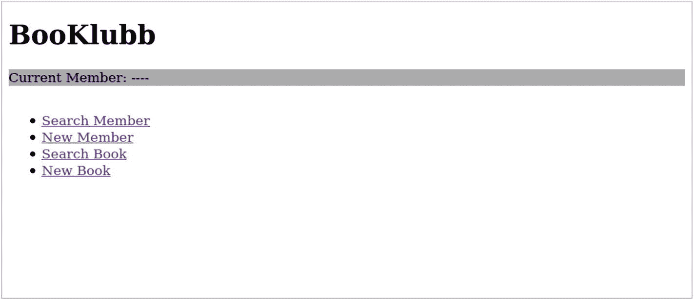
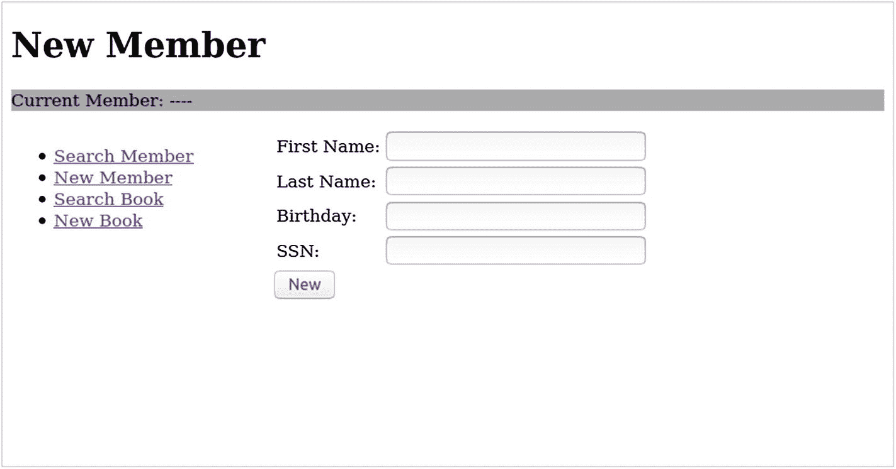
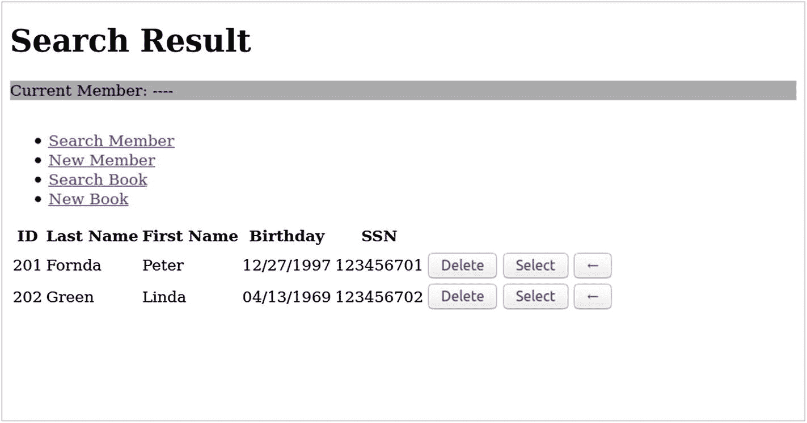
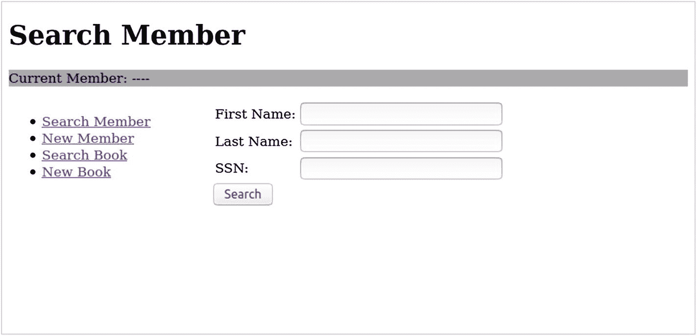
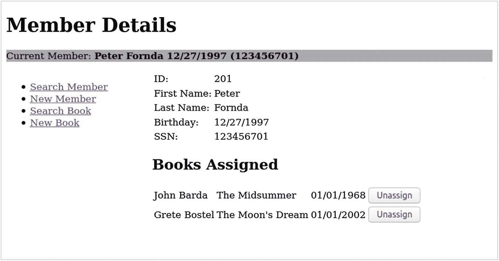
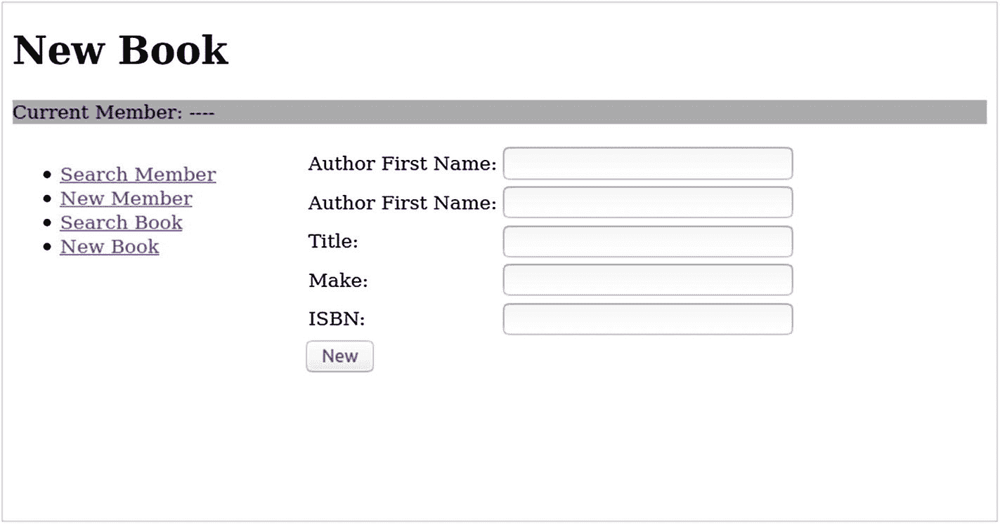
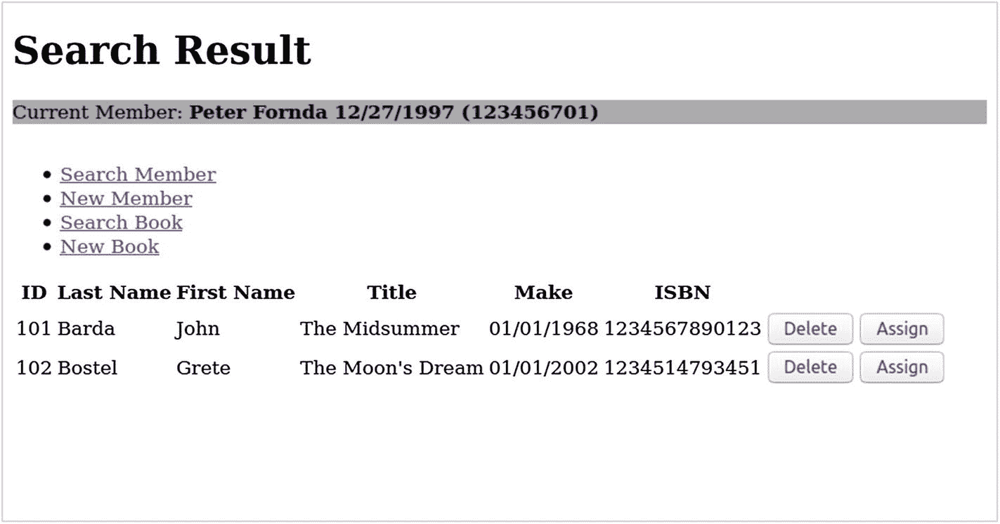

# 12.一个 Java MVC 示例应用程序

我们用一个全面的示例应用程序来结束这本书，它涵盖了我们在前几章中谈到的许多方面。这个应用程序是一个我们称之为`BooKlubb`的图书俱乐部管理。我们将领域限制在书籍和成员，这只是在很小程度上取代了我们已经讨论过的各种例子，但仍然可以作为许多应用程序的蓝图。你会经常遇到这种人物结合。

`BooKlubb`应用程序专注于 Java MVC 功能；我们没有在前端设计上花费太多的精力，我们也没有使用 AJAX，以尽量减少干扰。当然，您可以根据自己的喜好来设计应用程序。

## bokklubb 数据库

我们在第 [10](10.html) 章谈到了使用数据库。我们对`BooKlubb`使用相同的内置 Apache Derby 数据库。有三个表:`MEMBER`用于`BooKlubb`会员，`BOOK`用于图书，`BOOK_RENTAL`用于图书租赁信息(将图书分配给会员)。

在使用 Apache Derby 之前，请记住您必须从 GlassFish 安装文件夹中通过`bin/asadmin start-database`启动它。

接下来，我们通过`ij`客户端连接到新数据库(如果您愿意，可以使用任何其他合适的数据库客户端)，并向其中添加用户凭证:

```java
cd [GLASSFISH_INST]
cd javadb/bin
# start the DB client
./ij
ij> connect 'jdbc:derby://localhost:1527/booklubb;
create=true;user=bk';
ij> call SYSCS_UTIL.SYSCS_CREATE_USER('bk','pw715');

```

Note

下次连接时，您必须提供密码，如`connect '...;user=bk;password=pw715';`所示

要创建表和 ID 序列，请输入以下内容:

```java
CREATE TABLE MEMBER (
    ID          INT           NOT NULL,
    FIRST_NAME  VARCHAR(128)  NOT NULL,
    LAST_NAME   VARCHAR(128)  NOT NULL,
    BIRTHDAY    DATE          NOT NULL,
    SSN         VARCHAR(16)   NOT NULL,
    PRIMARY KEY (ID));
CREATE SEQUENCE MEMBER_SEQ start with 1 increment by 1;

CREATE TABLE BOOK (
    ID          INT           NOT NULL,
    TITLE       VARCHAR(128)  NOT NULL,
    AUTHOR_FIRST_NAME  VARCHAR(128)  NOT NULL,
    AUTHOR_LAST_NAME   VARCHAR(128)  NOT NULL,
    MAKE        DATE          NOT NULL,
    ISBN        VARCHAR(24)   NOT NULL,
    PRIMARY KEY (ID));
CREATE SEQUENCE BOOK_SEQ start with 1 increment by 1;

CREATE TABLE RENTAL (
    ID          INT   NOT NULL,
    MEMBER_ID   INT   NOT NULL,
    BOOK_ID     INT   NOT NULL,
    RENTAL_DAY  DATE  NOT NULL,
    PRIMARY KEY (ID));
CREATE SEQUENCE RENTAL_SEQ start with 1 increment by 1;

```

在 GlassFish 服务器中，我们需要为数据库连接创建资源。我们可以使用`asadmin`工具来实现这一点:

```java
cd [GLASSFISH_INST]
cd bin
./asadmin create-jdbc-connection-pool \
   --datasourceclassname \
     org.apache.derby.jdbc.ClientXADataSource \
   --restype javax.sql.XADataSource \
   --property \
     portNumber=1527:password=pw715:user=bk:
     serverName=localhost:databaseName=booklubb:
     securityMechanism=3 \
   BooKlubbPool

./asadmin create-jdbc-resource \
--connectionpoolid BooKlubbPool jdbc/BooKlubb

```

(在`bk:`和`booklubb:`之后不应有换行符和空格。).由于这些资源，JPA 知道如何连接到数据库。JPA 需要一个数据源，这些命令正好创建了这样一个数据源。

Caution

数据源的创建特定于服务器。如果您使用 GlassFish 之外的服务器，您必须查阅手册以了解如何创建数据源。

## BooKlubb Eclipse 项目

打开 Eclipse 并选择任何合适的工作区。例如，选择与书中示例相同的工作空间。

创建一个新的 Gradle 项目:选择文件➤新➤其他...➤·格拉德➤·格拉德项目。输入名称`BooKlubb`。

如果出现构建路径错误(查看问题)，请右键单击该项目，然后选择“属性”“➤”“Java 构建路径”。移除错误的 JRE 系统库(标记为`unbound`)，然后选择 Add Library 并选择您的 Java 8 JDK。单击应用并关闭。另请参见第 [3 章](03.html)中标题为“关于 Gradle 的更多信息”的章节。

用以下内容替换`build.gradle`文件的内容:

```java
plugins {
    id 'war'
}

java {
    sourceCompatibility = JavaVersion.VERSION_1_8
    targetCompatibility = JavaVersion.VERSION_1_8
}

repositories {
    jcenter()
}

dependencies {
  testImplementation 'junit:junit:4.12'
  implementation 'javax:javaee-api:8.0'
  implementation 'javax.mvc:javax.mvc-api:1.0.0'
  implementation 'org.eclipse.krazo:krazo-jersey:1.1.0-M1'
  implementation 'jstl:jstl:1.2'
}

task localDeploy(dependsOn: war,
             description:">>> Local deploy task") {
  doLast {
    def FS = File.separator
    def glassfish =
        project.properties['glassfish.inst.dir']
    def user = project.properties['glassfish.user']
    def passwd = project.properties['glassfish.passwd']

    File temp = File.createTempFile("asadmin-passwd",
        ".tmp")
    temp << "AS_ADMIN_${user}=${passwd}\n"

    def sout = new StringBuilder()
    def serr = new StringBuilder()
    def libsDir =
      "${project.projectDir}${FS}build${FS}libs"
    def proc = """${glassfish}${FS}bin${FS}asadmin
        --user ${user} --passwordfile ${temp.absolutePath}
        deploy --force=true
         ${libsDir}/${project.name}.war""".execute()
    proc.waitForProcessOutput(sout, serr)
    println "out> ${sout}"
    if(serr.toString()) System.err.println(serr)

    temp.delete()
  }
}

task localUndeploy(
             description:">>> Local undeploy task") {
  doLast {
    def FS = File.separator
    def glassfish =
        project.properties['glassfish.inst.dir']
    def user = project.properties['glassfish.user']
    def passwd = project.properties['glassfish.passwd']

    File temp = File.createTempFile("asadmin-passwd",
        ".tmp")
    temp << "AS_ADMIN_${user}=${passwd}\n"

    def sout = new StringBuilder()
    def serr = new StringBuilder()
    def proc = """${glassfish}${FS}bin${FS}asadmin
      --user ${user} --passwordfile ${temp.absolutePath}
      undeploy ${project.name}""".execute()
    proc.waitForProcessOutput(sout, serr)
    println "out> ${sout}"
    if(serr.toString()) System.err.println(serr)

    temp.delete()
  }
}

```

这与第 [4](04.html) 章中描述的构建文件相同。选择 Gradle ➤刷新 Gradle 项目，以确保依赖项被传输到 Java 构建路径。

作为部署和“取消部署”的配置，向项目中添加一个`gradle.properties`文件，根据您的需要修改这些值:

```java
glassfish.inst.dir = /path/to/your/glassfish5.1
glassfish.user = admin
glassfish.passwd =

```

## bokklubb 基础结构类

类似于第 4 章中的`HelloWorld`示例，我们使用`App`和`RootRedirector`类来定制上下文路径并创建登陆页面:

```java
package book.javamvc.bk;

import java.util.HashMap;
import java.util.Map;
import java.util.logging.Logger;

import javax.annotation.PostConstruct;
import javax.inject.Inject;
import javax.ws.rs.ApplicationPath;
import javax.ws.rs.core.Application;

@ApplicationPath("/mvc")
public class App extends Application {
  @PostConstruct
  public void init() {
  }

  @Override
  public Map<String, Object> getProperties() {
  Map<String, Object> res = new HashMap<>();
  res.put("I18N_TEXT_ATTRIBUTE_NAME",
    "msg");
  res.put("I18N_TEXT_BASE_NAME",
    "book.javamvc.bk.messages.Messages");
  return res;
  }
}

```

和

```java
package book.javamvc.bk;

import javax.servlet.FilterChain;
import javax.servlet.annotation.WebFilter;
import javax.servlet.http.HttpFilter;
import javax.servlet.http.HttpServletRequest;
import javax.servlet.http.HttpServletResponse;
import java.io.IOException;

/**
 * Redirecting http://localhost:8080/BooKlubb/
 * This way we don't need a <welcome-file-list> in web.xml
 */
@WebFilter(urlPatterns = "/")
public class RootRedirector extends HttpFilter {
  private static final long serialVersionUID =
      7332909156163673868L;
  @Override
  protected void doFilter(final HttpServletRequest req,
        final HttpServletResponse res,
        final FilterChain chain) throws IOException {
    res.sendRedirect("mvc/bk");
  }
}

```

## 配置 bokklubb 数据库访问

应用程序使用 JPA 来访问数据库。如第 [10](10.html) 章所述，我们在`src/main/resources/META-INF`中需要一个`persistence.xml`文件，如下所示:

```java
<persistence
    xmlns:="http://java.sun.com/xml/ns/persistence"
    xmlns:xsi="http://www.w3.org/2001/XMLSchema-instance"
    xsi:schemaLocation=
      "http://java.sun.com/xml/ns/persistence
       persistence_1_0.xsd"
    version="1.0">
<persistence-unit name="default" transaction-type="JTA">
    <jta-data-source>jdbc/BooKlubb</jta-data-source>
    <exclude-unlisted-classes>
      false
    </exclude-unlisted-classes>
    <properties />
</persistence-unit>
</persistence>

```

这个文件的主要职责是描述应用程序使用哪个数据库。

## bokklubb 国际化

正如第 8 章[所描述的，我们使用两个名为`BundleForEL`和`SetBundleFilter`的类来实现国际化:](08.html)

```java
package book.javamvc.bk.i18n;

import java.util.Enumeration;
import java.util.Locale;
import java.util.ResourceBundle;
import javax.servlet.http.HttpServletRequest;

public class BundleForEL extends ResourceBundle {
    private BundleForEL(Locale locale, String baseName) {
        setLocale(locale, baseName);
    }

    public static void setFor(HttpServletRequest request,
        String i18nAttributeName, String i18nBaseName) {
      if (request.getSession().
            getAttribute(i18nAttributeName) == null) {
          request.getSession().setAttribute(
            i18nAttributeName,
           new BundleForEL(request.getLocale(),
                           i18nBaseName));
      }
    }

    public void setLocale(Locale locale,
          String baseName) {
       if (parent == null ||
             !parent.getLocale().equals(locale)) {
           setParent(getBundle(baseName, locale));
       }
    }

    @Override
    public Enumeration<String> getKeys() {
        return parent.getKeys();
    }

    @Override
    protected Object handleGetObject(String key) {
        return parent.getObject(key);
    }
}

```

和

```java
package book.javamvc.bk.i18n;

import java.io.IOException;
import java.util.Map;

import javax.inject.Inject;
import javax.servlet.Filter;
import javax.servlet.FilterChain;
import javax.servlet.FilterConfig;
import javax.servlet.ServletException;
import javax.servlet.ServletRequest;
import javax.servlet.ServletResponse;
import javax.servlet.annotation.WebFilter;
import javax.servlet.http.HttpServletRequest;
import javax.ws.rs.core.Application;

@WebFilter("/*")
public class SetBundleFilter implements Filter {
    @Inject private Application appl;
    private String i18nAttributeName;
    private String i18nBaseName;

    @Override
    public void init(FilterConfig filterConfig)
          throws ServletException {
      Map<String,Object> applProps = appl.getProperties();
      i18nAttributeName = (String) applProps.get(
          "I18N_TEXT_ATTRIBUTE_NAME");
      i18nBaseName = (String) applProps.get(
          "I18N_TEXT_BASE_NAME");
   }

    @Override
    public void doFilter(ServletRequest request,
        ServletResponse response, FilterChain chain)
        throws IOException, ServletException {
      BundleForEL.setFor((HttpServletRequest) request,
        i18nAttributeName, i18nBaseName);
      chain.doFilter(request, response);
    }

    @Override
    public void destroy() {
    }
}

```

在`src/main/resources/book/javamvc/bk/messages/Messages.properties`中，我们放入了一个包含以下内容的资源文件:

```java
title = BooKlubb

menu_search_member = Search Member
menu_new_member = New Member
menu_search_book = Search Book
menu_new_book = New Book

current_member = Current Member:

enter_memberFirstName = First Name:
enter_memberLastName = Last Name:
enter_memberBirthday = Birthday:
enter_memberSsn = SSN:

enter_authorFirstName = Author First Name:
enter_authorLastName = Author First Name:
enter_bookTitle = Title:
enter_bookMake = Make:
enter_isbn = ISBN:

hd_searchResult = Search Result
hd_searchMember = Search Member
hd_newMember = New Member
hd_searchBook = Search Book
hd_newBook = New Book
hd_memberDetails = Member Details
hd_booksAssigned = Books Assigned

tblhdr_id = ID
tblhdr_last_name = Last Name
tblhdr_first_name = First Name
tblhdr_birthday = Birthday
tblhdr_ssn = SSN
tblhdr_author_last_name = Last Name
tblhdr_author_first_name = First Name
tblhdr_book_title = Title
tblhdr_book_make = Make
tblhdr_isbn = ISBN

btn_search = Search
btn_new = New
btn_delete = Delete
btn_select = Select
btn_details = \u2190
btn_assign = Assign
btn_unassign = Unassign
no_result = ---- No result ----

new_member_added = New Member Added
new_book_added = New Book Added
member_deleted = Member Deleted
book_deleted = Book Deleted

memb_id = ID:
memb_firstName = First Name:
memb_lastName = Last Name:
memb_birthday = Birthday:
memb_ssn = SSN:

```

这些键值对仅供视图页面专用。

## bokklubb 实体类

有了数据库表定义，我们可以立即编写 JPA 实体类。这在没有定义任何功能的情况下是可能的，因为实体类不包含任何编程逻辑。对于`BooKlubb`，它们如下所示:

```java
package book.javamvc.bk.db;

import java.util.Date;
import java.util.Set;

import javax.persistence.CascadeType;
import javax.persistence.Column;
import javax.persistence.Entity;
import javax.persistence.GeneratedValue;
import javax.persistence.GenerationType;
import javax.persistence.Id;
import javax.persistence.JoinColumn;
import javax.persistence.OneToMany;
import javax.persistence.SequenceGenerator;
import javax.persistence.Table;
import javax.validation.constraints.NotNull;

@Entity
@Table(name = "MEMBER")
@SequenceGenerator(name = "MEMBER_SEQ", initialValue = 1,
      allocationSize = 1)
public class Member {
  @Id
  @GeneratedValue(strategy = GenerationType.IDENTITY,
      generator = "MEMBER_SEQ")
  @Column(name = "id")
  private int id;

  @NotNull
  @Column(name = "first_name")
  private String firstName;

  @NotNull
  @Column(name = "last_name")
  private String lastName;

  @NotNull
  @Column(name = "birthday")
  private Date birthday;

  @NotNull
  @Column(name = "ssn")
  private String ssn;

  @JoinColumn(name = "MEMBER_ID")
  @OneToMany(cascade = CascadeType.ALL, orphanRemoval=true)
  private Set<Rental> rental;

  public int getId() {
    return id;
  }

  public void setId(int id) {
    this.id = id;
  }

  public String getFirstName() {
    return firstName;
  }

  public void setFirstName(String firstName) {
    this.firstName = firstName;
  }

  public String getLastName() {
    return lastName;
  }

  public void setLastName(String lastName) {
    this.lastName = lastName;
  }

  public Date getBirthday() {
    return birthday;
  }

  public void setBirthday(Date birthday) {
    this.birthday = birthday;
  }

  public String getSsn() {
    return ssn;
  }

  public void setSsn(String ssn) {
    this.ssn = ssn;
  }

  public Set<Rental> getRental() {
    return rental;
  }

  public void setRental(Set<Rental> rental) {
    this.rental = rental;
  }
}

```

和

```java
package book.javamvc.bk.db;

import java.util.Date;

import javax.persistence.CascadeType;
import javax.persistence.Column;
import javax.persistence.Entity;
import javax.persistence.GeneratedValue;
import javax.persistence.GenerationType;
import javax.persistence.Id;
import javax.persistence.OneToOne;
import javax.persistence.SequenceGenerator;
import javax.persistence.Table;
import javax.validation.constraints.NotNull;

@Entity
@Table(name = "BOOK")
@SequenceGenerator(name = "BOOK_SEQ", initialValue = 1,
     allocationSize = 1)
public class Book {
  @Id
  @GeneratedValue(strategy = GenerationType.IDENTITY,
      generator = "BOOK_SEQ")
  @Column(name = "id")
  private int id;

  @NotNull
  @Column(name = "title")
  private String title;

  @NotNull
  @Column(name = "author_first_name")
  private String authorFirstName;

  @NotNull
  @Column(name = "author_last_name")
  private String authorLastName;

  @NotNull
  @Column(name = "make")
  private Date make;

  @NotNull
  @Column(name = "isbn")
  private String isbn;

  @OneToOne(cascade = CascadeType.ALL, orphanRemoval=true,
      mappedBy = "book")
  private Rental rental;

  public int getId() {
    return id;
  }

  public void setId(int id) {
    this.id = id;
  }

  public String getTitle() {
    return title;
  }

  public void setTitle(String title) {
    this.title = title;
  }

  public String getAuthorFirstName() {
    return authorFirstName;
  }

  public void setAuthorFirstName(String authorFirstName) {
    this.authorFirstName = authorFirstName;
  }

  public String getAuthorLastName() {
    return authorLastName;
  }

  public void setAuthorLastName(String authorLastName) {
    this.authorLastName = authorLastName;
  }

  public Date getMake() {
    return make;
  }

  public void setMake(Date make) {
    this.make = make;
  }

  public String getIsbn() {
    return isbn;
  }

  public void setIsbn(String isbn) {
    this.isbn = isbn;
  }

  public Rental getRental() {
    return rental;
  }

  public void setRental(Rental rental) {
    this.rental = rental;
  }
}

```

和

```java
package book.javamvc.bk.db;

import java.util.Date;

import javax.persistence.Column;
import javax.persistence.Entity;
import javax.persistence.GeneratedValue;
import javax.persistence.GenerationType;
import javax.persistence.Id;
import javax.persistence.JoinColumn;
import javax.persistence.OneToOne;
import javax.persistence.SequenceGenerator;
import javax.persistence.Table;
import javax.validation.constraints.NotNull;

@Entity
@Table(name = "RENTAL")
@SequenceGenerator(name = "RENTAL_SEQ", initialValue = 1,
    allocationSize = 1)
public class Rental {
  @Id
  @GeneratedValue(strategy = GenerationType.IDENTITY,
      generator = "RENTAL_SEQ")
  @Column(name = "id")
  private int id;

  @NotNull
  @Column(name = "member_id")
  private int memberId;

  @NotNull
  @JoinColumn(name = "book_id")
  @OneToOne
  private Book book;

  @NotNull
  @Column(name = "rental_day")
  private Date rentalDay;

  public int getId() {
    return id;
  }

  public void setId(int id) {
    this.id = id;
  }

  public int getMemberId() {
    return memberId;
  }

  public void setMemberId(int memberId) {
    this.memberId = memberId;
  }

  public Book getBook() {
    return book;
  }

  public void setBook(Book book) {
    this.book = book;
  }

  public Date getRentalDay() {
    return rentalDay;
  }

  public void setRentalDay(Date rentalDay) {
    this.rentalDay = rentalDay;
  }
}

```

这些类通过`@OneToOne`和`@OneToMany`注释反映了数据库表字段和关系。后者背后的思想是，一个成员可能有零本、一本或更多本被租借的书(`@OneToMany`)，一本书可能被租借也可能不被租借(`@OneToOne`，其中“未被租借”反映为一个`null`值)。

## 通过 daos 访问 bokklubb 数据库

Dao 封装处理数据库访问并处理实体类。Dao 提供了创建、更新和删除实体以及在数据库中搜索的方法。我们把它们放在`book.javamvc.bk.db`包里。

```java
package book.javamvc.bk.db;

import java.util.Date;
import java.util.List;
import java.util.Optional;

import javax.ejb.Stateless;
import javax.persistence.EntityManager;
import javax.persistence.PersistenceContext;
import javax.persistence.TypedQuery;

@Stateless
public class MemberDAO {
  @PersistenceContext
  private EntityManager em;

  public int addMember(String firstName, String lastName,
        Date birthday, String ssn) {

    // First check if there is already a member with the
    // same SSN. Create a new entry only if none found.
    List<?> l = em.createQuery("SELECT m FROM Member m "+
              "WHERE m.ssn=:ssn").
          setParameter("ssn",   ssn).
           getResultList();
    int id = 0;
    if(l.isEmpty()) {
      Member member = new Member();
      member.setFirstName(firstName);
      member.setLastName(lastName);
      member.setBirthday(birthday);
      member.setSsn(ssn);
      em.persist(member);
      em.flush(); // needed to get the ID
      id = member.getId();
    } else {
      id = ((Member)l.get(0)).getId();
    }
    return id;
  }

  public List<Member> allMembers() {
      TypedQuery<Member> q = em.createQuery(
         "SELECT m FROM Member m", Member.class);
      List<Member> l = q.getResultList();
      return l;
   }

  public Member memberById(int id) {
    return em.find(Member.class, id);
  }

  public Optional<Member> memberBySsn(String ssn) {
    List<?> l = em.createQuery("SELECT m FROM Member m "+
            "WHERE m.ssn=:ssn").
        setParameter("ssn",   ssn).
         getResultList();
    if(l.isEmpty()) {
      return Optional.empty();
    } else {
      return Optional.of((Member)l.get(0));
    }
  }

    @SuppressWarnings("unchecked")
    public List<Member> membersByName(String firstName,
        String lastName) {
    List<?> l = em.createQuery("SELECT m FROM Member m "+
            "WHERE m.firstName LIKE :fn AND "+
            "m.lastName LIKE :ln").
        setParameter("fn",   firstName.isEmpty() ?
            "%" : "%" + firstName + "%").
        setParameter("ln",   lastName.isEmpty() ?
            "%" : "%" + lastName + "%").
        getResultList();
    return (List<Member>) l;
  }

  public void deleteMember(int id) {
    Member member = em.find(Member.class, id);
    em.remove(member);
  }
}

```

你可以看到我们注入了一个`EntityManager`的实例作为 JPA 的接口。从那里，我们可以使用它的方法来访问数据库表。例如，在`addMember()`中，我们使用 *JPA 查询语言* (JQL)使用作为方法参数给出的 SSN 来搜索成员的表，如果找不到，我们通过`EntityManager.persist()`保存一个新的实体。在`memberById()`中，我们可以直接使用`EntityManager.find()`，因为参数是实体类的主键`ID`。

另一个名为`BookDAO`的类主要处理 book 表。其代码如下:

```java
package book.javamvc.bk.db;

import java.util.Date;
import java.util.List;
import java.util.Optional;
import java.util.Set;
import java.util.stream.Collectors;

import javax.ejb.Stateless;
import javax.persistence.EntityManager;
import javax.persistence.PersistenceContext;
import javax.persistence.TypedQuery;

@Stateless
public class BookDAO {
  @PersistenceContext
  private EntityManager em;

  public int addBook(String authorFirstName,
        String authorLastName, String title,
        Date make, String isbn) {

    // First check if there is already a book with the
    // same ISBN in the database. Create a new entry
    // only if none is found.
    List<?> l = em.createQuery("SELECT b FROM Book b "+
          "WHERE b.isbn=:isbn").
        setParameter("isbn",   isbn).
         getResultList();
    int id = 0;
    if(l.isEmpty()) {
      Book book = new Book();
      book.setAuthorFirstName(authorFirstName);
      book.setAuthorLastName(authorLastName);
      book.setTitle(title);
      book.setMake(make);
      book.setIsbn(isbn);
      em.persist(book);
      em.flush(); // needed to get the ID
      id = book.getId();
    } else {
      id = ((Book)l.get(0)).getId();
    }
    return id;
  }

  public List<Book> allBooks() {
    TypedQuery<Book> q = em.createQuery(
        "SELECT b FROM Book b", Book.class);
    List<Book> l = q.getResultList();
    return l;
  }

  public Book bookById(int id) {
    return em.find(Book.class, id);
  }

  public Optional<Book> bookByIsbn(String isbn) {
    List<?> l = em.createQuery("SELECT b FROM Book b "+
           "WHERE b.isbn=:isbn").
         setParameter("isbn",     isbn).
         getResultList();
    if(l.isEmpty()) {
     return Optional.empty();
    } else {
      return Optional.of((Book)l.get(0));
    }
  }

  @SuppressWarnings("unchecked")
  public List<Book> booksByName(String authorFirstName,
        String authorLastName, String bookTitle) {
    String afn = (authorFirstName == null ||
                  authorFirstName.isEmpty() ) ?
        "%" : ("%"+authorFirstName+"%");
    String aln = (authorLastName == null ||
                  authorLastName.isEmpty() ) ?
        "%" : ("%"+authorLastName+"%");
    String t = (bookTitle == null ||
                bookTitle.isEmpty() ) ?
        "%" : ("%"+bookTitle+"%");

    List<?> l = em.createQuery("SELECT b FROM Book b "+
          "WHERE b.title LIKE :title AND "+
          "b.authorLastName LIKE :aln AND "+
          "b.authorFirstName LIKE :afn").
        setParameter("title", t).
        setParameter("aln", aln).
        setParameter("afn", afn).
        getResultList();
    return (List<Book>) l;
  }

  public void deleteBook(int id) {
    Book book = em.find(Book.class, id);
    em.remove(book);
  }

}

```

第三个名为`RentalDAO`的 DAO 类注册图书租赁(将图书分配给成员):

```java
package book.javamvc.bk.db;

import java.util.Date;
import java.util.Set;
import java.util.stream.Collectors;

import javax.ejb.Stateless;
import javax.persistence.EntityManager;
import javax.persistence.PersistenceContext;

@Stateless
public class RentalDAO {
    @PersistenceContext
    private EntityManager em;

    public void rentBook(Book b, Member m, Date day) {
      Rental r = b.getRental();
      if(r == null) {
        r = new Rental();
      }

    // Update the BOOK table
    r.setBook(b);
    r.setMemberId(m.getId());
    r.setRentalDay(day);
    b.setRental(r);
    em.merge(b);

    // Update the MEMBER table
    Set<Rental> rs = m.getRental();
    if(rs.stream().allMatch(r1 -> {
        return r1.getBook().getId() != b.getId(); })) {
      rs.add(r);
      m.setRental(rs);
      em.merge(m);
    }
  }

  public void unrentBook(Book b, Member m) {
    Rental r = b.getRental();
    if(r == null) return;

    // Update the BOOK table
    b.setRental(null);
    em.merge(b);

    // Update the MEMBER table
    Set<Rental> newRental =
        m.getRental().stream().filter(rr -> {
            return rr.getBook().getId() != b.getId(); }).
        collect(Collectors.toSet());
    m.setRental(newRental);
    em.merge(m);
  }
}

```

## 博克鲁伯模式

`BooKlubb`应用程序的模型部分(Java MVC 模型，不是数据库模型)由几个在控制器和视图之间传输数据的类组成:

*   `MemberModel`:包含俱乐部成员。我们只需要它作为成员搜索结果列表的项目类型。请求范围。

*   `MemberSearchResult`:会员搜索的结果列表。请求范围。

*   `BookModel`:包含图书信息。我们需要它作为图书搜索结果列表的项目类型，以及当前成员的详细信息视图中列出的图书租赁。请求范围。

*   `BookSearchResult`:图书搜索的结果列表。请求范围。

*   `CurrentMember`:包含当前选中成员的信息。这是唯一一个会话范围的模型 bean。我们需要更大的范围，因为可以从成员搜索结果列表中选择一个当前成员，此后必须记住该成员，以便在不同的页面上将图书分配给该成员。

我们将它们都放在`book.javamvc.bk.model`包中，代码如下:

```java
package book.javamvc.bk.model;

import java.util.Date;

public class MemberModel {
  private int id;
  private String firstName;
  private String lastName;
  private Date birthday;
  private String ssn;

  public MemberModel(int id, String firstName,
      String lastName, Date birthday, String ssn) {
    this.id = id;
    this.firstName = firstName;
    this.lastName = lastName;
    this.birthday = birthday;
    this.ssn = ssn;
  }

  public int getId() {
    return id;
  }

  public void setId(int id) {
    this.id = id;
  }

  public String getFirstName() {
    return firstName;
  }

  public void setFirstName(String firstName) {
    this.firstName = firstName;
  }

  public String getLastName() {
    return lastName;
  }

  public void setLastName(String lastName) {
    this.lastName = lastName;
  }

  public Date getBirthday() {
    return birthday;
  }

  public void setBirthday(Date birthday) {
    this.birthday = birthday;
  }

  public String getSsn() {
    return ssn;
  }

  public void setSsn(String ssn) {
    this.ssn = ssn;
  }
}

```

和

```java
package book.javamvc.bk.model;

import java.util.ArrayList;
import java.util.List;

import javax.enterprise.context.RequestScoped;
import javax.inject.Named;

import book.javamvc.bk.db.Member;

@Named
@RequestScoped
public class MemberSearchResult extends
      ArrayList<MemberModel>{
  private static final long serialVersionUID =
        -5926389915908884067L;
  public void addAll(List<Member> l) {
    l.forEach(m -> {
      add(new MemberModel(
        m.getId(),
        m.getFirstName(),
        m.getLastName(),
        m.getBirthday(),
        m.getSsn()
      ));
    });
  }
}

```

在这个类中，我们用数据库层的`Member`类添加了一个名为`addAll( List < Member > l )`的便利方法。通常我们不想使用 DAOs 之外的数据库实体，但是`Member`只是一个数据持有者，我们不需要它的任何功能。所以层的混合不会对应用程序架构产生太大的影响。

```java
package book.javamvc.bk.model;

import java.util.Date;

public class BookModel {
  private int id;
  private String authorFirstName;
  private String authorLastName;
  private String title;
  private String isbn;
  private Date make;

  public BookModel(int id, String authorFirstName,
        String authorLastName, String title, String isbn,
        Date make) {
    this.id = id;
    this.authorFirstName = authorFirstName;
    this.authorLastName = authorLastName;
    this.title = title;
    this.isbn = isbn;
    this.make = make;
  }

  public int getId() {
    return id;
  }

  public void setId(int id) {
    this.id = id;
  }

  public String getAuthorFirstName() {
    return authorFirstName;
  }

  public void setAuthorFirstName(String authorFirstName) {
    this.authorFirstName = authorFirstName;
  }

  public String getAuthorLastName() {
    return authorLastName;
  }

  public void setAuthorLastName(String authorLastName) {
    this.authorLastName = authorLastName;
  }

  public String getTitle() {
    return title;
  }

  public void setTitle(String title) {
    this.title = title;
  }

  public String getIsbn() {
    return isbn;
  }

  public void setIsbn(String isbn) {
    this.isbn = isbn;
  }

  public Date getMake() {
    return make;
  }

  public void setMake(Date make) {
    this.make = make;
  }
}

```

和

```java
package book.javamvc.bk.model;

import java.util.ArrayList;
import java.util.List;

import javax.enterprise.context.RequestScoped;
import javax.inject.Named;

import book.javamvc.bk.db.Book;

@Named
@RequestScoped
public class BookSearchResult extends
      ArrayList<BookModel>{
  private static final long serialVersionUID =
      -5926389915908884067L;
  public void addAll(List<Book> l) {
    l.forEach(b -> {
      add(new BookModel(
        b.getId(),
        b.getAuthorFirstName(),
        b.getAuthorLastName(),
        b.getTitle(),
        b.getIsbn(),
        b.getMake()
      ));
    });
  }
}

```

和

```java
package book.javamvc.bk.model;

import java.io.Serializable;
import java.util.Date;
import java.util.Set;

import javax.enterprise.context.SessionScoped;
import javax.inject.Named;

@Named
@SessionScoped
public class CurrentMember extends MemberModel
      implements Serializable {
  private static final long serialVersionUID =
      -7855133427774616033L;

  public CurrentMember(int id, String firstName,
      String lastName, Date birthday, String ssn) {
    super(id, firstName, lastName, birthday, ssn);
  }

  private boolean defined = false;
  private Set<BookModel> rentals;

  public boolean isDefined() {
    return defined;
  }

  public void setDefined(boolean defined) {
    this.defined = defined;
  }

  public void setRentals(Set<BookModel> rentals) {
    this.rentals = rentals;
  }

  public Set<BookModel> getRentals() {
    return rentals;
  }
}

```

## bokklubb 控制器

控制器负责接收来自视图的所有`POST`和`GET`动作。在 Java MVC 和`BooKlubb`应用程序中，它看起来像这样:

```java
package book.javamvc.bk;

import ...;

@Path("/bk")
@Controller
public class BooKlubbController {
  @Named
  @RequestScoped
  public static class ErrorMessages {
    private List<String> msgs = new ArrayList<>();
    public List<String> getMsgs() {
      return msgs;
    }
    public void setMsgs(List<String> msgs) {
      this.msgs = msgs;
    }
    public void addMessage(String msg) {
      msgs.add(msg);
    }
  }

  private @Inject ErrorMessages errorMessages;
  private @Inject BindingResult br;

  private @EJB MemberDAO memberDao;
  private @Inject MemberSearchResult memberSearchResult;

  private @EJB BookDAO bookDao;
  private @Inject BookSearchResult bookSearchResult;

  private @EJB RentalDAO rentalDao;

  private @Inject CurrentMember currentMember;

  // action methods...
}

```

我们为错误消息使用一个内部类，并注入访问数据库所需的各种模型类和 DAO EJBs。

完整的代码如下所示:

```java
package book.javamvc.bk;

import java.time.LocalDate;
import java.time.ZoneId;
import java.time.format.DateTimeFormatter;
import java.util.ArrayList;
import java.util.Date;
import java.util.List;
import java.util.stream.Collectors;

import javax.ejb.EJB;
import javax.enterprise.context.RequestScoped;
import javax.inject.Inject;
import javax.inject.Named;
import javax.mvc.Controller;
import javax.mvc.binding.BindingResult;
import javax.mvc.binding.MvcBinding;
import javax.mvc.binding.ParamError;
import javax.validation.constraints.Pattern;
import javax.ws.rs.FormParam;
import javax.ws.rs.GET;
import javax.ws.rs.POST;
import javax.ws.rs.Path;
import javax.ws.rs.QueryParam;
import javax.ws.rs.core.Response;

import book.javamvc.bk.db.Book;
import book.javamvc.bk.db.BookDAO;
import book.javamvc.bk.db.Member;
import book.javamvc.bk.db.MemberDAO;
import book.javamvc.bk.db.RentalDAO;
import book.javamvc.bk.model.BookModel;
import book.javamvc.bk.model.BookSearchResult;
import book.javamvc.bk.model.CurrentMember;
import book.javamvc.bk.model.MemberSearchResult;

@Path("/bk")
@Controller
public class BooKlubbController {
  @Named
  @RequestScoped
  public static class ErrorMessages {
    private List<String> msgs = new ArrayList<>();
    public List<String> getMsgs() {
      return msgs;
    }
    public void setMsgs(List<String> msgs) {
      this.msgs = msgs;
    }
    public void addMessage(String msg) {
      msgs.add(msg);
    }
  }

  private @Inject ErrorMessages errorMessages;
  private @Inject BindingResult br;

  private @EJB MemberDAO memberDao;
  private @Inject MemberSearchResult memberSearchResult;

  private @EJB BookDAO bookDao;
  private @Inject BookSearchResult bookSearchResult;

  private @EJB RentalDAO rentalDao;

  private @Inject CurrentMember currentMember;

```

我们添加了几个使用`@GET`来检索页面而无需用户输入的方法:

```java
@GET
public String showIndex() {
  return "index.jsp";
}

@GET
@Path("/searchMember")
public Response searchMember() {
  return Response.ok("searchMember.jsp").build();
}

@GET
@Path("/newMember")
public Response newMember() {
  return Response.ok("newMember.jsp").build();
}

@GET
@Path("/searchBook")
public Response searchBook() {
  return Response.ok("searchBook.jsp").build();
}

@GET
@Path("/newBook")
public Response newBook() {
  return Response.ok("newBook.jsp").build();
}

```

以下是与成员相关的方法:显示搜索到的成员列表、响应创建新成员、删除成员、显示成员详细信息以及选择成员:

```java
@GET
@Path("/searchMemberSubmit")
public Response searchMemberSubmit(
    @MvcBinding @QueryParam("firstName")
        String firstName,
    @MvcBinding @QueryParam("lastName")
        String lastName,
    @MvcBinding @QueryParam("ssn")
        String ssn) {
  showErrors();

  String ssnNormal = ssn == null ?
      "" : ( ssn.replaceAll("\\D", "") );
  List<Member> l = new ArrayList<>();
  if(!ssnNormal.isEmpty()) {
    memberDao.memberBySsn(ssnNormal).ifPresent(
        m1 -> { l.add(m1); });
    } else {
      l.addAll( memberDao.membersByName(
          firstName, lastName) );
    }
    memberSearchResult.addAll(l);

    return Response.ok("searchMemberResult.jsp").build();
  }

  @POST
  @Path("/newMemberSubmit")
  public Response newMemberSubmit(
      @MvcBinding @FormParam("firstName")
          String firstName,
      @MvcBinding @FormParam("lastName")
          String lastName,
      @MvcBinding @FormParam("birthday")
          @Pattern(regexp = "\\d\\d/\\d\\d/\\d\\d\\d\\d")
          String birthday,
      @MvcBinding @FormParam("ssn")
          String ssn) {
    showErrors();

    DateTimeFormatter dtf = DateTimeFormatter.ofPattern(
          "MM/dd/yyyy");
    LocalDate ld = LocalDate.parse(birthday, dtf);
    Date date = Date.from(ld.atStartOfDay(
        ZoneId.systemDefault()).toInstant());

    memberDao.addMember(firstName, lastName, date, ssn);

    return Response.ok("newMemberResult.jsp").build();
  }

  @POST
  @Path("/deleteMember")
  public Response deleteMember(
      @MvcBinding @FormParam("memberId")
          int memberId) {
    showErrors();

    memberDao.deleteMember(memberId);

    return Response.ok("deleteMemberResult.jsp").build();
  }

  @POST
  @Path("/selectMember")
  public Response selectMember(
      @MvcBinding @FormParam("memberId")
          int memberId) {
    showErrors();

    Member m = memberDao.memberById(memberId);
    currentMember.setId(memberId);
    currentMember.setFirstName(m.getFirstName());
    currentMember.setLastName(m.getLastName());
    currentMember.setBirthday(m.getBirthday());
    currentMember.setSsn(m.getSsn());
    currentMember.setDefined(true);

    return Response.ok("index.jsp").build();
  }

  @POST
  @Path("/memberDetails")
  public Response memberDetails(
    @MvcBinding @FormParam("memberId")
        int memberId) {
    showErrors();

    Member m = memberDao.memberById(memberId);
    currentMember.setId(memberId);
    currentMember.setFirstName(m.getFirstName());
    currentMember.setLastName(m.getLastName());
    currentMember.setBirthday(m.getBirthday());
    currentMember.setSsn(m.getSsn());
    currentMember.setRentals(
      m.getRental().stream().map(r -> {
        Book b = r.getBook();
      return new BookModel(b.getId(),
          b.getAuthorFirstName(),
          b.getAuthorLastName(),
          b.getTitle(), b.getIsbn(), b.getMake());
      }).collect(Collectors.toSet())
    );
    currentMember.setDefined(true);

    return Response.ok("memberDetails.jsp").build();
  }

```

我们只需要添加与书相关的方法，包括对搜索书的反应、添加或删除书，以及分配或“取消分配”书:

```java
@GET
@Path("/searchBookSubmit")
public Response searchBookSubmit(
    @MvcBinding @QueryParam("authorFirstName")
         String authorFirstName,
    @MvcBinding @QueryParam("authorLastName")
         String authorLastName,
    @MvcBinding @QueryParam("bookTitle")
         String bookTitle,
    @MvcBinding @QueryParam("isbn")
         String isbn) {
  showErrors();

  String isbnNormal = isbn == null ?
      "" : ( isbn.replaceAll("\\D", "") );
  List<Book> l = new ArrayList<>();
  if(!isbnNormal.isEmpty()) {
    bookDao.bookByIsbn(isbnNormal).ifPresent(m1 -> {
        l.add(m1); });
  } else {
    l.addAll( bookDao.booksByName(authorFirstName,
        authorLastName, bookTitle) );
  }
  bookSearchResult.addAll(l);

  return Response.ok("searchBookResult.jsp").build();
}

@POST
@Path("/newBookSubmit")
public Response newBookSubmit(
    @MvcBinding @FormParam("authorFirstName")
        String authorFirstName,
    @MvcBinding @FormParam("authorLastName")
        String authorLastName,
    @MvcBinding @FormParam("title")
        String bookTitle,
    @MvcBinding @FormParam("make")
    @Pattern(regexp = "((\\d\\d/)?\\d\\d/)?\\d\\d\\d\\d")
        String make,
    @MvcBinding @FormParam("isbn")
        String isbn) {
  showErrors();

  String isbnNormal = isbn == null ?
      "" : ( isbn.replaceAll("\\D", "") );
  String makeNormal = make == null ? "" : (
    make.matches("\\d\\d\\d\\d") ?
        "01/01/" + make :
        (make.matches("\\d\\d/\\d\\d\\d\\d") ?
          make.substring(0,2) + "/01" +
       make.substring(2) : make)
  );
  DateTimeFormatter dtf = DateTimeFormatter.ofPattern(
      "MM/dd/yyyy");
  LocalDate ld = LocalDate.parse(makeNormal, dtf);
  Date date = Date.from(ld.atStartOfDay(
      ZoneId.systemDefault()).toInstant());
  bookDao.addBook(authorFirstName, authorLastName,
      bookTitle, date, isbnNormal);

  return Response.ok("newBookResult.jsp").build();
}

@POST
@Path("/deleteBook")
public Response deleteBook(
    @MvcBinding @FormParam("bookId")
        int bookId) {
  showErrors();

  bookDao.deleteBook(bookId);

  return Response.ok("deleteBookResult.jsp").build();
}

@POST
@Path("/assignBook")
public Response assignBook(
    @MvcBinding @FormParam("bookId")
         int bookId,
    @MvcBinding @FormParam("userId")
         int userId) {
  showErrors();

  Book b = bookDao.bookById(bookId);
  Member m = memberDao.memberById(userId);
  Date now = new Date();
  rentalDao.rentBook(b, m, now);

  return Response.ok("index.jsp").build();
}

@POST
@Path("/unassignBook")
public Response unassignBook(
    @MvcBinding @FormParam("bookId")
         int bookId,
    @MvcBinding @FormParam("memberId")
         int userId) {
  showErrors();

  Book b = bookDao.bookById(bookId);
  Member m = memberDao.memberById(userId);
  rentalDao.unrentBook(b, m);

  currentMember.setRentals(
    m.getRental().stream().map(r -> {
      Book bb = r.getBook();
    return new BookModel(bb.getId(),
          bb.getAuthorFirstName(),
          bb.getAuthorLastName(),
          bb.getTitle(),
          bb.getIsbn(),
          bb.getMake());
    }).collect(Collectors.toSet())
    );

  return Response.ok("memberDetails.jsp").build();
}

```

我们添加了一个私有方法，它传输由 Java MVC 检测到的错误，然后关闭该类:

```java
  private void showErrors() {
    if(br.isFailed()) {
      br.getAllErrors().stream().forEach(
        (ParamError pe) -> {
          errorMessages.addMessage(pe.getParamName() +
          ": " + pe.getMessage());
      });
    }
  }

} // closing the class

```

## 博克鲁伯观点

正如我们在本书的其他 Java MVC 应用程序中所做的那样，我们将一个名为`beans.xml`的空文件添加到`src/main/webapp/WEB-INF`中。另外，将常用的`glassfish-web.xml`添加到同一个文件夹中:

```java
<?xml version="1.0" encoding="UTF-8"?>
<glassfish-web-app error-url="">
    <class-loader delegate="true"/>
</glassfish-web-app>

```

此外，下载一个`jQuery`发行版并将其放在`src/main/webapp/js`文件夹中。

在下一节中，我们将描述`BooKlubb`所需的与视图相关的 JSP 文件。

### 碎片文件

这些元素显示在每个网页上——主菜单、当前选择的成员和任何错误信息。因此，我们通过`<%@ include ... %>`指令将它们提取为要包含的片段。

碎片放在`src/main/webapp/fragments`文件夹中；代码内容如下:

```java
<%-- File: currentMember.jsp ******************** --%>
<%@ page contentType="text/html;charset=UTF-8"
  language="java" %>
<%@ taglib prefix="c"
  uri="http://java.sun.com/jsp/jstl/core" %>
<%@ taglib prefix="fmt"
  uri="http://java.sun.com/jsp/jstl/fmt" %>

<div style="background-color:#AAA;margin-bottom:1em">
${msg.current_member}
<c:choose>
  <c:when test="${! currentMember.defined}">
    ----
  </c:when>
  <c:otherwise>
    <fmt:formatDate value="${currentMember.birthday}"
                      pattern="MM/dd/yyyy" var="cubd" />
    <span style="font-weight:bold">
      ${currentMember.firstName}
      ${currentMember.lastName}
      ${cubd} (${currentMember.ssn})
    </span>
  </c:otherwise>
</c:choose>
</div>

<%-- File: errors.jsp ******************************* --%>
<%@ page contentType="text/html;charset=UTF-8"
  language="java" %>
<%@ taglib prefix="c"
  uri="http://java.sun.com/jsp/jstl/core" %>
<%@ taglib prefix="fmt"
  uri="http://java.sun.com/jsp/jstl/fmt" %>

<div style="color:red">
  <c:forEach var="e" items="${errorMessages.msgs}">
    ${e}
  </c:forEach>
</div>

<%-- File: mainMenu.jsp ***************************** --%>
<%@ page contentType="text/html;charset=UTF-8"
  language="java" %>
<%@ taglib prefix="c"
  uri="http://java.sun.com/jsp/jstl/core" %>
<%@ taglib prefix="fmt"
  uri="http://java.sun.com/jsp/jstl/fmt" %>

<div style="width:30%; float:left;">
  <ul>
    <li><a href="${mvc.uriBuilder(
          'BooKlubbController#searchMember').build()}">
        ${msg.menu_search_member}</a></li>
    <li><a href="${mvc.uriBuilder(
          'BooKlubbController#newMember').build()}">
        ${msg.menu_new_member}</a></li>
    <li><a href="${mvc.uriBuilder(
          'BooKlubbController#searchBook').build()}">
        ${msg.menu_search_book}</a></li>
    <li><a href="${mvc.uriBuilder(
          'BooKlubbController#newBook').build()}">
        ${msg.menu_new_book}</a></li>
  </ul>
</div>

```

### 登录页面

名为`index.jsp`(在`src/main/webapp/WEB-INF/views`文件夹中)的登录页面包括上述片段，否则不显示任何内容:

```java
<%@ page contentType="text/html;charset=UTF-8"
  language="java" %>
<%@ taglib prefix="c"
  uri="http://java.sun.com/jsp/jstl/core" %>
<%@ taglib prefix="fmt"
  uri="http://java.sun.com/jsp/jstl/fmt" %>
<html>
<head>
    <meta charset="UTF-8">
    <script type="text/javascript" src="${mvc.basePath}/../js/jquery-3.5.1.min.js">
    </script>
    <title>${msg.title}</title>
</head>
<body>
  <%@ include file="../../fragments/errors.jsp" %>

  <h1>${msg.title}</h1>
  <%@ include file="../../fragments/currentMember.jsp" %>

  <div>
    <%@ include file="../../fragments/mainMenu.jsp" %>
    <div style="float:left">
    </div>
  </div>

</body>
</html>

```

Caution

确保您输入了下载的`jQuery`发行版的正确版本。这同样适用于后续章节中介绍的所有 JSP 文件。

所有 JSP 文件都使用相同的整体结构:

```java
<div style="float:left">
</div>

```

这个空标签将作为实际页面内容的容器。图 [12-1](#Fig1) 显示了进入应用程序时的浏览器页面。



图 12-1

读书俱乐部登录页面

### 成员相关的视图文件

要创建一个新成员、删除一个成员、搜索一个成员、显示成员的详细信息(包括分配的书籍)，以及大多数成员的操作结果页面，我们需要一个单独的 JSP 页面。它们都位于`src/main/webapp/WEB-INF/views`文件夹中。

创建新成员的代码和生成的页面如下:

```java
<%-- File newMember.jsp ***************************** --%>
<%@ page contentType="text/html;charset=UTF-8"
  language="java" %>
<%@ taglib prefix="c"
  uri="http://java.sun.com/jsp/jstl/core" %>
<%@ taglib prefix="fmt"
  uri="http://java.sun.com/jsp/jstl/fmt" %>
<html>
<head>
    <meta charset="UTF-8">
    <script type="text/javascript" src="${mvc.basePath}/../js/jquery-3.5.1.min.js">
    </script>
    <title>${msg.title}</title>
</head>
<body>
  <%@ include file="../../fragments/errors.jsp" %>

  <h1>${msg.hd_newMember}</h1>
  <%@ include file="../../fragments/currentMember.jsp" %>

  <div>
    <%@ include file="../../fragments/mainMenu.jsp" %>
    <div style="float:left">
      <form method="post"
          action="${mvc.uriBuilder(
              'BooKlubbController#newMemberSubmit').
              build()}">
    <table><tbody>
      <tr>
        <td>${msg.enter_memberFirstName}</td>
        <td><input type="text" name="firstName" /></td>
      </tr>
      <tr>
        <td>${msg.enter_memberLastName}</td>
        <td><input type="text" name="lastName" /></td>
      </tr>
      <tr>
        <td>${msg.enter_memberBirthday}</td>
        <td><input type="text" name="birthday" /></td>
      </tr>
      <tr>
        <td>${msg.enter_memberSsn}</td>
        <td><input type="text" name="ssn" /></td>
      </tr>
    </tbody></table>
    <input type="submit" value="${msg.btn_new}" />
  </form>
   </div>
   </div>

</body>
</html>

<%-- File newMemberResult.jsp *********************** --%>
<%@ page contentType="text/html;charset=UTF-8"
  language="java" %>
<%@ taglib prefix="c"
  uri="http://java.sun.com/jsp/jstl/core" %>
<%@ taglib prefix="fmt"
  uri="http://java.sun.com/jsp/jstl/fmt" %>
<html>
<head>
    <meta charset="UTF-8">
    <title>Member Search</title>
</head>
<body>
  <%@ include file="../../fragments/errors.jsp" %>

  <h1>${msg.new_member_added}</h1>
  <%@ include file="../../fragments/currentMember.jsp" %>

  <div>
    <%@ include file="../../fragments/mainMenu.jsp" %>
    <div style="float:left">
    </div>
  </div>

</body>
</html>

```

JSP 显示了新成员的输入表单。见图 [12-2](#Fig2) 。结果页面只显示相应的成功消息。



图 12-2

读书俱乐部新会员页面

在成员数据库中搜索的代码和显示结果列表的页面如下:

```java
<%-- File searchMember.jsp ************************** --%>
<%@ page contentType="text/html;charset=UTF-8"
  language="java" %>
<%@ taglib prefix="c"
  uri="http://java.sun.com/jsp/jstl/core" %>
<%@ taglib prefix="fmt"
  uri="http://java.sun.com/jsp/jstl/fmt" %>
<html>
<head>
    <meta charset="UTF-8">
    <script type="text/javascript" src="${mvc.basePath}/../js/jquery-3.5.1.min.js">
    </script>
    <title>${msg.title}</title>
</head>
<body>
  <%@ include file="../../fragments/errors.jsp" %>

  <h1>${msg.hd_searchMember}</h1>
  <%@ include file="../../fragments/currentMember.jsp" %>

  <div>
    <%@ include file="../../fragments/mainMenu.jsp" %>
    <div style="float:left">
      <form method="get" action="${mvc.uriBuilder(
          'BooKlubbController#searchMemberSubmit').
          build()}">
        <table><tbody>
          <tr>
            <td>${msg.enter_memberFirstName}</td>
            <td><input type="text" name="firstName" /></td>
          </tr>
          <tr>
            <td>${msg.enter_memberLastName}</td>
            <td><input type="text" name="lastName" /> </td>
          </tr>
          <tr>
            <td>${msg.enter_memberSsn}</td>
            <td><input type="text" name="ssn" /> </td>
          </tr>
        </tbody></table>
        <input type="submit" value="${msg.btn_search}" />
      </form>
    </div>
  </div>

</body>
</html>

<%-- File searchMemberResult.jsp ******************** --%>
<%@ page contentType="text/html;charset=UTF-8"
  language="java" %>
<%@ taglib prefix="c"
  uri="http://java.sun.com/jsp/jstl/core" %>
<%@ taglib prefix="fmt"
  uri="http://java.sun.com/jsp/jstl/fmt" %>
<html>
<head>
    <meta charset="UTF-8">
    <script type="text/javascript" src="${mvc.basePath}/../js/jquery-3.5.1.min.js">
    </script>
    <title>Member Search</title>
</head>
<body>
  <%@ include file="../../fragments/errors.jsp" %>

  <h1>${msg.hd_searchResult}</h1>
  <%@ include file="../../fragments/currentMember.jsp" %>

  <div>
    <%@ include file="../../fragments/mainMenu.jsp" %>

    <div style="float:left">
    <c:choose>
    <c:when test="${empty memberSearchResult}">
      ${msg.no_result}
    </c:when>
    <c:otherwise>
    <table>
    <thead>
      <tr>
        <th>${msg.tblhdr_id}</th>
        <th>${msg.tblhdr_last_name}</th>
        <th>${msg.tblhdr_first_name}</th>
        <th>${msg.tblhdr_birthday}</th>
        <th>${msg.tblhdr_ssn}</th>
        <th></th>
        <th></th>
      </tr>
    <thead>
    <tbody>
      <c:forEach items="${memberSearchResult}"
            var="itm">
        <tr id="itm-${itm.id}">
          <td>${itm.id}</td>
          <td>${itm.lastName}</td>
          <td>${itm.firstName}</td>
          <fmt:formatDate value="${itm.birthday}"
                 pattern="MM/dd/yyyy"
                 var="d1" />
          <td>${d1}</td>
          <td>${itm.ssn}</td>
          <td><button onclick="deleteItm(${itm.id})">
              ${msg.btn_delete}</button></td>
          <td><button onclick="selectMember(${itm.id})">
              ${msg.btn_select}</button></td>
          <td><button onclick="showDetails(${itm.id})">
              ${msg.btn_details}</button></td>
        </tr>
      </c:forEach>
    </tbody>
  </table>
  </c:otherwise>
  </c:choose>

  <script type="text/javascript">
    function deleteItm(id) {
      jQuery('#memberIdForDelete').val(id);
      jQuery('#deleteForm').submit();
    }
    function selectMember(id) {
      jQuery('#memberIdForSelect').val(id);
      jQuery('#selectForm').submit();
    }
    function showDetails(id) {
      jQuery('#memberIdForDetails').val(id);
      jQuery('#detailsForm').submit();
    }
    </script>
    <form id="deleteForm" method="post"
          action="${mvc.uriBuilder(
            'BooKlubbController#deleteMember').
            build()}">
     <input id="memberIdForDelete" type="hidden"
         name="memberId" />
    </form>
    <form id="selectForm" method="post"
          action="${mvc.uriBuilder(
            'BooKlubbController#selectMember').
            build()}">
      <input id="memberIdForSelect" type="hidden"
          name="memberId" />
    </form>
    <form id="detailsForm" method="post"
          action="${mvc.uriBuilder(
            'BooKlubbController#memberDetails').
            build()}">
      <input id="memberIdForDetails" type="hidden"
          name="memberId" />
    </form>
    </div>

  </div>

</body>
</html>

```

`searchMember.jsp`文件显示了一个成员搜索的输入表单；见图 [12-3](#Fig3) 。结果页面显示相应的成员列表，如图 [12-4](#Fig4) 所示。



图 12-4

读书俱乐部搜索会员结果页



图 12-3

读书俱乐部搜索会员页面

您可以看到列表中的每个成员项都有三个按钮——一个用于删除成员，一个用于使其成为当前成员，一个用于显示成员详细信息。我们使用 JavaScript 将按钮点击转发到文件末尾附近添加的一个不可见表单。

删除成员后，我们只显示一条成功消息，该消息在`deleteMemberResult.jsp`文件中定义:

```java
<%@ page contentType="text/html;charset=UTF-8"
  language="java" %>
<%@ taglib prefix="c"
  uri="http://java.sun.com/jsp/jstl/core" %>
<%@ taglib prefix="fmt"
  uri="http://java.sun.com/jsp/jstl/fmt" %>
<html>
<head>
    <meta charset="UTF-8">
    <title>Member Search</title>
</head>
<body>
  <%@ include file="../../fragments/errors.jsp" %>

  <h1>${msg.member_deleted}</h1>
  <%@ include file="../../fragments/currentMember.jsp" %>

  <div>
    <%@ include file="../../fragments/mainMenu.jsp" %>
    <div style="float:left">
    </div>
  </div>

</body>
</html>

```

在详细信息页面上，我们显示了成员信息和分配的书籍。这由`memberDetails.jsp`文件定义:

```java
<%@ page contentType="text/html;charset=UTF-8"
  language="java" %>
<%@ taglib prefix="c"
  uri="http://java.sun.com/jsp/jstl/core" %>
<%@ taglib prefix="fmt"
  uri="http://java.sun.com/jsp/jstl/fmt" %>
<html>
<head>
    <meta charset="UTF-8">
    <script type="text/javascript"
        src="${mvc.basePath}/../js/jquery-3.5.1.min.js">
    </script>
    <title>${msg.title}</title>
</head>
<body>
  <%@ include file="../../fragments/errors.jsp" %>

  <h1>${msg.hd_memberDetails}</h1>
  <%@ include file="../../fragments/currentMember.jsp" %>

  <div>

      <%@ include file="../../fragments/mainMenu.jsp" %>
      <div style="float:left">
        <table>
          <tbody>
            <tr>
              <td>${msg.memb_id}</td>
              <td>${currentMember.id}</td>
            </tr>
            <tr>
              <td>${msg.memb_firstName}</td>
              <td>${currentMember.firstName}</td>
            </tr>
            <tr>
              <td>${msg.memb_lastName}</td>
              <td>${currentMember.lastName}</td>
            </tr>
            <fmt:formatDate value="${currentMember.birthday}"
                    pattern="MM/dd/yyyy"
                    var="bd" />
            <tr>
              <td>${msg.memb_birthday}</td>
              <td>${bd}</td>
            </tr>
            <tr>
              <td>${msg.memb_ssn}</td>
              <td>${currentMember.ssn}</td>
            </tr>
          </tbody>
        </table>

        <h2>${msg.hd_booksAssigned}</h2>
        <c:choose>
          <c:when test="${empty currentMember.rentals}">
            ----
          </c:when>
          <c:otherwise>
            <table>
            <tbody>
              <c:forEach items="${currentMember.rentals}"
                    var="r">
                <tr>
                  <td>${r.authorFirstName}
                      ${r.authorLastName}</td>
                  <td>${r.title}</td>
                  <fmt:formatDate value="${r.make}"
                    pattern="MM/dd/yyyy"
                    var="makeDay" />
                  <td>${makeDay}</td>
                  <td>
                    <button onclick="unassign(
                        ${currentMember.id},${r.id})">
                      ${msg.btn_unassign}
                    </button>
                  </td>
                </tr>
              </c:forEach>
            </tbody>
            </table>
          </c:otherwise>
        </c:choose>
        <script type="text/javascript">
          function unassign(memberId,bookId) {
            jQuery('#memberIdForUnassign').val(memberId);
            jQuery('#bookIdForUnassign').val(bookId);
            jQuery('#unassignForm').submit();
          }
        </script>
        <form id="unassignForm" method="post"
             action="${mvc.uriBuilder(
               'BooKlubbController#unassignBook').build()}">
        <input id="memberIdForUnassign" type="hidden"
            name="memberId" />
        <input id="bookIdForUnassign" type="hidden"
            name="bookId" />
      </form>

    </div>
  </div>

</body>
</html>

```

在图书分配列表中，我们再次使用按钮来取消图书分配，并使用 JavaScript 来提交一个不可见的表单。图 [12-5](#Fig5) 显示了一个详细页面示例。将图书分配给成员发生在图书搜索结果列表中，这将在后面的部分中讨论。



图 12-5

读书俱乐部会员详细信息页面

### 与图书相关的视图文件

对于图书，我们确定了以下用例:创建新的图书记录，删除图书记录，搜索图书，将图书分配给成员(租赁)。我们有 JSP 页面来创建一本书和搜索一本书，还有操作结果页面。与成员一样，它们都位于`src/main/webapp/WEB-INF/views`文件夹中。从图书搜索结果列表中删除图书记录并将其分配给当前成员。

创建图书记录及其相应的提交结果页面的代码如下:

```java
<%-- File newBook.jsp ******************************** --%>
<%@ page contentType="text/html;charset=UTF-8"
  language="java" %>
<%@ taglib prefix="c"
  uri="http://java.sun.com/jsp/jstl/core" %>
<%@ taglib prefix="fmt"
  uri="http://java.sun.com/jsp/jstl/fmt" %>
<html>
<head>
    <meta charset="UTF-8">
    <script type="text/javascript" src="${mvc.basePath}/../js/jquery-3.5.1.min.js">
    </script>
    <title>${msg.title}</title>
</head>
<body>
  <%@ include file="../../fragments/errors.jsp" %>

  <h1>${msg.hd_newBook}</h1>
  <%@ include file="../../fragments/currentMember.jsp" %>

  <div>
    <%@ include file="../../fragments/mainMenu.jsp" %>
     <div style="float:left">
       <form method="post"
           action="${mvc.uriBuilder(
          'BooKlubbController#newBookSubmit').build()}">
       <table><tbody>
         <tr>
           <td>${msg.enter_authorFirstName}</td>
           <td>
             <input type="text" name="authorFirstName" />
           </td>
           </tr>
           <tr>
             <td>${msg.enter_authorLastName}</td>
             <td>
               <input type="text" name="authorLastName" />
             </td>
           </tr>
           <tr>
             <td>${msg.enter_bookTitle}</td>
             <td>
               <input type="text" name="title" />
             </td>
           </tr>
           <tr>
             <td>${msg.enter_bookMake}</td>
             <td>
               <input type="text" name="make" />
             </td>
           </tr>
           <tr>
             <td>${msg.enter_isbn}</td>
             <td>
               <input type="text" name="isbn" />
             </td>
           </tr>
         </tbody></table>
      <input type="submit" value="${msg.btn_new}" />
      </form>
    </div>
  </div>

</body>
</html>

<%-- File newBookResult.jsp ************************** --%>
<%@ page contentType="text/html;charset=UTF-8"
  language="java" %>
<%@ taglib prefix="c"
  uri="http://java.sun.com/jsp/jstl/core" %>
<%@ taglib prefix="fmt"
  uri="http://java.sun.com/jsp/jstl/fmt" %>
<html>
<head>
  <meta charset="UTF-8">
  <title>Member Search</title>
</head>
<body>
  <%@ include file="../../fragments/errors.jsp" %>

  <h1>${msg.new_book_added}</h1>
  <%@ include file="../../fragments/currentMember.jsp" %>

  <div>
    <%@ include file="../../fragments/mainMenu.jsp" %>
    <div style="float:left">
    </div>
  </div>

</body>
</html>

```

新书页面是一个输入作者姓名、书名、品牌和 ISBN 号的表单。见图 [12-6](#Fig6) 。结果页面只显示一条信息消息。



图 12-6

书友会新书入口

要搜索数据库并显示搜索结果列表，需要使用以下两个文件:

```java
<%-- File searchBook.jsp **************************** --%>
<%@ page contentType="text/html;charset=UTF-8"
  language="java" %>
<%@ taglib prefix="c"
  uri="http://java.sun.com/jsp/jstl/core" %>
<%@ taglib prefix="fmt"
  uri="http://java.sun.com/jsp/jstl/fmt" %>
<html>
<head>
    <meta charset="UTF-8">
    <script type="text/javascript" src="${mvc.basePath}/../js/jquery-3.5.1.min.js">
    </script>
    <title>${msg.title}</title>
</head>
<body>
  <%@ include file="../../fragments/errors.jsp" %>

  <h1>${msg.hd_searchBook}</h1>
  <%@ include file="../../fragments/currentMember.jsp" %>

  <div>
    <%@ include file="../../fragments/mainMenu.jsp" %>
    <div style="float:left">
    <form method="get"
        action="${mvc.uriBuilder(
        'BooKlubbController#searchBookSubmit').build()}">
    <table><tbody>
      <tr>
        <td>${msg.enter_authorFirstName}</td>
        <td>
          <input type="text" name="authorFirstName" />
        </td>
      </tr>
      <tr>
        <td>${msg.enter_authorLastName}</td>
        <td>
           <input type="text" name="authorLastName" />
        </td>
      </tr>
      <tr>
        <td>${msg.enter_bookTitle}</td>
        <td>
           <input type="text" name="bookTitle"/>
        </td>
      </tr>
      <tr>
        <td>${msg.enter_isbn}</td>
        <td>
          <input type="text" name="isbn"/>
        </td>
      </tr>
    </tbody></table>
    <input type="submit" value="${msg.btn_search}" />
    </form>
    </div>
  </div>

</body>
</html>

<%-- File searchBookResult.jsp ********************** --%>
<%@ page contentType="text/html;charset=UTF-8"
  language="java" %>
<%@ taglib prefix="c"
  uri="http://java.sun.com/jsp/jstl/core" %>
<%@ taglib prefix="fmt"
  uri="http://java.sun.com/jsp/jstl/fmt" %>
<html>
<head>
    <meta charset="UTF-8">
    <script type="text/javascript" src="${mvc.basePath}/../js/jquery-3.5.1.min.js">
    </script>
    <title>Book Search</title>
</head>
<body>
  <%@ include file="../../fragments/errors.jsp" %>

  <h1>${msg.hd_searchResult}</h1>
  <%@ include file="../../fragments/currentMember.jsp" %>

  <div>
    <%@ include file="../../fragments/mainMenu.jsp" %>
    <div style="float:left">
    <c:choose>
    <c:when test="${empty bookSearchResult}">
        ${msg.no_result}
    </c:when>
    <c:otherwise>
    <table>
      <thead>
        <tr>
          <th>${msg.tblhdr_id}</th>
          <th>${msg.tblhdr_author_last_name}</th>
          <th>${msg.tblhdr_author_first_name}</th>
          <th>${msg.tblhdr_book_title}</th>
          <th>${msg.tblhdr_book_make}</th>
          <th>${msg.tblhdr_isbn}</th>
          <th></th>
          <th></th>
        </tr>
      <thead>
      <tbody>
          <c:forEach   items="${bookSearchResult}"
                var="itm">
            <tr id="itm-${itm.id}">
              <td>${itm.id}</td>
              <td>${itm.authorLastName}</td>
              <td>${itm.authorFirstName}</td>
              <td>${itm.title}</td>
              <fmt:formatDate value="${itm.make}"
                     pattern="MM/dd/yyyy"
                     var="d1" />
              <td>${d1}</td>
              <td>${itm.isbn}</td>
              <td><button onclick="deleteItm(${itm.id})">
                ${msg.btn_delete}
                </button>
              </td>
              <td><button onclick="assignItm(${itm.id},
                  ${currentMember.id})">
                ${msg.btn_assign}
                </button>
              </td>
            </tr>
          </c:forEach>
      </tbody>
    </table>
    </c:otherwise>
    </c:choose>

    <script type="text/javascript">
      function deleteItm(id) {
        jQuery('#bookIdForDelete').val(id);
        jQuery('#deleteForm').submit();
      }
      function assignItm(bookId, userId) {
        jQuery('#bookIdForAssign').val(bookId);
        jQuery('#userIdForAssign').val(userId);
        jQuery('#assignForm').submit();
      }
    </script>
    <form id="deleteForm" method="post"
        action="${mvc.uriBuilder(
        'BooKlubbController#deleteBook').build()}">
      <input id="bookIdForDelete" type="hidden"
        name="bookId" />
    </form>
    <form id="assignForm" method="post"
        action="${mvc.uriBuilder(
        'BooKlubbController#assignBook').build()}">
      <input id="bookIdForAssign" type="hidden"
          name="bookId" />
      <input id="userIdForAssign" type="hidden"
          name="userId" />
    </form>
    </div>
  </div>

</body>
</html>

```

图书搜索结果列表如图 [12-7](#Fig7) 所示。对于每个列表项，我们都提供了一个删除和分配按钮。JavaScript 代码负责将按钮的按下转发到代码末尾附近添加的两个不可见表单中的一个。



图 12-7

图书俱乐部图书搜索结果

单击其中一个删除按钮后，会显示一条简单的成功消息。`deleteBookResult.jsp`文件负责处理这个问题:

```java
<%@ page contentType="text/html;charset=UTF-8"
  language="java" %>
<%@ taglib prefix="c"
  uri="http://java.sun.com/jsp/jstl/core" %>
<%@ taglib prefix="fmt"
  uri="http://java.sun.com/jsp/jstl/fmt" %>
<html>
<head>
  <meta charset="UTF-8">
  <title>Book Search</title>
</head>
<body>
  <%@ include file="../../fragments/errors.jsp" %>

  <h1>${msg.book_deleted}</h1>
  <%@ include file="../../fragments/currentMember.jsp" %>

  <div>
    <%@ include file="../../fragments/mainMenu.jsp" %>
    <div style="float:left">
    </div>
  </div>

</body>
</html>

```

## 部署和测试 bokklubb

要构建和部署`BooKlubb`应用程序，您需要在控制台中输入以下内容:

```java
   ./gradlew   localDeploy

   # or, if you need to specify a certain JDK
   JAVA_HOME=/path/to/jdk ./gradlew   localDeploy

```

为此，GlassFish 服务器必须正在运行，并且`gradle.properties`文件必须包含 GlassFish 服务器的正确连接属性。在这个过程中构建的 WAR 文件被复制到`build/libs`文件夹中。

如果一切正常，您可以将浏览器指向以下 URL 以进入应用程序:

```java
http://localhost:8080/BooKlubb

```

见图 [12-1](#Fig1) 。

## 摘要

本章以一个名为`BooKlubb`的综合示例应用程序结束了这本书，它展示了许多 Java MVC 特性。