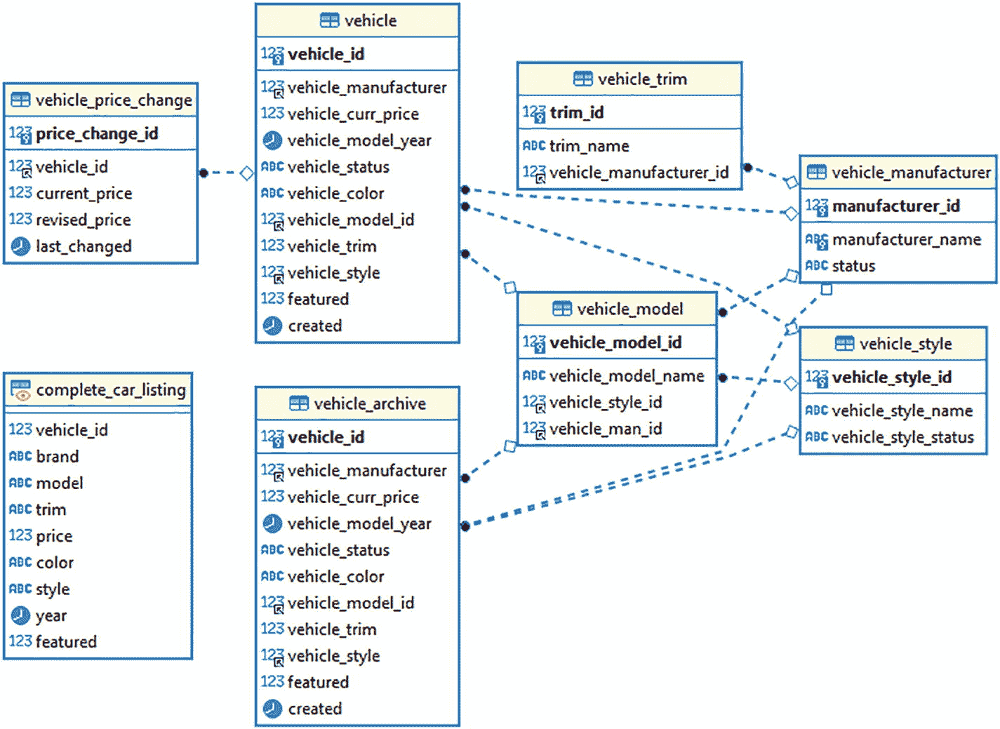
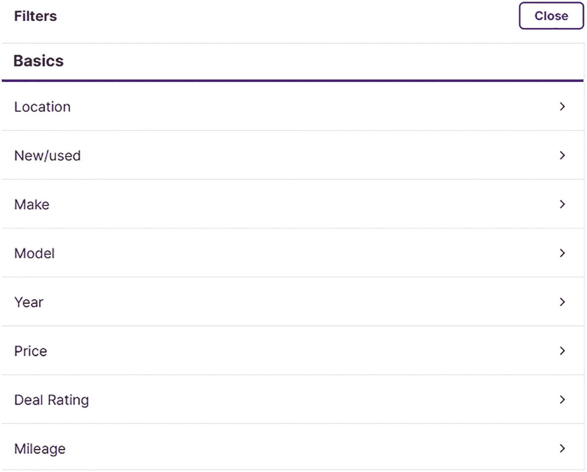

# 2.jOOQ 入门

让我们把这个东西旋转！但是首先，你应该了解这些类和接口；他们是 jOOQ 中 75%工作的核心:

1.  `org.jooq.impl.DSL`

    This is the sturdy, wise grandparent of most of jOOQ’s functionality. With this class, you can
    *   以类型安全的方式操作部分强类型 SQL 查询。

    *   访问数据库功能(`concat`、`coalesce`等)。)就好像它们是 java 方法一样。

    *   指定数据库方言。这是在您需要执行数据存储特有的操作时使用的(Oracle、Amazon Redshift、PostgreSQL 等。).

    *   进行数据库定义语言(DDL)操作，如`ALTER`、`CREATE`、`DROP`等。，所有这些都是以类型安全的方式进行的。

    *   执行更平凡的任务，如
        *   构造明文 SQL

        *   配置数据库连接

    它的几乎所有功能都是类中的静态方法，所以你通常只需要执行一个`import static org.jooq.impl.DSL.*`来使用它的特性。

2.  `org.jooq.DSLContext`

    Where `DSL` offers almost all its functionality in static methods without state, DSLContext is more object oriented. There’s some overlap between this component and the `DSL` class, but there’s a fundamental difference. It’s really in the name DSL: Domain-Specific Language **Context**. Keeping state in a context object provides runtime capabilities that you’re not going to get from `DSL` – comes in handy when your SQL operation is a multi-step one or is part of a longer process. Overall, `DSLContext` offers
    *   流畅的编程风格

    *   有状态组件

    *   与 Spring 等依赖注入框架更好的集成(稍后会详细介绍)

    `DSLContext`流畅的编程风格可圈可点。这不是标准的构建器模式风格的方法调用链。这是一个真正的 DSL，可以防止您意外地(甚至是故意地)构造不正确的 SQL。只有在前一个方法调用正确支持时，链中的每个方法调用才是可能的。事实上，您需要非常努力地在 jOOQ 中构造不正确的 SQL。因为 DSLContext 的使用主要是有状态的，所以在使用这个类时，您需要更加注意线程安全。

3.  `org.jooq.conf.Settings`

    The `Settings` class will let you further customize your jOOQ context with simple, straightforward parameters that change the behavior of the API. An instance of this class can help you control factors like
    *   jOOQ 使用的那种 JDBC——常规语句或 T1。 <sup>[1](#Fn1)</sup>

    *   在相同的 jOOQ 上下文中映射不同的模式。

    *   控制 jOOQ 正在执行的 SQL 语句的日志记录。

    *   禁用对 Java Persistence API (JPA)注释的支持，以略微提高性能。

    *   配置 jOOQ 内部 SQL 解析器的行为——例如，为特定的 SQL 方言进行设置。如果您使用 jOOQ 而不是它的 typesafe 选项来处理原始的 SQL 字符串，这将适用。

    *   配置 JDBC 特有的选项，如`queryTimeout`和`maxRows`。

    *   为批处理操作配置批处理大小。

4.  `org.jooq.Configuration`

    `Configuration`类包含控制 jOOQ 运行时行为的核心配置项。`Configuration`负责管理您的数据库连接，插入 jOOQ 引擎以在更广泛的范围内定制其行为，而不仅仅是单个 SQL 查询。`org.jooq.Configuration`提供了允许您插入定制代码的方法，这些代码可以完全替换或支持标准 jOOQ 功能。

5.  `org.jooq.meta.jaxb.Configuration`

    您将使用这个类来控制 jOOQ 的代码生成特性。这是一个名为`library.xml`的 jOOQ 配置文件的直接模拟。生成数据库表、行、列、存储过程等的 java 表示。是 jOOQ 平台的一个主要特性，我很期待这本书的这一部分！是的:`org.jooq.Configuration`对`org.jooq.meta.jaxb.Configuration`可能会导致一些尴尬。


*哪款进口声明穿起来最好？恶作剧问题:是贝基* *。*

## 伊甸园汽车市场

我将用汽车经销商作为我将在本书中展示的所有例子的背景。Eden Auto 是一家通过门户网站销售新车和二手车的汽车经销商，客户可以

*   通过汽车本身的许多不同属性来搜索汽车

*   搜索不同品牌的车辆

*   在一个价格范围内搜索

在后端，Eden Auto 的员工可以

*   上传待售汽车

*   更新现有价格和其他属性

*   从库存中删除汽车

*   查看现有库存

*   通过多种属性搜索汽车库存

这里我们将使用一个相对简化的数据模型，只是为了演示 jOOQ 的具体特性。这是它的样子。



为了帮助运行本书中的一些示例，您可以使用本书附带的代码示例中的数据库定义进行引导。

## 设置 jOOQ

首先，您需要考虑将要使用的 RDBMS 的细节。jOOQ 的魅力在于它允许你使用几乎所有的数据库，非常方便。jOOQ API 可以透明地模拟所选数据库中没有的特性。对于这本书，我将使用 MySQL 做大部分的演示，偶尔会使用一些其他流行的数据库。

我需要 MySQL 的 Connector/J 数据库驱动程序作为依赖项:

```java
<dependency>
      <groupId>mysql</groupId>
      <artifactId>mysql-connector-java</artifactId>
      <version>${mysql-driver-version}</version>
</dependency>

```

在 jOOQ 的实际设置上，事情变得有点…有趣。你看，jOOQ 既有免费软件也有商业软件——双重许可模式。许可证模型决定了(除其他事项外)

*   您可以在应用程序中使用的 SQL 方言

*   你在项目中设置 jOOQ 的方式

对于 jOOQ 的免费版本，这是一个简单的 maven 条目，因为它在全球 Maven repo 中公开提供:

```java
<dependency>
    <groupId>org.jooq</groupId>
    <artifactId>jooq</artifactId>
    <version>3.15.1</version>
</dependency>
<dependency>
    <groupId>org.jooq</groupId>
    <artifactId>jooq-meta</artifactId>
    <version>3.15.1</version>
</dependency>
<dependency>
    <groupId>org.jooq</groupId>
    <artifactId>jooq-codegen</artifactId>
    <version>3.15.1</version>
</dependency>

```

很简单，对吧？布埃诺。然而，当你为商业版本付费时，事情变得更加手动。事情是这样的。

### 为商业许可的 jOOQ 安装依赖项

jOOQ 的商业 <sup>[2](#Fn2)</sup> 版本的依赖项在公共存储库中不可用，因为它们不是免费的，因此不能公开下载。要获得商业版(或试用版)，请访问 [`www.jooq.org/download/versions`](http://www.jooq.org/download/versions) 下载与您的 Java 版本相匹配的版本。

```java
<screenshot of versions page>

```

一旦你输入了你的详细信息，系统会提示你下载一个 zip 文件，其中包含

*   来源

*   编译的 jar

*   助手脚本

zip 文件中有两个助手脚本:

*   `maven-deploy`

*   `maven-install`

这两个助手对不同的目标做同样的事情:构建 jOOQ jars 并将其安装到存储库中。将在远程存储库中设置 jOOQ JARs，因此需要在中央 Artifactory 或类似的依赖存储库中设置 JAR。对于本地 maven 存储库，找到`maven-install`脚本，你就被排序了。在所有这些脚本操作之后，您可以像这样将 commercial jOOQ 添加到您的项目中:

```java
<dependency>
   <groupId>org.jooq.pro</groupId>
   <artifactId>jooq</artifactId>
   <version>3.15.1</version>
</dependency>
<dependency>
   <groupId>org.jooq.pro</groupId>
   <artifactId>jooq-meta</artifactId>
   <version>3.15.1</version>
</dependency>
<dependency>
   <groupId>org.jooq.pro</groupId>
   <artifactId>jooq-codegen</artifactId>
   <version>3.15.1</version>
</dependency>

```

它和免费版的`artifactId`一样，但是有一个不同的`groupId:org.jooq.pro`。你可以通过使用`groupId`的`org.jooq.trial`来使用 jOOQ 商业版的试用许可。开源版本对于许多用例来说功能一样，但是数据库供应商支持有限，功能也更少。 <sup>[3](#Fn3)</sup> 同样值得注意的是，jOOQ 的 JDK 支持从 JDK **6** 开始，一直到最新的(17，截至本文撰写之时)。旧的 JDK 版本只支持付费版本。

Tip

商业 jOOQ 发行版的试用版将打印一条消息，表明是的，您确实在使用商业 jOOQ 发行版的试用版。但是值得庆幸的是，试用版的用户们，对于 jOOQ 来说是有效的，因为它是慷慨的:设置 JVM 属性`org.jooq.no-logo=true`来禁用试用许可警告消息。

就这样！jOOQ 设置在您的项目中。现在用它来做一些事情…

## jOOQ 的 CRUD

有了 jOOQ JARs，配置了数据库驱动程序，我们现在应该开始使用这个坏小子了。我们需要获取连接，加载驱动程序，等等。如果您以前没有用 Java 做过数据库工作，我将向您展示如何用 Java 做这件事:

```java
try(Connection connection = DriverManager.getConnection("jdbc:mysql://localhost/test?user=testuser&password=thisisaterriblepassword")){
      //more to come
}catch(SQLException sqlex){

}

```

上述代码片段的目标是获取数据库连接；jOOQ 可以处理接下来的所有事情。如果你遵循一些常识性的原则，jOOQ 本身并不太在意你如何获得这种联系。在现代应用程序中，这不是一种特别好的获取连接的方式。您应该使用`javax.sql.Datasource`类和连接池，而不是手动争论连接驱动程序。但稍后会详细介绍。现在，我们有了一个数据库连接，因此是时候启动 jOOQin 了。

Remember

`DSL`和`DSLContext`是 jOOQ 生态系统的主要入口。

从根本上说，大多数 jOOQ 操作将从以下内容的一些变体开始:

```java
DSLContext context = DSL.using(connection,SQLDialect.MYSQL);

```

在前面的示例中

*   我提供了 JDBC 连接对象(我如何获得连接现在并不重要)。

*   我从`SQLDialect`枚举中提供一种方言传递给`DSLContext`。

根据制造商的说法，`DSLContext`并不总是保证是线程安全的——毕竟它是一个上下文对象。然而，如果你个人采取合理的预防措施，你可以享受这个类的线程安全。已经为`DSLContext`提供了有效的 JDBC 连接，现在可以进入**创建、读取、更新和删除** (CRUD)的本质。但首先，我们的赞助商要说一句话…

### 你的 SQL 方言和你

虽然在您的`DSLContext`上设置 SQL 方言不是强制性的，但是您最好这样做。看，RDBMSes 有许多不同的怪癖，我已经介绍过了。其中一些很显眼，很容易被发现。其他更琐碎的事情会出乎意料地绊倒你。以我选择的 MySQL 数据库为例:

*   标识符样式:您可能已经意识到不同的数据库对标识符使用不同的引用样式。因此，标准 SQL 将具有

```java
select "e"."first_name", "e"."last_name" from "employees" "e"

```

但是 MySQL 有 <sup>[4](#Fn4)</sup>

```java
select `e`.`first_name`, `e`.`last_name`  from `employees` `e`

```

反斜线，而不是双引号。这并不是说，如果不指定一种方言，您将被拒绝许多功能。与此相反，jOOQ 通常会尽力模拟一两个数据库本身支持但其他数据库不支持的特性，例如:

*   返回键:PostgreSQL 中的 SQL `INSERT... RETURNING`将返回已插入行的生成键，并且由于 insert 操作，它立即可用。这是由 SQL 标准提供的，但数据库并不统一支持。其中，实现细节各不相同。jOOQ 可以为您模拟这个特性，不管您使用的是哪种数据库。这里有一个合理的警告:根据您的数据库对它的支持类型，jOOQ 可能会被迫对数据库进行第二次`SELECT`访问，以检索生成的密钥。

*   虚拟表:不同的 SQL 数据库允许您以不同的方式从虚拟表中进行选择。例如，Oracle 有著名的`DUAL`表。有时，您只想运行一些函数，但是 RDBMS 要求您指定一个`FROM`子句——而不提供虚拟表。jOOQ 支持不带 from 子句的 select 语句，因此无论有没有虚拟表，您都可以随心所欲。

如果你不指定任何方言，你将得到默认的`SQLDialect.DEFAULT`，然后通过 con Dios 得到*！ <sup>[5](#Fn5)</sup>*

Caution

为了您自己的安心，继续在您的`Settings`对象上配置`org.jooq.conf.Settings.backslashEscaping`属性。MySQL 和 PostgreSQL 的一些版本支持非标准的转义字符，这会在您最意想不到的时候给您带来很多麻烦。这个属性让 jOOQ 正确地处理 MySQL 的这个“特性”。

这是我们的赞助商说的话！


*感谢您的阅读！*

好的，现在让我们进入…

### jOOQ 中的 CRUD 工具

jOOQ 为 SQL 语句的整体提供了很多细粒度的控制——实际上，这是一种唾手可得的控制。从一个非常高的层次开始，我将介绍一些关键组件，如果您要使用 jOOQ 进行 CRUD，您需要熟悉这些组件:

1.  `org.jooq.Query`

    This is the fundamental unit of a SQL query in jOOQ-land. It extends `org.jooq.Statement` along with the jOOQ representations of other executable database units of work like stored procedures and functions. You can use it to execute
    *   作为参数传入的纯文本 SQL

    *   使用 jOOQ API 构造的强类型 SQL 片段

它可以帮助您将手动导出的明文 SQL 转换为 jOOQ DSL 类型的 SQL 对象，反之亦然。这是 SQL 查询的典型表示；当不需要操作返回值时(如数据操作语言操作)，使用它来执行 SQL 语句。

1.  `org.jooq.ResultQuery`

    This class is basically `org.jooq.Query`, but you can obtain return values from it, like query results. Some notable qualities of this class:
    *   它的高效之处在于，它不需要一个活动的数据库连接来提供对其结果的访问——一旦查询成功执行，就可以释放连接，并且您可以向该类的实例查询所有查询结果。 <sup>[6](#Fn6) 将此功能与分离的 hibernate 实体进行比较。</sup>

    *   它提供了类型化和非类型化的结果获取，类似于使用 Spring `JdbcTemplate`所获得的结果。

    *   它映射到定制的普通旧 Java 对象(POJOs)。

    *   它支持使用底层数据库游标延迟获取查询结果。如果您走这条路，请注意它依赖于维护实时数据库连接。

    *   它支持反应式编程。

    *   它通过`java.util.stream.Stream`接口支持流。

总之，它为争论查询结果提供了一个非常灵活的接口。它和你用 Hibernate 或 JPA 得到的任何东西一样强大，比 JDBC 让你经历的同样的结果要少得多。

1.  `org.jooq.QueryPart`

    On its own, not too powerful. But it’s the parent type of a large suite of classes that help you construct complex queries dynamically. Compare this class to the `CriteriaBuilder` in JPA or the `Specification` from Spring Data JPA. To be clear, this API is exorbitantly richer than either of what JPA or Spring Data provide. Pretty much every fragment of the SQL standard specification can be represented as variant of `org.jooq.QueryPart`, for example:
    *   `Field`表示可以在任何地方、任何种类的 SQL 语句中使用的字段

    *   `Condition`表示像`WHERE`、`HAVING`这样的谓词

    *   `SQL`表示一条完整的 SQL 语句或片段

    *   在查询中需要表格的地方，表示整个表格

    *   `Row`来表示元组(或者通俗地说，类似于表中的一行)

    *   代表…是的，一列

    *   `Constraint`表示数据库约束，作为 DDL 操作的一部分

    *   `Schema`表示任何 SQL 查询的模式部分

这是`QueryPart`能够达到的粒度级别的一个小样本。见鬼，每一种都有更专业的版本，提供特定的优势。如果您曾经梦想能够支持强大的动态过滤器作为搜索功能的一部分，但是不需要到处连接难看的纯文本 SQL 字符串，这就是您想要的地方。

您可以获得强大的、可重用的组件来构建任何类型的 SQL 用例。当您使用 jOOQ 的代码生成特性时，生成的工件也继承自这个家族。非常强大的东西。

1.  `org.jooq.Record`

    This is the parent class for representations of a row of data from a table. This is in addition to jOOQ’s capability to work with your custom POJOs and Data Transfer Object (DTOs). You get the following specializations of this class, among others:
    *   `org.jooq.UpdatableRecord`

        与 hibernate 实体相比:它是一个活动的对象，在其生命周期内一直绑定到底层数据库行。这样，您可以修改刷新、修改或删除一个`UpdatableRecord`实例，并且它可以反映底层表中的变化。

        当您使用 jOOQ 生成的工件时，默认情况下您会得到扩展这个工件的类。这只适用于有主键的表——没有主键，您将得到一个不同的生成工件。此外，您将能够使用外键引用导航到可更新记录的相关实体。就像 JPA 一样！但是更好！没有缓存，因此可以保证您始终使用最新的实时数据。在 RAM 上也更容易。

    *   `org.jooq.TableRecord`

        当底层表不使用主键时，这是您得到的而不是一个`UpdatableRecord`。因此，您将无法刷新或更新这些记录的一部分；但是，您仍然可以用这个类插入行。

    *   `org.jooq.RecordMapper`

        使用此类对查询结果的翻译进行更细粒度的控制。将此与 Spring 的`RowMapper`类进行比较。

2.  `org.jooq.Result`

    这是一个保存查询结果的容器类。实际上，您的`Record`对象或`Record`对象列表将被一个`Result`实例包装。这是一个`Collection`、`Iterable`、`List`和`Serializable`——所以你可以用它做很多事情(函数式、反应式和 JDK 流编程)。它也可以与 JDBC 的`ResultSet`互操作。它还有一个额外的优势，那就是它不像`ResultSet`那样依赖于开放的数据库连接。

你感觉到力量了吗？


你呢？

我希望如此，因为我们要用这种力量…

### 选择语句

让我们向我们的老朋友问好:

```java
DSLContext context = DSL.using(connection,SQLDialect.MYSQL); //hullo!

```

首先，我们需要能够运行普通的 SQL 查询。这是它的样子。给定我手动创建的自定义`CompleteVehicleRecord` POJO:

```java
public class CompleteVehicleRecord {
    Long id;
    String brand;
    String model;
    String trim;
    BigDecimal price;
    String color;
//getters, setters, toString and hashCode;
}

```

这个类在数据库中封装了一辆待售的汽车。我对选择数据库中所有可用的车辆感兴趣。用 SQL 术语来说，应该是这样的:

```java
SELECT * FROM edens_car.complete_car_listing;

```

以下是 jOOQ 的情况:

```java
DSLContext context = DSL.using(connection,SQLDialect.MYSQL);
                ResultQuery resultQuery = context.resultQuery("SELECT * FROM edens_car.complete_car_listing"); (1)
                List<CompleteVehicleRecord> allVehicles = resultQuery.fetchInto(CompleteVehicleRecord.class); (2)
                logger.info(allVehicles.toString());

```

没什么特别的，只是你普通的选择语句。 <sup>[7](#Fn7)</sup> 这里:

1.  我将我的明文 SQL 传递给`DSLContext#resultQuery`方法来检索所有可用的汽车。我选择从执行中获得一个`ResultQuery`,因为我想从中获得结果。如果这是一个我不想要结果的查询(比方说，删除或插入语句)，我会使用`Query`类来代替。

2.  在`ResultQuery`上，我调用了`fetchInto`方法来自动映射结果中的每一行
    *   将返回的每一行映射到`CompleteVehicleRecord`的一个实例中

    *   将所有映射的行放入列表`CompleteVehicleRecord`

jOOQ 能够推断出我的 POJO 的字段和 jOOQ select 语句中返回的列之间的映射。正如您可能已经猜到的，SQL 查询中的类变量和列的名称需要匹配。有其他方法可以有意地建立这种映射；我们将在本书的后面部分检查它们。

或者，我可以使用`fetchMany`方法，这样我可以更好地控制每一行的映射:

```java
resultQuery.fetchMany().forEach(results -> {
                      //container for all the results
                      results.forEach(record -> {
           logger.info("New result row");
           logger.info("Brand: {}",record.getValue("brand"));
           logger.info("Model: {}",record.getValue("model"));
           logger.info("Trim: {}",record.getValue("trim"));
           logger.info("Color: {}",record.getValue("color"));
           logger.info("Price: {}",record.getValue("price"));
           });
      });

```

`fetchMany`方法保证永远不会返回空值，所以不要基于任何空值检查的逻辑。如果我只期待一个结果，我会使用`fetch`方法。您还可以使用这种方法在同一次执行中执行多个 SQL 语句——这是一种简单但非常强大的方法。继续阅读这种方法的更多用法。

我还可以向 SQL 语句提供查询参数，如下所示:

```java
ResultQuery resultQuery2 = context.resultQuery("SELECT * FROM edens_car.complete_car_listing where color = ?","BLUE");

```

**查询绑定**——我说“蓝色”的地方——就是你如何为你的 SQL 语句提供参数。当与底层`DSLContext` API 上的`PreparedStatement`配置结合时，这种绑定查询参数的方法提供了一些 SQL 注入保护。

Remember

jOOQ 可以默认使用 JDBC `PreparedStatement`组件，如果你这样配置的话，那么你的参数仍然可以从该组件内置的 SQL 注入安全性中获益。还可以通过调用`Query`对象上的`keepStatement`方法来缓存底层的`PreparedStatement`；这为频繁使用的稳定查询提供了性能提升。

让我们看看 jOOQ 库的一些更酷、更有目的的用法。

#### 选择 DSL

jOOQ 提供保护您免受畸形的 SQL，SQL 注入，缺少参数，过度限制和丑陋的代码。它以递增的强大方式做到这一点，因此您可以按照自己的速度前进。我们再来重温一下`SELECT`语句的*语境*(呵呵)中的`DSLContext`:

```java
SELECT * FROM edens_car.complete_car_listing

```

我可以这样重写前面的明文`SELECT *`:

```java
DSLContext context = DSL.using(connection,SQLDialect.MYSQL);
List<CompleteVehicleRecord> allVehicles = context.select().from(table("complete_car_listing")).fetchInto(CompleteVehicleRecord.class);

```

这两条语句在功能上是相同的，并且将返回相同的结果:

1.  `select()`是 jOOQ 对`SELECT *`的简写。jOOQ 中充满了这样的简写，有助于减少冗长。

2.  `table`是来自`DSL`类的函数，静态导入。它帮助我将表的明文 SQL 名称转换成一个`org.jooq.Table`的实例。这样做的效果是 jOOQ 可以把我的语句当作一个类型安全的版本。

我在这里所拥有的仍然有一部分在普通 SQL 领域中，因此，我必须使用`DSL`类中的 helper 函数来将我的普通 SQL 翻译成类似 jOOQ 的 typesafe API 的东西。可以这样想:如果我仍然在 select 语句的关键部分使用普通字符串，jOOQ 仍然不能 100%保证许多方面的正确性。这个 DSL 确保我的查询在语法上是正确的，但是它不能保证语义上的正确性——我仍然被允许在表、列等的名称上犯印刷错误。

现在，`SELECT *`有点浪费，所以我通常更喜欢使用 SQL 预测来更简洁地说明我感兴趣的列:

```java
List<CompleteVehicleRecord> allVehicles = context.select(field(name("brand")),field("model"),field("price"))
            .from(table("complete_car_listing"))
            .fetchInto(CompleteVehicleRecord.class);

```

像`table`函数一样，`field`来自`org.jooq.impl.DSL`，我在这里使用它只是为了在我手工制作的、无麸质的、手工 SQL 和 jOOQ 的强类型、以 DSL 为中心的世界之间架起一座桥梁。`field`函数将我的原始 SQL 字段名转换成`org.jooq.Field`的实例，`table`将我的表名转换成`org.jooq.Table`，而`name`将创建`org.jooq.Name`的实例。所有这些都是`QueryPart` s，它们构成了能够构建强大而复杂的查询的基础。

构建 select 语句的另一种方法是单独设置相关字段:

```java
Field<?> brandField = field("brand"); (1)
Field<?> modelField = field("model",String.class);
Field<BigDecimal> priceField = field("price", BigDecimal.class); (2)
List<Field> fieldList = Arrays.asList(brandField,modelField,priceField); (3)

List<CompleteVehicleRecord> allVehicles = context.select(fieldList)
                          .from(table("complete_car_listing"))
                          .fetchInto(CompleteVehicleRecord.class);
logger.info(allVehicles.toString());

```

在前面的代码片段中

1.  我从明文“SQL”手动构造了一个`org.jooq.Field`的实例注意我在这里使用的通配符语法，`Field<?>`。这是有目的的:jOOQ 完全是关于类型安全的，所以在很多情况下它会喜欢类似类型信息的*东西*。习惯于指定`Field`的类型，当不能提供时，使用通配符。

2.  更好的是，我可以在变量声明的两边提供类型信息。`Field`可以类型安全，`field`函数可以提供类型安全信息。因为我不太使用 jOOQ 的类型安全生成的代码，所以 jOOQ 可以使用我提供的任何附加信息来保护我的 SQL 语句的完整性和可靠性。

3.  然后，我可以将所有必要的字段存储到一个标准 java `List`中。

4.  jOOQ 查询的任何部分都可以使用这个列表。

这个机制真的很强大。使用这种方法，我可以在代码中获得很大的可重用性和灵活性，即使我没有使用 jOOQ 生成代码。我将向您展示更多这种可重用性的场景——这就是 jOOQ 库中`QueryParts`组件的威力。

Tip

使用`DSL#name`函数以模式安全的格式处理原始 SQL 标识符。当为`DSLContext`启用报价时，它还可以提供 SQL 注入保护。

带`select`的其他选项包括

*   用`selectDistinct`运行一个`SELECT DISTINCT`。

*   通过运行`selectOne().fetch`从哑表中进行选择(比如 Oracle 的 DUAL，或者 PostgreSQL 的 nothing)。这个特性依赖于在`DSLContext`中正确设置的 SQLDialect 参数。

*   组合单独构造的`SELECT`语句；本书后面会有更多的介绍。

如果我想在查询中包含一个查询呢？你知道的！是时候深入研究一下……

#### 使用 WHERE DSL

在决定了我对我的`vehicle`表中的哪些列感兴趣之后，我希望对返回哪些行有更多的限制——输入全能的`WHERE`子句。以下是可能的情况:

```java
List<CompleteVehicleRecord> allVehicles = context.select(field("brand"),field("model"),field("price"))
              .from(table("complete_car_listing"))
              .where(condition("color = 'BLUE'"))
              .fetchInto(CompleteVehicleRecord.class);

```

我在技术上使用 DSL，虽然效果不是很好。这在很大程度上仍然是一个纯文本的 SQL where 子句，我应该为自己感到羞耻——我确实是这样。因此，我将再次尝试使用绑定变量，如下所示:

```java
context.select(field(name("brand")),field("model"),field("price"))
             .from(table("complete_car_listing"))
             .where(condition("color = ?","BLUE"))
             .fetchInto(CompleteVehicleRecord.class);

```

从 SQL 注入的角度来看，这更安全一些。我仍然负责确保前面代码片段的语法是正确的，并且当整个代码组合在一起时会正确地输出。总的来说，这仍然读起来更好，更流畅。我喜欢 jOOQ DSL 的一点是，它致力于确保在构造 SQL 时不会出错。例如，除了在`from`子句之后，我不可能在任何地方使用`where`节点。因此，即使我选择在特定的时间间隔继续使用普通的 SQL，我仍然可以得到一些保护，因为我的 SQL 在语法上是正确的。此外，我还受益于 jOOQ 在处理 JDBC 连接时使用的资源高效方法。

Pop Quiz

`org.jooq.impl.Settings`和`org.jooq.impl.Configuration`类有什么区别？

Answer

通过简单地改变一个设置，`Settings`类将允许你改变 jOOQ 运行时的预定义行为。`Configuration`类提供了对 jOOQ 中扩展点的访问，您可以提供定制代码来替换或改变 jOOQ 运行时的行为。

现在，对于 jOOQ API 中我最喜欢的组件之一…

##### 情况

您提供给`select` DSL 的`from`节点的参数实际上是`org.jooq.Condition`的实例。`Condition`是一个强大的类，可以让您编写简单或复杂的谓词组件。然后，您可以附加到接受条件逻辑的 SQL 结构中的几乎任何位置。所以，我可以这样写一篇`Condition`:

```java
Condition colourCondition = condition("color = ?","BLUE");
...and then pass that into my constructed {select} execution:
context.select(fieldList)
           .from(table("complete_car_listing"))
           .where(colourCondition)
           .fetchInto(CompleteVehicleRecord.class);

```

能够动态构造整个 SQL 查询的各个部分是 jOOQ 工作方式的基础。在你阅读这本书的时候，你会看到这种语句的不同风格，但是你的 SQL 语句的每一部分都可以独立于其他部分来构建。你的`SELECT`、`WHERE`或`HAVING`条款等？您可以独立构建它们，然后将它们组合在一起。

通过 jOOQ 用`Condition`提供的一些便利工具，事情甚至可以变得*更加*灵活。例如，我可以用可选的`WHERE`子句构造一个 jOOQ 查询，如下所示。考虑下面的 jOOQ 查询，我用它从`complete_car_listing`表中选择汽车细节:

```java
List<CompleteVehicleRecord> allVehicles = context.select(field(name("brand")),field("model"),field("price"))
            .from(table("complete_car_listing"))
            .where(colourCondition)
            .fetchInto(CompleteVehicleRecord.class);

```

所以，这看起来就像你到目前为止看到的 jOOQ 查询，对吗？如何让这个查询使用一个可选的*`WHERE`子句？这样，无论网站用户是否选择过滤标准，我都可以重用相同的查询。因此，考虑这样一个假设的用户界面:*

 *

*伊甸园*汽车网站*的过滤条件选择框*

有多个选项可以用来过滤搜索结果。您需要能够使用相同的 jOOQ 语句，无论用户是否选择任何过滤标准。jOOQ 查询如下所示:

```java
public static void selectWithOptionalCondition(boolean hasFilter, Map<?,Object> filterValues) throws SQLException{
        ...
        Condition conditionChain = DSL.noCondition(); (1)
        if (hasFilter) {
                for(String key: filterValues.keySet()){
                    conditionChainStub = conditionChainStub.and(field(key).eq(filterValues.get(key))); (2)
                }
            }

     List<CompleteVehicleRecord> allVehicles = context.select(field(name("brand")),field("model"),field("price"))
           .from(table("complete_car_listing"))
           .where(conditionChain)
           .fetchInto(CompleteVehicleRecord.class);
           logger.info(allVehicles.toString());
           }
}

```

这是细目分类:

1.  为了获得`Condition` }类的最大灵活性，jOOQ 提供了`DSL#noCondition()`方法。这将生成一个条件存根，我可以选择将其他条件链接到该存根。还有其他类似于`DSL.trueCondition`和`DSL.falseCondition`的，分别产生设置为`true`和`false`的条件。

2.  `Condition`提供了`and`运算符。使用这个工具，我可以组合从 web 层传入的过滤条件，如果它们存在的话。如果没有过滤参数传入(例如，`hasFilter`为假)，那么`WHERE`条件将不会应用于最终执行的 SQL 语句。否则，将应用构造的`Condition`。

您可能已经知道，`Condition`类提供了您需要的所有布尔运算符:`or`、`not`、`exists`，以及所有这些运算符的所有有用排列。我们不要忘记`Field`类中的比较操作符:

```java
Condition condition = field(name("price")).greaterOrEqual(BigDecimal.valueOf(360000));

```

没错:`Field`类本身可以通过类本身提供的许多比较操作符产生条件。

为了让*甚至*更加灵活地构建您的条件，请查看`CustomCondition`类:

```java
CustomCondition customCondition = CustomCondition.of(conditionChain ->{
                conditionChain.sql("color ='BLUE'")
                        .sql(" AND price < 35000");
            });

```

`CustomCondition`提供了在构建条件的过程中执行复杂逻辑的机会。通过提供一个接受 lambda 的功能接口，您可以对流程进行更多的控制。它仍然产生一个对象，你可以把它和你拥有的任何其他条件结合起来。

灵活性！

Pro Tip

`Field`类提供了`isNull`和`isNotNull`来满足您所有的空值比较需求。保持安全；使用适当的空值比较方法。请注意，除了专门用于处理空值的数据库功能外，还提供了这些功能(例如，`COALESCE`、`NVL`等)。).

#### 子查询

例如，我想搜索某个特定制造商最近降价的车辆，因为我认为降价意味着没有人买车，经销商可能愿意给我打折。 <sup>[9](#Fn9)</sup> 下面是普通 SQL 查询的样子:

```java
SELECT *                       (1)
FROM  complete_car_listing ccl
WHERE (ccl.vehicle_id , ccl.price) IN  (1a)
            (SELECT vpc.vehicle_id, vpc.revised_price     (2)
                FROM vehicle_price_change vpc
                WHERE vpc.revised_price < vpc.current_price
                AND (vpc.vehicle_id , vpc.last_changed) IN
            (SELECT vc.vehicle_id, MAX(vc.last_changed) (2a)
                FROM vehicle_price_change vc
                GROUP BY vc.vehicle_id))

```

该查询(从技术上讲，一个主查询和两个子查询)将

1.  在该子集内，确保最近的价格修订是降价。

1.  检索库存中汽车的所有详细信息
    1.  我通过使用 SQL 行值表达式机制与子查询的结果进行比较来匹配顶级查询的行。

2.  查找价格下调的汽车

Caution

“jOOQ 是关于类型安全的”——我，几页前。这仍然是正确的，但是你会看到我在后续的代码示例中跳过了一些类型安全约定，例如，使用`field("price")`而不是`field("price",BigDecimal.class)`。这在很大程度上是为了删除一堆样板代码；类型安全的基本原理保持不变。**与用 jOOQ** 生成类型安全代码相比，使用纯文本 SQL 仍然是一个较差的选择。随着 jOOQ 之旅的继续，纯文本 SQL 将开始产生问题和怪异，这是没有类型安全的直接后果。请记住这一点。

明确地说，还有其他可能更好的方法来获得相同的结果:连接、窗口函数(后面会详细介绍)等等。这是一个虚构的例子，演示 jOOQ 中子查询的一些细节。如果您对本书附带的模式运行此查询，您应该会得到如下所示的结果:

```java
'3', 'Lexus', 'ES 350', 'BASE', '36000.0000', 'BLUE', 'Car', 2018
'4', 'Acura', 'MDX', 'SPORT', '50000.0000', 'BLUE', 'Car', 2018

```

这在 jOOQ 中会是什么样子？首先，我将声明几个字段和表，以便在我将要构建的查询中重用:

```java
Field<Long> vehicleId = field(name("vehicle_id"),Long.class);
Field<BigDecimal> vehicleRevisedPrice = field(name("revised_price"),BigDecimal.class);
Field<BigDecimal> vehicleCurrentPrice = field(name("current_price"),BigDecimal.class);
Field<BigDecimal> price = field(name("price"),BigDecimal.class);
Table vehiclePriceChange = table(name("vehicle_price_change"));
Field<LocalDateTime> lastPriceUpdate = field(name("last_changed"),LocalDateTime.class);

```

设置好这些之后，我可以着手设置实际的查询:

```java
final SelectCorrelatedSubqueryStep<Record2<Long, LocalDateTime>> mostRecentPriceChange = context.select(vehicleId, max(lastPriceUpdate)).from(vehiclePriceChange).groupBy(vehicleId); (1)
final SelectConditionStep<Record2<Long, BigDecimal>> mostRecentPriceReduction =  context.select(vehicleId,vehicleRevisedPrice)
.from(vehiclePriceChange)
.where(vehicleRevisedPrice.lessThan(vehicleCurrentPrice))
.and(row(vehicleId, lastPriceUpdate).in(mostRecentPriceChange)); (2)

```

以下是我对这些问题的看法:

1.  我构建的查询将提供每个车辆 ID 的最新价格变化。`max`方法来自可信的`DSL`类。

2.  接下来，我使用(1)中的查询来构造查询，获取最近只降价的车辆。`row`方法也来自于`DSL`类，用于对子查询进行元组比较。

所发生的事情是，我已经单独构造了 jOOQ SQL 查询，以便于重用。现在，我们赞助商的一句话:“jOOQ 并没有正式推荐这种重用查询的方法，部分原因是考虑到可变性。”如果可读性不会太差，将子查询内联到主查询中会更安全。出于演示的目的，我已经分解了子查询，并将其命名为`final`。

好了，构造了子查询，让我们继续使用它们:

```java
SelectConditionStep<Record> potentialDealsQuery = context.select().from(table(name("complete_car_listing")))
                             .where(row(vehicleId,price)
                             .in(mostRecentPriceReduction));
String sql = potentialDealsQuery.getSQL();
logger.info(sql);

```

`potentialDealsQuery`使用`mostRecentPriceReduction`子查询获取最近降价的汽车。为了查看生成的查询是什么样子，我可以用`getSQL`方法从`potentialDealsQuery`中获取 SQL。结果如下:

```java
select * from `complete_car_listing` where (`vehicle_id`, `price`) in (select `vehicle_id`, `revised_price` from `vehicle_price_change` where (`revised_price` < `current_price` and (`vehicle_id`, `last_changed`) in (select `vehicle_id`, max(`last_changed`) from `vehicle_price_change` group by `vehicle_id`)))

```

很大程度上是对原始 SQL 意图的忠实翻译，是吗？像往常一样，我将获取结果:

```java
List<CompleteVehicleRecord> potentialDeals = potentialDealsQuery.fetchInto(CompleteVehicleRecord.class);

```

太多了吧？你已经买了这本书；如果第一轮没有成功，请再看一遍这一部分。我在这里一次介绍了多个概念，这些概念对 jOOQ 总体来说是有帮助的。如果一开始没有全部点击通读完全可以理解

Pop Quiz

:在 jOOQ 中使用纯文本 SQL 时，如何安全地引用字段？

a) `Field myField = field("myField")`

b) `Field <?> myField = field("myField")`

c) `Field<Integer> myField = field("myField", Integer.class)`

**答案** : (b)和(c)是推荐的方法；(c)更好！

#### 查询中的条件逻辑

如果您想变得更有趣，您可以在 SQL 中使用一些复杂的条件逻辑。以防我之前没有说清楚:我坚定地站在“让数据库做数据库非常擅长的事情，同时考虑到可维护性”的阵营中。为此，当我看到

*   首先将查询结果检索到应用层

*   然后执行数据库非常擅长的复杂分析

所以，我们已经确定我是一个小气鬼，我总是在寻找一辆划算的车——这两者是相互排斥的。我们已经看到了如何找到降价的汽车，因此可能会提供很好的交易。我们现在谈的交易有多好？我会说

*   降低 5%，“好的”

*   减少 10%，“好”

*   10%以上？“太好了！”

SQL 查询将如何呈现这一点？使用`CASE`功能:

```java
SELECT vpc.vehicle_id 'vehicle', vpc.current_price 'old price', vpc.revised_price 'new price', max(last_changed) 'last price update',
case when ((vpc.current_price - vpc.revised_price)/vpc.current_price)*100 <=5 then 'OK'
         when ((vpc.current_price - vpc.revised_price)/vpc.current_price)*100 BETWEEN 5 AND 10 then 'GOOD'
         when ((vpc.current_price - vpc.revised_price)/vpc.current_price)*100 > 10 then 'GREAT'

```

否则“不成交”

```java
 end as 'deal'
FROM vehicle_price_change vpc
WHERE vpc.revised_price < vpc.current_price
GROUP BY vpc.vehicle_id, vpc.current_price, vpc.revised_price

```

对于类似这样的结果:

```java
# vehicle   old price    new price   deal
2           48000.0000   47380.00    OK
3           37565.0000   36000.00    OK
4           55342.0000   50000.00    GOOD

```

您可能知道这将如何发展:如何在 jOOQ 中表示它？握紧你的键盘:

```java
context.select(vehicleId, vehicleCurrentPrice, vehicleRevisedPrice, max(field("last_changed")),
                    when((vehicleCurrentPrice.subtract(vehicleRevisedPrice))
                            .divide(vehicleCurrentPrice)
                            .multiply(100)
                            .lessOrEqual(BigDecimal.valueOf(5)), "OK") (1)
                            .when(condition("((current_price – revised_price)/current_price)*100 BETWEEN 5 AND 10"), "GOOD") (2)
                            .when(condition("((current_price - revised_price)/current_price)*100 > 10"), "GREAT")
                            .otherwise("NO DEAL") (3)
                            .as("deal")) (4)
   .from(table("vehicle_price_change"))
   .where(vehicleRevisedPrice.lessThan(vehicleCurrentPrice))
   .groupBy(vehicleId)
         .fetch()
             .forEach(result -> {
                   logger.info("Vehicle Id: {} | Revised Price: {} | Former Price: {}| Deal Rating: {}", result.get(vehicleId), result.get(vehicleRevisedPrice), result.get(vehicleCurrentPrice), result.get("deal"));
                    });
        }
    }

```

让我们来分解一下:

1.  跳过`SELECT`语句中的其他字段:我从`when`方法开始，在这个方法中，我使用了`Field`类的各种方法来构造构成交易的算法。我做算术，然后传递“OK”作为这个`when`条件的结果。请注意，这实际上并没有使用`case`关键字/方法。
    *   或者，如果你想使用`CASE (column)`的形式，你可以从`choose`方法开始，而不是`when`。

2.  我在这个`when`中使用了普通的 SQL 选项来展示完全的灵活性。你会注意到我在这里使用了`condition`方法，因为这正是`when`方法所需要的:一个 jOOQ `Condition`。这意味着您可以在 select 语句中需要它们之前构造并重用`Conditions`。

3.  `otherwise`方法为我的`CASE`提供了`ELSE`子句——包罗万象。

4.  `as`给我整个 case 语句的别名。

所有这些给了我以下输出:

```java
Vehicle Id: 2 | Revised Price: 47380.0000 | Former Price: 48000.0000| Deal Rating: OK
Vehicle Id: 3 | Revised Price: 36000.0000 | Former Price: 37565.0000| Deal Rating: OK
Vehicle Id: 4 | Revised Price: 50000.0000 | Former Price: 55342.0000| Deal Rating: GOOD

```

这是本书中我最喜欢的演示之一，因为它展示了 jOOQ 有多灵活。

一切都适用于任何地方，您可以从任何粒度级别编写 SQL 语句；这还不是这种力量的一个复杂例子。

jOOQ 支持一些特定于供应商的条件函数，比如

*   `DECODE`

*   `COALESCE`

*   `NVL`

*   `NVL2`

*   `IIF`和`IF`

*   `NULLIF`

所有这些都可以作为函数在…你猜对了:`DSL`类中得到！

#### WITH…WITH 子句

如果我对计算数据库中所有车辆的中值价格感兴趣，我必须有点创造性。看，这还不是一个标准的 SQL 函数。PostgreSQL 在某种程度上支持它， <sup>[10](#Fn10)</sup> 但对于大多数其他数据库，它将需要一些修补。根据我的经验，在 SQL 中“修补”往往需要相当难看的 SQL；我真的希望能够在我的 SQL 查询中重用它。下面是我使用 SQL 窗口函数(稍后将详细介绍)计算库存中所有车辆的中值价格时的样子:

```java
WITH median_cte as(SELECT ROUND(AVG(price)) median
                   FROM (select price, ROW_NUMBER() OVER (ORDER BY price ASC) AS rowpos, COUNT(*) OVER () AS total_cars from complete_car_listing) price_mod
                   WHERE rowpos BETWEEN total_cars / 2.0 AND total_cars / 2.0 + 1)
select brand, model, trim, price, CONCAT((ROUND((price - median_cte.median)/price,2) * 100),'%') 'relative to median'
from complete_car_listing, median_cte

```

在 MySQL 中，`WITH`子句运行一次中值查询，将结果存储在一个临时“表”中。 <sup>[11](#Fn11)</sup> 我可以在随后的`SELECT`语句中使用我指定的名字{ `median_cte` }引用结果，就像一个表一样。这就是所谓的“商业中”的常用表表达式(CTE)，你可能已经知道了。在 jOOQ 中这看起来像什么？

```java
Field<BigDecimal> price = field("price",BigDecimal.class); //define field and table for reuse
Table completeCarListing = table("complete_car_listing");
CommonTableExpression<Record1<BigDecimal>> medianCte =
name("median_cte") (1)
      .as(context.select(round(avg(price)).as("median")) (2)
                    .from(select(price, rowNumber().over(orderBy(price.asc())).as(name("rowpos")),
                                    count().over().as("total_cars"))
                                    .from(completeCarListing))
                                    .where("rowpos BETWEEN (total_cars / 2.0) AND (total_cars / 2.0 + 1)")
            );

```

这里发生了什么巫术？我告诉你:

1.  我构造了一个`CommonTableExpression`的实例，一个`org.jooq.Table`的变体。这意味着在许多情况下，我可以像对待标准 SQL 表一样对待这个对象。此块中的逻辑是一个窗口函数，用于计算数据库中车辆的中值价格。我将在本书的后面部分介绍窗口函数；你可以暂时忽略它。最重要的是，我已经将查询封装在这里，并将其命名为`median_cte`。

2.  我在这里执行的中值计算是一个名为`median`的字段。

随着 CTE 对象的连接和准备就绪，我可以在实际的 jOOQ 查询中使用它，如下所示:

```java
context.with(medianCte) (1)
                    .select(field("brand"), field("model"),field("trim"),field("price"),
concat(round((price.subtract(medianCte.field("median"))).divide(2),2).multiply(100),field("'%'"))
                        .as("relative to median price"))
                    .from(completeCarListing, medianCte) (2)
                    .fetchMany();

```

它给了我一个简单得多的主要查询:

1.  我只是将我的 CTE 放入`DSLContext`上的`with`方法中。
    *   注意我对`medianCte.field("median")`的用法。出于各种意图和目的，CTE 将被视为`WITH`子句后的一张桌子。因此，我可以引用(或“取消引用”)我的 CTE 中可用的列，就像我引用任何 SQL 表或子查询一样。

2.  然后我就可以像使用任何旧桌子一样使用 CTE 了。

Pop Quiz

:jOOQ 的父类是什么，它包含了可以组成一个完整 SQL 语句的所有子句和更小的部分？

a) { `Query` }

b) { `QueryPart` }

c) { `Field` }

Answer

:{ `QueryPart` }是父类，可用于表示 SQL 语句的每个部分。您可以用{ `Query Part` }的所有子元素编写任何类型的 SQL 语句

#### 通过 DSL 与组

在 jOOQ 中对查询结果进行分组就像您到目前为止看到的任何其他方法一样简单。在没有介绍你们俩认识的情况下，我也一直在悄悄地使用`groupBy`从句。不再有了！我现在想找回

*   所有轿车
    *   按品牌分组

*   所有轿车的总和，不考虑品牌

在 MySQL 中，对此的查询如下所示:

```java
select brand, count(*) "# of units"
from complete_car_listing
where brand = 'Sedan'
group by brand with rollup

```

Oracle 使用`GROUP BY ROLLUP (...)`语法。翻译成 jOOQ 也是同样的语法:

```java
Result<Record2<Object, Integer>> results = context.select(field("brand"),count().as("units"))
                    .from(table("complete_car_listing"))
                    .groupBy(rollup(field("brand")))
            .fetch()

```

值得信赖的老版本`org.jooq.DSL`提供了我完成这个查询所需的所有分组函数——`count`和`rollup`函数就来自那里。菜单上还有其他分组功能(`cube`、`groupingSets`)。祝你好运！

##### 有了 DSL

不管有没有`GROUP BY`子句，您都可以*拥有*和`HAVING`子句来限制组——在 SQL 和 jOOQ 中。为了将我的车辆计数列表限制为平均价格高于 20，000 美元的品牌，我将使用 jOOQ 查询，如下所示:

```java
Result<Record2<Object, Integer>> results = context.select(field("brand"),count().as("units"))
                    .from(table("complete_car_listing"))
                    .groupBy(rollup(field("brand")))
                    .having(avg(field("price",BigDecimal.class)).gt(BigDecimal.valueOf(20000L)))
            .fetch()

```

就这样。没什么特别的。

#### 通过 DSL 订购

使用 jOOQ 对查询结果进行排序也和您想象的一样简单。到目前为止，我已经在很多查询中使用它来排序我的汽车搜索结果；我只是将`orderBy`子句添加到我构建的流畅链中:

```java
List<CompleteVehicleRecord> allVehicles = context.select()
      .from(table("complete_car_listing"))
      .orderBy(field("year").desc() ,two())
      .fetchInto(CompleteVehicleRecord.class);

```

就像我一直在做的那样，我将我的普通 SQL `year`列转换成一个`Field`的实例。然后，我调用`Field`实例上的`desc`方法，将其转换成一个`OrderField`——一个专用于对查询结果进行排序的`Field`类型。此外，我使用`two`方法将文字“2”传递给`ORDER BY`子句。这将另外按照结果集中的第二列对查询结果进行排序。还要注意，您可以向`orderBy`方法提供一个排序字段列表。

##### 按案例排序

一种被低估的排序方法是能够有条件地对查询结果进行排序。如果你想到像 Reddit 这样的论坛上的“固定”帖子或博客上的“粘性”文章，这是实现这一点的一种方式。这是一种机制，它将确保结果集的特定行将基于特定标准定位在结果中。对于伊甸园的汽车商店，我希望能够永久列出“特色”的车辆，将在每个搜索结果页面的顶部。对于 SQL，这可能看起来像

```java
SELECT *
FROM edens_car.complete_car_listing
ORDER BY CASE featured
            WHEN true then 0
         ELSE 1 END ASC

```

在 jOOQ 中表示它将类似于

```java
List<CompleteVehicleRecord> allVehicles = context
                    .select(field(name("brand")), field("model"), field("price"))
                    .from(table("complete_car_listing"))
                    .orderBy(
                            case_(field("featured"))
                                    .when(true,0)
                                    .otherwise(1))
                    .fetchInto(CompleteVehicleRecord.class);

```

我在这里做的是

1.  指定我希望首先列出`weight`设置为`-1`的车辆。

2.  然后，我希望动态应用传入的任何其他任意排序标准。

这将保证标记为“特色”的车辆总是出现在任何搜索结果的顶部。对排序施加更多控制的另一种方法是使用我的排序标准的映射来手动确定特定行在整个查询结果中的位置:

```java
HashMap<String, Integer> sortMap = new HashMap<>();
sortMap.put("Toyota",Integer.valueOf(0));
sortMap.put("Acura",Integer.valueOf(5));

```

前面的地图显示丰田应该在结果列表中第一；讴歌应该从列表中的位置 6 开始；加权的行`2`应该出现在第 4 行。然后，我可以像这样将映射传递给`orderBy`子句:

```java
.select(field(name("brand")), field("model"), field("price"))
                    .from(table("complete_car_listing"))
                    .orderBy(field(name("brand"),String.class).sort(sortMap))
                    .fetchInto(CompleteVehicleRecord.class);

```

或者，我可以使用…

#### 按 NULL 排序

`ORDER BY`子句的行为因数据库而异。Oracle 和 PostgreSQL 会将空值视为比其他值更大，因此当您使用`ORDER BY weight ASC`时，带有空值的行将最后显示。MySQL、SQL Server 和 SQLite 以相反的方式处理空值:当您`ORDER BY ASC`时，这些行将首先显示。如果您希望在 RDBMSes 之间得到一致的结果，那么明确您希望空值排序的方向正是您希望进行的那种有意识的编码。因此，考虑这个 SQL 查询:

```java
SELECT *
FROM edens_car.complete_car_listing
ORDER BY color NULLS FIRST

```

现在，MySQL 不支持这种语法；PostgreSQL 和几个其他的。然而对于 MySQL，空值被认为是最小的。因此，当您按升序排序时，空值将首先出现。jOOQ 将透明地模拟这个函数，因此不管底层服务器是什么，它都是可用的。为了用`orderBy` DSL 在 jOOQ 中表示相同的结果，我将

```java
List<CompleteVehicleRecord> allVehicles = context
                    .select(field(name("brand")), field("model"), field("price"))
                    .from(table("complete_car_listing"))
                    .orderBy(field(name("trim"),String.class).asc().nullsLast())
                    .fetchInto(CompleteVehicleRecord.class);
Easy peasy. On to the next!

```

#### 对查询结果分页

有标准的 SQL `OFFSET...FETCH`子句来限制从查询中返回的条目数量并对结果进行分页。MySQL 的方言提供了执行大致相同功能的`LIMIT...OFFSET`子句。MySQL、H2、PostgreSQL、SQLite 和 HSQLDB 都支持`LIMIT`关键字。Oracle 和其他几个数据库属于`OFFSET...FETCH`阵营。jOOQ 将使两种语法之间的差异变得无关紧要。在 MySQL 中检索前 10 辆最贵汽车的查询如下所示:

```java
SELECT *
FROM complete_vehicle_listing
ORDER BY price DESC
LIMIT 10

```

同样的查询将在 Oracle 中写成这样:

```java
SELECT *
FROM complete_vehicle_listing
ORDER BY price DESC
FETCH NEXT 10 ROWS ONLY;

```

任何一个数据库都可以在 jOOQ 中无缝地获得正确的 SQL 解释，代码如下:

```java
context.select()
      .from(table("complete_car_listing"))
      .orderBy(field("price").desc())
      .limit(10)
      .fetchInto(CompleteVehicleRecord.class);

```

我只需要这个方法。我可以添加`WITH TIES` SQL 子句，以确保在我的 top-N 查询中，与`ORDER BY`列具有相同值的行(即 tied)将出现在结果中。这意味着，当我在数据库中查询前 10 辆最贵的车辆时，如果车辆#11 与#10 在价格上捆绑，它将被包括在查询结果中，而不管是否超过限制条款。这是 jOOQ 中的样子:

```java
            context.select(fieldList)
                    .from(table("complete_car_listing"))
                    .orderBy(field("price").desc())
                            .limit(10)
                            .withTies()
                            .fetchInto(CompleteVehicleRecord.class);
            logger.info(allVehicles.toString());

```

为了获得按价格降序排列的车辆列表并支持分页，我将在 jOOQ DSL 中引入`offset`子句:

```java
<jooq offset>

```

该查询将检索一页的`value`结果，起点为`offset`。注意，无论使用哪种类型的 RDBMS，您都将使用`limit`函数——jOOQ 处理翻译。

Pop Quiz

哪个 jOOQ 类允许您构造条件`WHERE`子句？

Answer

`DSL`类，具有`DSL#noCondition()`功能。

### 插入语句

CRUD 中名副其实的“C”。用 jOOQ 向数据库中插入一辆新车，如下所示:

```java
context.insertInto(
table("vehicle"),
             field("vehicle_manufacturer"),field("vehicle_curr_price"),field("vehicle_model_year"),field("vehicle_status"),field("vehicle_color"),field("vehicle_model_id"),field("vehicle_trim"),field("vehicle_style"),field("featured"))
             .values(4,BigDecimal.valueOf(46350.00), LocalDate.parse("2021-01-01").getYear(),"ACTIVE","BLUE",13,2,1,1)
             .execute();

```

`insertInto`节点提供了流畅的 API 来交付我们对 jOOQ 的期望。对于 insert API 的所有实例，第一个参数是一个`Table`；之后，您可以有选择地提供要插入的单个字段，就像标准 SQL `INSERT`语句一样。

除了标准的`INSERT...VALUES`语法，jOOQ 还提供了一些其他的风格，比如…

#### 具有多行

我可以将多辆车插入数据库，如下所示:

```java
context.insertInto(table("vehicle"),field("vehicle_manufacturer"),field("vehicle_curr_price"),field("vehicle_model_year"),field("vehicle_status"),field("vehicle_color"),field("vehicle_model_id"),field("vehicle_trim"),field("vehicle_style"),field("featured"))
                        .values(4,BigDecimal.valueOf(46350.00), LocalDate.parse("2021-01-01").getYear(),"ACTIVE","BLUE",13,2,1,1)
                        .values(9,BigDecimal.valueOf(83000.00), LocalDate.parse("2021-01-01").getYear(),"ACTIVE","GREY",20,9,1,1)
                        .values(9,BigDecimal.valueOf(77000.00), LocalDate.parse("2016-01-01").getYear(),"ACTIVE","WHITE",20,9,1,1)
                    .execute();

```

Caution

虽然多值插入是 ANSI 标准 SQL 规范的一部分，但并不是所有数据库都一致支持它。jOOQ 将为不兼容的数据库模拟这一点。即使这样，由于数据库服务器允许的最大数据包大小，您仍然可能碰壁。对于 MySQL，这是`max_allowed_packet`服务器参数。

#### 使用序列

虽然 MySQL 为自动生成的索引提供了`AUTO_INCREMENT`函数，但是您仍然可以获得自定义序列，并以这种方式触发生成:

`BigInteger nextVehicleManufacturerId = context.``nextval`T2】

jOOQ 为你生成的序列使用起来更有趣，所以请继续关注！

#### 使用选择

我可以使用`INSERT...SELECT`标准 SQL 语法将行从一个表复制到另一个表中。对于我的用例，我将使用这个语法来归档已经在库存中放置了很长时间的车辆。使用行的年龄作为过滤条件，我决定将车辆从`vehicles`复制到`vehicle_archive`。jOOQ 中的样子:

```java
context.insertInto(table("vehicle_archive"))
                        .select(DSL.selectFrom("vehicle").where("datediff(date(now()),created) < 365"))
                       .execute();

```

…就是这样。继续前进。

### 更新语句

是的，我也不小心做了一个没有`WHERE`子句的`UPDATE...SET`。我不想谈论我造成了多大的破坏。


女士，如果你告诉任何人把所有 50 万行的状态栏设置为相同...

当我想更新库存中现有车辆的价格时，它看起来是这样的:

```java
context.update(table("vehicle"))
                    .set(field("featured"),false)
                    .where(field("vehicle_id").eq(7))
                    .execute();

```

也很直白。现在，jOOQ 可以用`Settings`类上的`setExecuteUpdateWithoutWhere`方法在没有 where 子句的情况下保护你(也就是我)免受意外的`UPDATE...`。

```java
//Non! Disallow updates without a where clause by throwing an exception
new Settings().setExecuteUpdateWithoutWhere(ExecuteWithoutWhere.THROW);

```

与`ExecuteUpdateWithoutWhere`枚举一起，您可以配置是否

*   用`IGNORE`忽略条件

*   用`WARN`记录一个警告

*   使用`DEBUG`在调试时记录

*   使用`INFO`在信息级别记录

*   用`THROW`取消所有尝试

没有更多的烂摊子要清理！

### 删除语句

是时候继续前进了。我已经把卖不出去的车存档了。现在是时候将它们从库存中彻底清除了。


你们中的一个很快就会消失。说再见

很简单，删除 DSL(因为，当然是):

```java
context.deleteFrom(table("vehicle_archive"))
                    .where(field("vehicle_id").eq(7))
                    .execute();

```

简单，是吗？太好了。现在让我们试试…

#### 元组语法

我可以用我的 delete 语句变得更好一点。您可能已经注意到，jOOQ 支持元组语法(也称为行值表达式),我们可以在其中进行整行比较:

```java
UPDATE vehicle_archive
SET (vehicle_status,featured) = ("ARCHIVE",0)
WHERE (vehicle_status,featured) = ("ACTIVE",1)

```

基本上是硬编码，但是对于 SQL。对于这个查询，我要求查询删除所有车辆，除了与我指定的特定列组合相匹配的特定行或元组。通过这种方式，我更新了除这些特定行或元组之外的所有内容。

MySQL 不支持这个。是的，我也可以把它作为单独的条款写在`WHERE`条件中，但是这有什么意思呢？

为了用 jOOQ 的术语来复制它，我将

```java
context.update(table("vehicle_archive"))
                    .set(row(field("featured"), field("vehicle_status")),
                            row(1,"UNARCHIVED"))
                    .where(row(field("vehicle_status"),field("featured")).eq(row("ACTIVE",0)))
                    .execute();

```

再见了那些车辆(除了那些我因为某些原因选择保存的)！

### 替代数据访问模式

到目前为止，我只展示了同步数据访问操作:

*   用户请求启动 CRUD。

*   调用线程等待数据从数据库返回。

*   在同一个调用线程中完成了一些转换工作。

*   然后将数据返回给调用者。

所有这些都发生在一个线程中。`org.jooq.Result`类是处理数据库查询结果的基本单元，包含从查询返回的所有*结果。这样做的好处是不需要打开数据库连接来访问所有结果。不利的一面是，对于大型查询结果，您将会占用大量内存。单线程处理大量结果还有一个额外的缺点。 <sup>[12](#Fn12)</sup>*

```java
<glutton image>

```

但是还有其他的方式——懒人的方式、流光的方式和被动的方式。先说流媒体。

#### 流式访问

jOOQ 为从数据库中流式传输数据提供了一些便利，从“流”这个词的任何意义上来说都是如此:

*   `org.jooq.Result`类扩展了`java.util.List`。因此，您可以访问`java.util.Stream`提供给您的所有特性，只需在查询后在您的`Result`实例上打开一个流。

*   出于同样的目的，您可以方便地调用`Result`类上的`fetchStream`方法。

在我们进一步讨论之前，我应该明确一点:使用以`stream`为中心的 jOOQ 功能会在某种程度上改变操作模型。其中`org.jooq.Result`将把所有结果加载到内存中，并断开与打开的数据库的连接，`fetchStream`将维持打开的数据库连接。这意味着您现在需要记住在完成处理后关闭连接。那么，jOOQ 中的流代码是什么样子的呢？还记得我有多喜欢汽车交易吗？

```java
            DSLContext context = DSL.using(connection, SQLDialect.MYSQL);
            try(final Stream<Record> records = context.select().from(table("complete_car_listing"))
                        .fetchSize(100) (1)
                        .fetchStream()){ (2)
                records.parallel().forEach(recordList -> {
                   //deal with records
                });
            }

```

与我之前运行相同查询的方式不同，我现在在一个`try...with resources`块中运行它。这意味着在我退出该块后，所有相关的底层资源都将自动关闭。在底层，jOOQ 使用一个`org.jooq.Cursor`来有效地处理来自数据库的结果。

1.  我使用`fetchSize`设置来提示 Connector/J(MySQL 驱动程序),我希望我的查询结果逐行流动，而不是全部加载到内存中。是的，除此之外，jOOQ 自己也在尽最大努力做同样的事情。我特别强调了这一点，因为在这一点上，当您尝试使用游标进行流式处理时，不同的数据库会给出不同的行为。
    *   因为我使用的是 MySQL，所以我**必须**消费完与这个查询相关的所有结果， <sup>[13](#Fn13)</sup> 在我用来提供结果的 JDBC 连接的实例上。如果不这样做，将会导致该连接对同一应用程序中的任何其他线程都没有用——这在连接池场景中是自找麻烦。

    *   与结果中的行相关联的任何锁都将被保持，直到所有行都被读取。

    *   因此，我希望尽可能快地获得查询结果。

2.  然后我将流并行化，这样我可以使用几个线程来更快地运行结果。

Note

标准的 Java 流规则仍然适用。例如，一旦我退出`try`块，流就不再可访问；你也不能在流中向后滚动——一旦一个项目被消费，它就完成了。

这是处理数据的一种方式，但它仍然是相当同步的。还有什么？

#### 惰性访问

如果以“懒”开头，我已经成功了一半。jOOQ 提供了`fetchLazy`方法作为一种真正的方法来正确地获取可管理的数据块。当您不需要将`org.jooq.Result`转换成流时，它是有用的。这一次，我需要亲自处理`org.jooq.Cursor`:

1.  光标是一种资源，所以我仍然在一个`try-with-resources`块中打开它。

2.  我像往常一样完成这些项目。

```java
DSLContext context = DSL.using(connection, SQLDialect.MYSQL);
            try(final Cursor<Record> records = context.select().from(table("complete_car_listing")).fetchSize(100).fetchLazy()){ (1)
                    while(records.hasNext()){ (2)
                        CompleteVehicleRecord completeVehicleRecord = records.fetchNextInto(CompleteVehicleRecord.class);
                    }
            }

```

同样的警告也适用于`fetchLazy`流:`Cursor`保持一个开放的 JDBC 连接和`PreparedStatement`,所以不要保持它超过需要的时间。这和`fetchStream`是运行大型查询的最佳选择。

## 处理

它们是在数据库中执行的每个 SQL 操作的基本单元。是的，无论您是否明确地定义了事务，它们都会在数据库中发生。这一节是关于在 jOOQ 中操作时如何设置事务的。我将向您展示如何使用 jOOQ 来实现 ACID 保证。酸代表

*   **A** tomicity:当您将一个代码块指定为事务性代码块时，该代码块中的任何执行失败或异常都将导致该代码块中所有数据库操作语言(DML)执行的反转。这意味着所有的插入、更新或删除。

*   一致性:意味着任何执行 DML 变更的事务性代码块都保证遵守底层数据源中定义的任何完整性规则。以便任何修改数据的尝试都考虑到唯一性、约束、外键-主键关系。

*   解决方案:可以配置数据库事务来保护正在操作的数据免受多线程相关的损坏。需要防范的一些问题包括
    *   脏读:一个线程可以读取另一个线程正在写入的未提交数据

    *   不可重复读取:一个线程在一个时间窗口内读取同一行，每次都会得到不同的结果

    *   幻像读取:在同一事务的连续读取过程中，数据基本上消失了

    *   更新丢失:对同一行执行更新的两个事务(线程)破坏了数据，每个事务都不知道对方的操作

*   可用性:保证已经写入数据库并被 RDBMS 确认的更改被持久化和可检索。

所以，那是酸。这在 jOOQ 中是如何工作的？没有 Spring、JTA 或任何其他具有专用事务管理的框架的 Plain jOOQ 将遵从标准的 JDBC 语义。这意味着手动定义事务边界，如下所示:

1.  这条线标志着事务边界的开始。这里:
    *   jOOQ 为底层的 JDBC 驱动程序设置了`AUTO_COMMIT`。

    *   它提供了一个`org.jooq.TransactionalRunnable`的实例(不，不是来自`java.lang.Runnable`的那个`Runnable`)。这是我的句柄，开始在我的事务边界中执行。

2.  我的`insert`和`update`正常执行，但是没有被提交。这样，如果它们中的任何一个因为任何原因失败，整个代码块都会被展开，并显示导致失败的异常。
    *   注意我是如何将`Configuration`对象传递到嵌套方法中的。这对于确保这些方法中的数据库操作参与同一个事务边界是必要的。

3.  此外，我可以嵌套事务，以便
    *   该事务块继承自外部事务块。

    *   此数据块内的故障会将操作回滚到此数据块之前的最后一个保存点。这样，如果我选择的话，剩下的操作可以继续。

4.  如果在这之前所有事情都没有因异常而阻塞，那么就定义了另一个事务边界。然后，这将整个事务标记为完成。

```java
context.transaction(configuration -> { (1)
                updateVehiclePrice(configuration);
                insertPriceChange(configuration);   (2)
                configuration.dsl().transaction(innerConfig ->{
                    //more work
                });
            //profit??    (4)
            });

```

这是默认 jOOQ 事务提供者的方式。您可以选择以 Spring 框架或其他方式提供自定义事务提供者；这将在本书的后面部分讲述。

Caution

这种事务处理方法只交付 ACID 保证的原子性组件。大多数 RDBMSes 将提供开箱即用的一致性和持久性，也许需要一些调整。为了防止更新丢失和其他与隔离相关的问题，您需要做更多的工作——仍然在 jOOQ 框架内。

### 带锁定

锁定是获得 ACID 保证的隔离部分的方法。具体来说，您可以

*   支持表行的并发读取

*   通过导致并发更新和删除失败来防止与隔离相关的失败

这在 jOOQ 中意味着，当两个事务(或线程)试图同时修改一行时，只有一个会成功。另一个将在尝试提交其更改时获得一个`org.jooq.exception.DataChangedException`。

支持锁定有不同的方法:

*   `SELECT FOR UPDATE`是一个 SQL 标准查询，它锁定行，为更新或删除操作做准备。jOOQ 将在执行实际的 DML 之前透明地运行这个查询。这就是所谓的悲观锁定。

*   使用多版本并发控制(MVCC)，一种被称为乐观锁定的形式。只有当您使用 jOOQ 生成的代码时，jOOQ 才提供这种方法；本书后面会详细介绍这种方法。

MVCC 方法只适用于 jOOQ 生成的代码。对于普通 SQL，您可以像这样进行悲观锁定:

```java
context.select(field("vehicle_curr_price"))
           .from(table("vehicle")
           .where(field("vehicle_id").eq(11))
           .forUpdate()
           .fetch();

```

前面代码片段中的`forUpdate`调用将获得基础表中受影响行的排他锁。这意味着没有其他数据库事务(或应用程序线程)可以对该行执行 DML。使用 MySQL，您甚至可以阻止任何其他线程读取同一行。支持这一点的底层机制因数据库而异。

现在，锁定在快乐路径场景中是非常好的。当一个锁由于应用程序错误或某一天的恶劣天气而没有被释放时，这种能力可能会成为问题。像软件工程中的任何锁定机制一样，您通常需要某种形式的故障保险。我有几个选择:

1.  `wait`方法让我为尝试获取行锁或保持现有锁指定超时。这样，我就不会无意中永远等待获取一个锁:

    ```java
    context.select(field("vehicle_curr_price"))
               .from(table("vehicle")
               .where(field("vehicle_id").eq(11))
               .forUpdate().wait(3000)
               .fetch();

    ```

它接受以毫秒为单位的超时。MySQL、Postgres、Oracle 和 MSSQL 支持这种语法。默认行为是根本不等待锁。

1.  MySQL <sup>[14](#Fn14)</sup> 和 Postgres 提供了一个`forShare`子句作为支持可共享锁的增强。这样，其他线程仍然可以读取同一行，而拥有锁的线程可以提交更改:

```java
context.select(field("vehicle_curr_price"))
           .from(table("vehicle")
           .where(field("vehicle_id").eq(11))
           .forShare().wait(3000)
           .fetch();

```

`forShare`也支持`wait`标志。

1.  jOOQ 还支持带有… `skipLocked`的`SKIP LOCKED`选项:

```java
context.select(field("vehicle_curr_price"))
           .from(table("vehicle")
           .where(field("vehicle_id").eq(11))
           .forShare().skipLocked().wait(3000)
           .fetch();

```

`skipLocked`将使事务忽略已经被另一个事务锁定的行或表。这里也有安全阀`wait`。

总的来说，您希望谨慎使用悲观锁定。如果您的事务没有被提交，那么您的调用线程就会挂在锁上，我们都会有一段糟糕的时间。

## 配置

让我们尝试对 jOOQ 运行时进行一些更高级的控制。您可以将一些有趣的附件插入到运行时中，以便更好地控制 jOOQ 的工作方式。看看这些。

### 连接管理

到目前为止，我一直使用一个单独的 JDBC 连接作为我的示例:

```java
try (Connection connection = DriverManager.getConnection("jdbc:mysql://localhost/edens_car?user=test&password=thisisabadpassword")) {
    //business things
}

```

在生产级部署中，您需要更多的东西……production-y . jOOQ 提供了一个`org.jooq.impl.DefaultConnectionProvider`来处理 jOOQ 的默认用法——一个您提供给上下文的单一连接，如我在前面的代码片段中所示。在生产强度应用程序中，您很可能要处理一个连接池和一个`javax.sql.DataSource`实例。怎么办？

进入`org.jooq.ConnectionProvider`界面。这是一个扩展点，您可以实现它来对如何处理到数据库的连接承担更多的责任。`ConnectionProvider`提供了两种方法:

```java
public class CustomConnectionProvider implements ConnectionProvider {
    DataSource dataSource;

    @Override
    public Connection acquire() throws DataAccessException {
        try {
            return dataSource.getConnection();
        } catch (SQLException e) {
            e.printStackTrace();
        }
        return null;
    }

    @Override
    public void release(Connection connection) throws DataAccessException {
            try {
                connection.close();
            } catch (SQLException e) {
                e.printStackTrace();
            }
    }
}

```

jOOQ 运行时将调用`acquire`来获取语句执行的 JDBC 连接。当执行完成时，它将调用`release`来处理连接。这里，我感兴趣的是跟踪连接获取和处置之间的间隔。这是一种观察查询执行时间的粗略方法。处置机制取决于底层配置规定了什么。当您使用连接池时，连接实际上不会被关闭；它会被放回游泳池供以后再利用。

jOOQ 还提供了`DataSourceConnectionProvider`作为对`javax.sql.DataSource`的直接支持。例如，在一个 Spring Boot 应用程序中，这可能是您将要使用的。要使用我的连接提供程序:

```java
Configuration config = new DefaultConfiguration();
CustomConnectionProvider customConnectionProvider = new CustomConnectionProvider();
//set it directly on the Configuration
config.set(customConnectionProvider);
//Alternative: pass it to the DSLContext
DSLContext context = DSL.using(new CustomConnectionProvider(), SQLDialect.MYSQL,settings);

```

就这么简单:将它传递给`Configuration`的一个实例，该实例又进入`DSLContext`；或者，直接将其传递给 DSLContext。除非你做了不该做的事情，`DataSourceConnectionProvider`应该是线程安全的。这意味着您可以设计您的应用程序，在应用程序中重用相同的`DataSourceConnectionProvider`，插入到相同的连接池中。您还可以将数据源直接传递到您的配置中，跳过所有其他麻烦。

Caution

当您实现一个定制的`ConnectionProvider`时，您将无法使用默认 jOOQ 实现提供的一些方便的方法。例如，`commit`和`rollback`都不在列表中。通过这个特性，你可以心照不宣地将一些事情掌握在自己手中。

### 模式、目录和多租户部署

数据库支持以下内容的一些组合:

*   架构:相关表、视图、存储过程和函数的集合。它是你在数据库中创建的所有“东西”的袋子。并不是所有的数据库都这么看——例如，MySQL 认为数据库和其中的一切都是模式。Oracle 和 SQL Server 认为模式独立于数据库服务器的其他内容。

*   目录 <sup>[15](#Fn15)</sup> :目录是模式的更高层次的抽象。因此，一个目录可以包含多个模式(如果您喜欢，也可以是多个模式)。MySQL 只考虑目录，所以没有模式——目录是相关表的集合，等等。

这两种机制可用于在同一数据库服务器实例上支持单个应用程序的多个独立实例。这意味着，对于应用程序的不同客户机，它们可以共享相同的数据库服务器实例，它们的表是隔离的和独立的。这就是书呆子们所说的多租户。

鉴于我正在使用 MySQL 数据库作为我的在线汽车销售网站，我必须使用目录作为鉴别器来支持多租户。当您使用 jOOQ 生成的代码时，默认情况下，jOOQ 将限定所有组件(表、序列、视图等)。)与模式/目录名进行比较，以确保我们将所有查询路由到正确的模式。您可以使用以下设置禁用它:

```java
new Settings()
  .withRenderCatalog(false)
  .withRenderSchema(false);

```

这样，只需用正确的目录作为 SQL 查询元素的前缀，就可以控制运行时使用的模式或目录。

如果你需要在运行时这样做呢？在开发时，您有一个“主”或“开发”模式。在部署时，您可能希望将“master”或“dev”转换为生产模式，甚至是运行时指定的动态模式。用 jOOQ 术语来说是什么样的呢？

```java
Settings settings = new Settings()
                .withRenderMapping(new RenderMapping()
                .withDefaultSchema(“default_schema”)
                .withDefaultCatalog(“default_catalog)
                .withSchemata(new MappedSchema().withInput("master").withOutput(schemaInEffect))
                .withCatalogs(new MappedCatalog().withInput("master").withOutput(schemaInEffect)));
        ...
        DefaultConfiguration configuration = new DefaultConfiguration();
        configuration.setSQLDialect(SQLDialect.MYSQL);
        configuration.setConnection(connection)
        configuration.setSettings(settings);
        DSLContext context = DSL.using(configuration);

```

这个`Settings`片段演示了`MappedSchema`和`MappedCatalog`类的用法。

*   有了这两个类，我可以指示 jOOQ 运行时将一个输入模式(在本例中为`master`)转换成一个不同的运行时模式。

*   `withDefaultSchema`和`withDefaultCatalog`方法让我为所有查询设置一个默认模式。这些模式**不会**被用作任何查询组件的前缀——这是默认的，所以没有必要在每个查询中指定它们。

*   然后，我将封闭的`Settings`实例放入一个`Configuration`实例中。然后可以将该配置输入到`DSLContext`中。这意味着我的查询组件(表、序列、存储过程等。)将以一个`org.jooq.Catalog`或`org.jooq.Schema`类为前缀，指定我想在运行时处理哪个目录或模式。

另一种动态配置模式的方法是用

```java
context.setSchema(selectedSchema).execute();

```

//或者

```java
context.setCatalog(selectedCatalog).execute();

```

其中`selectedCatalog`或`selectedSchema`可以是一个`org.jooq.Name`，一个普通字符串，或者分别是`org.jooq.Catalog`和`org.jooq.Schema`的实例。对于查询中还没有模式前缀的对象，这将在运行时设置活动模式或目录。

为胜利查询零件！

### 查询管理

jOOQ 运行时有很多工具可以控制 SQL 语句的处理方式。大饱眼福。

*   用`withRenderFormatted`漂亮地打印 SQL:

    ```java
    new Settings().setRenderFormatted(true);

    ```

*   控制标识符的呈现方式。根据标识符是否被引用，不同的数据库会提供一些额外的好处。

    ```java
    .withRenderQuotedNames(RenderQuotedNames.ALWAYS);

    ```

`RenderQuotedNames`枚举提供了一些选项来控制这种行为:

*   优化使用`IN`比较参数的 SQL 语句的性能。因为大多数数据库缓存`PreparedStatement`的方式，所以`IN`比较使用固定大小的条目列表是很重要的。这意味着这个声明

    ```java
    SELECT * from complete_vehicle_listing where vehicle_manufacturer in (?)

    ```

    and this statement

    ```java
    SELECT * from complete_vehicle_listing where vehicle_manufacturer in (?,?,?,?)

    ```

    will be treated as different statements by the database, even though the only difference is that the number of parameters in the `IN` list is different. In a high traffic RDBMS, this can yield shockingly poor performance. jOOQ’s solution is called “IN list padding.” With this feature, jOOQ will pad the query parameter with a constant multiplier. This will help increase the rate at which the database can cache `PreparedStatement`s, yielding better performance. It’s a simple `Settings` operation:

    ```java
    new Settings().withInListPadding(true) //defaults to false
                 .withInListPadBase(4) //starting count to pad with

    ```

*   设置 JDBC 参数，例如`queryTimeout`和`maxRows`:

    ```java
    Settings settings = new Settings().withQueryTimeout(5) //in seconds
          .withMaxRows(1000)

    ```

查看`Settings` javadoc，获得更多有趣的参数。

### 查询生命周期集成

我将使用 jOOQ 的`org.jooq.ExecuteListener`键进入 jOOQ 运行时的查询执行。它提供了在多达 20 个事件期间截取流程的机会。jOOQ 附带了这两个监听器，其中包括:

*   `org.jooq.tools.StopWatchListener`是一个监听器，它将帮助您跟踪查询执行过程中关键事件的执行时间。

*   `org.jooq.tools.LoggerListener`在语句执行生命周期的关键事件期间打印日志语句。

非常适合引入交叉功能，如日志记录(正如您已经看到的)、异常处理，甚至是安全特性。

```java
public class QueryIntrospectionListener extends DefaultExecuteListener { (1)

    final Logger logger = LoggerFactory.getLogger(QueryIntrospectionListener.class);

    @Override
    public void fetchStart(ExecuteContext ctx) { (2)
        logger.info("Executing: {}",ctx.sql()); (a)
        logger.info("Query type: {}",ctx.type()); (b)
        //ctx.query().getBindValues() to retrieve bind parameters for the query
    }

    @Override
    public void exception(ExecuteContext ctx) { (3)
        if(Objects.nonNull(ctx.sqlException())){
            //handle exception
        }
    }

}

```

首先，我应该提到，我是上下文对象 <sup>[16](#Fn16)</sup> 模式的忠实粉丝，所有我喜欢的框架都倾向于这种模式。下面是前面片段的情况:

1.  扩展`org.jooq.impl.DefaultExecuteListener`是让你自己的监听器开始工作的推荐方法。该类包含许多您可以覆盖的生命周期方法。覆盖这些方法提供了对 jOOQ 运行时的特权访问，因此您可以将自己的逻辑和设计注入到整个查询执行过程中。

2.  我选择了覆盖`fetchStart`方法。这意味着我可以在 jOOQ API 的`fetch`操作执行之前介入。这个方法(以及`DefaultExecuteListener`中的所有其他方法)由一个`org.jooq.ExecuteContext`实例提供。这个漂亮的上下文对象包含了您需要的关于当前正在执行的查询的所有**上下文**信息。我可以接触到
    1.  正在执行的原始 SQL

    2.  正在执行的查询类型:

    3.  实际的`Query`对象并检查参数。

3.  在我被覆盖的`exception`方法中，我可以获得查询处理过程中发生的任何异常，并对它做任何我想做的事情。

定义了我的定制监听器后，下面是我如何将它插入到`DSLContext`中:

```java
Configuration configuration = new DefaultConfiguration();
            configuration.set(connection)
                    .set(SQLDialect.MYSQL)
                    .set(new QueryIntrospectionListener());
            DSLContext context = DSL.using(configuration);

```

能够使用我的自定义`ExecutionListener`

1.  我将使用`set`方法向我的`org.jooq.Configuration`实例提供该侦听器的实例。

2.  然后，我使用该配置获得一个`DSLContext`，瞧！

能够将定制逻辑交织到查询的执行中，丰富的上下文为定制提供了很多机会。

伙计，我喜欢上下文对象。

<aside aria-label="Footnotes" class="FootnoteSection" epub:type="footnotes">Footnotes [1](#Fn1_source)

与标准用法`PreparedStatement`对`Statement`不同，在 jOOQ 中选择一个或另一个，你不会有更大的 SQL 注入风险。这里的区别很大程度上与性能有关，其中`PreparedStatement`查询可由 RDBMs 缓存。

  [2](#Fn2_source)

商业=快速版、专业版和企业版许可证

  [3](#Fn3_source)

[T2`www.jooq.org/download/#feature-comparison`](https://www.jooq.org/download/%2523feature-comparison)

  [4](#Fn4_source)

您可以通过为 MySQL ( [`https://dev.mysql.com/doc/refman/8.0/en/sql-mode.html#sqlmode_ansi_quotes`](https://dev.mysql.com/doc/refman/8.0/en/sql-mode.html%2523sqlmode_ansi_quotes) )配置 ANSI_QUOTES 选项来控制这种行为。

  [5](#Fn5_source)

Lukas:如果您提供了`DSL.using(connection)`，那么 jOOQ 将尝试从 JDBC 数据库元数据中“猜测”出合适的 SQL dialect-[`https://docs.oracle.com/javase/7/docs/api/java/sql/DatabaseMetaData.html`](https://docs.oracle.com/javase/7/docs/api/java/sql/DatabaseMetaData.html)

  [6](#Fn6_source)

卢卡斯:是时候抛弃古老的可变特性了！这个以后就没有了。以后应该只用`ResultQuery::fetch`和类似的方法。

  [7](#Fn7_source)

这不是最好的 select 语句类型——您可能希望对查询中需要的列有明确的说明。然而，这本书的重点是如何最好地使用 jOOQ，而不一定是 SQL。

  [8](#Fn8_source)

[`www.jooq.org/doc/latest/manual/sql-building/dynamic-sql`](https://www.jooq.org/doc/latest/manual/sql-building/dynamic-sql)</强调>

  [9](#Fn9_source)

编者按:smh。

  [10](#Fn10_source)

[T2`www.postgresql.org/docs/current/functions-aggregate.html#FUNCTIONS-ORDEREDSET-TABLE`](http://www.postgresql.org/docs/current/functions-aggregate.html%2523FUNCTIONS-ORDEREDSET-TABLE)

  [11](#Fn11_source)

`WITH`子句的机制因数据库而异，但结果是相同的。

  [12](#Fn12_source)

这里要小心:当多线程处理数据时，会有一个收益递减点。我在 LinkedIn 上的并发数据访问课程中谈到了这一点: [`www.linkedin.com/learning/java-concurrency-troubleshooting-data-access-and-consistency/java-streams-and-lambda-concurrency-issues`](http://www.linkedin.com/learning/java-concurrency-troubleshooting-data-access-and-consistency/java-streams-and-lambda-concurrency-issues)

  [13](#Fn13_source)

[T2`https://dev.mysql.com/doc/connector-j/8.0/en/connector-j-reference-implementation-notes.html`](https://dev.mysql.com/doc/connector-j/8.0/en/connector-j-reference-implementation-notes.html)

  [14](#Fn14_source)

MySQL 中只有 InnoDB 引擎提供锁定。

  [15](#Fn15_source)

从 jOOQ 3.15 开始，目录仅适用于 Sybase ASE 和 SQL Server。

  [16](#Fn16_source)

[https:// stackoverflow。com/questions/986865/can-you-explain-context-design-pattern/](https://stackoverflow.com/questions/986865/can-you-explain-the-context-design-pattern/)

 </aside>*