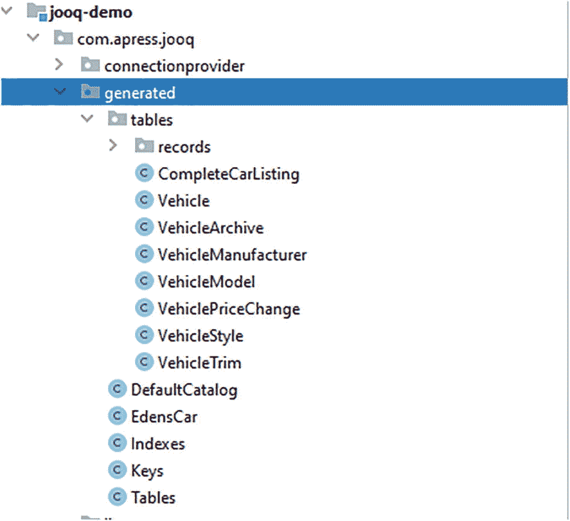
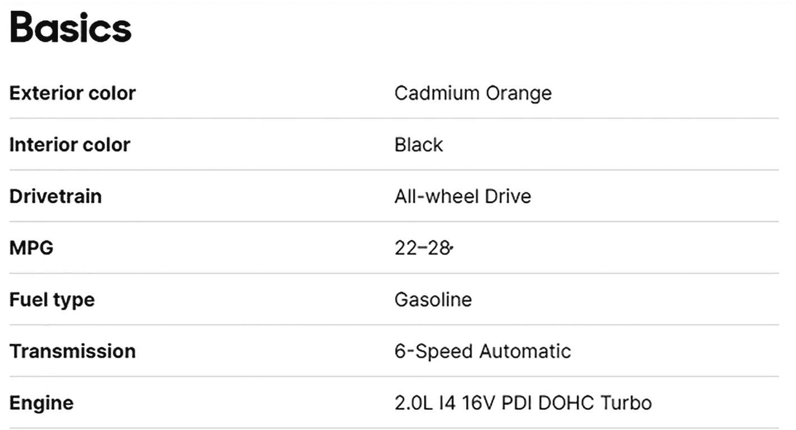
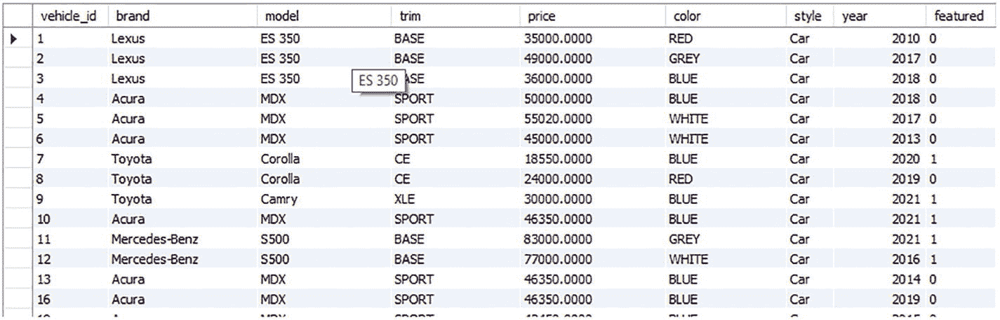
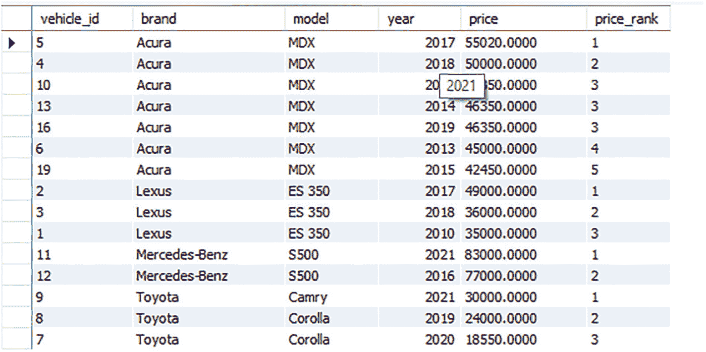

# 三、使用 jOOQ

现在，在我的下一个演示中，我们将更深入地研究 jOOQ 工具箱。jOOQ 工具箱中有很多便利——当你想到它的时候，jOOQ 就是关于便利的。我在上一章中做的所有手工 SQL，手工制作的实体类和查询结果的解析；它可以变得非常简单，更重要的是类型安全。这是享受 jOOQ 的第二个关键:类型安全。总的来说，本章是对 jOOQ 提供便利和类型安全的特性的一次漫游。首先，我们来看看 jOOQ 的代码生成能力。

## 生成代码

这大概是 jOOQ 概念的一半:能够安全地引用列、表、序列，实际上是 SQL 查询的任何部分。除其他优势外，您会发现

*   当 SQL 直接从您的数据库中导出时，不正确的 SQL 将不再是一件需要担心的事情；无需猜测。

*   许多样板代码将被自动处理。根据经验，我可以告诉您，不必手工键入另一个实体类或数据访问对象(DAO)是一件好事。

*   在使用数据库组件时，您可以利用代码完成、提示和“查找用法”等功能，这一事实显著改善了您的 IDE 体验。

*   您的数据驱动的单元和集成测试更能保证代码的行为和质量。在打包模型中，您的数据访问组件(模式、实体等。)是与业务逻辑分开管理的，所以您可以构建应用来独立地验证对模式所做的任何更新，而无需经历一个完整的部署周期。稍后将详细介绍这种技术。

总的来说，类型安全生成的数据库工件是它的所在，所以让我们去那里吧！

### jOOQ 代码生成工具

此时我们感兴趣的是使用 jOOQ 生成 Java 类来表示 Eden Auto Mart 数据库内容的方法。有三种方法可以解决这个问题:

1.  编程:jOOQ 提供了一个简单的 API，您可以用它从数据库模式中生成类。

2.  命令行:您也可以使用命令行界面生成工件。

3.  构建工具:jOOQ 附带了 Maven 和 Gradle 工具 <sup>[1](#Fn1)</sup> ，您可以使用它们来运行代码生成操作。

前面三种方法的结果是相同的:包中的 java 类，表示您的数据库目录或模式。它们还共享通用的配置元素。基本上，代码生成器的配置被表示为一个 XML 文档。生成 jOOQ 代码的三种模式在生命周期中的某个时刻总是以这个 XML 实体的形式结束，主要是作为一个 JAXB 注释的类。因此，从查看 XML 配置文档的样子开始是有意义的。

#### 为代码生成配置 jOOQ

那么，配置是什么样子的*？等等:这是相当多的 XML:*

```java
<?xml version="1.0" encoding="UTF-8" standalone="yes"?>
<configuration>
    <!-- Configure the database connection here -->
    <jdbc>
        <driver>com.mysql.cj.jdbc.Driver</driver>
        <url>jdbc:mysql://localhost/edens_car</url>
        <user>eden_admin</user>
        <password>_*thisisabadpassword*_</password>
    </jdbc>
    <generator>
        <name>org.jooq.codegen.JavaGenerator</name>
        <database>
            <name>org.jooq.meta.mysql.MySQLDatabase</name>
            <inputSchema>edens_car</inputSchema>
            <includeTables>true</includeTables>
            <includes>.*</includes>
        </database>
        <generate>
            <javaTimeTypes>true</javaTimeTypes>
             <daos>true</daos>
            <pojos>true</pojos>
            <pojosAsJavaRecordClasses>true</pojosAsJavaRecordClasses>
           <pojosEqualsAndHashCode>true</pojosEqualsAndHashCode>
            <pojosToString>true</pojosToString>
        </generate>
        <target>
            <packageName>com.apress.jooq.generated</packageName>
            <directory>C:\Users\SIGINT-X\eclipse-workspace\jooq-demo\src\main\java</directory>
        </target>
    </generator>
</configuration>

```

好吧，你不需要现在就接受。请随意复制粘贴这里的内容。让我告诉你最重要的部分。在顶级`<configuration>`标签(及其相关的模式文档链接)之后，混合了可选和强制元素，控制 jOOQ 代码生成的行为:

1.  数据库连接:`<jdbc/>`元素定义了代码生成器如何访问数据库。不能从你不能访问的数据库中生成类。

2.  生成器语义:`<generator/>`元素是我为代码生成器提供额外上下文的地方。该节点是一些其他更高级关注点的容器。在这里，我定义了
    1.  我更喜欢使用`java.time`包中更新的时间类。这样我就可以用`LocalDateTime`等代替`java.sql.Time`等。

    2.  使用`<dao>true</dao>`，jOOQ 将为每个表生成数据访问对象 <sup>[2](#Fn2)</sup> (DAO)。这意味着我又有了一个方便的组件来为整个对象运行类型安全查询。

    3.  对于我的 web 应用中实体的实际传输，我不想发送实际的 jOOQ 记录或`Table`s——那不是整洁的代码。不，我想要的是一个 POJO——一个没有任何框架代码的普通 Java 对象——jOOQ 的或者其他的。进入`<pojo/>`配置以生成 POJOs。

    4.  帮助我设置存储我生成的类的位置和包结构。

    1.  `<includes/>`让我通过名字指定我想要在生成中包含什么工件。这就是用`<includeTables/>`说“我想在生成的代码中包含所有的表”和用`<includes>`说“我想在代码生成中包含这些特定的表”的区别。

    1.  我感兴趣的代码类型是 Java。其他选项包括 Scala 和 Kotlin。元素控制将要发生的代码生成的类型。

    2.  用`<database/>`我感兴趣的数据库方言。

    3.  数据库中的模式，包含我要从中生成类的工件。我还可以通过在这里嵌套一个包含我想要生成的每个`<schema/>`的`<schemata>`元素来提供多个模式。

    4.  标签允许我指定我想从数据库中生成什么类型的组件。没有这些，你很可能会得到一堆你并不真正需要的系统组件和其他东西。

配置 jOOQ 代码生成器有更多的功能和灵活性；我强烈建议您查看官方手册，了解高级选项。现在，让我们继续前进！

根据前面的配置，我应该能够使用一个可用的生成器选项从现有的数据库模式中生成代码。我有什么选择？

#### 用 Maven 生成代码

jOOQ 提供了`jooq-codegen-maven` Maven 插件来执行您的代码生成业务。您使用的插件的`groupId`将取决于您正在使用的 jOOQ 的发行版(商业版或开源版)，以及您正在运行的 Java 版本:

*   开源版—`org.jooq`

*   商业版—`org.jooq.pro`；`org.jooq.pro-java-8`对于 Java 8 的支持

*   商业版免费试用–`org.jooq.trial`

因为我对学校来说太酷了，而且对自己来说做得很好， <sup>[3](#Fn3)</sup> 我将弹出我的商业 Maven 插件配置，如下所示:

```java
<maven demo>

```

以下是我在前面的代码片段中所做的工作:

1.  我将根据标准的 Maven 插件用法来定义 jOOQ 插件的用法。

2.  我指定我希望插件在 Maven 构建生命周期的`generate-sources`阶段启动。

3.  然后我宣布一个`generate`目标。这是我将用来触发 jOOQ 插件的代码生成过程的 Maven 目标。

4.  提供`skip.jooq.generation`属性允许我在构建时动态地启用或禁用代码生成。

5.  `configurationFile`指向我的 XML 配置文件的位置，用于前面看到的代码生成。我还可以选择在我的 Maven POM.xml (Maven 的项目对象模型)文件中包含该配置文件的全部内容。这是可能的，但你可能不应该这样做，因为
    1.  代码生成配置文件可能会比 POM 有更多的变化。因此，最好将这两者清楚地分开，以尽量减少 POM 整体的混乱。

    2.  将代码生成配置从 POM 中分离出来，为配置文件的版本化提供了机会。

    3.  它使您的 POM 文件更短，因此可读性更好。

    4.  它支持可重用性。考虑一下:当您有一个用于代码生成的独立 XML 配置文件时，您可以从 Maven、命令行甚至以编程方式引用该文件。如果你把你的构建系统改成 Gradle，你不需要重写一堆配置！

有了所有这些，我就可以运行下面的 Maven 命令来生成我感兴趣的源文件:

```java
mvn package

```

我可以在 IDE 中看到所有新的类和包。



*图为:成功*

#### 从命令行生成代码

如果 Maven 或其他构建工具不适合您，您可以直接从终端或命令行界面运行生成器。给定相同的 XML 配置文件，我可以从终端窗口执行以下命令:

```java
java -cp  jooq-3.15.1.jar;jooq-meta-3.15.1.jar;jooq-codegen-3.15.1.jar;reactive-streams-1.0.2.jar;mysql-connector-java-8.0.24.jar;jaxb-api-2.3.1.jar ;r2dbc-spi-0.9.0.M1.jar; org.jooq.codegen.GenerationTool jooq-configuration.xml

```

是的，这正是你可能在想的。我正在运行代码生成器，就像运行普通的 java 代码一样。 <sup>[4](#Fn4)</sup> 使用与 JDK 标准捆绑的`java`工具，我运行 jOOQ 附带的`org.jooq.codegen.GenerationTool`类。此外:

1.  我使用`-cp`标志来配置我的类路径。这个标志允许我为`GenerationTool`的业务需求提供 JAR 依赖关系。
    1.  注意包含了 JAXB 依赖关系 **jaxb-api-2.3.1.jar** 。这对于 JDK 11 及更高版本的环境是必要的。由于 Java 热衷于模块化，默认情况下排除了 JAXB 依赖性，所以我们现在需要明确地在需要时包含它。如果没有这个额外的 JAR，当从命令行运行代码生成时，您可能会得到各种各样的`ClassNotFoundException`。好玩。

2.  我还提供了 XML 配置文件的位置。

我还可以选择用这些精细的环境变量来配置代码生成器的核心需求；享受:

*   `-Djooq.codegen.configurationFile`定义 XML 配置文件的位置

*   `-Djooq.codegen.jdbc.driver`配置将用于连接数据库的驱动程序类

*   `-Djooq.codegen.jdbc.url`配置连接数据库的 URL

*   `-Djooq.codegen.jdbc.username`和`-Djooq.codegen.jdbc.password`分别定义数据库连接的用户名和密码

*   `-Djooq.codegen.logging`设置代码生成过程的日志级别；标准测井级别，如`DEBUG`、`WARN`、`INFO`等。应用

*   `-Djooq.codegen.skip`完全禁用代码生成

环境变量选项是为 jOOQ 项目设置默认值的好方法。它们可以被 XML 文件、Maven 甚至编程代码生成选项中定义的内容覆盖。

#### 以编程方式生成代码

所有选项中最强大的选项[雷霆一击/雷击]！您可以使用 jOOQ 提供的 API 以编程方式生成代码。事情大概是这样的:

```java
  org.jooq.meta.jaxb.Configuration generatorConfiguration = JAXB.unmarshal(new File("src/main/resources/jooq-configuration.xml"), org.jooq.meta.jaxb.Configuration.class);
        GenerationTool.generate(generatorConfiguration);

```

这里，我只是重用了我之前定义的 XML 配置，这次包装成了一个`org.jooq.meta.jaxb.Configuration`的实例。香草 JDK 的 JAXB API 加载 XML 文件并将其解组到一个`Configuration`对象。然后我使用`GenerationTool#generate`静态方法来运行发电机。

Note

JAXB 模块已经从 JDK 核心中分离出来；您需要手动将它作为一个依赖项包含在您的 POM 中，以便能够运行前面的示例。

对于更细粒度的控制，我可以像这样完全去掉 XML 文件:

```java
org.jooq.meta.jaxb.Configuration generatorConfiguration = new org.jooq.meta.jaxb.Configuration()
                .withJdbc(new Jdbc()
                        .withDriver("com.mysql.cj.jdbc.Driver")
                        .withUrl("jdbc:mysql://localhost/edens_car")
                        .withUsername("root").withPassword("admin"))
                .withGenerator(new Generator()
                        .withName("org.jooq.codegen.JavaGenerator")
                        .withDatabase(new Database()
                                .withName("org.jooq.meta.mysql.MySQLDatabase")
                                .withInputSchema("edens_car")
                                .withIncludeTables(true)
                                .withIncludes(".*"))
                        .withGenerate(new Generate()
                                .withJavaTimeTypes(true)
                                .withJavaBeansGettersAndSetters(true)
                                .withDaos(true)
                                .withPojos(true)
                                           .withPojosEqualsAndHashCode(true)
                                .withPojosToString(true))
                        .withTarget(new Target()
                                .withClean(true)
                                .withDirectory("src/main/java")
                                .withEncoding(StandardCharsets.UTF_8.toString())
                                .withPackageName("com.apress.jooq.generated")
                        ))
                .withLogging(Logging.DEBUG)
                .withOnError(OnError.LOG);
        GenerationTool.generate(generatorConfiguration);

```

这只是 XML 文件内容的忠实复制，以获得更大的灵活性和更大的马力——结果是一样的。您可以将这两种方法结合起来，在 XML 文件中预置一些值；那么一些值可以通过编程动态提供。

编程式代码生成是在 XML 文件或命令行参数无法满足需求的场景中利用 jOOQ 的绝佳机会，比如集成测试(稍后将详细介绍)。另一个机会是在稍微非常规的场景中使用 jOOQ，比如动态生成数据库连接。

Pop Quiz

jOOQ 配置模式的哪个元素允许您配置哪种类型的代码(Java、Scala 等)。)应该生成？

Answer

元素定义了 jOOQ 代码生成的输出类型。使用`org.jooq.codegen.JavaGenerator`生成 Java 代码。

#### 代码生成的结果

无论您选择哪种代码生成方法，结果在很大程度上都是相同的。看看他们:

##### 桌子

模式或目录中的每个表将主要产生以下结果:

1.  扩展`org.jooq.impl.TableImpl`的类，它本身是`org.jooq.Table`的实现。我的 Eden Auto 数据库看起来有点像这样:

```java
public class Vehicle extends TableImpl<VehicleRecord> {
    private static final long serialVersionUID = 1L;

    /**
     * The reference instance of <code>edens_car.vehicle</code>
     */
    public static final Vehicle VEHICLE = new Vehicle();

    /**
     * The class holding records for this type
     */
    @Override
    public Class<VehicleRecord> getRecordType() {
        return VehicleRecord.class;
    }
    /**
     * The column <code>edens_car.vehicle.vehicle_id</code>.
     */
    public final TableField<VehicleRecord, Long> VEHICLE_ID = createField(DSL.name("vehicle_id"), SQLDataType.BIGINT.nullable(false).identity(true), this, "");
...
}

```

正是这些类可以用来构造类型安全的 SQL 查询；这取代了我之前用来将原始 SQL 转换成 jOOQ 类型的`DSL#table`函数。这些类不可能出错。

1.  扩展`org.jooq.impl.*RecordImpl`的类，它本身是`org.jooq.Record`的实现。听起来熟悉吗？`Record`是你从数据库查询中得到的结果。可能会产生两种常见的结果:
    1.  `UpdatableRecordImpl`是当底层表有一个主键并且 jOOQ 在代码生成期间可以访问主键时得到的结果。

    2.  `TableRecordImpl`是当底层表没有主键，jOOQ 不能访问主键数据，或者它甚至不是一个真正的表(例如，一个数据库视图)时，您将得到的结果。

        因此，使用您的`*RecordImpl`来迭代查询结果；`UpdatableRecordImpl`专门对表执行 DML 操作。

1.  Plain Old Java Objects (POJOs) also come out of the box automatically, also representing rows in your database tables. Typically, a generated POJO class will extend `Serializable`. Here’s what one looks like for Eden Auto:

    ```java
    public class Vehicle implements Serializable {

        private static final long serialVersionUID = 1L;

        private Long          vehicleId;
        private Long          vehicleManufacturer;
        private BigDecimal    vehicleCurrPrice;
        private LocalDate     vehicleModelYear;
        private String        vehicleStatus;
        private String        vehicleColor;
        private Long          vehicleModelId;
        private Long          vehicleTrim;
        private Long          vehicleStyle;
        private Byte          featured;
        private LocalDateTime created;

        public Vehicle() {}
      ...
    }

    ```

    正如我前面提到的，这些作为数据传输对象(DTO)或值对象是很方便的，您可以使用它们将数据转移到应用中。更好的是:您可以让 Bean 验证 <sup>[5](#Fn5)</sup> 规范，如`@NotNull`和`@Size`从表的列信息中生成。相当整洁！

2.  数据访问对象(Dao)类似于 Spring 的各种`Repository`方法。它们做的和听起来一样:帮助你从你的表中访问强类型数据。Dao 将帮助您查询它们各自的表，以检索所需的记录。默认情况下，只为带有主键的表生成 Dao。这意味着视图不会自动生成 Dao。

jOOQ 允许您在代码生成过程中对表主键进行大量控制。如果您想添加主键信息以及类似数据库视图的信息，可以使用这个特性来手动通知 jOOQ:

```java
<database>
            <name>org.jooq.meta.mysql.MySQLDatabase</name>
            ...
            <syntheticPrimaryKeys>edens_car.complete_car_listing.vehicle_id</syntheticPrimaryKeys>
            ...
</database>

```

因为视图不是真正的表，所以大多数数据库不会提供与实际表相同的主键信息。因此，我必须为我感兴趣的数据库视图配置键列的路径。这个特性被称为合成主键。有了这个配置，`complete_car_listing`数据库里面就会产生一个 DAO。这里的缺点是它需要一些组合

*   对列名进行硬编码

*   主键列的一致命名约定

*   需要根据主键列的名称进行验证的正则表达式

但是等等；还有更多:

##### 全局工件

更方便的引入:jOOQ 还可以生成大多数横切组件作为高级“全局”类。这些将作为下列类定义的静态成员生成:

1.  `Keys.java`将包含静态字段，引用在每个表的基础上定义的所有主键、外键和唯一键。当您需要使用 SQL 连接构建类型安全查询时，这些将会派上用场。

2.  `Sequences.java`将给出在你的数据库模式中定义的所有序列。当您出于某种原因想要手动生成一个键值时，可以使用这些方法。

3.  `Tables`。java 将包含您的模式中定义的所有表，这在您构建查询等时非常有用。

jOOQ 代码生成过程中还有其他静态生成的组件，其中一些超出了本书的范围。我强烈建议查看官方文档，了解更多好东西。

Pop Quiz

:什么 jOOQ 方法会产生 SQL { `CASE` }子句？

a) { `choose` }

b) { `when` }

c) { `case` }

Answer

:{ `choose` }和{ `when` }是用 jOOQ 开始{ `CASE` }语句的有效方式

#### 向生成的代码中添加自定义代码

如果你喜欢(像我一样)，你可能会对在所有(或部分)生成的代码中添加手工编织的代码块感兴趣。例如，一些公司环境可能对在所有代码中添加商标和版权信息感兴趣。要实现这一点，您需要一个`JavaGenerator`的实现。下面是向所有类文件添加一个头注释的样子:

```java
import org.jooq.codegen.JavaGenerator;
import org.jooq.codegen.JavaWriter;
import org.jooq.meta.TableDefinition;

public class CopyrightGenerator extends JavaGenerator {

    protected void printClassJavadoc(JavaWriter out, String comment) { (1)
        out.println("/** This is proprietary code of Initech co */");
    }
    protected void generateRecordClassFooter(TableDefinition table, JavaWriter out){ (2)
        out.println();
        out.tab(1).println("public static String getInitTechWarning(){");
        out.tab(2).println("return \"This is proprietary code of Initech co\";");
        out.tab(1).println("}");
        out.println();
    }
}

```


我告诉过你我很喜欢

这是这个类的一个非常简单的用法——几乎没有什么是你不能使用`JavaGenerator`工具重写或添加到生成的代码中的。

1.  允许我将任意 Javadoc 内容添加到类声明的顶部(在导入之后)。

2.  `generateRecordClassFooter`让我将任意代码附加到一个`Record`类的末尾——基本上是任何表或视图。您可能认识到这里的风险:这个工具处理普通的类型不安全字符串(我知道这很讽刺)，但是有一些琐碎的方法可以确保您不会意外地包含无法编译的代码片段。

默认的`JavaGenerator`提供了一系列令人印象深刻的方法，可以覆盖和更改生成代码的任何部分。尽情享受吧！

## 使用生成的代码

当您拥有直接从数据库模式编织的代码时，类型安全本身就是一个好处。但不止于此。看，当 jOOQ 是您的数据访问代码的来源时，会产生一些独特的好处。

### 带有生成代码的 CRUD

为普通 CRUD 操作生成的代码工作得更好。我可以从`vehicle`表中检索强类型保证，如下所示:

```java
import static com.apress.jooq.generated.EdensCar.EDENS_CAR;
import static com.apress.jooq.generated.Tables.VEHICLE; (1)
...
public static void selectWithGeneratedCode() throws SQLException {
       ...
       DSLContext context = DSL.using(connection, SQLDialect.MYSQL);
       List<Vehicle> vehicles = context.select(EDENS_CAR.VEHICLE.VEHICLE_ID, EDENS_CAR.VEHICLE.VEHICLE_COLOR, EDENS_CAR.VEHICLE.VEHICLE_CURR_PRICE) (2)
                    .from(VEHICLE)      (3)
                    .where(VEHICLE.VEHICLE_MANUFACTURER.eq(val(2L))) (4)
                    .orderBy(VEHICLE.VEHICLE_MODEL_YEAR)
                    .fetchInto(Vehicle.class); (5)
            logger.info(vehicles.toString());
        }
    }

```

我有目的地将一些风格和概念混合到前面的代码片段中，以说明您使用生成的工件所获得的灵活性。

使用生成的工件:

1.  生成的模式(`EDENS_CAR`)和生成的表(`VEHICLE`)类的静态导入意味着我可以在以后需要它们的任何地方使用它们各自的内容。

2.  我可以在`select`语句–`Schema.Table.Column`中使用列的完全限定路径。

3.  我可以完全删除模式，只使用 generated `com.apress.jooq.generated.Tables`类提供的普通生成的表引用。

4.  为过滤器表达式提供参数轻而易举，因为
    1.  我不必处理像“？”这样的占位符或者记住参数的顺序。我可以在需要的字段上直接指定参数。

    2.  在 jOOQ 语句执行期间，使用`val`函数将参数值绑定到正确的列；我得到的 SQL 注入保护是一个不错的奖励。然而，这并不总是必要的——jOOQ 在大多数情况下都会这样做。

5.  最后，我可以将查询结果提取到从`Vehicle`表生成的 POJO 中。

目前为止一切顺利。我也可以直接在`vehicle`表的`UpdatableRecord`实现中做`fetch`:

```java
Result<VehicleRecord> vehicle = context.fetch(VEHICLE, VEHICLE.VEHICLE_MANUFACTURER.eq(val(2, Long.TYPE)));

```

这是我所追求的简洁的代码。我已经去掉了许多样板文件；我只是提供了表类和我的过滤标准。除了简洁之外，这种类型的获取还有一个导航好处，我将很快介绍它。

对于对`vehicle`表的插入，我可以立即用`returningResult`方法检索与该插入相关联的主键:

```java
long execute = context.insertInto(VEHICLE, VEHICLE.VEHICLE_MANUFACTURER, VEHICLE.VEHICLE_CURR_PRICE, VEHICLE.VEHICLE_MODEL_YEAR, VEHICLE.VEHICLE_STATUS, VEHICLE.VEHICLE_COLOR, VEHICLE.VEHICLE_MODEL_ID, VEHICLE.VEHICLE_TRIM, VEHICLE.VEHICLE_STYLE)
                    .values(4L, BigDecimal.valueOf(46350.00), LocalDate.parse("2021-01-01"), "ACTIVE", "BLUE", 13L, 2L, 1L)
                    .returningResult(VEHICLE.VEHICLE_ID)
                    .execute();

```

`returningResult`方法允许您从新插入的行中返回字段，作为插入响应的一部分。理想的用法是返回基础数据库支持的为插入生成的主键。对于其他非键字段，如果底层数据库本身不支持`INSERT...RETURNING`，jOOQ 可能会执行第二次 SQL 执行来检索请求的数据。

总之，表名或列名错误的风险被消除了。结合流畅的 jOOQ DSL，确保您的 SQL 总是语法正确:您拥有防弹的数据库查询。

#### 来自 UpdatableRecord 的增强

通过生成的`UpdatableRecord`,您可以获得 CRUD 操作的一些强大优势。这个组件中我最喜欢的一点是如何导航记录的关系: <sup>[7](#Fn7)</sup>

```java
   DSLContext context = DSL.using(connection, SQLDialect.MYSQL);
            VehicleRecord vehicleRecord = context.fetchOne(VEHICLE, VEHICLE.VEHICLE_ID.eq(7L));
            VehicleManufacturerRecord vehicleManufacturerRecord = vehicleRecord.fetchParent(Keys.VEH_MANUFACTURER_ID); (1)
            VehicleModelRecord vehicleModelRecord = vehicleRecord.fetchParent(Keys.VEH_MODEL_ID); (1a)
            logger.info("Vehicle Manufacturer: {}",vehicleManufacturerRecord.getManufacturerName());
            logger.info("Vehicle Model Record: {}",vehicleModelRecord.getVehicleModelName());
            Result<VehicleModelRecord> vehicleModelRecords = vehicleManufacturerRecord.fetchChildren(Keys.MANUFACTURER_ID); (2)
            vehicleModelRecords.forEach(vmr ->{
                logger.info("{} {}",vehicleManufacturerRecord.getManufacturerName(),vmr.getVehicleModelName());
            } );

```

检索特定车辆后，我可以

1.  通过使用`vehicle`和`vehicle_manufacturer`之间的外键关系来检索制造商记录。这通过使用从`Keys`类中适当生成的外键来实现。将它传递给`fetchParent`方法，我就被排序了。
    1.  我使用相同的机制来检索由外键关联到`vehicle`表的车辆型号记录。

2.  我可以使用`fetchChildren`沿着家谱向下走，传入连接`vehicle_manufacturer`和`vehicle_model_id`的外键。

DML 呢？每个`UpdatableRecordImpl`都是一个活动记录——这意味着您不需要任何额外的组件来对检索到的记录执行数据操作:

1.  我可以从`DSLContext`创建一个空的`VehicleModelRecord`对象。数据库中尚未创建任何记录。

2.  在设置必要之后，我可以在对象上使用`store`方法来持久化记录。

3.  我可以立即检索新插入记录的`id`。

4.  我可以在方便的时候继续用同一张唱片打电话给`store`。

5.  我将使用`refresh`方法获取我正在处理的记录的最新副本。

6.  当我完成时，我可以调用`delete`方法来删除记录。

```java
VehicleModelRecord vehicleModelRecord = context.newRecord(VEHICLE_MODEL); (1)
vehicleModelRecord.setVehicleManId(2L);
vehicleModelRecord.setVehicleModelName(“Tacoma”);
vehicleModelRecord.setVehicleStyleId(3L);
vehicleModelRecord.store(); (2)    //record saved
Long vehicleModelId = vehicleModelRecord.getVehicleManId(); (3)
vehicleModelRecord.setVehicleModelName(“Tacoma XD”);
vehicleModelRecord.store();    (4)
vehicleModelRecord.refresh(); (5)
vehicleModelRecord.delete();    (6)

```

Tip

我的`UpdatableRecordImpl`是*连接到数据库连接的*，但是很慢。这意味着我的`VehicleRecord`实例包含了对`Configuration`对象的引用，该对象引用了底层的 JDBC 连接池。所以，`VehicleRecord`不是线程安全的。好消息是，我不必担心连接对象的连接池不够用。

##### 格式化

`Result`类提供了`format*`方法，允许您将查询结果转换成不同的格式，如

*   战斗支援车

*   超文本标记语言

*   可扩展置标语言

*   数据

因此，给定一个检索到的`VehicleModelRecord`的`Result`，我可以生成如下格式的输出:

```java
  Result<VehicleModelRecord> vehicleModelRecords = vehicleManufacturerRecord.fetchChildren(Keys.MANUFACTURER_ID);
  vehicleModelRecords.formatJSON();

```

很可爱吧？我应该注意，这不是刚刚生成的代码的特性；您也可以从普通的 SQL jOOQ 执行中获得有益的东西。`Record`类也提供了这个特性，因此您可以打印整个结果集或单个的`Record`。

#### 乐观锁定

为了启用 jOOQ 的乐观锁定机制，我像这样配置我的`DSLContext`:

```java
Settings settings = new Settings().withExecuteWithOptimisticLocking(true);
DSLContext context = DSL.using(connection, SQLDialect.MYSQL, settings);

```

用 jOOQ 生成代码打开了这个新的，支持事务管理的乐观锁定。对于“手动”SQL，jOOQ 需要使用`SELECT...FOR UPDATE`语句来保护对行的并发访问——这意味着对数据库的两次访问。有了生成的代码，jOOQ 可以使用`recordVersionFields`或`recordTimestampFields`配置属性:

```java
</database>
...
    <recordVersionFields>edens_car\.*\.version</recordVersionFields>
...
</database>
Or programmatically
...
.withGenerator(new Generator()
               .withDatabase(new Database()
               .withName("org.jooq.meta.mysql.MySQLDatabase")
               .withRecordVersionFields("edens_car\\.*\\.version")
...

```

使用一个正则表达式，我规定了在`edens_car`模式中有一个`version`列的每个表都应该符合乐观锁定的条件。这可以通过编程和 XML 配置来实现。它们的作用是一样的:当两个或多个事务试图在同一行上工作时，jOOQ 将在受影响的行上寻找已配置的列(`version`)。当然，这意味着您需要在表中添加一个版本或时间戳列来支持这一功能。在该行的副本中，无论哪个事务在`recordVersionFields`或`recordTimestampFields`中具有最新的值，都“获胜”当事务尝试对其数据进行`store`、`update`或`delete`处理时，具有该行的旧副本的事务将获得一个`org.jooq.exception.DataChangedException`。如果您曾经使用过 Hibernate/Spring Data JPA，您可能对这种机制很熟悉。

## 高级数据库操作

现在我们已经看到了 jOOQ(闪电和雷声效果)生成的代码的威力！)，让我们挑战一下极限。现在*加入*我，我们一起来看看…

### 连接

我对构建一个查询感兴趣，该查询将呈现一个车辆列表，给我一个类似这样的 UI 表示。



每辆车，我想显示

*   车辆制造商名称

*   车辆模型

*   模型修剪

*   现价

*   车辆颜色

*   车辆年款

所有这些信息都需要来自不同的表。这样的查询看起来像什么？

```java
 SELECT
        `v`.`vehicle_id` AS `vehicle_id`,
        `v_man`.`manufacturer_name` AS `brand`,
        `v_mod`.`vehicle_model_name` AS `model`,
        `v_trim`.`trim_name` AS `trim`,
        `v`.`vehicle_curr_price` AS `price`,
        `v`.`vehicle_color` AS `color`,
        `v_style`.`vehicle_style_name` AS `style`,
        `v`.`vehicle_model_year` AS `year`,
        `v`.`featured` AS `featured`
FROM  ((((`vehicle` `v`
        JOIN `vehicle_manufacturer` `v_man` ON ((`v`.`vehicle_manufacturer` = `v_man`.`manufacturer_id`)))
        JOIN `vehicle_model` `v_mod` ON ((`v_mod`.`vehicle_model_id` = `v`.`vehicle_model_id`)))
        JOIN `vehicle_trim` `v_trim` ON ((`v_trim`.`trim_id` = `v`.`vehicle_trim`)))
        JOIN `vehicle_style` `v_style` ON ((`v_style`.`vehicle_style_id` = `v`.`vehicle_style`)))

```

在这个查询中，我已经连接了下面的表:

*   `vehicle`

*   `vehicle_manufacturer`

*   `vehicle_model`

*   `vehicle_trim`

*   `vehicle_style`

这在 jOOQ 里是什么样子的？首先，我将把我需要的列组成一个可移植的包:

```java
List<Field<?>> fields = Arrays.asList(
                    VEHICLE.VEHICLE_ID,
                    VEHICLE_MANUFACTURER.MANUFACTURER_NAME.as("brand"),
                    VEHICLE_MODEL.VEHICLE_MODEL_NAME.as("model"),
                    VEHICLE_TRIM.TRIM_NAME.as("trim"),
                    VEHICLE.VEHICLE_CURR_PRICE.as("price"),
                    VEHICLE.VEHICLE_COLOR.as("color"),
                    VEHICLE_STYLE.VEHICLE_STYLE_NAME.as("style"),
                    VEHICLE.VEHICLE_MODEL_YEAR.as("year"),
                    VEHICLE.FEATURED);

```

我将所有需要的字段放入一个整洁的包中，主要是为了可读性。但是这里有一个缺点，因为我通过使用`Field<?>`牺牲了类型信息。在某些场景中，jOOQ 可能会不同意这样做，因为它不能提供自己喜欢的类型安全保证。注意使用了`as`方法来设置列的别名。接下来是实际的查询。jOOQ 提供了对所有主要连接的支持，以及表达连接的灵活性。在这里，我希望构造一个内部连接。这里有一个方法来完成这个:

```java
Result<Record> results = context.select(fields).from(VEHICLE)
.join(VEHICLE_MANUFACTURER).on(VEHICLE.VEHICLE_MANUFACTURER.eq(VEHICLE_MANUFACTURER.MANUFACTURER_ID)) (1)
                    .join(VEHICLE_MODEL).on(VEHICLE.VEHICLE_MODEL_ID.eq(VEHICLE_MODEL.VEHICLE_MODEL_ID))
.join(VEHICLE_TRIM).onKey() (2)
.join(VEHICLE_STYLE).on(VEHICLE.VEHICLE_STYLE.eq(VEHICLE_STYLE.VEHICLE_STYLE_ID))
.fetch();

```

所以，加入`vehicle`、`vehicle_manufacturer`、`vehicle_model`和`vehicle_trim`给了我想要的所有信息。以下是最新消息:

1.  从我的第一个表开始，我使用`join`方法连接到下一个表。`on`方法帮助我定义我想要在其上构建关系的键。

2.  `onKey`是`on`的另一种变体。`onKey`是 jOOQ 独有的增强功能，它允许我跳过必须输入关系的关键列的部分。jOOQ 将通过定位表之间明确的外键-主键关系来透明地生成一个`on` SQL 子句。
    *   `onKey`特性只在生成的代码上可用——jOOQ 需要确定底层表的结构。不幸的是，您的手动 SQL 诗歌不行。

    *   有一个变量可以用来指定要使用的列:`onKey(VEHICLE.VEHICLE_TRIM)`。

这就产生了标准的内部连接:两个或多个表之间的关系，其中键值出现在所有被引用的表中。如果您像我一样坚持清晰，您可能希望明确指定它是一个内部连接，如下所示:

```java
context.select(fields).from(VEHICLE).innerJoin(VEHICLE_MANUFACTURER).on(VEHICLE.VEHICLE_MANUFACTURER.eq(VEHICLE_MANUFACTURER.MANUFACTURER_ID))

```

jOOQ 支持这种连接以及

1.  与`crossJoin`交叉连接

2.  用`leftJoin`左连接

3.  用`rightJoin`右连接

4.  与`fullJoin`完全连接

5.  分区外部连接`partitionBy`–仅限 Oracle

…以及其他连接组合。

Caution

jOOQ 有一个 bug <sup>[8](#Fn8)</sup> ，在某些场景中，当执行与`ON`或`USING`的连接时，非独特的列会导致抛出`InvalidResultException`。一种情况是连接中的多个表中出现了相同的列名。要解决这个问题，请对与连接相关联的列使用 SQL 别名。或者，您可以对连接列使用完全限定的(schema.table.column)命名样式。

#### 非 SQL 分组

考虑这样一个场景:我想得到与前一部分相同的结果(车辆名称、型号、制造商、装饰、颜色等)。)，但是按制造商对结果进行分组，这样我就可以得到如下所示的`Map`:

```java
Map<String, List<VehicleRecord>> vendorMapping

```

SQL 查询可能是这样的:

```java
SELECT
        `v`.`vehicle_id` AS `vehicle_id`,
        `v_man`.`manufacturer_name` AS `brand`,
        `v_mod`.`vehicle_model_name` AS `model`,
        `v_trim`.`trim_name` AS `trim`,
        `v`.`vehicle_curr_price` AS `price`,
        `v`.`vehicle_color` AS `color`,
        `v_style`.`vehicle_style_name` AS `style`,
        `v`.`vehicle_model_year` AS `year`,
        `v`.`featured` AS `featured`
FROM  ((((`vehicle` `v`
        JOIN `vehicle_manufacturer` `v_man` ON ((`v`.`vehicle_manufacturer` = `v_man`.`manufacturer_id`)))
        JOIN `vehicle_model` `v_mod` ON ((`v_mod`.`vehicle_model_id` = `v`.`vehicle_model_id`)))
        JOIN `vehicle_trim` `v_trim` ON ((`v_trim`.`trim_id` = `v`.`vehicle_trim`)))
<picture confused look caption: huh?>

```

那是什么？这与连接部分的查询完全相同？那里没有任何声明吗？为什么我要问你问题，其实我是在自言自语？朋友，这就是`fetchGroups`系列方法的魔力所在。

```java
Map<String, Result<Record>> vehiclesGroupedByBrand = context.select(fields).from(VEHICLE)           .join(VEHICLE_MANUFACTURER).on(VEHICLE.VEHICLE_MANUFACTURER.eq(VEHICLE_MANUFACTURER.MANUFACTURER_ID))  .join(VEHICLE_MODEL).on(VEHICLE.VEHICLE_MODEL_ID.eq(VEHICLE_MODEL.VEHICLE_MODEL_ID))
.join(VEHICLE_TRIM).onKey()
.join(VEHICLE_STYLE).on(VEHICLE.VEHICLE_STYLE.eq(VEHICLE_STYLE.VEHICLE_STYLE_ID))
.fetchGroups(VEHICLE_MANUFACTURER.MANUFACTURER_NAME.as("brand"));
 vehiclesGroupedByBrand.forEach((manufacturer,vehicles) ->{
        logger.info("Available {} vehicles: \n {}",manufacturer,vehicles);
  });

```

我仍然可以像平常一样构造我的连接查询，但是使用`fetchGroups`，我可以通过 select 语句中的一个列的别名对我的结果进行分组和收集。这是 jOOQ 给我带来的另一个便利。如果没有这个工具，我将不得不在复杂的 SQL 语句或查询输出的手动组合之间进行选择，以获得相同的结果。

有许多版本的`fetchGroups`提供了极好的映射控制。例如，我可以按 POJO 对结果进行分组:

```java
Map<VehicleManufacturer, List<CompleteCarListing>> vehiclesGroupedByBrand = context
                    .select(VEHICLE_MANUFACTURER.fields())
                    .select(fields) (1)
                    .from(VEHICLE)
.join(VEHICLE_MANUFACTURER).on(VEHICLE.VEHICLE_MANUFACTURER.eq(VEHICLE_MANUFACTURER.MANUFACTURER_ID))         .join(VEHICLE_MODEL).on(VEHICLE.VEHICLE_MODEL_ID.eq(VEHICLE_MODEL.VEHICLE_MODEL_ID))
.join(VEHICLE_TRIM).onKey()
.join(VEHICLE_STYLE).on(VEHICLE.VEHICLE_STYLE.eq(VEHICLE_STYLE.VEHICLE_STYLE_ID))
       .fetchGroups(keyRecord -> { (2)
               return keyRecord.into(VEHICLE_MANUFACTURER).into(VehicleManufacturer.class); (a)
             }, valueRecord -> {
                        return valueRecord.into(COMPLETE_CAR_LISTING).into(CompleteCarListing.class); (b)
       });
logger.info("{}",vehiclesGroupedByBrand);

```

这基本上是相同的连接查询，只是添加了一些特殊的调料:

1.  我堆叠了两个 jOOQ `select`子句，这样这两个语句中的字段在查询的后面部分就可以用了。我调用了`VEHICLE_MANUFACTURER`表上的`fields`方法来轻松加载该表中所有可用的字段。`fields`变量是我在本书的这一部分一直使用的手工制作的`org.jooq.Field`列表。
    1.  查询的其余部分包含与我到目前为止用来演示的相同的连接。

2.  当我到达 jOOQ 查询的`fetchGroups`子句时，上下文已经包含了将查询结果映射到 POJOs 所需的所有字段。注意，这些是生成的相同的 POJOs jOOQ。这个`fetchGroups`的变体允许我提供`org.jooq.RecordMapper`的实例来构建
    1.  通过将第一条记录关联到`VEHICLE_MANUFACTURER`表中，并依次关联到相应的`VehicleManufacturer`记录中，得到映射的键。

    2.  通过将第二个提供的记录关联到`COMPLETE_CAR_LISTING`“表”(它实际上是一个视图)中得到的映射值；这又被映射到适当的 POJO。

这个 jOOQ 查询生成的 SQL 查询是什么样子的？

```java
select
`vehicle_manufacturer`.`manufacturer_id`,
 `vehicle_manufacturer`.`manufacturer_name`,
.`vehicle_manufacturer`.`status`,
`vehicle_manufacturer`.`version`,
`vehicle`.`vehicle_id`,
`vehicle_manufacturer`.`manufacturer_name` as `brand`,
`vehicle_model`.`vehicle_model_name` as `model`,
`vehicle_trim`.`trim_name` as `trim`,
`vehicle`.`vehicle_curr_price` as `price`,
`vehicle`.`vehicle_color` as `color`,
`vehicle_style`.`vehicle_style_name` as `style`,
`vehicle`.`vehicle_model_year` as `year`,
`vehicle`.`featured`
from `vehicle`
join `vehicle_manufacturer` on `vehicle`.`vehicle_manufacturer` = `vehicle_manufacturer`.`manufacturer_id`
join `vehicle_model` on `vehicle`.`vehicle_model_id` = `vehicle_model`.`vehicle_model_id`
join `vehicle_trim` on `vehicle_trim`.`vehicle_manufacturer_id` = `vehicle_manufacturer`.`manufacturer_id`
join `vehicle_style` on `vehicle`.`vehicle_style` = `vehicle_style`.`vehicle_style_id`

```

如您所见，堆叠我的`select`只是将所有可用的列添加到最终的`SELECT`语句中。也没有`GROUP BY`条款，不管是含蓄的还是其他的。从数据库返回行后，在内存中完成分组。结果是什么样的？

```java
VehicleManufacturer (1, Lexus, ACTIVE, null)=[CompleteCarListing (1, Lexus, ES 350, BASE, 35000.0000, RED, Car, 2010-01-01, 0), CompleteCarListing (2, Lexus, ES 350, BASE, 49000.0000, GREY, Car, 2017-01-01, 0)],
VehicleManufacturer (4, Acura, ACTIVE, null)=[CompleteCarListing (4, Acura, MDX, SPORT, 50000.0000, BLUE, Car, 2018-01-01, 0), CompleteCarListing (4, Acura, MDX, BASE, 50000.0000, BLUE, Car, 2018-01-01, 0)

```

有趣的事实:`fetchGroups`、`fetchMap`和`intoGroup`——三个非 SQL 分组函数——将保持查询结果的顺序。因此，如果您选择`orderBy`，那么分组之间的顺序保持不变。

Note

不要忘记在 POJOs 上生成`equals`和`hashCode`方法(如果没有生成，就自己实现它们)。`Map`数据结构需要`hashCode`和`equals`来惟一地标识它的每个元素。

当您需要在一个大的结果集上批量进行这种分组时，您需要恢复到`fetchStream`。这样，您可以像这样利用 JDK 流和并行化功能:

```java
Map<VehicleManufacturer, List<CompleteCarListing>> vehiclesGroupedByBrand = context
                    .select(VEHICLE_MANUFACTURER.fields())
                    .select(fields) (1)
                    .from(VEHICLE)
                    ...
                              .join(VEHICLE_STYLE).on(VEHICLE.VEHICLE_STYLE.eq(VEHICLE_STYLE.VEHICLE_STYLE_ID))
                    .fetchSize(100) (1)
                    .fetchLazy() (2)
                    .collect( (3)
                            Collectors.groupingBy( (3a)
                                  record -> record.into(VehicleManufacturer.class),   (i) (Collectors.mapping(record ->
                                  record.into(CompleteCarListing.class),Collectors.toList())) (ii)
                    );

```

将操作链分解成`fetchSize`方法标志着懒惰业务的开始:

1.  设置我希望光标一次检索的最大行数。不设置此项可能会导致整个结果集被加载到内存中。

2.  `fetchLazy`正式开始使用一个`org.jooq.Cursor`来有效地(惰性地)传输结果。

3.  当我偷懒的时候，`fetchGroups`就不再在菜单上了。我将不得不把这个小组掌握在自己手中。`collect`方法接受一个`java.util.stream.Collectors`。从这一点，你也可以去`parallel`，因为我们现在在 JDK 溪流 API 领域。
    1.  生成密钥对象。

    2.  生成值对象并将组收集到数据结构中。便捷的`Collectors.toList()`功能帮助我实现了这一点。

    1.  `Collectors.groupingBy` <sup>[9](#Fn9)</sup> 将接受功能帮助

总之，我现在可以在不牺牲性能的情况下在内存中对大型数据集进行分组。是的，是的，这有点违背“SQL 知道最好”的原则， <sup>[10](#Fn10)</sup> 但是为了可读性，这是复杂的窗口函数和非常低效的手工处理之间的一个折中。

### 批量操作

我需要从 Eden Auto 数据库中插入和/或导出一千辆汽车。我在 jOOQ 中有什么选择？首先，我可以更好地利用我的数据库连接:

```java
DSLContext context = DSL.using(connection, SQLDialect.MYSQL);
            context.batched(batchedConnectionConfig -> {
               insertVehicle(batchedConnectionConfig);
               insertVehicleModel(batchedConnectionConfig);
               updateVehiclePrice(batchedConnectionConfig):
               //other inserts
            });

```

在前面的代码片段中，我组合了多个动态生成的 insert 语句来一次性执行:

*   `DSLContext`上的`batched`方法会将相同的语句添加到队列中。这些语句正在为 JDBC 批处理机制做准备，以便在一次数据库访问中执行。

*   注意，我将`batchedConnectionConfig`传递给查询执行方法。DML 方法将需要使用这个配置，而不是原来的`DSLContext`对象。

*   它们仍然作为独立的 DML 语句执行，因此每个语句都产生自己独立的`INSERT`、`UPDATE`或`DELETE`。当 jOOQ 在将这些语句发送到 DBMS 执行之前尽可能长时间地延迟它们的执行时，优势就来了。这就是 jOOQ API 中所谓的批量连接。

Note

当您试图从插入中检索结果(例如，生成的键)时，批处理连接不起作用。因此，如果您启用了`Settings# returnIdentityOnUpdatableRecord`，对您的`UpdatableRecord`上的`store`的调用将会立即执行，而不是等待批处理。

我可以用下面的`Settings`片段配置批量大小:

```java
new Settings().setBatchSize(20);

```

这限制了一次性发送到我的数据库服务器的数据大小:最小化了网络连接或数据库本身不堪重负的风险；您需要调整这个配置来满足您的操作需求。

#### 显式批处理

除了我前面演示的批处理连接之外，jOOQ 还为您期望的操作提供了方便的批处理方法:

*   `batch`

*   `batchInsert`

*   `batchUpdate`

*   `batchDelete`

*   `batchStore`

*   `batchMerge`

有了这些，我可以获得对批处理语义的更多控制，而不是等待`BatchConnection`隐式地做这件事。下面是`batchStore`的行动:

```java
List<VehicleRecord> vehicleRecords = new ArrayList<>();
            //populate list of records to insert
context.batchStore(vehicleRecords).execute();

```

使用任何其他的`batchXXX`方法都一样简单。 <sup>[11](#Fn11)</sup> 你可以提供普通的 SQL，jOOQ DSL 语句，或者整个实体。

还有产生相同效果的`batch`模式:

```java
context.batch(
                    context.insertInto(VEHICLE, VEHICLE.VEHICLE_MANUFACTURER, VEHICLE.VEHICLE_CURR_PRICE, VEHICLE.VEHICLE_MODEL_YEAR, VEHICLE.VEHICLE_STATUS, VEHICLE.VEHICLE_COLOR, VEHICLE.VEHICLE_MODEL_ID, VEHICLE.VEHICLE_TRIM, VEHICLE.VEHICLE_STYLE, VEHICLE.FEATURED)
                            .values((Long) null, (BigDecimal) null, null, null, null, (Long) null, (Long) null, (Long) null, (Byte) null))
                    .bind(4L, BigDecimal.valueOf(46350.00), null, "ACTIVE", "BLUE", 13L, 2L, 1L, Byte.valueOf("0"))
                    .bind(9L, BigDecimal.valueOf(83000.00),null, "ACTIVE", "GREY", 9L, 7L, 1L, Byte.valueOf("0"))
                    .bind(9L, BigDecimal.valueOf(77000.00),null, "ACTIVE", null, 9L, 7L, 1L, Byte.valueOf("0"))
                    .execute();
            }

```

`batch`方法允许我通过值绑定的方式批量执行 insert 语句。看，我可以使用多值插入来执行批处理，而不是单独的`INSERT`语句。唯一的规定是

*   拥有一个 stub `values`语句作为“默认”值的提供者。这里，我在所有可用的槽中使用了空值。

*   然后我将使用`bind`方法来设置我想要插入的实际值。

接下来，jOOQ 将一次性执行对数据库的插入，没有`batchedConnection`使用的延迟。

`batchInsert`和`batchUpdate`方法通常也会做您希望它们做的事情。他们都与`TableRecord`和`UpdatableRecord`一起工作，但是有一个问题。`batchUpdate`方法将只批处理相同的 SQL 语句。因此，当这三个`VehicleRecords`为`batchInsert`做准备时，结果可能不是你所期望的:

```java
VehicleRecord vehicleRecord1 = context.newRecord(VEHICLE);
VehicleRecord vehicleRecord2 = context.newRecord(VEHICLE);
VehicleRecord vehicleRecord3 = context.newRecord(VEHICLE);
vehicleRecord1.setVehicleColor(null);
vehicleRecord2.setVehicleColor("GREY");
vehicleRecord3.setOptions(3L);
context.batchInsert(Arrays.asList(vehicleRecord1,vehicleRecord2,vehicleRecord3)).execute();

```

在前面的代码片段中，同一实体`Vehicle`的不同列有不同的空值和实际值组合。这样做的效果是，调用`batchInsert`或`batchStore`得到的 SQL 将生成功能上独立的`INSERT`语句。因此，jOOQ 将**而不是**批量更新。相反，它会单独执行每一个。在真实的批处理场景中，您已经对成百上千个包含不同组合的缺失/空字段的更新进行了排队，您将会得到一个令人不快的惊喜:

```java
<unpleasant surprise image>

```

需要澄清的是，这不是 jOOQ 的问题。出于本书范围之外的一些原因，大多数数据库服务器(和 JDBC)不会像您预期的那样处理`INSERT`和`UPDATE`语句中的空值。为了确保 jOOQ 始终如一地处理我的批量插入和更新，我将像这样设置`changed`的值:

```java
vehicleRecord1.changed(true);

```

`changed`标志是只有`UpdatableRecord`才有的属性。它向 jOOQ 运行时发出信号，表明这个特定实体上的一些字段已经被更改。因此，jOOQ 能够优化每个批处理项生成的`INSERT`或`UPDATE`语句。

Tip

`UpdatableRecord`提供修改实例的前一个值。在对象上调用`original`方法来获取修改前的上一个值。

#### 批量导入

是的，你可以从你的数据库中吸入或呼出一堆数据。


*著名批量进口商*

那看起来像什么？假设我有一个包含如下行的 CSV:

```java
vehicle_brand,vehicle_price,model_year,status,color,model_id,vehicle_trim, style, featured
1,35000.0000,2010-01-01,ACTIVE,RED,1,1,1,0,2021-07-05 13:22:11.0,"","","",""
1,49000.0000,2017-01-01,ACTIVE,GREY,1,1,1,0,2021-07-05 13:22:11.0,"","","",""
1,36000.0000,2018-01-01,ACTIVE,BLUE,1,1,1,0,2021-07-05 13:22:11.0,"","","",""
4,50000.0000,2018-01-01,ACTIVE,BLUE,13,2,1,0,2021-07-05 13:22:11.0,"","","",""

```

比方说，我如何将 5000 个这样的 CSV 行放入我的数据库？

简单:使用 jOOQ 加载器 API。观察:

```java
context.transaction(txn -> {  (1)
context.loadInto(VEHICLE)   (2)
                    .bulkAfter(50)         (3)
                    .batchAfter(10)       (4)
                    .commitAfter(2)      (5)
                    .loadCSV(csvString) (6)
                    .fields(VEHICLE.fields())
                    .ignoreRows(1)
                    .separator(',')
                    .nullString("")
                    .execute();
      }
);

```

这是细目分类:

1.  我需要在一个事务块中执行批量装载，这将禁用`autocommit`。

2.  使用`Loader`对象指定我想要导入 CSV 数据的表格。

3.  `bulkAfter`将配置发送到数据库的插入中包含的行项目数量的大小。在这里，我要求每个有效载荷包含 50 个`INSERT...VALUES`语句。
    1.  `bulkAll`也是一个一次性将整个 CSV 发送到数据库的选项。小心使用，并在数据库服务器上进行调整。

4.  `batchAfter`配置通过网络一次发送到数据库的单个`INSERT`语句的数量。在这里，我要求一次发送十份声明。结合`bulkAfter`，该配置可以理解为“将 50 条`VALUES`语句添加到一条`INSERT...VALUES`语句中；然后一次性发送 10 条`INSERT...VALUES`语句到服务器。”所以总的来说，使用这些指令的批处理执行最多包含 50 行 x 10 条语句=总共 500 行。
    1.  `batchNone`将单独执行每个`INSERT`。

5.  `commitAfter`将仅在达到设定的批次数量后提交我的插入。
    1.  `commitAll`也是一种选择。在数据库服务器端，所有通过网络发送的 insert 语句都将在一个大型事务中提交。确保您的数据库可以支持事务块大小。

6.  告诉 jOOQ 我想加载 CSV 格式——JSON 是另一个选项。
    1.  我定义了 CSV 文件中的列到数据库表中的列的映射。

    2.  我让 jOOQ 跳过 CSV 中的第一行，因为那是标题行。

    3.  我的 CSV 中“列”的分隔符用`separator`设置。

    4.  如何将 CSV 列标记为空？遇到这个值时，jOOQ 会用`NULL`替换任何“空白”CSV 列的插入。

…然后`execute`！

在撰写本文时，CSV 和 JSON 是 Loader API 唯一支持的文件格式。除了平面文件格式之外，我还可以用 Loader API 中的`loadArray`或`loadRecords`方法直接从内存中加载我的数据——分别加载数组或 jOOQ `Record`。太棒了。

### 高级查询语法

即使没有 jOOQ 生成的代码和类型安全，也有许多强大而方便的 SQL 特性可以使用 jOOQify。观察…

#### 合并和向上插入

如何根据插入是否与现有数据冲突来有条件地插入或更新表中的数据？

进入花式插队双胞胎:**合并**和**上插**。两者都有助于将插入和更新合并到一个 SQL 语句中。不，“upsert”不是一个真正的单词，只是 update+insert 的组合词。`MERGE`语句是 SQL 的标准部分，受 Oracle、SQL Server、DB2 和 Sybase 等支持。MySQL 不支持`MERGE`功能，但它确实提供了一种替代方案。被称为`INSERT...ON DUPLICATE KEY`的语句，它的工作方式就像合并到支持

*   向表中插入行。

*   如果表中已经存在该行(结果出现了重复键错误)，则更新现有记录。

在 MySQL 中，我的 upsert 如下所示:

```java
INSERT INTO vehicle_model(vehicle_model_name, vehicle_style_id, vehicle_man_id)
VALUES('ES 350', 2, 1)
ON DUPLICATE KEY UPDATE vehicle_style_id = 2, vehicle_man_id = 1

```

在 jOOQ 中，我可以这样写同样的查询:

```java
context.insertInto(VEHICLE_MODEL,VEHICLE_MODEL.VEHICLE_MODEL_NAME,VEHICLE_MODEL.VEHICLE_MAN_ID, VEHICLE_MODEL.VEHICLE_STYLE_ID)
                    .values("ES 350",2L, 1L)
                    .onDuplicateKeyUpdate()
                    .set(VEHICLE_MODEL.VEHICLE_STYLE_ID,2L)
                    .set(VEHICLE_MODEL.VEHICLE_MAN_ID,1L)
                    .execute();

```

`onDuplicateKeyUpdate`方法允许我为任何由于数据已经存在而失败的插入尝试定义要更新的列。我仍然可以选择直接忽略任何重复的车辆，尝试用`onDuplicateKeyIgnore`插入。该指令的 SQL 等价物是 MySQL 独有的`INSERT...IGNORE` SQL 命令、 <sup>[12](#Fn12)</sup> 。对于 PostgreSQL，jOOQ 支持更新的`INSERT...ON CONFLICT`语句来达到同样的效果。

那么，如果你没有运行 MySQL 数据库呢？嗯，你很幸运，朋友会救你的。jOOQ 会透明地将`onDuplicateKeyUpdate`和`onDuplicateKeyIgnore`的任何用法转换成`MERGE`语句，其中后台数据库不是 MySQL:

```java
context.mergeInto(VEHICLE_MODEL)        (1)
                    .using(selectOne())                    (2)
                    .on(VEHICLE_MODEL.VEHICLE_MODEL_NAME.eq("ES 350"))      (3)
                    .whenMatchedThenUpdate()     (4)
                    .set(VEHICLE_MODEL.VEHICLE_STYLE_ID,3L)
                    .set(VEHICLE_MODEL.VEHICLE_MAN_ID,1L)      .whenNotMatchedThenInsert(VEHICLE_MODEL.VEHICLE_MODEL_NAME,VEHICLE_MODEL.VEHICLE_MAN_ID,VEHICLE_MODEL.VEHICLE_STYLE_ID)     (5)
                    .values("ES 350",2L, 1L)
                    .execute();

```

这是一对一的翻译

1.  它从流畅链中的`mergeInto`节点开始。

2.  标准的`MERGE`语法需要数据的源表和目的表。在这个代码片段中，我的数据是手动构建的，而不是来自另一个数据库表。因此，我不会提供源表。这就是我在`DSLContext`上使用`selectOne()`方法的原因。这是一个方便的特性(许多特性中的一个),它从伪表(如 Oracle 的`DUAL`表)生成查询。对于任何其他场景，您应该在这个位置提供一个实际的表。
    1.  您也可以在`using`子句中使用`Record`和子查询。它们只需要被转换成表格。为了 jOOQ 查询的目的，`table`函数将几乎任何东西转换成表格，例如:

        ```java
        List<VehicleModelRecord> vehicleModelRecords = ...
        ...
                   context.mergeInto(VEHICLE_MODEL)
                             .using(table(vehicleModelRecords))
                              ...

        ```

1.  然后我定义了一个条件，我想用它来确定一行是否重复。

2.  设置完成后，`whenMatchedThenUpdate`会执行它所说的操作:匹配条件的行将被下面的`set`数据更新。

3.  如果找不到匹配项，将启动；将插入新的一行。

Tip

`onDuplicateKeyIgnore`和`onDuplicateKeyUpdate`都可以用于**加载器** API。`onDuplicateKeyError`仅适用于加载器 API。这意味着您可以将更加灵活的 upsert 语义应用于数据的批量装载。

`MERGE`肯定比`INSERT...ON DUPLICATE KEY`或`INSERT...IGNORE`的声明更有力。例如，在一些数据库方言中(Oracle、DB2、Sybase)，您可以`DELETE`不符合匹配条件的行。

#### 窗口功能

在前一章中，我已经使用窗口函数构建了一个公共表表达式(CTE ),来计算库存中的汽车价格中位数。我没说太多细节，所以我们又见面了。

虽然这不是一本 SQL 教科书，但 <sup>[13](#Fn13)</sup> 窗口函数是一个神秘而强大的工具包，值得解释一下。以下是我库存中的车辆:



没什么特别的，只是`complete_car_listing`表中的`SELECT *`辆车。我感兴趣的是从那个表中得到一个类似这样的报告:



在上面的截图中，我有一个报告，显示了库存中的每辆车及其价格，以及其他信息。以下是关键字段:

*   `vehicle_id`明显指特定的车辆。我也有一些个别车辆的细节，如`model`、`year`和`price`。

*   `price`栏是每辆车的价格

*   然后我有一个`price_rank`列，向我展示了单个车辆`price`相对于同一`brand`的类似车辆的价格的排名。

像`AVG`或`MAX`这样的常规分组函数会将所有数据合并成一个值，比如“这是库存中任何一辆丰田汽车的最高价格。”使用窗口函数，我可以说“这是库存中每辆车的价格，但是对于每一行，我想显示车辆价格的等级。”

TL；DR: Window 函数允许您组合组函数的汇总功能，同时保留显示组成组值的单个行的能力。

这…不是最容易解释的事情。那么，让我向你展示一个窗口函数如何产生我感兴趣的结果。SQL 查询如下所示:

1.  前面的查询有标准的 SQL 组件和子句——`AVG`组函数、`GROUP BY`子句等。

2.  `DENSE_RANK`函数为从结果返回的行给出一个序号。它是排名函数家族中的一员。还有`RANK`和`ROW_NUM`函数，它们提供相似的特性，但是在处理行之间的联系时有一些不同。

3.  `OVER`标志着窗口功能的开始。它规定了窗口功能需要应用的范围。在这种情况下，
    1.  排名需要发生在车辆价格的基础上。

    2.  可选地，我希望通过`brand`对排名进行进一步分组。这样，排名在制造商的车辆范围内。我不是说“显示所有汽车价格的排名”，而是用`PARTITION`在这里说，“将排名分组到每个汽车制造商的桶中。”

```java
select vehicle_id,brand,model, year, price, avg(price) as avg_price, dense_rank() over (partition by brand order by avg(price) desc) as price_rank
from edens_car.complete_car_listing
group by brand, model,vehicle_id

```

总的来说，我看得出来

1.  个人汽车记录及其详细信息

2.  根据平均价格将汽车记录分组的结果

3.  单个车辆的价格相对于其组内平均价格的等级

让我们喘口气…然后我们看看 jOOQ 中会是什么样子:

```java
context.select(COMPLETE_CAR_LISTING.VEHICLE_ID,
                            COMPLETE_CAR_LISTING.BRAND,
                            COMPLETE_CAR_LISTING.MODEL,
                            COMPLETE_CAR_LISTING.YEAR,
                            avg(COMPLETE_CAR_LISTING.PRICE).as("avg_price"),
                            rank().over(partitionBy(COMPLETE_CAR_LISTING.BRAND)
                                    .orderBy(avg(COMPLETE_CAR_LISTING.PRICE).asc()))
                                    .as("price_rank")
                    )
                    .from(COMPLETE_CAR_LISTING)
                    .groupBy(COMPLETE_CAR_LISTING.BRAND, COMPLETE_CAR_LISTING.MODEL, COMPLETE_CAR_LISTING.VEHICLE_ID);

```

我知道，这看起来像很多代码，但是您可以将它理解为与查询的 SQL 版本的一对一映射。`rank`函数和它后面的所有东西都由唯一的`DSL`类提供。

唷！这是一只可爱的小鸭子，因为它坚持读完了这本书。


*橡皮鸭调试:真人电影！*

<aside aria-label="Footnotes" class="FootnoteSection" epub:type="footnotes">Footnotes [1](#Fn1_source)

[T2`https://github.com/etiennestuder/gradle-jooq-plugin`](https://github.com/etiennestuder/gradle-jooq-plugin)

  [2](#Fn2_source)

[T2`www.oracle.com/java/technologies/data-access-object.html`](http://www.oracle.com/java/technologies/data-access-object.html)

  [3](#Fn3_source)

另外，Lukas 免费给我弄了一个商业许可证。

  [4](#Fn4_source)

我用的是分号(“；”)分隔符，此处来自 Windows 环境；对于 Unix 环境，使用完整的冒号(":")。

  [5](#Fn5_source)

[T2`https://en.wikipedia.org/wiki/Bean_Validation`](https://en.wikipedia.org/wiki/Bean_Validation)

  [6](#Fn6_source)

这不是刚刚生成的代码的特性；您可以使用普通的 SQL 来实现这一点。只是这里看起来更酷。☺

  [7](#Fn7_source)

你做 N+1 查询的风险问题: [`https://stackoverflow.com/questions/97197/what-is-the-n1-selects-problem-in-orm-object-relational-mapping`](https://stackoverflow.com/questions/97197/what-is-the-n1-selects-problem-in-orm-object-relational-mapping)

  [8](#Fn8_source)

[T2`https://github.com/jOOQ/jOOQ/issues/2808`](https://github.com/jOOQ/jOOQ/issues/2808)

  [9](#Fn9_source)

[T2`https://docs.oracle.com/en/java/javase/11/docs/api/java.base/java/util/stream/Collectors.html#groupingBy(java.util.function.Function,java.util.function.Supplier,java.util.stream.Collector)`](https://docs.oracle.com/en/java/javase/11/docs/api/java.base/java/util/stream/Collectors.html%2523groupingBy(java.util.function.Function,java.util.function.Supplier,java.util.stream.Collector))

  [10](#Fn10_source)

Lukas:对于纯 SQL 方法，考虑一下 MULTISET_AGG 函数，它产生相同的结果，性能甚至更好: [`www.jooq.org/doc/latest/manual/sql-building/column-expressions/aggregate-functions/multiset-agg-function/`](http://www.jooq.org/doc/latest/manual/sql-building/column-expressions/aggregate-functions/multiset-agg-function/)

  [11](#Fn11_source)

嗯，差不多了。稍后会有更多内容。

  [12](#Fn12_source)

附带说明: [`https://github.com/jOOQ/jOOQ/issues/5211`](https://github.com/jOOQ/jOOQ/issues/5211)

  [13](#Fn13_source)

编者按:这可能是以后的事。☺

 </aside>