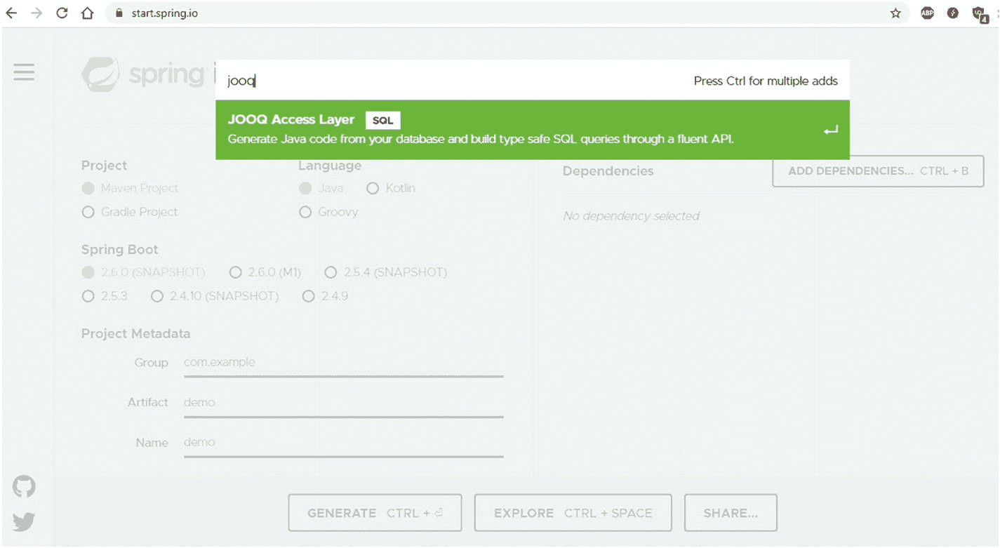
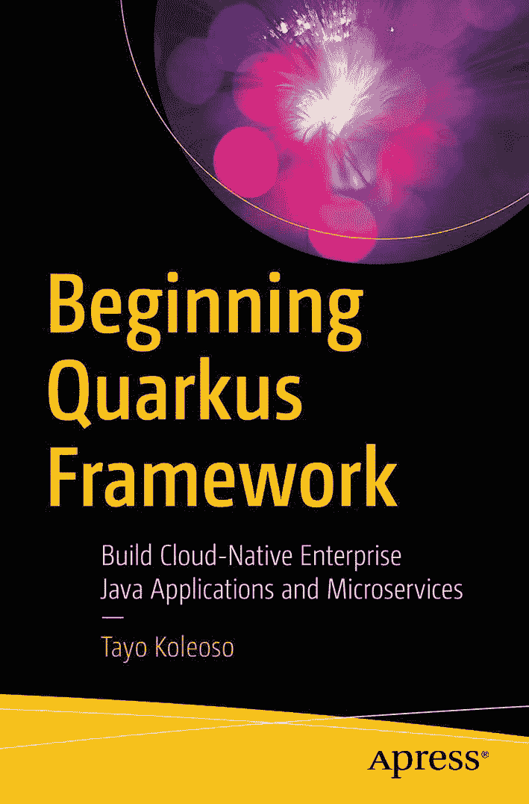

# 4.与 jOOQ 集成

也被称为“吃你的蛋糕，也有它。”如果你和 jOOQ 在一个新项目中重新开始，恭喜你，祝你好运！如果你有一个包含其他技术和 API 的现有项目呢？jOOQ 仍然可以发挥巨大的作用。总而言之，jOOQ 在以下几个方面做得非常好:

*   **生成高度表达性、类型安全、可重用的 SQL** ,这样您就可以放心，您的 SQL 总是正确的。

*   **从数据库实体生成 Java 类**,这样您就再也不用手动构建另一个实体、DTO 或活动记录了。

*   **顺利管理数据库方言、怪癖和缺点**这样您就不必为不同数据库供应商之间的差异而烦恼。顶级便携性！

…当然，还要与数据库服务器的性能和可扩展性保持一致。话虽如此，jOOQ 并不想成为你唯一的爱。我的意思是，这很好，但是如果你已经使用了某些技术，jOOQ 非常乐意分担责任。


*只要我们都明白谁是这个* ***真正的*** *这个联盟中的数据库的朋友*

在这一章中，我们将看看 jOOQ 如何通过将其独特的能力借给现有的 API 和库来增强您的应用实现。

## 使用 jOOQ 的 Java 持久性 API

Java 持久性 API (JPA)是 JakartaEE 规范，它定义了如何将数据库对象映射到 Java，也称为对象关系映射(ORM)。它展示了实现 API 应该如何处理将数据库组件、SQL 和其他数据库内容转换成 Java 类、接口以及相反的过程。它定义了特定环境下参考实现的预期行为。它还定义了 Java 持久性查询语言(JPQL)，这是一种 SQL 风格的查询语法，试图复制 SQL 的习惯用法，但用于 Java 类。然后，我们将目光投向供应商，如

*   红帽/冬眠

*   Eclipse/EclipseLink

*   Oracle/TopLink

*   OpenJPA

最终，行业供应商将按照规范的指导实现一个功能 API。关键词是“指导”——规范是一个指导方针，供应商可以并且通常会违反规范的规则。或者，他们可以实现一些规范定义的功能，但是以非标准的方式。这意味着您的收获可能因 JPA 实现的不同而不同。

但是你可能已经知道了这一切。

这里我们不打算详细探讨 JPA 只想回答一个问题:在 JPA 的世界里，jOOQ 能为你做什么？

### 生成 JPA 实体

JPA 中的基本工作单元是实体。JPA 实体是一个 Java 类，用于表示数据库表或表中的行。因为这不是一本 JPA 教科书，所以我不打算详细介绍 JPA 实体。简单地说，jOOQ 可以为您创建一些基本的 JPA 实体。你只需要问:

```java
<generate>
            <jpaAnnotations>true</jpaAnnotations>
</generate>

```

真的就这么简单。在 jooq 代码生成器设置中标记`jpaAnnotations`“on ”,您将得到如下内容:

```java
/**
 * This class is generated by jOOQ.
 */
@Entity
@Table(
    name = "vehicle",
    schema = "edens_car",
    indexes = {
        @Index(name = "veh_manufacturer_id_idx", columnList = "vehicle_manufacturer ASC"),
        @Index(name = "veh_model_id_idx", columnList = "vehicle_model_id ASC"),
        @Index(name = "veh_style_idx", columnList = "vehicle_style ASC")
    }
)
public class Vehicle implements Serializable {

    private static final long serialVersionUID = 1L;
    private Long          vehicleId;
    private Long          vehicleManufacturer;
    private BigDecimal    vehicleCurrPrice;
    private LocalDate     vehicleModelYear;
    private String        vehicleStatus;
    private String        vehicleColor;
    private Long          vehicleModelId;
    private Long          vehicleTrim;
    private Long          vehicleStyle;
    //more fields
    public Vehicle() {}
    //getters, setters, constructors, toString etc
}

```

这里最重要的注释是`@Entity`。这对于 JPA 运行时来说意味着这个类的实例应该由 JPA 运行时来管理。这对 JPA 运行时如何看待这个类的实例有很大的影响。从这个实体类`Vehicle`的实例存在的那一刻起，JPA 运行时就开始关注了。实体的任何变化、它的任何新实例、从数据库的检索等等。所有这些都由 JPA 运行时跟踪。当两个线程试图修改支持特定`Vehicle`实例的底层表行时，JPA 运行时的工作就是确保只有一个线程或者没有一个线程成功地进行修改。

现在，我们的赞助商说一句话。


不，不是你，先生！

我强烈主张像对待底层数据库行数据一样对待 JPA 实体的实例。像处理 POJO 或数据传输对象(DTO)这样的“哑”对象一样处理这些实体，这是一种非常普遍但阴险的代码味道。因为实体是活动的、受管理的对象，所以您面临

1.  在正常的进程执行过程中意外地改变了对象的状态。

2.  如果在只读操作中长时间持有实体的实例，就会引发类似`StaleObjectStateException`的状态管理异常。这在分布式环境和微服务中尤其容易发生。一个线程只是想读取一些数据，也许把它作为 web 服务响应发送出去。另一个线程同时想要对同一实体的底层数据进行更改。这些线程中的一个将会有一段糟糕的时间。

3.  当您对数据库操作和 web 服务响应使用相同的实体类时，或者将它持久化为不同的格式(如 JSON)时，会泄漏数据。您将在几个方向上不加选择地传输表列。

TL；DR:将你的 POJO 需求和 ORM 需求分开。他们不是同一类型的班级。

一种解决方法是运行代码生成器两次:一次将`jpaAnnotations`设置为`false`，另一次将其设置为`true`。记得在两次运行之间更改输出包。

除了普通的 JPA 注释，jOOQ 还可以添加

*   `Serializable`与`<serializablePojos>true</serializablePojos>`的接口

*   用`<jpaVersion>2.2</jpaVersion>`对特定版本的 JPA 支持

近了。

### 从 JPA 实体生成

 *是的，你没看错:jOOQ 可以让你开始使用 jOOQing，即使你没有一个真正的数据库。如果你有 JPA 实体但没有数据库，jOOQ 仍然可以为你生成代码。考虑到我反对重用实体作为 dto 或 POJOs，这非常方便。这样，您的 JPA 实体可能已经预先生成并打包成一个 JAR 您所需要做的就是从这些实体中生成 POJOs，这样您就可以轻松度日了。观察。

首先添加以下 Maven(或等效的 Gradle 等。)项目的条目:

```java
<dependency>
         <groupId>org.jooq.pro-java-11</groupId>
         <artifactId>jooq-meta-extensions-hibernate</artifactId>
         <version>3.15.1</version>
</dependency>

```

这将引入 jooq hibernate 扩展包。接下来，对代码生成器本身进行一些配置更改:

```java
<database>
       <name>org.jooq.meta.extensions.jpa.JPADatabase</name> (1)
      <properties>
      <!-- A comma separated list of Java packages, that contain your entities -->
          <property>
              <key>packages</key>
              <value>com.apress.samples.jooq.jpa.entity, com.apress.samples.jooq.ext.jpa</value> (2)
         </property>
<!-- The default schema for unqualified objects:
- public: all unqualified objects are located in the PUBLIC (upper case) schema
- none: all unqualified objects are located in the default schema (default)
This configuration can be overridden with the schema mapping feature -->
         <property>
               <key>unqualifiedSchema</key>  (3)
               <value>none</value>
        </property>
    </properties>
</database>

```

这是什么？

1.  为了从 JPA 实体类生成，需要更改名称。`org.jooq.meta.extensions.jpa.JPADatabase`定义生成器的数据来源。将这与我到目前为止一直使用的`org.jooq.meta.mysql.MySQLDatabase`进行对比，因为我的代码是从实际的数据库中生成的。

2.  我指定了 jOOQ 应该扫描的包，以便能够解析 JPA 实体类。

3.  jOOQ 应该如何处理没有模式数据的实体？`unqualifiedSchema`属性接受`none`，这意味着所有缺少模式信息的实体都将被放入默认模式中。`public`也是有效的，意味着默认情况下这些实体将被放在公共模式中。你也可以用`SchemaMapping`覆盖所有这些。

对于我反对滥用实体类作为 dto 的理由来说，这是另一个很好的变通方法，尤其是当您已经有了遗留的 JPA 实体类时。只需从现有的 JPA 实体中生成 POJOs，并跳过代码生成器配置中的`jpaAnnotations`指令。

### 生成 SQL 查询

当然，最明显的用例。jOOQ 将永远超越 JPA 能想到的任何东西。因此，当您想要认真对待您的数据库时，您应该考虑将 SQL 查询生成委托给 jOOQ，这是显而易见的。JPA 提供了许多机会来提供您自己的 SQL。考虑我们钟爱的车辆选择查询:

```java
Query jooqQuery = DSL.using(SQLDialect.MYSQL,new Settings()
                .withRenderQuotedNames(RenderQuotedNames.NEVER))
                .select(VEHICLE.VEHICLE_ID, VEHICLE.VEHICLE_COLOR, VEHICLE.VEHICLE_CURR_PRICE)
                .from(VEHICLE)
                .where(VEHICLE.VEHICLE_MANUFACTURER.eq(param("vehicle_manufacturer", Long.class))).getQuery();

```

前面的 jOOQ 语句

*   使用`DSL`类配置即将生成的 SQL 语句的方言。它还指定引号不应该用在生成的 SQL 中——这可能变得很重要，这取决于为 JPA 实现配置的方言。例如，常规的双引号(")可能会导致 Hibernate 阻塞。

*   从`vehicle`表中选择一些字段，但是我没有执行它，而是获得了`org.jooq.Query`的一个实例。这是所有 SQL 语句的 jOOQ 表示的父接口。你注意到我在这里没有使用`DSLContext`了吗？相反，我直接使用`DSL`类来创建我的 select 语句。这意味着我不需要为了构建 jOOQ SQL 查询而去构建`DSLContext`或 JDBC 连接。

*   将`VEHICLE.MANUFACTURER`列作为查询参数与`param`函数绑定。这意味着我可以在运行时提供一个动态值。

*   最后的`getQuery`方法产生了一个`Query`对象，从这个对象中我可以获得纯文本 SQL 语句，以及其他内容。

这对 JPA 世界有什么帮助？

JPA 为您提供了一系列机会来提供自己的 SQL 查询。你为什么想这么做？嗯，简单的事实是，对于任何比来自几个表的简单的`SELECT`语句更复杂的东西，JPA 都不是最好的选择，特别是在大规模的情况下。如果需要使用常用的表表达式、内联视图、窗口函数等。，您将需要创建自己的 SQL。JPA 菜单上没有分层查询。JPQL 尽可能地支持 SQL 规范的一个子集。这就是你的`Query`对象出现的地方。

```java
@PersistenceContext
 EntityManager entityManager;  (1)
...
javax.persistence.Query nativeQuery = entityManager.createNativeQuery(jooqQuery.getSQL());  (2)
int parameterCount = 1; //JDBC parameter values begin their index at 1, not 0.
 long vehicleStyle = 4;
        for(Parameter parameter: nativeQuery.getParameters()){
             nativeQuery.setParameter(parameterCount++, vehicleStyle); (3)
        }
List<Vehicle> resultList = nativeQuery.getResultList(); (4)
logger.info("Results: count: {} \n list: {}",resultList.size(),resultList.toArray());

```

那好吧。让我们深入了解一下:

1.  `EntityManager`是进入 JPA 运行时的网关，也称为`PersistenceContext`。我提到过我对上下文对象模式有多着迷吗？这是其中之一。从数据库映射的所有数据库行都可以从该对象中获得。几乎所有您想用 JPA 做的事情都可以从这里开始。根据您使用的平台(JakartaEE、Spring Data、Quarkus 等),有多种方法可以获得这个对象的实例。);我不会在这里详细讨论。

2.  `EntityManager`对象提供了允许我提供定制 SQL 的`createNativeQuery`方法。这就是我的`org.jooq.Query`物体发光的地方。我使用`getSQL`方法获得从 jOOQ 查询中生成的明文 SQL。

3.  因为我已经在 jOOQ 查询上定义了一个查询参数，所以 JPA 查询通过我传递给它的普通字符串 SQL 自动继承了这个参数。这意味着我可以动态地为 JPA `Query`对象识别的每个可用的`Parameter`设置值。总的来说，这是一个特别灵活的操作，例如:除了索引值之外，我还可以通过名称引用我的查询参数。

4.  最后，我可以执行 SQL 语句并使用`Query#getResultList`检索我的查询结果。这个方法可以返回一个 JPA 实体类列表或一个`Object`列表，我可以透明地将它们转换成我选择的任何类。这里，我选择使用 jOOQ 为我生成的`Vehicle` POJO 类。这是一个非附加的、非托管的 java 对象，所以我不必担心通过这个查询的结果意外修改底层数据库数据。

在 JPA 世界中，还有其他机会来利用来源可靠、经过认证的无冲突和无麸质 SQL。您可以将一个 JPA 实体类传递给`createNativeQueryMethod`。

```java
Query nativeQuery = entityManager.createNativeQuery(jooqQuery.getSQL(), VehicleEntity.class)

```

使用这种方法，`EntityManager`返回的任何`VehicleEntity`实例都是托管对象——如果对这些对象的状态进行更改，将会影响底层 db 行中的数据。这将把查询结果映射到该类的实例，前提是列名和其他内容匹配。

当数据库列与您的类声明不一致时怎么办？也许您正在使用列别名，或者您想从一个语句中返回多个实体类型？当你根本不想使用 JPA 实体类的时候怎么办？就我个人而言，我绝对喜欢不用担心通过实体意外修改表数据。我希望断开连接的对象用于只读目的。

看，SQL 结果映射的三个 JPA 骑手！


*"l* *ol 什么是 SQL？"*

好吧，说真的，是这三个注解:

1.  `@SqlResultSetMapping`定义是否需要将 SQL 查询的结果映射到 java 对象。这个注释可以应用于任何带有`Entity`注释的 JPA 类。在一个类上定义了这个注释之后，你可以通过名字来引用它。请继续关注我，看看它的实际应用。

2.  在 JPA 2.1 中引入，这样我们可以使用 JPA 来构造非托管的 Java 对象/实体。在此之前，一切都必须是一个托管的 JPA 实体。见我之前的警告，为什么这可能成为一件坏事。有了这个注释，即使你提供了一个用`@Entity`注释的类，JPA 运行时也会忽略它，并且不会试图管理这个构造的任何结果。

3.  `@ColumnMapping`允许您将 SQL 查询结果中的列映射到非 JPA 实体(即 POJO)的字段。这就是如何定义从 SQL 结果到 Java 类字段的列别名和其他不一致名称的映射。在 JPA 行话中，这样的列被称为**标量列**。

那么，这些是如何协同工作的呢？看看这个:假设我已经运行了 jOOQ 生成器并获得了一个 JPA 注释的 POJO `com.apress.jooq.generated.tables.pojos.VehicleModel`，我可以让映射注释像这样工作:

```java
@SqlResultSetMapping(name="nonJPAManagedVehicleModel", (1)
        classes = {
        @ConstructorResult(targetClass =  com.apress.jooq.generated.tables.pojos.VehicleModel.class,   (2)
        columns = {                         (3)
                            @ColumnResult(name="vehicle_model_id"),
                            @ColumnResult(name="vehicle_model_name"),
                            @ColumnResult(name="vehicle_style_id"),
                            @ColumnResult(name="vehicle_man_id"),
                            @ColumnResult(name="version")
                             })
       })
@Entity
public class VehicleModel implements Serializable {
...
}

```

好吧，系好安全带，我来解释这里发生了什么:

1.  一切都从这里的`@SqlResultSetMapping`开始，我说:“我想在 SQL 语句和 POJO 之间定义一个自定义映射。我已经**将**命名为查询`nonJPAManagedVehicleModel`,因为我就是这么做的。”

2.  然后我定义这个自定义映射中涉及的类。对于这个例子，我只对 POJO `VehicleModel`感兴趣。这就是事情变得有点冗长的地方。
    1.  我需要为 JPA 运行时描述一个合适的构造函数，以便能够用`@ConstructorResult`创建我的 POJO 类的实例。有了这种映射，JPA 知道如何处理查询结果。

    2.  请记住:尽管这个类在技术上是一个 JPA 实体类，但是当我在这个上下文中使用它时，JPA 不会将这个查询的结果视为托管实体，这在我看来是非常棒的。

3.  `@ColumnResult`帮助我将查询结果中的`name`映射到`VehicleModel` POJO 类中的字段。JPA 如何知道将列映射到类中的哪个字段呢？由列表`columns`中列的**位置**决定。JPA 运行时将寻找一个合适的与这里的描述相匹配的构造函数，并只挑选指定的列传递给构造函数。

最后，我可以像这样使用我的命名查询:

```java
entityManager.createNativeQuery(vehicleModelQuery.getSQL(),"nonJPAManagedVehicleModel");

```

JPA 运行时将尝试使用我提供的名称来查看我的 SQL 映射。这为它提供了执行查询和构建结果对象列表所需的所有信息。

这是相当冗长的，所以不要担心它是否能一下子完全理解——尽可能多的重复一遍。更简单的描述是告诉 JPA

1.  要映射到哪个 POJO 或实体类

2.  应该使用 SQL 结果集中的哪些列名

3.  在 POJO 类上使用哪个构造函数

4.  POJO 类的构造函数中应该使用哪些列

总之，这些工具允许您将 SQL 查询打包到非常可移植和灵活的部署单元中；考虑数据库方言，并保证查询的有效性。

Caution

在撰写本文时，jOOQ 有一个错误 <sup>[1](#Fn1)</sup> ，使得它需要对 JPA 实体进行`@Column`注释。jOOQ 生成的实体类不会有这个问题；但是如果您将自己的 JPA 实体带到 jOOQ 聚会，请确保将`@Column`添加到该实体的字段中。否则会发生一些奇怪的事情(例如，列值没有映射到结果对象)。

现在，我们向结果集映射的骑手说再见。


*Aww！振作起来，伙计们！*

## Spring Boot 和乔克

Spring Boot 是当前企业 Java 开发的领军人物。*电流*。几乎没有什么是你不能用 Spring 平台做的，我甚至不打算在这里讨论它的许多特性。让我们看看 jOOQ 如何美化您的 Spring Boot 应用。但首先，一些配置:

```java
spring.datasource.driver-class-name=com.mysql.cj.jdbc.Driver
spring.datasource.url=jdbc:mysql://localhost/edens_car
spring.datasource.username=username
spring.datasource.password=thisisaterriblepassword
spring.jpa.show-sql=true

```

这为我的 Spring Boot 应用设置了到 MySQL 数据库的连接属性。这些属性放在标准的`application.properties`文件中。还有编程上的对等物。

Spring 通过以下组件支持 SQL 数据访问:

*   香草 JDBC 访问的春季数据 JDBC

*   spring Data JPA for the sweet Hibernate+JPA combo

*   用于反应式数据访问的 Spring 数据 R2DBC

因为 Spring Boot 平台是如此的庞大，我将在这一部分尽量保持简洁。还要注意，我们在上一节以及这一节中介绍的几乎所有内容都适用于 Hibernate。Hibernate 是 JPA 实现，它为 Spring framework 的许多数据访问功能提供了动力。

首先要知道的是，你可以用 Spring Boot 批量安装 jOOQ 作为你的整个数据访问组件。大概是这样的。

### 在 Spring Boot 配置 jOOQ

让我们通过编程配置设置使 jOOQ 在 Spring 应用上下文中随处可用:

```java
@Configuration                                               (1)
@EnableTransactionManagement
public class JdbcConfig extends AbstractJdbcConfiguration {
    @Autowired
    private DataSource dataSource;                (2)

    @Bean
    DataSourceConnectionProvider connectionProvider() {
        return new DataSourceConnectionProvider(new TransactionAwareDataSourceProxy(dataSource));
    }

    @Bean
    DSLContext dsl() {
        return new DefaultDSLContext(dslConfig());         (3)
    }

    private org.jooq.Configuration dslConfig() {

        DefaultConfiguration defaultConfiguration = new DefaultConfiguration();
        defaultConfiguration.set(dataSource)
                .set(SQLDialect.MYSQL)
                .set(DefaultExecuteListenerProvider.providers(new QueryRuntimeListener()));
        return defaultConfiguration;
    }
}

```

这里有相当多的 Spring 框架样板文件，但是我将把重点放在与 jOOQ 相关的部分:

1.  我用`@Configuration`注释和其他标准的 Spring 框架组件(如`@EnableTransactionManagement`)设置了我的 Spring 配置 bean，让 Spring 管理我的数据库事务；`AbstractJdbcConfiguration`所以我的配置类可以继承更多的样板文件。这是样板大杂烩。

2.  我使用 Spring 的依赖注入来获得一个`DataSource`实例。`DataSource`是我的数据库连接和池的更成熟、可伸缩和健壮的表示，由 Spring Boot 运行时管理。这将在这里提供，因为我已经在标准的`application.properties`文件中配置了我的数据库属性。

3.  我定义了一个可以按需构造`DSLContext`实例的方法。添加`@Bean`注释将它标记为 Spring Boot 的工厂方法。这意味着我可以在我的 Spring 应用中的任何地方获得一个新的`DSLContext`实例。

有了这个设置，我可以在应用的任何地方获得一个`DSLContext`:

```java
@Autowired
DSLContext context;

public void selectWithJooq(){
    context.selectOne();
}

```

然后我就可以尽情地狂欢了。可以扩展前面的代码片段，为每个请求生成一个新的`DSLContext`实例，支持多租户等等。如果你能梦想到，jOOQ 可能会尽最大努力去实现它。更不用说 jOOQ 能为你生成的 Dao 了。不错。

自定义 SQL 查询怎么样？

#### 使用自定义 SQL

如果有定制的 SQL 需要编写，jOOQ 会自动生成。为了使用 Spring Data JPA 的定制查询，我首先创建一个`Repository`:

```java
public interface VehicleModelJooqRepository extends CrudRepository<VehicleModel, Long> { (1)
    @Query(nativeQuery = true, name="CustomDynamicSQL")
    List<VehicleModel> findVehicleModelByVehicleManId(long id);
}

```

请允许我解释:

1.  我扩展了`CrudRepository`,作为使用 Spring Data JPA 的存储库特性的合同的一部分。将`Vehicle`和`Long`指定为该接口的类型，我将通知 Spring 数据运行时，该接口将用于从`vehicle_model`表中检索`VehicleModel`。

2.  我定义了一个`findVehicleModelByVehicleManId`，它接受一个对应于`vehicle_man_id`的`long`参数来过滤结果
    1.  重要的是，我使用了`@org.springframework.data.jpa.repository.Query`注释。Spring Data JPA 允许我在这个注释中指定一个明文 SQL 查询；或者，我可以在其他地方定义查询，通过一些 Spring 魔法，它将被选中。敬请关注。到目前为止，这个 JPA 存储库期望在`PersistenceContext`的某个地方找到一个名为“CustomDynamicSQL”的原生查询。

    2.  我传递给查询方法`findVehicleModelByVehicleManId`的每个参数都将作为查询参数传递给该方法将要执行的本地查询。这一点很重要，因为要么必须将方法参数的位置与普通 SQL 中查询参数的位置相匹配；或者，您可以使用`@Param`注释将您的参数与其 SQL 等价物进行名称匹配。

现在，我需要连接我的定制 SQL 查询，由 jOOQ 赞助。为了将我的 SQL 查询真正插入 JPA 运行时，我求助于我们的老朋友，`EntityManager`:

```java
javax.persistence.Query nativeQuery = entityManager.createNativeQuery(jooqQuery.getSQL());
entityManager.getEntityManagerFactory().addNamedQuery("CustomDynamicSQL",nativeQuery);

```

从我的`org.jooq.Query`中获得了`javax.persistence.Query`的实例:

1.  我从`EntityManager`中获得一个`EntityManagerFactory`。

2.  JPA 2.1 中添加了`addNamedQuery`方法，允许动态构造命名查询。有了这个，我需要补给
    1.  Spring Data JPA 可以通过其查找的查询的名称。注意我是如何使用我在前面的`Repository`接口中定义的方法的完全限定名的。这就是 Spring Data JPA 将如何尝试基于我添加到我的自定义`Repository`方法中的`@Query`注释来查找命名查询。

    2.  要执行的实际 SQL 查询。

剩下的就交给 Spring Boot 了。我只需注入我的自定义存储库，并根据需要使用它:

```java
@Autowired
VehicleModelJooqRepository vehicleModelRepository;
...
List<VehicleModel> modelByVehicleManId = vehicleModelRepository.getVehicleModelByVehicleManId(vehicleManufacturer);

```

…就这样！这个动态 SQL 特性是对我们已经探索过的标准 JPA 特性的补充——Spring 也支持这些特性。

#### jOOQ Spring Boot 首发

据说 Spring Boot 提供了一个入门工具，可以帮助你用 jOOQ 引导你的 Boot 项目。



*start.spring.io*

在实践中，我试图用它来引导，包括 Spring 数据 JPA 和 JDBC 模块。对我来说看起来不是很有效，因为

*   starter(目前)不包含任何 jOOQ 依赖项。

*   它生成的代码存根甚至不包含任何对 jOOQ 的引用(参见前面的讨论)。

所以，也许暂时不要谈这个。

## 夸特斯和乔克

Quarkus <sup>[2](#Fn2)</sup> 是*首屈一指的云原生、容器和 Kubernetes 优先的微服务平台。它几乎支持你想用 Java web 服务平台做的任何事情。您可以集成现有的 JakartaEE 或 Spring beans，并使用相同的编程组件来获得*

 **   极快的启动时间

*   低内存占用

*   与 AWS、Google Cloud 和 Azure 等主要云提供商的功能和组件紧密集成

*   轻量级部署包

*   反应优先的编程风格

*   Kotlin 和 Scala 兼容性

Quarkus 确实是软件工程的天赐之物。我这么说是作为一个完全独立和公正的观察者。



是的。完全无偏

那么，jOOQ 在夸库斯能为你做什么？就像 Spring Boot 一样，jOOQ *可能是您需要的所有 SQL 数据访问。它还可以与 Quarkus 中现有的 API 一起工作，比如*

*   作业的装配区（JobPackArea）

*   冬眠

*   反应式 SQL

*   SQL 结果集流

在撰写本文时，您唯一不能做的事情是在`native`模式下使用`@Query`注释。Quarkus 支持大部分 Spring 数据 JPA，除了这个位。那么，怎样才能让乔克进入夸库斯呢？

从 Quarkus jOOQ 扩展开始:

```java
<dependencyManagement>
   <dependencies>
      <dependency>
        <groupId>io.quarkus</groupId>
        <artifactId>quarkus-bom</artifactId>
        <version>${quarkus.platform.version}</version>
        <type>pom</type>
        <scope>import</scope>
      </dependency>
    </dependencies>
  </dependencyManagement>
<dependency>
      <groupId>io.quarkiverse.jooq</groupId>
      <artifactId>quarkus-jooq</artifactId>
      <version>0.2.2</version>
</dependency>

```

除了标准的 jOOQ 依赖项之外，前面的代码片段摘录了将 jOOQ 扩展添加到 Quarkus 需要添加到 Maven POM(或 Gradle 等价物)中的内容。这不一定是向 quarkus 添加扩展的最佳方式。理想情况下，您应该像这样使用 Quarkus maven 插件:

```java
mvn quarkus:add-extension -Dextension=quarkus-jooq

```

这是安装 Quarkus 扩展的标准方式。它不适用于 jOOQ 扩展，因为它(还)不在 Quarkus 扩展的注册表中。jOOQ 扩展不是 Quarkus 的“官方”扩展，因为它不是由 Quarkus 核心团队构建和维护的。这是他们称之为 Quarkiverse 的一部分， <sup>[3](#Fn3)</sup> 一个扩展的扩展生态系统，将所有权交给开发者社区。Quarkus-jOOQ 扩展是 Quarkus 团队之外的个人在大众需求的支持下努力工作的结果。大声喊出来！

接下来，为您选择的数据库安装合适的 JDBC 扩展:

```java
mvn quarkus:add-extension -Dextension=jdbc-mysql

```

安装 Quarkus 扩展后，您可以在 Quarkus 应用的`application.properties`文件中配置您的数据源设置:

```java
quarkus.datasource.db-kind=mysql
quarkus.datasource.username=dbuser
quarkus.datasource.password=thisisaterriblepassword
quarkus.datasource.jdbc.url= jdbc:mysql://localhost/edens_car
quarkus.jooq.dialect=mysql

```

要使这些工作正常进行，必须配置方言。有了这个基本配置，您可以在应用的任何地方获得一个`DSLContext`:

```java
@Inject
DSLContext dslContext;

```

`@Inject`注释是 Spring 框架中`@Autowired`注释的上下文和依赖注入(CDI)等价物。Quarkus 出于同样的目的支持这两者。quarkus-jooq 扩展只在 jooq 的社区版中提供。如果 POM.xml 中有专业版，可以用专业版覆盖社区版。

现在，让我们谈谈包装和测试所有这些东西。

<aside aria-label="Footnotes" class="FootnoteSection" epub:type="footnotes">Footnotes [1](#Fn1_source)

[T2`https://github.com/jOOQ/jOOQ/issues/4586`](https://github.com/jOOQ/jOOQ/issues/4586)

  [2](#Fn2_source)

[T2`https://quarkus.io`](https://quarkus.io)

  [3](#Fn3_source)

[T2`https://github.com/quarkiverse/quarkiverse/wiki`](https://github.com/quarkiverse/quarkiverse/wiki)

  [4](#Fn4_source)

[T2`https://github.com/quarkiverse/quarkus-jooq`](https://github.com/quarkiverse/quarkus-jooq)

 </aside>**