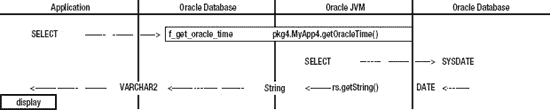

# 四、Java 存储过程

当我第一次发现 Java 存储过程时，我向我工作的公司的 IT 部门正式介绍了我的发现，给出了几个例子，包括在 Oracle 数据库中使用 Java 来发送电子邮件、读取网页和计算用于应用用户认证的 Unix crypt 值。那是在 2001 年，我们在阅读该案文时将会看到，我仍然在提出同样的想法。然而，直到现在这些想法才得以实现，因为 Oracle 数据库 11g 升级到了 Oracle JVM。在 Oracle database 11g 中，Oracle 升级了 Oracle JVM，使其可以在 Java 1.5 版上运行，其中包括对 JVM 中包含的 Java 加密扩展(JCE)包的重大升级。

那么，Java 加密和 Oracle 有什么关系呢？标准的 Oracle 数据库不提供现成的传输到客户端应用的数据加密。您可以购买诸如 Oracle Advanced Security 之类的附加组件来提供它，但是随着 Oracle JVM 在数据库中运行，我们可以使用 Java 在 Oracle 数据库上进行数据加密。在 Oracle 数据库中获得 Java 功能的唯一方法是通过 Java 存储过程。在 Oracle 数据库中运行用 Java 编写的程序将会给我们带来加密和更多好处。

在以前版本的 Oracle JVM 中运行增强加密没有任何障碍，自从 2001 年我第一次发表演讲以来，我一直在这样做。唯一的问题是努力和标准化，以及算法的审查(接受)。在 Java 1.5 中增强 JCE 之前，我们必须获取算法或自己编写算法，并手动安装到 Oracle 数据库中。然而，对于加密，我们现在能够调用 JCE 中包含的标准函数和算法。

在本章中，我们将学习如何从 Oracle 数据库上的 SQL 查询连接到 Oracle JVM，以便让 Java 执行我们的处理并将数据返回给我们。我们还将讲述从 Java 连接到 Oracle 数据库和运行数据库查询的基础知识。其实我们会从 Oracle 通过 Java 连接，用 Java 读 Oracle。

### Java 存储过程示例

对程序员来说，没有什么比代码更清楚了。让我将要展示的例子作为开始理解 Java 存储过程如何工作的指南。你会看到一个 Oracle 头，以粗体显示在清单 4-1 中的 Java 代码。在 Java 代码之后，您还将观察 Oracle 函数的定义，Java 代码封装了 Java 代码。您不能从 Oracle 查询中直接调用 Java 代码，但是您可以调用 Oracle 函数或过程，然后它将调用并运行 Java。

在这里放一个书签，这样你可以在接下来的讨论中参考清单 4-1 。我们很快会将这段代码加载到 Oracle 数据库中。

***清单 4-1。** `MyApp4`和`f_get_oracle_time`*

`SET ROLE appsec_role;

**CREATE OR REPLACE AND RESOLVE JAVA SOURCE NAMED myapp4 AS**

package pkg4;
import java.sql.*;
import oracle.jdbc.driver.OracleDriver;
public class MyApp4 {
    public static String getOracleTime() {
        String timeString = null;
        Statement stmt = null;
        try {
            //Class.forName( "oracle.jdbc.driver.OracleDriver" );
            //new oracle.jdbc.OracleDriver();
            //Connection conn = new OracleDriver().defaultConnection();
            Connection conn = DriverManager.getConnection("jdbc:default:connection");
            stmt = conn.createStatement();
            ResultSet rs = stmt.executeQuery( "select sysdate from dual" );
            if( rs.next() ) {
                timeString = rs.getString(1);
            }
        } catch( Exception x ) {
            timeString = x.toString();
        } finally {
            try {
                if( stmt != null ) stmt.close();
            } catch( Exception y ) {}
        }
        return timeString;
    }
}
/

**CREATE OR REPLACE FUNCTION** f_get_oracle_time
    RETURN VARCHAR2
    AS LANGUAGE JAVA
    NAME 'pkg4.MyApp4.getOracleTime() return java.lang.String';
/`

 **注**清单 4-1 中的代码可以在名为 *Chapter4/AppSec.sql.* 的文件中找到

在我们进一步讨论之前，我想指出这个示例代码的一点。我知道我说过包，像我们的示例类`MyApp4`中的`pkg4`，是和目录协调的，但是没有 *pkg4* 目录。我还说过，在每个 **中总是定义了一个公共类。java* 文件，其类具有与该文件相同的名称。然而在我们的例子中，没有*MyApp4.java*文件，我们拥有的文件甚至没有命名为“myapp 4”dot 任何东西。

这种差异的原因是我们只在 Oracle 数据库上定义了这个类。现在，我们不能在客户端编译或运行它。当我们将它加载到 Oracle 数据库中时，我所说的关于包和类的事情突然又变成了现实。Oracle 数据库创建一个虚拟包目录，它可以像搜索类路径一样搜索该目录以找到类。此外，它像普通的 **一样编译代码。java* 文件并创建类文件，即虚拟文件，存储在数据库中。

#### 获取加载 Java 存储过程的权限

应用安全用户`appsec`需要`CREATE PROCEDURE`特权来将 Java 加载到数据库中。她通过`appsec_role`获得这种特权。回想一下，我们将`appsec_role`设置为`appsec`用户的非默认角色。由于这个原因，当`appsec`连接到 Oracle 数据库时，她在开始时没有这个角色。相反，她必须通过为当前会话设置`appsec_role`来启用它。显示的方法(`SET ROLE appsec_role`)就足够了，正如您回忆的那样，新角色成为`appsec`在当前会话中的唯一角色。另一种方法是使用以下命令请求在当前会话中启用授予`appsec`的所有角色(默认和非默认):

`SET ROLE ALL;`

#### 在 Oracle 数据库中加载 Java

有几种方法可以将 Java 代码放入 Oracle 数据库。一种方法是使用 loadjava.exe ?? 实用程序。该实用程序在 Oracle 数据库和某些版本的 Oracle 客户端软件中都可用。它与*sqlplus.exe*和其他 Oracle 应用在同一个 bin 目录中。使用 *loadjava* ，我们可以向 Oracle 数据库提交一个 java 文件(或 *sqlj* 文件，java 代码中嵌入了 SQL)、一个类文件，甚至一个 jar 文件。服务器以适当的方式处理我们提交的任何内容。这里有一个示例`loadjava`命令，我们可能已经使用它来加载一个名为*MyApp4.java*的 Java 文件(参见清单 4-1 )。

`loadjava -force -resolve -user appsec/password@orcl pkg4/MyApp4.java`

该命令将作为`appsec`用户连接到 Oracle 数据库，然后从 *pkg4* 目录中读取*MyApp4.java*文件，并将其提交给 Oracle 数据库。新代码将覆盖以前存在的同名代码，Oracle 数据库将编译代码并将虚拟的 *MyApp4.class* 文件放在虚拟的 *pkg4* 目录中。

我们可以使用的另一种将 Java 代码加载到 Oracle 数据库的方法是我们在示例中使用的方法，清单 4-1 。我们在这个 Oracle 语句后列出了 MyApp4 类的 Java 代码:

`CREATE OR REPLACE AND RESOLVE JAVA SOURCE NAMED myapp4 AS`

我们可以在连接到 Oracle 数据库时运行这个`CREATE`语句，它将完成我们通过`loadjava`命令完成的相同事情。

#### 在 Java 存储过程中处理异常

正如你在清单 4-1 中的`MyApp4`类的`getOracleTime()`方法中看到的，我们从一个`try` / `catch` / `finally`块开始。无论何时处理数据库，都必须准备好捕捉或抛出一个`SQLException`。有很多情况下会抛出`SQLException`；例如，如果您拼错了表名或列名，或者您没有权限读取数据，或者 Oracle 数据库有响应问题。`IOExceptions`也可以在做输入/输出(IO)时生成。与 Oracle 数据库通信是 I/O，读写文件也是 I/O，从网络资源(如 web 服务器)读取数据也是 I/O。

根据第三章中关于异常处理的讨论，我们选择捕捉所有异常并在本地处理它们，将我们将要返回的字符串设置为等于从`Exception.toString()`返回的值。当我们到达`try` / `catch` / `finally`块的末尾时，最后一行返回`timeString`，如果成功可能是 Oracle 数据库数据和时间，否则将是`Exception.toString()`消息。(请注意`Exception`中的`toString()`方法不是静态的。你需要一个`Exception`的实例，比如`x`，来调用`x.toString()`。我说`Exception.toString()`只是为了讨论清楚。)

下面是一个示例`Exception.toString()`消息:

`java.sql.SQLException: Invalid Oracle URL specified.`

在`finally`块中，我们关闭了`Statement`对象`stmt`。同样，我们正在与 Oracle 数据库打交道，因此我们必须做好准备，抓住任何`SQLExceptions`。然而，在这种情况下，我们不需要做任何有例外的事情。注意，在我们试图关闭它之前，我们测试了一下`stmt`是否为`null`。如果我们从未实例化过`Statement`对象，该测试将阻止我们生成`NullPointerException`。(`NullPointerException`是当我们试图使用一个还没有实例化的类的方法或成员时产生的。)也许你已经猜对了，我们不需要测试`stmt`是不是`null`。因为我们在一个`try` / `catch`块中，并且没有做任何异常，我们可以尝试关闭`stmt`，它要么成功，要么我们将捕获`NullPointerException`。这是真的，但是我不喜欢不必要地生成异常，所以我们测试`stmt`是否是`null`。

在我们探索 Java 的过程中，另一个值得注意的地方是对`timeString`和`stmt`的声明。首先，注意我们在`try`块之前声明(提到)了它们。我们需要这样做，这样我们就可以将`timeString`返回到`try`块之外，这样我们就可以关闭`finally`块中的`stmt`，它在`try`块之外。成员变量是上下文相关的，只存在于它们的声明范围内。也就是说，成员变量只存在于声明它的块(花括号)中。例如，`ResultSet`成员不存在于`try`块之外。

关于声明`timeString`和`stmt`要注意的第二件事是，它们最初都被声明为`null`。正如我前面提到的，即使我们没有将它们声明为`null`，它们也不会指向任何对象(`null`)。这适用于所有 Java 对象，不仅仅是字符串和语句。但是编译器前瞻，看到我们要返回`timeString`，它不喜欢返回未知数。如果您试图用这两行代码编译一个方法:

`String myString;
Return myString;`

编译器会报错，拒绝编译你的代码，说`myString`可能还没有被*初始化*(设置为指向一个对象或者一个值)。但是如果你把`myString`的声明改成:

`String myString = null;`

然后编译器将(至少)接受*你*对`null`值负责，它将编译你的代码。

你可能会问，为什么当我们读完`ResultSet`时，编译器看不到`timeString`稍后被初始化(我们称之为`timeString = rs.getString(1)`)? *Javac* 是一个非常聪明的编译器。它看到了那里的初始化，但注意到初始化是有条件地发生的*——也就是说，它发生在`if`语句之后。*

 *那么，`stmt`为什么要声明为`null`？原因非常相似。如果你像这样声明`stmt`，甚至没有初始化到`null`；然后，当编译器向前看，看到您要在`if`块中测试`stmt`时，它会报告一个错误，说明`stmt`可能还没有初始化。

`Statement stmt;
…` `if( stmt == null ) …`

在这种情况下，抱怨是我们试图在我们的逻辑中使用一些可能还没有初始化的东西。Java 希望做出明智的决定，并认为这是潜在的混乱，即使在编译时也是如此。

#### 从 Java 调用 Oracle 数据库

在名为`getOracleTime()`的 Java 方法中，在清单 4-1 中，调用了四个类，用于与 Oracle 数据库接口:`OracleDriver`、`Connection`、`Statement`和`ResultSet`。下面的部分描述了这四个类以及它们的作用。

##### OracleDriver

第一个调用是加载 Java 数据库连接(JDBC)驱动注册表(list)中的`OracleDriver`。(可以使用多个驱动；例如 Oracle 数据库、SQL Server 和 MySQL。每个都需要注册。)我展示了注册`OracleDriver`的几个选项。它们都被注释了，原因我稍后会解释。

`    //Class.forName( "oracle.jdbc.driver.OracleDriver" );
    //new oracle.jdbc.OracleDriver();
    //Connection conn = new OracleDriver().defaultConnection();`

第一个选项使用调用实例化一个`OracleDriver`类，看不见，通过使用`Class.forName()`调用。`Class.forName()`方法是一种通过简单地声明对象的完全限定名来实例化对象的方法。通过以这种方式实例化`OracleDriver`，它被自动加载到驱动注册表中。这是装载`OracleDriver`的标准做法，你会经常看到。

第二个选项是实例化一个`new OracleDriver()`，它会自动加载到驱动注册表中。最后，我们可以选择创建一个新的`OracleDriver`实例(再次自动加载到驱动注册表中)，在同一行代码中，使用`OracleDriver`来获得一个`Connection`对象。

现在，让我告诉你为什么所有这些调用都被注释了。原因有二。首先，我们将这段代码作为 Oracle 数据库上的 Java 存储过程运行。作为 Oracle 会话的一部分，Oracle JVM 自动加载并注册`OracleDriver`。

第二个原因是，从 Java 版本开始，`OracleDriver`会根据需要自动加载(在`CLASSPATH`中有 *ojdbc6.jar* 和来自连接字符串的提示，例如" *jdbc: **oracle** :thin* ")。这不太可靠，因为作为开发人员，您可以选择用任何版本的 Java 编译和运行这些代码。您只需要拥有 JDK 1.5 或更高版本就可以阅读本书，因此我们将继续在您的客户端工作站上运行的任何代码中加载`OracleDriver`。

##### 联系与陈述

接下来在清单 4-1 中，我们建立一个到 Oracle 数据库的连接(在下面重复)。我们根据缺省值定义连接，“ *jdbc:default:connection。*“我们将把这段 Java 代码放入 Oracle 数据库，因此我们不需要指定 Oracle 服务器或 Oracle 监听器端口号，也不需要识别 Oracle 用户或密码。默认情况下，存储在数据库中的 Java 作为与加载 Java 的模式相关联的用户运行。因为我们使用`appsec`用户创建这个 Java 结构，所以它将使用默认的角色和特权`appsec`运行。

`Connection conn = DriverManager.getConnection("jdbc:default:connection");
stmt = conn.createStatement();`

我们使用我们的`Connection`实例通过调用`conn.createStatement()`来创建一个`Statement`。注意，这些是 Java 中使用的标准 Java 类，用于与任何供应商的 SQL 数据库对话，包括 SQL Server 和 DB2。然而，因为我们请求(或默认接收)了`OracleDriver`来给我们`Connection`，所以我们有一个特定于 Oracle 数据库的`Connection`。

每个数据库供应商都必须实现这些标准接口(连接和语句),以使我们的 Java 代码能够使用特定于供应商的驱动程序与他们的数据库进行对话。特定于 Oracle 的驱动程序和类是通过在我们的`CLASSPATH`中包含 *ojdbc6.jar* 得到的。我们将使用另外几种类型的`Statements`和`Connections`——这些变化是特定于 Oracle 数据库的。

##### 结果集

一旦你有了你的`Statement`对象，你就可以执行 Oracle 命令，就像我们在例子中执行的一样，在下面的例子中重复。当我们通过调用`stmt.executeQuery()`执行查询时，我们期望得到数据。来自查询的数据在一个`ResultSet`对象中返回(在我们的例子中是`rs`)。通过调用`ResultSet`的`next()`方法，我们将下一行(第一行)的值带入`ResultSet`对象，这样我们就可以用一个“getter”方法请求每个值(查询中指定的行中的每一列)，就像我们的示例代码中对`rs.getString()`的调用一样。

`ResultSet rs = **stmt.executeQuery**( "select sysdate from dual" );
if( **rs.next**() ) {
timeString = **rs.getString**(1);
}`

关于`ResultSet`“getter”方法的一个有趣的事情是，对于一些返回的类型，翻译可以自动完成。例如，在我们的代码中，我们请求一个`Date`类型(值)，因为在我们的查询中我们`SELECT`了(请求)Oracle 数据库的时间和日期`SYSDATE`的值。然而，在我们对`ResultSet`的调用中，我们要求调用`getString()`，因此`ResultSet`执行从`Date`类型到`String`类型的转换。

把在`ResultSet`中返回的数据想象成一个带有多行数据条目的电子表格，每一行都有多列相关的值。当您调用`ResultSet.next()`时，您将获得当前`ResultSet`值空间中的下一行的等价物。在那里，您可以使用列号从每一列中获取值。在我们的示例中，我们使用语句从第一列中获取值:

`rs.getString(1);`

唯一的是，`ResultSet`的索引是从 1 开始的；也就是说，第一列值位于索引 1 处。这和 Java 里的其他东西(我能想到的)都不一样。Java 数组和`Collections`通常是基于 0 的，第一个元素在索引 0 处。另外，`String`中的字符位置从 0 开始。

在我们尝试使用它之前，我们几乎总是想看看在`ResultSet`中是否有任何数据被返回。出于这个原因，我们在`if`条件语句中放置了一个`ResultSet.getString()`调用，用于测试是否有下一行。或者，我们可以说:

`rs.next();
rs.getString(1);`

然而，如果我们这样做了并且没有“下一个”，那么`ResultSet`值空间将是`null`，当我们调用`rs.getString(1)`时，我们将生成一个`Exception`。

此外，我们几乎总是希望在`ResultSet`中返回一行或多行，而调用`if( rs.next() )`只会测试是否返回一行。当我们希望得到几行时，我们将使用一个`while`块来处理`ResultSet`，例如:

`while( rs.next() ) {
…
}`

### Java 存储过程中的方法语法

我在第三章的中描述了`main()`方法中修饰符`static`的作用。在 Java 存储过程中，我们会看到 Oracle 数据库只从 Java 存储过程中调用`static`方法。这与我们看到的`main()`方法的原因类似:Oracle 调用这些方法时没有预先实例化该类的对象。在调用`getOracleTime()`方法之前，我们不创建`MyApp4` ( 清单 4-1 )的实例。然而，正如`main()`方法可以实例化自身或任何其他对象一样，这些作为 Java 存储过程调用的静态方法(如`getOracleTime()`)可以根据需要实例化自身或其他对象(并非静态方法中使用的所有内容都是静态的)。

#### 从 Oracle 数据库调用 Java

清单 4-1 中的 Java 存储过程(函数)示例代码的第二部分是创建函数`f_get_oracle_time`的 Oracle 语句。语法(在下面重复)应该是熟悉的——大多数 Oracle 关键字与我们在第二章中创建过程时看到的相同。对于 Java 存储过程(和函数)，我们修改过程定义，指出执行处理的代码使用的是不同的语言——在我们的例子中是 Java。我们通过提供完整的 Java 方法规范来指明将调用哪些 Java 代码:

`CREATE OR REPLACE FUNCTION f_get_oracle_time
**    RETURN VARCHAR2**
    AS **LANGUAGE JAVA**
    NAME '**pkg4.MyApp4.getOracleTime() return java.lang.String';**`

/

注意，我们的 Java 方法规范包括包名(`pkg4`)、类名(`MyApp4`)和方法名`getOracleTime()`。在这个例子中，我们还看到从 Java 发回的返回类型被指定为`java.lang.String`。如果你看一下 Oracle 函数返回类型的定义，它说:

`RETURN VARCHAR2`

Oracle `VARCHAR2`类型对应于 Java `String`类型。如果您还没有猜到， *java.lang* 是 Sun (Oracle)保存`String`类的包。在 Java 存储过程定义中，需要将完全限定的包指定为参数和返回值类型的一部分。

我们确实需要协调 Java 返回类型与 Oracle 数据库中可用的返回类型的一致性。oracle 在 *oracle.sql* 包中包含了封装其返回类型的 Java 类，对于许多 Oracle 类型，在 *java.sql* 包中有相应的泛型 Java 类。随着我们的继续，我们将会看到其中的一些。有关 Oracle 数据库类型和相关 Java 类型的更多信息，请参考 Oracle 文档以及名为 *Oracle 数据库 JDBC 开发人员指南*的文档的附录 A。

尽管这种技术被称为 Java 存储过程，但是您将会看到，在大多数情况下，我们将从 Oracle 函数中调用 Java 方法。Java 方法只能返回一个值。虽然这个值可以是一个复杂的对象数组，也可以是一个有许多成员的对象，但它仍然是一个单一的返回值——一个类似于 Oracle 函数的模型。Oracle 将存储过程定义为执行进程的代码，将存储函数定义为返回值的代码。当然，一个 Oracle 过程可以通过`OUT`参数返回多个值，如果我们可以将它映射到一个返回多个值的 Java 存储过程，那就方便多了，但是我们不容易做到这一点。当然，Oracle 函数可以在返回值之前执行一个过程。Oracle 函数也可以通过`OUT`参数返回多个值，但是不鼓励这样做。

**VARCHAR 或 VARCHAR2**

在创建数据库表和编写 PL/SQL 时，习惯上将字符串列和变量定义为 VARCHAR2 类型。由于历史原因，没有 VARCHAR1。Oracle 数据库目前认为 VARCHAR 是 VARCHAR2 的同义词(PL/SQL 中的一个子类型),但是 Oracle 在其官方文档中警告不要使用 VARCHAR。您可以通过以下链接阅读该警告:

`http://download.oracle.com/docs/cd/E11882_01/server.112/e17118/sql_elements001.htm#sthref117` 

没有理由违背 Oracle 的建议，在创建表和编写 PL/SQL 时，我推荐 VARCHAR2。使用 VARCHAR2 作为字符串类型有一个例外，这个例外发生在编写 Java 代码与数据库交互时。稍后，当我们在一条`Insert`或`Update`语句中定义想要从 Java 传递到 Oracle 的参数时，我们将称它们为`OracleTypes.VARCHAR`。没有定义`OracleTypes.VARCHAR2`。`OracleTypes`是 Oracle 提供的一个类，所以`VARCHAR2`作为一个类型在它不存在的时候很显眼。

这里需要记住的重要一点是，在创建数据库列或定义 PL/SQL 变量时使用 VARCHAR2，并且使用 OracleTypes。VARCHAR 在定义 Java 变量或参数时，要与 Oracle 数据库中的 VARCHAR2 值兼容。

#### 安装和测试示例代码

运行清单 4-1 中的代码。您可以使用任何一个 *SQL*Plus* 、 *SQL Developer* 、 *JDeveloper* 、 *TOAD* 或任何其他能够执行代码的数据库代码编辑器来运行它。第一部分是将您的角色设置为`appsec_role`的一行。清单 4-1 的第二部分创建了名为`MyApp4`的 Java 源代码。第三部分创建了`f_get_oracle_time`函数。

运行代码后，您可以通过调用 Oracle 函数`f_get_oracle_time`来测试 Java 存储过程。该函数将从 Oracle 数据库返回当前日期和时间。

`SELECT f_get_oracle_time FROM DUAL;`

这里有一个关于`FROM DUAL`子句的注释。为了选择数据，`SELECT`查询必须有一个源。源通常是 Oracle 表或视图。然而，在这种情况下，我们从函数中选择返回值。通过说`FROM DUAL`，我们满足了在`SELECT`查询语法中对源的要求，但本质上是说“来自数据库”`DUAL`实际上是一个虚拟表，其中一列名为`DUMMY`，一行名为`DUMMY`=‘X’。您可以从以下查询中看到这一点:

`SELECT * FROM DUAL;`

如果您现在认为我们可以从任何表或视图中选择`SYSDATE`,那么您是正确的！然而，我们将得到我们指定的视图或表中的每一行的结果。尝试这个查询，您将看到如下所示的结果:

`SELECT USERNAME, SYSDATE FROM SYS.ALL_USERS ORDER BY USERNAME;

ANONYMOUS           09-JUN-11
APEX_030200         09-JUN-11
APEX_PUBLIC_USER    09-JUN-11
APPQOSSYS           09-JUN-11
APPSEC              09-JUN-11
APPUSR              09-JUN-11
APPVER              09-JUN-11`

为每个用户返回一行，但是我们只为每行返回 username 和`SYSDATE`值。这是我们可以利用的`SELECT`语句的一个特性。例如，如果我们从人员列表中选择所有经理，我们可以在名字和姓氏之间插入单词“尖头头发”,如下所示:

`SELECT FIRST_NAME || ' Pointy-Haired ' || LAST_NAME
    FROM HR.EMPLOYEES
    WHERE EMPLOYEE_ID IN (
        SELECT DISTINCT MANAGER_ID FROM EMPLOYEES
);`

双管“||”是在 Oracle 数据库中连接*和*字符串的一种方式。我们在括号中有一个子查询，它选择了在`EMPLOYEES`的`MANAGER_ID`列中列出的所有 *distinct* (unique) `EMPLOYEE_ID`。对于所有把这些`MANAGER_ID`中的一个作为`EMPLOYEE_ID`的员工，我们把他们的`FIRST_NAME`、单词“尖头发”和他们的`LAST_NAME`连在一起，只是为了好玩。

我们可以为查询返回的每一行选择我们想要的任何内容。我们可以`SELECT` `SYSDATE`为每一排，或者我们可以`SELECT`为每一排“第一个尖头发的老板”。

#### 查看参与者名册

下面是我们的示例代码测试参与者的简要介绍:

1.  您的客户端(Oracle 命令行)正在呼叫。
2.  Oracle 数据库上封装的函数。
3.  名为`MyApp4` ( 清单 4-1 )的 Java 源代码进行查询。
4.  Oracle 数据库选择`SYSDATE.`

当我们创建`MyApp4` Java 源代码时，Oracle 数据库编译了代码并创建了包 *pkg4* 和类`MyApp4`。我们的 Oracle 函数调用了`MyApp4`类中的静态方法`getOracleTime()`。在`getOracleTime()`方法中，我们打开一个到 Oracle 数据库的连接并请求系统时间`SYSDATE`，然后我们将它作为`String`返回。我们的函数接收时间字符串并将其作为`VARCHAR2`返回给我们的客户端，客户端显示日期和时间字符串。

你可以在图 4-1 中看到这些参与者之间的关系。

***图 4-1。**Java 存储过程的流程*

在图 4-1 中，我想强调两点。首先，Java 存储过程、函数`f_get_oracle_time`和相关联的 Java 方法`getOracleTime()`是如此紧密相关，以至于我将它们放在一个框中。你可能会说他们“连在一起”函数`f_get_oracle_time`所做的就是将其参数传递给 Java 方法，并返回该方法返回的值。

我想强调的第二件事是，当返回值沿着它的返回路径传递时，它被连续地视为一个`DATE`类型，然后是一个`String`类型，然后是一个`VARCHAR2`类型。

### 打扫卫生

我们刚刚看到的仅仅是 Java 存储过程如何操作的一个例子。通常情况下，您不会仅仅为了从`SELECT`语句中获取时间而调用 Java 存储过程。调用内置的`SYSDATE`函数会简单得多。例如:

`SELECT SYSDATE FROM DUAL;`

Java 存储过程的真正用处是做一些在 PL/SQL 中很难或不可能做的事情。

因此，让我们使用以下命令从数据库中删除这个示例:

`DROP FUNCTION f_get_oracle_time;
DROP JAVA SOURCE myapp4;`

### Oracle Java 虚拟机

当 Oracle 公司第一次在其数据库中包含一个 JVM 时，它称之为 Aurora。您仍然可以在 Oracle Database 11g 包含的目录和文件中找到一些对 Aurora 的引用。

Oracle Database 11g 中的 Oracle JVM 是高度定制的，不能升级或替换为从 Sun (Oracle corporation)下载的标准 JVM。Oracle JVM 有一个全面的安全结构和沙箱，它与 Oracle 数据库紧密相关。这个沙箱是 Oracle JVM 无法被标准 JVM 取代的部分原因。沙盒安全设置可以从数据库中查询并使用 Oracle 命令进行设置(我们将在第九章的中讨论双因素认证时看到)。

#### 基于 Java SE 1.5 的 Oracle JVM

可能是因为 Oracle 公司构建 Oracle JVM 需要做大量的裁剪工作，所以它是当前标准 JVM 之后的一个版本。Oracle JVM 基于 Java 标准版(SE)1.5 版，目前支持 1.6 版。1.7 于 2011 年 7 月发布。谈论版本真的会让这样的文字看起来过时，这一段可能会很快落后；但是几年后,当您的工作站上安装了 Java 1.7 或 1.8，并且您正在使用 Oracle Database 12 时，您可能仍在使用基于 Java 1.5 的 Oracle JVM，Oracle JVM 远远落后于它。

无论如何，Java 1.5 是我们在 Oracle 数据库中需要的，以支持我们对 JCE 的使用。所以我们不会批判，也不会哀叹。

#### 每个 Oracle 会话一个单独的 JVM

当您连接到 Oracle 数据库并使用 Java 时，您会启动一个单独的 JVM，仅供您的会话使用。您不能与其他正在运行的 JVM(Oracle 会话)共享任何 Java 对象或数据，除非您将它们存储在数据库中供其他人查询或通过网络端口服务(电子邮件、ftp、web 等)传递这些对象。)

当您断开与 Oracle 数据库的连接时，您的 Oracle 会话关闭，JVM 终止。如果您立即与 Oracle 建立新的连接，您将获得一个全新的 JVM，并且以前的 JVM 中的任何内容都不会被保留或转移到新的 JVM 中。

这对我们有影响。首先，因为我们将生成加密密钥(您可能已经猜到了)，所以我们希望在关闭与 Oracle 数据库的连接并丢弃密钥之前，使用它们来回发送加密数据。我们可以将密钥保存在数据库中，或者 Oracle 所谓的钱包中，这基本上是服务器和/或客户端硬盘上的安全文件。但是如果它们被存放在任何地方，我们就不知道谁会接触到它们。不，我们要做的是动态生成密钥并使用一段时间，在密钥交换和多次查询期间保持连接打开，只有在完成时才关闭连接。

#### Oracle JVM 安全执行程序

我们在上一章的最后简要讨论了 Oracle JVM 沙箱。概括地说，这个特殊沙箱阻止 Oracle 数据库中的 Java 代码读写硬盘；并且完全不能在网络上通信；但是，它提供了对 Oracle 数据库的开放访问，但受到授予执行 Java 代码的 Oracle 用户及其角色的 Oracle 特权的限制。例如，如果用户`HR`拥有并正在执行 Java 存储过程，它将可以访问所有的`HR`模式数据。

Oracle 数据库中的 Java 代码可以被授予扩展的安全特权，以执行通常被沙箱拒绝的功能。这些权限由管理命令授予，并存储在数据库中。特权授予可以是宽泛的，也可以是非常细化的。我们将对运行在 Oracle 数据库中的 Java 代码使用扩展权限，以便通过互联网与其他机器进行通信。当我们读到第九章时，你会看到一些非常细致的特权授予。

#### Oracle JVM 中禁用了自动提交

在 SQL 数据库中，`COMMIT`表示将更改合并到现有数据库中。在执行`COMMIT`之前，数据更新保存在缓存中。进行更新的会话可以看到这些更改，但其他人看到的是更新前的数据。当会话执行`COMMIT`时，每个人都可以看到所做的更改。对于有多个步骤的事务来说，这是一个强大的概念。在单个会话中，可以执行每个步骤，并且每个后续步骤的操作都可以基于会话中已经进行的更新。当所有步骤都完成时，会话可以发出一个`COMMIT`，所有的更新都将对现有数据库进行。但是，如果在任何后续步骤中出现问题，所有已完成的步骤都可以被*回滚*(反转)，而不是写入现有的数据库。你可以看到，如果银行把钱从你这里转到我这里，这是多么的方便——他们会从你的账户里把钱转到我的账户里。但是如果他们不愿意把你的钱给我，你希望他们也把他们从你那里拿走的那一步逆转过来。

通常，在 Oracle 数据库中，需要时必须发出一个`COMMIT`，这是在每次数据更新之后的某个时间(`INSERT`、`UPDATE`或`DELETE`)。更新数据的 Oracle *过程*不应该发出`COMMIT`——它们假设它们只是事务的一部分，当所有部分都成功时，调用它们的任何代码都会发出`COMMIT`。《Oracle 数据库架构专家:Oracle 数据库 9i、10g 和 11g 编程技术和解决方案》一书的作者 Tom Kyte(2010 年出版)在他的博客(`asktom.oracle.com)`中解释说，过程是原子工作单元，所有事务必须由调用者(调用过程的人)控制(和执行)。

自动提交是一种操作模式，在这种模式下，每次更新都会立即提交到数据库。您可以通过执行以下命令来启用此功能:

`SET AUTOCOMIT ON;`

您可能认为这将使多步事务性更新的能力失效，您是对的。但是，这是 JDBC 的默认模式。因此，在 Java 客户端，当您更新数据库时，更新会立即提交，并且您无法回滚。一个好处是，您不必使用 JDBC 来执行另一个 Oracle 语句来进行更新。

实际上你可以通过调用你的`Connection`的`setAutoCommit()`方法来关闭 JDBC 的自动提交模式，就像这样:

`conn.setAutoCommit(false);`

然后，在适当的时候，您可以使用以下命令之一手动提交或回滚事务:

`conn.commit();
conn.rollback();`

自动提交是纯 Java 不能“随处运行”的一个领域对于运行在 Oracle 数据库中的 Java 代码(Java 存储过程)，默认模式是关闭自动提交。这坚持了过程是原子性的，事务由调用者提交的主张，但这与你对 JDBC 的期望相反。

这是我们开发 Java 存储过程时要记住的事情。如果我们更新数据，我们需要发出一个`COMMIT`。

### 章节回顾

这是一个相当简短的章节，在这一章中，我们已经能够关注在 Oracle 数据库中运行 Java，或者 Java 存储过程。我们看到了几种将 Java 加载到 Oracle 中的技术。

这可能偏离了主题，但是我们也详细讨论了使用`Connection`和`Statement`类从 Java 调用 Oracle 数据库的反向过程。我们还讨论了`FROM DUAL`和`SELECT`查询。

正如我们必须做的那样，我们后退一步来讨论一般的编程问题。在这一章中，我们讨论了异常处理的一些附加方面，并且讨论了成员的声明和初始化。

最重要的是，我们讨论了 Oracle JVM 及其瞬态特性以及与特定 Oracle 会话的关联。此外，我们还讨论了 Oracle JVM 沙箱。*