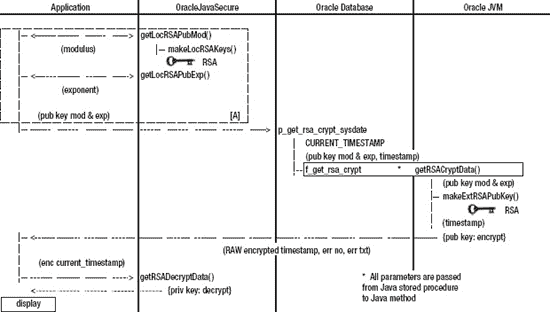

## T1】C H A P T E R 5

## 公钥加密

我相信你听说过公钥加密(PKE)。您可能每天都在使用它——如果不是在您的代码或服务器上，那么就是在互联网上。当您在浏览器中使用安全套接字层(SSL)时，或者当您在地址栏中看到锁或钥匙符号并看到`https:\\`(带 s)作为协议时，您正在使用 PKE 和其他加密。SSL 用于向在线商家发送加密形式的私人数据，如您的信用卡号。

PKE 的基本概念是两个实体共享一组两个密钥(一个公钥，一个私钥)，并使用它们相互加密和解密数据。这些密钥相互捆绑，使得用密钥对中的一个(例如，私钥)加密的任何东西只能用另一个(例如，公钥)解密。这种加密/解密是双向的。

PKE 最重要的方面是其中一个密钥是私有的。私钥从不透露给任何人；然而，公钥可以给任何和所有请求者。这对隐私有什么帮助？

请求公钥的一方可以确信，如果该密钥成功地解密了数据，那么它就来自具有私钥的实体。只有私钥可以加密可以用公钥解密的数据。

反之亦然:只有公钥可以加密私钥可以解密的数据，因此使用公钥的人可以确保只有拥有私钥的实体才能解密他们加密的数据。

因为公钥是公开的，所以任何人都可以解密发件人发送的数据。此外，任何人都可以加密数据，并将其发送给创作者解密。这不是一个缺陷，但这是 PKE 的一个方面，我们需要意识到和解释。

#### 在客户端生成密钥

我们将让客户端计算机生成一组密钥。该计算机将公钥的工件(组件)发送到 Oracle 数据库，以便 Oracle 可以构建公钥的副本。然后，Oracle 数据库可以使用只有原始客户端可以解密的公钥来加密数据。

这种方法听起来像是一个完整的解决方案，但是有几个问题我们要等到下一章讨论秘密口令加密时才能解决。首先，任何人都可以在穿越网络时读取公钥工件(也就是说，任何人都可以像嗅探器一样，通过软件读取通过网络的所有数据包。)这意味着我们必须假设每个人都有公钥，并且每个人都能看到和解密客户端用私钥加密并发送给服务器的数据(如果有的话)。

第二个问题是 PKE，至少是我们正在使用的版本，不适合加密大量数据。它是一种块大小有限的分组密码。例如，如果我们的 PKE 密钥的块大小被限制为 128 字节，我们将不得不把数据分成该大小的多个部分，并分别加密每个部分。在此事务的另一方，接收方必须解密每个部分，并重组原始数据。

为了处理更大量的数据，有两种方法:密码块链接(CBC)和流加密。使用 CBC，大型数据被分解成适当大小的块进行加密，然后被解密并自动为用户重新组装。(咻，这下我们肩上的担子轻松多了。)使用流加密，每个位、字节或字节块在通过流时都会被加密/解密。流只是数据传输的通道。你将字节的数据放入一个流中，并以同样的顺序取出字节的数据:先进先出(fifo)。当向存储读取/写入数据时，或者通过网络，或者只是从内存中的一个位置(结构)到另一个位置时，可以存在流。

### RSA 公钥加密

我们将在 PKE 加密算法中使用 RSA 公钥加密。RSA 代表算法创造者的姓氏:Rivest、Shamir 和 Adleman。

因为 RSA 使用不同的密钥进行加密(例如，私有密钥)和解密(例如，公共密钥)，所以它被称为非对称算法。所有 PKE 都是非对称加密。由于密钥长度很长，RSA 是一种非常值得信赖的加密算法。

### 生成和使用 RSA 密钥的 Java 代码

我们实现 Oracle 数据库和 Java 安全性的所有代码都将驻留在一个 Java 类中(有一些小的例外；我们将有一些单独的 Java 类来测试我们的过程)。当我们浏览本书的剩余章节时，我们将分阶段开发安全代码，随着我们的进展增加层次和概念。我们的单个 Java 类将随着时间的推移而增长。

我们的类将被称为`OracleJavaSecure`，我们将在一个名为`orajavsec`的包中定义它。因为我们没有这个文件的单一版本，所以我们将有多个目录(每章一个)来存放这个 Java 代码的不同版本。这将使编译和运行有点困难，但是我将根据需要提供引用这些文件的说明。

 **注意**你可以在文件*chapter 5/orajavsec/Oracle javasecure . Java*中找到以下代码。我建议您打开该文件，并在我们阅读本章时参考它。

#### 创建一组密钥

清单 5-1 显示了用于创建一组 PKE 密钥的代码。这段代码和本章中的其他 Java 代码都来自于`OracleJavaSecure`类。

***清单 5-1。**创建 PKE 键，`makeLocRSAKeys()`*

`private static SecureRandom random;
    private static int keyLengthRSA = 1024;
    private static Key locRSAPrivKey;
    private static RSAPublicKey locRSAPubKey;
    private static void makeLocRSAKeys() throws Exception {
        random = new SecureRandom();
        **KeyPairGenerator generator** = KeyPairGenerator.getInstance( "RSA" );` `        generator.initialize( keyLengthRSA, random );
        **KeyPair pair** = generator.generateKeyPair();
        locRSAPrivKey = pair.getPrivate();
        locRSAPubKey = ( RSAPublicKey )pair.getPublic();
    }`

我们使用名为`KeyPairGenerator`的 JCE 类来生成我们的私有和公共密钥。首先，我们实例化一个名为`generator`的`KeyPairGenerator`。我们指定`generator`将创建符合 RSA 算法的密钥。(注意，我们调用静态方法`KeyPairGenerator.getInstance()`，并要求它获取自身的一个实例。)我们用密钥长度(1024 位)和名为`random`的`SecureRandom`类实例来初始化`generator`。`SecureRandom`是一个值得信赖的随机数生成器。在下一章中，我们将使用`random`达到更大的目的。

 **注**总有一天，一个 1024 位的 RSA 密钥可能不够用，但此时，它仍被认为是相对不可破解的。

`KeyPairGenerator`生成一个单独的对象:一个我们称之为`pair`的`KeyPair`。通过调用`KeyPair`中的方法，我们得到了自己独立的公钥和私钥(`locRSAPubKey`和`locRSAPrivKey`)。还要注意，在这个语句中，我们将从`KeyPair`获得的公钥转换为`RSAPublicKey`类型:

`locRSAPubKey = ( **RSAPublicKey** )pair.getPublic();`

只要被强制转换到的对象实现了手头的对象(是其超集),强制转换就可以向该对象添加功能。在这种情况下，`RSAPublicKey`是`PublicKey`类的超集。当`RSAPublicKey`被定义时，这个定义是这样的:

`public class RSAPublicKey implements PublicKey …`

我们将`PublicKey`转换为`RSAPublicKey`,这样我们就可以使用一些只存在于`RSAPublicKey`类的方法。我们将在下一节看到这些。

当我们运行清单 5-1 中的[时，我们以这些键结束。`locRSAPrivKey`是我们的私钥。我们不会与任何人分享我们的私钥。我们将使用私钥进行加密和解密，因此拥有我们公钥的实体可以解密来自我们的数据，并加密发送给我们的数据。`locRSAPubKey`是我们密钥对的公钥。我们打算把那把钥匙给所有请求者。](#list_5_1)

#### 通过网络传递公钥

我们打算把`locRSAPubKey`交给所有请求者(实际上我们只是直接交给 Oracle 数据库)；然而，我们不知道(出于争论的原因)它们将在哪个平台上运行，所以我们不能给它们我们的 Java 加密扩展(JCE)版本的密钥。相反，我们会给他们两个工件，它们可以一起用于在任何系统上构建我们的公钥。

我们只能用我们的两个工件构建另一个相同类型的密钥。我们的神器是`locRSAPubMod`和`locRSAPubExp`。这些是 RSA 公钥模数和指数，我们可以用这两个数字来计算公钥。[清单 5-2](#list_5_2) 展示了我们如何生成那些工件。

***清单 5-2。**生成公钥工件*

`private static BigInteger locRSAPubMod = null;` `    private static BigInteger locRSAPubExp;
    …
    locRSAPubMod = locRSAPubKey.getModulus();
    locRSAPubExp = locRSAPubKey.getPublicExponent();`

方法`getModulus()`和`getPublicExponent()`在`RSAPublicKey`类中可用，但在`PublicKey`类中不可用。为了使用这些方法，我们将`PublicKey`转换为`RSAPublicKey`(见上一节)。本质上，我们要求 RSA 公钥给我们它的模和指数的值。

这些数值太大，如果不将它们包装在 Java 对象中就无法处理。我们将它们作为`BigInteger`对象。它们可能是非常大的数字(尤其是模数)，不太适合标准的原始类型，如`integers`或`longs`，因此，我们经常将这些数字当作`Strings`来处理和传输。

你可能已经注意到我们声明`locRSAPubMod`为`null`。你会从[第 4 章](04.html#ch4)中的“声明和初始化成员”一节中回忆起我们这样做的原因。在这种情况下，我们计划测试`locRSAPubMod`是否是`null`，看看我们是否需要生成密钥，或者它们是否已经存在。

#### 序列化对象

我们不仅限于在 Oracle 数据库之间来回传输简单类型的值。在 Oracle 中，我们可以定义保存数组或数据结构的新类型，我们可以用`RAW`格式(有序的字节序列)传输对象。如果要传输非常大的对象，可以在 Oracle 中以二进制大对象(`BLOB` s)的形式传输和存储。

对于通过网络传输 Java 对象和存储 Java 对象，有一个要求；也就是说，Java 对象必须实现`Serializable`接口。通常，接口是一组成员和方法，它们必须由实现接口的任何类来实现(在代码中设置)。(我们将在[第 10 章](10.html#ch10)中创建自己的接口。)但是，有了`Serializable`接口，就没有要实现的成员或方法；相反，实现接口只是表明您打算打包您的类的一个实例以便传输或存储。你可以通过一个`ObjectStream`发送一个`Serializable`对象，或者用一个`ObjectWriter`类将它写入一个`File`。

有些对象无法序列化(无法实现`Serializable`)。如果某个对象的状态是通过关联而不是作为值存在的，那么该对象就不能被序列化。例如，如果我们的对象有一个 Oracle `Connection`成员，那么连接就不能被序列化(您不能保存一个连接供以后使用)，我们的对象也不能被序列化。

#### 从工件构建公钥

在加密/解密过程的另一方面，我们想要获得公钥的必要构件(组件)，并且我们想要重建密钥。我们将在一分钟内查看如何将组件从客户机传输到服务器，但是对于这个讨论和测试，我们可以简单地在本地获取它们并构建密钥(我们将在服务器端使用相同的代码)。清单 5-3 显示了从密钥的组成部分构建公钥的代码。

***清单 5-3。**从构件中生成公钥，`makeExtRSAPubKey()`*

`    private static RSAPublicKey extRSAPubKey = null;
    private static void makeExtRSAPubKey( BigInteger extRSAPubModulus,
        BigInteger extRSAPubExponent ) throws Exception
    {
        RSAPublicKeySpec keySpec =
            **new RSAPublicKeySpec( extRSAPubModulus, extRSAPubExponent );**
        KeyFactory kFactory = KeyFactory.getInstance( "RSA" );
        extRSAPubKey = ( RSAPublicKey )kFactory.generatePublic( keySpec );
    }`

我们将 RSA 模数和 RSA 指数交给这个方法，`makeExtRSAPubKey()`。然后我们实例化一个名为`keySpec`的`RSAPublicKeySpec`的新实例，它是一个键的规范对象。基于 RSA 算法，我们还得到一个名为`kFactory`的`KeyFactory`实例。我们将`keySpec`传递给`kFactory`来生成公共 RSA 密钥。这个密钥相当于最初生成的公钥，因此我们可以用它来解码用原始私钥编码的数据。

这一切意味着什么？我们将如何使用这个所谓的等价键？我们在客户端生成密钥对。然后，我们将公钥模数和指数传递给 Oracle 数据库。我们在 Oracle 数据库上组装一个相同的公钥。此时，我们的计划是用 Oracle 上的公钥加密数据，并将加密的数据传输到客户端。只有客户端能够使用私钥解密数据。

#### 生成 RSA 密码

密钥实际上只不过是一种数学构造；它本身并不具备我们需要使用的功能。相反，我们需要有一个可以使用密钥来完成我们工作的`Cipher`类。我们用清单 5-4 中的[代码生成`Cipher`、`cipherRSA`。](#list_5_4)

***清单 5-4。**生成 RSA 密码，`makeCryptUtilities()`*

`    private static Cipher cipherRSA;
    private static void makeCryptUtilities() throws Exception {
        cipherRSA = Cipher.getInstance( "RSA" );
    }`

当我们调用`makeLocRSAKeys()`时，将从客户端调用我们的`makeCryptUtilities()`方法，当我们调用`makeExtRSAPubKey()`时，将从 Oracle 数据库调用方法。

`Cipher`类可以生成各种类型的密码。我们特别创建了一个使用 RSA 算法的`Cipher`的新实例。

注意，我们不说`new Cipher()`，而是调用静态`Cipher.getInstance()`方法来获取自身的一个特定实例。如果你回顾一下我们到目前为止在本章中看到的代码，你会发现我们经常没有用`new`语句在代码中实例化一个对象；相反，我们从某个提供者方法、某个工厂或某个其他提供者那里获得新的实例。重要的是要明白，在这个过程中的某个地方，某种方法得到了一个`new`实例来交付给我们。

#### 使用 RSA 密码

我们将使用`cipherRSA`来做加密和解密。要使用它，我们必须向它提供密钥，并告诉它使用什么模式(加密或解密)，然后我们将要求它对一些数据执行该任务。清单 5-5 中的`cipherRSA`方法调用将用于该过程。

***清单 5-5。**初始化密码进行加密*

`cipherRSA.init( **Cipher.ENCRYPT_MODE**, extRSAPubKey, random );
byte[] encodedBytes = cipherRSA.**doFinal( clearBytes );**`

这里调用的第一个方法用于将`Cipher`初始化为特定的模式:加密或解密。在这种情况下，我们要求它准备好加密数据(`Cipher.ENCRYPT_MODE`)。为了解密，我们将把`Cipher`初始化为`Cipher.DECRYPT_MODE`。

我们调用的第二个`cipherRSA`方法是`doFinal()`。这个方法对我们在参数中提供的数据进行加密或解密(例如，加密`clearBytes`)。注意，`Cipher`的`doFinal()`方法将一个字节数组作为其参数，并返回一个字节数组。出于这个原因，在我们执行加密时，我们将把`Strings`和其他对象与字节数组相互转换。还要注意，一个字节只是八个比特，一个比特只是一个被关闭或打开的存储器位置(值为 0 或 1)。一个字节数组只是一系列的字节集合，并作为一个列表来处理。如果对其中的一些概念不熟悉，可以在`[www.wikipedia.org](http://www.wikipedia.org)`探索计算机架构。

**JAVA 常量**

注意我们如何在清单 5-5 中的[初始化调用中指定`ENCRYPT_MODE`。这是一个成员变量(注意，它不是一个方法调用——没有括号或参数。)还要注意，它必须是静态的；我们不引用一个特定的`Cipher`实例来获取`ENCRYPT_MODE`，而是引用静态类定义。最后，请注意成员名全部是大写的。根据 Java 命名约定，这个成员变量的大写字母和单词之间的下划线字符表示这是一个常量。在`Cipher`，它会这样宣布:](#list_5_5)

`public static final int ENCRYPT_MODE = <some int>;`

修饰符`final`有助于将这个成员标识为一个常量，但是`final`可能不是您最初所想的意思。这并不意味着该值不能改变，而是指内存中指向的地址不能改变为新地址。对于原始的和简单的类型，像`int` `ENCRYPT_MODE`，这是一回事。这包括`Strings`，因为它们是不可变的(参见[第 3 章](03.html#ch3))。

然而，如果你有一个常量成员`Date`，定义如下

`public static final Date BERLIN_WALL_FELL = new Date( 89, 10, 9 );`

你不能阻止某人以后来设置:

`BERLIN_WALL_FELL.setYear( 80 );`

即使这个`Date`被声明为`static final`。改善历史不是很好吗！

这种用三个整数代表年、月、日来定义`Date`的方法*已被*弃用，这意味着它仍然可用，但不再被批准在代码中使用。在 JDK 的未来版本中，可能会移除不推荐使用的功能。我在这里使用它只是为了说明的目的。也许这个`Date`构造函数被弃用的原因是指定整数的不一致性。这个建构函式会将 1900 加入年份规格，并将 1 加入月份。月的规格是从 0 开始的(0-11)，但是日是从 1 开始的(1-31)。

注意，`BERLIN_WALL_FELL Date`成员仍然指向`Date`的同一个实例(我们没有实例化一个新的`Date`)，但是我们改变了值。事实上，那个成员变量满足了一个 Java 常量的所有要求，但结果却是可变的(而不是常量)！所以，我的建议是选择一些其他的、更简单的、原始的或不可变的类型作为常量，就像这个`String`:

`public static final **String** BERLIN_WALL_FELL = “November 9, 1989”;`

如果您必须使用一个可变的类实例作为常量，那么我建议您将其设为私有，并拥有一个公共的 getter 方法。不要提供 setter 方法。此外，回想一下，当您通过 getter 方法提供对象时，您传递的是对原始对象的引用，而不是将原始对象的副本发送给调用者。如果你只是返回你的私有成员，并且它是可变的，那么调用者可以改变它。为了避免这个问题，通过克隆对象来创建常量类类型的新实例，并返回克隆(实际上是返回对克隆的引用)。

这一切看起来可能是这样的:

`private static final Date BERLIN_WALL_FELL = new Date( 89, 10, 9 );
public static final Date getBERLIN_WALL_FELL() {
     return (Date)BERLIN_WALL_FELL.clone();
}`

因为我们的常量是私有的，没有人能修改它，除非我们公开它。我们允许人们通过 getter 方法获得它的值，`getBERLIN_WALL_FELL()`。然而，我们不返回对我们的常数的引用，而是返回对我们的常数的克隆的引用。我们可以这样做，因为`Date`实现了`Cloneable`接口。注意，`clone()`方法返回一个`Object`，我们必须将其转换为`Date`才能返回。

调用这个 getter 的人总是可以改变他个人对这个`Date`的引用或`Date`的值；但即便如此，每个调用原始`getBERLIN_WALL_FELL()`方法的人都会得到一个带有正确值的`Date`。

当我们在讨论`final`修饰符时，我们应该注意到在最后一节中`getBERLIN_WALL_FELL()`方法被声明为`final`。这有几个影响。我们需要准备坚持的第一个想法是，我们称之为`final`的任何东西都不应该改变。主要原因是，如果我们修改了代码，任何引用我们称为`final` *的*代码都需要重新编译。我们应该认为这些`final`方法是常量方法。(也许我们应该同意通过给我们的方法所有大写名称在单词之间加下划线来表明这一事实。目前还没有这方面的惯例。)这种重新编译所有引用代码的想法的例外情况很难识别，因此这种想法就像是您应该遵循的规则。

`final`方法和`final`成员一样，可以自动内联编译，这意味着编译时代码或值包含在 referrer 字节码中。这有一些性能上的好处，但是如果`final`代码发生变化，重新编译的需求通常会超过这一点。

将我们的方法声明为`final`的第二个效果是它们不能被实现我们的类的其他类覆盖。这是我们将`OracleJavaSecure.java`中的方法声明为`final`的主要原因。我们正在保护我们的逻辑不被修改或欺骗。我们必须遵守这样的规则:我们的`final`方法永远不会改变，或者说`final`方法都是`private`，这样我们就是唯一引用它们的人。在下一节中继续这个想法。

#### 获取 RSA 公钥工件

您可能已经注意到，在清单 5-1 到 5-4 中，我们所有的键和组件不仅声明了`static`，还声明了`private`。我们不提供任何直接的访问权限。如果你非常精明，你可能还会注意到我们到目前为止的方法都被声明为`private`:即`makeLocRSAKeys()`、`makeCryptUtilities()`和`makeExtRSAPubKey()`都是`private`。我们从不期望我们的客户端应用程序，也不期望 Oracle 中的 Java 存储过程直接调用这些方法。我们将定义一些`public`方法，这些方法将根据需要调用这些`private`方法。

我们现在将遇到的前两个`public`方法是为了获得公共 RSA 密钥工件。我们将要求客户端应用程序调用清单 5-6 中显示的这些方法。

***清单 5-6。**获取公钥的方法构件，`getLocRSAPubMod()`和`getLocRSAPubExp()`T5】*

`    private static BigInteger **locRSAPubMod = null;**
    private static BigInteger locRSAPubExp;
    **public** static final String getLocRSAPubMod() {
        String rtrnString = "getLocRSAPubMod() failed";
        try {
            **if ( null == locRSAPubMod )** makeLocRSAKeys();
            rtrnString = locRSAPubMod**.toString();**
        } catch ( Exception x ) {
            x.printStackTrace();
        }
        return rtrnString;
    }
    **public** static final String getLocRSAPubExp() {
        String rtrnString = "getLocRSAPubExp() failed";
        try {
            **if ( null** == locRSAPubMod ) makeLocRSAKeys();
            rtrnString = locRSAPubExp**.toString();**
        } catch ( Exception x ) {}
        return rtrnString;
    }`

我想指出这些`public`方法中的几点。首先，注意我们测试了`locRSAPubMod`是否是`null`。回想一下，当我们第一次声明`locRSAPubMod`(在这段代码的顶部)时，我们将其设置为`null`。(如果我们用这个语句`private static BigInteger locRSAPubMod`声明它，它也应该是`null`，但是因为我们把它放到了一个`if`测试中，当我们试图编译时，我们会得到一个“可能没有被初始化”的错误。)如果在`if`测试中，`locRSAPubMod`不再是`null`，那么我们一定已经创建了 RSA 密钥对。但是，如果仍然是`null`，那么我们就把`private`方法叫做`makeLocRSAKeys()`。

另外，请注意测试语法`if( null == locRSAPubMod )`，它与`if( locRSAPubMod == null )`相同。使用第一种语法有一个好处。使用一个等号而不是两个等号的常见错误，在第二种语法中不会被编译器捕捉到。但是在第一种语法中，这将被标记为错误`if( null` = `locRSAPubMod )`。

这些成员中的每一个，`locRSAPubMod`和`locRSAPubExp`都是`BigInteger`类——一种在 Oracle 中不存在的类型。我前面提到过，我们经常把这些大数作为`Strings`来处理和传输，这里就是这样。我们称之为`BigInteger.toString()`法。当我们到达 Oracle JVM 时，我们将基于这些`Strings`重新创建`BigIntegers`。

我们正在返回一个`String`、`rtrnString`，如果有问题(一个`Exception`或其他获取`locRSAPubMod`或`locRSAPubExp`的问题)，那么我们可以在我们的常规返回值中返回一个错误消息。您可以看到，我们将每个方法顶部的错误消息定义为`rtrnString`，在一种情况下为“`getLocRSAPubMod() failed`”。然后，如果我们成功了，我们用请求的密钥工件覆盖`rtrnString`。但是在有问题的情况下，我们发送回原始消息。在客户机/服务器应用程序中，当出现问题时，我们需要发送有意义的错误消息。

因为此时我们正在客户端上运行，所以我们可以很容易地包含一个语句来从异常中转储堆栈跟踪，就像我们在上面第一个方法的 catch 块中所做的那样。这通常是我们类中调用的第一个方法，所以这是一个捕捉`Exception`的好地方，如果有任何方法的话。请注意，在我提供的代码中，故障排除和调试已经完成，大部分错误报告已经删除。

#### 使用静态方法和私有构造函数

回想一下，对于每个需要 Java 的 Oracle 会话，我们都有一个新的 Oracle JVM。只要我们维护那个会话，我们的 JVM 就会被保留。还记得 Java 存储过程只能调用`static`方法，因为没有实例可以从存储过程中调用。我们总是可以实例化`OracleJavaSecure`类，然后使用实例的非静态方法；然而，如果我们能够做到，并且我们能够做到，将我们做的和接触的每一件事`static`都放在我们的班级里，事情就会简单得多。到目前为止，您可以在我们看到的代码示例中看到这种方法。

注意，在方法内部声明的任何成员都不能声明为`static`。`static`修饰符只能在类级别(即类成员)应用于我们方法之外的项目。另一方面，`static`方法*中引用的任何类成员都必须*为`static`。这是因为在一个`static`方法中，你只能引用这个类中的成员，无论有没有这个类的实例(例如`static`成员)。

确保我们的类永远存在的一种方法是保证它永远不会被实例化。我们可以通过将该类的默认且唯一的构造函数设为`private`来保证这一点。我们已经用[清单 5-7](#list_5_7) 中的代码完成了这个任务。

***清单 5-7。**私人建造师*

`    **private** OracleJavaSecure() {
    }`

#### 从静态初始化器实例化连接成员

在我们的代码中，我们需要一个 Oracle `Connection`成员。当我们在客户端运行时，我们会将一个`Connection`传递给一个 setter 方法来存储在我们的类中使用的`Connection`，但是当在 Oracle 数据库中运行时，我们没有一个好的方法来实例化`Connection`。我们可以在每个可能用到的`public` `static`方法中实例化`Connection`，但是更好的方法是有一个*静态初始化器*。这种方法看起来就像我们在[清单 5-8](#list_5_8) 中看到的。

***清单 5-8。**连接的静态初始化器*

`    private static Connection conn;
    **static** {
        try {
            **conn** = new OracleDriver().defaultConnection();
        } catch ( Exception x ) {}
    }`

独立代码块前面的`static`修饰符是一个静态初始化器——这不是一个方法。注意，我们必须准备捕捉任何可能由实例化`Connection`产生的异常。我们不必对可能的异常做任何事情(如果有一个`Exception`，那么我们的问题比我们的代码更系统化)，但是我们必须建立`try` / `catch`块来使代码有效编译。

作为一个`static`块，它执行一次，存在于类中，在类的外部，没有类的实例。

#### 客户端和服务器使用一个代码

对我来说，用 Java 和 Java 存储过程编码最令人愉快的一个方面是能够编写在客户机/服务器通信双方都可以操作的代码。这在测试我们的代码时尤其有用——在许多情况下，我们可以在将代码部署到 Oracle 数据库之前，在我们的工作站上测试所有代码。

我们代码的某些方面只能在客户端执行；例如生成 RSA 密钥对的方法。同样，我们代码的某些部分通常只在 Oracle 数据库上执行，例如从工件中重建我们的 RSA 公钥。但是对于测试，我们可以在我们的工作站上执行 Oracle 指定的方法。

 **注**请参考[附录 A](13.html#appa) 中`OracleJavaSecure`所有方法的列表及其主要用途(客户端或 Oracle 数据库或两者)的说明。

在其他情况下，我们将不得不提供特定的逻辑来允许我们的代码在两种环境中运行。一个典型的例子是`Connection`成员。在上一节中，我提到了静态初始化器，它将实例化一个用于 Oracle 数据库的`Connection`。该代码也在客户端上运行，但是没有任何效果——没有供代码连接的本地默认 Oracle 数据库。所以我们提供了一个叫做`setConnection()`的额外方法，它将从一些客户端应用程序代码中获取一个`Connection`，并将`static` `Connection`成员设置为那个`Connection`，如[清单 5-9](#list_5_9) 所示。

***清单 5-9。**客户端连接的 Setter 方法，`setConnection()`*

`    public static final void setConnection( Connection c ) {
        conn = c;
    }`

我们还会有一些在客户机或服务器上运行的特定逻辑的例子，我会在后面指出。

在我的成员命名方案中，我可以选择任何具有相同效果的名称，但是我选择用 loc 前缀命名我在本地生成的键和工件，比如`locRSAPrivkey`。传递给我的工件和从那些工件生成的键，我都加上一个 ext 前缀(表示“外部”)，比如`extRSAPubKey`。这将有助于我们把事情搞清楚，特别是当我们在工作站上执行客户端和服务器端代码的时候。

### 在客户端进行测试

我们在 OracleJavaSecure 中的代码旨在作为客户机-服务器应用程序运行，在一端(例如服务器)加密数据，在另一端(例如客户机)解密数据。然而，能够测试我们的代码而不引入一些客户端-服务器通信的复杂性是很好的。因此，我们将只在客户端测试我们所有的代码。在客户端，我们将生成密钥，用私钥加密数据，从公钥工件构建等价的公钥，并用等价的公钥解密数据。

#### 编写 main()方法

根据我的经验，放置测试代码的最佳位置是在你测试的函数所在的类中。显然，你必须运行你的代码来测试它，如果你能从命令提示符下运行它，那么你就不需要构建或者依赖另一个类来进行测试。每当我们谈论从命令提示符执行时，我们都在谈论使用`main()`方法。`OracleJavaSecure.main()`方法的客户端专用测试部分如[清单 5-10](#list_5_10) 所示。

***清单 5-10。**仅在客户端测试的方法，`OracleJavaSecure.main()`，A 部分*

`    public static void main( String[] args ) {
        try {
            // As a client application
            String clientPubModulus = getLocRSAPubMod();
            String clientPubExponent = getLocRSAPubExp();
            // Send modulus and exponent to Oracle Database, then
            // As if I were the Oracle Database
            makeExtRSAPubKey( clientPubModulus, clientPubExponent );
            cipherRSA.init( Cipher.ENCRYPT_MODE, extRSAPubKey, random );
            Date **clientDate = new Date();**
            String **sampleData = clientDate.toString();**
            byte[] clearBytes = sampleData.getBytes();
            byte[] **cryptBytes = cipherRSA.doFinal( clearBytes );**
            // Send the cryptBytes back to the client application, then
            // As a client application
            cipherRSA.init( Cipher.DECRYPT_MODE, locRSAPrivKey );
            byte[] newClearBytes = cipherRSA.doFinal( cryptBytes );
            String newSampleData = new String( newClearBytes );
            System.out.println( "Client date: " + newSampleData );
        } catch ( Exception x ) {
            **x.printStackTrace();**
        }
        **System.exit( 0 );**
    }`

在`main()`方法中，我们有两个方法`String`成员，`clientPubModulus`和`clientPubExponent`。我们通过调用两个公共方法`getLocRSAPubMod()`和`getLocRSAPubExp()`来设置这些成员。我们充当客户端应用程序，调用这些方法。我们继续充当客户端应用程序，但只是想象将这些值发送到 Oracle 数据库(此时，我们只是在本地使用这些值。)

现在，假设我们是 Oracle 数据库，我们使用刚刚“收到”的那些值，并调用`makeExtRSAPubKey()`方法来生成公钥的副本。(虽然，在服务器上那个方法是`private`，不会被直接调用。)然后服务器使用(我们使用)那个公钥来加密一些明文样本数据。我们使用的样本数据`sampleData`是我们通过实例化一个新的`Date`类获得的日期和时间。

我们使用我们构建的公钥副本`extRSAPubKey`初始化`cipherRSA`，并将其设置为`ENCRYPT_MODE`。然后我们调用`doFinal()`方法，将`clearBytes`中的**加密成**中的`cryptBytes`。再次注意，`cipherRSA.doFinal()`方法将一个字节数组作为其参数，并返回一个字节数组，因此我们使用`String.getBytes()`将`sampleData` `String`转换为一个字节数组，以便将`clearBytes`提交给`cipherRSA.doFinal()`。我们以`cryptBytes`结束，这是一个加密数据的字节数组。

然后回到客户端，我们“接收”加密的字节数组。(调用 Oracle 数据库返回加密数据的过程比第一次测试要复杂一些，我们将在本章的后半部分看到详细信息。)作为客户端，然后，我们使用`locRSAPrivKey`私钥初始化我们自己的`cipherRSA`，到`DECRYPT_MODE.`，然后我们调用`doFinal()`方法。这将返回原始的明文字节数组，从中我们创建一个名为`newSampleData`的新的`String`实例，并打印出来。如果一切顺利，我们将看到的是输出的客户端日期和时间`newSampleData`。

注意在清单 5-10 的末尾有一个对`System.exit(0)`的调用。这个调用实际上终止了正在运行的 JVM。将该调用包含在大多数`main()`方法的末尾是很重要的，因为如果您的应用程序正在运行其他代码线程，当您到达`main()`的末尾时，JVM 可能不会终止，即使您已经完成了它。请注意，对于 GUI 应用程序，您通常不会调用`main()`中的`System.exit(0)`，因为您的`main()`方法会显示 GUI 界面，然后结束。`main()`结束，但是 GUI 一直存在，直到 GUI 中的某个控件(如**退出**按钮)发出类似的`System.exit(0)`调用。顺便说一下，`0`(零)表示退出，状态代码正常。任何其他数字都被视为错误代码，操作系统可以根据需要检测到。

还要注意`catch`块和我们对`Exception.printStackTrace()`的调用。通过该调用，`main()`方法中捕获的任何异常都将打印出每个连续方法调用的列表，以及每个连续调用的行号。发生异常的`main()`中的行号将在列表的底部，它调用的方法和发生异常的行号将在上面列出，依此类推。列表顶部是发生的特定异常以及发生异常的方法和行号。这个列表被称为堆栈跟踪。

#### 运行代码

如果你已经按照[第三章](03.html#ch3)中的描述设置了`PATH`和`CLASSPATH`，那么你的工作就容易多了。先运行一个命令提示符(**开始菜单**  **程序**  **附件**  **命令提示符**)。然后将目录更改为 *[第 5 章](#ch5)* 。使用以下命令编译代码:

`javac orajavsec/OracleJavaSecure.java`

然后使用以下命令运行同一目录中的代码:

`java orajavsec.OracleJavaSecure`

如果你没有设置你的`PATH`和`CLASSPATH`，那么你需要找到你的编译器(【javac.exe】T2)。您需要转到前面提到的同一个目录。例如，如果【javac.exe】的*在的 *C:\java\jdk1.6\bin* 中，而*的 ojdb6.jar* 在 *C:\java* 中，您将执行以下命令(从 *[第 5 章](#ch5)* 目录中的命令提示符):*

`C:\java\jdk1.6\bin\javac.exe –cp .;C:\java\ojdbc6.jar orajavsec/OracleJavaSecure.java
C:\java\jdk1.6\bin\java.exe –cp .;C:\java\ojdbc6.jar orajavsec.OracleJavaSecure`

因此，您将看到显示的客户端日期:

`Client date: Sat Dec 04 11:29:39 EST 2010`

这个日期`string`是在客户机上生成的，用公钥加密，用私钥解密。

### 密钥交换

到目前为止，我们已经创建了我们的 RSA 私钥和公钥，并演示了如何构建一个包含两个部分的公钥副本:指数和模数。我们还演示了用我们的公钥副本加密一个`Date`字符串，并用私钥解密它。这些是我们将要利用的 RSA 密钥对的所有方面；但是，我们将在 Oracle 数据库上构建私钥的副本，在那里进行加密，并在客户机上用私钥解密数据。为此，我们需要一些 Oracle 结构。

我们将在我们的应用程序安全模式中定义一个函数和一个过程。为此，以用户`appsec`的身份连接到 Oracle，并将您的角色设置为特权用户`appsec_role`:

`CONNECT appsec;
SET ROLE appsec_role;`

 **注**你可以在名为*[chapter 5](#ch5)/appsec . SQL*的文件中找到以下命令的脚本。

#### 创建一个用公钥加密数据的函数

清单 5-11 中的 Oracle 脚本定义了一个调用`OracleJavaSecure.getRSACryptData()`方法的函数。这将使用我们将在 Oracle 数据库上构建的 RSA 公钥的副本来加密数据。以应用安全用户`appsec`的身份连接到 Oracle 数据库时，执行[清单 5-11](#list_5_11) 中的命令。

***清单 5-11。** Oracle 函数对 RSA 数据加密*

`CREATE OR REPLACE FUNCTION f_get_rsa_crypt(
    ext_rsa_mod VARCHAR2, ext_rsa_exp VARCHAR2, cleartext VARCHAR2 )
    RETURN RAW
    AS LANGUAGE JAVA
    **NAME** 'orajavsec.OracleJavaSecure.getRSACryptData( java.lang.String, java.lang.String, java.lang.String ) return oracle.sql.RAW';
/`

我们将向函数传递三个`VARCHAR2` ( `String`)参数:公钥模数、公钥指数和我们想要加密的明文字符串。

注意，`NAME`关键字必须指向一行文本。这里我们有自动换行，但是 Java 方法的定义必须都出现在一行中。此外，输入和输出参数都必须是完全限定的，它们必须在类名前面加上完整的路径。这包括像`java.lang.String`这样自然属于 Java 语言一部分的类。

回想一下，Oracle 函数可以接受参数、做功并返回单个值。在这种情况下，我们将加密一个字符串，并将其作为`RAW`数据类型返回。`RAW`是一个不可变的字节数组，可以在 Oracle 数据库和 Java 之间传输，不需要任何解释或翻译(强制转换)。`RAW`数据保留了 Oracle 和 Java、服务器和客户端之间的*保真度*。一个`RAW`数据元素的限制是 PL/SQL 代码中的 32767 字节(我们的例子)或者存储在数据库中的 2000 字节。

#### 创建一个以加密形式获取 SYSDATE 的过程

我们会添加一个不调用 Java 的过程，所以它不是 Java 存储过程，但是它调用了我们的 Java 存储函数，`f_get_rsa_crypt`。作为`appsec`用户执行[清单 5-12](#list_5_12) 中的命令。

***清单 5-12。** Oracle 程序对日期和时间字符串进行加密，`p_get_rsa_crypt_sysdate`*

`CREATE OR REPLACE PROCEDURE p_get_rsa_crypt_sysdate(
    ext_rsa_mod    IN VARCHAR2,
    ext_rsa_exp    IN VARCHAR2,
    crypt_sysdate **OUT** RAW,
    m_err_no      **OUT** NUMBER,
    m_err_txt     **OUT** VARCHAR2 )
IS BEGIN
    m_err_no := 0;
    crypt_sysdate := f_get_rsa_crypt( ext_rsa_mod, ext_rsa_exp,
        TO_CHAR( CURRENT_TIMESTAMP, 'DY MON DD HH24:MI:SS TZD YYYY' ) );
EXCEPTION
    WHEN OTHERS THEN
        m_err_no := **SQLCODE;**
        m_err_txt := **SQLERRM;**
END p_get_rsa_crypt_sysdate;
/`

这是相当简单的程序。它从 Oracle 数据库获取`CURRENT_TIMESTAMP`，使用`TO_CHAR` SQL 函数将其转换为字符串，使用`f_get_rsa_crypt`(我们之前定义的)对其进行加密，然后将其返回给调用者。

那么，为什么我用看似错误处理的东西把它复杂化了呢？现在是为这种类型的程序引入模板的最佳时机。我们不想让 Oracle 数据库承担处理我们的过程可能产生的大多数错误的任务，我们还希望能够在我们的应用程序中处理这些错误。我们需要 Oracle 数据库告诉我们错误是什么，并且我们需要能够以逻辑的方式处理它。

出于这个原因，我们已经将我们的几个参数声明为`OUT`参数。第一个`OUT`参数是一个`RAW`，它包含我们加密的时间戳字符串。第二个`OUT`参数是 Oracle 数据库生成的错误号——每种 Oracle 错误类型都有一个不同的错误号，在 Oracle 文档中有索引。第三个`OUT`参数是错误消息。

在我们的模板中，当一个异常发生时，我们不会把它扔回到调用应用程序；相反，我们允许过程以有序的方式完成，并在`OUT`参数中将错误号(`SQLCODE`)和消息(`SQLERRM`)返回给调用者。回到调用代码，在我们处理任何其他返回的数据之前，我们将检查错误号是否是除 0 之外的任何值，如果是，我们将它报告给用户或在应用程序中处理它。如果有错误，继续处理数据通常是无益的。在我们的代码中，后面会有这个模板的例子。

**关于时区的一句话**

您会注意到清单 5-12 中的[通过这个调用获得了 Oracle 数据库的当前时间:](#list_5_12)

`TO_CHAR( CURRENT_TIMESTAMP, 'DY MON DD HH24:MI:SS TZD YYYY' )`

我们的目标是将本地客户机上的 Java 所给出的时间格式进行匹配，只是为了便于演示。对我来说，Java 现在的时间是:

`Sat Dec 04 11:29:39 EST 2010`

请注意，格式字符串包括表示时区的元素“TZD”。我的时区是`EST`(东部标准时间)。为了得到时区，我们使用`CURRENT_TIMESTAMP`而不是`SYSDATE`。如果需要，必须将 Oracle 时间戳数据定向为保留时区。通常，Oracle 数据库为会话期间生成的数据假定客户端的时区；但是，会话提供的时区通常与格林威治标准时间(GMT)相差几个小时。生活在美国东南部的夏令时意味着我们的时区通常比格林威治时间晚 5 小时。

注意，为了得到完全相同的结果，您必须将 Java 返回的日期`String`大写。当我们将结果与 Oracle 数据库返回的结果进行比较时，我们会看到 Oracle 给出了全大写的星期名称和月份名称。展望未来，我们将看到这些日期和时间表示:

`Client date: **Sat Dec** 04 14:59:49 EST 2010
Server date: **SAT DEC** 04 14:59:50 EST 2010`

你可能有兴趣知道(或者只是想一想)许多城市、州、国家和大洲都有这个时差(GMT 减 5)。因此，知道偏移量并不能保证 Oracle 数据库能够以 TZD 格式报告时区；虽然，偏移是可以报告的。

对于某些 Oracle 客户端，如 TOAD，客户端不会通知服务器要使用的时区名称。服务器知道偏移量，但不知道名称。观察这些命令的输出来观察现象。

`SELECT TO_CHAR( CURRENT_TIMESTAMP, 'DY MON DD HH24:MI:SS TZD YYYY' ) FROM DUAL;
SELECT * FROM sys.gv_$timezone_names
    WHERE tzname LIKE 'America%' --AND tzabbrev = 'EST'
;
ALTER SESSION SET TIME_ZONE = 'America/New_York';
SELECT TO_CHAR( CURRENT_TIMESTAMP, 'DY MON DD HH24:MI:SS TZD YYYY' ) FROM DUAL;`

在修改我们的会话以指定我们的时区名称后，Oracle 数据库可以正确地报告`EST`或您的当前时区。以下是我所看到的结果:

`SAT DEC 04 11:57:49  2010` `SAT DEC 04 11:58:31 EST 2010`

另一方面，Java 客户端会自动通知 Oracle 数据库它的时区名称，因此我们不需要手动设置它。时区有更多的复杂性，我不在这里介绍，特别是它与夏令时有关。

#### 将 OracleJavaSecure Java 加载到 Oracle 数据库中

现在我们已经定义了 Oracle 函数和过程，我们准备将 Java 逻辑(代码)放入 Oracle 数据库。有几种方法可以做到这一点。第一种是使用 Oracle 客户机和服务器软件附带的 *loadjava* 实用程序。我们给自己增加了一点难度，因为完成该命令所需的角色作为应用程序安全人员，`appsec`用户不是默认角色。不使用 *loadjava* ，让我们以`appsec`的身份连接到 Oracle 数据库(或者保持连接)。

下一行在我们的 Java 代码的顶部，在*OracleJavaSecure.java*文件中。取消对它的注释，并将整个代码复制到您的 Oracle 客户端。

`CREATE OR REPLACE AND RESOLVE JAVA SOURCE NAMED appsec."orajavsec/OracleJavaSecure" AS
…`

为了安全起见，向下滚动到类主体，*确保在连接字符串中没有有效的密码*。如果是这样，在 Oracle 数据库中执行该命令之前，请从连接字符串中删除口令。您不希望在 Oracle 上的代码中存储任何密码——那里不需要密码，拥有密码会使黑客可以获得密码。

`    private static String appsecConnString =
        "jdbc:oracle:thin:AppSec/password@localhost:1521:Orcl";`

在您的 Oracle 客户端(如 SQL*Plus)中执行脚本，将 Java 代码加载到 Oracle 数据库中，Oracle 数据库会对其进行编译。

#### 用公钥加密数据

之前，我们在 Oracle 函数`f_get_rsa_crypt`的定义中看到，我们打算调用一个名为`getRSACryptData()`的方法。在上一节中，我们刚刚将该 Java 方法加载到 Oracle 数据库中。`getRSACryptData()`的代码如[清单 5-13](#list_5_13) 所示。我们将让 Oracle 数据库用公钥加密数据，稍后我们将在客户端用私钥解密数据。

***清单 5-13。**用公钥加密数据，`getRSACryptData()`*

`public static final RAW getRSACryptData( String extRSAPubMod,
        String extRSAPubExp, String clearText )
    {
        RAW rtrnRaw =
            new RAW( "getRSACryptData() failed".**getBytes**() );
        try {
            if ( ( null == extRSAPubKey ) ||
                ( !saveExtRSAPubMod.equals( extRSAPubMod ) ) )
                makeExtRSAPubKey( extRSAPubMod, extRSAPubExp );
            cipherRSA.init( **Cipher.ENCRYPT_MODE**, extRSAPubKey, random );
            rtrnRaw = new RAW( cipherRSA.**doFinal**( clearText.getBytes() ) );
        } catch ( Exception x ) **{}**` `        return rtrnRaw;
    }`

在开发过程中，我有机会在`getRSACryptData()`和类似的方法中捕捉异常，但是在被调试的代码中，我依靠另一种机制来报告错误。你可以看到`catch`块在左括号`{`之后有一个右括号`}`。这是一种忽略异常的方式。无论是否抛出异常，该方法都将成功返回一个有效的`RAW`值。如果完成加密时出现问题(在`try`块的最后一行)，那么我们最初的“错误”消息将在`RAW`中返回。该原始消息通知客户端该方法失败。我们通过从`getBytes()`获取`String`的字节并将它们发送给`RAW`构造函数，将消息翻译成`RAW`。如果执行代码时没有问题，那么我们的成员`rtrnRaw`被设置为加密值，那个被返回；否则以`RAW`形式返回错误信息。

我们在`getRSACryptData()`中做的第一个测试是看我们是否已经建立了 RSA 公钥的副本。每次调用这个方法时，我们都将它传递给公共构件，但是我们只想构建一次密钥。因此，我们测试`extRSAPubKey`是否是`null`。我们还测试了模数工件的值是否发生了变化(不应该发生这种情况)。如果其中任何一个为真，我们通过调用`makeExtRSAPubKey()`构建我们的 RSA 公钥副本。

我们初始化`cipherRSA`来做加密，`Cipher.ENCRYPT_MODE`。然后我们通过调用`doFinal()`方法来加密明文。

在本章之后，我们将不会直接从我们的客户代码中调用`getRSACryptData()`，所以我们将把它从`public`改为`private`方法。最终，我们将使用 RSA 公钥加密的唯一内容是一个秘密密码短语。我们将在下一章探讨这个问题。

#### 使用堆叠呼叫

让我指出清单 5-13 中一行代码的语法:

`rtrnRaw = new RAW( cipherRSA.doFinal( clearText.getBytes() ) );`

我们调用`clearText String`的`getBytes()`方法，然后不是指向一个字节数组成员，而是将字节直接传递给`cipherRSA.doFinal()`方法进行加密(它接受一个字节数组并返回一个字节数组)。然后，我们将数组传递给一个新的`RAW`实例构造函数，而不是将一个本地字节数组成员指向加密的字节。

我称这种语法为堆栈调用，我喜欢它。比起宽敞的代码，我更喜欢密集的代码。这只是我的看法，它更容易阅读和打印。读堆栈调用的关键是先看最里面的一对括号，从里到外读。这比从右向左阅读更难。

#### 用私钥解密数据

本章演示中我们需要的下一个方法是用我们的 RSA 私钥解密客户端数据的方法。清单 5-14 定义了这个方法。

***清单 5-14。**用私钥解密数据，`getRSADecryptData()`*

`public static final String getRSADecryptData( RAW cryptData ) {
        String rtrnString = "getRSADecryptData failed";
        try {
            cipherRSA.init( Cipher.DECRYPT_MODE, locRSAPrivKey );
            rtrnString = new String( cipherRSA.doFinal( cryptData.getBytes() ) );
        } catch ( Exception x ) {` `            x.printStackTrace();
        }
        return rtrnString;
    }`

这个方法接受一个名为`cryptData`的`RAW`参数。代码从`cryptData`获取字节数组，并将其传递给`cipherRSA.doFinal()`方法进行解密。我们从解密的字节数组中实例化一个新的`String`，并将那个`String`返回给调用者。

您将认识到这种方法和上面描述的`getRSACryptData()`方法在错误处理方面的相似之处。我们在这里采取的一个额外措施是打印出任何抛出的`Exception`的堆栈跟踪。

在以后的章节中不需要这种方法，因为我们不会用 RSA 公钥加密任何旧数据；相反，使用 RSA 密钥，我们将只加密/解密我们在下一章中创建的密码密钥的特定工件。因此，我们将专门为此目的重新打包这个解密调用。

### 客户端和服务器端测试

在本章的前面，你在你的工作站上编译了*OracleJavaSecure.java*。现在让我们对代码做一些修改。首先，如果您保存了我们安装在 Oracle 数据库上的版本，那么您可能已经取消了第一行的注释。如果是，请再次注释:

`//CREATE OR REPLACE AND RESOLVE JAVA SOURCE NAMED appsec."orajavsec/OracleJavaSecure" AS`

从文件顶部往下一点，在类代码的主体中，将名为`testingOnServer`的`boolean`设置为`true`。这个改变将导致第二部分`main()`方法的执行。

`    private static boolean testingOnServer = **true;**
    private static String appsecConnString =
        "jdbc:oracle:thin:AppSec/**password**@localhost:1521:Orcl";`

此外，我们希望从这个客户机代码连接到 Oracle 数据库，所以编辑下一行，输入作为`appsec`用户连接所需的正确主机、端口、实例和密码。请务必保存您的更改。

在`main()`方法中，在我们之前讨论的代码之后，我们有另一个测试客户机/服务器公钥加密的部分。我们检查我们之前设置的`testingOnServer` `boolean`，如果`true`我们继续我们的测试。我们要做的第一件事是基于我们上面编辑的`appsecConnString`建立我们的甲骨文`Connection`、`conn`。参见[清单 5-15](#list_5_15) 。

***清单 5-15。**在客户端和服务器上测试 PKE*

`    if( testingOnServer ) {
        // Since not on the Server, must load Oracle-specific Driver
        Class.forName( "oracle.jdbc.driver.OracleDriver" );
        // This will set the static member "conn" to a new Connection
        conn = DriverManager.getConnection( appsecConnString );`

#### 在 OracleCallableStatement 语句中使用 IN 和 OUT 参数

同样在`main()`方法中，您将看到我们准备一个`OracleCallableStatement`的代码。我们使用的是那种类型的`Statement`类，这样我们就可以读取`OUT`参数。注意，当我们准备调用时，在清单 5-16 的[中，我们列出了过程名，并且有一个关于我们](#list_5_16)将要传递的参数的问号列表。我们还将参数 3、4 和 5 注册为`OUT`参数，稍后我们将能够读取这些参数。如果我们没有以这种方式注册参数，我们可能会在以后读取它们时感到惊讶——它们将不可用。

***清单 5-16。**用于客户端/服务器加密的 OracleCallableStatement 语句*

`    OracleCallableStatement stmt =
        ( OracleCallableStatement )conn.prepareCall(
        "CALL p_get_rsa_crypt_sysdate(?,?,?,?,?)" );
    **stmt.registerOutParameter**( 3, OracleTypes.RAW );
    **stmt.registerOutParameter**( 4, OracleTypes.NUMBER );
    **stmt.registerOutParameter**( 5, OracleTypes.VARCHAR );
    **stmt.setString**( 1, clientPubModulus );
    **stmt.setString**( 2, clientPubExponent );
    stmt.setNull(   3, OracleTypes.RAW );
    stmt.setInt(    4, 0 );
    stmt.setNull(   5, OracleTypes.VARCHAR );
    stmt.executeUpdate();`

准备好`Statement`后，我们设置输入参数。我们必须传递给该过程的唯一参数是我们的 RSA 公钥模数和指数。我们为每个参数调用`stmt.setString()`。

但是，请注意，我们使用`stmt.setNull()`方法将其余参数设置为`null`，或者在使用`int`的情况下设置为 0。关于将这些参数设置为 null，有两件事需要提及:首先，这可能是不必要的，因为我们不在 Oracle 过程中读取或测试这些参数的值，但是我们这样做是为了满足我们的愿望，即*解决所有潜在的问题*。把它看作是安全编程方法的又一部分——涵盖所有基础。第二，这些是我们期望从中读取的相同参数— `OUT`参数。我们希望确保，除非 Oracle 过程在这些参数中放入一个值，否则不会有任何内容可供读取。

Oracle 过程可以将其参数定义为三种类型之一:`IN`(默认)、`OUT`和`INOUT`。有时，您会希望使用单个`INOUT`参数向 Oracle 过程提交数据并读取返回的结果。我发现使用`INOUT`参数会更简洁，但在过程代码中也会有点混乱——决定当前正在处理什么值。因此，为了更加安全，我们将避免使用`INOUT`参数。

当我们注册`OUT`参数和将这些参数设置为`null`时，我们都必须声明参数的数据类型。我们在`OracleTypes`类中引用类型，如`OracleTypes.RAW`和`OracleTypes.NUMBER`。我们在 *oracle.jdbc* 包中找到`OracleTypes`(来自 *ojdbc6.jar* )并从那里导入它。前面我们提到了在使用`VARCHAR`而不是`VARCHAR2.`时的不一致性，这是在`OracleTypes`类中，正如你在[清单 5-16](#list_5_16) 中看到的。

这段代码的最后一行执行语句。也就是说，它调用 Oracle 存储过程，传递 IN 参数，并检索 OUT 参数。

#### 处理 Oracle 数据库报告的错误

我们将构建 Oracle 过程，在两个`OUT`参数中发回错误号和错误消息。这将是我们在处理过程中处理错误的标准方法——它将处理错误的责任交给了应用程序开发人员。来自`main()`方法、[清单 5-17](#list_5_17) 的这段代码跟随`Statement`的执行。首先我们读取`errNo`参数。如果它不等于零，说明出现了一些问题，我们打印出错误消息；否则，我们将继续。

***清单 5-17。**处理存储过程中的错误*

`    int errNo = stmt.getInt( 4 );
    if( errNo != 0 ) {
        String errMsg = stmt.getString( 5 );
        System.out.println( "Oracle error " + errNo + ", " + errMsg );
        System.out.**println( (stmt.getRAW( 3 )).toString() );**
    }`

注意我们是如何打印出在第 3 个参数`RAW`中返回给我们的数据的。通常它会保存来自`p_get_rsa_crypt_sysdate`过程的加密数据(`SYSDATE`)；但是当出现错误时，它将保存 Java 方法的名称，在 Oracle JVM 中运行，错误发生在那里。除非您去做这些工作，或者在 Oracle JVM 中记录错误并通读日志，否则很难收集这些信息。我们将双管齐下。

#### 在客户端解密

通常，当没有错误时，我们读取与错误无关的`OUT`参数，数字 3，即加密数据的`RAW`元素。在这里，我们读取它并将值赋给`cryptData RAW`。然后我们调用`getRSADecryptData()`方法来解密。最后，我们打印出数据，即服务器时间戳。这些动作如[清单 5-18](#list_5_18) 所示。

***清单 5-18。**从存储过程中解密数据*

`    else {
        RAW cryptData = stmt.getRAW( 3 );
        newSampleData = getRSADecryptData( cryptData );
        System.out.println( "Server date: " + newSampleData );
    }`

#### 再次运行我们的代码

如果您在完成这个过程中有任何问题，请参考本章的前一节“运行我们的代码”您必须按照“将 OracleJavaSecure Java 加载到 Oracle 数据库”一节中的描述，将 Java 代码加载到 Oracle 数据库中。

您将把目录更改为 *[第 5 章](#ch5)* ，并使用以下命令编译代码。提醒一下，您需要在您的`CLASSPATH`中有 *ojdbc.jar* 。

`javac orajavsec/OracleJavaSecure.java`

然后使用以下命令运行同一目录中的代码:

`java orajavsec.OracleJavaSecure`

#### 观察结果

随着你在本章后半部分对*OracleJavaSecure.java*所做的编辑，`main()`方法将继续运行客户机/服务器测试。下面显示的第一行是仅在客户端上运行的加密/解密方法打印出来的；第二行来自客户机/服务器加密/解密过程:

`Client date: Sat Dec 04 14:59:49 EST 2010` `Server date: SAT DEC 04 14:59:50 EST 2010`

这两组测试都使用我们重建的 RSA 公钥来加密日期`String`，并使用 RSA 私钥来解密日期`String`。在第二组测试中，公钥在 Oracle 数据库上重建，日期`String`在那里加密。然后，加密的`RAW`数据被返回到客户端，在那里被解密和打印。哒哒！您已经完成了客户端-服务器加密数据传输！这个过程描述在[图 5-1](#fig_5_1) 中。

***图 5-1。**客户端/服务器公钥加密*

在[图 5-1](#fig_5_1) 中有一段被勾勒出来并标注为**【A】**。该部分描述了 RSA 密钥对的生成。在该轮廓内是一个密钥的图像，它表示存在于客户端上的 RSA 密钥对。

客户端应用程序对 Oracle 数据库进行一次调用，调用名为`p_get_rsa_crypt_sysdate`的过程。在该调用中，RSA 公钥模数和指数被发送到数据库。在数据库上，调用一个 java 存储过程`f_get_rsa_crypt`，这个过程又调用 Oracle JVM 中的 Java，调用一个名为`getRSACryptData()`的方法。这是构建等效 RSA 公钥的起点，如图 5-1 右侧的密钥图像所示。

Oracle JVM 使用等效的公钥加密来自 Oracle 数据库的`CURRENT_TIMESTAMP`值，然后将加密的值返回给客户端应用程序。从那里，客户端将使用 RSA 私钥解密该值。私钥仅存在于该客户机中，因此只有该客户机可以解密 Oracle 数据库返回的数据。

#### 移除示范甲骨文结构

我们将不需要我们在本章中构建的 Oracle 函数或过程。它们只是用于演示我们的客户机/服务器 RSA 公钥加密。我们将在下一章构建一些更持久的函数和过程。但是因为我们已经完成了这里的工作，所以让我们以用户的身份使用下面的命令清理并删除这些结构:

`DROP PROCEDURE p_get_rsa_crypt_sysdate;
DROP FUNCTION f_get_rsa_crypt;`

### 章节回顾

也许这在短短的几页中涵盖了很多内容，但是并不需要很多代码。我想你会同意，如果这是做公钥加密所需要的，我们都应该这样做！

以下是我们采取的与 PKE 相关的措施:

*   创建了公钥和私钥集。
*   得到了公钥的模数和指数。
*   根据模数和指数重新创建了公钥。
*   生成一个合适的`Cipher.`
*   初始化`Cipher`以使用公钥或私钥进行加密或解密。
*   调用`Cipher.doFinal()`方法进行加密和解密。

除了 PKE 方面，我们还学习了`Serializable`接口，以及如何序列化对象来传递和存储它们。

我们还建立了一个从`OracleCallableStatement`调用 Oracle 过程的标准表单，这将允许我们交换数据，并以一种由应用程序程序员处理的受控方式向客户端提供良好的错误报告。

我们讨论了`final`方法、Java 常量、`static`方法、`private`构造函数和`static`初始化器，并附带讨论了时区。

所有这些都发生在我们对本书中将要构建和扩展的`OracleJavaSecure`类的介绍中。