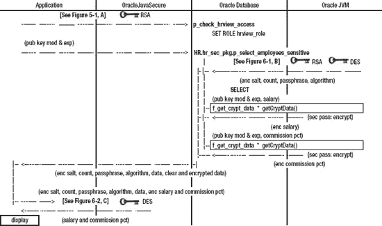
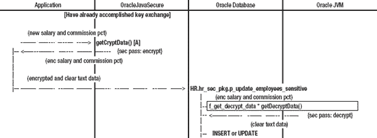

# 七、传输中的数据加密

在第 6 章中，我们为 Oracle 数据库和 Java 客户端之间的数据加密奠定了基础。我们证明了我们可以安全地交换密钥，然后来回发送加密数据，成功地在接收方和 Oracle 数据库中解密数据。

在本章中，我们将完成加密的基础，我们将继续在应用安全中构建加密，`appsec` Oracle 模式。然后，我们将扮演应用开发人员的角色，使用`appsec`结构来保护对我们数据的访问。具体来说，我们将保护对`HR`示例模式中数据的访问。

考虑最后一章，观察我们作为`appsec`用户构建和测试我们的应用安全结构和代码。并不打算让每个应用都作为`appsec`运行。相反，我们将允许每个需要我们安全性的应用执行我们的安全功能，我们将在本章中演示这一点。

此外，我们需要为开发人员提供对 Java 结构的访问，以包含在他们的桌面应用中。我们将在本章末尾讨论这一点。

### 安全管理员活动

我们的安全管理员`secadm`需要提供更多的权限。有些权限是系统特权，有些是授予`appsec`和`HR`模式中的包的。

 **注**你可以在名为*[chapter 7](#ch7)/sec ADM . SQL*的文件中找到以下命令的脚本。

以 SECADM 用户身份连接到 Oracle 数据库，并获得安全应用角色`secadm_role`。

`EXECUTE sys.p_check_secadm_access;`

我们将在`appsec`模式中为记录错误创建一个表。我们还将创建一个与该表相关联的触发器。我们的触发器就像一个在特定事件发生时运行的过程——在我们的例子中，当一条记录被插入到我们的表中时，我们的触发器就会运行。

我们希望有一个应用错误的中央表，因为错误消息可能会返回给几十或几百个应用。作为应用安全管理员，我们如何从所有这些来源获得报告？如果我们的应用开发人员是认真的，他们会让我们知道他们看到了什么问题，但我们不指望这种情况会发生。我们将从我们的远程监听站——错误表——监控错误。

#### 授予应用安全用户更多的系统权限

为了成功设置错误日志表，我们需要允许`appsec`将数据存储在表空间中。默认的表空间是“USERS”，这就足够了。我们需要指定`appsec`可以使用多少空间，一个*配额*。我们将开始允许两兆字节的空间。以`appsec`的身份执行以下操作:

`ALTER USER appsec DEFAULT TABLESPACE USERS QUOTA 2M ON USERS;`

此外，为了让`appsec`能够创建触发器，我们需要授予`CREATE TRIGGER`系统特权。我们将把它授予她的非默认角色(她只是偶尔需要它):

`GRANT CREATE TRIGGER TO appsec_role;`

#### 允许用户在其他模式下执行包

我们希望`HR`执行`appsec`安全结构。我们希望创建一个角色，我们可以向其授予对包的执行权限，然后将该角色授予任何需要它的人。然而，让我们来看看为什么这种方法并不总是有效。请考虑以下不应该执行的语句:

`--CREATE ROLE appsec_user_role NOT IDENTIFIED;
--GRANT EXECUTE ON appsec.app_sec_pkg TO appsec_user_role;
--GRANT appsec_user_role TO hr;`

具体来说，当过程、函数和包调用其他模式中的过程、函数和包时，这里说明的方法不起作用。为了超前一点，我们将在`HR`模式中创建我们希望用来执行`app_sec_pkg`包的过程(你知道，我们希望`HR`调用函数来加密数据)。

问题是`HR`过程、函数和包不能从角色获得特权。这是一个限制(基于依赖模型)，旨在防止每次我们注销或设置角色时`HR`过程失效。我们通过将对`app_sec_pkg`包的执行权直接授予`HR`用户来弥补这个限制。例如，执行以下代码:

`GRANT EXECUTE ON appsec.app_sec_pkg TO hr;`

与此形成鲜明对比的是，我们的应用用户`appusr`和其他应用用户将根据需要直接调用`HR`模式中的过程、函数和包。我们不想象`appusr`从他们自己的过程调用我们的过程。因此，我们可以将对我们的`HR`安全包`hr_sec_pkg`的访问权授予`appusr`所拥有的角色`hrview_role`。下面是 GRANT 语句，我们将在创建`hr.hr_sec_pkg`包之后执行它:

`--GRANT EXECUTE ON hr.hr_sec_pkg TO hrview_role;`

稍后我们将执行一个名为 HR.sql 的脚本，该脚本创建 hr.hr_sec_pkg 包，并执行前面的 GRANT 语句。

### 应用安全用户活动

我们将创建一个错误日志表和一个插入触发器，我们还将添加一些程序来记录到`app_sec_pkg`包中。

 **注意**你可以在名为*[chapter 7](#ch7)/appsec . SQL*的文件中找到以下命令的脚本。

以`appsec`用户身份连接到 Oracle 数据库，并将您的角色设置为非默认角色`appsec_role`:

`SET ROLE appsec_role;`

#### 创建错误记录表

接下来，创建一个错误日志记录表。您可能希望发挥 DBA 的技能，或者让 DBA 帮助您定义该表，设置其性能参数并估计初始存储和增长计划，这些都没有在此处定义。执行[清单 7-1](#list_7_1) 中的代码，使用默认值创建表格。

***清单 7-1。**创建应用安全错误日志表，`t_appsec_errors`*

`CREATE TABLE appsec.t_appsec_errors (
    err_no     NUMBER,
    err_txt    VARCHAR2(2000),
    msg_txt    VARCHAR2(4000) **DEFAULT** NULL,
    update_ts  DATE **DEFAULT** SYSDATE
);`

我们将捕获 Oracle 错误号`err_no`和文本`err_txt`，并为自己提供另一个字段`msg_txt`，用于提供有用的信息(例如，方法名或堆栈跟踪)。我们还将捕获错误的时间，`update_ts`，这在两个方面有所帮助:首先，我们想知道事情是什么时候发生的，或者正在发生什么；第二，当日志记录太旧而不再有用时，我们希望将其丢弃。

注意，清单中最后两个列定义使用关键字`DEFAULT`指定默认值。要插入记录，只需插入前两个字段。第三个默认为`NULL`，第四个默认为 Oracle 数据库上的当前日期和时间`SYSDATE`。事实上，我们不想在`UPDATE_TS`中插入日期。我们希望接受默认设置。因为`appsec`是唯一一个将在该表中输入数据的人(这是一个用于应用安全的错误日志，不是用于一般用途)，我们不需要实施默认的`UPDATE_TS`。

为了按日期完成记录的排序和选择，我们将在`UPDATE_TS`列建立一个索引。执行清单 7-2 中的代码来创建索引。

***清单 7-2。**为应用安全错误日志表的索引，`t_appsec_errors`*

`CREATE INDEX i_appsec_errors00 ON appsec.t_appsec_errors (
       update_ts
);`

索引一旦创建，就会在您插入或更新行时自动维护。此外，当您从表中选择记录时，会自动使用它们。使用哪个索引是 Oracle 数据库做出的逻辑选择，如果需要的话，可以用提示覆盖。需要注意的一点是，没有提到索引前导列的选择查询不会直接从索引中受益。例如，如果我们从`t_appsec_errors`表中选择所有行，其中`msg_txt`列包含字符串“Exception”，我们就不会直接使用我们刚刚创建的索引。如果我们在列(`update_ts, msg_txt`)上创建一个索引，这个索引也不会直接有利于我们的查询。当我们从`msg_txt`中进行选择时，为了获得索引的直接好处，我们希望创建一个索引，将`msg_txt`作为第一列，例如(`msg_txt, update_ts`)。

Oracle 数据库优化器实际上可以通过执行*跳过扫描*来使用任何索引来提高查询的性能。跳过扫描可以提高简单查询的性能，潜在地减少对全表扫描的依赖(全表扫描会导致非常差的性能)。还可以使用 skip scan 提示显式命名要使用的索引。从跳过扫描提示中获得最佳性能可能需要一些反复试验和一些工程设计。下面是一个摘自 Oracle 文档的示例。带有加号和提示名称的注释部分( **/* */** )作为对优化器的提示。

`SELECT **/*+ INDEX_SS(e emp_name_ix) */** last_name
    FROM employees e
    WHERE first_name = 'Steven';`

注意 skip scan 提示，`INDEX_SS`指示优化器使用索引`emp_name_ix`进行查询。即使我们选择了`first_name`列为‘史蒂文’的记录，我们也要求受益于`last_name`、`first_name`的索引。为了更好地理解跳过搜索优化，我建议做一个互联网搜索的例子。

您可能希望根据不同的列对`t_appsec_errors`表进行排序或选择，但是除非有一个频繁的查询需要对该列进行排序，否则您不需要索引。因为这个表实际上只用于错误后的故障排除，所以我们不期望有其他索引—我们将总是选择最近的记录(基于`update_ts`)。

我们将为准备授予 select 权限的表创建一个视图；但是，我们目前还没有想到任何可能需要查看它的人。也许将来我们会有一个精明的应用开发者，他想帮助调试他的应用对`appsec`包的使用。我们可以安排她从我们的视野中选择。执行以下操作:

`CREATE OR REPLACE VIEW appsec.v_appsec_errors AS SELECT * FROM appsec.t_appsec_errors;`

#### 创建一个表格来管理我们的错误日志表

请记住，我们只给应用安全性用户`appsec`在`USERS`表空间中提供了两兆字节的空间。创建一个表，尤其是一个日志表，而不提供任何定期清理和维护，即使不是疏忽，也是不体谅人的。

现在告诉你一个秘密:我们正在制造一个机器人。不是用来取咖啡的机械装置，而是帮助我们管理错误日志表的软件哨兵，尤其是在我们不注意的时候。我们将用一个触发器自动删除表中的旧记录，每当我们向表中插入一条记录时，该触发器就会运行。

棘手的是，管理我们的表涉及到一些工作，所以我们希望最小化管理任务发生的频率。事实上，我们只想每天管理一次错误日志表。我们也不介意知道表最后一次被管理是什么时候。实现这两个目标的最好方法是，每当管理错误日志表时，创建另一个表来存储日期。执行清单 7-3 中的代码，创建错误日志维护表。

***清单 7-3。**创建应用安全错误日志表和索引，`t_appsec_errors_maint`*

`CREATE TABLE appsec.t_appsec_errors_maint (
    update_ts DATE DEFAULT SYSDATE
);
CREATE UNIQUE INDEX i_appsec_errors_maint00 ON appsec.t_appsec_errors_maint (
       update_ts );`

同样，按日期选择对性能很重要，所以我们将在`UPDATE_TS`列(唯一的一列)上创建一个索引。

这一次，我们使它成为一个`UNIQUE`索引，这意味着我们将只有一个带有特定时间戳的条目。在我们的错误日志表上，索引不是`UNIQUE`，因为我们可能同时在表中有多个错误和条目。

`t_appsec_errors_maint`表仅供内部使用，所以我们不会创建视图，也不会在表上授予特权。

#### 创建错误日志管理程序

我们的表管理任务是由触发器发起的，但是在定义触发器之前，我们需要定义完成管理任务的过程。我们的管理过程将被命名为`p_appsec_errors_janitor`，它没有参数。

我们希望它独立运行；所以我们用修饰语`PRAGMA AUTONOMOUS_TRANSACTION`来定义。这允许过程执行插入、删除和提交更改，即使调用该事务的程序没有提交。如果没有这个修饰符，如果我们在这里发出一个 commit，我们就要求 Oracle 数据库提交我们在当前会话中所做的每个更新、插入或删除。当我们处理一个错误时，除了在日志中插入错误消息和清除旧条目之外，我们特别希望避免提交任何东西。执行清单 7-4 中的脚本来创建程序。

***清单 7-4。**管理错误日志表的程序，`p_appsec_errors_janitor`*

`CREATE OR REPLACE PROCEDURE appsec.p_appsec_errors_janitor
AS
    PRAGMA AUTONOMOUS_TRANSACTION;
    m_err_no NUMBER;
    m_err_txt VARCHAR2(2000);
BEGIN
    INSERT INTO t_appsec_errors_maint ( update_ts ) VALUES ( SYSDATE );
    COMMIT;
    -- Remove error log entries over 45 days old
    DELETE FROM t_appsec_errors WHERE update_ts < ( SYSDATE - 45 );
    COMMIT;
    INSERT INTO t_appsec_errors
        ( err_no, err_txt, msg_txt ) VALUES
        ( 0, 'No Error', 'Success managing log file by Janitor' );
    COMMIT;
EXCEPTION
    WHEN OTHERS
    THEN
        m_err_no := SQLCODE;
        m_err_txt := SQLERRM;
        INSERT INTO t_appsec_errors
            ( err_no, err_txt, msg_txt ) VALUES
            ( m_err_no, m_err_txt, 'Error managing log file by Janitor' );
        COMMIT;
END;
/`

我们的第一步(在`BEGIN`头之后)是在我们的管理表中插入当前日期。这将防止其他人也试图管理错误日志表。我们提交它，这在这里是允许的，因为我们是一个自治的事务。

第二步是删除错误日志中超过 45 天的记录。注意，我们做了一些涉及`SYSDATE`的日期运算，在这里是`SYSDATE - 45`，相当于 45 天前。我们将在触发器中使用类似的日期算法。我们也提交这一删除。

在`BEGIN`标题下的最后一件事是在错误日志中插入一个“成功”消息，并提交它。为什么不呢？那似乎是个好地方。

正如我们到目前为止看到的其他过程一样，我们将捕捉错误。在这种情况下，我们将把错误插入到我们的错误日志表中(为什么不呢？将我们所有的故障排除信息放在一个地方会很好。)并提交。

#### 创建触发器以维护错误日志表

我们上面定义的维护过程将在您每次调用它时工作，无论您如何调用它。你可以雇人每天手动运行一次这个过程。Oracle 数据库有一个调度器(`DBMS_SCHEDULER PL/SQL`包或旧的`DBMS_JOB PL/SQL`包),您可以使用它每天运行一次。

相反，我们将通过添加一个触发器来使表自治。触发器与过程有很多相似之处，所以它与我们一直在讨论的语法是一致的。执行[清单 7-5](#list_7_5) 中的代码，在`t_appsec_errors`表上创建并启用一个触发器，该触发器将在每行(日志条目)插入表中后运行。

***清单 7-5。**在错误日志表上插入触发器，`t_appsec_errors_iar`*

`CREATE OR REPLACE TRIGGER appsec.t_appsec_errors_iar
    **AFTER INSERT** ON t_appsec_errors FOR EACH ROW
DECLARE
    m_log_maint_dt DATE;
BEGIN
    **SELECT MAX( update_ts ) INTO m_log_maint_dt** FROM t_appsec_errors_maint;
    -- Whenever T_APPSEC_ERRORS_MAINT is empty, M_LOG_MAINT_DT is null
    IF( ( m_log_maint_dt IS NULL ) OR
        ( m_log_maint_dt < ( SYSDATE - 1 ) ) )
    THEN
        p_appsec_errors_janitor;
    END IF;
END;
/
ALTER TRIGGER appsec.t_appsec_errors_iar ENABLE;`

此触发器在每次插入后运行，`AFTER INSERT`；然而，我们只希望我们的过程每天运行一次。为了实现这一点，我们从`t_appsec_errors_maint`表中获取我们的过程最后一次运行的`MAX( update_ts )`，并将该日期存储在`m_log_maint_dt`中。(注意这个`SELECT INTO`语法的例子——选择一个变量的值。)然后我们检查`m_log_maint_dt`是否为`NULL`(每当`t_appsec_errors_maint`表为空时)或者`m_log_maint_dt`是否早于 24 小时前(`< SYSDATE – 1`)。如果是，那么我们运行我们的过程，`p_appsec_errors_janitor`。

#### 测试触发器

当您作为`appsec`用户连接到 Oracle 数据库时，您可以测试触发器。首先执行下面几行来插入一个错误日志条目并提交它:

`INSERT INTO appsec.v_appsec_errors (err_no, err_txt ) VALUES (1, 'DAVE' );
COMMIT;`

注意，我们的自治过程只能处理独立存在的数据。我们的插入和更新不会独立存在于数据库中，直到我们`COMMIT`数据。

还要注意，我们依赖于默认值`msg_txt`和`update_ts`——这些列不是我们的 insert 语句的一部分。

查询我们的每个表、错误日志和维护记录，观察我们之前的插入是否成功，以及看门人过程是否运行。这里有一个例子:

`SELECT * FROM appsec.v_appsec_errors ORDER BY update_ts;
SELECT * FROM appsec.t_appsec_errors_maint ORDER BY update_ts;`

现在插入一个假装 60 天的错误日志条目(注意带`SYSDATE`的算术):

`INSERT INTO appsec.v_appsec_errors (err_no, err_txt, msg_txt, update_ts)
    VALUES (2, 'DAVE', 'NONE', SYSDATE - 60 );
COMMIT;`

再次查询我们的每个表，以确保我们的插入有效，并且我们的看门人过程没有再次运行(因为它已经在这一天运行过):

`SELECT * FROM appsec.v_appsec_errors ORDER BY update_ts;
SELECT * FROM appsec.t_appsec_errors_maint ORDER BY update_ts;`

现在，将我们最后一次看门人维护运行日期的数据更改为昨天(实际上是 24 小时前)，并确保更改有效(如果您在此表中有多个条目，此`UPDATE`将不起作用。本表中`UPDATE_TS`上的指数为`UNIQUE`指数):

`UPDATE appsec.t_appsec_errors_maint SET update_ts = SYSDATE-1;
COMMIT;
SELECT * FROM appsec.t_appsec_errors_maint ORDER BY update_ts;`

并从今天开始提交另一条记录(默认，`SYSDATE`):

`INSERT INTO appsec.v_appsec_errors (err_no, err_txt ) VALUES (3, 'DAVE' );
COMMIT;`

在这些测试中，最后一次查询我们的每个表，以确保我们的插入有效，我们的看门人过程再次运行，并且模拟旧记录(带有`err_no = 2`的记录)被删除:

`SELECT * FROM appsec.v_appsec_errors ORDER BY update_ts;
SELECT * FROM appsec.t_appsec_errors_maint ORDER BY update_ts;`

### 更新应用安全包

在第 6 章的[中，我们有两个过程(`p_get_shared_passphrase`和`p_get_des_crypt_test_data`)和一个函数(`f_show_algorithm`)，我们称之为“临时的”。它们仅在第 6 章](06.html#ch6)的[中用于测试，我们将在本章的`app_sec_pkg`中删除它们。在`app_sec_pkg`中的](06.html#ch6)功能的剩余部分将会保留并且没有被改变。查看文件，*[chapter 7](#ch7)/appsec . SQL*查看完整清单。我们在本章中引入了一个新的程序:`p_log_error`。

#### 创建错误日志记录过程

`p_log_error`程序采用一个`NUMBER`和一个或两个`VARCHAR2`(文本)参数。`err_txt`字段限制为 2，000 个字符，但一个`VARCHAR2`列最多可包含 4000 个字符；因此，如果需要，我们将`m_err_txt`参数截断为 2，000 个字符，以适合我们的`err_txt`列。

注意，这个过程(包)和被更新的表在`appsec`模式中，但是调用这个过程的可能是另一个模式中的应用(比如`HR`)。我们已经将对`app_sec_pkg`包的执行权授予了`HR`用户，我们需要将执行权授予任何其他需要我们的应用安全进程的应用用户。

如果你愿意，回想一下我们定义`t_appsec_errors`表的时候。回想一下，我们将`msg_txt`和`update_ts`列设置为可空，并使用默认值(`NULL`和`SYSDATE`)。这允许我们通过为前两列提供数据元素来插入数据。我们甚至可以在不提及最后两列的情况下插入数据。其实我们说过不想给`update_ts`插入一个值；而是允许 Oracle 数据库分配当前的默认值`SYSDATE`。

好了，现在我们正在创建一个程序(如清单 7-6 中的[所示)供各种应用调用，以便将错误记录插入到我们的表中，并且该程序考虑了那些默认值。首先，过程不接受`update_ts`的值；相反，将使用默认的`SYSDATE`。第二，`msg_txt`的值有一个缺省值`NULL`，这样应用用户可以在有或者没有`msg_txt`值的情况下调用这个过程。](#list_7_6)

***清单 7-6。**插入日志条目的程序，`p_log_error`*

`    PROCEDURE p_log_error( m_err_no NUMBER, m_err_txt VARCHAR2,
        m_msg_txt VARCHAR2 DEFAULT NULL )
    IS
        l_err_txt VARCHAR2(2000);
    BEGIN
        l_err_txt := **RTRIM( SUBSTR( m_err_txt, 1, 2000 ) )**;
        INSERT INTO v_appsec_errors ( err_no, err_txt, msg_txt )
            VALUES ( m_err_no, l_err_txt, m_msg_txt );
        COMMIT;
    END p_log_error;`

我们使用`substring`函数`SUBSTR`，只获取错误文本的前 2000 个字符。然后，我们使用右修剪功能，`RTRIM`删除任何空格在右端的剩余文本。如果`m_err_txt`为`NULL`，`SUBSTR`返回一个`NULL`，`RTRIM`返回一个`NULL`。

在`p_log_error`过程的最后，我们简单地将错误数据插入到我们的错误日志表和`COMMIT`中。

#### 执行包规格和主体

执行名为*[chapter 7](#ch7)/appsec . SQL*文件中的两个块来替换`app_sec_pkg`包规范和主体。您可以看到这两个块都是以命令`CREATE OR REPLACE`开始的。因为我们已经有了一个名为`app_sec_pkg`的包，这个命令将替换它。这个命令最大的优点是我们可以在运行的 Oracle 数据库上执行它，并且使用这个包的应用不会失败。也就是说，如果封装规格不需要改变。考虑另一个选项:如果我们不得不`DROP`然后分别`CREATE`这些结构，我们将不得不等待直到 Oracle 数据库离线，或者至少直到依赖的应用不运行；否则，在`DROP`和`CREATE`之间的过渡期间，应用将会失败。

### 传输中使用和测试加密的方法

我们的工作模型不会从`OracleJavaSecure`的`main()`方法进行测试；相反，我们将展示如何作为一个独立的应用使用我们的应用安全包`app_sec_pkg`的结构。我们将在`OracleJavaSecure`类中再添加两个方法:一个用于测试，`resetKeys()`；另一个是让客户端准备加密数据以更新/插入 Oracle 数据库，`makeDESKey()`。

我们希望能够以最少的工作量从我们的客户端应用进行数据更新。最简单的工作需要以下步骤:

1.  在客户端生成 RSA 密钥，并将公钥传递给 Oracle。
2.  在 Oracle 数据库上生成 DES secret 密码密钥，用 RSA 公钥加密工件，并传递回客户端。
3.  在客户端上构建 DES 密钥的副本。
4.  用 DES 密钥加密数据并发送到 Oracle 数据库进行解密和更新。

我们已经演示了一个 Oracle 过程`p_get_shared_passphrase`，它允许我们将步骤 1 和 2 合并成一个步骤。但是，第 4 步需要第二条 Oracle 语句。因此，我们至少需要两次调用 Oracle 数据库来进行第一次更新。在同一个 Oracle 会话中，我们可以进行额外的更新，每次只需一个调用。我们只需要做一次组合步骤 1、2、3(密钥交换)；然后在建立了键之后，我们可以使用现有的键进行尽可能多的更新和插入。

#### 建立秘密口令密钥的方法

在[第六章](06.html#ch6)中，我们使用了`p_get_shared_passphrase` Oracle 过程将所有的 DES secret 密码密钥工件拿到客户端；然而，直到我们从 Oracle 数据库接收到想要在客户机上解密的加密数据，我们才构建了秘密密码密钥。

在本章中，即使没有数据要解密，我们也需要 DES 密钥。我们将在客户端进行数据加密，并将其作为独立任务发送到 Oracle 数据库。因此，我们需要一个 Java 方法来独立地构建密码密钥。清单 7-7 显示了该方法的代码。

***清单 7-7。**方法调用建立秘密密码的密钥，`makeDESKey()`T5】*

`    public static final void makeDESKey(
        RAW cryptSecretDESPassPhrase, RAW cryptSecretDESAlgorithm,
        RAW cryptSecretDESSalt, RAW cryptSecretDESIterationCount )
    {
        try {
            decryptSessionSecretDESPassPhrase( cryptSecretDESPassPhrase,
                cryptSecretDESAlgorithm, cryptSecretDESSalt,
                cryptSecretDESIterationCount );
            makeSessionSecretDESKey();
        } catch( Exception x ) {
            x.printStackTrace();
        }
    }`

在`try`块中是我们之前的`getDecryptData()`方法的大部分主体，没有实际解密数据的调用。这给我们提供了一个机会来做一些重构，改进我们代码的设计。因为我们的新方法完成了我们在`getDecryptData()`中所做的大部分工作，所以让我们重写`getDecryptData()`来调用新方法，如[清单 7-8](#list_7_8) 所示。

***清单 7-8。**用秘密密码密钥解密数据，`getDecryptData()`*

`    public static final String getDecryptData( RAW cryptData,
        RAW cryptSecretDESPassPhrase, RAW cryptSecretDESAlgorithm,
        RAW cryptSecretDESSalt, RAW cryptSecretDESIterationCount )
    {
        String rtrnString = "getDecryptData() A failed";
        try {
            if( ( null == sessionSecretDESKey ) || testAsClientAndServer ) {
                **makeDESKey**( cryptSecretDESPassPhrase, cryptSecretDESAlgorithm,
                    cryptSecretDESSalt, cryptSecretDESIterationCount );
            }
            rtrnString = getDecryptData( cryptData );
        } catch( Exception x ) {
            x.printStackTrace();
        }
        return rtrnString;
    }`

粗体文本，我们对`makeDESKey()`的调用，是我们之前已经移入`makeDESKey()`主体的代码。

#### 重置所有键的临时方法

我们添加到`OracleJavaSecure`的第二个方法是`resetKeys()`。`resetKeys()`方法仅用于本章中的测试(不过，我们将在[第 10 章](10.html#ch10)中再次提到它)。稍后我们将描述几个测试场景，其中一个将模拟在客户机上启动一个新的连接/会话(通过运行这个方法)并尝试使用 Oracle 数据库上的现有键。这个场景将会失败，但是我们将进行测试来演示这个场景。

在`resetKeys()`，[清单 7-9](#list_7_9) 中，我们将最初设置为`null`的静态成员设置回`null`。回想一下，它们是`null`，以便于为`null`测试那些变量和/或测试与其他成员的比较。我们需要最初将它们设置为`null`，以便编译通过“可能尚未初始化”错误消息。

我们还将`sessionSecretDESAlgorithm`的值重置为其预先协商的值。

***清单 7-9。**复位所有按键，`resetKeys()`*

`    public static final void resetKeys() {
        locRSAPubMod = null;
        saveExtRSAPubMod = null;
        extRSAPubKey = null;
        sessionSecretDESPassPhraseChars = null;
        sessionSecretDESKey = null;
        sessionSecretDESAlgorithm = "PBEWithSHA1AndDESede";
    }`

### 将更新的 OracleJavaSecure 类加载到 Oracle 中

以应用安全用户`appsec`、非默认角色用户`appsec_role`的身份连接或保持连接到 Oracle 数据库，并将文件 *[第 7 章](#ch7)\ orajavsec \ Oracle javasecure . Java*中的代码复制/粘贴到您的 Oracle 客户端。取消第一行的注释，然后运行脚本来替换 Oracle 数据库中的 Java 类。

`CREATE OR REPLACE AND RESOLVE JAVA SOURCE NAMED appsec."orajavsec/OracleJavaSecure" AS`

### 人力资源用户的安全结构

我们的应用加密工作模型将包括从`HR`模式中读取数据，敏感列在通过网络传输时被加密。部分责任落在了*应用*开发者身上，他们必须确保敏感数据只能以加密的形式提供给客户端。我们的应用安全模式`appsec`可以提供这些工具，但是我们的应用开发者，比如`HR`，需要实现它们。

先来探究一下`HR`是怎么加密他的数据的。然后，我们将看看应用安全管理器可以为所有应用开发人员提供什么样的模板来实现这一点。

#### 探索支持人力资源任务的权限

Oracle 提供的`HR`是一个示例模式，已经拥有各种系统特权。`HR`拥有默认角色`RESOURCE`，并通过该角色拥有以下权限列表:

`CREATE SEQUENCE,
CREATE TRIGGER,
CREATE CLUSTER,
CREATE PROCEDURE,
CREATE TYPE,
CREATE OPERATOR,
CREATE TABLE,
CREATE INDEXTYPE`

所有打算实现我们的应用安全性的应用模式都需要`CREATE PROCEDURE`系统特权。

回想一下，要访问应用安全结构，我们还需要授予每个应用模式执行`app_sec_pkg`包的对象特权，就像我们对`HR`所做的那样(已经作为`secadm`):

`GRANT EXECUTE ON appsec.app_sec_pkg TO hr;`

#### 创建人力资源安全包

`HR`将拥有自己的过程和函数包，提供对`HR`表的访问，但仅以加密形式返回任何敏感列。让我们检查一下这个包，然后在最后创建它。

 **注**你可以在名为 *[ Chapter7 ](#ch7) /HR.sql* 的文件中找到以下命令的脚本。

`CREATE OR REPLACE PACKAGE hr.hr_sec_pkg IS
    **TYPE RESULTSET_TYPE IS REF CURSOR;**`

在我们的包的规范中，我们将定义一个`TYPE`。我们将其命名为`RESULTSET_TYPE`，它将代表一个`CURSOR`，在 Java 中也称为`ResultSet`。当我们调用过程来获取我们的加密的`HR`数据时，我们将从 Oracle 数据库返回一些`OUT`参数。正如我们已经看到的，许多`OUT`参数将是我们的秘密密码密钥的工件，其中一个也可能是`RESULTSET_TYPE`，它将保存*多行加密数据*。

#### 从员工中选择敏感数据列

[清单 7-10](#list_7_10) 中的代码是一个名为`p_select_employees_sensitive`的 Oracle 过程的主体。你应该非常熟悉这种格式。用于设置秘密密码密钥工件的参数列表和代码看起来就像我们之前看到的那样。我们有一个名为`resultset_out`的`OUT`参数，它将保存一个`RESULTSET_TYPE`(数据行):

***清单 7-10。**从雇员表中选择敏感数据的程序，`p_select_employees_sensitive`*

`PROCEDURE p_select_employees_sensitive(
        ext_modulus               VARCHAR2,
        ext_exponent              VARCHAR2,
        secret_pass_salt      OUT RAW,
        secret_pass_count     OUT RAW,
        secret_pass_algorithm OUT RAW,
        secret_pass           OUT RAW,
        **resultset_out         OUT RESULTSET_TYPE**,
        m_err_no              OUT NUMBER,
        m_err_txt             OUT VARCHAR2 )
    IS BEGIN
        m_err_no := 0;
        secret_pass_salt :=
            appsec.app_sec_pkg.f_get_crypt_secret_salt( ext_modulus, ext_exponent );` `        secret_pass_count :=
            appsec.app_sec_pkg.f_get_crypt_secret_count( ext_modulus, ext_exponent );
        secret_pass :=
            appsec.app_sec_pkg.f_get_crypt_secret_pass( ext_modulus, ext_exponent );
        secret_pass_algorithm :=
            appsec.app_sec_pkg.f_get_crypt_secret_algorithm(ext_modulus, ext_exponent);
**        OPEN resultset_out FOR SELECT**
            employee_id,
            first_name,
            last_name,
            email,
            phone_number,
            hire_date,
            job_id,
            appsec.app_sec_pkg.**f_get_crypt_data**( TO_CHAR( salary ) ),
            appsec.app_sec_pkg.**f_get_crypt_data**( TO_CHAR( commission_pct ) ),
            manager_id,
            department_id
        FROM employees;
    EXCEPTION
        WHEN OTHERS THEN
            m_err_no := SQLCODE;
            m_err_txt := SQLERRM;
            appsec.app_sec_pkg.p_log_error( m_err_no, m_err_txt,
                'HR p_select_employees_sensitive' );
    END p_select_employees_sensitive;`

##### 填充结果集 _ 类型

在`p_select_employees_sensitive`过程的中间，我们打开`RESULTSET_TYPE`从查询中收集一个`CURSOR`。注意，当我们返回到客户端时，我们实际上并没有传输所有的数据；相反，我们为客户端提供了一个`CURSOR`句柄，这样客户端就可以收集和处理数据行，一次一行。

我们使用的查询选择了`EMPLOYEES`表中的所有列。注意清单 7-10 中的[，我们用这些调用加密了`SALARY`和`COMMISSION_PCT`:](#list_7_10)

`    appsec.app_sec_pkg.f_get_crypt_data( TO_CHAR( salary ) ),
    appsec.app_sec_pkg.f_get_crypt_data( TO_CHAR( commission_pct ) ),`

我们的加密方法要求我们使用`String`传递数据进行加密。`SALARY`和`COMMISSION_PCT`都是数字列，所以我们先把它们转换成`VARCHAR2`，然后传递给我们的应用安全 Java 存储过程(函数)`appsec.app_sec_pkg.f_get_crypt_data`。

该函数返回一个保存加密数据的`RAW`类型。客户端将数据解密回明文`String`。并且我们会将数据转换回它原来的类型(`Date`，数字等)。)，根据客户端的需要。

您可能会问，“但是我们不能加密非`String`数据吗？”答案是肯定的。实际上，我们可以加密任何可以表示为一个`byte`数组的东西，这实际上是任何东西，经过一些转换。然而，如果你能在屏幕上看到数据或者把它打印出来，那么你也可以把数据表示成一个`String`，当我们转换成`Strings`或者从`Strings`转换过来的时候，这通常会更清楚，而且通常情况下，我们最终无论如何都需要一个`String`。

 **注**在本章结束时，你将有一个坚实的基础来扩展我们在这里建立的加密。您将能够扩展您所学的内容，以便加密对象或 BLOBS 或其他类型的数据。

##### 记录错误信息

在过程的最后，我们捕获任何 Oracle 异常并记录错误。我们称我们的新程序为`p_log_error`。我们将在`appsec`模式中记录错误，这样我们的应用安全管理器就可以捕捉到`appsec`结构中的错误，并且可以帮助使用这些结构调试单个应用中的问题。我们不会孤立应用开发人员，但会在调试工作中提供帮助。

#### 选择所有数据作为单个敏感字符串

`HR`实现了另一种方法，加密所有选择的数据，不是作为单独的列，而是作为每行一个长的连接的`VARCHAR2`。这个过程(清单 7-11 中的`p_select_employees_secret`)和我们上次看到的唯一区别是`RESULTSET_OUT`的定义。

***清单 7-11。**将所有数据加密为单个字符串的程序部分，`p_select_employees_secret`*

`    OPEN resultset_out FOR **SELECT**
**        appsec.app_sec_pkg.f_get_crypt_data(**
            TO_CHAR( employee_id ) ||', '||
            first_name ||', '||
            last_name ||', '||
            email ||', '||
            phone_number ||', '||
            TO_CHAR( hire_date ) ||', '||
            job_id ||', '||
            TO_CHAR( salary ) ||', '||
            TO_CHAR( commission_pct ) ||', '||
            TO_CHAR( manager_id ) ||', '||
            TO_CHAR( department_id )
        )
    FROM employees;`

双管字符“`||`”是 Oracle 数据库中用来连接文本的符号。注意，我们为不属于`VARCHAR2`类型的列调用了`TO_CHAR`函数。在我们将所有这些列连接在一起之后，我们将得到的`VARCHAR2`传递给`f_get_crypt_data`函数进行加密，并在`RESULTSET_OUT`中为每行返回一个`RAW`。

请注意，在客户端，我们可能必须在解密数据后解析数据，以获得各个列。我们使用逗号作为列之间的分隔符，但是解析逗号假设数据中不存在逗号。每个应用都必须规划它们对我们的应用安全结构的使用，以及以适合其客户使用的形式提供其数据的最佳方法。对于不需要单个记录元素的客户机来说，这种串联格式可能更好。

#### 为员工 ID 选择敏感数据

我们将探索从`HR`中选择加密数据的程序的另一个例子。这个 Oracle 过程`p_select_employee_by_id_sens`与前两个过程几乎相同，除了它也采用一个表示单个`EMPLOYEE_ID`的参数。如清单 7-12 中的[所示。](#list_7_12)

***清单 7-12。**通过 ID 选择敏感数据的程序部分，`p_select_employee_by_id_sens`*

`    m_employee_id    employees.employee_id%TYPE
    ...
    OPEN resultset_out FOR SELECT
        employee_id,
        ...
    FROM employees
    **WHERE employee_id = m_employee_id;**`

对`resultset_out`参数的查询选择了`EMPLOYEE_ID`等于该输入参数的数据。

这个过程应该只返回一行数据。

#### 修改程序以获取共享密码

我们在第六章的[中看到了`p_get_shared_passphrase`程序。在这一章中，我们用错误日志来修饰它。错误日志记录可以帮助应用安全性支持应用开发人员。](06.html#ch6)

最大的变化是我们将`app_sec_pkg`包中的`p_get_shared_passphrase`放到我们自己的应用包`hr_sec_pkg`中。现在我们在`hr_sec_pkg`中有了它，这样我们的客户端应用(可能使用`hr_view`角色运行)就可以执行这个过程。我们允许`HR`执行`app_sec_pkg`结构，但是我们不允许`hr_view`这样做。因此，`hr_view`执行`HR`结构，`HR`结构执行`appsec`结构。

我们调用`p_get_shared_passphrase`并接着调用我们的新`OracleJavaSecure.makeDESKey()`方法来完成密钥交换并构建共享的秘密密码密钥。在尝试数据更新之前，我们必须这样做。

#### 更新雇员中的敏感数据列

我们现在可以对数据实施加密更新了。我们将在包`hr_sec_pkg`中定义一个如[清单 7-13](#list_7_13) 所示的过程`p_update_employees_sensitive`，以获取`EMPLOYEES`表中所有列的数据。对于敏感列，我们将提交封装加密数据的`RAW`类型。唯一的`IN`参数是表列数据，唯一的`OUT`参数是错误号和文本。注意这里缺少了什么——没有代表我们的加密密钥的参数。我们必须假设关键的交换已经发生。如果我们尚未在当前 Oracle 会话中交换密钥，则用户应用正在尝试在需要加密的字段中提交未加密的数据，或者他们正在使用不同会话中的密钥加密数据；Oracle 数据库将无法解密数据。

我们使用引用原始数据定义的锚定数据类型表单来定义参数类型。我们将这个数据类型声明锚定到前面的定义。例如，在该宣言中:

`        m_employee_id        employees.employee_id%TYPE,`

我们说`m_employee_id`参数与`EMPLOYEES`表中的`EMPLOYEE_ID`列是同一类型。我们将在适当的时候使用这种形式的“引用类型规范”来进一步建立我们正在接收的数据和它要到达的表之间的关系。这种做法至少有两个好处。第一，我们的过程将只接受适合于它将被插入或更新的字段的数据。这是对 SQL 注入攻击的进一步保护(见下一节的详细讨论)。锚定数据类型很好的第二个原因是，我们可以更改表中该列的定义，而不必同时更改这个过程。

***清单 7-13。**更新雇员表中的敏感数据，`p_update_employees_sensitive`*

`PROCEDURE p_update_employees_sensitive(
        m_employee_id        employees.employee_id%TYPE,
        m_first_name         employees.first_name%TYPE,
        m_last_name          employees.last_name%TYPE,
        m_email              employees.email%TYPE,
        m_phone_number       employees.phone_number%TYPE,
        m_hire_date          employees.hire_date%TYPE,
        m_job_id             employees.job_id%TYPE,
        **crypt_salary         RAW**,
        **crypt_commission_pct RAW**,
        m_manager_id         employees.manager_id%TYPE,
        m_department_id      employees.department_id%TYPE,
        m_err_no         OUT NUMBER,
       m_err_txt        OUT VARCHAR2 )
    IS
        test_emp_ct      NUMBER(6);
        v_salary         VARCHAR2(15); -- Plenty of space, eventually a NUMBER
        v_commission_pct VARCHAR2(15);
    BEGIN
        m_err_no := 0;
        v_salary := appsec.app_sec_pkg.f_get_decrypt_data( crypt_salary );
        v_commission_pct :=
            appsec.app_sec_pkg.f_get_decrypt_data( crypt_commission_pct );
        SELECT COUNT(*) INTO test_emp_ct FROM employees WHERE
            employee_id = m_employee_id;
        IF test_emp_ct = 0
        THEN
            INSERT INTO employees
                (employees_seq.NEXTVAL, first_name, last_name, email, phone_number,
                hire_date, job_id, salary, commission_pct, manager_id, department_id)
            VALUES
                (m_employee_id, m_first_name, m_last_name, m_email, m_phone_number,
                m_hire_date, m_job_id, v_salary, v_commission_pct, m_manager_id,
                m_department_id);
        ELSE
            -- Comment update of certain values during testing - date constraint
            UPDATE employees
            SET first_name = m_first_name, last_name = m_last_name, email = m_email,
                phone_number = m_phone_number,
                -- Job History Constraint -- hire_date = m_hire_date, job_id = m_job_id,` `                salary = v_salary, commission_pct = v_commission_pct,
                manager_id = m_manager_id
                -- Job History Constraint -- , department_id = m_department_id
            WHERE employee_id = m_employee_id;
        END IF;
    EXCEPTION
        WHEN OTHERS THEN
            m_err_no := SQLCODE;
            m_err_txt := SQLERRM;
            appsec.app_sec_pkg.p_log_error( m_err_no, m_err_txt,
                'HR p_update_employees_sensitive' );
    END p_update_employees_sensitive;

END hr_sec_pkg;
/`

##### 程序变量和数据解密

我们不能像在前面的示例过程中使用`OUT`参数那样修改`IN`参数，但是我们希望捕获解密的输出，因此我们建立了两个过程变量:`v_salary`和`v_commission_pct`。我们还定义了一个名为`test_emp_ct`的数值过程变量:

`    test_emp_ct      NUMBER(6);
    **v_salary**         VARCHAR2(15); -- Plenty of space, eventually a NUMBER
    **v_commission_pct** VARCHAR2(15);`

在`BEGIN`标题下，我们的过程体包括对`f_get_decrypt_data` Oracle 函数的两次调用，该函数将返回一个代表`SALARY`和`COMMISSION_PCT`的`VARCHAR2`数据类型。再次注意，此过程的使用假设您已经完成了密钥交换:

`    m_err_no := 0;
    v_salary := appsec.app_sec_pkg.**f_get_decrypt_data**( crypt_salary );
    v_commission_pct :=
        appsec.app_sec_pkg.**f_get_decrypt_data**( crypt_commission_pct );`

##### 插入或更新

我发现多功能过程通常是管理数据插入和更新的最佳选择。最多，我们给数据视图授予`SELECT`特权，给管理过程授予`EXECUTE`特权。我们定期传递一个事务代码(通常是 A、U 或 D ),它指示我们是否要插入(添加)、更新或删除一个记录。对于一个简单的双功能过程(插入或更新)，我们不需要事务代码，但可以检查数据并 1)更新现有记录或 2)如果没有现有记录与键列匹配，则插入新记录。

在我们的管理过程主体中，我们将通过使用`SELECT INTO`语法来填充`test_emp_ct`,其中包含其`EMPLOYEE_ID`与被传入进行更新的`m_employee_id`相匹配的员工数量。不应该有超过一个，所以我们期望从计数中得到 0 或 1 的值。

`    SELECT COUNT(*) INTO test_emp_ct FROM employees WHERE
        employee_id = m_employee_id;`

然后我们测试看`test_emp_ct`是否为 0——如果是，我们做一个`INSERT`；如果不是，一个`UPDATE`:

`    IF test_emp_ct = 0
    THEN
        **INSERT** INTO employees
            ...
    ELSE
        **UPDATE** employees
        SET first_name = m_first_name, last_name = m_last_name, email = m_email,
            phone_number = m_phone_number, hire_date = m_hire_date,
            -- **Job History Constraint** -- job_id = m_job_id,
            salary = v_salary, commission_pct = v_commission_pct,
            manager_id = m_manager_id
            -- **Job History Constraint** -- , department_id = m_department_id
        WHERE employee_id = m_employee_id;
    END IF IF;`

##### 雇员表上的完整性约束

您将在前面的代码中看到，我们跳过了更新两列:`JOB_ID`和`DEPARTMENT_ID`。原因是在`EMPLOYEES`表上有一个现有的触发器，当`EMPLOYEES`记录中的这两列中的任何一列被更新时，该触发器会在`JOB_HISTORY`中插入一条记录。触发代码如[清单 7-14](#list_7_14) 所示。

***清单 7-14。**对雇员表的现有完整性约束，`HR.update_job_history`*

`CREATE OR REPLACE TRIGGER HR.update_job_history
  AFTER **UPDATE OF job_id, department_id ON HR.EMPLOYEES** FOR EACH ROW
BEGIN
  **add_job_history**(:old.employee_id, :old.hire_date, sysdate,
                  :old.job_id, :old.department_id);
END;`

你可以在清单 7-14 的[中看到触发器](#list_7_14)调用一个过程`add_job_history`。这个过程所做的只是将一条记录记录到`JOB_HISTORY`表中。然而，`JOB_HISTORY`表包含一个关于(`EMPLOYEE_ID,` **开始日期**)的`UNIQUE`索引。

总结一下这个问题:如果您试图一天多次更新一个`EMPLOYEES` ' `JOB_ID`或`DEPARTMENT_ID`，它会失败，因为触发器不能在同一天为同一个用户在`JOB_HISTORY`表中插入另一个记录。这是一个商业规则，`HR`示例模式的开发人员通过一个`UNIQUE`索引来强制执行——雇员一天内不能换工作超过一次。

**更新触发器语法**

我想指出触发器语法的一个方面。你看到清单 7-14 中的[前缀了吗？该前缀表示我们正在使用表中已经存在的值。因为这是一个 AFTER UPDATE 触发器，所以表中存在的值与我们在更新中提交的值相同。这在数据更新后运行。](#list_7_14)

通常，触发器可用于测试、过滤和操作提交到表中的数据，然后再进行存储。例如，如果我正在更新一个雇员的姓氏，我可能会说:

`update employees set last_name = ‘coffin’ where employee_id = 700;`

如果我们要求所有的`last_name`条目都是大写字母，这可能会是个问题！我们可以用一个`BEFORE UPDATE OR INSERT`触发器来捕捉并纠正这个问题。在我们的触发器中间，我们可能会说:

`:new.last_name := upper(:new.last_name);`

这将使我们提交给姓氏的新值大写。如果我们想抱怨用户试图用已经存在的相同姓氏更新姓氏，我们可以将大写的新值与旧值进行比较，如下所示:

`IF :new.last_name = :old.last_name
THEN
     Raise_Application_Error(-20000, 'Same last name as before!');`

一个`BEFORE UPDATE`触发器可以访问数据库中的现有值(`:old`)和正在提交的新值(`:new`)。这种能力经常在触发器中使用。

#### 避免 SQL 注入

如果计算机用户保存了提交数据的网页的 html 源，并且能够修改该网页以发送通常不被允许的数据，那么这将是交叉视线脚本的一个例子(用户自己的网页是一个站点，向另一个站点的 web 服务器提交数据。)例如，您可能有一个提交地址的邮政编码并且只允许数字数据的网页。我可能会恶意修改网页，使我的副本在邮政编码字段中提交一个 web 链接(URL)。对跨站点脚本的唯一真正预防是假设它总是会发生，并在服务器上采取措施来捕捉和处理它。

也许您的 web 页面向 Oracle 数据库提交数据，恶意用户修改了您的 web 页面的副本，以便在邮政编码字段中提交 Oracle SQL 或 PL/SQL 命令。黑客可能会将此代码放在字段“`11111;delete from employees;--`”中。如果您构建的动态查询只是将提交的数据嵌入到查询中，那么不用执行:

`UPDATE EMPLOYEES SET ZIP=**11111** WHERE EMPLOYEE_ID=300;`

您可以执行这组命令:

`UPDATE EMPLOYEES SET ZIP=**11111;delete from employees;**-- WHERE EMPLOYEE_ID=300;`

这相当于三行代码:对所有雇员的更新，删除雇员的所有记录，以及一个注释。这是 SQL 注入的一个例子。

典型的 SQL 注入攻击通过附加一个对所有数据都适用的 where 测试来修改 select 语句。例如，如果我接受用户输入姓氏来搜索雇员，并且用户键入“King”或“a”=“a”，我的动态 SQL 可能如下所示:

`SELECT * FROM EMPLOYEES WHERE LAST_NAME=**'King' or 'a'='a';**`

如果这是一个密码匹配 Oracle 数据库中存储的值的测试，那么 SQL 注入可能如下所示:

`SELECT count(*) FROM EMPLOYEES WHERE LAST_NAME='King' and
PASSWORD=**'whatever' or 'a'='a';**`

select 语句将返回一个大于 0 的数字，即使用户不知道密码，他也可能获得访问权限。

在 Oracle 数据库中，您可以通过几种方法来防止 SQL 注入的发生。一种传统的方法是过滤传入的数据和/或对数据进行转义(使其成为单个字符的序列，而不是文本。)然而，更好的方法是始终使用参数化输入。我们用带参数的存储过程来实现这一点。我们不是在构建动态查询，而是将参数抽取到已经在 Oracle 数据库中暂存的 PL/SQL 中。数据库*将变量*绑定到我们的查询/更新框架。

我们还可以通过如下 Java 语句阻止客户端的 SQL 注入。`userInputEmpID`的值在问号(？).

`String query = "SELECT * FROM EMPLOYEES WHERE EMPLOYEE_ID = **?** ";
PreparedStatement pstmt = connection.prepareStatement( query );
pstmt.setString( 1, **userInputEmpID** );`

让一个`PreparedStatement`接受我们的参数并用它填充查询，可以防止恶意代码被添加到查询中。再一次，`PreparedStatement`存放在 Oracle 数据库中，我们的参数在那里设置，Oracle 数据库将它们绑定到更新/查询。

如果您需要在应用(java 或其他)中放置 Oracle 数据库查询的代码，请使用`PreparedStatement`，如前所述，而不是将用户输入连接到查询字符串中。

#### 证明存储过程中的 SQL 注入失败

我在`hr_sec_pkg`中增加了两个过程，它们将展示在存储过程中 SQL 注入的尝试。我不是来自密苏里州，但我来自“展示自我”的心态:信任，但要核实。让我们在对`LAST_NAME`进行选择查询时尝试一下 SQL 注入。在[清单 7-15](#list_7_15) 、`p_select_employee_by_ln_sens`中部分显示的过程中，我们将传入第十个参数`LAST_NAME`，并修改我们在过程中的选择以使用它:

***清单 7-15。**按姓氏选择雇员数据并尝试 SQL 注入*

`    PROCEDURE p_select_employee_by_ln_sens(
        ...
        **m_last_name**    employees.last_name%TYPE )
    IS BEGIN
        ...
        OPEN resultset_out FOR SELECT
            ...
        FROM employees
        **WHERE last_name = m_last_name;**`

让我们看看是否可以通过将 SQL 注入包含在`RAW`中(就像我们对加密数据更新所做的那样)并将`RAW`转换为`WHERE`子句中的`VARCHAR2`,来偷偷加入一些。我们在清单 7-16 的[中的一个名为`p_select_employee_by_raw_sens`的测试过程中完成了这个任务。](#list_7_16)

***清单 7-16。**通过原始值选择员工数据并尝试 SQL 注入*

`PROCEDURE p_select_employee_by_raw_sens(
        ...
        m_last_name    RAW )
    IS BEGIN
        ...
        OPEN resultset_out FOR SELECT
            ...` `        FROM employees
        **WHERE last_name = UTL_RAW.CAST_TO_VARCHAR2( m_last_name )**;`

你会很高兴地注意到，当我们测试这一点，这些企图逃避是不成功的。在这两种情况下，正如预期的那样，Oracle 数据库会说，“给我一些东西插入测试`WHERE LAST_NAME = ?;`”。

我们将为 Oracle 数据库提供这个字符串:“King”或“a”=“a”，人们可能会想象用单引号将它括起来:

`    WHERE LAST_NAME = 'King' or 'a'='a';`

然而，Oracle 数据库将我们的字符串视为一个*单个数据元素*，并检查是否有人的`LAST_NAME`是(以转义形式):" King\ '或\'a\'=\'a "或" {King '或' a'='a} "。

#### 执行人力资源包规范和主体

既然我们已经描述了`hr_sec_pkg`包中的过程，我们将继续执行包规范和包主体的`CREATE`语句。执行名为 *[Chapter7](#ch7) /HR.sql* 文件中的两个块，创建`hr_sec_pkg`包规范和主体。在您创建了`hr_sec_pkg`之后，您需要将包的 execute 权限授予`hrview_role`角色

`GRANT EXECUTE ON hr.hr_sec_pkg TO hrview_role;`

### 插入雇员记录:更新序列

为了让我们的示例代码能够工作，我们需要一个固定的`EMPLOYEE_ID`，数字 300 作为`EMPLOYEES`表中的记录。当最初安装样本`EMPLOYEES`表时，大约有 100 条记录，`EMPLOYEE_ID`从 100 到大约 200。一般来说，插入到`EMPLOYEES`表中会使用*序列的下一个值*，`EMPLOYEES_SEQ`，如下所示(暂时不要执行，仅供参考):

`    INSERT INTO employees
        (employee_id, first_name, last_name, email, phone_number, hire_date,
        job_id, salary, commission_pct, manager_id, department_id)
    VALUES
        (**employees_seq.NEXTVAL**, 'David', 'Coffin', 'DAVID.COFFIN',
        '800.555.1212', SYSDATE, 'SA_REP', 5000, 0.20, 147, 80);`

每次调用`SEQUENCE.NEXTVAL`时，该值都会递增。要查看`EMPLOYEES_SEQ`的当前(下一个)值，执行以下命令:

`SELECT last_number FROM user_sequences WHERE sequence_name='EMPLOYEES_SEQ';`

 **注**你可以在名为 *[ Chapter7 ](#ch7) /HR.sql* 的文件中找到本节命令的脚本。

没有认可的方法来手动设置序列的`LAST_NUMBER`。但是，我们可以调整增量值来获得想要的效果。首先，确保上面命令中返回的电流`LAST_NUMBER`小于 300(我们的例子是`EMPLOYEE_ID`)。)如果不是，您可能需要替换一个比我们示例代码中的`LAST_NUMBER`大的数字，或者更新`EMPLOYEE_ID` 300 处的数据。

要设置在`EMPLOYEE_ID` = 300 处插入我们的示例`EMPLOYEES`记录，我们需要让`EMPLOYEES_SEQ`的`LAST_NUMBER`等于 300，我们将使用匿名(未命名)PL/SQL 块来完成。这不会保存到一个命名的存储过程中，而是执行一次来完成我们的计划。

 **注意**我们使用`user_sequences`视图中的`LAST_NUMBER`代替序列的当前值`CURRVAL`。我们这样做是因为我们在这个会话中可能没有`CURRVAL`。`CURRVAL`仅在我们在此会话中对序列执行`NEXTVAL`后存在。然后我们可以得到序列的当前值。

参见[清单 7-17](#list_7_17) 。我们有一个`NUMBER`、`offset`，我们从序列中选择值(300–`LAST_NUMBER`)放入其中。例如，如果我们的`LAST_NUMBER`当前是 207，`offset`的值将是 300–207 或 93。我们将一个命令字符串`alter_command`连接到`ALTER`序列，将`INCREMENT BY`值设置为那个`offset`。我们将那个`ALTER`命令传递给`EXECUTE IMMEDIATE`。那么下一次我们调用`EMPLOYEES_SEQ.NEXTVAL`的时候，就会得到 207 + 93 = 300 的值。为了完成这个计划，我们将序列的`INCREMENT BY`值设置回 1。

此时*执行[清单 7-17](#list_7_17) 中的所有命令。*您将创建我们的测试用户为`employee_id` = 300。请随意在最后的`INSERT`命令中插入您自己的个人数据。

***清单 7-17。**匿名 PL/SQL 块重置序列*

`**DECLARE**
    offset NUMBER;
    alter_command VARCHAR2(100);
    new_last_number NUMBER;
BEGIN
    **SELECT (300 - last_number) INTO offset** FROM user_sequences
        WHERE sequence_name='EMPLOYEES_SEQ';

    alter_command := **'ALTER SEQUENCE employees_seq INCREMENT BY** ' ||
        TO_CHAR(offset) || ' MINVALUE 0';
    EXECUTE IMMEDIATE alter_command;

    SELECT **employees_seq.NEXTVAL** INTO new_last_number FROM DUAL;
    DBMS_OUTPUT.PUT_LINE( new_last_number );

    EXECUTE IMMEDIATE 'ALTER SEQUENCE employees_seq INCREMENT BY 1';
END;
/

SELECT last_number FROM user_sequences WHERE sequence_name='EMPLOYEES_SEQ';

INSERT INTO employees
    (employee_id, first_name, last_name, email, phone_number, hire_date,
    job_id, salary, commission_pct, manager_id, department_id)
VALUES
    (**employees_seq.NEXTVAL**, 'David', 'Coffin', 'DAVID.COFFIN',` `    '800.555.1212', SYSDATE, 'SA_REP', 5000, 0.20, 147, 80);

COMMIT;`

在不插入记录的情况下递增序列的一种强力方式是将`SELECT SEQUENCE.NEXTVAL`足够多次。您也可以将`INCREMENT BY`值设置为负数，以减少序列中`LAST_NUMBER`的值。

我们可以通过再次选择`EMPLOYEES_SEQ`来查看新的`LAST_NUMBER`设置。确保它是 300，然后插入我们的示例记录`EMPLOYEE_ID` = 300。终于`COMMIT`更新了。通过选择查看我们的新条目:

`SELECT * FROM employees WHERE employee_id=300;`

我应该提到在名为`SECURE_DML`的`EMPLOYEES`表上有一个现有的`INSERT` / `UPDATE` / `DELETE`触发器。该触发器限制将`EMPLOYEES`数据更改为工作日的上午 8 点到下午 6 点。这类似于我们在第 2 章中实施的限制。但是，默认情况下，此触发器是禁用的。

### 加密数据交换的演示和测试

我们将执行一个单独的 Java 类，`TestOracleJavaSecure`来模拟`HR`模式的客户端应用。我们的客户端应用将调用我们在`hr_sec_pkg`中定义的存储过程，进行一些查询和一些更新。

我们将只探索应用代码的几个大小片段。当我们浏览这一部分时，您应该打开 *`TestOracleJavaSecure.java`* 文件进行参考。

 **注**你可以在文件*[chapter 7](#ch7)/testoraclejavasecure . Java*中找到这段代码。

#### 一些预备步骤

在我们开始大规模的个人演示和测试之前，我们想弄清楚我们的方向。接下来的几个小节为后面的演示和测试做好了准备。

##### main()方法和方法成员

`TestOracleJavaSecure`类的全部代码都驻留在`main()`方法中。所以，当我们从命令行用这个类调用 Java 时，我们简单地从上到下运行代码。

我们在`main()`方法中做的第一件事是建立一个 Oracle 连接，如[清单 7-18](#list_7_18) 所示。编辑连接字符串，以使用您分配给应用用户`appusr`的密码，以及您的特定服务器名称和端口。

***清单 7-18。**测试传输中加密的代码开头，`TestOracleJavaSecure`类*

`public class TestOracleJavaSecure {
    public static void main( String[] args ) {
        Connection conn = null;
        try {` `            private static String appusrConnString =
                "jdbc:oracle:thin:AppUsr/password@localhost:1521:Orcl";
            Class.forName( "oracle.jdbc.driver.OracleDriver" );
            conn = DriverManager.getConnection( appusrConnString );`

##### 准备加密

我们不需要`OracleJavaSecure`中的`Connection`,因为我们不会直接从那个类中调用 Oracle 数据库。客户端上`OracleJavaSecure`的唯一功能(在本章中)是建立密钥和加密/解密数据。参见清单 7-19 。

***清单 7-19。**准备加密*

`    //OracleJavaSecure.setConnection( conn );
    String locModulus = OracleJavaSecure.getLocRSAPubMod();
    String locExponent = OracleJavaSecure.getLocRSAPubExp();`

我们得到 RSA 密钥对，并得到公钥指数和模数以传递给 Oracle 数据库。

##### 设置非默认角色

`appusr`用户有权限执行`appsec.p_check_hrview_access`程序(回头参考[第二章](02.html#ch2)，该程序将设置安全应用角色`hrview_role`。我们执行如清单 7-20 所示的程序。

***清单 7-20。**设置非默认角色*

`    stmt = ( OracleCallableStatement )conn.prepareCall(
        "CALL appsec.**p_check_hrview_access()**" );
    // Comment next line to see Exception when non-default role not set
    stmt.executeUpdate();`

为了获得角色，我们需要执行语句。如果您想确保没有该角色的访问将会失败，请将该行注释为`executeUpdate()`并运行`TestOracleJavaSecure`。确保在运行测试之后取消注释该行，这样您就可以运行我们的主要测试。

##### 重用可调用语句

由于`OracleCallableStatement`是实现`Statement`的接口，我们可以像普通的`Statement`一样使用它。可以反复使用常规的`Statement`来执行查询和更新。然而，以我的经验来看，如果您有来自您的`OracleCallableStatement`调用的过程的`OUT`参数，那么您不应该重用它——只需要获得一个新的`OracleCallableStatement`。

在清单 7-20 中设置我们角色的第一个调用，给我们留下了一个`OracleCallableStatement`，我们可以重用它来获得`EMPLOYEES`的非敏感视图中的行数。我们将通过两种方式对行进行计数，如清单 7-21 所示:一次是通过遍历所有行的`ResultSet`，递增我们的计数，`cnt`；一次通过选择所有行的`count(*)`。选择`count(*)`是一种更有效的方式:

***清单 7-21。**获得员工公共视图中的行数*

`    rset = stmt.executeQuery(
        "SELECT * FROM hr.v_employees_public" );
    int cnt = 0;
    **while( rset.next() ) cnt++;**
    System.out.println( "Count data in V_EMPLOYEES_PUBLIC: " + cnt );

    rset = stmt.executeQuery(
        "SELECT COUNT(*) FROM hr.v_employees_public" );
    if( rset.next() ) **cnt = rset.getInt(1)**;
    System.out.println( "Count data in V_EMPLOYEES_PUBLIC: " + cnt );

    if( null != stmt ) stmt.close();`

#### 从员工中选择加密数据

这里是我们从 Oracle 数据库中选择加密数据的教科书过程，[清单 7-22](#list_7_22) 。它类似于我们在上一章中使用的测试程序。我们将公钥模数和指数传递给 Oracle 数据库，并接收回我们的 DES 加密密码密钥的加密工件。此外，我们还有一个类型为`OracleTypes.CURSOR`的`OUT`参数。我们将利用`OracleTypes.CURSOR`(Java 中的`ResultSet`)来读取我们的数据。

***清单 7-22。** Java 代码从员工中选择敏感数据，来自`p_select_employees_sensitive`*

`stmt = ( OracleCallableStatement )conn.prepareCall(
        "CALL hr.hr_sec_pkg.**p_select_employees_sensitive**(?,?,?,?,?,?,?,?,?)" );
    stmt.registerOutParameter( 3, OracleTypes.RAW );
    stmt.registerOutParameter( 4, OracleTypes.RAW );
    stmt.registerOutParameter( 5, OracleTypes.RAW );
    stmt.registerOutParameter( 6, OracleTypes.RAW );
    stmt.registerOutParameter( 7, **OracleTypes.CURSOR** );
    stmt.registerOutParameter( 8, OracleTypes.NUMBER );
    stmt.registerOutParameter( 9, OracleTypes.VARCHAR );
    stmt.setString( 1, locModulus );
    stmt.setString( 2, locExponent );
    stmt.setNull(   3, OracleTypes.RAW );
    stmt.setNull(   4, OracleTypes.RAW );
    stmt.setNull(   5, OracleTypes.RAW );
    stmt.setNull(   6, OracleTypes.RAW );
    // This must go without saying - unsupported type for setNull
    //stmt.setNull( 7, OracleTypes.CURSOR );
    stmt.setInt(    8, 0 );
    stmt.setNull(   9, OracleTypes.VARCHAR );
    stmt.executeUpdate();

    errNo = stmt.getInt( 8 );
    if( errNo != 0 ) {
        errMsg = stmt.getString( 9 );
        System.out.println( "Oracle error 1) " + errNo +` `            ", " + errMsg );
    } else {
        System.out.println( "Oracle success 1)" );
        sessionSecretDESSalt = stmt.getRAW( 3 );
        sessionSecretDESIterationCount = stmt.getRAW( 4 );
        sessionSecretDESAlgorithm = stmt.getRAW( 5 );
        sessionSecretDESPassPhrase = stmt.getRAW( 6 );
        **rs = ( OracleResultSet )stmt.getCursor( 7 )**;
        //while( rs.next() ) {
        // Only show first row
        if( rs.next() ) {
            System.out.print( rs.getString( 1 ) );
            System.out.print( ", " );
            System.out.print( rs.getString( 2 ) );
            System.out.print( ", " );
            System.out.print( rs.getString( 3 ) );
            System.out.print( ", " );
            System.out.print( rs.getString( 4 ) );
            System.out.print( ", " );
            System.out.print( rs.getString( 5 ) );
            System.out.print( ", " );
            System.out.print( rs.getString( 6 ) );
            System.out.print( ", " );
            System.out.print( rs.getString( 7 ) );
            System.out.print( ", " );
            System.out.print( OracleJavaSecure.**getDecryptData(**
                **rs.getRAW( 8 )**, sessionSecretDESPassPhrase,
                sessionSecretDESAlgorithm, sessionSecretDESSalt,
                sessionSecretDESIterationCount ) );
            if ( null != rs.getRAW( 8 ) )
                System.out.**print**( " (" + **rs.getRAW( 8 ).stringValue()** +
                        ")" );
            System.out.print( ", " );
            // Most initial commissions in database are null
            System.out.print( OracleJavaSecure.getDecryptData(
                rs.getRAW( 9 ), sessionSecretDESPassPhrase,
                sessionSecretDESAlgorithm, sessionSecretDESSalt,
                sessionSecretDESIterationCount ) );
            if ( null != rs.getRAW( 9 ) )
                System.out.print( " (" + rs.getRAW( 9 ).stringValue() +
                        ")" );
            System.out.print( ", " );
            System.out.print( rs.getString( 10 ) );
            System.out.print( ", " );
            System.out.print( rs.getString( 11 ) );
            System.out.print( "\n" );
        }
    }
    if( null != rs ) rs.close();
    if( null != stmt ) **stmt.close()**;`

我们的错误处理与我们在上一章中所做的相同:我们通过两个`OUT`参数返回错误号和消息。如果没有错误，我们继续将密码密钥工件放入本地方法成员中，我们还将`CURSOR`放入`ResultSet`中，这样我们就可以遍历数据了。由于`EMPLOYEES`表中大约有 100 个条目，我们将只显示第一个条目(通过读取`if`块中的`ResultSet.next()`而不是`while`块中的】。

大多数列都是明文，所以我们只需将它们打印出来。但是`SALARY`和`COMMISSION_PCT`值是由 Oracle 数据库作为`RAW`加密数据交给我们的。(注意加密的`SALARY`在`ResultSet`的第 8 个位置位置，而`ResultSet`在`Statement`的第 7 个位置。那些元素的编号是独立的。)我们将把这些`RAW`值发送给`getDecryptData()`方法，同时发送的还有秘密密码密钥工件。如果我们还没有构建秘密密码密钥的本地副本，我们将在那里构建它；在任何情况下，我们都会解密数据，并将其作为`String`返回。我们也会把它打印出来。

仅出于演示目的，我们还将打印出实际的`RAW`(如果不是`null`)，放在括号“()”内。如果我们想在这段代码的多次运行中跟踪它，我们会发现每次都不一样——因为在不同的 Oracle 会话中使用了不同的密码密钥。

在每次调用我们的存储过程进行数据加密时，我们将关闭`OracleCallableStatement`。我们也可以关闭`ResultSet`，尽管这是不必要的——当我们关闭`Statement`时，它本来就是关闭的，因为它是通过`Statement`获得的。然而，显式关闭每个`ResultSet`是一种好的做法，特别是因为重用一个`Statement`是一种常见的做法——在单个`Statement`的生命周期中，您可能会打开多个`ResultSets`,并且为了确保您正在释放 Oracle 资源，您应该在使用完每个`ResultSet`后关闭它。

#### 选择加密字符串中的所有列

我们从 Oracle 数据库中选择加密数据的第二个示例过程`p_select_employees_secret`不是选择并加密单个列，而是选择所有列，并将它们连接成一个逗号分隔的要加密的`VARCHAR2`。在这种情况下，没有任何数据以明文形式发送。在客户端，如果需要单独的数据列，您将需要解析解密的字符串以获取单独的数据元素。

同样在这个例子中，我们使用逗号作为字段之间的分隔符。这假设数据中没有逗号——这通常不是一个有效的假设。您可以使用其他不太可能出现在数据中的分隔符，如插入符号(^)or 波浪号(~)。这只是一个示例，在为您的应用构建这样的过程之前，您需要评估您对数据的特定要求。

我们调用这个过程，解密数据并打印结果，如清单 7-23 中的部分[所示。](#list_7_23)

***清单 7-23。**加密从员工中选择的所有数据，来自`p_select_employees_secret`*

`stmt = ( OracleCallableStatement )conn.prepareCall(
        "CALL hr.hr_sec_pkg.p_select_employees_secret(?,?,?,?,?,?,?,?,?)" );
        ...
        if( rs.next() ) {
            System.out.**print**( OracleJavaSecure.**getDecryptData( rs.getRAW( 1 )**,
                sessionSecretDESPassPhrase,
                sessionSecretDESAlgorithm, sessionSecretDESSalt,
                sessionSecretDESIterationCount ) );
            if( null != rs.getRAW( 1 ) )
                System.out.**print**( " (" + **rs.getRAW( 1 ).stringValue()** +
                    ")" );` `            System.out.print( "\n" );`

同样，我们将加密的`RAW`的`String`值打印在数据旁边的括号中。在这种情况下，有一个单独的`RAW`代表整个串联数据行。

#### 将加密数据发送到 Oracle 数据库进行插入/更新

我不会说下一个示例过程与我们前面的示例没有相似之处，但是您会注意到在两个方向上都没有密钥交换的痕迹。这是一个更新，为了在客户端加密数据，我们已经交换了密钥。[清单 7-24](#list_7_24) 显示了调用我们的加密数据更新过程`p_update_employees_sensitive`的代码。

***清单 7-24。**更新员工中的敏感数据，调用`p_update_employees_sensitive`*

`    stmt = ( OracleCallableStatement )conn.prepareCall(
        "CALL hr.hr_sec_pkg.**p_update_employees_sensitive**(?,?,?,?,?,?,?,?,?,?,?,?,?)" );
    stmt.registerOutParameter( 12, OracleTypes.NUMBER );
    stmt.registerOutParameter( 13, OracleTypes.VARCHAR );
    stmt.setInt(    1, 300 );
    stmt.setString( 2, "David" );
    stmt.setString( 3, "Coffin" );
    stmt.setString( 4, "DAVID.COFFIN" );
    stmt.setString( 5, "800.555.1212" );
    stmt.setDate(   6, new Date( ( new java.util.Date() ).getTime() ) );
    stmt.setString( 7, "SA_REP" );
    // Note - may not have locModulus, locExponent,  at this time!
    **stmt.setRAW(    8, OracleJavaSecure.getCryptData( "9000.25" ) )**;
    **stmt.setRAW(    9, OracleJavaSecure.getCryptData( "0.15" ) )**;
    stmt.setInt(   10, 147 );
    stmt.setInt(   11, 80 );
    stmt.setInt(   12, 0 );
    stmt.setNull(  13, OracleTypes.VARCHAR );
    stmt.executeUpdate();

    errNo = stmt.getInt( 12 );
    if( errNo != 0 ) {
        errMsg = stmt.getString( 13 );
        System.out.println( "Oracle error 3) " + errNo + ", " + errMsg );
    }
    else System.out.println( "Oracle success 3)" );
    if( null != stmt ) stmt.close();`

对于我们的加密数据，我们首先调用`getCryptData()`方法。然后，我们在 Oracle 过程中设置一个`RAW`参数。当我们执行此语句时，明文和加密数据值都被发送到 Oracle 数据库进行插入或更新，这由过程决定。

**两个日期类的故事**

和我们之前的例子一样，在这里的[清单 7-24](#list_7_24) 中，我们正在设置我们的参数，除了这一次，我们正在设置数据而不是关键工件。在我们的第六个参数中，我们实例化了一个`java.util.Date` 类。不带参数的构造函数创建一个带有当前日期和时间的`Date`。对于 Oracle 数据库，我们经常会使用`java.sql.Date`的实例(注意包 *java.sql* 而不是 *java.util* )，它没有这样的构造函数；然而，我们可以用来自`java.util.Date.getTime()`方法的 long(毫秒)来构造一个`java.sql.Date`。我们也可以使用与`java.util.Date()`构造函数相同的语句来实例化一个`java.sql.Date`对象，如下所示:

`java.sql.Date( System.currentTimeMillis() );`

对于我们在代码中使用的语法，我有一个观察。我们实例化的`( new java.util.Date() )`周围的括号允许我们直接访问它作为一个对象，访问它的`getTime()`方法，就像这样:

`    stmt.setDate(   6, **new Date( ( new java.util.Date() ).getTime())**);`

好吧，那么为什么`java.sql.Date`没有一个`Date()`构造函数，它不是通过扩展`java.util.Date`继承了一个吗？哦，好问题！简单的回答是，构造函数不被认为是类的成员，所以它们不会被子类继承。然而，您可以通过调用`super()`方法作为任何子类构造函数的第一行来访问父构造函数。可以有多个具有不同签名的`super()`方法，每个方法对应父类中的一个构造函数。

我们将在第 9 章的[中再次回到 *java.sql* 和*Java . util*T0】的主题。我们需要交换日期的标准做法，我将在那里提出一个。](09.html#ch9)

#### 从雇员中选择单个行

也许我们不想选择整个表，而只想选择满足特定条件的记录。我们可以在查询中提供标准作为`WHERE`子句的一部分。在这个过程中，`p_select_employee_by_id_sens`，[清单 7-25](#list_7_25) ，我们提供了第十个参数，`EMPLOYEE_ID`。

***清单 7-25。**按 ID 选择，敏感数据来自员工，来自`p_select_employee_by_id_sens`*

`    stmt = ( OracleCallableStatement )conn.prepareCall(
        "CALL hr.hr_sec_pkg.p_select_employee_by_id_sens(?,?,?,?,?,?,?,?,?,?)" );
    ...
    **stmt.setInt(   10, 300 )**; // Employee ID 300
    stmt.executeUpdate();`

过程调用的其余部分与我们之前的查询示例相同，除了我们只期望返回一条或零条记录(`EMPLOYEE_ID`是该表的一个`UNIQUE`键)。)所以我们可以在一个`if( rs.next() )`块中处理`ResultSet`，而不是`while( rs.next() )`。

#### 按姓氏选择雇员数据:尝试 SQL 注入

我们还可以查询满足其他一些标准的所有记录，这些标准可能不是`UNIQUE`。在部分[清单 7-26](#list_7_26) 中，我们将展示`LAST_NAME`使用`p_select_employee_by_ln_sens`过程进行的查询`EMPLOYEES`的一个例子。有两个条目带有`LAST_NAME`“国王”。所以这将返回两行。

***清单 7-26。**按姓氏选择，敏感数据来自员工，来自`p_select_employee_by_ln_sens`*

`stmt = ( OracleCallableStatement )conn.prepareCall(` `        "CALL hr.hr_sec_pkg.p_select_employee_by_ln_sens(?,?,?,?,?,?,?,?,?,?)" );
    ...
    stmt.setString(   10, "King" ); // Employees Janette and Steven King
    ...
    while( rs.next() ) {`

使用`while`块遍历`ResultSet`以查看所有返回的行。

我们可以尝试 SQL 注入，将之前的参数 10 设置替换为以下内容:

`    stmt.setString(   10, "King' or 'a'='a" );`

我们将看到的是*没有数据返回*，因为没有`EMPLOYEES`有`LAST_NAME`{ King’或‘a’=‘a }。

#### 通过 RAW 选择员工数据:尝试 SQL 注入

也许有人会想，如果我们把数据作为一个`RAW`返回，并且只在做出选择的时候把它转换成一个`VARCHAR2`，我们就可以突破并完成 SQL 注入(参考 Oracle 过程，`p_select_employee_by_raw_sens`，我们在前面和清单 7-16 中描述过它)。)这个过程调用，部分[清单 7-27](#list_7_27) ，尝试了那个策略。

***清单 7-27。**通过原始值选择，敏感数据来自员工，来自`p_select_employee_by_raw_sens`*

`    stmt = ( OracleCallableStatement )conn.prepareCall(
        "CALL hr.hr_sec_pkg.p_select_employee_by_raw_sens(?,?,?,?,?,?,?,?,?,?)" );
    ...
    stmt.setRAW(   10, new RAW("King' or 'a'='a".**getBytes()**) );`

您将再次看到，我们在存储过程中对 SQL 注入的尝试失败了。与在动态 SQL 中嵌入用户提供的文本相反，传递参数似乎非常抵制 SQL 注入。

还要注意我们如何对待引号之间的值，就好像它已经是一个`String`对象，调用`getBytes()`方法。我们首先在《T2》第六章中看到了这一点。

#### 使用新的客户端密钥测试加密失败

也许你需要亲眼看看，也许不需要。在任何情况下，如果客户机上的键与 Oracle 数据库上的键不匹配，您都可以测试调用过程:它将失败。请注意，到目前为止，在 Java 代码的`TestOracleJavaSecure.main()`方法中，我们已经交换了密钥，这些密钥将继续工作。我们将在一瞬间移除或禁用客户端上的密钥。我们通过调用`resetKeys()`方法来做到这一点(参见[清单 7-28](#list_7_28) )。

***清单 7-28。**用混合密钥测试加密*

`    OracleJavaSecure.resetKeys(); // Method for [Chapter 7](#ch7) testing only
    locModulus = OracleJavaSecure.getLocRSAPubMod();
    locExponent = OracleJavaSecure.getLocRSAPubExp();`

我们还通过调用`getLocRSAPubMod()`方法在客户端建立新的密钥，并获得公共模数和指数。如果我们不努力将这些公钥工件传递给 Oracle 数据库并检索新的密码密钥工件作为回报，那么更新(不交换密钥)将会失败。这就是我们将要测试的。

请注意，我们不太可能会意外重置我们的键，多次调用`getLocRSAPubMod()`方法或`OracleJavaSecure`的其他方法不会创建新的键(如果它们已经存在)，而是会返回现有的键。这些键是`static`，所以只要 Java 虚拟机继续运行，它们就不会自己消失。所以，这个测试真的只是为了好玩:回答一个“如果”的问题。

#### 新 Oracle 连接测试失败

我们可以演示的另一个测试是我们关闭 Oracle 数据库的`Connection`并建立一个新数据库的场景。服务器端密钥将会消失——客户端公钥和密码密钥都将消失。我们可以重置`Connection`并准备调用我们的加密程序，方法是将我们的安全应用角色设置为`HRVIEW_ROLE`，如清单 7-29 中的[所示。](#list_7_29)

***清单 7-29。**重置连接并重置安全应用角色*

`    if ( null != conn ) conn.close();
    conn = DriverManager.getConnection( appusrConnString );
    OracleJavaSecure.setConnection( conn );
    stmt = ( OracleCallableStatement )conn.prepareCall(
        "CALL appsec.p_check_hrview_access()" );
    stmt.executeUpdate();`

同样，在进行加密的 Oracle 更新的情况下，我们将看到一个失败，因为 Oracle 数据库既没有公钥也没有密码密钥。这段代码最初是注释的。

#### 一些结束语

我已经在前面的章节中介绍了所有的大型演示和测试。现在，轮到您修改测试并尝试自己的测试了。请随意评论和取消评论我们刚刚描述的那些测试代码部分。当您重新编译并运行`TestOracleJavaSecure`的这些部分时，您将看到一条关于尝试数据更新的消息，表明我们“在预期的地方失败了——没问题”

##### 如果您需要关闭/打开您的连接

当我们选择加密数据时，重置您的 Oracle 连接会带来另一个潜在的问题，因为我们肯定会将我们的公钥传递给 Oracle 数据库，而数据库会构建密码密钥并将其交还。但是，我们仍然在客户机上保留一份旧的秘密密码密钥，解密数据时会遇到问题。在我们尝试解密数据之前，我们可以通过立即调用`OracleJavaSecure.makeDESKey()`方法，在客户机上获取并解密秘密的密码密钥工件之后进行补救。

我认为最好的经验法则，以及对代码审查清单的检查，是在查询和更新期间保持 Oracle 连接。如果有长时间的暂停，并且您需要关闭 Oracle 连接，那么当您打开一个新的连接时，通过`p_get_shared_passphrase`过程将您的公钥工件传递到 Oracle 数据库(如下所述),并通过调用`makeDESKey()`方法在客户机上构建一个替换的密码密钥。

##### 运行无数据加密的基本密钥交换

当我们只想向 Oracle 数据库提交加密的数据更新时，或者我们想在进行任何选择之前做好更新准备时，我们需要确保我们事先已经交换了密钥。我们可以通过调用`p_get_shared_passphrase`过程来实现(在我们当前的设计中，这个过程必须包含在每个单独的应用包中，比如`hr_sec_pkg`)。[清单 7-30](#list_7_30) 展示了从 Java 客户端进行基本密钥交换的基础。

***清单 7-30。**基本密钥交换*

`    stmt = ( OracleCallableStatement )conn.prepareCall(
        "CALL hr.hr_sec_pkg.p_get_shared_passphrase(?,?,?,?,?,?,?,?)" );
...
    OracleJavaSecure.makeDESKey( sessionSecretDESPassPhrase,
        sessionSecretDESAlgorithm, sessionSecretDESSalt,
        sessionSecretDESIterationCount );`

我们将获得并解密我们的秘密密码密钥的每个工件，并将其传递给`makeDESKey()`方法。此时，我们已经完成了密钥交换，并准备好交换加密数据，并在客户端和 Oracle 数据库上进行解密。

在我们调用了`p_get_shared_passphrase`过程和`OracleJavaSecure.makeDESKey()`之后，`TestOracleJavaSecure`类将再次尝试进行加密数据更新，并将成功。

### 执行演示和测试

我们现在将运行我们的演示和测试。为此，我们将根据需要再次编辑我们的代码，然后编译并运行它。在命令提示符下，将目录更改为 *[第七章](#ch7)* 。编辑*TestOracleJavaSecure.java*如果还没有，将`appusr`的正确密码和正确的主机和端口号放入 Oracle 连接字符串，靠近顶部。

`    private static String appusrConnString =
        "jdbc:oracle:thin:appusr/password@localhost:1521:Orcl";`

用这些命令编译代码，或者只编译第二个命令，第二个命令会自动编译第一个命令(确保对*OracleJavaSecure.java*的第一行进行了注释，这一行指向`CREATE`Oracle 数据库中的 Java 结构)。

`javac orajavsec/OracleJavaSecure.java
javac TestOracleJavaSecure.java`

然后使用以下命令运行同一目录中的代码:

`java TestOracleJavaSecure`

#### 观察结果

当您执行`TestOracleJavaSecure`(分布式的)时，前面列出的所有测试将从上到下直接运行。结果将如下所示:

`Count data in V_EMPLOYEES_PUBLIC: 108
Count data in V_EMPLOYEES_PUBLIC: 108
Oracle success 1)` `198, Donald, OConnell, DOCONNEL, 650.507.9833, 2007-06-21 00:00:00, SH_CLERK, 2600 (E27811A8C7C9D9F3), null, 124, 50
Oracle success 2)
198, Donald, OConnell, DOCONNEL, 650.507.9833, 21-JUN-07, SH_CLERK, 2600, , 124, 50 (F7EA4E97B2F39E036AF6E880B2E5CA3EB78332BF8CE82B7585A4CBC7B340FEBDE4862830927
D118D27A1DDE3304478D9A463EBA9BC78E3188217884D5F5EA92F54A6EA2FB62598D1419F003295D
F1C076E48BC6D07058E3B)
Oracle success 3)
Oracle success 4)
300, David, Coffin, DAVID.COFFIN, 800.555.1212, 2010-08-30 00:00:00, SA_REP, 9000.25, .15, 147, 80
Oracle success 5) No data on failed SQL Injection
Oracle success 6) No data on failed SQL Injection
Failed where expected - OK. Need key exchange.
Oracle success 8)
Oracle success 9)`

#### 演示场景

这里用相对简单的英语列出了我们演示过的场景。有大量的代码来完成所有这些不同的场景。每个场景的代码与其他一些场景非常相似，只是针对特定的演示进行了修改。

*   我们查询了`EMPLOYEES`表，得到了加密形式的`SALARY`和`COMMISSION_PCT`列。对于这两者，我们打印出解密的`String`，在括号中，是加密的`RAW`的`stringValue()`(除非为空)。我们只展示了`ResultSet`的第一排。
*   我们查询了该表，并以加密的形式将所有列放回一个串联的`String`中。我们打印解密的数据，在括号中是加密的`RAW`的`stringValue()`。同样，我们只显示了第一行。
*   我们对`EMPLOYEES`表进行插入或更新，插入`EMPLOYEE_ID = 300`。如果它已经存在，我们进行更新。到那时工资是 9000.25(现在我在做梦)。
*   我们从`EMPLOYEES`中选择一行，请求数据`WHERE EMPLOYEE_ID = 300`。
*   我们试图用一个样本 SQL 注入字符串在我们的过程中查询`EMPLOYEES`。这将失败，并且不会返回任何数据。
*   我们再次尝试使用示例 SQL 注入字符串通过我们的过程查询`EMPLOYEES`，这一次是作为`RAW`传输的，只有在执行`SELECT`时才会被转换。这同样会失败，并且不会返回任何数据。
*   我们也可以编译`TestOracleJavaSecure`来测试重置客户端密钥或重置 Oracle 连接。之后，我们向 Oracle 数据库发送加密数据进行插入/更新的尝试失败了，这是意料之中的。
*   我们成功地调用了`p_get_shared_passphrase`过程并运行了`makeDESKey()`方法来完成密钥交换。
*   同样，我们将加密的数据发送到 Oracle 数据库进行插入/更新，我们成功了。现在工资 9700.75(现在老婆在做梦)。

#### 查询员工以查看更新

通过作为`HR`用户连接到 Oracle 数据库并执行以下命令，您可以看到我们插入/更新的记录的状态:

`SELECT * FROM employees WHERE employee_id=300;`

### 打包模板实现加密

我知道人们发现安全成本，就像质量成本一样，令人不快；但不安全的潜在成本高得离谱。我们的安全结构只有投入使用才有价值。我们将在接下来的几章中增加一些价值，但就目前的情况来看，让人们使用我们的安全结构可能就像拔牙一样困难。这不是那种“如果你建造了它，他们就会来”的时刻。

我们将通过为应用开发人员提供模板来降低进入这些安全结构的门槛，他们可以使用这些模板来快速实现其应用的后端 Oracle 结构，以及对这些结构的前端 Java 调用。

#### Oracle 应用安全结构模板

我们将提供给开发人员的第一个文件提供了 Oracle 安全包的代码，他们需要在他们的应用模式中实现该包。在该文件中，有应用模式、包、过程、表/视图和列的通用名称。开发人员应该搜索这些名称，并用他们将使用的实际名称替换它们。

 **注**你可以在 *[这个文件第 7 章](#ch7) /AppPkgTemplate.sql* 。

您的安全管理员`secadm`需要将`appsec.app_sec_pkg`上的 execute 授予开发人员的应用模式用户，这样应用就可以使用`app_sec_pkg`过程和函数。

为了创建应用包，开发人员将需要`CREATE PROCEDURE`系统权限。此外，为了让应用用户使用应用包，所有应用用户都需要被授予包的`EXECUTE`对象权限。

我们的软件包中有四个模板程序:

`    p_get_shared_passphrase
    p_select_APPTABLE_sensitive
    p_select_APPTABLE_by_COLUMN1_sens
    p_update_APPTABLE_sensitive`

这里没有向您介绍任何新的东西——您已经看到了在`HR`模式中使用的所有这些结构。

#### 【Java 调用应用安全的模板

我们还将为我们的应用开发人员提供一个模板 Java 文件。每个开发人员将搜索和替换模式、表、过程等的通用名称。应用中任何合适的名称。

 **注**你可以在 *[第七章](#ch7)/**AppJavaTemplate.java*中找到`AppAccessSecure`模板类的 Java 代码。

这个文件与我们在`HR`模式、*TestOracleJavaSecure.java*中的结构测试代码非常相似。它由一个`main()`方法组成，该方法建立一个 Oracle 连接并调用开发人员将在应用模式中定义的应用结构。

对于应用开发人员来说，这可能是最令人生畏的代码，因为需要进行大量的密钥交换。你现在是专家了，所以你最好给你的应用开发者一些帮助。事实上，如果您能够帮助开发人员正确地实现这一点，并避免任何安全缺陷，就像我们对`HR.EMPLOYEES`表所做的那样，这将会为您省去一些麻烦。

#### 应用使用的 Java 档案

除了为您的开发人员提供这两个模板文件之外，您还需要为他们提供*orajavsec/Oracle javasecure . class*文件。我建议你不要给开发人员 OracleJavaSecure.java 的*代码文件，只是为了保证你的组织中没有使用这个类的修改版本。*

可能用于分发类文件的最佳形式是 Java 归档(JAR)文件的形式。要创建合适的 jar 文件进行分发，可以运行 JDK 附带的 JAR 工具。如果你的`PATH`和`CLASSPATH`仍然按照[第二章](02.html#ch2)中的描述设置，你可以得到一个命令提示窗口，将目录切换到*第七章第七章*目录。从那里，执行以下命令:

`jar cvf orajavsec.jar orajavsec/OracleJavaSecure.class`

这将在当前目录下创建一个名为 *orajavsec.jar* 的文件。分发这个文件，并指示您的应用开发人员在开发期间和运行他们的应用代码时将这个文件名放在他们的`CLASSPATH`中。

### 现在不要停止

有了模板，我们就可以让 Oracle 应用开发人员了解网络上的加密数据，而您最好选择一款应用，并将其配置为使用这些结构和方法，以开辟道路。但这只是安全喘息的中途之家。我们将在接下来的章节中介绍一些强大的概念，这些概念将会吸引你的应用开发人员继续使用这个程序。步入安全的应用开发和操作就像找回自己的生活。安全感是一种幸福感。这需要努力，但有了努力，你就能决定自己的安全计算命运。

### 章节回顾

我们将在第 6 章中学到的密钥交换和数据加密概念应用于一个特定的 Oracle 应用，即`HR`模式。这是科学史上的伟大时刻之一吗？也许不是，但这是一个里程碑，是我们在应用安全性方面取得更大、更好成就的跳板。我们已经成功加密了通过网络传输的敏感应用数据。

我们构建了错误日志记录的结构，专门用于跟踪涉及我们的应用安全流程的错误和事件，而不管什么客户端应用当前正在使用它们。此外，我们构建了一个触发器来自动管理日志，丢弃超过 45 天的记录。

本章介绍了许多代码，包括 PL/SQL 和 Java。这段代码的目标相当简单——当从`HR`模式中检索敏感数据和记录时，以及当更新敏感数据和记录时，使用我们现有的数据加密过程。

一路上，我介绍了以下概念:

*   使用性能索引
*   触发器、自主事务和`COMMIT`
*   序列的使用和操作
*   默认程序参数
*   `CURSOR TYPE`的使用
*   通过引用使用类型规范，数据类型的锚定声明
*   使用`java.util.Date`和`java.sql.Date`

我们花了大量时间评估和测试我们对 SQL 注入攻击的防护能力。

最后，我们展示了可以交付给应用程序员的模板，以便他们可以在自己的应用中实现这些安全结构。

请研究[图 7-1](#fig_7_1) 和[图 7-2](#fig_7_2) 以获得安全应用数据查询和更新过程的直观概述。[图 7-1](#fig_7_1) 展示了在 Oracle 数据库中查询敏感数据并以加密形式检索的过程。在顶部，您可以看到对[图 5-1](05.html#fig_5_1)**【A】**的引用，这是我们看到在客户端上创建 RSA 私钥/公钥对的地方。然后在[图 7-1](#fig_7_1) 中，我们看到客户端调用`p_check_hrview_access`来设置访问敏感`HR`数据的角色。

此时，我们拥有调用`hr_sec_pkg`包的执行特权。我们调用`p_select_employees_sensitive`从`EMPLOYEES`表中获取公共和敏感数据。首要任务是完成密钥交换。您可以在图 7-1 的右侧看到，我们在 Oracle 数据库上创建了一个等效的 RSA 公钥，我们创建了将返回给客户端的加密密码(DES)密钥。我们在图 6-1**【B】**中看到了那个过程的细节。

Oracle 数据库上该过程的下一步是查询`EMPLOYEES`表并加密`SALARY`和`COMMISSION_PCT`字段。最后，该过程向客户端返回数据，包括明文字段和敏感字段的加密形式。

回到客户端(图 7-1 的左侧)，我们基于 Oracle 数据库返回的工件构建一个等价的密码密钥。请参见插图底部的关键图像。然后我们显示来自`ResultSet`的数据，使用秘密密码密钥解密敏感数据组件。

***图 7-1。**安全应用数据查询*

[图 7-2](#fig_7_2) 说明了敏感数据的更新过程。在这个过程中，我们使用密码密钥对客户端的敏感数据进行加密。我们通过调用`getCryptData()`方法来实现。然后，我们通过调用`p_update_employees_sensitive`过程将明文字段和加密的敏感字段提交给 Oracle 数据库。

密钥交换必须已经发生，以便 Oracle 数据库可以使用等效的(原始)密码密钥来解密数据。然后程序执行一个`INSERT`或`UPDATE`命令来存储数据。

***图 7-2。**安全应用数据更新*