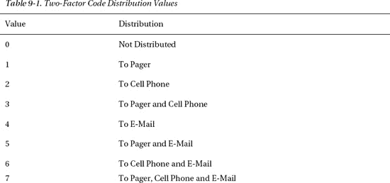
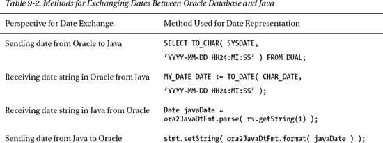
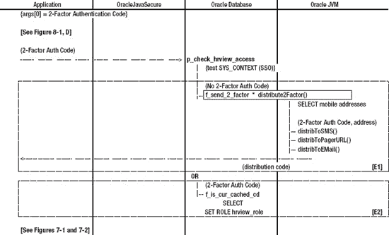

## C H A P T E R 9

## 双因素认证

如果没有冒名顶替者，没有江湖骗子，没有小偷，生活会是什么样子？抱歉，这个反问句不能提供任何保障。戴上一副玫瑰色的眼镜，仅仅因为我们实施了实质性的安全措施，就认为我们是安全的，这也是不行的。我们总是容易受到诡计和粗心大意的影响。即使是正直的同事，最薄弱的环节也总是走捷径的人。社会工程学和对我们的计算机安全行为准则(比如，不写下您的密码，不共享您的密码，使用复杂的密码，定期更改您的密码)的缺乏关注，给了窃贼进入我们最安全的系统的入口。

因此，我们正在寻找对身份的进一步限制，以确保坐在键盘前的人是他们声称的那个人。为了实现这一点，计算机安全领域正在做许多事情，例如:

*   需要第二个密码或 PIN 码。
*   通过让一个人输入一个非计算机可读的单词图形表示(称为 CAPTCHA ),确保计算机旁边有一个人而不是一个自动程序，CAPTCHA 代表完全自动化的公共图灵测试，以区分计算机和人类(部分以计算机科学和人工智能之父艾伦·图灵命名)。
*   要求用户回答个人问题，比如给出他们第一只宠物的名字。
*   拥有生物扫描仪，如指纹、视网膜或面部识别。
*   具有安全 ID 令牌，该令牌将代码与服务器同步，以提供一次性密码以及 PIN 代码。
*   到单独帐户或设备的带外通信，例如，发送到您的电子邮件、寻呼机或手机的密码。

这些努力中的一些可以被认为是双因素认证。将它们结合起来，甚至可以实现三因素认证。例如:

> 1)您知道的(密码和 PIN)
> 
> 2)你是谁(人类和生物特征)
> 
> 3)您拥有的东西(安全 ID 令牌或手机)

也许第二个密码或额外的 PIN 也可以被认为是双因素身份验证，但不是那么重要。这仍然只是你所知道的。

我们将实施双因素身份验证，使用第 8 章中的单点登录和一个代码，我们会将该代码发送到一个单独的帐户，最好是在单独的设备上。我们将向传呼机、手机发送密码，如果前两者都不可用，作为最后的手段，我们还会向电子邮件帐户发送密码。

### 让 Oracle 数据库发送电子邮件

我们的双因素身份验证将主要联系寻呼机和手机，而不会将密码发送到用户的电子邮件帐户。但是，我们将有电子邮件选项。此外，向商用手机发送消息的最简单方法是使用手机提供商的短消息服务(SMS ),即经常接受发往手机的电子邮件消息的短信主机。因此，我们将从 Oracle 数据库实现电子邮件。

Oracle 数据库提供了一个名为`UTL_MAIL`的包，使我们能够从数据库发送电子邮件。我们将落实这一点；不过，我们也可以加载一个 Java 类来发送电子邮件，并将其配置为从 Java 存储过程执行。也许我们会使用 JavaMail API，或者我们可能会打开一个普通的 Java `Socket`并向其中写入简单邮件传输协议(SMTP)命令(这样我们就不必将 JavaMail *mail.jar* 文件加载到 Oracle 数据库中)。在这一章的后面，我们将调用一个 Java 存储过程来读取一个网页，发送电子邮件也可以类似地完成。

#### 安装 UTL 邮件

默认情况下，Oracle 数据库中不会安装`UTL_MAIL`包。我们必须手动安装它。其实我们会让`SYS`用户帮我们安装。该包驻留在两个文件中，这两个文件位于一个类似于以下路径的服务器目录中:*Oracle \ product \ 11 . 2 . 0 \ dbhome _ 1 \ RDBMS \ ADMIN*。这些文件名为 *utlmail.sql* 和 *prvtmail.plb* 。

一个*。plb* 文件是一个包装的 PL/SQL 文件。包装的文件可以被认为是混淆的(不容易阅读)，但不是加密的。包装格式给逆向工程带来了严重的困难，但并没有阻止它；尽管如此，你需要成为一名黑客来获得资源来打开文件。要创建包装的过程、函数、包或类型，您需要传递一个*。sql* 文件，包含 wrap 实用程序的那些结构的`CREATE`语句(随 Oracle 数据库软件提供)。这就产生了一个不可逆的*。plb* 文件。请确保您保存了原始文件*的存档。sql* 文件放在一个安全的位置，以防您需要编辑它。包装的包文件用于隐藏 PL/SQL 代码，可能是为了保护知识产权或增加安全性。

作为`SYS`，你或者你的 DBA 朋友需要依次打开这些文件中的每一个: *utlmail.sql* 然后*prvtmail . plb*；并在数据库中执行它们。这可以通过 TOAD 完成，例如，将文件加载到 SQL 编辑器中，并作为脚本执行。从 SQL*Plus 中，`SYS`可以运行:

`@C:\app\oracle\product\11.2.0\dbhome_1\RDBMS\ADMIN\utlmail.sql

@C:\app\oracle\product\11.2.0\dbhome_1\RDBMS\ADMIN\prvtmail.plb`

 **注意**你可以在名为 *[的文件中找到这些命令第 9 章](#ch9) /Sys.sql.*

#### 授予访问 UTL _ 邮件的权限

我们只允许一个 Oracle 用户访问`UTL_MAIL`包:用户`appsec`。我们将在`app_sec_pkg`包中包含代码，以使用`UTL_MAIL`发送双因素密码。首先，让我们的安全管理员，`secadm`用户在数据库访问控制列表(ACL)中创建条目。让`SYS`进行[清单 9-1](#list_9_1) 中所示的授权，包括对`UTL_MAIL`包到`appsec_role`的授权执行。

***清单 9-1。**授权访问 UTL 邮件，作为系统用户*

`GRANT EXECUTE ON sys.dbms_network_acl_admin TO secadm_role;
GRANT EXECUTE ON sys.utl_mail TO appsec_role;`

然后作为`secadm`用户，执行[清单 9-2](#list_9_2) 中的命令来建立访问控制列表(ACL)条目，这将允许`appsec`打开端口 25 并发送电子邮件。确保编辑清单中的第二个命令，将您公司的 SMTP 服务器的名称插入到“host”字段中。

***清单 9-2。** ACL 条目发送电子邮件，作为 Secadm 用户*

`BEGIN
  DBMS_NETWORK_ACL_ADMIN.CREATE_ACL (

    acl          => 'smtp_acl_file.xml',
    description  => 'Using SMTP server',
    principal    => 'APPSEC',
    is_grant     => TRUE,
    privilege    => 'connect',
    start_date   => SYSTIMESTAMP,
    end_date     => NULL);

  COMMIT;

END;
/

BEGIN
  DBMS_NETWORK_ACL_ADMIN.ASSIGN_ACL (

    acl         => 'smtp_acl_file.xml',
    host        => 'smtp.org.com',
    lower_port  => 25,
    upper_port  => NULL);
  COMMIT;

END;
/`

 **注意**你可以在名为*[chapter 9](#ch9)/sec ADM . SQL .*的文件中找到[清单 9-2](#list_9_2) 中命令的脚本

你会注意到这种语法与我们在调用过程时所习惯的完全不同。毕竟，这些只是对默认安装在 Oracle 数据库中的`DBMS_NETWORK_ACL_ADMIN`包中的`CREATE_ACL`和`ASSIGN_ACL`过程的调用。在[清单 9-2](#list_9_2) 中，我们使用*命名符号*指定这些程序的参数，与我们通常的*位置符号*相反。(我在这里给出了命名符号，因为我看到的每个例子都使用了那个符号；我们可能都只是复制 Oracle 文档中给出的例子)。

在命名符号中，分配给每个参数的值在定义的参数名称和赋值运算符`=>`后给出，例如`acl => 'smtp_acl_file.xml'`。当我们使用位置符号调用一个过程时，我们按照参数在过程中定义的顺序列出参数(因此得名*位置*)；但是在命名符号中，顺序并不重要。

位置表示法和命名表示法之间的另一个区别是如何处理可选参数。您可能还记得，我们的错误记录表`t_appsec_errors`，有两个可选参数`msg_txt`和`update_ts`。它们是可选的，因为我们用默认值配置了它们。`update_ts`的默认值为`SYSDATE`。在我们的`p_log_error`过程中，我们从不为`update_ts`提供值。我们需要默认的系统日期。

回到当前的主题:在位置表示法中，只有在所有必需参数之后定义的可选参数可以被忽略。使用命名符号，我们可以跳过提供可选参数，不管它们出现在参数定义中的什么位置，只要我们通过名称为所有必需的参数提供值。

在[清单 9-2 中调用的两个过程](#list_9_2)、`CREATE_ACL`和`ASSIGN_ACL`中，可选参数是为每个过程定义的最后两个，因此没有令人信服的理由使用命名符号调用这些过程。此外，我列出的两个调用为每个参数提供了一个值(或 NULL ),包括可选参数。

再次以`SYS`用户或`DBA`的身份，您可以列出 ACL 以确保您的条目已经完成。执行这些查询:

`SELECT * FROM sys.dba_network_acls;
SELECT * FROM sys.dba_network_acl_privileges;`

第一个命令的结果将如下所示:

`"HOST"         "LOWER_PORT" "UPPER_PORT" "ACL"                         "ACLID"
"smtp.org.com" "25"         "25"         "/sys/acls/smtp_acl_file.xml" "004B...`

第二个命令的结果将如下所示:

`"ACL"                         "ACLID"  "PRINCIPAL" "PRIVILEGE" "IS_GRANT" ...
"/sys/acls/smtp_acl_file.xml" "004B... "APPSEC"    "connect"   "true"     ...`

#### 测试发送电子邮件

当我们在这里时，我们应该执行一个测试，以确保我们可以发送电子邮件。我们将作为我们的应用安全用户来执行测试。我很抱歉在这些账户之间跳来跳去，但我们正在委派任务，并在每一步检查我们的工作。

 **注意**你可以在名为*[chapter 9](#ch9)/app sec . SQL*的文件中找到本节要遵循的命令的脚本。

我们已经为`appsec`配置了网络 ACL，以便能够在您的 SMTP 邮件主机上打开端口 25，但是对于每个会话，我们还需要告诉`UTL_MAIL`包使用该服务器作为我们的 SMTP 主机。作为`appsec`，我们向 Oracle 会话添加了一个属性，`UTL_MAIL`包将读取该属性:

`ALTER SESSION SET SMTP_OUT_SERVER = 'smtp.org.com';`

然后我们发送一封电子邮件。我们提供的参数是我们的电子邮件地址、收件人地址、消息标题和消息文本。

`CALL UTL_MAIL.SEND( 'myname@org.com', 'myname@org.com', '', '',
    'Response','2FactorCode' );`

### 让 Oracle 数据库浏览网页

除了通过电子邮件/SMS 向手机(可能还有电子邮件帐户)发送双因素身份验证密码之外，我们还将向寻呼机发送密码。在我们公司，我们通过网页界面向公司寻呼机发送文本消息。这可能是也可能不是您向寻呼机分发双因素身份验证密码时需要采用的方法；但是，它与任何消息分发都相关，因为电子邮件和 web 服务是用户应用中文本消息分发的主要模式。

#### 将 Java 策略委托给安全管理员

我们已经看到了如何添加 ACL 来允许用户打开端口。现在，为了将端口作为 Java 存储过程打开，我们需要授予 Java 安全权限。实际上，我们允许 Java 执行通常被 Oracle JVM 安全沙箱拒绝的活动。

首先，我们将让`SYS`或`DBA`将管理特定 Java 沙箱特权的策略许可委托给我们的安全管理员`secadm`用户。作为`SYS`，用[清单 9-3](#list_9_3) 中的代码做这件事。

***清单 9-3。**授予安全管理员授予套接字权限的策略*

`CALL DBMS_JAVA.GRANT_POLICY_PERMISSION(
    'SECADM_ROLE', 'SYS',
    'java.net.SocketPermission',

    '*');

COMMIT;`

`DBMS_JAVA.GRANT_POLICY_PERMISSION`命令将`secadm_role`指定为许可的接收者。`SYS`是授权有效的模式。被授予的许可类型是`SocketPermission`。并且`secadm_role`由此可以管理任何插座(`*`)。

使用以下命令确保 Java 策略权限已被授予。这些策略被授予一个被授予者编号`GRANTEE#`。我们在用户编号`USER#`与被授权者编号匹配的`USER$`表中查找该用户的名称。

`SELECT u.user#, u.name, p.name, p.type_name, p.action
FROM sys.user$ u, sys.java$policy$ p
WHERE p.name LIKE '%java.net.SocketPermission%'

AND p.grantee# = u.user#;`

这个查询的结果将类似如下。`JAVA_ADMIN`拥有对`SocketPermission`的安装授权。

`"USER#" "NAME"        "NAME_1"                        "TYPE_NAME"
"40"    "JAVA_ADMIN"  "0:java.net.SocketPermission#*" "oracle.aurora.rdbms...

"93"    "SECADM_ROLE" "0:java.net.SocketPermission#*" "oracle.aurora.rdbms...`

我们将管理关于打开套接字(网络端口)的策略的有限权限委托给了`secadm_role`。我们可能会授予其他策略，比如关于在 Oracle 服务器文件系统上打开文件的策略，但是我们在这里不需要它。

#### 允许应用安全用户阅读网页

现在，作为`secadm`用户，让我们为我们的应用安全性授予许可，即`appsec`用户，实际打开一个到 web 服务器的端口，该服务器向我们公司的寻呼机发送文本消息。根据需要更改 web 服务器的名称和端口号，然后以`secadm`用户的身份执行[清单 9-4](#list_9_4) 中的代码。

***清单 9-4。**授予应用安全用户套接字权限*

`CALL DBMS_JAVA.GRANT_PERMISSION(
    'APPSEC',
    'java.net.SocketPermission',

    'www.org.com:80',
    'connect, resolve'
);`

通过这个 Java 许可授权，我们极大地限制了实际可以做的事情。

*   我们将只允许在特定端口连接到特定服务器，例如*[【www.org.com:80】](http://www.org.com:80)。*
*   我们将只允许一个用户打开连接，`appsec.`
*   我们将只允许“连接”和“解析”操作，这些操作足以读取一个网页(并通过`GET`方法在 URL 中提交数据)。我们需要`resolve`操作，以便我们(在 Oracle 数据库中)可以对(例如)`[www.org.com](http://www.org.com)`进行 DNS 查找/名称解析，找到 IP 地址。我们需要`connect`动作，这样我们就可以在网络端口上建立连接。这些是 Oracle JVM 安全沙箱默认不允许的操作。

对`GRANT_PERMISSION`的调用可能会抛出“未捕获的 Java 异常”错误。我们无法解决这个问题，没什么好担心的。也许 Oracle 不希望我们从 SQL 命令行调用`DBMS_JAVA`包中的过程。

测试我们在 Oracle 数据库上从 Java 读取 web 页面的能力需要我们配置一个 Java 存储过程并更新我们的 Java 代码。在我们写完代码之后，让我们等待并测试功能完整的代码。

### 双因素认证流程

我们将让 Oracle 应用尝试读取我们保护的敏感数据。我们将要求这些应用首先进行数据库身份验证；他们需要通过我们的单点登录测试，这在第 8 章中有描述。然后，他们需要请求并接收我们将从 Oracle 数据库发送给他们的双因素密码。我们将在本章中实现请求和接收双因素密码的过程。

一旦用户收到双因素密码，他们将提交该密码以及数据请求(并进行我们在第 7 章中讨论过的加密密钥交换)。此时，如果用户并拢脚跟说“没有什么地方比得上家”，他将回到堪萨斯州，按照授权读取和更新数据。

这里有一个问题:我们不能假设这种双因素代码交换是即时的；否则，我们只需要双因素代码交换和数据请求发生在同一个会话中。相反，我们需要在 Oracle 数据库中缓存双因素代码一段时间，以确保用户和代码的一致性。关于用户的某些其他事实也需要关联，比如发出请求的计算机的地址。

你能想象我们需要什么来实现这一切吗？首先，我们需要一些关于我们的应用用户的数据。我们需要他们公司的呼机号码、手机号码和电子邮件地址。电子邮件地址已经存储在`HR.EMPLOYEES`表中。我们将在`HR`模式中构建另一个表来保存手机和寻呼机号码。

除了手机号码，我们还需要指定一个运营商。每个运营商(如美国电话电报公司)都有一个不同的地址，我们将向该地址发送手机消息。对于美国电话电报公司手机，我们将向`10-digit-phone-number@txt.att.net`发送短信。有短信聚合器将短信发送到由许多运营商处理的手机上。如果你已经付费使用了一个聚合器，那么你可以用它作为所有手机的运营商。

### 双因素分销渠道的安全考虑

双因素身份验证消息可以通过各种设备交付给我们的应用用户。我们将考虑通过手机、寻呼机和电子邮件传递信息。对于每一种设备，我们都必须考虑其安全隐患。我们倾向于将双因素代码发送到手机或寻呼机。只有当这些失败时，我们才会将代码发送到一个电子邮件地址。

#### 电子邮件双因素传递的安全问题

电子邮件本身是一个相当安全的应用。它有密码保护，通常管理良好。但是，数据在传输过程中通常不受加密保护，而且冒充电子邮件发件人并以他们的身份发送邮件非常容易。只要你愿意过滤掉垃圾邮件，并根据需要通过其他方式验证发件人，使用电子邮件交换非敏感数据就不会有什么固有的问题。

 **注意**我喜欢电子邮件，因为它让我们以一种非并发的、非同处一地的、人对人的或广播的方式进行交流。它还可以作为对话的战术记录和通信档案。

然而，双因素身份认证的整体理念是，我们要求用户拥有两种不同且独立的身份特征。是的，电子邮件和我们的 Oracle 应用是不同的代码片段，但它们可能运行在同一台计算机上，因此它们可能不是独立的。

如果黑客闯入我的电脑，我的电子邮件正在运行，或者她也闯入我电脑上的电子邮件，然后如果我向电子邮件发送双因子代码，她也可以作为我运行 Oracle 应用；即使 Oracle 应用应该受到双因素身份认证的保护。

#### 寻呼机双因素交付的安全问题

我不能谈论所有的寻呼机，因为有些可能操作不同，更像手机；然而，我所熟悉的寻呼机是相当简单的设备，就像调幅收音机一样。双向寻呼机通常使用寻呼广播信号来传递寻呼，但响应是通过蜂窝电话信号返回的。不要假设寻呼消息是单独发送到您的特定寻呼机的。这不是这个系统的运作方式。

寻呼消息被传送到无线电塔并广播，有时是在许多消息的数据块中。每条消息都有一个代码前缀。您的传呼机和系统中的所有传呼机，收听从无线电天线广播的所有内容。传呼机编程有一个代码或一系列要监听的代码。如果寻呼机“看到”它识别的代码，它会在屏幕上显示相关的消息。如果你的传呼机关闭了，或者无线电波的物理特性不正确(例如，你在一个布满管道的地下室里)，那么你就错过了广播，你的传呼机以后就没有办法检索信息了。

现在，想象一个屋檐下的落水者坐在附近的酒店房间里，带着扫描仪和打印机。他正在收听寻呼机天线发射的无线电频率，并且他正在打印出要发送到目标代码的消息，或者他正在打印出(或保存到文件中)所有消息。再想象一下，黑客带着他自己的无线电和天线，在拐角处，向目标寻呼机代码发送他自己的迂回寻呼消息。

现在您已经知道了安全问题，我要赶紧说，寻呼机是向正在旅行或远离计算机和电话的人发送即时、简单、非敏感消息的好方法。寻呼也是同时向许多人(通过寻呼组)广播消息的好方法。只是不要发送任何你不想让世界看到的东西。如果你对信息的真实性有所怀疑，请向发件人核实。此外，如果你是一个发送者，不要假设收件人收到了网页。

寻呼机可能是一项很快就会消失的技术，因为手机短信已经变得如此流行。寻呼机的优点是价格便宜，服务计划也不贵。他们还被允许进入一些不允许使用手机的安全设施，因此可能需要寻呼机来联系那些设施中没有固定电话或计算机的人。

#### 手机双因素交付的安全问题

与寻呼机不同，手机信息是从特定的天线传送到特定的手机。当你从一个天线(手机信号发射塔)覆盖的区域到达另一个天线覆盖的区域时，你的通信被切换到另一个手机。

一般来说，这种通信是相当安全的，通过加密。读取和发送数据的密钥储存在手机的用户识别模块(SIM)卡中。我们都看过描述 SIM 卡如何被克隆的电视节目和电影，一部假冒的手机可以在打给原手机的电话中掉线。我认为这在现实生活中并不多见，但要意识到这种可能性。

有一次，我儿子弄坏了他手机的键盘，换了一个同样号码的手机。我想他们在新手机里克隆了他的 SIM 卡。有一段时间，两部手机都收到了发给他的所有短信，所以我可以向你保证克隆(手机)是可行的。

我喜欢提醒我的孩子们，他们发送的短信，即使只发给另外一部手机，也会进入一个系统，许多他们甚至不认识的人都可以阅读这个系统:服务提供商的技术人员和可能要求访问的执法人员。这还没提到父母、兄弟姐妹、朋友和其他可能在某个时候浏览手机的窥探者或小偷。

我们需要记住，任何被制成信号的数据(包括声音、照片和视频)都应该被认为是可以公开获取的。这包括普通老式电话系统(POTS)、手机、互联网等发送的信号。这包括电、无线电波、光和声音传输。

#### 首选双因素分娩

手机是传递双重密码的最安全的途径。然而，密码并不敏感，所以几乎任何递送路线都可以。如果代码被窃听者读取，要使用该代码，窃听者必须坐在启动 Oracle 应用的计算机前，以启动用户的身份登录，并且在代码缓存超时期限内(10 分钟)。如果有人发送欺诈性代码，除了让试图使用该代码进行双因素身份验证的用户感到沮丧之外，不会产生其他影响。

我们唯一的偏好是，如果手机或寻呼机交付可用，我们不想发送代码到电子邮件。因为电子邮件可能与 Oracle 应用运行在同一台计算机上，所以将代码发送到电子邮件不符合我们的双因素身份验证目标，即独立和不同的身份特征。具体来说，我们所依赖的两个因素是您所知道的(SSO 初始登录密码)和您所拥有的(单独的手机或寻呼机)。

### 支持双因素认证的 Oracle 结构

为了完成双因素身份验证，我们将创建一些新的表，并将它们合并到我们的安全流程中。我们将创建一个表来保存用户的手机和寻呼机号码。此外，我们将创建一个表来保存我们需要支持其电话的每个手机运营商的 SMS 网关地址。在我们 10 分钟的缓存超时期间，当我们等待双因素代码被发送到用户的手机、寻呼机或电子邮件时，我们将把双因素代码存储在 Oracle 数据库中我们将创建的另一个新表中。

除了新表之外，我们还将创建函数来发送和测试双因子代码。我们还将修改`p_check_hrview_access`过程，以便在设置安全应用角色`hrview_role`之前接受并测试双因素代码。

#### 创建短信运营商主机表

大多数(如果不是全部的话)移动电话服务提供商(运营商)提供通过电子邮件服务器(SMTP)向他们的电话发送文本的接入。)例如，如果您有美国电话电报公司提供的个人手机，您可以向您在美国电话电报公司 SMTP 服务器上的电话号码发送电子邮件(例如 8005551212@txt.att.net)，他们会将您的文本消息作为 SMS 消息发送到该手机。

每个运营商都有自己的 SMTP 到 SMS 网关和地址；例如，txt.att.net 在美国电话电报公司。我们需要一个表来存储这些地址，这样我们就可以将双因素认证码发送到各种运营商提供的手机上。我们将创建一个表`sms_carrier_host`，来保存这些地址。参见[清单 9-5](#list_9_5) 。我们还基于被指定为主键的`sms_carrier_cd`创建了一个惟一的索引。并且我们创建了一个视图(`v_sms_carrier_host`)的表格。在人力资源模式中创建此表。

 **注意**你可以在名为 *[ Chapter9 ](#ch9) /HR.sql* 的文件中找到[清单 9-5](#list_9_5) 中的命令。

***清单 9-5。**创建短信运营商主机表*

`CREATE TABLE hr.sms_carrier_host
(
    sms_carrier_cd  VARCHAR2(32 BYTE) NOT NULL,

    sms_carrier_url VARCHAR2(256 BYTE)

);

CREATE UNIQUE INDEX sms_carrier_host_cd_pk ON hr.sms_carrier_host

    (sms_carrier_cd);

ALTER TABLE hr.sms_carrier_host ADD (

    CONSTRAINT sms_carrier_host_cd_pk

    PRIMARY KEY
    (sms_carrier_cd)

    USING INDEX sms_carrier_host_cd_pk

);

CREATE OR REPLACE VIEW hr.v_sms_carrier_host AS SELECT * FROM hr.sms_carrier_host;`

创建该表后，您需要用主要承运人的地址以及受您的员工欢迎的任何其他承运人的地址预先填充该表。要知道，一些较小的手机提供商会利用主要运营商的系统，尤其是那些严格按照预付费手机提供服务的提供商的手机。

您可以在互联网上找到提供商的短信网关的完整列表。一个相当全面的列表可以在`[http://en.wikipedia.org/wiki/List_of_SMS_gateways](http://en.wikipedia.org/wiki/List_of_SMS_gateways)`找到。我不想推广任何特定的运营商，但在[列表 9-6](#list_9_6) 中提供了这些示例地址(URL ),您可能想插入供您使用。

***清单 9-6。**插入短信运营商主机条目样本*

`INSERT INTO hr.sms_carrier_host
    ( sms_carrier_cd, sms_carrier_url ) VALUES

    ( 'Alltel', 'message.alltel.com' );

INSERT INTO hr.sms_carrier_host

    ( sms_carrier_cd, sms_carrier_url ) VALUES

    ( 'AT_T', 'txt.att.net' );`  `INSERT INTO hr.sms_carrier_host

    ( sms_carrier_cd, sms_carrier_url ) VALUES

    ( 'Sprint', 'messaging.sprintpcs.com' );

INSERT INTO hr.sms_carrier_host

    ( sms_carrier_cd, sms_carrier_url ) VALUES

    ( 'Verizon', 'vtext.com' );`

#### 创建员工手机号码表

我们在`HR`模式中已经有了一个包含员工电子邮件地址的表:`EMPLOYEES`表。然而，我们还需要存储员工的寻呼机号码和手机号码，所以我们将创建一个表来保存这些数据值，即`emp_mobile_nos`表。我们还需要一个数据值来将所有这些联系在一起:当用户登录时，我们通过 SSO 过程识别她，我们需要一种方法将`HR` `EMPLOYEES`和`emp_mobile_nos`数据与用户相关联。我们将在`emp_mobile_nos`表中添加一个名为`user_id`的列来建立关联。创建命令见[列表 9-7](#list_9_7) 。

`HR.EMPLOYEES`表包含一个关于`EMPLOYEE_ID`的主键索引，它是一个独立的数值:每个被雇佣的雇员都被依次分配下一个数值。无论该值是多少，我们都将使用为同一员工分配手机号码。我们进一步将数字`EMPLOYEE_ID`与 SSO 登录用户`user_id`列关联起来。

***清单 9-7。**创建员工手机号码表*

`-- Adjust length of Pager_No and Phone_No as needed
CREATE TABLE hr.emp_mobile_nos

(
    employee_id     NUMBER (6) **NOT NULL**,

    user_id         VARCHAR2(20 BYTE) **NOT NULL**,

    com_pager_no    VARCHAR2(32 BYTE),

    sms_phone_no    VARCHAR2(32 BYTE),

    sms_carrier_cd  VARCHAR2(32 BYTE)

);`

在这一点上，我会指出一个你需要考虑的重要事实。随着我们在安全结构和程序方面的进步，我们变得依赖于我们以前建立的安全性。我们的双因素认证依赖于 SSO 我们需要识别请求双因素身份认证的用户，以便将双因素代码发送到正确的设备。

另外，我们需要知道什么`EMPLOYEE_ID`与一个`user_id`相关联。只有在`emp_mobile_nos` *表*或替代表中有条目的员工才能通过双因素认证。考虑我们可能已经将这些列直接添加到了`HR.EMPLOYEES`表中。就数据标准化标准而言，这样做是正确的；除非可以证明并非所有员工都需要访问我们的应用。

将计算机的`user_id`字段放在手机号码表中，而不是放在主`EMPLOYEES`表中，这似乎有点落后，但是我们正在将这一功能添加到现有的`HR`结构中，并且我们决定将这一切都放在一个地方，即`emp_mobile_nos`表中。

通过唯一索引的方式对数据实施完整性约束是一个好主意。我们用清单 9-8 中的[命令来做这件事。我们只允许每个`employee_id`在此表中有一条记录。我们也只允许一个`user_id`与一个记录相关联，因此与一个`employee_id`相关联。注意在表定义中`employee_id`和`user_id`都不允许为空。](#list_9_8)

***清单 9-8。**为员工手机号码表创建索引*

`CREATE **UNIQUE** INDEX emp_mob_nos_emp_id_pk ON hr.emp_mobile_nos
    (**employee_id**);

CREATE **UNIQUE** INDEX emp_mob_nos_usr_id_ui ON hr.emp_mobile_nos

    (user_id);

ALTER TABLE hr.emp_mobile_nos ADD (

    CONSTRAINT emp_mob_nos_emp_id_pk
**    PRIMARY KEY**

    (employee_id)
    USING INDEX emp_mob_nos_emp_id_pk,
    CONSTRAINT emp_mob_nos_usr_id_ui
    UNIQUE (user_id)

    USING INDEX emp_mob_nos_usr_id_ui
);

ALTER TABLE hr.emp_mobile_nos ADD (

  CONSTRAINT employee_id_fk

**  FOREIGN KEY (employee_id)**

**  REFERENCES employees (employee_id)**,
  CONSTRAINT sms_carrier_cd_fk

**  FOREIGN KEY** (sms_carrier_cd)

  REFERENCES sms_carrier_host (sms_carrier_cd));`

`employee_id`上的惟一索引既是这个表上的主键，也是外键。参考[列表 9-8](#list_9_8) 中的命令。通过外键关系，我们建立了一个约束条件，即为了在`emp_mobile_nos`表中为某个`employee_id`创建一个记录，在`EMPLOYEES`表中必须已经存在一个带有那个`EMPLOYEE_ID`的记录。

类似地，我们在表上有一个外键约束，`sms_carrier_cd_fk`。(同样，参见[清单 9-8](#list_9_8) )该约束限制我们只在`sms_carrier_host`表中已经存在`sms_carrier_cds`的情况下才在`emp_mobile_nos`表中写入(插入或更新)`sms_carrier_cds`。

您需要注意外键在两个表上都是绑定的。一旦我们在`emp_mobile_nos`表中插入了带有特定`employee_id`的记录，我们就不能从`EMPLOYEES`表中删除那个`EMPLOYEE_ID`的记录，直到我们已经从`emp_mobile_nos`中删除了相关的记录。我们对规则进行了编码，我们不能在`emp_mobile_nos`中为`employee_id`创建记录，除非在`EMPLOYEES`中存在相关记录；如果我们从`EMPLOYEES`中删除相关记录，我们将不再满足该要求。Oracle 数据库不允许我们这样做。

我们总是希望有一个表的视图，它是我们对表的主要引用，所以我们用清单 9-9 中的代码创建了一个。如果我们正在授予和使用一个视图，那么我们可以在维护视图的同时改变它所引用的表(或多个表),并且避免破坏任何代码。

***清单 9-9。**创建员工手机号码表视图*

`CREATE OR REPLACE VIEW v_emp_mobile_nos AS SELECT * FROM hr.emp_mobile_nos;

INSERT INTO hr.v_emp_mobile_nos

    ( employee_id, user_id, com_pager_no, sms_phone_no, sms_carrier_cd )

    VALUES ( 300, 'OSUSER', '12345', '8005551212', 'Verizon' );

COMMIT;`

将我们的示例用户 ID OS usr 的手机号码插入表中。请注意，`employee_id` 300 是我们在更新序列并在第 7 章的[中插入我们的示例用户时强制使用的。既然我们在这里，让我们也为你插入一个记录。使用刚才给出的 insert 语句，替换您用来登录(可能是登录到 Windows)的`user_id`、您的寻呼机号码、手机号码和运营商代码(您将对来自同一提供商的所有手机使用的任何名称)。您还需要在`HR.EMPLOYEES`表中插入一条记录(名、姓和电子邮件地址。)使用清单 9-10](07.html#ch7) 中的命令作为模板。

***清单 9-10。**创建员工并添加其手机号码的模板命令*

`INSERT INTO hr.employees
    (employee_id, first_name, last_name, email, phone_number, hire_date,

    job_id, salary, commission_pct, manager_id, department_id)
VALUES
    (hr.employees_seq.NEXTVAL, 'First', 'Last', 'EMAddress',
    '800.555.1212', SYSDATE, 'SA_REP', 5000, 0.20, 147, 80);

INSERT INTO hr.v_emp_mobile_nos

    ( employee_id, user_id, com_pager_no, sms_phone_no, sms_carrier_cd )

    VALUES ( (
        select employee_id from hr.employees where

        first_name = 'First' and last_name = 'Last'
    ), 'UserID', '12345', '8005551212', 'Verizon' );

COMMIT;`

请务必`COMMIT`您所做的插入和更新，以便使它们对其他会话和其他用户可见。

#### 从应用安全程序访问人力资源表

我们将继续让我们的应用安全用户`appsec`运行所有的安全程序。为了完成我们的双因素认证，她需要从`HR`读取`EMPLOYEES`表，以及我们刚刚创建的表。我们授予她访问权限，如清单 9-11 中的[所示。](#list_9_11)

***清单 9-11。**授予应用安全用户查看我们视图的权限*

`GRANT SELECT ON hr.v_employees_public TO appsec;
GRANT SELECT ON hr.v_sms_carrier_host TO appsec;

GRANT SELECT ON hr.v_emp_mobile_nos TO appsec;`

#### 创建双因子代码缓存表

现在我们已经在`HR`中定义了保存地址和号码的表，我们要将双因素认证码发送到这些地址和号码，我们需要考虑如何在发送代码和让用户在我们的应用中输入代码之间进行过渡。双因素认证码可能需要几分钟才能通过互联网和手机系统到达用户的手机。我们不希望在整个带外通信期间保持与 Oracle 数据库的连接开放，因此我们需要考虑如何存储双因素代码以供以后比较，以及如何确保我们向其发出和发送双因素代码的同一用户正在输入它。

通过我们的 SSO 流程以及登录用户(`user_id`)和`employee_id`(在`emp_mobile_nos`表中)之间的映射，我们可以为登录的特定用户保存一个双因素身份验证代码。在这一点上，我们将允许每个用户有一个双因素代码(尽管我们将在下一章中修改它)，所以我们通过`employee_id`进行索引。

我们创建一个表来暂时缓存(保留)双因素身份验证代码。这显示在[清单 9-12](#list_9_12) 中。我们将在`appsec`模式中创建它，因此如果还没有连接到 Oracle 数据库，请以`appsec`的身份连接到 Oracle 数据库，并执行`SET ROLE appsec_role`来获得应用安全角色，以便完成这一步。

***清单 9-12。**创建一个表来缓存双因素认证码*

`CREATE TABLE appsec.t_two_fact_cd_cache
(
    employee_id   NUMBER(6) NOT NULL,

    two_factor_cd VARCHAR2(24 BYTE),

    ip_address    VARCHAR2(45 BYTE) DEFAULT SYS_CONTEXT( 'USERENV', 'IP_ADDRESS' ),

    distrib_cd    NUMBER(2),
    cache_ts      DATE DEFAULT SYSDATE
);`

现在这纯粹是猜测和创造性的想象，但我相信以下格式的代码将足够复杂的安全和易于输入。一组 12 个随机数字字符，每组 44 个，用破折号分隔，例如 1234-5678-9012。也许您不同意，并且认为另一种格式更好，这没关系——您有 PL/SQL 代码，并且可以根据需要更改它。请注意，这个表是用 24 个字符的最大长度`two_factor_cd`创建的。

还要注意，我们将`ip_address`的列大小调整为 45 个字符。我可能有点过度指定了，但是 IPv4 地址限制为 15 个字符，而 IPv6 地址最多可以有 39 个字符。此外，映射到 IPv6 的 IPv4 地址最多可由 45 个字符表示。

我们在`t_two_factor_cd_cache`表中还有一个字段用于时间戳`cache_ts`。它被默认设置为`SYSDATE`，但这只在我们插入时有效。我们更新的时候会“手动”设置为`SYSDATE`。为什么我们需要缓存时间戳？这里有一些更有创造性的想象:你会在代码中发现，我们认为双因素验证码在 10 分钟内是有效的。在该时间段内，我们不会向同一用户发送另一个双因素身份验证代码，10 分钟后，我们发送的代码不再有效。

这个表中我们需要研究的最后一列`distrib_cd`，是一个数值，它表示双因子代码是如何分布的。表 9-1 显示了潜在值。

我不会在这里展示它，但是在这个表上,`employee_id`既是唯一索引又是主键。我们还创建了视图，`v_two_fact_cd_cache`。创建索引的代码可以在文件*[chapter 9](#ch9)/appsec . SQL*中找到。

#### 测试缓存老化

让我们插入一条记录，并使用我们将要使用的老化算法。

`INSERT INTO appsec.v_two_fact_cd_cache
( employee_id ,two_factor_cd )

VALUES
(300,'FAKE');`

现在，选择记录以查看时间戳的设置。

`SELECT * FROM appsec.v_two_fact_cd_cache;`

执行以下命令几次。它将显示自时间戳设置以来经过的时间，并且应该在您运行它时计数。

`SELECT (SYSDATE-cache_ts)*24*60
FROM appsec.v_two_fact_cd_cache WHERE employee_id=300;`

这个命令使用了我们以前见过的日期算法。我们从`SYSDATE`中减去`cache_ts`。通常你从`SYSDATE`中加减所看到的是一些天数。幕后总是有更多的精度，用天数的分数来表示。在 10 分钟的时间跨度内，一天只有一小部分时间。我们把它乘以 24 得到一小时的分数。我们把它乘以 60 得到分钟数。

#### 验证当前缓存的双因素密码

特定用户(由 SSO 确定)将向该过程提交双因素认证码。我们需要问关于代码的什么问题来确定它是否可接受？首先，我们询问用户是否有现有的代码。其次，我们询问现有代码是否是从当前用户正在使用的同一个地址请求的。第三，我们询问现有代码是否不到 10 分钟。我们在函数`f_is_cur_cached_cd`中的`SELECT`查询中询问所有这些问题，如[清单 9-13](#list_9_13) 所示。如果满足这些要求的代码存在，它将在`cached_two_factor_cd`变量中返回。

***清单 9-13。**对照缓存版本测试用户输入的双因素代码，`f_is_cur_cached_cd`*

`CREATE OR REPLACE FUNCTION appsec.f_is_cur_cached_cd( just_os_user VARCHAR2,
    two_factor_cd t_two_fact_cd_cache.two_factor_cd%TYPE )

RETURN VARCHAR2

AS
    cache_timeout_mins NUMBER := **10;**
    **return_char VARCHAR2(1) := 'N';**

    cached_two_factor_cd v_two_fact_cd_cache.two_factor_cd%TYPE;

BEGIN
    **SELECT** c.two_factor_cd **INTO cached_two_factor_cd**

    FROM v_two_fact_cd_cache c, hr.v_emp_mobile_nos m

    WHERE m.employee_id = c.employee_id

    AND m.user_id = just_os_user

    AND **c.ip_address** = SYS_CONTEXT( 'USERENV', 'IP_ADDRESS' )

    AND ( SYSDATE - c.cache_ts )*24*60 **< cache_timeout_mins;**

**    IF cached_two_factor_cd = two_factor_cd**
**    THEN**

        **return_char := 'Y';**
    END IF;
    RETURN return_char;
END f_is_cur_cached_cd;

/`

我们做的最后一件事是将我们找到的`cached_two_factor_cd`与用户交给我们的`two_factor_cd`进行比较。如果它们相等，我们返回一个“Y”(相当于一个`boolean` `true`，但是更容易。)否则，我们返回默认的“N”。

请注意，如果 10 分钟不适合您的应用，这是需要设置不同缓存持续时间的两个地方之一。另一个地方是在`OracleJavaSecure.distribute2Factor()`方法中。

与本章中定义的其他过程和函数一样，我们不将它们放在 Oracle 包中。由于对这些结构的不同授权(none 或`PUBLIC`)，我们需要不同的包，每个包只有一个或两个过程或函数。在下一章中，我们将添加许多类似的过程和函数，届时我们将把它们组织成包。

#### 发送双因素密码

如果我们已经确定需要向用户发送双因素代码，我们将调用 Oracle 数据库上的函数`f_send_2_factor`。它是一个 Java 存储过程，调用 Oracle 数据库上的 Java 代码来完成我们在 PL/SQL 中无法(轻松)完成的任务。

在这种情况下，我们调用`distribute2Factor()`方法(参见[清单 9-14](#list_9_14) )，该方法生成双因子代码，试图将其发送到寻呼机和手机，并将代码存储在缓存表中。

***清单 9-14。**发送双因子码给用户，f_send_2_factor*

`CREATE OR REPLACE FUNCTION appsec.f_send_2_factor( just_os_user VARCHAR2 )
RETURN VARCHAR2

AS LANGUAGE JAVA

NAME 'orajavsec.OracleJavaSecure.**distribute2Factor**( java.lang.String ) return
java.lang.String';

/`

#### 更新安全应用角色，HRVIEW_ROLE 程序

回想一下我们的安全应用角色，`hrview_role`。没有它，我们就无法读取我们在`HR`模式中认为敏感的数据。我们最初在第 2 章的[中创建了过程`p_check_hrview_access`，以提供对安全应用角色的访问。当时我们只是查了 IP 地址和时间。](02.html#ch2)

在上一章中，我们更新了进行单点登录的过程。如果用户连接通过了我们的 SSO 要求，我们设置角色；否则，不会。

在本章中，我们将添加另一项测试—用户是否通过了有效的双因素身份认证代码？参见[清单 9-15](#list_9_15) 。为了适应这种测试，我们必须修改过程以接受一个参数:用户输入的双因素代码。我们还返回错误代码，就像我们在其他过程中所做的那样。在这种情况下，我们将返回我们的分配代码(记住 1 如果通过寻呼机？如果没有实际错误(否`err_no`)，则在`err_txt`字段中。

***清单 9-15。**安全应用角色过程头，p_check_hrview_access*

`CREATE OR REPLACE PROCEDURE appsec.p_check_hrview_access(
    **two_factor_cd** t_two_fact_cd_cache.two_factor_cd%TYPE,

    m_err_no  OUT NUMBER,
    m_err_txt OUT VARCHAR2 )` `AUTHID CURRENT_USER
AS
    just_os_user    VARCHAR2(40);

    backslash_place NUMBER;
BEGIN`

我在这里省略了这个过程的主体，但是我想指出专门用于双因素认证的部分，如[清单 9-16](#list_9_16) 所示。如果我们已经通过了 SSO 和其他连接测试，那么我们输入这个代码。如果用户没有给我们一个双因素认证码，那么我们调用`f_send_2_factor`函数。否则，我们通过调用`f_is_cur_cached_cd`函数来测试双因素代码，看看它是否符合要求。如果双因素代码好，我们设置安全应用角色；然而，如果没有，我们通过引发`NO_DATA_FOUND`异常让他们知道:他们输入了错误的代码，或者可能只是一个旧的(超过 10 分钟)代码。

***清单 9-16。**安全应用角色过程体，p_check_hrview_access*

`    THEN
        IF( two_factor_cd IS NULL OR two_factor_cd = '' )

        THEN
            **m_err_txt := f_send_2_factor**( just_os_user );

        ELSIF( **f_is_cur_cached_cd**( just_os_user, two_factor_cd ) = 'Y' )

        THEN
            EXECUTE IMMEDIATE **'SET ROLE** hrview_role';

        ELSE
            -- Wrong or Old 2_factor code. Could return message in M_ERR_TXT,
            -- or this will get their attention.
**            RAISE NO_DATA_FOUND;**

        END IF;
    END IF;`

注意，当我们调用`f_send_2_factor`时，我们将`m_err_txt`设置为返回值。这样我们就可以将来自`f_send_2_factor`的分发代码(双因子代码被发送到什么设备的摘要)传递回客户端。

### 更新双因素认证的 OracleJavaSecurity.java

我们将对*OracleJavaSecure.java*进行几项更新和补充，以支持双因素认证。最大的增加将是一种新的分发双因素认证码的方法`distribute2Factor()`。我们将详细讨论这种方法。

我们将看到如何设置一些静态成员变量来保存我们打算使用的特定寻址数据。我们还探索了向 SMS 设备、寻呼机和电子邮件发送双因素代码的各种方法。

#### 设置一些公司特定的地址

在*OracleJavaSecure.java*中有几项设置是特定于贵公司双因素认证的实现的:贵公司内部的 DNS 域名，为贵公司处理邮件路由的主机名，也许还有一个 web 应用 URL，通过它可以发送文本寻呼机消息。我们会将这些内容添加到我们为单点登录设置的贵组织的 Windows 域名中，作为您需要在编译前在*OracleJavaSecure.java*中编辑的项目。参见[清单 9-17](#list_9_17) 。

 **注**编辑在名为 *[的文件中找到的代码第 9 章](#ch9)/orajavsec/Oracle javasecure . Java .*

***清单 9-17。**设置公司特定的邮件和寻呼地址*

`    private static String expectedDomain = "ORGDOMAIN";
    private static String comDomain = "org.com";
    private static String smtpHost = "smtp." + comDomain;
    private static String baseURL =
        "http://www.org.com/servlet/textpage.PageServlet?ACTION=2&PAGERID=";

    private static String msgURL = "&MESSAGE=";`

#### 编译双因素递送路线代码:二进制数学

我们汇编一个代码来表示为传输双因素认证码而选择的递送路线的汇编。对于所选的每条路线，我们将一个常数值(静态最终值)添加到我们的累积分配代码中。在处理结束时，单个代码表示使用的所有路线。就像一个字节中的位(8 位，每一位的值是前一位的两倍，代表 256 个唯一值)，我们使用二进制数学来累积我们的分布代码。初始常数在[列表 9-18](#list_9_18) 中列出。

***清单 9-18。**交货路线常数*

`    private static final int USE_PAGER = 1;
    private static final int USE_SMS = 2;

    private static final int USE_EMAIL = 4;`

[表 9-1](#tab_9_1) 列出了总和如何代表所有不同的交货路线组合。请注意，最大值比最大值的两倍小一(7 是最大值，比最大常数的两倍 4 小一)。

如果你还没有猜到，下一个常量的值应该是 8，然后是 16 和 32。我们只对`t_two_fact_cd_cache`表中的`distrib_cd`列进行了大小调整，以容纳 2 位数，因此我们被限制为这 6 个常量值。这六个常数的最大和是 63。接下来的第七个常数将是 64，但包括该值的最大和将是 127，一个三位数的值。

#### 探索二维码的分发方法

当我们在前面定义`f_send_2_factor` Oracle 函数时，我们注意到它只是调用了`distribute2Factor()` Java 方法:它是一个直通式 Oracle 函数，就像大多数 Java 存储过程一样。推理有点深奥。你看，我们已经在 Oracle 数据库上执行了，当我们调用`f_send_2_factor`时，正在运行`p_check_hrview_access`过程。为什么不直接从`p_check_hrview_access`调用 Java 的`distribute2Factor()`方法呢？这将是一个很好的功能，但它不可用。我们需要通过一个声明为`AS LANGUAGE JAVA`的专用 Java 存储过程来访问 Oracle JVM。我们不能在同一个函数或过程中混合使用 PL/SQL 和 Java 调用；因此，我们调用一个单独的 PL/SQL 函数作为 Java 存储过程来访问 Java 方法。

当我们使用`distribute2Factor()`方法时，我们已经从 SSO 处理中知道了用户是谁。我们将用户 ID 传递给该方法，这样我们就可以将我们的双因素代码发送给目标接收者拥有的设备。方法的设置和结束是熟悉的，正如你在清单 9-19 中看到的。此方法返回一个表示分配代码的字符串(发送双因子代码的路由摘要)。

***清单 9-19。**分配双因子码的方法:Framework，distribute2Factor()*

`    public static final String distribute2Factor( String osUser ) throws Exception {
        // Do not resend this two-factor authentication code,
        //  nor a new one using this session
**        if ( twoFactorAuthChars != null ) return "0"**;

        int distribCode = 0;

        Statement stmt = null;
        try {
**            ...**

        } catch( Exception x ) {
            java.io.CharArrayWriter errorText = new java.io.CharArrayWriter( 4000 );
            x.printStackTrace( new java.io.PrintWriter( errorText ) );
            stmt.executeUpdate( "CALL app_sec_pkg.p_log_error( 0, '" +

                errorText.toString() + "', '')" );
        } finally {
            try {
                if( stmt != null ) stmt.close();
            } catch( Exception y ) {}
        }
        return String.valueOf( distribCode );

    }`

注意清单 9-19 中间的省略号(…)。这就是我们在接下来的小节中讨论的代码所在的位置。

##### 创建双因子代码

在`distribute2Factor()`方法中，我们生成符合我们规定格式的双因素认证码:12 个数字字符分成三组，每组四个，用破折号隔开(例如，1234-5678-9012)。我建议这种格式便于用户阅读和输入。此外，这一点很重要，非常古老的纯数字寻呼机只能显示有限数量的字符；通常只有数字字符和破折号。规定的格式符合最低共同标准。

我们将双因子代码构建成一个 14 个字符的字符数组，如[清单 9-20](#list_9_20) 所示。我们在每个地方放一个随机的数字字符。在 ASCII 字符集中，数值从 48 到 58。这个跨度的大小是 10，我们基本上选择 0 到 9 之间的下一个随机整数。我们为数字字符“0”添加了第一个 ASCII 值,( 48)，所以本质上我们得到了一个介于 48 和 58 之间的随机值，我们将其转换为`char`并设置在`twoFactorAuthChars`数组中。

当我们行进通过`for`循环时，我们观察我们的位置。在每四个字符之后，我们要放置一个破折号。我们做一个模数 5 (% 5)来测试我们的位置。当下一位，模数 5 等于 0 时，我们需要设置下一位为破折号字符。第一个数组位置是 0，所以我们加一个，我们想测试我们的下一个位置，所以我们再加一个。我们测试`(i+2)%5`。

当我们的测试是肯定的，我们继续并增加它，这样我们可以设置下一个地方为破折号并继续；然而，我们不想在数组的末尾添加另一个破折号字符，所以我们只设置了破折号`if ( i < twoFactorLength )`。

***清单 9-20。**构建双因子代码*

`    private static int twoFactorLength = 14;
    private **static char[] twoFactorAuthChars** = null;

    twoFactorAuthChars = new char[twoFactorLength];

    for ( int i = 0; i < twoFactorLength; i++ ) {
        // Use numeric only to accommodate old pagers
        twoFactorAuthChars[i] = **( char )( random.nextInt( 58 - 48 ) + 48 )**;

        // Insert dashes (after every 4 characters) for readability
        if( **0 == ( ( i + 2 ) % 5 )** ) {
            i++;
**            if ( i < twoFactorLength )**
**                twoFactorAuthChars[i] = '-';**

        }
    }
    String twoFactorAuth = new String( twoFactorAuthChars );`

在这个方法中，我们只使用双因素验证码的`String`表示，所以我们设置了一个方法成员。在其他地方，双因素验证码被称为一个`char`数组。当我们进入这个方法时，我们测试`twoFactorAuthChars`数组的存在(见[清单 9-19](#list_9_19) ，我们将它作为静态类成员保留。

##### 处理 Oracle 和 Java 日期:标准实践

你熟悉吉米·克罗斯的歌曲“瓶中时间”吗？那首歌中我最喜欢的一句是，“我经历的够多了，知道你是我想与之共度时光的人。”一些旧的编码实践就是这样。我维护的一个特别的标准实践是 Oracle 数据库和 Java 之间的日期交换。当我遵守这个计划时，我从来没有遇到过麻烦，这是我将要描述的。

我将向你们展示的唯一潜在问题是，精度仅限于秒。如果您需要毫秒级的精度，您将需要稍微修改这种方法。嗯，还有时区的问题，我们已经讨论过了；如果你的公司分布在多个时区，你可能不得不处理这个问题。

我提出的第一个标准是永远用`java.util.Date`，千万不要用`java.sql.Date`。除了由于它们具有相同的名称(但相互排斥)而引起的混淆之外，还有它们操作不同的问题。学习`java.util.Date`。总是导入，独占使用。你可以同时使用两个`Date`类，但是需要非常小心地将它们分别称为`java.util.Date`或`java.sql.Date`，并且正确地引用它们。但更合理的是，你将不得不选择其中之一。选择`java.util.Date`。

我们可能从使用`java.sql.Date`(不是我们的首选方法)中获得的一个好处是，我们可以调用`ResultSet.getDate()`并直接获得一个`java.sql.Date`对象，而无需强制转换。然而，`java.sql.Date`缺少的最重要的一个功能是获取当前时间和日期的能力。这个话题出现在第 7 章的侧栏“两个日期类的故事”中另一方面，使用`java.util.Date`，我们简单地得到一个`new Date()`，默认的构造函数基于当前的毫秒值构建一个`Date`。避免使用`java.sql.Date`的第二个原因是，如果您决定在应用中对那个`Date`进行标准化，那么即使在一些与 SQL 数据库没有交互的类中，您也必须从`java.sql`包中导入它。在那些情况下，我会争辩说，`java.sql.Date`是不合适的。

清单 9-21 中的[所示的格式`Strings`和`SimpleDateFormat`类是我们在 Oracle 数据库和 Java 之间进行数据交换所需要的。这就是我们使用的`distribute2Factor()`方法。](#list_9_21)

***清单 9-21。**Oracle 数据库和 Java 之间的标准数据交换*

`import java.text.SimpleDateFormat;
import java.util.Date;

    String oraFmtSt = "YYYY-MM-DD HH24:MI:SS"; // use with to_char()
    String javaFmtSt = "yyyy-MM-d H:m:s";
    SimpleDateFormat ora2JavaDtFmt = new SimpleDateFormat( javaFmtSt );`

我建议的下一个标准实践是，您总是以`Strings` / `VARCHAR2`的形式交换日期。我们将为日期定义类似的格式，允许我们以字符串的形式交换它们，并在 Java 和 Oracle 数据库上重建有代表性的日期。在 Oracle 数据库上，我们使用`TO_CHAR`和`TO_DATE`函数；在 Java 中，我们使用`SimpleDateFormat.parse()`和`SimpleDateFormat.format()`方法。在 Oracle 数据库和 Java 之间交换日期的标准方法如[表 9-2](#tab_9_2) 所示。

##### 用户有哪些路线？

`distribute2Factor()`方法的下一步是查询`HR`数据，看看用户有什么设备:寻呼机、手机等等。，我们可以向其发送双因素身份验证代码。在这个过程中，我们将一下子获得缓存的双因素代码(如果有的话),缓存时的时间戳和请求它的 IP 地址。

注意在我们的查询([清单 9-22](#list_9_22) )中，我们使用 Oracle `TO_CHAR`方法获取时间戳，并使用我们从 Java 传递的格式字符串。

***清单 9-22。**查询可用配送路线*

`    stmt = conn.createStatement();
    ResultSet rs = **stmt.executeQuery**(
"SELECT m.employee_id, m.com_pager_no, m.sms_phone_no, s.sms_carrier_url, e.email, " +

"SYS_CONTEXT( 'USERENV', 'IP_ADDRESS' ), " +
"**TO_CHAR( c.cache_ts, '" + oraFmtSt + "' )**, c.ip_address " +

"FROM hr.v_emp_mobile_nos m, hr.v_employees_public e, hr.v_sms_carrier_host s, " +

"v_two_fact_cd_cache c **WHERE m.user_id = '" + osUser + "'** " +

"AND e.employee_id =  m.employee_id " +

"AND s.sms_carrier_cd **(+)**= m.sms_carrier_cd " +

"AND c.employee_id **(+)**= m.employee_id " );

    if ( rs.next() ) {
        String empID     = rs.getString( 1 );
        String pagerNo   = rs.getString( 2 );
        String smsNo     = rs.getString( 3 );
        String smsURL    = rs.getString( 4 );
        String eMail     = rs.getString( 5 );
        String ipAddress = rs.getString( 6 );`

这个查询内置了一点容错功能。你看到`(+)=`符号了吗？这些表示所谓的*外部连接*。注意，我们从`v_sms_carrier_host`视图中获得了`sms_carrier_url`，其中用户的`sms_carrier_cd`与`v_sms_carrier_host`中的相匹配。现在，如果用户没有手机或者`sms_carrier_cd`怎么办？如果我们将该查询作为一个直接连接(`s.sms_carrier_cd = m.sms_carrier_cd`)，我们将不会获得该用户的记录。但是，通过添加外部连接指示符`(+)`，我们要求查询返回包含主数据的结果，即使这个辅助数据不存在。我们对双因素缓存数据执行另一个外部连接，因为用户可能在缓存中还没有双因素身份验证代码。

我想重申，如果用户在`t_emp_mobile_nos`表中没有条目，他将无法进行双因素认证。他不一定需要有手机或寻呼机，但是 SSO 用户 ID ( `user_id`)和`employee_id`的关联要求在`t_emp_mobile_nos`中有用户的条目。如果用户在`t_emp_mobile_nos`中的记录没有 SMS 电话号码或寻呼机号码，那么 distribute2Factor()方法将消息发送到用户的电子邮件中。

##### 现在的通行码还有效吗？

在`distribute2Factor()`中，我们希望确定用户是否会在现有双因素代码的 10 分钟超时到期之前再次请求另一个双因素身份验证代码。用户可能有也可能没有现有的、缓存的双因素身份验证代码:我们可能从该表中获取值`nulls`。因此，我们将下面的代码([清单 9-23](#list_9_23) )放在一个 try/catch 块中。将`nulls`加入到我们的`String`成员中没有问题，但是将`null`解析成`Date`并将`nulls`与`String.equals()`方法进行比较会抛出异常。

***清单 9-23。**测试缓存的双因素认证码的有效性*

`    try{
        String cTimeStamp = rs.getString( 7 );
        String cIPAddr    = rs.getString( 8 );
        // Ten minutes ago Date
        Date **tmaDate = new Date( (new Date()).getTime() - 10*60*1000 );**

        Date cacheDate = ora2JavaDtFmt.parse( cTimeStamp );
        // If user coming from same IP Address within 10 minutes
        // do not distribute Code (will overwrite code from new IP Addr)
**        if( ipAddress.equals( cIPAddr ) && cacheDate.after( tmaDate ) )**
**            return "0";**

    } catch( Exception z ) {}`

这段代码的核心是最后一行，在这里我们测试用户是否来自我们为其生成双因素代码的同一个 IP 地址，以及日期是否不到 10 分钟。如果是这种情况，我们不生成新的双因素代码，也不重新发送现有的代码；我们只是返回。

在这里，花一分钟时间通读我们十分钟前用来计算的代码行，`tmaDate`。我们得到当前日期的毫秒数，然后用 1000 毫秒减去 60 秒的 10 分钟。

##### 将通行码分发给路线

在`distribute2Factor()`方法中，我们的下一个议程是将生成的双因素代码发送到首选和/或现有设备。根据偏好，我们会将双因素代码发送到用户的寻呼机和手机。如果两者都不可用，我们会将代码发送到用户的电子邮件中。见清单 9-24 。

要将代码发送到手机，用户必须同时拥有电话号码和运营商代码。如果他这样做了，我们就调用`distribToSMS()`方法。注意，我们将返回值`int`添加到我们的累积值`distribCode`中。类似地，如果用户有寻呼机号码，我们就将双因素代码发送给寻呼机。在以下部分中，我们将探讨向特定器件发送双因素代码的各种方法。

***清单 9-24。**通过手机短信、寻呼机和/或电子邮件分发的通话方式*

`if( ( smsNo != null ) && ( !smsNo.equals( "" ) ) &&
        ( smsURL != null ) && ( !smsURL.equals( "" ) )
    )
        distribCode += **distribToSMS**( twoFactorAuth, smsNo, smsURL );

    if( ( pagerNo != null ) && ( !pagerNo.equals( "" ) ) )
        distribCode += **distribToPagerURL**( twoFactorAuth, pagerNo );` `    // Recommend not send to e-mail unless no other distrib option succeeds
    // !Uncomment code in next line!
    if( **//( distribCode == 0 )** &&

        ( eMail != null ) && ( !eMail.equals( "" ) )
    )
        distribCode += **distribToEMail**( twoFactorAuth, eMail );`

目前，我们已经注释了一个测试，如果我们成功地将代码发送到寻呼机或手机，我们将希望实现该测试来避免将双因素代码发送到电子邮件。我们已经对该测试进行了注释，这样您也可以看到实际的电子邮件路由，但是您可能希望在生产中取消对该测试的注释。此外，如果用户有电子邮件地址，我们只能将代码发送到电子邮件。

##### 在 Oracle 中缓存密码

一旦我们分发了双因素身份验证代码，如果我们真的找到了传递它的路径`(distribCode > 0 )`，我们希望缓存它，以便与用户输入的任何代码进行比较。下面来自`distribute2Factor()`方法的语句([清单 9-25](#list_9_25) )更新条目，如果它存在的话。update 语句的一个特性是它返回一个整数来指示更新了多少行。如果我们看到少于 1 行被更新，我们假设我们需要插入一行来缓存这个特定用户的代码。换句话说，我们尝试一个更新，它也作为一个测试，看看我们是否需要插入一行。一旦我们为大多数应用输入了大多数用户，我们几乎总是想要进行更新，所以这个顺序，更新然后插入，是最有效的。

***清单 9-25。**缓存双因素认证码*

`    if( distribCode > 0 || isTesting ) {
        **int cnt** = stmt.executeUpdate(
"**UPDATE** v_two_fact_cd_cache SET two_factor_cd = '" + twoFactorAuth +

"', ip_address = '" + ipAddress + "', distrib_cd = " +

String.valueOf( distribCode ) + ", cache_ts=SYSDATE " +

"WHERE employee_id = " + empID );

**        if( cnt < 1 )**

            stmt.executeUpdate(
"**INSERT** INTO v_two_fact_cd_cache( employee_id ,two_factor_cd, distrib_cd ) VALUES " +

"( " + empID + ", '" + twoFactorAuth +"', " + String.valueOf( distribCode ) + " )" );
    }`

#### 将代码分发给短信

我们在本章前面的测试中看到，我们需要为我们的 SMTP 服务器设置一个会话属性。这是我们在清单 9-26 中执行的第一条语句。之后，我们调用`UTL_MAIL`包向用户手机发送消息。send 函数的参数是发件人的电子邮件、收件人的电子邮件、我们不关心的另外两个分发、消息标题(“响应”)和消息文本(我们的双因素身份验证代码)。

我们从用户的手机号码`smsNo`和他的运营商的短信网关地址`smsURL`构建收件人的电子邮件地址。

***清单 9-26。**将代码分发到 SMS，distribToSMS()*

`    private static final int distribToSMS( String twoFactorAuth, String smsNo,
        String smsURL )
    {
        int **distribCode = 0;**

        Statement stmt = null;
        try {
            stmt = conn.createStatement();
            stmt.executeUpdate( "**ALTER SESSION SET SMTP_OUT_SERVER** = '" +
                smtpHost + "'" );
            stmt.executeUpdate( "**CALL UTL_MAIL.SEND**( 'response@" +

                comDomain + "', '" + **smsNo + "@" + smsURL** +
                "', '', '', 'Response','" + twoFactorAuth + "' )" );
            **distribCode += USE_SMS;**

        } catch ( Exception x ) {
        } finally {
            try {
                if( stmt != null ) stmt.close();
            } catch( Exception y ) {}
        }
        **return distribCode;**

    }`

例如，此消息看起来像下面这样。

`From: response@org.com
To: 8005551212@txt.att.net
Subject: Response
1234-5678-9012`

还要注意，在这条消息中，我们使用了`try` / `catch` / `finally`块来结束语句。我们一开始将方法成员`distribCode`设置为 0。如果我们成功地将代码发送到手机，我们将把`USE_SMS`常量的值加到`distribCode`。最后我们返回`distribCode`。

#### 将代码分配给寻呼机 URL

`distribToPagerURL()`方法与我们刚刚讨论的`distribToSMS()`有许多相似之处。主要区别在于，我们不是使用 Oracle 包来发送电子邮件，而是使用纯 Java `URL`类来读取网页。参见[清单 9-27](#list_9_27) 。实际上，我们并不关心浏览器在访问这个网页时会看到什么。用户在浏览器窗口中看到的条目表单永远不会被加载。它被绕过，因为我们将输入字段数据作为 URL 地址的一部分提交。我们使用所谓的`GET`方法在 URL 行上将值传递给 web 服务器。我们的 URL 将如下所示:

`www.org.com/servlet/textpage.PageServlet?PAGERID=12345&MESSAGE=1234-5678-9012`

我们在`PAGERID`参数中指明要发送的寻呼机，在`MESSAGE`参数中指明消息的内容。在我们用这个地址创建了一个新的`URL`实例之后，我们调用它的`getContent()`方法来“浏览”这个网址。此时，带有分页应用的 web 服务器已经响应了`GET`方法，如果没有抛出异常，我们可以继续返回`USE_PAGER`常量的值。

***清单 9-27。**将代码分发到寻呼机，distribtopageurl()*

`    private static final int distribToPagerURL( String twoFactorAuth,
        String pagerNo )
    {
        int distribCode = 0;

        try {
            URL u = **new URL( baseURL + pagerNo + msgURL + twoFactorAuth );**
            u**.getContent();**
            **distribCode += USE_PAGER;**

        } catch ( Exception x ) {}
        return distribCode;

    }`

这种方法最有可能需要特殊编辑才能在您的组织中发挥作用。您必须研究寻呼消息是如何发送到您公司的寻呼机的，如果有的话。即使您没有寻呼机，该代码也可以作为一个示例，说明如何将双因素代码发送到其他 web 服务。

#### 将代码分发到电子邮件

我们的`distribToEMail()`方法不仅相似，而且几乎与`distribToSMS()`方法相同，只是这里的收件人是用户的电子邮件地址。我省略了代码，但是消息是这样的:

`From: response@org.com
To: OSUSER@org.com
Subject: Response
1234-5678-9012`

如果成功，我们返回常量`USE_EMAIL`的值。

### 测试双因素认证

在本节中，我们再次利用我们所有的资源来演示和测试双因素身份认证以及我们到目前为止讨论过的所有其他内容。我们将使用我们一直在检查的代码来测试我们的双因素身份验证，以生成和传输双因素身份验证代码。为了充分体验这一点，您需要在数据库中输入您的寻呼机、手机和/或电子邮件地址，正如我们所描述的。或者，您可以查询数据库，从`appsec.v_two_fact_cd_cache`视图中选择生成的双因子代码。

如果您还没有执行我们在本章中讨论的 SQL 命令，您需要打开 *[第 9 章](#ch9)* 文件夹和文件 *Sys.sql* 、 *SecAdm.sql* 、 *AppSec.sql* 和 *HR.sql* ，并以适当的用户身份执行这些命令。您可以在中执行它们，但是当您在 *AppSec.sql* 中执行到一半时，您需要在继续执行`appsec`之前停止并执行 *HR.sql* 。

您还需要在 Oracle 数据库中执行*OracleJavaSecure.java*来创建 Java 结构。然后我们将在客户机上运行类`TestOracleJavaSecure`来完成我们所有的演示和测试。

#### 在 Oracle 中更新 OracleJavaSecure Java

如果您还没有，请编辑*OracleJavaSecure.java*的代码，以提供我们公司特定的地址用于双重身份验证。我们在之前的[清单 9-17](#list_9_17) 中看到了这一点。编辑在名为*chapter 9/orajavsec/Oracle javasecure . Java*的文件中找到的代码。

`    private static String expectedDomain = "ORGDOMAIN";
    private static String comDomain = "org.com";
    private static String smtpHost = "smtp." + comDomain;
    private static String **baseURL** =
        "http://www.org.com/servlet/textpage.PageServlet?**ACTION=2&PAGERID**=";

    private static String msgURL = "&MESSAGE=";`

将新的*orajavsec/Oracle javasecure . Java*代码加载到 Oracle 数据库中。您将把它加载到`appsec`模式中，因此您应该以该用户的身份连接到 Oracle 数据库，并且不要忘记将您的角色设置为`appsec_role`。再次取消以`CREATE OR REPLACE AND RESOLVE JAVA…`开头的第一行的注释，并在您的 SQL 客户端(SQL*Plus、SQL Developer、JDeveloper 或 TOAD)中执行它。记得先设定好角色。(这个文件也将在客户机上编译和执行，所以在保存文件之前重新注释第一行。)

您可能还需要修改 SQL 客户机的环境，以便在 URL 字符串中包含一个&符号，如前面的示例`baseURL`所示。注意参数“ACTION=2”和“PAGERID=”之间的&符号。当一些 SQL 客户机看到这样的&符号时，它们会认为这是一个标记，表示在执行时要被替换的变量，在本例中是“& PAGERID”。大多数情况下，这是一个很好的假设，但不是在这种情况下，也不是在我们加载到 Oracle 数据库的 Java 代码中。我们可以用两种方法之一来补救这种情况:我们可以使用不同的 SQL 客户端，或者甚至求助于使用 loadjava 实用程序，如第四章中所述。然而，一个更简单、更直接的解决方法是告诉我们的 SQL 客户机不要用这个简单的命令进行变量替换。

`SET DEFINE OFF;`

#### 编辑测试代码

我们将执行一个单独的 Java 类`TestOracleJavaSecure`，来测试我们的双因素认证。编辑靠近顶部的代码，为`appusr`用户设置合适的密码和连接字符串。

 **注意**你可以在文件*[chapter 9](#ch9)/testoraclejavasecure . Java*中找到`TestOracleJavaSecure`类的代码。

#### 计划将双因子代码作为参数传递给 Main

`TestOracleJavaSecure`类的全部代码都驻留在`main()`方法中。所以，当我们从命令行用这个类调用 Java 时，我们简单地从上到下运行代码。这类似于我们在[第 7 章](07.html#ch7)中的测试。然而，在这里，我们必须调用这个类两次。第一次，我们毫无争议地称之为。在通话结束时，如果一切按计划进行，双因素身份验证代码将被发送到我们的手机、寻呼机和电子邮件中。

一旦我们在任何设备上收到代码，在 10 分钟内，我们可以再次调用`TestOracleJavaSecure`执行 Java，除了这一次我们将包含双因素代码作为参数。我们稍后执行的两个命令如下所示:

`java TestOracleJavaSecure
java TestOracleJavaSecure 1234-5678-9012`

如果您没有任何设备或电子邮件来接收双因素授权码，您可以在*OracleJavaSecure.java*中将`isTesting boolean`设置为`true`，并在 Oracle 数据库中重新加载。然后重新编译并运行上面给出的命令。这将在`t_two_fact_cd_cache`表中放置一个双因素代码，即使没有找到分配设备。然后，您可以从该查询中获得生成的双因素代码:

`SELECT * FROM appsec.v_two_fact_cd_cache;`

命令行上的参数作为一个`Strings`数组传递给`main()`方法。我们可以通过测试`String`数组长度是否大于 0 来测试双因子代码的存在。我们也向自己保证数组的第一个元素不是`null`，如[清单 9-28](#list_9_28) 所示。

***清单 9-28。**将双因素代码传递给 TestOracleJavaSecure main()方法*

`    public static void main( String[] args ) {
        try {
            // Passing 2-factor code in as argument on command line
            String args0 = "";
            if( **args.length != 0 && args[0] != null** ) args0 = args[0];
            args0 = OracleJavaSecure.checkFormat2Factor( args0 );`

当这个人输入他在手机上收到的代码时，我们希望确保他理解我们的格式规则的负担最小。如果他只输入数字字符，不输入破折号，我们愿意接受。如果他附加了其他字符，比如时间和日期或者他手机上显示的任何内容，我们应该挑选出我们的双因素代码，如果容易得到的话。我们将他在命令提示符下提供的任何内容发送给`OracleJavaSecure.checkFormat2Factor()`方法。如果您发现经常出现其他打字错误，那么您可以在这种方法中加入更多的智能。

#### 计划获得安全应用角色

无论我们是否有双因素代码，我们都将我们的 Oracle 过程称为“T0”，用于安全应用角色“T1”。如果我们还没有一个双因子代码，我们将一个空字符串传递给过程；否则，我们传递代码。你现在已经熟悉了像这样的阅读程序，在[清单 9-29](#list_9_29) 中。

***清单 9-29。**从 TestOracleJavaSecure 设置安全应用角色*

`    stmt = ( OracleCallableStatement )conn.prepareCall(
        "CALL appsec.p_check_hrview_access(?,?,?)" );

    stmt.registerOutParameter( 2, OracleTypes.NUMBER );
    stmt.registerOutParameter( 3, OracleTypes.VARCHAR );
**    stmt.setString( 1, args0 )**;
    stmt.setInt(    2, 0 );
    stmt.setNull(   3, OracleTypes.VARCHAR );
    stmt.executeUpdate();
    errNo = stmt.getInt( 2 );
    errMsg = stmt.getString( 3 );
    if( errNo != 0 ) {
        System.out.println( "Oracle error 1) " + errNo + ", " + errMsg );
    } else if( args0.equals( "" ) ) {
        System.out.println( "DistribCd = " + errMsg );
        System.out.println( "Call again with 2-Factor code parameter" );
    } else {
        if( null != stmt ) stmt.close();
        System.out.println( "**Oracle success** 1)" );

        OracleResultSet rs = null;
        RAW sessionSecretDESPassPhrase = null;
        RAW sessionSecretDESAlgorithm = null;
        RAW sessionSecretDESSalt = null;
        RAW sessionSecretDESIterationCount = null;

        String locModulus = OracleJavaSecure.getLocRSAPubMod();

        String locExponent = OracleJavaSecure.getLocRSAPubExp();

        stmt = ( OracleCallableStatement )conn.prepareCall(
            "CALL hr.hr_sec_pkg**.p_select_employees_sensitive**(?,?,?,?,?,?,?,?,?)" );`

我们报告从程序中返回的任何错误。一个明确的潜在错误是用户可能输入了错误或旧的代码，在这种情况下，将返回“DATA NOT FOUND”错误。

如果没有错误，并且我们在调用时没有双因素代码，那么我们假定双因素代码已分发，我们显示在`errMsg`中返回的分发代码，并要求用户带着他们的双因素代码再次访问。如果他们调用时有一个双因素代码，并且没有错误，那么我们假设`p_check_hrview_access`成功了，用户的连接被授予了`hrview_role`，可以继续读取数据。

我们的`TestOracleJavaSecure`类将执行`p_select_employees_sensitive`过程来证明访问已经成功。毫无疑问，你对这个程序太熟悉了。

#### 运行测试并观察结果

重述一下需求:要运行测试，您必须已经创建了我们在本章中描述的表、过程和授权。您将在 `HR.emp_mobile_nos`表中为您的用户 ID 插入一条记录。您还将在 *[第 9 章](#ch9)/orajavsec/Oracle javasecure . Java*的顶部编辑特定于公司的值。您还应该取消对*OracleJavaSecure.java*的第一行的注释，并在 Oracle 数据库中执行它来加载 Java 结构。

将`OracleJavaSecure`加载到 Oracle 数据库后，恢复最上面一行的注释并保存文件。在第九章 目录的 *[命令提示符下，用这些命令编译*OracleJavaSecure.java*和*TestOracleJavaSecure.java*。](#ch9)*

`javac orajavsec/OracleJavaSecure.java
javac TestOracleJavaSecure.java`

然后通过执行第一行`java TestOracleJavaSecure`来运行测试，并查看结果。再次执行相同的命令，查看双因子代码是否不再发送(DistribCd = 0)。收到双因素身份验证代码后，执行最后一个命令，在命令行上传递双因素代码。

`java TestOracleJavaSecure
    DistribCd = 5
    **Call again with 2-Factor code** parameter
java TestOracleJavaSecure

**    DistribCd = 0**
**java TestOracleJavaSecure 1234-5678-9012**

    DistribCd = null
    Oracle success 1)
    Oracle success 2)
    198, Donald, OConnell, DOCONNEL, 650.507.9833, 2007-06-21 00:00:00, SH_CLERK, 26
    00 (AD6E5035FAB394A8), null, 124, 50`

10 分钟后，双因素代码将不再能够成功访问。10 分钟后，使用相同的代码再次尝试执行`TestOracleJavaSecure`,并观察“未发现数据”错误消息。

`java TestOracleJavaSecure 1234-5678-9012
    DistribCd = ORA-01403: **no data found**
    Oracle error 1) 100, ORA-01403: no data found`

### 章节回顾

我们使 Oracle 数据库能够发送电子邮件和浏览网页。利用这些能力，我们开发了一个流程，向我们的应用用户的手机、寻呼机和电子邮件帐户发送双因素身份验证代码。用户必须输入这些双因素代码，才能访问我们的应用数据。

我们构建了一个表来保存用户的手机号码，另一个表保存每个手机运营商的短信网关的网址。我们还添加了一个表来保存缓存的 2 因子代码。

我们实现了外键来维护表之间的引用完整性。我们还讨论了在 Oracle 数据库和 Java 之间交换数据的编码标准。

在[图 9-1](#fig_9_1) 中提供了 2 因子代码分配过程的概述。注意该图中对图 8-1[和**【D】**模块的引用。在那里，我们看到了获取 SSO 代理连接的过程的图示。使用这个连接，我们调用两次`p_check_hrview_access`过程。第一次，我们没有双因素认证码。因此，我们执行](08.html#fig_8_1)[图 9-1](#fig_9_1) 中块**【E1】**所示的过程。在该模块中，我们可以看到用于将双因素代码分配给与用户相关的各个设备的流程图。

第二次调用`p_check_hrview_access`时，我们提供双因素认证码作为参数。因为我们已经返回该代码，所以我们执行图 9-1 的[的**【E2】**块中描述的过程。在那里，我们可以看到对双因子代码有效性的测试，如果一切顺利，就可以使用`SET ROLE`命令来获取`hrview_role`。](#fig_9_1)

有了这个角色，我们的用户可以继续使用加密来选择和更新 HR 模式中的敏感数据。这些工序参照[图 7-1](07.html#fig_7_1) 和[图 7-2](07.html#fig_7_2) 包含在[图 9-1](#fig_9_1) 中。

***图 9-1。**双因素认证码流程*