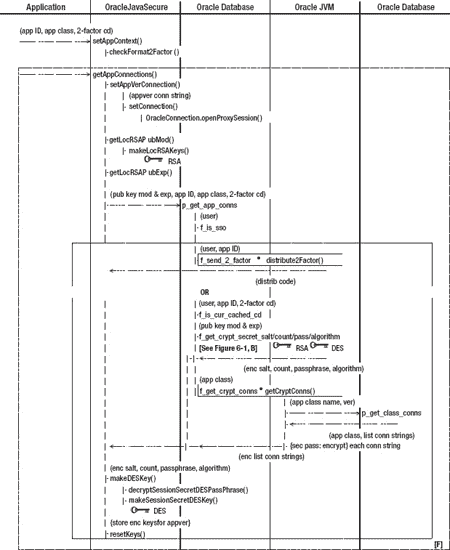
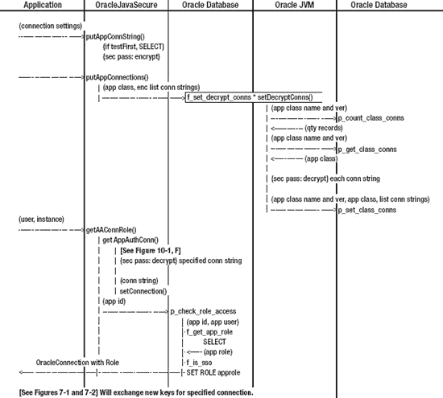

# 十、应用授权

每个 Oracle 应用都连接到一个或多个 Oracle 数据库实例，可能作为一个或多个用户。我们已经看到了如何通过一次一个应用的安全性和加密来实现这一点。我们的第一个应用作为`appusr`帐户连接，并通过`hr_view`角色访问`HR`模式中的数据。

对于该应用以及任何类似的应用，开发人员将为安全应用角色开发一个过程，就像我们的`p_check_hrview_access`。但是对于我们所有的安全性，有一个方面我们还没有解决:开发人员仍然需要将应用用户密码硬编码到他们的代码中(或者找到另一种机制。)如果我们为他们提供一个安全的密码存储库，一个不像其他解决方案那样容易被冒名顶替的应用攻击的存储库，会怎么样？

在本章中，我们将构建一个动态的 Oracle 过程，用于验证所有的安全应用角色。个人开发者不必为他们的应用提供这样的过程。相反，他们将提供与他们的安全应用角色相关的三个唯一项目的列表:应用 ID(名称)、应用用户和安全应用角色名称。我们将把这些元素存储在一个表中。然后，我们将为所有安全应用角色提供动态过程，并围绕它组织我们的代码。

接下来，我们将构建一些其他表来处理每个用户的多个应用，将用户的特定于应用的安全数据与该用户的其他应用的安全数据分开。

我们还将让每个应用向我们发送一段有代表性的代码——一个特定于应用的类，以字节数组表示的对象的形式提供。(细节将变得更清楚。)通过检查该对象，我们将知道哪个应用正在请求服务，作为回报，我们将向该应用提供该应用所需的特定连接字符串的列表。当然，所有这些都是在考虑加密和安全性的情况下完成的。

我们将把应用连接字符串存储在 Oracle 表中。需要一些过程、函数和 Java 代码来完成这个任务，并且需要更多的代码来更新存储的数据。我们还将支持一个应用的多个版本。

我们将所有数据存储在 Oracle 数据库中，并使用 Oracle 数据库的安全性，但是请记住，在通过安全检查之前，我们没有应用 Oracle 连接。这是一个关于“先有鸡还是先有蛋”的两难问题或者在我们的例子中，“Oracle 连接和我们的 Oracle 连接字符串(密码)列表哪个先出现？”答案是，我们首先需要一个到 Oracle 数据库的连接，因此我们将使用另一个 Oracle 应用验证用户`appver`为所有应用提供必要的初始连接。`appver`用户将会是一个顽固的用户，我们可以设置尽可能多的限制。他的唯一目的是保护和提供特定于应用的 Oracle 连接字符串。

因为我们希望在分发连接字符串之前集合所有的安全力量，所以我们将让`appver`决定具体的应用，如前所述。他还将提供我们在前面章节中讨论过的单点登录(SSO)和双因素身份验证。并且他将建立用于分发和解密连接字符串的初始加密密钥集。

注意，为应用建立的每个新连接可能需要一组新的不同的加密密钥。在本书提供的代码中，我们将为并发使用保留多少组键是有限制的。我们将保留`appver`连接的加密密钥，以便继续解密该应用的连接字符串，并且我们将允许每个应用用户一次使用一组额外的加密密钥。可以同时使用其他不加密的 Oracle 连接。然而，一个勤奋的程序员可以克服这些限制。

### 多个应用的安全应用角色程序

回想一下我们的安全应用角色— `hrview_role`和设置角色的过程—它实现了哪些特定于应用的功能？它测试了许多非特定于应用的东西:IP 地址、时间、双因素身份验证，以及最重要的 SSO 身份。然而，有些事情是特定于应用的:寻找角色的用户(`appusr`)和角色本身(`hrview_role`)。

我们此时的目标是构建一个适用于任何应用的单一安全应用角色过程，强制执行我们所有的连接安全要求，但将所需的特定角色授予特定的应用用户。我们可以构建一个过程来处理这个问题，但是首先我们需要一个这些应用特定特性的注册表。我们将在`appsec`模式中创建`t_application_registry`表来保存数据。创建这个表的代码在[清单 10-1](#list_10_1) 中。

注意你可以在名为 *Chapter10/AppSec.sql* 的文件中找到[清单 10-1](#list_10_1) 中的脚本。

***清单 10-1。**应用注册表显著特征表*

`CREATE TABLE appsec.t_application_registry
(
    application_id VARCHAR2(24 BYTE) NOT NULL,
    app_user       VARCHAR2(20 BYTE) NOT NULL,
    app_role       VARCHAR2(20 BYTE) NOT NULL
);`

我们还将创建一个通用的表视图。尽管这里没有显示，我们将使`application_id`和`app_user`列成为唯一的索引和主键。在我们到达第 12 章之前，我们不会依赖那个键。现在，可以说每个应用可以使用多个安全应用角色。我们将通过代理各种应用用户来获得这些角色。所以一对`application_id`和`app_user`是获得一把`app_role`的唯一钥匙。

现在，让我们插入一个带有已知标签的数据记录:用户`APPUSR`和角色`HRVIEW_ROLE`。我们将这些设置赋予`HRVIEW`的`application_id`，如下所示:

`INSERT INTO appsec.v_application_registry ( application_id, app_user, app_role )
VALUES ( 'HRVIEW', 'APPUSR', 'HRVIEW_ROLE' );`

我们在这里引入`application_id`列作为获取所需角色的句柄。每个应用都需要一个唯一的`application_id`，再增加几个，就可以让我们现有的代码为多个应用提供双因素身份验证、SSO 和安全应用角色。

#### 为多个应用重建双因子缓存表

用户可能希望同时使用多个应用，我们希望它们独立运行。这些应用将拥有对不同数据的授权，并将使用不同的 Oracle 实例集。它们也可以在十分钟内从客户端开始，两个因素相互依存。

为了提供这些应用的独立操作，我们将添加`application_id`列作为`t_two_fact_cd_cache`表主键的一部分。参见[清单 10-2](#list_10_2) 。这样，我们可以为用户使用的每个应用创建和分配一个双因素身份验证代码。这清楚地表明了这样一个事实:应用的双因素身份验证已经离单点登录只有一步之遥了。如果您的公司计算环境对初始登录强制实施双因素身份认证(例如，Windows 密码和安全 ID 令牌)，则不需要对应用进行双因素身份认证。然而，用于基本计算机访问的双因素身份验证，无论是安全令牌、生物扫描仪还是电子徽章，似乎在电影中仍比在企业环境中更普遍。如果您有一台带有生物识别接口(指纹或面部识别)或安全卡插槽的计算机，它就不能作为输入密码的替代品进行双因素身份验证。只有当您除了输入密码之外还使用它时，它才是双重身份验证。

因此，我们将构建双因素身份认证，独立于每个应用。我们首先删除以前的`t_two_fact_cd_cache`表，并创建一个带有`application_id`列的新表。

***清单 10-2。**重做双因子代码缓存表*

`DROP TABLE appsec.t_two_fact_cd_cache CASCADE CONSTRAINTS;

CREATE TABLE appsec.t_two_fact_cd_cache
(
    employee_id    NUMBER(6) NOT NULL,
    application_id VARCHAR2(24 BYTE) NOT NULL,
    two_factor_cd  VARCHAR2(24 BYTE),
    ip_address     VARCHAR2(45 BYTE) DEFAULT SYS_CONTEXT( 'USERENV', 'IP_ADDRESS' ),
    distrib_cd     NUMBER(1),
    cache_ts       DATE DEFAULT SYSDATE
);

CREATE UNIQUE INDEX two_fact_cd_emp_id_pk ON appsec.t_two_fact_cd_cache
    (employee_id,application_id);`

我们还重新创建了该表的一个视图(代码未显示),用于一般参考。在文件 *Chapter10/AppSec.sql* 中有一个示例 insert 和一些缓存老化测试代码。

#### 更新双因子代码函数以使用应用 ID

请参考 AppSec.sql 文件中的完整代码列表。我们修改现有的`f_is_cur_cached_cd`函数，将`application_id`作为参数，并基于`application_id`从`v_two_fact_cd_cache`中进行选择。我们还更新了现有的`f_send_2_factor`函数，将`application_id`作为参数，并将其传递给`distribute2Factor()`方法。

#### 将 SSO 测试移至独立功能

为了在我们的代码片段之间进行分工，我们将把 SSO 过程分离到一个单独的函数中，`f_is_sso`。在这个函数中，我们传递应用用户的值。传统上，`appusr`是我们的应用用户，但是我们将传递我们在`t_application_registry`表中找到的任何注册应用的用户。回想一下，对于 SSO，应用用户必须要么是我们会话的连接用户，要么是代理用户。`f_is_sso`函数将返回经过验证的 SSO 用户 ID，如果无效，则返回空字符串。清单 10-3 只显示了`f_is_sso`的签名。

***清单 10-3。**测试用户是否通过 SSO 要求的函数，f_is_sso*

`CREATE OR REPLACE FUNCTION appsec.f_is_sso( m_app_user VARCHAR2 )
RETURN VARCHAR2
AUTHID CURRENT_USER
AS
    return_user     VARCHAR2(40) := '';
...`

注意作为`AUTHID CURRENT_USER`执行的过程和函数从不放在包中，它们通常被授予`EXECUTE`到`PUBLIC`。

#### 添加仅供应用安全使用的 Oracle 包

我们将增加严格由我们的应用安全用户`appsec`使用的函数和过程的数量，几乎增加一个数量级，因此我们将使用一个包来分组和组织它们。我们将这个包称为`appsec_only_pkg`包。该包还允许我们在一个位置保护代码——在这种情况下，我们不会授权任何人在`appsec_only_pkg`上执行。我们将删除函数`f_is_cur_cached_cd`和`f_send_2_factor`，并将它们移到我们的包中，如清单 10-4 中的[所示。](#list_10_4)

***清单 10-4。**仅供应用安全使用的包*

`DROP FUNCTION appsec.f_is_cur_cached_cd;
DROP FUNCTION appsec.f_send_2_factor;

CREATE OR REPLACE PACKAGE appsec.appsec_only_pkg IS

    FUNCTION f_is_cur_cached_cd(
        just_os_user     VARCHAR2,` `        m_application_id v_two_fact_cd_cache.application_id%TYPE,
        m_two_factor_cd  v_two_fact_cd_cache.two_factor_cd%TYPE )
    RETURN VARCHAR2;

    FUNCTION f_send_2_factor(
        just_os_user     VARCHAR2,
        m_application_id v_two_fact_cd_cache.application_id%TYPE )
    RETURN VARCHAR2;`

#### 添加助手函数获取 APP_ROLE

当我们运行设置这些角色的过程时，我们将需要来自`t_application_registry`表的一段数据，即安全应用角色名称。我们已经讨论了作为`AUTHID CURRENT_USER`运行我们的安全应用角色过程的需要。我们这样做是为了确保当前用户的有效性，而不是模式所有者`appsec`。这叫调用者的权利。此外，这是由`CURRENT_USER`设定角色的唯一方式。

为了执行安全应用角色过程，我们需要授予`PUBLIC`对过程的执行权限。然而，我们不想在`v_application_registry`视图上授予`PUBLIC`数据特权。如果我们有一个助手函数，它与`v_application_registry`和安全应用角色过程属于同一个模式，那么助手函数可以由过程执行，并代表它读取表中的数据。PUBLIC 在过程上有 execute，但在视图或函数上没有 grants 然而，该过程可以访问这些函数，以便在视图上进行选择。这样做的结果是，我们可以运行一个过程来授予角色，但不公开用于评估访问的数据。

我们根据来自`f_get_app_role`函数的`application_id`和`app_user`读取应用角色名称。我们将把这个功能添加到我们的`appsec_only_pkg`包中。参见[清单 10-5](#list_10_5) 。

***清单 10-5。**获取应用角色名称的辅助函数*

`    FUNCTION f_get_app_role(
        m_application_id v_two_fact_cd_cache.application_id%TYPE,
        m_app_user       v_application_registry.app_user%TYPE )
    RETURN VARCHAR2
    AS
        m_app_role v_application_registry.app_role%TYPE;
    BEGIN
        SELECT app_role INTO m_app_role
        FROM v_application_registry
        WHERE application_id = m_application_id
        AND app_user = m_app_user;
        RETURN m_app_role;
    END f_get_app_role;`

#### 用动态程序替换 hrview_role 访问程序

我们将用一个通用程序`p_check_role_access`来替换设置`hrview_role`的应用专用程序`p_check_hrview_access`，该通用程序将为任何应用设置安全应用角色。每个应用都需要在`t_application_registry`表中有一个(一个或多个)条目。借助这一新流程，我们可以轻松地将单点登录和双因素身份认证应用于多个应用。

##### 新程序的代码

通过清理，我们将放弃旧的`p_check_hrview_access`程序。这将确保我们使用新的程序，即使是设置`hrview_role`。参见[清单 10-6](#list_10_6) 。

我们的新过程`p_check_role_access`看起来与我们之前的安全应用角色过程非常相似。我们使用一个已经通过我们的应用 Oracle 用户代理的连接进入这个过程，我们将它放入`app_user`变量中。新的过程采用额外的`application_id`参数，它又将这个参数和`app_user`标识一起传递给我们新的`f_get_app_role`助手函数，以便从`v_application_registry`中读取角色名。此外，我们将`app_user`传递给新的`f_is_sso`函数来取回经过验证的用户，而不是在这个方法中拥有 SSO 的代码。

***清单 10-6。**动态安全应用角色过程，p_check_role_access*

`DROP PROCEDURE appsec.p_check_hrview_access;

CREATE OR REPLACE PROCEDURE appsec.p_check_role_access(
    --**m_two_factor_cd**      v_two_fact_cd_cache.two_factor_cd%TYPE,
    m_application_id     v_two_fact_cd_cache.application_id%TYPE,
    m_err_no         OUT NUMBER,
    m_err_txt        OUT VARCHAR2 )
AUTHID CURRENT_USER
AS
    return_user VARCHAR2(40);
    m_app_user  v_application_registry.app_user%TYPE;
    m_app_role  v_application_registry.app_role%TYPE;
BEGIN
    m_err_no    := 0;
**    m_app_user  := SYS_CONTEXT('USERENV','PROXY_USER');**
    m_app_role  := appsec_only_pkg.**f_get_app_role**( m_application_id, m_app_user );
    return_user := f_is_sso( m_app_user );
    IF( return_user IS NOT NULL )
    THEN
    -- Code for two-factor Auth moved to appver login process
    --    IF( m_two_factor_cd IS NULL OR m_two_factor_cd = '' )
    --    THEN
    --        m_err_txt := appsec_only_pkg.f_send_2_factor( return_user, m_application_id );
    --    ELSIF( appsec_only_pkg.f_is_cur_cached_cd( return_user, m_application_id,
    --        m_two_factor_cd ) = 'Y' )
    --    THEN
            **EXECUTE IMMEDIATE 'SET ROLE ' || m_app_role;**
    --    ELSE
    --        RAISE NO_DATA_FOUND;
    --    END IF;
        app_sec_pkg.p_log_error( 0, 'Success getting SSO and setting role, ' ||
            SYS_CONTEXT( 'USERENV', 'OS_USER' ) );
    ELSE
        app_sec_pkg.p_log_error( 0, 'Problem getting SSO, ' ||
            SYS_CONTEXT( 'USERENV', 'OS_USER' ) );
    END IF;
EXCEPTION
    WHEN OTHERS THEN
        m_err_no := SQLCODE;
        m_err_txt := SQLERRM;` `        app_sec_pkg.p_log_error( m_err_no, m_err_txt,
            'APPSEC p_check_role_access' );
END p_check_role_access;
/`

请注意，不再需要双因素代码，所有与处理双因素身份验证相关的逻辑都已被注释。我们将该逻辑转移到应用验证后立即发生，即`appver`用户连接。在控制初始应用访问之后，`appver`的工作是向应用提供一个连接字符串列表。正是在这个过程中，调用一个新的过程，`P_GET_APP_CONNS`，我们将做双因素认证。

如果我们通过了 SSO，那么我们继续将角色设置为我们在`v_application_registry`中查找的值。如果用户的连接/会话未能通过我们的 SSO 要求，那么我们将记录错误“获取 SSO 时出现问题”，并在没有设置角色的情况下返回。那个用户有严重问题，我们根本不想和他打交道。

##### 将动态安全应用角色过程投入使用

作为所有应用获得操作所需权限的一站式服务，`p_check_role_access`需要所有应用都可以执行。我们将授权`PUBLIC`在`p_check_role_access`执行。这个过程用`AUTHID CURRENT_USER`运行，所以它不能直接访问`appsec`模式中的数据；然而，这个过程凭借其在`appsec`模式中的定义，可以执行`appsec`模式中的其他函数和过程，比如提供所需数据的`f_get_app_role`辅助函数。以下是我们授予的执行权限:

`GRANT EXECUTE ON appsec.p_check_role_access TO PUBLIC;`

我们将添加一些额外的审计，因为我们想看看在这个过程中是否有错误的趋势。我们可以将这个审计信息与`v_appsec_errors`日志视图中的信息结合起来。例如:

`AUDIT EXECUTE ON appsec.p_check_role_access
    BY ACCESS WHENEVER NOT SUCCESSFUL;`

 **注意**您可以在名为 *Chapter10/SecAdm.sql* 的文件中找到包含上述语句的脚本。

你可能还记得，当我们最初在第二章的[中创建`hrview_role`时，我们指定它将是`IDENTIFIED USING` `appsec.p_check_hrview_access`。我们将不得不改变它的方向，通过新的程序来识别它。我们将删除该角色并重新创建它。此外，我们需要重复我们对该角色的授权，如清单 10-7](02.html#ch2) 所示。

***清单 10-7。**重新创建由新程序确定的人力资源视图角色*

`DROP ROLE hrview_role;
CREATE ROLE hrview_role IDENTIFIED USING appsec.p_check_role_access;

GRANT EXECUTE ON hr.hr_sec_pkg TO hrview_role;`

### 重写和重构方法来分发双因子代码

我们将使用`distribute2Factor()`方法再进行一次传递。我们需要在几个地方合并`application_id`。当我们在这里的时候，我们也将*重构*代码，使之更安全、更有条理。

如果你回顾上一章中的这个方法，你会看到我们有两个动态查询:一个查询我们构建来从`HR.emp_mobile_nos`表和其他表中获取数据，另一个查询我们构建来更新`v_two_fact_cd_cache`视图。为了安全起见，我们更喜欢参数化的过程和函数，而不是动态查询。这种方法和这些动态查询在 Oracle 数据库中运行，不太可能受到 SQL 注入的影响，但是我们应该考虑这种可能性。在这些查询中执行 SQL 注入需要什么？

第一个查询有两个参数。它使用`oraFmtSt`字符串来格式化日期，这是本地定义的——这是防篡改的。它还采用了从`f_send_two_factor`传递来的`osUser`名称，而这个名称又是从我们的安全应用角色过程传递来的，并且是从我们的 SSO 进程中派生出来的。我可以推测，为了在动态查询中实现 SQL 注入，用户必须在操作系统中有一个极其奇怪的用户名——这不太可能。

第二个查询(更新或插入)采用我们在本地生成的双因素代码(防篡改)、Oracle 数据库感知的 IP 地址(在我们最疯狂的梦想中只是怀疑)和雇员 ID，后者是我们从`HR`表中获得的，必须满足严格的类型约束`NUMBER(6)`。再说一次，这不是 SQL 注入的候选人。

因此，我们将这些查询从 Java 代码中转移到存储过程中的动机，并不能作为反对 SQL 注入的理由。在任何情况下我们都会这样做，因为在存储过程中包含数据库逻辑使得我们的 Java 代码对数据组织的依赖性更小，对数据库更改的容忍度更高。如果 DBA 或我们的应用安全经理要求更改或移动数据表，我们可以修改过程来适应这些更改，而不需要更改 Java 代码。我们希望数据库更改只影响本机数据库结构，而不是 Java。

#### 获取双因子代码交付的员工地址的程序

我们构建一个过程来获取寻呼机、电话和其他号码，我们将使用这些号码来分发我们的双因素身份验证代码。同时，通过一个简单的查询，我们可以获得员工的电子邮件地址和会话的 IP 地址。我们还将获得这个应用上这个用户的缓存的双因素身份验证代码，以及缓存的时间戳。根据用户 ID 和应用 ID 一次获得所有这些数据元素，为我们所有的双因素代码分发测试和交付提供了足够的数据。

看看清单 10-8 中的参数列表。你会看到它们大部分是`OUT`参数——我们正在返回大量数据。我们只向这个过程传递三个参数:用户 ID、我们在上一章讨论的日期格式字符串和我们在本章介绍的应用 ID。我们将把`p_get_emp_2fact_nos`放在`appsec_only_pkg`包中。

***清单 10-8。**获取双因子码分配地址的过程*

`PROCEDURE p_get_emp_2fact_nos(
        os_user               hr.v_emp_mobile_nos.user_id%TYPE,
        fmt_string            VARCHAR2,
        m_employee_id     OUT hr.v_emp_mobile_nos.employee_id%TYPE,
        m_com_pager_no    OUT hr.v_emp_mobile_nos.com_pager_no%TYPE,
        m_sms_phone_no    OUT hr.v_emp_mobile_nos.sms_phone_no%TYPE,` `        m_sms_carrier_url OUT hr.v_sms_carrier_host.sms_carrier_url%TYPE,
        m_email           OUT hr.v_employees_public.email%TYPE,
        m_ip_address      OUT v_two_fact_cd_cache.ip_address%TYPE,
        m_cache_ts        OUT VARCHAR2,
        m_cache_addr      OUT v_two_fact_cd_cache.ip_address%TYPE,
        **m_application_id**      v_two_fact_cd_cache.application_id%TYPE,
        m_err_no          OUT NUMBER,
        m_err_txt         OUT VARCHAR2 )
    IS BEGIN
        m_err_no := 0;
        SELECT e.employee_id, m.com_pager_no, m.sms_phone_no, s.sms_carrier_url,
            e.email, SYS_CONTEXT( 'USERENV', 'IP_ADDRESS' ),
            TO_CHAR( c.cache_ts, fmt_string ), c.ip_address
        INTO m_employee_id, m_com_pager_no, m_sms_phone_no, m_sms_carrier_url,
            m_email, m_ip_address, m_cache_ts, m_cache_addr
        FROM hr.v_emp_mobile_nos m, hr.v_employees_public e,
            hr.v_sms_carrier_host s, v_two_fact_cd_cache c
        WHERE m.user_id = os_user
        AND e.employee_id =  m.employee_id
        AND s.sms_carrier_cd (+)=  m.sms_carrier_cd
        AND c.employee_id (+)= m.employee_id
**        AND c.application_id (+)= m_application_id;**
    EXCEPTION
        -- User must exist in HR.V_EMP_MOBILE_NOS to send 2Factor, even to email
        WHEN OTHERS THEN
            m_err_no := SQLCODE;
            m_err_txt := SQLERRM;
            appsec.app_sec_pkg.p_log_error( m_err_no, m_err_txt,
                'app_sec_pkg.p_get_emp_2fact_nos' );
    END p_get_emp_2fact_nos;`

清单 10-8 过程中的[查询与我们在`distribute2Factor()`方法的前一版本中的选择查询几乎相同。唯一不同的是增加了最后一行:`AND c.application_id (+)= m_application_id`。添加后，我们将从双因素缓存中为该用户进行选择，并且仅针对特定的应用 ID。同样，`(+)`符号表示一个外部连接，所以我们将返回主要数据(例如，寻呼机号码)，即使缓存中还没有这个用户和这个应用的双因素代码。](#list_10_8)

#### 更新双因子代码缓存的存储过程

第二个 Oracle 语句是我们在`distribute2factor()`中用于更新双因素缓存的语句，我们将动态 SQL 从 Java 迁移到 Oracle 存储过程中。本程序的参数主要是`IN`参数。我们传入为其生成双因子代码的用户 ID 和应用 ID。我们还传入了双因子代码和分发代码，这是一个数值，表示哪些路由用于分发双因子代码。[清单 10-9](#list_10_9) 展示了这个程序。我们将把`p_update_2fact_cache`放在`appsec_only_pkg`包中。

***清单 10-9。**更新双因子代码缓存的程序*

`    PROCEDURE p_update_2fact_cache(
        m_employee_id        v_two_fact_cd_cache.employee_id%TYPE,
        m_application_id     v_two_fact_cd_cache.application_id%TYPE,
        m_two_factor_cd      v_two_fact_cd_cache.two_factor_cd%TYPE,
        m_distrib_cd         v_two_fact_cd_cache.distrib_cd%TYPE,
        m_err_no         OUT NUMBER,
        m_err_txt        OUT VARCHAR2 )
    IS
        v_count          INTEGER;
    BEGIN
        m_err_no := 0;
        **SELECT COUNT**(*) INTO v_count
            FROM v_two_fact_cd_cache
            WHERE employee_id = m_employee_id
            AND application_id = m_application_id;
        IF v_count = 0 THEN
            **INSERT** INTO v_two_fact_cd_cache( employee_id, application_id,
                two_factor_cd, distrib_cd ) VALUES
            ( m_employee_id, m_application_id, m_two_factor_cd, m_distrib_cd );
        ELSE
            **UPDATE** v_two_fact_cd_cache SET two_factor_cd = m_two_factor_cd,
                ip_address = SYS_CONTEXT( 'USERENV', 'IP_ADDRESS' ),
                distrib_cd = m_distrib_cd, cache_ts=SYSDATE
            WHERE employee_id = m_employee_id
            AND application_id = m_application_id;
        END IF;
    EXCEPTION
        WHEN OTHERS THEN
            m_err_no := SQLCODE;
            m_err_txt := SQLERRM;
            appsec.app_sec_pkg.p_log_error( m_err_no, m_err_txt,
                'app_sec_pkg.p_update_2fact_cache' );
    END p_update_2fact_cache;`

您可以看到在这个过程的主体中有三个 Oracle 语句:一个`SELECT`、一个`INSERT`和一个`UPDATE`。如果你还记得，在上一章的`distribute2factor()`方法中，我们只需要两条语句。在那里，我们试图更新并读取返回的整数的值。如果返回值为 0，那么没有记录受到更新的影响，我们进行了插入。但是，在这里，我们必须手动执行`SELECT COUNT`,看看是否有记录需要更新。如果计数为 0，我们执行`INSERT`，否则我们执行`UPDATE`。

在这些语句中，您可以看到我们正在处理与用户(雇员)id 和应用 ID 相关联的记录。对于多个应用，用户可能在缓存中有多个双因素代码。

#### 更改分配双因子代码的方法

`OracleJavaSecure.distribute2Factor()`方法的变化主要与调用和接收来自`p_get_emp_2fact_nos`和`p_update_2fact_cache`的输出参数有关。另一个增加的是对`applicationID`参数的接收和使用，如[清单 10-10](#list_10_10) 所示。我们不打算详细讨论我们对新程序的调用—您以前已经看到过类似的调用。

***清单 10-10。**双因子码分配方法的标题*

`    private static String applicationID = null;

    public static final String distribute2Factor( String osUser, **String applicationID** )
        throws Exception
    {
        // Set class static member equal to what passed here from Oracle
        **OracleJavaSecure.applicationID = applicationID;**`

 **注意**你可以在名为*chapter 10/orajavsec/Oracle javasecure . Java .*的文件中找到刚才描述的代码，你可以在[清单 10-10](#list_10_10) 中看到

我们在这个过程中收到的静态类成员`applicationID`的设置暗示了一个可能没有被注意到的变化。在上一章中，我们对`twoFactorAuth`成员有一个小问题:我们在`distribute2Factor()`方法中生成它，在那里使用它，并把它交给`distribToSMS()`、`distribToPagerURL()`和`distribToEMail()`方法。此外，我们在客户机的命令行上输入它，把它交给我们的安全应用角色过程，并最终把它交给`f_is_cur_cached_cd`函数。因此，我们有两个不同的切入点——这将继续下去。问题是在`OracleJavaSecure`中，我们有两个不同的引用；这是不必要的，因为无论是在 Oracle 数据库上生成以供分发，还是在客户机上输入以返回 Oracle 数据库进行测试，我们都可以称之为同一件事。将该成员移动到静态类成员并有一个标准的引用位置对我们有利。然后我们可以停止在方法间传递它，只在每个方法中局部引用它。

我们还有几个静态类成员，我们将在本章中使用，第一个是在这里的`distribute2Factor()`方法中使用的。你可以看到我们将`applicationID`传递给这个方法，并用它来设置一个静态类成员。我们会在很多地方提到它，感谢我们不必在方法参数中列出它，并在方法间传递它。

我们将`applicationID`传递给`distribute2Factor()`方法，因为这是在 Oracle 数据库上调用的第一个 Java 方法。在客户端，`applicationID`由用户输入，并从使用我们服务的特定应用传递给`OracleJavaSecure`。我们将在本章后面讨论这个过程。

### 更新为双因子分配格式

现在，因为我们将为多个应用向用户发送双因素身份验证代码，所以我们必须在发送的消息中识别它们。我们将使用应用 ID 来识别代码用于什么应用。我们将在主题行和邮件正文中放置“for APPID”字样，其中“APPID”是我们引用的特定应用 ID。这里有一个例子。

`From: response@org.com
To: 8005551212@txt.att.net` `Subject: Response **for HRVIEW**
1234-5678-9012 **for HRVIEW**`

### 申请授权概述

我们将完全使用 Oracle 数据库作为后端来实现这一点，当然是使用 Oracle JVM 来运行。这意味着我们必须处理一个重要的安全问题。为了与 Oracle 数据库进行对话，我们需要使用用户名和密码进行连接。我们将花大量时间解决这个问题。

简而言之，我们将如何进行应用授权，我们也称之为应用验证:

1.  我们将首先通过新用户`appver.`代理连接到 Oracle
2.  与过去一样，我们需要通过 SSO 和双因素身份认证要求。
3.  一旦我们获得了双因素认证，我们就交换加密密钥。
4.  我们还检索了一个加密的连接字符串列表，可以在当前的应用中使用。
5.  当我们使用其中一个应用连接字符串时，我们再次保证我们的 SSO，并且我们交换额外的加密密钥来查询加密的数据，就像以前一样；但是，我们不会重新进行双因素身份认证。

所有这些看起来都很好，但是问题出现了:我们如何知道正在使用什么应用？嗯，我们当然不想仅仅相信应用的话。安全计算的一个标准假设是，只要有机会，黑客的代码就会说谎——一种应用身份盗窃。我们正在向已知的应用分发连接字符串列表，包括用户名和密码。它们是加密的，但我们不想把它们交给任何人。

为了确保一个应用是它所说的那个人，我们将要求应用给我们一个它自己的片段，一个我们已经收到并注册的片段。我们将比较应用提供的内容和我们注册的内容，如果它们“相等”，那么我们就认可该应用。

我们要求呈现的应用部分是一个内部类。这个类必须与我们注册的类同名。我们可能会注册同一个内部类的多个版本，以处理应用升级，但是连接字符串需要重新创建或复制到新版本。

当我说我们保证内部的类是“平等的”时，这就是试金石。默认的相等测试是类是等价的，我们没有覆盖这个测试；它们驻留在相同的内存地址，并且是同一个类。我们也可以说`class1 == class2`。

在 JVM 中，类是在内存中建模的，但是只需要内存中的一个地方来建模一个特定的类。可以有多个实例，但它们都使用相同的模型。当我们说`class1.equals( class2 )`的时候，类必须是同一个模型。我将给你更多的启示:如果这些类(应用提供的和我们已经注册的)声称是相同的——相同的包和相同的类名——但不是，那么甚至在我们到达`.equals()`方法之前，我们将看到一个异常。当我们试图基于手头的序列化对象反序列化一个`Class`时，如果它与我们已经实例化的对象不同，那么它看起来就像一个试图装进圆孔的方栓。具体来说，抛出一个`InvalidClassException`。一个 JVM 只能容纳一个名称到类实例的映像关系。尝试引入另一个不同的同名类，JVM 会拒绝它。

让我委婉地告诉你，你可能会发现需要改进的地方。改进它的一个显而易见的方法是在服务器上运行我们的应用，也许是作为 web 应用，这样我们就不需要处理客户端应用认证。但是，即使在这种情况下，您可能仍然希望对服务器应用进行应用身份验证，以便将 Oracle 连接字符串限制在特定的应用中。

### 用户申请授权

我们需要一个看门人。他将是我们的保镖，拒绝痞子和麻烦制造者。我们将称他为我们的应用验证，`appver`用户。在这个类比中，应用(不是人)是我们的客户。一些应用是允许的，因为它们已经预先注册并出示了身份，提交并通过了身份检查。

除了守卫入口之外，`appver`还为每一位成功的参赛者提供进入允许他们进入的内门所需的钥匙。同样，在我们的类比中，键是 Oracle 连接字符串，其中包含连接到 Oracle 数据库的用户 id 和密码。这些不是个人用户和密码，而是应用密码，允许安全的应用角色访问应用数据。

就像看门人一样，`appver`对所有人都是可用的，并且有足够的信息来给予通行和方向。必要时，他也有足够的权力阻止通行。

#### 有限制和无限制的新档案

通常，出于安全考虑，我们会限制用户帐户，但是在设置应用授权时，我们需要一些灵活性。我们将通过一个独特的概要文件`appver_prof`为这个账户分配限制和权限，如清单 10-11 中的[所示。](#list_10_11)

***清单 10-11。**申请授权概要*

`CREATE PROFILE appver_prof LIMIT
    CONNECT_TIME          1
    IDLE_TIME             1
    SESSIONS_PER_USER     UNLIMITED
    PASSWORD_LIFE_TIME    UNLIMITED
    FAILED_LOGIN_ATTEMPTS UNLIMITED;`

 **注意**你可以在名为 *Chapter10/SecAdm.sql* 的文件中找到这个脚本。

与我们的普通标准相反，我们的应用验证用户将拥有一个永不过期的密码。我们还将允许该用户输入错误的密码不限次数，而不锁定它(防止它进一步尝试登录，即使使用正确的密码)。此外，我们将允许该帐户无限数量的并发会话。

我知道这听起来很不安全，但我们有可能有数百人试图访问应用，这一点得到了该用户的证实。我们需要严格控制该密码何时过期—我们将定期手动重置密码—可能需要向客户端分发一些文件。但是，我们不希望它自动过期。此外，我们不知道有多少人将同时授权申请，因此无限的会话。也许以后，一旦我们有了一些历史，我们就会知道正确的会议次数是多少。

当然，我们可以说无限制的会话，但实际上是有限制的。硬限制是创建数据库所服务的进程的数量。默认的进程数是 150。展望未来，当我们在第 11 章中为应用认证创建一个专用数据库时，我们将把进程的数量增加到 500。

无限制的失败登录尝试有点难以证明，因为这给了黑客使用暴力攻击来猜测密码的机会。然而，另一种选择是，可能会出现一系列中断的应用。如果黑客或错误的应用多次尝试使用错误的密码登录并锁定用户，所有依赖该用户进行授权的应用都会失败，直到帐户被重置。

我们将尽可能地限制这个账户。我们只会给它一些特权。它需要通过单点登录、双因素身份认证、加密和应用授权，这也是它存在的原因。我们将为此用户设置的几个限制将通过`appver_prof`配置文件中的参数来设置。我们将只允许这个帐户有一分钟的连接时间，和一分钟的空闲时间(最小值)。

#### 申请验证用户

是时候创建我们的应用验证用户了，我们将其命名为`appver`。[清单 10-12](#list_10_12) 显示了创建 appver 用户的命令。我们给这个用户分配了一个密码，但是现在，我们把它看得更像一行代码或者一个地址。它把人们带到工作场所，但本身并不做任何工作。现在，这个密码将被硬编码到客户端的`OracleJavaSecure`类中。在[第 11 章](11.html#ch11)中，我们将对密码进行混淆和加密。无论如何，请给`appver`分配一个复杂的密码。

***清单 10-12。**创建申请验证用户*

`CREATE USER appver
    IDENTIFIED BY password
    QUOTA 0 ON SYSTEM
    PROFILE appver_prof;

GRANT create_session_role TO appver;`

请注意，我们将`appver_prof`配置文件分配给了`appver`。我们也没有给`appver`空间，0 个存储配额。最后，我们将`create_session_role`授予`appver`，这样他就可以连接到 Oracle 数据库。

#### 应用验证登录触发器

我们将为`appver`帐户创建一个登录触发器。我们已经看到了数据库触发器，但这一个是不同的——它定义了每当用户登录到`appver`模式时我们将让 Oracle 数据库采取的操作。[清单 10-13](#list_10_13) 显示我们的登录触发器简单地调用了一个过程`p_appver_logon`。

***清单 10-13。**应用验证登录触发*

`CREATE OR REPLACE TRIGGER secadm.t_screen_appver_access AFTER LOGON ON appver.SCHEMA
BEGIN
    appsec.**p_appver_logon;**
END;
/`

#### 申请验证登录流程

我们的`appver`登录触发器`p_appver_logon`的程序如[清单 10-14](#list_10_14) 所示。如果我们能在登录触发期间完成完整的 SSO 检查就好了，但是可惜的是，代理会话和`USERENV`中的`CLIENT_IDENTIFIER`设置在登录时不可用。但是，我们仍然可以保证会话用户是`appver`(还能是谁？)，并且我们的 IP 地址是可以接受的。我们还调用函数`f_is_user`来确保`os_user`也是数据库用户。这可能是最重要的测试，因为这也是我们将确保我们的代理登录。

***清单 10-14。**应用验证登录流程*

`CREATE OR REPLACE PROCEDURE appsec.p_appver_logon
AUTHID CURRENT_USER
AS
    just_os_user    VARCHAR2(40);
    backslash_place NUMBER;
BEGIN
    just_os_user := UPPER( SYS_CONTEXT( 'USERENV', 'OS_USER' ) );
    backslash_place := INSTR( just_os_user, '\', -1 );
    IF( backslash_place > 0 )
    THEN
        just_os_user := SUBSTR( just_os_user, backslash_place + 1 );
    END IF;
    -- For logon trigger - **limited SSO**, no PROXY_USER and no CLIENT_IDENTIFIER
    IF( SYS_CONTEXT( 'USERENV', 'SESSION_USER' ) = 'APPVER'
    AND( SYS_CONTEXT( 'USERENV', 'IP_ADDRESS' ) LIKE '192.168.%' OR
        SYS_CONTEXT( 'USERENV', 'IP_ADDRESS' ) = '127.0.0.1' )
    -- Requirements must be applicable to all applications - time may not be
    --AND TO_CHAR( SYSDATE, 'HH24' ) BETWEEN 7 AND 18
    -- Assure that OS_USER is a database user
    AND( appsec_only_pkg.**f_is_user( just_os_user )** = 'Y' ) )
    THEN
        app_sec_pkg.p_log_error( 0, 'Success APPVER logon, ' || just_os_user );
    ELSE
        app_sec_pkg.p_log_error( 0, 'Problem getting APPVER logon, ' || just_os_user );
        --**just_os_user := sys.f_get_off;**
        -- This causes logon trigger to fail -- so not connected to Oracle
        **RAISE_APPLICATION_ERROR**(-20003,'You are not allowed to connect to the database');
    END IF;
END p_appver_logon;
/`

我们以`AUTHID CURRENT_USER`的身份运行这个登录触发过程；这是发票人的权利。这是我们能够准确衡量用户身份的唯一方法——类似于安全应用角色过程的方法。因此，我们需要授权`PUBLIC`执行这个过程:

`GRANT EXECUTE ON appsec.p_appver_logon TO PUBLIC;`

#### 下车功能

总有一种想要完全掌控的渴望。如果能够在我们的登录触发器中发现问题并立即终止会话，那就太好了。你看到清单 10-14 中的`p_appver_logon`、[登录触发程序中的注释行`just_os_user := sys.f_get_off`了吗？这是一个行不通的好主意。清单 10-15](#list_10_14) 中的[函数可以为我们完成任务；但是，Oracle 数据库不允许我们终止当前会话。](#list_10_15)

***清单 10-15。**失效的断路开关，f_get_off*

`CREATE OR REPLACE FUNCTION sys.f_get_off
RETURN VARCHAR2
AS
    PRAGMA AUTONOMOUS_TRANSACTION;
    p_sid v$session.SID%TYPE;
    p_serial v$session.serial#%TYPE;
BEGIN
    p_sid := SYS_CONTEXT( 'USERENV', 'SID' );
    SELECT serial# INTO p_serial
    FROM v$session
    WHERE sid = p_sid;
    **EXECUTE IMMEDIATE** 'ALTER SYSTEM KILL SESSION ''' ||
                 p_sid || ',' || p_serial || '''';
    RETURN 'OFF';
END f_get_off;

GRANT EXECUTE ON sys.f_get_off TO appsec;`

 **注意**你可以在名为 *Chapter10/Sys.sql* 的文件中找到[清单 10-15](#list_10_15) 的函数。

该功能的核心在`EXECUTE IMMEDIATE`命令中。按照这些思路，另一个可行的方法是，我们将被杀死的`SID`和`SERIAL#`插入到一个表中。然后使用一个独立的预定任务，读取表并终止会话，然后从表中删除记录。

反正用最直接的方式粗暴对待是行不通的。这样也好，因为我们对`p_appver_logon`到`RAISE_APPLICATION_ERROR`的调用做了同样的事情。因为我们在登录触发器中，所以当我们引发异常时，登录会失败。

#### 查找数据库用户的功能

我们有一个用于`appver`登录触发过程的函数`f_is_user`，它测试 OS 用户是否也是数据库用户。这是一个重要的测试，因为它强制执行了我们的一部分 SSO 要求——如果我们没有创建一个与此人的操作系统用户名同名的 Oracle 用户，那么他就不能使用我们的应用。清单 10-16 中的函数[将被添加到包`appsec_only_pkg`中。](#list_10_16)

***清单 10-16。**查找数据库用户的功能*

`    FUNCTION f_is_user( just_os_user VARCHAR2 )
    RETURN VARCHAR2
    AS
        return_char VARCHAR2(1) := 'N';
        v_count     INTEGER;
    BEGIN
        SELECT COUNT(*) INTO v_count
        FROM **sys.all_users**
        WHERE username = just_os_user;
        IF v_count > 0 THEN
            return_char := 'Y';
        END IF;
        RETURN return_char;
    END f_is_user;`

 **注**返回文件 *Chapter10/SecAdm.sql* 供本讨论参考。

请注意，我们从何处获得用户是 Oracle 用户的指示符。我们从 Oracle 数据字典中读取视图，`SYS.ALL_USERS`。该视图被授予对`PUBLIC`的选择。我相信这是一个安全问题。如果黑客获得了任何 Oracle 用户帐户的访问权限，他可以读取`ALL_USERS`视图和*获得他可能试图访问的所有用户名的列表*。数据字典还有其他视图同样被`PUBLIC`授予 select，我认为这超越了安全性。另一个特殊的视图是`SYS.ALL_SOURCE`，它列出了每个模式中每个存储过程的整个主体，以及用户被授权执行的其他代码。让一个黑客看到我们的代码(不管他是一个合法的流氓用户还是一个入侵者)会招致进一步的危害。

当我们在第 11 章的[中为应用认证创建一个专用数据库时，我们将为这些特别敏感的视图撤销 select by `PUBLIC`。我们还将从公共访问中删除一些附加视图。](11.html#ch11)

#### 通过应用验证的代理和其他代理

最后，关于我们的应用验证用户，我们需要允许每个用户通过`appver`进行代理。我们的登录触发器不会看到代理，但是当我们执行过程来获取与当前应用相关的安全应用角色时，我们将使用代理测试作为 SSO 的一部分。例如:

`ALTER USER osuser GRANT CONNECT THROUGH appver;`

不要忘记为您希望授予应用访问权限的每个操作系统用户创建一个 Oracle 用户。并授权每个用户可以通过`appver`进行代理。此外，对于每个操作系统用户，授予其帐户可以通过与特定应用相关联的角色进行代理。

例如，要让名为“coffin”的操作系统用户访问`hrview`应用，您需要执行以下命令:

`CREATE USER coffin IDENTIFIED EXTERNALLY;
GRANT CREATE_SESSION_ROLE TO coffin;` `ALTER USER coffin GRANT CONNECT THROUGH APPVER;
-- APPUSR is the account that gets access to HRVIEW_ROLE
ALTER USER coffin GRANT CONNECT THROUGH APPUSR;`

此外，为了让用户 coffin 通过双因素认证，他需要在`HR.EMPLOYEES`和`HR.emp_mobile_nos`中输入条目。

#### 审核应用验证

知道用户做的每一件事是很好的——应该只有他做的一些声明。然而，我们预计他会被呼叫很多很多次，我们不想审计他做出的所有合法呼叫。当他试图选择数据时，第一个线索就是`appver`正在做一些非官方的事情。因此，我们将使用审计日志，通过清单 10-17 中未注释的命令来监控这一点。

***清单 10-1。，**审核申请验证*

`--AUDIT ALL STATEMENTS BY appver BY ACCESS; -- WHENEVER SUCCESSFUL;
AUDIT SELECT TABLE BY appver BY ACCESS;

AUDIT EXECUTE PROCEDURE
    BY appver
    BY ACCESS
    WHENEVER NOT SUCCESSFUL;`

此外，当`appver`未能执行过程时，我们可能会通过审计捕捉到一些应用错误和企图滥用。所以我们在这些调用是`NOT SUCCESSFUL`的时候进行审计。我们不想审计成功的过程调用，因为我们知道他将调用过程，并且我们希望他成功。

### 申请授权的结构

我们讨论了`appver`完成的任务之一——将应用提供的内部类对象与已经注册的对象进行比较。当第一眼看到内部类被插入时(当应用没有现有的注册表项时)，就会发生注册。没错:你(一个新应用)第一次出现的时候，我们把你的名字写在留言簿上，保存你提供的内部类。您的应用必须跨越几个障碍才能走到这一步，我们为此给予您信任。然而，在这一点上，它只不过是一张大头照。

为了注册连接字符串，您的应用必须返回相同的标识。从现在开始，您还必须以相同的身份出现，以便将这些连接字符串返回到您的应用。

#### 更大的应用安全空间

因为我们承诺为每个使用这些服务的应用存储几个对象，所以我们应该给`appsec`模式多一点空间用于存储。执行这个`ALTER USER`命令来完成:

`-- Increase quota to hold app verification data
ALTER USER appsec DEFAULT TABLESPACE USERS QUOTA 10M ON USERS;`

#### 应用连接注册表

我们将创建一个表(见[清单 10-18](#list_10_18) )来保存每个应用提供的对象，作为`RAW`数据类型。它需要小于 2K 才能存储为一个`RAW`，所以开发人员不应该扩展我们提供给他们的模板类。除了每个对象之外，我们还将存储一个二进制大对象(`BLOB`)数据类型，其中包含一个相关连接字符串的列表。

正如您可能想象的那样，很难对`RAW`或`BLOB`类型进行索引和选择。所以我们将类名和类版本作为`VARCHAR2`数据类型进行索引。这些标识符可以从对象中获得，所以我们从不传递它们:传递对象就足以让我们发现应用声称是谁。

设置 Oracle 连接字符串表(`BLOB`)不是一次性的；它们可以被更新。所以我们在表中包含了一个`update_dt`列来跟踪它。默认情况下，我们使用 empty_blob()指令分配 blob 定位器地址，不指向特定的 BLOB，但仍然指向一个地址——而不是 null。

***清单 10-18。**应用连接注册表*

`CREATE TABLE appsec.t_app_conn_registry
(
    class_name      VARCHAR2(2000) NOT NULL,
    class_version   VARCHAR2(200) NOT NULL,
    class_instance  RAW(2000),
    update_dt       DATE DEFAULT SYSDATE,
    connections     BLOB DEFAULT EMPTY_BLOB()
);`

 **注意**你可以在名为 *Chapter10/AppSec.sql* 的文件中找到这个脚本。

我们在`class_name`和`class_version`上创建索引和主键，未显示。我们还创建了该表的一个视图，用于常规参考。

### 应用的一组连接字符串

在客户端，我们将把连接字符串表作为`HashMap`来处理，我们称之为`connsHash`。你必须确保它被标记为`private`，这样只有`OracleJavaSecure`级才能看到它。以下是声明:

`    private static **HashMap**<String, RAW> connsHash = null;`

我们将与 Oracle 数据库交换密钥，因此我们可以接收这个用共享密码密钥加密的连接字符串表。我们将只在需要时解密它们，创建一个连接，然后释放连接字符串用于垃圾收集(不保留对它的类成员引用)。)请注意，在垃圾收集器运行(自动、自动调度)之前，明文连接字符串将在机器内存中，但不容易检索，即使使用调试器也是如此。

一个`HashMap`是一个`Collection`类，它有一个键和值的关系。它就像一个包含唯一键和相关值的两列表。键和值都是 Java 对象，而不是原语。在这种情况下，我们的键是`Strings`，我们的值是`RAWs`。具体来说，我们的`RAW`值是应用使用的每个连接字符串的加密形式。这个`connsHash`的声明使用泛型来要求键是`Strings`，值是`RAW`，语法是`<String, RAW>`。

`HashMaps`可以不用泛型创建；也就是说，不指定键和值的对象类型，但是每次检索键或值时，都需要将其转换为适当的类型。此外，通过指定对象类型，我们确信我们的应用将只把该类型的对象放在我们的键和值字段中。否则，`HashMaps`可以一次容纳多种`Object`类型。

#### 代表应用的内部类

我们的应用将通过传递一个实现特定接口的对象向这个应用认证过程标识自己:接口`RevLvlClassIntfc`。一个接口就像一个类，但是它是空心的——它没有内部结构。一个接口可以指定一系列方法，所有实现该接口的类都需要实现这些方法；也就是说，它们需要具有相同签名的方法(相同的名称、参数和返回类型)。希望他们也能提供完成任何需要的胆量或功能代码。

`RevLvlClassIntfc`接口在 *orajavsec* 包中，就像`OracleJavaSecure`一样。也像`OracleJavaSecure`一样，接口需要存在于 Oracle 数据库和客户机中。`RevLvlClassIntfc`需要加载到 Oracle 中，如清单 10-19 的第一行所示，并且需要与 *OracleJavaSecure.class* 一起分发给开发人员，很可能在同一个 *jar* 文件中。

***清单 10-19。**修改等级类接口*

`//CREATE OR REPLACE AND RESOLVE JAVA SOURCE NAMED appsec."orajavsec/RevLvlClassIntfc" AS
package orajavsec;

public interface RevLvlClassIntfc {
    //private static final long serialVersionUID = 2011010100L;
    //private String innerClassRevLvl = " 20110101a";
    public String getRevLvl();
}`

 **注意**你可以在名为*chapter 10/orajavsec/revlvlclassintfc . Java .*的文件中找到这段代码

接口中有一个方法，`getRevLvl()`。这将返回一个修订级别，`innerClassRevLvl`,我们可以用它来支持一个应用的多个版本。例如，如果您将应用数据移动到新的 Oracle 表或新的 Oracle 数据库，您可以更新内部类中的`innerClassRevLvl`,并使用我们的进程注册更新的应用，并生成一组与之相关的新连接字符串。旧的应用/版本和新的应用/版本将能够同时获得它们各自的连接。此外，为了强制每个人迁移到应用的新版本并禁用旧版本，我们可以从应用注册表中删除旧版本的内部类，或者只删除相关的连接字符串列表。

我们将要求该接口的实现者(开发人员)也提供一个名为`serialVersionUID`的`static long`，用于对象序列化(打包以存储在数据库中并通过网络传输)。)我们稍后将对此进行更多讨论。

#### 在 OracleJavaSecure 中实现内部类

出于本章测试的目的，我们将在实现`RevLvlClassIntfc`的`OracleJavaSecure`类中定义一个内部类`InnerRevLvlClass`。要生成内部类，只需将类定义包含在现有的类定义中。在我们的例子中，它看起来像清单 10-20 中的[。在`OracleJavaSecure`的定义体中，我们声明了内部类`InnerRevLvlClass`。](#list_10_20)

***清单 10-20。**用于身份和版本控制的 OracleJavaSecure 内部类，InnerRevLvlClass*

`**public class OracleJavaSecure** {
…
**    public static class InnerRevLvlClass**
        implements **Serializable**, RevLvlClassIntfc
    {
        private static final long serialVersionUID = 2011010100L;
        private String innerClassRevLvl = "20110101a";
        public String getRevLvl() {
            return innerClassRevLvl;
        }
    }`

 **注意**在本章余下的大部分时间里，我们将反复引用名为*chapter 10/orajavsec/Oracle javasecure . Java、*的文件中的 Java 代码，以及名为 *Chapter10/AppSec.sql* 的文件中的 SQL 和 PL/SQL 代码。

注意，我们的内部类被指定为`public static`。`static`不是必需的，但是它向我们保证当父类`OracleJavaSecure`被实例化时，这个类是存在的。另一方面，从安全角度来看,`public`标志意义重大。我们更愿意将这个内部类私有，我们可以为`OracleJavaSecure.InnerRevLvlClass`这样做。但是对于其他独立的应用，内部类需要是公共的，以便 Oracle 数据库上的`OracleJavaSecure`可以实例化它们。

我们的内部类也必须实现`Serializable`接口(我们提供给开发人员的模板的另一个必需元素。)通过实现`Serializable`(不需要任何方法)，我们确保可以获取内部类，获取对象的字节，并将它们传递给 Oracle 数据库进行存储。如果对象实现了`Serializable`接口，我们只能用那种方式处理对象。

应用交给我们的类的`serialVersionUID`必须与 Oracle 数据库中的类定义的`serialVersionUID`相同(这个讨论将在下一节继续)。我们为`serialVersionUID`设置了一个静态成员变量，但是如果我们没有这个成员，JVM 会计算一个值。如果该值不相同，则类无法实现，对象无法实例化，并将引发异常。大多数情况下，除非我们对类进行结构性修改，否则计算出的`serialVersionUID`将是相同的，但是“大多数情况下”的统计数据会带来我们不愿意承担的风险。

注意，我们为`innerClassRevLvl`和`serialVersionUID`提供的值几乎是我们想要的任何值；然而，我认为对于任何一个日期具有多值灵活性的日期形式将会是一个好的值。如果我在 2012 年 2 月 14 日发布一个新的应用，我可能会给出这些值:

`        private static final long **serialVersionUID** = 2012021400L;
        private String innerClassRevLvl = "20120214a";`

如果我在当天晚些时候发布了一个修订版，它可能会有这些更改的值(仅作为示例，这些值通常会因为不同的原因而被单独修改):

`        private static final long **serialVersionUID** = 2012021401L;
        private String innerClassRevLvl = "20120214b";`

这可能是显而易见的，但是`serialVersionUID`的值末尾的`L`是数字的一部分，表明它是一个`long`值。这是一种将默认情况下被解释为整数的值转换为另一种类型的基元值的方法。使用大写`L`避免将小写`l` (ell)与`1` (one)混淆。还有其他的*文字*值转换，由后缀(例如`f`表示浮点)和前缀(例如`0x`表示十六进制)组成。需要的话拿一个。

#### 反序列化和版本 UID

在序列化之后恢复对象的生命需要反序列化。但是要做到这一点，有一个很大的要求 JVM 中必须存在对象的类定义。这是序列化文档中经常忽略或假定的一个要求。通常，应用负责序列化对象，等效的应用处理反序列化。应用有一个类定义，可能在一个单独的*中。class* 文件，或者作为内部类，因此它已经知道如何构建被反序列化的类型的对象。序列化对象不包含类定义的所有细节；相反，应该考虑在序列化时只保留对象的数据或状态。为了在 JVM 中反序列化对象，现有的类定义必须提供一个框架，在这个框架上构建对象的主体。

现在这些对我们来说都有意义了，但是考虑一下这个变化:我们将在 Oracle 数据库中反序列化对象，在一个应用不运行的地方。要做到这一点，我们必须有类定义；因此，对于每个应用，我们将存储内部类定义(我们将在后面看到如何做)。对于内部类`OracleJavaSecure`的`InnerRevLvlClass`，类定义在 Oracle 数据库中，因为我们在服务器上创建了`OracleJavaSecure`。对于其他应用，我们必须在 Oracle 数据库上创建内部类。

在对象序列化和反序列化之间的过渡阶段，可能会对类定义进行一些非结构化的更改，Java 编译器和运行时版本可能会继续发展；但是我们应该能够，甚至十年后，反序列化我们的对象。这就是`serialVersionUID`成员变量发挥作用的地方。在开始使用我们的序列化对象时，根据 *suid* (当`serialVersionUID`成员不存在时，该值的另一个名称)的运行时计算，我们可能没有问题。)然而，随着时间的推移和事物的变化，我们可能会开始经历我们序列化的内容和我们试图反序列化的内容之间的不匹配。

我们可以通过简单地编码一个`serialVersionUID`成员，而不是依赖于运行时计算，来避免串行版本不匹配的问题(由技术进步而不是我们的类的变化引起的)。

如果我们对我们的类定义做了结构性的修改，我们将需要做下面两件事:

1.  更改我们的类定义中的`serialVersionUID`值。
2.  在 Oracle 中存储新版本的类定义。

注意，这种情况不同于我们只在类定义中编码一个新的`innerClassRevLvl`的情况。我们将这样做来处理应用版本的更改(并提供 Oracle 连接字符串的更新列表。)

#### 设置应用上下文

您可能还记得，在上一节的讨论中，我们将所有特定于应用的元素都集中在一个地方。我们将把`applicationID`、`appClass`和`twoFactorAuth`代码作为静态类成员存储在`OracleJavaSecure`中，所以我们不需要将它们传递给所有引用它们的方法。

当一个应用最初到达`OracleJavaSecure`时，它可能做的第一件事就是通过调用`setAppContext()`方法来标识自己。`setAppContext()`以`applicationID`、内部类和`twoFactorAuth`代码作为参数。我们第一次运行客户端应用时，没有提供`twoFactorAuth`代码。直到用户在他们的手机或其他设备上接收到双因素代码，他们才能够返回并重新进行该识别并继续进行。

为了请求连接字符串，我们必须通过应用验证，`appver` security guard。这意味着我们必须向应用授权过程展示我们的内部类。在`setAppContext()`方法中，我们保证我们将要呈现的内部类通过调用`instanceof`操作符实现了`RevLvlClassIntfc`接口和`Serializable`接口。

***清单 10-21。**设置应用上下文，`setAppContext()`*

`    private static String applicationID = null;
    private static Object appClass      = null;
    private static String twoFactorAuth = null;

    public static final void **setAppContext**( String applicationID,
        Object appClass, String twoFactorAuth )
    {
        twoFactorAuth = checkFormat2Factor( twoFactorAuth );
        if( null == applicationID || null == appClass ) {
            System.out.println( "Must have an application ID and Class" );
            return;
        }
        // Assure the app class has implemented our interface
        if ( !( ( **appClass instanceof RevLvlClassIntfc** ) &&
            ( **appClass instanceof Serializable** ) ) )
        {
            System.out.println(
                "Application ID Class must implement RevLvlClassIntfc" );
            return;
        }
        // Set class static member equal to what passed here at outset
        **OracleJavaSecure.applicationID = applicationID;**
        OracleJavaSecure.appClass      = appClass;
        OracleJavaSecure.twoFactorAuth = twoFactorAuth;
    }`

顺便说一句，我们以前见过这样的方法，其中我们传入与类成员名相同的引用。我们通常用这样的语句设置类成员:

`this.varName = varName;`

注意这个案例的不同之处。因为我们设置的是静态类成员，所以没有`this`可以引用——`this`是对当前实例的引用，但是静态类没有被实例化。所以我们使用这个语法来设置静态类成员变量的方法参数:

`Class.varName = varName;`

#### 格式化用户输入的双因素代码

我们在上一章介绍了`checkFormat2Factor()`方法，但是没有讨论它的实现。我们希望确保努力输入双因素代码的用户在格式方面得到一些宽容。这在本章中尤其重要，从现在开始，因为我们将应用 ID 和双因素代码一起发送到用户的手机和其他设备。

我们希望确保我们总是将双因素代码作为我们信息的第一项。如果用户在其后包含应用名称，我们会发现在适当的位置截断双因素代码很容易。如果额外的数据作为单独的参数出现在命令行上，我们会忽略这些额外的参数。

有时，旧式寻呼机可能会从消息中删除非数字字符。作为一般规则，破折号总是包括在内。也许分页器还可以去掉空格并包含下划线字符。为了应对这些紧急情况，并且不增加用户格式需求的负担，我们将在`setAppContext()`方法中得到的双因素代码传递给[清单 10-22](#list_10_22) 中的`checkFormat2Factor()`方法。

***清单 10-22。**格式化用户提供的二元验证码，checkFormat2Factor()*

`    public static String checkFormat2Factor( String twoFactor ) {
        String rtrnString = "";
        if( null == twoFactor ) return rtrnString;
        // Use only numeric values and insert dash after every 4 chars
        StringBuffer sB = new StringBuffer();
        int used = 0;
        char testChar;
        int twoFactLen = twoFactor.length();
        for( int i = 0; i < twoFactLen; i++ ) {
            **testChar = twoFactor.charAt( i );**
            **if( Character.isDigit( testChar ) )** {
                sB.append( testChar );
                **if( sB.length() == twoFactorLength )** {
                    rtrnString = sB.toString();
                    break;
                }
                // Insert dash if we have accepted a multiple of 4 chars
                used++;
                **if( 0 == ( used % 4 ) ) sB.append( "-" );**
            }
        }
        return rtrnString;
    }`

该方法读取用户输入的双因子码的每个字符。如果字符不是数字，它将被丢弃。数字字符被附加到一个`StringBuffer`，并且在每四个字符之后，一个破折号被附加。这一直持续到我们用完输入或者达到所需的双因子码长度`twoFactorLength`。如果我们有足够的数字字符，我们返回`StringBuffer`作为`String`，否则我们返回一个空字符串。

程序员中有一种看法，特别是那些(像我一样)广泛使用 perl 的人，认为检查字符串的格式最好通过使用正则表达式来完成。正则表达式是表达字符模式的简洁方式，包括可选的格式。例如，这个正则表达式表示一个 SSN 模式:“`^\\d{3}[- ]?\\d{2}[- ]?\\d{4}$`”。我认为模式匹配有其局限性，需要得到承认和尊重。例如，在`checkFormat2Factor()`中，我们将丢弃用户可能在手机或寻呼机屏幕上看到并输入的无关数据(单词或空格)。模式匹配对于这种自由形式的用户输入不太适用。我对复杂正则表达式的第二个问题是，阅读它们通常需要一个解码环和一张废纸。(一般来说，perl 代码也是如此。)

### 从客户端角度保存连接字符串

我们将探索如何保存连接字符串，并将它们与客户端和服务器端的应用相关联。在某些情况下，开发人员可能会选择使用除应用授权之外的所有安全性，因此他们将受益于在客户端使用未存储在 Oracle 数据库中的连接字符串的独立方法。这些甚至可以与一组由我们的应用授权维护的连接字符串相结合。

然而，如果开发者选择不在`appver`的监督下存储他的连接字符串，他将需要找到另一种方法来保护密码。此外，他将失去双因素身份验证，我们已经将这种身份验证委托给了应用授权流程。

#### 将连接字符串放入应用列表的方法

在客户端，我们有一个方法`putAppConnString()`，我们可以用它来添加连接字符串到`connsHash`。它有 5 个参数(参见[清单 10-23](#list_10_23) ):实例名、用户名、密码、主机名和端口(作为一个`String`)。通过将这些组件分开，它将连接字符串的组装留给了我们。我们可以保证连接字符串格式是可以接受的。我们确实花了一些时间从每个参数的头部和尾部去掉任何空白，调用了`String.trim()`方法。

作为一个可选参数，通过一个重载方法，我们接受一个`boolean`值，它可以指导我们在将连接字符串保存到`connsHash`之前测试它。

我们假设已经格式化的连接字符串可以添加到`connsHash`；但是，如果我们被指示测试连接字符串，我们可能会更改评估。如果我们正在测试连接字符串，我们简单地基于连接字符串实例化一个新的`Connection`,并使用它来查询数据库。如果失败，我们确定连接字符串不好。

***清单 10-23。**将连接字符串放入列表，**putAppConnString()**T5】*

`public static void **putAppConnString**( String instance, String user,
        String password, String host, String port )
    {
        putAppConnString( instance, user, password, host, port, **false** );
    }
    public static void **putAppConnString**( String instance, String user,
        String password, String host, String port, **boolean testFirst** )
    {
        instance = instance.trim();` `        user = user.trim();
        password = password.trim();
        host = host.trim();
        port = port.trim();
        String **key = (instance + "/" + user).toUpperCase();**
        String connS = "jdbc:oracle:thin:" + user + "/" + password + "@" +
            host + ":" + port + ":" + instance;
        boolean **testSuccess = true;**
        **if( testFirst )** {
            Connection mConn = null;
            try {
                mConn = DriverManager.getConnection( connS );
                Statement stmt = mConn.createStatement();
                ResultSet rs = stmt.executeQuery(
                    "SELECT SYSDATE FROM DUAL" );
                System.out.println( "Connection string successful" );
            } catch( Exception x ) {
                System.out.println( "Connection string failed!" );
                **testSuccess = false;**
            } finally {
                try {
                    if( null != mConn ) mConn.close();
                } catch( Exception x ) {}
            }
        }
        **if( testSuccess )** {
            try {
                appAuthCipherDES.init( Cipher.**ENCRYPT_MODE**,
                    appAuthSessionSecretDESKey, appAuthParamSpec );
                byte[] bA = appAuthCipherDES.doFinal( connS.getBytes() );
                **connsHash.put(key, new RAW( bA ) );**
            } catch( Exception x ) {}
        }
    }`

最后，如果我们决定喜欢这个连接字符串(`testSuccess`是`true`，我们就把它添加到`connsHash`。并且，就像我们(可能)从 Oracle 收到的连接字符串一样，我们基于从 Oracle 数据库获得的共享密码密钥，以加密的形式将其存储在这里。

`HashMap`、`connsHash`的关键字是字符串“INSTANCE/USER ”,这是我们根据提供给我们的实例名和用户名组合而成的。如果我们使用与`connsHash`中现有条目相同的实例和用户调用这个方法，新的连接字符串将覆盖旧的(假设它是可接受的)。

#### 在 Oracle 上存储连接字符串列表的客户端调用

一旦我们填写了我们的应用想要使用的一个或多个连接字符串的等级，我们就可以调用`putAppConnections()`方法将`connsHash`提交给 Oracle 数据库。我们在[的清单 10-24](#list_10_24) 中看到了这种方法。

再次注意，我们需要已经与 Oracle 数据库交换了密钥。当然，我们有，否则我们将无法从 Oracle 获得先前存在的`connsHash`，也无法向`connsHash`添加新的连接字符串——我们将没有任何东西要提交。

我们将确保与`appver`有一个我们可以使用的连接。我们测试`appVerConn`是否是`null`，一个我们用来与`appver`对话的连接的引用。如果是`null`，则存在两个问题之一:要么我们还没有连接为`appver`(调用`getAppConnections()`)，要么我们已经覆盖了我们到`appver`的连接，因此它不再可用于执行更新`putAppConnections()`。解决方案是，如果需要，在从列表中获取一个连接字符串用于应用之前，总是调用`putAppConnections()`。

把一个 Java 对象转换成字节数组是小事一桩，只要它实现了`Serializable`。然而，它一开始看起来确实有点令人生畏。深入这段代码，我们将我们的对象写入一个`ObjectOutputStream`、`oout`。`ObjectOutputStream`直接连接到`ByteArrayOutputStream`、`baos`。在我们写完我们的对象后，我们刷新`oout`并关闭它，确保我们的整个对象都被提交到`baos`。此时，我们调用`baos`的`toByteArray()`方法，以字节数组的形式获取对象。

***清单 10-24。**在 Oracle 中存储连接字符串列表，putAppConnections()*

`public static void putAppConnections(){
        OracleCallableStatement stmt = null;
        try {
            **if( null == appVerConn )** {
                if( null == conn ) {
                    System.out.println( "Call getAppConnections to establish " +
                        "connection to AppVer first, " +
                        "else can not putAppConnections!" );
                } else {
                    System.out.println( "Connection to AppVer overwritten - " +
                        "can not putAppConnections!" );
                }
                return;
            }

            ByteArrayOutputStream baos = new ByteArrayOutputStream();
            ObjectOutputStream oout = new ObjectOutputStream( baos );
            **oout.writeObject( appClass );**
            **oout.flush();**
            **oout.close();**
            **byte[] appClassBytes = baos.toByteArray();**
            baos.close();

            baos = new ByteArrayOutputStream();
            oout = new ObjectOutputStream( baos );
            oout.writeObject( **connsHash** );
            oout.flush();
            oout.close();
            byte[] **connsHashBytes** = baos.toByteArray();
            baos.close();

            stmt = ( OracleCallableStatement )conn.prepareCall(
                "{? = call appsec.appsec_public_pkg.**f_set_decrypt_conns**(?,?)}" );
            stmt.registerOutParameter( 1, OracleTypes.VARCHAR );
            **stmt.setBytes( 2, appClassBytes );**
            **stmt.setBytes( 3, connsHashBytes );**
            stmt.executeUpdate();` 
`            String checkReturn = stmt.getString( 1 );
            if( ! checkReturn.equals( okReturnS ) )
                System.out.println( checkReturn );
        } catch ( Exception x ) {
            x.printStackTrace();
        } finally {
            try {
                if ( null != stmt )
                    stmt.close();
            } catch ( Exception y ) {}
        }
    }`

我们在应用内部类`appClass`和`connsHash` `HashMap`对象上执行同样的操作，后者也实现了`Serializable`(就像`connsHash`保存的`String`键和`RAW`值一样)。

我们将应用类和`connsHash`作为字节数组提交给 Oracle 数据库。我们将它们发送给`f_set_decrypt_conns` Java 存储过程(函数)。该函数仅仅调用 Oracle 数据库端的 Java，将这些对象传递给 Oracle 数据库上的`setDecryptConns()`方法，这将在接下来的小节中详细讨论。

### 从服务器角度保存连接字符串

在 Oracle 数据库方面，我们经历了一个相当复杂的过程，以便在存储连接字符串之前将连接字符串的`connsHash`表变成我们想要的形状。您可以看到，当我们将它们提交给 Oracle 时，它们是用该会话独有的密码密钥加密的。如果我们按原样存储它们，我们将永远无法在会话结束后解密它们；因此，我们将在存储到 Oracle 数据库之前对它们进行解密。当我们到达第 11 章时，我们将探索并应用加密到磁盘上的数据。然而，解密过程之前有一个同样复杂的过程，以确保提交的应用类适合于覆盖注册表中的现有条目或插入新条目。

#### 调用 Java 解密连接字符串列表的函数

从客户端，我们调用 Oracle 数据库上的 Java 存储过程`f_set_decrypt_conns`来传递连接`HashMap`。`f_set_decrypt_conns`简单地将对象传递给 Oracle 数据库上的 Java 代码进行处理。Java 存储过程可以简单地视为传递数据的入口，以及 Oracle 数据库上 Java 方法的调用。我们将这个函数添加到一个新的包中，`appsec_public_pkg`，见[清单 10-25](#list_10_25) 。

***清单 10-25。**解密连接字符串列表的函数调用，f_set_decrypt_conns*

`CREATE OR REPLACE PACKAGE BODY appsec.appsec_public_pkg IS

    FUNCTION f_set_decrypt_conns(
        class_instance RAW, connections RAW )
    RETURN VARCHAR2
    AS LANGUAGE JAVA` `    NAME 'orajavsec.OracleJavaSecure.setDecryptConns( oracle.sql.RAW, oracle.sql.RAW ) return
java.lang.String';

...

GRANT EXECUTE ON appsec.appsec_public_pkg TO PUBLIC;`

现在，我们将通过`appver`代理各种用户向`f_set_decrypt_conns`提交`connsHash`，因此我们将在包`appsec_public_pkg`上向`PUBLIC`授予 execute。

显然，我们不希望任何人都向此函数提交对象，因此我们需要通过以下一种或多种方式来保护它:

1.  从`PUBLIC`中撤销`f_set_decrypt_conns`上的`GRANT EXECUTE`，仅向需要访问的用户(操作系统用户名)添加授权。
2.  保护用于完成此功能的代码—将其分离到一个管理应用中。
3.  在这段代码中实现一些额外的测试，可能是在一个 Oracle 表中检查用户的存在(列表),这个表就是为此目的而构建的。

我们将在第 11 章和第 12 章做所有这些事情。

#### 存储应用连接字符串列表的方法

在 Java 中，我们可能采取的某些行动被认为是有风险的或不确定的。Java 是一种强类型语言，所以它不能容忍对象类型标识的不确定性。然而，在我们同时控制对象的发起和接收的情况下，我们可以忽略这方面的任何警告并继续进行。

在[清单 10-26](#list_10_26) 到 [10-35](#list_10_35) 中给出的`setDecryptConns()`方法中，我们从事这样的努力。我们将从一个`ObjectInputStream`中读取一个对象，然后对待它，就好像我们知道它是哪种对象一样。我们这样做两次。首先，我们读入应用的内部类对象，然后调用它的`getRevLvl()`方法，假设它有必要的资源来响应。第二种情况是当我们读入`connsHash`对象并将其转换为`HashMap`时。

编译时， *javac* 会向我们报告有“未检查或不安全的操作”。我们可以通过`@SuppressWarnings( "unchecked" )`注释，要求 *javac* 不要打扰我们。该注释直接应用于后面的方法，并且只应用于该方法。注意清单 10-26 中的注释和方法声明之间没有标点符号。不幸的是，Oracle JVM 不接受这些注释，所以我们需要注释掉它们，忍受编译时警告。

***清单 10-26。** SuppressWarnings()批注，setDecryptConns()*

`**    @SuppressWarnings( "unchecked" )**
    public static String setDecryptConns( RAW classInstance, RAW connections ) {
        String rtrnString = "function";
        OracleCallableStatement stmt = null;
        try {`

##### 从一个字节数组构建一个类

从 Oracle 数据库上接收到的`RAW`数据类型中获取一个类是我们之前将类对象转换成字节数组时所看到的另一面。在[清单 10-27](#list_10_27) 中的第一步，`setDecryptConns()`的一部分是从我们称之为`classInstance`的`RAW`中获取一个`byte`数组。我们将那个`byte`数组输入到一个`ByteArrayInputStream`、`bAIS`。然后我们实例化一个`ObjectInputStream`、`oins`，耦合到`bAIS`。我们调用`oins`的`readObject()`方法来重建一个名为`classObject`的`Object`。关闭流之后，我们得到了`Class`的一个实例，对于`classObject`来说是`providedClass`。

***清单 10-27。**从一个字节数组构建一个类*

`    byte[] appClassBytes = classInstance.**getBytes()**;
    ByteArrayInputStream bAIS = new ByteArrayInputStream( appClassBytes );
    ObjectInputStream oins =
        new ObjectInputStream( bAIS );
    Object **classObject = oins.readObject()**;
    oins.close();
    Class **providedClass = classObject.getClass()**;`

##### 使用 Java 反射来调用方法

有了类对象，我们可以使用*反射*来获取类名，甚至调用它的方法。这也是`setDecryptConns()`方法的一部分。获取类名只需调用一次`getName()`方法。为了调用内部类中的`getRevLvl()`方法，我们通过调用`getMethod()`方法从`providedClass`获得一个`Method`对象`classMethod`，如[清单 10-28](#list_10_28) 所示。然后我们调用`classMethod`的`invoke()`方法，传递我们在[清单 10-27](#list_10_27) 中得到的`classObject`，从`getRevLvl()`中检索实际返回值。将返回值`Object`转换为`String`。

***清单 10-28。**通过反思调用方法*

`    String className = providedClass.getName();
    **Method classMethod** = providedClass.getMethod( "getRevLvl" );
    String **classVersion** = ( String )**classMethod.invoke**( classObject );

    // Do this once we get to Oracle
    // Before we store any class, let's assure it has a package (.)
    // noted before being an inner class ($) - our planned requirements
    if( -1 == className.indexOf( "." ) ||
        className.indexOf( "$" ) < className.indexOf( "." ) )
        return "App class must be in a package and be an inner class!";`

我们将对开发人员的应用内部类提出一些要求。首先，我们将要求它们的内部类被声明为`public`。我们也希望它们被声明为`static`，但不要求这样(然而，它将包含在我们提供给它们的模板代码中)。接下来，我们要求它们是内部类，并且它们的包含类包含在一个包中。我们可以通过确保内部类的名称包含句点“.”来确保满足这些要求字符，表示一个包，并且它还包括一个美元符号，“$”字符，表示包中某个类的内部类。javac 编译器连接类名和内部类名，在它们之间添加一个美元符号，以形成完全限定的内部类名。

##### 了解该班级是否已注册

如果我们以前从未见过这个类，那么我们将假设这是初始化，我们将通过在`v_app_conn_registry`视图中插入这个类来注册一个新的应用。我们通过从视图中选择使用相同名称和版本注册的类来找出我们以前是否见过这个类。Oracle 程序为我们完成了这一任务。参见[清单 10-29](#list_10_29) 。

***清单 10-29。**确定应用类是否已经注册*

`    stmt = ( OracleCallableStatement )conn.prepareCall(
        "CALL appsec.appsec_only_pkg.**p_count_class_conns**(?,?,?)" );
    stmt.registerOutParameter( 3, OracleTypes.NUMBER );
    stmt.setString( 1, className );
    stmt.setString( 2, classVersion );
    stmt.setInt(    3, 0 );
    stmt.executeUpdate();`

如果结果是`p_count_class_conns`告诉我们没有以那个名称/版本注册的类，那么我们继续插入；否则，我们需要检查我们刚刚收到的类是否等于我们以该名称注册的类。如果“相等”，我们将覆盖现有的存储的`connsHash;`，但是如果不相等，我们将处理一个冒名顶替者。

**一些开发人员的困惑和解决方案**

不幸的是，我们的应用开发人员可能成为他们自己行为的受害者。如果开发人员改变了内部类的代码而没有改变版本号，这将导致我们的相等性测试失败。在这种情况下，开发人员应该更改他的内部类中的`serialVersionUID`和`innerClassRevLvl`，通过我们的进程注册它，并创建一个新的连接字符串列表或从以前的版本中复制连接字符串。

可以说，应用开发人员可能搬起石头砸自己的脚的另一种方式是在代码中移动他的内部类。例如，如果他把他的内部类移到公共类定义之外，它就变成了外部类，或者如果他把它从类的主体移到一个方法中(从技术上来说，这是一个完全可以接受的移动)，那么包和类名就会改变以反映这种移动。在这些情况下，内部类将被视为一个新的实体并被注册，但在开发人员为新版本重建列表之前，它不会有任何关联的连接字符串。在这种情况下，他不能从以前的版本中复制他的连接字符串列表，因为这被认为是一个新的类，在一个新的路径中被发现(它甚至可能与以前的类具有相同的版本号)。

##### 获取应用 ID 类和连接的 HashMap 列表

回到`setDecryptConns()`中手头的任务，我们调用`p_get_class_conns`存储过程来获取我们注册的类以及与这个类名和版本相关联的`connsHash`。在[清单 10-30](#list_10_30) 中，我们将`connsHash`作为`BLOB`来处理。您会记得，在`t_app_conn_registry`表定义中，我们将其定义为`BLOB`；这允许我们存储一个大于 2K 字节的`connsHash`对象。当我们定义过程`p_get_class_conns`时，我们还通过引用其在表上的定义将第四个参数指定为`BLOB`，如下所示:

`    m_connections    OUT v_app_conn_registry.connections%TYPE`

在我们代码的其他地方，我们将`connsHash`作为`RAW`来处理。有趣的是，在 PL/SQL 中，也就是在代码中，一个`RAW`的大小可以达到 32K，但是在 Oracle 表的存储中，只能是 2K。在代码中很容易将`BLOBs`作为`RAWs`来处理，但是为什么不总是将`BLOB`称为`BLOB`？与数据库表或连接紧密耦合。它们在传输中表现不佳，所以我们依赖于`RAW`数据类型。

***清单 10-30。**以 BLOB 形式从 Oracle 数据库获取连接列表*

`    if( stmt.getInt( 3 ) == 0 ) {
        // Do insert!
    } else {
        // Assure provided instance and cached, if same version, are equal
        // NOTE: handling BLOBs with getBytes and setBytes is new to 11g
        stmt = ( OracleCallableStatement )conn.prepareCall(
            "CALL appsec.appsec_only_pkg.**p_get_class_conns**(?,?,?,?)" );
        stmt.registerOutParameter( 3, OracleTypes.RAW );
        **stmt.registerOutParameter( 4, OracleTypes.BLOB )**;
        stmt.setString( 1, className );
        stmt.setString( 2, classVersion );
        stmt.setNull(   3, OracleTypes.RAW );
        stmt.setNull(   4, OracleTypes.BLOB );
        stmt.executeUpdate();

...

    byte[] cachedBytes = stmt.**getBytes**(3);
    oins = new ObjectInputStream( new ByteArrayInputStream(
        cachedBytes ) );
    **classObject = oins.readObject()**;
    oins.close();`

从 Oracle 数据库中提取内部类对象和`connsHash`是一个两步过程。我们分别得到了`RAW`和`BLOB`的字节。然后我们在流中移动字节，就像我们之前看到的那样，来重组我们的对象。清单 10-30 中的[显示了内部类的流程。](#list_10_30)

##### 类相等性测试

我们到达一个十字路口。我们已经实例化了一个对象(来自客户端提供的字节数组),从中我们获得了名称和版本号。现在，我们将从注册表中存储为`RAW`的字节中实例化另一个类。如果这两个对象不相同，Oracle JVM 会大加抱怨:它会抛出一个`InvalidClassException`。

我们将继续通过调用`equals()`方法来确保客户端传递给我们的对象和存储在我们的注册表中的对象是相等的，如[清单 10-31](#list_10_31) 所示。在 Java 中，这不仅仅意味着对象的变量值相等，还意味着它们在内存中基于相同的模型。他们本质上来自同一个阶层。

***清单 10-31。**阶级平等测试*

`    Class **testClass = classObject.getClass()**;

        if( **testClass.equals( providedClass )** ) {
            // further tests are unnecessary
        } else return "Failed to setDecryptConns()";
    }`

##### 解密连接字符串以便存储和重用

一旦我们解决了身份问题(仍然在`setDecryptConns()`方法中)，无论我们准备插入还是覆盖一个注册条目，我们都要处理从客户端收到的`connsHash`。目前，连接字符串是用我们的共享会话 DES 密钥加密的，当当前会话关闭时，该密钥将消失。这将是一个不可用的状态来存储它们。我们应用中的下一个用户将不能阅读它们，我们自己的下一个会话也不能。

因此，我们将解密所有连接字符串，并以不加密的方式存储它们。当下一个会话来获取这个应用的连接字符串时，我们将在交付之前用那个会话的密钥对它们进行加密。注意在[清单 10-32](#list_10_32) 中，当我们将`cryptConnsHash`成员设置为`HashMap<String, RAW>`时，没有问题被询问。这种盲目的信任，在这一点上是恰当的，是 Java 编译器用“未检查的”警告所警告的。还要注意，我们将从一个`HashMap<String, RAW>`过渡到一个新的`HashMap<String, String>`。

***清单 10-32。**施放加密的连接列表，准备解密*

`    oins = new ObjectInputStream( new ByteArrayInputStream(
        connections.getBytes() ) );
    classObject = oins.readObject();
    oins.close();
    HashMap<String, RAW> cryptConnsHash =
        **(HashMap<String, RAW>)classObject;**

    **HashMap<String, String> clearConnsHash** =
        new HashMap<String, String>();
    oins.close();`

我们初始化我们的共享秘密密码进行解密(见[清单 10-33](#list_10_33) ，然后遍历`cryptConnsHash` `HashMap`来解密每个值。我们在新的`clearConnsHash`中使用相同的密钥存储每个解密的值。有了来自*集合*类的`HashMap`类，我们可以使用 for each 语法遍历它们的成员。你可以把我们的`for`语句理解为“对于`cryptConnsHash`组合键中的每个键”

***清单 10-33。**解密每个连接字符串并保存到新列表*

`cipherDES.init( Cipher**.DECRYPT_MODE**, sessionSecretDESKey, paramSpec );
    **for( String key : cryptConnsHash.keySet() )** {
        // Decrypt each one
        **clearConnsHash.put**( key,
            new String(` `                **cipherDES.doFinal**(
                    (cryptConnsHash.get( key )).getBytes()
                )
            )
        );
    }`

存储我们解密的连接密钥的语法看起来有点复杂，但是我们只是简单地在`clearConnsHash`中放入一个新条目，使用我们在 for each 循环中获得的密钥和一个新的`String`。新的`String`是从我们解密与前一个`cryptConnsHash`中相同密钥相关的值得到的字节中得到的。

##### 存储该应用的连接名称

我们将使用一个现在熟悉的过程从`clearConnsHash HashMap`中获取一个字节数组。这显示在[清单 10-34](#list_10_34) 中。

***清单 10-34。**获取连接字符串列表的字节数组*

`    ByteArrayOutputStream baos = new ByteArrayOutputStream();
    ObjectOutputStream oout = new ObjectOutputStream( baos );
    **oout.writeObject( clearConnsHash )**;
    oout.flush();
    oout.close();
    byte[] **connsHashBytes = baos.toByteArray()**;
    baos.close();`

`setDecryptConns()`的最后一步是在`v_app_conn_registry`视图中存储新的`connsHash`。我们通过将应用 ID 类的字节数组和`clearConnsHash`传递给清单 10-35 中的`p_set_class_conns`过程来做到这一点。这是我们将`connsHash`作为`BLOB`处理的另一个过程。在 Oracle Database 11g 中，我们能够使用`Statement.getBytes()`和`.setBytes()`方法从 Java 中获取和设置`BLOBs`。

***清单 10-35。**在 Oracle 中存储连接字符串列表*

`    // NOTE: handling BLOBs with getBytes and setBytes is new to Oracle Database 11g
    stmt = ( OracleCallableStatement )conn.prepareCall(
        "CALL appsec.appsec_only_pkg.p_set_class_conns(?,?,?,?)" );
    stmt.setString( 1, className );
    stmt.setString( 2, classVersion );
    **stmt.setBytes(  3, appClassBytes )**;
    **stmt.setBytes(  4, connsHashBytes )**;
    stmt.executeUpdate();`

##### 在应用注册表中设置值的 Oracle 过程

`p_set_class_conns`程序有三个部分。这显示在[清单 10-36](#list_10_36) 中。第一个获取已经存在的具有特定类名和版本号的记录的计数。如果有 0，我们将在第二部分插入一条新记录；如果为 1，我们将更新第三个中的现有记录。和`p_get_class_conns`一样，你可以看到我们通过引用`v_app_conn_registry.connections%TYPE`将`m_connections`作为`BLOB`处理。

***清单 10-36。**在应用注册表中设置值的过程，p_set_class_conns*

`    PROCEDURE p_set_class_conns(
        m_class_name     v_app_conn_registry.class_name%TYPE,
        m_class_version  v_app_conn_registry.class_version%TYPE,
        m_class_instance v_app_conn_registry.class_instance%TYPE,
        m_connections    **v_app_conn_registry.connections%TYPE** )
    IS
        v_count INTEGER;
    BEGIN
        **SELECT COUNT(*) INTO v_count**
            FROM v_app_conn_registry
            WHERE class_name = m_class_name
            AND class_version = m_class_version;
        **IF v_count = 0 THEN**
            **INSERT** INTO v_app_conn_registry ( class_name, class_version,
                class_instance, connections ) VALUES
                ( m_class_name, m_class_version, m_class_instance, m_connections );
        **ELSE**
            **UPDATE** v_app_conn_registry SET class_instance = m_class_instance,
                connections = m_connections, update_dt = SYSDATE
            WHERE class_name = m_class_name
            AND class_version = m_class_version;
        END IF;
    END p_set_class_conns;`

#### 从应用注册表获取条目的 Oracle 过程

我们将简要地看一下我们用来从`v_app_conn_registry`获取数据的 Oracle 存储过程。这里没有惊喜。我们已经建立了这些过程，因此在 Java 代码中不需要任何动态 SQL 查询。

##### 查找此应用是否存在注册表项

`p_count_class_conns`返回一个整数，表示在`v_app_conn_registry`中有多少具有这个特定类名和版本号的记录。因为该视图中的记录以这两列为关键字，所以我们期望计数仅为 0 或 1。代码在[清单 10-37](#list_10_37) 中。

在回顾中，我们使用它来确定我们是否需要根据一个注册的类来检查客户提供的类的身份，或者我们是否可以简单地将它作为一个新的类插入。如果应用类别符合我们的标准，我们对注册新应用没有任何偏见。

***清单 10-37。**查找现有的应用注册表条目*

`    PROCEDURE p_count_class_conns(
        m_class_name         v_app_conn_registry.class_name%TYPE,
        m_class_version      v_app_conn_registry.class_version%TYPE,
        m_count          OUT NUMBER )
    IS BEGIN
        SELECT COUNT(*)
        INTO m_count
        FROM v_app_conn_registry
        WHERE class_name = m_class_name
        AND class_version = m_class_version;
    END p_count_class_conns;`

事后看来，这是 Oracle 存储函数的一个很好的候选对象。它返回一个值。作为一个过程，我们通过一个`OUT`参数返回值。

##### 获取注册应用的连接字符串列表

`p_get_class_conns`从`v_app_conn_registry`获取应用 ID 类和相关联的`connsHash`，以获得特定的类名和版本号。这显示在[清单 10-38](#list_10_38) 中。不明显，但是再次通过将`m_connections`称为类型`v_app_conn_registry.connections%` `TYPE`，我们将该列作为其原生类型 a `BLOB`来处理。

***清单 10-38。**从注册表中获取连接字符串列表*

`    PROCEDURE p_get_class_conns(
        m_class_name         v_app_conn_registry.class_name%TYPE,
        m_class_version      v_app_conn_registry.class_version%TYPE,
        m_class_instance OUT v_app_conn_registry.class_instance%TYPE,
        **m_connections    OUT v_app_conn_registry.connections%TYPE** )
    IS BEGIN
        **SELECT class_instance, connections**
        **INTO m_class_instance, m_connections**
        FROM v_app_conn_registry
        WHERE class_name = m_class_name
        AND class_version = m_class_version;
    END p_get_class_conns;`

### 获取应用连接字符串:Java 客户端

这段代码需要处理的管理任务太多了，以至于实际应用很容易被遗忘。我们现在转向实际应用。一个客户端应用希望使用 Oracle 数据库进行工作。该应用使用我们的代码来实现安全性——SSO、双因素身份验证和加密，以及良好的 Oracle 和 Java 安全编程实践。

为了让开发人员更容易使用该应用，我们给了开发人员一些模板，让他们可以遵循这些模板来完成所有工作。我们让他做以下四件事:

1.  在他的`CLASSPATH`中包含 *OracleJavaSecure.class* 和 *RevLvlClassIntfc.class* 文件(我们提供一个 *jar* 文件)。
2.  编写实现`RevLvlClassIntfc`和`Serializable`的应用 ID 内部类。
3.  调用`OracleJavaSecure.setAppContext()`方法，传递他的应用名、ID 类和双因素身份验证代码(是的，他必须处理从第一个请求到使用双因素代码进行第二次调用的循环)。
4.  通过调用`getAppAuthConn()`方法向`OracleJavaSecure`请求他需要的 Oracle 连接。

最后，我们能够为开发人员的应用提供一些 Oracle 连接。这些连接基于以加密形式安全传输和维护的连接字符串(包括密码)。

#### 从应用列表中获取 Oracle 连接

我们的`getAppAuthConn()`方法基于内存中已经存在的连接字符串列表提供连接。然而，这是一个很好的起点，因为如果内存中不存在连接字符串，`getAppAuthConn()`调用`getAppConnections()`方法，根据应用 ID 类从 Oracle 数据库中检索它们。这显示在[清单 10-39](#list_10_39) 中。

我们也测试一下`appAuthSessionSecretDESKey is null. This will be the case when we call this method for the first time—we will not have generated or received our two-factor authentication code. If it is null, we return a null, which lets the application know it, needs to loop and let the user come again with a two-factor code. When we have provided the two-factor code and we call this method again, then we will have exchanged keys and appAuthSessionSecretDESKey will not be null`。

***清单 10-39。**从列表中获取一个 Oracle 连接，getAppAuthConn()*

`    public static **OracleConnection getAppAuthConn**( String instance, String userName ) {
        OracleConnection mConn = null;
        try {
            if( null == connsHash ) **getAppConnections()**;
            // If we entered without twoFactorAuth, apAuth...DESKey is null
            **if( null == appAuthSessionSecretDESKey )** return mConn;
            instance = instance.trim();
            userName = userName.trim();
            String **key = ( instance + "/" + userName ).toUpperCase()**;
            appAuthCipherDES.init( Cipher.**DECRYPT_MODE**, appAuthSessionSecretDESKey,
                appAuthParamSpec );
            mConn = setConnection( new String( appAuthCipherDES.doFinal(
                connsHash.get( key ).getBytes() ) ) );`

关于这种方法，我们需要观察两个事实。首先，它返回一个`OracleConnection`，而不是一个连接字符串。事实上，我们在相对较短的时间内丢弃了连接字符串，以减少暴露明文密码的可能性。其次，我们返回的连接被配置为通过应用用户的代理，以便通过进一步的 SSO 测试。

我们通过连接该方法调用的参数中请求的实例名和用户名来获取请求的特定连接字符串。与来自其他地方的所有数据一样，我们需要在使用前对其进行整理(验证和格式化)。我们删除了每个参数开头和结尾的空格，并将连接键大写。

有了这个密钥，我们就可以从`connsHash`获取所需的连接字符串了，但是回想一下，这些字符串是加密的。因此，我们使用共享密码密钥将`appAuthCipherDES`设置为解密模式。

然后，我们将几个调用堆叠在一起。我们根据我们的密钥从`connsHash`获得加密的连接字符串。然后我们获取字节数组，并将其传递给`Cipher`进行解密。我们基于解密的字节创建一个新的`String`，并将明文连接字符串传递给`setConnection()`方法，后者返回一个`OracleConnection`。

通过以这种方式堆叠我们的方法调用，我们不需要为过程中的每一步识别方法成员变量。在这种情况下，我们可以有一个额外的`RAW`、两个`byte`数组和一个`String`成员变量。

#### 获取从 Oracle 数据库到客户端应用的连接字符串列表

尽管我们可能会指示开发人员调用`getAppAuthConn()`方法，但是`getAppConnections()`方法是在幕后调用的。在后台，我们从 Oracle 数据库获取连接字符串列表，然后应用调用`getAppAuthConn()`来获取基于这些字符串的各个 Oracle 连接。`OracleJavaSecure`在将连接交给应用之前，完成所有繁重的工作，解密字符串并连接到 Oracle([清单 10-40](#list_10_40) 到 [10-44](#list_10_44) )。

##### 开始我们从 Oracle 获取连接字符串的方法

这里，我们再次控制了一个过程，Java 编译器警告我们这个过程是未检查的和/或不安全的。我们将从 Oracle 数据库获得的对象转换为`connsHash` `HashMap`，而不检查它是否符合要求——如果我们错了，就会抛出一个`ClassCastException`。因为我们控制这个对象的来源和接收，所以我们有理由忽略这个警告。我们可以使用`SuppressWarnings()`注释(参见[清单 10-40](#list_10_40) 中的注释)来阻止编译器抱怨，但是 Oracle JVM 编译器不接受这一点，所以我们将忍受编译时警告。

***清单 10-40。**从 Oracle 获取连接字符串，getAppConnections()*

`    //@SuppressWarnings( "unchecked" )
    public static void **getAppConnections()** {
        OracleCallableStatement stmt = null;
        try {
            **if( null == appVerConn ) setAppVerConnection()**;`

在我们继续之前，我们检查是否已经连接到了`appver`，如果需要，调用`setAppVerConnection()`来创建一个。

##### 调用存储过程获取连接字符串的应用列表

从`getAppConnections()`到`p_get_app_conns`的调用无疑是我们进行的最复杂的 Oracle 存储过程调用之一，但这仅仅是因为我们交换的数据的种类和范围。在[列出 10-41](#list_10_41) 中真的没有什么新东西。这个过程有十几个论点:五个`IN`和七个`OUT`。但是这些`OUT`参数中的两个是针对错误处理的。

`IN`参数之一是代表应用 ID 类的字节数组。我们通过两个 Streams 类得到这个字节数组，正如我们在本章前面所看到的。其他的`IN`参数是我们本地 RSA 公钥的工件、模数和指数，以及双因素认证码(如果提供的话)。

除了错误消息之外，我们的`OUT`参数是我们的共享密码密钥的四个加密工件和与我们提交的应用 ID 对象相关联的`connsHash`对象。

***列举 10-41。**获取应用连接字符串列表的过程调用，p_get_app_conns*

`    stmt = ( OracleCallableStatement )conn.prepareCall(
        "CALL appsec.appsec_public_pkg.p_get_app_conns(?,?,?,?,?,?,?,?,?,?,?,?)" );
    stmt.registerOutParameter( 5, OracleTypes.RAW );
    stmt.registerOutParameter( 6, OracleTypes.RAW );
    stmt.registerOutParameter( 7, OracleTypes.RAW );
    stmt.registerOutParameter( 8, OracleTypes.RAW );
    stmt.registerOutParameter( 9, OracleTypes.RAW );
    stmt.registerOutParameter(11, OracleTypes.NUMBER );
    stmt.registerOutParameter(12, OracleTypes.VARCHAR );
    stmt.setString( 1, locModulus );
    stmt.setString( 2, locExponent );
    stmt.**setString( 3, twoFactorAuth )**;
    stmt.**setBytes(  4, appClassBytes )**;
    stmt.setNull(   5, OracleTypes.RAW );
    stmt.setNull(   6, OracleTypes.RAW );
    stmt.setNull(   7, OracleTypes.RAW );
    stmt.setNull(   8, OracleTypes.RAW );
    stmt.setNull(   9, OracleTypes.RAW );
    stmt.**setString(10, applicationID** );
    stmt.setInt(   11, 0 );
    stmt.setNull(  12, OracleTypes.VARCHAR );
    stmt.executeUpdate();
...
        if( null == stmt.getRAW( 9 ) ) {
            System.out.println( "Please rerun with two-factor Auth Code!" );
            **return**;
        }
        if( null == sessionSecretDESKey ) {
            **makeDESKey**( stmt.getRAW( 9 ), stmt.getRAW( 8 ),
                stmt.getRAW( 6 ), stmt.getRAW( 7 ) );`

我们检查是否报告了任何错误。如果没有，我们测试作为共享密码密钥工件返回的值之一，`stmt.getRAW( 9 )`。如果为空，我们假设 Oracle 数据库刚刚发送了一个双因素代码，必须等到客户端应用返回双因素代码后才能继续。我们要求客户端用一个双因子代码重新运行这个方法，并退出这个方法。

基于共享密码密钥的工件，我们通过调用`makeDESKey()`方法来构建密钥。测试`sessionSecretDESKey`当前是否为`null`在正常操作中是不必要的，但感觉更完整。我想不出有哪一次我们会到达这里，而`sessionSecretDESKey`不是`null`。

##### 使用静态类成员来保留 APPVER 连接和键

我们在[清单 10-42](#list_10_42) 中建立了几个静态类成员来保留`appver`连接和特定于会话的键。这些为会话生成的供`appver`使用的密钥，在应用稍后尝试解密`connsHash`中的连接字符串供应用使用时将继续需要。这些连接字符串是用与`appver`会话相关的共享密码密钥加密的。

***清单 10-42。**静态类成员保留应用验证解密密钥*

`    private static OracleConnection appVerConn = null;
    private static byte[] appAuthSalt;
    private static int appAuthIterationCount;
    private static char[] appAuthDESPassPhraseChars;
    private static AlgorithmParameterSpec appAuthParamSpec;
    private static String appAuthSessionSecretDESAlgorithm;
    private static SecretKey appAuthSessionSecretDESKey;
    private static Cipher appAuthCipherDES;`

你可能想参考第三章，在那里我们讨论了对象、静态成员、指针和引用。因为我们的主要加密密钥和所有工件以及相关成员都是`static`，所以我们不能在将主要引用指向一个新实例时，仅仅指定一个新的成员名称来引用和保留它们。我们需要将我们的新静态成员，即那些保留`appver`会话数据的成员，设置为一个新值，引用内存中不同的位置。在[清单 10-43](#list_10_43) 中的`getAppConnections()`方法中，我们将那些保持器成员设置为当前关键工件的副本或克隆。我们创建支持该流程的新实例。

***清单 10-43。**为应用验证密钥设置静态类成员*

`    // Cant just set new pointers to existing members
    // Since static, updates to one will update both
    // Must instantiate, clone or copy values
    appAuthSalt = **salt.clone()**;
    appAuthIterationCount =
        (**new** Integer( iterationCount )).intValue();
    appAuthDESPassPhraseChars =
        sessionSecretDESPassPhraseChars**.clone()**;
    appAuthParamSpec = **new** PBEParameterSpec( appAuthSalt,
        appAuthIterationCount );
    KeySpec keySpec = **new** PBEKeySpec( appAuthDESPassPhraseChars,
        appAuthSalt, appAuthIterationCount );
    appAuthSessionSecretDESAlgorithm =
        **new** String( sessionSecretDESAlgorithm );
    appAuthSessionSecretDESKey = SecretKeyFactory.**getInstance**(
        appAuthSessionSecretDESAlgorithm ).generateSecret( keySpec );
    appAuthCipherDES = Cipher.**getInstance**(
        appAuthSessionSecretDESKey.getAlgorithm() );
    **resetKeys()**;`

在我们努力保留这些成员以供`appver`在更新该应用的`connsHash`时进一步使用，并用于解密`connsHash`中的连接字符串的最后，我们调用`resetKeys()`方法，该方法将我们所有的主键和工件指向 null。我们第一次看到`resetKeys()`是在第 7 章中，我们在测试中使用了它。这里是相同的，除了一个例外。我们没有将现有的 `sessionSecretDESKey`设置为`null`，因为通过实验，我们已经确定这样做会使`appAuthSessionSecretDESKey`无效。出于这个原因，我们将修改几个方法来测试`null`的`sessionSecretDESPassPhraseChars`，而不是测试`null`的`sessionSecretDESKey`:`getCryptData()`，`getDecryptData()`和方法集`getCryptSessionSecretDESPassPhrase()` / `Algorithm` / `Salt` / `IterationCount`。我知道有些人希望我不要详细描述陷阱、测试和其他场景，但是这里的目标不仅仅是开发一个应用，还包括开发一个理解。如果我们不在这里探讨这些问题，您将不得不自己去发现它们，这并不坏，但会很费时间。

##### 获取连接字符串列表

从作为应用`connsHash`对象返回的`RAW`字节中，我们通过将字节传递给`ByteArrayInputStream`和`ObjectInputStream`来生成对象。如果结果对象不为空，我们将该对象转换为一个`HashMap<String, RAW>`，如[清单 10-44](#list_10_44) 所示。这是我们的编译器报告“未检查”警告的地方。然而，如果我们从 Oracle 数据库获得的对象为 null，我们假设还没有为这个注册的应用存储`connsHash`，我们将`connsHash`设置为一个新的空的`HashMap<String, RAW>`。在其中一个场景之后，我们可以通过`putAppConnString()`方法将新的连接字符串放入`connsHash`中，并通过`putAppConnections()`方法将它们存储在`v_app_conn_registry`视图中。

***清单 10-44。**将 Oracle 数据库中的连接列表对象转换为散列表*

`    if( classObject != null ) {
        connsHash = (**HashMap<String, RAW>)classObject**;
    } else {
        connsHash = new HashMap<String, RAW>();
    }`

#### 建立应用验证流程的连接

我对本章中的`setAppVerConnection()`方法的形式有所保留——参见[清单 10-45](#list_10_45) 。我已经暗示过，我们的计划是让所有人都可以使用这种连接，就像夜总会的保镖一样，将他的用户名和密码视为数据，但这不是我想要的方式。

只是这一章在范围上已经相当重要了，在这方面我有一些相当长的考虑，我觉得最好推迟到下一章。请继续下一章的讨论。

***清单 10-45。**设置应用验证连接的方法，setAppVerConnection()*

`    private static void setAppVerConnection() {
        setConnection( "jdbc:oracle:thin:appver/password@localhost:1521:orcl" );
        appVerConn = conn;
    }`

现在，忽略幕后的人。这让人想起嵌入在我们的应用代码中的密码；一些我们希望远离的东西。

还要注意清单 10-45 的最后一行。我们设置了一个静态类成员(参见[清单 10-42](#list_10_42) )来保留应用验证连接。

### 获取应用连接字符串列表:服务器端

在这里，我们看到了带有十几个`IN`和`OUT`参数、`p_get_app_conns`的预言性 Oracle 存储过程。但这并不是这个程序值得注意的地方。相反，内部工作是我们需要注意的。然而，即使是那些也是熟悉的。

如果我们通过了 SSO，那么我们就处理双因素认证。如果用户没有提交双因素代码，我们调用`f_send_2_factor`函数，传递我们验证过的用户名和`application_id`，以便在该应用中为该用户创建、分发和缓存(存储在表中)双因素代码。

然而，如果用户确实提交了一个双因素验证码，那么我们调用`f_is_cur_cached_cd`函数，传递经过验证的用户、`application_id`和双因素验证码。如果这个双因素代码等于为这个用户和这个应用缓存的代码，那么我们继续为密码密钥设置返回值，并且我们调用`f_get_crypt_conns`来返回连接字符串的加密列表。

我们将把`p_get_app_conns`添加到`appsec_public_pkg`包中，因为任何使用我们的代理连接的用户都会调用它。该程序的核心代码显示在[清单 10-46](#list_10_46) 中。

***清单 10-46。**获取从 Oracle 返回的连接字符串列表，`p_get_app_conns`*

`    return_user := **f_is_sso**( m_app_user );
    IF( return_user IS NOT NULL )
    THEN

**        IF( m_two_factor_cd IS NULL )**
        THEN
            m_err_txt := appsec_only_pkg.**f_send_2_factor**( return_user, m_application_id );
        ELSIF( appsec_only_pkg.**f_is_cur_cached_cd**( return_user, m_application_id,
    m_two_factor_cd ) = 'Y' )
        THEN
            secret_pass_salt :=
                app_sec_pkg.f_get_crypt_secret_salt( ext_modulus, ext_exponent );
            secret_pass_count :=
                app_sec_pkg.f_get_crypt_secret_count( ext_modulus, ext_exponent );
            secret_pass :=
                app_sec_pkg.f_get_crypt_secret_pass( ext_modulus, ext_exponent );
            secret_pass_algorithm :=
                app_sec_pkg.f_get_crypt_secret_algorithm(ext_modulus, ext_exponent);
            **m_crypt_connections := appsec_only_pkg.f_get_crypt_conns( m_class_instance )**;
        ELSE
            -- Wrong two-factor code entered
            **RAISE NO_DATA_FOUND**;
        END IF;
        app_sec_pkg.p_log_error( 0, 'Success getting App Conns, ' || return_user );
    ELSE
        app_sec_pkg.p_log_error( 0, '**Problem getting App Conns**, ' || return_user );
    END IF;`

有几种方法可以让这个过程失败退出。如果用户的连接/会话未能通过我们的 SSO 要求，那么我们记录错误“获取应用连接时出现问题”并返回，而不发送双因素代码。那个用户有严重问题，我们根本不想和他打交道。然而，如果用户是好的(通过了 SSO ),但是他提交了一个坏的或旧的双因素代码，那么我们就抛出一个`NO_DATA_FOUND`异常，我们在这里记录这个异常，并报告给应用。在这两种错误情况下，我们都退出而不返回连接字符串列表。

从`f_get_crypt_conns` Java 存储过程调用`getCryptConns()`方法。`f_get_crypt_conns`将应用 ID 对象从`p_get_app_conns` ( [清单 10-46](#list_10_46) )传递给 Oracle 数据库上的 Java。

在`getCryptConns()`方法中，我们将从`v_app_conn_registry`视图中获取与应用 ID 对象相关联的`connsHash`对象。然后，我们将加密`connsHash`中的每个明文连接字符串，然后通过`p_get_app_conns`过程将其传递给客户端。

这是我们讨论的引起 Java 编译器“未检查”警告的三种方法中的第三种。在这里，我们把从`v_app_conn_registry`出来的所谓的`connsHash`物体，看不见，作为一个`HashMap<String, String>`。我们还假设提供给我们的应用 ID 对象是`RevLvlClassIntfc`的一个实现，在这个实现上我们调用了`getRevLvl()`方法。从编译器的角度来看，这两种行为都是有问题的，但是我们知道所有参与的各方，并且正在做我们真正想要的事情。

这个方法，`getCryptConns()`反映了我们已经在`setDecryptConns()`中讨论过的功能。我们将跳过内部工作的描述，除了我们将指出用于加密清单 10-47 中每个连接字符串的代码。回想一下，Oracle 数据库中存储的`connsHash`是以明文形式存储的，作为`HashMap<String, String>`、`clearConnsHash`。我们使用会话秘密密码密钥来加密连接字符串，并将它们放在新的`HashMap<String, RAW>`、`cryptConnsHash`中。Oracle 数据库将加密的连接字符串返回给客户端应用。

我们的密码设置为加密模式。然后我们使用 for each 语法遍历`clearConnsHash`中的所有键。

***清单 10-47。**加密列表中的每个连接字符串*

`    cipherDES.init( Cipher.**ENCRYPT_MODE**, sessionSecretDESKey, paramSpec );
    **for( String key : clearConnsHash.keySet() )** {
         // Encrypt each one
        **cryptConnsHash.put( key**,
            **new RAW**(
                cipherDES.doFinal(
                    (**clearConnsHash.get( key )**).getBytes()
                )
            )
        );
    }`

堆栈方法调用从`clearConnsHash`获取连接字符串，该字符串与我们在 for each 循环中获取的键相关联。我们将这个`String`传递给`cipherDES`使用秘密密码密钥进行加密。然后我们从这些加密的字节中创建一个新的`RAW`，并将`RAW`放入`cryptConnsHash`，用相同的密钥值加密。在这个方法的最后，我们将从 Oracle 数据库向客户端应用返回`cryptConnsHash`。

### 测试应用认证，第 1 阶段

和上一章一样，这里我们再次需要编辑代码，为双因素身份验证提供我们公司特定的地址。

 **注意**编辑在名为*chapter 10/orajavsec/Oracle javasecure . Java*的文件中找到的代码。

`    private static String expectedDomain = "ORGDOMAIN" ; // All Caps
    private static String comDomain = "org.com";
    private static String smtpHost = "smtp." + comDomain;
    private static String baseURL =
        "http://www.org.com/servlet/textpage.PageServlet?ACTION=O&NEWPID=";`

我们在`setAppVerConnection()`方法中还有一个嵌入的密码，在`main()`方法中还有几个。为`appver`和其他用户更改相应的密码。还要更改`setAppVerConnection()`和每个`putAppConnString()`方法调用中的其他连接字符串组件:服务器名、端口号和实例名。

#### 将新结构导入 Oracle

将新的*orajavsec/Oracle javasecure . Java*代码加载到 Oracle 数据库中。再次取消以“创建或替换并解析 JAVA…”开头的第一行的注释，并在您的 SQL 客户端(SQL*Plus、SQL Developer、JDeveloper 或 TOAD)中执行它。如果使用试图进行变量替换的 SQL 客户端，请记住设置角色并设置 define off，如注释中所述:

`// First
//      SET ROLE APPSEC_ROLE;
// Also having ampersands in the code without substitution variables
//      SET DEFINE OFF;
// To run in Oracle, search for and comment @Suppress`

接下来，执行 *AppSec.sql* 和 *SecAdm.sql* 文件中的所有命令。按照这个顺序执行命令，因为 *SecAdm.sql* 中存在依赖关系。

 **注意**你可以在名为 *Chapter10/AppSec.sql* 和 *SecAdm.sql* 的文件中找到这些脚本。

#### 检查测试步骤

为了测试我们的应用身份验证，我们将采取以下步骤:

*   设置我们的应用上下文:应用 ID、内部类和双因素代码。
*   调用`getAppConnections()`来获取这个应用的连接字符串列表——第一次将注册我们的应用。
*   调用`putAppConnections()`将我们的连接字符串列表上传到 Oracle。
*   调用`getAppAuthConn()`以获得在该应用中使用的特定连接。
*   使用连接从 Oracle 获取数据。

对于测试的第一阶段，我们将在`OracleJavaSecure`的`main()`方法中完成所有这些步骤。

我们将至少运行这个测试代码两次。第一次，我们将没有一个有效的双因素认证码，所以我们将在某一点退出程序。简而言之，我们将在得知一个双因素代码被发送给我们之后，并且在我们尝试使用与该应用相关联的连接字符串之前退出。

#### 设置应用上下文

如果我们有一个双因素身份验证代码，我们应该在命令行上将它作为应用的参数传递给应用。或者，如果您从 IDE 中运行这个测试，那么将收到的双因素代码嵌入到这个类中可能更容易。您可以这样做，然后重新编译并执行它。参见[清单 10-48](#list_10_48) 。记住每个二次元码只能用 10 分钟！

***清单 10-48。**应用认证测试，第 1 阶段，main()*

`    public static void main( String[] args ) {
        OracleCallableStatement stmt = null;
        Statement mStmt = null;
        ResultSet rSet;

        try {
            // Submit two-factor auth code on command line, once received
            String twoFactorAuth = "";
            if( args.length != 0 && args[0] != null ) **twoFactorAuth = args[0]**;
            // You may place two-factor auth code here for testing from IDE
            // Remember, it's only good for 10 minutes from creation
            //**twoFactorAuth** = "1234-5678-9012";`

我们调用清单 10-49 中的`setAppContext()`方法来设置这个应用的上下文。在本例中，我们的应用 ID 是`HRVIEW`，这是我们到目前为止配置的唯一应用；可以从`HR`模式中获取加密数据的那个。回想一下，有一个用户`appusr`和一个安全应用角色`hrview_role`与这个应用 ID 相关联。

***清单 10-49。**测试对 setAppContext()* 的调用

`    String applicationID = "HRVIEW";
    Object appClass = new InnerRevLvlClass();
    **setAppContext**( applicationID, appClass, twoFactorAuth );`

多个 Java 应用可以通过该应用 ID 获得访问权。他们都将获得相同的应用用户和角色。每个 Java 应用将由一个特定的、有代表性的应用内部类来标识，它将把这个内部类交给 Oracle 数据库进行验证。如果当前通过身份验证的用户(为其分发了双因素代码)已经被授权通过应用验证代理连接，`appver`用户，并且他交给 Oracle 数据库的应用类是有效的，那么他将接收与应用类相关联的连接字符串。如果当前用户还被授予了通过连接字符串中嵌入的 Oracle 应用用户进行代理连接的权限，那么他将可以自由地使用该连接来处理 Oracle 数据。

您可能会考虑应用另一层控制，但这似乎是多余的。您可以控制哪些用户可以访问哪些应用。在我看来，您已经通过与安全应用角色相关联的应用用户授予用户代理连接权限，从而授予用户通过他们愿意使用的任何应用接口访问数据的权限。如果他们可以访问数据，我们真的想控制他们如何访问吗？我不这么认为。

如果两个应用看到不同的数据，那么它们应该有不同的应用 id 和不同的应用用户和角色。

#### 调用以获取应用连接

我们第一次从一个特定的应用调用`getAppConnections()`时，Oracle 数据库中没有存储可供我们检索的连接字符串列表。这几乎是一个次要问题，因为当一个双因素代码生成并发送给我们时，我们将在过程的早期返回。

因此，即使我们第二次调用`getAppConnections()`，我们也将从 Oracle 得到一个`null`，并且我们将把我们的连接字符串列表设置为一个新的空的`HashMap`。在我们为此应用调用`putAppConnections()`之前，情况一直如此。然而，我们可以在这种状态下使用应用，方法是将连接字符串推入列表供我们自己本地使用，如[清单 10-50](#list_10_50) 所示。

***清单 10-50。**测试对 getAppConnections()的调用，并将连接放入本地列表*

`    getAppConnections();
    // Go no further until we have a two-factor Auth Code
    if( twoFactorAuth == null || twoFactorAuth.equals( "" ) ) return;
    System.out.println( "connsHash.size = " + connsHash.size() );

    putAppConnString( "Orcl", "hr",
        "password", "localhost", String.valueOf( 1521 ) );
    putAppConnString( "Orcl", "appusr",
        "password", "localhost", String.valueOf( 1521 ) );`

#### 将连接字符串列表发送到 Oracle 数据库进行存储

在 Oracle 数据库中存储我们的连接字符串列表是一项我们只需要定期执行的任务，因为我们需要更改我们的应用密码。我们将在[清单 10-51](#list_10_51) 中通过调用`putAppConnections()`来保存连接字符串的初始集合(来自[清单 10-50](#list_10_50) )。

***清单 10-51。**向 Oracle 发送连接字符串列表*

`    putAppConnections();`

#### 获得在此应用中使用的唯一连接

如果我们之前没有调用`getAppConnections()`，当我们调用`getAppAuthConn()`时，它将被自动调用(参见[清单 10-52](#list_10_52) )。这将是我们对希望使用我们的安全结构的应用开发人员的指导——只需打电话给`getAppAuthConn()`。注意，通过获得这个特定于应用的连接，我们将不再能够使用原来的`appver`连接来执行`putAppConnections()`。

***清单 10-52。**获取并使用该应用的特定 Oracle 连接*

`getAppAuthConn( "orcl", "appusr" );
    mStmt = conn.createStatement();
    rSet = mStmt.executeQuery( "SELECT SYSDATE FROM DUAL" );
    if ( rSet.next() )` `        System.out.println( rSet.getString( 1 ) );`

注意，我们用来选择特定应用连接的关键值是实例名和用户名。这是我们调用`putAppConnString()`时提供的两个相同的值。一旦我们获得了连接，我们就可以用它来查询 Oracle 数据库。

#### 使用或失去初始应用验证连接

`getAppConnections()`和`putAppConnections()`都使用`appver`用户连接来工作。这是很重要的一点。在建立`appver`连接的过程中，我们交换了特定于该连接的加密密钥。我们将保留这些密钥的足够痕迹，以便继续解密`connsHash`中的连接字符串；然而，一旦我们为这个特定的应用连接到不同的 Oracle 用户，并为该连接交换了密钥，我们将不再能够使用先前的`appver`连接来调用`putAppConnections()`。换句话说，在使用由`getAppConnections()`返回的任何连接之前，我们需要运行`putAppConnections()`。

我们在测试代码中再次调用`putAppConnections()`，它将失败，因为我们已经构建并使用了一个应用连接。作为用户`appver`到 Oracle 数据库的连接不再可用——我们只保留了与该会话相关的解密密钥。

#### 获取应用连接和相关的安全应用角色

在我们从对`getAppAuthConn()`的调用中获得应用连接之后，我们希望获得与该应用相关联的安全应用角色。我们调用通用的`p_check_role_access`过程，而不是调用`p_check_hrview_access`来获取特定的应用角色，该过程授予我们与应用 ID 相关联的安全应用角色。在清单 10-53 中，注意我们将应用 ID 作为参数 1 传递。

***清单 10-53。**获取和应用连接并设置应用角色*

`int errNo;
    String errMsg;
    **getAppAuthConn( "orcl", "appusr" )**;
    stmt = ( OracleCallableStatement )conn.prepareCall(
        "CALL appsec.**p_check_role_access**(?,?,?)" );
        stmt.registerOutParameter( 2, OracleTypes.NUMBER );
        stmt.registerOutParameter( 3, OracleTypes.VARCHAR );
        **stmt.setString( 1, OracleJavaSecure.applicationID )**;
        stmt.setInt(    2, 0 );
        stmt.setNull(   3, OracleTypes.VARCHAR );
    stmt.executeUpdate();
    errNo = stmt.getInt( 2 );
    errMsg = stmt.getString( 3 );
    System.out.println( "DistribCd = " + errMsg );
    if( errNo != 0 ) {
        System.out.println( "Oracle error 1) " + errNo + ", " + errMsg );
    } **else if( twoFactorAuth.equals( "" ) )** {
        System.out.println( "Call again with two-factor code parameter" );
    } else {
        if( null != stmt ) stmt.close();` `        System.out.println( "Oracle success 1)" );`

在我们对 p_check_role_access 的调用中，我们不必测试双因素身份验证代码是否存在，尽管我们出于习惯在这里这样做。您应该记得，我们只是在初始应用验证连接中进行双因素身份验证，而不是在每个特定的应用连接中。我们从`p_check_role_access`中删除了双因素认证，并将其添加到我们的应用验证过程中，以获得应用`p_get_app_conns`的连接字符串列表。

将安全链重新散列到这一点；必须通过应用用户帐户授予用户代理连接权限，并且通过与此应用连接相关联的安全应用角色授予用户访问权限。

#### 通过应用连接获取加密数据

当我们从应用连接中获得加密数据时，我们的应用认证的完整演示被提供，如清单 10-54 中的[所示。](#list_10_54)

***清单 10-54。**测试从 Oracle 获取加密数据*

`    ...
    String locModulus = OracleJavaSecure.getLocRSAPubMod();
    String locExponent = OracleJavaSecure.getLocRSAPubExp();

    stmt = ( OracleCallableStatement )conn.prepareCall(
        "CALL hr.hr_sec_pkg.p_select_employees_sensitive(?,?,?,?,?,?,?,?,?)" );
    ...
    OracleJavaSecure.closeConnection();`

我们以前多次看到过这个过程调用。这里唯一的区别是，我们使用了从应用验证列表中获得的连接

#### 添加更多应用连接字符串

开发人员可能会调用其应用中未存储在 Oracle 数据库中的`connsHash`列表中的连接。这些应用字符串可以通过调用`putAppConnString()`添加到本地应用连接列表中。该调用甚至可以覆盖来自 Oracle 数据库存储(表)的现有连接字符串，可能是为了测试新的 Oracle 实例或开发或验收实例:

`    putAppConnString( "Orcl", "appusr",
        "password", "localhost", String.valueOf( 1521 ), true );`

如果没有进行对`putAppConnections()`的后续调用，那么修改后的连接字符串列表不会存储在 Oracle 中，它们只被本地客户端应用看到和使用。计划是调用一次`putAppConnections()`，将字符串存储在 Oracle 数据库中，然后从应用中删除连接字符串，只使用存储在数据库中的字符串。我们将完全避免把我们的连接字符串放入应用中，并将通过我们在[第 12 章](12.html#ch12)中构建的管理接口使这个过程变得容易。

### 测试第二个应用

回想一下我们在之前的测试中所做的事情。我们在`OracleJavaSecure`类中有一个实现`RevLvlClassIntfc`的内部类，我们将它传递给 Oracle 数据库进行应用验证。Oracle JVM 如何处理这个内部类？它是在`CLASSPATH`上还是对 Oracle JVM 已知？

在这个特定的例子中，我们实际上是在加载外部类`OracleJavaSecure`时将该类加载到 Oracle 数据库中的。如果您有一个允许您浏览 Oracle 中的结构的 SQL 客户端应用，您可以看到 *orajavsec。Oracle javasecure . InnerRevLvlClass*在数据库中列出。您也可以执行以下查询来查看它:

`SELECT * FROM SYS.ALL_OBJECTS
WHERE OBJECT_TYPE = 'JAVA CLASS'
AND OWNER = 'APPSEC';`

不幸的是，Oracle 偶尔会修改对象名，您可能会看到类似“/fddfb98e_OracleJavaSecureInne”的内容。除了预期的内部类之外，对于`OracleJavaSecure`，您可能还会看到一个名为 *OracleJavaSecure$1* 的内部类——这个类代表了我们使用反射来生成一个迄今为止未知的类。

这可能是唯一一个用于验证的应用内部类，它的外部类被加载到 Oracle 中，所以我们不得不问，“Oracle 数据库将如何实例化来自其他应用的类？”

#### 我们从未见过的物体

我已经多次说过，应用将把它的内部类交给我们，我们将验证它，以便授权一个应用。我让它听起来像是 Oracle JVM 能够仅使用我们从应用提供的类字节，或存储在 Oracle 数据库中用于该应用的字节，凭空创建类和对象。然而，事实并非如此。

我并不是说仅仅基于一个字节数组生成类和对象是不可能的——通过定义一个`BytesClassLoader`类，基于一个采用字节数组而不是 URL 目录或 jar 文件的`URLClassLoader`,这当然是可能的。然而，我们将采取简单的方法。

采取简单的方法有两个原因:为了避免由另一个`ClassLoader`引起的安全问题，并且因为存在一个简单的解决方案。

我们的方法与远程方法调用(RMI)有一些相似之处。在 RMI 中，存在一个表示远程对象的本地存根类。在 RMI 中，本地存根类和`RMIClassLoader`处理对 RMI 服务器上远程运行的实际方法的调用。这不是我们将要做的。

我说我们的方法与 RMI 相似，因为我们将在 Oracle JVM 中预加载一个应用内部类的表示。Oracle JVM 中的类需要与客户端应用传递给我们的类非常相似，但不需要完全匹配。特别是，我们将使用潜在的不同修订标签来实例化客户端类。

#### 将存根类放在 Oracle 上

这就是为什么我们可以对每一个打算使用我们的安全结构的应用至少执行部分代码审查。这将是一件好事，因为您现在是专家了，已经回顾了第 2 章和第 3 章中讨论的所有安全编程概念。

我们需要提取用于验证每个应用本质结构的内部类。这包括外部的包含类结构。我们将把这些要素加载到 Oracle 数据库中，作为一个存根，在 Oracle 数据库中实现这种类型的类和对象。

花一点时间将原始内部类*与我们的第二个应用 testojs/TestOracleJavaSecure 的存根进行比较。*

 **注**比较名为*chapter 10/testojs/testoraclejavasecure . Java*(原文)和 *TestOracleJavaSecure.sql* (存根)的文件。

看看我们存根的某些方面，我想指出什么是必需的。首先在[清单 10-55](#list_10_55) 中，注意包名， *testojs* 。我们将要求应用内部类存在于一个包中，以确保应用甚至可以将其内部类命名为相同的名称，但基于包前缀具有唯一的名称。其次注意外层，包含对`TestOracleJavaSecure`的类定义。这个外部类定义需要与我们在原始代码中看到的完全匹配。内部类命名为`AnyNameWeWant`。

***清单 10-55。**第二个测试应用的存根类*

`CREATE OR REPLACE AND RESOLVE JAVA SOURCE NAMED appsec."testojs/TestOracleJavaSecure" AS
**package testojs**;
import java.io.Serializable;
import orajavsec.RevLvlClassIntfc;
**public class TestOracleJavaSecure {**
    public static class **AnyNameWeWant**
        implements Serializable, RevLvlClassIntfc
    {
        private static final long serialVersionUID = 2011013100L;
        private String innerClassRevLvl = "20110131a";
        public String getRevLvl() {
            return innerClassRevLvl;
        }
    }
}`

内部类本身的定义应该与原始代码中的完全相同，除了`innerClassRevLvl`字符串(无论您是在类中还是在`getRevLvl()`方法中定义它)。注意，在任何情况下，都应该保留`public`和`private`修改器。我们希望内部类被声明为`static`，这样我们就可以处理单个对象，而不是潜在的多个实例。

除了在一个包中，内部类需要被声明为`public`，这样`OracleJavaSecure`类可以生成对象，即使它在不同的包中。因此，包含它的外部类也应该是公共的。

在包含类中放置内部类有很大的灵活性。首先，包含类不必是应用的顶级类，它可以是一个辅助类。这样，一个勤奋的程序员可能会阻止生成存根的应用安全人员阅读敏感代码。

我们可能希望应用内部类位于辅助外部类中还有另一个原因。有些担心是因为内部类可以访问其外部包含类的私有成员。因此，将应用内部类放在辅助外部类中可能不如将内部类放在核心应用类中敏感。

内部类也可以放在方法中，而不是放在主类体中。通常，在方法中定义的内部类在其类名中间有一个“$1”样式的标记。您可以在检查编译后的类名时看到这一点。

### 获取应用认证连接和角色

我们应该始终保持警惕，让开发人员更容易使用安全性。考虑到这一点，我们将把以前要求开发人员分别实现的几个步骤合并成一个步骤。到目前为止，我们已经要求开发人员至少设置他们的应用上下文，然后获取应用连接，最后调用 Oracle 数据库来设置他们的安全应用角色。我们仍将让开发人员设置他们的应用上下文，但是我们将把对应用连接的请求与获得安全应用角色的请求结合起来。我们将用一种新的方法来做这件事，如清单 10-56 中的[所示。](#list_10_56)

当我们调用`getAAConnRole()`时，会有一个`OracleConnection`返回给我们，并且连接已经设置了安全应用角色。这个新方法采用了我们提供给`getAppAuthConn()`方法的相同参数。

***清单 10-56。**获取应用认证连接和角色，getaaconrole()*

`public static OracleConnection getAAConnRole( String instance, String userName ) {
        OracleConnection mConn = null;
        OracleCallableStatement stmt = null;
        try {
            mConn = **getAppAuthConn**( instance, userName );
            // If mConn is null, probably did not send twoFactorAuth
            if( null == mConn ) return mConn;
            int errNo;
            String errMsg;
            stmt = ( OracleCallableStatement )mConn.prepareCall(
                "CALL appsec.**p_check_role_access**(?,?,?)" );
                stmt.registerOutParameter( 2, OracleTypes.NUMBER );
                stmt.registerOutParameter( 3, OracleTypes.VARCHAR );
                stmt.setString( 1, **applicationID** );
                stmt.setInt(    2, 0 );
                stmt.setNull(   3, OracleTypes.VARCHAR );
            stmt.executeUpdate();
            errNo = stmt.getInt( 2 );
            errMsg = stmt.getString( 3 );
            //System.out.println( "DistribCd = " + errMsg );
            if( errNo != 0 ) {
                System.out.println( "Oracle error 1) " + errNo + ", " + errMsg );
            } else if( twoFactorAuth.equals( "" ) ) {
                System.out.println( "Call again with two-factor code parameter" );
            }
        } catch ( Exception x ) {
            x.printStackTrace();` `        } finally {
            try {
                if( null != stmt ) stmt.close();
            } catch( Exception y ) {}
        }
        return mConn;
    }`

请注意，对`p_check_role_access`的调用与我们一直要求开发人员自己做的是一样的。我们在调用中使用的`applicationID`是我们在调用`setAppContext()`时设置静态成员的值。

### 测试应用认证，第 2 阶段

如果还没有，执行脚本在 Oracle 数据库中为`TestOracleJavaSecure`创建存根内部类。

 **注意**在 Oracle 数据库上执行 *TestOracleJavaSecure.sql* 中的脚本。

您可以查询 Oracle 数据库来查看刚刚创建的 Java 结构。将有一个 Java 结构用于`TestOracleJavaSecure`外部类，一个用于内部类，类似于这个列表。下面是要执行的查询:

`SELECT * FROM SYS.ALL_OBJECTS WHERE OBJECT_TYPE = 'JAVA CLASS' AND OWNER = 'APPSEC';
testojs/TestOracleJavaSecure
/545c0b44_TestOracleJavaSecure`

接下来，在客户端编辑并编译`TestOracleJavaSecure`类。用您的 Oracle 实例的口令、服务器名、实例名和端口号修改对`putAppConnString()`的调用。

 **注意**编辑在名为*chapter 10/testojs/testoraclejavasecure . Java .*的文件中找到的代码

这里的测试相对简单，但是在我们显示数据库中的一行加密数据时，我们在本书中描述的所有内容都已经发生了。这也可以作为应用开发人员使用我们的安全结构时必须做的一个例子。

首先，您会注意到这个应用在[中实现了一个内部应用类，列出了 10-57](#list_10_57) 。

***列举 10-57。**第二个测试应用内部类*

`package testojs;

public class TestOracleJavaSecure {
    public static **class AnyNameWeWant**` `        implements Serializable, RevLvlClassIntfc
    {
...`

#### 设置应用上下文

测试代码的主体驻留在 main 方法中。在这种情况下，我们假设客户端用户将从命令行调用应用。第一次调用后，他将需要再次调用，包括命令行上的双因素验证码。

参见[清单 10-58](#list_10_58) 中应用如何通过调用`setAppContext()`方法在`OracleJavaSecure`中设置应用上下文。

***清单 10-58。**设置第二个测试应用上下文*

`    public static void main( String[] args ) {
        OracleCallableStatement stmt = null;
        Statement mStmt = null;
        ResultSet rSet;
        try {
            // Submit two-factor auth code on command line, once received
            String twoFactorAuth = "";
            if( args.length != 0 && args[0] != null ) twoFactorAuth = args[0];
            String **applicationID = "HRVIEW"**;
            Object **appClass = new AnyNameWeWant()**;
            OracleJavaSecure.**setAppContext**( applicationID, appClass, twoFactorAuth );`

#### 在 Oracle 中存储连接字符串

如果这是我们第一次运行`TestOracleJavaSecure`类，无论是在我们拥有双因素身份验证代码之前还是之后，那么我们可以运行几行来填充连接字符串的`connsHash`列表，并将它们存储在 Oracle 中，如[列表中的 10-59](#list_10_59) 所示。

***列举 10-59。**存储第二个测试应用的连接*

`    // Only do these lines once
    // If we provided an old twoFactorAuth, will not have connHash -
    // null pointer exception here
    OracleJavaSecure.getAppConnections();
    OracleJavaSecure.putAppConnString( "Orcl", "appusr",
        "password", "localhost", String.valueOf( 1521 ) );
    OracleJavaSecure.putAppConnections();`

在我们成功地将特定于应用的连接字符串提交给 Oracle 之后，我们可以对这些代码行进行注释，并简单地使用我们存储在 Oracle 数据库中并从其中检索的连接字符串。

#### 获取与角色的应用连接

对于这个测试，我们将调用我们的新方法`getAAConnRole()`，正如您所记得的，它获取应用连接并设置安全应用角色。这个调用显示在[清单 10-60](#list_10_60) 中。

***清单 10-60。**调用以获得应用与角色*的连接

`    OracleConnection conn =
        OracleJavaSecure.getAAConnRole( "orcl", "appusr" );`

#### 参见代理连接

现在我们已经建立了连接，让我们看看 Oracle 数据库是如何识别我们的。我们可以查询许多 Oracle `SYS_CONTEXT`设置。我们将在[清单 10-61](#list_10_61) 中查询并显示那些与我们身份相关的内容。

***清单 10-61。**查看代理连接设置*

`    mStmt = conn.createStatement();

    rSet = mStmt.executeQuery( "SELECT SYS_CONTEXT( 'USERENV', 'OS_USER' )," +
    "SYS_CONTEXT( 'USERENV', 'PROXY_USER' ),SYS_CONTEXT( 'USERENV', 'IP_ADDRESS' ),"+
    "SYS_CONTEXT( 'USERENV', 'SESSION_USER' ), "+
    "SYS_CONTEXT( 'USERENV', 'CLIENT_IDENTIFIER' ) " +
    "FROM DUAL" );
    if ( rSet.next() ) {
        System.out.println( rSet.getString( 1 ) );
        System.out.println( rSet.getString( 2 ) );
        System.out.println( rSet.getString( 3 ) );
        System.out.println( rSet.getString( 4 ) );
        System.out.println( rSet.getString( 5 ) );
    }
    rSet = mStmt.executeQuery( "SELECT * FROM sys.session_roles" );
    if ( rSet.next() ) {
        System.out.println( rSet.getString( 1 ) );
    }`

#### 从 Oracle 获取加密数据

最后，我们将调用我们的标准演示存储过程，`p_select_employees_sensitive`。这需要与`connsHash`中列出的连接进行额外的加密密钥交换。这个调用如[清单 10-62](#list_10_62) 所示。我们为`appver`连接交换的第一个加密密钥不能在不同的 Oracle 连接中重用，例如`appusr`。

***清单 10-62。**打电话获取敏感员工数据*

`    String locModulus = OracleJavaSecure.getLocRSAPubMod();
    String locExponent = OracleJavaSecure.getLocRSAPubExp();
    stmt = ( OracleCallableStatement )conn.prepareCall(
        "CALL hr.hr_sec_pkg.**p_select_employees_sensitive**(?,?,?,?,?,?,?,?,?)" );
    ...`

### 章节回顾

那么，到目前为止我们都做了些什么？这个旋风式的描述将试图涵盖这个测试应用所经历的安全编程领域。

我们调用没有双因素认证码的`TestOracleJavaSecure`类。测试应用通过传递其内部类和应用 ID 在`OracleJavaSecure`中设置其应用上下文。然后(在标准运行模式下)，测试应用调用`OracleJavaSecure.getAAConnRole()`。

在后台，在`OracleJavaSecure`中，我们作为操作系统用户代理连接到 Oracle 数据库，通过 Oracle `appver`用户进行代理。最初，`appver`模式的登录触发器检查以确保 OS 用户是有效的 Oracle 用户。

一旦作为`appver`连接到 Oracle 数据库，我们就测试用户是否通过了我们的 SSO 测试。然后，由于我们没有提供双因素身份验证代码，Oracle 数据库会生成一个代码并发送给为操作系统用户注册的设备和帐户。

一旦我们收到双因素认证码，我们再次调用`TestOracleJavaSecure`，传递双因素代码。当`TestOracleJavaSecure`设置应用上下文时，双因素代码被传递给`OracleJavaSecure`。现在当我们调用 Oracle 数据库为`appver`并通过 SSO 时，我们检查两因子代码；如果它通过了，并且我们的应用上下文中的内部类与 Oracle 中的某个类匹配，我们将返回为该应用存储的加密连接字符串列表。

另一个幕后流程是我们针对应用验证流程的密钥交换。客户端将自己的 RSA 公钥发送给 Oracle，Oracle 数据库生成一个共享的口令密钥，用 RSA 密钥加密，然后返回给客户端。连接字符串用共享密码密钥加密。

继续`getAAConnRole()`方法的幕后活动，我们解密所请求的连接字符串，并使用它连接到 Oracle 数据库。我们连接是为了请求应用所需的安全应用角色，以便从 Oracle 数据库中读取数据。为了获得安全应用角色，我们再次确保我们通过了 SSO(可能是在与`appver`不同的 Oracle 实例上)，但是我们不会为此连接再次进行双因素身份验证。

`OracleJavaSecure.getAAConnRole()`将返回一个`OracleConnection`，开发者可以用它来调用他的一个应用过程，以便获得加密的应用数据。当他进行呼叫时，他将为新的连接交换加密密钥，并将检索用新的共享密码密钥加密的数据。我们解密共享密码密钥的各个方面并构建该密钥，然后使用该密钥解密数据。

图 10-1 和 [10-2](#fig_10_2) 说明了这一过程。在[图 10-1](#fig_10_1) 中，我们看到了从 Oracle 数据库获取应用 Oracle 连接字符串列表的过程。这是一个两阶段的过程，第一阶段是请求双因素身份验证代码时的第一次连接，第二阶段是用户手里拿着双因素身份验证代码返回。两个方框说明了每个阶段的活动。

在图 10-1 的[的开头(顶部),我们调用了`setAppContext()`方法，它只是将特定客户端应用的数据存放在`OracleJavaSecure`的静态类成员变量中。之后，客户端应用对`getAppConnections()`进行一次额外的调用。在该过程的第二阶段快结束时，注意连接字符串列表没有返回到客户端应用，而是保存在客户端`OracleJavaSecure`类的托管中。名单是`OracleJavaSecure`的私人类成员。在第二阶段中，您还可以看到，在返回连接字符串之前，它们是用秘密密码密钥加密的，并且是以加密的形式返回的。](#fig_10_1)

除了应用的加密 Oracle 连接字符串列表，DES 共享密码密钥的加密工件也从 Oracle 数据库返回。`OracleJavaSecure`在客户端构建一个等效的共享密码密钥，用于解密应用连接字符串。在构建 DES 共享密码密钥并存储该密钥以供以后在克隆或新的静态成员中使用之后，调用`resetKeys()`方法，以便可以作为应用用户建立进一步的 Oracle 连接。

***图 10-1。**获取应用 Oracle 连接字符串列表*

[图 10-2](#fig_10_2) 的上半部分展示了将 Oracle 连接字符串存储在客户端应用列表中的过程。客户端上列表中的所有连接字符串都以加密形式维护。在图 10-2 顶部的[处，客户端应用可能进行的第一个调用是将新的连接字符串放入本地列表。这种添加仅在客户端本地进行，并不存在于存储在 Oracle 数据库上的列表中。注意，我们调用一个加密函数，使用秘密密码密钥来加密存储的连接字符串。](#fig_10_2)

在[图 10-2](#fig_10_2) 中，客户端应用可能进行的下一个调用是对`putAppConnections()`的调用，它将连接字符串的完整列表存储在 Oracle 数据库中。这个过程很好地说明了我们为不同的目的使用不同的处理环境。我们的插图中的各个列提供了丰富的信息。客户端应用(最左边一列)调用`OracleJavaSecur`中的函数——这是 Java 调用 Java。`OracleJavaSecure`调用 Oracle 数据库中的 Java 存储过程，后者将调用传递给 Oracle JVM——运行在 Oracle 数据库上的 Java。我们还需要从 Oracle JVM 调用 Oracle 中的存储过程和函数(最右边一列。)标有“Oracle 数据库”的两列是同一个 Oracle 实例，只是从不同的方向调用。

在 Oracle 数据库中存储应用的连接字符串列表的过程中，您可以看到我们解密了每个连接字符串。我们构建了一个新的解密连接字符串`HashMap`,并将它们不加密地存储在 Oracle 数据库中。

图 10-2 的下半部分说明了应用使用的特定 Oracle 连接的获取。客户端应用向`OracleJavaSecure.getAAConnRole()`请求使用特定 Oracle 实例和用户的连接。注意，连接字符串只是在创建新的`OracleConnection`时被短暂地解密。`getAAConnRole()`方法不仅创建了`OracleConnection`，还将角色设置为访问敏感应用数据所需的安全应用角色。将设置了安全应用角色的这个`OracleConnection`返回给客户端应用使用。

***图 10-2。**将应用连接字符串列表存储在 Oracle 数据库中，并获取一个特定的应用 Oracle 连接以供使用。*