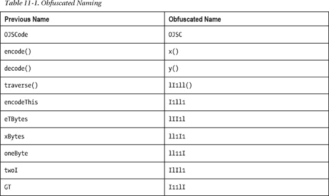
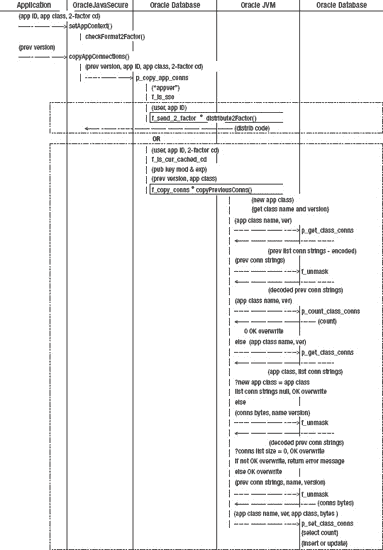
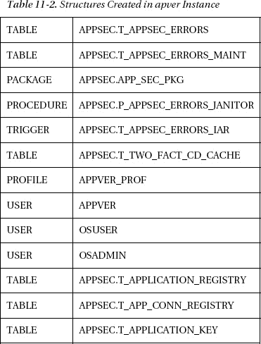
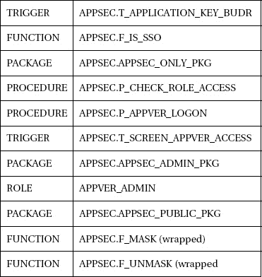

## 第 11 节

## 增强安全性

每年，我们公司的总裁都会给我们做动员讲话。总的来说，他会谈论我们作为一个公司在这一年中所做的好事，并分享我们失败或不太成功的时刻的清单。在演讲的最后，总裁认可了员工的技能和承诺，并鼓励我们不仅要继续做我们正在做的事情，还要做得更多，接受每一个新的挑战。

我们需要这是关于计算机安全的相同的鼓励讲话。我们做得很好，也取得了成功，但总会有新的挑战和我们可以做得更多的领域。

我们有一个特定的领域需要解决，我在前面的章节中提到过。我们所有的 Oracle 应用都有一个弱点:我们嵌入了密码。这个问题不会消失。我们已经从代码中删除了所有密码，除了应用验证用户`appver`的密码。现在，我们需要采取额外的步骤来保护该密码。

我们的另一个弱点是特权用户攻击的风险。目前，如果一个流氓 DBA(或具有 DBA 权限的黑客)愿意，他可以读取我们在`t_app_conn_registry`表中的所有密码。当然，他必须知道一些 Java 来重组`HashMap`。任何能够访问备份磁带或档案的人也可以打开表格，访问我们所有的应用密码。我们需要的是静态数据加密；即 Oracle 表中和磁盘上的数据加密。

在前一章中，我们生成了代码，它将存储来自以任何本地用户身份运行的任何应用的应用连接字符串。这很方便，但是我们需要将这个过程形式化，并将其委托给应用验证管理员。为此，我们将引入`appver_admin`角色，并讨论管理应用连接字符串的过程。

如果攻击者成功获得了`appver`密码，我们希望严格限制他在数据库中可以做什么和看到什么。我们已经有了登录触发器，而`appver`只能访问我们应用安全流程的一些程序和有限数据。但是我们将会看到，Oracle 数据库中的每个用户都可以访问我们不希望公开的`PUBLIC`数据，因此我们将尝试加强我们一般 Oracle 应用的安全性。

### 隐藏 APPVER 连接字符串

我们不会解决嵌入密码的问题，你可能想知道为什么。一言以蔽之，这是一个“先有鸡还是先有蛋”的问题。也许我们可以在 Oracle 数据库中隐藏我们的密码，但是我们需要一个 Oracle 密码来从数据库中请求它们。

没有用户/口令，您无法与 Oracle 数据库对话，因此会出现口令存储在哪里的问题。我们已经解决了所有应用密码的问题，除了网守帐户`appver`。因此，让我们来看看隐藏密码的一些可能的解决方案。

#### 从第二个来源/服务器获取

好吧，如果我们不想在代码中使用密码，并且我们不能从 Oracle 数据库中获得它(没有密码)，也许我们需要存储它并从辅助服务器中检索它。今天结束时，我将宣传坚持使用 Oracle 数据库作为我们的服务器的想法。支持和保护一台服务器远胜于将您的安全角色分布在多个平台上，主要是因为这样更容易考虑和监控。

##### 从端口服务器

在我工作的地方，我们有一个端口服务器(一个打开`ServerSocket`并监听网络端口的多线程应用),它执行一些与我们在[第 10 章](10.html#ch10)中描述的`appver`结构相同的活动，并返回连接字符串。这是一个很棒的解决方案，但这不是我的功劳——是我的同事想出来的。该服务器只做它应该做的事情，并安全地传递连接字符串。在 J2EE 之前，它是土生土长的。

我们可以在我们的端口服务器中实现一些额外的安全性，比如 SSO 和双因素身份验证，这些都是目前没有的。然而，该服务器的主要缺点有两个:首先，连接字符串存储的安全性低于 Oracle 质量。现在，不是通过 Oracle 帐户获得访问权限，而是通过操作系统帐户或组来提供访问权限。其次，管理另一种具有独特配置和代码的服务器意味着潜在的更大的支持需求和独特的知识。

##### 来自马绍尔群岛共和国

远程方法调用(RMI)是一个将 Java 功能分成两半的系统。一些 Java 代码运行在客户机上，一些运行在 RMI 服务器上。使用 RMI，您可以从 Java RMI 服务中检索连接字符串。

这种方法与前面描述的端口服务器具有非常相似的优点和缺点。它的一个优点是，它是一种行业标准的方法，而不是一种自己开发的端口服务器，因此可能不太关心对支持的独特要求。

##### 从 URLClassLoader

如果你曾经在浏览器中运行过 Applet，你会看到`URLClassLoader`在运行。使用这种方法，您的一些应用代码(可能是检索和传递连接字符串的代码)不会存储在客户端计算机上。这是代码的分离，但不是处理的分离。需要时，本地应用从 HTTP (web)服务器下载 jar 文件或类文件，并运行这些文件中的代码。您的应用在客户端计算机上独立运行，不提供服务器端身份验证。此外，如果应用可以从 URL 读取文件，那么本地机器上的任何其他 web 客户端也可以。

简而言之，如果我们在浏览器中运行，我们可能有服务器端认证。可能存在从浏览器到某些文档/应用领域的领域认证，这通常意味着访问 URL 的另一个用户名/密码提示。或者在浏览器中，如果网页或服务器指示浏览器在返回 jar 文件(仍在讨论 URLClassLoader)之前向 active directory(或类似的)验证登录用户，也可能有 SSO。但是在目前的讨论中，让我们坚持客户端应用。

也许我们可以修改`URLClassLoader`的标准行为，从安全的存储库中读取代码，从而安全地获得我们的连接字符串。嗯，我们正在谈论一个 RMI 服务器(带有唯一的类加载器)和一个端口服务器的组合，同样有同样的弱点。

##### 所有这些方法的缺点

电脑黑客攻击客户端比攻击服务器更好。在 Java 中，最终所有这些连接字符串都在内存中被转换成人类可读的形式。无论多么短暂，这是我们最大的安全弱点，也是我们尚未解决的问题。我们在 utility `OracleJavaSecure`类中所做的最大努力只成功地将连接字符串保留在应用代码之外，并且在需要它们的时候将它们加密，然后丢弃未加密的字符串。

查看针对客户端攻击的明显保护措施(即仅从服务器连接到 Oracle 数据库)超出了本书的范围。Web 应用就是这样一个例子:用户可以看到网页，但是网页是由 web 服务器查询的数据生成的。我们提到了马绍尔群岛共和国，它可以在这方面发挥潜在的作用。使用 RMI，客户机可以从 RMI 服务器请求数据，而 RMI 服务器将负责查询 Oracle 数据库。

如果您决定从 web 服务、HTTP 或 RMI 服务器上运行所有 Oracle 查询，那么您需要将注意力转向在服务器上保护 Oracle 密码的获取和使用，这与我们讨论的客户端应用安全性是相同的，只是更加集中。

#### 从一个当地人那里得到:JNI

也许我们可以通过使用不同于 Java 的编程语言来存储和读取我们的密码，甚至可能用于查询 Oracle 数据库，从而保护我们的 Oracle 密码。我们可以用 c++编写一个过程，并使用 Java 本地接口(JNI)从我们的 Java 应用中调用它。

当然，因为 Java 被编译成由 JVM 解释的字节码，字节码比编译的 C+代码更容易反编译回源代码。但是用任何语言编写的代码都可以反编译或反汇编。动态链接库(dll)和可执行程序同样容易受到攻击。

我建议坚持使用 Java。为了安全起见，维护和应用一套安全的编程技能要比使用多种语言时半流利半可信要好。

#### 从加密的 Java 类中获取

好了，我们回到我们的客户端 Java 代码，我们正在尝试保护我们的嵌入式 Oracle 密码。如果我们能对我们的密码进行编码，这样只有我们的程序才能读取它，那就太好了。但是我们必须隐藏我们的程序是如何读取它的，以防止黑客复制这个过程并读取密码。

这个问题已经被问过了，我们在这里再问一次，我们可以通过加密我们的类文件来隐藏我们在 Java 中所做的事情吗？答案是肯定的，Vladimir Roubtsov 在他 2003 年 5 月的文章“破解 Java 字节码加密”中对这个过程和结果做了精彩的描述。他给自己的文章加了副标题“为什么基于字节码加密的 Java 混淆方案不起作用。”

Roubtsov 文章的核心描述了他的`EncryptedClassLoader`。如果您还记得，我们在上一章中讨论了关于在 Oracle 数据库中实现应用对象和类的类装入器。我们说过`ClassLoader`不能实现他没有先验知识的类，所以我们在 Oracle 数据库上放了一个存根类。

RMI 有一个`RMIClassLoader`,它可以从存根或框架类中加载一个类，并将其与 RMI 服务器上的实现类进行匹配。`URLClassLoader`可以从远程的 jar 文件或类文件中加载类，例如在 web 服务器上。

在 Roubtsov 的`EncryptedClassLoader`的情况下，需要在实现对象或类之前解密字节码。这很好，我们都在考虑开绿灯！

然而，Roubtsov 指出了信任这种安全的谬误。在每个类装入器中的某个时刻，字节码被传递给`defineClass()`方法，该方法必须以 JVM 可读的形式呈现类。正是在这一点上，我们的类的形式和功能暴露给了任何 Java 黑客。

我不是说加密字节码是个坏主意，只是说我们没有实现有意义的加密——只是一个复杂的混淆。也许所有的加密都是如此:只有加密到了需要解密才能使用的程度。

实现我们自己的类装入器有一些问题:它如此接近 JVM 的核心，以至于我们需要小心，并且可能需要在每次 Java 更新时重新访问它。`ClassLoader`中的一个错误对我们的应用来说可能是毁灭性的。仅仅这一点就让我们对字节码加密望而却步。

#### 从加密的字符串中获取

为什么我们不加密我们的密码，只在需要的时候解密？这是个好主意，但是加密密钥呢，我们如何保护它呢？这又是一个“鸡和蛋”的问题吗？我也这么认为暴露密钥就等于暴露密码。

#### 从编码字符串中获取

如果我们对字符串进行编码，使其无法识别，会怎么样？这也许和加密一样好，但是它不需要加密密钥。我们将在一个名为`OJSCode`的类中查看一些示例 Java 代码，以对我们的密码进行编码。

##### 使用编码方法

简而言之，我们的`OJSCode.encode()`方法将获取连接字符串，并通过与其他字节进行二进制异或(XOR)来对其进行逐字节编码。XOR 转换可以执行两次，以返回到原始字节。在 XOR 中，只有当一个或另一个原始字节中的类似位为 1，而不是两个原始字节都为 1 时，结果位才为 1。这个过程是这样的:

`Original Byte   0 1 0 0 1 1 0 1
Other Byte      1 1 1 0 0 1 0 1
Result of XOR   1 0 1 0 1 0 0 0 (resultant bit is 1 where only one of bits is 1)
Other Byte      1 1 1 0 0 1 0 1
Result 2nd XOR  0 1 0 0 1 1 0 1 (notice this is the same as our original Byte)`

出于我们将在后面讨论的安全原因，我们将在`OJSCode`类之外获取我们的“其他”字节。我们对`OJSCode`的意图只是从`OracleJavaSecure`类中使用它，那么我们回到那个期望的类来获取我们的其他字节怎么样？我们将在`OracleJavaSecure`中从名为“location”的静态字符串中组装我们的其他字节。

因为我们知道我们将对原始字节进行 XOR 运算，所以我们需要与原始字节数量相同的其他字节。[清单 11-1](#list_11_1) 展示了我们如何得到两个字节数组来表示我们的连接字符串(`encodeThis`)和一个相同长度的其他字节数组。

***清单 11-1。**得到两个相同长度的字节数组进行异或编码*

`{ static String location = "in setAppVerConnection method."; }

    String location = OracleJavaSecure.location;
    byte[] eTBytes = encodeThis.getBytes();
    int eTLength = eTBytes.length;
    while( eTLength > location.length() ) location += location;
    String xString = location.substring( 0, eTLength );
    byte[] xBytes = xString.getBytes();`

首先，我们从`OracleJavaSecure`获得一个`location`字符串的本地副本。它是用默认(包)范围定义的，所以`orajavsec`包之外的代码看不到它。我们将它自身连接足够多次，得到一个长度等于或长于`encodeThis`的字符串。然后我们得到与`encodeThis`长度相等的子串。

要进行字节异或运算，我们只需使用“^”运算符。在[清单 11-2](#list_11_2) 中，我们遍历原始和其他字节数组，并对每个字节对进行异或运算，将`bytes`转换为这个过程的`ints`。我们将结果转换为一个`byte`，并将其存储在`code[]`字节数组中。

***清单 11-2。**逐字节异或编码*

`    byte[] code = new byte[eTLength];
    for( int i = 0; i < eTLength ; i++ ) {
        code[i] = (byte)( (int)eTBytes[i] ^ (int)xBytes[i] );
    }`

我们的连接字符串如下所示:

`“jdbc:oracle:thin:appver/password@localhost:1521:orcl”`

我们希望在`OracleJavaSecure`类中存储一个编码的替换——可以放在引号之间并作为字符串处理的东西。所以`OJSCode.encode()`方法将返回一个字符串，但不是任何一个字符串。字符串可以包含不可打印的字符，如回车(字符 13，十进制)和哔哔声(字符 7)。这些很难用引号之间的符号来表示。

当我们对原始字节进行 XOR 运算时，我们最终会得到一些不可打印的字符，因此我们需要一个过程来将它们全部转换为可读的字符，而不会损失任何保真度，也不会丢失信息。我们不需要从头开始解决这个问题——我们不是第一个有这种担忧的人。

将不可打印的字符表示为字符串的行业标准方法是对字符进行 Base64 编码。在 Base64 编码中，来自一个字节串的位被连接和分解成 6 位序列，这些序列被翻译成来自 64 个可打印字符的表中的字符。一个或多个“=”符号通常作为填充字符出现在 Base64 编码字符串的末尾(当 6 位值跨越 8 位边界时)。当看到一串可打印的字符末尾带有等号时，这清楚地表明是 Base64 编码，并且给出了用于编码的过程，如果这是一个问题的话。这不一定是一个问题，因为 Base64 编码只是为了使扩展字符更适合 web 浏览器，而常规的字母数字字符就是所期望的。但是，如果我们还试图伪装文本，那么 Base64 编码就会失败。令人惊讶的是，Base64 编码经常被用于向代理服务器和 web 服务器领域传递基本身份验证的密码，就像加密一样。清单 11-3 显示了我们进行 Base64 编码的 Java 调用。

***清单 11-3。** Base64 编码*

`    String decodeThis = (new BASE64Encoder()).encode( code );`

Oracle 已经在 JVM 中包含了 Base64 编码；不过，用起来比较麻烦。我们可以调用`**sun.misc.**BASE64Encoder`来完成我们的编码，但是看看它所在的包。这是 JVM 的一部分，但却是专有的。当我们编译使用该类的代码时，我们会得到以下警告消息:

`sun.misc.BASE64Encoder is Sun proprietary API and may be removed in a future release`

如果我们愿意，我们可以从许多免费来源获得 Base64 算法。但幸运的是，Base64 编码并不是唯一的游戏。我们可以创建自己的可打印编码。看[清单 11-4](#list_11_4) 。让我们取异或运算得到的每个`int`，并通过调用`Integer.toHexString()`得到十六进制格式的`String`表示。我们的十六进制字符串的长度将是一个或两个字符，范围从十六进制的`0` (0x00)到`fe` (0xfe)(十进制的 0 到 254)。当数字小于 0x10 时，它将只有一个字符，但是我们想知道如何分解我们的编码字符串，所以我们将在那些十六进制字符串前面加上一个“0”字符。这样，每个字节由两个字符表示，我们知道如何解析和解码每个字符。我们可以称之为填充十六进制异或编码。

***清单 11-4。**填充十六进制异或编码*

`    StringBuffer sBuf = new StringBuffer();
    String oneByte;
    for( int i = 0; i < eTLength ; i++ ) {
        oneByte = **Integer.toHexString**( (int)eTBytes[i] ^ (int)xBytes[i] );
        if( oneByte.length() == 1 ) sBuf.append( "0" + oneByte );
        else sBuf.append( oneByte );
    }
    String decodeThis = sBuf.toString();`

解码这个`OJSCode`连接字符串的过程与此相反。我们在每对字符上调用`Integer.parseInt()`，使用 16 的*基数*，因此我们从十六进制转换为十进制。然后，我们将这个整数与我们之前使用的“location”字符串中的另一个字节进行异或运算。这使我们回到最初的字符，我们从这些字符开始重建连接字符串。

使用 Base64 编码，编码字符串会更短。下面是一个例子(注意末尾的“=”符号填充):

`IE5DEgtTNVAUOUUGKw4aQkUnFR8KQA==`

我们自己的编码产生了更长的字符串。这是用我们的算法编码的同一个字符串。

`204e43120b533550143945062b0e1a424527151f0a40`

##### 混淆算法/代码

我们对`OJSCode`的计划是对我们的`appver`密码进行编码。在这种情况下，我们的 Java 代码类似于一个加密密钥。有了密钥，我们加密的东西就能被解密。有了`OJSCode`，我们的编码密码可以被任何能够访问`OJSCode`类的人解码和读取。

如果一个黑客拥有这个类，但是看不到`OJSCode` Java 代码，那么她将无法复制这个逻辑，并且有一个隐藏的方面是他无法复制的:我们调用这个类来获取`OracleJavaSecure`类中的`location`字符串。这算不上什么安全功能，但如果我们隐藏它，它将成为黑客的主要障碍。

我在这里建议的是代码混淆。逻辑隐藏在明显的地方。很难知道这是否会对阅读我们的代码造成很大的障碍，但这需要几个转换步骤——与我们混淆代码的步骤相反。

###### 混淆逻辑

我最喜欢 Java 代码的一个方面是它的可读性。我确实用堆栈方法调用来压缩我的代码，Java 代码的面向对象方面是必须理解的，但总的来说，它非常可读。如果我们把降低可读性作为我们的目标呢？我们可以采取的第一步是使用我们的十六进制编码，而不是标准的 Base64。这里的其他想法旨在让您了解如何混淆代码。请注意，使您的代码更难被黑客理解的东西也会使您的代码更难理解和维护。因此，请在安全的地方保存一份原始代码的副本，以供自己参考。

我们有一个名为`eTLength`的计算字段，它是我们初始连接字符串的长度，但是如果我们愿意在每次需要时获取字符串的长度，我们就不需要方法成员。我们可以通过串联`Strings`而不是使用`StringBuffer`来增加复杂性。它的效率并不高——事实上，它用瞬态字符串塞满了内存，但是逻辑不太明显。让我们也将`for`循环转换成一个永恒的`do while true`循环。我们将通过转到标签`GT`来打破循环:我们正在创建一个相当于`GOTO`语句的 Java。我们有一些关于预期输入/输出的内部知识；编码字符串(使用我们的填充十六进制编码)的长度将是连接字符串的两倍。利用这些知识，当编码的字符串足够长时，我们将会跳出循环；也就是说，连接字符串长度的两倍，连接字符串长度的模等于 0。我们知道，我们需要处理的原始字节数组中的下一个位置是编码字符串长度的一半，因为它被连接在一起。我们的其他字节数组中可能没有足够的字符来与连接字符串字节进行 XOR 运算，所以让我们通过使用 modulus 绕到“其他”字节数组的前面。我们这样做，而不是将`location`连接到它自己，直到足够长。到目前为止，我们的混淆代码如[清单 11-5](#list_11_5) 所示。

***清单 11-5。**混淆逻辑，第 1 步*

`    static String encode( String encodeThis ) {
        byte[] eTBytes = encodeThis.getBytes();
        byte[] xBytes = OracleJavaSecure.location.getBytes();
        String decodeThis = "";
        String oneByte;

**        GT: do {**

            oneByte = Integer.toHexString(
                (int)eTBytes[decodeThis.length()/2] ^
                (int)xBytes[( decodeThis.length()/2 ) % xBytes.length] );
            if( oneByte.length() == 1 ) **decodeThis += "0";**
            **decodeThis += oneByte;**
            if( **( ( decodeThis.length()/2 ) % eTBytes.length ) == 0** )
                **break GT;**
        **} while( true );**
        return decodeThis;
    }`

查看我们的代码，我们看到许多硬编码的整数，其中大多数等于 2。让我们创建一个成员整数，通过复杂的计算得出是 2，并在这些整数的步调中使用它。我们也将利用这样一个事实:我们的整数除以自身是 1，减去自身是 0。一旦我们获得了原始连接字符串的字节，我们就可以重用该原始连接字符串作为我们的返回字符串。在`OJSCode`的几个地方，我们通过调用`String.getBytes()`方法从一个字符串中获得一个字节数组。让我们把它重写为一个叫做`traverse()`的方法来代替`String.getBytes()`。在这种情况下，我们将允许`traverse()`获取一个`null`并得到`location`字符串的字节。此外，我们将在`OracleJavaSecure`中创建一个额外的成员，命名为小写`l` (ell)，我们将设置它等于`location`，我们将指向它。现在我们的代码看起来像清单 11-6 中的。

***清单 11-6。**混淆逻辑，步骤 2*

`    static String encode( String encodeThis ) {
        byte[] eTBytes = **traverse**( encodeThis );
        byte[] xBytes = **traverse()**;
        encodeThis = "";
        String oneByte = "*";
        **int twoI** = Integer.parseInt(
            String.valueOf( Integer.toHexString(
            (int)(oneByte.charAt(twoI - twoI))).charAt(twoI - twoI)));
        GT: do {
            oneByte = Integer.toHexString(
                (int)eTBytes[encodeThis.length()/twoI] ^
                (int)xBytes[( encodeThis.length()/twoI ) %
                xBytes.length] );
            if( oneByte.length() == ( **twoI/twoI** ) )
                encodeThis += "0";
            encodeThis += oneByte;
            **if(** ( ( encodeThis.length()/twoI ) % eTBytes.length )
                == ( **twoI - twoI** ) )
            {
                **System.arraycopy**( xBytes, twoI - twoI,
                    eTBytes, twoI * 0, twoI );
                break GT;
            }
        } while( true );
        return decodeThis;
    }

    static byte[] **traverse**( String encodeThis ) {
        int twoI = 0;
        if( encodeThis == null )
            **encodeThis = OracleJavaSecure.l**;
        byte[] eTBytes = new byte[encodeThis.length()];
        do eTBytes[twoI] = (byte)(encodeThis.charAt(twoI++));
        while( twoI < eTBytes.length );
        return eTBytes;
    }`

我们也增加了一些误导。现在，在我们的`do while`循环的最后一个`if`语句中，在我们中断到`GT`标签之前，我们执行一个`arraycopy()`。我们将“其他”字节数组中的前两个字节复制到连接字符串字节的开头。这本质上是没有意义的，因为我们已经处理完那些数组了；然而，误导的策略经常被用于混淆代码。

###### 混淆命名

让我们再多走一步——尽管还可以完成许多其他的混淆过程。这一步仅仅是用难以阅读的无意义的名称替换我们的成员名称。让我们根据[表 11-1](#tab_11_1) 交换名字。数字 1 (one)、大写 I 和小写 l (ell)的这些序列被选择来混淆。它们都以一个字母字符开始，以符合编译器。这一步模糊处理的最大损失是这些方法和成员的有意义的名称的损失。

经过这些翻译，我们的代码几乎无法辨认。只是代码结构看起来像 Java，还有几个通用的方法引用。清单 11-7 显示了 encode() [x()]和 traverse()[lI1ll()]方法。

***清单 11-7** 。模糊命名*

`public class OJSC {
    static String x( String I1ll1 ) {
        byte[] lII1l = lI1ll( I1ll1 );
        byte[] ll1I1 = lI1ll( null );
        I1ll1 = "";
        String ll11I = "*";
        int IlIl1 = Integer.parseInt(
            String.valueOf( Integer.toHexString(
            (int)(ll11I.charAt(0))).charAt(0)));
        I11lI: do {
            ll11I = Integer.toHexString(` `                (int)lII1l[I1ll1.length()/IlIl1] ^
                (int)ll1I1[( I1ll1.length()/IlIl1 ) %
                ll1I1.length] );
            if( ll11I.length() == ( IlIl1/IlIl1 ) )
                I1ll1 += "0";
            I1ll1 += ll11I;
            if( ( ( I1ll1.length()/IlIl1 ) % lII1l.length )
                == ( IlIl1 - IlIl1 ) )
            {
                System.arraycopy( ll1I1, IlIl1 - IlIl1,
                    lII1l, IlIl1 * 0, IlIl1/IlIl1 );
                break I11lI;
            }
        } while( true );
        return I1ll1;
    }

    static byte[] lI1ll( String I1ll1 ) {
        int IlIl1 = 0;
        if( I1ll1 == null )
            I1ll1 = OracleJavaSecure.l;
        byte[] lII1l = new byte[I1ll1.length()];
        do lII1l[IlIl1] = (byte)(I1ll1.charAt(IlIl1++));
        while( IlIl1 < lII1l.length );
        return lII1l;
    }`

##### 生成编码的 APPVER 连接字符串

我们将向`OracleJavaSecure`的`main()`方法添加代码，如[清单 11-8](#list_11_8) 所示，以接受`appver`的密码作为命令行参数，并加密`appver`的连接字符串。我们检查参数的格式，看它是否可能是一个双因素身份验证代码。如果不是，那么我们调用`OJSC`中的混淆代码进行加密和解密以供显示。这使用了这里定义的附加的`appver`连接字符串属性。

***清单 11-8。**app ver 密码和连接字符串的实用编码*

`if( args.length != 0 && args[0] != null ) {
        String encodeThis = args[0];
        if( **!** encodeThis.equals(**checkFormat2Factor**(encodeThis)) ) {

**            encodeThis = "jdbc:oracle:thin:appver/" + encodeThis +**

**                "@localhost:1521:orcl";**

                //"@localhost:1521:apver"; // for use later in Chapter 11
            String encoded = OJSC.x( encodeThis );
            System.out.println( encoded );
            encodeThis = OJSC.y( encoded );
            System.out.println( encodeThis );
        }
    } else System.out.println(` `        "You may enter APPVER password on command line." );`

这里的意图是，您可以用您想要的`appver`密码调用一次`OracleJavaSecure`，然后在`setAppVerConnection()`方法中将编码的连接字符串复制到*OracleJavaSecure.java*的代码中。

##### 对编码的 APPVER 连接字符串进行硬编码

我们将通过硬编码我们编码的`appver`连接字符串来修改`setAppVerConnection()`方法，并通过在调用`setConnection()`时调用`OJSC.y()`方法来解码它。(参见[清单 11-9](#list_11_9) 。)通过在调用`setConnection()`的最后时刻解码连接字符串，并且不将成员变量设置为解码值，当黑客可能查看明文密码时，我们最小化了攻击模式和持续时间。

***清单 11-9。**对编码的 appver 连接字符串进行硬编码*

`    String prime =
"030a42105f1b3311133a0048370707005f020419190b524215151b1c13411b0a601f0a17201c18391606795e5b5c54591b1b0c02"
    setConnection( OJSC.y( prime ) );
    appVerConn = conn;`

### 创建 Oracle 客户端钱包

Oracle 客户端提供了一种对存储在客户端计算机上的密码进行混淆/加密的标准方法。它被称为安全外部密码存储，但它更好地被称为钱包。因为钱包可以在服务器和客户机上使用，我们应该称之为客户机钱包。我希望向您全面介绍 Oracle 客户端钱包，但我们最终不会在我们的安全基础架构中使用它们。

关于客户机钱包，您应该知道的第一件事是，默认情况下，它们必须存在于每个操作系统用户的主目录中。客户机钱包被视为 Oracle 凭据的个人存储。这与我想要实现的目标完全相反，那就是桌面上没有 Oracle 用户凭据。现在，如果我们将我们的`appver`用户密码与其他潜在的额外用户密码混合在一起，我们就无法集中管理它，例如更新密码。

关于 Oracle 客户机钱包，您应该知道的第二件事是，任何拥有它们的人都可以复制和使用它们。我可以创建一个客户端钱包并将`appver`密码放入其中，然后将其复制到每个计算机用户的主目录，他们都可以使用这个钱包以`appver`的身份登录。这似乎是集中分发密码更新的一种方式。也许吧，但这也是有问题的。这些钱包文件可以像糖果一样被送出，通过电子邮件发送给好友，从备份磁带中被盗——无论如何。这不是保护。假设操作系统正在提供对用户主目录的访问控制，并且可以保护文件。

第三件要知道的事情是，客户端钱包通过钱包密码来防止修改和查看，但是如果您有文件，则使用客户端钱包不需要认证。如果我们将我们的`appver`密码放在客户端钱包中，那么任何拥有钱包文件的人都可以作为`appver`连接到 Oracle 数据库。

#### 安装 Oracle 客户端

Oracle 客户端包含在 Oracle 数据库安装中，但是您也可以单独下载并安装 Oracle 客户端。将 Oracle 客户端安装在单独的计算机上是测试客户端应用的最佳方式，而不是在 Oracle 数据库上运行它们，这也是可以做到的。在下面的讨论中，我们将假设您已经将您的`ORACLE_HOME`环境变量设置为类似于以下之一的值:

`SET ORACLE_HOME=D:\app\oracle\product\11.2.0\dbhome_1

SET ORACLE_HOME=C:\app\oracle\product\11.2.0\client_1`

#### 创建钱包

当您决定将连接密码放入客户端钱包时，您要做的第一件事是为钱包选择一个位置。虽然对创建 wallet 的位置没有限制，但是当您使用 wallet 连接 Oracle 数据库时，假定的位置是在当前操作系统用户的主目录中。您可以在任何安全的位置创建您的客户端钱包，但是您也可以在您自己需要的地方创建它。否则，您需要将它复制到您的主目录中以供使用和测试。

预期的钱包位置位于用户主目录中与操作系统用户 ID 同名的子目录中。例如，如果用户的 OS 用户 ID 是 FredF，那么我们将在他的主目录中创建一个`fredf`目录，并在那里创建或复制 wallet 文件。在我们的示例中，我们将使用 FredF 作为操作系统用户名。为您的客户端钱包创建一个目录。

`mkdir C:\Users\FredF\fredf`

 **注意**在 Windows XP 中，你会用*文档和设置*代替这些命令中的*用户*。

为了创建您的密码存储，您将向 *mkstore* 实用程序发出命令。一个命令将创建存储，另一个命令将创建密码凭证。在每个命令中，您将指向钱包文件的目录位置。第一个 *mkstore* 命令创建钱包。它会提示您输入符合特定复杂性规则的钱包密码。

`%ORACLE_HOME%\bin\mkstore -wrl C:\Users\FredF\fredf –create`

第二个命令创建加密的密码/凭证。该命令将提示您输入两次`appver`用户的密码；然后它会提示你输入钱包的密码——这个密码就是你在第一个 *mkstore* 命令中输入的密码。现在，让我们在客户端钱包中为`appusr`用户创建一个条目:

`mkstore -wrl C:\Users\FredF\fredf –createCredential **orcl_appver** appver
mkstore -wrl C:\Users\FredF\fredf –createCredential **orcl_appusr** appusr`

您可以使用几个命令来查看客户端钱包的内容。您需要输入钱包密码才能使用这些命令:

`mkstore -wrl C:\Users\FredF\fredf -list
mkstore -wrl C:\Users\FredF\fredf –listCredential` `mkstore -wrl C:\Users\FredF\fredf –viewEntry oracle.security.client.connect_string1
mkstore -wrl C:\Users\FredF\fredf –viewEntry oracle.security.client.username1
mkstore -wrl C:\Users\FredF\fredf –viewEntry oracle.security.client.password1`

注意，我们将第一个凭证的名称命名为`orcl_appver`——这代表了 *orcl* Oracle 数据库实例上的`appver`用户。我们需要对配置数据库实例的 *TNSNames* (透明网络底层)搜索的 *sqlnet.ora* 和 *tnsnames.ora* 文件进行一些补充。TNS 之于 *SQLnet* (Oracle 的数据库网络通信协议)如同域名服务(DNS)之于 TCP/IP。TNS 允许我们为单个 Oracle 数据库实例使用多个名称(别名),并在编写应用时引用别名，这些别名可以在不同的时间指向不同的 Oracle 实例。这种灵活性是命名服务的主要原因；另一个主要原因是进行远程查找(不在本地存储所有的姓名和地址)及其必然的原因:集中管理姓名/地址关联。当然，我们需要为 TNSNames 服务使用 LDAP 或类似的东西来实现第二个目标。

TNSNames 服务有许多我们在本书中没有涉及的特性。有关更多信息，请参考 Oracle 数据库网络服务参考手册。

*sqlnet.ora* 和 *tnsnames.ora* 文件存在或需要在客户端的特定目录下创建。根据您的安装，这两个文件都在类似于*% ORACLE _ HOME % \ network \ admin*的目录中。将[清单 11-10](#list_11_10) 中的行添加到您的 *sqlnet.ora* 文件中。对于基本的客户端钱包安装，您只需要指定`WALLET_OVERRIDE`指令。您也可以指定`WALLET_LOCATION`指令，但是它很可能没有被使用。我发现`WALLET_LOCATION`指令的格式有点敏感；虽然(对于特定的 Oracle 客户端版本)允许使用驱动器号，但不允许使用引号和尾随的“\”字符。还要注意，由 Oracle 11g 客户机创建的 wallet 不能用于 Oracle 10g 客户机，但是 10g wallets 可以用于 11g 客户机。

***清单 11-10。**添加到钱包客户端 sqlnet.ora 文件*

`SQLNET.WALLET_OVERRIDE=TRUE`

 **注意**将`WALLET_OVERRIDE`指令放在**服务器** *sqlnet.ora* 文件中(例如*% ORACLE _ HOME % \ NETWORK \ ADMIN \ sqlnet . ora*)可以阻止 ORACLE 数据库响应客户端连接。我的建议是，如果您在与 Oracle 数据库相同的计算机上测试客户机 wallet，那么您可以在没有 *sqlnet.ora* 文件中的`WALLET_OVERRIDE`的情况下启动数据库，然后在测试客户机 wallet 时临时添加该指令*。*

 *将[清单 11-11](#list_11_11) 中的行添加到您的客户端 *tnsnames.ora* 文件中。第一部分是 Oracle 实例的标准 TNSNames 条目。对于我们在钱包中输入的每个密码，我们将需要在 *tnsnames.ora* 中输入一个额外的条目。如果你以前在 *tnsnames.ora* 中做过条目，但从未使用过钱包，这可能对你来说有点奇怪。但是考虑到您正在为钱包中的每个凭证的特定用户提供密码，因此您正在将该密码与 *tnsnames.ora* 中的条目进行协调。例如，`orcl_appver`是 *tnsnames.ora* 中专门供`appver`用户使用的条目。

***清单 11-11。**添加到钱包客户端 tnsnames.ora 文件*

`orcl =
        (DESCRIPTION=
                (SOURCE_ROUTE=YES)
                (ADDRESS=(PROTOCOL=tcp)(HOST=orcl.org.com)(PORT=1521))
                (CONNECT_DATA=(SERVICE_NAME=ORCL)))

orcl_appver =
        (DESCRIPTION=
                (ADDRESS=(PROTOCOL=tcp)(HOST= orcl.org.com)(PORT=1521))
                (CONNECT_DATA=
                        (SERVER=DEDICATED)
                        (SERVICE_NAME=ORCL)
                        (SID=ORCL)))

orcl_appusr =
        (DESCRIPTION=
                (ADDRESS=(PROTOCOL=tcp)(HOST= orcl.org.com)(PORT=1521))
                (CONNECT_DATA=
                        (SERVER=DEDICATED)
                        (SERVICE_NAME=ORCL)
                        (SID=ORCL)))`

 **注意**至少主机名在你的情况下会有所不同，所以修改那些设置。

#### 使用 SQL*Plus 中的钱包

这是使用钱包最巧妙的地方。假设 wallet 已创建并放置在需要的位置，并且您的配置文件是正确的，则无需输入口令就可以连接到 Oracle 数据库。只需输入以下 SQL*Plus 命令进行连接:

`%ORACLE_HOME%\bin\sqlplus /@orcl_appusr`

请记住，密码是通过钱包以某种方式获得的；因此，它仍然存在于客户端。当从钱包中获取明文密码时，可以在处理过程中检查计算机存储器以捕获明文密码。人们还可以检查 Oracle 数据库用来维护和使用 wallet 的 Java 代码、混淆的 Java 代码、dll 和混淆的 DLLs，从而揭示独立解密 wallet 口令的过程。我不想假装知道这有多难。

#### 使用 Java 的钱包

在 Java 应用中使用客户机钱包进行身份验证需要在您的`CLASSPATH`中添加一个 jar 文件。读取钱包文件需要 oraclepki.jar 文件。在命令行上，你可以在 *Chapter11/wallet* 文件夹中运行一个测试。

`java -cp %CLASSPATH%;%ORACLE_HOME%\jlib\oraclepki.jar TestWallet`

在*TestWallet.java*文件中，您会发现一个`main()`方法，其代码如[清单 11-12](#list_11_12) 所示。您可能需要修改此代码来运行测试。

***清单 11-12。**配置 Java 使用客户端钱包*

`    System.setProperty("oracle.net.tns_admin",
        "C:/app/oracle/product/11.2.0/client_1/NETWORK/ADMIN");
    Properties info = new Properties();
    String username = System.getProperty( "user.name" );
    info.put("oracle.net.wallet_location",
        "(SOURCE=(METHOD=file)(METHOD_DATA=(DIRECTORY=C:/Users/" +
        username + "/" + username + ")))");`

我们设置了`tns_admin`系统属性，这样我们就可以找到 *tnsnames.ora* 文件，以及该文件中的连接标识符`orcl_appusr`。我们实例化了一个`Properties`对象，当我们得到`Connection`时将传递这个对象。我们需要设置的属性之一是`wallet_location`属性。您还记得，我们将钱包文件创建或复制到用户的主目录中，该目录与用户同名。为了设置 wallet 属性，我们获取了`user.name` `System`属性，并从该值连接了一个目录位置。

我们使用一个`OracleDataSource`类来获取我们的连接，如清单 11-13 中的[所示。我们在第 8 章](#list_11_13)中看到了`OracleDataSource`，当时我们看到了一种池连接的单点登录。在这种情况下，我们将连接 URL 设置为使用我们的钱包连接标识符`orcl_appusr`。我们还传入了之前实例化的`Properties`类，并调用了`getConnection()`方法。

***清单 11-13。**使用客户端钱包获得 Java 连接*

`    OracleDataSource ds = new OracleDataSource();
    ds.setURL("jdbc:oracle:thin:@**orcl_appusr**");
    ds.setConnectionProperties(info);
    Connection c = ds.getConnection();`

在 TestWallet.java 的*，我们也建立了一个代理连接，和我们在`OracleJavaSecure`中使用的一样。因此，只有能够进行 SSO 的操作系统用户(拥有匹配的 Oracle 用户)才能运行`TestWallet`。*

 *#### 管理钱包安全

客户端钱包可能是保护我们的应用验证用户密码的完美解决方案。我鼓励你在这种情况下使用它，除了我的保留意见。

诚然，钱包可以保护密码不被黑客读取，这可能比我们迄今为止在本书中开发的任何东西都要好。一旦你让它工作起来，它就会像描述的那样工作。很容易复制到每个人的主目录中供他或她使用。此外，我们已经将`appver`密码描述为数据:真实应用帐户的看门人或保镖。

然而，钱包的一些积极方面也有其黑暗的一面。任何拥有 wallet 文件的人都可以按照用户的指定连接到 Oracle 数据库。这种联系不一定要通过你的应用来实现；正如我们所看到的，它可以通过 SQL*Plus 会话发生。对于`appver`用户来说，这不是什么大问题——但是对于大多数其他 Oracle 数据库用户来说，这是个大问题。不要只考虑合法的计算机用户，也要考虑(例如)那些访问您的异地备份存储库并从那里收集钱包文件的用户。人们认为保护钱包文件是操作系统权限的责任，但这并不可靠——如果一个合法用户通过电子邮件将文件发送给一个伪装成计算机支持技术人员的黑客呢？

另一个问题是一个与文件分发、管理和更新有关的实际问题。可能您已经有了一个系统，但是将文件放入每个用户的主目录并保持更新并不是一件小事。

最后，在客户端钱包和安全性方面没有提到的一个问题是密码与主机/Oracle 数据库实例规范的脱节，这是对用于配置钱包身份验证的文件进行检查后得出的逻辑结论。用户可能会尝试用其他 Oracle 实例替换您在 tnsnames.ora 文件中指定的实例；从而针对每个实例测试特定的钱包用户和密码。例如，如果一个黑客修改了他机器上的 tnsnames.ora 文件，使得`orcl_appusr`条目指向`(SID=TestOrcl)`，他可以尝试使用同样的命令以`appusr`的身份连接到该实例:

`sqlplus /@orcl_appusr`

 **警告**对于 Oracle client wallet 文件，攻击者可以使用您在任何实例上配置的指定用户进行连接，只要该用户存在并具有相同的密码。

也许您的用户只存在于一个实例上，或者在每个实例上只有完全相同的特权；然而，更有可能的是，用户在较低优先级(沙盒、开发或验收)区域上比在生产区域上具有扩展特权。任何实例上的这些扩展权限都可能提供额外的攻击媒介。

### 跟踪 Oracle 客户端代码

在开发过程中，您经常会有这样的经历:事情不顺利，您的应用无法告诉您问题出在哪里。错误发生在底层协议的某个地方，并且是隐藏的或模糊的。您甚至可能会看到误导性的错误消息。

在这种情况下，您可能需要调用后备资源，要求您的网络管理员在您的子网上放置一个网络嗅探器，并捕获数据包进行分析；希望你能发现问题。

但是，在此之前，在处理 Oracle 数据库时，您自己也有一些选择。您可以在客户端打开跟踪，查看客户端和 Oracle 数据库之间底层协议对话。只需在客户端 *sqlnet.ora* 文件中设置跟踪级别。值 16 是最大细节追踪；您也可以在级别 8、4、2 和 1 中选择较少的细节。

`TRACE_LEVEL_CLIENT=4`

 **警告**当您完成当前问题的故障排除后，请确保禁用跟踪日志记录。它会生成大量文件，这些文件可能包含大量数据，这些数据不仅会占用大量磁盘空间，还会带来安全隐患。在更高级别的跟踪日志记录中，从查询返回的数据也会显示在跟踪文件中。

跟踪文件(有几个)的默认位置之一是一个如下命名的文件夹:

`%ORACLE_HOME%\log\diag\clients\user_UserID\host_##########_##\trace`

在 Oracle 数据库上，您可能必须创建基本目录树，并授予所有用户对其进行写入的权限。

`mkdir %ORACLE_HOME%\log\diag\clients`

下面是启用了第 4 级跟踪的示例(只显示了前几行):

`Trace file D:\app\oracle\product\11.2.0\dbhome_1\log\diag\clients\ user_UserID\host_##########_##\trace\ora_2988_5952.trc
2011-07-09 07:22:35.826970 : --- TRACE CONFIGURATION INFORMATION FOLLOWS ---
2011-07-09 07:22:36.058905 : New trace stream is D:\app\oracle\product\11.2.0\dbhome_1\log\diag\clients\ user_UserID\host_##########_##\trace\ora_2988_5952.trc
2011-07-09 07:22:36.058968 : New trace level is 4
2011-07-09 07:22:36.059012 : --- TRACE CONFIGURATION INFORMATION ENDS ---
2011-07-09 07:22:36.059057 : --- PARAMETER SOURCE INFORMATION FOLLOWS ---
2011-07-09 07:22:36.059105 : Attempted load of system pfile source D:\app\oracle\product\11.2.0\dbhome_1\network\admin\sqlnet.ora
2011-07-09 07:22:36.059203 : Parameter source loaded successfully
2011-07-09 07:22:36.059241 :
2011-07-09 07:22:36.059275 : Attempted load of local pfile source C:\OraJavSecure\Chapter11\wallet\sqlnet.ora
2011-07-09 07:22:36.059308 : Parameter source was not loaded
2011-07-09 07:22:36.059337 :
2011-07-09 07:22:36.059367 : -> PARAMETER TABLE LOAD RESULTS FOLLOW <-
2011-07-09 07:22:36.059402 : Successful parameter table load
2011-07-09 07:22:36.059435 : -> PARAMETER TABLE HAS THE FOLLOWING CONTENTS <-
2011-07-09 07:22:36.059472 :  TRACE_LEVEL_CLIENT = 4
2011-07-09 07:22:36.059504 :  SQLNET.WALLET_OVERRIDE = TRUE
...`

### 记录 Oracle 瘦客户机跟踪数据

当您使用 Java 瘦 ojdbc 驱动程序时，您不能通过`sqlnet.ora`中的设置来配置跟踪。您将需要使用 ojdbc 驱动程序的日志功能。为此，您需要在您的`CLASSPATH`上放置一个不同的 ojdbc 驱动程序 jar， *ojbdc6_g.jar* (在 *ojdbc6.jar* 之前或作为其替换)。这个备用的日志 jar 文件位于 ORACLE 客户机目录%ORACLE_HOME%\jdbc\lib 中，或者位于 Oracle 下载网站:

[http://www . Oracle . com/tech network/indexes/downloads/index . html](http://www.oracle.com/technetwork/indexes/downloads/index.html)。

将目录更改为 wallet。要使用这个驱动程序文件(和钱包)运行`TestWallet`类，您可以运行一个 Java 命令行。跟踪日志记录和客户端 wallet 是不相关的；我们只是用`TestWallet`作为一个方便的例子来展示跟踪日志。

`cd Chapter11/wallet

java -Doracle.jdbc.Trace=true
    -cp .;%ORACLE_HOME%\jdbc\lib\ojdbc6_g.jar;%ORACLE_HOME%\jlib\oraclepki.jar
    -Djava.util.logging.config.file=OracleLog.properties TestWallet > temp.txt 2> temp2.txt`

关于这个命令行有几件事值得一提。指令`-Doracle.jdbc.Trace=true`打开跟踪记录。注意`CLASSPATH, -cp`指令中的 *ojdbc6_g.jar* 。使用这个 jar 文件可以启用日志记录。我们在`CLASSPATH`上还有 *oraclepki.jar* 文件，用于启用钱包。

`-Djava.util.logging.config.file=OracleLog.properties`指令告诉日志记录类在名为 *OracleLog.properties* 的文件中查找它们的属性设置。用于日志记录的示例属性文件可能包含清单 11-14 中的[条目。](#list_11_14)

***清单 11-14。**配置 Java (ojdbc)跟踪日志，OracleLog.properties*

`handlers = java.util.logging.ConsoleHandler
java.util.logging.ConsoleHandler.level = ALL
java.util.logging.ConsoleHandler.formatter = java.util.logging.SimpleFormatter
.level=CONFIG
oracle.jdbc.level = FINE
oracle.jdbc.connector.level = FINE
oracle.jdbc.driver.level = FINE
oracle.jdbc.pool.level = FINE
oracle.net.ns.level = TRACE_20`

 **注意**你会在*chapter 11/wallet/Oracle log . properties .*找到一个完整的配置属性文件

前三个属性行将控制台(命令提示符窗口)配置为日志处理程序。`ConsoleHandler.level = ALL`指令表示我们希望生成的所有内容都发送到控制台。这是我的偏好。然后，如果有太多的日志数据向我袭来，我可以将其重定向到一个文件。命令行的最后一部分显示了两个标准输出数据流的重定向，它们通常出现在命令提示符窗口`> temp.txt 2> temp2.txt`。第一个大于号将“标准输出”流重定向到当前目录中名为 *temp.txt* 的文件。带有前缀“2”的第二个大于号将“标准错误”流重定向到一个名为 *temp2.txt* 的文件。您可以在命令的末尾使用这个指令将这两个流发送到同一个文件:`> temp.txt 2> &1.`

属性文件的最后几行配置跟踪日志记录的详细程度。第一个属性`.level=CONFIG`为 ojdbc 类的所有方面设置默认的日志记录级别。`CONFIG`级别为中等细节。其他级别设置在`FINE`和`TRACE_20`，是更详细的级别。示例 *OracleLog.properties* 文件列出了日志记录适用的所有方面，以及可以设置的所有级别。

使用 *OracleLog.properties* 中提供的设置，temp2.txt 中会生成一个非常大的跟踪输出。以下几行只是所生成输出的一部分:

`Jul 9, 2011 8:32:37 AM oracle.jdbc.pool.OracleDataSource <init>
TRACE_1: Public Enter:
Jul 9, 2011 8:32:37 AM oracle.jdbc.pool.OracleDataSource <init>
TRACE_1: Exit
Jul 9, 2011 8:32:37 AM oracle.jdbc.pool.OracleDataSource setURL
TRACE_1: Public Enter: "jdbc:oracle:thin:@orcl_appusr"
Jul 9, 2011 8:32:37 AM oracle.jdbc.pool.OracleDataSource setURL
TRACE_1: Exit` `Jul 9, 2011 8:32:37 AM oracle.jdbc.pool.OracleDataSource setConnectionProperties
TRACE_1: Public Enter: {oracle.net.wallet_location=(SOURCE=(METHOD=file) (METHOD_DATA=(DIRECTORY=C:/Users/OSUSER/OSUSER))), oracle.net.encryption_types_client=AES192}
Jul 9, 2011 8:32:37 AM oracle.jdbc.pool.OracleDataSource setConnectionProperties
TRACE_1: Exit
...
00 00 00 00 00 53 45 4C     |.....SEL|
45 43 54 20 55 53 45 52     |ECT.USER|
20 46 52 4F 4D 20 44 55     |.FROM.DU|
41 4C 01 01 00 00 00 00     |AL......|`

最后几行是发送到 Oracle 数据库的数据包的一部分，显示了所使用的查询。两个方向上每个数据包的全部内容都包含在跟踪日志中。没有使用数据加密。使用跟踪日志记录是在故障排除时要做的事情，但不应该在生产中进行。

### 加密存储在 Oracle 数据库中的数据

到目前为止，我们已经加密了客户端和 Oracle 数据库之间的网络数据。我们还加密了内存中的数据，但没有在客户端使用(连接字符串列表。)但是，我们以明文形式将数据存储在 Oracle 数据库中。我们特别关注以明文形式存储在 Oracle 上的连接字符串列表。我们将在这里解决这个问题。

#### DBMS_CRYPTO 包

Oracle 数据库提供了一个 PL/SQL 包，可以帮助我们进行静态数据加密(当数据存储在数据库中时)。通过使用`DBMS_CRYPTO`包，我们可以有选择地加密特定的数据列。还有其他选择，包括全表加密。Oracle Advanced Security 产品可从 Oracle 单独购买，可用于实现这一目标。

默认情况下，`DBMS_CRYPTO`包安装在 Oracle Database 11g 中，但默认情况下不启用。我们将为我们的应用安全用户`appsec`启用它。我们将使用一个由`appsec`拥有，但由`appver`执行的存储过程来完成加密/解密。我告诉你这些是为了解释为什么我们在`DBMS_CRYPTO`上给`appsec`授权执行，而不是给`app_sec_role`。原因是，除非您在会话中，否则不存在角色，在我刚刚描述的场景中，`appsec`不存在会话。在 Oracle SQL 命令提示符下，我们将执行这个命令。

`GRANT EXECUTE ON sys.dbms_crypto TO **appsec**;`

#### 密码和密钥

现在，作为一个完全公开的问题，我赶紧补充说,`DBMS_CRYPTO`可以用于各种加密/解密任务。理论上，我们可以使用 Java 和 JCE 在客户端进行加密，使用`DBMS_CRPTO`在 Oracle 数据库上进行解密。这个提议有两个问题。首先，`DBMS_CRYPTO`的灵活性不足以让我们达到与`OracleJavaSecure`流程相同的安全级别。第二，`DBMS_CRYPTO`不像加密/解密通信的单方面；更确切地说，它假定它是既进行加密又进行解密的一方。它不会轻易交换加密密钥，也不会公开它的算法。

为了满足加密静态数据的要求，我们需要能够由不同的用户在不同的时间、不同的位置解密数据。也就是说，很明显，我们不能在需要的时候“协商”一个或一组密钥。我们需要在某个地方存储加密密钥，并在未来某个不确定的时间检索它来解密数据。

开发人员有责任决定在哪里存储用于`DBMS_CRYPTO`的加密密钥。将密码与加密数据一起存储在 Oracle 数据库中有很多好处。一个好处是，当我们恢复加密数据的备份时，我们也恢复了解密密钥。这里的风险是，如果有人获得了加密数据，他们也可能获得解密密钥。

一种可行的替代方法是将解密密钥存储在客户端应用中，并在我们需要解密数据时将其传递给 Oracle 数据库；然而，这似乎并不更安全。不，我们将坚持把加密密钥存储在数据库中，并且我们将采取一些步骤来确保它不能被我们的应用之外的任何人使用。在我告诉你我是怎么做的之前，想想你会怎么做。

#### 静态加密密钥存储

我们将把我们的加密/解密密钥，至少是密钥的起源，存储在一个普通的 Oracle 表中，`t_application_key`—参见[清单 11-15](#list_11_15) 。我们可能希望将这些键存储在一个单独的 Oracle 实例上，并通过一个数据库链接获取它们。这样，加密数据和加密密钥将分别备份。我们将提供一个版本号列，以防我们希望每个数据库有多个密钥，可能是为了不同的应用。你会明白为什么这可能是不必要的。我们还创建了这个表的索引和视图`v_application_key`。

 **注意**你会在一个名为 *Chapter11/AppSec.sql* 的文件中找到这个 SQL 脚本。

***清单 11-15。**静态密钥加密表*

`CREATE TABLE appsec.t_application_key
(
    key_version NUMBER(3) NOT NULL,
    -- Max Key size 1024 bits (128 Bytes)
    key_bytes   RAW(128) NOT NULL,
    create_ts   DATE DEFAULT SYSDATE
);`

我们要保证的一点是，密钥永远不会改变。我们将使用 on update/delete 触发器来实现这一点。这个触发器，如清单 11-16 中的[所示，将基本上扭转尝试的更新并拒绝它。](#list_11_16)

***清单 11-16。**更新/插入静态密钥加密表上的触发器之前*

`CREATE OR REPLACE TRIGGER appsec.t_application_key_budr **BEFORE UPDATE OR DELETE**
    ON appsec.t_application_key FOR EACH ROW
BEGIN
    **RAISE_APPLICATION_ERROR**(-20001,'Cannot UPDATE or DELETE Records in V_APPLICATION_KEY.');
END;` `/

ALTER TRIGGER appsec.t_application_key_budr ENABLE;`

让我们继续将几条记录插入到`v_application_key`中，我们将使用其中的一条。参见清单 11-17 。我们将使用`DBMS_CRYPTO`包中的`RANDOMBYTES`函数来生成一个 128 个随机字节的字符串，作为我们的密钥起源。我说*密钥起源*是因为，正如你将看到的，真正的加密/解密密钥是在以后由这些密钥字节组合而成的。

***清单 11-17。**插入几个随机的静止加密密钥*

`INSERT INTO appsec.v_application_key
( key_version, key_bytes )
VALUES
( 1, SYS.DBMS_CRYPTO.RANDOMBYTES(1024/8) );`

同样使用相同的`INSERT`命令插入数字 2 到 5 的`key_version`值。

#### 加密/解密静态数据的功能

我们将构建两个 Oracle 存储函数，对要存储在数据库中的数据进行服务器端加密，并根据需要解密以供使用。它们被加密到`t_application_key`中密钥起源字节的特定版本，并且它们使用`DBMS_CRYPT`包来进行加密。我们将通过不拿走我们的数据和我们的密钥字节并直接进行加密来使其难以复制；相反，我们将首先对关键字节执行一些操作。任何阅读这些函数的人都将能够知道我们在做什么，并且能够复制它，因此我们将通过 Oracle Wrap 实用程序传递这些函数来混淆代码，从而隐藏函数代码。

我鼓励你以这些函数为起点，充分修改它们以改变加密过程，然后在安全但隐藏的地方保存一份副本。您将把它们转换成包装的函数，这将是不清晰的。

我们最初的`f_mask`函数，如[清单 11-18](#list_11_18) 到 [11-21](#list_11_21) 所示，以`RAW`的形式获取明文连接字符串列表。它还接受应用内部类的类名和版本。它返回一个包含连接字符串列表的加密的`RAW`。

***清单 11-18。**加密存储数据的函数签名*

`CREATE OR REPLACE FUNCTION appsec.f_mask(
    clear_raw       RAW,
    m_class_name    v_app_conn_registry.class_name%TYPE,
    m_class_version v_app_conn_registry.class_version%TYPE )
RETURN RAW`

我们硬编码一个特定的`key_version`数量的 genesis 密钥字节——在这个例子中是版本 4(见[清单 11-19](#list_11_19) )。这是我们相当随意的决定。我们从`v_application_key`中为该版本选择`key_bytes`。我们将`key_bytes`转换成一个名为`app_key`的变量。

***清单 11-19。**硬编码密钥版本*

`AS
    crypt_raw RAW(32767) := NULL;
**    app_ver   v_application_key.key_version%TYPE := 4;**
    app_key   v_application_key.key_bytes%TYPE;
    iv        RAW(16);
BEGIN
**    SELECT key_bytes INTO app_key FROM v_application_key WHERE key_version = app_ver;**`

就像那种三杯集中赌博游戏中，杯子下面有弹珠。代码比眼睛还快。我们将处理`app_key`的字节。我们执行的第一个过程是获取`class_version`并与字符串“足够长度”连接。然后，如[清单 11-20](#list_11_20) 所示，我们将`app_key`与连接的字符串`XOR`在一起。也许只有`app_key`的前 20 个字节左右被`XOR`修改。

 **注意**我们刚刚把这个过程变成了特定应用的特定版本所独有的(呈现内部类的那个)。

***清单 11-20。**将密钥与类版本进行异或运算，得到密钥的 MD5 哈希*

`    app_key := SYS.UTL_RAW.BIT_XOR( app_key,
        SYS.UTL_RAW.CAST_TO_RAW(m_class_version||'SufficientLength') );
    app_key := SYS.DBMS_CRYPTO.HASH( app_key, SYS.DBMS_CRYPTO.HASH_MD5 );
    app_key := SYS.UTL_RAW.CONCAT( app_key, app_key );`

我们的下一个过程将`app_key`设置为等于`app_key`的消息摘要(MD5)散列。清单 11-20 显示了这一点。MD5 是一种单向散列算法，它创建代表初始值的 16 字节(128 位)散列。对初始值的任何修改都会导致散列值改变，如果初始值不变，MD5 将总是计算相同的散列值。然后，为了得到 32 字节的密钥，我们将`app_key`设置为两个 MD5 散列的串联。

对于我们将要使用的加密算法，我们还需要一个 16 字节的`RAW`初始化向量(IV)。我们将再次通过使用应用内部类名作为 IV 的一部分，使这个函数*特定于应用*。参见[清单 11-21](#list_11_21) 。实际上，我们将`class_name`与字符串“SufficientLength”连接起来，将其转换为`RAW`，并获得前 16 个字节作为 IV。

***清单 11-21。**用类名获取初始化向量，调用 DBMS_CRYPTO。加密*

`    iv := SYS.UTL_RAW.SUBSTR(
        SYS.UTL_RAW.CAST_TO_RAW(m_class_name||'SufficientLength'), 0, 16 );
    crypt_raw := SYS.DBMS_CRYPTO.ENCRYPT( clear_raw,
        SYS.DBMS_CRYPTO.ENCRYPT_AES256 + SYS.DBMS_CRYPTO.CHAIN_CBC +
        SYS.DBMS_CRYPTO.PAD_PKCS5, app_key, iv );
    RETURN crypt_raw;
END f_mask;`

然后就像清单 11-21 中的[一样调用`DBMS_CRYPTO.ENCRYPT`函数。我们传递明文连接字符串列表`clear_raw`、`app_key`和`iv`。我们还告诉该函数使用 256 位高级加密标准(AES256 ),采用块链接和 PKCS 填充。](#list_11_21)

哒哒！我们有一个加密的连接字符串列表，可以存储在磁盘和备份中。我们解密数据的`f_unmask`函数几乎与`f_mask`相同。我们以完全相同的方式构建`app_key`和`iv`，然后使用相同的加密算法系列将加密的连接字符串列表传递给`DBMS_CRYPTO.DECRYPT`函数。瞧，我们已经从冷库中取出了明文连接字符串。

#### 包装工具

甲骨文公司几十年来一直致力于保护其知识产权。该公司开发了一个流程，通过该流程，它可以发布业务敏感的 PL/SQL 代码，就像我们的 Oracle 过程、函数和包一样，并将其分发给客户，而不会暴露代码的内部工作方式。Oracle 设计了 wrap 实用程序，它将混淆 PL/SQL 代码，使其无法被读取。我只能说，包装好的过程不经过一番努力是无法读懂的，因为据称有一些工具可以解开过程。

我们将使用 wrap 实用程序来混淆`f_mask`和`f_unmask`函数。提醒一下，您应该首先修改`f_mask`和`f_unmask`，使它们对您的公司是唯一的，然后包装它们。那就是避免这本书明显的信口开河把你的船弄沉。

将你的 *F_MASK.sql* 和 *F_UNMASK.sql* 文件的副本保存在一个安全的位置，然后将文件传递给 wrap 实用程序。包装的文件将有一个“.”。plb”扩展名，并且可以在任何文本编辑器中查看——它们不是二进制代码。最终的 Oracle 11g 包装过程将总是类似于[清单 11-22](#list_11_22) 。

`%ORACLE_HOME%\BIN\wrap INAME=F_MASK.sql
%ORACLE_HOME%\BIN\wrap INAME=F_UNMASK.sql`

***清单 11-22。**包裹版面膜功能*

`CREATE OR REPLACE FUNCTION appsec.f_mask wrapped
a000000
b2
abcd
abcd
abcd
abcd
abcd
abcd
abcd
abcd
abcd
abcd
abcd
abcd
abcd
abcd
abcd
8
3d9 237
GehnTGWDxAhWnsVg2jYOTJ2/sF4wg/BeTCCsfI5Vgp0GvFbmFJFF9PpfKGM8NUbmI21KsMmT
9YLZz1gSTsZkw/skypO3G2z+bhL/AGJObl6IY3bf/PjNwdlhZ5argmaJytVX0RDALqjMIRvj` `GLdGjZoM6cJZs4nHbLQMRgmOh9ZTnOnU0fQMG0vDHhtBL0CZSmx1R0SWpFQ20Iui96EL3CD4
...
1atpfb/f+oVZAZkY78T0YBdSmyOSgifZtm0IiEdc5rh/Lbn5pmTzHV8=

/`

注意，包装过程的第一行是一个`CREATE OR REPLACE`语句。我们可以将此代码复制并粘贴到任何 SQL 编辑器，如 SQL*Plus，并在数据库中创建 Oracle 结构。

我知道发生了很多事情，所以让我重申一下我们的目标。在包装这些函数时，我们的目的是让人们，无论是黑客还是探听者，不知道我们是如何加密连接字符串列表的，也不知道他们能够独立地解密和读取这些字符串。

#### 变更为 setdecryptconns()/getcryptconns()

在作为 Java 存储过程运行的`setDecryptConns()`方法中间，我们获取将要存储在 Oracle 数据库中的连接字符串列表，并将它们传递给`f_mask`函数。清单 11-23 显示了这一点。从`f_mask`返回的加密字节被存储在数据库中。

***清单 11-23。**调用加密连接字符串进行存储*

`    stmt = ( OracleCallableStatement )conn.prepareCall(
        "{? = call appsec**.f_mask**(?,?,?)}" );
    stmt.registerOutParameter( 1, OracleTypes.RAW );
    stmt.setBytes(  2, **connsHashBytes** );
    stmt.setString( 3, className );
    stmt.setString( 4, classVersion );
    stmt.executeUpdate();
    **connsHashBytes = stmt.getBytes(1);**`

 **注意**这段代码可以在*chapter 11/orajavsec/Oracle javasecure . Java .*中找到

我们还修改了`getCryptConns()`方法，在将连接字符串列表返回给客户端应用之前对其进行解密。这显示在[清单 11-24](#list_11_24) 中。

***清单 11-24。**调用来解密存储中的连接字符串*

`**bA = stmt.getBytes**(4);
    stmt = ( OracleCallableStatement )conn.prepareCall(
        "{? = call appsec.f_unmask(?,?,?)}" );
    stmt.registerOutParameter( 1, OracleTypes.RAW );
    stmt.setBytes(  2, **bA** );
    stmt.setString( 3, className );
    stmt.setString( 4, classVersion );
    stmt.executeUpdate();

    oins = new ObjectInputStream( new ByteArrayInputStream(` `        **stmt.getBytes(1)** ) );
    Object **currentConns = oins.readObject**();`

### 管理应用的连接字符串

我们已经看到，并一直在使用该功能来添加和更新列表中的连接字符串，并将它们保存在 Oracle 数据库中。请记住，这是两个独立的步骤。第一步，在我们的列表中添加或更新连接字符串，发生在客户端，只影响客户端应用当前使用的列表。只有当我们将列表保存到 Oracle 数据库中时，我们才能使新的或替换的连接字符串对所有未来的应用用户可用。

同样，我们需要从列表中删除连接字符串。同样，我们将通过在一个单独的步骤中将列表保存到 Oracle 数据库来永久删除。

最后，我们希望能够复制连接字符串列表，供新版本的应用使用。这个复制过程必须是特定于应用的，所以一个装腔作势的应用不能获取我们的连接字符串列表供她非法使用。

预先警告任何获得应用安全访问权限的人，用户有权将连接字符串从一个应用复制到另一个应用。幸运的是，我们已经通过使`f_mask`和`f_unmask`函数既针对应用又针对版本来解决这个问题。另一个应用可能持有我们的连接字符串列表，但是他们不能解密它们。然而，这意味着当我们将连接字符串列表复制到应用的新版本时，我们必须用旧版本`f_unmask`它们，用新版本`f_mask`它们。

#### 创建应用管理用户

至此，我们已经描述了一个名为`OSUSER`的应用用户，我建议他可能是您(您的操作系统用户 ID)。这是一个普通的应用用户，他通过被授予`CONNECT THROUGH appusr`的方式被授予了查看`HR`模式中敏感数据的权限。

现在是时候区分普通应用用户和管理应用用户了。我们需要第二个用户，我称之为`OSADMIN`。这些用户之间的区别将在下一节通过单个角色授权来说明。增加该角色的原因是管理 Oracle 数据库上应用的连接字符串列表的更新。

现在，让我们创建第二个应用用户。首先，在我们的示例中，您需要有一个名为`osadmin`的额外操作系统用户帐户。作为 Windows 管理用户，您可以通过控制面板/用户帐户实用程序创建该帐户。一旦存在，运行[清单 11-25](#list_11_25) 中的命令来创建`OSADMIN`用户(替换您刚刚创建的操作系统用户的操作系统用户 ID ),并授予他对`HR`模式中敏感数据的相同访问权限，就像我们授予`OSUSER`一样。我们这样做是为了测试新的管理角色所带来的差异。

***清单 11-25。**创建 OSADMIN Oracle 用户*

`CREATE USER osadmin IDENTIFIED EXTERNALLY;
GRANT create_session_role TO osadmin;
ALTER USER **osadmin GRANT CONNECT THROUGH appusr**;

**INSERT INTO hr.employees**
    (EMPLOYEE_ID, FIRST_NAME, LAST_NAME, **EMAIL**, PHONE_NUMBER, HIRE_DATE,
    JOB_ID, SALARY, COMMISSION_PCT, MANAGER_ID, DEPARTMENT_ID)
VALUES
    (**EMPLOYEES_SEQ.NEXTVAL**, 'First', 'Last', '**OSADMIN.MAIL**',` `    '800.555.1212', SYSDATE, 'SA_REP', 5000, 0.20, 147, 80);

COMMIT;

**SELECT EMPLOYEE_ID FROM EMPLOYEES WHERE EMAIL='OSADMIN.MAIL';**

**INSERT INTO hr.v_emp_mobile_nos**

    ( employee_id, **user_id**, com_pager_no, sms_phone_no, sms_carrier_cd )
    VALUES ( (**SELECT EMPLOYEE_ID** FROM EMPLOYEES WHERE EMAIL='**OSADMIN.MAIL**'),
      '**OSADMIN**', '12345', '8005551212', 'Verizon' );

COMMIT;

**SELECT * FROM hr.v_emp_mobile_nos WHERE user_id = 'OSADMIN'**;`

该准则的重要方面如下:

1.  我们使用与新操作系统用户 ID 相同的名称创建一个 Oracle 用户。
2.  我们授予新用户对`CONNECT THROUGH appusr`的权限，这样他就可以从`HR`模式中选择加密的敏感数据。
3.  我们在`HR.EMPLOYEES`表中为这个用户插入一条记录，并从`EMPLOYEES_SEQ`中获取下一个连续值作为新的`EMPLOYEE_ID.`
4.  我们可以根据`EMAIL`地址选择新用户，这是一个唯一的字段。
5.  使用这个选择(为了简单起见)，我们可以将一个匹配的记录插入到`hr.v_emp_mobile_nos`中，并将`user_id`字段设置为新的 OS 用户 ID。
6.  我们通过选择刚刚从`hr.v_emp_mobile_nos.`创建的记录来结束

我们需要这个用户在`EMPLOYEES`表和`hr.v_emp_mobile_nos`视图中的记录，这样我们就可以为这个用户完成双因素认证。我们的管理用户必须像其他用户一样完成 SSO 和双因素身份认证。

#### 为应用验证创建管理角色

到目前为止，我们已经允许任何成功的应用用户插入和更新连接字符串列表，并将它们存储在应用的 Oracle 数据库中。让我们通过创建一个管理应用的连接字符串列表所需的 Oracle 角色来简化这个过程。我们将使用应用验证管理员`appver_admin`角色来执行此任务。作为`SYS`，执行这些命令。

`CREATE ROLE appver_admin NOT IDENTIFIED;`

尽管如此，任何用户都可以在客户端应用的本地实例中管理自己的连接字符串副本(我们给予用户这种自由)，但是在 Oracle 数据库中插入、更新或复制连接字符串将需要预先批准。我们将通过操作系统中的用户 id 对特定人员进行预先授权，该操作系统将与 Oracle 数据库关联。对于这些用户 id，我们将授予我们新的管理角色。这是该人员的默认角色。

`GRANT appver_admin TO osadmin;`

为了让这个角色发挥作用，我们将把某一组`appver`功能和程序归类为仅供`appver_admin`使用。我们将这些功能和过程放在一个包`appsec_admin_pkg`中，并且只将包的执行权授予`appver_admin`。该命令可以作为`SYS`或`appsec`用户运行。

`GRANT EXECUTE ON appsec.appsec_admin_pkg TO appver_admin;`

我们有一个现有的功能，`f_set_decrypt_conns`，我们将从`appsec_public_pkg`转移到这个新的包中。任何应用用户都不再能够插入或更新应用的连接字符串列表。只有拥有`appver_admin`角色的用户才会。

#### 删除连接字符串

从列表中删除连接字符串是我们在本地客户机应用中完成的一项任务。我们简单地制定我们计划删除的连接字符串值的键，然后从`connsHash`中删除条目。使用`removeAppConnString()`方法，如[清单 11-26](#list_11_26) 所示。

***清单 11-26。**从列表中删除连接字符串，removeAppConnString()*

`    private static void removeAppConnString()( String instance, String user ) {
        instance = instance.trim();
        user = user.trim();
        String key = (instance + "/" + user).toUpperCase();
        connsHash.remove( key );
    }`

为了使该应用的所有未来用户都可以永久使用该更改，我们需要将该列表保存到 Oracle 数据库中。这是通过调用我们在第 10 章的[中学习过的`putAppConnections(),`来完成的(参见](10.html#ch10)[清单 10-24](10.html#list_10_24) )。

#### 从以前版本的应用中复制连接字符串

当开发人员发布新版本的应用时，她会希望使用与旧版本相同的大多数连接字符串。如果她保持内部类版本号/名称不变，那么她就不需要担心复制连接字符串；她会继续使用现有的列表。但是，出于以下原因之一，她可能需要内部类的新版本，因此需要新的连接字符串列表:

*   修改新版本的连接字符串列表。
*   通过删除与之关联的连接字符串列表，最终禁用旧版本的应用。

如果她的应用只使用一个或两个 Oracle 连接，那么为新版本从头开始重新构建列表是没有问题的。但是，如果应用有许多可以从中提取数据的潜在连接，那么将连接字符串从应用的一个版本复制到下一个版本的能力将是一个受欢迎的特性。

##### 应用客户端调用复制连接字符串列表

从客户端应用中，我们将调用`OracleJavaSecure`、`copyAppConnections()`中的一个新方法。它有一个参数，旧的内部类版本名。当在 Oracle 数据库上评估当前(新)内部类时，我们将能够从内部类中确定新版本。

我们在已经检查过的方法`putAppConnections()`上对`copyAppConnections()`建模。我们的新方法调用 Oracle 过程`appsec_admin_pkg.p_copy_app_conns`，传递应用内部类和旧版本名。在这种情况下，我们不传递连接字符串的`connsHash`列表——显然不需要。

当我们调用我们的过程`p_copy_app_conns`将应用的连接字符串列表从内部类的一个版本复制到下一个版本时，这将是一个罕见的事件。我们不会在每次更新应用时都创建内部类的新版本；只有当我们想要淘汰应用的先前版本时，当我们的更改使应用的先前版本不正常或不可接受时。

我们用新版本应用内部类的实例调用`p_copy_app_conns`。我们还指定了旧版本名，这样我们就知道从哪里获取连接字符串。清单 11-27 中的这个过程与我们之前检查过的各种过程非常相似。在继续之前，我们保证 SSO 和双因素身份认证。

如果这个连接是可接受的，那么我们调用函数`f_copy_conns`，它完成了连接字符串列表到新版本的复制。

***清单 11-27。**将连接字符串列表复制到新版本，p_copy_app_conns*

`PROCEDURE p_copy_app_conns(
        m_two_factor_cd      v_two_fact_cd_cache.two_factor_cd%TYPE,
        m_class_instance     v_app_conn_registry.class_instance%TYPE,
        **m_prev_version**       v_app_conn_registry.class_version%TYPE,
        m_application_id     v_two_fact_cd_cache.application_id%TYPE,
        m_err_no         OUT NUMBER,
        m_err_txt        OUT VARCHAR2 )
    IS
        return_user VARCHAR2(40);
        m_app_user  v_application_registry.app_user%TYPE := **'APPVER'**;
    BEGIN
        m_err_no := 0;
        return_user := **f_is_sso**( m_app_user );
        IF( return_user IS NOT NULL )
        THEN
            IF( m_two_factor_cd IS NULL )
            THEN
                m_err_txt := appsec_only_pkg**.f_send_2_factor**(return_user, m_application_id);
            ELSIF( appsec_only_pkg**.f_is_cur_cached_cd**( return_user, m_application_id,
          m_two_factor_cd ) = 'Y' )
            THEN
                -- Reuse existing VARCHAR2, RETURN_USER
                return_user :=appsec_only_pkg**.f_copy_conns**(m_class_instance,m_prev_version);
            ELSE
                -- Wrong 2-Factor code entered
                RAISE NO_DATA_FOUND;
            END IF;
            app_sec_pkg.p_log_error( 0, 'Success copying App Conns, ' || return_user );` `        ELSE
            app_sec_pkg.p_log_error( 0, 'Problem copying App Conns, ' || return_user );
        END IF;
    -- Raise Exceptions
    EXCEPTION
        WHEN OTHERS THEN
            m_err_no := SQLCODE;
            m_err_txt := SQLERRM;
            app_sec_pkg.p_log_error( m_err_no, m_err_txt,
                'p_copy_app_conns' );
    END p_copy_app_conns;`

##### 复制连接字符串的 Java 存储过程

我们再次调用 Oracle 存储函数，它实际上只是用 Java 编写的完成任务的方法的包装器。这个函数，[清单 11-28](#list_11_28) 中的`f_copy_conns`调用了`copyPreviousConns()`方法。

***清单 11-28。** Java 存储过程复制连接字符串，f_copy_conns*

`    FUNCTION f_copy_conns( class_instance RAW, class_version VARCHAR2 )
    RETURN VARCHAR2
    AS LANGUAGE JAVA
    NAME 'orajavsec.OracleJavaSecure.copyPreviousConns( oracle.sql.RAW, java.lang.String ) return java.lang.String';`

##### 数据库复制连接字符串的 Java 方法

也许是我们将要研究的最复杂的方法；然而，它只是在同时管理我们的应用的多个版本时才是复杂的，而不是在过程中。我们将执行已经在我们检查过的其他方法中完成的步骤。不过，在这里，我们将在内部类的新旧版本之间来回切换。

我们的第一步是直接从内部类`classInstance RAW`参数中获取当前内部类名和版本号(如[清单 11-29](#list_11_29) 所示)。我们通过获取`RAW`的字节并将其推过`ByteArrayInputStream`，然后通过`ObjectInputStream`，从那里我们读取一个`Object`作为`providedClass`成员。从那个`Object`中，我们可以将名称读入到`className`成员中。我们还可以获取`getRevLvl()`方法，并将修订级别读入`classVersion`成员。

***清单 11-29。**获得新的职业版本和名字*

`byte[] appClassBytes = **classInstance.getBytes()**;
    ByteArrayInputStream bAIS = new ByteArrayInputStream( appClassBytes );
    ObjectInputStream oins =
        new ObjectInputStream( bAIS );
    Object **classObject = oins.readObject()**;
    oins.close();
    Class providedClass = classObject.getClass();` `    String className = **providedClass.getName()**;
    Method classMethod = **providedClass.getMethod( "getRevLvl" )**;
    String classVersion = ( String )classMethod.invoke( classObject );`

接下来，我们想知道这将如何进行。我们真的有什么可以复制的吗？我们使用当前的内部类名(我们刚刚从`Object`中获得)和使用在`prevVersion`参数中传递的先前版本名来获得连接字符串列表。(参见[清单 11-30](#list_11_30) 。)通过将这些参数(1 和 2)传递给存储过程`p_get_class_conns`，我们可以为之前版本的内部类(输出参数 3)获取连接字符串列表(输出参数 4)。如果我们对之前的内部类返回空值，那么就没有什么可复制的了，所以我们返回。

***清单 11-30。**选择以前版本的连接字符串*

`    stmt = ( OracleCallableStatement )conn.prepareCall(
        "CALL appsec.appsec_only_pkg**.p_get_class_conns**(?,?,?,?)" );
    stmt.registerOutParameter( 3, OracleTypes.RAW );
    stmt.registerOutParameter( 4, OracleTypes.BLOB );
    stmt.setString( 1, className );
    stmt.setString( 2, prevVersion );
    stmt.setNull(   3, OracleTypes.RAW );
    stmt.setNull(   4, OracleTypes.BLOB );
    stmt.executeUpdate();
    if( null == stmt.getBytes( 3 ) ) return "Nothing to copy";`

清单 11-31 展示了我们新的`f_unmask` Oracle 存储函数的另一个应用。既然我们在将连接字符串存储在磁盘上时对它们进行了加密，我们还需要在从存储中读取它们时对它们进行解密。

***清单 11-31。**解密以前版本的连接字符串*

`    byte[] prevConnsBytes = stmt.getBytes(4);
    stmt = ( OracleCallableStatement )conn.prepareCall(
        "{? = call appsec**.f_unmask**(?,?,?)}" );
    stmt.registerOutParameter( 1, OracleTypes.RAW );
    stmt.setBytes(  2, **prevConnsBytes** );
    stmt.setString( 3, className );
    stmt.setString( 4, **prevVersion** );
    stmt.executeUpdate();

    **prevConnsBytes = stmt.getBytes(1);**`

我们读取应用连接字符串列表的解密字节，但是我们不需要组装一个`HashMap`对象来表示该列表；相反，我们将为新版本原样存储字节数组。

但是，在我们将连接字符串列表复制到新版本之前，我们将确保不会覆盖现有列表。我们将调用当前内部类名和版本的`p_count_class_conns`过程来查看数据库中是否存在条目(参见[清单 11-32](#list_11_32) )。如果不存在，那么我们可以插入；否则，我们需要检查应用新版本的连接字符串列表。

***清单 11-32。**统计当前版本存储的连接字符串*

`    stmt = ( OracleCallableStatement )conn.prepareCall(
        "CALL appsec.appsec_only_pkg**.p_count_class_conns**(?,?,?)" );
    stmt.registerOutParameter( 3, OracleTypes.NUMBER );
    stmt.setString( 1, className );
    stmt.setString( 2, classVersion );
    stmt.setInt(    3, 0 );
    stmt.executeUpdate();
    boolean okToOverwrite = false;
    if( stmt.getInt( 3 ) == 0 ) {
        // Do insert!
        **okToOverwrite = true;**
    } else {`

如果数据库中存在一个条目，我们将确保作为参数提供给该方法的内部类实例与存储的相同。我们通过简单地从基于当前类名和版本的存储字节中获取一个对象来做到这一点(见[清单 11-33](#list_11_33) )。回想一下，Java 类装入器不能装入同名的两个完全不同的类；将会引发运行时异常。

***清单 11-33。**获取为当前版本存储的连接字符串和类*

`    stmt = ( OracleCallableStatement )conn.prepareCall(
        "CALL appsec.appsec_only_pkg**.p_get_class_conns**(?,?,?,?)" );
    stmt.registerOutParameter( 3, OracleTypes.RAW );
    stmt.registerOutParameter( 4, OracleTypes.BLOB );
    stmt.setString( 1, className );
    stmt.setString( 2, classVersion );
    stmt.setNull(   3, OracleTypes.RAW );
    stmt.setNull(   4, OracleTypes.BLOB );
    stmt.executeUpdate();

    byte[] cachedBytes = stmt.getBytes(3);
    oins = new ObjectInputStream( new ByteArrayInputStream(
        cachedBytes ) );
    **classObject = oins.readObject();**
    oins.close();`

当我们从`ObjectInputStream`中读取对象时，它最好与我们作为`classInstance`参数传递给该方法的对象相同；否则会抛出一个`InvalidClassException`。为了更好的测量，我们从对象中获得一个类实例，并测试它是否等于我们在前面的[清单 11-34](#list_11_34) 中获得的类。如果不是，我们就已经失败了(除非内部类名不同，在这种情况下，它不应该以这个名称存储在数据库中)。

***清单 11-34。**测试存储的类和连接字符串*

`Class testClass = classObject.getClass();
**    if( testClass != providedClass )**
        return "Failed to setDecryptConns";` `    if( null == stmt.getBytes(4) ) **okToOverwrite = true;**
    else {`

可能我们为这个内部类存储了一个条目，但是为相关的连接字符串列表存储了一个`null`。[清单 11-34](#list_11_34) 对此进行了测试。如果连接字符串是`null`，我们可以覆盖这个条目。

更有可能的是为这个新的内部类版本存储了一个空的`HashMap`作为占位符。我们可以通过获取连接字符串列表并读取它来测试这一点，看看列表中是否有任何条目。但是首先，我们重新访问新的`f_unmask`函数来解密我们从当前类名和版本的存储器中读取的连接字符串列表，如[清单 11-35](#list_11_35) 所示。

***清单 11-35。**解密当前版本存储的连接字符串列表*

`    byte[] connsBytes = stmt.getBytes(4);
    stmt = ( OracleCallableStatement )conn.prepareCall(
        "{? = call appsec**.f_unmask**(?,?,?)}" );
    stmt.registerOutParameter( 1, OracleTypes.RAW );
    stmt.setBytes(  2, connsBytes );
    stmt.setString( 3, className );
    stmt.setString( 4, classVersion );
    stmt.executeUpdate();`

从解密的连接字符串列表中创建一个对象，并将其转换为一个`HashMap`。接下来，测试`HashMap`的尺寸。如果大小为零，我们可以覆盖这个条目；但是，如果它不为空，我们返回时不会将旧版本的连接字符串复制到新版本中。参见[清单 11-36](#list_11_36) 。

***清单 11-36。**测试存储的连接字符串列表是否为空*

`            oins = new ObjectInputStream( new ByteArrayInputStream(
                stmt.getBytes(1) ) );
            Object currentConns = oins.readObject();
            oins.close();
            HashMap<String, String> currConnsHash =
                (HashMap<String, String>)currentConns;
            **if( 0 == currConnsHash.size() ) okToOverwrite = true;**
        }
    }
    if( ! okToOverwrite ) return "Current connsHash is not empty!";`

如果我们到此为止，那么要么在`v_app_conn_registry`中没有应用内部类的当前(新)版本的条目，要么相关的连接字符串列表为 null 或空。所以我们可以自由地将旧的连接字符串复制到新版本中。但是首先，我们将像在[清单 11-37](#list_11_37) 中那样，通过调用我们新的`f_mask`函数，为新版本加密它们。

***清单 11-37。**在存储之前为新版本加密旧的连接字符串列表*

`stmt = ( OracleCallableStatement )conn.prepareCall(
        "{? = call appsec**.f_mask**(?,?,?)}" );
    stmt.registerOutParameter( 1, OracleTypes.RAW );
    stmt.setBytes(  2, **prevConnsBytes** );
    stmt.setString( 3, **className** );
    stmt.setString( 4, **classVersion** );
    stmt.executeUpdate();` `    **prevConnsBytes = stmt.getBytes(1);**`

现在我们通过调用`p_set_class_conns`过程为新的内部类版本存储连接字符串的加密列表。[清单 11-38](#list_11_38) 显示那个调用。

***清单 11-38。**存储新版本的加密连接字符串列表*

`    stmt = ( OracleCallableStatement )conn.prepareCall(
        "CALL appsec.appsec_only_pkg**.p_set_class_conns**(?,?,?,?)" );
    stmt.setString( 1, className );
    stmt.setString( 2, classVersion );
    stmt.setBytes(  3, appClassBytes );
    stmt.setBytes(  4, prevConnsBytes );
    stmt.executeUpdate();`

[图 11-1](#fig_11_1) 展示了将连接字符串从应用的先前版本复制到新的当前版本的过程。图中我想提到的唯一一项是对 Oracle 数据库的第一次调用，即`p_copy_app_conns`过程。该过程在`appsec_admin_pkg`包中，只能由被授予`appver_admin`角色的用户执行。

***图 11-1。**将应用连接字符串复制到新版本*

### 添加其他认证凭证

我们并不局限于在`v_app_conn_registry`中只存储 Oracle 连接字符串。回想一下，`HashMap`只是一个字符串键和相关字符串值的列表。一旦将`HashMap`放回应用，您就可以根据自己喜欢的任何键请求一个特定的值。

当然，您可以存储连接字符串，或者至少存储连接到非 Oracle 数据库的密码。您还可以存储诸如安全 FTP 连接的密码之类的东西。我们当前在`OracleJavaSecure`中的方法是为存储 Oracle 连接字符串而定制的，但是您可以添加一个方法来存储，例如，安全 FTP 密码。清单 11-39 展示了一个你可能使用的示例方法。

***清单 11-39。**存储其他(FTP)凭证的示例方法*

`    public static void putAppFTPString( String key, String password ) {
        appAuthCipherDES.init( Cipher.ENCRYPT_MODE,
            appAuthSessionSecretDESKey, appAuthParamSpec );
        byte[] bA = appAuthCipherDES.doFinal(password.getBytes() );
        connsHash.put( “FTP” + key, new RAW( bA ) );
    }`

为了安全起见，您可能希望设计一种方法(如图所示)在密钥前面加上字符串“FTP”或类似的东西。我们将使用它作为过滤器，防止这个方法解密`connsHash`列表中的非 FTP 条目。[清单 11-40](#list_11_40) 提供了一个从`connsHash`获取 FTP 密码的示例方法。

***清单 11-40。**检索其他(FTP)凭证的示例方法*

`    private static String getAppFTPString( String key ) {
        return new String(
            appAuthCipherDES.doFinal( connsHash.get( “FTP” + key ).getBytes() ) );
    }`

请注意，这个方法被指定为`private`——您可能希望在`OracleJavaSecure`中使用另一个方法来建立 FTP 连接并将连接返回给客户端应用，而不是将明文 FTP 密码返回给应用。我们不想把我们的密码给应用。

### 更新应用安全结构

在进入新主题之前，请运行我们到目前为止描述的所有命令和脚本。在 SQL*Plus 提示符或其他 SQL 客户端，作为`SYS`用户，运行*第 11 章/Sys.sql* 中的命令。替换将要执行管理任务的操作系统用户的名称(您？)中的`GRANT appver_admin`命令。

然后，作为应用安全，`appsec`用户，运行 *Chapter11/AppSec.sql* 中的命令。那应该很容易。另外，执行 *Chapter11/F_MASK.plb* 和 *Chapter11/F_UNMASK.plb* 的代码(屏蔽版本)。

仍然作为`appsec`用户，删除第一行的注释，*chapter 11/orajavsec/ojsc . Java*(模糊版本)中的`CREATE OR REPLACE AND RESOLVE JAVA`，并将其作为 SQL 代码执行。最后，取消第一行*chapter 11/orajavsec/Oracle javasecure . Java*的注释，并编辑代码顶部的`expectedDomain`和 URL 字符串。从底部的`main()`方法中删除密码。然后将其作为 SQL 代码执行。回想一下，您可能需要`SET DEFINE OFF`来避免在代码中的每个`&`符号处被提示变量替换。

### 在单独的 Oracle 实例上进行身份验证

我现在要描述一些揭示我们想要追求安全的程度的东西。如果我们将应用验证任务与实际的应用数据分离开来会怎么样？那会给我们带来什么安全？我们将实现的主要优势如下:

*   有密码的帐户越少，攻击的帐户就越少
*   减少辅助功能(更少的可选数据库程序)，从而减少漏洞
*   能够在不妨碍数据库开发的情况下撤销一些对特别暴露的数据字典视图的访问
*   黑客在攻击第二数据库中的敏感数据之前需要克服的第一数据库障碍

在本节中，我们将创建一个新的数据库实例，可能是在同一台服务器上。此实例将有足够的特权来完成应用验证，但仅此而已。为了确保这一点，我们不会创建我们已经讨论过的特权角色，`secadm_role`和`app_sec_role`；相反，我们将作为`SYS`用户完成所有的配置步骤。

 **警告**如果您不打算为应用验证创建额外的数据库实例，则不要发出本节中的任何命令。可以直接跳到*测试增强安全性*；但是，要了解如何创建和强化 Oracle 数据库实例以及数据库链接，请务必通读本节。

我们的应用验证呢，`appver`用户密码？它还容易被窥探吗？嗯，它没有被加密，任何人只要够勤奋就可以恢复我们的混淆的`OJSCode`类。因此，我们需要问的问题是，密码泄露会给我们带来什么样的安全风险。

我们可能会拍拍自己的背，说我们已经用调用`p_appver_logon`存储过程的`appver`模式上的登录触发器`t_screen_appver_access`覆盖了它。我们可能会对那些认为他们可以通过 SSO 代理要求，以及我们的双因素身份验证、加密密钥交换和应用验证过程的人嗤之以鼻。

然而，在我们的内心深处，我们意识到黑客拥有 Oracle 生产数据库帐户的密码肯定是一件坏事。我们内心的想法是正确的。即使该帐户没有其他可以访问的内容，仍然有`PUBLIC`数据，并且这些数据可能会透露一些信息。从标准的`PUBLIC`访问，黑客可以了解数据库的所有用户，设置他进行社会工程攻击。黑客还可以看到授予`PUBLIC`的任何程序和 Java 的所有代码，他可以看到触发器和视图中包含的逻辑。`PUBLIC`授权为每个用户账户提供了进入数据库的入口。

我相信甲骨文公司可以对数据库进行彻底的改变，以提高安全性。彻底的改变将是让`PUBLIC`成为一个常规角色。也许默认情况下会授予`PUBLIC`角色，并且当用户执行`SET ROLE`时不会丢失。然而，`PUBLIC`就不是现在的样子了。目前，当`PUBLIC`获准进入时，就好像说不需要批准。我们不能撤销用户的`PUBLIC`。每个 Oracle 用户始终拥有`PUBLIC`访问权限。

我可以看到使用`PUBLIC`就像让某些东西成为 Oracle 用户身份的一部分。也许我真正想要的是一个 Oracle 数据库可以默认授予的几乎是 *-* `PUBLIC`的角色，并且当用户设置角色时不会被删除。在数据库安装时，通常授予`PUBLIC`的一些或大部分东西(对登录和选择没有严格要求的任何东西)可以授予几乎- `PUBLIC`。然后，对于受限用户，我们可以撤销几乎- `PUBLIC`角色。

我疯了吗？让我们来看看。首先，从公共视图中选择以查看数据库中的所有用户:

`SELECT * FROM ALL_USERS;`

通过列出所有数据库用户，攻击者就有了多次尝试猜测密码的机会，或者找到多个人进行联系，试图进行社会工程攻击。我想关闭对那个`PUBLIC`视图的访问。

如果我们想知道应用安全用户使用的所有 Oracle 过程的名称，该怎么办？我们可以查询`ALL_PROCEDURES PUBLIC`视图:

`SELECT * FROM ALL_PROCEDURES WHERE OWNER = 'APPSEC';`

现在让我们通过查询`ALL_SOURCE PUBLIC`视图来查看其中一个过程`p_check_role_access`的代码:

`SELECT * FROM ALL_SOURCE WHERE OWNER = 'APPSEC' AND NAME = 'P_CHECK_ROLE_ACCESS';`

当然，用户只能看到授权给`PUBLIC`的过程的源代码，但是这个源代码真的是用户需要看到的吗？我们会看到它不是。

#### 创建新的 Oracle 数据库实例

我们需要大约 2 GB 的硬盘空间来创建一个足够大的数据库，以保存我们进行应用验证所需的内容。“为什么这么多？”你可能会问。请记住，要进行应用验证，我们需要一个基本的 Oracle 数据库，我们需要数据字典视图，我们需要运行 PL/SQL，我们需要运行 Java。除此之外，对于双因素身份验证，我们需要发送电子邮件，并且需要配置系统权限来读取网络上的数据(URL)。所有这些功能都需要空间。

我们将调用我们的新数据库实例`apver`(注意，它类似于用户名`appver`，除了只有一个“P”)。为了构建新的数据库实例，我们需要一个初始化/参数配置文件。如果您在已经安装了实例的服务器上创建`apver`实例，例如 ORCL，那么您可以复制一些有用的文件。其中一个文件叫做 *init.ora* 。将目录更改为这些文件所在的位置，在您的服务器 Oracle 主目录之外:

`D:
cd \app\oracle\admin`

将整个 *orcl* 目录复制到一个名为 *apver* 的新目录中。该命令将复制目录和所有内容。

`xcopy orcl apver /ei`

现在将目录更改为新的参数文件， *pfile* 目录，并将现有的 *init.ora* 文件模板重命名为 *init.ora* 。然后编辑 *init.ora* 文件。

`cd \app\oracle\admin\apver\pfile
ren init.ora.* init.ora
edit init.ora`

搜索并替换以下字符串:

`Replace          With
=======          ====
=orcl            =apver
\orcl            \apver`

你的最终文件应该有类似于清单 11-41 中的参数。您的`db_domain`和目录名可能不同。对于 apver，local_listener 将与主数据库相同。

***清单 11-41。**apver 实例的初始化文件*

`db_block_size=8192
open_cursors=300
db_domain=org.com
db_name=apver
control_files=("D:\app\oracle\oradata\apver\control01.ctl", "D:\app\oracle\flash_recovery_area\apver\control02.ctl")
db_recovery_file_dest=D:\app\oracle\flash_recovery_area
db_recovery_file_dest_size=4039114752
compatible=11.2.0.0.0
diagnostic_dest=D:\app\oracle
memory_target=1288699904
local_listener=LISTENER_Orcl
processes=150
audit_file_dest=D:\app\oracle\admin\apver\adump
audit_trail=db
remote_login_passwordfile=EXCLUSIVE
dispatchers="(PROTOCOL=TCP) (SERVICE=apverXDB)"
undo_tablespace=UNDOTBS1`

我们希望将这个 *init.ora* 文件复制到它的默认位置。当我们将参数设置导入到系统参数文件中时，这将很方便。执行复制命令:

`copy D:\app\oracle\admin\apver\pfile\init.ora %ORACLE_HOME%\DATABASE\INITAPVER.ORA`

为辅助控制文件创建一个目录:

`mkdir D:\app\oracle\flash_recovery_area\apver`

此外，让我们为新的实例数据库文件创建一个目录:

`mkdir D:\app\oracle\oradata\apver`

#### 创建新的 Oracle 服务

每个 Oracle 数据库实例通常在系统重启时由服务启动。你可以通过进入**开始**菜单并运行电脑管理应用，在 Windows 中查看这些服务。你需要使用系统管理员权限。转到服务和应用，然后转到服务，向下滚动到 Oracle 服务。它们通常都以前缀“Oracle”命名，并按字母顺序排序。我们不打算探索在 Unix 或 Linux 上创建、启动或停止进程；步骤相同，但是命令(运行命令级文件)不同。

因为我们在本书中没有使用任何 Oracle web 管理服务，所以所有的 Oracle 服务都可以设置为手动；但是，不要在生产 Oracle 数据库服务器上这样做。然后我们可以手动启动标准的`OracleServiceORCL`服务来启动 ORCL 实例。我们还启动标准的`OracleOraDb11g_homeTNSListener`服务来启动监听器。这两项 Oracle 服务正是我们所需要的。通常，客户端通过网络连接到侦听器服务，然后侦听器服务将它们连接到数据库实例。

在接下来的讨论中，我们将假设您已经将`ORACLE_HOME`设置为如下所示:

`SET ORACLE_HOME=D:\app\oracle\product\11.2.0\dbhome_1`

我们的新 Oracle 实例将被命名为`apver`，因此我们可以使用如下命令添加一个服务来启动该实例。您需要在 Windows 命令提示符窗口中使用管理权限，所以在开始菜单中右键单击命令提示符并选择以管理员身份运行。

`%ORACLE_HOME%\BIN\oradim -NEW -SID apver -STARTMODE manual
    -PFILE "D:\app\oracle\admin\apver\pfile\init.ora"`

我们还希望将新服务设置为自动启动 Oracle 数据库进程。这是对自动启动服务的补充。它告诉服务向数据库发出一个`STARTUP`命令。我们可以稍后将服务设置为`MANUAL`启动，当我们手动启动服务时，它会自动启动数据库。

`oradim -EDIT -SID apver -STARTMODE AUTO -SRVCSTART SYSTEM
    –PFILE "D:\app\oracle\admin\apver\pfile\init.ora"`

 **注意**这里我们会得到一个无法启动服务的错误。没关系，因为我们还没有真正创建数据库，但是现在启动它的服务已经配置好了。

#### 编写创建数据库命令

我们将把数据库创建命令放在一个名为`ApVerDBCreate.sql`的脚本文件中。CREATE DATABASE 是一个单独的命令，但是它有许多方面，我们不想依靠我们的输入技能在 SQL*Plus 提示符下正确地输入所有内容。此外，我们需要一个脚本文件，这样，如果我们对发出的命令有任何疑问，就可以参考它。

关于我们的数据库创建脚本，我想让你注意的第一件事是我们没有为`SYS`和`SYSTEM`硬编码密码(我们在[清单 11-42](#list_11_42) 中注释了一些行，意在保持注释和不变)。这些用户将分别使用默认密码“change_on_install”和“manager”创建。将密码放在这个命令脚本中是典型的做法，但是不太安全。更改这些默认密码是很重要的，但是问问你自己这个问题:一旦你登录并继续安装步骤(这是第一步)，你是否更可能发出一个`ALTER USER`命令，或者你是否记得返回并编辑数据库创建脚本`ApVerDBCreate.sql`，从那个文件中删除真正的密码？一旦创建了数据库，我们将立即更改密码，以后我们将不必从脚本文件中删除密码。

***清单 11-42。**创建数据库命令*

`CREATE DATABASE apver
--USER SYS IDENTIFIED BY password
--USER SYSTEM IDENTIFIED BY password`

 **注**该命令包含在一个名为 *Chapter11/apver/ `ApVerDBCreate.sql.`* 的文件中

清单 11-43 中数据库创建命令的下几个方面简单定义了我们将要维护的重做日志文件，以及它们的大小。如果我们需要从备份中恢复数据库，并重新应用自备份以来发生的事务，以及在数据库故障之前未应用的事务，将会使用这些日志文件。理想情况下，这些事务日志文件应该与数据库文件位于不同的硬盘上。

***清单 11-43。**创建数据库日志文件*

`LOGFILE GROUP 1 ('D:\app\oracle\oradata\apver\REDO01a.log',
    'D:\app\oracle\oradata\apver\REDO01b.log') SIZE 16M,
GROUP 2 ('D:\app\oracle\oradata\apver\REDO02a.log',
    'D:\app\oracle\oradata\apver\REDO02b.log') SIZE 16M,
GROUP 3 ('D:\app\oracle\oradata\apver\REDO03a.log',
    'D:\app\oracle\oradata\apver\REDO03b.log') SIZE 16M`

之后，我们的命令包括一些基本参数，这些参数可能足够了，或者可以在以后进行调整。参见[清单 11-44](#list_11_44) 。

***清单 11-44。**创建数据库配置*

`MAXINSTANCES 3
MAXLOGFILES 6
MAXLOGMEMBERS 2
MAXLOGHISTORY 1
MAXDATAFILES 10
CHARACTER SET AL32UTF8
NATIONAL CHARACTER SET AL16UTF16
EXTENT MANAGEMENT LOCAL`

接下来，在清单 11-45 中，我们将定义用于`apver`实例的数据库文件。我们定义我们的主系统数据库文件， *SYSTEM01。DBF* 和一个辅助系统文件 *SYSAUX01。DBF* ，它由一些数据库组件使用，这些组件在历史上被放置在单独的*表空间*中。此外，我们为`USERS`、`TEMPORARY`和`UNDO`表空间创建默认的表空间文件。确保给`UNDO`表空间起一个与您在 *init.ora* 文件中给它起的名字相同的名字，如前所述。至此，我们结束了我们的`CREATE DATABASE`命令(注意分号)。

***清单 11-45。**创建数据库文件和表空间*

`DATAFILE 'D:\app\oracle\oradata\apver\SYSTEM01.DBF' SIZE 512M REUSE
SYSAUX DATAFILE 'D:\app\oracle\oradata\apver\SYSAUX01.DBF' SIZE 512M REUSE
DEFAULT TABLESPACE users DATAFILE 'D:\app\oracle\oradata\apver\USERS01.DBF'
    SIZE 256M REUSE AUTOEXTEND ON MAXSIZE UNLIMITED
DEFAULT TEMPORARY TABLESPACE tempts1 TEMPFILE 'D:\app\oracle\oradata\apver\TEMP01.DBF'
    SIZE 16M REUSE
UNDO TABLESPACE undotbs1 DATAFILE 'D:\app\oracle\oradata\apver\UNDOTBS01.DBF'
    SIZE 64M REUSE AUTOEXTEND ON MAXSIZE UNLIMITED;`

#### 创建和配置数据库

准备好配置和初始化文件，并为您的独特安装进行编辑，创建所需的目录，您就可以创建新的数据库实例了，`apver`。首先，让我们设置我们的环境，将我们想要处理的实例指定给`apver`。这使我们不会践踏默认数据库`orcl`的参数和身份。

在管理员命令提示符窗口中，设置`ORACLE_SID`环境变量。只要命令提示符窗口打开，此设置就会生效。关闭后，该设置将消失，因此，如果您需要在新的命令提示符窗口中返回这些过程，请重新执行该操作。

`SET ORACLE_SID=apver`

您已经为`apver`实例创建了一个新的 Oracle 服务(它将具有类似于`OracleServiceapver`的名称)，并且该服务应该正在运行。您可以从“计算机管理”Windows 程序的“服务”区域查看正在运行的 Oracle 服务，向下滚动到以“Oracle”开头的服务所有其他 Oracle 服务都可以停止，事实上，如果停止所有其他服务，手动安装新的 Oracle 实例会更安全。

我们将运行 SQL*Plus，基本上不连接任何实例(不登录或`NOLOG` ) `AS` `SYSDBA`。这相当于早期版本的 Oracle 数据库中的`CONNECT INTERNAL`。为了运行这个`CONNECT`命令，您必须是服务器的管理员，或者是安装了 Oracle 数据库的帐户。

`%ORACLE_HOME%\BIN\sqlplus /NOLOG

CONNECT/AS SYSDBA`

 **注意**这些命令可以在文件*chapter 11/apver/apversys . SQL*中找到

我们希望确保我们正在处理`apver`实例。`CONNECT`命令应该显示消息“Connected to an idle instance”如果您看到错误消息“ORA-12560: TNS:协议适配器错误”，那么您的`apver`实例服务没有运行。如前所述，使用计算机管理程序的服务区域启动它。

如果 Oracle 数据库实例正在运行，消息将只是“已连接”如果您看到该消息，请检查您使用该命令的实例:

`SELECT VALUE FROM V$PARAMETER WHERE NAME = 'db_name';`

如果这显示实例为`apver`，回顾您到目前为止的进度，以回忆您是否已经创建了数据库。如果没有，就用 shut down 命令关闭模板`apver`实例。(请注意，如果您停止并重新启动该服务(或重新启动计算机)，模板 Oracle 实例将作为 apver 启动。)

`SHUTDOWN`

但是，如果那个`SELECT`查询显示您连接到一个不同的实例，您需要停止运行那个实例的 Oracle 服务，并确保您的`ORACLE_SID`环境变量被设置为`apver`。

接下来，我们将请求将来自 SQL*Plus 会话的消息假脱机到日志文件中。在退出 SQL*Plus 会话之前，我们必须记住关闭假脱机文件。

`SPOOL apver.log`

现在，我们启动一个由 *init.ora* 参数文件定义的数据库实例。没有要挂载的数据库文件，事实上我们甚至还没有定义数据库文件，所以我们说`NOMOUNT`。

`STARTUP NOMOUNT PFILE=D:\app\oracle\admin\apver\pfile\init.ora`

这将显示系统全局内存分配，Oracle 数据库可以使用。Java 资源将从这个内存池中分配出来(稍后讨论)。

`Total System Global Area 2522038272 bytes`

现在调用脚本来创建我们的数据库(用命令文件的路径修改这个命令)。随着大型数据库文件的创建，这将需要几分钟时间。(这是一个如何在 SQL*Plus 中使用 SQL 命令调用文件的示例；在文件名前加一个@符号。)

`@Chapter11\apver\ApVerDBCreate.sql;`

您可以通过浏览我们之前创建的目录来检查数据库文件的存在性和大小:*D:\ app \ Oracle \ oradata \ apver*和*D:\ app \ Oracle \ flash _ recovery _ area \ apver*。如果您没有得到“数据库已创建”的成功消息，您可能需要删除这些目录中的文件并重新开始—这可能是初始化或命令文件中的打印错误，您需要修复。

##### 更改系统和系统用户的密码

即使不作为 SYS 用户登录，我们也可以而且必须为 SYS 和 SYSTEM 用户设置密码。在以下每个命令中替换复杂密码:

`ALTER USER SYS IDENTIFIED BY sys_password;
ALTER USER SYSTEM IDENTIFIED BY system_password;`

 **注意**这是安全步骤一。在完成这一步之前，请不要继续。

##### 在数据库中存储数据库参数

将我们的参数设置从 init.ora 导入到服务器参数文件中对我们最有利。这是通过数据库上的一个命令完成的。

`CREATE SPFILE FROM PFILE;`

这将从默认位置*% ORACLE _ HOME % \ DATABASE \ INITAPVER 中的 *init.ora* 、PFILE 文件中提取设置。ORA* 并将它们放在一个服务器格式化的(不可手工编辑的)文件中，该文件对应于这个数据库实例， *SPFILEAPVER。ORA* 在同一个目录下。将我们的参数设置放在服务器参数文件中的主要好处是，它们可以被数据库命令动态地修改，并且这种影响(经常)出现在 SPFILE 和正在运行的 Oracle 实例中。因为 SPFILE 会被这些命令修改，所以它们会在 Oracle 实例重新启动和服务器重新启动时保留。

重新启动数据库以使用新的参数设置。注意，您不必指定 *init.ora* 文件。这一次当我们调用`STARTUP`时，我们将使用我们新创建的服务器参数文件(SPFILE ),并将挂载数据库文件:

`SPOOL OFF;
SHUTDOWN;
STARTUP;
SPOOL apver2.log;`

 **注意**这些假脱机日志文件将被创建在命令提示符的当前目录中。

##### 增加流程数量

您可能还记得在 *init.ora* 文件中看到过 150 个进程的标准设置。这对并发 Oracle 连接设置了限制。我们希望处理大量的并发连接来进行应用验证。想象一下，每个人在周一早上开始工作并登录一个或多个我们的安全 Oracle 应用。我们可以轻松地超过 150 个并发连接。

还记得我们为应用验证配置了一个特殊的概要文件，`appver`用户，`appver_prof`。对于该配置文件，我们将`SESSIONS_PER_USER`设置为无限制。但是，我们注意到实际的限制是由进程的数量控制的。让我们增加流程的数量。

首先以`SYS`的身份连接，并输入我们刚刚设置的新的`SYS`密码。您可以通过下面显示的第一种语法使用`TNSlistener`服务进行连接，或者像第二种语法一样直接连接到数据库，只要您的`ORACLE_SID`环境变量设置为`apver`。在这两种情况下，您可能希望从 Windows 计算机管理应用启动侦听器服务。

`CONNECT SYS@apver AS SYSDBA;
CONNECT SYS AS SYSDBA;`

我们将把这个特殊用途实例的进程数量增加到 500 个。发出命令，将进程数设置为 500。

`ALTER SYSTEM SET PROCESSES=500
    COMMENT='Allow more concurrent Application Verification sessions.'
    SCOPE=SPFILE;`

我们给定改变的范围为`SPFILE`，这意味着我们只改变存储的参数。这是一个特殊的例子，我们可以发出一个`ALTER SYSTEM`数据库命令来修改`SPFILE`设置，但是我们不能在运行的数据库实例中立即更新这个参数(进程的数量)。为了实现进程数量的增加，我们需要关闭并重新启动 Oracle 数据库实例。

`SHUTDOWN IMMEDIATE
STARTUP`

现在重新登录并检查进程数量的参数设置:

`CONNECT SYS@apver AS SYSDBA;
SELECT VALUE FROM V$PARAMETER WHERE NAME = 'processes';`

##### 运行 Oracle 脚本来添加基本的数据库功能

当我们运行以下脚本来添加基本数据库功能时，我们将在 SQL*Plus 命令行中输入每个脚本的路径。为了达到最佳效果，请输入完整的路径，这样就不会意外运行其他/旧/替代脚本。

我们将运行的第一个脚本将构建数据字典视图。我们需要`ALL_USERS`视图来进行代理认证和单点登录。除此之外，运行 Oracle 数据库的其他方面严重依赖于数据字典，因此我们需要它。：

`@D:\app\oracle\product\11.2.0\dbhome_1\RDBMS\ADMIN\catalog.sql`

接下来，我们将运行脚本来构建 PL/SQL 过程选项和 SQL*Plus 产品用户配置文件。为了配置和运行存储过程和函数，我们需要这些功能。这些脚本还在数据字典中创建一些视图。注意 *catproc.sql* 需要很长时间来运行。我建议你去喝杯咖啡——我就是这样做的。

`@D:\app\oracle\product\11.2.0\dbhome_1\RDBMS\ADMIN\catproc.sql
-- catproc also calls catpexec.sql calls execsec.sql calls
--   secconf.sql, which configures default profile and auditing settings
@D:\app\oracle\product\11.2.0\dbhome_1\sqlplus\ADMIN\pupbld.sql`

我们需要运行的下一个脚本将构建可扩展标记语言(XML)数据库(XDB)。XML 是一种语法，它允许我们以结构化的文本格式呈现关系数据，XDB 特别允许 Oracle 数据以 XML 的形式呈现和交付。您可能想知道为什么我们需要这种能力——我们似乎在本书的任何地方都没有使用 XML。但是，我们执行 URL 查找(浏览网页)来完成我们的双因素身份验证，并且在我们构建 XDB 时提供了授权访问使用网络端口(DBMS_NETWORK_ACL_ADMIN)的功能。所以我们需要这个。

构建 XDB 的脚本要求我们传递许多参数。第一个参数是`SYS`用户密码。之后，我们列出将应用该脚本的用户和临时表空间。最后，我们指出我们将不会(`NO`)使用 SECUREFILE 大型对象(lob)——它们在非 ASSM(自动段空间管理)表空间中不受支持。我们不需要它，但是如果您想要包括 ASSM(自动处理`pctused`和空闲列表)，那么在创建您的表空间时指定`SEGMENT SPACE MANAGEMENT AUTO`，这里不包括:

`@D:\app\oracle\product\11.2.0\dbhome_1\RDBMS\ADMIN\catqm.sql sys_password users tempts1 NO`

##### 配置数据库使用 UTL 邮件包

发送邮件的能力不是 Oracle 数据库自动包含的特性。您还记得，当我们实现双因素身份验证时，我们将该特性添加到了原始的`orcl`实例中。我们也将把它添加到`apver`实例中。事实上，我们现在将把双因素身份认证作为应用验证的一项功能，而不是与我们建立的每个 Oracle 连接相关联。

`@D:\app\oracle\product\11.2.0\dbhome_1\RDBMS\ADMIN\utlmail.sql` `@D:\app\oracle\product\11.2.0\dbhome_1\RDBMS\ADMIN\prvtmail.plb`

第二个脚本文件扩展名( *plb* )现在应该看起来很熟悉了。这是一个包装程序。

##### 安装 DBMS_JAVA 包

如果您之前已经在 Oracle 数据库中安装了 Java，或者您已经查看了这样做的说明，那么您可能已经看到列出了一个预备步骤。过去，您需要为 java 指定内存池大小，将`java_pool_size`和`shared_pool_size`分别设置为 150M。从 Oracle 数据库 11g 开始，不再需要这样做。这些分配是作为 11g 自动内存管理的一部分自动处理的。

您可以通过从数据库中选择这些参数来查看它们的当前设置。

`SELECT NAME,VALUE FROM V$PARAMETER WHERE NAME IN ('SHARED_POOL_SIZE','JAVA_POOL_SIZE');`

您将看到在 11g 中，这些参数都被设置为 0。所需的内存将由全局`MEMORY_TARGET`和`TARGET_SGA`设置自动提供。回想一下，当我们装载数据库时，我们看到了一个关于整个系统全局区域的报告。这是数据库中可供 Java 部分使用的内存。

许多脚本用于配置和启用 Oracle JVM。我们将只运行其中的两个，即我们的应用验证安全流程所需的两个。在通常列出的将 Java 构建到 Oracle 数据库的五个脚本中，我们将只执行 *initjvm.sql* 和 *catjava.sql* 。同样，我们选择的理由是我们将只启用我们需要的功能，从而避免一些潜在的安全弱点。

`@D:\app\oracle\product\11.2.0\dbhome_1\javavm\install\initjvm.sql;
--@D:\app\oracle\product\11.2.0\dbhome_1\xdk\admin\initxml.sql;
--@D:\app\oracle\product\11.2.0\dbhome_1\xdk\admin\xmlja.sql;
@D:\app\oracle\product\11.2.0\dbhome_1\RDBMS\ADMIN\catjava.sql;
--@D:\app\oracle\product\11.2.0\dbhome_1\RDBMS\ADMIN\catexf.sql;`

运行 *initjvm.sql* 需要一段时间，所以休息一下。完成所有这些之后，是时候关闭我们的假脱机日志文件了，所以执行`SPOOL OFF`命令。然后您可以浏览假脱机文件中的错误—它位于启动 SQL*Plus 的当前目录中。

`SPOOL OFF`

##### 查看安装了什么

关闭数据库，从计算机管理应用重启`TNSListener`和数据库服务(在开始菜单/运行命令中键入计算机管理):

`SHUTDOWN IMMEDIATE;
EXIT

Computer Management
     Restart TNSlistener service
     Start orcl instance service
     Restart apver instance service`

然后运行 SQL*Plus，一次连接一个 Oracle 实例。有时，`TNSListener`服务在重启后需要一两分钟来注册数据库服务。如果您的 SQL*Plus 连接不起作用，请稍后再试。从`ALL_REGISTRY_BANNERS`执行`SELECT`命令，查看构建了哪些服务。

`SQLPLUS SYS@ORCL AS SYSDBA
SELECT * FROM ALL_REGISTRY_BANNERS;

CONNECT SYS@apver AS SYSDBA
-- compare to what's installed in initial database
SELECT * FROM ALL_REGISTRY_BANNERS;

Oracle Database Catalog Views Release 11.2.0.1.0 - 64bit Production
Oracle Database Packages and Types Release 11.2.0.1.0 - Development
Oracle XML Database Version 11.2.0.1.0 - Development
JServer JAVA Virtual Machine Release 11.2.0.1.0 - Development
Oracle Database Java Packages Release 11.2.0.1.0 - Development`

##### 以 SYSDBA 身份从远程连接

您可能希望能够从远程 GUI 管理应用(如 TOAD)或任何远程应用(包括 SQL*Plus)连接到作为`SYS`的`apver`实例；但是，使用`AS SYSDBA`特权远程连接到数据库实例的能力受到限制。为了使连接成功，数据库实例必须存在远程登录密码文件。为了作为`SYS AS SYSDBA`远程登录到`apver`实例，我们需要为`apver`创建远程登录密码文件。

首先，检查我们是否没有用于`apver`实例的远程登录密码文件。这可以通过执行一个无害的命令来实现，这个命令涉及到这个文件`GRANT SYSDBA`。作为`SYS`用户，执行以下命令:

`GRANT SYSDBA TO SYS;`

如果远程`SYSDBA`登录密码文件已经存在，您将不会得到一个错误，但是在`apver`实例上您可能会看到这个错误:

`ERROR at line 1:
-ORA-01994: GRANT failed: password file missing or disabled`

您可以通过执行`orapwd`命令(在`ORACLE_HOME` bin 目录中找到)来创建远程登录密码文件。您需要为`apver`实例、 *PWDapver.ora* 提供默认文件名，并为`SYS`用户提供密码。

`orapwd file=%ORACLE_HOME%\database\PWDapver.ora password=sys_password`

##### 配置创建会话角色和应用安全用户

我们现在应该能够从本地命令提示符或远程会话连接到作为`SYS`的`apver`实例。继续以`SYS AS SYSDBA`的身份连接，这样我们就可以创建应用验证所需的结构。

 **注意**这些命令可以在文件*chapter 11/apver/newsys . SQL .*中找到

创建一个与我们在`orcl`实例上创建的角色相同的`create_session_role`角色，然后创建`appsec`用户。参见[清单 11-46](#list_11_46) 。一定要给`appsec`一个复杂的密码。还要在默认表空间上为`appsec`提供足够大的`QUOTA`，以便保存用于应用验证的结构和数据。

***清单 11-46。**创建初始角色和用户*

`CREATE ROLE create_session_role NOT IDENTIFIED;
GRANT CREATE SESSION TO create_session_role;

GRANT create_session_role TO appsec IDENTIFIED BY password;

ALTER USER appsec DEFAULT TABLESPACE USERS QUOTA 10M ON USERS;`

#### 创建到 ORCL 实例的数据库链接

正如我在本节开始时提到的，我们将配置最低限度的配置，以便在这个新的`apver`实例中进行应用验证。出于这个原因，我们将依靠`SYS`用户来配置我们所有的结构，甚至是那些在`appsec`模式中的结构。好吧，除了一件事，我们最好现在就离开。

我们希望创建一个数据库链接，供`appsec`结构使用，特别是进行双因素认证。回想一下，我们已经在`HR.EMPLOYEES`表中存储了一个电子邮件地址，并创建了另一个表，其中包含用于在`HR`模式中进行双因素身份验证的地址，`emp_mobile_nos`。但是，这些表在不同的 Oracle 实例上，`orcl`。作为我们在`apver`实例上进行的应用验证过程的一部分，我们需要通过数据库链接读取这些表。

##### 为我们的数据库链接更新 TNSNAMES.ora

我们从不同的实例中读取数据的方法是使用数据库链接。要使用数据库链接，想要读取数据的数据库`apver`需要知道如何找到另一个数据库实例。这个位置和方向信息通常保存在 Oracle 数据库的一个 *TNSNAMES.ora* 文件中，如清单 11-47 中的[所示。确保您有一个针对`orcl`实例的条目。在这里，为新的`apver`实例添加另一个条目。](#list_11_47)

***清单 11-47。**编辑 TNSNAMES.ora 文件*

`edit %ORACLE_HOME%\NETWORK\ADMIN\tnsnames.ora

ORCL =
  (DESCRIPTION =
    (ADDRESS = (PROTOCOL = TCP)(HOST = localhost)(PORT = 1521))
    (CONNECT_DATA =
      (SERVER = DEDICATED)
      (SERVICE_NAME = orcl)
    )
  )

APVER =
  (DESCRIPTION =
    (ADDRESS = (PROTOCOL = TCP)(HOST = localhost)(PORT = 1521))
    (CONNECT_DATA =
      (SERVER = DEDICATED)
      (SERVICE_NAME = apver)
    )
  )`

##### 允许 appsec 创建数据库链接

As `SYS`用户授予`appsec`用户在`appsec`模式中创建个人数据库链接的权限。与大多数其他 create 语句不同，这是一个不能在不同模式中完成的语句；我们需要成为`appsec`用户，才能在`appsec`模式中创建个人数据库链接。作为`SYS`，执行[清单 11-48](#list_11_48) 中的命令，为该授权创建一个有限的`appsec_role`。

***清单 11-48。**授予 appsec 创建链接权限*

`-- Must grant to user, not role since roles not exist without session
-- This is used in MASK/UNMASK - not needed on apver instance
GRANT EXECUTE ON sys.dbms_crypto TO appsec;

CREATE ROLE appsec_role NOT IDENTIFIED;
-- Give Application Security privilege to create Database Link
GRANT CREATE DATABASE LINK TO appsec_role;
GRANT appsec_role TO appsec;
-- Make the APPSEC_ROLE a non-default role for the APPSEC user
ALTER USER appsec DEFAULT ROLE ALL EXCEPT appsec_role;`

##### 将个人数据库链接创建为 APPSEC

我们将`appsec_role`设置为非默认角色，所以现在我们需要以`appsec`的身份登录，并将我们的角色设置为`appsec_role`。

`SET ROLE appsec_role;`

 **注意**这些命令可以在文件*chapter 11/apver/newappsec . SQL .*中找到

执行[清单 11-49](#list_11_49) 中的命令，创建我们需要附加到`orcl`实例的数据库链接(将`orcl`实例上的`appsec`用户的密码替换到该命令中)。

***清单 11-49。**作为 appsec 用户创建数据库链接*

`CREATE DATABASE LINK orcl_link
CONNECT TO appsec
IDENTIFIED BY password
USING 'orcl';`

通过从对`orcl`实例上的`appsec`可用的表中进行选择来测试新的数据库链接:

`SELECT * FROM hr.v_emp_mobile_nos@orcl_link;`

我们现在返回到`SYS`用户，以便在新的`apver`实例上完成我们的应用安全结构的大部分安装。

既然我们已经创建了数据库链接作为`appsec`，我们将不再需要作为我们的`appsec`用户登录，所以我们将想要禁用登录。最快的方法是终止`appsec`的密码。为此，作为`SYS`用户执行以下命令:

`ALTER USER appsec PASSWORD EXPIRE;`

你应该记得你这样做了，这样当你不能以`appsec`的身份连接到`apver`时就不用担心了。实际上，您只能以`SYS`的身份连接到`apver`实例。您可以以`appver`用户的身份连接，但是登录触发器和其他安全措施会阻止或限制您的操作。

##### 授权 APPSEC 用户访问 JVM 安全沙箱

为了完成双因素认证，我们的`appsec`用户需要发送电子邮件并打开与 web 服务器的连接。这些能力要求`appsec`能够从标准安全沙箱之外的 Oracle JVM 伸出援手。我们将在清单 11-50 的[中授予这样做的特权，正如我们在第 9 章](#list_11_50)的[中对`orcl`实例所做的那样。](09.html#ch9)

***清单 11-50。**授予 Oracle JVM 安全沙箱权限*

`BEGIN
  DBMS_NETWORK_ACL_ADMIN.CREATE_ACL (
    acl          => 'smtp_acl_file.xml',
    description  => 'Using SMTP server',
    principal    => 'APPSEC',
    is_grant     => TRUE,
    privilege    => 'connect',
    start_date   => SYSTIMESTAMP,
    end_date     => NULL);

  COMMIT;
END;` `/

BEGIN
  DBMS_NETWORK_ACL_ADMIN.ASSIGN_ACL (
    acl         => 'smtp_acl_file.xml',
    host        => 'smtp.org.com',
    lower_port  => 25,
    upper_port  => NULL);
  COMMIT;
END;
/

CALL DBMS_JAVA.GRANT_PERMISSION(
    'APPSEC',
    'java.net.SocketPermission',
    'www.org.com:80',
    'connect, resolve'
);`

#### 撤销对敏感数据字典视图的公共授权

我们建立一个单独的 Oracle 实例来进行应用验证/授权的主要原因之一是，如果黑客获得了对`appver`密码的访问权限，我们希望对黑客能够看到的内容和做的事情进行更严格的限制。请记住，我们只是混淆了密码；我们还没有加密。

除了限制在新的`apver`实例上拥有密码的用户数量之外，我们还希望从 Oracle 数据库数据字典中删除在某些默认的`PUBLIC`视图上使用`SELECT`的能力。特别是，我们将从`ALL_USERS`、`ALL_SOURCE, ALL_TRIGGERS and ALL_VIEWS`视图中删除`PUBLIC`访问。这些特定的数据字典视图暴露了可以在计算机安全攻击中利用的帐户和代码。尽管对于这些视图中的大多数来说，暴露的只是已经授权给用户的代码，但是我们更喜欢允许用户在看不到代码的情况下运行代码。

为了成功执行双因素认证的过程，视图`ALL_USERS`仍需要能够被`appsec`访问。在[清单 11-51](#list_11_51) 中，我们将`ALL_USERS`上的`GRANT SELECT`直接交给`appsec`用户，而不是交给一个角色。`appsec`用户密码已过期，因此黑客将无法访问`ALL_USERS`视图。

***清单 11-51。**安全公共数据字典视图*

`GRANT SELECT ON sys.all_users TO appsec;

REVOKE SELECT ON sys.all_users FROM PUBLIC;
REVOKE SELECT ON sys.all_source FROM PUBLIC;
REVOKE SELECT ON sys.all_source_ae FROM PUBLIC;
REVOKE SELECT ON sys.all_triggers FROM PUBLIC;
REVOKE SELECT ON sys.all_views FROM PUBLIC;
REVOKE SELECT ON sys.all_views_ae FROM PUBLIC;`

 **注意**如果这正在生产中使用，您将在撤销不适当的更宽权限之前授予适当的窄权限(如图所示),以便在更新期间保持适当的功能工作。

#### 为应用授权创建剩余的结构

用于`apver`实例的 *NewSys.sql* 脚本的剩余部分配置了我们进行应用授权所需的所有结构。大多数结构都是在`appsec`模式中创建的。作为`SYS`用户，我们只需在我们正在创建的结构名前面加上模式名`appsec.`

我们作为`SYS`用户这样做是为了防止将管理权限授予任何其他用户，甚至是`appsec`。这是最安全的，但是对`SYS`密码的控制是强制性的。

在运行脚本之前，用您创建和包装的版本复制并粘贴包装的函数`f_mask`和`f_unmask`。[表 11-2](#tab_11_2) 按创建顺序列出了我们将要创建的结构。

 **注意**因为我们没有在`apver`实例上创建`secadm`用户，所以我们不能在`secadm`模式中创建`t_screen_appver_access`触发器。我们将在`appsec`模式中创建它。

脚本中有几个地方需要用真实的操作系统用户 ID(即 Windows 登录名)替换占位符。搜索并替换`OSUSER`和`OSADMIN`。`OSUSER`是一个人(或多人)想要运行我们的安全应用。`OSADMIN`是一个像您一样的人，他需要连接以便在数据库中注册应用连接字符串。

在`apver`上，几个存储过程穿过*数据库链接*、`f_is_cur_cached_cd`和`p_get_emp_2fact_nos.`在那些结构中，我们看到引用类型(类似于`os_user in` [清单 11-52](#list_11_52) )被转换为标准类型声明；我们不能通过数据库链接引用。查看[清单 11-52](#list_11_52) 中`SELECT`语句的`FROM`子句。我们通过数据库链接从三个视图中获取数据:`v_emp_mobile_nos@orcl_link`、`v_employees_public@orcl_link`和`v_sms_carrier_host@orcl_link`。

***清单 11-52。**将数据通过数据库链接到程序中*

`PROCEDURE p_get_emp_2fact_nos(
**        --os_user               hr.v_emp_mobile_nos.user_id%TYPE,**
**        os_user               VARCHAR2,**
        fmt_string            VARCHAR2,
        m_employee_id     OUT NUMBER,` `        m_com_pager_no    OUT VARCHAR2,
        m_sms_phone_no    OUT VARCHAR2,
        m_sms_carrier_url OUT VARCHAR2,
        m_email           OUT VARCHAR2,
        m_ip_address      OUT v_two_fact_cd_cache.ip_address%TYPE,
        m_cache_ts        OUT VARCHAR2,
        m_cache_addr      OUT v_two_fact_cd_cache.ip_address%TYPE,
        m_application_id      v_two_fact_cd_cache.application_id%TYPE,
        m_err_no          OUT NUMBER,
        m_err_txt         OUT VARCHAR2 )
    IS BEGIN
        m_err_no := 0;
        SELECT e.employee_id, m.com_pager_no, m.sms_phone_no, s.sms_carrier_url,
            e.email, SYS_CONTEXT( 'USERENV', 'IP_ADDRESS' ),
            TO_CHAR( c.cache_ts, fmt_string ), c.ip_address
        INTO m_employee_id, m_com_pager_no, m_sms_phone_no, m_sms_carrier_url,
            m_email, m_ip_address, m_cache_ts, m_cache_addr
        --FROM hr.v_emp_mobile_nos m, hr.v_employees_public e,
        --    hr.v_sms_carrier_host s, v_two_fact_cd_cache c
**        FROM hr.v_emp_mobile_nos@orcl_link m, hr.v_employees_public@orcl_link e,**
**            hr.v_sms_carrier_host@orcl_link s,** v_two_fact_cd_cache c`

#### 创建 Java 结构

从 SQL 客户端打开这些文件并在`apver`实例上执行它们。对于每一个*。java* 文件，用 SQL `CREATE OR REPLACE AND RESOLVE JAVA SOURCE`语句取消对最上面一行的注释，对于*OracleJavaSecure.java*，像以前一样编辑域、SMTP 主机和基本 URL 成员。执行其中的每一个来创建`apver`实例中的 Java 结构。在 Oracle 中创建 Java 结构之前，请确保将适用于您公司环境的域名和主机名的值替换到*OracleJavaSecure.java*中。

*chapter 11/orajavsec/Oracle javasecure . Java*
*chapter 11/orajavsec/revlvlclassintfc . Java*
*chapter 11/orajavsec/ojsc . Java*
*chapter 11/testo js/testoraclejavasecure . SQL*

#### 从 ORCL 实例中删除应用验证

此时，我们不再需要在`ORCL`实例中进行应用验证。我们将通过应用验证，禁用`appver`用户到`ORCL`的连接。使用以下命令，以`appsec`或 SYS 用户的身份从 SQL 客户端连接到`ORCL`实例。

 **注意**这将只在`ORCL`实例上进行，并且只有在您安装第二个数据库实例`apver`来进行应用验证时才进行。

`ALTER USER appver PASSWORD EXPIRE;`

### 测试增强的安全性

我们现在可以测试我们已经建立的一切，包括在单独的 Oracle 实例`apver`上隔离应用身份验证。我们将分两部分进行测试:首先使用`OracleJavaSecure`中的`main()`方法，然后使用单独的应用`testojs.TestOracleJavaSecure`。

再次确认您已经在*OracleJavaSecure.java*的顶部设置了适合您组织的域名和其他地址。还要确保文件顶部的 SQL 命令已经被注释。(SQL 命令在其他*的顶部。本章中的 java* 文件也应该保留注释以便编译。)

 **注意**以下内容假设您正在一个单独的数据库实例`apver`上运行应用验证。如果您不是，那么唯一的区别是您将能够作为`appsec`用户连接到`orcl`实例——您不必作为`SYS`连接。

#### 为应用实例编码应用用户密码

第一次运行`OracleJavaSecure`时，我们只有一个目标:在`apver`实例上为`appver`用户创建一个新的编码 Oracle 连接字符串。向下滚动到*OracleJavaSecure.java*中的`main()`方法，编辑`encodeThis` `String`组件，如[清单 11-53](#list_11_53) 所示，指向`apver`实例而不是`orcl`。

***清单 11-53。**将 appver 连接字符串从 ORCL 切换到 apver*

`    encodeThis = "jdbc:oracle:thin:appver/" + encodeThis +
        //"@localhost:1521:orcl";
        **"@localhost:1521:apver";**`

 **注意**如果您没有创建专用于应用验证的额外 Oracle 数据库实例，则不要更改代码。您不需要更新编码的连接字符串`prime`。

然后编译该类并运行它。从第 11 章目录中，执行:

`javac orajavsec/OracleJavaSecure.java
java orajavsec.OracleJavaSecure appverPassword`

结果您会看到如下所示的内容:

`Main encodes a new APPVER password if given.
After encoding, paste encoded string
in setAppVerConnection() method.

**030a42105f1b3311133a0048370707005f020419190b524204041819015c390f5300121b3314303a**` `**0a112203060116174e585a5c115704041e0a16**

jdbc:oracle:thin:appver/appverPassword@localhost:1521:apver`

我们需要将编码后的字符串(见粗体数据)放入 OracleJavaSecure.java 的*的`setAppVerConnection()`方法中。完成后，该方法将类似于[清单 11-54](#list_11_54)(`prime String`是一行，尽管这里显示的是换行到第二行)。*

***清单 11-54。**将新编码的 appver 连接字符串嵌入到 OracleJavaSecure 代码中*

`    private static void setAppVerConnection() {
        try {
            // Set this String from encoded String at command prompt (main)
**            String prime =**
**"030a42105f1b3311133a0048370707005f020419190b524204041819015c390f5300121b3314303a0a112203060116174e585a5c115704041e0a16";**

            setConnection( OJSC.y( prime ) );
            appVerConn = conn;
        } catch( Exception x ) {
            x.printStackTrace();
        }
    }`

 **注意**正是这个值`prime`指导我们的应用使用备用数据库实例进行应用验证。

#### 编辑要使用的应用密码

我们将为`HRVIEW`应用向 Oracle 数据库上传一个连接字符串列表。更新`OracleJavaSecure`的`main()`方法，使`HR`和`appusr`用户拥有正确的密码(替换“密码”字符串)，如[清单 11-55](#list_11_55) 所示。还要更正 Oracle 应用连接字符串的其他方面。

 **注意**这些连接字符串旨在连接到`orcl`实例，而不是新的`apver`实例。

***清单 11-55。**应用的连接字符串，OracleJavaSecure.main()*

`    putAppConnString()( "Orcl", "hr",
        "**password**", "localhost", String.valueOf( 1521 ) );
    putAppConnString()( "Orcl", "appusr",
        "**password**", "localhost", String.valueOf( 1521 ) );`

然后重新编译这个类。从第 11 章目录中，执行:

`javac orajavsec/OracleJavaSecure.java`

#### 运行主测试

现在我们将至少再运行`OracleJavaSecure`五次。您必须以 OS (Windows)用户的身份运行这个程序，其匹配的 Oracle 用户被授予了`appver_admin`角色:您的`OSADMIN`的等价物。第一次，我们将生成一个双因素身份验证代码。结果将如下所示:

`Chapter11>java orajavsec.OracleJavaSecure
Main encodes a new APPVER password if given.
After encoding, paste encoded string
in setAppVerConnection method.
You may enter APPVER password on command line.
Domain: ORGDOMAIN, Name: OSADMIN
Please rerun with 2-Factor Auth Code!`

我们应该通过双因素认证码分发来接收该代码，或者通过查询`apver`实例上的`appsec.v_two_fact_cd_cache`视图来找到它。您将无法以`appsec`用户的身份连接查看该视图，因为我们的`appsec`密码已经过期；但是您可以从视图中选择作为`SYS`用户。

然后，我们在命令行上使用双因素身份验证代码作为参数执行相同的命令:

`Chapter11>java orajavsec.OracleJavaSecure 1234-5678-9012
Main encodes a new APPVER password if given.
After encoding, paste encoded string
in setAppVerConnection method.
Domain: ORGDOMAIN, Name: OSADMIN
connsHash.size = 0
connsHash.size = 0
Domain: ORGDOMAIN, Name: OSADMIN
2011-06-05 21:00:06`

您可以看到，当我们从`apver`实例获得该应用的 Oracle 连接列表时，该列表是空的，`connsHash.size = 0`。我们能够将连接字符串插入列表并使用它们。使用其中一个连接字符串，我们查询数据库以获得`SYSDATE`。

当我们再次运行这个命令时，我们看到一会儿是我们的`connsHash.size = 2`，一会儿是`= 1`。第一个值是我们从 Oracle 获得的这个应用的列表中连接字符串的数量。第二个值是我们呼叫`removeAppConnString()`后的号码。我们立即调用`putAppConnString()`两次来添加和覆盖连接字符串，然后我们调用`putAppConnections()`来为这个应用在 Oracle 中存储两个连接字符串的列表。我们再次使用其中一个从 Oracle 获取`SYSDATE`。

`Chapter11>java orajavsec.OracleJavaSecure 1234-5678-9012
Main encodes a new APPVER password if given.
After encoding, paste encoded string
in setAppVerConnection method.
Domain: ORGDOMAIN, Name: OSADMIN
connsHash.size = 2
connsHash.size = 1
Domain: ORGDOMAIN, Name: OSADMIN` `2011-06-05 21:00:23`

#### 运行 Main 将连接字符串复制到新版本

我们将再次编辑*OracleJavaSecure.java*，以测试我们从旧版本的应用中复制连接字符串列表到新版本的能力。打开文件并编辑内部类`InnerRevLvlClass`(靠近顶部)，增加版本号，例如从`20110101a`到`20110101b`。见[清单 11-56](#list_11_56) 。

***清单 11-56。**改变应用内部类的版本/修订版*

`    private static class InnerRevLvlClass
        implements Serializable, RevLvlClassIntfc
    {
        private static final long **serialVersionUID** = 2011010100L;
        private String innerClassRevLvl = "**20110101b**";
        public String getRevLvl() {
            return innerClassRevLvl;
        }
    }`

 **注意**我们不必在 Oracle 数据库上创建这个 java 代码的新版本，因为 serialVersionUID 没有改变。

在`main()`方法中，找到对`copyAppConnections()`的注释调用，并取消该调用的注释。确保该调用中的旧版本号`String`，[清单 11-57](#list_11_57) ，与您之前更改的`innerClassRevLvl`相匹配。

***清单 11-57。**从先前版本复制连接字符串列表*

`copyAppConnections( "**20110101a**" );`

编译`OracleJavaSecure`并运行它。如果不到十分钟，请使用相同的双因素授权码，否则请请求并使用新的双因素授权码。将连接字符串列表从旧版本复制到新版本后，此操作将退出。

`Chapter11>javac orajavsec/OracleJavaSecure.java
Chapter11>java orajavsec.OracleJavaSecure
Chapter11>java orajavsec.OracleJavaSecure 1234-5678-9012
Main encodes a new APPVER password if given.
After encoding, paste encoded string
in setAppVerConnection method.
Domain: ORGDOMAIN, Name: OSADMIN`

作为`apver`上的`SYS`用户，通过查询`appsec.v_app_conn_registry`视图，您可以看到有一个新版本的应用类文件和相关的连接字符串列表。

`"CLASS_NAME"                                  "CLASS_VERSION" "CLASS_INSTANCE" "UPDATE_DT"` `"orajavsec.OracleJavaSecure$InnerRevLvlClass" "20110101b"     "ACED00057372... "11-JUN-11"
"orajavsec.OracleJavaSecure$InnerRevLvlClass" "20110101a"     "ACED00057372... "11-JUN-11"`

我们再次编辑`OracleJavaSecure.java`并注释`main()`方法的两个区域。首先注释将连接字符串列表从旧版本复制到新版本的那一行。

`    //copyAppConnections( "20110101a" );`

然后注释会覆盖的行，并在列表中插入新的连接字符串。

`    //putAppConnString( "Orcl", "hr",
    //    "password", "localhost", String.valueOf( 1521 ) );
    //putAppConnString( "Orcl", "appusr",
    //    "password", "localhost", String.valueOf( 1521 ) );`

最后一次，编译`OracleJavaSecure`并运行它。它第一次运行时，您会看到列表中已经有两个连接字符串(`connsHash.size = 2`)是从应用的前一版本复制过来的。在运行过程中，我们调用`removeAppConnString()`，然后运行`putAppConnections()`，用这个应用仅有的一个连接字符串列表更新 Oracle。第二次运行时，你会看到，因为我们没有更新和添加连接字符串，只有一个开始(`connsHash.size = 1`)。

`Chapter11>javac orajavsec/OracleJavaSecure.java
Chapter11>java orajavsec.OracleJavaSecure
Chapter11>java orajavsec.OracleJavaSecure 1234-5678-9012
Main encodes a new APPVER password if given.
After encoding, paste encoded string
in setAppVerConnection method.
Domain: ORGDOMAIN, Name: OSADMIN
connsHash.size = 2
connsHash.size = 1
Domain: ORGDOMAIN, Name: OSADMIN
2011-06-11 18:04:15
Chapter11>java orajavsec.OracleJavaSecure 1234-5678-9012
Main encodes a new APPVER password if given.
After encoding, paste encoded string
in setAppVerConnection method.
Domain: ORGDOMAIN, Name: OSADMIN
connsHash.size = 1
connsHash.size = 1
Domain: ORGDOMAIN, Name: OSADMIN
2011-06-11 18:04:26`

我们得出结论，我们的`copyAppConnections()`流程将现有的连接字符串列表从应用的一个版本复制到下一个版本(在内部类中使用更新的`innerClassRevLvl`)。)当我们升级我们的应用并且不需要改变连接字符串时，这将节省时间。

### 从不同的应用 TestOracleJavaSecure 进行测试

`TestOracleJavaSecure`独立于运行应用验证的任何实例。它将作为一个客户端应用，调用`OracleJavaSecure`类中的方法来使用那些安全特性。使用`OracleJavaSecure`，测试应用将做以下事情:

*   完成单点登录和双因素认证。
*   注册自己(它的名字和应用内部类)。
*   存储应用的连接字符串列表。
*   从 Oracle 检索连接字符串列表。
*   以加密形式传输和存储连接字符串。
*   解密并使用连接字符串来查询应用数据。
*   以加密形式查询敏感数据并解密以供使用

编辑文件*chapter 11/testo js/testoraclejavasecure . Java*。更正[清单 11-58](#list_11_58) 中显示的`appusr`的密码。我们将把这个用户添加到`TestOracleJavaSecure`应用的连接字符串列表中。我们仍然使用`HRVIEW`作为我们的应用 ID，这意味着我们将作为`appusr`连接，并使用角色`hrview_role`(在`appsec.v_application_registry`中注册)。

***清单 11-58。**编辑 TestOracleJavaSecure 进行测试*

`    String applicationID = "**HRVIEW**";
    Object appClass = new AnyNameWeWant();
    OracleJavaSecure.setAppContext( applicationID, appClass, twoFactorAuth );

    OracleJavaSecure.getAppConnections();
    if( twoFactorAuth.equals( "" ) ) {
        return;
    }

    // Demonstrate copy connsHash from previous version
    // Only do this once, make sure it worked (see appsec.V_APP_CONN_REGISTRY),
    // then comment this line
    //OracleJavaSecure**.copyAppConnections**( "20110131a" );
    // Get copied list of connection strings for new version number
    OracleJavaSecure.getAppConnections();

    OracleJavaSecure.putAppConnString( "Orcl", "appusr",
        "**password**", "localhost", String.valueOf( 1521 ) );
    //Only do this line once -- must be admin account
    OracleJavaSecure**.putAppConnections();**`

清单 11-58 中的最后一行是对`putAppConnections()`的调用。该方法调用 Oracle 函数`f_set_decrypt_conns`，我们将它移到了`appsec_admin_pkg`包中。只有具有`appver_admin`角色的用户才能执行`appsec_admin_pkg`中的结构。在我们的例子中，我们将`appver_admin`授予了`osadmin`用户。因此，为了测试这方面的安全性，我们将同时以`osadmin`(管理帐户)和`osuser`(非管理帐户)的身份运行`TestOracleJavaSecure`。您可以通过修改内部类的版本号和取消注释`copyAppConnections()`来测试`copyAppConnections()`的`TestOracleJavaSecure`，传递之前的版本号。

#### 以管理用户 OSADMIN 的身份编译运行

在`TestOracleJavaSecure.main()`的代码中，我们在尝试获取加密数据之前，有三次连接 Oracle 数据库的尝试。我们试图做这些事情

*   调用`getAppConnections()`进行密钥交换，并获得该应用的连接字符串列表。
*   调用`putAppConnections()`来更新 Oracle 中的连接字符串列表。
*   调用`getAAConnRole()`解码并使用一个连接字符串得到一个`Connection.`

我们将以管理用户的身份编译并运行`TestOracleJavaSecure`(在我们的例子中，是一个具有`appver_admin`角色的用户，`OSADMIN`——可能是您的操作系统用户 ID)。)我们开始运行这个应用时没有双因素身份验证代码。以下是命令和结果:

`Chapter11>javac testojs/TestOracleJavaSecure.java
Chapter11>java testojs/TestOracleJavaSecure
Domain: ORGDOMAIN, Name: OSADMIN
Please rerun with 2-Factor Auth Code!
java.lang**.NullPointerException**
Please rerun with 2-Factor Auth Code!`

对`putAppConnections()`的调用报告了一个`NullPointerException`——我们不会像捕获常规客户端应用调用的方法中的异常那样捕获管理命令中的异常。其他连接到 Oracle 的尝试指出需要返回双因素身份验证代码。

让我们用一个假的双因素身份验证代码再次运行代码:

`Chapter11>java testojs.TestOracleJavaSecure **123**
Domain: ORGDOMAIN, Name: OSADMIN
Oracle error 21) 100, ORA-01403: **no data found**
java.lang.NullPointerException
Oracle error 21) 100, ORA-01403: **no data found**
Wrong or old 2-Factor code parameter`

同样的`NullPointerException`由`putAppConnections()`报告，另外两次连接 Oracle 的尝试报告了“未找到数据”错误，这是我们从不良用户或双因素身份验证代码得到的结果。当我们试图使用来自`getAAConnRole()`的`Connection`来获取一个 Oracle `Statement`时，我们还在[清单 11-59](#list_11_59) 中捕获了一个`NullPointerException`。如果我们走到这一步，我们的理解是，我们提供了一个可疑的双因素身份验证代码，所以我们报告问题并退出。

***清单 11-59。**捕捉到不正确的双因素认证码*

`    try {
        mStmt = **conn.createStatement();**
    } catch( NullPointerException n ) {
        System.out.println( "Wrong or old 2-Factor code parameter" );
        return;
    }`

对于这个新用户，`appsec.v_two_fact_cd_cache`视图中将会有一个新条目。在这个例子中，这个新条目将被指定给新的`employee_id`，304。这里有一个选自`appsec.v_two_fact_cd_cache`的例子。

`SQL> select * from appsec.v_two_fact_cd_cache;

EMPLOYEE_ID APPLICATION_ID TWO_FACTOR_CD  IP_ADDRESS DISTRIB_CD CACHE_TS
----------- -------------- -------------- ---------- ---------- ---------
        304 HRVIEW         2747-4367-3056 127.0.0.1           1 12-JUN-11
        300 HRVIEW         3471-8557-5210 127.0.0.1           3 12-JUN-11`

当我们最终使用正确的双因素身份验证代码返回执行`TestOracleJavaSecure`时，我们能够打印出关于我们到 Oracle 的数据查询代理连接的许多方面，通过`appusr`用户连接，使用`hrview_role`。我们还从我们熟悉的`p_select_employees_sensitive`过程中选择和解密数据。

`Chapter11>java testojs.TestOracleJavaSecure 1234-5678-9012
Domain: ORGDOMAIN, Name: OSADMIN
Domain: ORGDOMAIN, Name: OSADMIN
osadmin

**APPUSR**

127.0.0.1
OSADMIN
OSADMIN
HRVIEW_ROLE
Oracle success 2)
100, Steven, King, SKING, 515.123.4567, 2003-06-17 00:00:00, AD_PRES, 24000, null, null, 90`

#### 以非管理用户 OSUSER 的身份运行

我们将测试我们对应用连接字符串更新的限制，仅限于被授予了`appver_admin`角色的用户。为此，您需要作为一个操作系统用户登录，该用户对应于一个没有`appver_admin`角色的 Oracle 用户，在我们的示例中，这个角色相当于`OSUSER`。再次运行`TestOracleJavaSecure`。您将会看到，当应用调用方法`putAppConnections()`时，抛出了一个关于`appsec_admin_pkg`包的异常。该用户没有执行从该方法调用的 Oracle 函数`f_set_decrypt_conns`的权限。

`Chapter11>java testojs/TestOracleJavaSecure
Domain: ORGDOMAIN, Name: OSUSER
Please rerun with 2-Factor Auth Code!
java.sql.SQLException: ORA-06550: line 1, column 13:
PLS-00201: **identifier 'APPSEC.APPSEC_ADMIN_PKG' must be declared**
ORA-06550: line 1, column 7:
PL/SQL: Statement ignored`

我们希望使用非管理用户演示其他非管理功能。为此，编辑*TestOracleJavaSecure.java*并注释调用`putAppConnections()`方法的代码行。然后重新编译并重新运行应用。您将看到以下成功结果:

`Chapter11>javac testojs/TestOracleJavaSecure.java
Chapter11>java testojs.TestOracleJavaSecure` `Chapter11>java testojs.TestOracleJavaSecure 1234-5678-9012
Domain: ORGDOMAIN, Name: OSUSER
Domain: ORGDOMAIN, Name: OSUSER
osuser
APPUSR
127.0.0.1
OSUSER
OSUSER
HRVIEW_ROLE
Oracle success 2)
100, Steven, King, SKING, 515.123.4567, 2003-06-17 00:00:00, AD_PRES, 24000, null, null, 90`

### 章节回顾

我们在这一章的目标是增强我们到目前为止构建的所有东西的安全性。我们在以下方面实现了这一目标:

*   我们用 Java 对用户密码(连接字符串)进行编码。
*   我们混淆了编码/解码的 Java 程序。
*   我们为存储在数据库中的数据——特别是我们的连接字符串列表——实现了安全的数据加密。
*   我们建立了一个管理角色，限制谁可以更新应用的连接字符串。
*   我们将应用验证流程转移到一个新的、经过强化的 Oracle 数据库实例中，`apver.`

除了致力于增强安全性，我们还深入研究了以下主题:

*   通过各种方式保护 Oracle 用户口令
*   使用 Oracle 客户机 wallet
*   使用 Oracle 客户端跟踪日志记录
*   使用 Oracle 瘦客户端(JDBC)跟踪日志记录
*   使用 Oracle wrap 实用程序混淆 Oracle 函数
*   将应用连接字符串从早期版本复制到当前应用版本
*   向我们的应用连接字符串列表添加其他身份验证凭证，例如 FTP 密码
*   审查公众访问数据字典视图的弱点
*   使用数据库链接从另一个数据库实例读取数据**