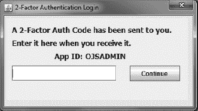
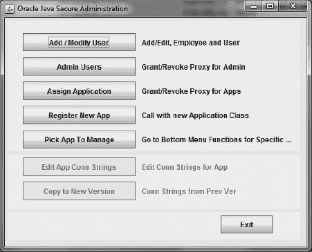
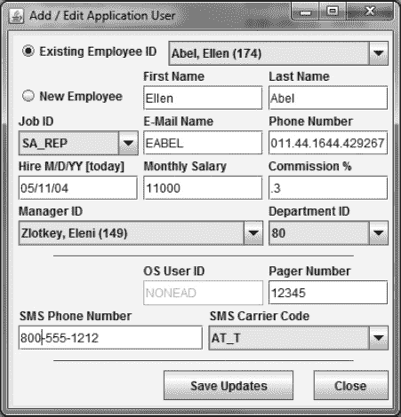
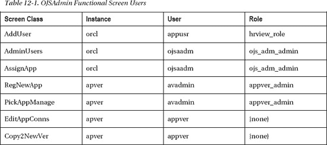
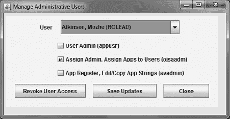
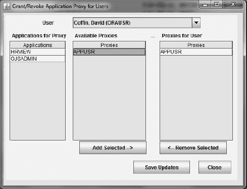
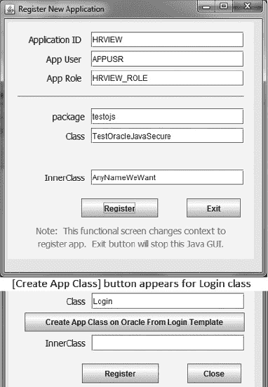
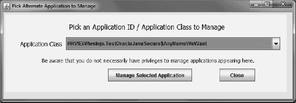
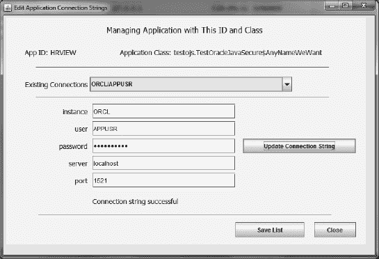
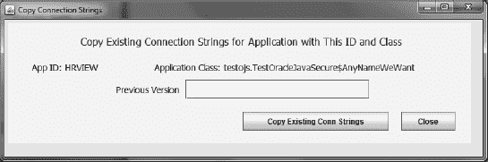

# 十二、安全管理

既然我们已经构建了 Oracle 结构以及 Oracle 和 Java 代码，我们将需要维护保持其运行的数据。这些数据主要由用户、代理授权、应用注册和应用连接字符串组成。执行 SQL 脚本为一两个用户和一两个应用插入记录并不太困难——尤其是在我们研究问题和需求的时候。但是在一年左右的时间里，完成这些任务的步骤将会被遗忘很久，还有做这些事情的原因。

但是，如果我们能够将业务规则、逻辑和过程步骤封装在一个用户友好的应用中，那么我们添加新用户和应用将会容易得多。事实上，一旦我们做到了这一点，我们将开发出一个非常方便的接口，其中一部分我们将作为模板提供给我们组织中的应用开发人员，以便他们可以实现我们的安全代码。

### 安全管理界面

当我谈到用户友好的应用时，我指的是设计良好、简单的图形用户界面。

我们将在本章中探讨的安全管理界面由一个登录屏幕、一个菜单屏幕和七个功能屏幕组成。在登录屏幕上，我们希望用户输入我们发送给他的双因素身份验证代码。正是这个屏幕，我们将作为 GUI 模板提供给其他应用开发人员，以便他们可以实现我们的安全结构。

 **注**安全管理接口应用的文件可以在 *[第 12 章](#ch12) /orajavsec* 目录下找到。

功能屏幕将引导管理员完成诸如编辑员工和用户数据(尤其是我们用于单点登录和双因素身份验证的那些元素)等任务。还有授予管理和应用代理权限的功能屏幕。我们需要能够注册一个新的应用，这个过程的大部分是通过 GUI 完成的。然后，我们希望编辑应用的现有连接字符串，偶尔从应用的先前版本复制连接字符串。所有这些功能都显示在我们 GUI 的屏幕上。

### 应用登录屏幕

我们所说的应用登录是什么意思？因为我们使用的是单点登录，所以我们实际上并不要求用户输入用户名和密码，但是我们要求他们输入双因素身份验证代码。我们的计划是一直停留在登录屏幕上，直到他们输入正确的双因素代码或退出程序。我们需要处理几个案例:

*   当他们的帐户不能进行 SSO 时，我们需要告诉他们
*   当他们输入错误或旧的双因素身份验证代码时，我们需要告诉他们
*   当他们输入正确的密码时，我们需要继续

在幕后，发生了很多事情。在用户有机会输入双因素身份验证代码之前，登录屏幕将从操作系统获取用户身份，并尝试进行 SSO，然后使用该操作系统用户 ID 作为`appver`用户代理到`apver`实例。还记得我们为了混淆`appver`密码和解码密码的 Java 代码所做的努力吗——所有这些都是这个过程的一部分。

建立代理会话后，Oracle 数据库会确定用户是否输入了双因素身份验证代码；如果没有，它会生成一个并发送给用户的移动设备。为了找出将身份验证代码发送到哪里，Oracle 数据库查看从`apver`实例到`orcl`实例，再到`HR`模式`EMPLOYEE,`和`emp_mobile_nos`表的数据库链接，以找出这个特定用户可以使用哪些设备。接下来的步骤是向每台设备发送身份验证代码并返回登录屏幕。

 **注意**我们将为两个 Oracle 数据库实例`orcl`和`apver`构建这个管理界面。如果您还没有创建`apver`实例，您将需要使用修改后的代码在单个实例上运行，在 *[ Chapter12 ](#ch12) /single* 目录中。

然后，当用户在他们的设备上收到双因素身份验证代码，并在登录屏幕上输入代码时，将采取一系列附加步骤。登录屏幕采取的第一步是将某些数据和对象传递给 Oracle 数据库。它传递双因子代码、特定于该应用的内部类实例和应用标识字符串。此外，在客户机上生成 RSA 公钥/私钥对，模数和指数工件也被传递给数据库。

Oracle 数据库首先确保用户输入的双因素身份验证代码与在过去十分钟内从该特定客户端网络地址发送给该用户的特定应用的代码相匹配。然后，如果是正确的代码，数据库会确保内部类实例与为相关应用存储的内容相匹配，然后检索与之关联的连接字符串列表。回想一下，连接字符串列表以加密的形式存储在数据库中，加密和解密的代码已经使用 Oracle database *wrap* 实用程序进行了“包装”。

Oracle 数据库使用客户机提供的工件构建一个 RSA 公钥，并生成一个 DES 密码密钥。DES 密钥的工件使用 RSA 公钥加密，然后返回给客户端。

这个特定应用的连接字符串列表用秘密密码密钥加密，加密后的列表也返回给客户端。此时，登录屏幕即将完成。然而，在它关闭之前，我们继续使用应用，我们使用 DES secret 密码密钥在客户端建立一个匹配的密钥。只要我们在这个特定的应用中，我们就会使用这个密钥来解码应用的连接字符串；因此，我们克隆或复制所有相关的关键组件以供继续使用。此后，基本 RSA 和 DES 加密密钥成员可供与我们将为应用事务建立的每个 Oracle 连接关联的新密钥重用。

我刚刚描述的所有内容相当于一个函数列表，但这一切都发生在图 12-1 所示的相对简单的界面上。双因素身份验证代码的单个输入字段和继续按钮是我们完成工作所需的全部内容。

***图 12-1。**登录界面*

#### 应用内部类

我们在我们的`Login`类中提供了一个应用内部类结构，供任何应用使用。内部类的代码如清单 12-1 所示。通过更改`Login`类的包，我们可以将这个内部类用于多个应用，减轻开发人员在代码中包含内部类的负担。在我们的安全管理界面应用中，包是`orajavsec`。完整的内部类名将`orajavsec.Login$InnerRevLvlClass`。如果有另一个应用在名为`mynewpkg`的包中定义了`Login`类，那么内部类将被命名为`mynewpkg.Login$InnerRevLvlClass`。这种差异足以区分不同的和独立的应用及其关联的应用连接字符串。即使内部类的定义除了包名之外是相同的，也是如此。

***清单 12-1。**登录类，内部类*

`package **orajavsec;**

public class **Login** extends JDialog {

    public static class **InnerRevLvlClass**
                implements Serializable, RevLvlClassIntfc
        {
        private static final long serialVersionUID = 2011010100L;
        private String innerClassRevLvl = "20110101a";

        public String getRevLvl() {
            return innerClassRevLvl;` `        }
    }
...`

用于登录的代码是我们可以提供给其他应用程序员的，以包含在他们的应用中。它是一个模板和一段可重用的代码——他们只需要将它包含在他们的包中。然后，他们不需要担心任何设置细节。登录完成后，他们可以通过调用`getAAConString()`方法从`OracleJavaSecure`获取连接字符串。

为了在 Oracle 数据库中使用`Login$InnerRevLvlClass`，我们需要在数据库中有一个代表性的类来实例化。我们需要执行清单 12-2 所示的脚本，在数据库中创建 Java 结构。我们将为每个应用在数据库中创建一个类似的 Java 结构。不同应用的类之间的唯一区别是包名。

您可以作为`apver`实例上的`sys`用户来执行这个脚本，但是您不需要这样做。当我们读到本章末尾时，我们将使用这个安全管理接口通过一个引导过程来注册它自己。该过程将包括在 Oracle 数据库中创建代表性的内部类，并生成该应用将使用的连接字符串。

***清单 12-2。**构建登录内部类的脚本*

`**CREATE OR REPLACE AND RESOLVE JAVA** SOURCE NAMED APPSEC."orajavsec/Login" AS

package **orajavsec;**

import java.io.Serializable;

import orajavsec.RevLvlClassIntfc;

// Drop the "extends JDialog" from class definition
// It is unneeded and will be invalid on Oracle server
public class Login {
    public static class InnerRevLvlClass implements Serializable,
                                                     RevLvlClassIntfc {
        private static final long serialVersionUID = 2011010100L;
        private String innerClassRevLvl = "20110101a";

        public String getRevLvl() {
            return innerClassRevLvl;
        }
    }
}
/`

 **注意**这个脚本可以在文件*[chapter 12](#ch12)/log in . SQL*中找到。

#### 居中法

我们需要将登录屏幕放在用户显示器的中心，否则它可能会出现在显示器的左上角，但不会被注意到。将 GUI 界面居中是标准做法，我们将在所有用户界面屏幕中使用。因为我们想让所有的 GUI 屏幕居中，我们将把方法放在`Login`中，如[清单 12-3](#list_12_3) 所示，并使该方法既是公共的又是静态的——任何人都可以调用它而不用引用`Login`的实例。它是模板的一部分，是我们不需要为每个屏幕复制的代码。我们将任何想要居中的项目传递给这个方法，这个方法调整项目的位置。

***清单 12-3。** GUI 中心()方法*

`    public static void center(Component item) {
        Dimension screenSize = Toolkit.getDefaultToolkit().getScreenSize();
        Dimension frameSize = item.getSize();
        if (frameSize.height > screenSize.height) {
            frameSize.height = screenSize.height;
        }
        if (frameSize.width > screenSize.width) {
            frameSize.width = screenSize.width;
        }
        **item.setLocation**((screenSize.width - frameSize.width)/2,
                         (screenSize.height - frameSize.height)/2);
    }`

`center()`方法的代码通常由 GUI 应用的 IDE 自动生成(这个版本来自 JDeveloper)。我刚刚将代码从一个标准的 GUI `main()`方法移到这个静态方法中。[清单 12-3](#list_12_3) 显示了代码。

**JavaBeans**

我已经提到了 JavaBeans，但是这是我们第一次介绍它们。JavaBeans 是 Java 类，有一组必需的方法和接口。特别是，JavaBean 是一个 GUI 对象，它为用户界面的每个属性都提供了 getter 和 setter 方法。通过这种方式，可以将 JavaBean 提供给 IDE，IDE 自动知道如何在屏幕上显示它，以及如何提供对其属性的访问。GUI 应用中的每一段文本、输入框和按钮都是一个 JavaBean。

每个 IDE 处理 JavaBeans 的方式稍有不同，将属性设置代码放在稍有不同的位置。IDE 通常会用注释来标记这些代码，比如“这些代码是自动生成的，不要修改它们。”相反，当您在 IDE 的 GUI 应用屏幕上添加或绘制组件时，就会生成代码，并且您可以编辑代码。但是，如果您以意外的方式修改了代码，IDE 可能无法再在屏幕上显示它。对于标志注释，更好的措辞可能是，“这段代码让 IDE 显示您的组件，请不要修改或添加 IDE 无法理解的代码。”

在 JDeveloper(Oracle 的免费 Java IDEs 之一，另一个是 NetBeans)中，当您开发 GUI 应用时，管理用户界面的大部分代码都放在一个名为`jbInit()`的方法中。因为我们最初在那里找到了所有的参数设置，所以很容易将我们的修改添加到那个方法的 UI 中。然而，我发现生成另一个方法(我称之为`ojsInit()`)并在那个方法中编写我们对 UI 的修改会更好。我们改变标准构造函数，在调用`jbInit()`之后立即调用我们的方法。无论您使用什么 IDE，您都希望有一个类似的代码分离。

#### 登录屏幕构造器

在[清单 12-4](#list_12_4) 中，你可以看到我们是如何在调用构造函数中的`jbInit()`之后立即调用`ojsInit()`的。此外，我们还提供了第三个接受`Frame`类的构造函数。我们将调用那个构造函数，而不是默认的构造函数，并提供对我们的主应用类`parent`的引用。然后，当登录过程完成时，我们将使用这个引用返回到我们的应用。

***清单 12-4。**登录界面构造器*

`public class **Login extends JDialog** {

    public **Login**() {
        this(null, "", false);
    }

    public **Login**(Frame parent, String title, boolean modal) {
        super(parent, title, modal);
        try {
            jbInit();
            ojsInit();
        } catch (Exception e) {
            e.printStackTrace();
        }
    }

    public **Login(Frame parent)** {
        // For Oracle Java Secure, call this constructor
        this(parent, "two-factor Authentication Login", true);
    }

    public **Login(Frame parent, String applicationID, String appClassName)** {
        // This replacement constructor is used when managing a selected application
        super(parent, "two-factor Authentication Login", true);
        try {
            this.applicationID = applicationID;
            Class applicationClass = Class.forName(appClassName);
            appClass = applicationClass.newInstance();
            jbInit();
            ojsInit();
        } catch (Exception e) {
            System.out.println("Specified application class is not available");
            System.exit(0);
        }
    }
...`

还有第四个构造函数绕过其他构造函数(重复代码)。第四个构造函数接受一个替代的应用名和内部类名。当被调用时，这个构造函数使用反射来实例化一个名为的类型的类，并将使用那个类来代替内部类`Login`。这很少使用，但是在我们的安全管理界面中是需要的。为了修改相关的连接字符串，我们必须变成不同的应用。我们将在本章后面详细讨论这一点。

`Login`正在扩展的`JDialog`类有一个带三个参数的构造函数。您可以看到我们对`JDialog`构造函数`super()`的调用。这三个参数中的最后一个是一个`boolean`，它指定`JDialog`是否是模态的。我们将登录屏幕的模态`boolean`设置为`true`。我们希望它出现在当前应用可见的任何其他屏幕的顶部。

 **注意**在调用其他构造函数，甚至是超类构造函数的时候，那些调用需要在调用构造函数的第一行。这就是为什么我们需要一个独立的第四构造者。在调用初始化方法之前，我们需要实例化一个新的替代内部类。如果我们想调用我们的原始构造函数来进行初始化，这是不可能发生的。必须首先调用原始构造函数。

#### “处理中等待”模式对话框

在 GUI 应用中，如果用户不耐烦，而您的应用代码正在进行一些复杂的计算或数据检索，就会发生不好的事情。用户可能会重复按下一个按钮，这可能会导致应用的代码多次执行一个功能；或者用户可能会沮丧地退出应用。当你的应用要做一些复杂的事情或者可能要花很长时间的时候，最好在应用前面放一个小通知，让用户知道你正忙着为他们工作，并请他们耐心等待。描述了登录屏幕中发生的复杂任务列表后，您就可以理解为什么它可能需要一些时间来处理，在此期间我们希望用户耐心等待。

我定义了一个非常简单的`JDialog`类，`sayWaitDialog`，我把它放在了`Login`类中。`sayWaitDialog`是`Login`的`static`成员，由`static`初始化程序块配置。该对话框屏幕被定义为*模态*对话框——参见[清单 12-5](#list_12_5) 中的粗体代码。模态对话框出现在用户显示器上其他窗口的顶部，它们不能轻易隐藏在其他窗口后面，至少是那些与当前应用相关的窗口，即使用户点击了其他窗口。我相信你以前在其他对话中已经看到并注意到了那种行为。

***清单 12-5。**要求用户耐心等待的模态对话框*

`**public static JDialog sayWaitDialog** = new JDialog();

**    static {**

        sayWaitDialog**.setDefaultCloseOperation(WindowConstants.DO_NOTHING_ON_CLOSE);**
        **sayWaitDialog.setModal(true);**
        sayWaitDialog.setTitle("Please Wait");
        JPanel jPanel1 = new JPanel();
        sayWaitDialog.setSize(new Dimension(255, 93));
        sayWaitDialog.getContentPane().setLayout(null);
        jPanel1.setBounds(new Rectangle(5, 5, 230, 45));` `        jPanel1.setLayout(null);
        jPanel1.setBackground(new Color(255, 222, 214));
        JLabel jLabel1 = new JLabel();
        jLabel1.setText("Working. Please wait!");
        jLabel1.setBounds(new Rectangle(5, 5, 220, 35));
        jLabel1.setHorizontalAlignment(SwingConstants.CENTER);
        jLabel1.setFont(new Font("Tahoma", 0, 16));
        jPanel1.add(jLabel1, null);
        sayWaitDialog.getContentPane().add(jPanel1, null);
        **Login.center(sayWaitDialog);**
    }`

注意，`sayWaitDialog`定义中的最后一行是对我们的`center()`方法的调用，将对话框放在监视器的中央。关于这个对话框，最后要提到的是在第一行。我们将对话框设置为关闭时不做任何事情。我们禁止用户点击窗口右上角的 X 来关闭对话框。我们实际上从不打开或关闭对话框；我们只是让它在我们需要的时候可见，在我们不需要的时候不可见。

#### 后台处理线程

现在让我们看一下`ojsInit()`方法，我们用它来设置登录屏幕 GUI 的附加属性，并跳转到登录过程。[清单 12-6](#list_12_6) 显示了代码。在方法代码的下半部分，我们看到了将 static `Login.sayWaitDialog`设置为可见的调用，以及将登录屏幕居中然后使其可见的调用。我们还稍微修改了一下`Login Screen`，将`reEnterLabel`设置为不可见。如果用户输入了不正确的双因素身份验证代码，我们会将该帮助消息设置为可见。

***清单 12-6。**自管理 GUI 初始化和后台处理线程*

`private static String **applicationID = "OJSADMIN";**
    private static Object **appClass = new InnerRevLvlClass();**

    private void ojsInit() {

**        SwingUtilities.invokeLater(new Runnable() {**

                public void **run()** {
                    OracleJavaSecure**.setAppContext(applicationID, appClass,** "");
                    // Under some circumstances, this will throw an exception
                    // if OS User not allowed, also test isAppverOK
                    OracleJavaSecure.getAppConnections();
                    // on success, original error message will be blanked out
                    if (OracleJavaSecure.isAppverOK())
                        twoFactCodeTextField.setText("");
                    **Login.sayWaitDialog.setVisible(false);**
                }
            });
        **Login.sayWaitDialog.setVisible(true);**
        **Login.center(this);**
        reEnterLabel.setVisible(false);
        appIDLabel.setText(applicationID);
        **this.setVisible(true);**` `        return;
    }`

那么在我们的`ojsInit()`方法顶部的那段复杂的代码是什么呢？当我们的模态`sayWaitDialog`被显示时，有一段代码我们想在后台运行。那听起来比它容易。你看，像这样的 Java GUI 应用通常是*单线程*——也就是说，一次只处理一个轨道的代码。由于我们使用了模态对话框，这种单一焦点变得更加顽固。模态对话框完全支配单线程处理，直到对话框被删除(在我们的例子中，它是不可见的)。

在旧版本的 Java 中，我不得不编写单独的`Thread`池来处理带外处理，但是在当前的 Java 版本中，`SwingUtilities`类提供了解决这个问题的标准方法。我们将一个新的`Runnable`实例(`Thread`)传递给`SwingUtilities.invokeLater()`方法(你可以在[清单 12-6](#list_12_6) 中看到这一点)，它会延迟运行`Thread`，直到你的当前代码得到进一步处理。这种延迟似乎对我们的目的很有效。

您可以看到在`new Runnable()`语法中创建了新的`Thread`。这是一个匿名类定义。在类定义中，我们定义了一个名为`run()`的方法来完成我们的工作。您可以看到,`run()`方法完成了`Login`类的重要初始工作——等待用户输入双因素验证码。大部分工作是在对`OracleJavaSecure`、`setAppContext()`和`getAppConnections()`中的方法的两次调用中完成的。

在我们需要解决的一个特定情况下，对`getAppConnections()`的调用很容易失败——每当操作系统用户未被授权通过 Oracle 应用用户进行代理连接时。在抛出异常的某些情况下会发生这种情况，在 Oracle connection as `appver` user 为空的其他情况下也会发生这种情况。我们在`Oracle Java Secure`中增加了一个方法来测试`appver`连接是否为空:`isAppverOK()`。在这两种情况下，我们都需要通知用户。然而，在延迟的`Thread`中，很难捕捉异常并对其做任何有帮助的事情。这里的情况是我们只需要通知用户这个事实。他们需要注销，然后以不同用户的身份重新登录，才能使用该应用。我们将这样告诉他们:我们在`jbInit()`中为`twoFactCodeTextField`设置的初始值是“您的操作系统用户帐户无法登录。”如果我们成功地建立了代理连接，那么就不会抛出`Exception`，我们将继续执行延迟的`Thread`。这将设置`twoFactCodeTextField`等于一个空字符串。但是，如果出现异常，我们不会更改该值，文本字段将保留为原始错误消息。我不把这种方法称为“错误报告”，而是称之为“缺乏成功报告”。在这种情况下，记住“缺乏成功报告”是一种可行的方法。

在我们推迟了`Thread`、`run()`的方法之后，我们使`sayWaitDialog`隐形了。`ojsInit()`中的代码顺序与执行的时间顺序相反。所以我们最终在让`sayWaitDialog`不可见之前让它可见。

#### 继续按钮

我们要处理的最后一组活动是在用户输入双因素身份验证代码并按下 enter 键或单击 Continue 按钮后发生的活动。这两个事件都调用了`continueButton_actionPerformed()`方法。这个方法如清单 12-7 中的[所示。注意，我们调用了之前调用的`OracleJavaSecure`的两个相同的方法；然而，这次我们提供了来自`twoFactCodeTextField`的双因素验证码，用户可能收到并输入了这个验证码。](#list_12_7)

***清单 12-7。**继续提供双因素认证*

`private void continueButton_actionPerformed(ActionEvent e) {
        if (twoFactCodeTextField.getText().equals("Bad two-factor code"))
            twoFactCodeTextField.setText("");` `        if (twoFactCodeTextField.getText().equals("") ||
            twoFactCodeTextField.getText().equals("Your OS User account cannot log in"))
            return;
        OracleJavaSecure.setAppContext(applicationID, appClass,
            **twoFactCodeTextField.getText());**
        OracleJavaSecure.getAppConnections();
        if (!**OracleJavaSecure.test2Factor()**) {
            twoFactCodeTextField.setText("Bad two-factor code");
            reEnterLabel.setVisible(true);
            return;
        }
        **this.setVisible(false);**
        return;
    }`

这一次，在我们从`getAppConnections()`方法返回之后，我们可以通过调用`OracleJavaSecure.test2Factor()`来测试输入的双因子代码是否成功。这是本章中添加的一个新方法，其代码如[清单 12-8](#list_12_8) 所示。我们只是测试连接字符串列表的大小，该列表是向`getAppConnections()`方法提供双因素身份验证代码的结果。大小为 0 是可以的，任何其他值也是可以的——这意味着双因子代码是成功的，并且`test2Factor()`返回一个`true`。然而，如果对`consHash.size()`的调用导致抛出`Exception`，那么连接字符串列表为空，我们确定双因子代码不可接受，所以我们返回一个`false`。

***清单 12-8。**来自 OracleJavaSecure 的双因素代码测试成功*

`    public static boolean test2Factor() {
        try {
            connsHash.size();
        } catch( Exception x ) {
            return false;
        }
        return true;
    }`

回到我们的`Login`类，在[清单 12-7](#list_12_7) 中，如果双因素代码不好，我们将`twoFactCodeTextField`中的消息设置为“坏的双因素代码”，并使`reEnterLabel`文本可见。我们在用于用户输入的相同文本字段中呈现用户反馈。回头看看上面那个方法，`continueButton_actionPerformed()`。您可以看到我们如何在希望用户输入双因素身份验证代码的字段中处理消息。如果他们在该字段中有空白或我们的错误消息字符串之一，我们不会尝试将其作为双因素身份验证代码提交，而只是返回。

一个成功的登录事件，其中双因素代码是可接受的，并且返回了一个连接字符串列表，导致最后几行`continueButton_actionPerformed()`被运行。在这种情况下，我们基本上将登录屏幕设置为不可见。

#### 登录屏幕关闭

您可能感兴趣的最后一个技巧是:如果用户没有完成预期的活动就退出登录屏幕，那么我们将退出运行应用的整个 JVM。这是通过调用`System.exit()`的`this_WindowClosing()`方法来处理的，如[清单 12-9](#list_12_9) 所示。每当用户点击窗口右上角的 X来关闭窗口时，`this_WindowClosing()`方法就会被自动调用。在进入一个应用的正常过程中，我们不会关闭`Login`屏幕，只是简单的使其不可见。

现在您可能会问，登录屏幕最初是如何变得可见的，当它不再可见时会发生什么。登录屏幕是从一个应用调用的，在登录屏幕过程之后，控制权返回给应用，但是我有点超前了，我们将在下一节中看到这一点。

***清单 12-9。**关闭登录并退出应用*

`    private void this_windowClosing(WindowEvent e) {
        System.exit(0);
    }`

### 安全管理菜单

我们将构建一个应用，使用我们在本书中描述的所有安全特性，我们将使用该应用来管理安全特性——可以说，我们将“吃自己的狗粮”。我们可以称这个应用为`OracleJavaSecure` (OJS)管理，它将由一个菜单和几个功能屏幕组成，如图 12-2 所示。

***图 12-2。**安全管理菜单*

菜单将驻留在一个名为`OJSAdmin`的类中，该类有一个`main()`方法，它只是实例化一个新的`OJSAdmin`类。参见[清单 12-10](#list_12_10) 。在实例化时，`OJSAdmin`类运行它的 JavaBeans 初始化方法，`jbInit()`和我们在`ojsInit()`方法中的附加初始化。

***清单 12-10。**安全管理菜单 main()方法和构造器*

`    public static void main(String[] args) {
        // Put main() method right in this JFrame
        **new OJSAdmin(args);**
    }

    public OJSAdmin(String[] args) {
        try {
            **jbInit();**
            // Add extra init in separate method
            **ojsInit(args);**
        } catch (Exception e) {
            e.printStackTrace();
        }
    }`

清单 12-11 中的[显示了`OJSAdmin.ojsInit()`方法。它的主要功能是实例化一个新的`Login`类，我们之前已经讨论过了，然后将其自身居中并使其可见。使用这本书的安全特性只需要实例化`Login`类。注意在](#list_12_11)[清单 12-11](#list_12_11) 中，如果`ojsInit()`有两个(或更多)参数，我们调用其中一个`Login`构造函数，如果没有，则调用另一个`Login`构造函数。如果我们调用菜单来代表一个不同的应用(稍后讨论)，将会有争论。

***清单 12-11。**附加 OJSAdmin 菜单初始化*

`    private void ojsInit(String[] args) throws Exception {
        // Method for initializing OJS functionality
        JPanel **disablePanel = bottomMenuPanel;**
        // Login does SSO, two-factor Auth and Application Authorization

**        if (args.length < 2)**

            **new Login(this);**
        else {
            // Call Login with alternate Application ID and Class name
            **new Login(this, args[0], args[1]);**
            **disablePanel = topMenuPanel;**
        }
        // By default, we only use the top menu, so disable bottom components
        // When managing alternate application, we only use bottom menu
        Component[] comps = **disablePanel.getComponents**();
        for (int i = 0; i < comps.length; i++) {
            **comps[i].setEnabled(false);**
        }
        // This static utility method centers any component on the screen
        Login.center(this);
        // Finally, to see this frame, it must be made visible
        **this.setVisible(true);**
    }`

在菜单中，我们将区分将要显示的两组菜单按钮。这些按钮位于两个 Java Swing 组件`JPanel`、`topMenuPanel`和`bottomMenuPanel`上。以这种方式收集按钮允许我们通过在`for`循环中遍历`JPanel`上的所有组件并为每个组件调用`setEnabled()`方法来禁用其中一组按钮。

我们将按钮分成两组，因为对于由`topMenuPanel`表示的功能，我们将使用安全管理界面(该应用)的权限，并使用与该应用相关联的 Oracle 连接。然而，对于由`bottomMenuPanel`表示的函数，我们将作为一个不同的、指定的应用进行连接，并将管理与该应用相关联的连接字符串。

当双因素认证成功后，登录屏幕关闭时，`OJSAdmin`屏幕变得可见，因为`Login`实例化的线程处理已经完成，并返回到`OJSAdmin.ojsInit()`方法，[清单 12-11](#list_12_11) 。此时，应用用户可以从菜单选项中进行选择。例如，如果用户选择了**添加/修改用户**按钮，事件将调用`addUserButton_actionPerformed()`方法([清单 12-12](#list_12_12) )，该方法为活动`new AddUser()`实例化一个 JavaBean。从`OJSAdmin`菜单中可用的每个活动屏幕都将隐藏`OJSAdmin`菜单屏幕，并使其再次可见。他们可以这样做，因为我们通过引用活动屏幕的构造函数来传递菜单——注意调用中对`this`的引用，以实例化[清单 12-12](#list_12_12) 中的`new AddUser`类。

***清单 12-12。**添加/修改用户按钮的动作方法*

`    private void addUserButton_actionPerformed(ActionEvent e) {
        new AddUser(**this**);
    }`

### 添加/修改用户功能屏幕

在我们深入研究添加/修改用户功能屏幕的代码和操作之前，让我们先回顾一下我们拥有这个屏幕的原因。回想一下，我们在`HR`模式中添加了一个名为`t_emp_mobile_nos`的表。我们使用该表来存储手机和寻呼机号码，并且(为了方便起见)还存储员工的操作系统用户 ID。我们需要维护这些数据来完成单点登录和双因素身份验证。此外，我们使用`HR.EMPLOYEES`表中的电子邮件地址进行双因素认证，所以我们希望能够编辑它。

为了维护`HR`数据，我们想要一个类似于我们的添加/修改用户界面的功能界面，如图[图 12-3](#fig_12_3) 所示。这个安全管理界面不适合维护员工数据，但是为了展示我们在第 7 章中开发的安全查询和更新程序，我们允许在这里使用它。我们将允许查看和更新敏感的`SALARY`和`COMMISSION_PCT`列。

***图 12-3。**添加/修改用户功能屏幕*

#### 实例化 AddUser 屏幕

添加/修改用户代码可以在文件*[chapter 12](#ch12)/orajavsec/adduser . Java*中找到。我们将通过检查构造函数来开始探索这个功能屏幕。清单 12-13 中显示了这两个构造函数。第一个构造函数是我们从`OJSAdmin`菜单中调用的。我们传递一个对`OJSAdmin`的引用，这样我们就可以通过调用`parent.setVisible()`方法来隐藏它。几乎与此同时，我们将添加/修改用户屏幕设置为可见。请注意，任何构造函数中的第一行都可能是对超类构造函数或同一个类中的另一个构造函数的调用。这里我们调用`this()`，这是对默认构造函数的调用(不带参数)；也就是[清单 12-13](#list_12_13) 中显示的第二个构造函数。

关于[清单 12-13](#list_12_13) 中显示的第一个构造函数，我想指出的最后一点是，我们通过测试数据库连接是否为空来结束它。至少有几个可能的原因导致连接为空，但最重要的原因是操作系统用户帐户没有访问数据库的权限。具体来说，操作系统用户可能无权通过需要用于此功能的 Oracle 应用用户帐户进行代理。当这种情况发生时，我们不会继续下去；相反，我们会弹出一个`Dialog`屏幕来通知用户。在这个 GUI 单线程世界中，我们将等到用户点击按钮确认我们的消息，然后隐藏添加/修改用户屏幕并使`OJSAdmin`菜单再次可见。

***清单 12-13。**添加/修改用户屏幕构造器*

`    public AddUser(JFrame **parent**) {
        **this();**
        this.parent = parent;
        // Post jbInit visual setup
        userMessageLabel.setVisible(false);
        userMessageLabel1.setVisible(false);
        ButtonGroup empGroup = new ButtonGroup();
        empGroup.add(existingEmpRadioButton);
        empGroup.add(newEmpRadioButton);
        existingEmpRadioButton.setSelected(true);
        Login.center(this);
        **parent.setVisible(false);**
        **this.setVisible(true);**
        **if (null == conn)** {
            JOptionPane**.showMessageDialog**(thisComponent,
                "Your account is not permitted to use this functional screen!");
            parent.setVisible(true);
            this.setVisible(false);
        }
    }

    public AddUser() {
        try {
            jbInit();
            conn = **OracleJavaSecure.getAAConnRole("orcl", "appusr");**
            // Possibly reentering - need new keys for new Oracle session
            OracleJavaSecure**.resetKeys();**
            locModulus = OracleJavaSecure.getLocRSAPubMod();
            locExponent = OracleJavaSecure.getLocRSAPubExp();
            **sessionSecretDESPassPhrase = null;**
            **dataInit();**
        } catch (Exception e) {
            e.printStackTrace();
        }
    }`

在清单 12-13 所示的第二个构造函数中，我们做了以下四件事:

*   调用`jbInit()`来初始化 GUI 组件。
*   调用`getAAConnRole()`来获得一个连接，专门用于这个功能。因为我们正在执行与`HR`模式中的雇员数据相关的任务，所以我们将需要通过`orcl`实例上的`appusr`用户获得的`hrview_role`。
*   为此新连接重置加密密钥。
*   调用`dataInit()`用现有值填充下拉组合框。

可能这里需要知道的最重要的事情是，每当我们获得一个新的连接时，我们都需要建立新的加密密钥，即使我们从`OJSAdmin`菜单多次重新进入同一个屏幕。为了确保我们自己清理干净，每当我们关闭这个窗口时，我们调用`closeConnection()` 。这发生在清单 12-14 中的[方法中。我们还在清单 12-14](#list_12_14) 中看到了我们所描述的`AddUser`类使自己不可见，并在完成后使`OJSAdmin`菜单屏幕再次可见。请使用这种方法作为打开和关闭连接以及重置加密密钥的模板。

***清单 12-14。**关窗方法*

`    private void this_windowClosing(WindowEvent e) {
        OracleJavaSecure**.closeConnection();**
        parent.setVisible(true);
        this.setVisible(false);
    }`

除了在默认构造函数中调用`AddUser`的`resetKeys()`之外，我们还获得了一个新的 RSA 密钥对，将指数和模数存储在静态成员中。我们在`AddUser`中也有静态成员，用于 DES 秘密密码密钥的工件。我们将清单 12-13 中的[工件`sessionSecretDESPassPhrase`设置为空。我们稍后测试这个静态成员，看看我们是否需要重新获取秘密的密码密钥。如果我们在选择之前进行更新或插入，那么我们可能需要调用一个额外的存储过程来交换键，`p_get_shared_passphrase`。](#list_12_13)

我们应用中的每个功能屏幕都要求我们连接到一个特定的 Oracle 实例(`orcl`或`apver`)，并且我们作为一个特定的用户进行连接。屏幕、实例、用户和角色在[表 12-1](#tab_12_1) 中列出。需要不同的用户，因为每个屏幕需要不同的安全权限，我们将通过基于特定应用和代理用户设置的不同 Oracle 角色获得这些权限。角色是通过我们的`getAAConnRole()`方法和`p_check_role_access`过程来设定的。该过程通过查询`appsec.v_application_registry`视图找到应用/代理用户和所需角色之间的关系。我们需要在`orcl`实例上插入[清单 12-15](#list_12_15) 所示的关系数据作为`appsec`用户。

***清单 12-15。**将应用用户与角色相关联的脚本*

`INSERT INTO appsec.v_application_registry
(application_id, app_user, app_role) VALUES
('OJSADMIN','APPUSR','HRVIEW_ROLE');

INSERT INTO appsec.v_application_registry
(application_id, app_user, app_role) VALUES
('OJSADMIN','OJSAADM','OJS_ADM_ADMIN');

INSERT INTO appsec.v_application_registry
(application_id, app_user, app_role) VALUES
('OJSADMIN','AVADMIN','APPVER_ADMIN');`

 **注意**这个脚本可以在文件[chapter 12](#ch12)/orclappsec . SQL 中找到

在调用与[清单 12-6](#list_12_6) 中的`OJSAdmin`应用相关联的`Login`类的过程中，我们将`OJSADMIN`指定为应用 ID。对于这个应用 ID 和特定的应用内部类`ojsadmin.Login$InnerRevLvlClass`，在`v_app_conn_registry`视图中存储了一个连接字符串列表。我们从`Login`的处理中得到的就是这个列表。使用列表中的连接字符串，我们可以作为各种安全管理功能所需的不同用户进行连接。当前功能“添加/修改用户”要求我们通过`hrview_role`连接到`orcl`作为`appusr`。

在`AddUser`中有许多代码，根据用户的选择和输入，使 GUI 像它应该的那样运行。我将把这些细节中的大部分留给您在代码中探索和发现，但是我将提到几个重要的方面。例如，如果用户正在创建一名新员工，则在保存该员工并从下拉组合框列表中选择她之前，他们不能输入 OS 用户身份的数据。在[清单 12-13](#list_12_13) 的第一个构造函数中，我们添加了一个`ButtonGroup`，并添加了我们的两个单选按钮`existingEmpRadioButton`和`newEmpRadioButton`作为成员。按钮组确保一次只能选择一个单选按钮。我们还确保在创建新员工和/或用户时，之前显示在屏幕上的个人数据会被删除。当用户在 GUI 界面上点击时，跟踪什么是可用的，什么是无效的，这使得程序员变成了一个“会计”。

#### 初始化数据选择组件

在默认构造函数中，如清单 12-13 中的第二个所示，在获得一个新的 Oracle 连接并重置我们的加密密钥后，我们调用一个方法来填充下拉组合框列表`dataInit()`。清单 12-16 中的`dataInit()`方法有几个针对`HR`模式中非敏感视图的静态 Oracle 查询。虽然数据是非敏感的，但是我们没有授予`PUBLIC`访问数据的权限；相反，我们授予对`hrview_role`的访问权，我们在这个添加/修改用户功能屏幕中获取并使用它。`applicationID`是`OJSADMIN`，应用用户是`appusr`，所以根据[表 12-1](#tab_12_1) 和[清单 12-15](#list_12_15) ，我们从`v_application_registry`获取的对应角色是`hrview_role`。

使用这个 Oracle 角色，我们可以从公共视图中选择雇员列表，`hr.v_employees_public`。我们在[第 2 章](02.html#ch2)的 *Chapter2/HR.sql* 脚本文件中创建了这个视图。我们按照雇员的姓氏对列表进行排序，并将姓氏、逗号、名字和括号中的`employee_id`连接起来。我们在`dataInit()`中做类似的查询来填充工作 ID、部门 ID 和经理下拉组合列表。注意清单 12-16 中的[注意，在我们通过`while(rs.next())`循环处理结果之前，我们首先删除列表中所有现有的项目，并添加一个空白字符串作为第一个项目。在每次更新后，我们可能会重复调用`dataInit()`，因为值列表可能会因为我们的更新而发生变化。因此，我们在初始化期间清除旧的清单并添加新的清单。我们添加空白字符串作为每个列表中的第一项，作为默认选择。](#list_12_16)

***清单 12-16。** AddUser 数据初始化方法*

`    private void dataInit() throws Exception {
        Statement stmt = null;
        ResultSet rs = null;
        try {
            stmt = conn.createStatement();
            rs = stmt.executeQuery("SELECT last_name || ', ' || first_name || " +
                "' (' || employee_id || ')' " +
                "**FROM hr.v_employees_public** ORDER BY last_name");
            // This throws event to run existingEmpComboBox_actionPerformed() method
            // Calls blankAll()
            existingEmpComboBox**.removeAllItems();**
            existingEmpComboBox**.addItem("");**
            **while (rs.next())** {
                existingEmpComboBox**.addItem(rs.getString(1));**
            }
            if (rs != null)
                rs.close();
...`

`existingEmpComboBox`中的列表成为我们确定应用用户想要查看或编辑哪个员工的来源。当应用用户选择一个雇员时，我们需要在`HR`模式中找到相应的数据，我们希望通过`employee_id`找到该数据。计划是将雇员 ID 从`existingEmpComboBox`中所选项的括号中取出，因此我们将创建一个名为`pullIDFromParens()`、[清单 12-17](#list_12_17) 的静态实用程序方法，我们将把它放在一个名为 utility 的类中。我们将在这个应用的几个地方使用它，所以我们希望它位于中央，而不是作为几个功能屏幕的成员方法重复。

***清单 12-17。**从数据值中获取数据索引*

`    static String pullIDFromParens(String inValue) {
        String rtrnValue = "";
        try {
            int openPlace = inValue.indexOf("(");
            int closePlace = inValue.indexOf(")", openPlace);
            if (openPlace > -1 && closePlace > -1)
                rtrnValue = inValue.substring(openPlace + 1, closePlace);
        } catch (Exception x) {
        }
        return rtrnValue;
    }`

在我们的`dataInit()`方法中，我们对使用静态 Oracle 查询而不是存储过程来获取雇员列表和其他列表很有信心(参见[清单 12-16](#list_12_16) )，因为没有应用用户提供的参数，所以没有 SQL 注入的机会，并且数据是非敏感的，尽管仍然受到角色授权的保护(不是`PUBLIC`)。这并不违背我们所说的使用存储过程进行查询；这是对该方法的补充。同样，只要查询是静态的，没有应用用户提供的参数，直接从视图查询数据是安全的。

为了让`hrview_role`从`HR.v_employees_public`视图中查询数据，我们需要向`hrview_role`授予`SELECT`特权。我们以`HR`用户的身份授予该权限，同时授予从清单 12-18 中的`HR.v_sms_carrier_host`中进行选择的权限。在`dataInit()`中，我们还填充了工作 ID、部门 ID、经理和 SMS 运营商下拉框的内容，因此我们需要从这两个视图中进行选择。

***清单 12-18。**授权进一步选择人力资源观点*

`GRANT SELECT ON hr.v_employees_public TO hrview_role;
GRANT SELECT ON hr.v_sms_carrier_host TO hrview_role;`

 **注意**这些授权的脚本位于名为 *[的文件 Chapter12 ](#ch12) /OrclHR.sql* 中。

#### 选择现有员工

在`AddUser`屏幕初始化后，应用用户可以选择输入数据并添加一名新员工，或者从组合框列表中选择一名现有员工。当选择一个现有的雇员时，调用`existingEmpComboBox_actionPerformed()`方法。我们再次要求应用用户有耐心，所以我们让`sayWaitDialog`可见——见清单 12-19 底部的[。我们在](#list_12_19)[清单 12-19](#list_12_19) 中展示了`existingEmpComboBox_actionPerformed()`方法的结构，但是我们延迟的`Thread`的大部分`run()`方法将在后面的清单中展示。

***清单 12-19。**选择现有员工的方法*

`private void existingEmpComboBox_actionPerformed(ActionEvent e) {
        // When action from dataInit() at removeAllItems(), getItemCount() = 0
        if (0 == existingEmpComboBox.getItemCount() ||
            0 == existingEmpComboBox.getSelectedIndex()) {
            osUserIDTextField.setEnabled(false);
            blankAll();
            return;
        }

**        employeeID = Integer.parseInt(Utility.pullIDFromParens(**
**            (String)existingEmpComboBox.getSelectedItem()));**

        blankAll();
        SwingUtilities.invokeLater(new Runnable() {
                public void run() {

        // The bulk of the run() method has been removed from this Listing

                    Login.sayWaitDialog.setVisible(false);` `                }
            });
        // It may take a while to get the user data, esp while we set up encryption
        // So ask the user to be patient while working
        **Login.sayWaitDialog.setVisible(true);**
    }`

这个方法，`existingEmpComboBox_actionPerformed()`通过使用`Utility.pullIdFromParens()`方法从所选择的项目中获取雇员 ID。在我们显示主导当前 GUI `Thread`进程的模态`sayWaitDialog`之前，我们创建一个新的`Runnable` `Thread`并将其传递给`SwingUtilities.invokeLater()`方法。这个延迟的`Thread`将用所选员工的数据填充`AddUser`屏幕。

在我们的延迟线程`run()`方法中，我们调用两个 Oracle 存储过程，以缩写形式显示在[清单 12-20](#list_12_20) 和[清单 12-22](#list_12_22) 中。第一个程序是来自第 7 章、`p_select_employee_by_id_sens`的一个标准加密数据查询。该过程完成了密钥交换(如果还没有完成的话),并为所选的员工 id 从`HR.EMPLOYEES`表中选择数据。`salary`和`commission_pct`值以加密形式返回。我们调用`OracleJavaSecure.getDecryptData()`来解密这些值，然后用我们检索到的值填充`AddUsers`上的每个字段。

如果我们对`p_select_employee_by_id_sens`的调用有错误，我们会显示一个错误消息对话框，这是一个模态对话框。如果没有错误，那么我们将从 Oracle 数据库中获得共享密码(DES)密钥的组成部分。我们对`OracleJavaSecure.getDecryptData()`的第一次调用将会产生副作用，即构建一个等效的 DES 密钥供客户端使用。

***清单 12-20。**选择现有员工时的缩写 run()方法，第 1 部分*

`public void run() {
        int errNo;
        String errMsg;
        OracleCallableStatement stmt = null;
        OracleResultSet rs = null;
        try {
            stmt =
                (OracleCallableStatement)conn.prepareCall(
                "CALL **hr.hr_sec_pkg.p_select_employee_by_id_sens**(?,?,?,?,?,?,?,?,?,?)");
...
            stmt.setInt(10, **employeeID**);
            stmt.executeUpdate();

            errNo = stmt.getInt(8);
            if (errNo != 0) {
                errMsg = stmt.getString(9);
                **JOptionPane.showMessageDialog**(thisComponent,
                   "Oracle error p_select_employee_by_id_sens) " + errNo + ", " + errMsg);
            } else {
                **sessionSecretDESSalt = stmt.getRAW**(3);
...
                rs = (OracleResultSet)stmt.getCursor(7);
                // Should be only one record for this Employee ID
                if (rs.next()) {
                    **firstNameTextField.setText**(rs.getString(2));
...
                    // Our stored procedure passes Hire Date back as sql.Date` `                    // So process here to format
                    java.sql.Date sDate = rs.getDate(6);
                    Date hDate = new Date(sDate.getTime());
                    **hireDateTextField.setText(hDateFormat.format(hDate));**
                    **jobIDComboBox.setSelectedItem**(rs.getString(7));
                    deptIDComboBox.setSelectedItem(rs.getString(11));
                    // Find this user's manager id in parentheses of combo box
                    for (int i = 0; i < managerIDComboBox.getItemCount(); i++) {
                        if (rs.getString(10).equals(Utility.pullIDFromParens(
                            (String)managerIDComboBox.getItemAt(i))))
                        {
                            **managerIDComboBox.setSelectedIndex**(i);
                            break;
                        }
                    }
                    // Decrypt salary and commission pct using shared password key
                    **salaryTextField.setText(OracleJavaSecure.getDecryptData**(rs.getRAW(8),
                        sessionSecretDESPassPhrase, sessionSecretDESAlgorithm,
                        sessionSecretDESSalt, sessionSecretDESIterationCount));

**                    commissionPctTextField.setText(**

**                        OracleJavaSecure.getDecryptData(rs.getRAW**(9),

                        sessionSecretDESPassPhrase, sessionSecretDESAlgorithm,
                        sessionSecretDESSalt, sessionSecretDESIterationCount));
                }
                if (rs != null) rs.close();
                if (stmt != null) stmt.close();
            }`

你可以在[清单 12-20](#list_12_20) 中看到我们如何用特定的数据元素填充`AddUser`表单。我们只需在表单上设置文本字段的文本。对于日期字段，我们尽力将`java.sql.Date`转换成`java.util.Date`，并且我们使用静态`hDateFormat`成员来格式化日期，其定义如下:

`    static SimpleDateFormat hDateFormat = new SimpleDateFormat("MM/dd/yy");`

对于我们的下拉组合框，例如`jobIDComboBox`，我们在现有列表中选择与我们的查询值相对应的项目。在`managerIDComboBox`的特殊情况下，我们遍历现有列表中的所有项目，并调用`pullIDFromParens()`方法来获取经理的员工 ID。如果它与我们从查询中获得的经理 ID 相匹配，我们将该经理设置为我们选择的项目。此外，您可以看到，我们将`salaryTextField`和`commissionPctTextField`的值设置为我们通过解密从查询中收到的数据得到的值。

我们还用来自用户手机号码视图`hr.v_emp_mobile_nos`的数据填充了`AddUser`屏幕下半部分的用户数据。为此，我们在一个包中调用一个新的过程，这个包是我们在`HR`模式中定义的，`hr_pub_pkg.p_select_emp_mobile_nos_by_id`。创建这个包的脚本如[清单 12-21](#list_12_21) 所示。此时，您应该对这个脚本非常熟悉。注意这里定义了两个过程，一个是我们已经提到过的 select 过程，另一个是我们将用来更新`v_emp_mobile_nos`中数据的过程，名为`p_update_emp_mobile_nos`。我们授权`hrview_role`执行这个包。

***清单 12-21。**创建人力资源公共包的脚本*

`CREATE OR REPLACE PACKAGE BODY hr.hr_pub_pkg IS

    PROCEDURE **p_select_emp_mobile_nos_by_id**(
        m_employee_id             emp_mobile_nos.employee_id%TYPE,
        resultset_out         OUT RESULTSET_TYPE,
        m_err_no              OUT NUMBER,
        m_err_txt             OUT VARCHAR2)
    IS BEGIN
        m_err_no := 0;
        OPEN resultset_out FOR SELECT
            user_id, com_pager_no, sms_phone_no, sms_carrier_cd
        FROM v_emp_mobile_nos
        WHERE employee_id = m_employee_id;
    EXCEPTION
        WHEN OTHERS THEN
            m_err_no := SQLCODE;
            m_err_txt := SQLERRM;
            appsec.app_sec_pkg.p_log_error( m_err_no, m_err_txt,
                'HR p_select_emp_mobile_nos_by_id' );
    END p_select_emp_mobile_nos_by_id;

    PROCEDURE **p_update_emp_mobile_nos**(
        m_employee_id        emp_mobile_nos.employee_id%TYPE,
        m_user_id            emp_mobile_nos.user_id%TYPE,
        m_com_pager_no       emp_mobile_nos.com_pager_no%TYPE,
        m_sms_phone_no       emp_mobile_nos.sms_phone_no%TYPE,
        m_sms_carrier_cd     emp_mobile_nos.sms_carrier_cd%TYPE,
        m_err_no         OUT NUMBER,
        m_err_txt        OUT VARCHAR2 )
    IS
        test_emp_ct      NUMBER(6);
    BEGIN
        -- Note: Use of this procedure assumes you have already done a select
        -- and that you are using the same Session Secret PassPhrase
        m_err_no := 0;
        SELECT COUNT(*) INTO test_emp_ct FROM v_emp_mobile_nos WHERE
            employee_id = m_employee_id;
        IF test_emp_ct = 0
        THEN
            INSERT INTO v_emp_mobile_nos
                (employee_id, user_id, com_pager_no, sms_phone_no, sms_carrier_cd)
            VALUES
                (m_employee_id, m_user_id, m_com_pager_no, m_sms_phone_no,
                m_sms_carrier_cd);
        ELSE
            UPDATE v_emp_mobile_nos
            SET user_id = m_user_id, com_pager_no = m_com_pager_no,
                sms_phone_no = m_sms_phone_no,
                sms_carrier_cd = m_sms_carrier_cd` `            WHERE employee_id = m_employee_id;
        END IF;
    EXCEPTION
        WHEN OTHERS THEN
            m_err_no := SQLCODE;
            m_err_txt := SQLERRM;
            appsec.app_sec_pkg.p_log_error( m_err_no, m_err_txt,
                'HR p_update_emp_mobile_nos' );
    END p_update_emp_mobile_nos;

END hr_pub_pkg;
/

GRANT EXECUTE ON hr.hr_pub_pkg TO hrview_role;`

从新的`hr_pub_pkg.p_select_emp_mobile_nos_by_id`程序中选择数据的过程与我们之前回顾的从`v_employees_public`视图中选择数据的过程非常相似。然而，对于来自`v_emp_mobile_nos`的数据，没有敏感数据，所以没有一列以加密形式返回。这个程序也从`AddUser`的`existingEmpComboBox_actionPerformed()`方法的延迟`Thread` `run()`方法中调用。该调用如清单 12-22 中的[所示。这里唯一独特的是，当我们从这个查询填充它时，我们禁用了`osUserIDTextField`。我们这样做是因为一旦为员工设置了用户 ID，我们就不允许更改。禁用此字段允许显示值，尽管以灰色形式显示，但不允许编辑数据值。如果这个查询没有在`v_emp_mobile_nos`中找到雇员 ID 的值，那么我们启用`osUserIDTextField`。](#list_12_22)

***清单 12-22。**选择现有员工时的缩写 run()方法，第 2 部分*

`    // Select from mobile_nos where emp id
    stmt = (OracleCallableStatement)conn.prepareCall(
        "CALL **hr.hr_pub_pkg.p_select_emp_mobile_nos_by_id**(?,?,?,?)");
...
    stmt.setInt(1, employeeID);
...
        if (rs.next()) {
            // Will not let you change a user ID for an employee
            **osUserIDTextField.setEnabled(false);**
            osUserIDTextField.setText(rs.getString(1));
            pagerNumberTextField.setText(rs.getString(2));
            smsPhoneNumberTextField.setText(rs.getString(3));
            smsCarrierCodeComboBox.setSelectedItem(rs.getString(4));
        } else {
            **osUserIDTextField.setEnabled(true);**
        }`

这两个 Oracle 存储过程(如清单 12-20 和清单 12-22 所示)表示动态查询，其中查询包含了对`employee_id = user_selected_employee_id`的需求。像这样的动态查询容易受到 SQL 注入的影响，除非它们被封装在像这样的 Oracle 存储过程中。这是一个安全考虑的设计，应该在每个安全代码审查中加以考虑。

#### 创建新员工

我们可以从添加/修改用户功能屏幕创建新员工。在这种情况下，将分配一个新的员工 ID。在创建员工之前，我们不允许应用用户输入用户 ID。这样，这是一个两步过程。创建员工后，我们可以从`existingEmpComboBox`中选择他，并为他输入用户和手机号码数据。

#### 保存员工数据

一旦应用用户输入了她希望为所选员工或新员工保存的数据，她将选择 save 按钮。该动作调用`saveButton_actionPerformed()`方法。我们在清单 12-23 中展示了该方法的结构。在这个清单中，我们忽略了延迟线程`run()`方法的大部分，稍后将会介绍。我们测试 AddUser 表单上输入的值，以确保所有必填字段都输入了值。在我们测试它们之后，我们再次让模态`sayWaitDialog`可见。同时，我们定义另一个延迟线程来完成我们的工作。在延迟线程`run()`方法的末尾，我们设置了`sayWaitDialog`不可见。由于我已经多次描述了延迟的`Thread`和`sayWaitDialog`的使用，我将不再提及它们；但是，我们将在整个应用中继续使用这些功能。

***清单 12-23。**保存员工和用户数据*

`    private void saveButton_actionPerformed(ActionEvent e) {
        if (lastNameTextField.getText().equals("") ||
            jobIDComboBox.getSelectedIndex() == 0 ||
            eMailNameTextField.getText().equals("") ||
            managerIDComboBox.getSelectedIndex() == 0 ||
            deptIDComboBox.getSelectedIndex() == 0) {
            JOptionPane.showMessageDialog(thisComponent,
                **"Must have values** for Last Name, Job ID, E-Mail, Dept ID and Mgr ID!");
            return;
        }
        if (existingEmpComboBox.getSelectedIndex() > 0 &&
            osUserIDTextField.getText().equals("") &&
            (!(pagerNumberTextField.getText().equals("") &&
               smsPhoneNumberTextField.getText().equals("")))) {
            JOptionPane.showMessageDialog(thisComponent,
                **"Must have value** for User ID, else blank mobile nos!");
            return;
        }
        SwingUtilities.invokeLater(new Runnable() {
            public void run() {
...
                **Login.sayWaitDialog.setVisible(false);**
            }
        });
        // Ask the user to be patient while working
        **Login.sayWaitDialog.setVisible(true);**
    }`

在`saveButton_actionPerformed()`方法中定义的延迟线程执行我们的 Oracle 更新处理。在这种情况下，真正的处理发生在两个 update Oracle 存储过程中。第一个是我们的加密敏感数据更新程序`p_update_employees_sensitive`，来自[第 7 章](07.html#ch7)。第二个是`hr_public_pkg`包中一个新的更新过程，用于`hr.v_emp_mobile_nos`视图中的数据，如[清单 12-21](#list_12_21) 所示的`p_update_emp_mobile_nos`。

在清单 12-24 中，我们看到了用于调用`p_update_employees_sensitive`过程的代码。我们传递当前雇员 ID 来指示我们正在更新哪个雇员。注意，我们将参数 8 和 9 设置为 salary 和 commission percent 字段的加密值。我们还获取为雇佣日期输入的格式化日期，并使用`hDateFormat.parse()`方法将其解析为`java.util.Date`，然后将其转换为`java.sql.Date`以传递给 Oracle 存储过程进行更新。如果雇用日期字段中不存在条目，我们将当前日期提交给该过程。我们在`AddUser`实施的用户界面保护措施之一是，应用用户不能编辑现有员工的雇佣日期。

 **注意**这个过程从雇佣日期中去除了时间的重要性。我们这样做只是为了简单起见。

***清单 12-24。**更新员工数据*

`    stmt = (OracleCallableStatement)conn.prepareCall(
    "CALL hr.hr_sec_pkg**.p_update_employees_sensitive**(?,?,?,?,?,?,?,?,?,?,?,?,?)");
    stmt.registerOutParameter(12, OracleTypes.NUMBER);
    stmt.registerOutParameter(13, OracleTypes.VARCHAR);
    **stmt.setInt(1, employeeID);**
...
    if (hireDateTextField.getText().equals("")) {
        stmt.setDate(6, new java.sql.Date((new Date()).getTime()));
    } else {
        Date hDate = hDateFormat.parse(hireDateTextField.getText());
        stmt.setDate(6, new java.sql.Date(hDate.getTime()));
    }
    stmt.setString(7, (String)jobIDComboBox.getSelectedItem());
    stmt.setRAW(8, **OracleJavaSecure.getCryptData(salaryTextField.**getText()));
    stmt.setRAW(9, **OracleJavaSecure.getCryptData(commissionPctTextField.**getText()));
...
    stmt.executeUpdate();`

如果我们已经选择了一个现有的雇员并且如果`osUserIDTextField`不为空，我们只调用[清单 12-25](#list_12_25) 中的`p_update_emp_mobile_nos`过程。我们在这里不做任何进一步的数据验证，但是您可能希望这样做。

 **注意**在`hr.v_emp_mobile_nos`视图中添加一个条目并不等同于使用我们在视图中输入的用户 ID 创建一个 Oracle 用户。但是，我们需要创建 Oracle 用户，以便该用户能够访问我们的应用。作为一种必然的情况，我们可以删除一个 Oracle 用户，但是`hr.v_amp_mobile_nos`中的条目不会被自动删除。

*清单 12-25。更新用户和手机号码*

`   if (existingEmpComboBox.getSelectedIndex() > 0 &&
       (!osUserIDTextField.getText().equals(""))) {
       stmt = (OracleCallableStatement)conn.prepareCall(
       "CALL hr.hr_pub_pkg.p_update_emp_mobile_nos(?,?,?,?,?,?,?)");
...`

如果我们要创建一个新员工，而之前没有选择现有员工，那么我们还没有交换加密密钥。如果是这种情况，那么`sessionSecretDESPassPhrase`成员(以及其他成员)将为空。我们测试`sessionSecretDESPassPhrase`是否为空，如果为空，我们从[第 7 章](07.html#ch7)中调用一个额外的 Oracle 存储过程`p_get_shared_passphrase`，在调用数据更新过程之前交换密钥。

Oracle 用户是什么时候创建的？

到目前为止，我们还没有创建与我们在添加/修改用户功能屏幕上输入的用户 ID 相对应的 Oracle 用户。对于`HR.EMPLOYEES`表中的每个雇员，我们可以在`hr.v_emp_mobile_nos`中创建一个包含用户 ID 的记录。用户 ID 与 Windows(操作系统)帐户的名称相同。我们将创建一个具有相同名称的 Oracle 用户，并且我们将利用具有相同名称的事实来进行单点登录。Oracle 用户将被授予访问权限，因为该用户已经以相同的操作系统用户身份登录。

您现在可能想知道为什么我们从来没有从我们的添加/修改用户功能屏幕运行一个过程来创建 Oracle 用户。这不是疏忽，而仅仅是拖延到最后一分钟。如果 Oracle 用户无权访问任何应用，我们就没有理由创建他，因此我们将只在第一次授予他访问应用的权限时创建该用户。这将发生在管理用户或分配应用功能屏幕中，如下所述。

### 用户管理屏幕

在安全管理界面应用中，我们的每个功能屏幕都有许多相似之处。在查看添加/修改用户功能屏幕时，我们已经讨论了其中的许多功能，我们不再重复这些细节。然而，每个画面都引入了许多新的想法，给我们提供了思考的食粮。管理用户功能屏幕是我们当前讨论的主题。

在[图 12-4](#fig_12_4) 所示的管理用户界面中，我们有一个下拉组合框，从中可以找到所有用户的列表`userComboBox`。这不是所有雇员的列表，而是在`hr.v_emp_mobile_nos`视图中有记录的所有雇员的列表。对于每个用户，我们从`hr.v_emp_mobile_nos`获得用户 ID，从`hr.v_employees_public`获得名字和姓氏。我们在`AdminUsers`类的`dataInit()`方法中实现了这一点，该过程与我们在`AddUser`的`dataInit()`方法中所做的相同，如前所述。

***图 12-4。**管理员用户功能屏幕*

同样在 Admin Users 屏幕上，您会看到三个复选框:每个管理代理用户一个:`appusr`、`ojsaadm`和`avadmin`。当从下拉列表中选择一个用户时，这些复选框将填充与该用户的当前代理授权相对应的复选标记或空白。通过选中或取消选中这些复选框并单击“保存更新”按钮，应用用户可以授予和撤销所选用户的这些权限。

管理员用户屏幕上还有一个按钮，撤销用户访问按钮。此按钮的功能不包括删除 Oracle 用户帐户；然而，它撤销了用户拥有的所有应用授权，包括通过`appver`授予代理的授权——因此用户实际上不能再使用我们的应用。

#### 创建 OJSAAdm 用户

在管理用户功能屏幕中，我们作为`ojsaadm`用户连接到`orcl`实例。这是我们在[表 12-1](#tab_12_1) 中列出的代理用户之一。我们需要创建那个 Oracle 用户，我们需要授予他访问填充`userComboBox`所需的`HR`视图的权限。我们将作为安全管理员，`secadm`用户，在`orcl`实例上这样做。我们将要使用的命令如清单 12-26 所示。当您执行这些命令时，用您想让其管理管理员列表的人的操作系统用户名替换占位符`osadmin`，并给新的`ojsaadm`用户一个强密码。

***清单 12-26。**创建 OJSAAdm 用户*

`GRANT create_session_role TO ojsaadm IDENTIFIED BY password;
CREATE ROLE ojs_adm_admin IDENTIFIED USING appsec.p_check_role_access;
ALTER USER osadmin GRANT CONNECT THROUGH ojsaadm;

GRANT SELECT ON hr.v_employees_public TO ojs_adm_admin;
GRANT SELECT ON hr.v_emp_mobile_nos TO ojs_adm_admin;

GRANT CREATE DATABASE LINK TO ojsaadm;
GRANT CREATE VIEW TO ojsaadm;
GRANT CREATE PROCEDURE TO ojsaadm;`

 **注意**这些命令列在文件*[chapter 12](#ch12)/orclsecadm . SQL*中。

除了授予我们的新用户从`HR`视图中选择来填充用户列表的权限之外，您可以在[清单 12-26](#list_12_26) 中看到，我们正在给这个用户一些额外的权限。我们正在授予`ojsaadm`创建数据库链接、视图和过程的系统特权。我们将让这个 Oracle 用户帐户发挥作用。事实上，我们正在招募这个 Oracle 用户通过从`orcl`到`apver`实例的数据库链接来完成双方的用户管理。也就是说，我们需要在`apver`实例上创建一个相同的用户。清单 12-27 显示了我们将用来完成这项工作的脚本。像往常一样，我们作为`SYS`用户进行连接，以完成我们在`apver`实例上的大部分工作。

***清单 12-27。**在 apver 实例上创建 OJSAAdm 用户*

`GRANT create_session_role TO ojsaadm IDENTIFIED BY password;
GRANT SELECT ON sys.proxy_users TO ojsaadm;`

 **注**[清单 12-27](#list_12_27) 中部分显示的脚本包含在 *`[Chapter12](#ch12)/ApverSys.sql`文件中。*

从我们对 Admin Users 屏幕功能的描述中，您可以想象这个用户需要从 Oracle 数据库中读取一些不寻常的数据来完成他的任务。`ojsaadm`需要做的一件事是从数据字典视图`sys.proxy_users`中读取数据。从这个角度来看，我们将观察从 Oracle 用户到应用角色的访问途径，SSO 通过 Oracle 用户匹配我们的 OS 用户，应用角色与充当代理的 Oracle 用户保持一致。通过添加或删除通过我们的应用用户之一进行代理的能力，个人用户能够或不能够访问应用。

并非任何 Oracle 用户都可以修改`sys.proxy_users`视图中的数据。在[清单 12-27](#list_12_27) 中，您可以看到我们将视图上的`SELECT`授予了`apver`实例上的`ojsaadm`用户。我们将在`orcl`实例上对`ojsaadm`做出同样的授权。仅仅拥有那个视图的特权是不足以完成我们的计划的。要授予和撤销代理特权，我们需要`ALTER USER`特权。此外，正如我在添加/修改用户界面的讨论结束时所描述的，我们需要能够在授予他们第一个应用代理时`CREATE USER`。为此，我们将在`SYS`模式中创建一个名为`usr_role_adm_pkg`的包，其中包含创建用户、授予和撤销代理特权的过程。在`orcl`实例上，创建这个包的脚本如[清单 12-28](#list_12_28) 所示。将在`apver`实例上创建一个相同的包。

在[清单 12-28](#list_12_28) 中的`usr_role_adm_pkg`包定义中，你可以看到定义了五个程序。创建一个用户需要两个步骤，`p_create_user_once`和`p_create_user_many`。我们将该过程分为两个步骤，因为第一个步骤，即我们实际创建 Oracle 用户的步骤，如果用户已经存在，将会遇到一个异常。第二个步骤`p_create_user_many`也是创建 Oracle 用户帐户以访问应用的过程的一部分。在这个过程中，我们将`create_session_role`授予用户，并授予他通过`appver`用户进行代理的权限。该代理是进行 SSO 和双因素身份验证所必需的。即使 Oracle 用户已经存在并使用密码创建，他也不能使用我们的应用，除非他能够通过`appver`进行代理。请注意，当我们严格为应用访问创建新用户时，我们不会给他们一个密码；相反，我们指示它们是`IDENTIFIED EXTERNALLY`。通常，意味着我们使用操作系统或命名服务来认证用户，但是在我们的例子中，我们认证我们的一个大应用用户(`appver`)，并允许这个`IDENTIFIED EXTERNALLY`用户通过代理。不会对 Oracle 用户个人进行身份验证。

还有一个撤销用户对我们的应用的访问的过程。这个名字有点夸张，因为我们实际上并没有删除 Oracle 用户帐户。除了访问我们的应用之外，该帐户可能出于某种原因而存在。它甚至可能有一个相关的密码，并允许用户在自己的模式中使用 Oracle 数据库。我们真正想要实现的是阻止用户访问我们的应用，我们可以通过简单地撤销通过`appver`用户进行代理的特权来实现。这就是`p_drop_user`程序所做的一切。

***清单 12-28。**创建 sys.usr_role_adm_pkg 包*

`CREATE OR REPLACE PACKAGE BODY sys.usr_role_adm_pkg IS

    PROCEDURE **p_create_user_once**( username sys.proxy_users.client%TYPE )
    AS
        PRAGMA AUTONOMOUS_TRANSACTION;
    BEGIN
        EXECUTE IMMEDIATE **'CREATE USER '** || username || **' IDENTIFIED EXTERNALLY';**
        COMMIT;
    EXCEPTION
        WHEN OTHERS
        THEN
            appsec.app_sec_pkg.p_log_error( SQLCODE, SQLERRM,
                'sys.usr_role_adm_pkg.p_create_user_once for ' || username );
    END p_create_user_once;

    PROCEDURE **p_create_user_many**( username sys.proxy_users.client%TYPE )
    AS
        PRAGMA AUTONOMOUS_TRANSACTION;
    BEGIN
        EXECUTE IMMEDIATE 'GRANT create_session_role TO ' || username;
        EXECUTE IMMEDIATE 'ALTER USER ' || username || ' GRANT CONNECT THROUGH appver';
        COMMIT;
    EXCEPTION
        WHEN OTHERS
        THEN
            appsec.app_sec_pkg.p_log_error( SQLCODE, SQLERRM,
                'sys.usr_role_adm_pkg.p_create_user_many for ' || username );
    END p_create_user_many;

    PROCEDURE **p_drop_user**( username sys.proxy_users.client%TYPE )
    AS
        PRAGMA AUTONOMOUS_TRANSACTION;
    BEGIN
        EXECUTE IMMEDIATE 'ALTER USER ' || username || ' REVOKE CONNECT THROUGH appver';
        COMMIT;
    EXCEPTION
        WHEN OTHERS
        THEN
            appsec.app_sec_pkg.p_log_error( SQLCODE, SQLERRM,` `                'sys.usr_role_adm_pkg.p_drop_user for ' || username );
    END p_drop_user;

    PROCEDURE **p_set_proxy_through**(
        username sys.proxy_users.client%TYPE,
        proxyname sys.proxy_users.proxy%TYPE )
    AS
        PRAGMA AUTONOMOUS_TRANSACTION;
    BEGIN
        EXECUTE IMMEDIATE 'ALTER USER ' || username ||
            ' GRANT CONNECT THROUGH ' || proxyname;
        COMMIT;
    EXCEPTION
        WHEN OTHERS
        THEN
            appsec.app_sec_pkg.p_log_error( SQLCODE, SQLERRM,
                'sys.usr_role_adm_pkg.p_set_proxy_through for ' ||
                username || '/' || proxyname );
    END p_set_proxy_through;

    PROCEDURE **p_drop_proxy_through**(
        username sys.proxy_users.client%TYPE,
        proxyname sys.proxy_users.proxy%TYPE )
    AS
        PRAGMA AUTONOMOUS_TRANSACTION;
    BEGIN
        EXECUTE IMMEDIATE 'ALTER USER ' || username ||
            ' REVOKE CONNECT THROUGH ' || proxyname;
        COMMIT;
    EXCEPTION
        WHEN OTHERS
        THEN
            appsec.app_sec_pkg.p_log_error( SQLCODE, SQLERRM,
                'sys.usr_role_adm_pkg.p_drop_proxy_through for ' ||
                username || '/' || proxyname );
    END p_drop_proxy_through;

END usr_role_adm_pkg;
/

GRANT EXECUTE ON sys.usr_role_adm_pkg TO ojs_adm_admin;`

为了授予和撤销访问特定应用的权限，我们需要向用于该应用的特定应用代理用户`ALTER USER`和`GRANT`或`REVOKE CONNECT THROUGH`执行命令。这些步骤由`p_set_proxy_through`和`p_drop_proxy_through`程序完成。

在每个过程中，我们连接一个 SQL 命令来表示我们想要完成的任务，并调用`EXECUTE IMMEDIATE`，这对于执行动态数据定义语言(DDL)语句来说非常方便，比如`CREATE USER`和`ALTER USER`。所有这些程序都用修饰符`PRAGMA AUTONOMOUS_TRANSACTION`定义。这允许每个过程提交自己的事务。

问题来了，“为什么我们不把系统特权授予`CREATE USER`和`ALTER USER`给`ojsaadm`？”首先，我们仍然希望将这些命令包装在过程中，以控制参数并避免 SQL 注入攻击。第二，我们想限制`ojsaadm`实际能做的事情。注意，在这些过程中，`ojsaadm`只能创建`IDENTIFIED EXTERNALLY`用户。除此之外，他只能授予和撤销通过其他用户进行代理的权限——这比授予`ALTER USER`提供的权限要有限得多。

我提到了在`apver`实例上创建一个相同的包。该脚本在文件*[chapter 12](#ch12)/apversys . SQL*中。在这方面，两个实例有一个不同之处。在`orcl`实例上，我们将`usr_role_adm_pkg`上的执行授权给`ojs_adm_admin`角色；而在`apver`实例上，我们将它直接授予`ojsaadm`用户。现在，我们面临的挑战是如何同时在两个数据库实例上执行命令。我们将通过数据库链接来实现这一点。

#### 启用跨数据库链接的 OJSAAdm 用户

作为`ojsaadm`用户连接到`orcl`实例。在那里，您可以测试对`sys.proxy_users`数据字典视图的访问。该命令首先显示在清单 12-29 的[中。清单 12-29](#list_12_29) 的第二个命令是创建数据库链接的命令。将密码占位符更改为您在`apver`实例上创建`ojsaadm`时使用的密码。

 **注意**花点时间确保`apver`实例上的`ojsaadm`的密码非常复杂。我们通过在`apver`实例上创建另一个用户，在我们的边界上开辟了另一条攻击途径。有了非常强的密码(例如 15 个随机字符，数字和特殊字符的混合大小写)，我们可以加强我们的防御。这是一个将在数据库链接中使用的密码，但很少输入。我们更愿意禁用`ojsaadm`的密码，或者创建一个拒绝他访问的登录触发器，但是为了使用我们的数据库链接，`ojsaadm`需要能够登录到`apver`实例。

***清单 12-29。**作为 OJSAAdm 用户创建链接*

`SELECT * FROM sys.proxy_users;

-- Private database link to apver as ojsaadm
CREATE DATABASE LINK apver_link
CONNECT TO ojsaadm
IDENTIFIED BY password
USING 'apver';

CREATE OR REPLACE VIEW ojsaadm.instance_proxy_users AS
SELECT 'APVER' INSTANCE, proxy, client FROM sys.proxy_users@apver_link
**UNION** SELECT 'ORCL' INSTANCE, proxy, client FROM sys.proxy_users;

-- Test the link and view
SELECT * FROM ojsaadm.instance_proxy_users;

GRANT SELECT ON ojsaadm.instance_proxy_users TO ojs_adm_admin;` `-- To let appsec read view across database link
GRANT SELECT ON ojsaadm.instance_proxy_users TO appsec;`

清单 12-29 中[的第三个命令创建了一个视图，它将把来自`orcl`和`apver`实例的`sys.proxy_users`上的选择结果集合在一起。这个视图是两个查询结果的`UNION`,每个查询来自一个实例，并且包括一个前缀列，指示在其上观察代理的实例。通过从中选择来测试新视图——这也将是对`apver`上授予`ojsaadm`从`sys.proxy_users`中选择的测试。我们将向通过`ojsaadm`代理并获得`ojs_adm_admin`角色的所有用户授予对该视图的 select 权限。](#list_12_29)

清单 12-29 中的最后一个命令提供了另一种访问途径。您看，有时我们需要能够从运行在`apver`实例上的过程中看到`orcl`实例上的所有代理用户。在`apver`上，`appsec`用户已经有了一个到`orcl`实例的链接。该链接最初是为了应用安全而设置的，`appsec`用户可以通过选择`orcl`上的`hr.v_emp_mobile_nos`进行双因素身份验证。这里，我们将私有数据库链接的功能从`apver`扩展到`orcl`，允许它从新视图中选择所有代理用户。这也使我们不必将`sys.proxy_users`上的`SELECT`授予`apver`实例上的`appsec`；她将通过选择`orcl`上的视图从`apver`上的`proxy_users`中进行选择，该视图通过链接从`proxy_users`选择到`apver`。如果这听起来很循环，那是因为它确实如此。

正如我们所观察到的，从`sys.proxy_users`中选择不符合我们管理代理授权计划的目标。在 Admin Users 屏幕上，我们希望能够在`orcl`和`apver`实例上通过应用用户授予和撤销代理权限。如果可能的话，我们还希望通过单个 Oracle 连接来实现这一点。有可能通过数据库链接做到这一点吗？的确如此。在[清单 12-30](#list_12_30) 中，我们看到了用于这个目的的包的定义`ojsaadm.apver_usr_adm_pkg`。我们将在`ojsaadm`模式中创建包，包将通过私有数据库链接`apver_link`访问，以在`apver`实例上执行过程。

请注意清单 12-30 中的[,我们用一个参数化的`EXECUTE IMMEDIATE`语句跨链接调用过程。我们的 PL/SQL 风格调用是在`m_stmt`字符串中定义的。对于变量(例如用户名)，我们不将它与语句字符串连接起来；相反，我们有一个占位符，`:1`。我们从一个`EXECUTE IMMEDIATE`命令调用该语句字符串，并通过指定`USING username`传递用户名来填充占位符。这是另一种形式的参数化语句，它也像 Java 中的存储过程和准备语句一样不受 SQL 注入的影响，我们在第 7 章](#list_12_30)的“避免 SQL 注入”一节中讨论过。

***清单 12-30。**跨链路执行程序的包定义*

`CREATE OR REPLACE PACKAGE BODY ojsaadm.apver_usr_adm_pkg IS

    PROCEDURE **p_create_apver_user**( username VARCHAR2 )
    AS
        m_stmt VARCHAR2(100);
    BEGIN
        m_stmt := 'BEGIN sys.usr_role_adm_pkg**.p_create_user_once@apver_link**( :1 ); END;';
        EXECUTE IMMEDIATE m_stmt USING username;
        m_stmt := 'BEGIN sys.usr_role_adm_pkg**.p_create_user_many@apver_link**( :1 ); END;';
        EXECUTE IMMEDIATE m_stmt USING username;
    END p_create_apver_user;

    PROCEDURE **p_drop_apver_user**( username VARCHAR2 )
    AS
        m_stmt VARCHAR2(100);
    BEGIN` `        m_stmt := 'BEGIN sys.usr_role_adm_pkg**.p_drop_user@apver_link**( :1 ); END;';
        EXECUTE IMMEDIATE m_stmt USING username;
    END p_drop_apver_user;

    PROCEDURE **p_set_apver_proxy_through**( username VARCHAR2, proxyname VARCHAR2 )
    AS
        m_stmt VARCHAR2(100);
    BEGIN
        m_stmt :=
        'BEGIN sys.usr_role_adm_pkg**.p_set_proxy_through@apver_link**( :1, :2 ); END;';
        EXECUTE IMMEDIATE m_stmt USING username, proxyname;
    END p_set_apver_proxy_through;

    PROCEDURE **p_drop_apver_proxy_through**( username VARCHAR2, proxyname VARCHAR2 )
    AS
        m_stmt VARCHAR2(100);
    BEGIN
        m_stmt :=
        'BEGIN sys.usr_role_adm_pkg**.p_drop_proxy_through@apver_link**( :1, :2 ); END;';
        EXECUTE IMMEDIATE m_stmt USING username, proxyname;
    END p_drop_apver_proxy_through;

END apver_usr_adm_pkg;
/

-- Grant to role
GRANT EXECUTE ON ojsaadm.apver_usr_adm_pkg TO ojs_adm_admin;`

除了一个例外，`ojsaadm.apver_usr_adm_pkg`中的程序与`sys.usr_role_adm_pkg`中的程序一致。这个包中的过程`p_create_apver_user`调用了`sys.usr_role_adm_pkg`中的`p_create_user_once`和`p_create_user_many`过程。`sys.usr_role_adm_pkg`过程没有抛出异常，所以即使用户已经存在并且`p_create_user_once`失败，我们也能成功调用`p_create_user_many`。最后，我们将这个包中的`EXECUTE`授予`ojs_adm_admin`角色。

#### 选择一个现有用户

我们现在从检查完成我们的计划所需的 Oracle 结构和授权返回到管理用户功能屏幕。我们将首先看一下当应用用户从下拉菜单`userComboBox`中选择一个现有用户时发生的动作。调用`userComboBox_actionPerformed()`方法。我们首先通过调用如下的`pullIDFromParens()`方法从所选项的括号中获取用户 ID:

`    userID = Utility.pullIDFromParens((String)userComboBox.getSelectedItem());`

接下来，我们创建一个延迟线程，它的`run()`方法包含清单 12-31 中所示的查询。注意，我们选择了`instance_proxy_users`视图的所有行——这是一个静态查询，不容易受到 SQL 注入的影响。我们遍历`ResultSet`，测试每一行中与我们选择的用户相匹配的`client`值。然后，我们检查`proxy`的值是否与我们的任何管理用户匹配，并在管理用户屏幕上选择相应的复选框。在我们到达这一点之前，在`userComboBox_actionPerformed()`方法中，我们调用了`blankAll()`方法，它取消了所有复选框的选择。因此，在此过程结束时，选中的复选框仅代表授予所选用户的代理权限。

***清单 12-31。**查询获取所选用户的管理代理权限*

`    rs = stmt.executeQuery("SELECT INSTANCE, proxy, client " +
        "FROM ojsaadm.instance_proxy_users ");
    while (rs.next()) {
        if (rs.getString(3).equalsIgnoreCase(userID)) {
            if (rs.getString(2).equalsIgnoreCase("OJSAADM"))
                ojsaadmCheckBox.setSelected(true);
            if (rs.getString(2).equalsIgnoreCase("APPUSR"))
                appusrCheckBox.setSelected(true);
            if (rs.getString(2).equalsIgnoreCase("AVADMIN"))
                avadminCheckBox.setSelected(true);
        }
    }`

#### 保存对管理权限的更新

当应用用户选择了一个用户并对选中的管理权限复选框进行了更改时，他需要保存更改。他通过选择 Save Updates 按钮来做到这一点。当该按钮被选中时，调用`saveButton_actionPerformed()`方法。再次从`userComboBox`中的选中项目中拉出选中的`userID`。用[清单 12-32](#list_12_32) 中的代码在其`run()`方法中创建了一个延迟线程。

这个方法非常广泛，因为我们独立地调用过程来授予或撤销 Admin Users 屏幕上的复选框所代表的每个权限。我们可以将几个这样的调用合并成一个动态循环，但是我们不会节省太多的代码，清晰度也会降低。我们采取的第一步是尝试在`orcl`和`apver`实例上创建用户。用户可能已经存在，但这是一个足够简单的步骤，可以确保用户既存在又拥有运行我们的应用所需的特权。我们调用三个 Oracle 过程来创建用户——两个在`orcl`实例(`sys.usr_role_adm_pkg.p_create_user_once`和`p_create_user_many`)上操作，一个通过数据库链接操作到`apver`实例(`ojsaadm.apver_usr_adm_pkg.p_create_apver_user`)。每个过程调用都有相同的语法，所以我只展示完整的语法一次。一些过程调用接受一个参数，即用户 ID；有些有两个参数，用户 ID 和代理用户。

***清单 12-32。**保存管理权限更新，缩写*

`**    stmt = (OracleCallableStatement)conn.prepareCall(**
**        "CALL sys.usr_role_adm_pkg.p_create_user_once(?)");**
**    stmt.setString(1, userID);**
**    stmt.executeUpdate();**
**    if (stmt != null) stmt.close();**

    stmt = (OracleCallableStatement)conn.prepareCall(
        "CALL sys.usr_role_adm_pkg**.p_create_user_many**(?)");
...
    stmt = (OracleCallableStatement)conn.prepareCall(
        "CALL ojsaadm.apver_usr_adm_pkg**.p_create_apver_user**(?)");` `...
    // Next, grant or revoke each proxy
    **if (ojsaadmCheckBox.isSelected())** {
        stmt = (OracleCallableStatement)conn.prepareCall(
            "CALL sys.usr_role_adm_pkg**.p_set_proxy_through**(?,?)");
        stmt.setString(1, userID);
        stmt.setString(2, "**OJSAADM**");
...
    } **else** {
        stmt = (OracleCallableStatement)conn.prepareCall(
            "CALL sys.usr_role_adm_pkg**.p_drop_proxy_through**(?,?)");
...
    }
    **if (appusrCheckBox.isSelected())** {
        stmt = (OracleCallableStatement)conn.prepareCall(
            "CALL sys.usr_role_adm_pkg**.p_set_proxy_through**(?,?)");
        stmt.setString(1, userID);
        stmt.setString(2, "**APPUSR**");
...
    } **else** {
        stmt = (OracleCallableStatement)conn.prepareCall(
            "CALL sys.usr_role_adm_pkg**.p_drop_proxy_through**(?,?)");
...
    }
    **if (avadminCheckBox.isSelected())** {
        stmt = (OracleCallableStatement)conn.prepareCall(
            "CALL sys.usr_role_adm_pkg**.p_set_proxy_through**(?,?)");
        stmt.setString(1, userID);
        stmt.setString(2, "**AVADMIN**");
...
        stmt = (OracleCallableStatement)conn.prepareCall(
            "CALL ojsaadm.apver_usr_adm_pkg**.p_set_apver_proxy_through**(?,?)");
...
        stmt = (OracleCallableStatement)conn.prepareCall(
            "CALL ojsaadm.apver_usr_adm_pkg**.p_grant_apver_appver_conns**(?)");
        stmt.setString(1, userID);
...
    } **else** {
        stmt = (OracleCallableStatement)conn.prepareCall(
            "CALL sys.usr_role_adm_pkg**.p_drop_proxy_through**(?,?)");
...
        stmt = (OracleCallableStatement)conn.prepareCall(
            "CALL ojsaadm.apver_usr_adm_pkg**.p_drop_apver_proxy_through**(?,?)");
...
        stmt = (OracleCallableStatement)conn.prepareCall(
            "CALL ojsaadm.apver_usr_adm_pkg**.p_revoke_apver_appver_conns**(?)");
...
    }
    blankAll();`

我们为每个管理代理用户调用`p_set_proxy_through`或`p_drop_proxy_through`，这取决于该管理代理的复选框是否被选中。另外，对于代理用户 avadmin，我们也调用通过链接授予或撤销代理的过程，`ojsaadm.apver_usr_adm_pkg.p_set_apver_proxy_through`或`p_set_apver_proxy_through`，因为这个代理用户在两个实例中都被使用。

如果选择了`avadminCheckBox`，我们运行另外一个程序`p_grant_apver_appver_conns`，如果没有选择，我们运行`p_revoke_apver_appver_conns`。我们将在进入注册新应用屏幕时详细讨论这些步骤。该过程授予或撤销我们届时将需要的另一个角色。

#### 撤销用户运行应用的权限

当管理用户在 Admin Users 屏幕上选择一个用户，然后选择 Revoke User Access 按钮时，就会调用`revokeUserButton_actionPerformed()`方法。在该方法中运行的代码删除了两个实例上所选用户的所有代理。该代码如清单 12-33 所示。

我们实例化了一个普通的`Statement`类`stmt2`，它将支持一个返回`ResultSet`的查询。这是对我们实例化来调用存储过程的`OracleCallableStatement`的补充。类似于我们从`ojsaadm.instance_proxy_users`中选择的方式，当从我们的`userComboBox`中选择一个现有用户时，设置管理代理授权复选框；在这里，我们再次选择所有的代理用户，并且当我们遍历`ResultSet`时，只关注我们自己，关注那些被授予给所选用户的代理授权。然后，如果我们看到代理授权的实例等于“apver”，我们调用存储过程来撤销跨数据库链接的代理授权。否则，我们调用存储过程在本地撤销代理授权。

***清单 12-33。**放弃所有管理和应用代理权限*

`    stmt2 = conn.createStatement();
    rs = stmt2.executeQuery("SELECT INSTANCE, proxy, client " +
        "FROM **ojsaadm.instance_proxy_users** ");
    while (rs.next()) {
        if (rs.getString(3)**.equalsIgnoreCase(userID)**) {
            if (rs.getString(1).equalsIgnoreCase(**"apver"**)) {
                stmt = (OracleCallableStatement)conn.prepareCall(
                    "CALL ojsaadm.apver_usr_adm_pkg**.p_drop_apver_proxy_through**(?,?)");
            } else {
                stmt = (OracleCallableStatement)conn.prepareCall(
                    "CALL sys.usr_role_adm_pkg**.p_drop_proxy_through**(?,?)");
            }
            stmt.setString(1, userID);
            stmt.setString(2, rs.getString(1));
            **stmt.executeUpdate();**
            if (stmt != null) stmt.close();
        }
    }
    if (rs != null) rs.close();
    blankAll();`

我考虑以稍微不同的方式编写这个方法，只删除那些我们知道与我们的应用相关的代理，如果这是您的目标，您可能想要重写这个方法(调用`p_drop_user`和`p_drop_apver_user`过程来撤销对`appver`的代理授权)。该方法将删除所有应用代理，包括通过`appver`用户进行代理的权限，这将阻止 Oracle 用户完成 SSO 或双因素身份验证。但是，我们不会删除 Oracle 用户帐户。

### 应用分配屏幕

Assign Application functional 屏幕与我们在 Admin Users 屏幕中使用的许多概念和代码相同。但是，在这里，我们处理的不是管理代理授权，而是代理其他应用的授权。[图 12-5](#fig_12_5) 显示分配应用屏幕。

 **注意**能够通过`ojsadmin`代理的用户能够将任何应用分配给任何用户。也许另一个层次的过滤是合适的，但这并没有在本书中增加。从积极的一面来看，这些`ojsadmin`管理员可以互相代替，分配用户对彼此应用的访问权。我们在这里进行的唯一特定于应用的管理过滤是限制哪些管理员可以更改哪些应用的连接字符串(密码)。

***图 12-5。**分配应用功能屏幕*

当有许多应用代理时，在一个可选择的表中表示它们比每个代理都有一个复选框更容易。从这样的列表中进行选择的一个缺点是更有可能做出错误的选择并被忽略。出于这个原因，我们没有在这个列表中显示管理代理用户。

“分配应用”屏幕顶部的下拉组合框是我们选择用户的地方。我们将管理该用户对应用的访问。最右边的表格显示了已经授予所选用户的代理授权列表，中间的表格列出了所有可用的代理授权。当选择了一个可用的代理时，最左边的表显示了使用该代理的应用列表。例如，`appusr`代理被分配给`HRVIEW`应用和`OJSADMIN`应用的用户。

这些表格是嵌套 GUI 对象中的两层。我们的表位于一个滚动窗格中，这样当表增长到超出我们提供的小框所能看到的范围时，我们将有垂直和/或水平滚动条来访问剩余的数据。

要为所选用户添加代理，将按下“添加所选”按钮，同样，要从所选用户撤销代理，将按下“删除所选”按钮。要保存这些新设置，应用用户将按下保存更新按钮。

#### 初始化数据选择组件

当我们实例化一个新的`AssignApp`类时，我们将调用`dataInit()`方法来填充三个数据选择组件。我们将为我们的`userComboBox`建立用户列表，就像我们在其他功能屏幕中看到的一样。我们还将构建一个可用应用代理帐户的列表。我们将构建一个使用代理用户的应用列表的查找表。然后，当从“可用代理”列表中选择代理用户时，我们将在“分配应用”屏幕的最左侧列中显示相关的应用列表。

在我们的应用可用代理用户列表中，我们不会提供真实的可用代理列表，因为每个 Oracle 用户实际上都是潜在的代理用户。我们不想显示所有 Oracle 用户，否则肯定会出现错误选择。相反，我们将在可用代理列表中显示的代理用户将只是那些来自`appsec.v_application_registry`视图的`app_user`条目，它们也不是安全管理代理。回想一下，我们通过 Admin Users 屏幕授予和撤销对管理代理用户的访问权限。可用的代理将是所有注册的非管理应用的`app_user`条目列表。

对于我们的可用代理列表，我们将填充一个名为`JTable`的新 GUI 小部件。填充`JTable`不像填充组合框那样简单。我们不能只打电话给`addItem()`。在`JTable`中，有一个我们填充的底层表模型。我们使用了被声明为`AssignApps`静态成员的`DefaultTableModel`的实例。这在[清单 12-34](#list_12_34) 中显示。

每个表模型都有数据和列标签。数据和列标签可以以多种形式提供给表格模型，我们选择以`Vectors`的形式提供数据和列标签。我们的表中只有一个单独的列，它要么是“代理”列表，要么是“应用”列表我们的列标识符向量被定义为`AssignApp`的静态成员，如[清单 12-34](#list_12_34) 所示。如果我们的表中有多个列，我们将为每个列添加一个标签到我们的列标识符`Vectors`。我们不需要告诉`JTable`我们将有多少列数据——它会从我们的列标识符`Vector`中的条目数量来推测。

***清单 12-34。**分配应用的静态成员*

`static DefaultTableModel availableProxiesTM = new DefaultTableModel();
    static DefaultTableModel userProxiesTM = new DefaultTableModel();
    static DefaultTableModel appsTM = new DefaultTableModel();
    static Vector columnIdentifiers = new Vector();
    static {
        columnIdentifiers.add("Proxies");
    }
    static Vector appColumnIdentifiers = new Vector();
    static {
        appColumnIdentifiers.add("Applications");` `    }
    static Hashtable<String, Vector> appsHashtable =
        new Hashtable<String, Vector>();`

我们在清单 12-34 的[中声明的最后一个静态成员是一个`Hashtable`。`appsHashTable`将有一个键，即代理用户名，和一个值，即使用代理用户的应用的`Vector`。](#list_12_34)

A `DefaultTableModel`假设每一行可能有多列，所以它不把数据作为一个简单的列表来处理，即使只有一列。相反，在使用`Vectors`的情况下，它期望每一行都是数据元素的`Vector`，每一列一个。所以最终，我们提供给表模型以构建我们的表的数据将是一个`Vectors`的`Vector`，它保存了一个潜在的多列行列表。

现在您已经知道了我们在为表构建数据`Vectors`时的方向，让我们看看来自`dataInit()`的构建可用代理列表的代码。该代码如清单 12-35 所示。仔细看看我们处理查询中的`ResultSet`的`while`循环。我们实例化一个新的`itemVector`，并用一个元素填充它，即我们的`ResultSet`的第一列。`itemVector`代表我们表中的一行。然后我们将`itemVector`添加到`dataVector`中。`dataVector`代表表格的行列表。清单 12-35 中的最后一行是对可用代理表模型`setDataVector()`方法的调用，该方法将填充该表。

***清单 12-35。**为可用代理建立数据表*

`    rs = stmt.executeQuery(
                "SELECT DISTINCT a.app_user FROM appsec.v_application_registry a " +
        "WHERE a.app_user NOT IN ('APPVER','AVADMIN','APPSEC','OJSAADM') " +
        "ORDER BY a.app_user");
    // dataVector must be Vector of Vectors
    Vector **dataVector** = new Vector();
    Vector **itemVector;**
    while (rs.next()) {
        **itemVector = new Vector();**
        **itemVector.add(rs.getString(1));**
        **dataVector.add(itemVector);**
    }
    if (rs != null)
        rs.close();
    **availableProxiesTM.setDataVector(dataVector, columnIdentifiers);**`

在`dataInit()`方法中，我们还为代理表构建应用的数据。该表的内容将发生变化，以匹配当前选择的任何代理用户。对于每个代理用户，我们将有一个`Vectors`的`Vector`来填充这个表。那些`Vectors`的`Vectors`将被保存为`appsHashTable`中的值，我们可以用代理用户名的键来选择。

[清单 12-36](#list_12_36) 显示了用于构建`appsHashTable. In building the data, we again skip administrative proxies that are handled by the Admin Users screen, and we skip proxies that are used on the apver instance. We are prepared to call dataInit() multiple times, whenever the data may have changed, i.e., after the Save Updates button is selected. Because we may be rebuilding the appsHashTable, we start out by removing any existing content by calling the clear() method. We also set the table model, appsTM`到`null` `Vector`的代码——在选择可用的代理之前，我们不想显示任何应用。

当我们遍历`ResultSet`时，我们检查是否已经为代理用户`rs.getString(2)`启动了`dataVector`。我们检查`appsHashTable`是否包含一个同名的键。如果是这样的话，我们从`appsHashTable`中得到这个值，它是代理应用的`Vector`，否则我们实例化一个新的 `Vector`。同样，每个应用都是添加到这个代理的`dataVector`中的新`Vector`中的一个项目。然后将`dataVector`放入`appsHashTable`中，将代理用户名作为关键字。

***清单 12-36。**为代理表的应用建立数据*

`    rs = stmt.executeQuery("SELECT DISTINCT a.application_id, p.proxy " +
        "FROM ojsaadm.instance_proxy_users p, appsec.v_application_registry a " +
        "WHERE p.instance <> 'APVER' " +
        "AND p.proxy NOT IN ('APPVER','AVADMIN','APPSEC','OJSAADM') " +
        "AND a.app_user = p.proxy ORDER BY a.application_id");
    // appsHashtable must be Hashtable of Vectors of Vectors
    // empty static Hashtable each time you enter this screen
    **appsHashtable.clear();**
    appsTM.setDataVector(**null,** appColumnIdentifiers);
    while (rs.next()) {
        if (appsHashtable.containsKey(rs.getString(2))) {
            **dataVector = appsHashtable.get(rs.getString(2));**
            itemVector = new Vector();
            itemVector.add(rs.getString(1));
            dataVector.add(itemVector);
        } else {
            **dataVector = new Vector();**
            itemVector = new Vector();
            itemVector.add(rs.getString(1));
            dataVector.add(itemVector);
        }
        **appsHashtable.put(rs.getString(2), dataVector);**
    }`

为了构建可用代理表和代理表应用的表数据，我们从`v.application_registry`视图中进行选择，在这个功能屏幕中，我们作为`ojsaadm`用户与`ojs_adm_admin`角色进行连接。为了从`appsec`模式视图中进行选择，代理用户需要`SELECT`权限。作为安全管理员，`secadm`在`orcl`实例上，我们执行这个授权:

`GRANT SELECT ON appsec.v_application_registry TO ojs_adm_admin;`

#### 在表格中选择可用的代理

当应用用户从表中选择一个可用的代理时，就会调用`availableProxiesTable_mouseClicked()`方法。该方法的重要代码如[清单 12-37](#list_12_37) 所示。要查找表中所选数据的值，我们需要获取指定行、指定列中的值。在单列表中，所有数据都在列索引零中。因此，要获得表中所选的可用代理的值，我们需要获得所选行和列零处的值。我们使用选择的代理用户名作为从`appsHashtable`获取相关的`dataVector`的密钥。然后我们设置应用表模型来使用那个`dataVector`。

***清单 12-37。**从表格*中选择可用的代理

`    String key = (String)**availableProxiesTM.getValueAt**(
        availableProxiesTable.**getSelectedRow(), 0**);
    Vector dataVector = **appsHashtable.get**(key);
    appsTM**.setDataVector(dataVector**, appColumnIdentifiers);`

拥有这些为每个代理预先构建的应用列表，使我们不必在应用用户单击不同的可用代理用户时调用 Oracle 来获取列表。与打开 Oracle 连接、查询数据库和处理`ResultSet`相比，从本地`Hashtable`获取数据非常快。然而，当我们知道要存储的项目数量很小时，我们只想在内存中构建这样的数据结构。

#### 从列表中选择用户

每当从下拉菜单`userComboBox`中选择一个用户时，我们将查询 Oracle 来查找该用户已经被授予了哪些代理权限。这是通过`userComboBox_actionPerformed()`方法完成的。该方法显示了`sayWaitDialog`消息，并在一个延迟的`Thread`中执行一个查询，就像我们之前看到的那样。清单 12-38 中的[部分显示了该线程的`run()`方法。](#list_12_38)

清单 12-38 看起来应该很熟悉。我们构建一个包含一个条目`itemVectors`的`dataVector`,它代表我们授予所选用户的代理列表。在处理`ResultSet`时，我们跳过任何不属于所选用户的返回行。在我们收集了代理列表之后，我们将它设置为用户代理表模型`userProxiesTM`的数据`Vector`。

***清单 12-38。**从列表中选择用户*

`    stmt = conn.createStatement();
    rs = stmt.executeQuery(
        "SELECT DISTINCT p.proxy, p.client FROM ojsaadm.instance_proxy_users p " +
        "WHERE p.instance <> 'APVER' " +
        "AND p.proxy NOT IN ('APPVER','AVADMIN','APPSEC','OJSAADM') " +
        "ORDER BY p.proxy");
    Vector dataVector = new Vector();
    Vector itemVector;
    while (rs.next()) {
        **if (rs.getString(2).equals(userID))** {
            itemVector = new Vector();
            itemVector.add(rs.getString(1));
            dataVector.add(itemVector);
        }
    }
    if (rs != null)
        rs.close();
    **userProxiesTM.setDataVector(dataVector, columnIdentifiers);**`

#### 向用户列表添加代理

当按下“添加选定项”按钮时，在“可用代理”列表中选择的任何代理都将被添加到用户代理列表中。这是由清单 12-39 中的代码完成的，它来自于`addButton_actionPerformed()`方法。

我们从可用代理表中获取选定的值，并将其作为一个项目添加到新的`Vector`、`itemVector`中。然后我们测试用户列表中是否已经存在相同的`itemVector`(代理)。如果没有，我们将新的`itemVector`添加到列表中。

这里有几件事需要注意。我们从`userProxiesTM`表模型中获得对当前`dataVector`的引用。我们在任何时候都不会用新的`Vector`来代替它。然后在最后我们将`userProxiesTM`的数据`Vector`设置回我们得到的`dataVector`。

有必要吗？我们不能在没有获得本地引用的情况下，将新的`itemVector`添加到现有的`dataVector`中吗？难道我们不能避免用本地参考来称呼`userProxiesTM.setDataVector()`吗？

第一个问题的答案是否定的，没有必要。第二个问题的答案是肯定的，我们可以在表模型中引用现有的`dataVector`而不创建本地引用，但这毕竟会导致更长的引用和更多的代码。第三个问题的答案是可能的，但是我们指望的是`setDataVector()`方法的副作用——它也用新数据更新 GUI 显示。还有其他方法可以更新显示的表格数据，但是没有一种方法如此简洁。

***清单 12-39。**向用户列表添加代理*

`    Vector **dataVector = userProxiesTM.getDataVector**();
    String value = (String)**availableProxiesTM.getValueAt**(
        availableProxiesTable.getSelectedRow(), 0);
    Vector itemVector = new Vector();
    **itemVector.add(value);**
    **if (!dataVector.contains(itemVector))** {
        dataVector.add(itemVector);
        **userProxiesTM.setDataVector(dataVector, columnIdentifiers);**
    }`

#### 从用户列表中删除代理

当按下 Remove Selected 按钮时，从用户的代理表中删除项目的操作相对简单。代码如[清单 12-40](#list_12_40) 所示。在`dataVector`上调用`remove()`方法即可。我们再次调用表格模型`setDataVector()`方法来确保 GUI 显示被更新。

***清单 12-40。**从用户列表中删除代理*

`    Vector **dataVector = userProxiesTM.getDataVector();**
    String value = (String)userProxiesTM.getValueAt(
        userProxiesTable.getSelectedRow(), 0);
    Vector itemVector = new Vector();
    itemVector.add(value);
    **dataVector.remove(itemVector);**
    **userProxiesTM.setDataVector(dataVector, columnIdentifiers);**`

#### 保存对用户代理的更新

当按下**保存更新**按钮时，将运行`saveButton_actionPerformed()`方法。这个方法的重要代码如[清单 12-41](#list_12_41) 所示。这来自那里定义的延迟线程`run()`方法。

在那个线程中，我们做的第一件事是尝试在`orcl`和`apver`实例上创建用户。在我们决定授予用户访问应用的权限之前，我们并不需要 Oracle 用户。

然后我们分配应用。我们从用户的代理表模型中获得`dataVector`。这是我们为用户计划的代理结果列表。其中一些可能是添加的代理。一些可能是用户先前拥有的代理。也可能存在用户拥有的现在已经从该列表中移除的代理授权。所以我们必须处理以下三种情况:

*   保留列表中的现有代理。
*   添加列表中的新代理。
*   删除列表中不再存在的现有代理。

在清单 12-41 中，我们处理这三种情况。我们从 Oracle 查询中选择现有的代理列表，并遍历`ResultSet`。我们只关心所选用户的代理。对于`ResultSet`中的每个现有代理，我们创建一个新的`itemVector`，并将其作为一个条目。我们可以通过调用`contains()`方法来发现`dataVector`是否有类似的`itemVector`。如果是的话，那么这就是我们想要保留的代理。我们已经处理了这个代理，所以我们将它从`dataVector`中移除。稍后，我们将看到在`dataVector`中还剩下哪些代理——这些代理将不得不被新授予用户。

如果我们从查询中获得的现有代理不在`dataVector`中，那么它将从列表中删除，我们需要撤销代理授权。我们通过调用`p_drop_proxy_through`过程来做到这一点。

最后，我们只剩下那些以前不存在的代理。对于其中的每一个，我们调用`p_set_proxy_through`过程为所选用户添加一个新的代理授权。

***清单 12-41。**保存对用户代理的更新*

`OracleCallableStatement stmt2 = null;
Statement stmt = null;
ResultSet rs = null;
try {
    // First, try to create user on both instances
    stmt2 =
(OracleCallableStatement)conn.prepareCall(
"CALL sys.usr_role_adm_pkg**.p_create_user_once**(?)");
    stmt2.setString(1, userID);
    stmt2.executeUpdate();
    if (stmt2 != null)
        stmt2.close();
    stmt2 =
(OracleCallableStatement)conn.prepareCall(
"CALL sys.usr_role_adm_pkg**.p_create_user_many**(?)");
    stmt2.setString(1, userID);
    stmt2.executeUpdate();
    if (stmt2 != null)
        stmt2.close();
    stmt2 =
(OracleCallableStatement)conn.prepareCall(
"CALL ojsaadm.apver_usr_adm_pkg**.p_create_apver_user**(?)");
    stmt2.setString(1, userID);
    stmt2.executeUpdate();
    if (stmt2 != null)
        stmt2.close();` `    stmt = conn.createStatement();
    rs = stmt.executeQuery(
        "SELECT DISTINCT p.proxy, p.client FROM ojsaadm.instance_proxy_users p " +
        "WHERE p.instance <> 'APVER' " +
        "AND p.proxy NOT IN ('APPVER','AVADMIN','APPSEC','OJSAADM') " +
        "ORDER BY p.proxy");
    Vector **dataVector = userProxiesTM.getDataVector()**;
    Vector itemVector;
    String proxyID;
    while (rs.next()) {
        **if (rs.getString(2).equals(userID))** {
            proxyID = rs.getString(1);
            itemVector = new Vector();
            **itemVector.add(proxyID);**
            **if (dataVector.contains(itemVector))** {
                //System.out.println("retaining proxy to: " + proxyID);
                **dataVector.remove(itemVector);**
            } else {
                //System.out.println("removing proxy to: " + proxyID);
                stmt2 = (OracleCallableStatement)conn.prepareCall(
                    "CALL sys.usr_role_adm_pkg**.p_drop_proxy_through**(?,?)");
                stmt2.setString(1, userID);
                stmt2.setString(2, proxyID);
                stmt2.executeUpdate();
                if (stmt2 != null) stmt2.close();
            }
        }
    }
    if (rs != null)
        rs.close();
    **for (Object element : dataVector)** {
        itemVector = (Vector)element;
        proxyID = (String)itemVector.get(0);
        //System.out.println("adding proxy to: " + proxyID);
        stmt2 = (OracleCallableStatement)conn.prepareCall(
            "CALL sys.usr_role_adm_pkg**.p_set_proxy_through**(?,?)");
        stmt2.setString(1, userID);
        stmt2.setString(2, proxyID);
        stmt2.executeUpdate();
        if (stmt2 != null) stmt2.close();
    }
...`

### 申请注册屏幕

我们安全管理议程的下一步，也是`OJSAdmin`菜单上“下一步”按钮的目标，是注册新应用功能屏幕。到目前为止，我们已经注册了几个应用:`HRVIEW`和这个应用，`OJSADMIN`，如果你已经运行了本章中的一些 SQL。您可以在图 12-6 的[上看到注册新应用所需的字段列表。](#fig_12_6)

***图 12-6。**注册新应用功能屏幕*

应用 ID 实际上只是应用的名称——在数据库中引用它的一种方式。应用 ID 的主要用途是作为选择适当的安全应用角色的密钥之一。另一个键是应用用户(代理用户)的名称。这三个数据元素就是我们插入到`appsec.v_application_registry`视图中的内容。

在屏幕的底部，有三个组成应用内部类定义的字段。第一个字段是包，然后是类名，最后是内部类名。我们将在本地创建该类的一个实例，并提交给 Oracle，以便在`appsec.v_app_conn_registry`视图中为这个新应用的连接字符串列表创建一个占位符。为了在`appsec.v_app_conn_registry`中创建该条目，需要在 Oracle 数据库中存在一个代表性的类。

注册新应用屏幕上有一个可选按钮，如果用户在课程字段中键入“登录”,该按钮就会出现。在这种情况下，将出现“从登录模板在 Oracle 上创建应用类”按钮。确保为将使用此屏幕注册应用的其他应用安全管理员记录此功能。我可以建议给他们买一本这本书吗？

如果应用使用我们在本章中开发的`Login`类，那么在 Oracle 上创建一个代表性的类就很容易了。这个内部类从一个应用到另一个应用的唯一变化是`Login`类所在的包。我们利用了这个按钮中的事实。选择此按钮后，将在 Oracle 数据库上创建一个新的 Java 类。

当用户选择注册按钮时，我们要做几件事。首先，我们将表单上前三个字段的数据插入到`appsec.v_application_registry`视图中。此外，我们将当前 Oracle 用户添加为该特定应用的管理员。这些数据被放入一个名为`appsec.t_application_admins`的新表中。第三，我们在一个新表中输入一个值，该表将`appsec.v_application_registry`视图中的条目与`appsec.v_app_conn_registry`视图中的应用内部类条目相关联。这张新桌子被命名为`appsec.t_app_class_id`。我们将在本章后面讨论这些新表。

注册新应用时，只有一个问题。我们实际上将上下文从`OJSAdmin`应用更改为新应用的上下文，以便作为该应用与 Oracle 数据库通信，并在`appsec.v_app_conn_registry`视图中输入内部类。出于这个原因，在注册按钮被按下后，关闭按钮变成退出按钮，而不是返回到`OJSAdmin`,**退出**按钮退出 JVM。

#### 应用验证管理员角色

在[第 11 章](11.html#ch11)中，我们创建了一个名为`appver_admin`的角色。我们将一些管理任务委派给了这个角色，其中主要的任务是执行`appsec.appsec_admin_pkg`包中的过程和功能。这些程序和功能包括`f_set_decrypt_conns`、`p_copy_app_conns`，以及我们将在本章后面介绍的程序`p_create_template_class`。这些是为各种应用处理存储的 Oracle 连接字符串列表的过程，它们需要额外的安全措施。

在[第 11 章](11.html#ch11)中，我们将`appver_admin`角色分配给一个特定的用户，我们在示例代码中称之为`osadmin`(可能是你。)在本章中，我们将更改该角色，使其更像我们的标准应用角色之一，为被允许通过 Oracle 应用帐户进行代理的人员设置。您可能已经从[表 12-1](#tab_12_1) 和[清单 12-5](#list_12_5) 中得到这方面的提示，其中我们将一个新用户`avadmin`与`appver_admin`角色相关联。在讨论管理用户功能屏幕时，我们还看到了如何将代理用户分配给人员。

之前，我们已经在`orcl`和`apver`实例上定义了`appver_admin`角色，我们将其指定为`NOT IDENTIFIED`，并将角色授予了`osadmin`。在这里，我们将撤销该授权，并将角色更改为由我们的安全应用角色过程来标识，`appsec.p_check_role_access`。我们作为`orcl`和`apver`实例上的`SYS`用户完成这些任务，如[清单 12-42](#list_12_42) 所示。同时，我们将创建新的代理用户`avadmin`，他将设置这个角色。并且我们授予通过`avadmin`(代理)连接到`osadmin`(你)的权利。确保给用户`avadmin`一个非常强的密码。同样如[清单 12-42](#list_12_42) 所示，在`apver`实例上，我们将重复我们已经在`orcl`实例上完成的对`appsec.v_application_registry`的插入——建立`avadmin`用户和`appver_admin`角色的关联。

***清单 12-42。**应用验证管理员*

`REVOKE appver_admin FROM osadmin;
ALTER ROLE appver_admin IDENTIFIED USING appsec.p_check_role_access;` `GRANT create_session_role TO avadmin IDENTIFIED BY password;
ALTER USER osadmin GRANT CONNECT THROUGH avadmin;

INSERT INTO appsec.v_application_registry
(application_id, app_user, app_role) VALUES
('OJSADMIN','AVADMIN','APPVER_ADMIN');`

#### 创建应用类按钮

当应用开发人员在他的应用中包含了`Login`类，修改了应用 ID 和包，他就使得在 Oracle 数据库中注册他的应用变得容易多了。如果他没有走这条路，那么我们必须从他那里得到他的应用内部类定义，并且必须执行命令`CREATE OR REPLACE AND RESOLVE JAVA SOURCE NAMED`。然而，由于他遵循首选的 GUI 开发路径，使用 Login，我们仅从他的包就知道了足够多的信息，可以在 Oracle 数据库上创建一个类来表示他的应用。

因此，当我们进入 Register New Application 屏幕时，我们看到在 Class 字段中键入了单词“Login ”,我们提供了一个按钮，允许在数据库上轻松创建一个代表性的应用内部类。清单 12-43 中的代码用于显示或隐藏该按钮。我们使用一个`keyReleased`事件来告知用户何时在`classTextField`中输入了一个字符。如果在输入字符后，字段的文本等于“Login”，那么我们使按钮可见。否则，我们把它藏起来。

***清单 12-43。**显示或隐藏创建应用类按钮*

`    private void classTextField_keyReleased(KeyEvent e) {
        if (classTextField.getText().equals("Login"))
            createTemplateButton.setVisible(true);
        else
            createTemplateButton.setVisible(false);
    }`

当按钮可见时，可以选择它，然后它执行`createTemplateButton_actionPerformed()`方法中的代码。在那个方法中，我们找到了清单 12-44 中的代码。为了在数据库中创建模板类，我们调用了`p_create_template_class`过程。这是我们在`appsec_admin_pkg`一揽子计划中定义的新程序。我们传入完全限定的类名；然而，我们并不需要阅读所有用户提供的字段来得到答案。相反，我们读取用户提供的包名并添加字符串。以包名登录$InnerRevLvlClass"。

***清单 12-44。**在 Oracle 中创建模板类*

`    stmt = (OracleCallableStatement)conn.prepareCall(
                "call **appsec.appsec_admin_pkg.p_create_template_class**( ?,?,? )");
    stmt.registerOutParameter(2, OracleTypes.NUMBER);
    stmt.registerOutParameter(3, OracleTypes.VARCHAR);
    **stmt.setString(1, packageTextField.getText() + ".Login$InnerRevLvlClass");**
    stmt.setInt(2, 0);
    stmt.setNull(3, OracleTypes.VARCHAR);
    stmt.executeUpdate();`

清单 12-45 显示了新`p_create_template_class`程序的代码。该过程需要驻留在`apver`数据库实例上，因此定义包含在脚本文件*[chapter 12](#ch12)/apversys . SQL*中。这个过程的大部分是给 Java 内部类的定义。注意，我们在内部类定义中的两个地方插入了包名:一个是在Java 结构的名称中，另一个是在 package 语句中。在我们决定创建类之前，我们做了几个测试。第一个测试是看这个类是否已经在数据库中创建了。我们查询所有的 Java 类(`sys.all_java_classes`)，看看是否已经存在同名的类。如果是这样的话，我们就不创建类。因为我们正在执行一个`CREATE`命令，而不是一个`CREATE OR REPLACE`命令，如果类已经存在，我们将得到一个异常。我们进行的第二个测试将确保单词“Login”出现在类名中，第三个测试将确保当我们在单词“Login”之前截断类名时，会留下一些东西，作为一个包。

在我们将要`EXECUTE IMMEDIATE`的 DDL 命令中，我们连接了 ASCII 字符代码 10、13 和 34。这些用来给我们的 Java 类提供一些格式。一对 13 和 10 是移至下一行开头的回车/换行符。字符 34 是一个双引号，我们希望在类名的两边都加上这个双引号，以便与模式名`APPSEC`区分开来。

***清单 12-45。**创建模板类的步骤*

`PROCEDURE p_create_template_class(
        m_class_name     v_app_conn_registry.class_name%TYPE,
        m_err_no     OUT NUMBER,
        m_err_txt    OUT VARCHAR2 )
    IS
        v_count   INTEGER;
        v_package v_app_conn_registry.class_name%TYPE;
    BEGIN
        m_err_no := 0;
        SELECT COUNT(*) INTO v_count
        FROM sys.all_java_classes
        WHERE owner='APPSEC' AND name = m_class_name;
        IF v_count < 1 THEN
            v_count := INSTR( m_class_name, 'Login' );
            IF v_count > 0 THEN
                v_package := SUBSTR( m_class_name, 0, v_count - 2 );
                IF LENGTH( v_package ) > 0 THEN

**                    EXECUTE IMMEDIATE**

'CREATE AND RESOLVE JAVA SOURCE **NAMED APPSEC.'** || CHR(34) ||
**v_package || '/Login'** || CHR(34) || ' AS ' || CHR(13) || CHR(10) ||
**'package ' || v_package || '; '** || CHR(13) || CHR(10) ||
'import java.io.Serializable; ' || CHR(13) || CHR(10) ||
'import orajavsec.RevLvlClassIntfc; ' || CHR(13) || CHR(10) ||
'public class Login { ' || CHR(13) || CHR(10) ||
'    public static class InnerRevLvlClass ' || CHR(13) || CHR(10) ||
'       implements Serializable, RevLvlClassIntfc{ ' || CHR(13) || CHR(10) ||
'        private static final long serialVersionUID = 2011010100L; ' || CHR(13) ||CHR(10)||
'        private String innerClassRevLvl = "20110101a"; ' || CHR(13) || CHR(10) ||
'        public String getRevLvl() { ' || CHR(13) || CHR(10) ||
'            return innerClassRevLvl; ' || CHR(13) || CHR(10) ||
'}   }   }';
                END IF;
            END IF;
        END IF;
    EXCEPTION
        WHEN OTHERS THEN` `            m_err_no := SQLCODE;
            m_err_txt := SQLERRM;
            app_sec_pkg.p_log_error( m_err_no, m_err_txt,
                ' p_create_template_class' );
    END p_create_template_class;`

要让这个按钮起作用，是有要求的。`appsec_admin_pkg`包的所有者，即`appsec`用户，必须能够创建 Java 类。为此，我们必须将`CREATE PROCEDURE`系统特权授予`appsec`。此外，她还必须能够从数据字典视图中选择`sys.all_java_classes`，以查看已经存在的类。我们以`SYS`用户的身份在`apver`实例上这样做:

`GRANT CREATE PROCEDURE TO appsec;
GRANT SELECT ON sys.all_java_classes TO APPSEC;`

#### 特定应用管理员和应用到类注册表的表格

在某些情况下，我们会希望将某些应用的管理委托给一个人，而将其他应用的管理委托给另一个人，我们不希望他们能够管理彼此的应用。我们将在本章后面完成的最终目标就是我们要构建`appsec.t_application_admins`表的原因。`t_application_admins`的定义在[清单 12-46](#list_12_46) 中给出。它只是允许管理特定应用内部类名的操作系统用户名列表。我们想要保护的是那些应用内部类所代表的 Oracle 连接字符串列表。

 **注意**这些表只在 apver 实例上需要。

***清单 12-46。**应用管理员表*

`CREATE TABLE appsec.t_application_admins
(
    -- match appsec.t_app_conn_registry.class_name
    class_name VARCHAR2(2000) NOT NULL,
    -- match hr.emp_mobile_nos.user_id
    user_id    VARCHAR2(20) NOT NULL
);
/

CREATE UNIQUE INDEX application_admins_pk ON appsec.t_application_admins
    ( class_name, user_id );

ALTER TABLE appsec.t_application_admins ADD (
    CONSTRAINT application_admins_pk
    PRIMARY KEY
    ( class_name, user_id )
    USING INDEX application_admins_pk` `);
/

CREATE OR REPLACE VIEW appsec.v_application_admins
    AS SELECT * FROM appsec.t_application_admins;

INSERT INTO appsec.v_application_admins
    ( class_name, user_id )
    ( SELECT DISTINCT class_name, 'OSADMIN' FROM appsec.t_app_conn_registry );

COMMIT;`

我们将开始列出各种应用的各个管理员，首先将所有应用的管理分配给我们称为`osadmin`的用户。我们用清单 12-46 中的一个插入命令来完成，并提交插入。

我们将在这里创建第二个表，即`appsec.t_app_class_id`表。当每个应用被单独管理时，就像我们已经完成的第 11 章一样，我们自动知道我们在做什么应用。但是，在这个安全管理界面应用中，我们管理所有的应用。现在我们需要象征性地将应用与其应用内部类和连接字符串列表相关联。为了避免在我们想要指定应用时必须键入应用 ID 和内部类名，这种关联是必要的。

`t_app_class_id`表中的一个示例条目就是这个应用:类名是`orajavsec.Login$InnerRevLvlClass`，应用 id 是`OJSADMIN`。[清单 12-47](#list_12_47) 显示了我们将用来构建和填充表格的脚本。

***清单 12-47。**ID 表的应用类*

`CREATE TABLE appsec.t_app_class_id
(
    class_name    VARCHAR2(2000 BYTE) NOT NULL ENABLE,
    application_id VARCHAR2(24 BYTE) NOT NULL ENABLE
);
/

CREATE UNIQUE INDEX app_class_id_pk ON appsec.t_app_class_id
    ( class_name, application_id );

ALTER TABLE appsec.t_app_class_id ADD (
    CONSTRAINT app_class_id_pk
    PRIMARY KEY
    ( class_name, application_id )
    USING INDEX app_class_id_pk
);
/

CREATE OR REPLACE VIEW appsec.v_app_class_id AS SELECT * FROM appsec.t_app_class_id;

INSERT INTO appsec.v_app_class_id
(CLASS_NAME, APPLICATION_ID) VALUES
('testojs.TestOracleJavaSecure$AnyNameWeWant','HRVIEW');` `INSERT INTO appsec.v_app_class_id
(CLASS_NAME, APPLICATION_ID) VALUES
('orajavsec.Login$InnerRevLvlClass','OJSADMIN');

COMMIT;`

我在本节的介绍中提到，当我们注册新的应用时，我们会将数据插入到这些表中。我们输入当前的 Oracle 用户作为新应用的管理员，在`appsec.v_application_admins`视图中插入一条记录。我们还通过插入到`appsec.v_app_class_id`视图中来输入应用类与应用 ID 的关系。我们现有应用的插入语句如[清单 12-47](#list_12_47) 所示。

#### 安全表访问分析

我们将看看如何在`appsec`模式中获取数据表，以及如何使用这些数据。这将帮助我们定义谁应该获得访问权限，以及我们需要向每个 Oracle 用户授予什么访问权限。

首先，我们需要理解对`appsec`模式中数据的大部分访问是由`appsec`模式中的过程、函数和包完成的，因此不需要对数据进行额外的授权。我们有几个软件包将程序和功能分成以下几组:

*   `APP_SEC_PKG`:应用需要访问的过程和功能。我们将这个包的 execute
    授予应用模式，比如`HR`。那些应用模式具有调用`app_sec_pkg`的敏感数据访问过程。
*   处理 Oracle 和 Java 安全活动内部工作的过程和函数。此套餐没有授权。
*   `APPSEC_PUBLIC_PKG`:需要所有 Oracle 用户都能访问的过程。此程序包被授予公共执行权限。通常，这提供了一个起点，是应用验证过程的一部分，用户通过`appver`进行代理，但是除了`create_session_role`之外没有其他角色。这个包中的一个特殊过程是`p_get_app_conns`过程，通过这个过程，用户可以在 SSO、双因素认证和密钥交换之后获得他们正在使用的应用的连接字符串列表。我们的计划是在这个特定的过程中确保选择，这样用户只能选择他们已经被授权的应用。
*   `APPSEC_ADMIN_PKG`:只有应用安全管理员可以使用的程序和功能，这些管理员可以通过`avadmin`用户代理并获得`appver_admin`角色。该包的执行权限被授予`appver_admin`。

我们还有一组不在包中的过程和函数。所有这些结构都有两个方面使它们无法在一个包中工作:它们要么以当前用户权限`AUTHID CURRENT_USER`执行，要么被 Oracle *wrap* 实用程序混淆。

我们还支持从`appsec`模式的结构之外直接访问应用安全数据。特别是，在这个安全管理界面应用中，我们有从三个视图中选择数据的查询:`v_app_class_id`、`v_application_registry`和、T3。这些查询在 Oracle 应用用户通过`avadmin`代理的功能屏幕中运行。因此，我们将那些视图上的`SELECT`授予`appver_admin`角色。此外，在我们正在检查的 Register New Application 屏幕中，我们将数据插入到三个视图中:`v_app_class_id`、`application_registry`和`application_admin`。我们目前已经设置了`appver_admin`角色，所以我们将那些视图上的`INSERT`授予`appver_admin`。

将来我们需要在`v_application_admin`视图中选择、更新和删除记录。除了最初注册应用的人之外，我们还需要确定其他人来管理每个应用的连接字符串。我们将设置应用管理员工作委托给特定的用户。我们将`v_application_admin`上的`SELECT`、`UPDATE`和`DELETE`授予`osadmin`用户(可能是你。)

在分配应用功能屏幕上，我们需要从`v_application_registry`视图中选择记录。用户通过`ojsaadm`代理使用`ojs_adm_admin`角色操作该屏幕。回想一下`ojsaadm`拥有自己的一整套授权和程序包——查看 Admin Users 屏幕上对该讨论的描述。我们将`v_application_registry`上的`SELECT`授予`ojs_adm_admin`角色。

[清单 12-48](#list_12_48) 显示了用于在`apver`实例上进行剩余授权的脚本。这些授权满足了我前面提到的所有数据需求。

***清单 12-48。**对 Apver 上 Appsec 数据的授权*

`GRANT SELECT ON appsec.v_app_class_id TO appver_admin ;
GRANT SELECT ON appsec.v_application_registry TO appver_admin;
GRANT SELECT ON appsec.v_app_conn_registry TO appver_admin;

GRANT INSERT ON appsec.v_app_class_id TO appver_admin ;
GRANT INSERT ON appsec.v_application_registry TO appver_admin ;
GRANT INSERT ON appsec.v_application_admins TO appver_admin;

GRANT UPDATE, SELECT, DELETE ON appsec.v_application_admins TO osadmin;`

我们还有一个剩余的安全数据访问障碍需要处理。通常(直到[第 11 章](11.html#ch11))，我们只是在应用中嵌入了密码，并使用第一次通过应用来设置连接字符串。我们不想这么做！我们所讨论的是有原因的。我们需要通过作为应用的`appver`用户进行代理，以便为应用设置连接字符串。一旦我们调用`getAAConnRole()`方法从列表中获取一个应用连接，我们就不能再更新与该应用相关联的连接字符串。我确信`OracleJavaSecure`可以被重写以不同的方式运作。

当我们将一些过程移动到`appsec_admin_pkg`包中并需要一个安全角色来访问时，问题就出现了。实际上，我们已经使更新连接字符串的过程无法调用。当我们通过`appver`用户代理连接时，我们没有通过执行`p_check_role_access`过程或类似的事情来设置安全应用角色。通过`appver`代理的单个 Oracle 用户不能执行`appsec_admin_pkg`，即使他们被授权通过`avadmin`代理来获得`appver_admin`角色。

我们的解决方案是在`apver`实例上创建另一个角色，它将是所有需要更新应用连接字符串的用户的默认角色。我们的应用管理员既可以通过`avadmin`获得代理权限，也可以获得这个新角色的权限，我们称之为`appver_conns`。创建`appver_conns`角色的代码如[清单 12-49](#list_12_49) 所示。

***清单 12-49。**应用验证连接角色*

`CREATE ROLE appver_conns NOT IDENTIFIED;
GRANT EXECUTE ON appsec.appsec_admin_pkg TO appver_conns ;
GRANT appver_conns TO osadmin;`

注意，我们将`appver_conns`授予了`osadmin`用户。我们将对所有通过这个安全管理界面维护应用连接字符串的应用管理员授予相同的权限。这使他们可以访问`appsec_admin_pkg`，他们需要用它来更新连接字符串。

当我们添加管理员时，我们需要授予通过`avadmin`连接的权限，以及授予`appver_conns`角色的权限。出于这个原因，我们在名为`sys.appver_conns_role_pkg`的`apver`实例的包中添加了额外的过程。包装代码在清单 12-50 中给出。`appver_conns`的授予和撤销都有`p_grant_appver_conns_role`和`p_revoke_appver_conns_role`两个程序。

***清单 12-50。**授予 Appver 实例上的 Appver Conns 角色*

`CREATE OR REPLACE PACKAGE BODY sys.appver_conns_role_pkg IS

    PROCEDURE **p_grant_appver_conns_role** (
        username sys.proxy_users.client%TYPE )
    AS
        PRAGMA AUTONOMOUS_TRANSACTION;
    BEGIN
        EXECUTE IMMEDIATE **'GRANT appver_conns TO '** || username;
        COMMIT;
    EXCEPTION
        WHEN OTHERS
        THEN
            appsec.app_sec_pkg.p_log_error( SQLCODE, SQLERRM,
                'sys.p_grant_appver_conns_role for ' ||
                username );
    END p_grant_appver_conns_role;

    PROCEDURE **p_revoke_appver_conns_role** (
        username sys.proxy_users.client%TYPE )
    AS
        PRAGMA AUTONOMOUS_TRANSACTION;
    BEGIN
        EXECUTE IMMEDIATE **'REVOKE appver_conns FROM '** || username;
        COMMIT;
    EXCEPTION
        WHEN OTHERS
        THEN
            appsec.app_sec_pkg.p_log_error( SQLCODE, SQLERRM,
                'sys.p_revoke_appver_conns_role for ' ||
                username );
    END p_revoke_appver_conns_role;` `END appver_conns_role_pkg;
/

-- From New Application Registration
GRANT EXECUTE ON sys.appver_conns_role_pkg **TO appver_admin ;**

-- From Admin Users, grant to user, not to role
GRANT EXECUTE ON sys.appver_conns_role_pkg **TO ojsaadm;**`

当我们注册一个新的应用时，我们将为当前会话用户调用`p_grant_appver_conns_role`，正如我们将在本章的下一小节中看到的。在这一点上，我们通过`avadmin`用户代理，角色为`appver_admin`；所以你可以在清单 12-50 中看到，我们将`sys.appver_conns_role_pkg`的执行授权给了`appver_admin`。

当我们通过**管理用户**屏幕添加管理员时，我们希望调用`p_grant_appver_conns_role`或`p_revoke_appver_conns_role`，这取决于是否选择了应用注册复选框。然而，在这一点上，我们是通过具有`ojs_adm_admin`角色的`ojsaadm`用户代理的，并且我们在错误的实例上(`orcl`而不是`apver`)。)我们已经有一个包和一个数据库链接来解决这个问题，所以我们将在`ojsaadm.apver_usr_adm_pkg`包中创建两个额外的过程，并使用它们通过数据库链接调用`sys.appver_conns_role_pkg`包。其代码如清单 12-51 所示。回头看看清单 12-50 的末尾，你会看到我们将`sys.appver_conns_role_pkg`上的执行授权给了`ojsaadm`用户。

***清单 12-51。**授予 Appver Conns 跨链路角色*

`    PROCEDURE **p_grant_apver_appver_conns**( username VARCHAR2, proxyname VARCHAR2 )
    AS
        m_stmt VARCHAR2(100);
    BEGIN
        m_stmt :=
'BEGIN **sys.appver_conns_role_pkg.p_grant_appver_conns_role@apver_link**( :1 ); END;';
        EXECUTE IMMEDIATE m_stmt USING username, proxyname;
    END p_grant_apver_appver_conns;

    PROCEDURE **p_revoke_apver_appver_conns**( username VARCHAR2, proxyname VARCHAR2 )
    AS
        m_stmt VARCHAR2(100);
    BEGIN
        m_stmt :=
'BEGIN **sys.appver_conns_role_pkg.p_revoke_appver_conns_role@apver_link**( :1 ); END;';
        EXECUTE IMMEDIATE m_stmt USING username, proxyname;
    END p_revoke_apver_appver_conns;`

#### 注册申请按钮

在 Register New Application 屏幕上输入所有数据，并在 Oracle 数据库中创建一个代表性的应用内部类后，我们就可以注册应用了。这个代表性的内部类可能已经使用我之前描述的 Create App Class 按钮在数据库中创建了，或者您将需要执行一个`CREATE OR REPLACE AND RESOLVE JAVA`命令来创建它。

当选择注册按钮时，该事件调用`registerButton_actionPerformed()`方法。我们再次使用了一个延迟线程进程，并且在处理的时候显示了`sayWaitDialog`。简而言之，这个方法做了四件事。它创建了一个由用户条目描述的类的本地实例；它执行三个 insert 语句来注册应用的各个方面；它授予当前会话用户一个管理角色；它为新应用设置上下文，并调用方法在`v_app_conn_registry`视图中为未来的连接字符串列表创建一个占位符。在这个过程中没有双因素身份验证，也没有新应用的密钥交换。

清单 12-52 显示了用于创建所描述的应用内部类的本地实例的代码。我们丢弃任何尾随的点(。)上的包名。

***清单 12-52。**创建已定义类的本地实例*

`    String innerClassName = packageTextField.getText();

**    if (innerClassName.endsWith("."))**

        innerClassName.substring( 0, innerClassName.length() - 1 );
    innerClassName = innerClassName + "." + classTextField.getText() +
        "$" + innerClassTextField.getText();

    Class classToRegister = **Class.forName**(innerClassName);

    Object appClass = classToRegister**.newInstance();**`

 **注意**为了注册应用，该应用内部类必须以编译形式存在于运行注册新应用屏幕的同一客户端上。应用内部类也必须位于当前的类路径中。

我们执行的第一个插入操作会将当前用户添加为该应用的应用管理员。插入命令如清单 12-53 中的[所示。注意，我们使用客户机标识符的系统上下文值，我们已经将它设置为等同于 SSO 用户。他是应用的指定初始管理员，该应用与我们设置为第一个参数的完全限定内部类名相关联。](#list_12_53)

***清单 12-53。**插入应用管理员*

`    String updateString =
        "insert into appsec**.v_application_admins "** +
        "( class_name, user_id ) values ( ?, " +
        "**SYS_CONTEXT( 'USERENV', 'CLIENT_IDENTIFIER' ))**";
    PreparedStatement pstmt =
        conn.prepareStatement(updateString);
    pstmt.setString(1, **innerClassName);**
    pstmt.executeUpdate();`

这是一个动态更新语句，但是它不容易受到 SQL 注入的影响。这是一个参数化的预准备语句。我们在[第八章](08.html#ch8)中讨论并测试了这类语句的安全性。

我们做的第二个插入是到`appsec.v_app_class_id`视图中。我们将把完全限定的内部类名与特定的应用 ID 相关联。该插入命令的代码在[清单 12-54](#list_12_54) 中提供。这也是使用预准备语句完成的。

***清单 12-54。**插入应用类别到 ID 关系*

`    String updateString =
        "insert into appsec**.v_app_class_id** " +
        "( class_name, application_id ) values ( ?, ? )";
    PreparedStatement pstmt = conn.prepareStatement(updateString);
    pstmt.setString(1, **innerClassName);**
    pstmt.setString(2, **applicationIDTextField.**getText().toUpperCase());
    pstmt.executeUpdate();`

三个 insert 语句中的最后一个是我们在`appsec.v_application_registry`视图中的应用注册条目。该数据条目将该应用的代理用户与安全应用角色相关联。清单 12-55 中给出了插入命令的代码。

***清单 12-55。**申请登记入口*

`    String updateString =
        "insert into appsec**.v_application_registry** " +
        "( application_id, app_user, app_role ) values ( ?, ?, ? )";
    PreparedStatement pstmt = conn.prepareStatement(updateString);
    pstmt.setString(1, **applicationIDTextField.**getText().toUpperCase());
    pstmt.setString(2, **applicationUserTextField.**getText().toUpperCase());
    pstmt.setString(3, **applicationRoleTextField.**getText().toUpperCase());
    pstmt.executeUpdate();`

当我们在`apver`数据库实例的`v_application_registry`视图中创建一个条目时，我们需要在`orcl`实例的`v_application_registry`视图中有一个相同的条目。这很容易用数据库链接上的插入触发器来安排。(对于消息队列或流，也有更健壮的方法来做到这一点。)因为我们已经有了一个从`apver`实例上的`appsec`到`orcl`实例上的`apsec`的私有数据库链接，所以我们需要的只是触发器。(之前我们已经使用了`orcl_link`从运行在`apver`实例上的过程中访问`orcl`实例上的`HR`模式中的数据。)[清单 12-56](#list_12_56) 显示了我们将用来在`orcl`实例的`v_application_registry`视图中插入一条与我们在`apver`实例中插入的记录相同的记录的触发器。

***清单 12-56。**在应用注册表上插入触发器*

`CREATE OR REPLACE TRIGGER appsec.t_application_registry_iar
    AFTER INSERT ON appsec.t_application_registry FOR EACH ROW
BEGIN
    INSERT INTO appsec.v_application_registry@**orcl_link**
    ( application_id, app_user, app_role ) VALUES
    ( :new.application_id, :new.app_user, :new.app_role );
    -- OJDBC will auto-commit this insert on orcl instance
END;
/

ALTER TRIGGER appsec.t_application_registry_iar ENABLE;`

我们希望给当前用户访问权限，以编辑他们刚刚注册的应用的连接字符串。为了完成这项任务，用户需要在`apver`实例上被授予`appver_conns`角色。除此之外，还可以通过`avadmin`用户进行代理。我们创建一个准备好的语句来调用存储过程`sys.appver_conns_role_pkg.p_grant_appver_conns_role`。这显示在[清单 12-57](#list_12_57) 中。

***清单 12-57。**授予当前用户 Appver_Conns 角色*

`    String updateString =
        "BEGIN sys.appver_conns_role_pkg.p_grant_appver_conns_role( " +
        "SYS_CONTEXT( 'USERENV', 'CLIENT_IDENTIFIER' ) ); END;";
    PreparedStatement pstmt =
        conn.prepareStatement(updateString);
    pstmt.executeUpdate();`

最后，我们进行`registerButton_actionPerformed()`方法的最后一步。我们在`v_app_conn_registry`视图中为这个新应用使用的连接字符串创建一个占位符。为此，我们通过调用`setAppContext()`将上下文更改为新应用的上下文。然后我们执行`getAppConnections()`方法，接着调用`putAppConnections()`。如清单 12-58 中的[所示，这一系列命令将在`v_app_conn_registry`中创建条目。](#list_12_58)

***清单 12-58。**将条目插入应用连接注册表*

`    OracleJavaSecure.setAppContext(
        applicationIDTextField.getText().toUpperCase(), appClass, "");
    OracleJavaSecure.getAppConnections();
    OracleJavaSecure.putAppConnections();`

当我们在[清单 12-58](#list_12_58) 中设置新的应用上下文时，我们提供了用户输入的应用 ID，以及我们根据屏幕上的描述实例化的类和一个空字符串来代替双因素认证码。

 **注意**我们还没有完成这个新应用的双因素认证和密钥交换。当我们用一个空的连接列表调用`putAppConnections()`时，Oracle 数据库并不回避解密和加密，而是为新应用插入一个空的连接字符串列表。

当这些步骤完成时，新的应用已经注册。我们仍然需要在这个应用的列表中输入一些应用连接字符串。我们可以在安全管理界面应用的另一个功能屏幕上这样做。

回想一下，在注册按钮被按下之后，**关闭**按钮变成退出按钮，退出 JVM。因为我们已经更改了应用上下文，所以我们不能返回到`OJSAdmin`菜单并继续使用`OJSAdmin`应用的连接字符串列表。

### 应用选择屏幕

在我们到目前为止讨论的功能屏幕中，我们已经完成了作为`OJSAdmin`应用所能完成的所有应用安全管理。我们甚至将我们的上下文设置为另一个应用的上下文，以便代表该应用并注册它。但是为了管理与不同应用相关的连接字符串，我们必须从该应用的身份开始。

在[图 12- 7](#fig_12_8) 所示的选择要管理的应用功能屏幕中，我们将从我们想要管理的已注册应用列表中选择一个特定的应用。列表显示在顶部的下拉框中，Manage Selected Application 按钮将在新的 JVM 中启动一个新的应用。因为实际上我们所有的安全结构，尤其是那些在`OracleJavaSecure`类中的，都是静态的，我们需要在一个单独的 JVM 中启动每个不同的应用，以便对我们的静态成员进行特定于应用的设置。

***图 12-7。**选择一个应用来管理功能屏幕*

#### 初始化应用列表

我们将运行 Pick 应用来管理屏幕，`PickAppManage`类，并通过一个由`avadmin`用户代理的连接。我们将拥有`appver_admin`角色，以便读取已注册的应用列表。在我们的`dataInit()`方法中，我们使用一个查询来获取应用列表。这个查询如[清单 12-59](#list_12_59) 所示。请注意，在查询中，我们正在获取应用 ID 和相关的应用内部类名来表示应用。我们在屏幕顶部的下拉组合框中显示这个列表。

***清单 12-59。**查询获取注册应用列表*

`    stmt.executeQuery(
        "SELECT DISTINCT **application_id || '/' || class_name** o FROM appsec.v_app_class_id "
        + "where class_name in " +
        "( select distinct class_name from appsec. v_app_conn_registry_filtered ) " +
        "ORDER BY o");`

我们尚未对其进行配置，但我们的目的是将此处显示的应用列表限制为当前用户被分配管理的那些应用。这将通过限制当前用户可以访问`v_app_conn_registry_filtered`视图中的哪些条目来实现。一旦我们限制了这个视图，那么清单 12-59 中的`PickAppManage`，[查询也将受到`where`子句的限制。](#list_12_59)

#### 选择管理选定的应用按钮

当您选择了要管理的应用并按下管理选定的应用按钮时，事件将运行`manageAppButton_actionPerformed()`方法。我们首先确保从列表中选择了一个应用，然后从所选项中解析出应用 ID 和应用内部类名。代码如清单 12-60 所示。

***清单 12-60。**解析选中的应用*

`    if (0 == appClassComboBox.getSelectedIndex())
        return;
    String appId = (String)appClassComboBox.getSelectedItem();
    int place = appId.indexOf("/");
    String appClass = appId.substring(place + 1);
    appId = appId.substring(0, place);`

有了这两个数据元素，应用 ID 和应用内部类名，我们就可以启动一个新的 JVM 作为这个特定的应用。我们计划使用我们在这里选择的应用的身份，而不是默认的身份`OJSAdmin`，来启动安全管理界面应用`OJSAdmin`的新实例。我们用来启动新的 JVM 和新的`OJSAdmin`实例的代码显示在[清单 12-61](#list_12_61) 中。

注意在清单 12-61 的最后一行中，我们将运行`OJSAdmin`的`main()`方法，我们将应用 ID 和应用内部类名作为参数提供。在我们讨论[清单 12-4](#list_12_4) 中的`Login`构造函数和[清单 12-11](#list_12_11) 中的`OJSAdmin.ojsInit()`方法时，我提到了我们如何获得不同应用的身份。在这里，我们看到了使用反射来创建应用内部类的实例的代码，该实例在参数二中被命名，我们将`Login`的应用 ID 设置为参数一的值。

***清单 12-61。**启动一个新的 JVM 和 OJSAdmin 的新实例*

`    Runtime rt = Runtime.getRuntime();
    Process proc =
        **rt.exec**("C:/Java/jdk1.6.0_24/bin/**javaw** -classpath " +
                "C:/dev/mywork/OraJavSec/Project1/classes;C:/dev/ojdbc6.jar " +
                **"orajavsec.OJSAdmin " + appId + " " + appClass)**;
    BufferedReader stdError =
        new BufferedReader(new InputStreamReader(**proc.getErrorStream**()));
    String inLine;
    while ((inLine = stdError.readLine()) != null) {
        System.out.println(inLine);
    }`

我们得到一个新的`Runtime`实例，并调用它的`exec()`方法。`exec()`方法返回一个`Process`的实例，我们设置一个局部成员变量。通常，您可能会得到来自`Process`的输出和错误流，并且您可能会打印或处理它们。在我们的例子中，我们有意请求不要让我们的`Process`生成输出流。我们通过运行启动*无窗口*、*javaw.exe*的 Java 运行时版本来做到这一点。注意可执行文件名称末尾的“w”。这样，我们没有得到一个输出流，也不必处理它。然而，我们选择将错误流打印到当前系统中调用新的`Runtime.exec()`的当前 JVM 之外。我们希望看到抛出的任何异常消息，如果我们不处理错误流，我们的进程可能会在等待我们处理时被锁定。

如果可以的话，我建议在您的公司环境中，在`CLASSPATH`设置中给出您的 *javaw* 可执行文件以及当前应用、`OJSAdmin`和 Oracle drivers jar 文件的完整路径。如果这对您环境中所有运行该代码的计算机都不起作用，您将需要为`Runtime`设置环境变量。您还可以考虑使用`ProcessBuilder`类来获得对环境设置的更细粒度的控制。您还可以考虑将这些路径放在代码附带的属性文件中。您可以从属性文件中读取这些特定值；但是，对于每个不同的客户端计算机环境，您将需要不同的属性文件。

您可能希望将这些设置放在属性文件中并从那里读取它们的另一个原因是为了更容易处理 JVM 的升级。当 java.exe 的路径从 jdk1.6.0_24 目录更改为 jdk1.6.0_28 目录时，您只需编辑属性文件。这假定在所有客户机上编辑一个文本文件比重新编译代码并向所有客户机分发一个新的 jar 文件更容易。这可能是个人偏好。

反对重新编译的一个理由是在编译过程中引入错误的可能性，但我从未见过仅仅在编译过程中发生这种情况，也许我们希望重新编译我们的类，以便从更新的编译器提供的任何效率中获益。也许这是基于经验或标准做法的个人偏好。

 **注意**当新的运行时进程启动时，登录对话框将使用新的应用身份再次实例化。这将导致输入双因素身份验证代码的新提示，一个特定于所选应用的代码。

### 连接字符串编辑器

您可以在图 12- 8 中看到，一个 Oracle 连接字符串的所有元素都由编辑应用连接屏幕上的文本字段表示。我们在这里提供了两个功能按钮:一个用于将新描述的连接添加到列表中，另一个用于将列表保存到 Oracle 数据库中。

当我们选择按钮将连接添加到我们的列表时，更新连接字符串按钮，它只更新本地列表；它不在数据库中存储新的/更新的连接字符串。编辑或添加连接到本地列表后，选择**保存列表**按钮更新数据库。

***图 12-8。**编辑应用连接功能屏幕*

#### 初始化连接字符串列表

在编辑应用连接字符串屏幕的`dataInit()`方法中，我们调用了`OracleJavaSecure`类中的一个新方法`listConnNames()`。名单本身，`connsHash`是私有的，所以我们必须要求`OracleJavaSecure`提供`Hashtable`的名字，`keys`。清单 12-62 中给出了`listConnNames()`方法的代码。

***清单 12-62。**获取连接名称列表*

`    static Vector listConnNames() {
        Vector<String> rtrnV = new Vector<String>();
        try {
            for (String key : connsHash.keySet())
                rtrnV.add(key);
        } catch (Exception x) {}
        return rtrnV;
    }`

这个方法有默认的访问修饰符，因为我们没有指定`private`或`public`。默认的修饰符是“包”可访问性。只有属于同一个包`orajavsec`的类才能执行这个方法。对我们来说幸运的是，`OJSAdmin`在`orajavsec`的包装中。

从`EditAppConns.dataInit()`方法对这个新方法的调用如下所示。我们使用返回的向量来填充连接字符串名称的下拉列表。

`Vector<String> connList = OracleJavaSecure.listConnNames();`

#### 选择一个已有的连接字符串

显示应用的现有连接字符串列表没有什么价值。我们不能编辑字符串的单个参数，比如密码，而让其他参数保持原样。这是因为我们不打算在这里解密和公开密码，尽管它会提供方便。通过显示连接字符串列表，我们可以看到输入多个字符串时的进度，并且可以确保至少更新条目的键名拼写正确。

当用户从列表中选择一个连接字符串名称时，我们用所选项中的数据库实例名称和用户名填充前两个文本字段。其他字段保持空白。

#### 更新列表中的连接字符串

当**编辑应用连接字符串**屏幕上的所有文本字段都被适当填充后，用户可以选择**更新连接字符串**按钮。这个动作将调用`updateButton_actionPerformed()`方法，其主要职责是调用`OracleJavaSecure.putAppConnString()`方法。这个调用如清单 12-63 中的代码所示。

***清单 12-63。**更新列表中的连接字符串*

`    connSuccessLabel.setText(**OracleJavaSecure.putAppConnString**(
        instanceTextField.getText().toUpperCase(),
        userTextField.getText().toUpperCase(),
        **new String(passwordField.getPassword())**,
        serverTextField.getText(),
        portTextField.getText(),
        **true**));`

我们将文本字段值传递给`putAppConnString()`。对于密码字段，它是一个`JPasswordField`类型，为文本字段中输入的每个字符显示一个星号。我们无法将密码字段的文本作为`String`获取；相反，我们调用`getPassword()`方法来获取一个字符数组，从中我们实例化一个`String`来传递给`putAppConnString()`。

当我们调用`putAppConnString()`时，我们将一个`boolean`集合作为最后一个参数传递给`true`。这告诉`putAppConnString()`测试生成的连接字符串，看看我们是否能够用指定的字符串连接到数据库。

我们修改了`putAppConnString()`方法，该方法使用这个 final `boolean`返回一个`String`，而不是一个`void`。以前，我们只向`System.out`流发送了一条成功或失败的消息。现在我们额外返回成功或失败消息。我们将该屏幕上的`connSuccessLabel`值设置为返回的消息值。在我们更新了列表中的连接字符串后，我们想在`existingConnComboBox`中刷新列表，所以我们像在`dataInit()`中一样调用`OracleJavaSecure.listConnNames()`来重新填充下拉组合框。

#### 将连接字符串列表保存到数据库

在编辑应用连接字符串屏幕上要采取的最后一个动作是调用`saveButton_actionPerformed()`方法，这发生在选择保存列表按钮时。在这个方法中，我们简单地称之为`OracleJavaSecure.putAppConnections()`。那很容易！

### 连接字符串复制屏幕

如果您已经修改了应用内部类的`innerClassRevLvl`成员，以便用一组新的/修改过的 Oracle 连接字符串指定应用的新版本，那么您可以使用图 12-9 中的[所示的复制到新版本屏幕，将以前的应用版本连接字符串复制到当前版本。](#fig_12_9)

 **注意**只有当前版本的连接字符串列表(即数据库中的列表)为空时，才能将连接字符串从先前版本复制到当前版本。

***图 12-9。**复制到新版本功能屏幕*

复制到新版本屏幕非常简单。它有一个文本字段，用于输入将从中复制连接字符串的先前版本号，还有一个标记为复制现有连接字符串的按钮。当选择该按钮时，结果是调用`OracleJavaSecure.copyAppConnections()`方法，传递用户输入的先前版本号。

### 将某些管理员限制于某些应用

在我结束本章之前，让我详细说明一下我已经多次提到的事情:限制管理员可以管理的应用。您应该还记得，在我们讨论 Register New Application 屏幕时，我们创建了一个新表来指定新应用的管理员`appsec.t_application_admins`。除了维护表中数据之外，我们还没有对表做任何事情。

您可能还记得清单 12-48 中的[,我们将管理员表上的某些特权限制为只有一个用户，`osadmin`。管理员的管理员工作可以扩展到更多的个人，但是我们没有创建一个角色来处理这个问题。这可能是一个很好的未来改进。我们不限制“插入”权限，因为我们将当前会话用户作为“注册新应用”屏幕中应用的初始管理员插入。](#list_12_48)

#### 虚拟私有数据库

我们将如何使用这个应用管理员表？一种方法是使用 Oracle 数据库的一个特性，它有许多名称。这个特性是在一个名为`DBMS_RLS,`的数据库包中实现的，它代表“行级安全性”我想这可能是最好的名字，但是这个特性通常被称为“虚拟专用数据库”(VPD)，就像在 *Oracle 数据库安全指南*文档中一样。您可能还会看到它被称为“动态 Where 子句”或“细粒度访问控制”，这取决于它的使用方式。

它相当于一个应用于表上的查询和执行命令的动态 where 子句，并且由数据库安全策略强制执行。这个特性的主要好处是，它透明地应用于所有指定的用户与数据表的交互，对于用户来说，没有办法绕过这个策略。

举个例子，假设我定义了一个策略，规定每次用户处理`HR.EMPLOYEES`表时，我们将应用动态 where 子句，“`where employee_id = this_employee_id`”，假设我们已经计算了`this_employee_id`。因为这个策略应用于表，所以即使 ID 为`300`的员工通过视图或过程(如`AUTHID CURRENT_USER)`)选择或更新数据，他们仍然只能处理自己的记录，因为他们的`employee_id, 300`。

 **注意**使用模式特权而不是`AUTHID CURRENT_USER`操作的过程将被限制为模式用户可用的数据，而不是当前用户。但是，如果 VPD 策略通过用户身份的不同方面(如会话上下文参数)来限制访问，则用户通过这些过程的访问也会受到 VPD 策略的限制。

 **注意**如果您以拥有该表的 SYS 用户或 schema 用户的身份连接，VPD 策略不适用于您对该表的访问。你可以看到一切，除非 VPD 函数依赖于会话上下文参数。

对于我们所有的应用连接，我们将把`SYS_CONTEXT`参数`CLIENT_IDENTIFIER`设置为 SSO 进程的用户 ID。我们希望将对`appsec.t_app_conn_registry`表的访问限制为那些 SSO 用户 id 在`appsec.v_application_admins`中作为特定应用的管理员列出的用户。这是容易的部分—我们的动态 where 子句将是:

`WHERE class_name IN ( SELECT class_name FROM appsec.t_application_admins
    WHERE user_id = SYS_CONTEXT( 'USERENV', 'CLIENT_IDENTIFIER' ) )`

但是我们还希望允许管理员的任何管理员查看所有行。我们可以通过找出谁被授予了额外的特权来找出这些人是谁，比如在`appsec.v_application_admins`视图上的`UPDATE`。我们将把它添加到动态 where 子句中:

`OR SYS_CONTEXT( 'USERENV', 'CLIENT_IDENTIFIER' ) =
    ( SELECT GRANTEE FROM SYS.DBA_TAB_PRIVS
        WHERE TABLE_NAME='V_APPLICATION_ADMINS'
        AND OWNER='APPSEC'
        AND PRIVILEGE='UPDATE'
        AND GRANTEE=SYS_CONTEXT( 'USERENV', 'CLIENT_IDENTIFIER' ) )`

该添加还将允许当前用户从`appsec.v_app_conn_registry`中选择行，其中当前用户确实在`SYS.DBA_TAB_PRIVS`数据字典视图中找到，并且具有对`appsec.v_application_admins`视图进行`UPDATE`的权限。如果这是真的，我们的动态 where 子句将返回所有行。这要求我们将数据字典视图上的 select，`SYS.DBA_TAB_PRIVS`授予将执行 VPD 代码的`appsec`用户:

`GRANT SELECT ON SYS.DBA_TAB_PRIVS TO APPSEC WITH GRANT OPTION;`

在这里的几个部分中，我们将在视图中使用一个类似的动态 where 子句，`v_app_conn_registry_filtered`。然后，我们将让其他用户从该视图中进行选择。这揭示了我们之前发放的资助的潜在局限性。在这种情况下，我们指定了`WITH GRANT OPTION`，好像`appsec`有兴趣将`sys.dba_tab_privs`视图上的 select 权限授予其他人。`Appsec`不会这样做，但她希望允许其他用户查看从数据字典视图中选择的数据。如果我们没有指定`WITH GRANT OPTION`，那么`appsec`将无法让其他人看到她在`dba_tab_privs`视图中看到的内容。没有指定`WITH GRANT OPTION`，授权不能转让给他人。

使用 VPD 的第一步是使用特定的模板表单创建一个函数，该函数将返回动态 where 子句作为一个`VARCHAR2`。[清单 12-64](#list_12_64) 显示了封装了我刚才描述的动态 where 子句的函数`appsec.apps_for_admin`。

***清单 12-64。** VPD 管理员功能*

`CREATE OR REPLACE FUNCTION appsec.apps_for_admin(
    m_schema_nm VARCHAR2,
    m_table_nm  VARCHAR2 )
RETURN VARCHAR2
IS
    rtrn_clause VARCHAR2(400);
BEGIN
    rtrn_clause :=
    'class_name IN ( SELECT class_name FROM appsec.t_application_admins '
    || 'WHERE user_id = SYS_CONTEXT( ''USERENV'', ''CLIENT_IDENTIFIER'' ) ) '
    || 'OR SYS_CONTEXT( ''USERENV'', ''CLIENT_IDENTIFIER'' ) = '
    || '( SELECT GRANTEE FROM SYS.DBA_TAB_PRIVS '
    || '  WHERE TABLE_NAME=''V_APPLICATION_ADMINS'' '
    || '  AND OWNER=''APPSEC'' '
    || '  AND PRIVILEGE=''UPDATE'' '
    || '  AND GRANTEE=SYS_CONTEXT( ''USERENV'', ''CLIENT_IDENTIFIER'' ) )';
    RETURN rtrn_clause;
END apps_for_admin;
/`

我们在`apver`实例上创建这个过程，并将其应用于`t_app_class_registry`表。清单 12-65 显示了创建使用该功能的策略的命令。请注意，我们仅将此策略应用于以下语句类型:`INSERT`、`UPDATE`和`DELETE`。我们认为这是对管理员的限制。还要注意，该策略被声明为`STATIC`。这给了它很高的速度，因为它将驻留在系统全局区 SGA 内存中并从那里执行。有关 VPD 的更多信息，请参见 Oracle 数据库安全指南文档。

***清单 12-65。** VPD 管理员政策*

`BEGIN` `DBMS_RLS.ADD_POLICY (
    object_schema => 'appsec',
    object_name => 't_app_conn_registry',
    policy_name => 'apps_for_admin_policy',
    function_schema => 'appsec',
    policy_function => 'apps_for_admin',
    **statement_types => 'INSERT,UPDATE,DELETE',**
    **policy_type => DBMS_RLS.STATIC );**
END;
/`

如果我们能做到这一点，那么我们当然可以限制我们的应用用户可以使用哪些应用连接字符串列表。我们想像以前一样应用同样的`where`条款，但有额外的让步。如果用户被授予了通过与应用相关联的应用用户进行代理的权限，那么用户应该能够选择连接字符串列表。对`where`条款的补充如下:

`WHERE class_name IN ( SELECT class_name FROM appsec.t_app_class_id '
    WHERE application_id IN ( '
        SELECT application_id FROM appsec.t_application_registry '
        WHERE app_user IN ( '
            SELECT proxy FROM ojsaadm.instance_proxy_users@orcl_link '
            WHERE client = SYS_CONTEXT( ''USERENV'', ''CLIENT_IDENTIFIER'' ))) '`

从里到外，where 子句查看我们在[清单 12-29](#list_12_29) 中配置的代理用户的跨实例视图，获取所有已经授权给当前用户的代理用户，然后从`t_application_registry`表中选择与该代理用户相关联的所有应用，然后选择这些应用的所有应用内部类名。当前用户将能够从与那些应用内部类相关联的`v_app_conn_registry`中选择应用连接字符串列表。清单 12-66 显示了返回动态 where 子句的函数和将它应用于`appsec.t_app_conn_registry`表上的`SELECT`语句的策略。

***清单 12-66。** VPD 为用户*

`CREATE OR REPLACE FUNCTION appsec.apps_for_user(
    m_schema_nm VARCHAR2,
    m_table_nm  VARCHAR2 )
RETURN VARCHAR2
IS
    rtrn_clause VARCHAR2(400);
BEGIN
--    appsec.app_sec_pkg.p_log_error( 122, 'dave',
--    'appsec.apps_for_user: ' || SYS_CONTEXT( 'USERENV', 'CLIENT_IDENTIFIER' ) );

    rtrn_clause :=
    'class_name IN ( SELECT class_name FROM appsec.t_app_class_id '
    || 'WHERE application_id IN ( '
    || 'SELECT application_id FROM appsec.t_application_registry '
    || 'WHERE app_user IN ( '
    || 'SELECT proxy FROM ojsaadm.instance_proxy_users@orcl_link '
    || 'WHERE client = SYS_CONTEXT( ''USERENV'', ''CLIENT_IDENTIFIER'' ))) '
    || 'UNION SELECT class_name FROM appsec.t_application_admins '
    || 'WHERE user_id = SYS_CONTEXT( ''USERENV'', ''CLIENT_IDENTIFIER'' ) '` `    || 'OR SYS_CONTEXT( ''USERENV'', ''CLIENT_IDENTIFIER'' ) = ( '
    || 'SELECT GRANTEE FROM SYS.DBA_TAB_PRIVS '
    || 'WHERE TABLE_NAME=''V_APPLICATION_ADMINS'' '
    || 'AND OWNER=''APPSEC'' '
    || 'AND PRIVILEGE=''UPDATE'' '
    || 'AND GRANTEE=SYS_CONTEXT( ''USERENV'', ''CLIENT_IDENTIFIER'' )))';
    RETURN rtrn_clause;
END apps_for_user;
/

BEGIN
DBMS_RLS.ADD_POLICY (
    object_schema => 'appsec',
    object_name => 't_app_conn_registry',
    policy_name => 'apps_for_user_policy',
    function_schema => 'appsec',
    policy_function => 'apps_for_user',
    **statement_types => 'SELECT',**
    policy_type => DBMS_RLS.STATIC );
END;
/`

VPD 最大的好处之一也是它最大的问题之一。问题是这可能很难处理。这是一个隐藏的限制，没有在授权或申请代码中列出。动态 where 子句在幕后应用，对用户是透明的。这个困难是一个特性，一个在一些安全计算环境中值得花钱购买的特性。如果你需要 VPD 类固醇，你可以收购甲骨文标签安全。

要禁用我们配置的 VPD 策略，您应该执行清单 12-67 中的语句。我打算这样做，因为我们可以采取不同的、更容易控制的方法来达到同样的效果。也禁用 VPD，因为在`appsec`包中作为“定义者的权利”运行的某些程序不能从`v_app_conn_registry`中选择，而`appsec`不能。

***清单 12-67。**禁用 VPD 政策*

`BEGIN
DBMS_RLS.DROP_POLICY (
    object_schema => 'appsec',
    object_name => 't_app_conn_registry',
    policy_name => 'apps_for_admin_policy' );
END;
/
BEGIN
DBMS_RLS.DROP_POLICY (
    object_schema => 'appsec',
    object_name => 't_app_conn_registry',
    policy_name => 'apps_for_user_policy' );
END;
/`

#### 向过程添加动态 Where 子句

只有两个过程以我们关心的方式访问`t_app_conn_registry`表。这两个程序都在`appsec.appsec_only_pkg`包里:`p_get_class_conns`和`p_set_class_conns`。在这些过程之外，只有`SYS`、`appsec`模式用户帐户和通过`avadmin`(具有`appver_admin`角色)被授予代理的用户可以访问表或它的视图。

我建议不要使用 VPD 来限制数据访问，而是使用我们为 VPD 提出的相同动态 where 子句来修改相关的特定过程。结果程序如[清单 12-68](#list_12_68) 所示。

***清单 12-68。**受动态 Where 子句保护的程序*

`PROCEDURE **p_get_class_conns**(
        m_class_name         v_app_conn_registry.class_name%TYPE,
        m_class_version      v_app_conn_registry.class_version%TYPE,
        m_class_instance OUT v_app_conn_registry.class_instance%TYPE,
        m_connections    OUT v_app_conn_registry.connections%TYPE )
    IS BEGIN
        SELECT class_instance, connections
        INTO m_class_instance, m_connections
        FROM appsec.v_app_conn_registry
        WHERE class_name = m_class_name
        AND class_version = m_class_version

**        AND class_name IN ( SELECT class_name FROM appsec.v_app_class_id**
**        WHERE application_id IN (**
**        SELECT application_id FROM appsec.v_application_registry**
**        WHERE app_user IN (**
**        SELECT proxy FROM ojsaadm.instance_proxy_users@orcl_link**
**        WHERE client = SYS_CONTEXT( 'USERENV', 'CLIENT_IDENTIFIER' )))**
**        UNION SELECT class_name FROM appsec.v_application_admins**
**        WHERE user_id = SYS_CONTEXT( 'USERENV', 'CLIENT_IDENTIFIER' )**
**        OR SYS_CONTEXT( 'USERENV', 'CLIENT_IDENTIFIER' ) = (**
**        SELECT GRANTEE FROM SYS.DBA_TAB_PRIVS**
**        WHERE TABLE_NAME='V_APPLICATION_ADMINS'**
**        AND OWNER='APPSEC'**
**        AND PRIVILEGE='UPDATE'**
**        AND GRANTEE=SYS_CONTEXT( 'USERENV', 'CLIENT_IDENTIFIER' )));**

    END p_get_class_conns;

    PROCEDURE **p_set_class_conns**(
        m_class_name     v_app_conn_registry.class_name%TYPE,
        m_class_version  v_app_conn_registry.class_version%TYPE,
        m_class_instance v_app_conn_registry.class_instance%TYPE,
        m_connections    v_app_conn_registry.connections%TYPE )
    IS
        v_count INTEGER;
        v_count_able INTEGER;
    BEGIN` `        SELECT COUNT(*) INTO v_count
            FROM appsec.v_app_conn_registry
            WHERE class_name = m_class_name
            AND class_version = m_class_version;

**        SELECT COUNT(*) INTO v_count_able**
**            FROM appsec.v_app_conn_registry**
**            WHERE class_name = m_class_name**
**            AND class_version = m_class_version**
**            AND class_name IN (**
**            SELECT class_name FROM appsec.v_application_admins**
**            WHERE user_id = SYS_CONTEXT( 'USERENV', 'CLIENT_IDENTIFIER' )**
**            OR SYS_CONTEXT( 'USERENV', 'CLIENT_IDENTIFIER' ) = (**
**            SELECT GRANTEE FROM SYS.DBA_TAB_PRIVS**
**            WHERE TABLE_NAME='V_APPLICATION_ADMINS'**
**            AND OWNER='APPSEC'**
**            AND PRIVILEGE='UPDATE'**
**            AND GRANTEE=SYS_CONTEXT( 'USERENV', 'CLIENT_IDENTIFIER' )));**

        IF v_count = 0 THEN
            INSERT INTO v_app_conn_registry ( class_name, class_version,
                class_instance, connections ) VALUES
                ( m_class_name, m_class_version, m_class_instance, m_connections );
        ELSE
**            IF v_count_able > 0 THEN**
                UPDATE v_app_conn_registry
                    SET class_instance = m_class_instance,
                    connections = m_connections, update_dt = SYSDATE
                WHERE class_name = m_class_name
                AND class_version = m_class_version;
            END IF;
        END IF;
    END p_set_class_conns;`

在`p_set_class_conns`中，我们自由地允许插入，这将在新应用注册期间发生，但是如果这个应用的条目已经存在，我们将应用一个使用我们的管理动态 where 子句的测试。如果在使用动态 where 子句时找到记录(`v_count_able > 0`)，那么我们允许更新记录。

#### 向视图添加动态 Where 子句

为了完成对`appsec.t_app_conn_registry`表的 VPD 的模拟，我们需要限制对该表的视图`appsec.v_app_conn_registry_filtered`的选择所返回的行数。只有`SYS`、`appsec`模式用户和通过`avadmin`获得代理权限的用户能够从视图中进行选择，但是我们也可以限制这些人看到的内容。我们的计划实际上只是限制通过`avadmin`代理的管理用户将看到的内容，因为`SYS`和模式所有者可以在不使用视图的情况下看到表中的所有数据。

该视图中的动态 where 子句从授予`appsec`的`sys.dba_tab_privs`中选择。`Appsec`将该视图授予`appver_admin`角色。幸运的是，`appsec`在`dba_tab_privs`被授予了`WITH GRANT OPTION`权限的 select，所以她可以允许其他人看到她在那个数据字典视图中看到的内容；否则，其他用户无法从`v_app_conn_registry_filtered`中选择，即使他们拥有角色`appver_admin`。

`appsec.v_app_conn_registry_filtered`的定义包括一个动态 where 子句，它限制访问，就像我们在清单 12-68 中对`p_set_class_conns`的管理限制一样。我们不会增加允许应用用户选择他们通过代理授权可以访问的应用的权限。`v_app_conn_registry_filtered`的代码如[清单 12-69](#list_12_69) 所示。您可能还记得，我们已经在一个功能屏幕中使用过该视图，即选择要管理的应用屏幕。回头看看[清单 12-59](#list_12_59) ,看看我们如何限制一个`appver_admin`用户可以从中选择的应用，以便管理连接字符串。这个视图限制了用户能看到什么，但是用户能做什么的限制是由我们添加到`p_get_class_conns`特别是`p_set_class_conns`中的动态 where 子句强制执行的。

***清单 12-69。**受动态 Where 子句保护的视图*

`CREATE OR REPLACE VIEW appsec.v_app_conn_registry_filtered
AS
    SELECT * FROM appsec.t_app_conn_registry
    WHERE class_name IN (
        SELECT class_name FROM appsec.v_application_admins
        WHERE user_id = SYS_CONTEXT( 'USERENV', 'CLIENT_IDENTIFIER' )
    OR SYS_CONTEXT( 'USERENV', 'CLIENT_IDENTIFIER' ) = (
        SELECT GRANTEE FROM SYS.DBA_TAB_PRIVS
        WHERE TABLE_NAME='V_APPLICATION_ADMINS'
        AND OWNER='APPSEC'
        AND PRIVILEGE='UPDATE'
        AND GRANTEE=SYS_CONTEXT( 'USERENV', 'CLIENT_IDENTIFIER' )));

GRANT SELECT ON appsec.v_app_conn_registry_filtered TO appver_admin;`

### 脚本执行和代码编译

如果你已经运行了我们讨论过的第 12 章的文件中的代码，那么你基本上已经完成了这一部分。您可以跳到我们讨论编辑 Java 代码的地方。否则，您需要执行以下脚本(注意它们之间有一些依赖关系):

作为`orcl`实例(您的主数据库实例)上的`secadm`用户，执行*[chapter 12](#ch12)/orclsecadm . SQL*。在执行脚本之前，更改`ojsaadm`和`avadmin`用户的密码。

在`orcl`实例上执行 *[第 12 章](#ch12) /OrclSys.sql* 作为`SYS`。将占位符操作系统用户 ID`osadmin`更改为您的操作系统用户 ID 或主要应用安全管理员。

作为`orcl`实例上的`HR`模式用户，执行*第 12 章 /OrclHR.sql* 。

作为`orcl`实例上的`appsec`用户，执行*第 12 章 /OrclAppSec.sql* 。

在`apver`实例上执行 *[第 12 章](#ch12) /ApverSys.sql* 作为`SYS`。在执行脚本之前，更改`ojsaadm`和`avadmin`用户的密码。

作为`orcl`实例上的`ojsaadm`用户，执行*[chapter 12](#ch12)/orclojsaadm . SQL*。在执行脚本之前，在数据库链接中更改`apver`实例上的`ojsaadm`用户的密码。

从 *[第 12 章](#ch12)* 目录中，编辑如下代码:

*   在*orajavsec/Oracle javasecure . Java*的顶部，编辑`expectedDomain`、`comDomain`、`smtpHost`和`baseURL`的值。同样，在`setAppVerConnection()`方法中插入`prime`(在`apver`实例上`appver`用户的编码连接字符串)的正确值。
*   在*orajavsec/pickappmanage . Java*中，编辑`manageAppButton_actionPerformed()`方法中的`Runtime.exec()`命令所使用的*javaw.exe*、你的类和 *ojdbc.jar* 文件的路径。
*   在 *orajavsec/RegNewApp.java* 中，编辑默认构造函数中`avadmin`用户的密码。另外，暂时取消对`putAppConnString()`和`putAppConnections()`的调用。

 **注意**有`avadmin`密码，在*RegNewApp.java*对`putAppConString()`和`putAppConnections()`的调用只是暂时的。在引导完`OJSAdmin`之后，请确保移除密码并注释这些方法调用。然后重新编译`OJSAdmin`。

执行以下命令来编译`OJSAdmin`和所有相关的类:

*javac orajavsec/OJ sadmin . Java*

最后，在*OracleJavaSecure.java*的顶部取消对`CREATE OR REPLACE AND RESOLVE JAVA SOURCE`的命令注释，并在`orcl`实例(如`appsec`或`SYS`)和`apver`实例(如`SYS`)上作为脚本执行该代码。

### OracleJavaSecure 的最终更新

在前面的章节中，我们使用了几种不同的遗留方法:`getAppAuthConn()`和三种`setConnection()`方法。最初我们声明这些方法具有`public`可见性，但是现在我们使用`getAAConnRole()`公共方法来处理这些调用。所以我们将把那些遗留方法的访问修饰符改为`private`。

还有一个方法我们还没有用到:`removeAppConnString()`。我们的目标是有一天从`OJSAdmin`应用中实现它。`OJSAdmin`驻留在`orajavsec`包中，就像`OracleJavaSecure`级一样。所以为了让`removeAppConnString()`对`OJSAdmin`可见，我们将把访问修饰符改为 default (package)。

### 单个 Oracle 实例代码

如果你没有创建第二个 Oracle 实例来单独运行`appver`进程，那么你需要运行 *[第 12 章](#ch12)单个*中的代码。执行上一节列出的所有脚本和命令，除了没有 *ApverSys.sql* 脚本。您将使用的脚本名称的一个例子是*[chapter 12](#ch12)single/orclsecadm . SQL*。

您也将以类似的方式编辑和编译 Java 代码，除了您将编译和运行第 12 章单个目录中的代码。

### 自举 OJSAdmin

我们需要一种方法来启动安全管理界面。我们将能够通过使用`OJSAdmin`启动所有未来的应用，但是对于`OJSAdmin`本身，我们将采取一些步骤来引导应用。你有没有意识到我们一直在引导我们的应用，从第 7 章到第 11 章？没错，当我们通过对到`putAppConnString()`的几次调用和对`putConnections()`的另一次调用来运行每个应用时，我们正在启动泵，并使用这些密码字符串启动应用引擎。对`putConnections()`的调用在`appsec.v_app_conn_registry`表中输入了一条记录，我们可以从那时起使用这条记录。

在我们讨论了注册新应用的`RegNewApp`功能屏幕后，您可以得出结论，在本章中注册新应用变得更加复杂。这种复杂性部分是为了增强安全性-只允许某些管理员修改某些应用的连接字符串。一部分是为了允许这个安全管理接口管理多个应用；甚至更多，成为那些应用，以便编辑相关联的连接字符串。

不再是仅仅在`v_app_conn_registry`中插入一条记录就足以注册一个应用的情况；然而，这是最重要的一步。现在我们必须为`v_application_admin`中的应用指定一个管理员，并且我们必须将应用 ID 与`v_app_class_id`中的应用内部类名相关联。我们一直需要在`v_application_registry`表中建立一个条目，将安全应用角色与特定的应用 ID 和应用用户关联起来。

对于安全管理接口的`OJSAdmin`类，我们已经从脚本中输入了许多数据元素。对于`orcl`和`apver`实例，我们在`v_application_registry`中都有一个条目。我们在`orcl`和`apver`独立地将那些记录插入到`v_application_registry`中，但是将来我们将在`apver`上进行插入，并且它们将通过插入触发器自动插入到`orcl`中。我们还在`v_application_admins`和`v_app_class_id`中为`OJSAdmin`应用创建了条目。现在我们所需要的是`v_app_conn_registry`中的一个条目，它将包含我们的应用内部类和一个连接字符串列表(从空开始)。

我们将调用注册新应用功能屏幕的工具，以进入`v_app_conn_registry`。这就是我们经历先有鸡还是先有蛋的窘境的地方(顺便说一下，先有鸡)。在这种情况下，我们需要从`v_app_conn_registry`获取一个连接字符串，然后才能使用 Register New Application。同时，我们想使用 Register New Application 将连接字符串的初始(空白)列表插入到`v_app_conn_registry`中。

正如我们在前面章节中所做的，我们将引导应用连接列表。在[第 12 章](#ch12)，我们需要分两步来完成。和前面一样，为了引导应用，我们通过调用`putAppConnString()`将一个连接字符串放在客户端应用的内存中。我们在`RegNewApp`的`ojsInit()`方法中这样做，如清单 12-70 中的[所示。我们也调用`putAppConnections()`,但是当数据库中没有现有的连接字符串列表时，这不起作用——此时，该调用不会将列表保存在数据库中。](#list_12_70)

***清单 12-70。** Bootstrap 为 OJSAdmin 注册新应用*

`    public RegNewApp() {
        try {
            jbInit();
            // First times through way to build conn string list, or use this tool

**            OracleJavaSecure.putAppConnString("apver", "avadmin", "password",**
**                "localhost", String.valueOf(1521));**
**            OracleJavaSecure.putAppConnections();**

            conn = OracleJavaSecure.getAAConnRole("apver", "avadmin");
        } catch (Exception e) {
            e.printStackTrace();
        }
    }`

我们将在[图 12-6](#fig_12_6) 所示的注册新应用屏幕上输入一些代表性数据。不需要应用 ID、应用用户和应用角色的前三个条目——我们已经在脚本中输入了带有必要数据值的记录，并且我们还没有获得执行相关插入所需的`appver_admin`角色。但是，在前三个文本字段中输入`ojsadmin`、`avadmin`、`appver_admin`。输入正确的包`orajavsec`，并输入类名`Login`。此时会出现**创建应用类**按钮。点击**创建 App 类**按钮，创建 Java 结构。如果您输入了错误的包名，并且创建了不正确的类，您可以使用如下命令删除该类(不要这样做，仅供参考):

`DROP JAVA SOURCE appsec."badPackageName/Login";`

请注意，当您单击 **Create App Class** 按钮时，屏幕上的最后一个文本字段会自动填充上默认的内部类名`Login`类`InnerRevLvlClass`。填充所有字段后，您现在可以点击**注册**按钮。当你这样做时，**注册新应用**屏幕将实例化由你的包名和类名`Login$InnerRevLvlClass`描述的类。将会报告一些错误，因为该事件通常会将数据插入到`v_application_registry`、`v_application_admins`和`v_app_conn_id`视图中。这些插入会失败，但是将应用内部类和一个空的连接字符串列表插入到`v_app_conn_registry`会成功。这就是引导过程！

**关闭**按钮变为**退出**，因为我们已经更改了应用上下文。此时可以选择**退出**按钮。您的应用已注册，但您仍需要将连接字符串插入列表，以便使用`OJSAdmin`的功能屏幕。再次启动`OJSAdmin`，并提供发送给您的双因素验证码。这似乎是一个奇怪的步骤，但是您需要再次进入注册新应用屏幕。这一次，当您进入时，`putAppConnString()`方法被调用，以再次将`avadmin`连接字符串添加到内存中的列表，但是这一次当我们调用`putAppConnections()`时，该连接字符串将被保存在驻留在数据库中的列表中。因为我们的连接字符串列表包含了`avadmin`连接字符串，所以我们使用`appver_admin`角色进入这个屏幕，并且我们可以`UPDATE`查看`v_app_conn_registry`视图。

 **注意**你必须相当于`osadmin`，或者已经通过`avadmin`被授予代理权，并在`v_application_admins`中为该申请列出，`OJSADMIN`，才能完成这最后一步。

此时，您可以关闭屏幕并退出应用，或者您可以关闭注册新应用屏幕并继续我们的下一步。无论哪种情况，当你最终退出应用时，一定要从*RegNewApp.java*中的代码中删除引导密码。

完成安全管理界面应用的各种任务需要多个 Oracle 连接。到目前为止，我们在列表中只有一个连接字符串，所以我们需要添加其他的。运行`OJSAdmin`并点击选择要管理的应用按钮。在下拉选择框中，选择`OJSAdmin`应用`OJSADMIN/orajavsec.Login$InnerRevLvlClass`。您将收到另一个双因素身份验证提示；然而，这是同一个应用。如果自第一个双因素代码发送给您后不到 10 分钟，请输入该代码；否则等待新的代码。

您将看到`OJSAdmin`菜单屏幕底部的菜单项可用。选择“更新连接字符串”菜单项。输入两个额外的连接字符串，如[表 12-2](#tab_12_2) 中所列。

T2】

每次输入后，单击更新连接字符串按钮，并确保显示连接成功消息。输入两个条目后，单击 Save List 按钮将连接字符串的完整列表存储在数据库中。这就完成了`OJSAdmin`应用的配置，它的所有特性现在都可以使用了。在两个 JVM 中退出`OJSAdmin`,然后重新输入以重新加载连接字符串。

### 章节回顾

这一章也许写起来和读起来更有趣，因为它提供了我们一直在学习的概念的可视化表示。各种菜单和屏幕使管理应用安全基础设施变得更加容易和容易。此外，通过将规则编码到 GUI 应用中，我们不必记住所有的部分。

除了讨论功能屏幕的操作，我们还讨论了一般的 GUI 开发，特别关注单线程操作和延迟线程的使用以及`SwingUtilities.invokeLater()`方法。我们还探索了`modal`对话框，并根据需要使对话框和功能屏幕可见和不可见。

为了让这个安全管理界面应用工作，我们添加了两个表、几个包、一个数据库链接、两个用户和角色，以及各种其他 Oracle 结构。我们还为`OracleJavaSecure`添加了几个实用方法，并修改了几个现有的方法。开发人员的工作永远不会结束，那些实现本书中介绍的安全基础设施的人会找到修改和扩展它的理由。

当您阅读完这本书后，您会希望继续阅读源代码下载中包含的补充资料。在附录中，我们提出了几种方案，您可以将它们用作实现计算机安全的模板和指南。这些是我们将涉及的场景:

*   测试新的应用、用户和管理员
*   应对紧急情况–保护新的应用和数据
*   更改所有密码
*   审核和日志记录
*   执行以资产为中心的风险评估
*   定制安装和实施

我鼓励您在这些问题上努力，并希望您在使用 Oracle 和 Java 的应用安全性方面取得圆满成功！读完这本书后，您现在是 Oracle 和 Java 安全方面的专家了。