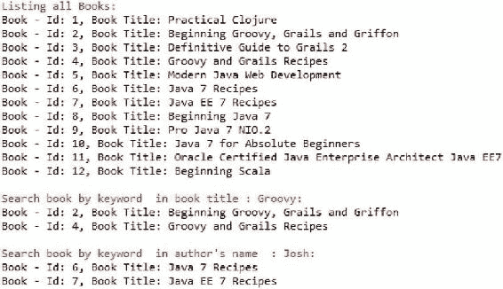

第一章

Java Web 开发简介

一旦被一个新的想法拉伸，头脑就再也不会回到它最初的维度。

拉尔夫·瓦尔多·爱默生 Ralph Waldo Emerson

智能机器是一种能扩展其想象力的机器。这方面的一个例子是名为 invokeDynamic， [<sup class="calibre12">1</sup>](#Fn1) 的指令，它是在 Java 7 中引入的，用于优化动态类型语言在 Java 虚拟机(JVM)上的性能。最初为 Java 设计的 JVM 现在可以托管无数的编程语言，包括 Groovy [<sup class="calibre12">2</sup>](#Fn2) 和 Scala。 [<sup class="calibre12">3</sup>](#Fn3) 这导致了 Java web 开发的复兴。这种交叉授粉的新范例和多样化的、有根据的选项在 Java 生态系统中开辟了许多利基市场，导致了比以往任何时候都更加丰富的 web 景观。

开源社区利用运行在 JVM 上的语言所提供的多平台能力，通过 web 框架，极大地提高了 web 开发的效率。Java EE [<sup class="calibre12">4</sup>](#Fn4) 推进了这一势头，由 Spring、 [<sup class="calibre12">5</sup>](#Fn5) 等 Java 框架通过标准化和改进 API 和运行时环境开创了这一势头。此外，lambdas 形式的函数式编程结构已经被添加到 Java 8 中。因此，Java 正在反弹，成为一个超级解决方案。

本章通过介绍构建现代 Java web 应用的三个主要参与者为本书做准备:JVM 语言、Java EE 和 Java web 框架。

注意 JVM 语言代表了在 JVM 上运行的一种新的语言类别。有了最新版本 Java 8，Java 不再是一种特权 JVM 语言，现在只是运行在 JVM 上的许多语言之一。

本章首先介绍 JVM 语言，然后介绍 Java EE。Java EE 平台是一组 API 规范，充当开发 web 应用的构建块。然后这一章强调了 Java web 框架，这将是本书从第 4 章开始的主题。

JVM 语言

JVM 是一个运行时环境，它使您能够使用不同的编程语言来构建 web 应用。JVM 语言可以大致分为两种类型:为 JVM 设计的语言和移植到 JVM 的现有语言。

为 JVM 设计的语言

许多语言是专门为 JVM 设计的；[表 1-1](#Tab1) 描述了其中的几个。除了 Clojure 之外的所有内容都在本书中讨论。

[表 1-1](#_Tab1) 。为 JVM 设计的语言

<colgroup><col width="35%" class="calibre14"> <col width="65%" class="calibre14"></colgroup> 
| 

为 JVM 设计的语言

 | 

描述

 |
| --- | --- |
| Clojure [<sup class="calibre20">6</sup>](#Fn6) | Clojure 是一种动态类型的函数式语言。 |
| 绝妙的 | Groovy 是一种动态的编译语言，语法类似于 Java，但更灵活。 |
| 爪哇 | Java 是一种静态类型的命令式语言。Java 的最新版本 Java 8 支持函数式编程的各个方面。 |
| 斯卡拉 | Scala 是一种静态类型的编译语言，支持函数式编程的各个方面，并执行大量的类型推断，很像一种动态语言。 |

以下是一些重要的定义:

*   *动态类型化* :动态类型化通过携带变量中保存的值的类型信息来跟踪关于变量包含何种值的信息。
*   *静态类型* :在静态类型中，类型信息都是关于变量的，而不是变量中的值。
*   命令式语言 :这些语言中的指令可以改变语言的状态。
*   函数式语言 :在函数式语言中，函数像在过程式语言中一样对值进行操作，但函数不是改变状态，而是返回新值的纯数学函数。

图 1-1 显示了 Java 8、Groovy、Scala 和 Clojure 在函数式语言连续体中的位置。Java 8 引入了 lambdas，这使得它稍微有点函数性，Groovy 从一开始就有函数构造，在 Groovy 2.0 中功能性更强，Scala 是三种面向对象(OO)语言中功能性最强的。另一方面，Clojure 是一种纯函数式的非 OO 语言。


[图 1-1](#_Fig1) 。 JVM 语言的功能分级

**注意**在[图 1-1](#Fig1) 中，没有提到 Groovy、Scala 和 Clojure 的版本号，因为 Java 只支持从 Java 8 开始的函数式编程。

移植到 JVM 的语言

JRuby、Jython 和 Rhino 是现有语言的几个主流 JVM 实现。表 1-2 描述了它们。

[表 1-2](#_Tab2) 。移植到 JVM 的语言

<colgroup><col width="35%" class="calibre14"> <col width="65%" class="calibre14"></colgroup> 
| 

移植到 JVM 的语言

 | 

描述

 |
| --- | --- |
| JRuby [<sup class="calibre20">7</sup>](#Fn7) | JRuby 是 Ruby 编程语言的 JVM 重新实现。Ruby 是一种动态类型的 OO 语言，具有一些功能特性。 |
| jython[<sup class="calibre20">8</sup>T4】](#Fn8) | Jython 是 Python 在 JVM 上的重新实现，所以它是一种动态语言。 |
| 犀牛 [<sup class="calibre20">9</sup>](#Fn9) | Rhino 在 JVM 上提供了 JavaScript 的实现。JavaScript 是一种动态类型的面向对象语言。 |

这本书基于一些专门为 JVM 设计的主流面向对象 JVM 语言，即 Java、Groovy 和 Scala。

Java EE

Java 最初是一种为构建独立应用而设计的编程语言，并迅速发展到其他领域。Java 的流行很大程度上可以归功于它在创建 web 应用中的使用。web 应用由静态和动态(交互式)网页组成。*静态*网页 包含各种类型的标记语言(HTML、XHTML 等)，通常用于提供信息；*动态*网页 另一方面，能够在附加 web 组件的帮助下生成内容(在[第 2 章](02.html)中介绍)。因此，*网络应用*是网页的集合，并且能够响应请求生成动态内容。与仅用于提供信息的网页不同，web 应用允许您执行一些活动并保存结果。然而，开发 web 应用与构建独立的应用有着本质的不同，需要您理解以下三个关键要素:

*   *Java EE 平台* :这是一组 API 规范，是 web 应用的构建块。
*   *web 容器*:web 容器实现 Java EE 平台的 API 规范。具体来说，web 容器提供了用于管理和执行 web 组件的服务，比如 servlets、JSP、过滤器、监听器和向客户端呈现响应。web 容器包含在[第 2 章](02.html)中。

**注意**有几种类型的容器，但是本书将集中讨论主要用于 web 应用的 web 容器。您必须根据您想要开发的应用的类型来选择容器。

*   Web 组件:这些组件由容器托管。这些 web 组件，比如 servlets、JSP、过滤器和监听器，将在第二章的[中介绍。](02.html)

Java EE 平台

Java EE 平台由以下两个目标驱动 :

*   提供作为 web 应用构建块的 API 规范。
*   标准化和降低企业应用开发的复杂性。它通过提供一个应用模型来实现这一点，该模型定义了将服务实现为多层应用的架构。

[图 1-2](#Fig2) 总结了 Java EE 的发展，为了简洁起见，只显示了每个版本中添加的新规范。


[图 1-2](#_Fig2) 。 Java EE 的演变

**注意** *修剪*(也称为*标记为删除*)由一个建议的特性列表组成，这些特性可能会在下一个 Java EE 版本中删除，以减小平台的大小或防止其膨胀。

Web Profile 的目标是允许开发人员使用适当的技术创建 Web 应用。

Java EE 平台旨在通过提供一个应用模型来标准化和降低企业应用开发的复杂性，该应用模型定义了将服务实现为多层应用的体系结构。在多层应用中，应用的功能被分成不同的功能区域，称为*层*。[图 1-3](#Fig3) 展示了 Java EE 应用模型中典型的多层架构 。


[图 1-3](#_Fig3) 。Java 中的多层架构

客户端层

客户机层是多层 Java EE 架构中的顶层；它由向 Java EE 服务器发出请求的应用客户机组成，javaee 服务器通常位于不同的机器上。服务器处理请求并向客户端返回响应。客户端的一个例子是 web 浏览器或独立应用。

Web 层

web 层由处理客户端和业务层之间交互的组件组成。从客户端收到请求后，web 层执行以下操作:

1.  收集来自客户端的输入
2.  控制客户端上屏幕或页面的流动
3.  维护用户会话的数据状态
4.  从业务层中的组件获取结果
5.  为客户端生成各种格式的动态内容

如图[图 1-2](#Fig2) 所示，Java EE 7 中增加了一个新的 Web Profile 规范。 [<sup class="calibre12">10</sup>](#Fn10) [表 1-3](#Tab3) 列出了 Web Profile 规范中包含的技术。如前所述，Web Profile 的目标是允许开发人员使用适当的技术创建 Web 应用。

[表 1-3](#_Tab3) 。Web Profile 7 规范

<colgroup><col width="45%" class="calibre14"> <col width="10%" class="calibre14"> <col width="45%" class="calibre14"></colgroup> 
| 

规格

 | 

版本

 | 

统一资源定位器

 |
| --- | --- | --- |
| 联合打击战斗机 | Two point two | [http://JCP . org/en/JSR/detail？id=344](http://jcp.org/en/jsr/detail?id=344) |
| JSP | Two point three | [http://JCP . org/en/JSR/detail？id=245](http://jcp.org/en/jsr/detail?id=245) |
| 标准标记库(JSP Standard Tag Library) | One point two | [http://JCP . org/en/JSR/detail？id=52](http://jcp.org/en/jsr/detail?id=52) |
| 小型应用 | Three point one | [http://JCP . org/en/JSR/detail？id=340](http://jcp.org/en/jsr/detail?id=340) |
| WebSocket | One | [http://JCP . org/en/JSR/detail？id=356](http://jcp.org/en/jsr/detail?id=356) |
| 表达语言 | Three | [http://JCP . org/en/JSR/detail？id=341](http://jcp.org/en/jsr/detail?id=341) |
| 哦，我的上帝 | Three point two | [http://JCP . org/en/JSR/detail？id=345](http://jcp.org/en/jsr/detail?id=345) |
| 作业的装配区（JobPackArea） | Two point one | [http://JCP . org/en/JSR/detail？id=338](http://jcp.org/en/jsr/detail?id=338) |
| JTA | One point two | [http://JCP . org/en/JSR/detail？id=907](http://jcp.org/en/jsr/detail?id=907) |
| Bean 验证 | One point one | [http://JCP . org/en/JSR/detail？id=349](http://jcp.org/en/jsr/detail?id=349) |
| 受管 Beans | One | [http://JCP . org/en/JSR/detail？id=316](http://jcp.org/en/jsr/detail?id=316) |
| 截击机 | One point two | [http://JCP . org/en/JSR/detail？id=318](http://jcp.org/en/jsr/detail?id=318) |
| 上下文和依赖注入 | One point one | [http://JCP . org/en/JSR/detail？id=346](http://jcp.org/en/jsr/detail?id=346) |
| Java 的依赖注入 | One | [http://JCP . org/en/JSR/detail？id=330](http://jcp.org/en/jsr/detail?id=330) |
| 对其他语言的调试支持 | One | [http://JCP . org/en/JSR/detail？id=45](http://jcp.org/en/jsr/detail?id=45) |
| JAX-RS 啊 | Two | [http://JCP . org/en/JSR/detail？id=339](http://jcp.org/en/jsr/detail?id=339) |
| JSON-P | One | [http://JCP . org/en/JSR/detail？id=353](http://jcp.org/en/jsr/detail?id=353) |

关于[表 1-3](#Tab3) 中列出的网页简介规格:

*   在 Java EE 7 中，没有对 JSP 和 JSTL 进行任何更改，因为这些规范还没有更新。
*   表达式语言已经从 JSP 中移除，现在有了自己的 JSR (341)。
*   Servlets 和 JSF 都得到了更新。
*   WebSocket 1.0 是在 Java EE 7 中引入的。

这本书专注于 Java EE 的 web 层；我们将在第 2 章中深入探讨 web 层。

Java EE 的多层架构对 Java 企业应用的开发有着巨大的影响。 *Java 企业应用* 可以定义为利用 Java EE 提供的企业服务的 Java 应用。事实上，如果一个 web 应用以打包在 web 层中的组件的形式利用 Java EE 服务，那么它可以被归类为企业应用。如图 1-3 所示，Java EE 通过提供一个构建 Java 企业应用的应用模型，将这些服务从功能上隔离到不同的层中。因此，Java 企业应用反映了 Java EE 的多层架构。图 1-4 展示了一个典型的 web 应用层的一般视图。


[图 1-4](#_Fig4) 。一个企业应用中各层的综合视图

[图 1-4](#Fig4) 中的每一层都是*关注*的一个区域，用于应用。例如，web 层只处理使用 Java EE 的 web 层组件。在一个应用中拥有不同的层会导致所谓的*关注点分离*。就实现而言，这种关注点的分离是使用粗粒度接口实现的。

关注点是应用开发人员需要关注的特性、功能或业务功能。横切这样的关注点在复杂系统中是固有的，并导致*代码分散*，这是当一个关注点的代码跨越许多模块时，以及*代码缠结*，这是当一个模块中的代码集中处理多个关注点时。代码分散和代码纠缠导致缺乏清晰性、冗余性、刚性和持续重构。图 1-5 说明了日志、事务和安全的系统服务如何横切应用的业务功能。


[图 1-5](#_Fig5) 。涉及系统服务的图书服务

图 1-5 中[的 BookService](#Fig5) 与系统服务过于相关。每个对象都知道并负责日志记录、安全性和事务。例如，在 BookService 中购买一本书的方法应该只关心如何购买这本书，而不关心它是安全的还是事务性的。关注点分离是软件工程的主要目标之一，它允许您单独处理每个服务，从而完成以下任务:

*   在系统的整个生命周期中，促进系统中工件内部和之间的可追溯性
*   控制由变化引起的影响，从而提供进化和非侵入性适应的范围
*   促进内聚单元的开发，从而促进重用

**关注点分离**

术语*关注点分离* (SoC) 是 Edsger W. Dijkstra 在他的论文《论科学思想的作用》中创造的 [<sup class="calibre12">11</sup>](#Fn11) 迪杰斯特拉在以下条款中解释道:

让我试着向你解释，对我来说，什么是所有智能思维的特征。那就是，一个人愿意为了自己的一致性而孤立地深入研究他的主题的一个方面，始终知道自己只专注于其中的一个方面。我们知道一个程序必须是正确的，我们只能从这个角度来研究它；我们也知道它应该是高效的，可以说我们可以改天再研究它的效率。在另一种情绪下，我们可能会问自己，这个项目是否值得，如果值得，为什么值得。但是什么也得不到——相反！—通过同时处理这些不同的方面。这就是我有时称之为“关注点分离”的方法，即使不完全可能，但据我所知，这是有效整理一个人思想的唯一可行的方法。这就是我所说的“将一个人的注意力集中在某个方面”:这并不意味着忽略其他方面，这只是公正地对待这样一个事实，即从这个方面的观点来看，其他方面是不相关的。这是一个和多个轨道的思想同时存在。

网页层

web 应用的 web 层由 Java EE 的 web 层组件组成，如 servlets 和 JSP。web 层可以访问服务层，但是 web 层和服务层之间不应该有紧密的耦合。也就是说，更改服务层不会影响 web 层。

服务层

服务层由 Java EE 的业务层组件组成，比如 Enterprise JavaBean s(EJB)。服务层可以访问数据访问层，但是服务层和数据访问层之间不应该有紧密的耦合。事实上，服务层不应该知道任何关于 web 或数据访问层的事情。服务层为 web 层提供了粗粒度的接口。

数据访问层

数据访问层由 Java EE 的数据层组件组成，如 JDBC 和 JPA。这一层不应该包含任何业务逻辑。该层通过向服务层提供粗粒度接口，从服务层抽象出实际的持久性机制(换句话说，JDBC 或 JPA)。

**注意**这种架构的调用流程总是从顶层到底层。换句话说，服务层应该能够调用数据访问层，而不是相反。

在本章中，您将构建书店应用的数据访问层，并通过独立的 Java 应用对其进行查询。在[第 2 章](02.html)中，您将使用 Java EE 的 web 层组件(特别是 servlets 和 JSP)将这个独立的 Java 应用替换为 web 层。在本书中你将会用到这个数据访问层，从[第 4 章](04.html)开始，你将会通过使用不同的 web 框架重新构建 web 层来重复构建 web 应用。

Oracle 和 Java 社区进程(JCP)提供了标准化的企业组件，如果可以使用这些组件构建成功的企业应用，那么我们为什么还需要 web 框架呢？web 框架是用来做什么的？下一节将回答这些问题。

Java Web 框架

虽然 Java EE 在标准化企业基础设施、提供应用模型和提供足以开发 web 应用的组件方面做得很好，但是有两个主要问题与之相关。

*   直接与 Java EE 组件交互通常会产生大量样板代码，甚至代码冗余。
*   使用 Java EE 基础设施创建企业应用是一项艰巨的任务，需要大量的专业知识。通常参与创建企业 Java EE 应用的团队成员扮演着不同的角色，他们可能并不都具有满足 Java EE 标准的专业水平。

框架解决了这两个主要问题(以及在第 3 章中详细讨论的其他几个问题)。[表 1-4](#Tab4) 描述了你将在本书中学到的 web 框架。

[表 1-4](#_Tab4) 。基于 JVM 的 Web 框架

<colgroup><col width="20%" class="calibre14"> <col width="20%" class="calibre14"> <col width="60%" class="calibre14"></colgroup> 
| 

Web 框架

 | 

语言

 | 

从下载

 |
| --- | --- | --- |
| 支柱 2 | 爪哇 | [http://struts.apache.org/download.cgi#struts2314](http://struts.apache.org/download.cgi#struts2314) |
| 框架 | 爪哇 | [www.springsource.org/spring-community-download](http://www.springsource.org/spring-community-download) |
| JSF 2 | 爪哇 | [www.oracle.com/technetwork/java/javaee/downloads/index.html](http://www.oracle.com/technetwork/java/javaee/downloads/index.html) |
| Grails 2 | 绝妙的 | [www.grails.org/download](http://www.grails.org/download) |
| 游戏 2 | Java 和 Scala | [www.playframework.com/download](http://www.playframework.com/download) |

既然您已经看到了构建现代 Java web 应用的三个主要参与者(JVM 语言、Java EE 和 Java web 框架)，那么是时候深入研究 Java 的一些细节了。

下一节将介绍 Java，这样您就可以构建自己的第一个独立 Java 应用。由于这本书是以使用 Java 的 web 开发为中心，而不是关于 Java 作为一种编程语言，所以对 Java 的介绍是简短的——这足以帮助语言新手理解后面的章节。

Java 入门

一个 *Java* *应用*是一个当你使用 Java 命令启动 JVM 时执行的计算机程序。在 Java 编程语言中，所有的源代码首先都是用。java 扩展。javac 编译器将源文件编译成。包含字节码指令的类文件。JVM 读取这些字节码指令，并将它们翻译成每台计算机执行的机器语言操作。通过使 JVM 在许多平台上可用，Sun 将 Java 转变成了一种跨平台语言。如图 1-6 所示，完全相同的字节码可以在任何开发了 JVM 的操作系统上运行。


[图 1-6](#_Fig6) 。跨平台 Java

因为 JVM 可以在许多不同的操作系统上使用，所以。类文件能够在 Windows、Unix、Linux 或 Mac OS 上运行。在接下来的部分，我将向您展示如何编译和运行您的第一个 Java 应用。但是首先您需要设置开发环境。

设置开发环境

Java 软件有两个发行版。

*   Java 运行时环境(JRE )
*   Java 开发工具包(JDK )

JRE 包括一个 JVM 和核心库；它本质上只是一个运行字节码的环境。JDK 包括 JRE、Java 编译器(javac)和其他工具——编写和编译 Java 程序所需的基本软件。

在开始编译和运行 Java 程序之前，您需要下载并安装 JDK，并配置一些系统环境变量。

本书大部分代码需要 Java 7，但部分代码基于 Java 8，所以你应该安装 Java 8。要获得最新版本的 JDK)，请按照下列步骤操作:

1.  在网络浏览器中打开[www.oracle.com/technetwork/java/javase/downloads/index.html](http://www.oracle.com/technetwork/java/javase/downloads/index.html)。
2.  单击下载 JDK 按钮。
3.  按照网站提供的说明进行操作。
4.  运行安装程序并接受任何默认值。

要确认您已经正确安装了 JDK，请在命令行上从您机器上的任何目录键入 javac。如果您看到如何正确运行 javac 的说明，那么您已经成功安装了它。

创建并运行您的第一个 Java 应用

本节演示了如何在 Windows 上创建、编译和执行一个简单的 Java 应用。每个 Java 应用都有一个作为程序起点的类(通常称为*入口点*)。[清单 1-1](#list1) 展示了一个 HelloWorld 入口点类。

[清单 1-1](#_list1) 。一款 HelloWorld Java 应用

```java
1.    public class HelloWorld {
2.    public static void main(String[] args) {
3.    System.out.println("Hello World.");
4.     }
5.    }
```

*   *第 2 行*:第 2 行中的 main 方法使这个类成为入口点类。该方法接受输入并启动程序。

Java 应用的名称应该是入口点类的名称，保存 Java 类的文件必须与该类同名。因此，[清单 1-1](#list1) 中的 HelloWorld 类必须存储在一个名为 HelloWorld.java 的文件中。

**注意**每个 Java 应用只有一个 main 方法。

您使用 JDK 安装目录的 bin 目录中的 javac 程序来编译 Java 程序。假设您已经在计算机上编辑了 PATH 环境变量，那么您应该能够从任何目录调用 javac。要编译清单 1-1 中的 HelloWorld 类，请执行以下操作:

1.  打开命令提示符，转到保存 HelloWorld.java 文件的目录。
2.  键入以下命令:

    ```java
    javac HelloWorld.java
    ```

如果一切顺利，javac 将在您的工作目录中创建一个名为 HelloWorld.class 的文件。

运行 Java 应用

要运行您的 java 应用，您必须使用 Java 程序，该程序是带有命令 java <class name="">的 JDK 的一部分。同样，添加了 PATH 环境变量后，您应该能够从任何目录调用 java。从您的工作目录中，键入以下内容:</class>

```java
java  HelloWorld
```

请注意，您不包括。运行 Java 应用时的类扩展。您将在控制台上看到以下内容:

```java
Hello World.
```

用 IDE 开发 Java 应用

在本书中，您将使用 Eclipse *Kepler* 集成开发环境(IDE)。要下载软件，请遵循以下步骤:

1.  在网络浏览器中打开[www.eclipse.org/downloads/](http://www.eclipse.org/downloads/)。
2.  按照网站提供的说明进行操作。
3.  运行安装程序并接受任何默认值。

在 IDE 中创建您的第一个项目

启动 Eclipse 后，您可以创建一个新项目，如下所示:

1.  从“文件”菜单中，选择“新建”，然后选择“项目”。将出现“新建项目”窗口。
2.  In the New Project window, double-click Java Project. The New Java Project window appears, as illustrated in [Figure 1-7](#Fig7).

    

    [图 1-7](#_Fig7) 。创建 Java 项目

3.  在“项目名称”字段中输入 **chapter1** 。
4.  单击完成。您可以在这里更改许多其他选项。然而，对于我们的目的来说，默认设置就可以了。

创建应用

要为您的第一个程序创建一个包含 main 方法的类，请按照下列步骤操作:

1.  Right-click the chapter1 project in the Eclipse Package Explorer, choose New, and then choose Class. The New Java Class window displays, as shown in [Figure 1-8](#Fig8).

    

    [图 1-8](#_Fig8) 。创建 Java 类

    一个*包*将类分组在一起。在 Name 字段中，您可以键入类名，即 HelloWorld。选中提供 main 方法(public static void main(String args[]))的复选框。当你完成后，你应该有一个类似于[清单 1-2](#list2) 中的类。

2.  点击“生成评论”这个很快会解释。

[清单 1-2](#_list2) 。简单的 Java 应用

```java
packageapress.helloworld;

/**
 * A Hello World Java application
 * @author Vishal Layka
 *
 */
public class HelloWorld {

    /**
     * Entry point
     * @paramargs
     */
    public static void main(String[] args){
        System.out.println("Hello World");
    }

}
```

现在，您可以通过单击工具栏中的“运行”按钮或从“运行”菜单中选择“运行”来运行应用。

然后，Eclipse 会在代码区域下显示一个控制台面板，显示程序的输出。在这种情况下，它说“你好，世界。”

Javadoc 注释

Javadoc 注释 以/**字符序列开始，以*/字符序列结束。编译器会忽略这些字符序列之间的所有内容。在 Eclipse 中，您可以通过选择类或方法名并按 Alt+Shift+J 来添加 Javadoc 注释。

要生成 Javadoc，在 Eclipse 中选择项目，选择项目菜单，点击 Generate Javadoc，如图[图 1-9](#Fig9) 所示。


[图 1-9](#_Fig9) 。生成 Javadoc

将会打开一个窗口([图 1-10](#Fig10) )，您可以在其中选择需要生成 Javadoc 的 Java 项目或其底层资源。还有其他几种选择；您可以选择是否为公共/私有 API 生成 Javadoc，等等。现在，在“Javadoc 命令”字段中配置 javadoc.exe 文件，浏览并选择应该生成 Javadoc 的目标文件夹。


[图 1-10](#_Fig10) 。生成 Javadoc

单击完成。在控制台上，您可以看到 Javadoc 生成的进度。[图 1-11](#Fig11) 显示了生成的 Javadoc。


[图 1-11](#_Fig11) 。HelloWorld 类的 Javadoc

现在，您将学习如何创建一个简单但功能强大的独立书店应用版本，您将在本书中使用它。

书店应用

这本书不是简单地宣称一个 web 框架是最好的，而是打算通过一个真实世界的书店应用来展示最流行的 web 框架的优势。开发一个完整的真正的应用需要动态功能的无缝协作，而构建这样的组件的代码是人为设计的，而且过于复杂。这本书没有把重点放在开发这样的移动部件上，而是把注意力集中在利用每个 web 框架的优势上。在整本书中，您将学习如何使用 Java EE 和 Java web 框架来构建书店 web 应用。在本章中，您将通过构建一个传统的独立 Java 书店应用迈出第一步。在[第 2 章](02.html)中，你将把单机应用转换成 web 应用。

在本书中，我将使用一个 web 应用案例研究来演示如何使用 servlets 和 JSP 以及不同的 web 框架(如 JSF、Struts 2、Spring web MVC)和快速 Web 开发框架(如 Grails 和 Play)来编写 Web 应用。该应用允许用户通过关键字查看和搜索书籍，通常是通过作者的名字或姓氏以及书名。

书店应用的数据模型

本节介绍了一个简单的数据模型，该模型将用于本书中的书店 web 应用。当需要时，我将在每章中逐步扩展这个模型。该模型是一个简单的图书数据库，由三个表组成。

*   类别表存储不同类别的书籍；类别包括 Java、Scala 等等。
*   图书表存储图书的详细信息，比如书名。
*   作者表存储作者的详细信息。

每个类别可以有零本或多本书。例如，书店里可能没有或有更多属于 Java 类别的书籍。换句话说，Category 和 Book 表之间是一对多的关系。同样，每本书可以有一个或多个作者。换句话说，Book 和 Author 表之间是一对多的关系。图 1-12 中[的实体关系图](#Fig12)说明了这种关系。


[图 1-12](#_Fig12) 。数据模型的实体关系图

这个数据模型还不能用于生产，因为您可以在类别和图书之间建立多对多的关系，在图书和作者之间建立多对多的关系。我保持数据模型简单，这样数据模型的复杂性就不会妨碍学习构建 web 应用的技巧。然而，你可以，例如，在书和作者之间建立一个多对多的关系，如图 1-13 所示。


[图 1-13](#_Fig13) 。书籍和作者之间的多对多关系

BookAuthor 表的唯一目的是提供图书和作者之间的多对多关系。

**注**如图[图 1-13](#Fig13) 所示，图书与图书作者之间是一对多关系，作者与图书作者之间是一对多关系。事实上，BookAuthor 表的唯一目的是提供图书和作者之间的多对多关系，换句话说，一个作者可以写很多本书，一本书可以有很多作者。

由于跨几个领域的 web 应用大量涌现，许多关系和非关系数据库如 NoSQL [<sup class="calibre12">12</sup>](#Fn12) 已经出现。在本书中，我将使用 MySQL [<sup class="calibre12">13</sup>](#Fn13) ，因为它是使用最广泛的免费数据库管理系统(DBMS)。要安装 MySQL，请转到[http://dev.mysql.com/downloads/](http://dev.mysql.com/downloads/)并点击下载。可以下载 MySQL Server 5.5 或更新版本。你可以在[http://dev.mysql.com/doc/refman/5.5/en/installing.html](http://dev.mysql.com/doc/refman/5.5/en/installing.html)看到安装 MySQL 的说明。

要创建图书数据库，请使用以下命令:

```java
create database books;
```

您需要使用以下命令指示 MySQL 在 books 数据库中创建表:

```java
use books;
```

现在您可以使用清单 1-3 中的语句创建表格。

[清单 1-3](#_list3) 。为书店创建桌子

```java
CREATE  TABLE CATEGORY (
ID  INT NOT NULL  AUTO_INCREMENT ,
CATEGORY_DESCRIPTION  VARCHAR(20)  NOT NULL ,
PRIMARY KEY (ID)
);

CREATE  TABLE BOOK (
ID  INT NOT  NULL AUTO_INCREMENT,
CATEGORY_ID  INT  NOT  NULL ,
BOOK_TITLE  VARCHAR(60) NOT NULL,
PUBLISHER  VARCHAR(60) NOT NULL ,
PRIMARY KEY (ID) ,
CONSTRAINT  FK_BOOK_1  FOREIGN KEY (CATEGORY_ID) REFERENCES CATEGORY(ID)

);

CREATE  TABLE  AUTHOR (
ID  INT  NOT NULL AUTO_INCREMENT ,
BOOK_ID  INT  NOT  NULL ,
FIRST_NAME  VARCHAR(20)  NOT NULL ,
LAST_NAME  VARCHAR(20)  NOT NULL ,
PRIMARY KEY (ID) ,
CONSTRAINT FK_AUTHOR_1 FOREIGN KEY (BOOK_ID) REFERENCES BOOK (ID)
);
```

您可以使用显示表格命令验证创建的表格，如图[图 1-14](#Fig14) 所示。


[图 1-14](#_Fig14) 。数据库中的所有表

您也可以使用命令 describe <table-name>或 desc <table-name>检查表格的结构，如图[图 1-15](#Fig15) 所示。</table-name></table-name>


[图 1-15](#_Fig15) 。表格的结构

现在使用 insert 语句填充这些表，如下所示:

```java
insert into category (category_description) values ('Clojure');
insert into category (category_description) values ('Groovy');
insert into category (category_description) values ('Java');
insert into category (category_description) values ('Scala');
```

您可以验证填充的类别表，如图[图 1-16](#Fig16) 所示。


[图 1-16](#_Fig16) 。类别表中的所有类别

```java
insert into Book (CATEGORY_ID, BOOK_TITLE, PUBLISHER) values (1, 'Practical Clojure', 'Apress');
insert into Book (CATEGORY_ID, BOOK_TITLE, PUBLISHER) values (2, 'Beginning Groovy, Grails and Griffon', 'Apress');
insert into Book (CATEGORY_ID, BOOK_TITLE, PUBLISHER) values (2, 'Definitive Guide to Grails 2', 'Apress');
insert into Book (CATEGORY_ID, BOOK_TITLE, PUBLISHER) values (2, 'Groovy and Grails Recipes', 'Apress');
insert into Book (CATEGORY_ID, BOOK_TITLE, PUBLISHER) values (3, 'Modern Java Web Development', 'Apress');
insert into Book (CATEGORY_ID, BOOK_TITLE, PUBLISHER) values (3, 'Java 7 Recipes', 'Apress');
insert into Book (CATEGORY_ID, BOOK_TITLE, PUBLISHER) values (3, 'Java EE 7 Recipes', 'Apress');
insert into Book (CATEGORY_ID, BOOK_TITLE, PUBLISHER) values (3, 'Beginning Java 7 ', 'Apress');
insert into Book (CATEGORY_ID, BOOK_TITLE, PUBLISHER) values (3, 'Pro Java 7 NIO.2', 'Apress');
insert into Book (CATEGORY_ID, BOOK_TITLE, PUBLISHER) values (3, 'Java 7 for Absolute Beginners', 'Apress');
insert into Book (CATEGORY_ID, BOOK_TITLE, PUBLISHER) values (3, 'Oracle Certified Java Enterprise Architect Java EE7', 'Apress');
insert into Book (CATEGORY_ID, BOOK_TITLE, PUBLISHER) values (4, 'Beginning Scala', 'Apress');
```

您可以验证如图[图 1-17](#Fig17) 所示的已填充的图书表。


[图 1-17](#_Fig17) 。图书表中的所有图书

```java
insert into Author (BOOK_ID, FIRST_NAME, LAST_NAME) values (1, 'Luke', 'VanderHart');
insert into Author (BOOK_ID, FIRST_NAME, LAST_NAME) values (2, 'Vishal', 'Layka');
insert into Author (BOOK_ID, FIRST_NAME, LAST_NAME) values (3, 'Jeff', 'Brown');
insert into Author (BOOK_ID, FIRST_NAME, LAST_NAME) values (4, 'Bashar', 'Jawad');
insert into Author (BOOK_ID, FIRST_NAME, LAST_NAME) values (5, 'Vishal', 'Layka');
insert into Author (BOOK_ID, FIRST_NAME, LAST_NAME) values (6, 'Josh',  'Juneau');
insert into Author (BOOK_ID, FIRST_NAME, LAST_NAME) values (7, 'Josh', 'Juneau');
insert into Author (BOOK_ID, FIRST_NAME, LAST_NAME) values (8, 'Jeff', 'Friesen');
insert into Author (BOOK_ID, FIRST_NAME, LAST_NAME) values (9, 'Anghel', 'Leonard');
insert into Author (BOOK_ID, FIRST_NAME, LAST_NAME) values (10, 'Jay',  'Bryant');
insert into Author (BOOK_ID, FIRST_NAME, LAST_NAME) values (11, 'B V', 'Kumar');
insert into Author (BOOK_ID, FIRST_NAME, LAST_NAME) values (12, 'David', 'Pollak');
```

您可以验证填充的作者表，如图[图 1-18](#Fig18) 所示。


[图 1-18](#_Fig18) 。作者表中的所有作者

书店应用的数据访问层

现在数据库已经准备好了，您将为应用构建数据访问层。数据访问层将通过 JDBC 从数据库中检索数据，并将结果集直接映射到 Java 对象中。这些 Java 对象是应用中的域对象，是数据库中表的 Java 表示。数据访问层负责以透明的方式与底层持久性机制进行交互，以便从数据库中存储和检索对象。这种透明性意味着数据访问层可以将持久化机制从普通的 JDBC [<sup class="calibre12">14</sup>](#Fn14) 切换到 ORM [<sup class="calibre12">15</sup>](#Fn15) 持久化技术如 Hibernate、 [<sup class="calibre12">16</sup>](#Fn16) JPA、 [<sup class="calibre12">17</sup>](#Fn17) 等，而不影响数据访问层的客户端。这种透明性是通过数据访问对象(DAO)模式实现的，如图 1-19 所示。DAO 对象提供了到数据库或底层持久化机制的接口，从而从客户端抽象出底层实现。


[图 1-19](#_Fig19) 。道模式

DAO 将应用调用映射到持久性机制，并提供特定的数据操作，而不公开数据库的细节。DAO 接口抽象了从客户机(应用对象)访问数据的实现细节，并提供了客户机(应用对象)需要的特定于域的对象。

首先，您需要为数据库表的 Java 对象表示创建特定于领域的类[。清单 1-4](#list4) 、 [1-5](#list5) 和 [1-6](#list6) 分别显示了图书、作者和类别领域类。

[清单 1-4](#_list4) 。型号:类别

```java
package com.apress.books.model;

public class Category {
    private Long id;
    private String categoryDescription;

    public Long getId() {
        return id;
    }

    public void setId(Long id) {
        this.id = id;
    }

    public String getCategoryDescription() {
        returncategoryDescription;
    }

    public void setCategoryDescription(String categoryDescription) {
        this.categoryDescription = categoryDescription;
    }

    public String toString() {
        return "Category - Id: " + id + ", Category Description: "
                + categoryDescription;
    }

}
```

[清单 1-5](#_list5) 。型号:书本

```java
package com.apress.books.model;

import java.util.List;
import com.apress.books.model.Author;

public class Book {
    private Long id;
    private Long categoryId;
    private String bookTitle;
    private List<Author> authors;
    private String publisherName;

    public Long getId() {
        return id;
    }

    public void setId(Long id) {
        this.id = id;
    }

    public Long getCategoryId() {
        return categoryId;
    }

    public void setCategoryId(Long categoryId) {
        this.categoryId = categoryId;
    }

    public String getBookTitle() {
        return bookTitle;
    }

    public void setBookTitle(String bookTitle) {
        this.bookTitle = bookTitle;
    }

    public List<Author> getAuthors() {
        return authors;
    }

    public void setAuthors(List272103_1_En authors) {
        this.authors = authors;
    }

    public String getPublisherName() {
        return publisherName;
    }

    public void setPublisherName(String publisherName) {
        this.publisherName = publisherName;
    }

    public String toString() {
        return "Book - Id: " + id + ", Book Title: " + bookTitle;
    }

}
```

[清单 1-6](#_list6) 。型号:作者

```java
package com.apress.books.model;

public class Author {
    private Long id;
    private Long bookId;
    private String firstName;
    private String lastName;

    public Long getId() {
        return id;
    }

    public void setId(Long id) {
        this.id = id;
    }

    public Long getBookId() {
        return bookId;
    }

    public void setBookId(Long bookId) {
        this.bookId = bookId;
    }

    public String getFirstName() {
        return firstName;
    }

    public void setFirstName(String firstName) {
        this.firstName = firstName;
    }

    public String getLastName() {
        return lastName;
    }

    public void setLastName(String lastName) {
        this.lastName = lastName;
    }

    public String toString() {
        return "Author - Id: " + id + ", Book id: " + bookId + ", First Name: "
                + firstName + ", Last Name: " +lastName;
    }

}
```

现在让我们从 BookDAO 的一个简单接口开始，它封装了 web 应用访问的所有数据。[清单 1-7](#list7) 显示了 BookDAO 接口。

[清单 1-7](#_list7) 。书道界面

```java
 1.    package com.apress.books.dao;
 2.
 3.    import java.util.List;
 4.
 5.    import com.apress.books.model.Book;
 6.    import com.apress.books.model.Category;
 7.
 8.    public interface BookDAO {
 9.        public List<Book>findAllBooks();
10.
11.        public List<Book>searchBooksByKeyword(String keyWord);
12.
13.        public List<Category>findAllCategories();
14.
15.        public void insert(Book book);
16.
17.        public void update(Book book);
18.
19.        public void delete(Long bookId);
20.
21.    }
```

*   第 9 行:这是 findAllBooks()方法，用于列出数据库中的所有书籍。
*   *第 11 行* : SearchBooksByKeyword(字符串关键字)允许用户通过书名中的关键字或者作者的名和姓来搜索书籍。
*   应用需要 findAllCategories()来提供图书的分类列表。

该接口中的方法对应于应用的 CRUD 术语(换句话说，创建、读取、更新和删除)。[清单 1-8](#list8) 展示了 BookDAO 接口的实现。

[清单 1-8](#_list8) 。BookDAO 接口的实现

```java
 1.    package com.apress.books.dao;
 2.
 3.    import java.sql.Connection;
 4.    import java.sql.DriverManager;
 5.    import java.sql.PreparedStatement;
 6.    import java.sql.ResultSet;
 7.    import java.sql.SQLException;
 8.    import java.sql.Statement;
 9.    import java.util.ArrayList;
10.    import java.util.List;
11.
12.    import java.apress.books.model.Author;
13.    import java.apress.books.model.Book;
14.    import java.apress.books.model.Category;
15.
16.    public class BookDAOImpl implements BookDAO {
17.
18.        static {
19.            try {
20.                Class.forName("com.mysql.jdbc.Driver");
21.            } catch (ClassNotFoundException ex) {
22.            }
23.        }
24.
25.        private Connection getConnection() throws SQLException {
26.            return DriverManager.getConnection("jdbc:mysql://localhost:3306/books",
27.                    "root", "password");
28.        }
29.
30.        private void closeConnection(Connection connection) {
31.            if (connection == null)
32.                return;
33.            try {
34.                connection.close();
35.            } catch (SQLException ex) {
36.            }
37.        }
38.
39.        public List<Book> findAllBooks() {
40.            List<Book> result = new ArrayList<>();
41.            List<Author> authorList = new ArrayList<>();
42.
43.            String sql = "select * from book inner join author on book.id = author.book_id";
44.
45.            Connection connection = null;
46.            try {
47.                connection = getConnection();
48.                PreparedStatement statement = connection.prepareStatement(sql);
49.                ResultSet resultSet = statement.executeQuery();
50.                while (resultSet.next()) {
51.                    Book book = new Book();
52.                    Author author = new Author();
53.                    book.setId(resultSet.getLong("id"));
54.                    book.setBookTitle(resultSet.getString("book_title"));
55.                    book.setCategoryId(resultSet.getLong("category_id"));
56.                    author.setBookId(resultSet.getLong("book_Id"));
57.                    author.setFirstName(resultSet.getString("first_name"));
58.                    author.setLastName(resultSet.getString("last_name"));
59.                    authorList.add(author);
60.                    book.setAuthors(authorList);
61.                    book.setPublisherName(resultSet.getString("publisher"));
62.                    result.add(book);
63.                }
64.            } catch (SQLException ex) {
65.                ex.printStackTrace();
66.            } finally {
67.                closeConnection(connection);
68.            }
69.            return result;
70.        }
71.
72.
73.        public List<Book> searchBooksByKeyword(String keyWord) {
74.            List<Book> result = new ArrayList<>();
75.            List<Author> authorList = new ArrayList<>();
76.
77.            String sql = "select * from book inner join author on book.id = author.book_id"
78.                    + " where book_title like '%"
79.                    + keyWord.trim()
80.                    + "%'"
81.                    + " or first_name like '%"
82.                    + keyWord.trim()
83.                    + "%'"
84.                    + " or last_name like '%" + keyWord.trim() + "%'";
85.
86.            Connection connection = null;
87.            try {
88.
89.                connection = getConnection();
90.                PreparedStatement statement = connection.prepareStatement(sql);
91.                ResultSet resultSet = statement.executeQuery();
92.                while (resultSet.next()) {
93.                    Book book = new Book();
94.                    Author author = new Author();
95.                    book.setId(resultSet.getLong("id"));
96.                    book.setBookTitle(resultSet.getString("book_title"));
97.                    book.setPublisherName(resultSet.getString("publisher"));
98.                    author.setFirstName(resultSet.getString("first_name"));
99.                    author.setLastName(resultSet.getString("last_name"));
100.                    author.setBookId(resultSet.getLong("book_id"));
101.                    authorList.add(author);
102.                    book.setAuthors(authorList);
103.                    result.add(book);
104.                }
105.            } catch (SQLException ex) {
106.                ex.printStackTrace();
107.            } finally {
108.                closeConnection(connection);
109.            }
110.
111.            return result;
112.        }
113.
114.        public List<Category> findAllCategories() {
115.            List<Category> result = new ArrayList<>();
116.            String sql = "select * from category";
117.
118.            Connection connection = null;
119.            try {
120.                connection = getConnection();
121.                PreparedStatement statement = connection.prepareStatement(sql);
122.                ResultSet resultSet = statement.executeQuery();
123.                while (resultSet.next()) {
124.                    Category category = new Category();
125.                    category.setId(resultSet.getLong("id"));
126.                    category.setCategoryDescription(resultSet
127.                            .getString("category_description"));
128.                    result.add(category);
129.                }
130.            } catch (SQLException ex) {
131.                ex.printStackTrace();
132.            } finally {
133.                closeConnection(connection);
134.            }
135.            return result;
136.        }
137.
138.        public void insert(Book book) {
139.        }
140.
141.        public void update(Book book) {
142.        }
143.
144.        public void delete(Long bookId) {
145.
146.        }
147.    }
```

[清单 1-8](#list8) 是 BookDao 接口的一个实现，用于与；这种交互包括连接到数据库，并通过纯 JDBC 选择、删除和更新数据。JDBC 提供了特定于每个数据库的驱动程序，并允许 Java 对数据库进行编码。

*   第 18 到 37 行:这几行显示了管理 JDBC 连接所需的代码。
*   *第 26 行*:getConnection()方法返回一个驱动实现的 java.sql.Connection 接口。这个接口允许您对数据库运行 SQL 语句。为此，您需要提供一个 MySQL 连接器/J JAR 文件。MySQL Connector/J 是一个本地 Java 驱动程序，它将 JDBC 调用转换成 MySQL 数据库可以理解的网络协议。DriverManager 管理驱动程序，并提供建立数据库连接的静态方法。

**注意**你可以从 http://dev.mysql.com/downloads/connector/j/[下载 MySQL 连接器/J](http://dev.mysql.com/downloads/connector/j/)。将这个连接器 JAR 放在项目的类路径中。

*   *第 30 行到第 37 行*:需要关闭连接，因为就应用的性能而言，连接是很昂贵的。
*   *第 39 到 144 行*:这几行是 BookDAO 接口中 CRUD 服务的实现。
*   第 67、108 和 133 行:您为 CRUD 服务中的每个语句创建了一个连接。您需要关闭这些连接；让它们保持打开状态会导致应用的性能下降。

数据访问层的客户端

现在您的数据访问层已经准备好了，您将使用独立的 Java 应用查询它。在第二章中，你将用一个网络应用替换这个 Java 应用。[清单 1-9](#list9) 展示了 Java 应用。

[清单 1-9](#_list9) 。单机书店 Java App

```java
 1.    package com.apress.books.client;
 2.    import java.util.List;
 3.
 4.    import com.apress.books.dao.BookDAO;
 5.    import com.apress.books.dao.BookDAOImpl;
 6.    import com.apress.books.model.Book;
 7.
 8.    public class BookApp {
 9.        private static BookDAO bookDao = new BookDAOImpl();
10.
11.        public static void main(String[] args) {
12.            // List all books
13.            System.err.println("Listing all Books:");
14.            findAllBooks();
15.            System.out.println();
16.            // search book by keyword
17.            System.err.println("Search book by keyword  in book title : Groovy:");
18.
19.            searchBooks("Groovy");
20.            System.out.println();
21.
22.            System.err.println("Search book by keyword  in author's name  : Josh:");
23.
24.            searchBooks("Josh");
25.
26.
27.        }
28.
29.        private static void findAllBooks() {
30.            List<Book> books = bookDao.findAllBooks();
31.            for (Book book : books) {
32.                System.out.println(book);
33.            }
34.        }
35.        private static void searchBooks(String keyWord) {
36.            List<Book> books = bookDao.searchBooksByKeyword(keyWord);
37.            for (Book book : books) {
38.                System.out.println(book);
39.            }
40.        }
41.    }
```

[图 1-20](#Fig20) 说明了独立应用的目录结构。


[图 1-20](#_Fig20) 。独立书店应用的目录结构

运行此应用会产生以下输出:



在下一章中，您将开发 web 层来代替这个客户端，并调用书店 web 应用中的数据访问层。

Java Web 领域的趋势和技术

现在是时候深入研究当今 Java web 领域的趋势和技术了。对于 Java 新手来说，这可能令人望而生畏，但目标是让您熟悉 Java web 应用开发中的工具、技术和趋势，以便让您对现代 Java 前景有一个初步了解。当您学习使用 Grails 2 和 Play 2 等快速 web 框架开发 web 应用时，您会发现这些工具和技术中的大多数都是现成的。

正如本章所提到的，JVM 最初是为 Java 设计的，现在可以支持无数的编程语言，包括 Groovy 和 Scala。作为这种新兴的多道程序设计范例的结果，现代 web 应用通常具有以下一种或多种特征:

*   响应式 web 应用
*   单页 web 应用
*   实时网络应用
*   反应式 web 应用
*   混搭和 web 服务

响应式网络应用

网络最大的优势之一就是它的灵活性。然而，这种灵活性也是其最大的弱点。当在一个浏览器上测试的 web 应用在另一个浏览器上被查看并且不能正常运行时，这个弱点就显现出来了。随着智能手机的出现，这种跨浏览器兼容性问题越来越严重。如[图 1-21](#Fig21) 所示，截至 2013 年底，全球有 68 亿移动用户，到 2016 年这一数字将增长到 80 亿(【www.itu.int/ITU-D/ict/facts/index.html】T2)。


[图 1-21](#_Fig21) 。移动订阅

Web 应用既可以在桌面上运行，也可以在智能手机上运行，但是为桌面和智能手机创建单独的 web 应用会带来巨大的开发和维护开销。2010 年 5 月，Ethan Marcotte 为 List Apart 写了一篇名为“响应式网页设计”的文章，定义了一种突破性的方法。他使用现有的工具(这将在本节稍后解释)创建了一个在不同设备上显示精美的网站，如图[图 1-22](#Fig22) 和[图 1-23](#Fig23) 所示。


[图 1-22](#_Fig22) 。Ethan Marcotte 的响应网站


[图 1-23](#_Fig23) 。智能手机上的同一个响应网站

web 应用是与设备无关的，因为它们可以适应运行它们的设备。这项技术甚至重新思考了页面布局的设计方式。您可以更进一步，在设计 web 应用时考虑最小的屏幕(智能手机),然后逐步增强应用以在桌面屏幕上运行。这种技术被称为*移动优先*设计。移动优先设计的理念是，如果你设计的界面和网络组件能够在智能手机上以可接受的性能运行，那么在桌面屏幕上的性能将会非常快。此外，明智地使用智能手机也将适用于桌面屏幕，这将使应用的可用性更好。

开发响应式 web 应用所采用的核心技术有 CSS3、[<sup class="calibre12">18</sup>](#Fn18)jQuery[<sup class="calibre12">19</sup>](#Fn19)和 jQuery 插件、 [<sup class="calibre12">20</sup>](#Fn20) LESS、[<sup class="calibre12">21</sup>](#Fn21)coffee script、 [<sup class="calibre12">22</sup>](#Fn22) 以及 Bootstrap、 [<sup class="calibre12">23</sup>](#Fn23) Polyfills

以下是响应式世界中的一些重要定义:

*   *不引人注目的 JavaScript*[<sup class="calibre12">24</sup>](#Fn24):不引人注目的 JavaScript 是一种分离关注点的手段，即把外观和感觉从行为关注点中分离出来。这就产生了一个纯标记，JavaScript(行为)在不同的浏览器和设备上不引人注目地工作。jQuery 是一个流行的库，有助于编写不引人注目的 JavaScript。CoffeeScript 编译成 JavaScript。它被用作 JavaScript 的替代品，并大大减少了代码。
*   *CSS3 媒体查询* :媒体查询是让 web 应用做出响应的主要手段。媒体查询使用 CSS 文件中的媒体特征(如设备宽度、设备高度、方向和设备纵横比)来开发响应性 web 应用。
*   *LESS* **:** LESS 是 CSS3 样式表变得不可管理时使用的 CSS 预处理器。LESS 扩展了 CSS 的动态行为，比如混合和函数。
*   *Polyfills* : Polyfills 是 JavaScript，用于制作支持 HTML5 的浏览器。聚合填充提供了浏览器中缺少的功能，并提供了一个后备。
*   Modernizr : Modernizr 是一个 JavaScript 库，可以检测浏览器中的 HTML5 和 CSS3 特性，并有条件地加载 polyfills。

单页 Web 应用(SPA)

web 应用开发的另一个趋势是单页面 web 应用的出现。

*   客户端代码——如 HTML、JavaScript 和 CSS——通过单个页面加载进行检索；在该过程中的任何时候都不会重新加载页面，并且控件也不会转移到另一个页面。
*   资源(如图像)会动态加载并添加到页面以响应事件。

spa 是使用 Node.js [<sup class="calibre12">25</sup>](#Fn25) 作为 web 服务器构建的。AngularJS 是一个功能齐全的 SPA 框架。

实时 Web 应用

一个*实时* web 应用根据事件的性质，通过客户端和服务器之间的异步双向通信，在可测量和可接受的时间段内对事件做出响应。WebSocket 是开发实时 web 应用的核心技术。WebSocket 通过单一 TCP 连接提供全双工和双向通信协议。也就是说，客户端和服务器可以相互发送消息，并且相互独立。

需要实时功能的应用的几个例子是聊天应用、多人在线游戏、股票交易应用等等。

**注意【WebSocket 的 Java API 定义为 JSR 356；参见[表 1-3](#Tab3) 。**

反应式网络应用

*反应式*应用是一类新的应用，与传统的基于网络的应用有着本质的不同，由类型安全 [<sup class="calibre12">26</sup>](#Fn26) 反应式平台驱动。Typesafe 反应式平台是一套集成产品，包括 Play 2 框架、Akka、 [<sup class="calibre12">27</sup>](#Fn27) 和 Scala，以及用于命令和控制的 Typesafe 控制台。由于多核处理器以及它提倡异步和基于事件的编程，反应式编程变得至关重要。Play 框架是企业 Java 堆栈的替代方案。Play 是为现代 web 和移动应用的需求而构建的，利用了 REST、JSON 和 WebSocket 等技术。这些技术允许创建通过任何现代浏览器呈现的丰富、高度交互的用户界面，同时使并行呈现页面的各个部分以及进行部分页面更新或渐进式增强变得更加容易。

混搭和网络服务

mashup 是一个 web 应用，它使用来自多个来源的内容来创建一个显示在单一图形界面中的新服务。使用 mashups，您可以通过组合 web 服务来开发强大的应用。你可以在 www.programmableweb.com/apis/directory/1?sort=mashups 的[找到流行的混搭 API。这一节将关注 web 服务，然后触及一个迷人的趋势，这仍然是一个研究领域:语义 Web。](http://www.programmableweb.com/apis/directory/1?sort=mashups)

一个 *web 服务* 是一个存储在一台机器上的软件组件，可以被另一台机器上的应用(或其他软件组件)通过网络访问。web 服务所在的机器被称为 *web 服务主机*。客户端应用通过网络向 web 服务主机发送请求，web 服务主机处理请求并返回响应。使 web 服务可用于接收客户端请求被称为*发布*web 服务；从客户端应用使用 web 服务被称为*消费*web 服务。

Web 服务使用 XML 和 JSON [<sup class="calibre12">28</sup>](#Fn28) 等技术进行数据交换。

JavaScript 对象符号

JavaScript 对象符号(JSON) 用于表示数据，作为 XML 的替代。JSON 减少了 web 请求的负载，提高了 web 应用的整体性能。JSON 是一种基于文本的数据交换格式，用于将 JavaScript 中的对象表示为由字符串表示的名称-值对的集合。

**注** JSON 处理在 JSR 353 中定义为 JSON 处理的 Java API 参见[表 1-3](#Tab3) 。

两个 Java APIs 促进了 web 服务:

*   *JAX-WS* :这是基于简单对象访问协议(SOAP)， [<sup class="calibre12">29</sup>](#Fn29) 这是一种基于 XML 的协议，允许 web 服务和客户端进行通信，即使客户端和 web 服务是用不同的语言编写的。
*   *JAX-RS* :这使用了表述性状态转移(REST)，这是一种网络架构，使用 Web 的传统请求-响应机制，如 GET 和 POST 请求。

简单对象访问协议

简单对象访问协议(SOAP)是一个独立于平台的协议，它使用 XML 与 web 服务进行交互，通常是通过 HTTP。每个请求和响应都封装在 SOAP 消息中，SOAP 消息是包含 web 服务处理消息所需信息的 XML 标记。SOAP web 服务的工作方式如下:

1.  当调用 SOAP web 服务的方法时，请求被封装在 SOAP 信封中的 SOAP 消息中，并发送到 web 服务所在的服务器。
2.  当 SOAP )web 服务收到此消息时，它会解析表示消息的 XML，然后处理消息的内容。
3.  然后，web 服务在处理完请求后，在另一个 SOAP 消息中将响应发送给客户端。
4.  客户端解析响应。

代表性状态转移

罗伊·菲尔丁于 2000 年在加州大学欧文分校的博士论文 [<sup class="calibre12">30</sup>](#Fn30) 中引入并定义了术语*表征状态转移* (REST) 。REST 指的是一种实现 web 服务的架构风格，称为 RESTful web 服务。RESTful web 服务中的每个方法都由唯一的 URL 标识。

**注意** RESTful web 服务被定义为 JSR 339，如[表 1-3](#Tab3) 所示。

与 SOAP 不同，REST 执行以下操作:

*   将资源标识为 URI
*   使用一组定义良好的 HTTP 方法来访问资源
*   使用资源的多种表示格式

语义网(Web 3.0)

Web 2.0 在 2004 年开始成形。它由谷歌开创，随后是视频分享、社交网络、微博、照片分享、维基百科等社交应用，以及第二人生等虚拟世界。混搭在社交应用和 Web 2.0 的发展中扮演了重要角色。

术语*语义网*指的是 W3C 对链接数据网的设想。语义网可以被看作是一套标准，允许机器理解网上信息的*意思*。今天的网络由本身没有意义的数据组成，而这些意义必须在从网络上收集数据后手工构建。语义 Web 技术使您能够在 Web 上创建数据存储，构建词汇表，并编写处理数据的规则。关联数据是通过 RDF、 [<sup class="calibre12">31</sup>](#Fn31) SPARQL、 [<sup class="calibre12">32</sup>](#Fn32) 和 OWL 等技术实现的。语义网是网络的未来，也是一个正在研究的课题。我推荐艾伦·施瓦茨的*一个可编程的 Web:一个未完成的工作* [<sup class="calibre12">34</sup>](#Fn34) 作为语义 Web 上的优秀资源。你也可以关注语义网上的最新消息。

摘要

本章介绍了 Java 语言，然后带您进行了一次旋风式的 Java 之旅。Java 世界的多样化景观由几个 web 框架(如 Struts 2、Spring Web MVC、JSF 2、Grails 2 和 Play 2)组成，这些框架使开发变得容易得多；因此，作为 Java web 开发人员，您需要熟悉这些 web 框架。现代 Java 不仅仅是一种语言；现在，它是一个针对其他几种行业优势语言(如 Groovy、Clojure 和 Scala)的完全优化的平台。所有这些语言，尤其是 Groovy，都与 Java 有着密切的联系，不久您将会遇到 web 应用，其中 Java 和这些替代的 JVM 语言将协同工作。

随后的章节将解决现代 Java web 开发人员的所有这些需求。具体来说，在下一章中，您将创建一个 Hello World web 应用，它利用了 web 应用的基本构件，即 servlets 和 Java 服务器页面。然后，您将把这个独立的应用转换成您的第一个成熟的 web 应用:一个使用 servlets 和 JSP 的书店应用。

<sup class="calibre12"><sup class="calibre12">[http://Cr . open JDK . Java . net/√jrose/pres/2009 910-vml . pdf](http://cr.openjdk.java.net/%E2%88%BCjrose/pres/200910-VMIL.pdf)</sup></sup>

[<sup class="calibre12">2</sup>](#_Fn2)【http://groovy.codehaus.org/】T4

[<sup class="calibre12">3</sup>](#_Fn3)【www.scala-lang.org/】T4

[<sup class="calibre12">4</sup>](#_Fn4)【www.oracle.com/technetwork/java/javaee/overview/index.html】T4

[<sup class="calibre12">5</sup>](#_Fn5)【http://spring.io/】T4

[<sup class="calibre12">6</sup>](#_Fn6)【http://clojure.org/】T4

[<sup class="calibre12">7</sup>](#_Fn7)【http://jruby.org/】T4

[<sup class="calibre12">8</sup>](#_Fn8)【www.jython.org/】T4

[T1】9T3](#_Fn9)[https://developer . Mozilla . org/en-US/docs/Rhino _ documentation](https://developer.mozilla.org/en-US/docs/Rhino_documentation)

[<sup class="calibre12">10</sup>](#_Fn10)【www.oracle.com/technetwork/java/javaee/tech/index.html】T4

[<sup class="calibre12">11</sup>](#_Fn11)[www . cs . ute xas . edu/users/EWD/transcriptions/ewd 04 xx/ewd 447 . html](http://www.cs.utexas.edu/users/EWD/transcriptions/EWD04xx/EWD447.html)

[<sup class="calibre12">12</sup>](#_Fn12)【http://nosql-database.org/】T4

[<sup class="calibre12">13</sup>](#_Fn13)【www.mysql.com/】T4

[<sup class="calibre12">14</sup>](#_Fn14)【www.oracle.com/technetwork/java/overview-141217.html】T4

[<sup class="calibre12">15</sup>](#_Fn15)【http://en.wikipedia.org/wiki/Object-relational_mapping】T4

[<sup class="calibre12">16</sup>](#_Fn16)【www.hibernate.org/】T4

[<sup class="calibre12">17</sup>](#_Fn17)[www . Oracle . com/tech network/Java/javaee/tech/persistence-JSP-140049 . html](http://www.oracle.com/technetwork/java/javaee/tech/persistence-jsp-140049.html)

[<sup class="calibre12">18</sup>](#_Fn18)【www.w3.org/Style/CSS/current-work.en.html】T4

[<sup class="calibre12">19</sup>](#_Fn19)【http://jquery.com/】T4

[<sup class="calibre12">【20】</sup>](#_Fn20)[【http://plugins . jquery . com/](http://plugins.jquery.com/)

[<sup class="calibre12">21</sup>](#_Fn21)【http://lesscss.org/】T4

[<sup class="calibre12">22</sup>](#_Fn22)【http://coffeescript.org/】T4

[<sup class="calibre12">23</sup>](#_Fn23)【http://getbootstrap.com/】T4

[<sup class="calibre12">24</sup>](#_Fn24)【www.w3.org/wiki/The_principles_of_unobtrusive_JavaScript】T4

[<sup class="calibre12">25</sup>](#_Fn25)【http://nodejs.org/】T4

[<sup class="calibre12">26</sup>](#_Fn26)【http://typesafe.com/】T4

[<sup class="calibre12">27</sup>](#_Fn27)【http://akka.io/】T4

[<sup class="calibre12">28</sup>](#_Fn28)【www.json.org/】T4

[<sup class="calibre12">29</sup>](#_Fn29)【www.w3.org/TR/soap/】T4

[<sup class="calibre12">30</sup>](#_Fn30)[www . ics . UCI . edu/∞fielding/pubs/dissertation/rest _ arch _ style . htm](http://www.ics.uci.edu/%E2%88%BCfielding/pubs/dissertation/rest_arch_style.htm)

[<sup class="calibre12">31</sup>](#_Fn31)【www.w3.org/RDF/】T4

[<sup class="calibre12">32</sup>](#_Fn32)【www.w3.org/TR/rdf-sparql-query/】T4

[<sup class="calibre12">33</sup>](#_Fn33)【www.w3.org/TR/owl-features/】T4

[<sup class="calibre12">34</sup>](#_Fn34)[www . morganclaypool . com/doi/pdf/10.2200/s 00481 ed 1v 01y 201302 wbe 005](http://www.morganclaypool.com/doi/pdf/10.2200/S00481ED1V01Y201302WBE005)