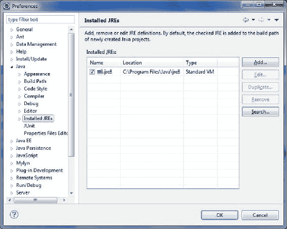
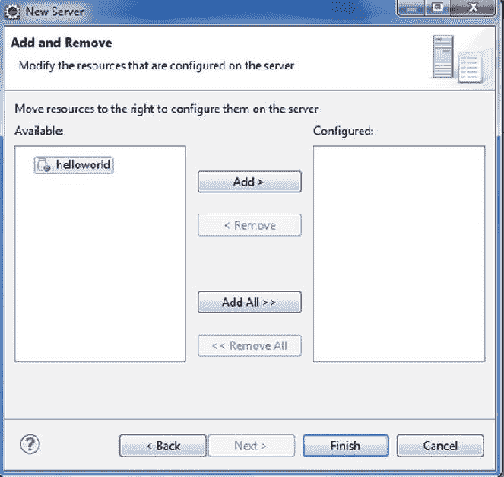

第二章

使用 Servlets 和 JSP 构建 Web 应用程序

协议就是一切。

弗朗索瓦·朱利亚尼

核心互联网协议充实并支撑着 web，因此理解这些协议是理解 Web 应用程序如何开发的基础。

互联网是一个巨大的网络网络，一般来说，互联网上的所有机器都可以分为两类:服务器和客户端。*客户端*是请求一些信息的机器，而*服务器*是提供这些信息的机器。从信息提供者(即服务器)流向信息请求者(即客户端)的信息数据受一个明确的规则的约束，该规则管理服务器传输的信息的编组和客户端翻译或读取的信息的解组。这个规则被称为 *协议*。web 浏览器(即客户端)、web 服务器(即服务器)和 web 应用程序都通过超文本传输协议(HTTP)相互通信。 客户端向 web 服务器发送 HTTP 请求，web 服务器以 HTTP 响应的形式返回请求的数据。HTTP 客户端和 HTTP 服务器是万维网的基石，HTTP 是万维网的通用语言。

HTTP 是一种请求-响应无状态协议，其必然结果是，从 web 服务器的角度来看，任何请求都是来自 web 浏览器的第一个请求。当客户端请求资源时，该请求还以统一资源定位符(URL) 的形式包含所请求资源的标识。在 RFC 3986 [<sup class="calibre12">1</sup>](#Fn1) 中，URL 被描述为唯一标识资源的统一方式。URL 被设计成通过描述资源在网络上的“位置”来隐含地提供定位资源的方法。

**注**URL 是统一资源标识符(URI)的一种具体形式，是一种区分实体的机制。但是 URIs 本身是抽象的。URI 有两种具体形式:URL 和统一资源名(URN)。骨灰盒仍然是实验性的，没有被广泛采用。

通用 URL 是由组件组成的分层序列，其结构为 scheme://hostName:port number/path/resource？查询字符串。

要识别 URL 的各个部分，请考虑一个列出书店网站上某本书的详细信息的 URL，如下所示:

```java
http://www.yourbookstore.com/bookstore/bookServlet?action=bookDetails
```

[图 2-1](#Fig1) 展示了这个 URL 的各个部分。


[图 2-1](#_Fig1) 。URL 的剖析

主机名和端口号一起被称为*机构*。默认情况下，像 Tomcat 这样的 web 服务器会监听端口 8080 上的传入请求。在[图 2-1](#Fig1) 中显示的 URL 的某些部分是可选的，包括端口号(默认为众所周知的端口 80 和 443，分别用于 HTTP 和 HTTPS 方案)和查询字符串。

**注意** HTTPS 是安全套接字层(SSL)上的 HTTP；它允许安全、加密的通信。

如果存在，查询字符串是一系列名称-值对，前面有一个问号(？)并用一个&符号分隔这些对。

**注意**只有 GET 方法支持查询字符串。还有其他 HTTP 协议方法，如 POST、DELETE 和 PUT。

web 应用程序是协同工作以在 web 上提供特定功能的 Web 组件的集合。在 Java EE 规范中，web 组件被定义为一个 Servlet 或一个 Java 服务器页面(JSP )页面。

**注意**除了 servlets 和 JSP 页面，web 应用还可以包括静态资源，例如 HTML 文档、图像和定义 web 应用属性的元数据或配置文件；但是，这些不被认为是 web 组件。

web 应用程序及其组成组件在 web 容器中管理和执行，也称为 *servlet 容器* ，它为 web 应用程序提供了额外的功能，如安全性。当 web 服务器收到对特定 web 组件(如 servlet 或 JSP 页面)可以提供的特定功能的请求时，web 服务器会将请求转发给 web 组件所在的 servlet 容器。所有对动态内容的请求(也就是对负责生成动态内容的 web 组件的所有请求)都由 servlet 容器来协调，如图 2-2 中的[所示。](#Fig2)


[图 2-2](#_Fig2) 。动态内容请求

Java EE servlet 和 JSP 规范描述了 Servlet 容器必须提供的服务契约，并指定了 Servlet 应该如何使用这些服务。就实现而言， *servlet* 是一个 Java 类，充当动态 web 资源。

小型应用程序

Servlets 是 Java web 应用程序的中央处理单元，负责 web 应用程序所需的大部分处理。具体来说，servlet 是一个实现 javax.servlet.Servlet 接口的 Java 类。Servlet 接口定义了所有 Servlet 必须实现的方法。“一枚戒指统治他们所有人！”这个接口和其他方法一起定义了关键的生命周期方法，比如 init()、service()和 destroy()，分别用于初始化 servlet、服务请求和从服务器中删除 servlet。[表 2-1](#Tab1) 描述了 javax.servlet.Servlet 接口的所有方法。

[表 2-1](#_Tab1) 。Servlet 接口的生命周期和非生命周期方法

| 

修饰符和类型

 | 

方法

 |
| --- | --- |
| 空的 | init（ServletConfig config） |
| 空的 | 服务(ServletRequest req，ServletResponse res) |
| 空的 | 销毁() |
| 如何获取 | getServletConfig() |
| 线 | getServletInfo() |

在 servlet 的生命周期中，容器在适当的时刻按以下顺序调用生命周期方法:

1.  servlet 被构造，然后用 init 方法初始化。
2.  客户端对服务方法的任何调用都会得到处理。
3.  然后用 destroy 方法销毁 servlet，回收垃圾，并最终完成。

这里解释一下[表 2-1](#Tab1) 中说明的 Servlet 接口方法:

*   init(ServletConfig):在实例化 servlet 后由 servlet 容器调用一次。在 servlet 成为接收任何请求的候选者之前，该方法必须成功完成。
*   service():在 servlet 的 init()方法成功完成之后，由 servlet 容器调用，以允许 servlet 响应请求。
*   destroy():由容器调用以销毁 servlet，并作为一种方法，在 servlet 被销毁之前，必须释放获取的资源。
*   getServletConfig():允许 servlet 以该方法返回的 ServletConfig 对象的形式获取启动信息。ServletConfig 对象包含 servlet 的初始化和启动参数。
*   getServletInfo():允许 servlet 返回自己的信息，比如 servlet 的作者和版本。

使用 Servlet 的第一个 Web 应用程序

在[第 1 章](01.html)中，你安装了 Eclipse 开普勒 IDE。在本节中，您将在 Eclipse 中开发您的第一个 web 应用程序。具体来说，您将使用 Tomcat 7 作为 HTTP 服务器和 servlet 容器。你可以从[http://tomcat.apache.org/download-70.cgi](http://tomcat.apache.org/download-70.cgi)下载 Tomcat 的源代码发行版作为 ZIP 文件来安装 Tomcat 7。

启动 Eclipse，选择窗口首选项菜单选项，显示首选项对话框，如图 2-3 所示。



[图 2-3](#_Fig3) 。首选项对话框，验证安装的 JRE

在这个对话框的左窗格中，深入到 Java  Installed JREs，并验证您以前安装的 JRE8/JDK 8 版本是否出现。如果没有，请单击添加按钮添加对您的 JDK 的引用。选择文件新建动态 Web 项目，创建一个动态 Web 项目，如图[图 2-4](#Fig4) 所示。将项目命名为 **helloworld** ，如图[图 2-5](#Fig5) 所示。


[图 2-4](#_Fig4) 。创建新项目


[图 2-5](#_Fig5) 。创建 helloworld 项目

点击下一步，勾选“生成 web.xml 部署描述符”，如图[图 2-6](#Fig6) 所示。稍后我们将看到如何在没有 web.xml 的情况下配置 web 模块。


[图 2-6](#_Fig6) 。配置网络模块设置

点击完成，创建一个新的 Java 类，如图[图 2-7](#Fig7) 所示。


[图 2-7](#_Fig7) 。创建一个 Java 类:servlet

用[清单 2-1](#list1) 中的代码修改生成的 HelloWorld 类。

[清单 2-1](#_list1) 。HelloWorld Servlet

```java
1.package apress.helloworld;
2.
3.import java.io.IOException;
4.import java.io.PrintWriter;
5.
6.import javax.servlet.http.HttpServlet;
7.import javax.servlet.http.HttpServletRequest;
8.import javax.servlet.http.HttpServletResponse;
9.
10.public class HelloWorld extends HttpServlet{
11.
12.protected void doGet(HttpServletRequest request,
13.HttpServletResponse response)
14.{
15.try
16.{
17.response.setContentType("text/html");
18.PrintWriter printWriter = response.getWriter();
19.printWriter.println("<h2>");
20.printWriter.println("Hello World");
21.printWriter.println("</h2>");
22.}
23.catch (IOException ioException)
24.{
25.ioException.printStackTrace();
26.}
27.}
28.
29.}
```

用清单 2-2 中的代码修改 web.xml 文件。

[清单 2-2](#_list2) 。Web.xml:部署描述符

```java
1.<?xml version="1.0" encoding="UTF-8"?>
2.<web-app xmlns:xsi="http://www.w3.org/2001/XMLSchema-instance"
3.fontname">http://java.sun.com/xml/ns/javaee" xmlns:web="http://java.sun.com/xml/ns/javaee/web-app_2_5.xsd"
4.xsi:schemaLocation="http://java.sun.com/xml/ns/javaeehttp://java.sun.com/xml/ns/javaee/web-app_3_0.xsd"
5.id="WebApp_ID" version="3.0">
6.<display-name>helloworld</display-name>
7.<servlet>
8.<servlet-name>HelloWorld</servlet-name>
9.<servlet-class>apress.helloworld.HelloWorld</servlet-class>
10.</servlet>
11.<servlet-mapping>
12.<servlet-name>HelloWorld</servlet-name>
13.<url-pattern>/hello</url-pattern>
14.</servlet-mapping>
15.<welcome-file-list>
16.<welcome-file>index.html</welcome-file>
17.<welcome-file>index.htm</welcome-file>
18.<welcome-file>index.jsp</welcome-file>
19.<welcome-file>default.html</welcome-file>
20.<welcome-file>default.htm</welcome-file>
21.<welcome-file>default.jsp</welcome-file>
22.</welcome-file-list>
23.</web-app>
```

现在我们需要在 Tomcat 中将 HelloWorld servlet 配置为 web 模块。在 Eclipse 的菜单栏中选择 Window  Show View  Servers，如图[图 2-8](#Fig8) 所示。


[图 2-8](#_Fig8) 。添加服务器

在 Servers 选项卡上，右键单击并添加 Tomcat 7 作为新的服务器，如图[图 2-9](#Fig9) 所示。


[图 2-9](#_Fig9) 。定义服务器

接下来你必须定义一个新的服务器，如图 2-10 所示。


[图 2-10](#_Fig10) 。定义 Tomcat 服务器

现在通过将资源移动到 configured 部分的右边来配置 helloworld 项目，如图 2-11 所示。



[图 2-11](#_Fig11) 。在服务器上配置资源

单击“添加”,将在服务器上配置该资源。然后单击完成。启动服务器，使用图 2-12 中[所示的 URL 访问应用程序。](#Fig12)


[图 2-12](#_Fig12) 。启动服务器

你现在可以通过 URL[http://localhost:8080/hello world/hello](http://localhost:8080/helloworld/hello)访问你的第一个 web 应用，如图[图 2-13](#Fig13) 所示。


[图 2-13](#_Fig13) 。运行 helloworld web 应用程序

在下一节中，您将了解请求如何流经应用程序，以及容器如何在您开发的 helloworld 应用程序中找到 servlet。然后，您将使用 HelloWorld servlet 来理解 servlet 的生命周期方法。

HelloWorld Servlet 的请求流

在 HelloWorld servlet 可以生成响应之前，来自 web 浏览器的请求会流经 web 服务器和 servlet 容器，如下面几节所述。

HTTP 请求消息

用于访问 helloworld web 应用的 URL 是[http://localhost:8080/hello world/hello](http://localhost:8080/helloworld/hello)。当用户通过这个 URL 访问 web 应用程序时，web 浏览器创建 HTTP 请求，如[清单 2-3](#list3) 所示。

[清单 2-3](#_list3) 。HttpRequest 消息

```java
1.GET /helloworld/hello HTTP/1.1
2.Host: localhost:8080
3.User-Agent: Mozilla/5.0 (Windows NT 6.1) AppleWebKit/537.31 (KHTML, like Gecko)
Chrome/26.0.1410.43 Safari/537.31
```

*   *第 3 行*:这一行描述了特定的用户代理(web 浏览器)，它通过使用 HTTP 请求特定的资源来发起通信，如第 1 行所述。
*   *Line 1*: The request made by the user agent is of the form shown in [Figure 2-14](#Fig14).

    

    [图 2-14](#_Fig14) 。HTTP 请求消息剖析

*   *Line 2* :运行 web 服务器的这台机器(你的机器)是服务器机器。指定 Localhost，否则您将使用计算机的主机名。例如，将安装在运行 HTTP 服务器的系统上的浏览器指向 [http://localhost](http://localhost) ，将显示安装在该系统上的网站的主页，如图[图 2-15](#Fig15) 所示。


[图 2-15](#_Fig15) 。网络服务器的主页

[图 2-15](#Fig15) 显示的是 Tomcat 的主页，当你在你的机器上运行 Tomcat 的 bin 目录下的 startup.bat，你就会看到这个主页。服务器使用带编号的端口使其服务对互联网可用，服务器上可用的每个服务一个端口。例如，如果一台服务器正在运行一个 web 服务器，那么这个 web 服务器通常位于端口 80 上，对于 Tomcat 来说是 8080。

审查请求

当客户端(web 浏览器)发出请求(在本例中是 GET 请求)时，web 服务器(Tomcat)在第 1 行的请求中看到资源路径/helloworld/hello，并确定用户请求的资源不是静态页面(例如. html 文件),因此将请求转发给 web 容器(Tomcat)。敏锐的读者会注意到 Tomcat 充当了 web 服务器和 web 容器的角色。

定位 Servlet

请求中的资源路径(清单 2-3 中的第 1 行)通过清单 2-2 中的 web.xml 文件映射到 HelloWorld servlet 。这个 web.xml 文件被称为*部署描述符*，因为它向 web 容器描述了部署的 servlet。通过部署描述符，web 容器确定需要调用哪个 servlet 来服务 web 浏览器发起的原始 HTTP 请求。为了方便读者，web.xml 再次显示在[清单 2-4](#list4) 中。

[清单 2-4](#_list4) 。web.xml

```java
1.<?xml version="1.0" encoding="UTF-8"?>
2.<web-app fontname">http://java.sun.com/xml/ns/javaee" xmlns:xsi="http://www.w3.org/2001/XMLSchema-instance" xsi:schemaLocation="http://java.sun.com/xml/ns/javaeehttp://java.sun.com/xml/ns/javaee/web-app_3_0.xsd" version="3.0">
3.<servlet>
4.<servlet-name>HelloWorld </servlet-name>
5.<servlet-class>
6.apress.helloworld.HelloWorld
7.</servlet-class>
8.</servlet>
9.<servlet-mapping>
10.<servlet-name>HelloWorld</servlet-name>
11.<url-pattern>/hello </url-pattern>
12.</servlet-mapping>
13.</web-app>
```

*   *第 1 行到第 2 行*:这些行包含样板 XML，说明 XML 文件使用的版本、编码和模式。
*   *第 3 行到第 8 行*:<servlet>标签用于配置我们的 servlet。它包含两个嵌套标签:< servlet-name >定义 servlet 的逻辑名称，而< servlet-class >表示定义 servlet 的 Java 类。
*   *第 9 行到第 12 行*:<servlet-mapping>XML 标签用于配置我们的 servlet。它包含两个嵌套标签:< servlet-name >匹配在< servlet >标签中设置的值，而< url-pattern >设置 servlet 将执行的 url 模式。

Java EE web 应用程序从上下文根中运行。上下文根是 URL 中服务器名称和端口之后的第一个字符串。比如在 URL[http://localhost:8080/](http://localhost:8080/)helloworld/hello 中，字符串 hello world 就是上下文根。< url-pattern >的值相对于应用程序的上下文根。Java EE web.xml 文件可以包含许多附加的 xml 标记。除了将 URL 映射到实际的 servlets，您还可以使用部署描述符定制 web 应用程序的其他方面，比如安全角色、错误页面、标记库和初始配置信息。但是，这个 helloworld 应用程序不需要这些额外的标记。web 容器加载 HelloWorld servlet 类并实例化它。只创建 HelloWorld servlet 的一个实例，对 HelloWorld servlet 的并发请求在同一个实例上执行。每个客户端请求都会生成一对新的请求和响应对象。容器运行多个线程来处理对 HelloWorld servlet 的单个实例的多个请求。

**注意**在分布式 web 应用程序中，每个 JVM 都有一个特定 servlet 的实例，但是每个 JVM 仍然只有那个 servlet 的一个实例。

生命周期法

对象的生命周期描述了对象在其存在期间必须经历的一系列步骤。servlet 的生命不同于普通的 Java 类，因为 servlet 必须在 web 容器内部执行。图 2-16 显示了 HelloWorld servlet 的层次结构。


[图 2-16](#_Fig16) 。HelloWorld servlet 的层次结构

通用服务器

大多数 servlet 通过 Servlet API 提供的抽象 javax.servlet.GenericServlet 类提供类似的基本功能。GenericServlet 类的实现是独立于协议的，因此它是否必须响应 HTTP 或 FTP 请求并不重要。GenericServlet 抽象类定义了一个 init()方法，默认的 init(ServletConfig)方法调用该方法来执行任何特定于应用程序的 Servlet 初始化。

http servlet〔t0〕

在 web 应用程序中，GenericServlet 类中缺少任何依赖于协议的处理意味着开发人员必须在自己创建的任何子类中编写处理代码。由于 HTTP 是 Web 上最著名和最广泛使用的协议，Servlet API 还包括 GenericServlet 的一个更抽象的子类:javax.servlet.http.HttpServlet。

**注意** HTTP/1.1 定义了七种请求方法。HttpServlet 类为这些方法中的每一个提供了默认实现，您可以在 Servlet 中覆盖这些方法。然而，大多数 web 应用程序包含只覆盖 doGet()和 doPost()方法的 servlets。

对 HttpServlet 子类的 HTTP 请求要经过许多步骤:

1.  容器对公共服务(ServletRequest，ServletResponse)方法的调用。
2.  将此调用委托给 HttpServlet 的受保护服务(HttpServletRequest，HttpServletResponse)方法。
3.  受保护的服务(HttpServletRequest，HttpServletResponse)方法然后委托给适当的 doXxx 方法，这取决于用于请求的 HTTP 方法。

HelloWorld Servlet

如前一节所述，servlet 的超类包括 init()的两个版本，一个采用 ServletConfig，另一个没有参数。init(ServletConfig)方法调用无参数 init()，因此您只需要覆盖无参数版本。

init( )

容器在 servlet 实例上调用 init()。您可以覆盖它，以便获得向其他对象注册的数据库连接。否则，运行 Genericservlet 中的 init()方法。

1.  创建 servlet 实例时，会调用它的 init()方法。init()方法允许 servlet 在处理第一个请求之前初始化自己。您可以在 web.xml 文件中或通过注释为 servlet 指定 init()参数。
2.  web 容器调用 servlet 的 init()方法(在 servlet 的生命周期中只调用一次)，init()方法必须在容器可以调用 service()方法之前完成。

服务()

容器调用 servlet 的 service()方法。这个方法查看请求，确定 HTTP 方法的类型，并在 servlet 上调用匹配的 doGet()或 doPost()。你永远不能超越它。您的工作是覆盖 doGet()或 doPost()，让来自 HTTPServlet 的服务实现担心调用正确的那个。

*   当在 servlet 上调用 service()方法时，它将被传递对实现 HttpServletRequest 和 HttpServletResponse 接口的 HttpServletRequest 和 HttpServletResponse 对象的引用。容器实现了这些接口。
*   对于 servlet 收到的每个请求，都会调用 servlet 的 service()方法。对于 HttpServlet 子类，通常调用 doGet()、doPost()等方法之一。容器创建两个对象:HTTPServletRequest 和 HttpServletResponse。
*   只要 servlet 在 servlet 容器中是活动的，就可以多次调用 service()方法。
*   service()方法调用 doGet()/doPost()。您总是在 servlet 中覆盖至少其中一个。

destroy( )

servlet 容器调用 servlet 上的 destroy()方法，这个方法只被调用一次。这个方法为 servlet 提供了一个机会，在它被破坏之前释放获得的资源。

ServletContext 和 ServletConfig

调用 init()方法后，servlet 为每个 servlet 获取一个 ServletConfig 对象，为每个 web 应用程序获取一个 ServletContext。在分布式环境中，每个 JVM 都有一个 ServletContext。ServletContext 是一种方法，通过它 servlet 可以连接容器和 web 应用程序的其他部分。在 servlet 中，只有当您的 servlet 不是 HttpServlet 或 GenericServlet 时，才需要通过 ServletConfig 来获取 ServletContext。

servlet config 对象可用于执行以下操作:

*   将您不希望硬编码到 servlet 中的部署时信息(如数据库或企业 bean 查找名称)传递给 servlet。这个部署时信息被称为 *servlet 初始化参数*。servlet init 参数将在下一节讨论。
*   访问 ServletContext。

ServletContext 对象可用于执行以下操作:

*   访问 web 应用程序参数
*   设置应用程序的所有组件都可以访问的属性
*   获取服务器信息，包括容器的名称和版本以及支持的 API 版本

servlet 可以有三种类型的参数:

*   请求参数
*   初始化(init)参数
*   上下文初始化(context-init)参数

初始化参数

初始化参数在 web.xml 文件中定义，如[清单 2-5](#list5) 所示。

[清单 2-5](#_list5) 。定义初始化参数

```java
<servlet>
<init-param>
<param-name>email </param-name>
<param-value>vishalway@.gmail.com</param-value>
</init-param>
</servlet>
```

在 servlet 初始化之前，不能使用 init-parameters。您的 servlet 继承了 getServletConfig()，因此您可以从 servlet 中的任何方法调用它来获得对 ServletConfig 的引用。一旦有了 ServletConfig 引用，就可以调用 getInitParam()。

当容器初始化 servlet 时，会发生以下情况:

1.  容器为 servlet 创建一个惟一的 ServletConfig。
2.  容器从部署描述符中读取 init 参数，并在 ServletConfig 对象中设置它们。
3.  然后，容器将 ServletConfig 传递给 servlet 的 init (servletConfig)方法。

**注意**一旦容器在 ServletConfig 中设置了 init 参数，容器就不再从部署描述符中读取 init 参数，除非 servlet 被重新部署。

上下文初始化参数

上下文初始化参数类似于初始化参数。context-init 参数和 init 参数之间的主要区别在于，context 参数适用于整个 web 应用程序，而 init 参数仅适用于 servlet。清单 2-6 展示了 web.xml 文件中的上下文初始化参数。

[清单 2-6](#_list6) 。定义上下文初始化参数

```java
<context-param>
<param-name>email </param-name>
<param-value>vishalway@gmail.com</param-value>
</context-param>
```

<context-param>元素没有嵌套在<servlet>元素中。</servlet></context-param>

清单 2-7 展示了如何从 servlet 中获取 context-init 参数。

[清单 2-7](#_list7) 。获取上下文初始化参数

```java
out.println(getServletContext().getInitParameter("email");
```

每个 servlet 都继承了一个 getServletContext()方法。getServletContext()方法返回一个 ServletContext 对象。

请求调度员

在 web 应用程序中，有两种方法可以改变请求流。

*   *重定向请求*:请求被重定向到一个完全不同的 URL。重定向可以通过在响应对象上调用 sendRedirect() 来完成。重定向是由浏览器完成的。
*   *分派请求*:请求被分派给 web 应用程序中的另一个组件，通常是 JSP 页面。请求分派不同于重定向，因为它在服务器端完成工作。对请求调用 RequestDispatcher，对响应调用 redirect。

[图 2-17](#Fig17) 显示了 RequestDispatcher 接口中的方法。


[图 2-17](#_Fig17) 。请求调度程序接口

您可以通过两种方式获得 RequestDispatcher。

*   从 ServletRequest 获取 RequestDispatcher
*   从 ServletContext 获取 RequestDispatcher

从 ServletRequest 获取 RequestDispatcher】

```java
RequestDispatcher view = request.getRequestDispatcher("bookDetails.jsp");
```

ServletRequest 中的 getRequestDispatcher()方法获取请求转发到的资源的路径。如果路径以正斜杠(/)开头，则容器认为它是从 web 应用程序的根目录开始的。如果路径不是以正斜杠开头，容器认为它是相对于原始请求的。

从 ServletContext 获取 RequestDispatcher】

```java
RequestDispatcher view = getServletContext().getRequestDispatcher("/bookDetails.jsp");
```

getRequestDispatcher()方法接受一个资源的字符串路径，请求将被转发到该资源。从上下文或请求中获得的 RequestDispatcher 可用于转发到资源，因为 RequestDispatcher 知道您要转发到的资源，换句话说，就是作为参数传递给 getRequestDispatcher()的资源。清单 2-8 展示了在 RequestDispatcher 上调用 forward。

[清单 2-8](#_list8) 。在 RequestDispatcher 上呼叫转发

```java
RequestDispatcher view = request.getRequestDispatcher("bookDetails.jsp");
view.forward(request, response);
```

过滤器

*过滤器*是一个可重用的 Java 组件，可以转换 HTTP 请求、响应和头信息的内容。过滤器用于以下用途:

*   在调用请求之前访问静态或动态内容或修改请求头
*   在调用后拦截 web 组件的调用
*   通过以特定顺序使用过滤器链来提供对 web 组件的操作
*   在呈现响应头和响应数据之前修改它们

过滤器是通过实现 javax.servlet.Filter 接口并提供一个无参数构造函数来创建的。过滤器是在 web 应用程序中配置的，要么在部署描述符中使用<filter>元素，要么在@WebFilterannotation 中配置(在下一节中介绍)。在<filter>元素中，必须声明以下内容:</filter></filter>

*   <filter-name>:用于将过滤器映射到 servlet 或 URL</filter-name>
*   <filter-class>:容器用来标识过滤器类型</filter-class>

**注意**你也可以声明一个过滤器的初始化参数。

清单 2-9 展示了过滤器的声明。

[清单 2-9](#_list9) 。声明过滤器

```java
<filter>
<filter-name>ResponseFilter</filter-name>
<filter-class>com.apress.ResponseServlet</filter-class>
</filter>
```

可以使用<servlet-name>元素将过滤器与 servlet 相关联。[清单 2-10](#list10) 将响应过滤器 Filter 映射到 ResponseServlet servlet。</servlet-name>

[清单 2-10](#_list10) 。将过滤器映射到 Servlet

```java
<filter-mapping>
<filter-name>Response Filter</filter-name>
<servlet-name>ResponseServlet</servlet-name>
</filter-mapping>
```

过滤器可以使用< urlpattern >与 servlets 组相关联，如[清单 2-11](#list11) 所示。

[清单 2-11](#_list11) 。将过滤器与一组 Servlets 相关联

```java
<filter-mapping>
<filter-name>Response Filter</filter-name>
<url-pattern>/*</url-pattern>
</filter-mapping>
```

在清单 2-11 中，响应过滤器应用于 web 应用程序中的所有 servlets。

web 应用程序通常包含以下过滤组件:

*   认证过滤器
*   缓存过滤器
*   数据压缩过滤器
*   加密过滤器
*   图像转换过滤器
*   日志和审计过滤器

通过注释配置 Servlet

从 Servlet 3.0 开始，可以通过 web.xml 或使用注释或两者来配置 Servlet。[表 2-2](#Tab2) 描述了符合 Servlet 3.0 的 web 容器所支持的注释。

[表 2-2](#_Tab2) 。配置 Servlet的注释

| 

注释

 | 

描述

 |
| --- | --- |
| @ web 过滤器 | 在 web 应用程序中定义筛选器 |
| @WebInitParam | 指定要传递给 servlet 或过滤器的初始化参数 |
| @WebListener | 注释一个侦听器以获取事件 |
| @webservlet | 定义 web 应用程序中的组件 |
| @MultipartConfig | 指示请求属于 mime/multipart 类型 |

在接下来的小节中，您将开发一个 helloworld 项目，在这个项目中，您将通过注释来配置 servlet。右键单击项目 helloworld，创建一个新的 servlet 类，并将类名命名为 HelloWorld，如图[图 2-18](#Fig18) 所示。单击下一步。


[图 2-18](#_Fig18) 。创建 servlet

在下一个屏幕上，您可以填写与部署描述符相关的信息，例如初始化参数和 URL 映射，如图 2-19 中的[所示。对于 HelloWorld 应用程序，您不必填写初始化参数的值。URL 映射的默认值，在本例中是/HelloWorld，就可以了。“URL mappings”字段中的值是 URL 的 servlet 路径，如前一节所述。单击下一步。](#Fig19)


[图 2-19](#_Fig19) 。网址映射

在下一个屏幕上，指定修饰符、要实现的接口和要生成的方法存根，如图 2-20 所示。如果尚未检查 doGet 和 doPost，请检查它们。然后单击完成。


[图 2-20](#_Fig20) 。指定方法

IDE 生成清单 2-12 中的 HelloWorld servlet。

[清单 2-12](#_list12) 。使用注释的 HelloWorld Servlet

```java
1.package apress.helloworld;
2.
3.import java.io.IOException;
4.import javax.servlet.ServletException;
5.import javax.servlet.annotation.WebServlet;
6.import javax.servlet.http.HttpServlet;
7.import javax.servlet.http.HttpServletRequest;
8.import javax.servlet.http.HttpServletResponse;
9.
10./**
11\. * Servlet implementation class HelloWorld
12\. */
13.@WebServlet(urlPatterns = { "/HelloWorld" }, description = "A hello world servlet")
14.public class HelloWorld extends HttpServlet {
15.private static final long serialVersionUID = 1L;
16.
17.    /**
18.     * @see HttpServlet#HttpServlet()
19.     */
20.    public HelloWorld() {
21.        super();
22.        // TODO Auto-generated constructor stub
23.    }
24.
25./**
26\. * @see HttpServlet#doGet(HttpServletRequest request, HttpServletResponse response)
27\. */
28.protected void doGet(HttpServletRequest request, HttpServletResponse response) throws ServletException, IOException {
29.// TODO Auto-generated method stub
30.}
31.
32./**
33\. * @see HttpServlet#doPost(HttpServletRequest request, HttpServletResponse response)
34\. */
35.protected void doPost(HttpServletRequest request, HttpServletResponse response) throws ServletException, IOException {
36.// TODO Auto-generated method stub
37.}
38.
39.}
```

*   *第 13 行*:这一行显示了@WebServlet 注释的用法。HelloWorld servlet 使用@WebServlet 注释来指定名称、URL 模式、初始化参数和通常在 web.xml 部署描述符中指定的其他配置项。
*   *第 14 行*:这一行显示 HelloWorld servlet 扩展了 HTTPServlet。
*   *第 28 到 37 行*:这几行显示了 IDE 生成的 doGet 和 doPost 方法。

将清单 2-13 中的代码添加到 HelloWorld servlet 的 doGet 方法中。

[清单 2-13](#_list13) 。印刷“Hello World”

```java
PrintWriter out = response.getWriter();
out.println("<h2>Hello World !</h2>");
```

您必须导入 java.io.Printwriter。您可以在 Eclipse 中通过选择 Source  Add Import 或按 Ctrl+Shift+M；现在，您可以在服务器上运行应用程序了。在 Eclipse 的 helloworld 项目中右键单击 HelloWorld.java，然后选择 Run As  Run on Server。在这种情况下，您使用的服务器是 Tomcat 7.0。然后使用以下 URL 访问该应用程序:

```java
http://localhost:8080/helloworld/HelloWorld
```

[图 2-21](#Fig21) 显示了输出。


[图 2-21](#_Fig21) 。访问应用程序

有关 Java Servlet 技术的更多信息，请参考 Java Servlet 3.1 规范 [<sup class="calibre12">2</sup>](#Fn2) 和 Java Servlet 网站。 [<sup class="calibre12">3</sup>](#Fn3)

Java 服务器页面

Servlets 使 web 服务器能够生成动态内容。然而，servlets 有一个主要的缺点，即 HTML 代码需要硬连接到 Java 代码中。为了消除这种横切关注点，Java Server Pages (JSP) 技术应运而生。JSP 使用静态 HTML 内容和动态内容的组合来生成 web 页面，从而分离了在 Java 代码中嵌入 HTML 内容的顾虑。

您的第一个使用 JSP 的 Web 应用程序

现在您将使用 JSP 创建一个“Hello World”应用程序。因为您之前已经创建了一个同名的项目，所以请确保先删除或重命名旧项目。然后在项目浏览器中点击右键，选择动态 Web 项目，如图[图 2-22](#Fig22) 所示。将项目命名为 **helloworld** 。


[图 2-22](#_Fig22) 。创建 helloworld 项目

右键单击项目 helloworld，创建一个新的 JSP 文件，命名为**helloworld.jsp**。单击下一步。在下一个屏幕上单击完成。


图 2-23。创建 JSP 文件

修改 helloworld.jsp 的代码，如[清单 2-14](#list14) 所示。

[清单 2-14](#_list14) 。helloworld.jsp

```java
<!DOCTYPE html >
<html>
<head>
<meta http-equiv="Content-Type" content="text/html; charset=ISO-8859-1">
<title>Hello World</title>
</head>
<body>
Hello World!
</body>
</html>
```

在服务器上部署应用程序，如图[图 2-24](#Fig24) 所示。


[图 2-24](#_Fig24) 。在服务器上运行应用

使用[http://localhost:8080/hello world/hello . JSP](http://localhost:8080/HelloWorld/hello.jsp)启动应用程序。

[图 2-25](#Fig25) 显示了输出。


[图 2-25](#_Fig25) 。访问 JSP

JSP 基础

这一节将介绍基本的 JSP 构造。对经典方法的正确理解对于理解其局限性和欣赏更高级技术的力量是必不可少的，比如表达式语言，这是下一章的主题。在表达式语言被添加到 JSP 规范之前，十亿个 JSP 页面是使用传统方法编写的，您可能仍然需要维护它们或重构它们。对向后兼容性的需求是 JSP 规范仍然涵盖经典组件的原因之一。但是当您必须在应用程序中编写新的 JSP 时，您不应该编写向后兼容的代码；相反，你应该使用最佳实践方法，这将在下一章中解释。当 JSP 1.0 在 1999 年被添加到 JSP 规范中时，它意味着通过在模板数据中嵌入业务逻辑代码来生成动态的、基于 web 的内容。为此，提供了以下 JSP 元素，用于在 JSP 页面中操纵 Java 对象并对其执行操作，从而支持动态内容的生成:

*   指令
*   声明
*   公式
*   脚本片断
*   隐式对象
*   标准动作

JSP 指令

JSP 指令是 JSP 容器的指令，在页面翻译过程中进行处理。指令提供了一种机制，使 JSP 引擎可以使用页面级信息。指令在指令分隔符之间声明，并采用以下形式:

```java
<%@ directive {attribute="value"}* %>
```

页指令

page 指令用于提供容器生成底层 servlet 所使用的特定 JSP 页面的相关说明。以下是页面指令的基本语法:

```java
<%@ page attribute="value" %>
```

表 2-3 描述了与页面指令相关的属性。

[表 2-3](#_Tab3) 。页面指令的属性

| 

属性

 | 

目的

 |
| --- | --- |
| 自动冲洗 | 控制 servlet 输出缓冲区的行为。它指示缓冲区满时是否应该自动写入。 |
| 缓冲器 | 指定 servlet 输出流的缓冲模型。它表示缓冲区的大小。 |
| 内容类型 | 指定响应的 MIME 类型和字符编码方案。 |
| 错误页 | 指定处理错误条件并报告运行时异常的 JSP 的 URL。 |
| 延伸 | 指示生成的 servlet 必须扩展的超类。 |
| 进口 | 指定在 JSP 页面中使用的类，类似于 Java 中的 import 语句。 |
| 信息 | 为 servlet 的 getServletInfo()方法指定一个字符串。 |
| isELIgnored？isELEnabled | 指定 JSP 页面中是否允许 EL 表达式。 |
| isErrorPage | 指定此 JSP 页面是否用于处理错误情况和报告运行时异常。 |
| isScriptingEnabled | 指定 JSP 页面中是否允许脚本元素。 |
| 是线程安全的 | 指示 JSP 页是否可以处理并发请求。 |
| 语言 | 指示 JSP 页面中使用的脚本语言。 |
| 会议 | 指定 JSP 页面是否参与 HTTP 会话。 |

包含指令

include 指令用于指定应该包含在当前 JSP 页面翻译单元中的静态资源。include 指令有一个名为 file 的属性，它指定应该包含的资源的 URL。该指令的一般形式如下:

```java
<%@ include file="relative url" >
```

以下示例演示了如何使用 include 指令在当前翻译单元中包含标准的 JSP 页眉和页脚([清单 2-15](#list15) )。你可以创建一个像你的第一个 web 应用程序 helloworld 一样的项目，用 main.jsp 替换 helloworld.jsp。【清单 2-15 展示了 main.jsp 的 T2。

[清单 2-15](#_list15) 。main.jsp

```java
1.<%@ include file="header.jsp" %>
2.
3.<p>content</p>
4.
5.<%@ include file="footer.jsp" %>
```

*   *第 1 行*:这一行包括翻译时 main.jsp 文件中的 header.jsp。
*   *第 5 行*:这一行包括翻译时 main.jsp 文件中的 footer.jsp。

清单 2-16 展示了 header.jsp。

[清单 2-16](#_list16) 。header.jsp

```java
1.<html>
2.<head></head>
3.<body>
4.<%out.print("header"); %>
```

*   *第 4 行*:这一行使用了一个隐式对象 out。隐式对象将在本章后面介绍。隐式 out 对象表示 JspWriter 类的一个实例，用于将字符数据写入响应流。

清单 2-17 展示了 footer.jsp。

[清单 2-17](#_list17) 。footer.jsp

```java
1.<%out.print("footer"); %>
2.</body>
3.</html>
```

[图 2-26](#Fig26) 显示了输出。


[图 2-26](#_Fig26) 。使用 include 指令

Taglib 指令

Java Server Pages API 提供了封装功能的标准动作，下一节将对此进行介绍。JSP API 还允许您定义实现自定义行为的自定义操作。几个这样的定制动作，也称为*定制标签*，被组装在一个名为*标签库*的库中。taglib 指令用于定义当前 JSP 页面中标记库的前缀和位置。taglib 指令使用以下语法:

```java
<%@ taglib uri="uri" prefix="tagPrefix" >
```

uri 属性值是指定标记库位置的绝对或相对路径，prefix 属性指定要在当前 JSP 中使用的自定义操作。[清单 2-18](#list18) 展示了 taglib 指令在一个名为 helloTagLib 的示例标签库中的用法，该标签库包含一个名为 hello 的标签，用于打印“Hello World”消息。

[清单 2-18](#_list18) 。Taglib 指令的用法

```java
1.<%@ taglib uri="/ helloTagLib" prefix="helloTag" %>
2.<html>
3.<body>
4.<helloTag:hello/>
5.</body>
6.</html>
```

*   *Line1* :库 helloTagLib 的 URI 和前缀 helloTag
*   *第 4 行*:通过前缀使用 hello 标签

声明

使用声明，JSP 允许您在 JSP 页面中声明方法和变量。一旦它们出现在 JSP 页面中，就可以在整个页面中被 scriptlets 和表达式使用。JSP 声明放在声明分隔符之间。由于声明与表达式和 script let 一起使用，所以我将在下面的小节中介绍表达式和 script let，然后我将向您展示如何在 JSP 页面中使用声明、script let 和表达式。

表情

表达式类似于 scriptlets，但是它们计算一个常规的 Java 表达式，并作为响应的一部分向客户机返回一个结果，这个结果是一个字符串或者可以转换成字符串的东西。一般语法如下:

```java
<%= expression %>
```

小脚本

Scriptlets 是包含在分隔符中的 Java 代码块，用于创建动态内容。清单 2-19 用一个脚本和表达式说明了声明的用法。

[清单 2-19](#_list19) 。声明、脚本和表达式的用法

```java
1.<%!
2.public String hello() {
3.String msg = "Hello World";
4.return msg;
5.}
6.%>
7.Message from <b>Scriptlet</b>: <%hello();%><br/>
8.Message from <b>Expression</b>: <%=hello() %>
```

*   *第 1 行到第 6 行* : 这些行包含一个 JSP 声明，声明了一个 hello()方法。第 1 行是开始标记，第 6 行是声明的结束标记。
*   *第 7 行*:第 1 行到第 6 行声明的 hello()方法用在了第 7 行的一个表达式中。

*图* [*2-27*](#Fig27) 举例说明了声明、脚本和表达式的用法。


[图 2-27](#_Fig27) 。使用声明、scriptlet 和表达式

隐式对象

在 web 应用程序中，多个 web 组件通过作为四个范围对象的属性维护的对象来相互协作和共享信息。您可以通过使用代表作用域的类的 getAttribute 和 setAttribute 方法来访问这些属性。[表 2-4](#Tab4) 列出了范围对象。

[表 2-4](#_Tab4) 。范围对象

<colgroup><col width="20%" class="calibre14"> <col width="40%" class="calibre14"> <col width="40%" class="calibre14"></colgroup> 
| 

范围对象

 | 

中文版

 | 

可从访问。。。

 |
| --- | --- | --- |
| 应用程序/web 上下文 | javax.servlet.ServletContext | 应用程序中的 Web 组件 |
| 请求 | javax.servlet.ServletRequest 的子类型 | 处理请求的 Web 组件 |
| 会议 | javax.servlet.http.HttpSession | 会话中的 Web 组件 |
| 页 | javax . servlet . JSP . JSP 上下文 | 创建对象的 JSP 页面 |

**注意**除了标准的 servlet 请求、会话和应用程序作用域，JSP 添加了第四个作用域，称为*页面作用域*。

JSP 页面可以通过脚本变量访问一些特定的对象。这些对象由 JSP 容器提供，被称为*隐式对象*。这些隐式对象可以在 scriptlets、表达式或作为 EL 表达式的一部分来访问。(EL 表达式在第 3 章的[中介绍。)](03.html)[表 2-5](#Tab5) 列出了对应 API 的九个隐式对象。

[表 2-5](#_Tab5) 。隐式对象

| 

隐含对象

 | 

使用

 | 

应用程序接口

 |
| --- | --- | --- |
| 应用 | 访问应用程序级对象 | ServletContext |
| 配置 | 提供配置信息 | 如何获取 |
| 例外 | 访问错误状态 | JSP 异常 |
| 在外 | 访问 JSP 输出流 | 对象 |
| 页，面，张，版 | 提供对当前 JSP 的引用 | 目标 |
| 对象 | 访问 JSP 容器 | 对象 |
| 请求 | 提供对客户端请求的访问 | ServletRequest |
| 反应 | 提供对 JSP 响应的访问 | servlet 响应 |
| 会议 | 跨客户端请求共享信息 | 会话 |

这些隐式对象将在下面的章节中详细描述。

应用程序

隐式应用程序对象提供了对 javax.servlet.ServletContext 接口的引用。ServletContext 接口用于提供对任何上下文初始化参数的访问，这些参数是通过 web 应用程序的部署描述符为 JSP 页面配置的。web 容器存储在其中的 ServletContext 对象和参数可供整个 web 应用程序使用。application 对象为 JSP 页面的开发人员提供了对 ServletContext 对象的访问。

配置

与 application 对象类似，config 对象提供了对 web 应用程序的 ServletConfig 接口的引用。ServletConfig 接口用于通过 web 应用程序的部署描述符提供对已经为 JSP 页面配置的任何初始化参数的访问。config 对象为 JSP 开发人员提供了对 ServletConfig 对象的访问。

例外〔t0〕

JSP 可以使用隐式异常对象来处理错误条件，并使用 errorPage 页面指令报告运行时异常。

出局

隐式 out 对象表示用于将字符数据写入响应流的 JspWriter 类的实例。

页〔t0〕

JSP 隐式页面对象是 object 类的一个实例，表示当前 JSP 页面。

page context〔t0〕

pageContext 通过提供对与 JSP 页面相关联的所有名称空间和几个页面属性的访问来提供上下文信息。此外，它还包含对隐式对象的引用。

请求

请求对象是 javax . servlet . http . http servlet request 接口的实例。它代表客户端请求。请求隐式对象通常用于获取请求参数、请求属性、头信息和查询字符串值。

响应

隐式响应对象是 javax . servlet . http . http servlet response 接口的一个实例，表示要给客户机的响应。隐式响应对象通常用于设置响应内容类型、添加 cookies 和重定向响应。

会话

JSP 隐式会话对象是实现 javax.servlet.http.HttpSession 接口的 Java 类的实例。它用于存储客户端的会话状态。

[清单 2-20](#list20) 展示了常用隐式对象的用法。首先，它展示了在 servlet 的请求、会话和应用程序范围中设置 book 属性的常见任务。然后显示它们的 JSP 等价物。

[清单 2-20](#_list20) 。常见隐式对象的用法

```java
1.getServletContext().setAttribute("book", book);
2.request.setAttribute("book", book);
3.request.getSession().setAttribute("book", book);
4.application.setAttribute("book" book);
5.request.setAttribute("book" book);
6.session.setAttribute("book" book);
7.pageContext.setAttribute("book" book);
```

*   *Line 1* :在 ServletContext 中设置 book 属性，不使用隐式对象。
*   *第 2 行*:设置请求对象中的 book 属性。请求对象也是 JSP 中的隐式对象。因此，在 servlet 中设置属性类似于在 JSP 页面中设置属性。
*   *第 3 行*:在 session 中设置 book 属性，不使用隐式对象。
*   *第 4 行*:使用 application 隐式对象设置 ServletContext 中的 book 属性。
*   *第 5 行*:设置请求对象中的 book 属性。request 也是 JSP 中的隐式对象。因此，在 JSP 中设置属性类似于在 servlet 中设置属性。
*   *第 6 行*:使用 session 隐式对象设置 session 中的 book 属性。
*   *第 7 行*:使用 pageContext 隐式对象设置 PageContext 中的 book 属性。servlet 中没有 pageContext 的等价物。PageContext 实例提供对与 JSP 页面相关联的所有名称空间的访问，提供对几个页面属性的访问，并提供实现细节之上的一层。隐式对象会自动添加到 pageContext。

标准动作

JSP 标准操作提供了一种完成以下任务的方法:

*   操纵 JavaBeans
*   动态包含文件
*   执行 URL 转发

<include>行动</include>

<include>动作提供了一种在运行时包含指令的方法，该指令用于在声明 JSP 页面中包含单独 web 组件的内容。使用标准包含动作的语法如下:</include>

```java
<jsp:include page="relativeURL" flush="true"/>
```

我们将创建两个 jsp，如[清单 2-21](#list21) 和[清单 2-22](#list22) 所示，来说明< jsp:include >动作的使用。

[清单 2-21](#_list21) 。main.jsp

```java
1.<html>
2.<head>
3.</head>
4.<body>
5.<%out.print("Inside main.jsp"); %><br/>
6.<jsp:include page="sub.jsp"/>
7.</body>
8.</html>
```

*   *第 6 行*:使用< jsp:include >来包含目标 jsp 页面(sub.jsp)

[清单 2-22](#_list22) 。sub.jsp

```java
1.<html>
2.<head>
3.</head>
4.<body>
5.<%out.print("Inside sub.jsp"); %><br/>
6.</body>
7.</html>
```

[图 2-28](#Fig28) 显示了访问 main.jsp 时的输出。


[图 2-28](#_Fig28) 。使用< jsp:include >动作

<forward>动作</forward>

<forward>动作用于将当前请求转发给另一个资源，比如静态页面、JSP 页面或 servlet。该操作的语法如下:</forward>

```java
<jsp:forward page="relativeURL" />
```

我们将使用前一节中创建的两个 JSP 来说明<forward>动作的使用，如清单 2-23 和清单 2-24 中所示。</forward>

[清单 2-23](#_list23) 。利用 main.jsp 的前进行动

```java
1.<html>
2.<head>
3.</head>
4.<body>
5.<%out.print("Inside main.jsp"); %><br/>
6.<jsp:forward page="sub.jsp"/>
7.</body>
8.</html>
```

*   *第 6 行*:使用< jsp:forward >转发到目标 jsp 页面(sub.jsp)。

[清单 2-24](#_list24) 。sub.jsp

```java
1.<html>
2.<head>
3.</head>
4.<body>
5.<%out.print("Inside sub.jsp"); %><br/>
6.</body>
7.</html>
```

[图 2-29](#Fig29) 显示了访问 main.jsp 时的输出。


[图 2-29](#_Fig29) 。前进动作的用法

为了理解 include 动作和 forward 动作之间的区别，比较[清单 2-21](#list21) 和[清单 2-23](#list23) 以及[图 2-28](#Fig28) 和[图 2-29](#Fig29) 。在[清单 2-23](#list23) 中，我们在 main.jsp 中使用了转发动作，而不是包含动作。转发操作将控制权转移给 sub.jsp，就像包含操作一样。但是当 sub.jsp 完成时，与 include 操作不同，控制权不会回到 main.jsp。

<usebean>、<getproperty>和<setproperty>动作</setproperty></getproperty></usebean>

这三个标准动作可以消除大量的脚本代码，包括声明、scriptlets 和表达式。

useBean 动作用于声明和初始化 Bean 对象。一旦 bean 被初始化，就可以使用 jsp:setProperty 和 jsp:getProperty 操作来设置和获取 bean 属性

<usebean>动作的语法如下:</usebean>

```java
<jsp:useBean id="someId" class="SomeClass" />
```

<setproperty>动作设置 bean 的属性。</setproperty>

<setproperty>动作具有以下语法，其中 someId 是 useBean 的 Id:</setproperty>

```java
<jsp:setProperty name="someId" property="someProperty" .../>
```

<jsp: getproperty="">动作，顾名思义，获取给定属性的值。如果属性不是字符串，它会将其转换为字符串。</jsp:>

<jsp: getproperty="">动作具有以下语法，其中 someId 是 useBean 的 Id:</jsp:>

```java
<jsp:getProperty name="someId" property="someProperty" .../>
```

清单 2-25 展示了如何创建用户 bean，而[清单 2-26](#list26) 展示了这三个动作在 JSP 页面中的用法。

[清单 2-25](#_list25) 。用户 Bean

```java
1.package com.apress.jspactions;
2.
3.public class User {
4.
5.private String name;
6.
7.public String getName() {
8.return name;
9.}
10.
11.public void setName(String name) {
12.this.name = name;
13.}
14.
15.}
```

清单 2-25 中的用户 bean 将在 user.jsp 使用，如清单 2-26 中的[所示。](#list26)

[清单 2-26](#_list26) 。user.jsp

```java
1.<html>
2.<head>
3.</head>
4.<body>
5.<jsp:useBean id="user" class="com.apress.jspactions.User" />
6.<jsp:setProperty name="user" property="name" value="vishal" />
7.Hello&nbsp;<jsp:getProperty name="user" property="name" />
8.</body>
9.</html>
```

[图 2-30](#Fig30) 显示了访问 user.jsp 时的输出。


[图 2-30](#_Fig30) 。useBean、getProperty 和 setProperty 操作的用法

MVC 模式

自从有了面向对象编程的概念，模型-视图-控制器(MVC) 模式的动机就一直存在。在 MVC 之前，浏览器直接访问 JSP 页面。换句话说，JSP 页面直接处理用户请求。这被称为模型 1 架构，如图 2-31 所示。模型 1 架构展示了分散的应用程序控制，这导致了紧密耦合和脆弱的表示层。


[图 2-31](#_Fig31) 。模型 1 架构

设计 JSP 页面的 Model-2 架构实际上是应用于 web 应用程序的 MVC 模式。MVC 起源于 Smalltalk，后来发展到了 Java 社区。图 2-32 显示了模型 2(换句话说，MVC)架构。在 Model-2 中，控制器处理用户请求，而不是另一个 JSP 页面。控制器被实现为一个 servlet。当用户提交请求时，执行以下步骤:

1.  控制器 servlet 处理用户的请求。
2.  控制器 servlet 根据请求实例化适当的 JavaBeans。
3.  控制器 servlet 与中间层通信或直接与数据库通信，以检索所需的数据。
4.  控制器在以下上下文之一中设置 JavaBeans:请求、会话或应用程序。
5.  控制器基于请求 URL 将请求分派到下一个视图。
6.  视图使用步骤 4 中的 JavaBeans 来显示数据。


[图 2-32](#_Fig32) 。模型 2 架构

书店应用程序

在前一章中，我们为书店应用程序开发了数据访问层，并使用独立的 Java 应用程序对其进行了查询。在这一章中，我们将用表示层取代独立的 Java 层。底部的数据访问层保持不变，如图[图 2-33](#Fig33) 所示。


[图 2-33](#_Fig33) 。用表示层替换独立的 Java 客户端

在生产就绪的应用程序中，您还应该添加一个服务层来处理数据库异常。随着应用程序的增长，一个分区的应用程序保持关注点的清晰分离。[图 2-34](#Fig34) 显示了书店应用程序的目录结构。


[图 2-34](#_Fig34) 。书店应用程序的目录结构

主页

[图 2-35](#Fig35) 显示了应用程序的主页。在输入 URL([http://localhost:8080/book web/books](http://localhost:8080/bookWeb/books))时，主页会显示菜单，其中包含书店数据库中可用书籍的类别。


[图 2-35](#_Fig35) 。书店应用程序的主页

[图 2-36](#Fig36) 显示了书店应用程序的 MVC 架构。为了简洁和理解类别在主页上的显示方式，图中只显示了与主页和类别相关的组件。


[图 2-36](#_Fig36) 。MVC 在书店中的应用

在[图 2-36](#Fig36) 所示的 MVC 架构中， *M* 代表类别， *V* 代表 home.jsp， *C* 代表 BookController。应用程序流程包括六个步骤，如以下部分所述。

步骤 1:从请求中定位 Servlet

URL([http://localhost:8080/book Web/books](http://localhost:8080/bookWeb/books))用于动态内容，因此 web 服务器将请求转发给 servlet 容器(Tomcat)。[清单 2-27](#list27) 展示了部署描述符。

[清单 2-27](#_list27) 。BookstoreWeb 应用程序的部署描述符

```java
1.<?xml version="1.0" encoding="UTF-8"?>
2.<web-app xmlns:xsi="http://www.w3.org/2001/XMLSchema-instance"
3.fontname">http://java.sun.com/xml/ns/javaee" xmlns:web="http://java.sun.com/xml/ns/javaee/web-app_2_5.xsd"
4.xsi:schemaLocation="http://java.sun.com/xml/ns/javaeehttp://java.sun.com/xml/ns/javaee/web-app_3_0.xsd"
5.id="WebApp_ID" version="3.0">
6.<display-name>bookWeb</display-name>
7.<servlet>
8.<servlet-name>BookServlet</servlet-name>
9.<servlet-class>com.apress.bookweb.controller.BookController</servlet-class>
10.<init-param>
11.<param-name>base</param-name>
12.<param-value>/bookWeb/books</param-value>
13.</init-param>
14.<init-param>
15.<param-name>imageURL</param-name>
16.<param-value>/bookWeb/images</param-value>
17.</init-param>
18.<load-on-startup>1</load-on-startup>
19.</servlet>
20.<context-param>
21.<param-name>param1</param-name>
22.<param-value>/bookWeb/books</param-value>
23.</context-param>
24.<context-param>
25.<param-name>imageURL</param-name>
26.<param-value>/bookWeb/images</param-value>
27.</context-param>
28.<servlet-mapping>
29.<servlet-name>BookServlet</servlet-name>
30.<url-pattern>/books </url-pattern>
31.</servlet-mapping>
32.<welcome-file-list>
33.<welcome-file>index.html</welcome-file>
34.<welcome-file>index.htm</welcome-file>
35.<welcome-file>index.jsp</welcome-file>
36.<welcome-file>default.html</welcome-file>
37.<welcome-file>default.htm</welcome-file>
38.<welcome-file>default.jsp</welcome-file>
39.</welcome-file-list>
40.</web-app>
```

*   *第 30 行* : url-pattern/books 被映射到< Servlet-mapping >元素中的 BookServlet，该元素被映射到第 9 行的 servlet 类 BookController。
*   *第 20 到 27 行*:我们在 web.xml 文件中为 servlet 指定上下文参数，因为上下文参数可用于整个 web 应用程序。当一个 servlet 实例被创建时，它的 init()方法被 servlet 容器调用。init()方法允许 servlet 在处理第一个请求之前初始化自己。我们在 BookController 中重写 init(ServletConfig config)方法，以便从书店数据库中获取类别。这些类别将对整个应用程序可用。BookController 中被覆盖的 init(ServletConfig config)如清单 2-28 中的[所示。](#list28)

步骤 2 和步骤 3:通过 DAO 访问数据库，从数据库中获取类别，并在模型中设置类别

清单 2-28 显示了图书控制器。

[清单 2-28](#_list28) 。BookController 的 init()方法

```java
1.public void init(ServletConfig config) throws ServletException {
2.super.init(config);
3.BookDAO bookDao = new BookDAOImpl();
4.// calling DAO method to retrieve bookList from Database
5.List<Category> categoryList = bookDao.findAllCategories();
6.ServletContext context = config.getServletContext();
7.context.setAttribute("categoryList", categoryList);
8.}
```

*   *第 5 行*:这个类别列表是通过调用 bookDao 对象上的findallcocategories()从数据库中获得的。
*   *Line7* :类别列表是在 ServletContext 中设置的，这样整个 webapp 都可以使用这个列表。

步骤 4:分派到视图

随着 init()方法在前一步中完成，容器调用 servlet 的 service()方法(在 servlet 的生命周期方法中讨论)。这个方法查看请求，确定 HTTP 方法，并在 servlet 上调用匹配的 doget()或 dopost()。清单 2-29 展示了 servlet 的 doGet()和 doPost()方法。

[清单 2-29](#_list29) 。BookController 中的 doGet()和 doPost()

```java
1.protected void doGet(HttpServletRequest request,
2.HttpServletResponse response) throws ServletException, IOException {
3.doPost(request, response);
4.}
5.
6.protected void doPost(HttpServletRequest request,
7.HttpServletResponse response) throws ServletException, IOException {
8.String base = "/jsp/";
9.String url = base + "home.jsp";
10.String action = request.getParameter("action");
11.String category = request.getParameter("category");
12.String keyWord = request.getParameter("keyWord");
13.if (action != null) {
14.switch (action) {
15.case "allBooks":
16.findAllBooks(request, response);
17.url = base + "listOfBooks.jsp";
18.break;
19.case "category":
20.findAllBooks(request, response);
21.url = base + "category.jsp?category=" + category;
22.break;
23.case "search":
24.searchBooks(request, response, keyWord);
25.url = base + "searchResult.jsp";
26.break;
27.
28.}
29.}
30.RequestDispatcher requestDispatcher = getServletContext()
31..getRequestDispatcher(url);
32.requestDispatcher.forward(request, response);
33.}
```

*   *第 3 行*:doPost()方法是从 doGet()方法调用的。
*   *第 9 行*:这一行构造了指向主页视图(home.jsp)的 URL。
*   *第 10 行*:该行从请求中获取动作参数。但是由于这是一个主页，没有关联的 action 参数，所以变量 action 为 null。
*   *第 13 行到第 29 行*:跳过第 13 行到第 29 行的代码块，因为动作为空。如果 action 不为 null，URL 将被重新构造为指向不同的视图，这取决于 action 值是 allBooks 还是 category 或 search。
*   *第 32 行*:request dispatcher 转发到第 31 行 URL 中的视图名。

步骤 5:从视图中访问模型

在前面的步骤中，控制器使用 RequestDispatcher 将 home.jsp 转发到视图。

清单 2-30 展示了 home.jsp 的一个片段，其中包括 leftColumn.jsp。leftColumn.jsp 文件使用模型类别在主页的左侧菜单上显示类别。

[清单 2-30](#_list30) 。包括 home.jsp 的 leftColumn.jsp

```java
1.<body>
2.<div id="centered">
3.
4.<jsp:include page="header.jsp" flush="true" />
5.<br />
6.<jsp:include page="leftColumn.jsp" flush="true" />
7.<span class="label">Featured Books</span>
8...........
9.</div>
10.</body>
```

*   *第 6 行*:<JSP:include>标签用于包含 leftColumn.jsp。这样做是因为应用程序的左侧栏(菜单)对应用程序中的所有屏幕都是通用的，但是我们没有在所有屏幕中编写左侧栏，而是将它编写在一个 JSP 页面中，并在需要的任何地方包含它，作为一种可重用性的方法。(在接下来关于 web 框架的几章中，我们将看到更多重用 JSP 的高级技术。)

[清单 2-31](#list31) 展示了与 leftColumn.jsp 类别相关的代码片段，其中类别被访问。

[清单 2-31](#_list31) 。在 leftColumn.jsp 访问类别模型

```java
1.<li><div><span class="label" style="margin-left: 15px;">Categories</span></div>
2.<ul>
3.<%
4.List<Category> categoryList1 = (List<Category>) application.getAttribute("categoryList");
5.Iterator<Category> iterator1 = categoryList1.iterator();
6.while (iterator1.hasNext()) {
7.Category category1 = (Category) iterator1.next();%>
8.<li><a class="label"href="<%=param1%>?action=category&categoryId=<%=category1.getId()%>&category=<%=category1.getCategoryDescription()%>"><spanclass="label" style="margin-left: 30px;"><%=category1.getCategoryDescription()%></span></a>
9.</li>
10.<%}%>
11.</ul></li>
```

*   *第 4 行*:这一行从 ServletContext 中获取类别列表。我们已经将类别列表保存在步骤 2 中从数据库获得的 ServletContext 中。
*   *第 6 行到第 10 行*:类别细节显示在标记中，比如你在主页上看到的类别描述。

**注意**[清单 2-31](#list31) 中的 JSP 页面使用 scriptlets 和表达式来获取类别并显示它们。使用 scriptlets 和表达式是不好的做法，应该尽可能避免。这是下一章的主题，它将向您展示如何用 JSTL 和 EL 替换 scriptlets 和表达式。

步骤 6:发送响应

上一步中构建的视图被交付给浏览器。

列出所有的书

当用户点击菜单上的所有书籍时，显示所有书籍的列表，如图[图 2-37](#Fig37) 所示。


[图 2-37](#_Fig37) 。列出所有书籍

“所有书籍”链接在 leftColumn.jsp 文件中。清单 2-32 展示了菜单上所有书籍链接的代码片段。

[清单 2-32](#_list32) 。leftColumn.jsp 所有图书链接

```java
1.<li><div>
2.<a class="link1" href="<%=param1%>?action=allBooks"><span
3.style="margin-left: 15px;" class="label">All Books</span></a>
4.</div></li>
```

*   *第 2 行*:这一行是菜单中显示的所有书籍链接。当点击这个链接时，action-allBooks 的值作为参数添加到 URL 中，如 URL:

    ```java
    http:localhost:8080/bookWeb/books?action=allBooks
    ```

    所示

执行步骤 2，从请求中定位 servlet，但是这一次动作不为 null，值为 allBooks。因此，执行 BookController 中 doPost()方法的代码块，如清单 2-33 所示。

[清单 2-33](#_list33) 。BookController 中 doPost()中的所有书籍

```java
1.protected void doPost(HttpServletRequest request,
2.HttpServletResponse response) throws ServletException, IOException {
3.String base = "/jsp/";
4.String url = base + "home.jsp";
5.String action = request.getParameter("action");
6.String category = request.getParameter("category");
7.String keyWord = request.getParameter("keyWord");
8.if (action != null) {
9.switch (action) {
10.case "allBooks":
11.findAllBooks(request, response);
12.url = base + "listOfBooks.jsp";
13.break;
14.case "category":
15.findAllBooks(request, response);
16.url = base + "category.jsp?category=" + category;
17.break;
18.case "search":
19.searchBooks(request, response, keyWord);
20.url = base + "searchResult.jsp";
21.break;
22.
23.}
24.}
25.RequestDispatcher requestDispatcher = getServletContext()
26..getRequestDispatcher(url);
27.requestDispatcher.forward(request, response);
28.}
```

*   *第 8 行*:动作不为空，动作的值为 allBooks。
*   *第 10 行到第 12 行*:调用帮助器方法 findAllBooks(request，response)，重新构造 URL 指向 listOfBooks.jsp，RequestDispatcher 转发到以 URL 形式提供给 RequestDispatcher 的视图。

清单 2-34 显示了 BookController 中的帮助器方法 findAllBooks(请求，响应)。

[清单 2-34](#_list34) 。BookController 中的 findAllBooks()

```java
1.private void findAllBooks(HttpServletRequest request,
2.HttpServletResponse response) throws ServletException, IOException {
3.try {
4.BookDAO bookDao = new BookDAOImpl();
5.List<Book> bookList = bookDao.findAllBooks();
6.request.setAttribute("bookList", bookList);
7.
8.} catch (Exception e) {
9.System.out.println(e);
10.}
11.}
```

*   *第 5 行到第 6 行*:使用 DAO 上的 findAllBooks()方法从数据库中获得所有书籍的列表，并在请求中设置为一个属性。

按类别搜索书籍

当用户点击菜单上的特定类别时，显示该类别的图书列表，如图[图 2-38](#Fig38) 所示。


[图 2-38](#_Fig38) 。按类别搜索图书

我们在上一节中看到，这些类别位于 leftColumn.jsp。清单 2-35 展示了类别的代码片段。

[清单 2-35](#_list35) 。菜单上的类别链接(leftColumn.jsp)

```java
1.<li>
2.<a class="label" href="<%=param1%>?action=category&categoryId=<%=category1.getId()%>&category=<%=category1.getCategoryDescription()%>"><span class="label" style="margin-left: 30px;"><%=category1.getCategoryDescription()%></span></a>
3.</li>
```

*   *第二行*:这是菜单中显示的类别的链接。当点击这个链接时，类别的 ID 和描述以及动作类别的名称作为参数被添加到 URL 中，如下面的 URL 所示:

    ```java
    http:localhost:8080/bookWeb/books?action=category&categoryId=1&category=clojure
    ```

再次执行步骤 2，从请求中定位 servlet，这一次动作不为 null，并且有一个值类别。因此，执行 BookController 中 doPost()方法的代码块，如清单 2-36 所示。

[清单 2-36](#_list36) 。BookController 中的 doPost()

```java
1.protected void doPost(HttpServletRequest request,
2.HttpServletResponse response) throws ServletException, IOException {
3.String base = "/jsp/";
4.String url = base + "home.jsp";
5.String action = request.getParameter("action");
6.String category = request.getParameter("category");
7.String keyWord = request.getParameter("keyWord");
8.if (action != null) {
9.switch (action) {
10.case "allBooks":
11.findAllBooks(request, response);
12.url = base + "listOfBooks.jsp";
13.break;
14.case "category":
15.findAllBooks(request, response);
16.url = base + "category.jsp?category=" + category;
17.break;
18.case "search":
19.searchBooks(request, response, keyWord);
20.url = base + "searchResult.jsp";
21.break;
22.
23.}
24.}
25.RequestDispatcher requestDispatcher = getServletContext()
26..getRequestDispatcher(url);
27.requestDispatcher.forward(request, response);
28.}
```

*   *第 8 行*:动作不为空，动作的值为类别。
*   *第 15 行到第 16 行*:调用帮助器方法 findAllBooks(request，response)，重新构造 URL 指向 listOfBooks.jsp，RequestDispatcher 转发给以 URL 形式提供给 RequestDispatcher 的视图。

清单 2-37 显示了 BookController 中的帮助器方法 findAllBooks(请求，响应)。

[清单 2-37](#_list37) 。BookController 中的 findAllBooks()

```java
1.private void findAllBooks(HttpServletRequest request,
2.HttpServletResponse response) throws ServletException, IOException {
3.try {
4.BookDAO bookDao = new BookDAOImpl();
5.List<Book> bookList = bookDao.findAllBooks();
6.request.setAttribute("bookList", bookList);
7.
8.} catch (Exception e) {
9.System.out.println(e);
10.}
11.}
```

*   *第 5 行到第 6 行*:使用 DAO 上的 findAllBooks()方法从数据库中获得所有书籍的列表，并在请求中设置为属性。

通过关键字搜索书籍

您可以通过作者姓名或书名中的关键词来搜索图书，如图[图 2-39](#Fig39) 所示。


[图 2-39](#_Fig39) 。通过关键字搜索图书

在我们讨论关键字搜索如何工作之前，让我们先来看看搜索的一个可用性方面。搜索栏旁边有一个问号，用于帮助用户。换句话说，鼠标悬停时，会显示一个工具提示，指示要使用的搜索参数，如图 2-40 所示。


[图 2-40](#_Fig40) 。搜索参数的工具提示

为了理解工具提示是如何工作的，请看一下搜索字段的标记，它在 leftColumn.jsp，如清单 2-38 所示。

[清单 2-38](#_list38) 。搜索字段标记

```java
1.<form class="search">
2.<input type="hidden" name="action" value="search" />
3.<input id="text"type="text" name="keyWord" size="12" />
4.<spanclass="tooltip_message">?</span>
5.<p />
6.<input id="submit" type="submit" value="Search" />
7.</form>
```

*   第 4 行:这有一个类 tooltip_message。工具提示在这个类上使用 jQuery 和 CSS。

```java
Listing 2-39 illustrates the jQuery code.
```

[清单 2-39](#_list39) 。工具提示的 jQuery

```java
1.$(document).ready(function () {
2.$("span.tooltip_message").hover(function () {
3.$(this).append('<div class="message"><p>Search by Keyword in:<ul><li>Author First Name </li><li>Author Last Name <li>Title of the book </li></ul></p></div>');
4.},function () {
5.$("div.message").remove();
6.});
7.});
```

*   *第 2 行*:类 tooltip_message 和< span >标签被用作调用悬停功能的选择器。
*   *第 3 行*:将在工具提示中显示的消息附加到第 2 行选择器返回的对象上。

以类似的方式，工具提示可以添加到主屏幕上的图像，如图[图 2-41](#Fig41) 所示。[清单 2-40](#list40) 说明了所使用的 jQuery 函数。


[图 2-41](#_Fig41) 。图像的工具提示

[清单 2-40](#_list40) 。图像提示的 jQuery 函数

```java
$("span.tooltip_img1").hover(function(){$(this).append('<div class="message"><ul><li>Title - Beginning Groovy, Grails and Griffon</li><li>Author: Vishal Layka</li><li>Publisher: Apress</li></ul></div>');
}, function(){$("div.message").remove();});
```

```java
Listing 2-41 illustrates the CSS code for the tooltip.
```

[清单 2-41](#_list41) 。工具提示的 CSS

```java
1.span.tooltip_message,span.tooltip_img1 {
2.cursor: pointer;
3.display: inline-block;
4.background-color: #F20B26;
5.width: 16px;
6.height: 18px;
7.color: #ffffff;
8.font-size: 12px;
9.font-weight: bold;
10.text-align: center;
11.position: relative;
12.}
13.
14.span.tooltip_message:hover {
15.background-color: #04FF97;
16.}
17.
18.div.message {
19.background-color: #04FF97;
20.color: #000000;
21.position: absolute;
22.left: 18px;
23.top: -18px;
24.z-index: 1000000;
25.text-align: left;
26.width: 280px;
27.}

This CSS and jQuery code in Listing 2-40 and Listing 2-41 are included in leftColumn.jsp, as illustrated in Listing 2-42.
```

[清单 2-42](#_list42) 。在 leftColumn.jsp 访问 CSS 和 jQuery 文件

```java
1.<link rel="stylesheet" href="css/bookstore.css" type="text/css" />
2.<script src="js/bookstore.js" type="text/javascript"></script>
3.<script type="text/javascript" src="js/jquery-1.9.1.js"></script>
```

*   *第 1 行*:这是[清单 2-41](#list41) 所示规则的外部化 CSS 文件
*   *第 2 行*:这是[清单 2-40](#list40) 中 jQuery 函数的外部化 JavaScript 文件
*   第 3 行:第 3 行指定了我们正在使用的 jQuery 库。

现在，我们将从 web 应用程序中的关键字搜索功能开始。清单 2-43 展示了搜索字段的标记。

[清单 2-43](#_list43) 。搜索字段标记

```java
1.<form class="search">
2.<input type="hidden" name="action" value="search" /><input id="text"
3.type="text" name="keyWord" size="12" /><span
4.class="tooltip_message">?</span>
5.<p />
6.<input id="submit" type="submit" value="Search" />
7.</form>
```

*   *第 2 行*:该行指定动作值搜索。
*   *第 6 行*:该行提交请求。

当用户提交搜索请求时(再次从请求中定位 servlet)，执行第 2 步，这一次操作是值搜索。因此，执行 BookController 中 doPost()方法中的搜索用例，如清单 2-44 中的[所示。](#list44)

[清单 2-44](#_list44) 。BookController 中的 doPost()

```java
1.protected void doPost(HttpServletRequest request,
2.HttpServletResponse response) throws ServletException, IOException {
3.String base = "/jsp/";
4.String url = base + "home.jsp";
5.String action = request.getParameter("action");
6.String category = request.getParameter("category");
7.String keyWord = request.getParameter("keyWord");
8.if (action != null) {
9.switch (action) {
10.case "allBooks":
11.findAllBooks(request, response);
12.url = base + "listOfBooks.jsp";
13.break;
14.case "category":
15.findAllBooks(request, response);
16.url = base + "category.jsp?category=" + category;
17.break;
18.case "search":
19.searchBooks(request, response, keyWord);
20.url = base + "searchResult.jsp";
21.break;
22.
23.}
24.}
25.RequestDispatcher requestDispatcher = getServletContext()
26..getRequestDispatcher(url);
27.requestDispatcher.forward(request, response);
28.}
```

*   *第 18 行*:执行案例搜索，动作值为 search
*   *第 19 行*:调用search books()方法。searchBooks()在[列表 2-45](#list45) 中有说明。
*   *第 20 行:*第 20 行构造了视图的 URL。
*   *第 26 行*:视图的 URL 被提供给 RequestDispatcher。

清单 2-45 展示了控制器用来调用 DAO 的 searchBooks()助手方法。

[清单 2-45](#_list45) 。BookController 中的 searchBooks()

```java
1.private void searchBooks(HttpServletRequest request,
2.HttpServletResponse response, String keyWord)
3.throws ServletException, IOException {
4.try {
5.BookDAO bookDao = new BookDAOImpl();
6.List<Book> bookList = bookDao.searchBooksByKeyword(keyWord);
7.
8.request.setAttribute("bookList", bookList);
9.
10.} catch (Exception e) {
11.System.out.println(e);
12.}
13.}
14.
```

*   *第 6 行*:调用 BookDAO 中定义的 searchBooksByKeyword()方法，根据搜索关键字获取图书列表。我们在[第 1 章](01.html)中为 web 应用程序构建数据访问层时使用了这种方法。

摘要

本章介绍了 servlets 和 JSP，并向您展示了如何使用这些 web 组件创建您的第一个 web 应用程序。然后，本章实现了现实世界中基于 MVC 的 Java web 应用程序，一个使用 servlets 和 JSP 的书店。在下一章中，我们将扩充这个应用程序，以使用 JSTL 和表达式语言将业务逻辑关注点从表示中分离出来的最佳实践。

<sup class="calibre12"><sup class="calibre12">[www . IETF . org/RFC/RFC 3986 . txt](http://www.ietf.org/rfc/rfc3986.txt)</sup></sup>

[](#_Fn2)[http://JCP . org/en/JSR/detail？id=340](http://jcp.org/en/jsr/detail?id=340)

[<sup class="calibre12">3</sup>](#_Fn3)【www.oracle.com/technetwork/java/index-jsp-135475.html】T4