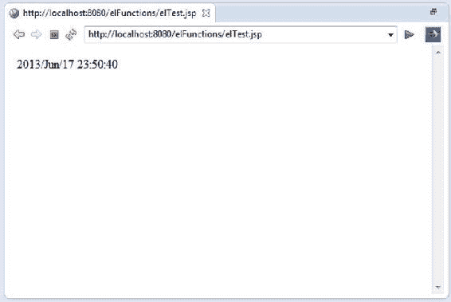
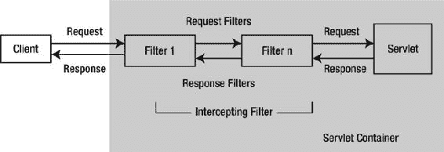
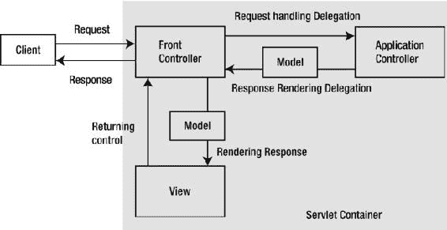

# 三、Java EE Web 开发的最佳实践

我们所知道的所有进化都是从模糊到明确的过程。

-查尔斯·桑德斯·佩尔萨

好的解决方案经常被发明出来。有时它们会被发现。发明和发现不是同义词， <sup class="calibre12">1</sup> ，它们表示不同的目标；然而，两者都是通过经验和专业知识实现的。经验帮助你获得好的解决方案，当你把这些好的解决方案应用到同一套问题中时，模式就开始出现了。*模式*是源于开发人员的经验和专业知识的好的解决方案的目录。

一位名叫克里斯托弗·亚历山大的建筑师观察到，建筑师倾向于以或多或少相同的方式解决相同的问题。这种认识促使他为架构师写了一本设计模式的书。他在这本书里反思道:“一个设计模式 描述了一个反复出现的问题，然后描述了这个问题的解决方案的核心，这样你就可以用这个解决方案一百万次，而不用以同样的方式做两次。”

1994 年，Erich Gamma、Richard Helm、Ralph Johnson 和 John Vlissides (Addison-Wesley，1994)(“四人组”或“g of”)所著的《设计模式:可重用面向对象软件的元素》一书将 Alexander 的思想应用于软件。这本书阐述了面向对象模式，并引领了最佳实践解决方案的浪潮，用跨应用可重用的设计策略解决了多年来出现的大量设计需求。

随着服务器系统的发展，Java EE 等企业基础设施出现了，它们提供了技术和服务的抽象。然而，使用 Java EE 并不能自然而然地产生最佳实践架构和设计。John Crupi、Dan Malks 和 Deepak Alur 基于他们设计企业系统的经验首先建立了 Java EE 设计模式。

将这些 Java EE 设计模式应用到基于 Java EE 的应用的开发中，是实现最佳实践架构和设计的必要条件。也就是说，确保最佳实践架构和设计不足以确保可重用、可维护、可扩展的软件。即使有了 Java EE 设计模式，一个软件项目也经常受到一种叫做*熵* 的现象的困扰，这是一种无序程度的度量。根据热力学第二定律，宇宙中的一切都从低熵(有序状态)向高熵(无序状态)运动，最终陷入混沌。自然界的一切都受这个物理定律的束缚，大自然用进化的手段来处理这个不可改变的定律。

一个软件项目往往倾向于从低熵到高熵，为了处理这种无序状态，它需要不断进化。这并不是说演进你的项目取代了项目管理和方法；尽管有最精细的项目管理，锐利的方法，以及对风格有敏锐感觉的团队，软件项目可能会陷入高熵状态。图 3-1 展示了 Java EE 的 web 层中帮助处理软件项目中熵的进化步骤。


图 3-1 。Java EE web 层的演变

正如您在图 3-1 中所看到的，不仅 Java EE web 层中的技术得到了发展，而且每一个新版本中都添加了新的技术。例如，如果您仍在使用 J2EE 1.4，那么您的工具箱中将没有统一的 EL (EL 2.1)。跟上任何技术的发展是很重要的，这样才能避免陷入最终的高熵状态，这种状态会折磨任何软件项目。

本章阐述了用 Java EE 每个新版本中可用的任何新技术逐步发展项目的重要性，并使用它们来处理项目中的高熵。本章接着讨论了 Java EE 模式的重要性，并解释了如何通过使用 Java EE web 层模式使 web 应用变得可重用、可维护和可扩展。接下来，本章将展示 web 框架如何通过提供开箱即用的最佳实践解决方案，让您不再使用 Java EE web 层模式。

最佳实践解决方案:使用 EL 和 JSTL

Sun 在 1998 年发布了 Servlet 规范。servlets 的唯一目的是帮助 Java web 服务器为客户机生成动态内容。清单 3-1 展示了第一个 servlet 的样子。

清单 3-1 。第一个 Servlet

```java
 1.import java.io.IOException;
 2.import java.io.PrintWriter;
 3.
 4.import javax.servlet.ServletException;
 5.import javax.servlet.http.HttpServlet;
 6.import javax.servlet.http.HttpServletRequest;
 7.import javax.servlet.http.HttpServletResponse;
 8.public class Hello extends HttpServlet {
 9.public void doGet(HttpServletRequest req, HttpServletResponse res)
10.throws ServletException, IOException {
11.res.setContentType ("text/html");
12.PrintWriter out = res.getWriter();
13.out.println("<HTML>");
14.out.println("<HEAD><TITLE>Hello World</TITLE></HEAD>");
15.out.println("<BODY>");
16.out.println("<BIG>Hello World</BIG>");
17.out.println("</BODY></HTML>");
18.}
19.}
```

Servlets 对于动态内容生成工作得很好，但是有一个大问题。视图被硬连接到 servlet 中，正如您在清单 3-1 中的第 13 到 17 行所看到的。为了解决这个问题，JSP 诞生了。JSP 不需要将视图代码硬连接到业务逻辑代码中。视图关注点与业务逻辑关注点的分离取决于清单 3-2 中的属性和清单 3-3 中的属性。

清单 3-2 。使用属性将表示(视图)与业务(Servlet)代码分离

```java
1.public void doPost(HttpServletRequest request, HttpServletResponse response)
2.throws IOException, ServletException {
3.String name = request.getParameter("userName");
4.request.setAttribute("name", name);
5.RequestDispatcher view = request.getRequestDispatcher("/result.jsp");
6.view.forward(request, response);
7.}
```

清单 3-2 显示了使用属性的 servlet 片段。

*   *第 3 行*:从请求中检索用户名。
*   *第 4 行*:将用户名设置为请求中的一个属性。
*   *第 5 行*:从请求中检索 RequestDispatcher。
*   *第 6 行*:转发给视图，传递请求和响应对象。注意，这个请求对象中为用户名设置了一个属性。视图现在可以利用这个属性了

清单 3-3 。第一 JSP

```java
1.<html><body> Hello
2.<%= request.getAttribute("name") %>
3.</body></html>
4.<html>
5.<body>
6.<% User u = (User) request.getAttribute("user"); %>
7.User  is: <%= u.getName() %>
8.</body>
9.</html>
```

视图与业务逻辑的分离取决于属性，如清单 3-2 和清单 3-3 所示。JSP 以这种方式解决了 servlets 中表示横切业务逻辑的问题。但是正如您在清单 3-4 中看到的，随着 scriptlets (Java 代码)混合在表示代码(JSP)中，现在业务逻辑横切了表示关注点。

清单 3-4 。在 JSP 中使用 Scriptlet 和表达式

```java
1.<% User u = new User(); %>
2.User  is: <%= u.getName() %>
```

*   *Line 1*:script let 创建了一个名为 User 的类的实例。
*   *第 2 行*:使用表达式输出用户名。

出了什么问题？Scriptlets 和表达式将 Java 代码引入了 JSP。在 JSP 出现之前，表示代码贯穿了业务代码。使用 JSP，业务代码横切了表示代码。因此，不经意间，JSP 实际上并没有解决任何问题，而是颠倒了横切业务和表示逻辑的问题。清单 3-4 中的 scriptlet 和表达式确实可以被 JSP 标准动作(< useBean >)轻松替换，如清单 3-5 所示。

清单 3-5 。使用 JSP 标准动作沙表达语言

```java
1.<jsp:useBean id="user" class="com.apress.User"/>
2.User  is: ${user.name}
```

清单 3-5 做了与清单 3-4 相同的事情，但是没有在 JSP 页面中使用任何 Java 代码。

*   *第 1 行*:这一行使用标准的 JSP 动作创建类 User 的实例。
*   *第 2 行*:这一行介绍了表达式语言的关键特性，称为 *EL 表达式* ，它取代了称为*表达式*的脚本元素。第 2 行显示的语法将在接下来的章节中详细讨论。

一般来说，JSP 标准操作非常有限，因此开发人员不得不求助于使用 scriptlets 来创建功能丰富的 web 应用。在 JSP 中以 scriptlets 的形式使用 Java 代码会导致 JSP 页面不可维护。因此，JSP 规范已经发展到支持无 Java 的 JSP 页面。这种支持主要依赖于 JSP 表达式语言(EL)和 JSP 标准标记库(JSTL)。在接下来的几节中，我们将仔细看看埃尔和 JSTL。

表情语言

没有表情的美是没有生命的，没有表情语言的 JSP 是混乱的。表达式语言的基本原则是提供无脚本的 JSP 组件。表达语言有两种用法。

*   从限定了作用域的属性中检索对象 (在前一章中解释过)。这些对象是 JavaBeans、映射、数组和列表，它们作为属性存储在四个作用域中的任何一个中(也在前一章中解释过)。EL 首先在最小的范围(页面范围)中搜索属性；然后在请求和会话中；最后是最大的范围，即应用范围。
*   访问请求参数 、请求头、cookies、上下文初始化参数和 pageContext 对象。

通过使用＄{ expr }或#{expr}构造来形成 EL 表达式。尽管 EL 以相同的方式对这两个构造进行评估，但是＄{ expr }构造用于立即评估，而#{expr}构造用于延迟评估。

*   *即时求值* :编译 JSP 页面时编译表达式，执行 JSP 页面时执行表达式。
*   *延迟求值* :表达式直到系统需要它的值时才求值。

**注意**注意在 JSP 2.1 及更新版本中，#{}表达式只允许用于接受延迟表达式的标签属性。#{expr}如果在其他地方使用，将会产生错误。

在接下来的小节中，您将看到 EL 的语法和该语言的保留字，并了解如何在 JSP 页面上使用它。在您学习了基础知识之后，您将学习如何使用 EL 从 JavaBeans 中读取值，在最后一节中，您将学习如何使用 EL 函数。

文字

EL 文字可以是以下类型 :布尔、整数、浮点、字符串或空。表 3-1 显示了每种文字类型的有效值。

表 3-1 。EL 中的文字

<colgroup><col width="40%" class="calibre14"> <col width="60%" class="calibre14"></colgroup> 
| 

文字类型

 | 

有效的文字值

 |
| --- | --- |
| 布尔代数学体系的 | 对还是错 |
| 整数 | -11
0
12345 |
| 浮点 | 4.21
-8.01
1.0e 12
0.12 |
| 线 | 都有效:“你好”和“你好” |
| 空 | 空 |

保留字

与任何其他语言一样，EL 有保留的单词，不应用作标识符。表 3-2 列出了 EL 中的保留字。

表 3-2 。EL 中的保留字


EL 运算符

EL 操作是处理数据操作所必需的。EL 支持多种运算符，如关系运算符 、算术运算符 、逻辑运算符 等。

算术运算符

清单 3-6 展示了其中的一些操作符。您可以在 JSP 文件上使用这段代码，并在服务器上运行它。图 3-2 说明了输出。

清单 3-6 。算术运算符

```java
<table border="1">
<tr>
<td><b>Arithmetic Operator</b></td>
<td><b>Boolean Result</b></td>
</tr>
<tr>
<td>${'${'}2 + 2 }</td>
<td>${2 + 2}</td>
</tr>
<tr>
<td>${'${'}2 - 2 }</td>
<td>${2 - 2}</td>
</tr>
<tr>
<td>${'${'}2 * 2 }</td>
<td>${2 * 2}</td>
</tr>
<tr>
<td>${'${'}2 / 2 }</td>
<td>${2 / 2}</td>
</tr>
<tr>
<td>${'${'}2 mod 2 }</td>
<td>${2 mod 2}</td>
</tr>
</table>
```


图 3-2 。算术运算符

关系运算符

这些运算符包括==，！=，，<=, > =，eq，ne，lt，gt，le，ge。

清单 3-7 展示了所有这些操作符。您可以在 JSP 文件上使用这段代码，并在服务器上运行它。输出如图图 3-3 所示。

清单 3-7 。关系运算符

```java
<table border="1">
<tr>
<td><b>Relational Operator</b></td>
<td><b>Boolean Result</b></td>
</tr>
<tr>
<td>${'${'}10 &lt; 20}</td>
<td>${10 < 20}</td>
</tr>
<tr>
<td>${'${'}10 &gt; 20}</td>
<td>${10 > 20}</td>
</tr>
<tr>
<td>${'${'}10 &gt;= 10}</td>
<td>${10 >= 10}</td>
</tr>
<tr>
<td>${'${'}10 &lt;= 10}</td>
<td>${10 <= 10}</td>
</tr>
<tr>
<td>${'${'}10 == 10}</td>
<td>${10 == 10}</td>
</tr>
<tr>
<td>${'${'}10 != 20}</td>
<td>${10 != 20}</td>
</tr>
<tr>
<tr>
<td>${'${'}10 lt 20}</td>
<td>${10 lt 20}</td>
</tr>
<tr>
<td>${'${'}10 gt 20}</td>
<td>${10 gt 20}</td>
</tr>
<tr>
<td>${'${'}10 le 10}</td>
<td>${10 le 10}</td>
</tr>
<tr>
<td>${'${'}10 ge 10}</td>
<td>${10 ge 10}</td>
</tr>
<tr>
<td>${'${'}10 eq 10}</td>
<td>${10 eq 10}</td>
</tr>
<tr>
<td>${'${'}10 ne 20}</td>
<td>${10 ne 20}</td >
</tr>
</table>
```


图 3-3 。关系运算符

逻辑运算符

清单 3-8 展示了逻辑操作符，如& &、||，以及 not 操作符。您可以在 JSP 文件上使用这段代码，并在服务器上运行它。输出如图图 3-4 所示。

清单 3-8 。逻辑运算符

```java
<table border="1">
<tr>
<td><b>Logical Operator</b></td>
<td><b>Result</b></td>
</tr>
<tr>
<td>${'${'}true && false}</td>
<td>${true && false}</td>
</tr>
<tr>
<td>${'${'}true || false}</td>
<td>${true || false}</td>
</tr>
<tr>
<td>${'${'}not true}</td>
<td>${not true}</td>
</tr>
</table>
```


图 3-4 。逻辑运算符

使用 EL

在本节中，您将基于我们的书店应用的模型创建一个简单的应用。这不仅会告诉你如何使用 EL，还会展示它的重要性。图 3-5 展示了应用中图书和作者之间的关系，在清单 3-9 和清单 3-10 中实现。


图 3-5 。书和作者之间的关系

清单 3-9 。Author.java

```java
 1.package com.apress.chapter03.model;
 2.
3.public class Author {
 4.private String name;
 5.
 6.public String getName() {
 7.return name;
 8.}
 9.
10.public void setName(String name) {
11.this.name = name;
12.}
13.
14.}
```

清单 3-10 。Book.java

```java
 1.package com.apress.chapter03.model;
 2.
 3.public class Book {
 4.
 5.private String bookTitle;
 6.private Author author;
 7.
 8.public String getBookTitle() {
 9.return bookTitle;
10.}
11.
12.public void setBookTitle(String bookTitle) {
13.this.bookTitle = bookTitle;
14.}
15.
16.public Author getAuthor() {
17.return author;
18.}
19.
20.public void setAuthor(Author author) {
21.this.author = author;
22.}
23.
24.}
```

应用的目标是展示如何访问一个属性的属性(图 3-5 中图书的图书标题属性)和一个属性本身的属性(图 3-5 中作者的姓名属性)。在图 3-5 中，需要输出作者姓名属性的值。使用 JSP 标准动作是不可能做到这一点的，您将在本节的后面看到，在这种情况下，使用了 scriptlets。这就是 scriptlets 进入 JSP 的方式。但是，您不应该使用 script let，因为 script let(Java 代码)混合在表示代码(JSP)中；业务逻辑横切了表示关注点，导致了不可维护的 JSP，如前面的清单 3-4 中所解释的。因为 JSP 标准操作不能访问本身就是属性的属性的属性，并且因为使用 scriptlets 会导致不可维护的 JSP，所以应该使用 EL。在本节中，您将借助一个例子学习如何使用 EL，其中 Author class 是 Book 类的属性。图 3-5 显示了书和作者的关系。您将从 Book 中访问 Author 的 name 属性，而不使用 scriptlets。

清单 3-9 展示了带有一个名为 name 的属性的 Author 对象，该属性带有 getters 和 setters。您需要输出 Author 的 name 属性的值。

清单 3-10 展示了 Book 对象的两个属性，bookTitle 和 author，以及它们的 getters 和 setters。Book 中的 author 属性是 Author 类，如前面的清单 3-9 所示。您需要访问 author 属性的 name 属性。

Book 和 Author 对象充当 MVC 应用的模型。清单 3-11 展示了应用的控制器。

清单 3-11 。BookController.java

```java
 1.package com.apress.chapter03.controller;
 2.
 3.import java.io.IOException;
 4.
 5.import javax.servlet.RequestDispatcher;
 6.import javax.servlet.ServletException;
 7.import javax.servlet.http.HttpServlet;
 8.import javax.servlet.http.HttpServletRequest;
 9.import javax.servlet.http.HttpServletResponse;
10.
11.import com.apress.chapter03.model.Author;
12.import com.apress.chapter03.model.Book;
13.
14.public class BookController extends HttpServlet {
15.
16.protected void doGet(HttpServletRequest request,
17.HttpServletResponse response) throws ServletException, IOException {
18.Book book = new Book();
19.book.setBookTitle("Learning Java Web");
20.Author author = new Author();
21.author.setName("Vishal Layka");
22.book.setAuthor(author);
23.
24.request.setAttribute("bookAttrib", book);
25.
26.RequestDispatcher view = request.getRequestDispatcher("/book.jsp");
27.view.forward(request, response);
28.}
29.
30.}
```

清单 3-11 是 MVC 模式的控制器部分。正如您在清单 3-2 中了解到的，视图关注点和业务逻辑关注点的分离取决于属性。因此，您必须将模型对象保存到视图(JSP)的属性中，以便能够通过属性访问模型。

*   *第 19 行到第 22 行*:在这几行中你设置了图书的书名和作者属性。注意，第 21 行已经设置了 Author 的 name 属性。
*   *第 22 行*:设置图书的作者属性。
*   *第 24 行*:将 Book 对象设置为请求中的一个属性。
*   *第 26 行到第 27 行*:第 26 行你现在应该很熟悉了。在这一行中，您将请求发送到 book.jsp。

清单 3-12 提供了这个应用的部署描述符。

清单 3-12 。web.xml

```java
 1.<?xml version="1.0" encoding="UTF-8"?>
 2.<web-app xmlns:xsi="http://www.w3.org/2001/XMLSchema-instance"
 3\. fontname">http://java.sun.com/xml/ns/javaee"
 4\. xmlns:web="http://java.sun.com/xml/ns/javaee/web-app_2_5.xsd"
 5\. xsi:schemaLocation="http://java.sun.com/xml/ns/javaee
 6.http://java.sun.com/xml/ns/javaee/web-app_3_0.xsd" id="WebApp_ID" version="3.0">
 7.<display-name>chapter03</display-name>
 8.<servlet>
 9.<servlet-name>BookController</servlet-name>
10.<servlet-class>com.apress.chapter03.controller.BookController</servlet-class>
11.</servlet>
12.<servlet-mapping>
13.<servlet-name>BookController</servlet-name>
14.<url-pattern>/book</url-pattern>
15.</servlet-mapping>
16.<welcome-file-list>
17.<welcome-file>index.html</welcome-file>
18.</welcome-file-list>
19.</web-app>
```

现在，这个 web 应用中唯一缺少的关键组件是 JSP 页面，这是实际编写 EL 代码的地方。在我们进入 JSP 页面之前，我们将看一下 EL 提供的访问封装数据的两个关键操作符:[ ]和。(也叫*点*运算符)。在了解了[ ]和。运营商，你就能写 book.jsp。图 3-6 说明了应用的目录结构。


图 3-6 。目录结构

[ ]和。操作员

使用。符号是访问对象属性的快捷方式。点 操作符是在清单 3-5 中引入的。为了方便起见，在清单 3-13 中再次显示。

清单 3-13 。使用点运算符

```java
1.<jsp:useBean id="user" class="com.apress.User"/>
2.User  is: ${user.name}
```

*   第 1 行:在第 1 行中，使用<usebean>动作创建了类 User。用户被设置为 servlet 代码中的请求属性。</usebean>
*   第 2 行:在第 2 行中，name 的值是使用${user.name}访问的用户对象的属性。

表达式＄{ user . name }中的变量 user 是存储在请求范围中的属性。应用点运算符的 EL 表达式中的变量可以是两种类型之一。

*   存储在四个作用域中的任何一个中的属性，如本例所示
*   一个 EL 隐式对象，这将在本章后面解释

无论这个变量是 EL 隐式对象还是存储在四个作用域中的属性，它都可以是 JavaBean 或 map。在清单 3-13 中，这个变量是一个 JavaBean，它被设置为请求范围中的一个属性，因此 name 是变量 user 引用的 JavaBean 的属性。如果用户变量是在四个作用域中的任何一个中设置为属性的映射，那么名称将成为映射的键。

**注意**应用了点运算符的 EL 表达式中的变量可以是四个作用域中的一个属性集，也可以是一个 EL 隐式对象。此外，不管这个变量是四个作用域中的一个属性集还是一个 EL 隐式对象，它都可以是 JavaBean 或 Map。如果变量是 JavaBean，那么它的属性就在点运算符之后；如果变量是一个 Map，那么它的键就在点运算符之后。

所以，现在应该清楚了，EL 表达式中的变量要么是 JavaBean，要么是 Map。但是，如果您想将一个数组设置为四个作用域中的一个属性，并使用 EL 表达式访问它的元素，该怎么办呢？或者，如果您想将一个列表设置为四个作用域中的一个属性，并使用 EL 表达式访问它的元素，该怎么办呢？答案在于 EL 提供的[]运算符 。

[]操作符用于访问数组、列表、JavaBeans 和映射。也就是说，应用[ ]运算符的变量可以是数组、列表、JavaBean 或映射。

在括号内

[ ] 运算符的括号内可以有下列之一:

*   带或不带引号的索引。
*   字符串文字。
*   四个范围中任何一个的 EL 隐式对象或属性。EL 隐式对象将在本章后面解释。
*   嵌套表达式。

如果[ ]运算符的括号内有带引号或不带引号的索引，则[ ]运算符所应用到的变量要么是数组，要么是列表。清单 3-14 展示了如何在列表或数组中使用[ ]操作符。

清单 3-14 。对列表或数组使用[ ]运算符

```java
someArray["1"]
someArray[1]
someList["2"]
someList[2]
```

例如，清单 3-15 中的数组可以像清单 3-16 中所示的那样被访问。

清单 3-15 。在 Servlet 代码中将数组设置为属性

```java
1.   String [ ] books = {"Clojure", "Groovy ", "Java" , "Scala"} ;
2.   request.setAttribute("books", books);
```

清单 3-16 。使用[ ]运算符

```java
Book: ${books[0]}
```

清单 3-16 显示的输出如下:

```java
Book: Clojure
```

**注意**列表可以像数组一样被访问。

如果[ ]运算符的括号中有一个字符串文字，那么[ ]运算符所应用到的变量要么是 JavaBean，要么是 Map。清单 3-17 展示了在 Servlet 中将地图设置为属性的代码。

清单 3-17 。用于在 Servlet 代码中将地图设置为属性的代码片段

```java
1.Map<String, String>  bookMap  = new HashMap<>();
2.bookMap.put("Groovy", "Beginning Groovy");
3.bookMap.put("Java", " Beginning Java");
4.bookMap.put("Scala", " Beginning Scala");
5.request.setAttribute("books", bookMap);
```

在清单 3-18 中，EL 在范围内搜索绑定到姓名簿的属性。在清单 3-17 中，books 是请求属性中的一个映射集。因此，EL 搜索在清单 3-18 的[ ]操作符中传递的关键 Groovy 并对其求值。

清单 3-18 。使用[ ]运算符

```java
Book : ${books["Groovy"] }
```

清单 3-8 显示的输出如下所示:

```java
Book: Beginning Groovy
```

都是。和[]运算符可以与 JavaBeans 或 Maps 一起使用。例如，清单 3-18 可以用。操作符如下所示:

```java
${books.Groovy}
```

如果[ ]运算符的括号内既没有字符串也没有带引号或不带引号的索引，并且[ ]运算符的括号内的内容不是 EL 隐式对象，则通过在四个范围中的任何一个范围中搜索具有该名称的属性来评估内容。这用清单 3-19 和清单 3-20 来说明。

清单 3-19 。用于在 Servlet 代码中将地图设置为属性的代码片段

```java
1.Map<String, String>  bookMap  = new HashMap<>();
2.bookMap.put("Groovy", "Beginning Groovy");
3.bookMap.put("Java", " Beginning Java");
4.bookMap.put("Scala", " Beginning Scala");
5.request.setAttribute("books", bookMap);
6.request.setAttribute("java", "Java");
```

清单 3-20 。使用[ ]运算符

```java
Book : ${books[java] }
```

让我们看看清单 3-20 中的评估是如何工作的。

*   在清单 3-20 的代码${ books[java] }中，EL 在作用域中搜索由名称 books 绑定的属性。
*   EL 在请求范围中找到这个属性，因为 books 在清单 3-19 的第 5 行被设置为请求属性。
*   在清单 3-20 中，【】运算符的内容是 java，既不是字符串文字，也不是 EL 隐式对象；因此，EL 在作用域中搜索由名称 java 绑定的属性，并在请求作用域中找到它，因为 java 在清单 3-19 的第 6 行被设置为请求属性。
*   使用清单 3-19 的第 6 行 java 的值 Java，EL 表达式现在变成${ books["Java"] }。
*   现在，因为 books 属性是一个在清单 3-19 的第 5 行设置为请求属性的映射，EL 搜索关键字 Java，它在清单 3-19 的第 3 行中。并打印其值，如以下输出所示:

```java
Book  : Beginning Java
```

如果[]运算符的括号内有一个 EL 表达式，括号内的内容(在本例中为 EL 表达式)将按照适用于任何 EL 表达式的相同规则进行计算。换句话说，如果 EL 表达式使用点运算符或[]运算符，并且它是[]运算符，则应用前面解释的相同规则。这用清单 3-21 和清单 3-22 来说明。

清单 3-21 。用于在 Servlet 代码中将映射和数组设置为属性的代码片段

```java
1.Map<String, String>  bookMap  = new HashMap<>();
2.bookMap.put("Groovy", "Beginning Groovy");
3.bookMap.put("Java", " Beginning Java");
4.bookMap.put("Scala", " Beginning Scala");
5.request.setAttribute("books", bookMap);
6.
7.String[ ] categories = {"Groovy", "Java", "Scala"};
8.request.setAttribute("category", categories);
```

清单 3-22 。嵌套 EL 表达式

```java
Book : ${ books[category[1]] }
```

以下是输出结果:

```java
Book : Beginning Java
```

现在，您已经了解了使用。和[ ]运算符，是时候看看为什么 EL 如此重要了。现在，通过完成您开始创建的应用，特别是通过编写 JSP 页面，您将明白为什么它如此重要。清单 3-23 展示了 book.jsp。这个 JSP 页面使用脚本元素(scriptlets 和表达式)和 EL。想法是比较两者，即脚本元素和 EL。这种比较在图 3-7 中进行了说明。

清单 3-23 。book.jsp

```java
 1.<%@page import="com.apress.chapter03.model.Book"%>
 2.<%@page import="com.apress.chapter03.model.Author"%>
 3.<%@ taglib uri="http://java.sun.com/jsp/jstl/functions" prefix="fn"%>
 4.<%@ taglib uri="http://java.sun.com/jstl/core" prefix="c"%>
 5.<html>
 6.<head>
 7.</head>
 8.<body>
 9.<table border="1">
10.<tr>
11.<th width= "20px">Description</th>
12.<th >code</th>
13.<th >output</th>
14.</tr>
15.<%
16.Book book = (Book) request.getAttribute("bookAttrib");
17.Author author = book.getAuthor();
18.%>
19.<tr>
20.<td>Author's Name using <b>Scriptlet and Expression</b>
21.</td>
22.<td>${fn:escapeXml("<%= author.getName() %>")}</td>
23.<td><%=author.getName()%></td>
24.</tr>
25.
26.<jsp:useBean id="bookAttrib" class="com.apress.chapter03.model.Book"
27.scope="request" />
28.<tr>
29.<td>Author's Name using <b> jsp:getProperty action </b>
30.</td>
31.<td>
32.<table border="1">
33.<tr>
34.<td>${fn:escapeXml("<jsp:getProperty name = \"bookAttrib \" property= \"author \" />")}</td>
35.</tr>
36.<tr>
37.<td>${fn:escapeXml("<jsp:getProperty name = \"bookAttrib \" property= \"author.name \" />")}</td>
38.</tr>
39.</table>
40.
41.</td>
42.<td>
43.<table border="1">
44.<tr>
45.<td><jsp:getProperty name="bookAttrib" property="author" />
46.</td>
47.</tr>
48.<tr>
49.<td>
50.<%--  <jsp:getProperty name ="bookId" property="author.name" />  - this code will yield run time exception --%>
51.Not possible
52.</td>
53.</tr>
54.</table>
55.</td>
56.</tr>
57.<tr>
58.<td>Author's Name using<b> EL </b></td>
59.<td>${fn:escapeXml("${bookAttrib.author.name}")}</td>
60.<td>${bookAttrib.author.name}</td>
61.</tr>
62.</table>
63.</body>
64.</html>
```

*   *第 23 行*:使用表达式输出作者的名字。
*   *第 50 行*:这表明不能使用 JSP 标准动作输出作者的名字。
*   *第 60 行*:使用 EL 输出作者的名字。

图 3-7 展示了当你运行这个应用时会看到什么([`localhost:8080/chapter 03/book`](http://localhost:8080/chapter03/book))。本质上，使用标准的 JSP 动作显示 Author 的 name 属性的值是不可能的；如果没有 EL，脚本元素将是唯一的方法。


图 3-7 。比较 scriptlets、标准操作和 EL

EL 隐含对象

Scriptlets 可以访问几个 JSP 隐式对象，如第二章中所解释的。这些对象允许访问保存在特定 JSP 范围内的任何变量。EL 也提供了自己的隐式对象，称为 *EL 隐式对象*。EL 隐式对象和 JSP 隐式对象不一样(pageContext 除外)。所有这些 EL 隐式对象都是映射 ，它们将各自的范围属性名称映射到它们的值。例如，使用隐式对象 param 和 paramValues，可以访问 HTTP 请求参数。表 3-3 描述了 EL 隐式对象。

表 3-3 。EL 中的隐式对象

<colgroup><col width="30%" class="calibre14"> <col width="70%" class="calibre14"></colgroup> 
| 

隐含对象

 | 

描述

 |
| --- | --- |
| 甜饼干 | Map:将 cookie 名称映射到单个 Cookie 对象。 |
| 页眉 | Map:包含每个头名称的值 |
| 标题值 | Map:将头名称映射到头的所有可能值的字符串数组。 |
| initParam(启动参数) | 映射:将上下文初始化参数名映射到它们的字符串参数值。 |
| 参数 | Map:包含页面参数的名称。 |
| 参数值 | Map:将参数名映射到参数的所有值的字符串数组。 |
| 对象 | PageContext 对象。 |
| 应用范围 | Map:包含所有应用范围的变量。 |
| pageScope(页面范围) | Map:包含所有页面范围的变量。 |
| 请求作用域 | Map:包含所有请求范围的变量。 |
| 会话范围 | Map:包含所有会话范围的变量。 |

使用 EL 隐式对象

在表 3-3 中列出的 EL 隐式对象中，applicationScope、pageScope、requestScope 和 sessionScope 用于指定作用域。它们用于访问限定了作用域的属性，也就是说，从 JavaBeans、映射、数组和列表中访问数据，这些数据已经作为属性存储在以下四个作用域中:页面、请求、会话和应用。

在表 3-3 中列出的其他隐式对象用于访问请求参数、请求头、cookies、上下文初始化参数和页面上下文对象。本节说明了一些 EL 隐式对象的用法。

访问请求参数

清单 3-24 展示了一个通过 form.jsp 提交请求参数的简单表格。

清单 3-24 。form.jsp

```java
 1.<body>
 2.<form action="books" method="post">
 3.<input type="hidden" name="action" value="books"/>
 4.<p>Book Title: <input type="text" name="bookTitle"></p>
 5.<p>Author 1 Name: <input type="text" name="authorName"></p>
 6.<p>Author 2 Name: <input type="text" name="authorName"></p>
 7.
 8.<input type = "submit"/>
 9.</form>
10.</body>
```

在清单 3-24 中，<输入>标签的 name 属性是相同的:authorName。

清单 3-25 说明了使用 EL 隐式对象 param 和 paramValues 来检索请求参数并在 result.jsp 页面上显示结果。

清单 3-25 。result.jsp

```java
1.<p>Book Title: ${param.bookTitle}<br>
2.Author 1: ${paramValues.authorName[0]}<br>
3.Author 2: ${paramValues. authorName[1]}
4.</p>
```

*   *Line 1* :使用 EL 隐式对象 param 来获取书名。
*   *第 2 行到第 3 行*:这段代码使用 EL 隐式对象 paramValues 来获取作者 1 和作者 2 的名字。

访问标题

EL 隐式对象 header 和 headerValues 使您可以访问可使用 request.getHeader()和 request.getHeaders()方法获得的头值。

清单 3-26 展示了使用表达式${header.user-agent}或${header["user-agent"]}访问名为 user-agent 的头。

清单 3-26 。使用 EL 隐式对象头

```java
<span>${header["user-agent"]}</span>
```

以下是输出结果:

```java
Mozilla/5.0 (Windows NT 6.1; rv:12.0) Gecko/20100101 Firefox/12.0
```

正在访问 Cookie

El 隐式对象 cookie 让我们可以访问 cookie。清单 3-27 展示了存储在 servlet 中的 cookie。

清单 3-27 。在 Servlet 中设置 Cookie

```java
1.String userName = "vishal";
2.Cookie c = new Cookie("userName", userName);
3.c.setPath("/");
4.response.addCookie(c);
```

清单 3-28 展示了如何使用一个 EL 隐式对象来访问 JSP 页面中的 cookie。

清单 3-28 。使用 EL 隐式对象 Cookie

```java
${cookie.userName.value}
```

访问限定了作用域的属性

El 隐式对象 sessionScope 提供对存储在会话范围中的属性的访问。清单 3-29 展示了存储在 servlet 会话中的属性。

清单 3-29 。在 Servlet 中设置会话属性

```java
HttpSession session = request.getSession();
Book book = new Book();
book.setBookTitle("Beginning Java");
session.setAttribute("book", book);
```

清单 3-30 展示了使用一个名为 sessionScope 的 EL 隐式对象来访问 JSP 页面中的书名。

清单 3-30 。使用 EL 隐式对象会话范围

```java
<span>Book title in Session Scope ${sessionScope.book.bookTitle}</span>
```

EL 函数

EL 函数允许您从 JSP 中调用 Java 方法，而无需使用脚本。EL 函数被映射到 Java 类的静态方法。这种映射是在标签库描述符(TLD)中指定的，这将在本节后面解释。清单 3-31 展示了一个简单的返回当前日期和时间的 Java 方法。

清单 3-31 。具有公共和静态方法的 Java 类

```java
 1.package com.apress.elfunction;
 2.
 3.import java.text.SimpleDateFormat;
 4.import java.util.Calendar;
 5.
 6.public class Now {
 7.
 8.public static String now() {
 9.Calendar currentDate = Calendar.getInstance();
10.SimpleDateFormat formatter = new SimpleDateFormat(
11."yyyy/MMM/dd HH:mm:ss");
12.String now = formatter.format(currentDate.getTime());
13.
14.return now;
15.}
16.}
17.
```

在 EL 函数中使用 Java 方法的关键要求是该方法必须是公共的和静态的。EL 职能中的三个关键角色如下:

*   在类中定义的 Java 方法
*   使用 EL 调用 Java 方法的 JSP 页面
*   一个标记库描述符文件，它将 Java 类中的 Java 方法映射到调用这个 Java 方法的 JSP 代码

清单 3-32 说明了标签库描述符文件。TLD 是一个声明标记库的 XML 文件。这个 TLD 文件 包含一个或多个 EL 函数的声明和映射。每个函数都有一个名称和一个实现该函数的 Java 类中的特定方法。

清单 3-32 。标签库描述符

```java
 1.<?xml version="1.0" encoding="UTF-8"?>
 2.<taglib version="2.1" fontname">http://java.sun.com/xml/ns/javaee"
 3.xmlns:xsi="http://www.w3.org/2001/XMLSchema-instance"
 4.xsi:schemaLocation="http://java.sun.com/xml/ns/javaee
 5.http://java.sun.com/xml/ns/javaee/webjsptaglibrary_2_1.xsd">
 6.<tlib-version>1.2</tlib-version>
 7.<uri>elFunction</uri>
 8.<function>
 9.<name>now</name>
10.<function-class>
11.com.apress.elfunction.Now
12.</function-class>
13.<function-signature>
14.String now()
15.</function-signature>
16.
17.</function>
18.</taglib>
```

*   第 7 行:第 7 行是函数的 URI，将在 JSP 页面的 taglib 指令中使用。
*   *第 8 行到第 17 行*:这几行指定了将用签名调用的 Java 方法和定义该方法的 Java 类。

可以通过以下方式使用 EL 从 JSP 中调用 Java 方法:${prefix:function-name)。名称空间前缀是通过在 JSP 页面中使用 taglib 指令来声明的。清单 3-33 显示了 JSP 代码。

清单 3-33 。在 JSP 中调用 EL 函数

```java
1.<%@ taglib prefix="elf" uri="elFunction"%>
2.<html>
3.
4.<body>${elf:now() }
5.</body>
6.</html>
```

*   第 1 行:第 1 行是一个 taglib 指令，带有前缀 elf 和一个 URI。URI 在标签库描述符中定义。
*   *第 4 行*:使用前缀 elf，调用函数。这个函数名在标签库描述中定义。

您可以基于我们在第二章中创建的第一个 JSP 应用来创建这个应用。当这个应用运行时([`localhost:8080/El functions/El test . JSP`](http://localhost:8080/elFunctions/elTest.jsp))，它给出如图图 3-8 所示的输出。



图 3-8 。调用 EL 函数的输出

JSTL

JSP 标准标记库(JSTL)的最终目标是帮助简化 Java 服务器页面的开发。正如上一节所讨论的，scriptlets 导致不可维护的 JSP，并且可以被 JSP 标准操作所替代。然而，标准的行动太有限了；更好的方法是让 Java 开发人员创建他们自己的定制动作。尽管如此，创建一个定制动作仍然是一项不简单的任务。JSTL 提供了这样的自定义操作，可以处理常见的重复任务，而 JSTL 包含了划分为不同功能区域的各种各样的操作。表 3-4 列出了功能区以及用于引用库的 URIs 和 JSTL 规范中使用的前缀。

表 3-4 。JSTL 标签库

<colgroup><col width="35%" class="calibre14"> <col width="55%" class="calibre14"> <col width="10%" class="calibre14"></colgroup> 
| 

功能区

 | 

上呼吸道感染

 | 

前缀

 |
| --- | --- | --- |
| 核心 | [`java.sun.com/jsp/jstl/core`](http://java.sun.com/jsp/jstl/core) | c |
| XML 处理 | [`java.sun.com/jsp/jstl/xml`](http://java.sun.com/jsp/jstl/xml) | x |
| 支持 I18N 的格式 | [`java.sun.com/jsp/jstl/fmt`](http://java.sun.com/jsp/jstl/fmt) | 滤波多音 |
| 关系数据库访问 | [`java.sun.com/jsp/jstl/sql`](http://java.sun.com/jsp/jstl/sql) | 结构化查询语言 |
| 功能 | [`java.sun.com/jsp/jstl/functions`](http://java.sun.com/jsp/jstl/functions) | 【数学】函数 |

许多 JSTL 操作会导出您可以通过表达式语言轻松访问的限定了作用域的变量。正如我们在前一章看到的，作用域变量是存储在 JSP 作用域之一的对象:应用、页面、请求和会话。当 JSTL 操作使一个作用域变量对一个或多个 JSP 页面可用时，它有一个名为 var 的属性，允许您指定该作用域变量的名称。清单 3-34 展示了在 JSTL 的核心标签库中可用的< c:set >动作，用来设置一个作用域变量的值。

清单 3-34 。使用< c:设置>

```java
<c:set var="name" value="hello" scope="session" />
```

清单 3-34 将名为 name 的变量设置为 hello 值，并允许该变量在会话范围内可见。如果未指定 scope 的值，则默认范围是页面范围。在接下来的部分中，您将学习核心标记库中提供的不同功能区域中的所有操作。

核心标签库

表 3-5 描述了核心标签库中的核心动作。

表 3-5 。核心标签库中的核心动作

<colgroup><col width="30%" class="calibre14"> <col width="70%" class="calibre14"></colgroup> 
| 

行动

 | 

描述

 |
| --- | --- |
| <catch></catch> | 捕捉在操作体中引发的异常 |
|  | 选择许多代码片段中的一个 |
| <foreach></foreach> | 迭代对象集合或迭代固定次数 |
|  | 迭代字符串中的标记 |
|  | 有条件地执行某些功能 |
|  | 导入 URL |
| <otherwise></otherwise> | 在<choose>动作中指定默认功能</choose> |
|  | 将输出发送到当前 JspWriter |
| <param> | 为<import>或<url>指定一个 URL 参数</url></import> |
|  | 将响应重定向到指定的 URL |
|  | 移除限定了作用域的变量 |
|  | 创建一个限定了作用域的变量 |
|  | 创建一个 URL，并根据需要重写 URL |
|  | 指定<choose>动作中的几个条件之一</choose> |

JSTL 核心图书馆可分为四个不同的功能区域，如表 3-6 所述。

表 3-6 。JSTL 核心图书馆

<colgroup><col width="40%" class="calibre14"> <col width="60%" class="calibre14"></colgroup> 
| 

功能区

 | 

描述

 |
| --- | --- |
| 通用操作 | 用于操作限定了作用域的变量 |
| 条件动作 | 用于 JSP 页面中的条件处理 |
| 迭代器操作 | 用于循环访问对象集合 |
| 与 URL 相关的操作 | 用于处理 JSP 页面中的 URL 资源 |

通用动作

通用操作提供了使用限定了作用域的变量的方法。表 3-7 描述了核心标签库中的通用动作。

表 3-7 。通用操作

<colgroup><col width="30%" class="calibre14"> <col width="70%" class="calibre14"></colgroup> 
| 

行动

 | 

描述

 |
| --- | --- |
|  | 计算表达式并将结果输出到 JspWriter 对象 |
|  | 设置目标对象的作用域变量或属性的值 |
|  | 移除限定了作用域的变量 |
| <catch></catch> | 捕捉由其任何嵌套操作引发的 java.lang.Throwable |

<out>动作 </out>

<out>动作计算一个表达式并显示结果。它相当于 JSP 语法。</out>

下面是不带正文的语法:

```java
<c:out value="value" [escapeXml="{true|false}"][default="defaultValue"] />
```

以下是正文的语法:

```java
<c:out value="value" [escapeXml="{true|false}"]>
default value
</c:out>Items in brackets are optional
```

表 3-8 描述了< c:out >的属性。由于这一章全面地涵盖了 JSTL，我推荐你阅读 JSTL 规范 <sup class="calibre12">3</sup> 以彻底理解如何使用 JSTL 属性。

表 3-8 。< c:out >属性

<colgroup><col width="20%" class="calibre14"> <col width="20%" class="calibre14"> <col width="60%" class="calibre14"></colgroup> 
| 

名字

 | 

类型

 | 

描述

 |
| --- | --- | --- |
| 价值 | 目标 | 这是要计算的表达式。 |
| escapeXml | 布尔 | 这决定了结果字符串中的字符、&、'、"是否应该转换为它们对应的字符实体代码。默认值为 true。 |
| 系统默认值 | 目标 | 如果结果值为空，则这是默认值。 |

要写入 JspWriter 的值被指定为 value 属性。您可以在 value 属性中使用表达式。

*   value:要计算的表达式通过 value 属性提供，结果在作为响应的一部分返回之前被转换成一个字符串。
*   default:您可以选择指定一个默认值，如果指定的值为 null 或者不是一个有效的表达式，<out>会将该值发送给当前的 JspWriter。您可以使用 default 属性或在<out>动作的主体中指定默认值。</out></out>
*   escape XML:escape XML 属性指定是否将某些字符转换成在表 3-9 中列出的 HTML 字符实体代码。默认情况下，escapeXmlattribute 设置为 true。如果为 escapeXml 属性指定 false，< c:out >将不会转换这些字符。

表 3-9 。字符实体代码

<colgroup><col width="40%" class="calibre14"> <col width="60%" class="calibre14"></colgroup> 
| 

性格；角色；字母

 | 

字符实体代码

 |
| --- | --- |
| < | < |
| > | > |
| & | & |
| ' | ' |
| " | " |

清单 3-35 展示了用< c:out >动作替换脚本元素。

清单 3-35 。比较< c:out >和表情

```java
<%= "hello" %>  // Ouput "hello" using Expression
<c:out  value = "hello"/> // Ouput "hello" using <c:out> action
```

<set>行动</set>

JSTL 设置标签或<set>动作设置目标对象的作用域变量或属性的值。与使用< jsp:setProperty > JSP 动作相比，< c:set >动作是一个更好的选择。与只允许设置 bean 属性的< jsp:setProperty >不同的是，< c:set >标签可以做以下事情:</set>

*   设置 bean 属性
*   设置地图值
*   在页面、请求、会话或应用范围内创建限定了范围的变量

表 3-10 描述了< c:set >动作的属性。

表 3-10 。< c:设置>属性

| 

名字

 | 

类型

 | 

描述

 |
| --- | --- | --- |
| 价值 | 目标 | 要计算的表达式。 |
| 定义变量 | 线 | 导出的作用域变量的名称，用于保存操作中指定的值。 |
| 范围 | 线 | var 的范围。 |
| 目标 | 目标 | 将设置其属性的目标对象。这必须计算为具有 setter property 属性的 JavaBeans 对象或 java.util.Map 对象。 |
| 财产 | 线 | 要在目标对象中设置的属性的名称。 |

<set>标签用于执行以下操作:</set>

*   在任何 JSP 作用域中设置作用域变量的值。
*   设置指定目标对象的属性。目标必须计算为 JavaBean 或 Map 对象。

**在任何 JSP 作用域中设置作用域变量的值**

<set>动作的任务之一是设置页面上其他动作可以使用的变量。</set>

下面是语法:

```java
<c:set value=""value""var=""varName" " [scope=""{page|request|session|application}""]/>
```

清单 3-36 显示了一个使用< c:set >来设置作用域变量 helloVar 的值的例子。

清单 3-36 。使用< c:设置>

```java
<c:set var="helloVar" value="hello" />
```

清单 3-36 创建一个名为 helloVar 的属性，在默认范围内，即页面范围内，该属性的值为“hello”。您还可以在另一个范围内创建属性，比如会话范围；在这种情况下，您需要用< c:set >属性 scope= " "来指定作用域。清单 3-37 使用< c:set >在会话范围内创建一个变量。

清单 3-37 。使用范围

```java
<c:set var="helloVar" value="hello" scope="session" />
```

我们也可以通过在动作的主体内容中提供值来表达这一点，如清单 3-38 所示。

清单 3-38 。使用< c:将>与机体固定在一起

```java
<c:set var="hello" scope="session" >
helloworld
</c:set>
```

变量值也可以是 EL 表达式，如清单 3-39 所示。

清单 3-39 。在值中使用 EL 表达式

```java
<c:set var="titleVar" value="${book.title}" scope="session" />
```

在清单 3-39 中，book bean 的 title 属性设置在 titleVar 变量中。

清单 3-40 显示了相当于< c:set >的 scriptlet，如清单 3-36 所示。

清单 3-40 。相当于<的 c:set >

```java
<%
  String helloVar = "hello";
  pageContext.setAttribute("helloVar ", helloVar);
%>
```

设置指定目标对象的属性

为了能够使用<set>设置 bean 属性或映射值，我们需要使用 target 和 property，而不是 var，var 将定义要设置的 bean 和属性名称。例如，如果 target 是 map，那么 property 是键的名称，value 是该键的值。</set>

下面是语法:

```java
<c:set value=""value""target=""target"" property=""propertyName""/>
```

*   如果使用目标对象，目标必须计算为 JavaBean 或 java.util.Map 对象。
*   如果目标是 JavaBean，它必须包含适当的 getter/setter 方法。

清单 3-41 展示了如何使用< c:set >标签设置一个映射键。

清单 3-41 。使用< c:set >标签设置地图键

```java
<c:set target="bookMap" property="id" value="1">
```

这相当于 bookMap.put("id "，" 1 ")；。您也可以在<set>标签的主体中提供该值。</set>

清单 3-42 展示了如何使用< c:set >来设置 bean 属性。

清单 3-42 。使用< c:set >标签设置 bean 属性

```java
<c:set target="book" property="book.title" value="Learning Java Web">
```

清单 3-42 将名为 book 的 bean 的 title 属性设置为 Learning Java Web。这相当于 book.setTitle(“学习 Java Web”)；。

<remove>动作</remove>

<remove>动作从一个特定的作用域中删除一个变量。通过在 var 属性和 scope 属性中指定变量名，可以使用< c:remove >动作删除< c:set >在任何作用域中设置的变量。</remove>

下面是语法:

```java
<c:remove var="varName"[scope="{page|request|session|application}"]/>
```

表 3-11 描述了< c:移除>动作的属性。

表 3-11 。< c:移除>属性

<colgroup><col width="20%" class="calibre14"> <col width="20%" class="calibre14"> <col width="60%" class="calibre14"></colgroup> 
| 

名字

 | 

类型

 | 

描述

 |
| --- | --- | --- |
| 定义变量 | 线 | 要移除的作用域变量的名称 |
| 范围 | 线 | 风险值的范围 |

清单 3-43 展示了< c:remove >的简单用法。

清单 3-43 。使用< c:移除>

```java
<c:remove var=" helloVar " />
```

<catch>动作</catch>

<catch>动作提供了一种捕捉任何嵌套动作抛出的 java.lang.Throwableexceptions 的方法。这个动作有一个 var 属性，该属性保存对任何 java.lang.Throwable 异常的引用，这些异常在任何嵌套动作的执行过程中发生。</catch>

下面是语法:

```java
<c:catch [var="varName"]>
...nested actions in the body...
</c:catch>
```

表 3-12 描述了< c:catch >动作的属性。

表 3-12 。< c:抓>属性

<colgroup><col width="20%" class="calibre14"> <col width="20%" class="calibre14"> <col width="60%" class="calibre14"></colgroup> 
| 

名字

 | 

类型

 | 

描述

 |
| --- | --- | --- |
| 定义变量 | 线 | 嵌套操作引发的异常的导出范围变量的名称。 |

通过将这些动作嵌套在<catch>中，<catch>动作可以处理来自任何动作的错误。当抛出一个异常时，它被存储在一个页面范围的变量中，该变量由标记的 var 属性标识。清单 3-44 演示了< c:catch >的用法。</catch></catch>

清单 3-44 。使用< c:catch >

```java
<body>

<c:catch var = "exception">
<% int i = 1/0;%>
</c:catch>

<c:if test = "${exception != null}">
<span> Exception : ${exception}</span>

</c:if>
</body>
```

以下是输出结果:

```java
Exception : java.lang.ArithmeticException: / by zero
```

条件句

JSTL 核心标签库提供的条件标签为使用 scriptlets 生成基于条件的动态内容提供了一种替代方案。表 3-13 描述了该功能区的动作。

表 3-13 。核心标签库中的条件动作

<colgroup><col width="30%" class="calibre14"> <col width="70%" class="calibre14"></colgroup> 
| 

行动

 | 

描述

 |
| --- | --- |
|  | 如果用 test 属性指定的表达式为真，则计算其正文内容 |
|  | 为互斥条件执行提供上下文 |
|  | 代表一个<choose>动作中的替代项</choose> |
| <otherwise></otherwise> | 代表一个<choose>动作中的最后一个选项</choose> |

<if>动作 </if>

<if>动作 用于条件处理和评估表达式，仅当表达式评估为真时显示其正文内容。</if>

下面是没有正文内容的语法:

```java
<c:if test="testCondition"
var="varName" [scope="{page|request|session|application}"]/>
```

以下是正文内容的语法:

```java
<c:if test="testCondition"
[var="varName"] [scope="{page|request|session|application}"]>
. . . body content . . .
</c:if>
```

使用测试属性，对布尔 EL 表达式进行评估。如果测试条件评估为 true，则只执行操作的主体。使用 var 属性将表达式计算的布尔结果导出到限定了作用域的变量中。var 的默认范围是 page，但是使用 scope 属性，可以将范围设置为任何 JSP 范围。

表 3-14 说明了< c:if >动作的属性。

表 3-14 。< c:如果>属性

<colgroup><col width="20%" class="calibre14"> <col width="20%" class="calibre14"> <col width="60%" class="calibre14"></colgroup> 
| 

名字

 | 

类型

 | 

描述

 |
| --- | --- | --- |
| 试验 | 布尔代数学体系的 | 确定是否应处理正文内容的测试条件。 |
| 定义变量 | 线 | 测试条件结果值的导出范围变量的名称。 |
| 范围 | 线 | var 的范围。 |

清单 3-45 展示了如何在正文内容中使用< c:if >。

清单 3-45 。使用< c:如果>带有正文内容

```java
<c:set var="number" value="9"/>
<c:if test="${ number < 10}" >
<c:out value ="number is less than 10"/>
</c:if>
```

以下是输出结果:

```java
number is less than 10
```

<choose>、<when>、<otherwise>动作、</otherwise></when></choose>

<choose>动作 使您能够处理互斥的情况。它的工作方式类似于 Java switch 语句，让您在许多选项中进行选择，使用< c:when >代替 case 语句，使用< c:otherwise >提供默认操作，就像 switch 语句使用默认子句一样。</choose>

<choose>动作的语法如下:</choose>

```java
<c:choose>
body content (<c:when> and <c:otherwise>)
</c:choose>
```

如您所见，<choose>动作有两个可能的嵌套动作构成了它的主体:<when>和 <otherwise>。每种方法的语法如下:</otherwise></when></choose>

```java
<c:when test="testCondition">
body
</c:when>
<c:otherwise>
body
</c:otherwise>
```

表 3-15 说明了>动作时<的属性。

表 3-15 。< c:当>属性

<colgroup><col width="20%" class="calibre14"> <col width="20%" class="calibre14"> <col width="60%" class="calibre14"></colgroup> 
| 

名字

 | 

类型

 | 

描述

 |
| --- | --- | --- |
| 试验 | 布尔代数学体系的 | 确定是否应处理正文内容的测试条件 |

清单 3-46 展示了< c:choose >的简单用法。

清单 3-46 。使用< c:选择>

```java
<body>
<c:set var="number" value="10"/>
<c:choose>
<c:when test="${number < 10}">
       Number is less than 10.
</c:when>
<c:when test="${number > 10}">
        Number is greater than 10.
</c:when>
<c:otherwise>
        Number is equal to 10
</c:otherwise>
</c:choose>
</body>
```

以下是输出结果:

```java
Number is equal to 10
```

循环和迭代

JSTL 为循环和迭代提供了两个有用的动作:<foreach>用于一般数据，<fortokens>用于字符串标记化。</fortokens></foreach>

表 3-16 说明了循环和迭代的动作。

表 3-16 。核心标签库中的循环和迭代操作

<colgroup><col width="25%" class="calibre14"> <col width="75%" class="calibre14"></colgroup> 
| 

行动

 | 

描述

 |
| --- | --- |
| <foreach></foreach> | 迭代对象的集合 |
|  | 遍历由提供的分隔符分隔的标记 |

<foreach>动作</foreach>

<foreach>动作遍历一组对象。</foreach>

下面是迭代对象集合的语法:

```java
<c:forEach[var="varName"] items="collection"
[varStatus="varStatusName"]
[begin="begin"] [end="end"] [step="step"]>
. . . body content . . . .
</c:forEach>
```

下面是迭代固定次数的语法:

```java
<c:forEach [var="varName"]
[varStatus="varStatusName"]
begin="begin" end="end" [step="step"]>
. . . . body content . . .
</c:forEach>
```

表 3-17 说明了< c:forEach >动作的属性。

表 3-17 。< c:forEach >属性

<colgroup><col width="15%" class="calibre14"> <col width="30%" class="calibre14"> <col width="55%" class="calibre14"></colgroup> 
| 

名字

 | 

类型

 | 

描述

 |
| --- | --- | --- |
| 定义变量 | 线 | 迭代的当前项的导出范围变量的名称。 |
| 项目 | "数组、集合、枚举、迭代器、映射、字符串 | 要迭代的项的集合。 |
| varStatus(扫描状态) | 线 | 迭代状态的导出范围变量的名称。导出的对象属于 javax . servlet . JSP . jstl . core . looptagstatus 类型。 |
| 开始 | （同 Internationalorganizations）国际组织 | 如果指定了项，则迭代从位于指定索引处的项开始。集合的第一项的索引为 0。如果未指定项目，则迭代从指定值的索引集开始。 |
| 目标 | （同 Internationalorganizations）国际组织 | 如果指定了项，则迭代在位于指定索引(包括)的项处结束。如果未指定项目，则当索引达到指定的值时，迭代结束。 |
| 步骤 | （同 Internationalorganizations）国际组织 | 迭代将只处理每个步骤项，从第一个开始。 |

若要循环访问对象集合，请使用以下语法:

```java
<c:forEach[var="varName"] items="collection" [varStatus="varStatusName"]
...body  content ....
</c:forEach>
```

要迭代固定次数，请使用以下语法:

```java
<c:forEach [var="varName"] [varStatus="varStatusName"]
begin="begin" end="end" [step="step"]>
...body content ...
</c:forEach>
```

清单 3-47 展示了< c:forEach >的一个简单用法。

清单 3-47 。使用<c:forEach>

```java
<body>
<c:forEach var="i" begin="1" end="3">
   Item <c:out value="${i}"/><p>
</c:forEach>
</body>
```

以下是输出结果:

```java
Item 1
Item 2
Item 3
```

<fortokens>动作 </fortokens>

<fortokens>动作遍历由一组分隔符分隔的一串标记。</fortokens>

下面是语法:

```java
<c:forTokens items="stringOfTokens" delims="delimiters"
[var="varName"] [varStatus="varStatusName"]
[begin="begin"] [end="end"] [step="step"]>
. . . body . . . . . . . . .
</c:forTokens>
```

表 3-18 描述了< c:forTokens >的所有属性。

表 3-18 。< c:兑换令牌>属性

<colgroup><col width="15%" class="calibre14"> <col width="15%" class="calibre14"> <col width="70%" class="calibre14"></colgroup> 
| 

名字

 | 

类型

 | 

描述

 |
| --- | --- | --- |
| 定义变量 | 线 | 迭代的当前项的导出范围变量的名称。 |
| 项目 | 线 | 要迭代的令牌字符串。 |
| 德利姆 | 线 | 一组分隔符(字符串中分隔标记的字符)。 |
| varStatus(扫描状态) | 线 | 迭代状态的导出范围变量的名称。导出的对象属于 javax . servlet . JSP . jstl . core . looptagstatus 类型。 |
| 开始 | （同 Internationalorganizations）国际组织 | 迭代从位于指定索引处的标记开始。第一个令牌的索引为 0。 |
| 目标 | （同 Internationalorganizations）国际组织 | 迭代在位于指定索引(含)的标记处结束。 |
| 步骤 | （同 Internationalorganizations）国际组织 | 迭代将只处理每一步标记，从第一步开始。 |

<fortokens>标签处理由分隔符分隔的字符串。清单 3-48 展示了< c:forTokens >的用法。</fortokens>

清单 3-48 。使用< c:兑换令牌>

```java
<body>
<c:forTokens items="Clojure,Groovy,Java, Scala" delims="," var="lang">
<c:out value="${lang}"/><p>
</c:forTokens>
</body>
```

下面是清单 3-48 的输出:

```java
Clojure
Groovy
Java
Scala
```

URL 相关动作

与 URL 相关的操作用于 web 应用中的链接、导入和重定向。表 3-19 描述了核心库中所有与 URL 相关的动作。

表 3-19 。与 URL 相关的操作

<colgroup><col width="20%" class="calibre14"> <col width="80%" class="calibre14"></colgroup> 
| 

行动

 | 

目的

 |
| --- | --- |
|  | 导入基于 URL 的资源的内容。 |
| <param> | 向 URL 添加请求参数。这是一个<import>、<url>和<redirect>的嵌套动作。</redirect></url></import> |
|  | 构建应用了正确重写规则的 URL。 |
|  | 向客户端发送 HTTP 重定向。 |

让我们来看看这些与 URL 相关的操作。

<import>动作 </import>

<import>动作 导入基于 URL 的资源的内容，在< jsp:include >动作的基础上提供额外的功能。< c:import >动作的语法如下:</import>

```java
<c:import url ="url  [context="context"] [charEncoding="charEncoding"] [scope="application|page|request|session"] [var= "varName"] >
Optional body content for <c:param> sub tags
</c:import>
```

*   唯一必需的属性是 url，它是要导入的资源的 URL。
*   接下来解释的<param>动作 可以用作< c:import >的主体内容中的嵌套标签。

表 3-20 描述了< c:导入>动作使用的所有属性。

表 3-20 。< c:导入>属性

<colgroup><col width="20%" class="calibre14"> <col width="20%" class="calibre14"> <col width="60%" class="calibre14"></colgroup> 
| 

名字

 | 

类型

 | 

描述

 |
| --- | --- | --- |
| 全球资源定位器(Uniform Resource Locator) | 线 | 要导入的资源的 URL。 |
| 语境 | 线 | 访问属于外部上下文的相对 URL 资源时上下文的名称。 |
| 定义变量 | 线 | 资源内容的导出范围变量的名称。 |
| 范围 | 线 | var 的范围。 |
| 字符编码 | 线 | 输入资源中内容的字符编码。 |
| varReader | 线 | 资源内容的导出范围变量的名称。 |

在前一章中，我们看到了<include>动作如何让我们将功能封装在一个 JSP 页面中，并将它包含在另一个页面中；例如，你可以包含一个页眉和页脚，如清单 3-49 所示。</include>

清单 3-49 。使用< jsp:包含>动作

```java
<body>
<jsp:include page='/WEB-INF/jsp/header.jsp'/>
<%-- content -%>
<jsp:include page='/WEB-INF/jsp/footer.jsp'/>
</body>
```

<include>动作仅限于包含与包含页面属于同一 web 应用并被指定为相对 URL 的资源。</include>

您可以使用<import>而不是<include>在同一个 web 应用中导入资源；清单 3-50 演示了如何使用< c:import >代替< jsp:include >。</include></import>

清单 3-50 。使用< c:导入>

```java
<body>
<c:import url='/WEB-INF/jsp/header.jsp'/>
<%-- content --%>
<c:import url='/WEB-INF/jsp/footer.jsp'/>
</body>
```

使用<import>动作，除了访问同一 web 应用中的资源，您还可以访问外部资源或外部上下文中的资源。要访问外部资源，您需要为 url 属性指定一个绝对 url，而要访问外部上下文中的资源，您需要为 context 属性指定一个值，该值代表外部上下文的上下文路径以及 URL 属性，该值代表资源的上下文相对路径。清单 3-51 展示了如何使用< c:import >动作从外部上下文中导入资源。</import>

清单 3-51 。从外部环境导入资源

```java
<c:import url='/jsp/book.jsp' context='/foreigncontext'/>
```

**注意**当访问协议不是 HTTP 且编码不是 ISO-8859-1 的绝对 URL 资源时，需要 charEncoding 属性。

<param>行动

本节稍后解释的<import>、<url>和<redirect>动作都处理 URL。<param>动作用于传递请求参数，并用作<import>、<url>或<redirect>动作主体中的嵌套标签。<param>动作也执行 URL 编码。</redirect></url></import></redirect></url></import>

下面是在属性值中指定了参数值的语法。

```java
<c:param name="name" value="value"/>
```

下面是在正文内容中指定了参数值的语法。

```java
<c:param name="name">
parameter value
</c:param>
```

表 3-21 描述了< c:param >的属性。

表 3-21 。< c:param >属性

<colgroup><col width="20%" class="calibre14"> <col width="20%" class="calibre14"> <col width="60%" class="calibre14"></colgroup> 
| 

名字

 | 

类型

 | 

描述

 |
| --- | --- | --- |
| 名字 | 线 | 查询字符串参数的名称 |
| 价值 | 线 | 参数值 |

清单 3-52 展示了如何使用< c:import >代替< jsp:include >。您还可以使用< jsp:param >动作为包含的文件指定请求参数，如清单 3-52 所示。

清单 3-52 。使用<JSP:param>

```java
<body>
<jsp:include page='/WEB-INF/jsp/company/companyHeader.jsp'>
<jsp:param name='user'
value='<%=session.getAttribute("userName")%>'/>
</jsp:include>
<%-- Page content goes here--%>
<jsp:include page='/WEB-INF/jsp/company/companyFooter.jsp'/>
</body>
```

清单 3-53 展示了如何使用< c:param >代替< jsp:param >。

清单 3-53 。使用< c:param >

```java
<body>
<c:import url='/WEB-INF/jsp/header.jsp'>
<c:param name='user'
value='${sessionScope.userName}'/>
</c:import>
<%-- body content --%>
<c:import url='/WEB-INF/jsp/footer.jsp'/>
</body>
```

<url>行动</url>

<url>动作 应用适当的重写规则构建一个 URL。它可以格式化 URL 并将其存储在 var 属性指定的变量中。</url>

下面是不带正文内容的语法:

```java
<c:url value [context] [var] [scope]/>
```

下面是用正文内容指定查询字符串参数的语法:

```java
<c:url value [context] [var] [scope]>
<c:param> actions
</c:url>
```

*   唯一必需的属性是 value，它是要处理的 URL。
*   <param>子标记也可以在<url>的主体中指定，用于添加到 URL 查询字符串参数中，如果需要，这些参数将被正确编码。</url>

<url>的属性列于表 3-22 中。</url>

表 3-22 。< c:url >属性

<colgroup><col width="20%" class="calibre14"> <col width="20%" class="calibre14"> <col width="60%" class="calibre14"></colgroup> 
| 

名字

 | 

类型

 | 

描述

 |
| --- | --- | --- |
| 价值 | 线 | 要处理的 URL。 |
| 语境 | 线 | 指定属于外部上下文的相对 URL 资源时上下文的名称。 |
| 定义变量 | 线 | 已处理 URL 的导出范围变量的名称。 |
| 范围 | 线 | var 的范围。 |

清单 3-54 显示了< c:url >的简单用法。

清单 3-54 。使用<c:URL>

```java
<c:url var="homePage" scope="session"value="http://www.yourbookstore.com" />
```

如果您为 value 属性指定了相对于上下文或相对于页面的 URL，<url>会将 web 应用的上下文路径添加到 URL 的前面；例如，如果 web 应用的上下文路径是/bookWeb/books，那么<url>动作<url value="/book.jsp">将导致 url:/bookWeb/books/book.jsp</url></url></url>

<redirect>行动</redirect>

<redirect>动作向客户端发送 HTTP 重定向，将浏览器重定向到另一个 URL。< c:redirect >动作为 URL 重写提供了一个重定向。</redirect>

下面是不带正文内容的语法:

```java
<c:redirect url="value" [context="context"]/>
```

下面是用正文内容指定查询字符串参数的语法:

```java
<c:redirect url="value" [context="context"]>
<c:param> subtags
</c:redirect>
```

<redirect>动作有两个属性:用于重定向的 URL 和一个可选的上下文。</redirect>

< c:重定向>的属性在表 3-23 中列出。

表 3-23 。< c:重定向> 属性

<colgroup><col width="15%" class="calibre14"> <col width="15%" class="calibre14"> <col width="70%" class="calibre14"></colgroup> 
| 

名字

 | 

类型

 | 

描述

 |
| --- | --- | --- |
| 全球资源定位器(Uniform Resource Locator) | 线 | 要重定向到的资源的 URL |
| 语境 | 线 | 重定向到属于外部上下文的相对 URL 资源时上下文的名称 |

相对或绝对 URL 遵循与<url>相同的 URL 重写规则。清单 3-55 展示了重定向到一个外部资源，这是一个绝对 URL。</url>

清单 3-55 。使用< c:重定向>

```java
<c:redirect url="http://www.yourbookstore.com" />
```

您可以使用 context 属性重定向到外部上下文中的资源。指定的 URL 必须以/开头，作为相对于上下文的 URL，并且根据定义，上下文名称也必须以/开头。清单 3-56 展示了在外部环境中重定向到外部资源。

清单 3-56 。在外国背景下重新定向到外国资源。

```java
<c:redirect url="/foreignresource.html" context="/foreigncontext" />
```

在这一章中，我们已经研究了 web 层中 Java EE 机器的基本要素:web 组件(servlets 和 JSP)、功能丰富的表达式语言和现成的定制动作(JSTL)。现在我们将讨论使用模式的最佳实践解决方案。

最佳实践解决方案:使用模式

虽然 Java EE 在标准化企业基础设施、提供应用模型和提供足以开发 web 应用的组件方面做得很好，但是直接与 Java EE 组件交互通常会导致大量样板代码甚至代码冗余。使用 Java EE 并不会自然而然地产生最佳实践架构和设计。为此，Deepak Alur、John Crupi 和 Dan Malks 首先根据他们设计企业系统的经验建立了 Java EE 设计模式。在本节中，将向您介绍由 Alur、Crupi 和 Malks 建立的 web 层中的 Java EE 模式。

**注意**强烈推荐由 Alur、Crupi 和 Malks (Prentice Hall，2003)撰写的书*核心 J2EE 模式:最佳实践和设计策略*来学习最佳实践架构和设计。然而，在 Java EE 6 和 Java EE 7 中，业务和持久性 JavaEE 模式发生了实质性的变化。例如，一些模式如服务定位器已经被抛弃，取而代之的是依赖注入模式。但是 web 层模式保持不变。你可以在 Adam Bien 的*真实世界 Java EE 模式:反思最佳实践*(第二版)中找到大量关于新业务和持久性 Java EE 模式的文献。

web 层封装了向客户端提供服务所需的表示逻辑。表示层 执行以下操作:

*   拦截客户端请求
*   提供认证、授权、加密和会话管理等功能
*   访问业务服务
*   构建响应
*   将响应呈现给客户端

一般来说，web 应用开发需要您解决一组常见的问题 。

*   当请求进入 web 应用时，通常需要对其进行预处理，以提供某些功能，如身份验证、授权和加密。
*   表示层和业务逻辑经常混合在一起。这使得表示层难以维护。
*   视图通常用视图导航逻辑进行编码。这导致了视图内容和视图导航的混合。
*   视图管理没有集中的组件，这导致代码冗余和代码分散在视图中。

这不是一个完整的问题列表，但是这些是 web 应用中最常见的问题。幸运的是，web 应用中的这些问题可以使用 web 层 Java EE 模式来解决。如何使用这些 Java EE 模式因问题而异。表 3-24 描述了这些模式。

表 3-24 。表示层 Java EE 模式

<colgroup><col width="40%" class="calibre14"> <col width="60%" class="calibre14"></colgroup> 
| 

表示层模式

 | 

描述

 |
| --- | --- |
| 拦截过滤器 | 客户端 web 请求和响应的预处理和后处理 |
| 前端控制器 | 表示层请求处理的集中访问点，支持系统服务、内容检索、视图管理和导航的集成 |
| 查看助手 | 封装业务逻辑，使其不会与表示逻辑纠缠在一起 |
| 复合视图 | 独立于内容管理视图的布局 |
| 为工人服务 | 用调度器组件组装前端控制器和视图助手的微框架 |
| 调度员视图 | 用调度器组件组装前端控制器和视图助手的微框架 |

**注意**一个好的企业应用由多层组成，每层专注于自己的职责/关注点，正如第一章和第二章中所解释的。

在接下来的小节中，我们将研究每一个 Java EE web 层模式。

拦截过滤器

web 应用接收不同类型的请求，这些请求需要某种处理，例如，在继续导航之前检查客户端是否必须经过身份验证。为请求提供处理机制的最佳技术是使用一个称为*过滤器* 的处理组件。当您需要提供请求预处理或后处理功能时，可以使用过滤器。拦截过滤器模式伴随着 Servlet 规范中过滤器的引入而出现。这种模式使用一个或多个插入到当前应用中的过滤器来提供授权、压缩、加密和日志记录等服务。图 3-9 说明了拦截过滤器模式。



图 3-9 。拦截过滤器模式

拦截过滤器模式 用于客户端请求的预处理和后处理，以及通过拦截请求和响应的响应。过滤器是可插拔的，您可以在不更改代码的情况下添加或删除它们。

拦截过滤器模式被认为最适合的用例之一是当您想要默认启用浏览器的 IE9 文档模式时。IE 有两种模式:浏览器模式和文档模式。浏览器总是向服务器发送浏览器模式数据，服务器总是用文档模式数据进行响应。浏览器模式数据由带有版本和 trident 令牌信息的用户代理字符串组成，而文档模式数据由元标记组成，这些元标记规定了在浏览器上呈现响应的模式。

清单 3-57 显示了一个简单的响应过滤器，它默认启用浏览器的 IE9 文档模式。

清单 3-57 。简单响应过滤器

```java
 1.package com.apress.filters
 2.import javax.servlet.*;
 3.import javax.servlet.http.HttpServletResponse;
 4.import java.io.IOException;
 5.import java.util.Enumeration;
 6.
 7./**
 8\. * filter for enabling IE9 document mode by default
 9\. *
10\. */
11.public class ResponseHeaderFilter implements Filter {
12.    private FilterConfig filterConfig = null;
13.
14.    public void doFilter(ServletRequest aServletRequest, ServletResponse aServletResponse, FilterChain chain)
15.            throws IOException, ServletException {
16.
17.        HttpServletResponse response = (HttpServletResponse) aServletResponse;
18.
19.        // set the provided HTTP response parameters
20.        for (Enumeration e = filterConfig.getInitParameterNames(); e.hasMoreElements();) {
21.            String headerName = (String) e.nextElement();
22.            response.addHeader(headerName, filterConfig.getInitParameter(headerName));
23.        }
24.
25.        // pass the request/response on
26.        chain.doFilter(aServletRequest, response);
27.    }
28.
29.    public void init(FilterConfig aFilterConfig) {
30.        filterConfig = aFilterConfig;
31.    }
32.
33.    public void destroy() {
34.        filterConfig = null;
35.    }
36.}
```

*   *第 20 行*:这一行从部署描述符中获取所有的初始化参数。
*   *第 22 行*:该行将这些参数添加到响应中。

清单 3-58 说明了部署描述符 ?? 中响应过滤器的配置。

清单 3-58 。配置简单响应过滤器

```java
 1.<filter>
 2.<filter-name>HTML5</filter-name>
 3.<filter-class>com.apress.filters.ResponseHeaderFilter</filter-class>
 4.<init-param>
 5.<param-name>X-UA-Compatible</param-name>
 6.<param-value>IE=edge,chrome=1</param-value>
 7.</init-param>
 8.</filter>
 9.<filter-mapping>
10.<filter-name>HTML5</filter-name>
11.<url-pattern>/*</url-pattern>
12.</filter-mapping>
```

*   *第 5 行到第 6 行*:这几行定义了初始化参数 ??。

前端控制器

对于可维护的 web 应用，所有请求都必须通过一个公共的中心组件 。缺乏集中机制会导致以下问题:

*   视图管理没有集中的组件，这导致代码冗余和代码分散在视图中。
*   视图通常用视图导航逻辑编码。这导致了视图内容和视图导航的混合。

前端控制器模式为请求处理提供了集中的访问，以提供内容检索、视图管理、导航、验证、错误处理、集中的安全控制等等。前端控制器模式最好用 servlet 实现。使用集中式 servlet 来处理所有请求和响应提供了以下优势 :

*   它提供了一个单一位置来控制与身份验证和授权相关的决策。
*   前端控制器需要处理的所有 URL 都可以映射到这个 servlet。
*   它提供了一个集中的访问点来支持视图管理和导航。
*   您可以将通用逻辑应用于多个视图。
*   它提供了表示逻辑与导航和业务逻辑的分离。这导致了两者之间的松散耦合。

图 3-10 显示了前控制器图形的结构 。


图 3-10 。前端控制器类图

前端控制器模式的组件如下:

*   控制器
*   分配器
*   视角

控制器

控制器是处理请求的起始点，并与调度程序组件进行协调。控制器管理以下内容:

*   处理请求，包括调用安全服务，如身份验证和授权
*   委托给业务服务
*   处理错误

调度员

调度员负责视图管理和导航。

查看

视图向客户端表示和显示信息。

图 3-11 显示了前控制器的顺序图。


图 3-11 。前端控制器序列图

查看助手

在 web 应用中，表示内容(即 JSP 页面的内容)需要处理动态内容。当业务逻辑和表示层逻辑混合在一起时，表示层的变化经常发生，并且很难开发和维护。事实上，混合业务逻辑和表示逻辑会使表示不可维护。视图助手设计模式将表示层与业务层分离，并基于模板生成视图 。视图助手模式中的组件如下:

*   视角
*   查看助手

查看

视图包含表示格式逻辑，并将表示中的业务处理逻辑委托给助手。

查看助手

视图助手执行以下操作:

*   视图助手可以实现为 JavaBean 实现或自定义标记实现。我们在第二章中使用了这个模式。
*   助手充当视图的中间数据模型。
*   助手负责从业务服务获取数据。
*   表示业务逻辑封装在助手中。

图 3-12 说明了视图助手模式的结构。


图 3-12 。查看助手类图

复合视图

在 web 应用中，视图通常是通过在每个视图中直接嵌入格式化代码来构建的。这使得修改多个视图的布局变得困难。复合视图模式允许父视图 由子视图组成。因此，整个视图变成了更小的子视图的组合，这些子视图被动态地包含在整个视图中。

复合视图模式的组件如下:

*   *基本视图*:这是视图的基本抽象。
*   *复合视图*:这是一个由多个子视图组成的视图。
*   视图:这是一个简单的视图，没有子视图。

图 3-13 显示了复合视图模式的基本结构 。


图 3-13 。复合视图类图

图 3-14 说明了复合视图模式的用法。


图 3-14 。复合视图用法

调度员查看

dispatcher 视图设计模式将两种模式(前端控制器和视图助手)组装到一个带有 Dispatcher 组件的微框架中，以利用与每种模式相关的优势。

在 dispatcher 视图模式中，Dispatcher 负责选择和提供静态或动态地向用户呈现后续视图的机制。

调度员视图模式的成员如下，如图 3-15 所示:

*   前端控制器
*   分配器
*   助手
*   视角
*   查看助手


图 3-15 。调度员类图

前控制器

前端控制器执行以下操作:

*   集中请求处理
*   使用调度程序委托给视图
*   使用视图助手将业务逻辑关注点与表示逻辑关注点分开

调度员

调度程序执行以下操作:

*   负责视图管理和导航
*   视图的代表
*   使用助手将数据推入视图

助手

助手执行以下操作:

*   帮助视图或控制器完成其处理

查看

该视图执行以下操作:

*   向客户端表示和显示信息
*   使用视图助手从数据源提取数据

图 3-16 说明了 Dispatcher 视图模式的序列图。


图 3-16 。调度员视图序列图

为工人 服务

面向工作人员的服务设计模式将两种模式(前台控制器和视图助手)组装到一个微框架中，并带有一个 dispatcher 组件，以利用与每种模式相关的好处。

服务到工作者模式是一个调度器与视图和助手的组合，用于处理客户端请求并生成动态内容作为响应。当应用需要动态内容生成 时，可以在应用中使用 Service to Worker 模式。

如图图 3-17 所示，服务到工作者模式的成员如下:

*   前端控制器
*   分配器
*   助手
*   视角
*   查看助手


图 3-17 。工人服务类图

前控制器

前端控制器执行以下操作:

*   集中请求处理
*   使用调度程序委托给视图
*   使用视图助手将业务逻辑关注点与表示逻辑关注点分开

调度员

调度程序执行以下操作:

*   负责视图管理和导航
*   视图的代表
*   使用助手将数据推入视图

助手

助手执行以下操作:

*   帮助视图或控制器完成其处理
*   将数据推入视图

图 3-18 说明了服务到工人模式的序列图 。


图 3-18 。员工服务顺序图

与 Dispatcher 视图模式一样，Service to Worker 模式也是由目录中的其他模式组合而成的。这两种微框架模式都描述了带有视图和助手的控制器和调度程序的组合，但是不同之处在于，调度程序视图模式将内容检索延迟到动态视图生成之后，而工作人员服务模式在前端控制器中进行内容检索。

我们刚刚介绍了所有的 Java EE web 层模式。使用这些模式，您可以解决架构领域问题和业务问题领域。然而，您还必须使用 *OO 模式*来解决架构问题域。许多设计模式可以用来获得可重用性、可维护性和可扩展性。例如，您可以在 web 应用中使用 OO 模式来实现这三位一体，如下所示:

*   抽象工厂
*   建设者
*   装饰者
*   做吧
*   模板方法

**注意**尽管应用了 Java EE 模式和增量演进，一些应用还是会因为错误的架构决策而失败。这些错误的架构决策被记录下来，这样你就不会再犯同样的错误。这些记录在案的错误架构决策被称为反模式 。*Bill Dudney、Stephen Asbury、Joseph K. Krozak 和 Kevin Wittkopf (Wiley，2003)撰写的 J2EE 反模式*是反模式的优秀资源。

Java Web 框架

您了解了 MVC 和 Java EE web 层模式一起为构建可重用、可维护和可扩展的 web 应用提供了架构基础。随着开发人员积累更多的经验，他们开始发现可以反复使用的通用对象，模式开始出现。一旦你有了这些通用对象的集合，一个框架就开始出现了。一个*框架* 是为应用开发提供基础设施的通用对象和其他支持类的集合。本质上，框架是由下面讨论的基本框架原则保护的设计模式的集合。一个 Java 框架使用两种模式 。

*   面向对象模式
*   Java EE 模式

一个框架使用面向对象模式进行自身的构建，以解决*架构问题域* ，例如可扩展性、可维护性、可重用性、性能和可伸缩性。面向对象模式和 Java EE 模式都处理*业务问题领域* *领域*，例如处理请求、认证、验证、会话管理和视图管理等等。。框架通过提供基于模式的通用对象和支持类来解决这两个主要的架构和业务问题领域，严格遵循以下关键原则:

*   *可配置性* :可配置性是框架能够使用元数据来改变框架行为的能力。
*   *控制反转* :在传统的编程风格中，问题域代码控制着应用执行的流程。控制反转指的是一种技术，其中可重用代码控制问题域代码的执行，从而控制应用执行的流程。
*   *松耦合* :这个原则指的是框架中协作类的独立性，通过这个原则，每个协作类都可以在不影响其他协作类的情况下进行修改。
*   *关注点分离* :这个原则是指需要对问题域区域进行分类，并以隔离的方式进行处理，使得一个问题区域的关注点不会影响到另一个问题区域的关注点。我们在第一章中看到的多层 Java EE 架构是由关注点分离原则驱动的。
*   自动化公共功能 :框架提供了自动解决领域普通功能的机制。

为什么要使用框架？

虽然 Java EE 在标准化企业基础设施和提供应用模型方面做得很好，但是它几乎没有什么大问题。

*   直接与 Java EE 组件交互通常会产生大量样板代码，甚至代码冗余。
*   您必须编写代码来处理常见的业务领域问题。
*   你必须编写代码来解决架构领域的问题。

您可以推出自己的框架来解决与使用 OO 模式和 Java EE 模式构建基于 Java EE 的 web 应用相关的问题。但是编写内部框架需要与应用的业务目标正交的努力；此外，内部框架不太可能升级，内部框架的新版本永远见不到太阳，不像主流框架那样不断进化，而不是陷入架构熵。记住这一点，是时候看看一些可用的基于 JVM 的 web 框架了(见表 3-25 )。该表远非详尽无遗；有无数的框架可供使用，但是本书将涵盖表中列出的最成功的基于 JVM 的 web 框架。

表 3-25 。基于 JVM 的 Web 框架


在表 3-25 中列出的所有 web 框架都遵循 MVC Model-2 架构，这是你在第二章中学到的基本架构模式。在一个典型的 web 应用中，对于每个传入的请求，您都希望完成几项任务，比如加密。web 应用的单个控制器使您可以集中处理控制器必须在 web 应用中执行的所有任务，如下所示:

*   集中向视图发送请求的逻辑
*   检查请求操作的用户是否具有有效授权

随着基于 MVC 的 web 应用变得越来越大，要显示的视图越来越多，MVC 应用模型中的控制器变成了一个程序对象，需要做出太多的决定来呈现这些视图。这个问题可以通过使用前端控制器和配置元数据来缓解，而不是使用纯 MVC 架构。该解决方案如图 3-19 所示。



图 3-19 。带前端控制器的 MVC

当 HTTP 请求从客户端到达时，前端控制器在配置元数据文件中查找，以决定应该处理 HTTP 请求的正确的应用控制器。应用控制器由 HTTP 请求的业务逻辑调用和表示逻辑控制组成。使用纯 MVC 和使用 MVC 的前端控制器模式之间的区别在于，前端控制器 servlet 查找配置元数据来找出处理 HTTP 请求处理的应用控制器，而不是它自己决定调用特定的 HTTP 请求处理程序对象。

本质上，这是许多领先的 web 框架共有的模式。例如，Struts 2 和 Spring Web MVC 是基于前端控制器的 MVC 框架，它们使用存储在例如 XML 文件中的配置元数据将控制委托给应用控制器。在 Struts 2 中，ServletFilter 是图 3-19 中前端控制器的一种表现形式。在 JSF 2 中，它是 FacesServlet 在 Spring Web MVC 中，它是 DispatcherServlet 在 Grails 2 中，它是 DispatcherServlet 的子类。

本章到此结束。从下一章开始，这本书将浏览利用 Java EE 和 JVM 优势的 Web 框架迷宫。

摘要

本章重点介绍了 Java EE 项目中使用的技术和工具的发展。本章向您介绍了与开发 web 应用相关的常见问题，并展示了如何解决这些问题，以及如何通过使用 Java EE 提供的工具(如 unified EL)使 web 应用可重用、可维护和可扩展。

EL 和 JSTL 是业务和视图分离理论的两个完美实现，它们可以用来构建可重用、易维护、功能丰富的 web 应用。本章还向您介绍了 Java EE web 层模式，以及这些 Java EE 模式如何为特定上下文中反复出现的问题提供解决方案。然后这一章展示了框架如何通过提供基于模式的通用对象和支持类来解决架构和业务问题领域。最后，这一章展示了 web 框架如何通过为您提供开箱即用的最佳实践解决方案，让您不再使用 Java EE 设计模式。

<sup class="calibre12">1</sup> *发明*意为从已有的物体中创造出新的物体。发现是找出已经存在的东西，但不是从中创造新的对象。

<sup class="calibre12">2</sup> *一种模式语言:城镇、建筑、施工*克里斯托弗·亚历山大、莎拉·石川和默里·银色啤酒杯乐队著(牛津大学出版社，1977)。参见克里斯托弗·亚历山大的《永恒的建筑之道》(牛津大学出版社，1979 年)。

[](#_Fn3)[`Java . Coe . PSU . AC . th/J2EE/jstl 1.2/jstl-1 _ 2-mrel 2-spec . pdf`](http://java.coe.psu.ac.th/J2EE/JSTL1.2/jstl-1_2-mrel2-spec.pdf)