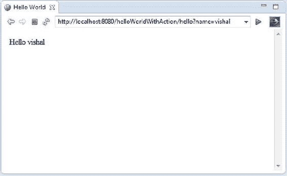

# 四、使用 Struts 2 构建 Web 应用

受伤的鹿跳得最高。

—艾米莉·狄金森

Struts 框架是一棵古老的活树，它的环形模式讲述了遗留 Java web 森林的故事。Struts 于 2001 年 6 月发布，开创了 Model-2 开发模型的基本发展，以应对 web 开发的变迁。您可以看到 Struts 的 DNA 被许多其他架构多样的基于动作的框架所吸收，这些框架是为了解决 Model-2 开发而发展的。Struts 诞生了 Tiles 框架 ，现在可以和无数的 web 框架一起使用。

由于 web 应用越来越复杂，以及来自其他不断发展的 web 框架的竞争，Struts 的流行开始失去势头。构建在经典 Struts 之上的 WebWork 框架后来与它统一起来，创建了 Struts 2 框架。Struts 2 是对经典 Struts 架构的完全重写，旨在解决上述需求。Struts 2 为 web 应用提供了架构基础，提供了自动化重复任务和分离横切关注点的架构机制，并通过配置上的约定使开发人员不必维护过多的配置代码。

一章不足以展示任何框架的全部功能，所以我在这里的目的是展示 Struts 2 web 框架的基础。从本章开始，通过后续章节，您将逐步了解现代 web 框架如何提供以 Java EE web 层模式为中心的架构基础。

Struts 2 框架概述

[表 4-1](#Tab1) 描述了 Struts 2 框架的关键特性。

[表 4-1](#_Tab1) 。Struts 2 框架的主要特性

| 

特征

 | 

描述

 |
| --- | --- |
| Ajax 支持 | Struts 2 集成了 Ajax 支持。除了现成的 Ajax，Struts 2 还支持无数以 Ajax 为中心的插件。 |
| 约定胜于配置 | Struts 2 坚持约定优先于配置的原则，消除了不必要的配置。 |
| 使用注释的声明式体系结构 | Struts 2 使用注释的声明式架构减少了 XML 配置，并使配置更接近 action 类。 |
| 数据变换 | Struts 2 提供了从基于字符串的表单字段值到对象或原始类型的自动类型转换，消除了在 action 类中提供转换代码的需要。 |
| 依赖注入 | Struts 2 对动作使用依赖注入来与它需要的组件协作。 |
| 展开性 | Struts 2 是可扩展的，因为框架中的类是基于接口的。 |
| 插件架构 | 核心 Struts 行为可以用插件来增强。您可以在这里找到许多适用于 Struts 2 的插件:
[【https://cwiki.apache.org/S2PLUGINS/home.html】](https://cwiki.apache.org/S2PLUGINS/home.html) |
| POJO 表单和操作 | 与使用 ActionForms 的传统 Struts 不同，在 Struts 2 中，您可以使用任何 POJO 来接收表单输入。任何 POJO 都可以作为一个动作。 |
| 查看技术 | Struts 支持 JSP、FreeMarker、Velocity、XSLT 等多种视图。 |

在深入研究 Struts 2 之前，有必要了解一下经典 Struts(以下简称 Struts)的架构。Struts 是一个基于 MVC 的框架。Struts 框架的核心组件是 ActionServlet ，它实现了前端控制器 web 层 Java EE 模式。[图 4-1](#Fig1) 展示了 Struts 的架构。


[图 4-1](#_Fig1) 。Struts 框架的体系结构

Struts 中事件 的顺序如下:

1.  ActionServlet 将请求处理委托给 RequestProcessor。
2.  RequestProcessor 处理请求并将表单值存储在 ActionForm 中。
3.  RequestProcessor 然后调用 Action 类。
4.  Action 类访问 ActionForm 来检索表单值。
5.  Action 类调用对服务层的调用。
6.  Action 类返回 ActionForward，用于封装响应视图。

然而，Struts 2 不同于 Struts。与 Struts 不同，Struts 2 遵循的是 push-MVC 架构，数据应该出现在页面或范围中，而 Struts 2 是 pull-MVC 架构；也就是说，可以从操作中提取数据。[表 4-2](#Tab2) 显示了 Struts 和 Struts 2 框架元素的一对一映射。

[表 4-2](#_Tab2) 。Struts 和 Struts 2 框架元素的一一映射 T3

| 

Struts 框架元素

 | 

Struts 2 框架元素

 |
| --- | --- |
| 核心控制器 | Servlet 过滤器 |
| 请求处理器 | 拦截机 |
| 行动 | 行动 |
| ActionForm(操作表单) | 行动或 POJOs |
| 向前行动 | 结果 |

**注意**你可以在[http://Struts . Apache . org/release/2.3 . x/docs/comparisng-Struts-1-and-2 . html](http://struts.apache.org/release/2.3.x/docs/comparing-struts-1-and-2.html)找到 Struts 和 Struts 2 异同的全面列表。

图 4-2 说明了 Struts 2 的关键元素，它提供了一个更清晰的 MVC 实现。


[图 4-2](#_Fig2) 。Struts 2 的架构

从[图 4-2](#Fig2) 可以看出，Struts 2 也是一个基于 MVC 的框架，实现了前台控制器模式。Struts 2 框架中的事件顺序如下:

1.  该请求被映射到配置元数据。
2.  请求通过一堆拦截器，这些拦截器为请求和横切特性提供预处理和后处理。
3.  调用提供处理该请求的逻辑的操作和操作中的方法。
4.  调用结果来呈现响应。
5.  该响应被返回给用户。

接下来讨论图 4-2 中[所示支柱 2 的关键元件。](#Fig2)

动作

动作是面向动作的 Struts 2 框架的核心，因为它们为请求处理提供了必要的逻辑。实现任何接口或扩展任何类都不需要动作，动作可以是 POJOs。清单 4-1 展示了名为 HelloWorldAction 的动作。

[清单 4-1](#_list1) 。作为 POJO 的行动

```java
public class HelloWorldAction{
//...
public String execute() {
return "success";
}
}
```

这个动作类是在 struts.xml 文件中配置的，如[清单 4-2](#list2) 所示。

[清单 4-2](#_list2) 。在 struts.xml 中配置操作类

```java
<package name="helloWorld" " extends="struts-default" namespace="/ >

<action name="hello" class=" HelloWorldAction">
<result name="success"> /hello.jsp</result>
</action>

<package>
```

清单 4-2 中的动作映射使用 name 属性来定义你可以用来访问这个动作类的动作的名称，并使用 result 标签来定义哪个结果页面应该返回给用户。现在，您可以通过。动作扩展。

```java
http://localhost:8080/helloWorldExample//hello.action
```

即使您可以使用 POJO 动作，Struts 2 也提供了两个可以使用的动作助手:动作接口和 ActionSupport 类。

动作界面

Struts 2 带有一个可选的动作接口，如清单 4-3 所示。

[清单 4-3](#_list3) 。动作界面

```java
package com.opensymphony.xwork2;

public interface Action {
public static final String ERROR = "error";
public static final String INPUT = "input";
public static final String LOGIN = "login";
public static final String NONE = "none";
public static final String SUCCESS = "success";

public String execute();
}
```

该接口提供了基于字符串的常量返回值和默认的 execute()方法，这些方法应该由实现类来实现。

实现这个接口的 action 类可以直接使用常量值，如[清单 4-4](#list4) 所示。

[清单 4-4](#_list4) 。使用操作界面

```java
import com.opensymphony.xwork2.Action;
public class HelloWorldAction implements Action{
//..
public String execute() {
return SUCCESS;
}
}
```

ActionSupport 类

ActionSupport 类实现 Action 接口，并提供返回成功值的 execute()方法的实现。ActionSupport 类还实现了一些为验证、本地化和国际化提供支持的接口，如清单 4-5 中的 ActionSupport 类的代码片段所示。

[清单 4-5](#_list5) 。ActionSupportClass

```java
public class ActionSupport implements Action, Validateable, ValidationAware,TextProvider, LocaleProvider, Serializable {
...
public String execute(){
return SUCCESS;
}
}
```

清单 4-6 显示了代码片段，通过它 ActionSupport 类可以用来提供验证。

[清单 4-6](#_list6) 。使用动作支持

```java
import com.opensymphony.xwork2.ActionSupport;

public class LoginAction extends ActionSupport{
private String username;
private String password;
public String getPassword() {
return password;
}
public void setPassword(String password) {
this.password = password;
}

public String getUsername() {
return username;
}

public void setUsername(String username) {
this.username = username;
}

//getters and setters
// ...
public String execute() {
return "SUCCESS";
}

public void validate(){
if("".equals(getUsername())){
addFieldError("username", getText("username.required"));
}
if("".equals(getPassword())){
addFieldError("password", getText("password.required"));
}
}
}
```

拦截器

拦截器通过将横切关注点的实现从操作中分离出来，促进了关注点的分离。Struts 2 附带了一组预构建的拦截器和拦截器堆栈，您可以开箱即用。清单 4-7 展示了一个动作的声明，该动作属于一个扩展 struts-default 包的包，该包包含默认的拦截器集。

[清单 4-7](#_list7) 。宣告一个动作 T3

```java
<package name="default" namespace="/" extends="struts-default">
<action name="helloAction"
class="HelloWorldAction" >
<result name="success">/hello.jsp</result>
</action>
</package>
```

当您从 struts-default 包扩展您的包时，默认情况下，defaultStack 将用于您的包中的所有操作。defaultStack 是在 struts-default.xml 文件中配置的，它提供了 Struts 2 的所有核心功能。struts-default.xml 文件位于 struts 2-core.jar 文件中。要将其他拦截器映射到一个动作，可以使用 interceptor-ref 元素，如[清单 4-8](#list8) 所示。

[清单 4-8](#_list8) 。将拦截器映射到行动 T3

```java
<package name="default" namespace="/" extends="struts-default">
<action name="helloAction"
class="HelloWorldAction" >
<interceptor-ref name="logger"/>
<result name="success">/hellot.jsp</result>
</action>
</package>
```

在[清单 4-8](#list8) 中，动作映射通过 interceptor-ref 元素将记录器拦截器映射到 HelloWorldAction 动作类。由于 HelloWorldAction 被声明为它自己的拦截器，它失去了默认的拦截器集，为了使用它，你必须显式声明 defaultStack，如[清单 4-9](#list9) 所示。

[清单 4-9](#_list9) 。声明一个默认堆栈 T3】

```java
<package name="default" namespace="/" extends="struts-default">
<action name="helloAction"
class="HelloWorldAction" >
<interceptor-ref name="logger"/>
<interceptor-ref name="defaultStack"/>
<result name="success">/hello.jsp</result>
</action>
</package>
```

ValueStack 和 OGNL

对象图导航语言(OGNL [<sup class="calibre12">1</sup>](#Fn1) )是一种功能强大的表达式语言，用于从 JavaBeans 设置和获取属性，以及从 Java 类调用方法。它还有助于数据传输和类型转换。OGNL 类似于 EL 和 JSTL，它们使用点符号来计算表达式和导航对象图。正如你在[图 4-2](#Fig2) 中看到的，OGNL 和 ValueStack 虽然不是 MVC 的一部分，但却是 Struts 2 框架的核心。所有 MVC 组件都与 ValueStack 交互以提供上下文数据。这些组件使用 OGNL 语法访问 ValueStack，在 Struts 2 中，OGNL 和 ValueStack 一起处理请求。具体来说，当一个请求被发送到 Struts 2 应用时，会为该请求创建一个 ValueStack 对象，对为该请求而创建的所有对象的引用以及范围属性都保存在 ValueStack 中。所有这些物体都可以通过 OGNL 看到。你不会发现 OGNL 很难使用，因为它类似于埃尔和 JSTL(这将在第 3 章中讲述)。清单 4-10 展示了 OGNL 的样子。注意，OGNL 使用#，不像 JSP EL 使用$。

[清单 4-10](#_list10) 。使用 OGNL

```java
<s:property value="#book.bookTitle" />
```

结果类型和结果

在 Struts 2 中，响应的呈现由结果类型和结果组成。结果类型提供了返回给用户的视图类型的实现细节。动作的每个方法都返回一个结果，其中包括指定结果类型。如果没有指定结果类型，那么使用默认的结果类型，它会转发到一个 JSP 页面，如[清单 4-11](#list11) 所示。

[清单 4-11](#_list11) 。默认结果类型

```java
<result name="success">
   /hello.jsp
</result>
```

Struts 2 附带了许多预定义的结果类型。Struts 允许您使用其他视图技术来呈现结果，包括速度、FreeMarker 和 Tiles，如[清单 4-12](#list12) 所示。

[清单 4-12](#_list12) 。将切片声明为结果类型

```java
<action name="login" class="com.apress.bookstore.action.LoginAction">
<result name="success" type="tiles">home</result>
<result name="error" type="tiles">login</result>
</action>
```

Struts 2 标签

Struts 2 框架提供了一个高级的、可移植的标记 API，您可以将它用于 JSP。在接下来的几节中，您将了解标记如何工作，以及如何使用 OGNL 来引用 ValueStack 上的值。[表 4-3](#Tab3) 描述了 Struts 2 标签库的不同类别。

[表 4-3](#_Tab3) 。Struts 标签

<colgroup><col width="25%" class="calibre14"> <col width="75%" class="calibre14"></colgroup> 
| 

Struts 2 标签

 | 

描述

 |
| --- | --- |
| Ajax 标记 | Struts 通过 Ajax 标签提供 Ajax 支持。 |
| 控制标签 | 这些标签提供了操作元素集合的方法。 |
| 数据标签 | 这些是呈现来自动作、国际化文本和 URL 的数据的标签。 |
| 表单标签 | 这些标签为 HTML 表单标签提供了包装器，还提供了额外的小部件，比如日期选择器。 |
| 非表单用户界面标签 | 该组中的标签用于表单中，但不是直接的表单条目元素。它们包括错误消息显示、选项卡式面板和树视图。 |

**注意**你可以在[http://Struts . Apache . org/release/2.3 . x/docs/tag-reference . html](http://struts.apache.org/release/2.3.x/docs/tag-reference.html)的在线文档中找到 Struts 2 标签的完整列表。

Struts 2 入门

在本节中，您将开发一个 HelloWorld Struts 2 应用。您将使用名为 Maven 的构建和依赖管理工具。 [<sup class="calibre12">2</sup>](#Fn2) Maven 是一个命令行工具，用于构建和打包项目以及管理依赖关系。通过在多个项目之间提供相同的目录结构，这使得开发人员跨多个项目工作变得更加容易。

Maven 配置文件(pom.xml)中描述的显式配置和可传递的依赖项将在构建过程 中从本地存储库访问或下载到本地存储库。该特性允许开发人员创建新项目，而无需创建公共目录结构、创建配置文件以及从头开始编写默认类和测试。使用 Maven 进行运行时依赖 的好处是，你不需要手动记忆和搜索需要的依赖。您将使用 Maven 4 来导入 Struts 2 运行时依赖项。Maven 4 与 Eclipse-kepler 集成在一起，正如第一章中提到的[。因此，您不必为 Eclipse 安装 Maven 插件。创建 Maven 项目](01.html) ，点击新建【其他】，如图[图 4-3](#Fig3) 所示。


[图 4-3](#_Fig3) 。选择一个专家项目

在向导中选择 Maven 项目，如图[图 4-4](#Fig4) 所示。


[图 4-4](#_Fig4) 。选择选项 Maven 项目

点击下一步，配置 选项，如图[图 4-5](#Fig5) 所示。


[图 4-5](#_Fig5) 。配置一个 Maven 项目

点击下一步，如[图 4-6](#Fig6) 所示，选择目录、组 Id 和工件 Id。T3】


[图 4-6](#_Fig6) 。选择原型

点击下一步，输入组 ID、工件 ID 和包细节，如图[图 4-7](#Fig7) 所示。T3】


[图 4-7](#_Fig7) 。指定原型参数

单击完成。图 4-7 中[工件 Id 字段中描述的名称的项目被创建。](#Fig7)[图 4-8](#Fig8) 显示了所创建项目的目录结构 。


[图 4-8](#_Fig8) 。已创建项目的目录结构

图 4-8 所示的目录结构遵循正常的 Maven 目录结构。

[表 4-4](#Tab4) 描述了 HelloWorld 应用 的目录结构。

[表 4-4](#_Tab4) 。基于 Maven 的应用的目录结构

| 

目录

 | 

描述

 |
| --- | --- |
| 科学研究委员会 | 所有来源 |
| :-主 | 主源目录 |
| ::- java | Java 源代码 |
| ::- helloworld | 由 groupID 参数定义的包 |
| 动作 | 原型的包装 |
| ::-资源 | 资源(配置、属性等) |
| :- webapp | Web 应用文件 |
| ::- WEB-INF | WEB-INF 文件夹 |

非 Maven HelloWorld 应用的目录结构可能类似于[表 4-5](#Tab5) 。

[表 4-5](#_Tab5) 。非基于 Maven 的应用的目录结构

| 

目录

 | 

描述

 |
| --- | --- |
| 科学研究委员会 | 所有来源 |
| :- helloworld | Helloworld 包 |
| -行动 | 行动包 |
| - struts.xml | 资源(配置、属性等) |
| 网 | Web 应用文件 |
| :- WEB-INF | WEB-INF 文件夹 |

您需要将 struts 2-core 依赖项添加到 HelloWorld 应用生成的 pom.xml 文件中。[清单 4-13](#list13) 显示了添加到 pom.xml 的代码片段。

[清单 4-13](#_list13) 。struts 双核依赖

```java
<dependency>
<groupId>org.apache.struts</groupId>
<artifactId>struts 2-core</artifactId>
<version>2.3.15.1</version>
<type>jar</type>
<scope>compile</scope>
</dependency>
```

您的 pom.xml 文件 将类似于[清单 4-14](#list14) 。

[清单 4-14](#_list14) 。pom.xml

```java
1.<project fontname">http://maven.apache.org/POM/4.0.0" xmlns:xsi="http://www.w3.org/2001/XMLSchema-instance"
2\. xsi:schemaLocation="http://maven.apache.org/POM/4.0.0http://maven.apache.org/maven-v4_0_0.xsd">
3.<modelVersion>4.0.0</modelVersion>
4.<groupId>com.apress</groupId>
5.<artifactId>helloworldStruts2</artifactId>
6.<packaging>war</packaging>
7.<version>0.0.1-SNAPSHOT</version>
8.<name>helloworldStruts2Maven Webapp</name>
9.<url>http://maven.apache.org</url>
10.<dependencies>
11.<dependency>
12.<groupId>junit</groupId>
13.<artifactId>junit</artifactId>
14.<version>3.8.1</version>
15.<scope>test</scope>
16.</dependency>
17.<dependency>
18.<groupId>org.apache.struts</groupId>
19.<artifactId>struts2-core</artifactId>
20.<version>2.3.15.1</version>
21.<type>jar</type>
22.<scope>compile</scope>
23.</dependency>
24.</dependencies>
25.<build>
26.<finalName>helloworldStruts2</finalName>
27.</build>
28.              </project>
```

**注意**你可以在[http://Struts . Apache . org/development/2 . x/Struts 2-core/dependencies . html](http://struts.apache.org/development/2.x/struts2-core/dependencies.html)找到 Struts 2 的依赖项列表。

清单 4-15 显示了在项目中创建的空部署描述符 。

[清单 4-15](#_list15) 。web . XMLT3】

```java
<!DOCTYPE web-app PUBLIC
"-//Sun Microsystems, Inc.//DTD Web Application 2.3//EN"
 "http://java.sun.com/dtd/web-app_2_3.dtd" >
<web-app>
<display-name>Archetype Created Web Application</display-name>
</web-app>
```

您需要在部署描述符中配置 servlet 过滤器，如清单 4-16 所示。

[清单 4-16](#_list16) 。web.xml

```java
1.<!DOCTYPE web-app PUBLIC
2\. "-//Sun Microsystems, Inc.//DTD Web Application 2.3//EN"
3\. "http://java.sun.com/dtd/web-app_2_3.dtd" >
4.
5.<web-app>
6.<display-name>Hello World Struts2 Web App</display-name>
7.<filter>
8.<filter-name>struts2</filter-name>
9.<filter-class>org.apache.struts2.dispatcher.ng.filter.StrutsPrepareAndExecuteFilter</filter-class>
10.</filter>
11.
12.<filter-mapping>
13.<filter-name>struts2</filter-name>
14.<url-pattern>/*</url-pattern>
15.</filter-mapping>
16.</web-app>
```

*   *第 7 行到第 10 行*:这几行定义了 Struts prepareendexecutefilter，它被用作 Struts 2 中的 servlet 过滤器，所有的 URL 都被映射到这个过滤器。

**注意**filter dispatcher(org . Apache . struts2 . dispatcher . filter dispatcher)是早期 Struts 2 开发中使用的，从 Struts 2.1.3 开始就被弃用了。

[清单 4-17](#list17) 展示了 struts.xml 文件。

[清单 4-17](#_list17) 。struts . XMLT3】

```java
1.<?xml version="1.0" encoding="UTF-8"?>
2.<!DOCTYPE struts PUBLIC
3.    "-//Apache Software Foundation//DTD Struts Configuration 2.0//EN"
4.    "http://struts.apache.org/dtds/struts-2.0.dtd">
5.
6.<struts>
7.<constant name="struts.devMode" value="true" />
8.<package name="basicstruts2" extends="struts-default">
9.<action name="index">
10.<result>/index.jsp</result>
11.</action>
12.</package>
13.</struts>
```

*   *第 9 行到第 11 行*:这几行定义了 index 动作，该动作呈现结果 index.jspT3。

清单 4-18 展示了 index.jsp。

[清单 4-18](#_list18) 。index.jsp

```java
<html>
<body>
<h2>Hello World!</h2>
</body>
</html>
```

将 web 应用部署到 servlet 容器 Tomcat 7，打开 web 浏览器，访问[http://localhost:8080/hello world struts 2/](http://localhost:8080/helloworldStruts2/)，如图[图 4-9](#Fig9) 所示。


[图 4-9](#_Fig9) 。运行 HelloWorld 应用

您开发的 HelloWorld 应用不包含任何操作，只包含一个在您创建项目时生成的 JSP 文件。您创建 HelloWorld 应用的目的是测试 Struts 2 的配置。您将在下一节中创建操作。

您将创建一个 HelloWorld 项目 ，向用户显示一条欢迎消息，如图[图 4-10](#Fig10) 所示。


[图 4-10](#_Fig10) 。HelloWorld 项目的形式

当您在 Struts 2 web 应用中提交 HTML 表单时，输入被发送到名为 Action 的 Java 类。动作执行后，结果选择一个资源来呈现响应，如图[图 4-11](#Fig11) 所示。



[图 4-11](#_Fig11) 。问候用户

让我们修改你之前创建的 HelloWorld 项目，添加一个动作，接受用户输入的表单，以及问候用户的视图，如图[图 4-12](#Fig12) 所示的目录结构。


[图 4-12](#_Fig12) 。项目的目录结构

清单 4-19 展示了允许用户输入名字并提交的表单。

[清单 4-19](#_list19) 。index.jsp

```java
1.<html>
2.<body>
3.
4.<form action="hello">
5.<label for="name">Enter your name</label><br /><input type="text"
6.name="name" /><input type="submit" value="Submit" />
7.</form>
8.</body>
9.</html>
```

*   *第 4 行*:当用户提交表单时，动作名 hello 被发送到容器。

您需要一个映射来将 URL 映射到 HelloWorldAction 控制器。映射告诉 Struts 2 框架哪个类将响应用户的动作，哪个类的方法将被执行，以及哪个视图将被呈现为响应。清单 4-20 展示了这个映射文件。

[清单 4-20](#_list20) 。struts.xml

```java
1.<?xml version="1.0" encoding="UTF-8"?>
2.<!DOCTYPE struts PUBLIC
3.    "-//Apache Software Foundation//DTD Struts Configuration 2.0//EN"
4.    "http://struts.apache.org/dtds/struts-2.0.dtd">
5.
6.<struts>
7.<constant name="struts.devMode" value="true" />
8.<package name="basicstruts2" extends="struts-default"
9.namespace="/">
10.
11.<action name="index">
12.<result>/index.jsp</result>
13.</action>
14.
15.<action name="hello" class="com.apress.helloworld.action.HelloWorldAction"
16.method="execute">
17.<result name="success">/hello.jsp</result>
18.</action>
19.</package>
20.</struts>
```

*   *第 15 行*:这一行声明了 HelloWorldAction 的动作映射。HelloWorldAction 映射到操作名 hello。
*   *第 16 行*:这一行声明要执行动作的 execute()方法。
*   *第 17 行*:这一行声明 hello.jsp 被指定为一个成功页面，并将被呈现为响应。

我们需要一个动作类来充当控制器。Action 类响应提交表单并将 hello 操作发送到容器的用户操作。清单 4-21 展示了 HelloWorldAction。

[清单 4-21](#_list21) 。HelloWorldAction.java

```java
1.package com.apress.helloworld.action;
2.
3.public class HelloWorldAction {
4.private String name;
5.
6.public String execute() throws Exception {
7.return "success";
8.}
9.
10.public String getName() {
11.return name;
12.}
13.
14.public void setName(String name) {
15.this.name = name;
16.}
17.}
18.
```

*   *第 6 行到第 7 行*:Struts 2 框架会创建一个 HelloWorldAction 类的对象，并调用 execute 方法来响应用户的动作。execute 方法返回成功字符串，该字符串被映射到 struts.xml 中的 hello.jsp

清单 4-22 展示了 hello.jsp。

[清单 4-22](#_list22) 。hello.jsp

```java
1.<%@ page language="java" contentType="text/html; charset=ISO-8859-1"
2.pageEncoding="ISO-8859-1"%>
3.<%@ taglib prefix="s" uri="/struts-tags"%>
4.<html>
5.<head>
6.<title>Hello World</title>
7.</head>
8.<body>
9.Hello
10.<s:property value="name" />
11.</body>
12.</html>
```

*   第 3 行:taglib 指令告诉 servlet 容器这个页面将使用 Struts 2 标签。
*   *第 10 行*:s:property 标签显示调用 HelloWorldAction 类的方法 getName 返回的值。getName 方法返回一个字符串。s:property 标记显示的就是 getName 返回的这个字符串。

现在，您将学习 Struts 2 提供的一种不同的声明性配置技术:注释。您可以创建新项目或修改之前创建的项目。[图 4-13](#Fig13) 说明了目录结构。


[图 4-13](#_Fig13) 。HelloWorld 项目使用 Struts 2 标注

要使用 Struts 2 注释，需要名为 Struts 2-conventi on-plugin 的插件。使用[清单 4-23](#list23) 中所示的片段将依赖项添加到 pom.xml 文件中。

[清单 4-23](#_list23) 。struts 2-约定-插件

```java
<dependency>
<groupId>org.apache.struts</groupId>
<artifactId>struts2-convention-plugin</artifactId>
<version>2.3.15.1</version>
</dependency>
```

[清单 4-24](#list24) 展示了用 Struts 2 注释配置的 HelloWorldAction。

[清单 4-24](#_list24) 。hello world actionT3】

```java
1.package com.apress.helloworld.action;
2.
3.import org.apache.struts2.convention.annotation.Action;
4.import org.apache.struts2.convention.annotation.Result;
5.
6.@Action(value = "/hello", results = { @Result(name = "success", location = "/hello.jsp") })
7.public class HelloWorldAction {
8.private String name;
9.
10.public String execute() throws Exception {
11.return "success";
12.}
13.
14.public String getName() {
15.return name;
16.}
17.
18.public void setName(String name) {
19.this.name = name;
20.}
21.}
```

*   *第 6 行* : @Action 定义了一个动作的 URL。因为动作注释的值是“/hello”，所以将为请求 URL“/hello”调用动作。
*   *第 6 行* : @Result 定义了一个动作的结果。结果注释将结果代码映射到结果页面。这里，结果代码“success”被映射到结果“/hello.jsp”。

清单 4-24 使用动作和结果注释只是为了向你展示如何使用它们。您还可以使用约定插件提供的智能默认值。如果在 web.xml 中将 actionPackages filter init 参数设置为包含 action 类的包的逗号分隔列表，如[清单 4-25](#list25) 所示，包及其子包将被扫描。检查指定包中实现 Action 的所有类或没有实现 Action 接口并以 Action 结束的 POJO 操作。

[清单 4-25](#_list25) 。actionPackages Init 参数 T3】

```java
<init-param>
<param-name>actionPackages</param-name>
<param-value>com.apress.helloworld.action</param-value>
</init-param>
```

约定插件使用动作类名来映射动作 URL。约定插件首先删除类名末尾的单词 Action，然后将大小写转换成破折号。因此，默认情况下，将为请求 URL hello-world 调用 HelloWorldAction。但是，如果您希望为不同的 URL 调用操作，那么您可以通过使用操作注释来实现。

**提示**你可以在[http://Struts . Apache . org/release/2.3 . x/docs/annotations . html](http://struts.apache.org/release/2.3.x/docs/annotations.html)找到所有 Struts 2 注释的列表。

在接下来的部分中，您将使用 Struts 2 开发书店 web 应用。

书店网络应用

在本节中，您将逐步开发包括以下功能的书店应用:

*   登录功能
*   模板
*   与数据访问层的集成
*   通过数据库登录
*   从数据库中选择类别
*   按类别列出书籍

该应用的完整代码可从 Apress 网站的可下载档案中获得。

登录功能

[图 4-14](#Fig14) 显示了初始登录屏幕。


[图 4-14](#_Fig14) 。书店应用的登录页面

当用户提交有效的用户名和密码组合时，用户将登录，并显示用户名，如图[图 4-15](#Fig15) 所示。


[图 4-15](#_Fig15) 。登录成功

如果用户输入不正确的用户名或密码，将向用户显示一条错误消息，如图[图 4-16](#Fig16) 所示。


[图 4-16](#_Fig16) 。登录失败

[图 4-17](#Fig17) 说明了应用的目录结构。您可以从 Apress 网站下载该应用的源代码，然后在阅读每一部分时，您可以参考导入和其他工件的源代码。


[图 4-17](#_Fig17) 。书店应用的目录结构

您可以将 struts 2-core 依赖项添加到 pom.xml 文件中，如[清单 4-26](#list26) 所示。

[清单 4-26](#_list26) 。struts 双核依赖

```java
<dependency>
<groupId>org.apache.struts</groupId>
<artifactId>struts 2-core</artifactId>
<version>2.3.15.1</version>
<type>jar</type>
<scope>compile</scope>
</dependency>
```

您可以使用之前在 HelloWorld 项目中使用的相同的 web.xml 文件。修改欢迎文件列表文件，如[清单 4-27](#list27) 所示。

[清单 4-27](#_list27) 。欢迎文件

```java
<welcome-file-list>
<welcome-file>login.jsp</welcome-file>
</welcome-file-list>
```

[清单 4-28](#list28) 展示了 login.jsp 文件。

[清单 4-28](#_list28) 。login.jsp

```java
1.<%@ page contentType="text/html; charset=UTF-8"%>
2.<%@ taglib prefix="s" uri="/struts-tags"%>
3.<html>
4.<head>
5.<title>Bookstore Login</title>
6.</head>
7.<body>
8.<h3>Login Bookstore</h3>
9.<s:actionerror />
10.<s:form action="login.action" method="post">
11.<s:textfield name="username" key="label.username" size="30" />
12.<s:password name="password" key="label.password" size="30" />
13.<s:submit method="execute" align="center" />
14.</s:form>
15.</body>
16.</html>
```

清单 4-28 展示了几个 Struts 2 标签的用法。这是一个允许用户输入用户名和密码的登录表单。在第 10 行，当用户提交表单时，动作 login 的名称被发送到容器。这个动作名通过 struts.xml 映射到 LoginAction，如[清单 4-29](#list29) 所示。

[清单 4-29](#_list29) 。struts.xml

```java
1.<?xml version="1.0" encoding="UTF-8" ?>
2.<!DOCTYPE struts PUBLIC
3."-//Apache Software Foundation//DTD Struts Configuration 2.3//EN"
4."http://struts.apache.org/dtds/struts-2.3.dtd">
5.
6.
7.<struts>
8.<constant name="struts.enable.DynamicMethodInvocation" value="false" />
9.<constant name="struts.devMode" value="true" />
10.<constant name="struts.custom.i18n.resources" value="ApplicationResources" />
11.
12.<package name="default" extends="struts-default" namespace="/">
13.<action name="login" class="com.apress.bookstore.action.LoginAction">
14.<result name="success">view/home.jsp</result>
15.<result name="error">login.jsp</result>
16.</action>
17.</package>
18.</struts>
```

在[清单 4-29](#list29) 中，第 13 行将登录名的 LoginAction 类映射到 URL，当 LoginAction 类返回字符串 success 时，第 14 行呈现 home.jsp。如果 LoginAction 类返回字符串 error，则 login.jsp 将再次显示错误消息。

清单 4-30 展示了登录操作。

[清单 4-30](#_list30) 。LoginAction.java

```java
1.package com.apress.bookstore.action;
2.import com.opensymphony.xwork2.ActionSupport;
3.public class LoginAction extends ActionSupport {
4.private String username;
5.private String password;
6.public String execute() {
7.if (this.username.equals("vishal") && this.password.equals("password")) {
8.return "success";
9.} else {
10.addActionError(getText("error.login"));
11.return "error";
12.}
13.}
14.public String getUsername() {
15.return username;
16.}
17.public void setUsername(String username) {
18.this.username = username;
19.}
20.
21.public String getPassword() {
22.return password;
23.}
24.
25.public void setPassword(String password) {
26.this.password = password;
27.}
28.}
```

在清单 4-30 的第 7 到 9 行，用户名和密码是硬编码的。稍后，您将看到如何针对数据库进行身份验证。如果用户名或密码无效，第 10 行中的 addActonError 方法获取映射到 application resources . properties 的 Error.login 消息，如[清单 4-31](#list31) 所示，并返回字符串 error。

[清单 4-31](#_list31) 。应用资源.属性

```java
label.username= Username
label.password= Password
error.login= Invalid Username/Password
```

清单 4-32 展示了 home.jsp，它是在 LoginAction 类返回字符串 success 时呈现的。

[清单 4-32](#_list32) 。home.jsp

```java
1.<%@ page contentType="text/html; charset=UTF-8"%>
2.<%@ taglib prefix="s" uri="/struts-tags"%>
3.<html>
4.<head>
5.<title>Home</title>
6.</head>
7.<body>
8.<s:property value="username" />
9.</body>
10.</html>
```

[清单 4-32](#list32) 当 LoginAction 返回字符串 success 时，使用 s:property 标签显示用户名。

开发模板

在本节中，您将看到如何将 Tiles 框架与 Struts 2 集成。我们将为上一节中创建的 HelloWorld Struts 应用添加 Tiles 支持。Tiles 是一个模板系统，可以减少代码重复，并在 web 应用的所有页面上保持一致的外观。使用磁贴，您可以在配置文件中定义一个通用布局，该布局将扩展到 web 应用的所有网页。这意味着您可以通过更改模板文件来更改 web 应用所有页面的外观，而不是更改所有页面。对于书店应用，您将添加一个标题和菜单，如图[图 4-18](#Fig18) 所示。


[图 4-18](#_Fig18) 。书店应用的模板

[图 4-19](#Fig19) 显示了带有标题的登录屏幕。认证成功后，用户登录，呈现带有菜单栏的主页，如图[图 4-20](#Fig20) 所示。如果用户名或密码无效，用户将停留在登录屏幕上，并显示一条错误消息，如图 4-21 中的[所示。](#Fig21)


[图 4-19](#_Fig19) 。带标题的登录屏幕


[图 4-20](#_Fig20) 。成功登录时显示的菜单


[图 4-21](#_Fig21) 。登录失败，标题为

用户登录后，表头显示用户名，菜单出现，如图[图 4-20](#Fig20) 所示。

[图 4-22](#Fig22) 说明了与模板文件的目录结构。


[图 4-22](#_Fig22) 。模板文件的目录结构

你需要用 struts 2-tiles3-plugin 和 slf4j-log4j12 修改 pom.xml 文件，如[清单 4-33](#list33) 所示。这些插件是将 Tiles 与 Struts 2 集成所必需的。

[清单 4-33](#_list33) 。struts-tiles 和 slf4j-log4j12 插件

```java
<dependency>
<groupId>org.apache.struts</groupId>
<artifactId>struts2-tiles3-plugin</artifactId>
<version>2.3.15.1</version>
</dependency>
<dependency>
<groupId>org.slf4j</groupId>
<artifactId>slf4j-log4j12</artifactId>
<version>1.5.6</version>
</dependency>
```

[清单 4-34](#list34) 展示了 struts.xml 文件。

[清单 4-34](#_list34) 。struts.xml

```java
1.<?xml version="1.0" encoding="UTF-8" ?>
2.<!DOCTYPE struts PUBLIC
3."-//Apache Software Foundation//DTD Struts Configuration 2.3//EN"
4."http://struts.apache.org/dtds/struts-2.3.dtd">
5.
6.
7.<struts>
8.<constant name="struts.enable.DynamicMethodInvocation" value="false" />
9.<constant name="struts.devMode" value="true" />
10.<constant name="struts.custom.i18n.resources" value="ApplicationResources" />
11.
12.<package name="default" extends="struts-default" namespace="/">
13.<result-types>
14.<result-type name="tiles"
15.class="org.apache.struts2.views.tiles.TilesResult" />
16.</result-types>
17.<action name="*Link" method="{1}"
18.class="com.apress.bookstore.action.LinkAction">
19.<result name="login" type="tiles">login</result>
20.<result name="allBooks" type="tiles">allBooks</result>
21.</action>
22.<action name="login" class="com.apress.bookstore.action.LoginAction">
23.<result name="success" type="tiles">home</result>
24.<result name="error" type="tiles">login</result>
25.</action>
26.<action name="logout">
27.<result name="success" type="tiles">logout</result>
28.</action>
29.</package>
30.</struts>
```

*   *第 19、20、23、24 和 27 行*:这些行将结果类型定义为 tiles 和 tiles.xml 中定义的 tiles 名称，如 home 和 login。根据操作返回的结果字符串，换句话说，成功或错误，tiles.xml 中定义的相应 JSP 文件将使用 tiles.xml 中的定义名称映射到 struts.xml 中的 Tiles 名称。

[清单 4-35](#list35) 展示了 tiles.xml 文件。

[清单 4-35](#_list35) 。tiles.xml

```java
1.<?xml version="1.0" encoding="UTF-8" ?>
2.
3.<!DOCTYPE tiles-definitions PUBLIC "-//Apache Software Foundation//DTD Tiles Configuration 3.0//EN" "http://tiles.apache.org/dtds/tiles-config_3_0.dtd">
4.
5.<tiles-definitions>
6.
7.<definition name="baseLayout" template="/template/baseLayout.jsp">
8.<put-attribute name="title" value="Template" />
9.<put-attribute name="header" value="/template/header.jsp" />
10.<put-attribute name="menu" value="/template/menu.jsp" />
11.<put-attribute name="body" value="/template/body.jsp" />
12.</definition>
13.
14.<definition name="login" extends="baseLayout">
15.<put-attribute name="title" value="Log in" />
16.<put-attribute name="menu" value="" />
17.<put-attribute name="body" value="/login.jsp" />
18.</definition>
19.<definition name="error" extends="baseLayout">
20.<put-attribute name="title" value="Log in" />
21.<put-attribute name="menu" value="" />
22.<put-attribute name="body" value="/login.jsp" />
23.</definition>
24.<definition name="home" extends="baseLayout">
25.<put-attribute name="title" value="Log in" />
26.<put-attribute name="menu" value="/template/menu.jsp" />
27.<put-attribute name="body" value="/view/home.jsp" />
28.</definition>
29.<definition name="logout" extends="baseLayout">
30.<put-attribute name="title" value="Log in" />
31.<put-attribute name="menu" value="" />
32.<put-attribute name="body" value="/login.jsp" />
33.</definition>
34.
35.<definition name="allBooks" extends="baseLayout">
36.<put-attribute name="title" value="All Books" />
37.<put-attribute name="body" value="/allBooks.jsp" />
38.</definition>
39.
40.
41.</tiles-definitions>
```

清单 4-36 展示了 baselayout.jsp 文件，它定义了页眉、页脚和正文内容应该插入的位置。

[清单 4-36](#_list36) 。基地布局

```java
1.<%@ taglib uri="http://tiles.apache.org/tags-tiles" prefix="tiles"%>
2.<!DOCTYPE HTML PUBLIC "-//W3C//DTD HTML 4.01 Transitional//EN"
3.   "http://www.w3.org/TR/html4/loose.dtd">
4.
5.<html>
6.<head>
7.<meta http-equiv="Content-Type" content="text/html; charset=UTF-8">
8.<link rel="stylesheet" href="css/bookstore.css" type="text/css" />
9.<script type="text/javascript" src="js/jquery-1.9.1.js"></script>
10.<script src="js/bookstore.js"></script>
11.<title><tiles:insertAttribute name="title" ignore="true" /></title>
12.</head>
13.<body>
14.<div id="centered">
15.
16.
17.<tiles:insertAttribute name="header" />
18.
19.<tiles:insertAttribute name="menu" />
20.
21.<tiles:insertAttribute name="body" />
22.
23.
24.</div>
25.</body>
26.</html>
```

[清单 4-37](#list37) 展示了 header.jsp 文件。

[清单 4-37](#_list37) 。header.jsp

```java
1.<%@ page language="java" contentType="text/html; charset=ISO-8859-1"
2.pageEncoding="ISO-8859-1"%>
3.<%@ taglib prefix="s" uri="/struts-tags"%>
4.
5.<div class="header">
6.<h2>
7.<span style="margin-left: 15px; margin-top: 15px;" class="label">BOOK
8.<span style="color: white;">STORE</span>
9.</span>
10.</h2>
11.<span style="color: black; margin-left: 15px;">
12.
13.
14.<s:if test="%{username!=null && !hasActionErrors() }">Welcome <s:property value="username" /> | <a href='<s:url action="logout.action"/>'>Log out</a></s:if>
15.<s:else>
16.Login
17.</s:else>
18.
19.
20.
21.
22.</span>
23.
24.</div>
25.
```

第 14 到 17 行使用 Struts 2 s:if、s:else 和 s:property 标记来欢迎用户登录并允许用户注销。由于该代码位于标题中，因此应用中的所有页面都可以使用该功能。

[清单 4-38](#list38) 展示了 web.xml 文件。

[清单 4-38](#_list38) 。web.xml

```java
1.<!DOCTYPE web-app PUBLIC
2\. "-//Sun Microsystems, Inc.//DTD Web Application 2.3//EN"
3\. "http://java.sun.com/dtd/web-app_2_3.dtd" >
4.
5.<web-app>
6.<display-name>Archetype Created Web Application</display-name>
7.<context-param>
8.<param-name>org.apache.tiles.impl.BasicTilesContainer.DEFINITIONS_CONFIG</param-name>
9.<param-value>/WEB-INF/tiles.xml</param-value>
10.</context-param>
11.
12.<filter>
13.<filter-name>struts2</filter-name>
14.<filter-class>org.apache.struts2.dispatcher.ng.filter.StrutsPrepareAndExecuteFilter</filter-class>
15.</filter>
16.<filter-mapping>
17.<filter-name>struts2</filter-name>
18.<url-pattern>/*</url-pattern>
19.</filter-mapping>
20.<listener>
21.<listener-class>org.apache.tiles.extras.complete.CompleteAutoloadTilesListener</listener-class>
22.</listener>
23.<welcome-file-list>
24.<welcome-file>index.jsp</welcome-file>
25.</welcome-file-list>
26.
27.</web-app>
```

需要第 7 行到第 10 行和第 21 行到第 22 行来配置带有 Struts 2 的图块。

集成数据访问层

在本节中，您将把您创建的 web 应用与数据访问层集成在一起。您可以使用您在第 1 章中创建的数据访问层。然后，根据数据库对用户进行身份验证。接下来，您将在菜单栏上显示书店数据库中的类别。然后，您将按类别从数据库中检索图书列表。[图 4-23](#Fig23) 说明了应用的目录结构 。


[图 4-23](#_Fig23) 。带有数据访问层的目录结构

正如您在目录结构中看到的，应用中只有一个 BookController 。清单 4-39 中说明了该控制器中的方法。

[清单 4-39](#_list39) 。记账员

```java
1.      public class BookController extends ActionSupport  {
2.
3.              //properties
4\. 
5.              public String login() {}
6.
7.              public String executelogin() {}
8.
9.              public String error() {}
10.
11.             public String allBooks() {}
12.
13.             public String booksByCategory() {}
14.
15.              public String searchByKeyword() {}
16.
17.              public String home() {}
18.
19.              public String selectedBooks(){}
20.
21.              public String logout() {}
22.
23.             // getters and setters
24.
25.      }
```

*   *第 5 行*:负责显示登录表单。
*   *第 7 行*:根据数据库认证用户。
*   *第 9 行*:显示错误信息，例如用户无效。
*   *第 11 行*:列出书店里所有的书。
*   第 13 行:按类别列出书籍。
*   *第 15 行*:允许用户通过关键字搜索书籍:书名或作者名。
*   *第 17 行*:点击首页链接，显示首页。
*   *第 19 行*:显示所选书籍列表。
*   *第 21 行*:允许用户注销。

使用数据库登录

[清单 4-40](#list40) 说明了 executelogin()方法负责对数据库中的用户进行认证。为此，您需要使用以下 DDL 将用户表添加到您在[第 1 章](01.html)中开发的数据模型:

```java
CREATE TABLE USER(
ID INT NOT NULL AUTO_INCREMENT,
FIRST_NAME VARCHAR(60) NOT NULL,
LAST_NAME VARCHAR(60) NOT NULL,
USERNAME VARCHAR(60) NOT NULL,
PASSWORD VARCHAR(60) NOT NULL,
PRIMARY KEY (ID)
);
```

[清单 4-40](#_list40) 。BookController 中的 executelogin()方法

```java
1.      public String executelogin() {
2.                      String executelogin = "failed";
3.                      session = ActionContext.getContext().getSession();
4.                      dao = new BookDAOImpl();
5.                      user = new User();
6.                      user.setUserName(getUsername());
7.                      user.setPassword(getPassword());
8.                      setUser(user);
9.                      if (dao.isUserAllowed(user)) {
10.
11.                             setCategoryList(dao.findAllCategories());
12.                             session.put("username", username);
13.                             session.put("categoryList", getCategoryList());
14.                             executelogin = "success";
15.                     }
16.                     else {
17.                             addActionError(getText("error.login"));
18.                             return "error";
19.                     }
20.                     // return result;
21.                     return "executelogin";
22.             }
```

[图 4-24](#Fig24) 说明了用户表。


[图 4-24](#_Fig24) 。用户表

*   *第 9 行*:用户通过数据库的认证。正如您在第 9 行中看到的，通过调用 DAO 上的 isUserAllowed()，替换了[清单 4-31](#list31) 中硬编码的用户名和密码。isUserAllowed()方法根据登录表单中输入的用户名和密码，从结果集中的用户表(如图[图 4-24](#Fig24) 所示)中选择用户名和密码。
*   *第 11-14 行*:如果用户有效，则从数据库中检索类别，并将类别列表存储在会话中。
*   *第 16-19 行*:第 16 行将有效布尔变量设置为 true，如果结果集包含用户名和密码，如果用户无效，则返回字符串错误。

显示从数据库中检索到的类别

清单 4-41 展示了显示从数据库返回的类别的菜单。在[清单 4-40](#list40) 中，您检索了类别并将它们存储在有效用户的会话中。这些类别将在 menu.jsp 展示。

[清单 4-41](#_list41) 。menu.jsp

```java
1.<li><div>
2.
3.<span class="label" style="margin-left: 15px;">
4.<a href="<s:url action=""/>">Categories</a></span>
5.</div>
6.<ul>
7.<li><s:form action=" booksByCategoryLink">
8.
9.<s:select name="category" list="#session['categoryList']"
10.listValue="categoryDescription" listKey="id" />
11.<s:submit value="Select" />
12.</s:form><a class="label" href=""><span class="label"
13.style="margin-left: 30px;"></span></a></li>
14.
15.</ul></li>
```

*   *第 9 行到第 10 行*:这些行使用 Struts 2 的表达式语言显示存储在 LoginAction 会话中的列表中的类别。
*   *第 11 行*:当用户点击 select 按钮时，第 7 行中选择的类别和动作名称 booksByCategoryLink 被发送到容器中，然后通过 struts.xml 映射到动作，该动作检索图书列表。

按类别列出图书

在本节中，您将从数据库中按类别检索图书列表。选定的类别和动作名称 booksByCategoryLink 被发送到容器，然后通过 struts.xml 映射到 BookController。清单 4-42 展示了 struts.xml 的代码片段

[清单 4-42](#_list42) 。用 struts.xml 声明 BookController

```java
1.      <action name="*Link" method="{1}"
2.                              class="com.apress.bookstore.controller.BookController">
3.                              <result name="login" type="tiles">login</result>
4.                              <result name="allBooks" type="tiles">booklist</result>
5.                              <result name="booksByCategory" type="tiles">booklist</result>
6.                              <result name="searchByKeyword" type="tiles">booklist</result>
7.                              <result name="home" type="tiles">home</result>
8.                              <result name="executelogin" type="tiles">executelogin</result>
9.                              <result name="selectedBooks" type="tiles">selectedBooks</result>
10.                             <result name="logout" type="tiles">logout</result>
11.                             <result name="error" type="tiles">error</result>
12.                     </action>
```

清单 4-42 中第一行的*是通配符。任何以 Link 结尾的操作名称值都将由该操作映射处理。Link 之前的任何值都将是用于方法属性的值(占位符{1}将被替换为该值)。因此，不用在这个简单应用的配置文件中编写九个单独的操作映射节点，只需在名称值中使用通配符*并在方法值中使用属性值占位符({1})。这使得 Struts 2 框架能够在运行时动态选择要调用的正确方法。[清单 4-43](#list43) 展示了 booksByCategory()。

[清单 4-43](#_list43) 。booksByCategory()

```java
public String booksByCategory() {
                dao = new BookDAOImpl();
                setBookList(dao.findBooksByCategory(category));
                return "booksByCategory";
        }
```

当[列表 4-43](#list43) 中的 booksByCategory()返回时，它被映射到图块名称 booklist，如[列表 4-42](#list42) 的第 5 行所示。这映射到 tiles.xml 中定义的图书列表，如呈现 booklist.jsp 文件的[清单 4-44](#list44) 所示。清单 4-44 展示了 tiles.xml 中的代码片段

[清单 4-44](#_list44) 。tiles.xml

```java
1.<definition name="booklist" extends="baseLayout">
2.<put-attribute name="title"  value="Log in"/>
3.<put-attribute name="menu"   value="/menu.jsp"/>
4.<put-attribute name="body"   value="/view/bookList.jsp"/>
5.</definition>
```

[清单 4-45](#list45) 说明了 bookList.jsp。

[清单 4-45](#_list45) 。booklist.jsp

```java
1.<%@  taglib uri="/struts-tags" prefix="s"%>
3.<body>
5.<div id="centered">
8.<s:form action=" selectedbooksLink" theme="simple">
9.<center>
10.<table id="grid">
11.<thead>
12.<tr>
13.<th id="th-title">Book Title</th>
14.<th id="th-author">Author</th>
15.<th id="th-price">Price</th>
16.</tr>
17.</thead>
20.<tbody>
22.<s:iterator value="bookList" id="book">
23.<tr>
25.<td>
26.<s:checkboxname="selectedBooks" fieldValue="%{bookId}" />
27\. <s:propertyvalue="#book.bookTitle" />
29.</td>
30.<td>
31.<s:iterator value="#book.authors" id="author">
32.<s:if test="%{#book.id == #author.bookId}">
33.<s:property value="#author.firstName" />
34.<s:property value="#author.lastName" />
35.</s:if>
36.</s:iterator>
37.</td>
39.<td><s:property value="price" /></td>
40.</tr>
42.</s:iterator>
43.</tbody>
45</table>
47.</center><br>
49.<s:submit value="Add to the shopping cart" />
51.</s:form>
52.
53.</div>
54.</body>
```

清单 4-45 展示了 Struts 2 标签的用法，以及 Struts 2 OGNL 如何用于导航第 27 行的属性 bookTitle 以及第 33 和 34 行的属性 firstName 和 lastName(作者的)。第 31 行演示了简单的嵌套 s:iterator 的用法。第 26 行允许用户选择要添加到购物车的书籍。用户可以通过点击第 49 行上的按钮来选择和提交图书。当用户单击“添加到购物车”按钮时，第 8 行的操作名称 selectedbooksLink 和第 26 行的 bookId 被发送到容器，然后通过 struts.xml 映射到 Add to Cartaction。然后，AddToCart 操作将图书存储到数据库中的购物车，AddToCart 操作返回字符串 success，该字符串通过 struts.xml 中的操作映射和 tiles.xml 文件中的 tiles 映射到视图 selectedbooksLink。用户可以单击 selectedBooks.jsp 页面上的 Purchase 按钮，以同样的方式调用 PurchaseAction。本章简要概述了 Struts 2。关于 Struts 2 的更详细的报道，我推荐伊恩·罗维利的*实用 Apache Struts 2 Web 2.0 项目*。

摘要

在本章中，您看到了遵循 MVC 设计模式的 Struts 2 框架的核心组件，并且看到了 Struts 2 如何通过拦截器来分离横切关注点。您看到了 Struts 2 框架如何以两种形式提供声明式架构:XML 和注释。在下一章，你将学习另一个面向动作的框架，叫做 Spring Web MVC。

<sup class="calibre12"><sup class="calibre12">[【http://commons . Apache . org/proper/commons-every/](http://commons.apache.org/proper/commons-ognl/)</sup></sup>

[](#_Fn2)[【http://maven . Apache . org/](http://maven.apache.org/)