第五章

用 Spring Web MVC 构建 Java Web 应用

你能做的任何事，我都能做到。

-丹尼尔丹尼特

马克·吐温曾经说过:“在春天，我已经数出了 136 种不同的天气。”几乎可以肯定，他指的不是 Spring 框架。或者他是千里眼？Spring 框架已经成长为一个项目生态系统；它包括许多不同的模块，集成了许多框架和库，并在不同的领域提供了各种各样的功能，如 Flash、企业应用、web 服务、数据存储、OSGi、 [<sup class="calibre12">1</sup>](#Fn1) 甚至. net。Spring 应用在所有流行的云平台上都得到支持，如 Cloud Foundry、[<sup class="calibre12">2</sup>](#Fn2)Google App Engine、 亚马逊 EC2 [<sup class="calibre12">3</sup>](#Fn3) 可以利用传统的 RDBMSs 以及新的 NoSQL [<sup class="calibre12">4</sup>](#Fn4) 解决方案和数据存储，如 PostgreSQL、 [<sup class="calibre12">5</sup>](#Fn5) MySQL、MongoDB、 [<sup class="calibre12">6</sup>](#Fn6) 和 Redis。 与许多其他框架(如 Struts)不同，它只限于开发 web 应用，Spring 框架可以用来构建独立的、web 的和 JEE 的应用。Spring 支持构建现代 web 应用，包括 REST、HTML5 和 Ajax，以及移动客户端平台，包括 Android 和 iPhone。Spring 框架通过将组件与系统连接起来，使您不必编写管道代码，从而使您能够专注于应用的业务，从而显著地永远改变了企业 Java 的前景。

Spring 框架概述

Spring 框架由以下几类特性组成:

*   AOP 和仪器
*   核心容器
*   数据访问/集成
*   网
*   试验

以下各节描述了每个类别中的模块。

AOP 和仪器

AOP 和仪器类别包括 AOP、方面和仪器模块，如[表 5-1](#Tab1) 中所述。

[表 5-1](#_Tab1) 。AOP 模块

<colgroup><col width="20%" class="calibre14"> <col width="80%" class="calibre14"></colgroup> 
| 

组件

 | 

描述

 |
| --- | --- |
| 面向切面编程 | Spring 的 AOP 模块提供了一个符合 AOP 联盟的面向方面的编程实现。 |
| 方面 | 方面模块提供了与 AspectJ 的集成。 |
| 使用仪器 | 插装模块提供了类插装支持和类加载器实现。 |

核心容器

核心容器类别由 Beans、核心、上下文和表达式语言模块组成，如[表 5-2](#Tab2) 中所述。

[表 5-2](#_Tab2) 。核心模块

<colgroup><col width="25%" class="calibre14"> <col width="75%" class="calibre14"></colgroup> 
| 

组件

 | 

描述

 |
| --- | --- |
| 豆子 | Beans 模块提供了 IoC 和依赖注入特性。 |
| 核心 | 核心模块提供了 IoC 和依赖注入特性。 |
| 语境 | 上下文模块建立在核心和 Beans 模块的基础上，并增加了对国际化、事件传播、资源加载、EJB 和 JMX 的支持。 |
| 表达语言 | 表达式语言模块提供了 Spring 表达式语言。 |

数据访问/集成

数据访问/集成层由 JDBC、ORM、OXM、JMS 和事务模块组成，如[表 5-3](#Tab3) 所述。

[表 5-3](#_Tab3) 。数据访问/集成模块

<colgroup><col width="15%" class="calibre14"> <col width="85%" class="calibre14"></colgroup> 
| 

模块

 | 

描述

 |
| --- | --- |
| 数据库编程 | JDBC 模块提供了一个 JDBC 抽象层，消除了使用纯 JDBC 的需要。 |
| 对象关系映射(Object Relation Mapping) | ORM 模块提供了 ORM 框架的集成，如 JPA、JDO、Hibernate 和 iBatis。 |
| 泌酸调节素 | OXM 模块支持 JAXB、Castor、XMLBeans、JiBX 和 XStream 的对象/XML 映射实现。 |
| （同 JavaMessageService）Java 消息服务 | JMS 模块提供了生成和使用消息的功能。 |
| 交易 | 事务模块支持编程式和声明式事务管理。 |

试验

测试类别由测试模块组成，如[表 5-4](#Tab4) 所述。

[表 5-4](#_Tab4) 。测试模块

<colgroup><col width="10%" class="calibre14"> <col width="90%" class="calibre14"></colgroup> 
| 

模块

 | 

描述

 |
| --- | --- |
| 试验 | 测试模块支持用 JUnit 或 TestNG 测试 Spring 组件。 |

网

web 层由 Web、Web-Servlet、Web-Struts 和 Web-Portlet 模块组成，如[表 5-5](#Tab5) 中所述。

[表 5-5](#_Tab5) 。Web 模块

<colgroup><col width="10%" class="calibre14"> <col width="90%" class="calibre14"></colgroup> 
| 

模块

 | 

描述

 |
| --- | --- |
| 网 | Spring 的 web 模块提供了基本的面向 web 的集成特性和面向 Web 的应用上下文。它还提供了几个远程选项，比如远程方法调用(RMI)、Hessian、Burlap、JAX-WS 和 Spring 自己的 HTTP invoker。 |
| Web-Servlet | Web-Servlet 模块包含了 Spring 的 Web 应用的模型-视图-控制器(MVC)实现。 |
| Web-Struts | Web-Struts 模块支持在 Spring 应用中集成传统的 Struts web 层。请注意，从 Spring 3.0 开始，这种支持已经过时了。 |
| 门户网站 | Web-Portlet 模块提供了在 Portlet 环境中使用的 MVC 实现。 |

**注意**Spring 框架的核心是基于控制反转(IoC)的原理，它提供依赖注入。然而，Spring 并不是唯一提供依赖注入特性的框架；还有其他几个框架，比如 Seam [<sup class="calibre12">8</sup>](#Fn8) 、Google Guice [<sup class="calibre12">9</sup>](#Fn9) ，以及 JEE6 和更新的版本都提供依赖注入。

在撰写本文时，预计将发布 Spring 3 . 2 . 2；Spring 3.1 发布于 2011 年 12 月。Spring Framework 4.0 预计在 2013 年底发布，计划支持 Java SE 8、Groovy 2 和 Java EE 7 的某些方面。

Spring 框架基础知识

一个应用由 web 组件和业务逻辑组件等组件组成。这些组件需要相互协作来实现应用的共同业务目标，因此这些组件相互依赖。如果不加以控制，这种依赖性通常会导致它们之间的紧密耦合，从而导致应用不可维护。控制这种耦合以使它不会导致一个紧密耦合的应用是一项不简单的任务。相比之下，如果应用的一个组件不依赖于另一个组件，它就不必去寻找它，所有的组件都是完全隔离的，产生的应用将是松散耦合的。但是这样的应用什么都不会做。本质上，组件应该依赖于其他组件，但不应该寻找它们所依赖的组件。相反，这种依赖关系应该提供给依赖组件。这就是控制反转的本质。Spring 框架就是这样一个 IoC 框架，它通过依赖注入的方式为依赖组件提供依赖。

**注** IoC 基于好莱坞原则 [<sup class="calibre12">10</sup>](#Fn10) :“不要召唤我们；我们会打电话给你。”

图 5-1 是 Spring 如何工作的高级视图。

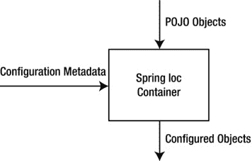

[图 5-1](#_Fig1) 。Spring IoC 容器

如[图 5-1](#Fig1) 所示，Spring IoC 容器通过使用应用 POJO 对象和配置元数据产生完全配置的应用对象。

*   *应用 POJO 对象* :在 Spring 中，由 Spring IoC 容器管理的应用对象被称为*bean*。Spring bean 是由 Spring IoC 容器实例化、组装和管理的对象。

**注**春天，组件也叫*豆*。Spring beans 不同于 JavaBeans 约定。Spring beans 可以是任何普通的旧 Java 对象(POJOs)。POJO 是一个普通的 Java 对象，没有任何特定的要求，比如扩展特定的类或实现特定的接口。

*   *配置元数据* :配置元数据指定了组成应用的对象以及这些对象之间的相互依赖关系。容器读取配置元数据，并从中判断出要实例化、配置和组装哪些对象。然后，容器在创建 bean 时注入这些依赖项。配置元数据可以用 XML、注释或 Java 代码来表示。

就实现而言，Spring 容器可以在实例和静态方法的参数中注入对象，并可以通过依赖注入来注入构造函数。假设您有一个应用，它的组件 ClassA 依赖于 ClassB。换句话说，ClassB 是依赖关系。你的标准代码看起来会像清单 5-1 中的[。](#list1)

[清单 5-1](#_list1) 。紧密耦合依赖

```java
1.    public class ClassA {
2.       private ClassB classB;
3.       public ClassA() {
4.          classB = new ClassB();
5.       }
6.    }
```

我们在清单 5-1 的第 3-4 行中创建了 ClassA 和 ClassB 之间的依赖关系。这将 ClassA 和 ClassB 紧密地结合在一起。这种紧密耦合可以使用 IoC 来规避，为了做到这一点，首先我们需要将清单 5-1 中的[代码改为清单 5-2](#list1) 中的[代码。](#list2)

[清单 5-2](#_list2) 。拆除 a 级和 b 级之间的紧耦合

```java
1.    public class ClassA {
2.       private ClassB classB;
3.       public ClassA(ClassB classB) {
4.          this.classB = classB;
5.       }
6.    }
```

在[清单 5-2](#list2) 中可以看到，ClassB 是独立实现的，Spring 容器在 ClassA 实例化的时候提供了 ClassB 到 ClassA 的这种实现，依赖关系(换句话说就是 class ClassB)通过构造函数注入到 ClassA 中。因此，控制权已经从 ClassA 中移除并保存在别处(也就是说，在一个 XML 配置文件中，如[清单 5-3](#list3) 所示)，并因此被依赖注入(DI)所“反转”，因为依赖被委托给外部系统，换句话说，配置元数据。[清单 5-3](#list3) 展示了一个典型的 Spring 配置元数据文件。

*[清单 5-3](#_list3) 。配置元数据*

```java
 1.    <?xml version="1.0" encoding="UTF-8"?>
 2.    <beans fontname">http://www.springframework.org/schema/beans"
 3.        xmlns:xsi="http://www.w3.org/2001/XMLSchema-instance"
 4.        xsi:schemaLocation="http://www.springframework.org/schema/beans
 5.            http://www.springframework.org/schema/beans/spring-beans-3.2.xsd">
 6.
 7.
 8.    <bean id=" .." class=".."/>
 9.
10.    <!-- more bean definitions -- >
11.
12.    </beans>
```

*   *第 2 行*:要使用<bean>、< bean >等标签，需要声明某些名称空间。核心 Spring 框架附带了 10 个配置名称空间。现在让我们专注于 beans 名称空间；随着本章的进展，将使用其他名称空间。然而，在本书中，我们只需要 aop、beans 和上下文模式，所以如果你对使用其他模式感兴趣，你可以在[http://static . springsource . org/spring/docs/3 . 2 . 2 . release/spring-framework-reference/html/xsd-config . html](http://static.springsource.org/spring/docs/3.2.2.RELEASE/spring-framework-reference/html/xsd-config.html)找到它们。
*   *第 2 行*:在基于 XML 的配置中描述 bean 时，XML 文件的根元素是 Spring 的 bean 模式中的<bean>。整个 Spring 配置，包括< bean >声明，都放在顶层<bean>中。
*   *线 8* : <豆>是春季最基本的配置单位。它告诉 Spring 为应用创建一个对象。这些< bean >定义对应于组成应用的实际对象。
*   *第 8 行*:id 属性是一个帮助识别单个 bean 定义的字符串。class 属性定义了 bean 的类型，并使用完全限定的类名。id 属性的值指的是协作对象。

**注意**虽然 XML 是定义配置元数据的经典方式，但是您可以使用注释(来自 Spring 2.5 和更新版本)或 Java 代码(来自 Spring 3.0 和更新版本)。

[清单 5-4](#list4) 说明了应该包含在[清单 5-3](#list3) 中说明的配置元数据文件中的 bean 定义，以在[清单 5-2](#list2) 中注入 classB 依赖。

[清单 5-4](#_list4) 。配置依赖关系

```java
1.    <!-- Definition for classA bean -->
2.       <bean id="classA" class="ClassA">
3.          <constructor-arg ref="classB"/>
4.       </bean>
5.
6.       <!-- Definition for classB bean -->
7.       <bean id="classB" class="ClassB">
8.       </bean>
```

*   *Line 2* :这指定了由 Spring 容器创建和管理的 classA bean。
*   *第 3 行* : < constructor-arg >通过在元素中声明 bean 属性，经由构造函数注入来配置 bean 属性。
*   第 7 行:指定 classB bean 应该由 Spring 容器创建和管理。

清单 5-4 中描述的依赖注入被称为基于*构造器*的依赖注入。当容器调用带有许多参数的类构造函数时，基于构造函数的 DI 就完成了，每个参数表示对另一个类的依赖。DI 的另一个变种叫做基于*设置器*的依赖注入。在基于 setter 的 DI 中，容器在调用无参数构造函数或无参数静态工厂方法实例化 bean 后，调用 bean 上的 setter 方法。要使用基于 setter 的 DI，您需要修改清单 5-2 中的，使其看起来像清单 5-5 中的。

[清单 5-5](#_list5) 。注入依赖关系的 Setter 方法

```java
 1.    public class ClassA{
 2.       private ClassB classB;
 3.
 4.       // a setter method to inject the dependency.
 5.       public void setClassB(ClassB classB) {
 6.          this.classB = classB;
 7.       }
 8.       // a getter method to return classB
 9.       public ClassB getClassB() {
10.          return classB;
11.       }
12.
13.    }
```

在[清单 5-5](#list5) 中，DI 通过创建 ClassB 实例的 ClassA 类的 setter 方法发生，这个实例用于调用 setter 方法来初始化 ClassA 的属性。[清单 5-6](#list6) 展示了 bean 定义，它应该包含在[清单 5-3](#list3) 中展示的配置元数据文件中，以实现[清单 5-5](#list5) 中要求的基于 setter 的依赖注入。

[清单 5-6](#_list6) 。通过基于 Setter 的 DI 配置依赖关系

```java
<bean id="classA" class="ClassA">
<property name="classB" ref="classB" />
</bean>
<bean id="classB" class="ClassB" />
```

标签为依赖注入定义了一个属性。[清单 5-6](#list6) 可以被翻译成[清单 5-7](#list7) 所示的 Java 代码。

[清单 5-7](#_list7) 。Java 代码相当于清单 5-6 中的

```java
ClassA classA = new ClassA();
ClassB classB = new ClassB();
classA.setClassB(classB);
```

**提示**基于构造函数的 DI 和基于设置器的 DI 可以同时使用，但是建议对强制依赖项使用构造函数参数，对可选依赖项使用设置器。

Spring 容器本质上是一个工厂，它创建封装了对象创建的对象，并使用配置元数据来配置这些对象，配置元数据包含关于应用中必须创建的协作对象的信息。Spring 提供了两种 IoC 容器实现。

*   Bean 工厂(由 org . spring framework . beans . factory . bean factory 接口定义)
*   应用上下文(由 org . spring framework . context . application context 接口定义)

Bean 工厂是最简单的容器，为 DI 提供基本支持。ApplicationContext 是 BeanFactory 的子接口，它提供应用框架服务，例如:

*   从属性文件解析文本消息的能力
*   向感兴趣的事件侦听器发布应用事件的能力
*   特定于应用层的上下文，例如要在 web 层中使用的 WebApplicationContext

**注意** Web 应用有自己的 WebApplicationContext。当我们在本章后面讨论基于 web 的 Spring 应用时，将解释 WebApplicationContext。

应用上下文

Spring 自带了 ApplicationContext 接口的几个现成实现。最常用的三种方法如下:

*   ClassPathXmlApplicationContext:从位于类路径中的 XML 文件加载上下文定义
*   FileSystemXmlApplicationContext:从文件系统中的 XML 文件加载上下文定义
*   XmlWebApplicationContext:从 web 应用中包含的 XML 文件加载上下文定义

在独立应用中，创建 ClassPathXmlApplicationContext 或 FileSystemXmlApplicationContext 的实例是很常见的。

在图 5-1 之后，您必须实例化 Spring IoC 容器(ApplicationContext ),通过读取它们的配置(配置元数据)来创建 bean 实例。然后，您可以从 IoC 容器中获取 bean 实例来使用。

清单 5-8 展示了 ClassPathXmlApplicationContext 的实例化，它是 ApplicationContext 的一个实现。ClassPathXmlApplicationContext 实现通过从类路径加载 XML 配置文件来构建应用上下文。

[清单 5-8](#_list8) 。ClassPathXmlApplicationContext 的实例化

```java
ApplicationContext context = new ClassPathXmlApplicationContext("beans.xml");
```

清单 5-9 说明了文件系统 XmlApplicationContext 的实例化。

[清单 5-9](#_list9) 。file systemxmlapplicationcontext 的实例化

```java
ApplicationContextcontext=new FileSystemXmlApplicationContext("c:/beans.xml");
```

**注意**filesystemxmlaplicationcontext 在文件系统中的特定位置寻找 *beans.xml* ，而 ClassPathXmlApplicationContext 在类路径(包括 JAR 文件)的任何地方寻找 *beans.xml* 。

在接下来的小节中，您将学习如何在创建第一个基于 Spring 的独立应用时使用应用上下文。

Spring 框架的主要目标

依赖注入并不是使用 Spring 框架的唯一好处。Spring 框架的目标是简化开发企业应用的复杂性。这种复杂性在企业应用中以多种方式表现出来，Spring 框架之前的大多数企业应用都无意中遭受了以下几个甚至全部的困难:

*   紧密结合
*   贯穿各领域的问题
*   样板代码

从根本上说，Spring 使您能够从 POJO 构建应用，并将企业服务非介入式地应用到 POJO，这样域模型就不依赖于框架本身。因此，Spring 框架背后的驱动力是通过启用基于 POJO 的编程模型来促进 Java EE 开发中的最佳实践。

使用依赖注入处理紧耦合

现在让我们看看 Spring 如何在一个简单的独立应用的帮助下，通过依赖注入实现松散耦合 。这个应用的代码可以在 Apress 网站的可下载文档中找到。此外，这个应用将成为春天森林的序言。[清单 5-10](#list10) 、 [5-11](#list11) 和 [5-12](#list12) 展示了服务提供者对象的层次结构以及[清单 5-13](#list13) 中展示的 VehicleService 的依赖关系。

[清单 5-10](#_list10) 。车辆接口

```java
public interface Vehicle {
public String drive();
}
```

[清单 5-11](#_list11) 。车辆实施:自行车

```java
public class Bike implements Vehicle{
    public String drive() {
        return " driving a bike";
    }
}
```

[清单 5-12](#_list12) 。车辆实施:汽车

```java
public class Car implements Vehicle {

    public String drive() {
        return " driving a car";
    }
}
```

这些服务提供者对象由 VehicleService 类使用，如清单 5-13 中的[所示，然后由客户端对象使用，如清单 5-14](#list13) 中的[所示。](#list14)

[清单 5-13](#_list13) 。车辆服务T3

```java
 1.    public class VehicleService {
 2.
 3.        private Vehicle vehicle = new Bike();
 4.
 5.        public void driver() {
 6.            System.out.println(vehicle.drive());
 7.
 8.        }
 9.
10.    }
```

*   *第 3 行*:在[清单 5-13](#list13) 中，类 Bike 是类 VehicleService 的依赖，在第 3 行被实例化。这是一个紧耦合的例子，因为 VehicleService 类是实现感知的车辆对象，在这个例子中是 Bike。

[清单 5-14](#list14) 展示了独立的 VehicleApp。

[清单 5-14](#_list14) 。独立车辆应用

```java
1.    public class VehicleApp {
2.        public static void main(String[] args) {
3.            VehicleService service = new VehicleService();
4.            service.driver();
5.        }
6.    }
```

如[清单 5-14](#list14) 所示，VehicleService 知道车辆对象的实现，因此与它紧密耦合。现在让我们通过 Spring 框架的 DI 来分离这个应用。第一步是使用 Eclipse IDE 创建一个 Java 项目。选择文件新建项目，然后从向导列表中选择 Java 项目向导。使用向导将你的项目命名为**松散耦合应用**，如图[图 5-2](#Fig2) 所示。

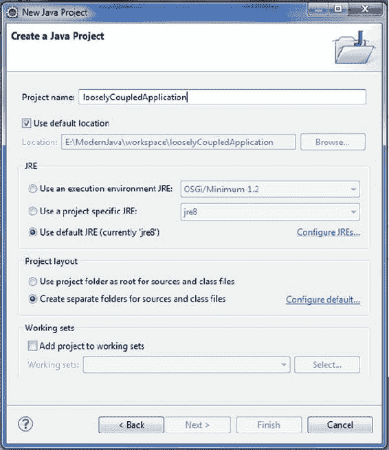

[图 5-2](#_Fig2) 。创建 Java 项目

现在您需要在项目中添加 Spring 框架和公共日志 API 库 。你可以从 http://projects.spring.io/spring-framework/[下载 Spring 框架库。您可以使用 Maven 来配置项目中的 Spring 框架，如前一章所述。使用 Maven 时，需要将以下内容添加到 pom.xml 文件中:](http://projects.spring.io/spring-framework/)

```java
<dependencies>
    <dependency>
        <groupId>org.springframework</groupId>
        <artifactId>spring-context</artifactId>
        <version>3.2.5.RELEASE</version>
    </dependency>
</dependencies>
```

使用 Maven 要容易得多，但是要知道您将在本节中创建的三个应用使用了哪些关键库，您可以在 Eclipse 中手动配置这些库。这些库可以在可下载的档案中找到，可以从该书的 press 网页上的源代码/下载标签中找到([www.apress.com/9781430259831](05.html))。

要将 Spring 框架添加到您的项目中，右键单击您的项目并选择 Build PathConfigure Build Path 以显示 Java Build Path 窗口，如图[图 5-3](#Fig3) 所示。现在添加您从 Apress 网站下载到文件系统中的外部 jar。

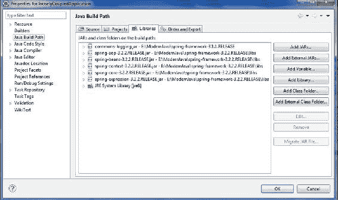

[图 5-3](#_Fig3) 。添加外部罐子T3】

现在让我们在 looselyCoupledApplication 项目下创建实际的源文件。首先我们需要创建一个名为 com.apress.decoupled 的包。为此，在 Package Explorer 部分右键单击 src，选择 New  Package，并创建包 com.apress.decoupled。然后创建 Vehicle.java、Car.java 和 Bike.java，这是在 com.apress.decoupled 包下的[清单 5-10](#list10) 、 [5-11](#list11) 和 [5-12](#list12) 中所示的代码。

然后创建 VehicleService 类，如清单 5-15 所示。

[清单 5-15](#_list15) 。松散耦合车辆服务

```java
1.    package com.apress.decoupled;
2.
3.    public class VehicleService {
4.
5.        private Vehicle vehicle;
6.
7.        public void setVehicle(Vehicle vehicle) {
8.            this.vehicle = vehicle;
9.        }
10.
11.        public void driver() {
12.            System.out.println(vehicle.drive());
13.
14.        }
15.
16.    }
17.
```

*   *第 7 行*:在[清单 5-15](#list15) 中，我们已经从 VehicleService 类中移除了总控制权，并将其保留在 XML 配置文件中，并且通过第 7 行的 setter 方法将依赖注入到 VehicleService 类中。

现在创建一个客户端类 VehicleApp，如清单 5-16 所示。

[清单 5-16](#_list16) 。车辆申请T3

```java
 1.    package com.apress.decoupled;
 2.    import org.springframework.context.ApplicationContext;
 3.    import org.springframework.context.support.ClassPathXmlApplicationContext;
 4.
 5.    public class VehicleApp {
 6.
 7.        public static void main(String[] args) {
 8.            ApplicationContext  context = new ClassPathXmlApplicationContext(
 9.                    "beans.xml");
10.            VehicleService contestService = (VehicleService) context
11.                    .getBean("vehicleService");
12.            contestService.driver();
13.        }
14.
15.    }
```

*   *第 8 到 9 行*:这几行实例化应用上下文并传递配置文件。
*   *第 10 行到第 11 行*:这几行从配置文件中获取 bean。要从 Bean 工厂或应用上下文中获取声明的 bean，您需要调用 getBean()方法 ，传入唯一的 bean 名称，并在使用之前将返回类型转换为其实际类型。

现在，您需要创建一个 bean 配置文件，这是一个连接 bean 的 XML 文件(如清单 5-17 所示)。

[清单 5-17](#_list17) 。配置文件

```java
 1.    <?xml version="1.0" encoding="UTF-8"?>
 2.    <beans fontname">http://www.springframework.org/schema/beans"
 3.           xmlns:xsi="http://www.w3.org/2001/XMLSchema-instance"
 4.           xsi:schemaLocation="http://www.springframework.org/schema/beans
 5.           http://www.springframework.org/schema/beans/spring-beans-3.0.xsd">
 6.    <bean id="car" class="com.apress.decoupled.Car" />
 7.    <bean id="bike" class="com.apress.decoupled.Bike" />
 8.    <bean id="vehicleService" class="com.apress.decoupled.VehicleService">
 9.    <property name="vehicle">
10.    <ref local="car" />
11.    </property>
12.    </bean>
13.    </beans>
```

您可以为 beans.xml 选择任何您喜欢的名称。您必须确保该文件在类路径中可用，并且在创建应用上下文时在主应用中使用相同的名称，如 VehicleApp.java 文件所示。[图 5-4](#Fig4) 显示了应用的目录结构。

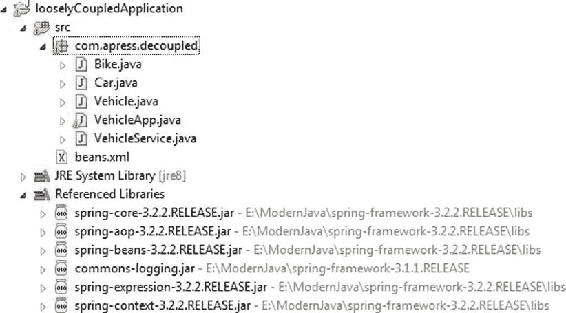

[图 5-4](#_Fig4) 。目录结构

使用 AOP 解决横切关注点

Spring 通过面向方面编程(AOP)实现了关注点的分离。AOP 将横切关注点封装在称为方面的独立的、可重用的组件中，并将它们添加到应用中。这个过程叫做*编织*。这导致内聚的组件专注于业务功能，而完全不知道系统服务，如日志、安全、事务等等。为了理解如何在 Spring 中应用方面，您现在将创建一个简单的 BookService 来检索所有书籍的列表，向 BookService 添加一个基本的日志方面。这个应用的代码可以在 Apress 网站的可下载文档中找到。清单 5-18 展示了图书服务。

[清单 5-18](#_list18) 。图书服务界面

```java
package com.apress.aop;

import java.util.List;

public interface BookService {
    public List<Book> getAllBooks();

}
```

[清单 5-19](#list19) 展示了这个图书服务的实现 。

[清单 5-19](#_list19) 。图书服务实施

```java
 1.    package com.apress.aop;
 2.
 3.    import java.util.ArrayList;
 4.    import java.util.List;
 5.
 6.    public class BookServiceImpl implements BookService{
 7.        private static List<Book> bookList;
 8.        static {
 9.
10.            Book book1 = new Book();
11.            book1.setId((long)1);
12.            book1.setBookTitle("Modern Java");
13.
14.            Book book2 = new Book();
15.            book2.setId((long)2);
16.            book2.setBookTitle("Beginning Groovy");
17.
18.            Book book3 = new Book();
19.            book3.setId((long)2);
20.            book3.setBookTitle("Beginning Scala");
21.
22.            bookList = new ArrayList<Book>();
23.            bookList.add(book1);
24.            bookList.add(book2);
25.            bookList.add(book3);
26.        }
27.
28.
29.        public List<Book> getAllBooks() {
30.            for(Book b: bookList){
31.                System.out.println("Books:"+b.getBookTitle());
32.            }
33.            return bookList;
34.        }
35.    }
```

BookServiceImpl 不关心日志记录。对于日志记录，创建一个如清单 5-20 所示的方面，它将被编织到 BookService 对象中，在任何需要的地方提供日志记录。

[清单 5-20](#_list20) 。伐木方面

```java
 1.    package com.apress.aop;
 2.
 3.    public class LoggingAspect {
 4.        public void logBefore() {
 5.
 6.            System.out.println("Before calling getAllBooks");
 7.        }
 8.
 9.        public void logAfter() {
10.            System.out.println("After calling getAllBooks");
11.        }
12.    }
13.
```

*   *第 3 行* : LoggingAspect 是一个简单的类，有两个方法。
*   *第 4 行*:调用 getAllBooks()之前应该调用的 logBefore()方法。
*   *第 9 行*:调用 getAllBooks()后应该调用的 logAfter()方法。

LoggingAspect 在没有 BookServiceImpl 要求的情况下完成它的工作。此外，因为 BookServiceImpl 不需要知道 LoggingAspect，所以不需要将 LoggingAspect 注入到 BookServiceImpl 中。这消除了 BookServiceImpl 代码中不必要的复杂性，即必须注入 LoggingAspect 并检查 LoggingAspect 是否为 null。您可能已经注意到，LoggingAspect 是一个 POJO。当它在 Spring 上下文中被声明为一个方面时，它就变成了一个方面。LoggingAspect 可以应用于 BookServiceImpl，而不需要 BookServiceImpl 显式调用它。事实上，BookServiceImpl 仍然完全不知道 LoggingAspect 的存在。要使 LoggingAspect 作为一个方面工作，您需要做的就是在 Spring 配置文件中将其声明为一个方面。清单 5-21 展示了将 LoggingAspect 声明为一个方面的应用上下文 XML 文件。

[清单 5-21](#_list21) 。配置文件

```java
 1.    <?xml version="1.0" encoding="UTF-8"?>
 2.    <beans fontname">http://www.springframework.org/schema/beans"
 3.        xmlns:xsi="http://www.w3.org/2001/XMLSchema-instance" xmlns:context=
           "http://www.springframework.org/schema/context"
 4.        xmlns:aop="http://www.springframework.org/schema/aop"
 5.        xsi:schemaLocation="http://www.springframework.org/schema/beans
 6.            http://www.springframework.org/schema/beans/spring-beans-3.2.xsd
 7.            http://www.springframework.org/schema/context
 8.            http://www.springframework.org/schema/context/spring-context-3.2.xsd
 9.            http://www.springframework.org/schema/aop
10.            http://www.springframework.org/schema/aop/spring-aop-3.2.xsd">
11.
12.
13.        <bean id="bookService" class="com.apress.aop.BookServiceImpl"/>
14.
15.        <bean id="logAspect" class="com.apress.aop.LoggingAspect"/>
16.
17.        <aop:config>
18.            <aop:aspect  ref = "logAspect">
19.                <aop:pointcut id = "log"
20.                    expression="execution(* *.getAllBooks())" />
21.                <aop:before  pointcut-ref = "log"
22.                    method="logBefore" />
23.                <aop:after  pointcut-ref = "log"
24.                    method="logAfter" />
25.            </aop:aspect>
26.        </aop:config>
27.    </beans>
```

*   *第 9 行到第 10 行*:您使用 Spring 的 aop 配置名称空间来声明 LoggingAspect bean 是一个方面。
*   *第 15 行*:您将 LoggingAspect 声明为一个 bean。即使 Spring 框架通过在上下文中将 POJO 声明为一个方面来将其转换为一个方面，它仍然必须被声明为一个 Spring < bean >。
*   *第 18 行*:然后你引用了< aop:aspect >元素中的那个 bean。
*   *第 19 到 20 行*:在前面的<切入点>元素中定义了切入点，并设置了一个表达式属性来选择应该在哪里应用通知。表达式语法是 AspectJ 的切入点表达式语言。
*   *第 21 行到第 22 行*:你声明(使用< aop:before >)在执行 getAllBooks()方法之前，应该调用 LoggingAspect 的 logBefore 方法。这叫做*之前的建议*。pointcut-ref 属性引用一个名为 log 的切入点。
*   *第 23 到 24 行*:你(使用< aop:after >)声明 logAfter 方法应该在 getAllBooks()执行之后被调用。这就是后知后觉的*。pointcut-ref 属性引用一个名为 log 的切入点。*

 *清单 5-22 展示了独立的 Java 应用。

[清单 5-22](#_list22) 。独立 Java 应用

```java
1.    package com.apress.aop;
2.    import org.springframework.context.ApplicationContext;
3.    import org.springframework.context.support.ClassPathXmlApplicationContext;
4.
5.    public class Driver {
6.
7.            public static void main(String...args){
8.        ApplicationContext context = new ClassPathXmlApplicationContext("beans.xml");
9.
10.        BookService bookService = (BookService)context.getBean("bookService");
11.                bookService.getAllBooks();
12.
13.            }
14.    }
```

[图 5-5](#Fig5) 说明了该应用的目录结构 。

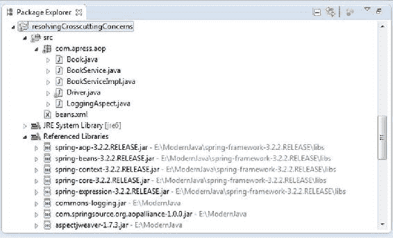

[图 5-5](#_Fig5) 。目录结构

因此，Spring AOP 可以被用来以声明的方式提供诸如事务和安全之类的服务，而不会打乱您的代码，首先，您的代码应该只关心它的业务功能。

使用模板删除样板代码

在第 1 章中，我们构建了书店应用的数据访问层，并在 BookDAOImpl 中使用纯 JDBC 来连接数据库。在本节中，您将看到 Spring 框架如何通过 Spring 的 JDBCTemplate 转换 BookDAOImpl，消除使用纯 JDBC 获得数据存储连接所产生的样板代码，并清理资源。这个应用的代码可以在 Apress 网站的可下载文档中找到。[清单 5-23](#list23) 展示了图书服务。

[清单 5-23](#_list23) 。图书服务

```java
package com.apress.books.service;

import java.util.List;

import com.apress.books.model.Book;

public interface BookService {
    public List<Book> getAllBooks();

}
```

清单 5-24 展示了 BookService 的实现。

[清单 5-24](#_list24) 。图书服务实施

```java
package com.apress.books.service;

import java.util.List;

import com.apress.books.dao.BookDAO;
import com.apress.books.model.Book;

public class BookServiceImpl implements BookService{

    private  BookDAO bookDao ;

    public void setBookDao(BookDAO bookDao) {
        this.bookDao = bookDao;
    }

    public List<Book> getAllBooks() {
        List<Book> bookList = bookDao.findAllBooks();

        return bookList;
    }
}
```

[清单 5-25](#list25) 说明了 BookDAO。

[清单 5-25](#_list25) 。书道T3】

```java
package com.apress.books.dao;

import java.util.List;

import com.apress.books.model.Book;
import com.apress.books.model.Category;

public interface BookDAO {
    public List<Book> findAllBooks();

}
```

清单 5-26 展示了 BookDAO 的实现。

[清单 5-26](#_list26) 。BookDAO 实现

```java
 1.    package com.apress.books.dao;
 2.
 3.    import java.sql.Connection;
 4.    import java.sql.DriverManager;
 5.    import java.sql.PreparedStatement;
 6.    import java.sql.ResultSet;
 7.    import java.sql.SQLException;
 8.    import java.sql.Statement;
 9.    import java.util.ArrayList;
10.    import java.util.List;
11.
12.    import javax.sql.DataSource;
13.
14.    import org.springframework.beans.factory.annotation.Autowired;
15.    import org.springframework.jdbc.core.JdbcTemplate;
16.
17.    import com.apress.books.model.Author;
18.    import com.apress.books.model.Book;
19.    import com.apress.books.model.Category;
20.
21.    public class BookDAOImpl implements BookDAO {
22.
23.
24.        DataSource dataSource;
25.
26.
27.        public void setDataSource(DataSource dataSource) {
28.            this.dataSource = dataSource;
29.        }
30.
31.        public List<Book> findAllBooks() {
32.          List<Book> bookList = new ArrayList<>();
33.
34.        String sql = "select * from book inner join author on book.id = author.book_id";
35.
36.        JdbcTemplate jdbcTemplate = new JdbcTemplate(dataSource);
37.        bookList = jdbcTemplate.query(sql, new BookRowMapper());
38.          return bookList;
39.         }
40.
41.    }
```

将 BookDAOImpl 的 findAllBooks()方法与第 1 章的 findAllBooks()方法进行比较，您将会看到 JDBCTemplate 消除了样板代码，这是使用纯 JDBC 来获得到我们的数据存储的连接并清理资源的结果。

*   *第 36 行*:使用传递给它的数据源创建一个 JDBCTemplate。注意，为了便于解释，JDBCTemplate 是以这种方式实例化的。在一个生产就绪的应用中，你应该像任何其他依赖一样注入 JDBCTemplate 作为一个依赖，如[清单 5-15](#list15) 中所解释的。
*   *第 37 行*:使用了行映射器实现。接下来解释 BookRowMapper。

[清单 5-27](#list27) 说明了 BookRowMapper 对象查询一行或多行，然后将每一行转换成相应的域对象，而不是检索单个值。

[清单 5-27](#_list27) 。书签器对象

```java
 1.    package com.apress.books.dao;
 2.
 3.    import java.sql.ResultSet;
 4.    import java.sql.SQLException;
 5.
 6.    import org.springframework.jdbc.core.RowMapper;
 7.
 8.    import com.apress.books.model.Book;
 9.
10.    public class BookRowMapper implements RowMapper<Book> {
11.
12.         @Override
13.         public Book mapRow(ResultSet resultSet, int line) throws SQLException {
14.          BookExtractor bookExtractor = new BookExtractor();
15.          return bookExtractor.extractData(resultSet);
16.         }
17.
18.        }
```

*   *Line 10* : Spring 的 RowMapper < T >接口(在 org.springframework.jdbc.core 包下)提供了一个简单的方法来执行从 jdbc 结果集到 POJOs 的映射。
*   *第 14 行*:使用 BookExtractor 提取数据。

清单 5-28 展示了 BookExtractor 对象。

[清单 5-28](#_list28) 。【BookExtractor 对象

```java
 1.    package com.apress.books.dao;
 2.
 3.    import java.sql.ResultSet;
 4.    import java.sql.SQLException;
 5.    import java.util.ArrayList;
 6.    import java.util.List;
 7.
 8.    import org.springframework.dao.DataAccessException;
 9.    import org.springframework.jdbc.core.ResultSetExtractor;
10.
11.    import com.apress.books.model.Author;
12.    import com.apress.books.model.Book;
13.
14.    public class BookExtractor implements ResultSetExtractor<Book> {
15.
16.         public Book extractData(ResultSet resultSet) throws SQLException,
17.           DataAccessException {
18.
19.          Book book = new Book();
20.          Author author = new Author();
21.        List<Author> authorList = new ArrayList<>();
22.
23.          book.setId(resultSet.getLong(1));
24.          book.setCategoryId(resultSet.getLong(2));
25.          book.setBookTitle(resultSet.getString(3));
26.          book.setPublisherName(resultSet.getString(4));
27.          book.setAuthorId(resultSet.getLong(5));
28.          author.setBookId(resultSet.getLong(6));
29.          author.setFirstName(resultSet.getString(7));
30.          author.setLastName(resultSet.getString(8));
31.          authorList.add(author);
32.          book.setAuthors(authorList);
33.
34.          return book;
35.         }
36.
37.        }
```

*   *第 14 行* : BookExtractor 实现 Spring 提供的 ResultSetExtractor(在 org.springframework.jdbc.core 包下)。RowMapper 仅适用于映射到单个域对象。但是由于我们在第 34 行连接了[清单 5-26](#list26) 中的两个表，我们需要使用 ResultSetExtractor 接口 将数据转换成一个嵌套的域对象。

清单 5-29 展示了这个独立应用的配置文件。

[清单 5-29](#_list29) 。配置文件

```java
 1.    <?xml version="1.0" encoding="UTF-8"?>
 2.    <beans fontname">http://www.springframework.org/schema/beans"
 3.        xmlns:xsi="http://www.w3.org/2001/XMLSchema-instance"xmlns:context=
           "http://www.springframework.org/schema/context"
 4.        xmlns:aop="http://www.springframework.org/schema/aop"
 5.        xsi:schemaLocation="http://www.springframework.org/schema/beans
 6.            http://www.springframework.org/schema/beans/spring-beans-3.2.xsd
 7.            http://www.springframework.org/schema/context
 8.            http://www.springframework.org/schema/context/spring-context-3.2.xsd
 9.            http://www.springframework.org/schema/aop
10.            http://www.springframework.org/schema/aop/spring-aop-3.2.xsd">
11.
12.            <!-- telling container to take care of annotations stuff -->
13.    <context:annotation-config />
14.
15.    <!-- declaring base package -->
16.    <context:component-scan base-package="com.apress.books" />
17.
18.
19.        <bean id="dao" class="com.apress.books.dao.BookDAOImpl" >
20.        <property name="dataSource" ref="dataSource">
21.            </property>
22.        </bean>
23.
24.        <bean id="service" class="com.apress.books.service.BookServiceImpl">
25.            <property name="bookDao" ref="dao">
26.            </property>
27.        </bean>
28.
29.        <bean id="dataSource"
30.      class="org.springframework.jdbc.datasource.DriverManagerDataSource">
31.    <property name="driverClassName" value="com.mysql.jdbc.Driver" />
32.    <property name="url" value="jdbc:mysql://localhost:3306/books" />
33.    <property name="username" value="root" />
34.    <property name="password" value="password" />
35.    </bean>
36.    </beans>
```

*   *第 20 行*:用数据源T3 配置 dao

这样，Spring 框架消除了样板代码。现在有了独立的 Java 应用，您可以查询我们使用 Spring 框架构建的新数据访问层。清单 5-30 说明了通过服务层组件 BookService 查询数据访问的独立 Java 应用。

[清单 5-30](#_list30) 。单机应用

```java
package com.apress.books.client;
import java.util.List;
import org.springframework.context.ApplicationContext;
import org.springframework.context.support.ClassPathXmlApplicationContext;
import com.apress.books.model.Book;
import com.apress.books.service.BookService;

public class BookApp {

    public static void main(String[] args) {
        ApplicationContext context = new ClassPathXmlApplicationContext("beans.xml");
        BookService bookService = (BookService)context.getBean("service");
        // List all books
        System.err.println("Listing all Books:");
        List<Book> bookList= bookService.getAllBooks();
        for(Book b: bookList){
            System.out.println(b.getId()+"--"+b.getBookTitle());
        }
    }
}
```

在本节中，您了解了 Spring 框架的关键目标，该框架旨在通过紧密耦合、横切关注点和样板代码来简化任何企业应用的复杂性。下一节，我们将使用 Spring 框架的 web MVC 模块 实现 Web 层。

用 Spring Web MVC 构建 Web 应用

在第 1 章中，Spring Web MVC 提供了模型-视图-控制器架构和无数的组件，共同帮助你开发基于 Spring IoC 容器的松散耦合的 Web 应用。

Spring Web MVC 架构

Spring 的 web MVC 框架像许多其他 Web MVC 框架一样，是请求驱动的，围绕一个名为 DispatcherServlet 的中央 Servlet 设计，该 servlet 将请求分派给控制器，并提供其他功能来促进 Web 应用的开发。DispatcherServlet 实现了 Java EE web 层模式之一，称为前端控制器。因此，DispatcherServlet 充当 Spring MVC 框架的前端控制器，每个 web 请求都必须经过它，这样它才能控制和管理整个请求处理过程。Spring Web MVC DispatcherServlet 的请求处理工作流程如图[图 5-6](#Fig6) 所示。

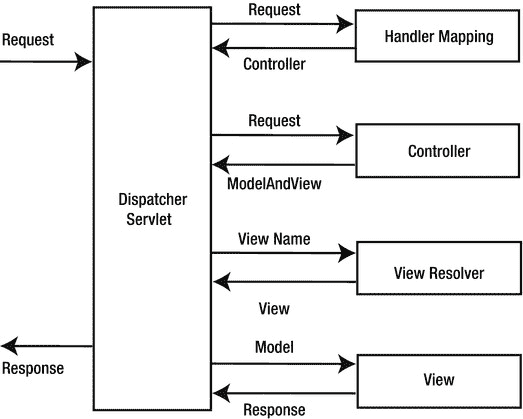

[图 5-6](#_Fig6) 。Spring Web MVC DispatcherServlet 的请求处理工作流

从[图 5-6](#Fig6) 开始，工作流程的高级概述如下:

1.  客户端以 HTTP 请求的形式向 web 容器发送请求。
2.  DispatcherServlet 截获请求，找出适当的处理程序映射。
3.  在如此计算出的处理程序映射的帮助下，DispatcherServlet 将请求分派给适当的控制器。
4.  控制器处理请求并将模型和视图对象以 model and view 实例的形式返回给 DispatcherServlet。
5.  DispatcherServlet 然后通过查询 ViewResolver 对象解析视图(可以是 JSP、FreeMarker、Velocity 等等)。
6.  然后，将所选视图呈现回客户端。

DispatcherServlet 是 Spring Web MVC 框架的核心，但是在深入研究 DispatcherServlet 之前，首先必须了解 Web 应用中的 ApplicationContext。如前所述，web 应用有自己专门的 WebApplicationContext，必须在初始化 DispatcherServlet 之前加载。当 Spring Web MVC 应用启动时，在 Web 应用准备好服务请求之前，WebApplicationContext 和 DispatcherServlet 开始工作，如下所述:

1.  servlet 容器初始化 web 应用，然后触发 contextInitialized 事件，该事件由 ContextLoaderListener 侦听。
2.  ContextLoaderListener 创建根 WebApplicationContext。
3.  DispatcherServlet 被初始化，创建自己的 WebApplicationContext 并将其嵌套在根 WebApplicationContext 中。
4.  DispatcherServlet 搜索组件，如 ViewResolvers 和 HandlerMappings。如果找到一个组件，它将被初始化；否则，组件的默认值将被初始化。

在接下来的小节中，您将更详细地了解这些步骤。

文对象

在 web 应用中，使用的 ApplicationContext 称为 WebApplicationContext ，它是一个专用的 ApplicationContext，能够感知 servlet 环境。它是 web 应用中的根 ApplicationContext，必须在 DispatcherServlet 初始化之前加载，以确保 web 应用所需的所有服务(如数据源)都可用。使用 ContextLoaderListener 在 web.xml 文件中配置 WebApplicationContext，如[清单 5-31](#list31) 所示。

[清单 5-31](#_list31) 。在 web.xml 中配置 ContextLoaderListener

```java
<listener>
<listener-class>
org.springframework.web.context.ContextLoaderListener
</listener-class>
</listener>
```

默认情况下，ContextLoaderListener 加载存储在 WEB-INF 目录中的应用上下文文件。这个位置可以通过在 web.xml 中定义 contextConfigLocation 上下文参数来覆盖，如[清单 5-32](#list32) 所示。

[清单 5-32](#_list32) 。使用 contextConfigLocation 参数的文件位置

```java
<context-param>
<param-name>contextConfigLocation</param-name>
<param-value>
classpath:service-context.xml
classpath:data-access-context.xml
</param-value>
</context-param>
```

此时，web.xml 中 WebApplicationContext 的配置看起来像是[清单 5-33](#list33) 。

[清单 5-33](#_list33) 。带有 ContextLoaderListener 和 contextConfigLocation 的 Web.xml

```java
<context-param>
<param-name>contextConfigLocation</param-name>
<param-value>
classpath:service-context.xml
classpath:data-access-context.xml
</param-value>
</context-param>
<listener>
<listener-class>
org.springframework.web.context.ContextLoaderListener
</listener-class>
</listener>
```

**注意**如果没有指定名为 contextConfigLocation 的<上下文参数>，默认情况下，ContextLoaderListener 会查找/we b-INF/application context . XML 文件。

现在，您已经知道如何在 web 应用中配置 WebApplicationContext，我们可以继续讨论第二个对象 DispatcherServlet，它是在 web.xml 文件中配置的。

调度员服务网

与任何 servlet 一样，DispatcherServlet 需要在 web.xml 中进行配置，以便能够处理请求。配置和使用 DispatcherServlet 需要满足以下要求:

1.  您必须指示容器加载 DispatcherServlet 并将其映射到 URL 模式 。
2.  加载 DispatcherServlet 后，它会创建自己的 org . spring framework . web . context . webapplicationcontext。
3.  DispatcherServlet 然后从这个应用上下文中检测 SpringMVC 组件，如果没有找到，它将使用缺省值。这些 SpringMVC 组件和它们的缺省值将在后面解释。
4.  DispatcherServlet 然后根据请求将任务委派给每个 SpringMVC 组件(或它们的缺省值)。

**注意** DispatcherServlet 创建自己的 WebApplicationContext，其中包含特定于 web 的组件，如控制器和 ViewResolver。然后，此 WebApplicationContext 嵌套在根 WebApplicationContext 中，该根 WebApplicationContext 在 DispatcherServlet 初始化之前加载，以确保 DispatcherServlet 的 WebApplicationContext 中的 web 组件可以找到它们的依赖项。

与任何其他 Servlet 一样，DispatcherServlet 是在 web 应用的 web.xml 文件中声明的。您需要通过在同一个 web.xml 文件中使用 URL 映射来映射希望 DispatcherServlet 处理的请求。清单 5-34 展示了 DispatcherServlet 声明和映射。

[清单 5-34](#_list34) 。声明和映射 DispatcherServlet

```java
<web-app>
<servlet>
<servlet-name>bookstore</servlet-name>
<servlet-class>org.springframework.web.servlet.DispatcherServlet</servlet-class>
<load-on-startup>1</load-on-startup>
</servlet>
<servlet-mapping>
<servlet-name>bookstore</servlet-name>
<url-pattern>/bookstore/*</url-pattern>
</servlet-mapping>
</web-app>
```

在 Servlet 3.0 和更新的环境中，您还可以使用 WebApplicationInitializer(Spring MVC 框架提供的一个接口)以编程方式配置 Servlet 容器。清单 5-35 展示了前面的 web.xml 示例的等效程序。

[清单 5-35](#_list35) 。相当于[清单 5-43](#list43) 的程序

```java
public class ExampleWebApplicationInitializer implements WebApplicationInitializer {
    @Override
    public void onStartup(ServletContext container) {
        ServletRegistration.Dynamic registration = container.addServlet("dispatcher", new DispatcherServlet());
        registration.setLoadOnStartup(1);
        registration.addMapping("/bookstore/*");
    }
}
```

默认情况下，DispatcherServlet 会查找一个名为 WEB-INF/ <servlet-name>-servlet.xml 的文件，其中的<servlet-name>被替换为在 web.xml 的<servlet-name>标记中声明的值。DispatcherServlet 使用这个 <servlet-name>-servlet.xml 文件来创建 WebApplicationContext。</servlet-name></servlet-name></servlet-name></servlet-name>

Spring MVC 组件

如前所述，DispatcherServlet 从它创建的 WebApplicationContext 中搜索 SpringMVC 组件，如果没有找到，就使用默认的。这些 Spring MVC 组件被表示为接口。表 5-6 给出了请求处理工作流中涉及的所有主要组件类型的概述。

[表 5-6](#_Tab6) 。Spring MVC 组件

<colgroup><col width="30%" class="calibre14"> <col width="70%" class="calibre14"></colgroup> 
| 

豆类

 | 

说明

 |
| --- | --- |
| 的配置 | 将传入的请求映射到处理程序和拦截程序 |
| 处理器适配器 | 用于扩展 DispatcherServlet 以定制 web 工作流 |
| 处理器异常解析器 | 将异常映射到视图 |
| 视图解析器 | 将逻辑视图名称解析为实际视图 |
| LocaleResolver | 解析客户端用于国际化视图的区域设置 |
| 主题解析器 | 解析个性化布局的主题 |
| 多重解析器 | 解析文件上传的多部分 |
| FlashMapManager | 支持 FlashMap 将属性从一个请求传递到另一个请求 |

Spring DispatcherServlet 使用需要在 WebApplicationContext 中配置的 Spring MVC 组件来处理请求。但是，如果不配置这些组件，Spring Web MVC 会使用默认组件。[表 5-7](#Tab7) 列出了组件的默认实现。

[表 5-7](#_Tab7) 。DispatcherServlet 的默认组件

<colgroup><col width="45%" class="calibre14"> <col width="55%" class="calibre14"></colgroup> 
| 

成分

 | 

默认实现

 |
| --- | --- |
| 多重解析器 | 无违约；需要显式配置 |
| LocaleResolver | AcceptHeaderLocaleResolver |
| 主题解析器 | FixedThemeResolver |
| 的配置 | beannameurlhandlermapping 对映
defaultannotationandhandler 对映 |
| 处理器适配器 | HttpRequestHandlerAdapter
SimpleControllerHandlerAdapter
AnnotationMethodHandlerAdapter |
| 处理器异常解析器 | annotation method handler exception resolve
response status exception resolve
default handler exception resolve |
| RequestToViewNameTranslator | DefaultRequestToViewNameTranslator |
| 视图解析器 | InternalResourceViewResolver |
| FlashMapManager | SessionFlashMapManager |

Spring Web MVC 应用入门

在这一节中，我将带您浏览使用 Spring Tool Suite(一个基于 Eclipse 的 IDE)创建 Hello World Spring MVC 应用的步骤。在构建示例应用时，您将学习 Spring MVC 的基本概念。该应用中使用的工具包括:

*   Spring 框架
*   Spring 工具套件 IDE 3.2.0(基于 Eclipse Juno 4.2.2)
*   v fabric TC Server Developer Edition v 2.8(基于 Apache Tomcat 并针对 Spring 应用进行了优化)

Spring Tool Suite (STS) 是一个基于 Eclipse 的 IDE，由 SpringSource 社区积极开发和维护。STS 提供了 Spring Batch、Spring Integration、Spring Persistence(Hibernate+JPA)、Spring MVC 等项目模板。此外，STS 总是从 Maven 存储库中获得 Spring 工件的最新更新。

您可以选择以下三种方式下载并安装 STS:

*   从安装程序下载并安装 STS。
*   通过 Eclipse 更新安装 STS。
*   下载并解压 zip 存档文件。

在您自己的工作空间中启动 STS。从主菜单中选择文件新建 Spring 模板项目(参见[图 5-7](#Fig7) )。

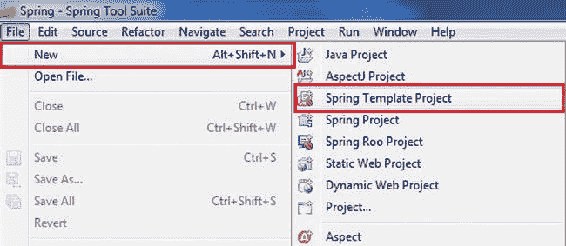

[图 5-7](#_Fig7) 。选择 SpringTemplate 项目

在新建模板项目对话框中，选择 Spring MVC 项目(参见[图 5-8](#Fig8) )。

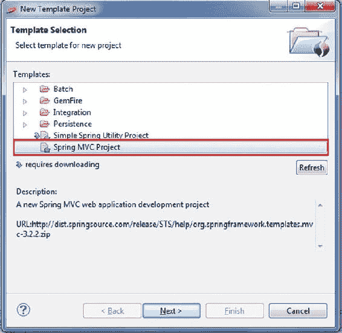

[图 5-8](#_Fig8) 。选择 SpringMVC 项目

点击下一步，需要下载模板的更新，如图[图 5-9](#Fig9) 所示(第一次使用该模板或有更新时)。

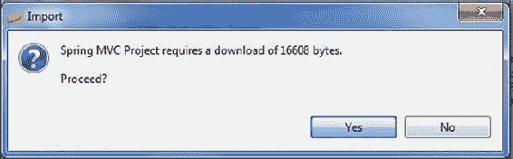

[图 5-9](#_Fig9) 。下载更新

单击 Yes 下载更新，这将打开新的 Spring MVC 项目对话框。

在[图 5-10](#Fig10) 所示的窗口中输入以下信息:

*   *项目名称* : **helloworld**
*   *顶层包*:**com . a press . hello world**

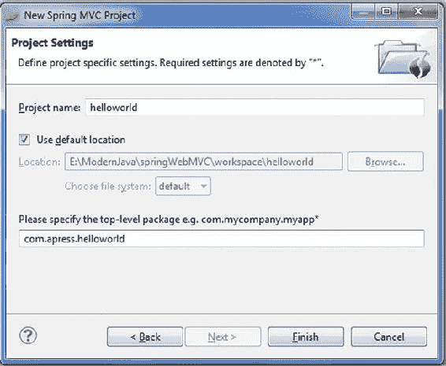

[图 5-10](#_Fig10) 。新建 Spring MVC 项目对话框

单击 Finish，STS 将创建一个基于 Spring MVC 的项目,其中包含一些控制器、视图和配置的默认值。我们还没有写任何代码，但是应用已经准备好部署和运行了。

在 Servers 视图中右键单击并选择 New  Server。

在“新建服务器”对话框中，选择 VMware  VMware vFabric tc 服务器...，如图[图 5-11](#Fig11) 所示。

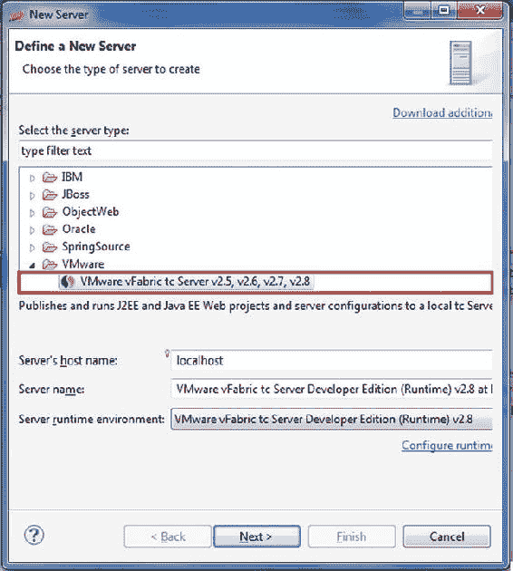

[图 5-11](#_Fig11) 。定义新服务器

单击下一步。在下一个屏幕上，保持选择“创建新实例”选项(见[图 5-12](#Fig12) )。

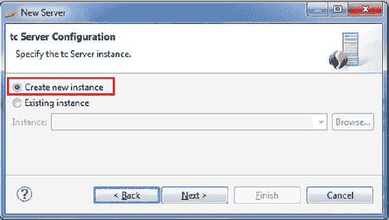

[图 5-12](#_Fig12) 。创建新实例

单击下一步。在下一个屏幕上，键入 **tcServer** 作为新实例的名称，并选择 base 作为模板(参见[图 5-13](#Fig13) )。

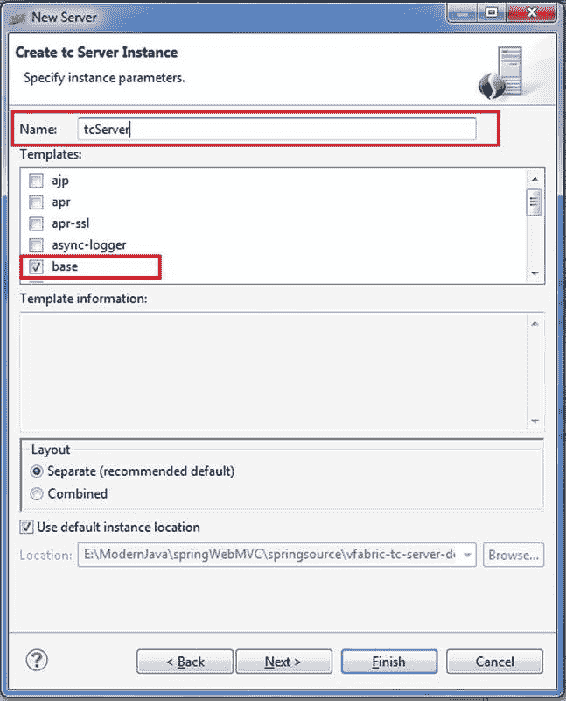

[图 5-13](#_Fig13) 。指定实例参数

添加 helloworld 并点击完成以完成服务器设置(参见[图 5-14](#Fig14) )。现在部署 helloworld 应用。

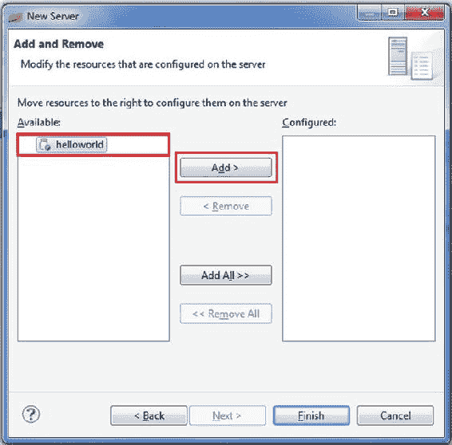

[图 5-14](#_Fig14) 。在服务器上配置资源

如果我们在服务器名称下看到应用，那么它就部署在服务器上，如图[图 5-15](#Fig15) 所示。

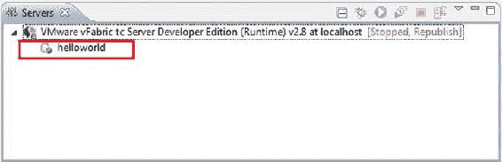

[图 5-15](#_Fig15) 。部署的应用

启动服务器，使用 URL[http://localhost:8080/hello world](http://localhost:8080/helloworld)运行应用(参见[图 5-16](#Fig16) )。

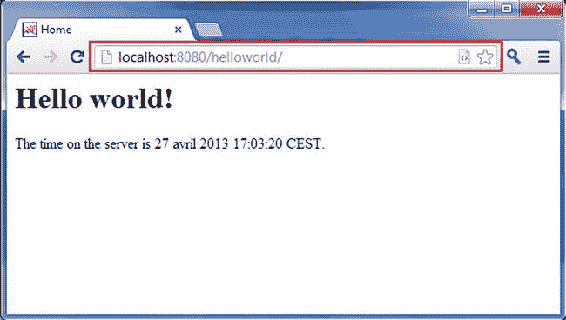

[图 5-16](#_Fig16) 。运行应用

现在让我们探索一下 Spring MVC 项目模板创建了什么。展开项目浏览器视图中的分支，查看项目的结构，如图 5-17 所示。

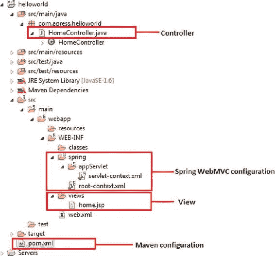

[图 5-17](#_Fig17) 。Hello World 应用的目录结构

我们将仔细检查图 5-17 中所示的每个组件。[图 5-18](#Fig18) 说明了生成的 web.xml 文件的内容。

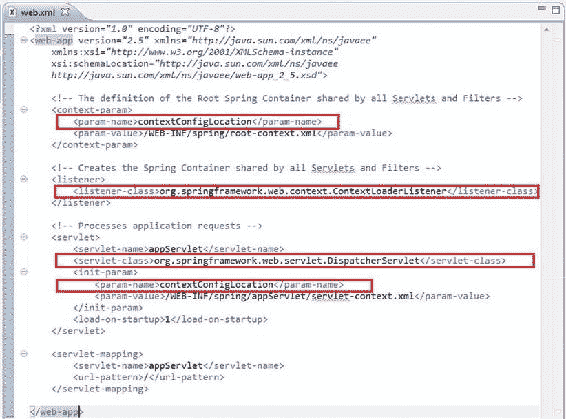

[图 5-18](#_Fig18) 。生成的 web.xml

这是基于 Spring MVC 的应用的典型配置，声明如下:

*   Spring's ContextLoaderListener
*   春天的调度员服务网
*   Spring 配置文件 root-context.xml
*   弹簧配置文件 servlet-context.xml
*   Spring 的 DispatcherServlet 的 URL 映射

我们将看看其中每一个的用法，但在此之前，我们将修改 web.xml。在 Spring MVC 模板项目中，它生成的 web.xml 文件支持 Servlet 2.5。在本章中，我们将使用 Servlet 3.0(STS 附带的 tcServer 构建在 Apache Tomcat 7 之上，后者已经支持 Servlet 3.0)，因此我们也需要将 XML 头从 2.5 更改为 3.0。[清单 5-36](#list36) 显示了修改后的<网络应用>标签。

[清单 5-36](#_list36) 。Spring MVC 的 Web 部署描述

```java
 1.    <?xml version="1.0" encoding="UTF-8"?>
 2.    <web-app fontname">http://java.sun.com/xml/ns/javaee" xmlns:xsi=
       "http://www.w3.org/2001/XMLSchema-instance"
 3.        xsi:schemaLocation="http://java.sun.com/xml/ns/javaee
           http://java.sun.com/xml/ns/javaee/web-app_3_0.xsd"
 4.        version="3.0">
 5.
 6.        <!-- The definition of the Root Spring Container shared by all Servlets and Filters -->
 7.        <context-param>
 8.            <param-name>contextConfigLocation</param-name>
 9.            <param-value>/WEB-INF/spring/root-context.xml</param-value>
10.        </context-param>
11.
12.        <!-- Creates the Spring Container shared by all Servlets and Filters -->
13.        <listener>
14.            <listener-class>org.springframework.web.context.ContextLoaderListener</listener-class>
15.        </listener>
16.
17.        <!-- Processes application requests -->
18.        <servlet>
19.            <servlet-name>appServlet</servlet-name>
20.            <servlet-class>org.springframework.web.servlet.DispatcherServlet</servlet-class>
21.            <init-param>
22.                <param-name>contextConfigLocation</param-name>
23.                <param-value>/WEB-INF/spring/appServlet/servlet-context.xml</param-value>
24.            </init-param>
25.            <load-on-startup>1</load-on-startup>
26.        </servlet>
27.
28.        <servlet-mapping>
29.            <servlet-name>appServlet</servlet-name>
30.            <url-pattern>/</url-pattern>
31.        </servlet-mapping>
32.
33.    </web-app>
```

*   *第 2 行到第 4 行*:在< web-app >标签中，版本属性和对应的 URL 被修改为 3.0 版本，向 web 容器表明 web 应用将使用 Servlet 3.0。
*   *第 7 行到第 10 行*:在< context-param >标签中，提供了 contextConfigLocation 参数，定义了 Spring 的根 WebApplicationContext 配置文件的位置。
*   *第 13 行到第 15 行*:定义了一个类 org . spring framework . web . context . context loader listener 的监听器。这是为了让 Spring 加载根 WebApplicationContext。
*   *第 18 到 26 行*:定义了一个调度器 servlet(称为 appServlet) 。我们使用模板项目为应用的表示层生成的那个。dispatcher servlet 的 WebApplicationContext 位于/src/main/WEB app/we b-INF/spring/app servlet/servlet-context . XML。

servlet-context.xml 文件由 Spring 的 DispatcherServlet 加载，它接收所有进入应用的请求。清单 5-37 展示了 servlet-context.xml

[清单 5-37](#_list37) 。Hello World 应用的 servlet-context.xml

```java
 1.    <?xml version="1.0" encoding="UTF-8"?>
 2.    <beans:beans fontname">http://www.springframework.org/schema/mvc"
 3.        xmlns:xsi="http://www.w3.org/2001/XMLSchema-instance"
 4.        xmlns:beans="http://www.springframework.org/schema/beans"
 5.        xmlns:context="http://www.springframework.org/schema/context"
 6.        xsi:schemaLocation="http://www.springframework.org/schema/mvc
 7.        http://www.springframework.org/schema/mvc/spring-mvc.xsd
 8.            http://www.springframework.org/schema/beans
 9.            http://www.springframework.org/schema/beans/spring-beans.xsd
10.            http://www.springframework.org/schema/context
11.            http://www.springframework.org/schema/context/spring-context.xsd">
12.
13.        <!-- DispatcherServlet Context: defines this servlet's request-processing
14.        infrastructure -->
15.
16.        <!-- Enables the Spring MVC @Controller programming model -->
17.        <annotation-driven />
18.
19.        <!-- Handles HTTP GET requests for /resources/** by efficiently serving up
20.        static resources in the ${webappRoot}/resources directory -->
21.        <resources mapping="/resources/**" location="/resources/" />
22.
23.        <!-- Resolves views selected for rendering by @Controllers to .jsp resources
24.        in the /WEB-INF/views directory -->
25.        <beans:bean class="org.springframework.web.servlet.view.InternalResourceViewResolver">
26.            <beans:property name="prefix" value="/WEB-INF/views/" />
27.            <beans:property name="suffix" value=".jsp" />
28.        </beans:bean>
29.
30.        <context:component-scan   base-package="com.apress.helloworld" />
31.
32.
33.
34.    </beans:beans>
```

*   *第 17 行* : <注释驱动/ > 告诉框架使用基于注释的方法来扫描包中的文件。因此，我们可以对控制器类使用@Controller 注释，而不是声明 XML 元素。
*   *第 21 行* : <资源映射=.../ > 直接用 HTTP GET 请求映射静态资源。例如，图像、JavaScript 和 CSS 资源不必通过控制器。
*   *第 25 行到第 28 行*:这个 bean 声明告诉框架如何根据控制器返回的逻辑视图名，通过给视图名附加前缀和后缀来找到物理 JSP 文件。例如，如果控制器的方法返回 home 作为逻辑视图名，那么框架将在/WEB-INF/views 目录下找到一个物理文件 home.jsp。
*   *第 30 行* : <上下文:组件扫描.../ >告诉框架在使用基于注释的策略时要扫描哪些包。在这里，框架将扫描包 com.apress.helloworld 下的所有类。当应用增长时，您可以为业务 beans、DAOs 、事务等添加更多配置。

现在，我们已经有了检测将处理请求的控制器的基础设施，是时候看看控制器了。

**注意**在 Spring 2.5 之前，使用了一种基于接口的控制器。从 Spring 3.0 开始，基于接口的控制器被弃用，取而代之的是带注释的类。

清单 5-38 展示了 STS 生成的控制器类 HomeController 的代码。

[清单 5-38](#_list38) 。Hello World 应用的 HomeController

```java
 1.    package com.apress.helloworld;
 2.
 3.    import java.text.DateFormat;
 4.    import java.util.Date;
 5.    import java.util.Locale;
 6.
 7.    import org.slf4j.Logger;
 8.    import org.slf4j.LoggerFactory;
 9.    import org.springframework.stereotype.Controller;
10.    import org.springframework.ui.Model;
11.    import org.springframework.web.bind.annotation.RequestMapping;
12.    import org.springframework.web.bind.annotation.RequestMethod;
13.
14.    /**
15.     * Handles requests for the application home page.
16.     */
17.    @Controller
18.    public class HomeController {
19.
20.        private static final Logger logger = LoggerFactory.getLogger(HomeController.class);
21.
22.        /**
23.         * Simply selects the home view to render by returning its name.
24.         */
25.        @RequestMapping(value = "/", method = RequestMethod.GET)
26.        public  String  home(Locale locale, Model model) {
27.            logger.info("Welcome home! The client locale is {}.", locale);
28.
29.            Date date = new Date();
30.            DateFormat dateFormat = DateFormat.getDateTimeInstance(DateFormat.LONG,
               DateFormat.LONG, locale);
31.
32.            String formattedDate = dateFormat.format(date);
33.
34.            model.addAttribute("serverTime", formattedDate );
35.
36.            return "home";
37.        }
38.
39.    }
```

*   *第 17 行*:@ Controller 注释用于指定这个类是一个 Spring 控制器。DispatcherServlet 通过@RequestMapping 注释扫描这种带注释的类，以查找映射的处理程序方法。
*   *第 25 行*:@ request mapping 注释指定 home()方法将处理带有 URL /(应用的默认页面)的 GET 请求。
*   *第 26 行到第 37 行*:home()方法创建一个字符串对象来保存基于当前地区的当前日期，并将这个对象添加到模型中，并命名为 serverTme 。最后，该方法返回一个名为 home 的视图，它将由 servlet-context.xml 文件中指定的视图解析器进行解析，以找到实际的视图文件。在一个控制器类中，我们可以编写许多方法来处理不同的 URL。

@Controller 和@RequestMapping 以及许多其他注释构成了 Spring MVC 实现的基础。要在 Spring 3.0 和更新版本中定义控制器类，必须用@Controller 注释标记该类。当@Controller 注释的类收到请求时，它会寻找合适的处理方法来处理请求。请求要映射到的每个方法都用@RequestMapping 注释修饰，使该方法成为一个处理程序方法，请求通过处理程序映射映射到该方法。

正如您在[清单 5-38](#list38) 中看到的，HomeController 中的 home()方法返回一个名为 home 的视图，该视图由 servlet-context.xml 中指定的视图解析器解析。现在是时候查看视图了，这是在/WEB-INF/views 目录中生成的 home.jsp 文件。[清单 5-39 显示了 home.jsp 的](#list39)。

[清单 5-39](#_list39) 。Hello World 应用的 home.jsp

```java
 1.    <%@ taglib uri="http://java.sun.com/jsp/jstl/core" prefix="c" %>
 2.    <%@ page session="false" %>
 3.    <html>
 4.    <head>
 5.        <title>Home</title>
 6.    </head>
 7.    <body>
 8.    <h1>
 9.        Hello world!
10.    </h1>
11.
12.    <P>  The time on the server is ${serverTime}. </P>
13.    </body>
14.    </html>
```

[清单 5-39](#list39) 看起来很熟悉。这是一个简单的 JSP 文件，它在第 12 行使用一个 EL 表达式来打印控制器传递的变量 serverTime 的值。

您可能已经注意到，STS 创建了两个 Spring 配置文件 : root-context.xml 和 servlet-context.xml。我们还没有查看 root-context.xml，因为我们的 Hello World 应用不需要这个文件来显示 home.jsp 的内容。该文件默认为空，如图[图 5-19](#Fig19) 所示。

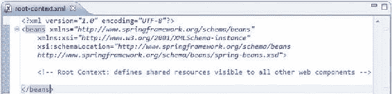

[图 5-19](#_Fig19) 。生成的 root-context.xml

顾名思义，这个文件指定了 Spring 容器的根配置。root-context.xml 文件由 Spring 的 ContextLoaderListener 在应用启动时加载，正如您在上一节中所了解的。

到目前为止，我们已经浏览了由 Spring MVC 项目模板生成的所有文件，因此您应该有足够的能力来更深入地学习，一路构建书店应用。

在书店应用中实现 Spring Web MVC

在本节中，您将学习如何使用 Spring Web MVC 框架开发书店 web 应用。该应用的代码可以从 Apress 网站下载。如前所述，所有传入的请求都流经 DispatcherServlet。因此，像 Java EE 应用中的任何其他 servlet 一样，Java EE 容器需要被通知在启动时通过 web.xml 加载这个 servlet。[清单 5-40](#list40) 展示了书店应用的 web.xml。

[清单 5-40](#_list40) 。web.xml

```java
 1.    <?xml version="1.0" encoding="UTF-8"?>
 2.    <web-app fontname">http://java.sun.com/xml/ns/javaee" xmlns:xsi=
       "http://www.w3.org/2001/XMLSchema-instance"
 3.        xsi:schemaLocation="http://java.sun.com/xml/ns/javaee
           http://java.sun.com/xml/ns/javaee/web-app_3_0.xsd"
 4.        version="3.0">
 5.        <!-- Processes application requests -->
 6.        <servlet>
 7.            <servlet-name>bookstore</servlet-name>
 8.            <servlet-class>org.springframework.web.servlet.DispatcherServlet</servlet-class>
 9.            <init-param>
10.                <param-name>contextConfigLocation</param-name>
11.                <param-value>/WEB-INF/spring/bookstore/bookstore-servlet.xml</param-value>
12.            </init-param>
13.            <load-on-startup>1</load-on-startup>
14.        </servlet>
15.
16.        <servlet-mapping>
17.            <servlet-name>bookstore</servlet-name>
18.            <url-pattern>*.html</url-pattern>
19.        </servlet-mapping>
20.
21.        <welcome-file-list>
22.            <welcome-file>/list_book.html</welcome-file>
23.        </welcome-file-list>
24.    </web-app>
```

*   *第 7 行到第 8 行* : DispatcherServlet 注册为一个名为 bookstore 的 Servlet。
*   *第 10 行*:可以在 contextConfigLocation servlet 参数中明确指定 Spring 配置文件，要求 Spring 加载默认< servletname > -servlet.xml 之外的配置

清单 5-41 展示了 bookstore-servlet.xml。

[清单 5-41](#_list41) 。书店-servlet.xml

```java
 1.    <?xml version="1.0" encoding="UTF-8"?>
 2.    <beans:beans fontname">http://www.springframework.org/schema/mvc"
 3.        xmlns:xsi="http://www.w3.org/2001/XMLSchema-instance" xmlns:beans=
           "http://www.springframework.org/schema/beans"
 4.        xmlns:context="http://www.springframework.org/schema/context"
 5.        xsi:schemaLocation="http://www.springframework.org/schema/mvc
           http://www.springframework.org/schema/mvc/spring-mvc.xsd
 6.            http://www.springframework.org/schema/beanshttp://www.springframework.org/schema/
               beans/spring-beans.xsd
 7.            http://www.springframework.org/schema/contexthttp://www.springframework.org/schema/
               context/spring-context.xsd">
 8.
 9.        <!-- DispatcherServlet Context: defines this servlet's request-processing
10.            infrastructure -->
11.
12.        <beans:bean name="/list_book.html"
13.            class="com.apress.bookstore.controller.BookController" />
14.
15.        <!-- Resolves views selected for rendering by @Controllers to .jsp resources
16.            in the /WEB-INF/views directory -->
17.        <beans:bean
18.            class="org.springframework.web.servlet.view.InternalResourceViewResolver">
19.            <beans:property name="prefix" value="/WEB-INF/views/" />
20.            <beans:property name="suffix" value=".jsp" />
21.        </beans:bean>
22.    </beans:beans>
23.
```

一旦用户使用[http://localhost:8080/book store](http://localhost:8080/bookstore)请求一个图书列表，该请求就命中 servlet 引擎，该引擎将调用路由到部署在 servlet 容器中的 bookstore web 应用。在[清单 5-40](#list40) 中显示的 web.xml 文件提供了服务于请求的欢迎文件。

```java
21.        <welcome-file-list>
22.            <welcome-file>/list_book.html</welcome-file>
23.        </welcome-file-list>
```

欢迎文件中的 URL 与已经为 DispatcherServlet 注册的 URL 模式相匹配，请求被路由到它。基于 bookstore-servlet.xml 中可用的配置，请求被路由到特定的控制器，如清单 5-41 的第 12 行所示。这里，list_book.html 文件被声明为一个 bean，并映射到 BookController 类。这意味着如果请求一个带有/list_book.html 的 URL，它将要求 BookController 处理这个请求。[清单 5-42](#list42) 展示了基于界面的 BookController。稍后您将看到如何用带注释的控制器替换这个基于接口的控制器。

[清单 5-42](#_list42) 。书店应用的基于界面的控制器

```java
 1.    package com.apress.bookstore.controller;
 2.
 3.    import javax.servlet.http.HttpServletRequest;
 4.    import javax.servlet.http.HttpServletResponse;
 5.
 6.    import org.springframework.web.servlet.ModelAndView;
 7.    import org.springframework.web.servlet.mvc.Controller;
 8.
 9.    import com.apress.bookstore.service.BookService;
10.
11.    public class BookController implements Controller{
12.
13.        @Override
14.        public ModelAndView handleRequest(HttpServletRequest arg0,
15.                HttpServletResponse arg1) throws Exception {
16.            BookService bookservice = new BookService();
17.            ModelAndView modelAndView = new ModelAndView("bookList");
18.            modelAndView.addObject("bookList", bookservice.getBookList());
19.            return modelAndView;
20.        }
21.    }
```

控制器实例化负责返回所需图书数据的 BookService。modeland view(“booklist”)通过将 bookList 传递给 Spring 的视图解析器来调用名为 bookList 的视图，以确定应该将哪个视图返回给用户。在本例中，BookController 返回一个名为 bookList 的 ModelAndView 对象。bookstore-servlet.xml 中的视图解析器片段(来自[清单 5-41](#list41) )如下所示:

```java
17.        <beans:bean
18.            class="org.springframework.web.servlet.view.InternalResourceViewResolver">
19.            <beans:property name="prefix" value="/WEB-INF/views/" />
20.            <beans:property name="suffix" value=".jsp" />
21.        </beans:bean>
```

根据定义，视图解析器使用以下机制查找文件:

```java
Prefix + ModelAndView name + suffix, which translates to : /WEB-INF/jsp/bookList.jsp
```

modeland view . add object(" bookList "，bookService.getBookList())将 getBookList()返回的图书数据添加到名为 bookList 的模型中，该模型由视图格式化并呈现。

最后，servlet 引擎通过指定的 JSP 呈现响应，如[清单 5-43](#list43) 所示。

[清单 5-43](#_list43) 。视角

```java
 1.    <%@page contentType="text/html" pageEncoding="UTF-8"%>
 2.    <%@ taglib prefix="c" uri="http://java.sun.com/jsp/jstl/core"%>
 3.    <!DOCTYPE html>
 4.    <html>
 5.    <head>
 6.    <meta http-equiv="Content-Type" content="text/html; charset=UTF-8">
 7.    <title>Your Book store</title>
 8.    </head>
 9.    <body>
10.        <h1>Books List</h1>
11.        <table border="1">
12.            <tr>
13.                <th align="left">Author</th>
14.                <th align="left">Book Title</th>
15.            </tr>
16.            <c:forEach items="${bookList}" var="book">
17.                <tr>
18.                    <td>${book.author.authorName}</td>
19.
20.                    <td>${book.bookTitle}</td>
21.                </tr>
22.            </c:forEach>
23.        </table>
24.    </body>
25.    </html>
```

[图 5-20](#Fig20) 展示了书店应用的目录结构。

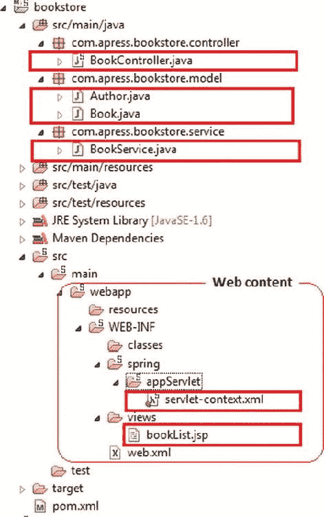

[图 5-20](#_Fig20) 。书店应用的目录结构

让我们将清单 5-42 中基于界面的控制器替换为基于注释的控制器。[清单 5-44](#list44) 展示了基于注释的 BookController。

[清单 5-44](#_list44) 。基于注释的图书管理员

```java
1.    package com.apress.bookstore.controller;
2.    import com.apress.bookstore.service.BookService;
3.    import org.springframework.stereotype.Controller;
4.    import org.springframework.web.bind.annotation.RequestMapping;
5.    import org.springframework.web.bind.annotation.RequestMethod;
6.    import org.springframework.web.servlet.ModelAndView;
7.
8.    @Controller
9.    @RequestMapping("/list_book.html")
10.    public class BookController {
11.        @RequestMapping(method = RequestMethod.GET)
12.        public ModelAndView bookListController() {
13.            BookService bookManager = new BookService();
14.            ModelAndView modelAndView = new ModelAndView("bookList");
15.            modelAndView.addObject("bookList", bookManager.getBookList());
16.            return modelAndView;
17.        }
18.    }
```

*   在基于注释的应用中，表单控制器是用@Controller 创建的。@Controller 表示特定的类充当控制器的角色。@Controller 还允许自动检测，这与 Spring 对检测类路径中的组件类和为它们自动注册 bean 定义的一般支持相一致。在这个例子中，@Controller 注释表明 BookListControler 类是一个控制器类。
*   *第 9 行* : @RequestMapping 用于将/list_book.html 这样的 URL 映射到整个类或特定的处理程序方法上。类级别的@RequestMapping 表示该控制器上的所有处理方法都是相对于/list_book.html 路径的。
*   *第 13 行* : @RequestMapping 在方法层表示该方法只接受 GET 请求；换句话说，一个/list_book.html 的 HTTP GET 涉及 bookListController()。

[清单 5-45](#list45) 展示了修改后的 bookstore-servlet.xml 来发现基于注释的 BookController。

[清单 5-45](#_list45) 。bookstore-servlet.xml 支持基于注释的控制器

```java
 1.    <?xml version="1.0" encoding="UTF-8"?>
 2.    <beans:beans fontname">http://www.springframework.org/schema/mvc"
 3.        xmlns:xsi="http://www.w3.org/2001/XMLSchema-instance" xmlns:beans=
           "http://www.springframework.org/schema/beans"
 4.        xmlns:context="http://www.springframework.org/schema/context"
 5.        xsi:schemaLocation="http://www.springframework.org/schema/mvc
           http://www.springframework.org/schema/mvc/spring-mvc.xsd
 6.            http://www.springframework.org/schema/beanshttp://www.springframework.org/schema/
               beans/spring-beans.xsd
 7.            http://www.springframework.org/schema/contexthttp://www.springframework.org/schema/
               context/spring-context.xsd">
 8.
 9.        <!-- DispatcherServlet Context: defines this servlet's request-processing
10.            infrastructure -->
11.
12.        <context:component-scan base-package="com.apress.bookStore.controller" />
13.        <beans:bean name="/list_book.html"
14.            class="com.apress.bookstore.controller.BookController" />
15.
16.
17.        <!-- Resolves views selected for rendering by @Controllers to .jsp resources
18.            in the /WEB-INF/views directory -->
19.        <beans:bean
20.            class="org.springframework.web.servlet.view.InternalResourceViewResolver">
21.            <beans:property name="prefix" value="/WEB-INF/views/" />
22.            <beans:property name="suffix" value=".jsp" />
23.        </beans:bean>
24.    </beans:beans>
```

*   *第 12 行* : <上下文:dispatcher servlet 的组件扫描>将@Controller 注释的类注册为 beans。BookListController 类被自动发现并注册为 bean。

使用注释处理表单

Spring Web MVC 中的注释驱动配置极大地简化了表单处理。Spring 通过数据绑定机制，从提交的表单中自动填充 Java 对象，并支持验证和错误报告，从而消除了对传统表单处理的需求。[清单 5-46](#list46) 演示了如何使用一个表单，然后处理用户输入的数据。[图 5-21](#Fig21) 说明了添加到书店目录结构中的新文件。

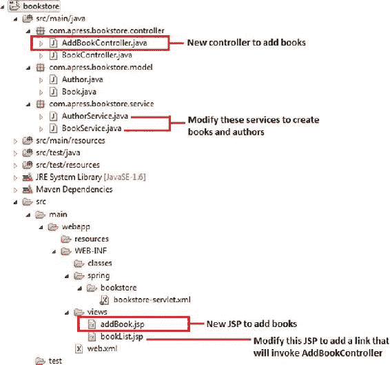

[图 5-21](#_Fig21) 。用于表单处理的应用中的新文件

添加了一个新的控制器 AddBookController ，它负责所有使用注释的表单处理。清单 5-46 展示了 AddBookController。

[清单 5-46](#_list46) 。为表单处理添加 BookController

```java
 1.    package com.apress.bookstore.controller;
 2.
 3.    import java.util.List;
 4.
 5.    import org.springframework.stereotype.Controller;
 6.    import org.springframework.ui.ModelMap;
 7.    import org.springframework.validation.BindingResult;
 8.    import org.springframework.web.bind.WebDataBinder;
 9.    import org.springframework.web.bind.annotation.InitBinder;
10.    import org.springframework.web.bind.annotation.ModelAttribute;
11.    import org.springframework.web.bind.annotation.RequestMapping;
12.    import org.springframework.web.bind.annotation.RequestMethod;
13.    import org.springframework.web.bind.support.SessionStatus;
14.    import org.springframework.web.context.request.WebRequest;
15.
16.    import com.apress.bookstore.model.Author;
17.    import com.apress.bookstore.model.Book;
18.    import com.apress.bookstore.service.AuthorService;
19.    import com.apress.bookstore.service.BookService;
20.
21.    @Controller
22.    @RequestMapping("/addBook.html")
23.    public class AddBookController {
24.        @RequestMapping(value="/addBook.html", method = RequestMethod.GET)
25.        public String initForm(ModelMap model) {
26.        Book book = new Book();
27.        book.setBookTitle("Add  Book :");
28.            model.addAttribute("book", book);
29.        return "addBook";
30.        }
31.
32.        @InitBinder
33.        public void initBinder(WebDataBinder binder, WebRequest request) {
34.        binder.setDisallowedFields(new String[] {"author"});
35.            Book book = (Book)binder.getTarget();
36.        AuthorService authorService = new AuthorService();
37.        Long authorId = null;
38.        try {
39.                authorId = Long.parseLong(request.getParameter("author"));
40.            } catch (Exception e) {}
41.            if (authorId != null) {
42.                Author author = authorService.getAuthorById(authorId);
43.                book.setAuthor(author);
44.            }
45.        }
46.
47.        @ModelAttribute("authorList")
48.        public List<Author> populateAuthorList() {
49.        AuthorService authorService = new AuthorService();
50.        return authorService.getAuthorList();
51.        }
52.
53.        @RequestMapping(method = RequestMethod.POST)
54.        public String processSubmit(@ModelAttribute("book") Book book, BindingResult result,
           SessionStatus status) {
55.            BookService bookService = new BookService();
56.            bookService.createBook(book);
57.        return "redirect:/list_book.html";
58.        }
59.    }
```

*   *第 22 行*:addbook controller 类用@RequestMapping("/addBook.html ")进行了注释，这意味着这个类中的所有方法都会处理对 URL"/ addBook.html "的请求。
*   *第 24 行*:绑定的初始化是通过用@ request mapping(method = request method)注释方法名来完成的。获取)。
*   *第 25 行* : initForm()处理 GET 请求类型并显示添加新书表单。
*   *第 28 行* : initForm()也向模型映射添加了一个新实例，这样这个新实例就可以与表单相关联了。
*   *第 32 行*:通过用@InitBinder 标注方法名来定义绑定。
*   用@InitBinder 注释控制器方法允许直接在控制器类中配置 web 数据绑定。@InitBinder 标识初始化 WebDataBinder 的方法，该 WebDataBinder 用于填充命令并形成带注释的处理程序方法的对象参数。这样的 init-binder 方法支持@RequestMapping 支持的所有参数，除了命令/表单对象和相应的验证结果对象。被声明的 Init-binder 方法不能有返回值。因此，它们通常被宣布为无效。
*   *第 33 行*:典型的参数包括与 WebRequest 或 java.util.Locale 结合的 WebDataBinder，允许代码注册特定于上下文的编辑器。
*   数据绑定是使用 WebDataBinder 类配置的。WebDataBinder 是一个特殊的 DataBinder，用于从 web 请求参数到 JavaBean 对象的数据绑定。
*   Spring 将这个类的一个实例注入到任何用@InitBinder 注释的控制器方法中。然后，该对象用于定义控制器的数据绑定规则。
*   WebRequest 允许通用请求参数访问以及请求/会话属性访问，而无需绑定到本地 Servlet API。
*   *第 34 行* : setDisallowedFields()注册不允许绑定的字段。
*   *第 47 行*:通过用@ModelAttribute 注释方法名，引用数据被放入模型中，以便表单视图可以访问它。
    *   当@ModelAttribute 放在方法参数上时，它将模型属性映射到特定的带注释的方法参数。这就是控制器如何获得对保存表单中输入的数据的对象的引用。
    *   @ModelAttribute 注释通知 Spring MVC 框架 authorList 实例应该被分配为 Author 类的实例，并且应该被传递以填充 AuthorList()。

*   *第 53 行*:表单提交通过用@ request mapping(method = request method)注释方法名来处理。贴)。
*   *第 54 行* : processSubmit()接受 POST 请求；也就是说，针对/new_book.html 的 HTTP POST 调用 processSubmit()。processSubmit()处理表单数据。processSubmit()有三个参数:
    *   @ model attribute(value = " book ")Book Book:模型属性注释通知 Spring MVC 框架，Book 模型实例应该被赋值为 Book 类的实例，并且应该被传递给 processSubmit()方法。
    *   BindingResult 结果:Spring 在 Book 类的创建过程中确定错误(如果有的话)。如果发现错误，其描述将作为 BindingResult 实例传递给该方法。
    *   SessionStatus 状态:SessionStatus 是一个状态句柄，用于将表单处理标记为完成。

*   *第 57 行*:return 语句中的 redirect:前缀触发HTTP 重定向回浏览器。当将响应委托给另一个控制器，而不仅仅是呈现视图时，这是必要的。

[清单 5-47](#list47) 展示了修改后的书店应用的服务层，用于表单处理。

[清单 5-47](#_list47) 。图书服务

```java
package com.apress.bookstore.service;

import java.util.LinkedList;
import java.util.List;

import com.apress.bookstore.model.Author;
import com.apress.bookstore.model.Book;

public class BookService {

    private static List<Book> bookList;

    static {

        Author author1 = new Author();
        author1.setAuthorId((long) 1);
        author1.setAuthorName("Vishal Layka");
        Book book1 = new Book();
        book1.setBookId((long) 1);
        book1.setBookTitle("Beginning Groovy, Grails and Griffon");
        book1.setAuthor(author1);

        Book book2 = new Book();
        book2.setBookId((long) 2);
        book2.setBookTitle("Modern Java Web Development");
        book2.setAuthor(author1);

        bookList = new LinkedList<Book>();
        bookList.add(book1);
        bookList.add(book2);
    }

    public List<Book> getBookList() {
        return bookList;
    }

     public Book createBook(Book b) {
            Book book = new Book();
            book.setBookId((long)bookList.size() + 1);
            book.setAuthor(b.getAuthor());
            book.setBookTitle(b.getBookTitle());
            bookList.add(book);
            return book;
            }

}
```

[清单 5-48](#list48) 展示了用于表单处理的书店应用的修改后的 bookList.jsp。

[清单 5-48](#_list48) 。bookList.jsp

```java
 1.    <%@page contentType="text/html" pageEncoding="UTF-8"%>
 2.    <%@ taglib prefix="c" uri="http://java.sun.com/jsp/jstl/core"%>
 3.    <!DOCTYPE html>
 4.    <html>
 5.    <head>
 6.    <meta http-equiv="Content-Type" content="text/html; charset=UTF-8">
 7.    <title>Your Book store</title>
 8.    </head>
 9.    <body>
10.        <h1>Books List</h1>
11.        <table border="1">
12.            <tr>
13.                <th align="left">Author</th>
14.                <th align="left">Book Title</th>
15.            </tr>
16.            <c:forEach items="${bookList}" var="book">
17.                <tr>
18.                    <td>${book.author.authorName}</td>
19.
20.                    <td>${book.bookTitle}</td>
21.                </tr>
22.            </c:forEach>
23.        </table>
24.        <br/>
25.        <a href="addBook.html">Add books.</a>
26.    </body>
27.    </html>
```

*   *第 25 行*:使用 AddBookController 调用表单控制器，它被映射到[清单 5-46](#list46) 中 AddBookController 的第 22 行和第 24 行。

[清单 5-49](#list49) 展示了用于表单处理的书店应用的新 JSP 页面，当使用<a href = " addbook . html ">Add books 调用 AddBookController 时，将显示该页面。[清单 5-48](#list48) 第 25 行< /a >。

[清单 5-49](#_list49) 。addBook.jsp

```java
 1.    <%@page contentType="text/html" pageEncoding="UTF-8"%>
 2.    <%@ taglib prefix="c" uri="http://java.sun.com/jsp/jstl/core" %>
 3.    <%@ taglib prefix="form" uri="http://www.springframework.org/tags/form" %>
 4.
 5.    <!DOCTYPE html>
 6.    <html>
 7.    <head>
 8.    <meta http-equiv="Content-Type" content="text/html; charset=UTF-8">
 9.    <title>Your Book store</title>
10.    </head>
11.    <body>
12.    <h1>Add  Book</h1>
13.        <form:form method="post" commandName="book">
14.                Author<br />
15.    <form:select path="author">
16.    <form:options items="${authorList}" itemValue="authorId" itemLabel="authorName" />
17.    </form:select>
18.    <br /><br />
19.                Book Name<br />
20.    <form:input path="bookTitle"/><br /><br />
21.    <br />
22.    <input type="submit" value="Submit">
23.        </form:form>
24.    </body>
25.    </html>
```

清单 5-49 展示了显示的表单。它还展示了 Spring form 标签的用法。

基于注释的验证

下一节演示了如何使用注释来验证用户输入的数据。[图 5-22](#Fig22) 说明了应用中修改的文件和新增的文件。

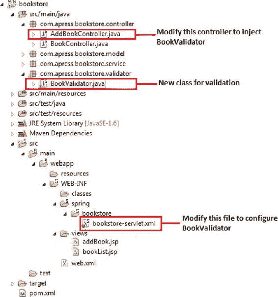

[图 5-22](#_Fig22) 。目录结构中的修改文件和新文件，用于基于注释的验证

清单 5-50 展示了 BookValidator。

[清单 5-50](#_list50) 。BookValidator 中的验证

```java
 1.    package com.apress.bookstore.validator;
 2.
 3.    import org.springframework.validation.Errors;
 4.    import org.springframework.validation.ValidationUtils;
 5.    import org.springframework.validation.Validator;
 6.
 7.    import com.apress.bookstore.model.Book;
 8.
 9.    public class BookValidator implements Validator {
10.        @Override
11.        public boolean supports(Class clazz) {
12.            return Book.class.equals(clazz);
13.        }
14.
15.        @Override
16.        public void validate(Object obj, Errors errors) {
17.            Book book = (Book) obj;
18.            ValidationUtils.rejectIfEmptyOrWhitespace(errors, "bookTitle", "field.required",
               "Required Field");
19.            if ( ! errors.hasFieldErrors("bookTitle")) {
20.                if (book.getBookTitle().isEmpty())
21.                    errors.rejectValue("Title", "", "Cannot be left empty!");
22.            }
23.        }
24.
25.
26.    }
```

*   *第 19 到 23 行*:应用中的典型验证

名为 AddBookController 的控制器被更新用于验证，如清单 5-51 中的[所示。](#list51)

[清单 5-51](#_list51) 。更新 AddBookController

```java
 1.    package com.apress.bookstore.controller;
 2.
 3.    import java.util.List;
 4.
 5.    import org.springframework.beans.factory.annotation.Autowired;
 6.    import org.springframework.stereotype.Controller;
 7.    import org.springframework.ui.ModelMap;
 8.    import org.springframework.validation.BindingResult;
 9.    import org.springframework.web.bind.WebDataBinder;
10.    import org.springframework.web.bind.annotation.InitBinder;
11.    import org.springframework.web.bind.annotation.ModelAttribute;
12.    import org.springframework.web.bind.annotation.RequestMapping;
13.    import org.springframework.web.bind.annotation.RequestMethod;
14.    import org.springframework.web.bind.support.SessionStatus;
15.    import org.springframework.web.context.request.WebRequest;
16.
17.    import com.apress.bookstore.model.Author;
18.    import com.apress.bookstore.model.Book;
19.    import com.apress.bookstore.service.AuthorService;
20.    import com.apress.bookstore.service.BookService;
21.    import com.apress.bookstore.validator.BookValidator;
22.
23.    @Controller
24.    @RequestMapping("/addBook.html")
25.    public class AddBookController {
26.        BookValidator bookValidator;
27.
28.        @Autowired
29.        public AddBookController(BookValidator bookValidator) {
30.            this.bookValidator = bookValidator;
31.        }
32.
33.        @RequestMapping(value="/addBook.html", method = RequestMethod.GET)
34.        public String initForm(ModelMap model) {
35.        Book book = new Book();
36.        book.setBookTitle("Add  Book :");
37.            model.addAttribute("book", book);
38.        return "addBook";
39.        }
40.
41.        @InitBinder
42.        public void initBinder(WebDataBinder binder, WebRequest request) {
43.        binder.setDisallowedFields(new String[] {"author"});
44.            Book book = (Book)binder.getTarget();
45.        AuthorService authorService = new AuthorService();
46.        Long authorId = null;
47.        try {
48.                authorId = Long.parseLong(request.getParameter("author"));
49.            } catch (Exception e) {}
50.            if (authorId != null) {
51.                Author author = authorService.getAuthorById(authorId);
52.                book.setAuthor(author);
53.            }
54.        }
55.
56.        @ModelAttribute("authorList")
57.        public List<Author> populateAuthorList() {
58.        AuthorService authorService = new AuthorService();
59.        return authorService.getAuthorList();
60.        }
61.
62.        @RequestMapping(method = RequestMethod.POST)
63.        public String processSubmit(@ModelAttribute("book") Book book, BindingResult result,
           SessionStatus status) {
64.            BookService bookService = new BookService();
65.            bookService.createBook(book);
66.            if(result.hasErrors()) {
67.                return "addBook";
68.            } else {
69.        bookService.createBook(book);
70.                return "redirect:/list_book.html";
71.            }
72.
73.        }
74.    }
```

*   *第 29 行*:使用 setter 方法注入 BookValidator 类。
*   *第 63 行*:在 processSubmit()中，调用 BookValidator 的 validate()检查图书明细是否是用户输入的。向 validate()传递图书模型和 BindingResult 对象的值以保存错误(如果有)。
*   *第 66 行*:检查结果变量是否有错误。如果有错误，应用将显示带有错误消息的相同页面。如果没有错误，也就是说，用户已经输入了所有正确的数据，那么应用将显示图书详细信息列表以及新输入的图书详细信息。

配置验证程序

现在你必须在 bookstore-servlet.xml 中声明 URL addBook.html 的验证器，如清单 5-52 所示。

[清单 5-52](#_list52) 。声明 BookValidator

```java
 1.    <?xml version="1.0" encoding="UTF-8"?>
 2.    <beans:beans fontname">http://www.springframework.org/schema/mvc"
 3.        xmlns:xsi="http://www.w3.org/2001/XMLSchema-instance" xmlns:beans=
           "http://www.springframework.org/schema/beans"
 4.        xmlns:context="http://www.springframework.org/schema/context"
 5.        xsi:schemaLocation="http://www.springframework.org/schema/mvc http://www.springframework.org/
           schema/mvc/spring-mvc.xsd
 6.            http://www.springframework.org/schema/beanshttp://www.springframework.org/schema/
               beans/spring-beans.xsd
 7.            http://www.springframework.org/schema/contexthttp://www.springframework.org/schema/
               context/spring-context.xsd">
 8.
 9.        <!-- DispatcherServlet Context: defines this servlet's request-processing
10.            infrastructure -->
11.
12.        <context:component-scan base-package="com.apress.bookstore.controller" />
13.        <beans:bean class="com.apress.bookstore.validator.BookValidator" />
14.
15.        <!-- Resolves views selected for rendering by @Controllers to .jsp resources
16.            in the /WEB-INF/views directory -->
17.        <beans:bean
18.            class="org.springframework.web.servlet.view.InternalResourceViewResolver">
19.            <beans:property name="prefix" value="/WEB-INF/views/" />
20.            <beans:property name="suffix" value=".jsp" />
21.        </beans:bean>
22.    </beans:beans>
```

*   *第 13 行*:定义了 BookValidator 类。容器通过调用其构造函数来创建 BookValidator 类。

摘要

本章首先简要介绍了 Spring 框架，然后展示了如何处理紧耦合、横切关注点和样板代码。本章转换了在第 1 章中构建的数据访问层，以消除因使用纯 JDBC 而产生的样板代码。然后讨论了 Spring MVC 的架构，包括它的请求处理生命周期。接下来展示了如何使用 Spring Web MVC 开发 Hello World 应用。然后，它开始使用 Spring Web MVC 实现书店应用，随着应用的发展，它引入了 Spring Web MVC 的注释编程模型，并在 Web 应用中处理表单。

[<sup class="calibre12">1</sup>](#_Fn1)【www.osgi.org/Main/HomePage】T4

[<sup class="calibre12">2</sup>](#_Fn2)【www.cloudfoundry.com/】T4

[<sup class="calibre12">3</sup>](#_Fn3)【http://aws.amazon.com/ec2/】T4

[<sup class="calibre12">4</sup>](#_Fn4)【http://nosql-database.org/】T4

[<sup class="calibre12">5</sup>](#_Fn5)【www.postgresql.org/】T4

[<sup class="calibre12">6</sup>](#_Fn6)【www.mongodb.org/】T4

[<sup class="calibre12">7</sup>](#_Fn7)【http://redis.io/】T4

[<sup class="calibre12">8</sup>](#_Fn8)【www.seamframework.org/】T4

[<sup class="calibre12">9</sup>](#_Fn9)【http://code.google.com/p/google-guice/】T4

[](#_Fn10)[http://martinfowler . com/bliki/reverse of control . html](http://martinfowler.com/bliki/InversionOfControl.html)*