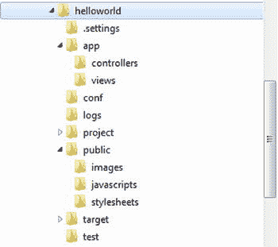
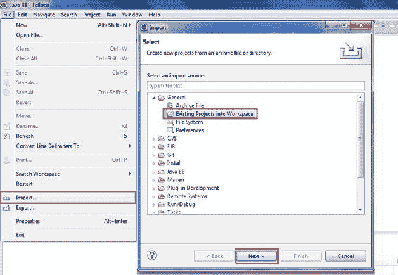

# 八、使用 Java 和 Scala 玩游戏

哦，把它不好的部分扔掉。和另一半一起更纯洁地生活。

—威廉·莎士比亚

Java EE 继续在一种良性的连续体中发展。受 Spring 等框架的启发，Java EE 引入了注释和依赖注入等特性来处理事务和数据库连接等复杂任务。撰写本文时的最新版本 Java EE 7 进一步加强了 Java 持久性 API (JPA)和基于 REST 的 web 服务的 JAX-RS 的进步，这只是其中的几个例子。Java web 开发所涉及的大部分复杂性将继续通过商业或开放 web 框架的创新在许多方面得到解决。

然而，Play 2 web 框架偏离了常规。play 2*不是*以 Java EE 为中心，并且不受 Java EE 的约束。它是 Typesafe 堆栈的一部分，提供了 Java EE 堆栈的替代方案。Typesafe 重新定义了以前由 Java EE 定义的现代 Java 应用的层，在这个新的划分中，它构成了 web 层。

Play 是一个开源的 web 应用框架，用 Scala 和 Java 编写，为现代 Web 提供开箱即用的支持。Play 是为现代 web 和移动应用的需求而构建的，利用了 REST、JSON 和 Web Sockets 等技术。

Play 以 JVM 为目标，并通过提供诸如约定优于配置、热代码重载和浏览器中的错误等特性来提高开发人员的工作效率。Play 通过将 HTTP 请求映射到控制器和表示结果的视图模板的路由文件来实现 MVC 架构。Play 2 通过提供对 Scala 编程语言的本地支持，构建在函数范式之上，并提供了一个改编的特定于 Java 的 API，该 API 形成了一个高度反应性的 web 框架。

游戏 2 的特点

Play 2.0 于 2012 年与 Typesafe 堆栈一起发布。Play 2 使用 Scala 作为核心语言构建，而 Play 1 使用 Java 语言并通过插件提供对 Scala 的支持。Play 2.2 发布于 2013 年 9 月。表 8-1 描述了 Play 2 的主要特征。

[表 8-1](#_Tab1) 。重头戏 2 的主要特点

<colgroup><col width="30%" class="calibre14"> <col width="70%" class="calibre14"></colgroup> 
| 

特征

 | 

描述

 |
| --- | --- |
| 异步输入输出 | 由于使用 JBoss Netty [<sup class="calibre20">1</sup>](#Fn1) 作为 web 服务器，Play 2 可以异步服务长请求。 |
| 内置 web 服务器 | Play 2 提供了开箱即用的 JBoss Netty web 服务器，但是 Play web 应用也可以打包成 WAR 文件分发到 Java EE 应用服务器。 |
| 依赖性管理 | Play 2 提供 sbt [<sup class="calibre20">2</sup>](#Fn2) 进行依赖管理。 |
| 热重装 | 在基于 Play 2 的应用中，每次新请求到达时，都会检查开发模式下的代码是否有更新，并且任何更改的文件都会自动重新编译；如果有任何错误，错误会直接显示在浏览器中。 |
| 内存数据库 | 像 Grails 一样，Play 2 支持开箱即用的 H2。 |
| 原生 Scala 支持 | Play 2 本身使用 Scala，但完全可以与 Java 互操作。 |
| 对象关系映射(Object Relation Mapping) | Play 2 提供了 Ebean [<sup class="calibre20">3</sup>](#Fn3) 作为 JPA 访问数据库的 ORM 替代。 |
| 无国籍的 | Play 2 是完全 RESTful 的，每个连接都没有 Java EE 会话。 |
| 模板 | Play 2 使用 Scala 作为模板引擎。 |
| 测试框架 | Play 2 为单元测试和功能测试提供了一个内置的测试框架，比如 JUnit 和 Selenium。 [<sup class="calibre20">4</sup>](#Fn4) |
| Web 套接字 | Play 2 实现了开箱即用的 Web 套接字，以实现客户机和服务器之间的双向连接。 |

游戏 2 中的 MVC

Play 2 应用遵循 MVC 架构模式。在 Play 2 应用中，MVC 层在 app 目录中定义，每个层都在一个单独的包中(见[图 8-1](#Fig1) )。


[图 8-1](#_Fig1) 。行动 2 中的 MVC

图 8-1 中[所示的 MVC 架构中的请求流](#Fig1)如下:

1.  路由器收到一个 HTTP 请求。
2.  路由器找到控制器中定义的动作来处理该请求。
3.  控制器监听 HTTP 请求，从请求中提取相关数据，并将更改应用于模型。
4.  控制器呈现模板文件以生成视图。
5.  然后，action 方法的结果被写成一个 HTTP 响应。

路由器

web 应用的主要入口点是 conf/routes 文件，它定义了应用所需的路由。每个路由都由一个 HTTP 方法和一个与动作方法调用相关联的 URI 模式组成。Conf/routes 是称为路由器的内置组件使用的配置文件，它将每个传入的 HTTP 请求转换为操作调用。

**注意**HTTP 方法可以是 HTTP 支持的任何有效方法(GET、POST、PUT、DELETE 和 HEAD)。

控制器

在基于 Java EE 的 web 应用中， *控制器*是一个扩展 servlet 类型的 Java 类。因为 Play 不是以 Java EE 为中心的，所以 Play 2 中的控制器是 Java 中的一个类，或者是 Scala 中的一个对象，它扩展了控制器类型(Java 和 Scala 中都是如此)。play.api.mvc 包中提供了这种控制器类型。Play 2 中的控制器包含一个名为*动作*的公共静态方法。动作基本上是一种处理请求参数并产生要发送给客户机的结果的方法。控制器响应请求，处理它们，并调用模型上的更改。

默认情况下，控制器是在源根目录(app 文件夹)下的控制器包中定义的。

**注意**控制器是一种扩展 play.api.mvc 包中提供的控制器的类型。

模型

*模型* 是应用操作的信息的特定领域表示。这种表示最常用的对象是 JavaBean。然而，JavaBeans 会导致大量样板代码。Play 2 和 Grails 一样，通过字节码增强为您生成 getters 和 setters，减少了这种样板代码。例如，如果需要将模型对象保存到持久性存储中，那么它们可能包含诸如 JPA 注释之类的持久性工件。

**注意**即使 Play 2 对 ORM 使用 Ebean，您也可以继续在您的实体上使用 JPA 注释。

视角

在基于 Java EE 的 web 应用中，*视图*通常是使用 JSP 开发的。也就是说，基于 Java EE 的 web 应用中的视图由 JSP 元素和模板文本组成。由于 Play 不是以 Java EE 为中心的，因此 Play 中的视图由混合了 HTML 和 Scala 代码的模板组成。在 Play 1 中，模板基于 Groovy，但是从 Play 2 开始，模板基于 Scala。使用 Play 2，您可以开发基于 Java 和基于 Scala 的 web 应用，两者中的模板是相同的。

**注意**在 Play 1 中，模板基于 Groovy，但是从 Play 2 开始，模板基于 Scala。

玩耍入门

要运行 Play 框架，您需要 JDK 6 或更高版本。你可以从这里下载 Play 2:[www.playframework.com/download](http://www.playframework.com/download)。Play 2 有两种版本:标准版和类型安全激活器。

下载最新的单机版 Play 发行版，将归档文件解压到您选择的位置，并通过在环境变量对话框中添加/编辑 Path 变量来更新 Path 环境变量，使用 Play 安装的路径，如图[图 8-2](#Fig2) 所示。


[图 8-2](#_Fig2) 。添加/编辑路径变量

现在，在命令行工具中输入以下命令，检查是否已经正确设置了播放环境:

```java
> play
```

如果 Play 安装正确，您应该会在控制台上看到输出，如图 8-3 中的[所示。](#Fig3)


[图 8-3](#_Fig3) 。验证 Play 2 是否安装正确

你也可以通过执行 help 命令获得一些帮助，如图[图 8-4](#Fig4) 所示。

```java
> play help
```


[图 8-4](#_Fig4) 。游戏 2 中的帮助

现在您可以用 Play 创建您的第一个 Java web 应用了。让我们来玩吧！

Hello World Java 应用与播放

要创建一个新的应用，你只需使用 play 命令行工具，带参数 new，后跟新应用的名称，在这里是 helloworld，如图 8-5 所示。


[图 8-5](#_Fig5) 。创建 helloworld 应用

Play 2 会要求你指定你的应用是 Scala 还是 Java 应用，如图 8-6 所示。


[图 8-6](#_Fig6) 。指定应用是 Scala 还是 Java 应用

您必须指定 2，因为您想要创建一个 Java 应用。指定 2 为 Java 语言创建源文件和应用结构，如图 8-7 所示。


[图 8-7](#_Fig7) 。helloworld 项目的 创建

您可以使用 helloworld 目录中的 run 命令运行应用。为此，进入游戏控制台，如图 8-8 中的[所示。](#Fig8)

```java
> cd helloworld
>play
```


[图 8-8](#_Fig8) 。进入游戏控制台

现在输入 run。这将启动运行您的应用的服务器。

```java
$ run
```

控制台上的输出如下所示:

```java
[helloworld] $ run
[info] Updating {file:/E:/ModernJava/play2-workspace/helloworld/}helloworld...
[info] Resolving org.scala-lang#scala-library;2.10.2 ...
[info] Resolving com.typesafe.play#play-java-jdbc_2.10;2.2.0 ...
  [info] Resolving com.typesafe.play#play-jdbc_2.10;2.2.0 ...
  [info] Resolving com.typesafe.play#play_2.10;2.2.0 ...
...............................................
  [info] Resolving org.fusesource.jansi#jansi;1.4 ...
[info] Done updating.
--- (Running the application from SBT, auto-reloading is enabled) ---
[info] play - Listening for HTTP on /0:0:0:0:0:0:0:0:9000
(Server started, use Ctrl+D to stop and go back to the console...)
```

正如您所看到的，控制台显示它已经启动了应用，并且一个 HTTP 服务器正在侦听端口 9000 上的 HTTP 请求。现在，您可以通过访问 URL[http://localhost:9000/](http://localhost:9000/)向该服务器发送请求。在请求服务器时，显示一个欢迎屏幕，如图[图 8-9](#Fig9) 所示。


[图 8-9](#_Fig9) 。Play 2 框架的默认欢迎页面

[图 8-9](#Fig9) 说明了默认的 Play 2 欢迎页面。对于初学者来说，应用的默认欢迎页面是一个很好的信息来源，建议您阅读一下。

run 命令在 helloworld 目录中创建应用的结构。其结构如图[图 8-10](#Fig10) 所示。



[图 8-10](#_Fig10) 。helloworld 应用的目录结构

图 8-10 中[的各个文件夹描述如下:](#Fig10)

*   app:这是所有服务器端源文件的根，比如 Java 和 Scala 源代码、模板和编译资产的源代码。在创建时，只创建两个子文件夹:控制器和视图，分别用于 MVC 架构模式的控制器和视图组件。您可以为 MVC 的模型组件添加目录 app/models。还有一个名为 app/assets 的可选目录，用于编译的资源，如 LESS [<sup class="calibre12">5</sup>](#Fn5) 源和 CoffeeScript [<sup class="calibre12">6</sup>](#Fn6) 源。
*   conf: The conf directory contains the application’s configuration files meant to configure the application itself, external services, and so on. There are two main configuration files:

    application.conf:应用的主配置文件，包含标准配置参数

    路线:路线定义文件

*   项目:项目文件夹包含配置 Scala 构建工具 SBT 所需的所有文件。 [<sup class="calibre12">7</sup>](#Fn7)
*   public:这个目录包含图像、CSS 样式表和 JavaScript 文件的三个标准子目录。

**注意**存储在公共目录中的资源是静态资产，将由 web 服务器直接提供服务。

*   target: The target directory contains everything generated by the build system such as the following:

    classes:包含所有编译过的类(来自 Java 和 Scala 源代码)。

    classes_managed:这仅包含由框架管理的类(例如由路由器或模板系统生成的类)。

    resource_managed:这包含生成的资源，通常是编译的资产，如 LESS CSS 和 CoffeeScript 编译结果。

    src_managed:这包含生成的源代码，比如模板系统生成的 Scala 源代码。

*   test:最后一个文件夹将包含所有的测试文件以及框架提供的一些样本。

现在您已经看到了应用的目录结构，您将了解在测试 URL:[http://localhost:9000](http://localhost:9000)时默认的欢迎页面是如何显示的。

conf/routes 文件中的每一行都是定义如何使用 HTTP 访问服务器组件的路由。如果您在 conf/routes 文件中看到生成的 routes 文件，您将看到第一条路由:

```java
GET        /       controllers.Application.index()
```

这条路线由三部分组成:

*   GET:这是包含请求中使用的 HTTP 方法的路由(行)的第一部分。
*   /:这是路由中包含相对路径的第二部分。
*   控制器。Application.index():这是路由中包含要调用的动作的第三部分。

路由中的这三个部分通知 Play 2，当 web 服务器收到对/ path 的 GET 请求时，它必须调用控制器。Application.index()，它调用驻留在控制器包中的应用类中的 index 方法。

现在你将看到控制器。Application.index 方法如下所示。为此，您需要打开 app/controllers/application . Java 源文件。这个文件在[清单 8-1](#list1) 中有说明。

*[清单 8-1](#_list1) 。应用控制器*

```java
 1.    package controllers;
 2.
 3.    import play.*;
 4.    import play.mvc.*;
 5.
 6.    import views.html.*;
 7.
 8.    public class Application extends Controller {
 9.
10.      public static Result index() {
11.        return ok(index.render("Your new application is ready."));
12.      }
13.
14.    }
```

*   *第 8 行*:应用控制器类扩展 play.mvc.Controller。
*   *第 10 行*:public static index()动作返回结果。所有操作方法都返回一个结果。结果表示要发送回浏览器的 HTTP 响应。
*   *第 11 行*:这里，动作返回一个 200 OK 响应，带有 HTML 响应体。HTML 内容由模板提供。一个动作总是返回一个 HTTP 响应，这在 Play 2 中由结果类型表示。结果类型必须是有效的 HTTP 响应，因此它必须包含有效的 HTTP 状态代码。确定将其设置为 200。render()方法引用了 Play 2 中的模板文件。

模板在 app/views/index.scala.html 源文件中定义。这个文件在[清单 8-2](#list2) 中有说明。

*[清单 8-2](#_list2) 。index.scala.html*

```java
1.    @(message: String)
2.
3.    @main("Welcome to Play") {
4.
5.        @play20.welcome(message, style = "Java")
6.
7.    }
```

*   *第 1 行*:Scala 语句以特殊的@字符开始。第一行定义了函数签名。这里它只接受一个字符串参数。模板就像一个函数，因此它需要参数，这些参数在模板文件的顶部声明。
*   *第 3 行*:这一行用一个字符串参数调用一个名为 main 的函数。
*   *第 3 行到第 7 行*:这些行组成了主功能块。
*   *Line 5* : Line 5 使用了 Play 2 提供的一个叫 welcome 的功能。该函数呈现默认的欢迎 HTML 页面，它位于名为 main.scala.html 的文件中，该文件也位于 apps/views 文件夹中。
*   *第 5 行*:欢迎函数有一个额外的参数 style，通知模板这是一个基于 Java 的应用，然后这个 style 参数被欢迎模板用来显示文档的链接。

为 Java 配置 Eclipse

Play 2 为您提供了使用 Eclipse IDE 的可能性。为此，您需要让 Play 2 生成 Eclipse 项目配置。你可以通过调用游戏控制台中的 Eclipse 来实现，如图 8-11 所示。


[图 8-11](#_Fig11) 。为 Eclipse 生成项目

现在你可以启动 Eclipse，如图[图 8-11](#Fig11) 所示，并将项目导入其中，如图[图 8-12](#Fig12) 所示。


[图 8-12](#_Fig12) 。选择工作区

导入项目时，选择文件导入，在工作区选择常规已有项目，点击下一步，如图[图 8-13](#Fig13) 所示。



[图 8-13](#_Fig13) 。导入项目

现在浏览你的文件系统，选择项目文件夹 helloworld，点击 OK，然后点击 Finish，如图 8-14 所示。


[图 8-14](#_Fig14) 。选择根目录

配置 Eclipse 项目所需的所有文件都会生成。您看到了如何创建一个项目并将其导入到您的开发环境中。现在您将修改应用。在 Application.java，改变 index 动作中响应的内容，如清单 8-3 所示。

*[清单 8-3](#_list3) 。修改指标动作*

```java
public static Result index() {
  return ok("Hello world");
}
```

索引动作现在将响应“Hello world”，如图 8-15 所示。


[图 8-15](#_Fig15) 。“你好，世界”

Play 2 在 play-2.2.0\samples\java\的 samples 文件夹中提供了一些示例应用。你可以运行 helloworld 应用，如图 8-16 所示。


[图 8-16](#_Fig16) 。Play 2 提供的 helloworld 示例应用

点击【提交查询】，根据选择显示用户名称，如图[图 8-17](#Fig17) 所示。


[图 8-17](#_Fig17) 。运行示例 helloworld 应用

您可以自己检查代码并改进应用。

Helloworld Scala 应用与 Play 2

如前所述，Play 2 允许您创建基于 Java 和基于 Scala 的 web 应用。生成基于 Scala 的应用的过程与生成 Java 应用是一样的。你可以创建一个 helloworld-scala 应用，如图 8-18 所示。


[图 8-18](#_Fig18) 。创建 helloworld-scala 应用

现在你可以从 Play 控制台使用 run 命令运行 helloworld-scala 项目，如图 8-19 所示。


[图 8-19](#_Fig19) 。为 helloworld-scala 应用播放控制台

现在你将看到 Play 2 为 helloworld-scala 生成的控制器(见[清单 8-4](#list4) )。你可以在 hello world-Scala \ app \ controllers 中找到控制器。

*[清单 8-4](#_list4) 。Scala* 中的应用控制器

```java
 1.    package controllers
 2.
 3.    import play.api._
 4.    import play.api.mvc._
 5.
 6.    object Application extends Controller {
 7.
 8.      def index = Action {
 9.        Ok(views.html.index("Your new application is ready."))
10.      }
11.
12.    }
```

*   *第 6 行*:正如你在第 6 行看到的，在 Java 中控制器是一个类，但是在 Scala 中控制器是一个对象。
*   *第 8 行*:正如你在第 8 行看到的，在 Java 中 action 是一个静态方法，但是在 Scala 中 action 是一个函数(一个对象的方法)。
*   *第 9 行*:如果与 Java 控制器进行比较，返回类型和关键字是缺失的。
*   *第 9 行* : Scala 使用了一种叫做 Action 的结构，这是一个代码执行器的块。

现在你已经看到了 Scala 中的控制器，它在语法上不同于 Java 控制器，是时候看看 helloworld-scala 中的模板了(见[清单 8-5](#list5) ，你可以在 helloworld-scala\app\views 中找到它。

*[清单 8-5](#_list5) 。helloworld-scala 中的模板*

```java
1.    @(message: String)
2.
3.    @main("Welcome to Play") {
4.
5.        @play20.welcome(message)
6.
7.    }
```

正如您所注意到的，helloworld 和 helloworld-scala 中的模板是相同的，除了第 5 行。Scala 版本没有初始化样式参数，因为它的默认值是 Scala。

为 Scala 配置 Eclipse】

您可以将 Scala IDE 用于基于 Scala 的应用。Scala IDE 是一个 Eclipse 插件，你可以通过选择 Help  Install New Software 来安装这个插件。在“工作方式”字段中，输入插件的路径([http://scala-ide.org/download/current.html](http://scala-ide.org/download/current.html))，如图 8-20 中[所示。你还可以在 http://scala-ide.org/documentation.html](#Fig20)[找到为 Scala 配置 Eclipse 的详细说明。](http://scala-ide.org/documentation.html)


[图 8-20](#_Fig20) 。为 Scala IDE 安装 Eclipse 插件

要导入项目，只需重复前面在 helloworld Java 应用中为 Eclipse 生成项目配置时执行的相同步骤。

现在您可以修改应用控制器中的 index 动作来显示“Hello world”，如清单 8-6 所示。

*[清单 8-6](#_list6) 。修改索引动作以显示“Hello world”*

```java
def index = Action {
    Ok("Hello world")
  }
```

一个基本的 CRUD Play 2 Java 应用

在本节中，您将学习编写一个简单的 CRUD 应用，它允许您创建、查看、编辑和删除书籍。对于这些操作，您需要动作和 URL 来调用这些动作。这个应用的代码可以在 Apress 网站的可下载文档中找到。

定义路线

第一步是在 conf/routes 文件中为这些操作定义路线，如[清单 8-7](#list7) 所示。

*[清单 8-7](#_list7) 。编辑会议/路线文件*

```java
1.    # Home page
2.    GET     /                    controllers.Application.index()
3.
4.    # Books
5.    GET     /books               controllers.Application.books()
6.    POST    /books               controllers.Application.newBook()
7.    POST    /books/:id/delete    controllers.Application.deleteBook(id: Long)
```

*   第 5 行:在第 5 行中，您创建了一个列出所有书籍的路径。
*   *第 6 行*:在第 6 行中，您创建了一个处理图书创建的路由。
*   *第 7 行*:在第 7 行中，您创建了一个处理删除的路由。处理图书删除的路由在 URL 路径中定义了一个变量参数 ID。然后，该值被传递给 deleteBook 操作。

现在如果你刷新你的浏览器，你会看到 Play 2 不能编译你的 routes 文件，如图 8-21 所示。


[图 8-21](#_Fig21) 。路线文件编译错误

Play 无法编译您的路线文件，因为它引用了不存在的动作。下一步是将这些操作添加到 Application.java 文件中。

创建控制器和动作

在本节中，您将创建动作，如清单 8-8 中的[所示。](#list8)

*[清单 8-8](#_list8) 。图书应用中的应用控制器*

```java
 1.    public class Application extends Controller {
 2.
 3.      public static Result index() {
 4.        return ok(index.render("Your new application is ready."));
 5.      }
 6.
 7.      public static Result books() {
 8.        return TODO;
 9.      }
10.
11.      public static Result newBook() {
12.        return TODO;
13.      }
14.
15.      public static Result deleteBook(Long id) {
16.        return TODO;
17.      }
18.
19.    }
```

*   *第 7、11 和 15 行*:这些行显示了在[清单 8-7](#list7) 中的 routes 文件中指定的动作。
*   *第 8、12 和 16 行*:使用内置结果 TODO，返回“未实现”响应 503。这个结果告诉 Play 2，稍后将提供动作实现。当您通过[http://localhost:9000/books](http://localhost:9000/books)访问该应用时，您会看到在[图 8-22](#Fig22) 中显示的结果。


[图 8-22](#_Fig22) 。Play 2 中的内置 TODO 结果

创建模型

下一步是定义可以存储在关系数据库中的模型书。为此，在 app/models/Book.java 文件中创建一个类，如[清单 8-9](#list9) 所示。

*[清单 8-9](#_list9) 。Book.java*

```java
 1.    package models;
 2.    import java.util.*;
 3.    public class Book {
 4.      public Long id;
 5.      public String label;
 6.      public static List<Book> all() {
 7.        return new ArrayList<Book>();
 8.      }
 9.      public static void create(Book book) {
10.      }
11.      public static void delete(Long id) {
12.      }
13.    }
```

*   *第 6 行到第 12 行*:您创建静态方法来管理 Book 上的 CRUD 操作。稍后，您将实现这些操作来将书籍存储在关系数据库中。

表单和视图模板

表单对象封装了一个 HTML 表单定义，包括验证约束。要为 Book 类创建一个表单，需要将以下内容添加到应用控制器中:

```java
static  Form<Book>  bookForm = Form.form(Book.class);
```

前面的代码用于定义包装现有类的 play.data.Form。书单类型为表格<book>。</book>

您可以使用 JSR-303 注释向图书类型添加约束。清单 8-10 说明了如何使标签字段成为必填字段。

*[清单 8-10](#_list10) 。添加验证约束*

```java
package models;

import java.util.*;

import play.data.validation.Constraints.*;

public class Book {

  public Long id;

  @Required
  public String label;

  ...
```

现在您需要修改视图模板来显示创建图书和列出所有图书的屏幕。

模板被编译成标准的 Scala 函数。如果你创建了一个 views/Application/index . scala . html 模板文件，Scala 会生成一个 views.html.Application.index 类，这个类有一个 render()方法。 [清单 8-11](#list11) 显示了一个简单的模板。

*[清单 8-11](#_list11) 。简单模板*

```java
@(books: List[Book])
 <ul>
@for(book <- books) {
  <li>@book.getTitle()</li>
}
</ul>
```

然后，您可以从任何 Java 代码中调用它，就像您通常调用类的方法一样。

```java
Content html = views.html.Application.index.render(books);
```

清单 8-12 展示了 index.scala.html 模板的代码，你可以在 app/views 文件夹中找到。

*[清单 8-12](#_list12) 。index.scala.html*

```java
 1.    @(books: List[Book], bookForm: Form[Book])
 2.
 3.    @import helper._
 4.
 5.    @main("books") {
 6.
 7.    <h1>@books.size() book(s)</h1>
8.
 9.    <ul>
10.            @for(book <- books) {
11.    <li>
12.                    @book.label
13.
14.                    @form(routes.Application.deleteBook(book.id)) {
15.    <input type="submit" value="Delete">
16.                    }
17.    </li>
18.            }
19.    </ul>
20.
21.    <h2>Add a new book</h2>
22.
23.        @form(routes.Application.newBook()) {
24.
25.            @inputText(bookForm("label"))
26.
27.    <input type="submit" value="Create">
28.
29.        }
30.
31.    }
```

在[清单 8-12](#list12) 中，模板有两个参数。@content 是一个参数，表示要写入文档主体的有效 HTML。内容的类型是 HTML，它是 Scala 结构，被模板调用时可以写成 Html。输入的助手。_ 提供了表单创建助手——也就是说，表单函数创建填充了动作和方法属性的 HTML <表单>,输入文本函数创建作为表单字段给出的 HTML 输入。

**注意**play . data 包包含几个助手来处理 HTTP 表单数据提交和验证。

现在你可以实现 books()动作，，如清单 8-13 所示。

*[清单 8-13](#_list13) 。实施图书行动*

```java
public static Result books() {
    return ok(
    views.html.index.render(Book.all(), bookForm)
  );
}
```

books()操作呈现一个用 HTML 填充的 200 OK 结果，该结果由用图书列表和 bookForm 表单调用的 index.scala.html 模板呈现。

你现在可以尝试在你的浏览器中访问[http://localhost:9000/books](http://localhost:9000/books)(参见[图 8-23](#Fig23) )。


[图 8-23](#_Fig23) 。展示书籍创作形式

如果您提交图书创建表单，您仍然会看到 TODO 页面。您需要实现 newBook()操作才能创建图书。清单 8-14 展示了 newBook()动作的实现。

*[清单 8-14](#_list14) 。newBook()动作的实现*

```java
 1.    public static Result newBook() {
 2.        Form<Book> filledForm = bookForm.bindFromRequest();
 3.      if(filledForm.hasErrors()) {
 4.        return badRequest(
 5.          views.html.index.render(Book.all(), filledForm)
 6.        );
 7.      } else {
 8.        Book.create(filledForm.get());
 9.        return redirect(routes.Application.books());
10.      }
11.    }
```

*   *Line 2* :我们使用 bindFromRequest 来创建一个新的表单，其中填充了请求数据。
*   *第 3 行到第 7 行*:如果表单中有任何错误，我们重新显示它(这里我们使用 400“错误请求”而不是 200“好”)。
*   *第 7 行到第 10 行*:如果没有错误，我们创建图书，然后重定向到图书列表。

访问数据库

Play 2 支持一个现成的对象关系映射(ORM)Ebean 来填补领域模型和关系数据库之间的空白，如图 8-24 所示。为 Java 提供 ORM 的其他流行选项是 Hibernate 和 Java Persistence API，后者是由 Oracle 标准化的。


[图 8-24](#_Fig24) 。使用 Ebean 查询数据库

像任何其他 ORM 一样，Ebean 旨在通过实现基于模型属性的查找器，在处理关系数据库时方便模型的使用。您将使用 Play 2 附带的轻量级 DBMS H2。Play 的配置包含使用 H2 和 Ebean 的默认设置，但它们被注释掉了。因此，打开应用目录中的文件 conf/application.conf，找到并取消注释以下行，以便在应用中启用数据库:

```java
db.default.driver=org.h2.Driver
db.default.url="jdbc:h2:mem:play"
```

您将使用 Ebean 来查询数据库。因此，您还必须在 application.conf 文件中启用它:

```java
ebean.default="models.*"
```

这将创建一个连接到默认数据源的 Ebean 服务器，管理 models 包中的所有实体。

现在是时候将 Book 类转换成有效的 Ebean 实体了。你可以通过让 Book 类扩展 play.db.ebean.Model 超类来访问 play 的内置 ebean 助手，如清单 8-15 所示。

*[清单 8-15](#_list15) 。将 Book 类转换为有效的 Ebean 实体*

```java
 1.    package models;
 2.
 3.    import java.util.*;
 4.    import play.db.ebean.*;
 5.    import play.data.validation.Constraints.*;
 6.
 7.    import javax.persistence.*;
 8.
 9.    @Entity
10.    public class Book extends Model {
11.      @Id
12.      public Long id;
13.      @Required
14.      public String label;
15.
16.    public static Finder<Long,Book> find = new Finder(
17.        Long.class, Book.class
18.      );
19.
20.
21.    public static List<Book> all() {
22.      return find.all();
23.    }
24.
25.    public static void create(Book book) {
26.      book.save();
27.    }
28.    public static void update(Long id, Book book) {
29.        book.update(id);
30.    }
31.
32.    public static void delete(Long id) {
33.      find.ref(id).delete();
34.    }
35.
36.
37.    }
```

*   *第 13 行*:第 13 行增加了持久性注释。
*   *第 16 行到第 18 行*:这几行创建了一个名为 find 的查找助手来启动查询。
*   *第 21 行到第 34 行*:这些行执行 CRUD 操作。例如，当您调用 create()操作时， Ebean 将 save()方法调用转换成一个或多个 SQL INSERT 语句，这些语句使用 SQL 在数据库表中存储一条新记录。

现在当你测试网址 [http://localhost:9000/](http://localhost:9000/) 时，你会看到如图[图 8-25](#Fig25) 所示的页面。


[图 8-25](#_Fig25) 。在默认数据库上应用脚本

当您定义连接到 H2 数据库的数据库连接时，它不会自动创建模式，换句话说，就是表和列定义。为了创建模式，Play 2 生成一个 SQL 脚本并要求运行它:“现在应用这个脚本。”一旦你点击“立即应用这个脚本”按钮运行这个脚本，你就可以测试 URL[http://localhost:9000/books](http://localhost:9000/books)和新书，如图[图 8-26](#Fig26) 所示。


[图 8-26](#_Fig26) 。添加图书

删除书籍

既然您可以创建图书，那么您需要能够删除它们。为此你需要实现 deleteBook()动作，如清单 8-16 所示。

*[清单 8-16](#_list16) 。执行删除动作*

```java
1.    public static Result deleteBook(Long id) {
2.      Book.delete(id);
3.      return redirect(routes.Application.books());
4.    }
```

本章和本书到此结束。一章不足以涵盖 Play 2 框架(或任何框架)的所有特性。与此同时，框架和 web 架构正朝着实时处理的方向快速发展，集成了更多的并发实时数据，因此 web 框架需要支持完整的异步 HTTP 编程模型，并需要通过 Web 套接字使用事件模型。Play 2 提供了异步 HTTP API，而不是标准的 Servlet API，从而脱离了标准的 JEE 约定。Play 2.0 采用基于角色的模型通过 Akka 处理高度并发的系统。Akka 是 Java 和 Scala 中基于角色模型的最佳实现。Play 2.0 提供了原生的 Akka 支持，使得编写高度分布式的系统成为可能。

这本书的目的是向您展示 Java 语言在 90 年代末引入 Web 开发的浪潮仅仅是今天正在被超越的类型安全时代的开始，Java 的流行应该归功于 Java 虚拟机。这是一部相当不错的机器。

摘要

在本章中，您对 Play 2 框架进行了高度概括。您为 Java 和 Scala 开发了一个 helloworld web 应用，并且学习了所有 Play 2 web 应用共有的基础知识:Java 和 Scala 控制器、动作，甚至一些视图。此外，您还研究了 Java 和 Scala 控制器之间的差异。您看到了 Play 2 提供的最佳特性，例如动态编译和浏览器上显示的错误。然后您开发了一个简单的基于 Java 的 CRUD web 应用。

[<sup class="calibre12">1</sup>](#_Fn1)【http://netty.io/】T4

[<sup class="calibre12">2</sup>](#_Fn2)【www.scala-sbt.org/】T4

[<sup class="calibre12">3</sup>](#_Fn3)【www.avaje.org/】T4

[<sup class="calibre12">4</sup>](#_Fn4)【www.seleniumhq.org/】T4

[<sup class="calibre12">5</sup>](#_Fn5)【http://lesscss.org/】T4

[<sup class="calibre12">6</sup>](#_Fn6)【http://jashkenas.github.io/coffee-script/】T4

[<sup class="calibre12">7</sup>](#_Fn7)【www.scala-sbt.org/】T4