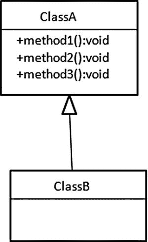
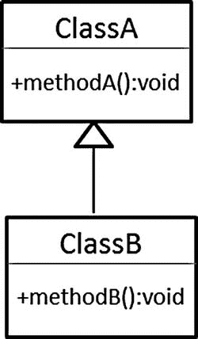
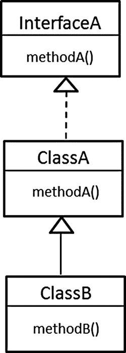

附录 A

Java 简介

处理复杂性的基本方法之一是抽象，它几乎应用于每一个学科。例如，抽象艺术是不表现或模仿外部现实或自然物体的艺术。再比如，有些词是抽象的，只存在于头脑中，像*真理*或*正义*。在 Java 中，抽象允许开发人员通过使用类层次结构将复杂的系统分成可管理的部分，这些类层次结构突出了对象的基本属性和行为，将它与其他对象区分开来。

类和对象

一个*类*是面向对象(OO)程序的基本构件。每个类通常代表一个现实世界的对象。类是一个模板，用于表示和创建对象的类别，从而通过定义表示抽象的对象的属性和行为来对抽象进行建模。对象的属性由字段定义，字段是可以存储表示该属性的值的变量。对象的行为是由方法定义的。一个类的字段和方法被称为它的*成员*。Java 中的类定义由成员声明(变量声明和方法声明)组成，并以 class 关键字开始，如清单 A-1 中的[所示。](#list1)

[上市 A-1](#_list1) 。Java 类

```java
class ClassA {
// members declarations
}
```

一个*对象*是一个类的实例。对象是以类为蓝本构建的，是类所代表的抽象的具体实例。必须先创建对象，然后才能在程序中使用它。从一个类创建对象的过程被称为*实例化*。当一个类被实例化时，返回一个引用值，该值表示所创建的对象。参考值表示特定的对象。对象引用(或者简单地说， *reference* )是一个变量，它可以存储一个引用值并提供一个对象的句柄。清单 A-2 中的代码创建了一个 ClassA 的对象。这个对象的引用值存储在变量 var1 中。

[列表 A-2](#_list2) 。创建对象

```java
ClassA  var1 = new ClassA();
```

创建对象的过程包括声明一个引用变量来存储对象的引用值，然后使用 new 关键字创建对象，接着通过调用构造函数来初始化对象。构造函数的概念将在后面的附录中解释。[清单 A-3](#list3) 将[清单 A-2](#list2) 分开，将声明和创建显示为单独的步骤。

[列表 A-3](#_list3) 。在单独的步骤中进行声明和创建

```java
1.    ClassA  var1 ;
2.    var1 = new ClassA();
```

*   第 1 行声明了变量 var1。引用变量 var1 现在可以用来操作引用值存储在引用变量中的对象。
*   第 2 行使用 new 关键字创建对象，并通过调用构造函数 ClassA()进行初始化。

变量

在 Java 中，变量存储原始数据类型的值和对象的引用值。

[列出 A-4](#list4) 说明了可以存储原始值的变量声明。

[上市 A-4](#_list4) 。变量声明

```java
int a, b, c;  // a, b and c are integer variables.
boolean flag; // flag is a boolean variable.
int i = 10,   // i is an int variable with initial value 10
```

存储对象参考值的变量称为*参考变量*。引用变量指定引用的类型，可以是类、数组或接口。[清单 A-5](#list5) 说明了引用变量的声明。

[列表 A-5](#_list5) 。引用变量声明

```java
ClassA  var1 ; // Variable var1 can reference objects of class ClassA.
```

清单 A-5 中的声明没有创建 ClassA 的任何对象；它只是创建一个变量来存储 ClassA 对象的引用。

实例成员

创建的每个对象(如清单 A-2 中的[所示)都有自己在类中定义的字段的副本。对象的字段被称为*实例变量*。对象中实例变量的值构成了对象的状态。对象的方法定义了它的行为。这些方法被称为*实例方法*。属于对象的实例变量和实例方法被称为*实例成员*](#list2) (见[清单 A-6](#list6) )以区别于只属于类的静态成员。

[列表 A-6](#_list6) 。实例成员

```java
1.    class ClassA{
2.    // instance Members
3.    int i ; // instance variable
4.    void methodA(){// instance method
5.    // do something
6.    }
7.    }
```

*   在第 3 行，I 是 int 类型的实例变量，int 是 I 的原始数据类型。
*   在第 4 行，methodA(){}是一个实例方法。

静态成员

用关键字 Static 声明的静态成员是只属于类而不属于类的任何特定对象的成员。一个类可以有静态变量和静态方法。静态变量在运行时类被加载时被初始化。类似地，一个类可以有静态方法，这些方法属于该类，而不属于该类的任何特定对象，如[清单中的 A-7](#list7) 所示。

[上市 A-7](#_list7) 。静态成员

```java
1.    class ClassA{
2.    static int i ;
3.    static void methodA(){
4.    // do something
5.    }
6.    }
```

与实例成员不同，类中的静态成员可以使用类名来访问，如下所示:

```java
ClassA.i          // accessing static variable in Line 2 of Listing A-7

ClassA.methodA(); // accessing static method in Line 3 of Listing A-7
```

尽管类中的静态成员可以通过对象引用来访问，但这样做被认为是不好的做法。

方法重载

每个方法都有一个名字和一个形参表。方法的名称及其形参表与形参表中形参的类型和顺序一起构成了方法的签名。只要方法签名不同，一个以上的方法可以有相同的方法名。这种方法名称相同，签名不同的方法称为*重载方法*，这种现象称为*方法重载* 。因此，重载方法是具有相同名称但参数列表不同的方法。清单 A-8 显示了方法 methodA 的五个实现。

[列表 A-8](#_list8) 。重载方法 a()

```java
1.    void methodA{(int a, double b) }
2.    int methodA(int a) { return a; }
3.    int methodA() { return 1; }
4.    long methodA(double a, int b) { return b; }
5.    long methodA(int c, double d) { return a; } //  Not ok.
```

*   方法的前四个实现被正确重载，每次都有不同的参数列表，因此也有不同的签名。
*   第 5 行的声明与第 1 行的声明具有相同的签名方法 A(int，double)。仅仅改变返回类型不足以重载一个方法；声明中的参数列表必须不同。

**注意**只有在同一个类中声明的方法和被该类继承的方法才能被重载。

数组

一个*数组*是一个数据结构，由固定数量的基本上相同数据类型的数据元素组成。数组中的任何元素都可以使用索引来访问。第一个元素总是在索引 0 处，最后一个元素在索引 n-1 处，其中 *n* 是数组中长度字段的值。在 Java 中，数组是这样的对象，数组中的所有元素都可以是特定的原始数据类型或特定的引用类型。[清单 A-9](#list9) 声明了引用数组对象的引用。

[列表 A-9](#_list9) 。数组声明

```java
int [] intArray;
ClassA[]  classAArray ;
```

清单 A-9 中的两个声明将 intArray 和 classAArray 声明为引用变量，可以引用 int 值数组和 ClassA 对象数组。使用 new 运算符，可以为特定类型的固定数量的元素构造数组。给定前面的数组声明，数组可以按如下方式构造:

```java
intArray = new int[10];      // array for 10 integers
classAArray = new ClassA[5]; // array of 5 objects of ClassA
```

构造函数

当使用 new 运算符创建对象时，调用构造函数来设置对象的初始状态。构造函数声明由可访问性修饰符组成，后跟带有以下声明的参数列表:

*   构造函数头中不允许除可访问性修饰符之外的修饰符。
*   构造函数不能返回值，因此，不要在构造函数头中指定返回类型，甚至是 void。
*   构造函数名必须与类名相同。

当在一个类中没有指定构造函数时，则由编译器为该类生成隐式默认构造函数，即没有任何参数的隐式构造函数，该编译器包括对超类的构造函数的调用。编译器将这个调用插入到超类的构造函数中，以确保对象的继承状态被初始化。[列出 A-10](#list10) 说明了对隐式默认构造函数的调用。

[上市 A-10](#_list10) 。隐式默认构造函数

```java
class ClassA {
int i;
}
class ClassB {

ClassA var1 = new ClassA(); // (1) Call to implicit default constructor.
}
```

在清单中，当在 ClassB 中创建 ClassA 对象时，调用下面的隐式默认构造函数:

```java
ClassA() { super(); }
```

在清单 A-11 的[中，ClassA 类在第 4 行提供了一个显式的默认构造函数。](#list11)

[列表 A-11](#_list11) 。显式默认构造函数

```java
1.    class ClassA {
2.    int i ;
3.    // Explicit Default Constructor:
4.    ClassA() {
5.    i = 1;
6.    }
7.
8.    }
9.    class ClassB {
10.    // ...
11.    ClassA var1 = new ClassA(); //  Call of explicit default constructor.
12.    }
```

显式默认构造函数确保任何使用对象创建表达式 new ClassA()创建的对象(如 ClassB 所示)都将其字段 I 初始化为 1。如果一个类定义了任何显式构造函数，那么编译器不会通过调用超类的构造函数来生成隐式默认构造函数，因此对象的状态不会被设置。在这种情况下，需要提供默认构造函数的实现。在清单 A-12 的[中，ClassA 类在第 4 行只提供了一个非默认的构造函数。当使用 new 操作符创建 ClassA 类的对象时，在第 8 行调用它。任何调用默认构造函数的尝试都将被标记为编译时错误，如第 11 行所示。](#list12)

[列表 A-12](#_list12) 。非默认构造函数

```java
1.    class ClassA {
2.    int i;
3.    // Only non-default Constructor:
4.    ClassA(int i) {
5.    this.i = i;
6.    }
7.    }
8.    class ClassB {
9.    // ...
10.    ClassA var1 = new ClassA(2);
11.    //ClassA var2 = new ClassA(); // Compile-time error.
12.    }
```

像方法一样，构造函数可以重载，因为所有构造函数的名称都被限制为与类名相同，所以只有当这些构造函数的参数列表不同时，它们的签名才能不同。在清单 A-13 的[中，ClassA 在第 4 行提供了默认构造函数的显式实现，在第 8 行提供了非默认构造函数。当在第 14 行创建 ClassA 类的对象时，调用非默认构造函数，在第 15 行调用默认构造函数。](#list13)

[列表 A-13](#_list13) 。默认和非默认构造函数

```java
1.    class ClassA {
2.    int i;
3.    // Explicit Default Constructor:
4.    ClassA() {
5.    i = 3;
6.    }
7.    // Non-default Constructor:
8.    ClassA(int i) {
9.    this.i = i;
10.    }
11.    }
12.    class ClassB {
13.    // ...
14.    ClassA var1 = new ClassA(4);
15.    ClassA var2 = new ClassA();
16.    }
```

封装

*封装*是通过防止数据和代码被外部代码(即来自类外的代码)随机访问和操纵来实现数据隐藏的技术。在实现方面，封装是通过将类中的字段私有并通过公共方法提供对这些字段的访问来实现的。如果一个字段被声明为私有，那么该类之外的任何人都不能访问它。清单 A-14 展示了一个封装的 Book 类。

[列表 A-14](#_list14) 。包装

```java
public class Book {
       private String title ;
       public String getTitle() {
        return title;
    }
    public void setTitle(String title) {
        this.title = title;
    }
 }
```

继承

继承是面向对象编程的基本原则之一。在 Java 中，默认情况下，所有类都扩展 java.lang.Object 类。一个类可以使用 extends 关键字扩展另一个类。Java 通过*实现继承*支持单一继承，其中一个类通过类扩展从另一个类继承状态和行为。Java 也以两种方式支持多重继承。

*   通过实现，类可以从一个或多个接口继承行为。
*   一个接口可以通过扩展从一个或多个接口继承行为。

[图 A-1](#Fig1) 展示了一个 UML [<sup class="calibre12">1</sup>](#Fn1) 类图，描述了一个类 ClassA 和一个子类 ClassB 之间的父子关系。ClassB 是 ClassA 的子类。请注意，带箭头的线条用于描述泛化，换句话说，就是父子关系。



[图 A-1](#_Fig1) 。父子关系。ClassB 扩展了 ClassA

清单 A-15 展示了如何用代码实现[图 A-1](#Fig1) 。它在第 26 行使用关键字 extends 说明了实现继承。

[列表 A-15](#_list15) 。实现继承

```java
1.    package apress.appendix_A
2.
3.    public class ClassA {
4.
5.        // Instance methods
6.        public void method1() {
7.            System.out.println(" classA - method1");
8.
9.        }
10.
11.        private void method2() {
12.            System.out.println(" classA - method2");
13.
14.        }
15.
16.        // Static methods
17.        public static void method3() {
18.            System.out.println(" classA - method3");
19.
20.        }
21.
22.    }
23.
24.    package apress.appendix_A;
25.
26.    public class ClassB extends ClassA {
27.
28.
29.    }
```

[清单 A-16](#list16) 是一个驱动类，用于测试[清单 A-15](#list15) 中的继承。

[列表 A-16](#_list16) 。测试继承

```java
package apress.appendix_A;

public class Test {

    public static void main(String[] args) {
        ClassB var1 = new ClassB();

        var1.method1();
        // var1.method2(); // private method not Inherited

        ClassB.method3();// static method

    }

}
```

[清单 A-16](#list16) 说明了即使 ClassB 中没有定义方法，ClassA 的方法在 ClassB 中也是可用的，并且可以在实际对象类型为 ClassB 的引用变量上调用。第 9 行显示私有方法没有被继承。

以下是输出:

```java
classA - method1
```

```java
classA - method3
```

构造函数链接

当子类通过调用它的一个构造函数被实例化时，该构造函数首先调用超类的无参数构造函数。在超类中，构造函数也调用其超类的构造函数。这个过程不断重复，直到到达 java.lang.Object 类的构造函数。换句话说，当你创建一个子类的对象时，它的所有超类也被实例化。[清单 A-17](#list17) 说明了这个*构造函数链接*。

[列表 A-17](#_list17) 。构造函数链接

```java
package apress.appendix_A;

public class ClassA {

    public ClassA() {

        System.out.println("Class A no-arg constructor");

    }

    public ClassA(String title) {
        System.out.println("Class A constructor");

    }

}

package apress.appendix_A;

public class ClassB extends ClassA {

    public ClassB(String title){
        System.out.println("Class B constructor ");

    }

}

package apress.appendix_A;

public class Test {

    /**
     * @param args
     */
    public static void main(String[] args) {
        ClassB var1 = new ClassB("classB");

    }

}
```

以下是输出:

```java
Class A no-arg constructor
```

```java
Class B constructor
```

输出证明了子类的构造函数调用了基类的无参数构造函数。Java 编译器将 ClassB 的构造函数更改为:

```java
public ClassB(String title) {
 super();
 System.out.println("Class B constructor ");
}
```

关键字 super 表示当前对象的直接超类的一个实例。因为 super 是从子类的实例中调用的，所以 super 表示 ClassA 的实例。可以使用 super 关键字从子类的构造函数中显式调用父类的构造函数，但 super 必须是构造函数中的第一条语句。如果希望调用超类中的另一个构造函数，使用 super 关键字会很方便。

```java
public ClassB(String title) {
 super(title);
 System.out.println("Class B constructor ");
}
```

多态性

多态性是面向对象编程最重要的原则之一，也是面向对象编程的核心。多态性指的是 Java 中的一个对象可以有多种形式。为了理解多态在 Java 中是如何工作的，让我们看一个扩展另一个类的例子(见[图 A-2](#Fig2) )。



[图 A-2](#_Fig2) 。扩展一个类

图 A-2 显示了一个超类-子类的关系。此关系允许您将对象分配给类型不同于对象类型的引用变量，如下所示:

```java
ClassA var1 = new ClassB();
```

这将 ClassB 类型的对象分配给引用类型为 ClassA 的引用变量 var1。这种赋值在编译时和运行时有不同的含义。在编译时，由于 var1 的类型是 ClassA，编译器将不允许调用 var1 上不在 ClassA 中的方法，即使该方法在 ClassB 中。[清单 A-18](#list18) 显示了[图 A-2](#Fig2) 的代码实现。

[列表 A-18](#_list18) 。遗产

```java
package apress.appendix_A;
public class ClassA {

    public void methodA() {
        System.out.println("methodA() in ClassA");
    }

}

package apress.appendix_A;

public class ClassB extends ClassA {

    public void methodB() {
        System.out.println("methodB() in ClassB");
    }

}
```

[清单 A-19](#list19) 说明了该测试。

[清单 A-19](#_list19) 。[清单 A-18](#list18) 的驱动程序

```java
package apress.appendix_A;

public class Test {
    public static void main(String[] args) {

        ClassA var1 = new ClassB();
        // var1.methodB(); uncommenting this code will result in compile time
        // error
        var1.methodA();

    }
}
```

在清单 A-19 的[第 2 行，即使 methodB()是 ClassB，也不可能对 var1 调用 methodB()，因为 var1 的引用类型是 ClassA，而 ClassA 没有 methodB()。](#list19)

现在让我们考虑 ClassB 覆盖 ClassA 的 methodA()的情况(见[图 A-3](#Fig3) )。


[图 A-3](#_Fig3) 。重写方法

现在，ClassB 的代码看起来像清单 A-20 中的[所示。](#list20)

[上市 A-20](#_list20) 。重写方法 a()

```java
package apress.appendix_A;

public class ClassB extends ClassA {

    public void methodA() {
        System.out.println("methodA() in ClassB");
    }

}
```

现在 ClassA 和 ClassB 都有相同的方法，methodA()。

以下作业:

```java
ClassA var1 = new ClassB();
```

确认可以对 var1 调用 methodA()，因为 ClassA 有 methodA()。因此，下面的测试将会编译:

```java
package apress.appendix_A;

public class Test {
    public static void main(String[] args) {

        ClassA var1 = new ClassB();
        var1.methodA();

    }
}
```

也就是说，在编译时，编译器将对照 var1 的引用类型 ClassA 检查 var1 上的调用 methodA()，并且编译器将允许它，因为 methodA()存在于 ClassA 中。

但是如果我们进行测试会发生什么呢？也就是会调用哪个 methodA()，ClassA 中的 methodA()还是 ClassB 中的 methodA()。运行测试时，它会给出以下输出:

```java
methodA() in ClassB
```

编译器检查了类 a 中的方法 a()，但执行了类 b 中的方法 a()。这是因为在运行时，JVM 根据实际的对象类型验证而不是编译 methodA()。代码中的实际对象类型(class a var 1 = new class b()；)是 ClassB，而 ClassA 是引用类型。因此，JVM 检查调用方法 a()是否在 ClassB()中，并调用它。这种现象被称为*多态性*。如果 methodA()不在 ClassB 中会发生什么？为了理解这一点，我们实现了[人物 A-4](#Fig4) 的代码。



[图 A-4](#_Fig4) 。b 类层次结构

[图 A-4](#Fig4) 显示了 InterfaceA，只是为了说明引用类型可以是一个接口或者一个类(或者抽象类)，编译器会以类似的方式对照其中任何一个的引用类型检查方法的存在性。[清单 A-21](#list21) 实现了[图 A-4](#Fig4) 所示的层级。

[列表 A-21](#_list21) 。B 类层次结构

```java
package apress.appendix_A;
public interface InterfaceA {

    public void methodA();

}

package apress.appendix_A;
public class ClassA implements InterfaceA{

    @Override
    public void methodA() {
        System.out.println("methodA() in ClassA");
    }
}

package apress.appendix_A;
public class ClassB extends ClassA {
    public void methodB() {
        System.out.println("methodB() in ClassB");
    }
}
```

在[清单 A-21](#list21) 中，调用 methodA()对照引用类型 InterfaceA 进行验证，在检查到 methodA()存在于 InterfaceA 中后，编译器批准调用；也就是说，没有编译时错误。运行[清单 A-22](#list22) 中所示的测试。

[列表 A-22](#_list22) 。测试应用

```java
package apress.appendix_A;
public class Test {
    public static void main(String[] args) {
        InterfaceA var1 = new ClassB();
        var1.methodA();
    }
}
```

您将获得以下输出:

```java
methodA() in ClassA
```

清单 A-22 的第 4 行[中的实际对象类型是 ClassB，所以在运行时 JVM 检查 methodA()是否存在于 ClassB 中。在 ClassB 中找不到 methodA()时(因为它不存在于 ClassB 中)，JVM 检查 methodA()在 ClassB 的层次结构中是否存在，因为 JVM 认为在 ClassB 的层次结构中一定存在 methodA ();否则，编译器不会批准该调用。因为 methodA()存在于 ClassA 中，所以 JVM 在运行时执行 ClassA 中的 methodA()。](#list22)

摘要

本附录向您介绍了 Java 和面向对象编程的基础。您了解了类是面向对象程序的基本构件，以及如何从类中实例化对象。接下来，向您介绍了面向对象编程的三大支柱:封装、继承和多态。

[<sup class="calibre12">1</sup>](#_Fn1)【www.uml.org/】T4