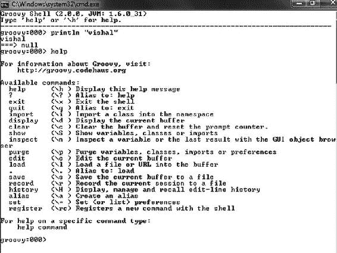

# 十、附录 B：Groovy 简介

Groovy 是一种用于 Java 虚拟机的敏捷而动态的语言，它建立在 Java 的优势之上，但受 Python、Ruby 和 Smalltalk 等语言的启发，它还增加了一些强大的特性。它与所有现有的 Java 类和库无缝集成，并编译成 Java 字节码，因此您可以在任何可以使用 Java 的地方使用它。Groovy 提供了静态类型检查和静态编译代码以提高健壮性和性能的能力，并支持特定领域语言和其他紧凑语法，因此您的代码变得易于阅读和维护。

Groovy 让 Java 开发人员几乎没有学习曲线就可以使用现代编程特性；在开发 web、GUI、数据库或控制台应用时，通过减少脚手架代码来提高开发人员的工作效率。并通过支持单元测试和开箱即用来简化测试。

入门指南

让我们从一个传统的“你好，世界”节目开始。但是首先你需要安装 Groovy。Groovy 以. zip 文件或特定平台安装程序的形式捆绑在 Windows、Ubuntu 和 Debian(以及 openSUSE，直到最近的版本)上。本节解释如何安装压缩版本，因为它涵盖了大多数平台。

要安装 Groovy，请遵循以下步骤:

1.  下载最新稳定的 Groovy 二进制版本。来自 http://groovy.codehaus.org/Download 的 zip 文件。
2.  将 groovy-binary-X.X.X.zip 解压缩到您选择的位置。
3.  将 GROOVY_HOME 环境变量设置为解压缩。压缩文件。
4.  将%GROOVY_HOME%\bin 目录添加到您的系统路径中。

**注意** Groovy 需要 Java，所以你需要有一个可用的版本(虽然 Groovy 1.6 支持 JDK 1.4 或更高版本，但对于 Groovy 1.7 以后，至少需要 JDK 1.5)。

要验证您的安装，请打开控制台并键入以下内容:

```java
>groovy -v
```

您应该会看到类似这样的内容:

```java
Groovy Version: 2.0.0 JVM: 1.6.0_31 Vendor: Sun Microsystems Inc. OS: Windows 7
```

现在你可以编写你的第一个“Hello World”程序了(见[清单 B-1](#list1) )。

[列表 B-1](#_list1) 。Java 中的“Hello World”

```java
1.   public class HelloWorld {
2.      public static void main( String[] args )
3.   System.out.println("Hello World!");
4.      }
5.   }
```

*   *第 1 行到第 2 行*:方法和字段的默认可见性是 public，所以可以去掉 public 修饰符。
*   *第 2 行* : Groovy 支持动态类型，所以可以在 main()上丢弃类型信息和返回类型 void。
*   *第 3 行*:每个 Groovy 对象都有自己的 disposure println，可以看作是 System.out.println 的快捷方式。
*   第 3 行:行尾的分号是可选的，所以你也可以删除它。

根据这些规则，您可以将清单 B-1 的转换为清单 B-2 的[。](#list2)

[列表 B-2](#_list2) 。应用 Groovy 规则转换“Hello World”

```java
1.   class HelloWorld {
2.      static main( args ){
3.   println "Hello World!"
4.      }
5.   }
```

如您所见，[清单 B-2](#list2) 要紧凑得多。您可以以脚本的形式编写和执行 Groovy 代码，这些脚本也被编译成字节码。因此，你可以为“Hello World”程序编写清单 B-3 中的 Groovy 代码。

**注意**任何 Java 类/对象也是 Groovy 类/对象。

[列表 B-3](#_list3) 。“Hello World”的精彩脚本

```java
println "Hello World!"
```

您可以通过命令行、GroovyShell 或 GroovyConsole 运行 Groovy 脚本和类。

格罗维谢尔

GroovyShell 是一个交互式命令行应用(Shell ),允许您创建、运行、保存和加载 Groovy 脚本和类。要启动 GroovyShell，请运行 groovysh。图 B-1 展示了如何使用 GroovyShell 来执行一个简单的脚本。


[图 B-1](#_Fig1) 。使用 GroovyShell

如你所见，这个脚本打印了 vishal。然后你看到===> null。按照惯例，Groovy 总是返回方法的结果。在这种情况下，没有结果，因此返回 null。GroovyShell 包含一个内置的帮助工具，您可以使用它来了解关于 Shell 的更多信息。要访问它，请在提示符下键入 help。[图 B-2](#Fig2) 显示了帮助列表。



[图 B-2](#_Fig2) 。使用 GroovyShell 帮助

GroovyConsole

图 B-3 中的【GroovyConsole 是 GroovyShell 的图形化版本。它是使用 SwingBuilder 编写的，Swing builder 是一个 Groovy 模块，它使构建 Swing 用户界面变得更加容易。


图 B-3 。groovycconsole(groovycconsole)

[图 B-4](#Fig4) 显示了输出分离的 GroovyConsole。您可以通过多种方式启动 GroovyConsole，这取决于您的环境和您安装 Groovy 的方式。最简单的方法是执行 GroovyConsole，它位于 Groovy bin 目录中。


[图 B-4](#_Fig4) 。使用 GroovyConsole 并分离输出

控制台提供了创建、保存、加载和执行类和脚本的能力。控制台的一些不错的特性是撤销/重做和检查变量的能力。如果你必须在使用 GroovyShell 和 GroovyConsole 之间做出选择，我推荐 GroovyConsole。您还可以在脚本中定义类并立即使用它们，如清单 B-4 中的[所示。](#list4)

[清单 B-4](#_list4) 。在脚本中定义类

```java
class HelloWorld {
   def hello( name ){
      "Hello ${name}!"
   }
}
def hw = new HelloWorld()
println hw.hello("Vishal")
```

*   方法 hello 的返回类型不是特定的类型，所以使用保留关键字 def。
*   字符串“Hello”不是一个简单的 java.lang.String，事实上，它是 Groovy 的一个特性:GString。这些类型的字符串允许字符串插值，这将在下一节中解释。

Groovy 支持两种类型的字符串:普通 Java 字符串和 GStrings。如果 Groovy 中的字符串被单引号或双引号或三引号包围，并且没有未转义的美元符号($)，则该字符串是 java.lang.String 的实例。

GStrings

g string 是 groovy.lang.GString 的一个实例，允许文本中包含占位符。gstring 不是 String 的子类，因为 String 类是最终的，不能扩展。GString 就像一个普通的字符串，但是它允许使用${..}.只有当嵌入变量是表达式的占位符时，才需要花括号。Groovy 支持在 Perl 和 Ruby 等许多其他语言中发现的一个概念，称为*字符串插值* ，即在字符串中替换表达式或变量的能力。如果您有使用 Unix shell 脚本、Ruby 或 Perl 的经验，这应该很熟悉。Java 不支持字符串插值。您必须手动连接这些值。[清单 B-5](#list5) 是您需要用 Java 编写的代码类型的一个例子，而[清单 B-6](#list6) 展示了使用 GString 的相同代码。

[清单 B-5](#_list5) 。用 Java 构建字符串

```java
String name = "Vishal" ;
String helloName = "Hello " + name ;
System.out.println(helloName) ;
```

[清单 B-6](#_list6) 。Groovy/GString 中的字符串插值

```java
1.   str1= "Vishal"
2.   str2 = "Hello "
3.   println "$str2$str1"
```

在第 3 行中，没有使用花括号，因为只有当嵌入的变量是表达式的占位符时才需要花括号。当 Groovy 看到一个用双引号或斜杠定义的字符串和一个嵌入的表达式时，Groovy 会构造一个 org . code Haus . Groovy . runtime . gstringimpl，而不是 java.lang.String。注意，可以在${}符号中包含任何有效的 Groovy 表达式；这包括方法调用或变量名。

Groovy 支持单行字符串和跨多行的字符串。在接下来的小节中，您将学习 Groovy 中支持的各种字符串。

单行字符串

单行字符串可以是单引号或双引号。单引号中的字符串是字面意思。用单引号定义的字符串不解释嵌入的表达式，如清单 B-7 所示。

[清单 B-7](#_list7) 。单引号字符串不解释嵌入的表达式

```java
name = "vishal"
s1 = 'hello $name'
println s1
Here is the output:
hello $name
```

您可以在单引号中嵌套双引号，如清单 B-8 中的[所示。](#list8)

[清单 B-8](#_list8) 。单引号中嵌套的双引号

```java
s1 = 'hello "vishal"'
println s1
```

使用双引号定义的字符串将解释字符串中嵌入的表达式，如清单 B-9 中的[所示。](#list9)

[清单 B-9](#_list9) 。双引号字符串解释嵌入的表达式

```java
def name = "vishal"
s1 = "hello $name"
println s1
Here is the output:
hello vishal
```

您可以在双引号中嵌套单引号，如清单 B-10 所示。

[清单 B-10](#_list10) 。双引号中嵌套的单引号

```java
s1 = "hello 'vishal'"
println s1
Here is the output:
hello 'vishal'
```

多行字符串

Groovy 支持跨多行的字符串。多行字符串通过使用三个双引号或三个单引号来定义。多行字符串支持对于创建模板或嵌入式文档(如 XML 模板、SQL 语句、HTML 等)非常有用。例如，您可以使用多行字符串和字符串插值来构建电子邮件消息的正文，如[清单 B-11](#list11) 所示。多行字符串的字符串插值与常规字符串的工作方式相同:用双引号创建的多行字符串计算表达式，而单引号字符串则不计算表达式。

[清单 B-11](#_list11) 。使用多行字符串

```java
def name = "Vishal"
def multiLineString = """
Hello, ${name}
This is a multiline string with double quotes
"""
println multiLineString
```

```java
Hello, Vishal
This is a multiline string with double quotes
```

斜线弦

如前所述，斜线可以用来定义字符串。斜线符号有一个好处:不需要额外的反斜杠来转义特殊字符。唯一的例外是转义反斜杠:\/。当创建需要反斜杠或路径的正则表达式时，斜杠符号会很有帮助。[清单 B-12](#list12) 展示了使用正则引号和斜杠定义正则表达式来匹配文件系统路径的区别。

[清单 B-12](#_list12) 。使用斜线字符串

```java
def quotedString = 'Hello Vishal'
def slashyString = /Hello Vishal/
println slashyString
```

```java
Hello Vishal
```

[清单 B-12](#list12) 定义了两个变量，并将它们分配给一个目录路径。第一个变量定义 quotedString 使用单引号符号来定义字符串。使用单引号符号要求使用额外的反斜杠对嵌入的反斜杠进行转义。

多行斜线字符串

斜线字符串也可以跨越多行。当使用 regex freespacing 注释风格时，这对于多行 regex 特别有用(见清单 B-13[)。](#list13)

[清单 B-13](#_list13) 。使用多行斜线字符串

```java
1.    def name = "vishal"
2.    def path= "c:/groovy"
3.    def multilineSlashy = /
4.    Hello $name
5.    path= $path
6.    dollar = $
7.    path = c:\/groovy
8.    /
9.    println multilineSlashy
```

```java
Hello vishal
path= c:/groovy
dollar = $
path = c:/groovy
```

让我们更详细地看看[清单 B-13](#list13) 。

*   第 1 行定义了一个变量 name，并将值“vishal”赋给它。
*   第 2 行定义了一个变量 path，并将值“c:/groovy”赋给它。
*   第 3 行定义了一个变量 multilineSlashy，并为它分配了一个多行字符串，包括斜杠之间的第 8 行。
*   第 4 行有一个表达式$name，其计算结果为 vishal，如输出所示。
*   第 5 行有一个表达式$path，其计算结果为 c:/groovy，如输出所示。
*   第 6 行有一个$符号，但它不是一个表达式，所以它显示在输出中。
*   第 7 行有一个斜杠，需要转义。

美元斜线字符串

在多行斜线字符串中，斜线仍然需要转义。此外，在多行斜线字符串中，不是表达式的未转义美元符号会导致 MissingPropertyException，如清单 B-14 中的[所示。](#list14)

[清单 B-14](#_list14) 。多行斜线字符串中缺少 PropertyException

```java
1.    def name = "vishal"
2.    def path= "c:/groovy"
3.    def multilineSlashy = /
4.    Hello $name
5.    path= $path
6.    dollar = $test
7.    path = c:\/groovy
8.     /
9.    println multilineSlashy
```

```java
Caught: groovy.lang.MissingPropertyException: No such property: test for class:
hello
groovy.lang.MissingPropertyException: No such property: test for class: hello
at hello.run(hello.groovy:3)
```

在[清单 B-14](#list14) 中，没有 test 这样的属性；第 6 行中的$test 被解释为一个表达式，这会导致 MissingPropertyException。

现在，让我们看看清单 B-15 中的代码，特别是第 6 行。

[清单 B-15](#_list15) 。多行斜线字符串中的非转义美元符号

```java
1.    def name = "vishal"
2.    def path= "c:/groovy"
3.    def multilineSlashy = /
4.    Hello $name
5.    path= $path
6.    dollar = $ test
7.    path = c:\/groovy
8.     /
9.    println multilineSlashy
```

这一次，Groovy 没有将第 6 行中的$ test 解释为表达式，因为$和 test 之间有一个空格，它的输出如下所示:

```java
Hello vishal
path= c:/groovy
dollar = $ test
path = c:/groovy
```

有了美元斜杠字符串，您不再需要用前面的反斜杠对斜杠进行转义(多行斜杠字符串需要对斜杠进行转义)，如果需要，您可以使用$$对$进行转义，或者使用$/对斜杠进行转义，如清单 B-16 中的[所示。](#list16)

[清单 B-16](#_list16) 。使用美元斜线字符串

```java
1.    def name = "vishal"
2.    def path= "c:/groovy"
3.    def dollarSlashy = $/
4.    Hello $name
5.    path = $path
6.    dollar = $$test
7.    path = c:/groovy
8.    /$
9.    println dollarSlashy
```

```java
Hello vishal
path= c:/groovy
dollar = $test
path = c:/groovy
```

让我们更详细地看看[清单 B-16](#list16) 。

*   第 3 行定义了一个直到第 8 行的 dollarSlashy 字符串。
*   第 6 行有一个$test，它在清单 B-14 中的多行斜线字符串的情况下导致了 MissingPropertyException，现在使用一个$对其进行转义。

集体数据类型

Groovy 支持许多不同的集合，包括数组、列表、映射、范围和集合。让我们看看如何创建和使用每种集合类型。

数组

Groovy 数组是一个对象序列，就像 Java 数组一样(见[列出 B-17](#list17) )。

[上市 B-17](#_list17) 。创建和使用数组

```java
1.    def stringArray = new String[3]
2.    stringArray[0] = "A"
3.    stringArray[1] = "B"
4.    stringArray[2] = "C"
5.    println stringArray
6.    println stringArray[0]
7.    stringArray.each { println it}
8.     println stringArray[-1..-3]
```

*   第 1 行创建了一个大小为 3 的字符串数组。
*   第 2 到 4 行使用一个索引来访问数组。
*   第 7 行演示了如何使用 each()方法遍历数组。each()方法用于遍历每个元素并对其应用闭包。
*   第 8 行显示了一些有趣的东西——它使用一个范围来访问数组，稍后将讨论这个范围。

```java
[A, B, C]
A
A
B
C
[C, B, A]
```

列表

Groovy 列表是对象的有序集合，就像在 Java 中一样。它是 java.util.List 接口的实现。[清单 B-18](#list18) 说明了如何创建一个清单和常见用法。

[清单 B-18](#_list18) 。创建和使用列表

```java
1.    def emptyList = []
2.    def list = ["A"]
3.    list.add "B"
4.    list.add "C"
5.    list.each { println it }
6.    println list[0]
7.    list.set(0, "Vishal")
8.    println list.get(0)
9.     list.remove 2
10.    list.each { println it }
```

*   在第 1 行，通过给属性赋值[]来创建一个空列表。
*   第 2 行到第 4 行创建一个列表，其中已经有一个条目，并向列表中添加条目。
*   第 5 行遍历列表，调用闭包来打印内容。each()方法提供了遍历列表中所有元素的能力，在每个元素上调用闭包。
*   第 6 行演示了如何使用索引来访问列表。列表是从零开始的。
*   第 7 行显示了如何使用一个索引为位置 0 赋值“Vishal”。
*   第 8 行使用 get()方法访问列表。

```java
A
B
C
A
Vishal
Vishal
B
```

地图

Groovy 映射是一个无序的键-值对集合，其中的键是惟一的，就像在 Java 中一样。它是 java.util.Map 的一个实现。

[清单 B-19](#_list19) 。创建和使用地图

```java
1.    def map = ['a':'Value A', 'b':'Value B ']
2.    println map["a"]
3.    println map."a"
4.    println map.a
5.    println map.getAt("b")
6.    println map.get("b")
7.    println map.get("c", "unknown")
8.    println map
9.    map.d = "Value D"
10.    println map.d
11.    map.put('e', 'Value E')
12.    println map.e
13.    map.putAt 'f', 'Value F'
14.    println map.f
15.    map.each { println "Key: ${it.key}, Value: ${it.value}" }
16.    map.values().each { println it }
```

*   第 1 行演示了如何定义一个包含多个条目的映射。使用方括号符号时，冒号将键和值分开。
*   第 2 行到第 10 行展示了几种不同的访问地图的技术。
*   第 11 行到第 13 行展示了将项目放入地图的几种不同技术。

```java
Value A

Value A

Value A

Value B

Value B

unknown

[a:Value A, b:Value B , c:unknown]

Value D

Value E

Value F

Key: a, Value: Value A

Key: b, Value: Value B

Key: c, Value: unknown

Key: d, Value: Value D

Key: e, Value: Value E

Key: f, Value: Value F

Value A

Value B

unknown

Value D

Value E

Value F
```

范围

范围是连续值的列表。从逻辑上来说，你可以认为它是从 1 到 10 或者从 a 到 z。事实上，范围的声明就是:1..10 或者 a。z '。范围是实现 java.lang.Comparable 的任何对象的列表。这些对象具有 next()和 previous()方法，以便于在范围内导航。清单 B-20 展示了你可以用范围做的一些事情。

[清单 B-20](#_list20) 。创建和使用范围

```java
1.    def numRange = 0..9
2.    numRange.each {print it}
3.    println ""
4.    println numRange.contains(5)
5.    def reverseRange = 9..0
6.    reverseRange.each {print it}
7.    def exclusiveRange = 1..<10
8.    println ""
9.    exclusiveRange.each {print it}
10.    def alphabet = 'a'..'z'
11.    println ""
12.    println alphabet.size()
13.    println alphabet[25]
```

*   第 1、5、7 和 10 行说明了如何定义范围。
*   第 1 行定义了数字的包含范围。
*   第 10 行定义了小写字母的包含范围。
*   第 7 行定义了一个排他的数字列表。该范围产生 1 到 9 的数字范围，不包括 10。
*   第 5 行以相反的顺序创建一个范围，从 9 到 0。通常，范围用于迭代。在清单 B-20 的[中，each()用于在范围内迭代。](#list20)[清单 B-21](#list21) 展示了使用范围进行迭代的三种方式:一种在 Java 中，两种在 Groovy 中。

```java
0123456789

true

9876543210

123456789

26

z
```

[清单 B-21](#_list21) 。使用范围进行迭代

```java
for (i in 0..9) {
println i
}
(0..9).each { i->
println i
}
```

each()方法用于遍历每个元素并对其应用闭包。

设置

Groovy 集合是一个无序的对象集合，没有副本，就像 Java 一样。它是 java.util.Set 的实现。默认情况下，除非您另外指定，否则 Groovy 集合是 java.util.HashSet。如果您需要一个除 HashSet 之外的集合，您可以通过实例化它来创建任何类型的集合，如 def TreeSet = new TreeSet()。[清单 B-22](#list22) 展示了如何创建集合和常用用法。

[清单 B-22](#_list22) 。创建和使用集合

```java
def  set = ["A", "B" ] as Set
set.add "C"
println set
set.each { println it }
set.remove "B"
set.each { println it }
```

```java
[A, B, C]

A

B

C

A

C
```

创建空集类似于创建空列表。不同的是增加了 Set 子句。列表和集合之间的一个重要区别是，列表提供基于索引的访问，而集合不提供。

方法

[清单 B-23](#list23) 展示了用 Java 方式在 Groovy 中定义一个方法，而[清单 B-24](#list24) 展示了同样的事情，但是使用了 Groovy 语法。

[清单 B-23](#_list23) 。用 Java 方式定义方法

```java
public String hello(String name) {
return "Hello, " + name;
}
```

[清单 B-24](#_list24) 。使用 Groovy 习惯用法定义方法

```java
def hello(name) {
"Hello, ${name}"
}
```

*   返回类型和返回语句不包含在方法体中。Groovy 总是返回最后一个表达式的结果——在本例中，是 GString“Hello，。。."。
*   未定义访问修饰符 public。除非您另外指定，否则 Groovy 默认所有的类、属性和方法都是公共访问。

关闭

函数式编程为您提供了在底层原则 : *【参考透明性】*，*高阶函数*，以及*不可变值*的基础上考虑并发性的正确基础。理解这些关键元素对于理解闭包(以及 Groovy 中最近引入的其他功能特性)至关重要。函数式编程是建立在纯函数的前提下的。在数学中，函数是纯粹的，因为它们没有副作用。考虑经典函数 sin(x): y = sin(x)。无论调用 sin(x)多少次，sin(x)都不会在内部修改全局或上下文状态。这样的函数是纯粹的，没有副作用，并且不受上下文影响。这种对周围环境的遗忘被称为参照透明性*。如果没有修改全局状态，函数的并发调用是稳定的。在函数式编程中，函数是一等公民，这意味着函数可以赋给变量，函数可以传递给其他函数，函数可以作为其他函数的值返回。而这种以函数为自变量或者返回一个函数的函数，叫做高阶函数*。**

 **引用透明性、高阶函数和不可变值一起使函数式编程成为编写并发软件的更好方式。虽然函数式语言都是关于消除副作用的，但是一种从不考虑副作用的语言是没有用的。事实上，引入副作用对任何语言都是至关重要的。所有函数式语言都必须提供以受控方式引入副作用的机制，因为即使函数式语言是关于纯编程的，不认可副作用的语言也是无用的，因为输入和输出本质上是副作用的衍生物。

理解闭包

以受控方式引入副作用的技术之一是*关闭*。Groovy 中的闭包定义遵循以下语法:

```java
{ [closure parameters ->] closure body}
```

其中[closure parameters->]是可选的逗号分隔的参数列表，闭包体可以是一个表达式以及零个或多个 Groovy 语句。参数看起来类似于方法的参数列表，这些参数可以是有类型的，也可以是无类型的。Groovy 闭包是花括号{}内的可重用代码块，它可以赋给属性或变量，或者作为参数传递给方法。闭包只在被调用时执行，而不是在被定义时执行。[清单 B-25](#list25) 说明了这一点。

[清单 B-25](#_list25) 。叫停

```java
1.    def closureVar = {println 'Hello world'}
2.    println "closure is not called yet"
3.    println " "
4.    closureVar.call()
```

*   第 1 行:这一行包含不带参数的闭包，由一个 println 语句组成。因为没有参数，所以省略了参数列表和->分隔符。闭包由标识符 closureVar 引用。
*   第 4 行:这一行通过 call()方法使用显式机制来调用闭包。您也可以使用隐式的无名调用方法:closureVar()。如输出所示，闭包在第 4 行调用时打印“Hello world ”,而不是在第 1 行定义时。

以下是输出:

```java
closure is not called yet
Hello world
```

[清单 B-26](#list26) 展示了与[清单 B-25](#list25) 中相同的闭包，但带有参数。

[清单 B-26](#_list26) 。带参数的闭包

```java
1.    def closureVar = {param -> println "Hello ${param}"}
2.    closureVar.call('world')
3.    closureVar ('implicit world')
```

*   *第 2 行*:这是一个带有实际参数‘world’的显式调用。
*   *第 3 行*:这是一个隐式调用，实际参数为‘隐式世界’。

```java
Hello world
Hello implicit world
```

如清单 B-27 所示，闭包的形参可以被赋予默认值。

[清单 B-27](#_list27) 。具有默认值的参数

```java
1.    def sayHello= {str1, str2= " default world" -> println "${str1} ${str2}" }
2.    sayHello("Hello", "world")
3.    sayHello("Hello")
```

*   *第 1 行*:say hello 闭包有两个参数，其中一个参数 str2 有一个默认值。
*   *第 3 行*:闭包只提供一个实际参数，使用第二个参数的默认值。

以下是输出:

```java
Hello world
Hello default world
```

闭包总是有返回值。该值可以通过闭包体内的一个或多个显式 return 语句来指定，如清单 B-28 中的[所示，或者如果 return 没有显式指定，则作为最后执行的语句的值，如清单 B-29](#list28) 中的[所示。](#list29)

[清单 B-28](#_list28) 。使用 Return 关键字

```java
def sum = {list -> return list.sum()}
assert sum([2,2]) == 4
```

[清单 B-29](#_list29) 。Return 关键字可选

```java
def sum = {list -> list.sum()}
assert sum([2,2]) == 4
```

要理解闭包，你必须理解自由变量的概念。当函数体引用一个或多个自由变量时，就形成了闭包。自由变量不是函数的局部变量，不作为参数传递给函数，而是在定义函数的封闭作用域中定义的。因此，闭包指的是参数列表中没有列出的变量(自由变量)。它们被“绑定”到定义它们的范围内的变量。清单 B-30 说明了这一点。

[清单 B-30](#_list30) 。自由变量

```java
def myConst = 5
def incByConst = { num -> num + myConst }
assert  incByConst(10) == 15
```

运行时“关闭”自由变量(清单 B-30 中的[中的 myConst ),以便在执行函数时它是可用的。也就是说，编译器创建一个闭包来封装自由变量的外部上下文并绑定它们。](#list30)

隐式变量

在 Groovy 闭包内，定义了一个具有特殊含义的隐式变量(it)。如果只有一个参数被传递给闭包，那么参数列表和->符号可以省略，闭包将可以访问它，它代表那个参数，如清单 B-31 所示。

[清单 B-31](#_list31) 。使用它

```java
def closure = {println "Hello ${it}"}
closure.call('world')
```

```java
Hello world
```

一个闭包总是至少有一个参数，如果没有定义显式参数，那么这个参数可以通过隐式参数 it 在闭包体内使用。开发人员永远不必声明 it 变量——就像对象中的 this 参数一样，它是隐式可用的。如果闭包被调用时没有参数，那么它将是 null。

明确宣布关闭

Groovy 中定义的所有闭包本质上都是从类型闭包派生出来的。因为 groovy.lang 是自动导入的，所以您可以在代码中将 Closure 作为一种类型来引用。这是一个闭包的显式声明。显式声明闭包的优点是不会无意中将非闭包赋给这样的变量。清单 B-32 展示了如何显式声明一个闭包。

[清单 B-32](#_list32) 。闭包的显式声明

```java
Closure closure = { println it }
```

将该方法作为闭包重用

Groovy 提供了方法闭包运算符(。&) 重用方法作为闭包。方法闭包操作符允许像闭包一样访问和传递方法。清单 B-33 说明了这一点。

[清单 B-33](#_list33) 。将该方法作为闭包重用

```java
1.    def list = ["A","B","C","D"]
2.    String printElement(String element) {
3.    println element
4.    }
5.    list.each(this.&printElement)
```

[清单 B-33](#list33) 创建一个名字列表，并遍历列表打印出名字。在第 5 行，方法闭包运算符(。&)使方法 printElement 作为闭包被访问。以下是输出:

```java
A

B

C

D
```

将闭包作为参数传递

闭包是一个对象。您可以像传递任何其他对象一样传递闭包。一个常见的例子是使用闭包迭代一个集合(参见清单 B-34 )。

[清单 B-34](#_list34) 。将闭包作为参数传递

```java
def list = ["A", "B", "C"]
def x = { println it }
list.each(x)
```

```java
A

B

C
```

专业操作员

Groovy 包括几个在其他编程语言中可以找到的标准操作符，以及特定于 Groovy 的操作符，这些操作符使 Groovy 变得如此强大。在接下来的小节中，您将学习 Groovy 中的特殊操作符，比如 spread、Elvis、安全导航、字段、方法闭包和菱形操作符。

传播算子

展开运算符(*。) 是一种在对象集合上调用方法或闭包的速记技术。[清单 B-35](#list35) 展示了 spread 操作符在列表中迭代的用法。

[清单 B-35](#_list35) 。使用扩展运算符

```java
1.    def map = [1:"A", 2:"B", 3:"C", 4:"D"]
2.    def keys = [1, 2, 3, 4]
3.    def values = ["A", "B", "C", "D"]
4.    assert map*.key == keys
5.    assert map*.value == values
```

第 4 行和第 5 行使用 spread 操作符来访问映射的键和值。

Elvis 操作员

猫王操作员(？:) 是 Java 三元运算符的简写版本。比如 b= a？:1 可以解释如下:

```java
if(a != 0)
b = a
else
b = 1
```

清单 B-36 展示了在 Groovy 中使用 Java 三元和 Elvis 操作符。

[清单 B-36](#_list36) 。使用 Elvis 操作员

```java
def firstName = author.firstName == null ? "unknown" : author.firstName // Java ternary
def firstName2 = author.firstName ?: "unknown" // Groovy Elvis
```

在这两种情况下，如果 author.firstName 为 null，那么 firstName 将设置为 unknown。Elvis 运算符示例的 author.firstName 片段被称为*表达式*。如果表达式的计算结果为 false 或 null，则返回冒号后的值。

安全导航/解引用操作员

安全导航/解引用运算符(？。) 用于避免空指针异常。考虑一下的情况，您有一个 Author 对象，您想打印这个名字。如果当您访问 firstName 属性时，Author 对象为空，您将得到一个 NullPointerException(参见[清单 B-37](#list37) )。

[清单 B-37](#_list37) 。使用安全导航/取消引用运算符

```java
class Author {
String firstName
String lastName
def printFullName = {
println "${firstName} ${lastName}"
}
}
Author author
println author.firstName
```

清单 B-37 中的代码抛出一个 NullPointerException。在 Java 中，您可以这样添加一个空检查:

```java
if (author != null) {
println "Author FirstName = ${author.firstName}"
}
```

清单 B-38 展示了如何在 Groovy 中使用安全导航/解引用操作符来添加 null 检查。

[清单 B-38](#_list38) 。使用安全导航/取消引用运算符

```java
class Author {
String firstName
String lastName
def printFullName = {
println "${firstName} ${lastName}"
}
}
Author author
println "Author FirstName = ${author?.firstName}"
```

现场操作员

Groovy 提供了一种绕过 getter 直接访问底层字段的方法。然而，不建议绕过 getter 访问底层字段，因为这违反了封装。[清单 B-39](#list39) 显示了使用字段操作符(.@)。

[清单 B-39](#_list39) 。使用字段运算符

```java
class Author {
String name
}
def author = new Author(name: "Vishal")
println author.name
printlnauthor.@name
```

```java
Vishal

Vishal
```

在这个例子中，第一个 println 使用 getter 访问 name，第二个 println 绕过 getter 直接访问 name。

方法闭包运算符

方法闭包运算符(。&) 允许像闭包一样访问和传递方法(参见[清单 B-40](#list40) )。

[列出 B-40](#_list40) 。使用方法闭包运算符

```java
def list = ["A","B","C"]
list.each { println it }
String printName(String name) {
println name
}
list.each(this.&printName)
```

```java
A

B

C

A

B

C
```

本示例创建一个姓名列表，并遍历该列表以打印出姓名。创建一个 printName()方法来打印 Name 参数。最后，也是这个例子的要点，列表被迭代，执行 printName()方法作为闭包。使用方法闭包操作符，您能够将 Java 方法公开为闭包。

菱形算子

Groovy 中引入了菱形运算符(<> ) ，以避免参数化类型的重复。参数化类型可以省略，用尖括号代替，尖括号看起来像一个菱形。[清单 B-41](#list41) 展示了一种定义列表的常见冗长方式。

[列出 B-41](#_list41) 。一个简单的 Groovy 脚本:Hello.groovy

```java
List<List<String>> list1 = new ArrayList<List<String>>()
```

清单 B-42 展示了如何使用菱形运算符。

[清单 B-42](#_list42) 。使用菱形运算符

```java
List<List<String>> list1 = new ArrayList<>()
```

摘要

本附录介绍了 Groovy 的基础知识。学习任何语言或技术，一个附录是不够的，但是本附录中对 Groovy 的介绍对于使用 Grails 编写 web 应用来说已经足够了。在本附录中，您首先学习了如何安装 Groovy 然后展示了如何用 Groovy 编写一个“Hello World”程序。然后，您学习了如何运行 Groovy 脚本和类，并查看了 Groovy 中支持的各种字符串。然后这一章简要介绍了 Groovy 的集合数据类型，您学习了什么是闭包以及如何在 Groovy 中使用它。最后，您学习了如何使用 Groovy 中可用的特殊操作符。**