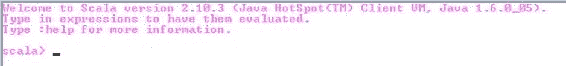
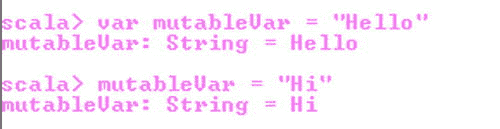

# 十一、附录 C：Scala 简介

Scala 无缝集成了面向对象和函数式编程。Scala 是一种静态类型语言，由 Martin Odersky 于 2001 年提出，他也是 Java 参考编译器的作者和 Java 泛型的合著者。Scala 为 Java 虚拟机(JVM)编译成字节码，使其与平台无关。这也意味着从 Scala 程序中你可以使用现有的 Java 库，反之亦然。

Scala 入门

你可以从 www.scala-lang.org/download/下载 Scala。这个 Scala 软件发行版可以安装在任何类似 Unix 或 Windows 的系统上。它需要 Java 运行时版本 1.6 或更高版本。

```java
>scala  -version
```

```java
Scala code runner version 2.10.3 -- Copyright 2002-2013, LAMP/EPFL
```

有三种方法可以执行 Scala 代码。

*   使用交互式解释器
*   将 Scala 代码作为脚本执行
*   编译 Scala 代码

使用交互式解释器

Scala 解释器(称为读取-评估-打印循环，或 REPL )是执行一行 Scala 代码最简单的方法。您可以使用 scala 命令行工具 Scala 启动交互式解释器，该工具位于 Scala 安装文件夹的 bin 文件夹中。

从命令行输入以下内容，打开交互式解释器，如[图 C-1](#Fig1) 所示。

```java
>scala
```



[图 C-1](#_Fig1) 。Scala 交互式解释器

使用交互式解释器，您可以通过使用 println 方法运行您的第一个“Hello world”程序。

```java
scala> println("Hello world");
```

```java
Hello world
```

要退出解释器，请键入 exit。

```java
scala> exit
```

将 Scala 代码作为脚本执行

另一种执行 scala 代码的方式是将其输入到一个文本文件中，并用扩展名. Scala 保存。然后，您可以通过键入 *filename* .scala 来执行该代码。例如，您可以创建一个名为 hello.scala 的文件，其中包含“Hello world”。

```java
println("Hello world")
```

要执行它，需要将文件名指定为 Scala 命令行工具的参数。

```java
>scala  hello.scala
```

编译 Scala 代码

您也可以通过首先使用 scalac 命令行工具编译 Scala 代码来执行它。然后代码将需要在应用的上下文中执行，因此您将需要添加一个带有 main()方法的对象(参见清单 C-1 )。

[列表 C-1](#_list1) 。“你好，世界”节目

```java
1.    object HelloWorld {
2.    def main(args: Array[String]) {
3.    println("Hello, world")
4.       }
5.    }
```

**注意**语句末尾的分号通常是可选的。

*   *第 1 行*:main()方法是在对象中定义的，而不是在类中。Scala 有一个对象构造，你可以用它来声明一个单例对象。在本附录的后面，您将了解更多关于单例的内容。
*   *第二行* : Scala 程序处理从 main()方法开始，这是每一个 Scala 程序必不可少的一部分。main()方法未标记为 static。在 Scala 中，一切都是对象。main()方法是自动实例化的 singleton 对象上的实例方法。
*   *第 2 行*:没有返回类型。其实是有 Unit 的，和 void 差不多，不过是编译器推断出来的。您可以通过在参数后加上冒号和类型来显式指定返回类型。

```java
def main(args: Array[String]) : Unit = {
                       }
```

*   *第 2 行*:Scala 中没有访问级修饰符。在这个上下文中，Java 中有一个 public 修饰符，但是 Scala 没有指定 public 修饰符，因为默认的访问级别是 public。
*   *第 2 行* : Scala 使用 def 关键字告诉编译器这是一个方法。

将清单 C-1 中的代码保存在名为 HelloWorld.scala 的文件中，并使用以下命令编译代码:

```java
>scalac HelloWorld.scala
```

现在使用以下命令运行程序:

```java
>scala HelloWorld
```

```java
Hello, World!
```

**注意** Java 要求你把一个公共类放在一个以该类命名的文件中。例如，您应该将类 HelloWorld 放在 HelloWorld.java 文件中。在 Scala 中，你可以命名。scala 可以保存你想要的任何东西，不管你在里面放了什么 Scala 类或者代码。但是，建议您像在 Java 中一样，根据文件包含的类来命名文件，以便根据文件名轻松定位类。

变量

Scala 允许你在声明一个变量时决定它是否是不可变的(只读的)。不可变变量是用关键字 val 声明的。这意味着它是一个不可改变的变量。[清单 C-2](#list2) 展示了创建一个不可变的变量，而[图 C-2](#Fig2) 展示了当你试图改变它时会发生什么。

[列表 C-2](#_list2) 。不可变变量

```java
val immutableVar : String = "Hello"
immutableVar = "Hi"
```


[图 C-2](#_Fig2) 。尝试更改 val 时出错

[清单 C-3](#list3) 展示了创建一个可变变量，而[图 C-3](#Fig3) 展示了它被成功改变。

[列表 C-3](#_list3) 。可变变量

```java
var mutableVar = "Hello"
mutableVar = "Hi"
```



[图 C-3](#_Fig3) 。var 更改成功

当你给一个变量赋一个初始值时，Scala 编译器可以根据赋给它的值推断出变量的类型。这被称为*类型推理*，如[清单 C-4](#list4) 所示。

[清单 C-4](#_list4) 。类型推理

```java
var  var1= 10
var var2 = "Hello world"
```

在[清单 C-4](#list4) 中，Scala 将推断 var1 为 Int 类型，var2 为 String 类型变量。

收集

Scala 集合区分可变和不可变集合。可变集合可以就地更新或扩展。这意味着你可以更改、添加或删除收藏的元素。相比之下，不可变集合永远不会改变。您仍然有模拟添加、删除或更新的操作，但是这些操作在每种情况下都将返回一个新集合，而旧集合保持不变。Scala 有一个丰富的集合库。最常用的集合是列表、集合和映射，这些将在下面的章节中介绍。你可以在[http://docs . Scala-lang . org/overviews/collections/introduction . html](http://docs.scala-lang.org/overviews/collections/introduction.html)找到关于 Scala 收藏库的详细信息。

列表

列表是不可变的，这意味着列表的元素不能通过赋值来改变。包含 T 类型元素的列表类型被写成 List[T]，如下所示:

```java
val numberList: List[Integer] = List(1, 2, 3)
```

清单 C-5 展示了如何创建和使用一个不可变列表。

[清单 C-5](#_list5) 。创建不可变列表

```java
val list = List(1, 2, 3, 2, 3)
println (list.head)
println(list.tail)
println(list.length)
println(list.max)
println(list.min)
println(list.sum)
println(list.sorted)
println(list.reverse)
```

```java
head   --- 1

tail   --- List(2, 3, 2, 3)

length --- 5

max    --- 3

min    --- 1

sum    --- 11

sorted --- List(1, 2, 2, 3, 3)

reverse--- List(3, 2, 3, 2, 1)
```

Scala 只定义了一个不可变的列表。但是，它也定义了一些可变的列表类型，比如 ArrayBuffer。清单 C-6 展示了如何创建一个可变列表。

[清单 C-6](#_list6) 。创建可变列表

```java
import collection.mutable
val list = mutable.ArrayBuffer(1, 2, 3, 2, 3)
assert (list.length  == 5)
```

设置

集合是不包含重复元素的集合。有两种集合，不可变的和可变的。清单 C-7 展示了如何创建一个不可变的集合。

[清单 C-7](#_list7) 。创建不可变集合

```java
val set = Set(1, 2, 3, 2, 3)
println ("head -- "+set.head)
println("tail -- "+set.tail)
println("size -- "+set.size)
println("sum  -- "+set.sum)
```

```java
head -- 1

tail -- Set(2, 3)

size -- 3

sum  -- 6
```

默认情况下，Scala 使用不可变集合。如果你想使用可变集合，你必须导入 scala.collection.mutable.Set。

[清单 C-8](#_list8) 。创建可变集合

```java
import collection.mutable
val set = mutable.HashSet(1, 2, 3, 2, 3)
assert (set.size == 3)
```

地图

Scala map 是键值对的集合。默认情况下，Scala 使用不可变的 map。如果想使用可变映射，就必须显式导入 scala.collection.mutable.Map 类。清单 C-9 展示了如何创建和使用一个不可变的地图。

[清单 C-9](#_list9) 。创建不可变的地图

```java
val map = Map("1" -> 1, "2" -> 2, "3" -> 3, "2" -> 2, "3" -> 3)

println ("head  -- "+map.head)
println("tail  -- "+map.tail)
println("size  -- "+map.size)
```

```java
head  -- (1,1)

tail  -- Map(2 -> 2, 3 -> 3)

size  -- 3
```

类别

Scala 中的类的声明非常像 Java 类。一个区别是 Scala 类可以有参数，如清单 C-10 中的[所示。](#list10)

[列出 C-10](#_list10) 。带参数的 Scala 类

```java
class Vehicle (speed : Int){
val mph :Int = speed
    def race() = println("Racing")
}
```

车辆类接受一个参数，即车辆的速度。创建 Vehicle 类的实例时，必须传递该参数，如下所示:new Vehicle(100)。该类包含一个名为 race()的方法。

扩展一个类

在 Scala 中覆盖从超类继承的方法是可能的，如清单 C-11 中的[所示。](#list11)

[列出 C-11](#_list11) 。扩展一个 Scala 类

```java
1.    class Car (speed : Int) extends Vehicle(speed) {
2.    override val mph: Int= speed
3.    override  def race() = println("Racing Car")
4.    }
```

*   *第 1 行*:Car 类使用关键字 extends 扩展了 Vehicle 类。
*   *第 2 行到第 3 行*:字段 mph 和方法 race()需要使用关键字 override 来覆盖。

[清单 C-12](#list12) 展示了另一个叫做 Bike 的类，它扩展了 Vehicle。

[清单 C-12](#_list12) 。扩展一个 Scala 类

```java
class Vehicle (speed : Int){
val mph :Int = speed
    def race() = println("Racing")
}
class Car (speed : Int) extends Vehicle(speed) {
override val mph: Int= speed
override  def race() = println("Racing Car")

}
class Bike(speed : Int) extends Vehicle(speed) {
override val mph: Int = speed
override  def race() = println("Racing Bike")

}
```

将[清单 C-12](#list12) 保存在 vehicle.scala 文件中，并使用以下代码进行编译:

```java
>scalac vehicle.scala
```

现在您可以使用 scala 命令进入 REPL 并创建 vehicle 对象，如下所示:

```java
scala> val vehicle1 = new Car(200)
```

使用这个命令，Scala 创建了 vehicle1 对象，如下所示:

```java
vehicle1: Car = Car@19a8942
```

现在，您可以使用 Scala 创建的 vehicle1 对象来访问汽车的速度。

```java
scala> vehicle1.mph
```

斯卡拉 REPL 发出汽车的速度，如下所示:

```java
res1: Int = 200
```

以类似的方式，您可以执行 vehicle1 的 race()方法，如下所示:

```java
scala>vehicle1.race()
```

Scala 解释器发出输出，如下所示:

```java
Racing Car
```

现在您可以创建 Bike 对象并访问它的属性和方法，如下所示:

```java
scala> val vehicle2 = new Bike(100)
```

```java
vehicle2: Bike = Bike@b7ad3
```

```java
scala>vehicle2.mph
```

```java
res4: Int = 100
```

```java
scala> vehicle2.race()
```

```java
Racing Bike
```

特征

假设您想在车辆层次结构中添加另一个类。这一次你要添加一个蝙蝠战车。蝙蝠战车可以赛跑、滑行和飞行。但是你不能在 Vehicle 类中添加 glide 和 fly 方法，因为在一个非冲突的世界中，汽车和自行车不能滑行或飞行。至少现在还没有。所以，如果你想把蝙蝠战车添加到你的车辆等级中，你可以使用一个*特征*。特性就像 Java 中的接口，也可以包含代码。在 Scala 中，当一个类从 trait 继承时，它实现了 trait 的接口，并继承了 trait 中包含的所有代码。[清单 C-13](#list13) 展示飞行和滑翔特性。

[清单 C-13](#_list13) 。Scala 特征

```java
trait flying {
    def fly() = println("flying")
}

trait gliding {
def gliding() = println("gliding")
}
```

现在你可以创建蝙蝠战车类来扩展飞行器类以及飞行和滑翔特性，如清单 C-14 中的[所示。](#list14)

[清单 C-14](#_list14) 。使用特征

```java
1.    Batmobile(speed : Int) extends Vehicle(speed)  with flying with gliding{
2.    override val mph: Int = speed
3.    override  def race() = println("Racing Batmobile")
4.    override def fly() = println("Flying Batmobile")
5.    override def glide() = println("Gliding Batmobile")
6.
7.    }
```

现在，您可以在 REPL 创建一辆蝙蝠战车，如下图所示:

```java
scala> val vehicle3 = new Batmobile(300)
```

```java
vehicle3: Batmobile = Batmobile@374ed5
```

现在您可以访问 Batmobile 的 fly()方法，如下所示:

```java
scala> vehicle3.fly()
```

```java
Flying Batmobile
```

创建一个车辆列表，然后可以使用 Scala collections 库提供的 maxBy()方法来查找列表中最快的车辆。

```java
scala> val vehicleList = List(vehicle1, vehicle2, vehicle3)
```

```java
vehicleList: List[Vehicle] = List(Car@562791, Bike@e80317, Batmobile@374ed5)
```

```java
scala> val fastestVehicle = vehicleList.maxBy(_.mph)
```

```java
fastestVehicle: Vehicle = Batmobile@374ed5
```

单一对象

Scala 没有静态成员。相反，Scala 有单例对象。单例对象定义看起来像一个类定义，除了你使用关键字对象代替关键字类。singleton 是一个只能有一个实例的类。清单 C-15 展示了如何在应用中使用单例对象。

[清单 C-15](#_list15) 。在应用中使用单例对象

```java
1.    class Vehicle (speed : Int){
2.    val mph :Int = speed
3.    def race() = println("Racing")
4.    }
5.    class Car (speed : Int) extends Vehicle(speed) {
6.    override val mph: Int= speed
7.    override  def race() = println("Racing Car")
8.
9.    }
10.    class Bike(speed : Int) extends Vehicle(speed) {
11.    override val mph: Int = speed
12.    override  def race() = println("Racing Bike")
13.
14.    }
15.    trait flying {
16.    def fly() = println("flying")
17.    }
18.
19.    trait gliding {
20.    def glide() = println("gliding")
21.    }
22.
23.    class Batmobile(speed : Int) extends Vehicle(speed)  with flying with gliding{
24.    override val mph: Int = speed
25.    override  def race() = println("Racing Batmobile")
26.    override def fly() = println("Flying Batmobile")
27.    override def glide() = println("Gliding Batmobile")
28.
29.    }
30.    object Vehicle {
31.    def main(args: Array[String]) {
32.    val vehicle1 = new Car(200)
33.    val vehicle2 = new Bike(100)
34.    val vehicle3 = new Batmobile(300)
35.
36.    val vehicleList = List(vehicle1, vehicle2, vehicle3)
37.    val fastestVehicle = vehicleList.maxBy(_.mph)
38.
39.    printVehicle
40.
41.    def printVehicle{
42.    println ("speed of Bike : " + vehicle1.mph);
43.    println ("speed of Car : " + vehicle2.mph);
44.    println ("speed of Batmobile : " + vehicle3.mph);
45.    println ("Fastest Vehicle : " + fastestVehicle.mph + " mph");
46.
47.         }
48.      }
49.    }
```

当编译并执行前面的代码时，它会产生以下结果:

```java
>scalac vehicle.scala
>scala Vehicle
```

```java
speed of Bike : 200 mph

speed of Car : 100 mph

speed of Batmobile : 300 mph

Fastest Vehicle : 300 mph
```

摘要

本附录向您介绍了 Scala 的基础知识。您学习了三种交互执行 Scala 代码的方式，一种是作为脚本执行，另一种是作为编译程序执行。然后您学习了如何使用 Scala collections 库。最后，您学习了如何使用 traits 以及如何在应用中使用 singleton 对象。