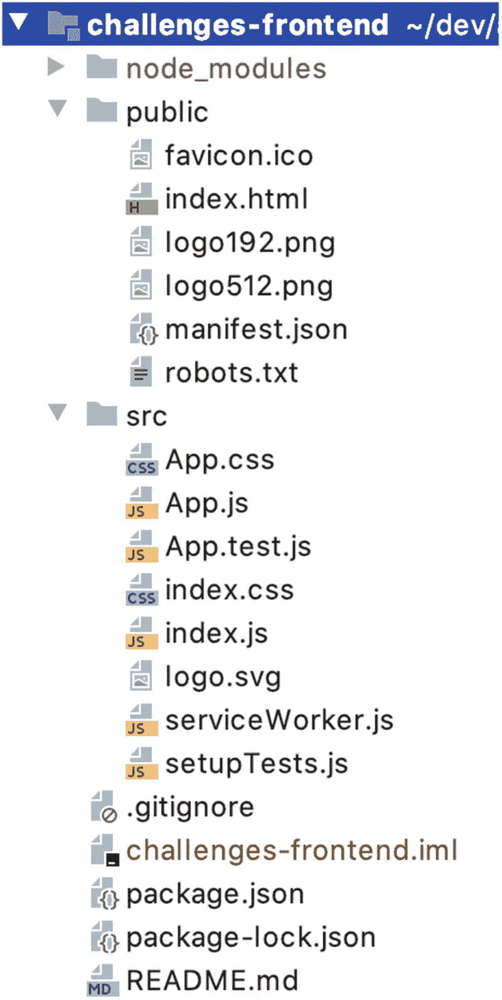
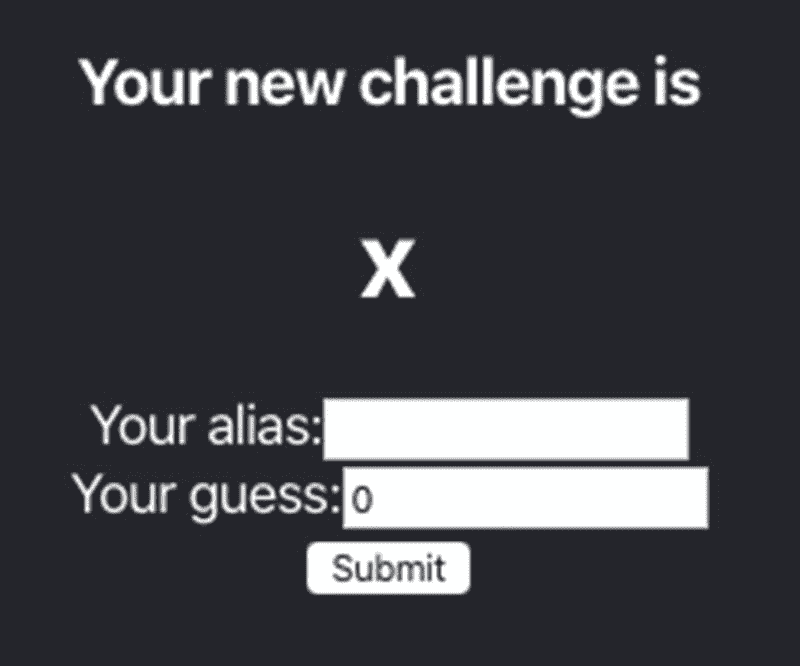
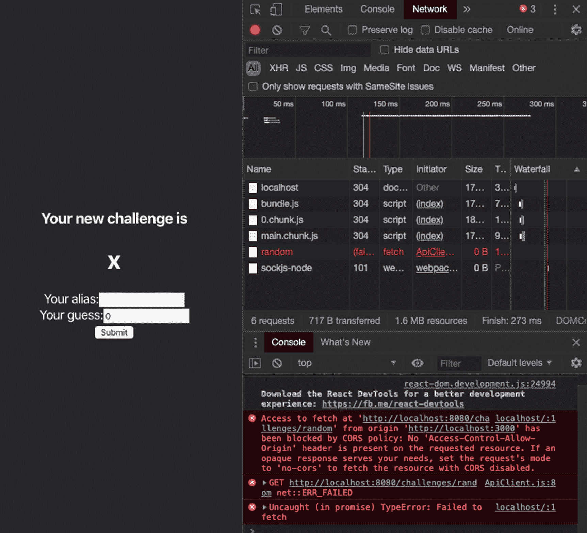
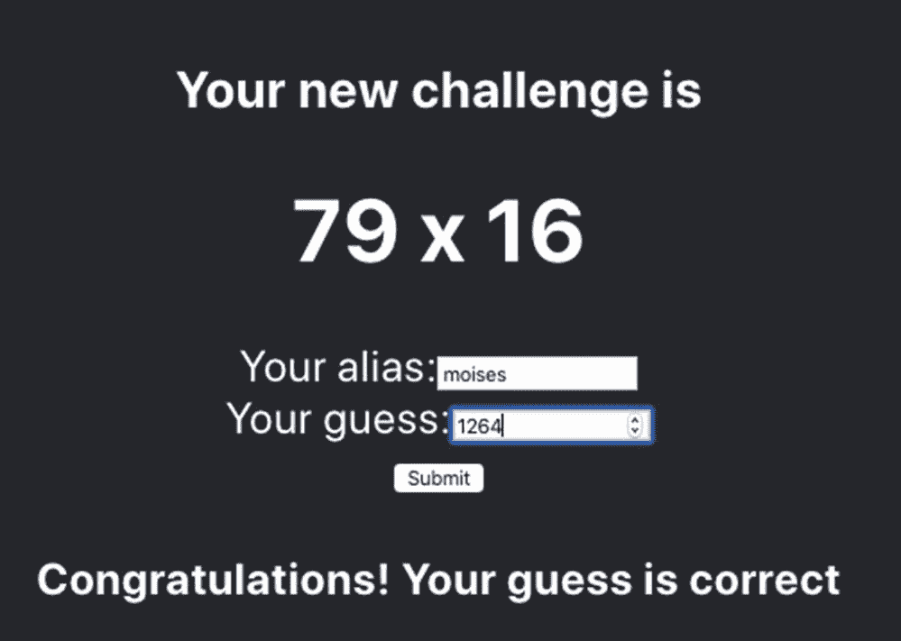
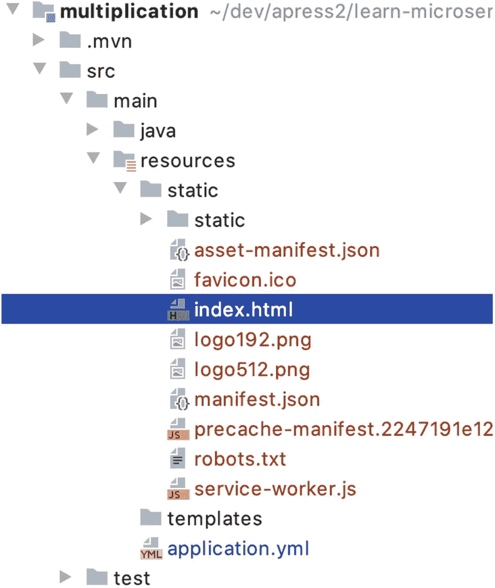
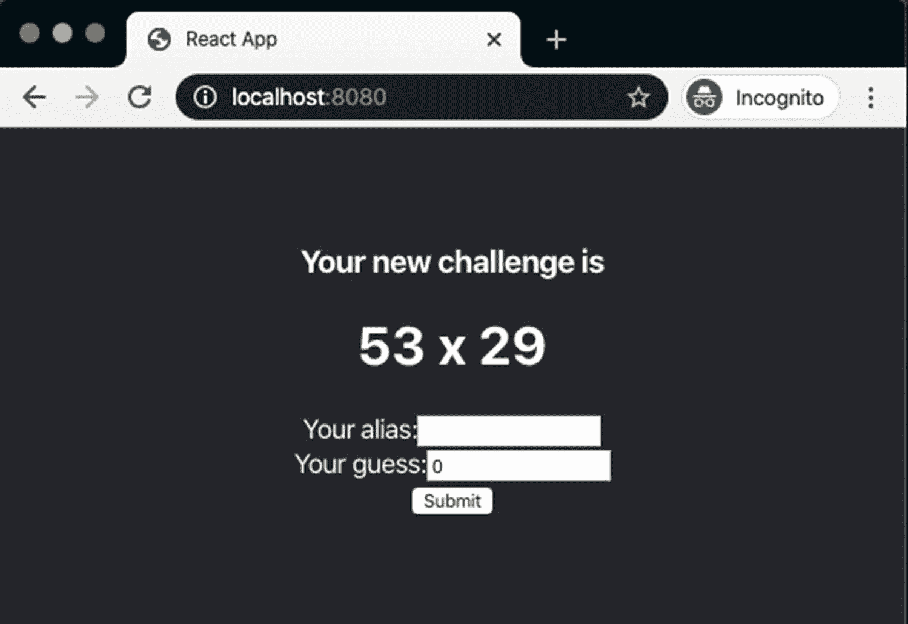
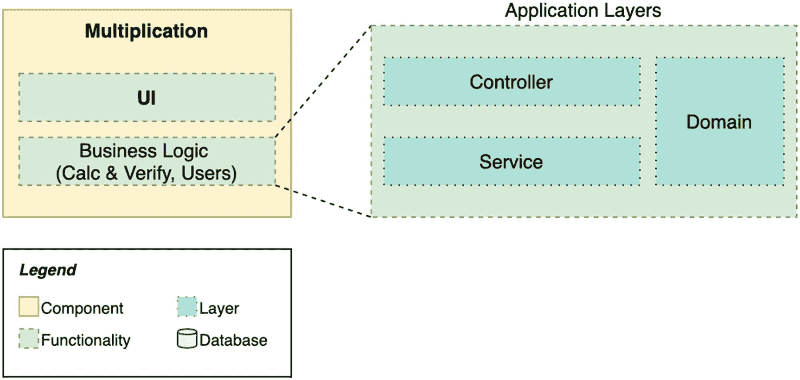

# 四、使用 React 的最小前端

一本号称实用的关于微服务的书也得提供前端。在现实生活中，用户不会通过 REST APIs 与应用进行交互。

由于这本书关注的是现实生活中使用的流行技术，我们将在 React 中构建我们的前端。这个 JavaScript 框架允许我们基于可重用的组件和服务轻松开发网页。根据 2020 年 StackOverflow 的开发者调查( [`https://tpd.io/js-fw-list`](https://tpd.io/js-fw-list) )，与 Angular 或 Vue.js 等其他类似的替代框架相比，React 是最受欢迎的框架。这使得它已经是一个不错的选择。最重要的是，我认为这是一个对 Java 开发人员友好的框架:您可以使用 TypeScript，这是 JavaScript 的一个扩展，它向这种编程语言添加了类型，对于习惯于它们的人来说，这使得一切都变得更容易。此外，React 的编程风格允许我们创建类来构建组件和服务，这使得 Java 开发人员熟悉 React 项目的结构。

我们还将使用 Node，一个随`npm`一起提供的 JavaScript 运行时，它是管理 JavaScript 依赖关系的工具。通过这种方式，您可以获得一些关于 UI 技术的实践经验，如果您还不是一名全栈开发人员，为什么不成为一名呢？

无论如何，请记住这条重要的免责声明:我们不会深入讨论如何用 React 构建 web 应用的细节。我们希望继续关注 Spring Boot 的微服务。因此，如果你没有完全掌握本章的所有概念，也不要难过，尤其是如果你从未见过 JavaScript 代码或 CSS。

考虑到您在 GitHub 资源库( [`https://github.com/Book-Microservices-v2/chapter04`](https://github.com/Book-Microservices-v2/chapter04) )中拥有所有可用的源代码，您可以用几种方式来阅读本章。

*   照着读*。您将获得一些基础知识，并将在 React 中尝试一些重要的概念。*

*   暂停一会儿阅读官方网站上的主要概念指南( [`https://tpd.io/react-mc`](https://tpd.io/react-mc) )，然后回到本章。通过这种方式，你会对我们将要构建的内容有更多的背景知识。

*   如果您对前端技术完全不感兴趣，可以完全跳过这一章，使用存储库中的源代码。可以放心地跳到下一章，继续使用不断发展的应用方法。

## 快速介绍 React 和 Node

React 是一个用于构建用户界面的 JavaScript 库。它由脸书开发，在前端开发人员中很受欢迎。它在许多组织中被广泛使用，这也导致了活跃的就业市场。

和其他库一样，React 也是基于组件的。这对于后端开发人员来说是一个优势，因为您只需编写一次代码，就可以在任何地方重用，这个概念听起来很熟悉。

在 React 中，您可以使用 JSX，而不是在单独的文件中编写 HTML 和 JavaScript 源代码，这是 JavaScript 语法的一个扩展，允许我们组合这些语言。这很有用，因为您可以在单个文件中编写组件，并通过功能隔离它们，将所有行为和渲染逻辑放在一起。

## 设置开发环境

首先，您需要使用位于 [`nodejs.org`](http://nodejs.org) 站点的一个可用安装包来安装 Node.js。在本书中，我们使用的是 Node v13.10 和`npm` 6.13.7。安装完成后，使用命令行工具进行验证，如清单 4-1 所示。

```java
$ node --version
v13.10.1
$ npm --version
6.13.7

Listing 4-1Getting the Version of Node.js and npm

```

现在您可以使用`npm`中包含的工具`npx`来创建 React 的前端项目。确保从您的工作空间根目录运行此命令，而不是在乘法服务中运行。

```java
$ npx create-react-app challenges-frontend

```

源代码

您可以在 GitHub 的`chapter04`资源库中找到本章的所有源代码。

[`https://github.com/Book-Microservices-v2/chapter04`](https://github.com/Book-Microservices-v2/chapter04) 见*。*

下载并安装依赖项一段时间后，您将得到类似清单 4-2 所示的输出。

```java
Success! Created challenges-frontend at /Users/moises/workspace/learn-microservices/challenges-frontend
Inside that directory, you can run several commands:
[...]
We suggest that you begin by typing:

  cd challenges-frontend
  npm start

Listing 4-2Console Output After Creating the React Project

```

如果您按照建议运行`npm start`，节点服务器将在`http://localhost:3000`启动，您甚至可以打开一个浏览器窗口，显示我们刚刚生成的应用中包含的预定义网页。如果你不知道，你可以从你的浏览器导航到`http://localhost:3000`来快速浏览这个页面。

## 反应骨架

下一个任务是将 React 项目加载到我们的工作区中。例如，在 IntelliJ 中，可以使用现有源中的选项文件➤新➤模块将前端文件夹作为单独的模块加载。正如您将看到的，我们已经得到了许多由`create-react-app`工具创建的文件。见图 4-1 。



图 4-1

反应项目框架

*   `package.json`和`package-lock.json`是`npm`文件。它们包含项目的基本信息，还列出了它的依赖项。这些依赖关系存储在`node_modules`文件夹中。

*   `public`文件夹是您可以保存所有静态文件的地方，这些文件在构建完成后将保持不变。唯一的例外是`index.html`，它将被处理成包含结果 JavaScript 源。

*   所有的 React 源代码及其相关资源都包含在`src`文件夹中。在这个框架应用中，您可以找到主入口点文件`index.js`和一个 React 组件`App`。这个示例组件带有自己的样式表`App.css`和一个测试`App.test.js`。当您构建 React 项目时，所有这些文件最终会合并成更大的文件，但是这种命名约定和结构对开发很有帮助。

在 React 中，这些文件是如何相互关联的？先说`index.html`。移除注释行后的`body`标签的内容见清单 4-3 。

```java
<body>
    <noscript>You need to enable JavaScript to run this app.</noscript>
    <div id="root"></div>
</body>

Listing 4-3The root Div in HTML

```

清单 4-4 显示了`index.js`文件内容的一部分。

```java
ReactDOM.render(
  <React.StrictMode>
    <App />
  </React.StrictMode>,
  document.getElementById('root')
);

Listing 4-4The Entrypoint to Render the React Content

```

这段代码展示了如何将 React 元素呈现到文档对象模型(DOM)中，DOM 是 HTML 元素的树型表示。这段代码将元素`React.StrictMode`及其子组件`App`呈现到 HTML 中。更具体地说，它们被渲染到 ID 为`root`的元素中，标签`div`被插入到`index.html`中。因为`App`是一个组件，并且它可能包含其他组件，所以它最终处理并呈现整个 React 应用。

## JavaScript 客户端

在创建我们的第一个组件之前，让我们确保有一种方法可以从我们在前一章中创建的 REST API 中检索数据。我们将为此使用一个 JavaScript 类。正如你将在本章的其余部分看到的，我们将使用类和类型保持一种类似 Java 的编程风格来构建我们的前端。

JavaScript 中的类类似于 Java 类。对于我们的具体情况，我们可以用两个静态方法创建一个实用程序类。参见清单 4-5 。

```java
class ApiClient {

    static SERVER_URL = 'http://localhost:8080';
    static GET_CHALLENGE = '/challenges/random';
    static POST_RESULT = '/attempts';

    static challenge(): Promise<Response> {
        return fetch(ApiClient.SERVER_URL + ApiClient.GET_CHALLENGE);
    }

    static sendGuess(user: string,
                     a: number,
                     b: number,
                     guess: number): Promise<Response> {
        return fetch(ApiClient.SERVER_URL + ApiClient.POST_RESULT,
            {
                method: 'POST',
                headers: {
                    'Content-Type': 'application/json'

                },
                body: JSON.stringify(
                    {
                        userAlias: user,
                        factorA: a,
                        factorB: b,
                        guess: guess
                    }
                )
            });
    }
}

export default ApiClient;

Listing 4-5The ApiClient Class

```

两种方法都返回承诺。JavaScript 中的承诺类似于 Java 的`Future`类:它表示异步操作的结果。我们的函数调用`fetch`(参见 [`https://tpd.io/fetch-api`](https://tpd.io/fetch-api) )，这是 JavaScript 中的一个函数，我们可以用它来与 HTTP 服务器交互。

第一个方法`challenge()`使用了基本形式的`fetch`函数，因为它默认对传递的 URL 进行 GET 操作。这个方法返回一个`Response`对象的承诺( [`https://tpd.io/js-response`](https://tpd.io/js-response) )。

`sendGuess`方法接受我们构建请求以解决挑战所需的参数。这一次，我们使用带有第二个参数的`fetch`:定义 HTTP 方法(POST)的对象、请求(JSON)中主体的内容类型以及主体。为了构建 JSON 请求，我们使用实用方法`JSON.stringify`，它序列化一个对象。

最后，为了使我们的类可以公开访问，我们在文件的末尾添加了`export default ApiClient`。这使得在其他组件和类中导入完整的类成为可能。

## 挑战部分

让我们构建我们的第一个 React 组件。我们在前端也将遵循模块化，这意味着这个组件将负责`Challenges`域。目前，这意味着以下几点:

*   呈现从后端检索的挑战

*   为用户显示一个表单以发送猜测

参见清单 4-6 获取`ChallengeComponent`类的完整源代码。在接下来的几节中，我们将剖析这段代码，并使用它来学习如何在 React 中构造组件以及它的一些基本概念。

```java
import * as React from "react";
import ApiClient from "../services/ApiClient";

class ChallengeComponent extends React.Component {

    constructor(props) {
        super(props);
        this.state = {
            a: '', b: '',
            user: '',
            message: '',
            guess: 0
        };
        this.handleSubmitResult = this.handleSubmitResult.bind(this);
        this.handleChange = this.handleChange.bind(this);
    }

    componentDidMount(): void {
        ApiClient.challenge().then(
            res => {
                if (res.ok) {
                    res.json().then(json => {
                        this.setState({
                            a: json.factorA,
                            b: json.factorB

                        });
                    });
                } else {
                    this.updateMessage("Can't reach the server");
                }
            }
        );
    }

    handleChange(event) {
        const name = event.target.name;
        this.setState({
            [name]: event.target.value
        });
    }

    handleSubmitResult(event) {
        event.preventDefault();
        ApiClient.sendGuess(this.state.user,
            this.state.a, this.state.b,

            this.state.guess)
            .then(res => {
                if (res.ok) {
                    res.json().then(json => {
                        if (json.correct) {
                            this.updateMessage("Congratulations! Your guess is correct");
                        } else {
                            this.updateMessage("Oops! Your guess " + json.resultAttempt +
                            " is wrong, but keep playing!");
                        }
                    });
                } else {
                   this.updateMessage("Error: server error or not available");
                }
            });
    }

    updateMessage(m: string) {
        this.setState({
          message: m
        });
    }

    render() {

        return (
            <div>
                <div>
                    <h3>Your new challenge is</h3>
                    <h1>
                        {this.state.a} x {this.state.b}
                    </h1>
                </div>
                <form onSubmit={this.handleSubmitResult}>
                    <label>
                        Your alias:
                        <input type="text" maxLength="12"
                               name="user"
                               value={this.state.user}
                               onChange={this.handleChange}/>
                    </label>
                    <br/>
                    <label>
                        Your guess:
                        <input type="number" min="0"
                               name="guess"
                               value={this.state.guess}

                               onChange={this.handleChange}/>
                    </label>
                    <br/>
                    <input type="submit" value="Submit"/>
                </form>
                <h4>{this.state.message}</h4>
            </div>
        );
    }
}

export default ChallengeComponent;

Listing 4-6Our First React Component: ChallengeComponent

```

### 组件的主要结构

我们的类扩展了`React.Component`，这就是你如何在 React 中创建组件。唯一需要实现的方法是`render()`，它必须返回 DOM 元素以显示在浏览器中。在我们的例子中，我们使用 JSX ( [`https://tpd.io/jsx`](https://tpd.io/jsx) )构建这些元素。参见清单 4-7 ，它展示了我们组件类的主要结构。

```java
class ChallengeComponent extends React.Component {

    constructor(props) {
        super(props);
        this.state = {
            a: '', b: '',
            user: '',
            message: '',
            guess: 0

        };
        this.handleSubmitResult = this.handleSubmitResult.bind(this);
        this.handleChange = this.handleChange.bind(this);
    }

    componentDidMount(): void {
        // ... Component initialization
    }

    render() {
        return (
        // ... HTML as JSX ...
        )
    }

Listing 4-7Main Structure of a Component in React

```

通常，我们还需要一个构造函数来初始化属性，以及组件的*状态*(如果需要的话)。在`ChallengeComponent`中，我们创建一个状态来保存检索到的挑战和用户为解决一次尝试而输入的数据。参数`props`是作为 HTML 属性传递给组件的输入。

```java
<ChallengeComponent prop1="value"/>

```

对于我们的组件，我们不需要`props`,但是我们需要接受它作为一个参数，并把它传递给父构造函数，如果我们使用一个构造函数，这是我们所期望的。

在构造函数中，两行绑定了类方法。如果我们想在事件处理程序中使用`this`，这是必需的，事件处理程序是我们需要实现来处理用户输入数据的函数。如需了解更多详情，请参见处理事件( [`https://tpd.io/react-events`](https://tpd.io/react-events) )。我们将在本章后面描述这些功能。

函数`componentDidMount`是一个生命周期方法，我们可以在 React 中实现它，以便在组件第一次呈现后立即执行逻辑。参见清单 4-8 。

```java
componentDidMount(): void {
    ApiClient.challenge().then(
        res => {
            if (res.ok) {
                res.json().then(json => {
                    this.setState({
                        a: json.factorA,
                        b: json.factorB
                    });
                });
            } else {
                this.updateMessage("Can't reach the server");
            }
        }
    );
}

Listing 4-8Running Logic After Rendering the Component

```

我们所做的是调用服务器检索一个挑战，使用我们之前构建的`ApiClient`实用程序类。假设函数返回一个承诺，我们使用`then()`来指定当我们获得响应时做什么。内部逻辑也很简单:如果响应是`ok`(意味着一个`2xx`状态代码)，我们将主体解析为`json()`。这也是一个异步方法，所以我们用`then()`再次解析承诺，并将预期的`factorA`和`factorB`从 REST API 响应传递给`setState()`。

在 React 中，`setState`函数重新加载部分 DOM。这意味着浏览器将再次呈现 HTML 中发生变化的部分，因此在我们从服务器获得响应后，我们将在页面上看到我们的倍增因子。在我们的应用中，这应该是几毫秒的事情，因为我们正在调用我们自己的本地服务器。例如，在现实生活中的网页中，您可以设置一个微调器，以改善慢速连接情况下的用户体验。

### 翻译

JSX 允许我们混合 HTML 和 JavaScript。这是非常强大的，因为您可以从 HTML 语言的简单性中获益，但是您也可以添加占位符和 JavaScript 逻辑。参见清单 4-9 中`render()`方法的完整源代码及其后续解释。

```java
render() {
    return (
        <div>
            <div>
                <h3>Your new challenge is</h3>
                <h1>
                    {this.state.a} x {this.state.b}
                </h1>
            </div>
            <form onSubmit={this.handleSubmitResult}>
                <label>
                    Your alias:
                    <input type="text" maxLength="12"
                           name="user"
                           value={this.state.user}
                           onChange={this.handleChange}/>

                </label>
                <br/>
                <label>
                    Your guess:
                    <input type="number" min="0"
                           name="guess"
                           value={this.state.guess}
                           onChange={this.handleChange}/>
                </label>
                <br/>
                <input type="submit" value="Submit"/>
            </form>
            <h4>{this.state.message}</h4>
        </div>
    );
}

Listing 4-9Using render() with JSX to Display the Component’s Elements

```

组件的根元素有三个主块。第一个通过显示状态中包含的两个因素来显示挑战。在渲染的时候它们是未定义的，但是当我们从服务器得到响应后，它们会立即被重新加载(?? 内部的逻辑)。类似的区块是最后一个；它显示了`message`状态属性，该属性是我们在获得发送的尝试请求的响应时设置的。

为了让用户输入他们的猜测，我们添加了一个表单，在提交时调用`handleSubmitResult`。这个表单有两个输入:一个是用户的别名，另一个是猜测。两者遵循相同的方法:它们的值是状态对象的属性，并且它们在每次击键时调用相同的函数`handleChange`。这个函数使用我们输入的`name`属性在组件状态中找到相应的属性来更新。注意`event.target`指向事件发生的 HTML 元素。参见清单 4-10 获取这些处理函数的源代码。

```java
handleChange(event) {
    const name = event.target.name;
    this.setState({
        [name]: event.target.value
    });
}

handleSubmitResult(event) {
    event.preventDefault();
    ApiClient.sendGuess(this.state.user,
        this.state.a, this.state.b,

        this.state.guess)
        .then(res => {
            if (res.ok) {
                res.json().then(json => {
                    if (json.correct) {
                        this.updateMessage("Congratulations! Your guess is correct");
                    } else {
                        this.updateMessage("Oops! Your guess " + json.resultAttempt +
                        " is wrong, but keep playing!");
                    }
                });
            } else {
               this.updateMessage("Error: server error or not available");
            }
        });
}

Listing 4-10Handling User’s Input

```

在表单提交时，我们调用服务器的 API 来发送一个猜测。当我们得到响应时，我们检查它是否正确，解析 JSON，然后更新状态中的消息。然后，HTML DOM 的这一部分被再次呈现。

### 与应用集成

现在我们已经完成了组件的代码，我们可以在我们的应用中使用它了。为此，让我们修改`App.js`文件，它是 React 代码库中的主要(或根)组件。参见清单 4-11 。

```java
import React from 'react';
import './App.css';
import ChallengeComponent from './components/ChallengeComponent';

function App() {
    return (
        <div className="App">
            <header className="App-header">
                <ChallengeComponent/>
            </header>
        </div>
    );
}

export default App;

Listing 4-11Adding Our Component as a Child of App.js, the Root Component

```

如前所述，skeleton 应用在`index.js`文件中使用这个`App`组件。当我们构建代码时，生成的脚本包含在`index.html`文件中。

我们还应该修改包含在`App.test.js`中的测试，或者干脆删除它。我们不会深入 React 测试的细节，所以你现在可以删除它。如果您想了解更多关于为 React 组件编写测试的信息，请查看官方指南中的测试章节( [`https://tpd.io/r-testing`](https://tpd.io/r-testing) )。

## 首次运行我们的前端

我们修改了用`create-react-app`构建的框架应用，以包含我们自定义的 React 组件。请注意，我们没有删除其他文件，如样式表，我们也可以自定义这些文件。正如你在`App.js`的代码中看到的，我们实际上重用了其中的一些类。

是时候验证一下我们的前端和后端是否协同工作了。确保首先运行 Spring Boot 应用，然后使用前端应用根文件夹中的`npm`执行 React 前端。

```java
$ npm start

```

成功编译后，这个命令行工具应该会打开您的默认浏览器，并显示位于`localhost:3000`的页面。这是开发服务器所在的地方。参见图 4-2 显示当我们从浏览器访问该 URL 时呈现的网页。



图 4-2

带有空白因子的应用

那里出了问题。这些因素是空白的，但是我们的代码在组件呈现之后检索它们。我们来看看如何调试这个问题。

## 排除故障

有时事情并不像预期的那样发展，你的应用根本无法工作。你在浏览器上运行应用，那么你怎么知道会发生什么呢？好消息是大多数流行的浏览器都为开发者提供了强大的工具。在 Chrome 中，你可以使用 Chrome DevTools(参见 [`https://tpd.io/devtools`](https://tpd.io/devtools) )。使用 Ctrl+May+I (Windows)或 Cmd+Opt+I (Mac)在浏览器中打开一个区域，其中有几个选项卡和部分显示网络活动、JavaScript 控制台等。

打开开发模式并刷新浏览器。您可以检查的功能之一是您的前端是否与服务器正常交互。点击网络选项卡，在列表中，您会看到一个失败的对`http://localhost:8080/challenges/random`的 HTTP 请求，如图 4-3 所示。



图 4-3

Chrome DevTools(铬 DevTools)

该控制台还显示一条描述性消息:

*“CORS 策略阻止了在“http://localhost:8080/challenges/random”处从源“http://localhost:3000”进行提取的访问:请求的资源[…]上不存在“Access-Control-Allow-Origin”标头。*

默认情况下，您的浏览器会阻止试图访问不同于前端所在域的资源的请求。这是为了避免浏览器中的恶意页面访问不同页面中的数据，这被称为*同源策略*。在我们的例子中，我们在`localhost`中运行前端和后端，但是它们运行在不同的端口上，所以它们被认为是不同的*来源*。

有多种方法可以解决这个问题。在我们的例子中，我们将启用跨源资源共享(CORS)，这是一个可以在服务器端启用的安全策略，允许我们的前端与来自不同源的 REST API 一起工作。

## 将 CORS 配置添加到 Spring Boot 应用

我们回到后端代码库，添加一个 Spring Boot `@Configuration`类，它将覆盖一些默认值。根据参考文档( [`https://tpd.io/spring-cors`](https://tpd.io/spring-cors) )，我们可以实现接口`WebMvcConfigurer`并覆盖方法`addCorsMapping`来添加一个通用的 CORS 配置。为了保持类的有序，我们为这个类创建了一个名为`configuration`的新包。参见清单 4-12 。

```java
package microservices.book.multiplication.configuration;

import org.springframework.context.annotation.Configuration;
import org.springframework.web.servlet.config.annotation.CorsRegistry;
import org.springframework.web.servlet.config.annotation.WebMvcConfigurer;

@Configuration

public class WebConfiguration implements WebMvcConfigurer {

    @Override
    public void addCorsMappings(final CorsRegistry registry) {
        registry.addMapping("/**").allowedOrigins("http://localhost:3000");
    }

}

Listing 4-12Adding the CORS Configuration to the Back-End Application

```

这个方法使用我们可以定制的注入的`CorsRegistry`实例。我们添加一个映射，允许前端的原点访问由`/**`表示的*任何*路径。我们也可以省略这一行中的`allowedOrigins`部分。然后，将允许所有来源，而不仅仅是`http://localhost:3000`。

请记住，Spring Boot 扫描您的软件包寻找配置类。这是其中之一，所以这个 CORS 配置将在您下次启动应用时自动应用。

关于 CORS，有一点很重要，一般来说，你可能只在开发的时候需要它。如果您将应用的前端和后端部署到同一个主机上，您不会遇到任何问题，并且您不应该让 CORS 尽可能严格地保持安全策略。当您将后端和前端部署到不同的主机时，您仍然应该在 CORS 配置中非常有选择性，并避免添加对所有来源的完全访问。

## 使用应用

现在我们的前端和后端应该协同工作。如果您还没有重新启动 Spring Boot 应用，请重新启动它并刷新您的浏览器(图 4-4 )。



图 4-4

我们应用的第一个版本

激动人心的时刻！现在，您可以输入您的别名并进行一些尝试。记得尊重规则，只用脑子去猜测结果。

## 部署 React 应用

到目前为止，我们的前端一直使用开发模式。我们用`npm start`启动了 web 服务器。当然，这在生产环境中是行不通的。

为了准备 React 应用进行部署，我们需要首先构建它。参见清单 4-13 。

```java
$ npm run build

> challenges-frontend@0.1.0 build /Users/moises/dev/apress2/learn-microservices/challenges-frontend
> react-scripts build

Creating an optimized production build...
Compiled successfully.

File sizes after gzip:

  39.92 KB (+540 B)  build/static/js/2.548ff48a.chunk.js

  1.32 KB (+701 B)   build/static/js/main.3411a94e.chunk.js
  782 B              build/static/js/runtime-main.8b342bfc.js
  547 B              build/static/css/main.5f361e03.chunk.css

The project was built assuming it is hosted at /.
You can control this with the homepage field in your package.json.

The build folder is ready to be deployed.
You may serve it with a static server:

  npm install -g serve
  serve -s build

Find out more about deployment here:

  bit.ly/CRA-deploy

Listing 4-13Building the React App for a Production Deployment

```

正如您所看到的，这个命令在`build`文件夹下生成了所有的脚本和文件。我们还在那里找到了我们放在`public`文件夹中的文件的副本。这些日志还告诉我们如何使用`npm`安装静态 web 服务器。但实际上，我们已经有了一个嵌入在 Spring Boot 应用中的 web 服务器 Tomcat。我们不能用那个吗？我们当然可以。

对于我们的部署示例，我们将遵循最简单的方法，将整个应用(后端和前端)打包在同一个可部署单元中:由 Spring Boot 生成的 *fat JAR* 文件。

我们需要做的是将前端的`build`文件夹中的所有文件复制到乘法代码库的`src/main/resources`文件夹中的一个名为`static`的文件夹中。见图 4-5 。Spring Boot 的默认服务器配置为静态 web 文件添加了一些预定义的位置，我们的类路径中的这个`static`文件夹就是其中之一。这些文件将被映射到位于`/`的应用的根上下文。



图 4-5

项目结构中的静态资源

通常，如果您愿意，您可以配置这些资源位置及其映射。您可以对此进行微调的地方之一实际上是我们用于 CORS 注册中心配置的同一个`WebMvcConfigurer`接口实现。如果您想了解更多关于配置 web 服务器来提供静态页面( [`https://tpd.io/mvc-static`](https://tpd.io/mvc-static) )的信息，请查看 Spring Boot 参考文档中的静态内容一节。

然后，我们重新启动乘法应用。这一次，使用`./mvnw spring-boot:run`通过命令行(而不是通过您的 IDE)运行它是很重要的。原因是 ide 在运行应用时可能会以不同的方式使用类路径，在这种情况下，您可能会得到错误(例如，找不到页面)。

如果我们导航到`http://localhost:8080`，我们的 Spring Boot 应用中的嵌入式 Tomcat 服务器将试图找到一个默认的`index.html`页面，它的存在是因为我们从 React 构建中复制了它。现在，我们已经从用于后端的同一台嵌入式服务器上加载了 React 应用。见图 4-6 。



图 4-6

嵌入式 Tomcat 提供的 React 应用

假设现在前端和后端共享同一个原点，您可能想知道我们在上一节中添加的 CORS 配置现在会发生什么。当我们在同一个服务器中部署 React 应用时，就不再需要添加 CORS 了。您可以删除它，因为静态前端文件和后端 API 都位于原点`http://localhost:8080`。无论如何，让我们保留这个配置，因为我们在开发 React 应用时将使用开发服务器。现在，您可以在我们的 Spring Boot 应用中再次删除`static`文件夹中的内容。

## 总结和成就

是时候回顾一下我们在这一章中所取得的成就了。当我们开始时，我们有一个 REST API，我们通过命令行工具与之交互。现在，我们添加了一个与后端交互的用户界面，以检索挑战和发送尝试。我们为用户提供了真正的 web 应用。参见图 4-7 。



图 4-7

第四章末尾的应用的逻辑视图

我们使用`create-react-app`工具创建了 React 应用的基础，并了解了它的结构。然后，我们用 JavaScript 开发了一个连接 API 的服务，以及一个使用该服务并呈现简单 HTML 代码块的 React 组件。

为了能够互连位于不同来源的后端和前端，我们向后端添加了 CORS 配置。

最后，我们看到了如何为生产构建 React 应用。我们还将生成的静态文件移动到后端项目代码库中，以说明如何从嵌入式 Tomcat 服务器提供静态内容。

理想情况下，本章帮助您理解前端应用的基础，并看到一个与 API 交互的实际例子。即使只是最基本的，这些知识也可能对你的职业生涯有所帮助。

我们将在接下来的章节中使用这个前端应用来说明微服务架构如何影响 REST API 客户端。

**章节成就:**

*   您学习了 React 的基础知识，React 是市场上最流行的 JavaScript 框架之一。

*   您使用`create-react-app`工具构建了 React 应用的框架。

*   您开发了一个带有基本用户界面的 React 组件，供用户发送尝试。

*   您了解了什么是 CORS，以及我们如何在后端添加例外来允许这些请求。

*   您已经快速了解了如何使用浏览器的开发工具调试前端。

*   您了解了如何打包 React 项目构建产生的 HTML 和 JavaScript，以及如何在与后端应用相同的 JAR 文件中分发它们。

*   您第一次看到了这个应用在它的最小版本中工作，包括后端和前端。