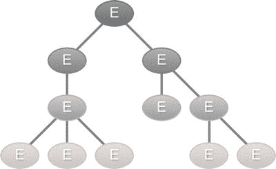

# 一、LDAP 简介

在本章中，我们将讨论:

*   目录基础
*   LDAP 信息模型
*   用于表示 LDAP 数据的 LDIF 格式
*   示例应用

我们每天都与目录打交道。我们使用电话簿来查找电话号码。当参观图书馆时，我们使用图书馆目录查找我们想读的书。对于计算机，我们使用文件系统目录来存储文件和文档。简单地说，目录是一个信息库。这些信息通常以易于检索的方式组织起来。

通常使用客户机/服务器通信模型来访问网络上的目录。希望在目录中读写数据的应用与专门的目录服务器进行通信。目录服务器对实际目录执行读或写操作。[图 1-1](#Fig1) 显示了这种客户端/服务器交互。


[图 1-1](#_Fig1) 。目录服务器和客户机交互

目录服务器和客户端应用之间的通信通常使用标准化协议来完成。轻量级目录访问协议(LDAP)提供了与目录通信的标准协议模型。实现 LDAP 协议的目录服务器通常被称为 LDAP 服务器。LDAP 协议是基于早期的 X.500 标准，但是要简单得多(因此也是轻量级的),并且易于扩展。多年来，LDAP 协议经历了多次迭代，目前是 3.0 版本。

LDAP 概述

LDAP 定义了目录客户端和目录服务器使用的消息协议。通过考虑 LDAP 所基于的以下四个模型，可以更好地理解 LDAP:

*   信息模型决定了存储在目录中的信息的结构。
*   命名模型定义了如何在目录中组织和识别信息。
*   功能模型定义了可以在目录上执行的操作。
*   安全模型定义了如何保护信息免受未经授权的访问。

在接下来的章节中，我们将会看到每一个模型。

目录与数据库

初学者经常会感到困惑，把 LDAP 目录想象成一个关系数据库。像数据库一样，LDAP 目录存储信息。然而，有几个关键特征使目录有别于关系数据库。

LDAP 目录通常存储本质上相对静态的数据。例如，存储在 LDAP 中的员工信息(如电话号码或姓名)不会每天都发生变化。然而，用户和应用非常频繁地查找这些信息。由于目录中的数据被访问的频率高于更新的频率，LDAP 目录遵循 WORM 原则([http://en.wikipedia.org/wiki/Write_Once_Read_Many](http://en.wikipedia.org/wiki/Write_Once_Read_Many))，并针对读取性能进行了大量优化。将经常变化的数据放在 LDAP 中没有意义。

关系数据库使用引用完整性和锁定等技术来确保数据的一致性。存储在 LDAP 中的数据类型通常没有这样严格的一致性要求。因此，这些特性中的大部分在 LDAP 服务器上是不存在的。此外，在 LDAP 规范中没有定义回滚事务的事务语义。

关系数据库的设计遵循规范化原则，以避免数据重复和数据冗余。另一方面，LDAP 目录是以分层的、面向对象的方式组织的。该组织违反了一些规范化原则。此外，LDAP 中没有表连接的概念。

尽管目录缺少上面提到的 RDBMS 的一些特性，但是许多现代 LDAP 目录都是建立在关系数据库(如 DB2)之上的。

信息模型

存储在 LDAP 中的基本信息单元称为条目。条目包含真实世界对象的信息，如雇员、服务器、打印机和组织。LDAP 目录中的每个条目都由零个或多个属性组成。属性是简单的键值对，保存着条目所代表的对象的信息。属性的关键部分也称为属性类型，它描述了可以存储在属性中的信息种类。属性的值部分包含实际信息。[表 1-1](#Tab1) 显示了一个代表雇员的条目的一部分。条目中的左列包含属性类型，右列保存属性值。

[表 1-1](#_Tab1) 。员工 LDAP 条目

| 员工条目 |
| --- |
| 对象类 | inetOrgPerson |
| 给定名称 | 约翰 |
| 姓 | 锻工 |
| 邮件 | [john@inflix.com](mailto:john@inflix.com)
T3】jsmith@inflix.com |
| 可动的 | +1 801 100 1000 |

 **注意**属性名默认不区分大小写。但是，建议在 LDAP 操作中使用 camel case 格式。

您会注意到 mail 属性有两个值。允许保存多个值的属性称为多值属性。另一方面，单值属性只能保存一个值。LDAP 规范不保证多值属性中值的顺序。

每种属性类型都与一种语法相关联，该语法规定了作为属性值存储的数据的格式。例如，移动属性类型有一个与之关联的电话号码语法。这将强制属性保存一个长度在 1 到 32 之间的字符串值。此外，该语法还定义了搜索操作期间属性值的行为。例如，givenName 属性的语法是 DirectoryString。此语法强制要求仅允许字母数字字符作为值。表 1-2 列出了一些常见的属性及其相关的语法描述。

[表 1-2](#_Tab2) 。常见条目属性

| 属性类型 | 句法 | 描述 |
| --- | --- | --- |
| 通用名称 | 目录字符串 | 存储一个人的常用名。 |
| 电话号码 | 电话号码 | 存储此人的主要电话号码。 |
| JPEG 图片 | 二进制的 | 存储人的一个或多个图像。 |
| 姓 | 目录字符串 | 存储人员的姓氏。 |
| 员工编号 | 目录字符串 | 在组织中存储员工的标识号。 |
| 给定名称 | 目录字符串 | 存储用户的名字。 |
| 邮件 | IA5 字符串 | 存储个人的 SMTP 邮件地址。 |
| 可动的 | 电话号码 | 存储个人的手机号码。 |
| 通讯地址 | 通讯地址 | 存储用户的位置。 |
| 邮政编码 | 目录字符串 | 存储用户的邮政编码。 |
| 标准时间 | 目录字符串 | 存储州或省的名称。 |
| 用户界面设计（User Interface Design 的缩写） | 目录字符串 | 存储用户 id。 |
| 街道 | 目录字符串 | 存储街道地址。 |

对象类

在 Java 等面向对象的语言中，我们创建一个类，并用它作为创建对象的蓝图。该类定义了这些实例可以拥有的属性/数据(以及行为/方法)。以类似的方式，LDAP 中的对象类决定了 LDAP 条目可以具有的属性。这些对象类还定义了这些属性中哪些是强制的，哪些是可选的。每个 LDAP 条目都有一个名为 objectClass 的特殊属性，用于保存它所属的对象类。查看[表 1-1](#Tab1) 中的雇员条目中的 objectClass 值，我们可以得出结论，该条目属于 inetOrgPerson 类。[表 1-3](#Tab3) 显示了标准 LDAP person 对象类中的必需和可选属性。cn 属性保存人的常用名，而 sn 属性保存人的姓。

[表 1-3](#_Tab3) 。人对象类

| 必需的属性 | 可选属性 |
| --- | --- |
| 锡 | 描述 |
|  | 电话号码 |
| 通信网络（Communicating Net 的缩写） | 用户口令 |
| 对象类 | 那就去吧 |

和 Java 一样，一个对象类可以扩展其他对象类。这种继承将允许子对象类继承父类属性。例如，person 对象类定义了常用名和姓氏等属性。对象类 inetOrgPerson 扩展了 Person 类，因此继承了 person 的所有属性。此外，inetOrgPerson 定义了在组织中工作的人员所需的属性，例如 departmentNumber 和 employeeNumber。一个特殊的对象类即 top 没有任何父类。所有其他对象类都是 top 的后代，并继承它所声明的所有属性。顶级对象类包括强制的 object class 属性。[图 1-2](#Fig2) 显示了对象继承。


[图 1-2](#_Fig2) 。LDAP 对象继承

大多数 LDAP 实现都带有一组标准的对象类，可以开箱即用。表 1-4 列出了一些 LDAP 对象类及其常用属性。

[表 1-4](#_Tab4) 。常见 LDAP 对象类

| 对象类别 | 属性 | 描述 |
| --- | --- | --- |
| 顶端 | 对象类 | 定义根对象类。所有其他对象类都必须扩展这个类。 |
| 组织 | o | 代表公司或组织。o 属性通常保存组织的名称。 |
| 对象类型 | 或者说 | 代表组织内部的部门或类似实体。 |
| 人 | 序列号
cn
电话号码
用户密码 | 表示目录中的一个人，需要 sn(姓氏)和 cn(常用名)属性。 |
| 组织人员 | 寄存器地址邮政地址邮政编码 | 子类 person，代表组织中的一个人。 |
| inetOrgPerson | uid 部门编号员工编号给定名称管理器 | 提供附加属性，可用于表示在当今基于 Internet 和 intranet 的组织中工作的人。uid 属性保存用户的用户名或用户 id。 |

目录模式

LDAP 目录模式是一组确定存储在目录中的信息类型的规则。模式可以被视为打包单元，包含属性类型定义和对象类定义。在将条目存储在 LDAP 中之前，会验证模式规则。这种模式检查确保条目具有所有必需的属性，并且不包含任何不属于模式的属性。[图 1-3](#Fig3) 表示一个通用的 LDAP 模式。


[图 1-3](#_Fig3) 。LDAP 通用模式

像数据库一样，目录模式需要很好地设计，以解决数据冗余等问题。在开始实现您自己的模式之前，有必要看一下几个公开可用的标准模式。这些标准模式通常包含所有的定义来存储所需的数据，更重要的是，确保跨其他目录的互操作性。

命名模型

LDAP 命名模型定义了目录中条目的组织方式。它还决定了如何唯一地标识特定条目。命名模型建议条目以分层的方式进行逻辑存储。这种条目树通常被称为目录信息树(DIT)。[图 1-4](#Fig4) 提供了一个 通用目录树的例子。



图 1-4 。一般曰

树的根通常被称为目录的基或后缀。此条目表示拥有该目录的组织。后缀的格式可以因实施而异，但一般来说，有三种推荐的方法，如[图 1-5](#Fig5) 中所列。


[图 1-5](#_Fig5) 。目录后缀 命名约定

 **注** DC 代表域组件。

第一个推荐的技术是使用组织的 do- main 名称作为后缀。例如，如果组织的域名是[example.com](http://example.com)，目录的后缀将是 o=example。com。第二种技术也使用域名，但是名称的每个组成部分都加上“dc=”前缀，并用逗号连接。因此，域名[example.com](http://example.com)会产生一个后缀 dc=example，dc=com。这项技术是在 RFC 2247 中提出的，在 Microsoft Active Directory 中很流行。第三种技术使用 X.500 模型，并以 o =组织名称，c =国家代码的格式创建后缀。在美国，组织示例的后缀是 o=example，c=us。

命名模型还定义了如何唯一地命名和标识目录中的条目。共享一个共同直接父项的条目通过其相对可分辨名称(RDN) 进行唯一标识。使用条目的一个或多个属性/值对来计算 RDN。在最简单的情况下，RDN 通常是属性名=属性值的形式。[图 1-6](#Fig6) 提供了一个组织目录的简化表示。ou=employees 下的每个人员条目都有一个唯一的 uid。因此，第一个 person 条目的 RDN 应该是 uid=emp1，其中 emp1 是雇员的用户 id。


[图 1-6](#_Fig6) 。组织目录的例子

 **注意**识别名不是条目中的实际属性。它只是一个与条目相关联的逻辑名称。

重要的是要记住，RDN 不能用来唯一地标识整个树中的条目。然而，这可以通过组合从树的顶部到条目的路径中所有条目的 rdn 来容易地完成。这种组合的结果称为可分辨名称(DN)。在图 1-6 中，人员 1 的 DN 应该是 uid=emp1，ou=employees，dc=example，dc=com。因为 DN 是由 RDN 组合而成的，所以如果一个条目的 RDN 发生变化，该条目及其所有子条目的 DN 也会发生变化。

可能会出现一组条目没有单一唯一属性的情况。在这些场景中，一种选择是组合多个属性来创建唯一性。例如，在前面的目录中，我们可以使用消费者的常用名和电子邮件地址作为 RDN。多值 rdn 通过用+分隔每个属性对来表示，如下所示:

```java
cn =  Balaji  Varanasi +  mail=balaji@inflinx.com
```

 **注意**通常不鼓励多值 rdn。在这些情况下，建议创建唯一的序列属性以确保唯一性。

功能模型

LDAP 功能模型描述了可以使用 LDAP 协议在目录上执行的访问和修改操作。这些操作分为三类:查询、更新和验证。

查询操作用于从目录中搜索和检索信息。因此，每次需要读取一些信息时，都需要针对 LDAP 构建和执行一个搜索查询。搜索操作以 DIT 中的一个起点、搜索的深度以及条目必须具有的匹配属性为起点。在第 6 章中，你将深入搜索并查看所有可用选项。

更新操作添加、修改、删除和重命名目录条目。顾名思义，add 操作向目录中添加一个新条目。该操作需要创建条目的 DN 和一组构成条目的属性。删除操作获取条目的全限定 DN，并将其从目录中删除。LDAP 协议只允许删除叶条目。修改操作更新现有条目。该操作接受条目的 DN 和一组修改，例如添加新属性、更新新属性或删除现有属性。重命名操作可用于重命名或移动目录中的条目。

身份验证操作用于连接和结束客户端和 LDAP 服务器之间的会话。绑定操作启动客户端和 LDAP 服务器之间的 LDAP 会话。通常，这将导致匿名会话。客户端可以提供一个 DN 和一组凭证来对自身进行身份验证，并创建一个经过身份验证的会话。另一方面，解除绑定操作可用于终止现有会话并断开与服务器的连接。

LDAP V3 引入了一个框架，用于扩展现有操作和添加新操作，而无需更改协议本身。你会在第 7 章中看到这些操作。

安全模式

LDAP 安全模型侧重于保护 LDAP 目录信息免受未经授权的访问。该模型指定了哪些客户端可以访问目录的哪些部分，以及允许哪些类型的操作(搜索还是更新)。

LDAP 安全模型基于客户端向服务器验证自身。如上所述的这个认证过程或绑定操作涉及客户端提供标识其自身的 DN 和密码。如果客户端不提供 DN 和密码，则会建立一个匿名会话。RFC 2829([www.ietf.org/rfc/rfc2829.txt](http://www.ietf.org/rfc/rfc2829.txt))定义了 LDAP V3 服务器必须支持的一组认证方法。身份验证成功后，访问控制模型将被查询，以确定客户端是否有足够的权限执行所请求的操作。不幸的是，在访问控制模型方面不存在标准，每个供应商都提供自己的实现。

LDAP 供应商

LDAP 获得了各种供应商的广泛支持。还有一个强大的开源运动来生产 LDAP 服务器。表 1-5 列出了一些流行的目录服务器。

[表 1-5](#_Tab5) 。LDAP 供应商


ApacheDS 和 OpenDJ 是 LDAP 目录的纯 Java 实现。在本书中，您将使用这两台服务器对代码进行单元和集成测试。

LDIF 格式

LDAP 数据交换格式(LDIF) 是一种基于文本的标准格式，用于表示目录内容和更新请求。RFC 2849([www.ietf.org/rfc/rfc2849.txt](http://www.ietf.org/rfc/rfc2849.txt))中定义了 LDIF 格式。LDIF 文件通常用于从一个目录服务器导出数据，并将其导入另一个目录服务器。它也常用于归档目录数据和对目录进行批量更新。您将使用 LDIF 文件来存储您的测试数据，并在单元测试之间刷新目录服务器。

用 LDIF 表示的条目的基本格式如下:

```java
#comment
dn: <distinguished name>
objectClass:  <object class>
objectClass:  <object class>
...
...
<attribute  type>: <attribute  value>
<attribute  type>: <attribute  value>
...
```

LDIF 文件中以#字符开头的行被视为注释。条目的 dn 和至少一个对象类定义被认为是必需的。属性表示为用冒号分隔的名称/值对。在单独的行中指定了多个属性值，这些属性值将具有相同的属性类型。由于 LDIF 文件完全基于文本，二进制数据在存储为 LDIF 文件的一部分之前需要进行 Base64 编码。

同一 LDIF 文件中的多个条目由空行分隔。清单 1-1 显示了一个有三个雇员条目的 LDIF 文件。请注意，cn 属性是一个多值属性，并且为每个雇员表示两次。

[***清单 1-1***](#_list1) 。有三个员工条目的 LDIF 文件

```java
#  Barbara’s Entry
dn: cn=Barbara J Jensen,  dc=example, dc=com
#  multi valued attribute
cn: Barbara J Jensen
cn:  Babs Jensen
objectClass:  person sn: Jensen
#  Bjorn’s  Entry
dn: cn=Bjorn J Jensen,  dc=example, dc=com
cn: Bjorn J Jensen
cn:  Bjorn Jensen
objectClass:  person
sn: Jensen

#  Base64 encoded  JPEG  photo
jpegPhoto:: /9j/4AAQSkZJRgABAAAAAQABAAD/2wBDABALD A4MChAODQ4SERATGCgaGBYWGDEjJR0oOjM9PDkzODdASFxOQ ERXRTc4UG1RV19iZ2hnPk1xeXBkeFxlZ2P/2wBDARESEhgVG

#  Jennifer’s  Entry
dn: cn=Jennifer  J Jensen,  dc=example, dc=com
cn: Jennifer J Jensen
cn: Jennifer  Jensen
objectClass: person
sn: Jensen
```

样本应用

在本书中，你将使用一个假想图书馆的目录。我选择了图书馆，因为这个概念是通用的，容易掌握。图书馆通常储存书籍和其他多媒体资料，供顾客借阅。图书馆还雇用人员负责图书馆的日常运作。为了便于管理，这个目录不会存储关于书籍的信息。关系数据库可能适合记录书籍信息。图 1-7 显示了我们的库应用*的 LDAP 目录树。*


图 1-7 。库曰

在这个目录树中，我使用了 RFC 2247([www.ietf.org/rfc/rfc2247.txt](http://www.ietf.org/rfc/rfc2247.txt))约定来命名基本条目。基本条目有两个保存雇员和顾客信息的组织单位条目。树的 ou=employees 部分将保存所有的库员工条目。树的 ou =顾客部分将保存图书馆顾客条目。图书馆雇员和顾客条目都属于 inetOrgPerson 对象类类型。员工和顾客都使用他们唯一的登录 id 访问图书馆应用。因此 uid 属性将被用作条目的 RDN。

摘要

LDAP 和与 LDAP 交互的应用已经成为当今每个企业的重要组成部分。本章讲述了 LDAP 目录的基础知识。您了解了 LDAP 将信息存储为条目。每个条目都由简单的键值对属性组成。这些条目可以通过它们的识别名来访问。您还看到了 LDAP 目录具有决定可以存储的信息类型的模式。

在下一章中，您将看到使用 JNDI 与 LDAP 目录通信。在第 2 章之后的章节中，您将重点关注使用 Spring LDAP 开发 LDAP 应用。