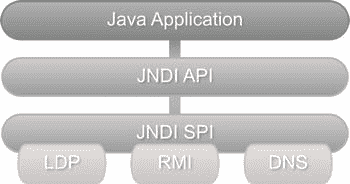

# 二、Java 对 LDAP 的支持

在本章中，我们将讨论:

*   JNDI 基础知识
*   使用 JNDI 的 LDAP 启用应用
*   JNDI 的缺点

Java 命名和目录接口(JNDI) 顾名思义，提供了访问命名和目录服务的标准化编程接口。它是一个通用 API，可用于访问各种系统，包括文件系统、EJB、CORBA 和目录服务，如网络信息服务和 LDAP。JNDI 对目录服务的抽象可以被视为类似于 JDBC 对关系数据库的抽象。

JNDI 架构由应用编程接口(API)和服务提供商接口(SPI)组成。开发人员使用 JNDI API 对他们的 Java 应用进行编程，以访问目录/命名服务。供应商实现 SPI 的细节是处理与他们特定服务/产品的实际通信。这种实现被称为服务提供商。图 2-1 显示了 JNDI 架构以及一些命名和目录服务提供商。这种可插拔架构提供了一致的编程模型，避免了为每个产品学习单独的 API 的需要。



图 2-1 。JNDI 建筑

自 Java 版本 1.3 以来，JNDI 一直是标准 JDK 发行版的一部分。API 本身分布在以下四个包中:

*   javax.naming 包包含用于在命名服务中查找和访问对象的类和接口。
*   javax.naming.directory 包包含扩展核心 javax.naming 包的类和接口。这些类可用于访问目录服务和执行高级操作，如过滤搜索。
*   在访问命名和目录服务时，javax.naming.event 包具有事件通知功能。
*   javax.naming.ldap 包包含支持 ldap 版本 3 控件和操作的类和接口。我们将在后面的章节中探讨控制和操作。

javax.naming.spi 包包含 spi 接口和类。就像我上面提到的，服务提供商实现 SPI，我们不会在本书中讨论这些类。

使用 JNDI 的 LDAP

虽然 JNDI 允许访问目录服务，但重要的是要记住，JNDI 本身不是一个目录或命名服务。因此，为了使用 JNDI 访问 LDAP，我们需要一个正在运行的 LDAP 目录服务器。如果您没有可用的测试 LDAP 服务器，请参考第三章中的步骤安装本地 LDAP 服务器。

使用 JNDI 访问 LDAP 通常包括以下三个步骤:

*   连接到 LDAP
*   执行 LDAP 操作
*   关闭资源

连接到 LDAP

使用 JNDI 的所有命名和目录操作都是相对于上下文执行的。因此，使用 JNDI 的第一步是创建一个上下文，作为 LDAP 服务器的起点。这样的上下文被称为初始上下文。一旦建立了初始上下文，就可以使用它来查找其他上下文或添加新对象。

javax . naming 包中的 Context 接口和 InitialContext 类可用于创建初始命名上下文。由于我们在这里处理的是一个目录，我们将使用一个更具体的 DirContext 接口及其实现 InitialDirContext。DirContext 和 InitialDirContext 都可以在 javax.naming.directory 包中找到。目录上下文实例可以用一组提供 LDAP 服务器信息的属性进行配置。清单 2-1 中的代码为运行在本地端口 11389 上的 LDAP 服务器创建了一个上下文。

***清单 2-1。***

```java
Properties environment =  new  Properties();
environment.setProperty(DirContext.INITIAL_CONTEXT_FACTORY, 
"com.sun.jndi.ldap.LdapCtxFactory");
environment.setProperty(DirContext.PROVIDER_URL, "ldap://localhost:11389");
DirContext context  =  new  InitialDirContext(environment);
```

在上面的代码中，我们使用了 INITIAL_CONTEXT_FACTORY 常量来指定需要使用的服务提供者类。这里我们使用的是 sun 提供程序 com . sun . JNDI . LDAP . ldapctxfactory，它是标准 JDK 发行版的一部分。PROVIDER_URL 用于指定 LDAP 服务器的全限定 URL。URL 包括协议(非安全的 ldap 或安全连接的 ldaps)、LDAP 服务器主机名和端口。

一旦建立了与 LDAP 服务器的连接，应用就可以通过提供身份验证信息来识别自己。类似于在清单 2-1 中创建的上下文，其中没有提供认证信息，被称为匿名上下文。LDAP 服务器通常有 ACL(访问列表控制),将操作和信息限制在某些帐户。因此，在企业应用中创建和使用经过身份验证的上下文是非常常见的。清单 2-2 提供了一个创建认证上下文的例子。请注意，我们使用了三个附加属性来提供绑定凭证。SECURITY_AUTHENTICATION 属性设置为 simple，表示我们将使用纯文本用户名和密码进行身份验证。

***清单 2-2*** 。

```java
Properties environment =  new  Properties();
environment.setProperty(DirContext.INITIAL_CONTEXT_FACTORY, 
"com.sun.jndi.ldap.LdapCtxFactory");
environment.setProperty(DirContext.PROVIDER_URL, "ldap://localhost:11389");
environment.setProperty(DirContext.SECURITY_AUTHENTICATION, "simple");
environment.setProperty(DirContext.SECURITY_PRINCIPAL, "uid=admin,ou=system");
environment.setProperty(DirContext.SECURITY_CREDENTIALS, "secret");
DirContext context  =  new  InitialDirContext(environment);
```

在创建上下文期间可能发生的任何问题都将被报告为 javax.naming.NamingException 的实例。NamingException 是 JNDI API 抛出的所有异常的超类。这是一个已检查的异常，必须正确处理才能编译代码。表 2-1 列出了我们在 JNDI 开发过程中可能遇到的常见异常情况。

表 2-1 。常见的 LDAP 例外

| 例外 | **描述** |
| --- | --- |
| AttributeInUseException | 当操作试图添加现有属性时引发。 |
| 属性修改异常 | 当操作试图添加/移除/更新属性并违反属性的架构或状态时引发。例如，向单值属性添加两个值会导致此异常。 |
| 沟通例外 | 当应用无法与 LDAP 服务器通信(例如网络问题)时抛出。 |
| InvalidAttributesException | 当操作试图添加或修改指定不完整或不正确的属性集时抛出。例如，试图在没有指定所有必需属性的情况下添加新条目会导致此异常。 |
| limitexceedededexception | 当搜索操作因达到用户或系统指定的结果限制而突然终止时引发。 |
| InvalidSearchFilterException | 当搜索操作被赋予格式错误的搜索筛选器时引发。 |
| NameAlreadyBoundException | 抛出以指示不能添加条目，因为关联的名称已经绑定到不同的对象。 |
| PartialResultException | 抛出表示只返回了预期结果的一部分，操作无法完成。 |

LDAP 操作

一旦我们获得了初始上下文，我们就可以使用该上下文在 LDAP 上执行各种操作。这些操作可能涉及查找另一个上下文、创建新上下文以及更新或删除现有上下文。下面是一个使用 DN uid=emp1，ou=employees，dc=inflinx，d c=com 查找另一个上下文的示例。

```java
DirContext anotherContext  =  context.lookup("uid=emp1,ou=employees,
dc=inflinx,dc=com");
```

在下一节中，我们将仔细研究这些操作。

关闭资源

在所有期望的 LDAP 操作完成之后，正确关闭上下文和任何其他相关资源是很重要的。关闭 JNDI 资源只需要调用它的 close 方法。清单 2-3 显示了与关闭 DirContext 相关的代码。从代码中可以看出，close 方法也抛出了一个需要正确处理的 NamingException。

***清单 2-3。***

```java
try {
   context.close();
}
catch  (NamingException e)  {
   e.printstacktrace();
}
```

创建新条目

考虑这样一种情况，一个新员工从我们假设的库开始，我们被要求将他的信息添加到 LDAP 中。正如我们前面看到的，在将条目添加到 LDAP 之前，有必要获取 InitialDirContext。清单 2-4 为此定义了一个可重用的方法。

***清单 2-4。***

```java
private  DirContext getContext() throws NamingException{
   Properties environment =  new  Properties();   
   environment.setProperty(DirContext.INITIAL_CONTEXT_FACTORY, "com.sun.jndi.ldap.
   LdapCtxFactory");
   environment.setProperty(DirContext.PROVIDER_URL, "ldap://localhost:10389");
   environment.setProperty(DirContext.SECURITY_PRINCIPAL, "uid=admin,ou=system");
   environment.setProperty(DirContext.SECURITY_CREDENTIALS, "secret"); 
   DirContext context  =  new  InitialDirContext(environment);
   return context;
}
```

一旦我们有了初始的上下文，添加新的雇员信息就是一个简单的操作，如清单 2-5 所示。

***清单 2-5。***

```java
public  void addEmploye(Employee employee)  {
   DirContext context  =  null;
   try  {
      context =  getContext();
      // Populate the attributes
      Attributes attributes  =  new  BasicAttributes();
      attributes.put(new  BasicAttribute("objectClass", "inetOrgPerson"));
      attributes.put(new BasicAttribute("uid", employee.getUid()));
      attributes.put(new BasicAttribute("givenName", employee.getFirstName()));
      attributes.put(new BasicAttribute("surname", employee.getLastName()));
      attributes.put(new BasicAttribute("commonName", employee.getCommonName()));
      attributes.put(new BasicAttribute("departmentNumber",
      employee.getDepartmentNumber()));
      attributes.put(new  BasicAttribute("mail", employee.getEmail()));
      attributes.put(new BasicAttribute("employeeNumber",
      employee.getEmployeeNumber()));

      Attribute  phoneAttribute = new  BasicAttribute("telephoneNumber");
      for(String phone : employee.getPhone())  {
         phoneAttribute.add(phone);
      }
      attributes.put(phoneAttribute);

       // Get the fully  qualified DN
     String dn   =  "uid="+employee.getUid() +  "," +  BASE_PATH;

      // Add  the entry
      context.createSubcontext("dn", attributes);
   }
   catch(NamingException e)  {
      // Handle the exception properly
        e.printStackTrace();
   }
   finally  {
      closeContext(context);
   }
}
```

如您所见，该过程的第一步是创建一组需要添加到条目中的属性。JNDI 提供了 javax . naming . directory . attributes 接口及其实现 javax . naming . directory . basic attributes 来抽象属性集合。然后，我们使用 JNDI 的 javax . naming . directory . basic attribute 类将雇员的属性一次一个地添加到集合中。注意，我们在创建 BasicAttribute 类时采用了两种方法。在第一种方法中，我们通过将属性名和值传递给 BasicAttribute 的构造函数来添加单值属性。为了处理多值属性 telephone，我们首先通过传入名称来创建 BasicAttribute 实例。然后，我们分别将电话值添加到属性中。添加完所有属性后，我们在初始上下文中调用 createSubcontext 方法来添加条目。createSubcontext 方法要求添加条目的完全限定 DN。

注意，我们已经将上下文的关闭委托给了一个单独的方法 closeContext。清单 2-6 展示了它的实现。

***清单 2-6。***

```java
private  void closeContext(DirContext context)  {
   try  {
      if(null != context)  {
      context.close();
      }
   }
   catch(NamingException e)  {
      // Ignore the  exception
   }
}
```

更新条目

修改现有 LDAP 条目可能涉及以下任何操作:

*   添加新的属性和值，或者向现有的多值属性添加新值。
*   替换现有属性值。
*   删除属性及其值。

为了允许修改条目，JNDI 提供了一个恰当命名的 javax . naming . directory . modification item 类。

ModificationItem 由要进行的修改的类型和正在修改的属性组成。下面的代码创建了一个用于添加新电话号码的修改项。

```java
Attribute telephoneAttribute =  new  BasicAttribute("telephone", "80181001000");
ModificationItem modificationItem  =  new  ModificationItem(DirContext. 
ADD_ATTRIBUTE,  telephoneAttribute);
```

注意，在上面的代码中，我们使用了常量 ADD_ATTRIBUTE 来表示我们需要一个 ADD 操作。表 2-2 提供了支持的修改类型及其描述。

表 2-2 。LDAP 修改类型

| 修改类型 | 描述 |
| --- | --- |
| 添加属性 | 将具有提供的一个或多个值的属性添加到条目中。如果该属性不存在，则将创建它。如果属性已经存在，并且属性是多值的，那么该操作只是将指定的值添加到现有列表中。但是，对现有单值属性的此操作将导致 AttributeInUseException。 |
| 替换属性 | 用提供的值替换条目的现有属性值。如果该属性不存在，则将创建它。如果属性已经存在，那么它的所有值都将被替换。 |
| 移除属性 | 从现有属性中移除指定的值。如果没有指定任何值，则整个属性将被删除。如果属性中不存在指定的值，操作将引发 NamingException。如果要删除的值是该属性的唯一值，则该属性也将被删除。 |

更新条目的代码在清单 2-7 中提供。modifyAttributes 方法接受要修改的条目的全限定 DN 和一个修改项数组。

***清单 2-7。***

```java
public void update(String  dn, ModificationItem[] items)  {
   DirContext context  =  null;
   try  {
      context =  getContext();
      context.modifyAttributes(dn, items);
   }
   catch  (NamingException e)  {
      e.printStackTrace();
   }
   finally  {
     closeContext(context);
   }
}
```

删除条目

使用 JNDI 删除条目也是一个简单的过程，如清单 2-8 所示。destroySubcontext 方法获取需要删除的条目的全限定 DN。

***清单 2-8。***

```java
public  void remove(String dn) {
   DirContext context  =  null;
   try  {
      context =  getContext();
      context.destroySubcontext(dn);
   }
   catch(NamingException e)  {
      e.printStackTrace();
   finally  {
      closeContext(context);
   }
}
```

许多 LDAP 服务器不允许删除包含子条目的条目。在这些服务器中，删除非叶条目需要遍历子树并删除所有子条目。那么可以删除非叶条目。清单 2-9 显示了删除一个子树的代码。

***清单 2-9。***

```java
public  void removeSubTree(DirContext ctx, String root)
throws  NamingException {
NamingEnumeration enumeration  =  null;
try  {
     enumeration =  ctx.listBindings(root);
     while (enumeration.hasMore())  {
         Binding childEntry =(Binding)enumeration.next();
         LdapName childName  =  new  LdapName(root);
        childName.add(childEntry.getName());

         try  {
              ctx.destroySubcontext(childName);
         }
         catch  (ContextNotEmptyException e)  {
        removeSubTree(ctx, childName.toString());
        ctx.destroySubcontext(childName);
         }
     }
}
catch  (NamingException e)  {
     e.printStackTrace();
}
finally  {
         try  {
               enumeration.close();
         }
         catch (Exception e)  {
               e.printStackTrace();
         }
     }
}
```

 **注意**OpenDJ LDAP 服务器支持特殊的子树删除控件，当附加到删除请求时，可以使服务器删除非叶条目及其所有子条目。我们将在第七章的中了解 LDAP 控件的使用。

搜索条目

搜索信息通常是针对 LDAP 服务器执行的最常见的操作。为了执行搜索，我们需要提供诸如搜索范围、我们在寻找什么以及需要返回什么属性之类的信息。在 JNDI，这种搜索元数据是使用 SearchControls 类提供的。清单 2-10 提供了一个带有子树范围的搜索控件的例子，并返回 givenName 和 telephoneNumber 属性。子树范围表示搜索应该从给定的基本条目开始，并且应该搜索它的所有子树条目。我们将在第六章的中详细了解不同的可用范围。

***清单 2-10。***

```java
SearchControls searchControls  =  new  SearchControls(); searchControls.setSearchScope(SearchControls.SUBTREE_SCOPE); 
searchControls.setReturningAttributes(new String[]{"givenName",
"telephoneNumber"});
```

一旦我们定义了搜索控件，下一步就是调用 DirContext 实例中的许多搜索方法之一。清单 2-11 提供了搜索所有雇员并打印他们的名字和电话号码的代码。

***清单 2-11。***

```java
public void search() {
   DirContext context  =  null;
   NamingEnumeration<SearchResult> searchResults =  null;
   try
   {
      context =  getContext();
      // Setup Search meta data
      SearchControls searchControls  =  new  SearchControls();
       searchControls.setSearchScope(SearchControls.SUBTREE_SCOPE);
       searchControls.setReturningAttributes(new String[]      
       {"givenName",  "telephoneNumber"});
      searchResults =  context.search("dc=inflinx,dc=com",       
      "(objectClass=inetOrgPerson)", searchControls);
        while (searchResults.hasMore())  {
         SearchResult result =  searchResults.next();
         Attributes attributes  =  result.getAttributes();
         String firstName =  (String)attributes.get("givenName").get();
         // Read the  multi-valued  attribute
         Attribute  phoneAttribute =  attributes. get("telephoneNumber");
         String[] phone =  new  String[phoneAttribute.size()];
         NamingEnumeration phoneValues  =  phoneAttribute.getAll();
         for(int i =  0;  phoneValues.hasMore(); i++) {
         phone[i] =  (String)phoneValues.next();
         }
      System.out.println(firstName +    ">   " +  Arrays.toString(phone));
      }
     }
   catch(NamingException e)  {
      e.printStackTrace();
   }
   finally  {
       try  {
          if (null  != searchResults) {
          searchResults.close();
          }
       closeContext(context);
       }  catch  (NamingException e)  {
       // Ignore this
       }
   }
}
```

这里我们使用了带有三个参数的搜索方法:一个确定搜索起点的基数、一个缩小结果范围的过滤器和一个搜索控件。search 方法返回 SearchResults 的枚举。每个搜索结果都包含 LDAP 条目的属性。因此，我们遍历搜索结果并读取属性值。注意，对于多值属性，我们获得另一个枚举实例，并一次读取一个值。在代码的最后部分，我们关闭了结果枚举和上下文资源。

JNDI 的弊端

尽管 JNDI 为访问目录服务提供了一个很好的抽象，但它确实有以下几个缺点:

*   显式资源管理
*   开发人员负责关闭所有资源。这很容易出错，并可能导致内存泄漏。
*   管道规范
*   我们上面看到的方法有很多可以很容易抽象和重用的管道代码。这种管道代码使得测试更加困难，开发人员必须了解 API 的本质。
*   检查异常
*   使用检查异常尤其是在不可恢复的情况下是有问题的。在这些场景中，必须显式处理 NamingException 通常会导致空的 try catch 块。