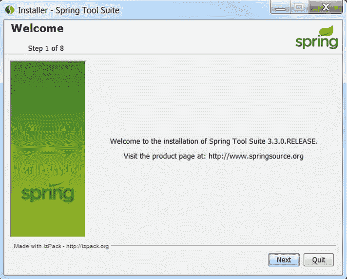
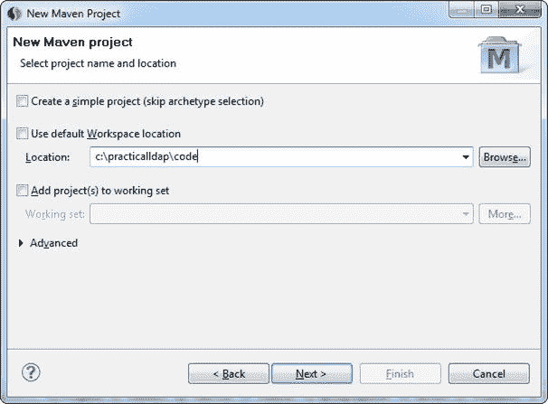

第三章


Spring LDAP 简介

在本章中，我们将讨论

*   Spring LDAP 的基础知识。
*   下载和设置 Spring LDAP。
*   设置 STS 开发环境。
*   设置测试 LDAP 服务器。
*   创建 Hello World 应用程序。

Spring LDAP 为 Java 中的 LDAP 编程提供了简单、干净和全面的支持。这个项目最初于 2006 年在 Sourceforge 上以 LdapTemplate 的名字启动，目的是使用 JNDI 简化对 LDAP 的访问。该项目后来成为 Spring Framework 组合的一部分，并且已经走过了漫长的道路。图 3-1 描述了一个基于 Spring LDAP 的应用程序的架构。


[图 3-1](#_Fig1) 。Spring LDAP 架构目录

应用程序代码使用 Spring LDAP API 在 LDAP 服务器上执行操作。Spring LDAP 框架包含所有特定于 LDAP 的代码和抽象。然而，Spring LDAP 将依赖 Spring 框架来满足它的一些基础设施需求。

Spring 框架已经成为今天开发基于 Java 的企业应用程序的事实上的标准。除了其他方面，它还为 JEE 编程模型提供了一个基于依赖注入的轻量级替代方案。Spring 框架是 Spring LDAP 和所有其他 Spring 组合项目(如 Spring MVC 和 Spring Security)的基础。

动机

在前一章中，我们讨论了 JNDI API 的缺点。JNDI 的一个显著缺点是它非常冗长；第二章中几乎所有的代码都与管道有关，很少与应用程序逻辑有关。Spring LDAP 通过提供负责管道代码的模板和实用程序类来解决这个问题，这样开发人员就可以专注于业务逻辑。

JNDI 的另一个值得注意的问题是，它要求开发人员显式地管理 LDAP 上下文等资源。这很容易出错。忘记关闭资源可能会导致泄漏，并可能在高负载下迅速关闭应用程序。Spring LDAP 代表您管理这些资源，并在您不再需要它们时自动关闭它们。它还提供了池化 LDAP 上下文的能力，这可以提高性能。

在执行 JNDI 操作期间可能出现的任何问题都将被报告为 NamingException 或其子类的实例。NamingException 是一个检查过的异常，因此开发人员必须处理它。数据访问异常通常是不可恢复的，而且大多数情况下，我们无法捕捉这些异常。为了解决这个问题，Spring LDAP 提供了一个一致的未检查异常层次结构，模拟 NamingException。这允许应用程序设计人员选择何时何地处理这些异常。

最后，简单的 JNDI 编程对新开发人员来说很难，可能会令人望而生畏。Spring LDAP 及其抽象使得使用 JNDI 更加愉快。此外，它还提供了各种特性，如对象目录映射和对事务的支持，这使它成为任何企业 LDAP 开发人员的重要工具。

获取 Spring LDAP

在安装和开始使用 Spring LDAP 之前，确保 Java 开发工具包(JDK)已经安装在您的机器上是很重要的。最新的 Spring LDAP 1.3.2 版本需要 JDK 1.4 或更高版本以及 Spring 2.0 或更高版本。由于我在书中的例子中使用的是 Spring 3.2.4，所以强烈建议安装 JDK 6.0 或更高版本。

Spring 框架及其组合项目可以从[www.springsource.org/download/community](http://www.springsource.org/download/community)下载。在 www.springsource.org/ldap[的 Spring LDAP 网站上有一个直接链接。Spring LDAP 下载页面](http://www.springsource.org/ldap)允许您下载框架的最新版本以及以前的版本，如图[图 3-2](#Fig2) 所示。


[图 3-2](#_Fig2) 。春季 LDAP 下载

spring-LDAP-1 . 3 . 2 . release-dist . zip 包括框架二进制文件、源代码和文档。因为最新的 LDAP 分发包不包含 Spring 分发包，所以您需要单独下载 Spring Framework。[图 3-3](#Fig3) 显示了最新可用的 Spring 框架发行版，3.2.4.RELEASE .下载 Spring LDAP 和 Spring 发行版，如图[图 3-3](#Fig3) 所示，并在你的机器上解压。


[图 3-3](#_Fig3) 。Spring 框架下载

春季 LDAP 打包

现在您已经成功下载了 Spring LDAP 框架，让我们深入研究它的子文件夹。libs 文件夹包含 Spring LDAP 二进制文件、源代码和 javadoc 发行版。LDAP 框架被打包成六个不同的组件。表 3-1 提供了每个组件的简要描述。docs 文件夹包含 API 的 javadoc 和不同格式的参考指南。

[表 3-1](#_Tab1) 。Spring LDAP 分发模块

| 成分罐 | 描述 |
| --- | --- |
| spring-LDAP-核心 | 包含使用 LDAP 框架所需的所有类。所有应用程序都需要这个 jar。 |
| spring-LDAP-核心-tiger | 包含特定于 Java 5 和更高版本的类和扩展。在 Java 5 下运行的应用程序不应该使用这个 jar。 |
| spring LDAP 测试 | 包含使测试更容易的类和实用程序。它还包括启动和停止 ApacheDS LDAP 服务器的内存实例的类。 |
| spring-ldap-ldif-core | 包含用于分析 ldif 格式文件的类。 |
| spring-ldap-ldif-batch | 包含将 ldif 解析器与 Spring Batch Framework 集成所需的类。 |
| spring-ldap-odm | 包含用于启用和创建对象目录映射的类。 |

除了 Spring Framework，您还需要额外的 jar 文件来使用 Spring LDAP 编译和运行应用程序。表 3-2 列出了一些相关的 jars 文件以及为什么使用它们的描述。

[表 3-2](#_Tab2) 。Spring LDAP 依赖 jar

| 图书馆罐子 | 描述 |
| --- | --- |
| 康芒斯-朗 | Spring LDAP 和 Spring Framework 内部使用的必需 jar。 |
| 公共日志记录 | Spring LDAP 和 Spring Framework 内部使用的日志抽象。这是应用程序中必须包含的 jar。另一种选择(也是 Spring 提倡的)是通过 SLF4J-JCL 桥使用 SLF4J 日志框架。 |
| log4j | 使用 Log4J 进行日志记录所需的库。 |
| 弹簧芯 | 包含 Spring LDAP 内部使用的核心实用程序的 Spring 库。这是使用 Spring LDAP 所必需的库。 |
| 春豆 | 用于创建和管理 Spring beans 的 Spring 框架库。Spring LDAP 需要的另一个库。 |
| 春天的背景 | 负责依赖注入的 Spring 库。当在 Spring 应用程序中使用 Spring LDAP 时，这是必需的。 |
| 春天-tx | 提供事务抽象的 Spring 框架库。当使用 Spring LDAP 事务支持时，这是必需的。 |
| spring-jdbc | 使用 JDBC 简化数据库访问的库。这是一个可选的库，应该用于事务支持。 |
| 公共游泳池 | Apache Commons 池库提供了对池的支持。当使用 Spring LDAP 池支持时，应该包括这一点。 |
| ldapbp | 包含附加 LDAP V3 服务器控件的 Sun LDAP 增强包。当您计划使用这些附加控件或者在 Java 5 或更低版本下运行时，这个 jar 是必需的。 |

下载 Spring LDAP 源代码

Spring LDAP 项目使用 Git 作为他们的源代码控制系统。源代码可以从[https://github.com/SpringSource/spring-ldap](https://github.com/SpringSource/spring-ldap)下载。

Spring LDAP 源代码可以为框架架构提供有价值的见解。它还包括一个丰富的测试套件，可以作为额外的文档，帮助您理解框架。我强烈建议您下载并查看源代码。Git 存储库还包含一个沙箱文件夹，其中包含几个实验性的特性，这些特性可能会也可能不会出现在框架中。

使用 Maven 安装 Spring LDAP

Apache Maven 是一个开源的、基于标准的项目管理框架，它使得项目的构建、测试、报告和打包变得更加容易。如果你是 Maven 新手，对这个工具有疑问，Maven 网站，【http://maven.apache.org】的[提供了关于它的特性的信息以及大量有用的链接。以下是采用 Maven 的一些优势](http://maven.apache.org):

*   *标准化的目录结构* : Maven 标准化了一个项目的布局和组织。每当一个新项目开始时，都要花费大量的时间来决定源代码应该放在哪里或者配置文件应该放在哪里。此外，这些决策在项目和团队之间会有很大的不同。Maven 的标准化目录结构使得开发人员甚至 ide 都很容易采用。
*   *声明依赖关系管理*:使用 Maven，您可以在一个单独的 pom.xml 文件中声明项目依赖关系。然后 Maven 自动从存储库中下载这些依赖项，并在构建过程中使用它们。Maven 还智能解析并下载传递依赖(依赖的依赖)。
*   *原型* : Maven 原型是项目模板，可以用来轻松地生成新项目。这些原型是共享最佳实践和加强 Maven 标准目录结构之外的一致性的好方法。
*   *插件* : Maven 遵循基于插件的架构，这使得添加或定制其功能变得容易。目前有数百个插件可用于执行从编译代码到创建项目文档的各种任务。激活和使用插件只需要在 pom.xml 文件中声明对插件的引用。
*   *工具支持*:今天所有主流的 ide 都为 Maven 提供工具支持。这包括生成项目、创建特定于 IDE 的文件的向导，以及用于分析依赖关系的图形化工具。

安装 Maven

要安装 Maven，只需从[http://maven.apache.org/download.html](http://maven.apache.org/download.html)下载最新版本。下载完成后，将发行版解压缩到您机器上的本地目录。然后对开发箱进行以下修改:

*   添加一个指向 maven 安装目录的 M2_HOME 环境变量。
*   添加一个值为–xmx 512m 的 MAVEN_OPTS 环境变量。
*   将 M2_HOME/bin 值添加到 Path 环境变量中。

 **注意** Maven 需要互联网连接来下载依赖项和插件。如果您或您的公司使用代理连接到 Internet，请更改 settings.xml 文件。否则，您可能会遇到“无法下载工件”的错误。

这就完成了 Maven 的安装。您可以通过在命令行上运行以下命令来验证安装:

```java
$  mvn  –v
```

该命令应该输出类似于以下内容的信息:

```java
Apache Maven 3.1.0 (893ca28a1da9d5f51ac03827af98bb730128f9f2; 2013-06-27 20:15:32-0600)
Maven home: c:\tools\maven
Java version: 1.6.0_35, vendor: Sun Microsystems Inc.
Java home: C:\Java\jdk1.6.0_35\jre
Default locale: en_US, platform encoding: Cp1252
OS name: "windows 7", version: "6.1", arch: "x86", family: "windows"
```

Spring LDAP 原型

为了快速启动 Spring LDAP 开发，本书使用了以下两个原型:

*   practical-ldap-empty-archetype:这个原型可以用来创建一个空的 Java 项目，包含所有必需的 LDAP 依赖项。
*   practical-ldap-architect:与上面的原型类似，这个原型创建了一个 Java 项目，其中包含所有必需的 LDAP 依赖项。此外，它还包括 Spring LDAP 配置文件、示例代码和运行内存中 LDAP 服务器进行测试的依赖项。

在使用原型创建项目之前，您需要安装它们。如果您还没有这样做，请从 Apress 下载附带的源文件/下载文件。在下载的发行版中，您会发现 practical-LDAP-empty-archetype-1 . 0 . 0 . jar 和 practical-LDAP-archetype-1 . 0 . 0 . jar 原型。下载完 jar 文件后，在命令行运行以下两个命令:

```java
mvn  install:install-file \
     -DgroupId=com.inflinx.book.ldap \
     -DartifactId=practical-ldap-empty-archetype \
     -Dversion=1.0.0 \
     -Dpackaging=jar
     -Dfile=<JAR_LOCATION_DOWNLOAD>/practical-ldap-empty-archetype-1.0.0.jar

mvn  install:install-file \
     -DgroupId=com.inflinx.book.ldap \
     -DartifactId=practical-ldap-archetype \
     -Dversion=1.0.0 \
     -Dpackaging=jar
     -Dfile=< JAR_LOCATION_DOWNLOAD >/practical-ldap-archetype-1.0.0.jar
```

这些 maven install 命令将在您的本地 maven 存储库中安装这两个原型。使用这些原型之一创建项目只需运行以下命令:

```java
C:\practicalldap\code>mvn archetype:generate
-DarchetypeGroupId=com.inflinx.book.ldap \
-DarchetypeArtifactId=practical-ldap-empty-archetype \
-DarchetypeVersion=1.0.0 \
-DgroupId=com.inflinx.ldap \
-DartifactId=chapter3 \
-DinteractiveMode=false
```

注意，这个命令是在目录 c:/practicalldap/code 中执行的。该命令指示 maven 使用原型 practical-LDAP-empty-architect 并生成一个名为 [chapter3](03.html) 的项目。生成的项目目录结构如图[图 3-4](#Fig4) 所示。


[图 3-4](#_Fig4) 。Maven 生成的项目结构

这个目录结构有一个 src 文件夹,保存所有代码和任何相关的资源，比如 XML 文件。目标文件夹包含生成的类和构建工件。src 下的主文件夹通常保存最终进入生产的代码。测试文件夹包含相关的测试代码。这两个文件夹都包含 java 和 resources 子文件夹。顾名思义，java 文件夹包含 Java 代码，resources 文件夹通常包含配置 xml 文件。

根文件夹中的 pom.xml 文件保存了 Maven 所需的配置信息。例如，它包含编译代码所需的所有依赖 jar 文件的信息(见[清单 3-1](#list1) )。

[***清单 3-1。***](#_list1)

```java
<dependencies>
    <dependency>
        <groupId>org.springframework.ldap</groupId>
        <artifactId>spring-ldap-core</artifactId>
        <version>${org.springframework.ldap.version}</version>
        <scope>compile</scope>
    </dependency>
</dependencies>
```

清单 3-1 中的 pom.xml 片段表明项目在编译期间需要 spring-ldap-core.jar 文件。

Maven 需要一个组 id 和工件 id 来惟一地标识一个依赖项。一个组 id 通常对一个项目或组织是唯一的，类似于 Java 包的概念。工件 id 通常是项目的名称或者项目的一个生成的组件。范围决定了类路径中应该包含依赖项的阶段。以下是几个可能的值:

*   *test* :测试范围表示只有在测试过程中，依赖关系才应该包含在类路径中。JUnit 就是这种依赖性的一个例子。
*   *provided*:provided 作用域表示工件应该仅在编译期间包含在类路径中。提供的范围依赖通常在运行时通过 JDK 或应用程序容器可用。
*   *compile* :编译范围表示依赖项应该一直包含在类路径中。

pom.xml 文件中的一个附加部分包含关于 Maven 可以用来编译和构建代码的插件的信息。清单 3-2 中的[显示了一个这样的插件声明。它指示 Maven 使用 2.0.2 版本的编译器插件](#list2)来编译 Java 代码。finalName 表示生成的工件的名称。在这种情况下，应该是 chapter3.jar。

[***清单 3-2。***](#_list2)

```java
<build>
    <plugins>
        <plugin>
            <groupId>org.apache.maven.plugins</groupId>
            <artifactId>maven-compiler-plugin
            </artifactId>
            <version>2.0.2</version>
            <configuration>
                <source>1.6</source>
                <target>1.6</target>
            </configuration>
        </plugin>
     </plugins>
     <finalName>chapter3</finalName>
</build>
```

要构建这个生成的应用程序，只需从命令行运行以下命令。这个命令清理目标文件夹，编译源文件，并在目标文件夹中生成一个 jar 文件。

```java
mvn  clean  compile package
```

这个设置和文本编辑器足以开始开发和打包基于 Java 的 LDAP 应用程序。然而，使用图形 IDE 开发和调试应用程序会更有效率，这是显而易见的。有几种 ide，最流行的是 Eclipse、NetBeans 和 IntelliJ IDEA。对于这本书，您将使用 Spring Tool Suite，一个来自 Spring Source 的基于 Eclipse 的 IDE。

设置 Spring IDE

STS 是一个免费的基于 Eclipse 的开发环境，为开发基于 Spring 的应用程序提供了最好的工具支持。以下是的一些特点:

*   创建 Spring 项目和 Spring beans 的向导
*   对 Maven 的集成支持
*   基于项目和文件创建最佳实践的模板
*   Spring bean 和 AOP 切入点可视化
*   用于快速原型制作的 Spring ROO shell 集成
*   基于任务的用户界面，通过教程提供引导式帮助
*   支持 Groovy 和 Grails

在这一节中，你将看到 STS IDE 的安装和设置。

1.  Download and initiate the STS installer from the Spring Tool Suite web site at [www.springsource.com/developer/sts](http://www.springsource.com/developer/sts). The installation file for Windows is spring-tool-suite-3.3.0.RELEASE-e4.3-win32-installer.exe. Double-click the install file to start the installation ([Figure 3-5](#Fig5)).

    

    [图 3-5](#_Fig5) 。安装程序主屏幕

2.  阅读并接受许可协议，然后单击下一步按钮。
3.  在目标路径屏幕上，选择安装目录。
4.  Leave the default selection and then click the Next button (see [Figure 3-6](#Fig6)).

    

    [图 3-6](#_Fig6) 。安装包

5.  在下面的屏幕上，提供 JDK 安装的路径，然后单击“下一步”按钮。
6.  这将开始安装；等待文件传输完成。
7.  单击下面两个屏幕上的 Next 按钮，完成安装。

使用 STS 创建项目

在前面的“Spring LDAP 原型”一节中，您使用了 practical-ldap-empty-archetype 原型从命令行生成项目。现在让我们看看如何使用 STS 生成同一个项目。

1.  From the File menu, select New  Project. It will launch the New Project wizard (see [Figure 3-7](#Fig7)). Select the Maven Project option and click the Next button.

    

    [图 3-7](#_Fig7) 。新项目向导

2.  Uncheck “Use default Workspace location” and enter the path for the newly generated project, and then select the Next button (see [Figure 3-8](#Fig8)).

    

    [图 3-8](#_Fig8) 。项目路径设置

3.  On the Select an Archetype screen (see [Figure 3-9](#Fig9)), click “Add Archetype.” This step assumes that you have already installed the archetype as mentioned in the earlier section. Fill the Add Archetype dialog with the details shown in [Figure 3-9](#Fig9) and press OK. Do the same for the other archetype.

    

    [图 3-9](#_Fig9) 。原型细节

4.  Enter ldap in the Filter field and select the practical-ldap-empty-archetype. Click the Next button (see [Figure 3-10](#Fig10)).

    

    [图 3-10](#_Fig10) 。原型选择

5.  在接下来的屏幕上，提供关于新创建项目的信息并点击完成按钮(参见[图 3-11](#Fig11) )。


[图 3-11](#_Fig11) 。项目信息

这将生成一个与您之前看到的目录结构相同的项目。但是，它也会创建所有特定于 IDE 的文件，如。项目和。并将所有依赖的 jar 添加到项目的类路径中。完整的项目结构如图 3-12 所示。


[图 3-12](#_Fig12) 。生成的项目结构

LDAP 服务器设置

在这一节中，您将看到如何安装 LDAP 服务器来测试您的 LDAP 代码。在可用的开源 LDAP 服务器中，我发现 OpenDJ 非常容易安装和配置。

 **注意**即使你已经有一个可用的测试 LDAP 服务器，我也强烈建议你按照下面的步骤安装 OpenDJ LDAP 服务器。您将大量使用这个实例来测试本书中的代码。

从[www.forgerock.org/opendj-archive.html](http://www.forgerock.org/opendj-archive.html)下载 OpenDJ 发行版文件 OpenDJ-2.4.6.zip 。将发行版解压缩到本地系统上的一个文件夹中。在我的 Windows box 上，我将提取的文件和文件夹放在 C:\practicalldap\opendj 下。然后按照这些步骤完成安装。

1.  Start the installation by clicking the setup.bat file for Windows. This will launch the install screen.

     **注意**在 Windows 8 下安装时，一定要以管理员身份运行安装程序。否则，在将服务器作为 Windows 服务启用时，您会遇到错误。

2.  On the Server settings screen, enter the following values and press the Next button. I changed the Listener Port from 389 to 11389 and Administration Connector Port from 4444 to 4445\. I also used opendj as the password. Please use these settings for running code examples used in this book (see [Figure 3-13](#Fig13)).

    

    [图 3-13](#_Fig13) 。LDAP 服务器设置

3.  在拓扑选项屏幕中，保留“这将是一台独立服务器”选项，并点击下一步按钮。
4.  在目录数据屏幕中，输入值“dc=inflinx，dc=com”作为目录基本 DN，其他选项保持不变，然后继续。
5.  在查看屏幕中，确认“将服务器作为 Windows 服务运行”选项已选中，并点击完成按钮。
6.  您将看到一个确认信息，表明安装成功(参见[图 3-14](#Fig14) )。


[图 3-14](#_Fig14) 。成功的 OpenDJ 确认

由于您已经将 OpenDJ 安装为 Windows 服务，您可以通过转到控制面板管理工具服务并选择 OpenDJ 并单击开始来启动 LDAP 服务器([图 3-15](#Fig15) )。


[图 3-15](#_Fig15) 。将 OpenDJ 作为 Windows 服务运行

 **注意**如果你没有安装 OpenDJ 作为 Windows 服务，你可以使用<OpenDJ _ Install _ Folder>/bat 文件夹下的 start-ds.bat 和 stop-ds.bat 文件启动和停止服务器。

安装 Apache Directory Studio

Apache Directory Studio 是一个流行的开源 LDAP 浏览器，可以帮助您非常容易地浏览 LDAP 目录。要安装 Apache Directory Studio，请从以下网址下载安装程序文件

```java
http://directory.apache.org/studio/downloads.html.
```

工作室安装可以通过以下步骤完成。

1.  在 Windows 上，双击安装文件开始安装(这将显示安装屏幕)。
2.  阅读并接受许可协议以继续。
3.  Choose your preferred installation directory, and select “Install” (see [Figure 3-16](#Fig16)).

    

    [图 3-16](#_Fig16) 。Apache 安装目录选择

4.  您将看到安装和文件传输的状态。
5.  传输完所有文件后，单击“完成”按钮完成安装。

安装完成后，下一步是创建到新安装的 OpenDJ LDAP 服务器的连接。在继续之前，请确保您的 OpenDJ 服务器正在运行。下面是建立新连接的步骤。

1.  启动 ApacheDS 服务器。在 Windows 中，单击 Apache 目录 Studio.exe 文件。
2.  Launch the New Connection wizard by right-clicking in the “Connections” section and selecting “New Connection.”

    

    图 3-17。创建新连接

3.  On the Network Parameter screen, enter the information displayed in [Figure 3-18](#Fig18). This should match the OpenDJ information you entered during OpenDJ installation.

    

    [图 3-18](#_Fig18) 。LDAP 连接网络参数

4.  On the Authentication screen, enter “cn=Directory Manager” as Bind DN or user and “opendj” as password (see [Figure 3-19](#Fig19)).

    

    [图 3-19](#_Fig19) 。LDAP 连接认证

5.  接受浏览器选项部分的默认值，并选择完成按钮。

加载测试数据

在前面的小节中，您安装了 OpenDJ LDAP 服务器和 Apache Directory Studio 来访问 LDAP 服务器。设置开发/测试环境的最后一步是用测试数据加载 LDAP 服务器。

 **注意**随附的源代码/下载包含两个 LDIF 文件，customers . ldif 和 employees . ldif。customers . ldif 文件包含模拟您的库的客户的测试数据。employees.ldif 文件包含模拟库雇员的测试数据。这两个文件大量用于测试本书中使用的代码。如果您还没有完成，请在继续之前下载这些文件。

下面是加载测试数据的步骤。

1.  Right-click “Root DSE” in the LDAP browser pane and select Import  LDIF Import (see [Figure 3-20](#Fig20)).

    

    [图 3-20](#_Fig20) 。LDIF 进口

2.  Browse for this patrons.ldif file (see [Figure 3-21](#Fig21)) and click the Finish button. Make sure that the “Update existing entries” checkbox is selected.

    

    [图 3-21](#_Fig21) 。LDIF 导入设置

3.  成功导入后，您将看到 dc=inflinx，dc=com 条目下加载的数据(参见[图 3-22](#Fig22) )。


[图 3-22](#_Fig22) 。LDIF 成功导入

Spring LDAP Hello World

有了这些信息，让我们进入 Spring LDAP 的世界。您将从编写一个简单的搜索客户端开始，它读取 ou = customers LDAP 分支中的所有顾客姓名。这类似于你在第二章中看到的例子。[清单 3-3](#list3) 显示了搜索客户端代码。

[***清单 3-3。***](#_list3)

```java
public class SearchClient {

   @SuppressWarnings("unchecked")
   public List<String> search() {
      LdapTemplate ldapTemplate = getLdapTemplate();
      List<String> nameList = ldapTemplate.search( "dc=inflinx,dc=com",
      "(objectclass=person)",
                new AttributesMapper() {
                   @Override
                   public Object mapFromAttributes(Attributes attributes)
                   throws NamingException {
                      return (String)attributes.get("cn").get();
                   }
                });
      return nameList;
   }

   private LdapTemplate getLdapTemplate() { ....... }
}
```

Spring LDAP 框架的核心是 org . Spring framework . LDAP . core . LDAP template 类。基于模板方法设计模式([http://en.wikipedia.org/wiki/Template_method_pattern](http://en.wikipedia.org/wiki/Template_method_pattern))，LdapTemplate 类负责处理 LDAP 编程中不必要的管道工作。它提供了许多重载的搜索、查找、绑定、认证和解除绑定方法，使得 LDAP 开发变得轻而易举。LdapTemplate 是线程安全的，并发线程可以使用同一个实例。

简单 LDAP 模板

Spring LDAP 版本 1.3 引入了一个名为 SimpleLdapTemplate 的 LdapTemplate 变体。这是一个基于 Java 5 的传统 LdapTemplate 的便利包装器。SimpleLdapTemplate 为查找和搜索方法添加了 Java 5 泛型支持。这些方法现在将 ParameterizedContextMapper<T>的实现作为参数，允许搜索和查找方法返回类型化的对象。

SimpleLdapTemplate 仅公开 LdapTemplate 中可用操作的子集。然而，这些操作是最常用的，因此 SpringLdapTemplate 在很多情况下就足够了。SimpleLdapTemplate 还提供 getLdapOperations()方法，该方法公开包装的 LdapOperations 实例，并可用于调用不常用的模板方法。

在本书中，您将使用 LdapTemplate 和 SimpleLdapTemplate 类来实现代码。

通过获取 LdapTemplate 类的一个实例来开始搜索方法的实现。然后调用 LdapTemplate 的搜索方法的变体。搜索方法的第一个参数是 LDAP base，第二个参数是搜索过滤器。search 方法使用 base 和 filter 来执行搜索，获得的每个 javax . naming . directory . search result 被提供给 org . spring framework . LDAP . core . attributes mapper 的一个实现，该实现作为第三个参数提供。在[清单 3-3](#list3) 中，AttributesMapper 实现是通过创建一个匿名类来实现的，这个匿名类读取每个 SearchResult 条目并返回条目的公共名称。

在[清单 3-3](#list3) 中，getLdapTemplate 方法 为空。现在让我们看看如何实现这个方法。要使 LdapTemplate 正确执行搜索，它需要 LDAP 服务器上的初始上下文。Spring LDAP 提供 org . spring framework . LDAP . core . context source 接口抽象及其实现 org . spring framework . LDAP . core . support . ldapcontextsource 用于配置和创建上下文实例。[清单 3-4](#list4) 展示了 getLdapTemplate 实现的完整方法。

[***清单 3-4。***](#_list4)

```java
private LdapTemplate getLdapTemplate() {
   LdapContextSource contextSource = new LdapContextSource();
   contextSource.setUrl("ldap://localhost:11389");
   contextSource.setUserDn("cn=Directory Manager");
   contextSource.setPassword("opendj");
   try {
      contextSource.afterPropertiesSet();
   }
   catch(Exception e) {
      e.printStackTrace();
   }
   LdapTemplate ldapTemplate = new LdapTemplate();
   ldapTemplate.setContextSource(contextSource);
   return ldapTemplate;
}
```

通过创建一个新的 LdapContextSource 并用关于 LDAP 服务器的信息(如服务器 URL 和绑定凭证)填充它来开始方法实现。然后在上下文源上调用 afterPropertiesSet 方法，该方法允许 Spring LDAP 执行内务操作。最后，创建一个新的 LdapTemplate 实例，并传入新创建的上下文源。

这就完成了您的搜索客户端示例。清单 3-5 显示了调用搜索操作并将名称打印到控制台的主方法。

[***清单 3-5。***](#_list5)

```java
public static void main(String[] args) {
   SearchClient client = new SearchClient();
   List<String> names = client.search();
   for(String name: names) {
      System.out.println(name);
   }
}
```

这个搜索客户端实现简单地使用了 Spring LDAP API，没有任何特定于 Spring 框架的范例。在接下来的几节中，您将看到这个应用程序的弹性化。但在此之前，让我们快速看一下 Spring ApplicationContext。

Spring ApplicationContext

每个 Spring 框架应用程序的核心是 ApplicationContext 的概念。该接口的实现负责创建和配置 Spring beans。应用程序上下文还充当 IoC 容器，负责执行依赖注入。Spring bean 只是一个标准的 POJO，带有在 Spring 容器中运行所需的元数据。

在标准的 Spring 应用程序中，ApplicationContext 是通过 XML 文件或 Java 注释配置的。清单 3-6 显示了一个带有一个 bean 声明的样例应用程序上下文文件。bean myBean 的类型是 com . inflinx . book . LDAP . SimplePojo，当应用程序加载上下文时，Spring 会创建一个 simple POJO 实例并管理它。

[***清单 3-6。***](#_list6)

```java
<?xml version="1.0"  encoding="UTF-8"?>
<beans FontName3">http://www.springframework.org/schema/beans"
        xmlns:xsi="http://www.w3.org/2001/XMLSchema-instance"
        xmlns:context="http://www.springframework.org/schema/context"
        xsi:schemaLocation="http://www.springframework.org/schema/
beans http://www.springframework.org/schema/beans/spring-beans.xsd
        http://www.springframework.org/schema/context
http://www.springframework.org/schema/context/spring-context.xsd">

        <bean  id="myBean" class="com.inflinx.book.ldap.SimplePojo">
        </bean>
</beans>
```

Spring 支持的搜索客户端

我们对搜索客户端实现的转换从 applicationContext.xml 文件开始，如清单 3-7 所示。

[***清单 3-7。***](#_list7)

```java
<beans FontName3">http://www.springframework.org/schema/beans"
xmlns:xsi="http://www.w3.org/2001/XMLSchema-instance"
xmlns:context="http://www.springframework.org/schema/context"
xsi:schemaLocation="http://www.springframework.org/schema/beans
http://www.springframework.org/schema/beans/spring-beans.xsd
http://www.springframework.org/schema/context
http://www.springframework.org/schema/context
/spring-context.xsd">

<bean id="contextSource"
class="org.springframework.ldap.core.support.LdapContextSource">
     <property  name="url" value="ldap://localhost:11389"  />
     <property name="userDn" value="cn=Directory  Manager" />
     <property name="password" value="opendj"  />
  </bean>

<bean id="ldapTemplate"
class="org.springframework.ldap.core.LdapTemplate">
     <constructor-arg ref="contextSource" />
</bean>
<context:component-scan base-package="com.inflinx.book.ldap"/>
</beans>
```

在上下文文件中，您声明一个 contextSource bean 来管理到 LDAP 服务器的连接。为了让 LdapContextSource 正确地创建 DirContext 的实例，您需要向它提供关于 LDAP 服务器的信息。url 属性采用 ldap 服务器的全限定 URL (ldap://server:port 格式)。base 属性可用于指定所有 LDAP 操作的根后缀。userDn 和 password 属性用于提供身份验证信息。接下来，配置一个新的 LdapTemplate bean 并注入 contextSource bean。

在上下文文件中声明了所有的依赖项后，您可以继续重新实现搜索客户端，如清单 3-8 所示。

[***清单 3-8。***](#_list8)

```java
package com.inflinx.book.ldap;
import java.util.List;
import javax.naming.NamingException;
import javax.naming.directory.Attributes;
import org.springframework.beans.factory.annotation.Autowired;
import org.springframework.beans.factory.annotation.Qualifier;
import org.springframework.context.ApplicationContext;
import org.springframework.context.support. ClassPathXmlApplicationContext;
import org.springframework.ldap.core.AttributesMapper;
import org.springframework.ldap.core.LdapTemplate;
import org.springframework.stereotype.Component;

@Component
public class SpringSearchClient {

   @Autowired
   @Qualifier("ldapTemplate")
   private LdapTemplate ldapTemplate;

   @SuppressWarnings("unchecked")
   public List<String> search() {
      List<String> nameList = ldapTemplate.search("dc=inflinx,dc=com",
      "(objectclass=person)",
                new AttributesMapper() {
                  @Override
                  public Object mapFromAttributes(Attributes attributes)
                  throws NamingException {
                     return (String)attributes.get("cn").get();
                  }
                });
      return nameList;
   }
}
```

你会注意到这段代码与你在[清单 3-4](#list4) 中看到的 SearchClient 代码没有什么不同。您只是将 LdapTemplate 的创建提取到一个外部配置文件中。 [@Autowired](http://@Autowired) 注释指示 Spring 注入 ldapTemplate 依赖项。这极大地简化了搜索客户端类，并帮助您关注搜索逻辑。

运行新搜索客户端的代码如[清单 3-9](#list9) 所示。首先创建 ClassPathXmlApplicationContext 的一个新实例。ClassPathXmlApplicationContext 将 applicationContext.xml 文件作为其参数。然后，从上下文中检索 SpringSearchClient 的一个实例，并调用 search 方法。

[***清单 3-9。***](#_list9)

```java
public static void main(String[] args){
   ApplicationContext context = new ClassPathXmlApplicationContext("classpath:applicationContext.xml");
   SpringSearchClient client = context.getBean(SpringSearchClient.class);
   List<String> names = client.search();
   for(String name: names) {
      System.out.println(name);
   }
}
```

弹簧 l 模板操作

在上一节中，您利用了 LdapTemplate 来实现搜索。现在，让我们看看如何使用 LdapTemplate 在 LDAP 中添加、删除和修改信息。

添加操作

LdapTemplate 类提供了几个绑定方法，允许您创建新的 LDAP 条目。这些方法中最简单的如下:

```java
public void bind(String dn, Object obj,  Attributes  attributes)
```

此方法的第一个参数是需要绑定的对象的唯一可分辨名称。第二个参数是要绑定的对象，通常是 DirContext 接口的实现。第三个参数是要绑定的对象的属性。在这三个参数中，只有第一个参数是必需的，您可以为其余两个参数传递 null。

清单 3-10 显示了用最少的信息创建一个新顾客条目的代码。您通过创建一个新的 BasicAttributes 类实例来保存 patron 属性，从而开始方法实现。通过将属性名和值传递给 put 方法来添加单值属性。要添加多值属性 objectclass，需要创建 BasicAttribute 的新实例。然后，将条目的 objectClass 值添加到 objectClassAttribute，并将其添加到属性列表。最后，使用顾客信息和顾客的全限定 DN 调用 LdapTemplate 上的 bind 方法。这将顾客条目添加到 LDAP 服务器。

[***清单 3-10。***](#_list10)

```java
public void addPatron() {
   // Set the Patron attributes
   Attributes attributes = new BasicAttributes();
   attributes.put("sn", "Patron999");
   attributes.put("cn", "New Patron999");
   // Add the multi-valued attribute
   BasicAttribute objectClassAttribute = new BasicAttribute("objectclass");
   objectClassAttribute.add("top");
   objectClassAttribute.add("person");
   objectClassAttribute.add("organizationalperson");
   objectClassAttribute.add("inetorgperson");
   attributes.put(objectClassAttribute);
   ldapTemplate.bind("uid=patron999,ou=patrons,dc=inflinx,dc=com",null, attributes);
}
```

修改操作

考虑这样一个场景，您想要为新添加的顾客添加一个电话号码。为此，LdapTemplate 提供了一个方便的 modifyAttributes 方法，具有以下签名:

```java
public void modifyAttributes(String dn, ModificationItem[]  mods)
```

modifyAttributes 方法的这种变体将以要修改的条目的完全限定的惟一 DN 作为其第一个参数。第二个参数接受一个 ModificationItems 数组，其中每个修改项保存需要修改的属性信息。

[清单 3-11](#list11) 显示了向顾客添加新电话号码的代码。

[***清单 3-11。***](#_list11)

```java
public void addTelephoneNumber() {
   Attribute attribute = new BasicAttribute("telephoneNumber", "801 100 1000");
   ModificationItem item = new ModificationItem(DirContext.ADD_ATTRIBUTE, attribute);
   ldapTemplate.modifyAttributes("uid=patron999," + "ou=patrons,dc=inflinx,dc=com", new ModificationItem[] {item});
}
```

在这个实现中，您只需创建一个包含电话信息的新 BasicAttribute。然后创建一个新的 ModificationItem 并传入 ADD_ATTRIBUTE 代码，表明您正在添加一个属性。最后，使用顾客 DN 和修改项调用 modifyAttributes 方法。DirContext 有一个 REPLACE_ATTRIBUTE 代码，使用该代码时将替换属性值。类似地，REMOVE_ATTRIBUTE 代码将从属性中移除指定的值。

删除操作

与添加和修改类似，LdapTemplate 使使用 unbind 方法删除条目变得很容易。清单 3-12 提供了实现 unbind 方法和删除顾客的代码。如您所见，unbind 方法接受需要删除的条目的 DN。

[***清单 3-12。***](#_list12)

```java
public void removePatron() {
   ldapTemplate.unbind("uid=patron999," + "ou=patrons,dc=inflinx,dc=com");
}
```

摘要

Spring LDAP 框架旨在简化 Java 中的 LDAP 编程。在这一章中，您对 Spring LDAP 和一些与 Spring Framework 相关的概念有了一个高层次的概述。您还了解了启动和运行 Spring LDAP 所需的设置。在下一章中，您将关注于测试 Spring LDAP 应用程序。