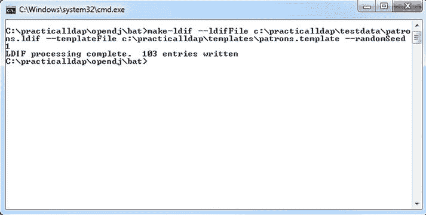

# 四、测试 LDAP 代码

在本章中，您将学习

*   单元/模拟/集成测试的基础。
*   使用嵌入式 LDAP 服务器进行测试。
*   使用 EasyMock 进行模拟测试。
*   生成测试数据。

测试 是任何软件开发过程的一个重要方面。除了检测错误之外，它还有助于验证所有需求是否得到满足，以及软件是否按预期工作。今天，正式或非正式地，测试几乎包含在软件开发过程的每个阶段。根据测试的内容和测试背后的目的，我们最终会有几种不同类型的测试。开发人员最常做的测试是单元测试，它确保单个单元按预期工作。集成测试通常在单元测试之后，并关注之前测试的组件之间的交互。开发人员通常参与创建自动化集成测试，尤其是处理数据库和目录的测试。接下来是系统测试，对完整的集成系统进行评估，以确保满足所有要求。非功能性需求，如性能和效率，也作为系统测试的一部分进行测试。验收测试通常在最后进行，以确保交付的软件满足客户/企业用户的需求。

单元测试

单元测试是一种测试方法，在这种方法中，应用的最小部分，称为单元，被独立地单独验证和确认。在结构化编程中，这个单元可以是一个单独的方法或函数。在面向对象编程(OOP) 中，对象是最小的可执行单元。对象之间的交互是任何面向对象设计的核心，通常通过调用方法来完成。因此，OOP 中的单元测试可以从测试单个方法到测试一组对象。

编写单元测试需要开发人员的时间和精力。但事实证明，这项投资带来了几个不可否认的好处。

注意衡量单元测试覆盖了多少代码是很重要的。像 Clover 和 Emma 这样的工具提供了代码覆盖率的度量。这些度量标准也可以用来突出任何由很少的单元测试(或者根本没有单元测试)执行的路径。

单元测试的最大优势是它可以帮助在开发的早期阶段识别错误。只有在 QA 或生产中发现的错误会消耗更多的调试时间和金钱。此外，一组好的单元测试就像一个安全网，当代码被重构时会给人信心。单元测试可以帮助改进设计，甚至可以作为文档。

好的单元测试具有以下特征:

*   每个单元测试必须独立于其他测试。这种原子性非常重要，每个测试都不能对其他测试产生任何副作用。单元测试也应该是顺序独立的。
*   单元测试必须是可重复的。对于一个有价值的单元测试来说，它必须产生一致的结果。否则，它不能在重构期间用作健全性检查。
*   单元测试必须易于设置和清理。所以他们不应该依赖外部系统，比如数据库和服务器。
*   单元测试必须快速并提供即时反馈。在做出另一个改变之前等待长时间运行的测试是没有意义的。
*   单元测试必须是自我验证的。每个测试应该包含足够的信息来自动确定测试是通过还是失败。不需要人工干预来解释结果。

企业应用通常使用外部系统，如数据库、目录和 web 服务。在道层更是如此。例如，单元测试数据库代码可能涉及启动数据库服务器、加载模式和数据、运行测试以及关闭服务器。这很快变得棘手和复杂。一种方法是使用模拟对象并隐藏外部依赖。在这还不够的地方，可能有必要使用集成测试，并在外部依赖完整无损的情况下测试代码。让我们更详细地看一下每个案例。

模拟测试

模拟测试的目标是使用模拟对象以可控的方式模拟真实对象。模拟对象实现了与真实对象相同的接口，但是被编写成模仿/伪造并跟踪它们的行为。

例如，考虑一个 UserAccountService ，它有一个创建新用户帐户的方法。这种服务的实现通常包括根据业务规则验证帐户信息，将新创建的帐户存储在数据库中，并发送确认电子邮件。持久化数据和电子邮件信息通常被抽象到其他层的类中。现在，当编写单元测试来验证与帐户创建相关的业务规则时，您可能并不真正关心电子邮件通知部分所涉及的复杂性。但是，您确实想验证是否生成了一封电子邮件。这正是模拟对象派上用场的地方。要实现这一点，您只需要为 UserAccountService 提供一个负责发送电子邮件的 EmailService 的模拟实现。模拟实现将简单地标记电子邮件请求，并返回硬编码的结果。模拟对象是将测试从复杂的依赖关系中分离出来的一种很好的方式，允许它们运行得更快。

有几个开源框架使得使用模拟对象更加容易。比较流行的有 Mockito，EasyMock，JMock。这些框架的完整对比列表可以在[`code . Google . com/p/jmockit/wiki/MockingToolkitComparisonMatrix`](http://code.google.com/p/jmockit/wiki/MockingToolkitComparisonMatrix)找到。

其中一些框架允许为没有实现任何接口的类创建模拟。不管使用什么框架，使用模拟对象的单元测试通常包括以下步骤:

*   创建一个新的模拟实例。
*   设置模拟。这包括指导模仿者期望什么和返回什么。
*   运行测试，将模拟实例传递给被测试的组件。
*   验证结果。

集成测试

尽管模仿对象是很好的占位符，但是很快你就会发现伪装是不够的。对于 DAO 层代码来说尤其如此，在那里您需要验证 SQL 查询的执行并验证对数据库记录的修改。测试这种代码属于集成测试的范畴。如前所述，集成测试侧重于测试组件之间的交互以及它们的依赖关系。

开发人员使用单元测试工具编写自动化集成测试已经变得很常见，从而模糊了两者之间的区别。然而，重要的是要记住，集成测试不会孤立地运行，通常会更慢。像 Spring 这样的框架为编写和执行集成测试提供了容器支持。嵌入式数据库、目录和服务器可用性的提高使开发人员能够编写更快的集成测试。

JUnit〔??〕

JUnit 已经成为 Java 应用单元测试的事实标准。JUnit 4.x 中注释的引入使得创建测试和断言预期值的测试结果变得更加容易。JUnit 可以很容易地与 ANT 和 Maven 等构建工具集成。它在所有流行的 ide 中都有很好的工具支持。

对于 JUnit，标准的做法是编写一个单独的类来保存测试方法。这个类通常被称为测试用例，每种测试方法都是为了测试一个工作单元。也可以将测试用例组织成称为测试套件的组。

学习 JUnit 的最好方法是编写一个测试方法。清单 4-1 展示了一个简单的 StringUtils 类和一个 isEmpty 方法。该方法将字符串作为参数，如果该字符串为 null 或空字符串，则返回 true。

***清单 4-1。***

```java
public class StringUtils {
   public static boolean isEmpty(String text) {
   return test == null || "".equals(test);
  }
}
```

清单 4-2 是带有测试代码方法的 JUnit 类。

***清单 4-2。***

```java
public class StringUtilsTest {
    @Test
    public void testIsEmpty() {
      Assert.assertTrue(StringUtils.isEmpty(null));
      Assert.assertTrue(StringUtils.isEmpty(""));
      Assert.assertFalse(StringUtils.isEmpty("Practical Spring Ldap"));
    }
}
```

注意，我遵循了惯例 <class under="" test="">Test 来命名测试类。在 JUnit 4.x 之前，测试方法需要以单词“test”开头。在 4.x 中，测试方法只需要用注释@Test 来标记。还要注意 testIsEmpty 方法包含几个用于测试 IsEmpty 方法逻辑的断言。</class>

表 4-1 列出了 JUnit 4 中一些重要的注释。

表 4-1 。JUnit 4 注解

| 注释 | 描述 |
| --- | --- |
| @测试 | 将方法注释为 JUnit 测试方法。该方法应该是公共范围的，并且具有 void 返回类型。 |
| @以前 | 将方法标记为在每个测试方法之前运行。对于设置测试夹具很有用。超类的@Before 方法在当前类之前运行。 |
| @之后 | 将方法标记为在每个测试方法之后运行。用于拆除测试夹具。超类的@After 方法在当前类之前运行。 |
| @忽略 | 标记测试运行期间要忽略的方法。这有助于避免评论半成品测试方法的需要。 |
| @BeforeClass | 在任何测试方法运行之前注释要运行的方法。对于测试用例，该方法只运行一次，可用于提供类级别的设置工作。 |
| @课后 | 注释一个在所有测试方法运行后运行的方法。这对于在类级别执行任何清理非常有用。 |
| @RunWith | 指定用于运行 JUnit 测试用例的类。 |

使用嵌入式 LDAP 服务器进行测试

ApacheDS、OpenDJ 和 UnboundID 是可以嵌入到 Java 应用中的开源 LDAP 目录。嵌入式目录是应用的 JVM 的一部分，使得启动和关闭等任务的自动化变得容易。它们启动时间短，通常运行速度快。嵌入式目录还消除了对每个开发人员或构建机器的专用、独立 LDAP 服务器的需求。

 **注**注这里讨论的概念是 LdapUnit 开源项目的基础。在以后的章节中，您将使用 LdapUnit 来测试代码。请访问[`ldapunit.org`](http://ldapunit.org)下载项目工件并浏览完整的源代码。

嵌入 LDAP 服务器包括以编程方式创建服务器并启动/停止它。然而，尽管 ApacheDS 或 OpenDJ 已经很成熟，但是以编程方式与它们进行交互还是很麻烦。在下一节中，您将看到配置和使用 ApacheDS LDAP 服务器所必需的设置。

设置嵌入式 ApacheDS

ApacheDS 的核心是存储数据和支持搜索操作的目录服务。因此，启动 ApacheDS LDAP 服务器首先要创建和配置一个目录服务。清单 4-3 显示了与创建目录服务相关的代码。请注意，您只是在使用 DefaultDirectoryServiceFactory 并对其进行初始化。

***清单 4-3。***

```java
DirectoryServiceFactory dsf = DefaultDirectoryServiceFactory.DEFAULT;
dsf.init( "default" + UUID.randomUUID().toString() );
directoryService = dsf.getDirectoryService();
```

ApacheDS 使用分区来存储 LDAP 条目。(一个分区可以被看作是一个保存整个 DIT 的逻辑容器)。一个 ApacheDS 实例可能有多个分区。与每个分区相关联的是一个根识别名(DN) ,称为分区后缀。该分区中的所有条目都存储在该根 DN 下。清单 4-4 中的代码创建了一个分区，并将其添加到清单 4-3 中的目录服务中。

***清单 4-4。***

```java
PartitionFactory partitionFactory =
     DefaultDirectoryServiceFactory.DEFAULT.getPartitionFactory();
/* Create Partition takes id, suffix, cache size, working directory*/
Partition partition = partitionFactory.createPartition("dc=inflinx,dc=com", "dc=inflinx,dc=com", 1000, new File(
                directoryService.getWorkingDirectory(),rootDn));
partition.setSchemaManager(directoryService.getSchemaManager());

// Inject the partition into the DirectoryService
directoryService.addPartition( partition );
```

您可以使用分区工厂来创建分区。为了创建新分区，您必须提供以下信息:唯一标识分区的名称、分区后缀或 rootDn、高速缓存大小和工作目录。在清单 4-4 中，您也使用了 rootDn 作为分区名。

创建并配置了目录服务后，下一步是创建 LDAP 服务器。清单 4-5 显示了与之相关的代码。向新创建的 LDAP 服务器提供一个名称。然后创建一个 TcpTransport 对象，它将监听端口 12389。TcpTransport 实例允许客户端与 LDAP 服务器通信。

***清单 4-5。***

```java
// Create the LDAP server
LdapServer ldapServer = new LdapServer();
ldapServer.setServiceName("Embedded LDAP service");
TcpTransport ldapTransport = new TcpTransport(12389); ldapServer.setTransports(ldapTransport);
ldapServer.setDirectoryService( directoryService );
```

最后一步是启动服务，,这是通过以下代码实现的:

```java
directoryService.startup();
ldapServer.start();
```

这就完成了启动方法的实现。关闭方法的实现在清单 4-6 中描述。

***清单 4-6。***

```java
public void stopServer() {
   try {
      System.out.println("Shutting down LDAP Server ....");
      ldapServer.stop();
      directoryService.shutdown();
      FileUtils.deleteDirectory( directoryService.getWorkingDirectory() );
      System.out.println("LDAP Server shutdown" + " successful ....");
   }
   catch(Exception e) {
      throw new RuntimeException(e);
   }
}
```

除了调用 stop/shutdown 方法之外，请注意您已经删除了 DirectoryService 的工作目录。嵌入式 ApacheDS 实现的完整代码如清单 4-7 所示。

***清单 4-7。***

```java
package org.ldapunit.server;

import java.io.File;
import java.util.UUID;
import org.apache.commons.io.FileUtils;
import org.apache.directory.server.core.DirectoryService;
import org.apache.directory.server.core.factory.DefaultDirectoryServiceFactory;
import org.apache.directory.server.core.factory. DirectoryServiceFactory;
import org.apache.directory.server.core.factory.PartitionFactory;
import org.apache.directory.server.core.partition.Partition;
import org.apache.directory.server.ldap.LdapServer;
import org.apache.directory.server.protocol.shared. transport.TcpTransport;

public class ApacheDSConfigurer implements EmbeddedServerConfigurer {

   private DirectoryService directoryService;
   private LdapServer ldapServer;
   private String rootDn;
   private int port;

   public ApacheDSConfigurer(String rootDn, int port) {
      this.rootDn = rootDn;
      this.port = port;
   }

   public void startServer() {
      try {
         System.out.println("Starting Embedded " + 
         "ApacheDS LDAP Server ....");
         DirectoryServiceFactory dsf = DefaultDirectoryServiceFactory.
         DEFAULT;
         dsf.init( "default" + UUID.randomUUID().toString());
         directoryService = dsf.getDirectoryService();

         PartitionFactory partitionFactory = DefaultDirectoryServiceFactory.
         DEFAULT.getPartitionFactory();

         /* Create Partition takes id, suffix, cache size, working 
         directory*/
         Partition partition = partitionFactory.
         createPartition(rootDn,rootDn, 1000, new File(directoryService.
         getWorkingDirectory(), rootDn));
         partition.setSchemaManager(directoryService.getSchemaManager());

         // Inject the partition into the DirectoryService
         directoryService.addPartition( partition );

         // Create the LDAP server ldapServer = new LdapServer();
         ldapServer.setServiceName("Embedded LDAP service");
         TcpTransport ldapTransport = new TcpTransport(port);
         ldapServer.setTransports(ldapTransport);

         ldapServer.setDirectoryService( directoryService );
         directoryService.startup();
         ldapServer.start();

         System.out.println("Embedded ApacheDS LDAP server" + "has started 
         successfully ....");
      }
      catch(Exception e) {
         throw new RuntimeException(e);
      }
   }

   public void stopServer() {
      try {
         System.out.println("Shutting down Embedded " + "ApacheDS LDAP 
         Server ....");
         ldapServer.stop();
         directoryService.shutdown();
         FileUtils.deleteDirectory( directoryService.getWorkingDirectory() );

         System.out.println("Embedded ApacheDS LDAP " + "Server shutdown 
         successful ....");
      }
      catch(Exception e) {
         throw new RuntimeException(e);
      }
    }
}
```

创建嵌入式上下文工厂

有了上面的代码，下一步是自动启动服务器并创建可以用来与嵌入式服务器交互的上下文。在 Spring 中，可以通过实现创建 ContextSource 新实例的自定义 FactoryBean 来实现这一点。在清单 4-8 中，您开始创建上下文工厂。

***清单 4-8。***

```java
package com.practicalspring.ldap.test;

import org.springframework.beans.factory.config. AbstractFactoryBean;
import org.springframework.ldap.core.ContextSource;
import org.springframework.ldap.core.support.DefaultDirObjectFactory;
import org.ldapunit.server.ApacheDSConfigurer;
import org.apache.directory.server.ldap.LdapServer;

public class EmbeddedContextSourceFactory extends 
AbstractFactoryBean<ContextSource> {

   private int port;
   private String rootDn;
   private ApacheDSConfigurer apacheDsConfigurer;

   @Override
   public Class<?> getObjectType() {
      return ContextSource.class;
   }

   @Override
   protected ContextSource createInstance() throws Exception {

      // To be implemented later.
      return null;
   }
   public void setRootDn(String rootDn) {
      this.rootDn = rootDn;
   }
   public void setPort(int port) {
      this.port = port;
   }
}
```

请注意，EmbeddedContextSourceFactory bean 使用了两个 setter 方法:setPort 和 setRootDn。setPort 方法可用于设置嵌入式服务器运行的端口。setRootDn 方法可用于提供根上下文的名称。清单 4-9 展示了 createInstance 方法的实现，它创建了 ApacheDSConfigurer 的一个新实例并启动了服务器。然后，它创建一个新的 LdapContenxtSource，并用嵌入的 LDAP 服务器信息填充它。

***清单 4-9。***

```java
apacheDsConfigurer = new ApacheDSConfigurer(rootDn, port);
apacheDsConfigurer.startServer();

LdapContextSource targetContextSource = new LdapContextSource();
targetContextSource.setUrl("ldap://localhost:" + port);
targetContextSource.setUserDn(ADMIN_DN);
targetContextSource.setPassword(ADMIN_PWD);
targetContextSource.setDirObjectFactory(DefaultDirObjectFactory.class);
targetContextSource.afterPropertiesSet();

return targetContextSource;
```

destroyInstance 的实现在清单 4-10 中提供。它只需要清理创建的上下文并停止嵌入式服务器。

***清单 4-10。***

```java
@Override
protected void destroyInstance(ContextSource instance) throws Exception {
     super.destroyInstance(instance);
     apacheDsConfigurer.stopServer();
}
```

最后一步是创建一个使用新上下文工厂的 Spring 上下文文件。这显示在清单 4-11 中。注意，嵌入的上下文源被注入到 ldapTemplate 中。

***清单 4-11。***

```java
<?xml version="1.0" encoding="UTF-8"?>

<beans FontName3">http://www.springframework.org/schema/beans"
   xmlns:xsi="http://www.w3.org/2001/XMLSchema-instance"
   xmlns:context="http://www.springframework.org/schema/context"
   xsi:schemaLocation="http://www.springframework.org/schema/beans
   http://www.springframework.org/schema/beans/spring-beans.xsd
   http://www.springframework.org/schema/context
   http://www.springframework.org/schema/context/spring-context.xsd">

   <bean id="contextSource" class="com.inflinx.ldap.test.
   EmbeddedContextSourceFactory">
      <property name="port" value="12389" />
      <property name="rootDn" value="dc=inflinx,dc=com" />
   </bean>

   <bean id="ldapTemplate" class="org.springframework.ldap.core.
   LdapTemplate">
      <constructor-arg ref="contextSource" />
   </bean>
</beans>
```

现在您已经拥有了编写 JUnit 测试用例所需的整个基础设施。清单 4-12 显示了一个简单的 JUnit 测试用例。这个测试用例有一个在每个测试方法之前运行的设置方法。在 setup 方法中，您加载数据，以便 LDAP 服务器处于已知状态。在清单 4-12 中，您正在从 employees.ldif 文件中加载数据。teardown 方法在每个测试方法运行后运行。在 teardown 方法中，您将删除 LDAP 服务器中的所有条目。这将允许您开始新的测试。这三种测试方法非常简单，只是在控制台上打印信息。

***清单 4-12。***

```java
package com.inflinx.book.ldap.test;

import java.util.List;

import org.junit.After;
import org.junit.Before;
import org.junit.Test;
import org.junit.runner.RunWith;

import org.springframework.beans.factory.annotation.Autowired;
import org.springframework.core.io.ClassPathResource;
import org.springframework.ldap.core.ContextMapper;
import org.springframework.ldap.core.ContextSource;
import org.springframework.ldap.core.DirContextAdapter;
import org.springframework.ldap.core.DistinguishedName;
import org.springframework.ldap.core.LdapTemplate;
import org.springframework.test.context.ContextConfiguration;
import org.springframework.test.context.junit4.SpringJUnit4ClassRunner;

@RunWith(SpringJUnit4ClassRunner.class )
@ContextConfiguration(locations= {"classpath:repositoryContext-test.xml"})
public class TestRepository {

   @Autowired
   ContextSource contextSource;

   @Autowired
   LdapTemplate ldapTemplate;

   @Before
   public void setup() throws Exception {
      System.out.println("Inside the setup");
      LdapUnitUtils.loadData(contextSource, new ClassPathResource
      ("employees.ldif"));
   }

   @After
   public void teardown() throws Exception {
      System.out.println("Inside the teardown");
      LdapUnitUtils.clearSubContexts(contextSource, new DistinguishedName
      ("dc=inflinx,dc=com"));
   }

   @Test
   public void testMethod() {
      System.out.println(getCount(ldapTemplate));
   }

   @Test
   public void testMethod2() {
      ldapTemplate.unbind(new DistinguishedName("uid=employee0,ou=employees,
      dc=inflinx,dc=com"));
      System.out.println(getCount(ldapTemplate));
   }

   @Test
   public void testMethod3() {
      System.out.println(getCount(ldapTemplate));
   }

   private int getCount(LdapTemplate ldapTemplate) {
      List results = ldapTemplate.search("dc=inflinx,dc=com",
      "(objectClass=inetOrgPerson)", new ContextMapper() {
          @Override
          public Object mapFromContext(Object ctx) {
              return ((DirContextAdapter)ctx).getDn();
          }
      });
      return results.size();
   }
}
```

使用 EasyMock 模仿 LDAP】

在上一节中，您了解了如何使用嵌入式 LDAP 服务器测试 LDAP 代码。现在让我们看看使用 EasyMock 框架测试 LDAP 代码。

EasyMock 是一个开源库，它使得创建和使用模拟对象变得容易。从 3.0 版本开始，EasyMock 本机支持模仿接口和具体类。EasyMock 的最新版本可以从 http://easymock.org/Downloads.html 下载。为了模仿具体的类，需要两个额外的库，即 CGLIB 和 Objenesis。 Maven 用户只需在他们的 pom.xml 中添加以下依赖项，就可以获得所需的 jar 文件:

```java
<dependency>
       <groupId>org.easymock</groupId>
       <artifactId>easymock</artifactId>
       <version>3.2</version>
       <scope>test</scope>
</dependency>
```

使用 EasyMock 创建一个 mock 需要调用 EasyMock 类上的 createMock 方法。以下示例为 LdapTemplate 创建一个模拟对象:

```java
LdapTemplate ldapTemplate = EasyMock.createMock(LdapTemplate. class);
```

每个新创建的模拟对象都以记录模式启动。在这种模式下，您记录了模拟的预期行为或期望。例如，您可以告诉 mock，如果这个方法被调用，就返回这个值。例如，以下代码向 LdapTemplate 模拟添加了一个新的期望:

```java
EasyMock.expect(ldapTemplate.bind(isA(DirContextOperations. class)));
```

在这段代码中，您将指示 mock 调用一个 bind 方法,并将 DirContextOperations 的一个实例作为它的参数传入。

一旦记录了所有的期望，mock 需要能够重放这些期望。这是通过调用 EasyMock 上的 replay 方法并传入需要作为参数重放的模拟对象来完成的。

```java
EasyMock.replay(ldapTemplate);
```

现在可以在测试用例中使用模拟对象了。一旦被测试的代码完成了它的执行，您就可以验证是否满足了 mock 上的所有期望。这是通过调用 EasyMock 上的验证方法来完成的。

```java
EasyMock.verify(ldapTemplate);
```

模拟对于验证搜索方法中使用的上下文行映射器特别有用。正如您之前看到的，行映射器实现将 LDAP 上下文/条目转换成 Java 域对象。下面是执行转换的 ContextMapper 接口中的方法签名:

```java
public Object mapFromContext(Object ctx)
```

此方法中的 ctx 参数通常是 DirContextOperations 实现的一个实例。因此，为了对 ContextMapper 实现进行单元测试，您需要向 mapFromContext 方法传递一个模拟 DirContextOperations 实例。mock DirContextOperations 应返回虚拟但有效的数据，以便 ContextMapper 实现可以从中创建域对象。清单 4-13 显示了模拟和填充 DirContextOperations 实例的代码。mockContextOperations 遍历传入的伪属性数据，并添加对单值和多值属性的期望。

***清单 4-13。***

```java
public static DirContextOperations mockContextOperations(Map<String, Object> 
attributes) {

   DirContextOperations contextOperations = createMock(DirContextOperations.
   class);
      for(Entry<String, Object> entry : attributes.entrySet()){
         if(entry.getValue() instanceof String){
            expect(contextOperations.getStringAttribute(eq(entry.
            getKey()))).andReturn((String)entry.getValue());
            expectLastCall().anyTimes();
         }
         else if(entry.getValue() instanceof String[]){
            expect(contextOperations.
            getStringAttributes(eq(entry.getKey()))).andReturn((String[])
            entry.getValue());
            expectLastCall().anyTimes();
         }
      }
   return contextOperations;
}
```

有了这些代码后，清单 4-14 显示了使用 mockContextOperations 方法模拟测试上下文行映射器的代码。

***清单 4-14*** 。

```java
public class ContextMapperExample {

   @Test
   public void testConextMapper() {
      Map<String, Object> attributes = new HashMap<String, Object>();
      attributes.put("uid", "employee1");
      attributes.put("givenName", "John"); attributes.put("surname", "Doe");
      attributes.put("telephoneNumber", new String[]
      {"8011001000","8011001001"});

      DirContextOperations contextOperations = LdapMockUtils.mockContextOperations(attributes);
      replay(contextOperations);

     //Now we can use the context operations to test a mapper
     EmployeeContextMapper mapper = new EmployeeContextMapper();
     Employee employee = (Employee)mapper.mapFromContext(contextOperations);
     verify(contextOperations);

     // test the employee object
     assertEquals(employee.getUid(), "employee1");
     assertEquals(employee.getFirstName(), "John");
   }
}
```

测试数据生成

出于测试目的，您通常需要生成初始测试数据。OpenDJ 提供了一个很棒的命令行实用程序 make- ldif，它使生成测试 LDAP 数据变得轻而易举。关于安装 OpenDJ 的说明，请参考第三章。Windows 操作系统的命令行工具位于 OpenDJ 安装下的 bat 文件夹中。

make-ldif 工具需要一个模板来创建测试数据。您将使用清单 4-15 中所示的 patron.template 文件来生成 patron 条目。

***清单 4-15*** 。

```java
define suffix=dc=inflinx,dc=com
define maildomain=inflinx.com
define numusers=101

branch: [suffix]

branch: ou=patrons,[suffix]
subordinateTemplate: person:[numusers]

template: person
rdnAttr: uid
objectClass: top
objectClass: person
objectClass: organizationalPerson
objectClass: inetOrgPerson
givenName: <first>
sn: <last>
cn: {givenName} {sn}
initials: {givenName:1}<random:chars:ABCDEFGHIJKLMNOPQRSTUVWXYZ:1>{sn:1}
employeeNumber: <sequential:0>
uid: patron<sequential:0>
mail: {uid}@[maildomain]
userPassword: password
telephoneNumber: <random:telephone>
homePhone: <random:telephone>
mobile: <random:telephone>
street: <random:numeric:5> <file:streets> Street
l: <file:cities>
st: <file:states>
postalCode: <random:numeric:5>
postalAddress: {cn}${street}${l}, {st} {postalCode}
```

这是对安装时附带的 example.template 文件的简单修改。example.template 位于 <opendj_install>\config\MakeLDIF 文件夹中。uid 已修改为使用前缀“patron”而不是“user”。此外，numUsers 值已更改为 101。这表示您希望脚本生成的测试用户的数量。要生成测试数据，请在命令行中运行以下命令:</opendj_install>

```java
C:\ practicalldap\opendj\bat>make-ldif --ldifFile 
c:\ practicalldap\testdata\patrons.ldif --templateFile 
c:\ practicalldap\templates\patron.template --randomSeed 1
```

*   - ldifFile 选项用于指定目标文件的位置。在这里，您将它存储在 testdata 目录中的 customers . ldif 下
*   - templateFile 用于指定要使用的模板文件。
*   - randomSeed 是一个整数，需要用来为数据生成过程中使用的随机数生成器提供种子。

创建成功后，您将看到类似于图 4-1 的屏幕。除了 101 个测试条目之外，该脚本还创建了两个额外的基本条目。



图 4-1 。让 LDIF 指挥结果

摘要

在本章中，您深入研究了测试 LDAP 代码。您从测试概念的概述开始。然后，您花时间为嵌入式测试设置 ApacheDS。尽管嵌入式测试简化了事情，但有时您希望测试代码，从而最大限度地减少对外部基础设施的依赖。您可以使用模拟测试来解决这些情况。最后，您使用了 OpenDJ 工具来生成测试数据。

在下一章中，您将看到如何使用对象工厂创建与 LDAP 交互的数据访问对象(Dao)。