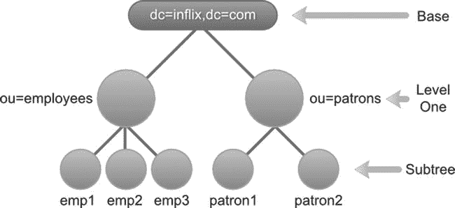
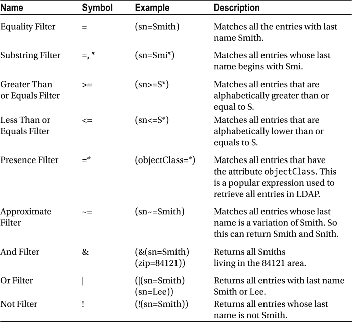
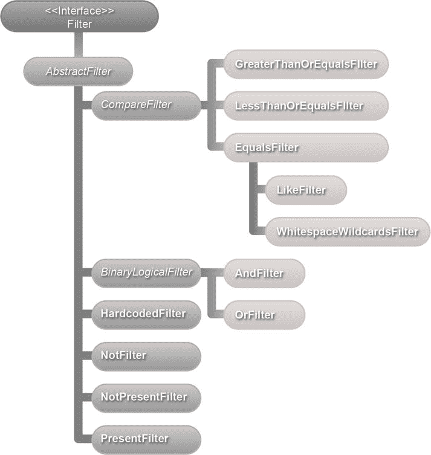

# 六、搜索 LDAP

在本章中，您将学习

*   LDAP 搜索的基础
*   使用过滤器的 LDAP 搜索
*   创建自定义搜索过滤器

搜索信息是对 LDAP 执行的最常见的操作。客户端应用通过传递搜索标准来启动 LDAP 搜索，搜索标准是决定在哪里搜索和搜索什么的信息。收到请求后，LDAP 服务器执行搜索并返回所有符合条件的条目。

LDAP 搜索标准

LDAP 搜索标准由三个强制参数(基本、范围和过滤器)和几个可选参数组成。让我们详细看看这些参数。

基本参数

搜索的基本部分是标识将被搜索的树的分支的可分辨名称(DN)。例如，基数“ou =顾客，dc=inflinx，dc=com”表示搜索将从顾客分支开始并向下移动。也可以指定一个空的基，这将导致搜索根 DSE 条目。

 **注意**根 DSE 或 DSA 特定条目是 LDAP 服务器中的一个特殊条目。它通常保存特定于服务器的数据，如供应商名称、供应商版本以及它支持的不同控件和功能。

范围参数

scope 参数确定需要执行的 LDAP 搜索相对于基准的深度。LDAP 协议定义了三种可能的搜索范围:基本、一级和子树。图 6-1 显示了在不同搜索范围内被评估的条目。



图 6-1 。搜索范围

*   基本范围将搜索限制到由基本参数标识的 LDAP 条目。搜索中不会包含其他条目。在您的库应用模式中，使用基本 DN dc=inflinx，dc=com 和基本范围，搜索将只返回根组织条目，如图 6-1 所示。

一级范围表示搜索直接在基础下一级的所有条目。搜索中不包括基本条目本身。因此，使用 base dc=inflinx，dc=com 和 scope one 级别，搜索所有条目将返回雇员和顾客组织单位。

最后，子树范围包括搜索中的基本条目及其所有后代条目。这是三个选项中最慢、最贵的一个。在您的库示例中，使用这个范围和 base dc=inflinx，dc=com 进行搜索将返回所有条目。

过滤参数

在您的图书馆应用 LDAP 服务器中，假设您想要查找住在 Midvale 地区的所有顾客。从 LDAP 模式中，您知道 patron 条目具有 city 属性，该属性保存他们居住的城市名称。所以这个需求本质上可以归结为检索所有具有值为“Midvale”的 city 属性的条目。这正是搜索过滤器的作用。搜索过滤器定义了所有返回条目拥有的特征。从逻辑上讲，过滤器应用于由 base 和 scope 标识的集合中的每个条目。只有与过滤器匹配的条目才成为返回的搜索结果的一部分。

LDAP 搜索过滤器由三部分组成:属性类型、操作符和属性值(或值的范围)。根据运算符的不同，值部分可以是可选的。这些组件必须始终用括号括起来，就像这样:

```java
Filter =  (attributetype  operator value)
```

有了这些信息，查找住在 Midvale 的所有顾客的搜索过滤器应该是这样的:

```java
(city=Midvale)
```

现在，假设你想找到所有住在 Midvale 地区*和*的顾客，他们都有一个电子邮件地址，这样你就可以给他们发送一些图书馆活动的新闻。结果搜索过滤器实际上是两个过滤器项目的组合:一个项目标识 Midvale 市的顾客，另一个项目标识有电子邮件地址的顾客。您已经看到了过滤器的第一项。这是过滤器的另一部分:

```java
(mail=*)
```

=*运算符指示属性的存在。因此，表达式 mail=*将返回所有在邮件属性中有值的条目。LDAP 规范定义了可用于组合多个过滤器和创建复杂过滤器的过滤器操作符。以下是组合过滤器的格式:

```java
Filter =  (operator filter1 filter2)
```

注意前缀符号的使用，其中运算符写在操作数之前，用于组合两个过滤器。以下是您的用例所需的过滤器:

```java
(&(city=Midvale)(mail=*))
```

这个过滤器中的&是一个*和*操作符。LDAP 规范定义了各种搜索过滤器操作符。表 6-1 列出了一些常用的运算符。

表 6-1 。搜索过滤运算符



可选参数

除了上述三个参数之外，还可以包括几个可选参数来控制搜索行为。例如，timelimit 参数指示允许完成搜索的时间。类似地，sizelimit 参数对可以作为结果的一部分返回的条目数量设置了上限。

一个非常常用的可选参数包括提供属性名列表。执行搜索时，缺省情况下，LDAP 服务器会返回与搜索中找到的条目相关联的所有属性。有时这可能并不理想。在这些场景中，您可以提供一个属性名称列表作为搜索的一部分，LDAP 服务器将只返回具有这些属性的条目。下面是 LdapTemplate 中的一个搜索方法示例，它采用一个属性名称数组(ATTR_1、ATTR_2 和 ATTR_3):

```java
ldapTemplate.search("SEARCH_BASE", "uid=USER_DN", 1, new String[]{"ATTR_1", "ATTR_2", ATTR_3}, new SomeContextMapperImpl());
```

执行此搜索时，返回的条目将只有 ATTR_1、ATTR_2 和 ATTR_3。这可以减少从服务器传输的数据量，在高流量情况下非常有用。

从版本 3 开始，LDAP 服务器可以维护每个条目的属性，这完全是出于管理目的。这些属性被称为操作属性，不是条目对象类的一部分。执行 LDAP 搜索时，默认情况下返回的条目将不包含操作属性。为了检索操作属性，您需要在搜索条件中提供操作属性名称列表。

 **注意**操作属性的例子包括 createTimeStamp 和 pwdAccountLockedTime，前者保存条目创建的时间，后者记录用户帐户被锁定的时间。

LDAP 注入

LDAP 注入是一种技术，攻击者通过改变 LDAP 查询来对目录服务器运行任意 LDAP 语句。LDAP 注入可能导致未经授权的数据访问或对 LDAP 树的修改。不执行正确的输入验证或清理输入的应用容易受到 LDAP 注入。这种技术类似于流行的针对数据库的 SQL 注入攻击。

为了更好地理解 LDAP 注入，考虑一个使用 LDAP 进行身份验证的 web 应用。这种应用通常提供一个网页，让用户输入自己的用户名和密码。为了验证用户名和密码是否匹配，应用将构建一个 LDAP 搜索查询，大致如下所示:

(&(uid =用户输入 UID)(密码=用户输入 PWD))

让我们假设应用简单地信任用户输入，并且不执行任何验证。现在，如果您输入文本 jdoe)(&)(作为用户名，并输入任意随机文本作为密码，则搜索查询过滤器将如下所示:

(&(uid=jdoe)(&)(密码=随机)

如果用户名 jdoe 是 LDAP 中的一个有效用户 id，那么不管输入的密码是什么，该查询将始终计算为 true。这种 LDAP 注入将允许攻击者绕过身份验证进入应用。www . black hat . com/presentations/BH-Europe-08/alon so-Parada/white paper/BH-eu-08-alon so-Parada-WP . pdf 上的“LDAP 注入和盲 LDAP 注入”文章详细讨论了各种 LDAP 注入技术。

一般来说，防止 LDAP 注入和任何其他注入技术都是从正确的输入验证开始的。在搜索过滤器中使用输入的数据之前，对其进行净化和正确编码是非常重要的。

Spring LDAP 过滤器

在上一节中，您了解了 LDAP 搜索过滤器对于缩小搜索范围和识别条目非常重要。然而，动态创建 LDAP 过滤器可能会很繁琐，尤其是在尝试组合多个过滤器时。确保所有的大括号都正确闭合是容易出错的。适当转义特殊字符也很重要。

Spring LDAP 提供了几个过滤器类，使得创建和编码 LDAP 过滤器变得容易。所有这些过滤器都实现了过滤器接口，并且是 org . spring framework . LDAP . Filter 包的一部分。清单 6-1 显示了过滤器 API 接口。

***清单 6-1。***

```java
package org.springframework.ldap.filter;

public interface Filter {
   String encode();
   StringBuffer encode(StringBuffer buf);
   boolean equals(Object o);
   int hashCode();
}
```

该接口中的第一个编码方法返回过滤器的字符串表示。第二个 encode 方法接受 StringBuffer 作为其参数，并将过滤器的编码版本作为 StringBuffer 返回。对于常规的开发过程，您使用返回 String 的 encode 方法的第一个版本。

过滤界面层次如图图 6-2 所示。从层次结构中，您可以看到 AbstractFilter 实现了过滤器接口，并作为所有其他过滤器实现的根类。BinaryLogicalFilter 是二进制逻辑运算(如 AND 和 or)的抽象超类。CompareFilter 是过滤器的抽象超类，用于比较 EqualsFilter 和 LessThanOrEqualsFilter 等值。



图 6-2 。过滤器层次结构

 **注意**默认情况下，大多数 LDAP 属性值在搜索时不区分大小写。

在接下来的章节中，你将会看到图 6-2 中的每一个过滤器。在此之前，让我们创建一个可重用的方法来帮助您测试您的过滤器。清单 6-2 显示了 searchAndPrintResults 方法，它使用传入的过滤器实现参数并使用它执行搜索。然后，它将搜索结果输出到控制台。注意，您将搜索 LDAP 树的 Patron 分支。

***清单 6-2。***

```java
import java.util.List;
import org.springframework.beans.factory.annotation.Autowired;
import org.springframework.beans.factory.annotation.Qualifier;
import org.springframework.ldap.core.DirContextOperations;
import org.springframework.ldap.core.simple.AbstractParameterizedContextMapper;
import org.springframework.ldap.core.simple.SimpleLdapTemplate;
import org.springframework.ldap.filter.Filter;
import org.springframework.stereotype.Component;

@Component("searchFilterDemo" )
public class SearchFilterDemo {

   @Autowired
   @Qualifier("ldapTemplate" )
   private SimpleLdapTemplate ldapTemplate;

   public void searchAndPrintResults(Filter filter) {
      List<String> results = ldapTemplate.search("ou=patrons,dc=inflinx,dc=com", filter.encode(),
             new AbstractParameterizedContextMapper<String>() {
            @Override
            protected String doMapFromContext(DirContextOperations context) {
              return context.getStringAttribute("cn");
            }
          });

       System.out.println("Results found in search: " + results.size());
         for(String commonName: results) {
            System.out.println(commonName);
         }
       }
   }
}
```

等于过滤器

EqualsFilter 可用于检索具有指定属性和值的所有条目。假设您想要检索名字为 Jacob 的所有顾客。为此，您需要创建一个新的 EqualsFilter 实例。

```java
EqualsFilter filter =  new  EqualsFilter("givenName", "Jacob");
```

构造函数的第一个参数是属性名，第二个参数是属性值。对此过滤器调用 encode 方法会产生字符串(givenName=Jacob)。

清单 6-3 显示了调用 searchAndPrintResults 的测试用例，上面的 EqualsFilter 作为参数。该方法的控制台输出也显示在清单中。注意，结果中有名字为 jacob 的顾客(注意小写的 j)。这是因为 sn 属性和大多数 LDAP 属性一样，在模式中被定义为不区分大小写。

***清单 6-3。***

```java
@Test
public void testEqualsFilter() {
   Filter filter = new EqualsFilter("givenName", "Jacob");
   searchFilterDemo.searchAndPrintResults(filter);
}

Results  found in  search:  2
Jacob  Smith
jacob  Brady
```

lieffilter〔??〕

当只知道属性的一部分值时，LikeFilter 对于搜索 LDAP 很有用。LDAP 规范允许使用通配符*来描述这些部分值。假设您想要检索名字以“Ja”开头的所有用户为此，创建 LikeFilter 的一个新实例，并将通配符子字符串作为属性值传入。

```java
LikeFilter  filter =  new  LikeFilter("givenName", "Ja*");
```

在这个过滤器上调用 encode 方法会产生字符串(givenName=Ja*)。清单 6-4 显示了使用 LikeFilter 调用 searchAndPrintResults 方法的测试用例及结果。

***清单 6-4。***

```java
@Test
public void testLikeFilter() {
   Filter filter = new LikeFilter("givenName", "Ja*");
   searchFilterDemo.searchAndPrintResults(filter);
}

Results  found in  search:  3
Jacob Smith
Jason Brown
jacob  Brady
```

子字符串中的通配符*用于匹配零个或多个字符。然而，了解 LDAP 搜索过滤器不支持正则表达式是非常重要的。表 6-2 列出了一些子串示例。

表 6-2 。LDAP 子字符串示例

| LDAP 子字符串 | 描述 |
| --- | --- |
| (givenName=*son) | 匹配所有名字以 son 结尾的顾客。 |
| （给定名称 = J *n） | 匹配名字以 J 开头以 n 结尾的所有顾客。 |
| (给定名称=*a*) | 匹配名字中包含字符 a 的所有顾客。 |
| (给定名称=J*s*n) | 匹配名字以 J 开头、包含字符 s 并以 n 结尾的顾客。 |

您可能想知道 LikeFilter 的必要性，因为您可以通过简单地使用 EqualsFilter 来完成相同的筛选表达式，如下所示:

```java
EqualsFilter filter =  new  EqualsFiler("uid", "Ja*");
```

在这种情况下使用 EqualsFilter 不起作用，因为 EqualsFilter 中的 encode 方法将 Ja*中的通配符*视为特殊字符，并正确地对其进行转义。因此，当用于搜索时，上面的过滤器将产生名字以 Ja*开头的所有条目。

演示过滤器

PresentFilters 对于检索在给定属性中至少有一个值的 LDAP 条目很有用。考虑前面的场景，您希望检索所有拥有电子邮件地址的顾客。为此，您需要创建一个 PresentFilter，如下所示:

```java
PresentFilter presentFilter =  new  PresentFilter("email");
```

在 presentFilter 实例上调用 encode 方法会产生字符串(email=*)。清单 6-5 显示了使用上面的 presentFilter 调用 searchAndPrintResults 方法时的测试代码和结果。

***清单 6-5。***

```java
@Test
public void testPresentFilter() {
   Filter filter = new PresentFilter("mail");
   searchFilterDemo.searchAndPrintResults(filter);
}
Results  found in  search:  97
Jacob  Smith
Aaren  Atp
Aarika  Atpco
Aaron Atrc
Aartjan  Aalders
Abagael  Aasen
Abagail  Abadines
.........
.........
```

notes present filter

NotPresentFilters 用于检索没有指定属性的条目。条目中没有任何值的属性被视为不存在。现在，假设您想要检索所有没有电子邮件地址的顾客。为此，创建 NotPresentFilter 的一个实例，如下所示:

```java
NotPresentFilter notPresentFilter  =  new NotPresentFilter("email");
```

notPresentFilter 的编码版本产生表达式！(邮箱=*)。运行 searchAndPrintResults 会产生如清单 6-6 所示的输出。第一个空值用于组织单位条目“ou = customers，dc=inflinx，dc=com”。

***清单 6-6。***

```java
@Test
public void testNotPresentFilter() {
   Filter filter = new NotPresentFilter("mail");
   searchFilterDemo.searchAndPrintResults(filter);
}

Results  found in  search:  5
null
Addons Achkar
Adeniyi Adamowicz
Adoree Aderhold
Adorne  Adey
```

不过滤

NotFilter 对于检索与给定条件不匹配的条目很有用。在“LikeFilter”一节中，您看到了检索所有以 Ja 开头的条目。现在假设您想要检索所有不以 Ja 开头的条目。这就是 NotFilter 发挥作用的地方。下面是实现这一要求的代码:

```java
NotFilter notFilter  =  new  NotFilter(new LikeFilter("givenName", "Ja*"));
```

对该过滤器进行编码会产生字符串！(givenName=Ja*)。如您所见，NotFilter 只是添加了否定符号(！)传递给传递给其构造函数的筛选器。调用 searchAndShowResults 方法会产生清单 6-7 中的输出。

***清单 6-7。***

```java
@Test
public void testNotFilter() {
   NotFilter notFilter = new NotFilter(new LikeFilter("givenName", "Ja*"));
   searchFilterDemo.searchAndPrintResults(notFilter);
}
Results  found in  search:  99
Aaren Atp  Aarika
Atpco Aaron Atrc
Aartjan  Aalders
Abagael  Aasen
Abagail  Abadines
.........................
```

也可以将 NotFilter 和 PresentFilter 组合起来创建与 NotPresentFilter 等效的表达式。下面是一个新的实现，它获取所有没有电子邮件地址的条目:

```java
NotFilter notFilter  =  new  NotFilter(new PresentFilter("email"));
```

greater than requialsfilter〔??〕

GreaterThanOrEqualsFilter 对于匹配所有在字典上等于或大于给定属性值的条目非常有用。例如，可以使用搜索表达式(给定名称> = Jacob)来检索除 Jacob 之外按字母顺序位于 Jacob 之后的给定名称的所有条目。清单 6-8 显示了这个实现以及输出结果。

***清单 6-8。***

```java
@Test
public void testGreaterThanOrEqualsFilter() {
   Filter filter = new GreaterThanOrEqualsFilter("givenName", "Jacob");
   searchFilterDemo.searchAndPrintResults(filter);
}

Results  found in  search:  3
Jacob Smith
jacob Brady
Jason Brown
```

lesthanorequalfilter〔??〕牌

LessThanOrEqualsFilter 可用于匹配在字典上等于或低于给定属性的条目。因此，搜索表达式(givenName <=Jacob) will return all entries with first name alphabetically lower or equal to Jacob. 清单 6-9 显示了调用该需求的 searchAndPrintResults 实现的测试代码以及输出。

***清单 6-9。***

```java
@Test
public void testLessThanOrEqualsFilter() {
   Filter filter = new LessThanOrEqualsFilter("givenName", "Jacob");
   searchFilterDemo.searchAndPrintResults(filter);
}

Results  found in  search:  100
Jacob  Smith
Aaren  Atp
Aarika  Atpco
Aaron Atrc
Aartjan  Aalders
Abagael  Aasen
Abagail  Abadines
Abahri Abazari
....................
```

如上所述，搜索包括名字为 James 的条目。LDAP 规范不提供小于(

```java
NotFilter lessThanFilter = new NotFilter(new GreaterThanOrEqualsFilter("givenName", "James"));
```

安过滤器〔??〕

AndFilter 用于组合多个搜索过滤器表达式，以创建复杂的搜索过滤器。结果过滤器将匹配满足所有子过滤器条件的条目。例如，AndFilter 适合于实现一个更早的要求，即获取所有居住在 Midvale 地区并有电子邮件地址的顾客。以下代码显示了这种实现:

```java
AndFilter andFilter  =  new  AndFilter();
andFilter.and(new EqualsFilter("postalCode",  "84047"));
andFilter.and(new PresentFilter("email"));
```

在这个过滤器上调用 encode 方法会产生(&(city=Midvale)(email=*))。清单 6-10 显示了创建 AndFilter 并调用 searchAndPrintResults 方法的测试用例。

***清单 6-10。***

```java
@Test
public void testAndFilter() {
   AndFilter andFilter = new AndFilter();
   andFilter.and(new EqualsFilter("postalCode", "84047"));
   andFilter.and(new PresentFilter("mail"));
   searchFilterDemo.searchAndPrintResults(andFilter);
}

Results  found in  search:  1
Jacob  Smith
```

orf filter〔??〕

和 AndFilter 一样，OrFilter 可以用来组合多个搜索筛选器。但是，结果过滤器将匹配满足任何子过滤器条件的条目。下面是 OrFilter 的一个实现:

```java
OrFilter orFilter  =  new  OrFilter();
orFilter.add(new EqualsFilter("postalcode",  "84047"));
orFilter.add(new EqualsFilter("postalcode",  "84121"));
```

这个 OrFilter 将检索所有居住在 84047 或 84121 邮政编码的顾客。encode 方法返回表达式(|(postal code = 84047)(postal code = 84121))。OrFilter 的测试用例如清单 6-11 所示。

***清单 6-11。***

```java
@Test
public void testOrFilter() {
   OrFilter orFilter = new OrFilter();
   orFilter.or(new EqualsFilter("postalCode", "84047"));
   orFilter.or(new EqualsFilter("postalCode", "84121"));
   searchFilterDemo.searchAndPrintResults(orFilter);
}

Results  found in  search:  2
Jacob  Smith
Adriane  Admin-mtv
```

硬编码过滤器

HardcodedFilter 是一个方便的类，它使得在构建搜索过滤器时添加静态过滤器文本变得容易。假设您正在编写一个允许管理员在文本框中输入搜索表达式的管理应用。如果要将此表达式与其他筛选器一起用于搜索，可以使用 HardcodedFilter，如下所示:

```java
AndFilter filter  =  new  AndFilter();
filter.add(new HardcodedFilter(searchExpression));
filter.add(new EqualsFilter("givenName", "smith"));
```

在这段代码中，searchExpression 变量包含用户输入的搜索表达式。当搜索过滤器的静态部分来自属性文件或配置文件时，HardcodedFilter 也非常方便。记住这个过滤器不对传入的文本进行编码是很重要的。所以请谨慎使用，尤其是直接处理用户输入的时候。

white space wild cardfilter

WhitespaceWildcardsFilter 是另一个方便的类，它使得创建子字符串搜索过滤器更加容易。像它的超类 EqualsFilter 一样，这个类接受一个属性名和值。然而，顾名思义，它将属性值中的所有空格都转换为通配符。考虑以下示例:

```java
WhitespaceWildcardsFilter filter = new WhitespaceWildcardsFilter("cn", "John Will");
```

该过滤器产生以下表达式:(cn=*John*Will*)。在开发搜索和查找应用时，此过滤器会很有用。

创建自定义过滤器

尽管 Spring LDAP 提供的过滤器类在大多数情况下已经足够了，但是可能会出现当前设置不够的情况。谢天谢地，Spring LDAP 使得创建新的过滤器类变得很容易。在本节中，您将看到如何创建一个定制的近似过滤器。

近似过滤器用于检索属性值大约等于指定值的条目。近似表达式使用∾=运算符创建。因此,( given name∞= Adeli)过滤器将匹配名字为 Adel 或 Adele 的条目。当用户在搜索时不知道值的实际拼写时，近似筛选器在搜索应用中非常有用。查找发音相似值的算法的实现因 LDAP 服务器实现的不同而不同。

Spring LDAP 不提供任何现成的类来创建近似过滤器。在清单 6-12 中，你创建了这个过滤器的一个实现。注意，ApproximateFilter 类扩展了 AbstractFilter。构造函数被定义为接受属性类型和属性值。在 encode 方法中，通过连接属性类型、运算符和值来构造过滤器表达式。

***清单 6-12。***

```java
import org.springframework.ldap.filter.AbstractFilter;

private class ApproximateFilter extends AbstractFilter {

   private static final String APPROXIMATE_SIGN = "∼=";
   private String attribute;
   private String value;

   public ApproximateFilter(String attribute, String value) {
      this.attribute = attribute;
      this.value = value;
   }

   @Override
   public StringBuffer encode(StringBuffer buff) {
      buff.append('(');
      buff.append(attribute).append(APPROXIMATE_SIGN).append(value);
      buff.append(')');

          return buff;
   }
}
```

清单 6-13 显示了使用 ApproximateFilter 类运行 searchAndPrintResults 方法的测试代码。

***清单 6-13。***

```java
@Test
public void testApproximateFilter() {
   ApproximateFilter approx = new ApproximateFilter("givenName", "Adeli");
   searchFilterDemo.searchAndPrintResults(approx);
}
```

下面是运行测试用例的输出:

```java
Results  found in  search:  6
Adel  Acker
Adela Acklin
Adele Acres
Adelia  Actionteam
Adella  Adamczyk
Adelle Adamkowski
```

处理特殊字符

有时候，您需要使用在 LDAP 中有特殊含义的字符(或 a *)来构建搜索过滤器。为了成功地执行这些过滤器，正确地对特殊字符进行转义是很重要的。转义使用格式\xx 完成，其中 xx 表示字符的十六进制表示。表 6-3 列出了所有特殊字符及其转义值。

表 6-3 。特殊字符和转义值

| 特殊字符 | 逸出值 |
| --- | --- |
| （ | \28 |
| ) | \29 |
| * | \2a |
| \ | \5c |
| / | \2f |

除了上述字符之外，如果在 DN 中使用了以下任何字符，也需要对它们进行适当的转义:逗号(，)、等号(=)、加号(+)、小于()、井号(#)和分号(；).

摘要

在本章中，您学习了如何使用搜索过滤器简化 LDAP 搜索。我以 LDAP 搜索概念的概述开始了这一章。然后，您查看了不同的搜索过滤器，您可以使用这些过滤器以各种方式检索数据。您还看到了 Spring LDAP 如何使创建定制搜索过滤器变得容易。

在下一章中，您将看到从 LDAP 服务器获得的结果的排序和分页。