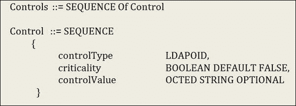
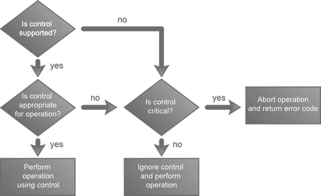
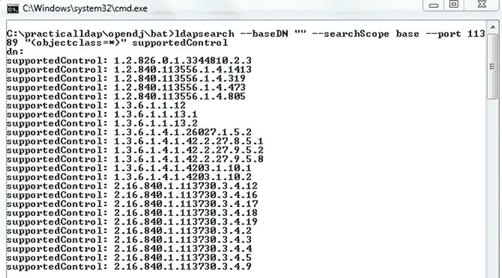
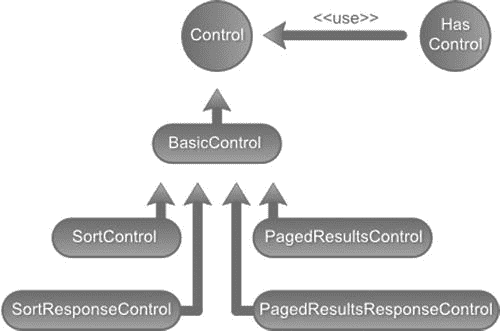
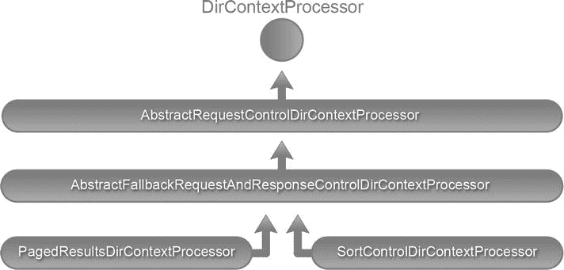
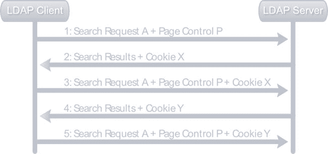

# 七、排序和分页结果

在本章中，您将学习

*   LDAP 控件的基础。
*   对 LDAP 结果进行排序。
*   分页 LDAP 结果。

LDAP 控件

LDAP 控制提供了一种标准化的方法来修改 LDAP 操作的行为。控件可以简单地看作是客户端发送给 LDAP 服务器的消息(反之亦然)。作为客户端请求的一部分发送的控件可以向服务器提供附加信息，指示应该如何解释和执行操作。例如，可以在 LDAP 删除操作中指定删除子树控件。收到删除请求后，LDAP 服务器的默认行为是删除条目。但是，当 delete subtree 控件附加到 delete 请求时，服务器会自动删除该条目及其所有从属条目。这种控制被称为请求控制 。

LDAP 服务器也可以将控制作为其响应消息的一部分发送，以指示操作是如何处理的。例如，LDAP 服务器可能会在绑定操作期间返回密码策略控制，指示客户端的密码已经过期或即将过期。由服务器发送的这种控制被称为响应控制 。可以随操作一起发送任意数量的请求或响应控制。

LDAP 控制，包括请求和响应，由以下三部分组成:

*   唯一标识控件的对象标识符(OID)。这些 oid 防止控件名称之间的冲突，通常由创建控件的供应商定义。这是控件的必需组件。
*   指明控制对于操作是关键还是非关键。这也是一个必需组件，可以是真或假。
*   特定于控件的可选信息。例如，用于分页搜索结果的分页控件需要页面大小来确定页面中要返回的条目数。

RFC 2251([www.ietf.org/rfc/rfc2251.txt](http://www.ietf.org/rfc/rfc2251.txt))中规定的 LDAP 控件的正式定义如图 7-1 中的[所示。然而，这个 LDAP 规范没有定义任何具体的控制。控制定义通常由 LDAP 供应商提供，它们的支持因服务器而异。](#Fig1)



[图 7-1](#_Fig1) 。LDAP 控制规范

当 LDAP 服务器在操作中接收控件时，其行为取决于控件及其相关信息。图 7-2 中的流程图显示了接收请求控制时的服务器行为。



[图 7-2](#_Fig2) 。LDAP 服务器控制交互

一些通常支持的 LDAP 控件及其 OID 和描述在[表 7-1](#Tab1) 中显示。

[表 7-1](#_Tab1) 。常用控件

| 控件名称 | 似…的 | 说明(RFC) |
| --- | --- | --- |
| 分类控制 | 1.2.840.113556.1.4.473 | 请求服务器在将搜索结果发送给客户端之前对它们进行排序。这是 RFC 2891 的一部分。 |
| 分页结果控制 | 1.2.840.113556.1.4.319 | 请求服务器在包含指定数量条目的页面中返回搜索结果。只允许搜索结果的顺序迭代。这被定义为 RFC 2696 的一部分。 |
| 子树删除控件 | 1.2.840.113556.1.4.805 | 请求服务器删除该条目及其所有后代条目。 |
| 虚拟列表视图控件 | 2.16.840.1.113730.3.4.9 | 这类似于页面搜索结果，但允许客户端请求任意条目子集。在因特网草案文件 VLV 04 中描述了这种控制。 |
| 密码策略控制 | 1.3.6.1.4.1.42.2.27.8.5.1 | 服务器发送的控件，保存有关由于密码策略问题(如密码需要重置、帐户已被锁定或密码已过期或即将过期)而导致的失败操作(如身份验证)的信息。 |
| 管理 DSA/IT 控制 | 2.16.840.1.113730.3.4.2 | 请求服务器将“ref”属性条目(引用)视为常规 LDAP 条目。 |
| 持续搜索控制 | 2.16.840.1.113730.3.4.3 | 此控件允许客户端接收 LDAP 服务器中与搜索条件匹配的条目的更改通知。 |

识别支持的控件

在使用特定控件之前，确保您使用的 LDAP 服务器支持该控件是很重要的。LDAP 规范要求每个符合 LDAP v3 的服务器在根 *DSA 特定条目* (DSE)的 supportedControl 属性中发布所有支持的控件。因此，在根 DSE 条目中搜索 supportedControl 属性将列出所有控件。[清单 7-1](#list1) 显示了连接到运行在端口 11389 上的 OpenDJ 服务器并将控制列表打印到控制台的代码。

[***清单 7-1***](#_list1) 。

```java
package com.inflinx.book.ldap;

import java.util.Properties;
import javax.naming.NamingEnumeration;
import javax.naming.NamingException;
import javax.naming.directory.Attribute;
import javax.naming.directory.Attributes;
import javax.naming.directory.DirContext;
import javax.naming.directory.InitialDirContext;

public class SupportedControlApplication {

   public void displayControls() {

      String ldapUrl = "ldap://localhost:11389";
      try {
         Properties environment = new Properties();
         environment.setProperty(DirContext.INITIAL_CONTEXT_FACTORY,"com.sun.jndi.ldap.LdapCtxFactory");
         environment.setProperty(DirContext.PROVIDER_URL,ldapUrl);
         DirContext context = new InitialDirContext(environment);
         Attributes attributes = context.getAttributes("", new String[]{"supportedcontrol"});
         Attribute supportedControlAttribute = attributes.get("supportedcontrol");
         NamingEnumeration controlOIDList = supportedControlAttribute.getAll();
         while(controlOIDList != null && controlOIDList.hasMore()) {
            System.out.println(controlOIDList.next());
         }
         context.close();
      }
      catch(NamingException e) {
         e.printStackTrace();
      }
   }

   public static void main(String[] args) throws NamingException {
      SupportedControlApplication supportedControlApplication = new SupportedControlApplication();
      supportedControlApplication.displayControls();
   }
}
```

下面是运行清单 7-1 中的代码后的输出:

```java
1.2.826.0.1.3344810.2.3
1.2.840.113556.1.4.1413
1.2.840.113556.1.4.319
1.2.840.113556.1.4.473
1.2.840.113556.1.4.805
1.3.6.1.1.12
1.3.6.1.1.13.1
1.3.6.1.1.13.2
1.3.6.1.4.1.26027.1.5.2
1.3.6.1.4.1.42.2.27.8.5.1
1.3.6.1.4.1.42.2.27.9.5.2
1.3.6.1.4.1.42.2.27.9.5.8
1.3.6.1.4.1.4203.1.10.1
1.3.6.1.4.1.4203.1.10.2
2.16.840.1.113730.3.4.12
2.16.840.1.113730.3.4.16
2.16.840.1.113730.3.4.17
2.16.840.1.113730.3.4.18
2.16.840.1.113730.3.4.19
2.16.840.1.113730.3.4.2
2.16.840.1.113730.3.4.3
2.16.840.1.113730.3.4.4
2.16.840.1.113730.3.4.5
2.16.840.1.113730.3.4.9
```

OpenDJ 安装提供了一个命令行 ldapsearch 工具，也可以用来列出支持的控件。假设 OpenDJ 安装在 Windows 的 c:\practicalldap\opendj 下，下面是获取支持的控件列表的命令:

```java
ldapsearch --baseDN "" --searchScope base --port 11389 "(objectclass=*)" supportedControl
```

[图 7-3](#Fig3) 显示了运行该命令的结果。请注意，为了搜索根 DSE，您使用了作用域 base，但没有提供基本 DN。此外，图中支持的控件 oid 与运行[清单 7-1](#list1) 中的 Java 代码后收到的 oid 相匹配。



[图 7-3](#_Fig3) 。OpenDJ ldapsearch 命令

JNDI 和控制和

JNDI API 中的 javax.naming.ldap 包包含对 LDAP V3 特定特性的支持，比如控件和扩展操作。当控制修改或增加现有操作的行为时，扩展操作允许定义额外的操作。图 7-4 中的 UML 图突出了 javax.naming.ldap 包中一些重要的控件类。



[图 7-4](#_Fig4) 。Java LDAP 控件类层次结构

javax.naming.ldap.Control 接口为请求和响应控件提供了抽象。此接口的几个实现(如 SortControl 和 PagedResultsControl)作为 JDK 的一部分提供。其他控件，如 Virtual- ListViewControl 和 PasswordExpiringResponseControl，可作为 LDAP booster pack 的一部分。

javax.naming.ldap 包中的核心组件是 LdapContext 接口。该接口扩展了 javax.naming.DirContext 接口，并提供了执行 LDAP V3 操作的其他方法。javax.naming.ldap 包中的 InitialLdapContext 类提供了该接口的具体实现。

在 JNDI API 中使用控件非常简单。清单 7-2 中的代码提供了使用控件的算法。

[***清单 7-2***](#_list2) 。

```java
   LdapContext context = new InitialLdapContext();
   Control[] requestControls = // Concrete control instance array
   context.setRequestControls(requestControls);
   /* Execute a search operation using the context*/
   context.search(parameters);
   Control[] responseControls = context.getResponseControls();
   // Analyze the response controls
```

在该算法中，首先创建希望包含在请求操作中的控件的实例。然后执行操作并处理操作的结果。最后，分析服务器发送的任何响应控制。在接下来的部分中，您将看到该算法与排序和分页控件的具体实现。

Spring LDAP 和控件

当使用 LdapTemplate 的搜索方法时，Spring LDAP 不提供对目录上下文的访问。因此，您无法将请求控件添加到上下文或流程响应控件中。为了解决这个问题，Spring LDAP 提供了一个目录上下文处理器，可以自动向上下文添加和分析 LDAP 控件。清单 7-3 显示了 DirContextProcessor API 代码。

[***清单 7-3***](#list3) 。

```java
package org.springframework.ldap.core;

import javax.naming.NamingException;
import javax.naming.directory.DirContext;

public interface DirContextProcessor {
   void preProcess(DirContext ctx) throws NamingException;
   void postProcess(DirContext ctx) throws NamingException;
}
```

DirContextProcessor 接口的具体实现被传递给 LdapTemplate 的搜索方法。在执行搜索之前调用预处理方法。因此，具体的实现将在预处理方法中包含逻辑，以将请求控制添加到上下文中。执行搜索后将调用后处理方法。因此，具体的实现将在后处理方法中有逻辑来读取和分析 LDAP 服务器发送的任何响应控制。

图 7-5 显示了 DirContextProcessor 及其所有实现的 UML 表示。



[图 7-5](#_Fig5) 。DirContextProcessor 类层次结构

AbstractRequestControlDirContextProcessor实现 DirContextProcessor 的预处理方法，并在 LdapContext 上应用单个 RequestControl。AbstractRequestDirContextProcessor 通过 createRequestControl 模板方法将请求控件的实际创建委托给子类。

AbstractFallbackRequestAndResponseControlDirContextProcessor 类扩展了 AbstractRequestControlDirContextProcessor，并大量使用反射来自动化 DirContext 处理。它执行加载控件类、创建它们的实例以及将它们应用到上下文的任务。它还负责响应控件的大部分后处理，将模板方法委托给执行实际值检索的子类。

PagedResultsDirContextProcessor和 SortControlDirContextProcessor用于管理分页和排序控件。在接下来的部分中，您将会看到它们。

分类控制

sort 控件提供了一种机制，请求 LDAP 服务器在将搜索结果发送给客户机之前对它们进行排序。RFC 2891([www.ietf.org/rfc/rfc2891.txt](http://www.ietf.org/rfc/rfc2891.txt))中规定了这种控制。排序请求控件接受一个或多个 LDAP 属性名，并将其提供给服务器来执行实际的排序。

让我们看看如何在普通的 JNDI API 中使用排序控件。清单 7-4 显示了按照姓氏对所有搜索结果进行排序的代码。首先创建 javax.naming.ldap.SortControl 的一个新实例，并为它提供 sn 属性，表明您打算按姓氏排序。您还通过向同一个构造函数提供 critical 标志来表明这是一个关键控件。然后，使用 setRequestControls 方法将该请求控件添加到上下文中，并执行 LDAP 搜索操作。然后遍历返回的结果，并将它们打印到控制台。最后，你看看反应控制。排序响应控件保存排序操作的结果。如果服务器未能对结果进行排序，您可以通过抛出异常来表明这一点。

[***清单 7-4。***](#_list4)

```java
public void sortByLastName() {
   try {
      LdapContext context = getContext();
      Control lastNameSort = new SortControl("sn", Control.CRITICAL);
      context.setRequestControls(new Control[]{lastNameSort});
      SearchControls searchControls = new SearchControls();
      searchControls.setSearchScope( SearchControls.SUBTREE_SCOPE);
      NamingEnumeration results = context.search("dc=inflinx,dc=com", "(objectClass=inetOrgPerson)", searchControls);

          /* Iterate over search results and display
      * patron entries
      */
      while (results != null && results.hasMore()) {
         SearchResult entry = (SearchResult)results.next();
         System.out.println(entry.getAttributes().get("sn") + " ( " + (entry.getName()) + " )");
      }

      /* Now that we have looped, we need to look at the response controls*/
      Control[] responseControls = context.getResponseControls();
      if(null != responseControls) {
         for(Control control : responseControls) {
            if(control instanceof SortResponseControl) {
               SortResponseControl sortResponseControl = (SortResponseControl) control;
               if(!sortResponseControl.isSorted()) {
                  // Sort did not happen. Indicate this with an exception
                  throw sortResponseControl.getException();
               }
            }
        }
      }
      context.close();
   }
   catch(Exception e) {
      e.printStackTrace();
   }
}

The output should display the sorted patrons as shown below:
sn: Aalders ( uid=patron4,ou=patrons )
sn: Aasen ( uid=patron5,ou=patrons )
sn: Abadines ( uid=patron6,ou=patrons )
sn: Abazari ( uid=patron7,ou=patrons )
sn: Abbatantuono ( uid=patron8,ou=patrons )
sn: Abbate ( uid=patron9,ou=patrons )
sn: Abbie ( uid=patron10,ou=patrons )
sn: Abbott ( uid=patron11,ou=patrons )
sn: Abdalla ( uid=patron12,ou=patrons )
......................................
```

现在让我们看看使用 Spring LDAP 实现相同的排序行为。清单 7-5 显示了相关的代码。在这个实现中，首先创建一个新的 org . spring framework . LDAP . control . sortcontroldircontextprocessor 实例。SortControlDirContextProcessor 构造函数采用 LDAP 属性名称，该名称应在控件创建期间用作排序键。下一步是创建 SearchControls 和一个过滤器来限制搜索。最后，调用 search 方法，传递创建的实例和映射数据的映射器。

[***清单 7-5。***](#_list5)

```java
public List<String> sortByLastName() {
   DirContextProcessor scdcp = new SortControlDirContextProcessor("sn");
   SearchControls searchControls = new SearchControls();
   searchControls.setSearchScope(SearchControls.SUBTREE_SCOPE);

   EqualsFilter equalsFilter = new EqualsFilter("objectClass", "inetOrgPerson");

   @SuppressWarnings("unchecked")
   ParameterizedContextMapper<String> lastNameMapper = new AbstractParameterizedContextMapper<String>() {
      @Override
      protected String doMapFromContext(DirContextOperations context) {
         return context.getStringAttribute("sn");
      }
   };

   List<String> lastNames = ldapTemplate.search("", equalsFilter.encode(), searchControls, lastNameMapper, scdcp);
   for (String ln : lastNames){
      System. out .println(ln);
   }
   return lastNames;
}
```

调用此方法后，您应该会在控制台中看到以下输出:

```java
Aalders
Aasen
Abadines
Abazari
Abbatantuono
Abbate
Abbie
Abbott
Abdalla
Abdo
Abdollahi
Abdou
Abdul-Nour
................
```

实现自定义 DirContextProcessor

从 Spring LDAP 1.3.2 开始，SortControlDirContextProcessor 只能用于对一个 LDAP 属性进行排序。然而，JNDI API 允许你对多个属性进行排序。因为在某些情况下，您可能希望根据多个属性对搜索结果进行排序，所以让我们实现一个新的 DirContextProcessor，它将允许您在 Spring LDAP 中实现这一点。

到目前为止，您已经看到，排序操作需要一个请求控件，并将发送一个响应控件。所以实现这个功能最简单的方法就是扩展 AbstractFallbackRequestAndResponseControlDirContextProcessor。[清单 7-6](#list6) 显示了用空抽象方法实现的初始代码。正如您将看到的，您使用了三个实例变量来保存控件的状态。顾名思义，sortKeys 将保存将要排序的属性名。sorted 和 resultCode 变量将保存从响应控件中提取的信息。

[***清单 7-6。***](#_list6)

```java
package com.inflinx.book.ldap.control;

import javax.naming.ldap.Control;
import org.springframework.ldap.control.AbstractFallbackRequestAndResponseControlDirContextProcessor;

public class SortMultipleControlDirContextProcessor extends AbstractFallbackRequestAndResponseControlDirContextProcessor {

   //The keys to sort on
   private String[] sortKeys;

   //Did the results actually get sorted?
   private boolean sorted;

   //The result code of the sort operation
   private int resultCode;

   @Override
   public Control createRequestControl() {
      return null;
   }

   @Override
   protected void handleResponse(Object control) {
   }

   public String[] getSortKeys() {
      return sortKeys;
   }

   public boolean isSorted() {
      return sorted;
   }

   public int getResultCode() {
      return resultCode;
   }
}

```

下一步是向 AbstractFallbackRequestAndResponseControlDirContextProcessor提供加载控件所需的信息。abstractfallbackrequestandresponsecontroldicontextprocessor 需要来自子类的两条信息:要使用的请求和响应控件的完全限定类名，以及应该用作后备的控件的完全限定类名。[清单 7-7](#_list7) 显示了完成这项工作的构造器代码。

[***清单 7-7***](#list7) 。

```java
public SortMultipleControlDirContextProcessor(String ... sortKeys) {

   if(sortKeys.length == 0) {
      throw new IllegalArgumentException("You must provide " + "atlease one key to sort on");
   }

   this.sortKeys = sortKeys;
   this.sorted = false;
   this.resultCode = -1;
   this.defaultRequestControl = "javax.naming.ldap.SortControl";
   this.defaultResponseControl = "javax.naming.ldap.SortResponseControl";
   this.fallbackRequestControl = "com.sun.jndi.ldap.ctl.SortControl";
   this.fallbackResponseControl = "com.sun.jndi.ldap.ctl.SortResponseControl";

   loadControlClasses();
}
```

请注意，您已经提供了 JDK 附带的控件类作为要使用的默认控件，以及 LDAP booster pack 附带的控件作为后备控件。在构造函数的最后一行，您指示 AbstractFallbackRequestAndResponseControlDirContextProcessor 类将这些类加载到 JVM 中以供使用。

流程的下一步是提供 createRequestControl 方法的实现。由于超类 abstractfallbackrequestandresponsecontroldicontextprocessor 将负责控件的实际创建，所以您只需提供创建控件所需的信息。以下代码说明了这一点:

```java
@Override
public Control createRequestControl() {
   return super.createRequestControl(new Class[] {String[].class, boolean.class }, new Object[] { sortKeys, critical });
}
```

实施的最后一步是分析响应控制并检索关于已完成操作的信息。清单 7-8 显示了相关的代码。请注意，您正在使用反射从响应控件中检索排序和结果代码信息。

[***清单 7-8。***](#_list8)

```java
@Override
protected void handleResponse(Object control) {

   Boolean result = (Boolean) invokeMethod("isSorted", responseControlClass, control);
   this.sorted = result;

   Integer code = (Integer) invokeMethod("getResultCode", responseControlClass, control);
   this.resultCode = code;
}
```

现在您已经创建了一个新的 DirContextProcessor 实例，它允许您对多个属性进行排序，让我们来试一试。清单 7-9 显示了一个排序方法，它使用了 SortMultipleControlDirContextProcessor。该方法使用属性 st 和 l 对结果进行排序。

[***清单 7-9。***](#_list9)

```java
public void sortByLocation() {

   String[] locationAttributes = {"st", "l"};
   SortMultipleControlDirContextProcessor smcdcp = new SortMultipleControlDirContextProcessor(locationAttributes);
   SearchControls searchControls = new SearchControls();
   searchControls.setSearchScope(SearchControls.SUBTREE_SCOPE);

   EqualsFilter equalsFilter = new EqualsFilter("objectClass","inetOrgPerson");

   @SuppressWarnings("unchecked")
   ParameterizedContextMapper<String> locationMapper = new AbstractParameterizedContextMapper<String>() {

      @Override
      protected String doMapFromContext(DirContextOperations context) {
         return context.getStringAttribute("st") + "," + context.getStringAttribute("l");
      }
   };

   List<String> results = ldapTemplate.search("", equalsFilter.encode(), searchControls, locationMapper, smcdcp);
   for(String r : results) {
      System.out.println(r);
   }
}
```

调用该方法后，排序后的位置将显示在控制台上，如图所示:

```java
AK,Abilene
AK,Florence
AK,Sioux Falls
AK,Wilmington
AL,Glendive
AR,Gainesville
AR,Green Bay
AZ,Gainesville
AZ,Moline
AZ,Reno
AZ,Saint Joseph
AZ,Wilmington
CA,Buffalo
CA,Ottumwa
CO,Charlottesville
CO,Lake Charles
CT,Quincy
CT,Youngstown
...............
```

分页搜索控件

分页结果控件允许 LDAP 客户端控制 LDAP 搜索操作结果的返回速率。LDAP 客户端创建具有指定页面大小的页面控件，并将其与搜索请求相关联。收到请求后，LDAP 服务器将分块返回结果，每个块包含指定数量的结果。在处理大型目录或构建具有分页功能的搜索应用时，分页结果控件非常有用。这种控制在 RFC 2696([www.ietf.org/rfc/rfc2696.txt](http://www.ietf.org/rfc/rfc2696.txt))中有描述。

[图 7-6](#Fig6) 描述了使用页面控件的 LDAP 客户端和服务器之间的交互。



[图 7-6](#_Fig6) 。页面控制交互

 **注意** LDAP 服务器经常使用 sizeLimit 指令来限制搜索操作返回的结果数量。如果搜索产生的结果多于指定的大小限制，则会引发大小限制超出异常 javax . naming . sizelimitexceededededexception。分页方法不会让您超过这个限制。

第一步，LDAP 客户端发送搜索请求和页面控件。收到请求后，LDAP 服务器执行搜索操作并返回第一页结果。此外，它发送一个 cookie ,需要用它来请求下一个分页的结果集。这个 cookie 使 LDAP 服务器能够维护搜索状态。客户端不得对 cookie 的内部结构做出任何假设。当客户端请求下一批结果时，它会发送相同的搜索请求和页面控件以及 cookie。服务器用新的结果集和新的 cookie 进行响应。当没有更多的搜索结果返回时，服务器发送一个空的 cookie。

使用分页搜索控件的分页是单向和顺序的。客户端不可能在页面之间跳转或返回。现在你已经知道了分页控制的基本知识，清单 7-10 显示了使用普通 JNDI API 的实现。

[***清单 7-10。***](#_list10)

```java
public void pageAll() {

   try {
      LdapContext context = getContext();
      PagedResultsControl prc = new PagedResultsControl(20, Control.CRITICAL);
      context.setRequestControls(new Control[]{prc});
      byte[] cookie = null;
      SearchControls searchControls = new SearchControls();
      searchControls.setSearchScope(SearchControls.SUBTREE_SCOPE);
      do {
         NamingEnumeration results = context.search("dc=inflinx,dc=com","(objectClass=inetOrgPerson)",searchControls);
         // Iterate over search results
         while(results != null && results.hasMore()) {
           // Display an entry
           SearchResult entry = (SearchResult)results.next();
           System.out.println(entry.getAttributes().get("sn") + " ( " + (entry.getName())+ " )");
         }
         // Examine the paged results control response
         Control[] controls = context.getResponseControls();
         if (controls != null) {
           for(int i = 0; i < controls.length; i++) {
             if(controls[i] instanceof PagedResultsResponseControl) {
               PagedResultsResponseControl prrc =(PagedResultsResponseControl)controls[i];
               int resultCount = prrc.getResultSize();
               cookie = prrc.getCookie();
             }
           }
        }
        // Re-activate paged results
        context.setRequestControls(new Control[]{
        new PagedResultsControl(20, cookie, Control.CRITICAL)});
      } while(cookie != null);

      context.close();
   }
   catch(Exception e) {
      e.printStackTrace();
   }
}
```

在[清单 7-10](#list10) 中，您通过获取 LDAP 服务器上的上下文来开始实现。然后创建 PagedResultsControl ,并将页面大小指定为其构造函数参数。您将控件添加到上下文中，并执行了搜索操作。然后循环搜索结果，并在控制台上显示信息。下一步，您将检查响应控件以识别服务器发送的 PagedResultsResponseControl。从该控件中，您提取 cookie 和该搜索的估计结果总数。结果计数是可选的信息，并且服务器可以简单地返回零来指示未知的计数。最后，创建一个新的 PagedResultsControl，将页面大小和 cookie 作为其构造函数参数。这个过程一直重复，直到服务器发送一个空的(null) cookie，表示不再有要处理的结果。

Spring LDAP 抽象了清单 7-10 中的大部分代码，并使用 PagedResultsDirContextProcessor简化了页面控件的处理。[清单 7-11](#list11) 显示了 Spring LDAP 代码。

[***清单 7-11。***](#_list11)

```java
public void pagedResults() {

   PagedResultsCookie cookie = null;
   SearchControls searchControls = new SearchControls();
   searchControls.setSearchScope(SearchControls.SUBTREE_SCOPE);
   int page = 1;
   do {
      System.out.println("Starting Page: " + page);
      PagedResultsDirContextProcessor processor = new PagedResultsDirContextProcessor(20,cookie);
      EqualsFilter equalsFilter = new EqualsFilter("objectClass","inetOrgPerson");
      List<String> lastNames = ldapTemplate.search("", equalsFilter.encode(), searchControls, new LastNameMapper(), processor);
      for(String l : lastNames) {
         System.out.println(l);
      }
      cookie = processor.getCookie();
      page = page + 1;
   } while(null != cookie.getCookie());
}
```

在这个实现中，使用页面大小和一个 cookie 创建 PagedResultsDirContextProcessor。请注意，您使用 org . spring framework . LDAP . control . pagedresultsCookie 类来抽象服务器发送的 cookie。cookie 值最初以空值开始。然后执行搜索并遍历结果。服务器发送的 cookie 是从 DirContextProcessor 中提取的，用于检查未来的搜索请求。您还使用 LastNameMapper 类从结果上下文中提取姓氏。清单 7-12 给出了 LastNameMapper 类的实现。

[***清单 7-12。***](#_list12)

```java
private class LastNameMapper extends AbstractParameterizedContextMapper<String> {

   @Override
   protected String doMapFromContext(DirContextOperations context) {
      return context.getStringAttribute("sn");
   }
}
```

摘要

在本章中，您学习了与 LDAP 控件相关的基本概念。然后查看了排序控件，该控件可用于对结果执行服务器端排序。您看到了 Spring LDAP 如何显著简化排序控件的使用。分页控件可用于分页 LDAP 结果，这在流量很大的情况下非常有用。

在下一章中，您将看到使用 Spring LDAP ODM 技术来实现数据访问层。