# 1.瓦丁的世界

本章是对 web 开发和 Vaadin 相关技术的一般性介绍。我保证，这是你会看到 HTML 和 JavaScript 代码(甚至是 Python 解释器)的少数章节之一。

## 一行代码中的垃圾

当我开始我的 web 开发生涯时，我加入了南美最大的大学之一的招生部门的一个开发人员小组。部门操作由一个用 Java 编写的 web 应用程序提供支持，该应用程序包含 Struts 2(一个 Java web 框架)、Hibernate(一个数据库持久性框架)、Spring Framework(企业配置框架，或者如我们过去所描述的，应用程序的粘合剂)和许多其他库。

应用程序中的许多 web 页面共享一个通用的 UI(用户界面)模式:它们都有一个搜索数据的表单、一个显示数据的表格和操作数据的选项。换句话说，应用程序有大量的创建、读取、更新和删除( *CRUD* )视图。应用程序的代码包含了实现这些视图的助手。然而，这涉及到复制代码——这是我不太喜欢的。

当我发现 Google Web Toolkit (GWT)时，我开始研究 Java web 框架，希望找到帮助我解决这个问题的思路。GWT 包括一个 Java 到 JavaScript 的编译器，它允许开发者用 Java 而不是 JavaScript 来实现 web 用户界面。我喜欢这种创新的方法，随着我对它了解的越来越多，我发现有一个更成熟的 web 框架使用了同样的理念，只是它没有将 Java 代码编译成 JavaScript。它的名字，*瓦丁*。

在玩了几天 Vaadin 之后，我相对快速地实现了一个可重用的库，用一行 Java 动态地创建 CRUD 视图。这里有一个例子:

```java
GridCrud<User> crud = new GridCrud<>(User.class);

```

图 [1-1](#Fig1) 显示了可以用这个库创建的 CRUD 视图的类型。

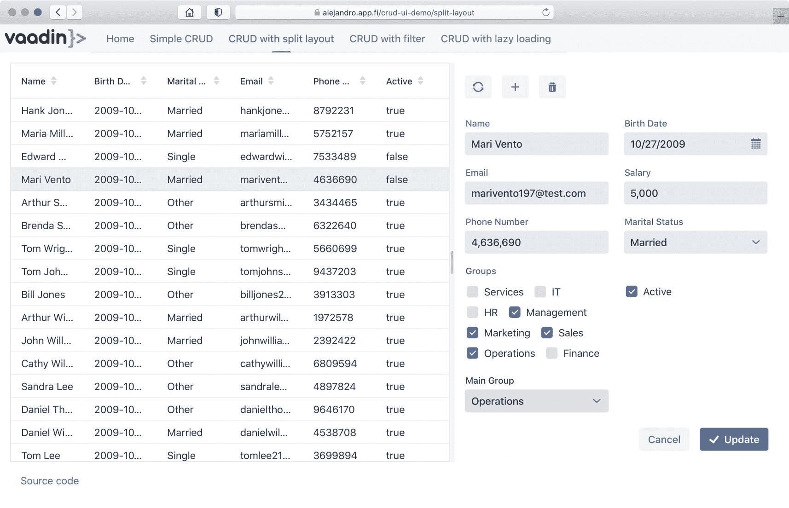

图 1-1

用 Vaadin 实现的 CRUD 视图

Vaadin 允许我使用运行在服务器端的 Java 编写 web 用户界面，这是我决定在未来的许多项目中采用它的主要原因。能够在应用程序的所有层中使用相同的编程语言消除了上下文转换的相关工作。类似地，当开发人员加入一个项目时，他们必须经历的学习曲线几乎是平坦的——如果他们了解 jva，他们几乎立即就可以使用 Vaadin 进行生产。

当你阅读这本书时，同样的事情也会发生在你身上——当你学习 Vaadin 时，你将很快能够为你的 Java 项目实现 web UIs。到本书结束时，您将拥有实现和维护 Vaadin 应用程序的技能，并且，为什么不像我对 CRUD 库所做的那样，创建和发布您自己的可重用库。

Note

如果你很好奇，CRUD 库是开源的，可以在 [`https://vaadin.com/directory/component/crud-ui-add-on`](https://vaadin.com/directory/component/crud-ui-add-on) 免费获得。

## 网络平台

有时候，用 Vaadin 开发感觉像是魔术。你输入一段 Java 代码，它应该在浏览器上显示一个按钮，这个按钮确实神奇地出现在那里。我想告诉你在软件开发中没有魔法这种东西。如果你理解了潜在的机制，你会发现没有什么窍门，你会处于一个更好的位置来掌握任何技术。

除了 Java 编程语言，基础技术是那些在*网络平台*中的技术。Web 平台是一组主要由万维网联盟开发并由 Web 浏览器实现的编程语言和 API 标准。这包括 HTTP、HTML、ECMAScript(管理 JavaScript 的标准)、DOM Events、XMLHttpRequest、CSS、Web 组件、Web Workers、WebSocket、WebAssembly、地理位置 API、Web 存储以及其他一些组件。

掌握所有这些技术可能令人望而生畏，但事实是，在日常 web 开发中，您将主要直接使用其中的三种:HTML、JavaScript 和 CSS。Vaadin 抽象掉了 HTML 和 JavaScript(以及相关的 API)，所以大多数时候你只能使用 Java 和 CSS。然而，至少在某种程度上理解底层技术总是好的。

### 超文本标记语言

HTML(超文本标记语言)是浏览器在呈现网页时使用的源。超文本是指带有超链接的文本。当您从一个页面导航到另一个页面时，您可能已经单击了许多超链接。当您看到网页时，您看到的是 HTML 文档的渲染版本。HTML 文档是由标签和文本组成的文件(在内存或硬盘中)，从 HTML5 开始，以*文档类型声明*开始:

```java
<!DOCTYPE html>

```

大多数标签成对使用。例如:

```java
<h1>It works!</h1>

```

在这个例子中，`<h1>`是开始标记，`</h1>`是结束标记。标签之间的文本是标签的内容，也可以包含其他 HTML 标签。在前面的例子中，文本*Web 平台*由浏览器使用标题样式呈现。标题有几个层次，例如，`<h2>`，`<h3>`等。

HTML 标签不仅格式化代码，而且呈现 UI 控件，如按钮和文本字段。以下代码片段呈现了一个按钮:

```java
<button>Time in the client</button>

```

HTML 文档的主要部分由三个标签构成:

*   `<html>`:文档的根或顶层元素

*   `<head>`:关于文档的元数据，用于添加资源(图像、JavaScript、CSS)或配置页面标题等内容(使用`<title>`标签)

*   `<body>`:文档的可呈现内容

开始标签可以包括*属性*。例如，您可以通过使用`<html>`标签的`lang`属性来指定页面的语言:

```java
<html lang="en"></html>

```

如果我们将前面的代码片段放在`<body>`元素中，我们就可以形成一个所有浏览器都可以呈现的完整有效的 HTML 文档。清单 [1-1](#PC6) 显示了一个完整有效的 HTML 文档。

```java
<!DOCTYPE html>
<html lang="en">
<head>
  <title>The Web platform</title>
  <link rel="stylesheet" href="browser-time.css">
</head>
<body>

<h1>It works!</h1>
<button>Time in the client</button>

</body>
</html>

Listing 1-1A complete HTML document

```

Note

HTML 不关心缩进。开发人员会这样做，一些人选择缩进`<html>`和`<body>`标签的内容，而另一些人则不愿意这样做。我不喜欢缩进，因为它们出现在几乎所有的文档中，它们只是把所有的东西都向右移动。然而，为了可读性，我在`<body>`标签中缩进了 HTML 标签的内容。在前面的例子中，这些标签都没有其他标签作为内容，所以在`<body>`标签中没有缩进的内容。此外，大多数 ide 都按照我在示例中使用的样式缩进。

如果您使用纯文本编辑器(下一章将介绍如何设置开发环境)创建一个*browser-time.html*文件，并在 web 浏览器中打开该文件，您将看到类似于图 [1-2](#Fig2) 中的截图。

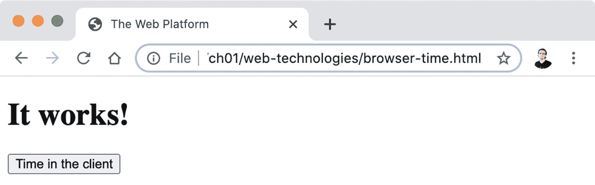

图 1-2

在 web 浏览器中呈现的简单 HTML 文档

我鼓励您在您的计算机上尝试这种方法，并用代码进行实验。尝试添加标签，如`<input>`，并用`<b>`、`<i>`和`<code>`格式化文本。

Note

你可以在 Mozilla Developer Network (MDN)网站的 [`https://developer.mozilla.org/en-US/docs/Web/HTML/Element`](https://developer.mozilla.org/en-US/docs/Web/HTML/Element) 找到 HTML 中所有标签的完整列表。事实上，MDN 是学习有关 Web 平台技术的一切的极好资源。

### JavaScript 和 DOM

*JavaScript* 是一种多用途的、基于原型的(允许在没有预先定义类的情况下创建对象)、单线程的、具有一流功能的脚本编程语言。除了它的名字和`Date`对象(是 Java 的`java.util.Date`类的直接端口)，JavaScript 和 Java 语言本身没有任何关系。然而，JavaScript 经常与 Java 一起用于开发 web 应用程序——Java 在服务器上，JavaScript 在客户机上。JavaScript 是网络浏览器的编程语言。

*DOM* (文档对象模型)是一个独立于语言的 API，它将 HTML(或者更一般地，XML)文档表示为一棵树。Web 浏览器将 DOM 实现为 JavaScript API。图 [1-3](#Fig3) 描述了上一节开发的 HTML 文档的 DOM 层次结构。

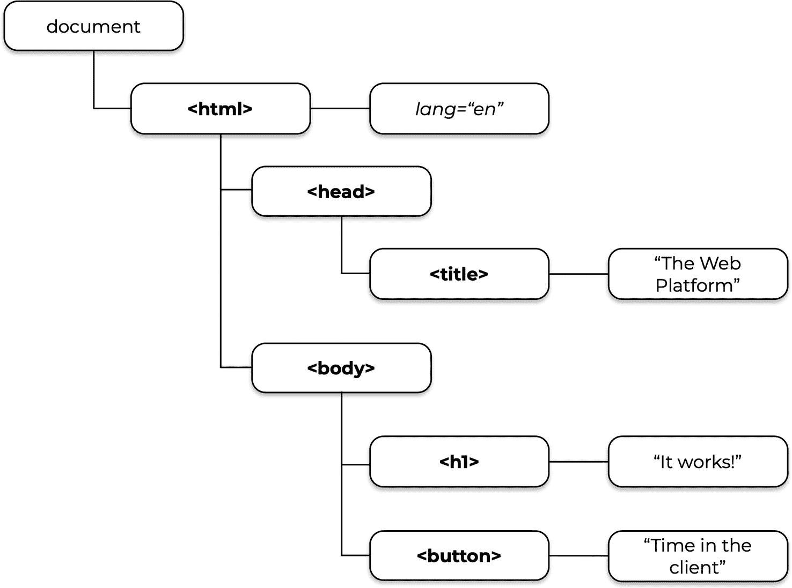

图 1-3

HTML 文档的文档对象模型示例

使用 JavaScript DOM API，开发人员可以添加、更改和删除 HTML 元素及其属性，从而创建动态网页。要将 JavaScript 逻辑添加到 HTML 文档中，可以使用`<script>`标签:

```java
<!DOCTYPE html>
<html>
...
<body>
...
<script>
  ... JavaScript code goes here ...
</script>

</body>
</html>

```

我喜欢将 JavaScript 代码放在单独的文件中。添加 JavaScript 的另一种方法是将`<script>`标签的内容留空，并使用`src`属性来指定文件的位置:

```java
<script src="time-button.js"></script>

```

回到上一节的 HTML 文档，使按钮工作的 JavaScript 逻辑可以放在 *time-button.js* 文件中(browser-time.html 文件旁边的*文件)，内容如下:*

```java
let buttons = document.getElementsByTagName("button");

buttons[0].addEventListener("click", function() {
  let paragraph = document.createElement("p");
  paragraph.textContent = "The time is: " + Date();
  document.body.appendChild(paragraph);
});

```

我尽量把前面的 JavaScript 代码写得对 Java 开发者来说尽可能清晰。这个脚本将文档中的所有`<button>`元素作为一个数组，并向第一个元素添加一个 click 监听器(顺便说一下，这里只有一个按钮)。click listener 实现为一个函数，当用户单击按钮时调用该函数。这个监听器使用 DOM API 创建一个新的`<p>`元素，并设置它的文本内容来显示当前时间。然后，它将新创建的元素附加到`<body>`元素的末尾。结果如图 [1-4](#Fig4) 所示。

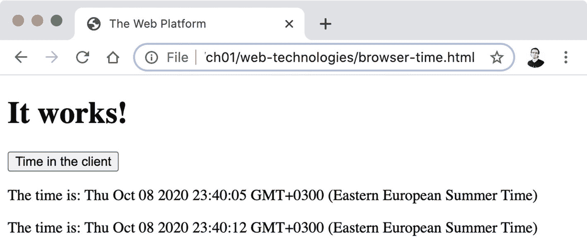

图 1-4

在 web 浏览器中运行的简单 JavaScript 应用程序

### 半铸钢ˌ钢性铸铁(Cast Semi-Steel)

CSS(级联样式表)是一种允许配置字体、颜色、间距、对齐和其他样式特征的语言，这些特征决定了 HTML 文档应该如何呈现。向 HTML 文档添加 CSS 代码的一个简单方法是在`<head>`元素中使用`<style>`标记:

```java
<!DOCTYPE html>
<html>
<head>
  ...
  <style>
    ... CSS code goes here ...
  </style>
</head>
  ...
</html>

```

和 JavaScript 文件一样，我喜欢用单独的文件来定义 CSS 样式。这是通过在`<head>`部分使用一个`<link>`标签来完成的:

```java
<head>
  <link rel="stylesheet" href="browser-time.css">
<head>

```

Tip

`<link>`是没有结束标签(`</link>`)的标签之一。在 HTML5 中，不允许使用结束标记；然而，浏览器只是忽略了`</link>`或者在渲染页面时在`>`前添加一个`/`的货运惯例。

CSS 规则将样式应用于 HTML 文档。每个 CSS 规则都被写成一个针对 HTML 元素的*选择器*和带有应用于这些元素的样式的*声明*。例如，以下 CSS 规则更改整个 HTML 文档的字体:

```java
html {
  font: 15px Arial;
}

```

`html`部分是选择器。大括号内是声明。这个规则中只有一个声明，但是也可以定义多个声明。以下 CSS 规则将所有`<h1>`元素更改为全角(100%)、半透明蓝色背景色和 10 像素的填充(元素文本周围的空间):

```java
h1 {
  width: 100%;
  background-color: rgba(22, 118, 243, 0.1);
  padding: 10px;
}

```

选择器允许通过标记名(像前面的例子一样)、元素 ID、属性值等进行定位。最重要的选择器之一是*类选择器*。一个类选择器允许目标元素在它们的`class`属性中有一个指定的值。下面的代码片段显示了如何将`time-button` CSS 类添加到示例中的按钮:

```java
<button class="time-button">Time in the client</button>

```

CSS 类选择器以句点开头，后跟目标类的名称。要设置上例中按钮的样式，可以使用如下规则:

```java
.time-button {
  font-size: 15px;
  padding: 10px;
  border: 0px;
  border-radius: 4px;
}

```

此规则将字体大小更改为 15 像素，在按钮中的文本周围添加 10 像素的填充，移除边框，并使其边角略微变圆。结合这些概念，可以在一个单独的 *browser-time.css* 文件中设计整个 HTML 文档的样式:

```java
html {
  font: 15px Arial;
}

body {
  margin: 30px;
}

h1 {
  width: 100%;
  background-color: rgba(22, 118, 243, 0.1);
  padding: 10px;
}

.time-button {
  font-size: 15px;
  padding: 10px;
  border: 0px;
  border-radius: 4px;
}

```

图 [1-5](#Fig5) 显示了之前应用于 HTML 文档的 CSS 规则。

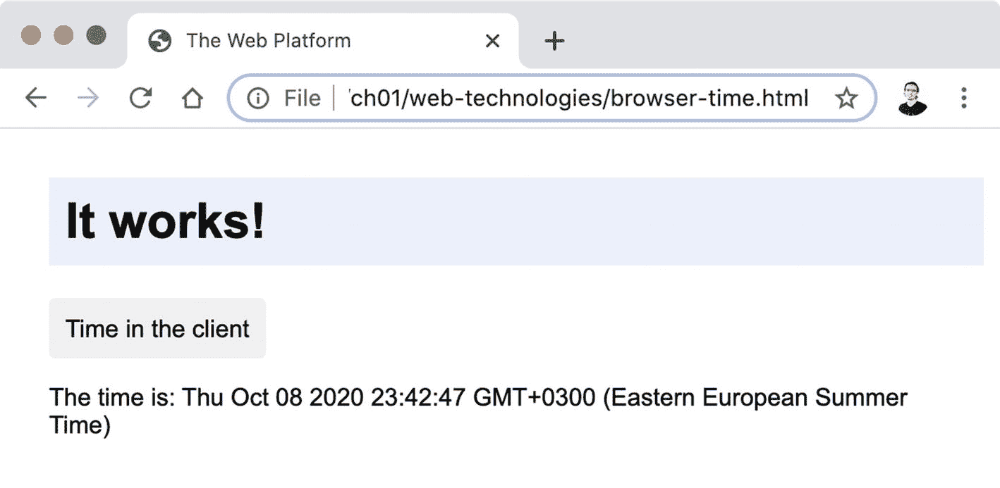

图 1-5

用自定义 CSS 样式呈现的 HTML 文档

### Web 组件

Web 组件是一组允许创建可重用的自定义 HTML 元素的技术。在本节中，我将向您介绍主要技术:*自定义元素*。这应该足以让你理解关键的网络平台概念，并看到没有真正的魔法。

Web 组件是一个可重用的封装自定义标签。示例中的“客户机中的时间”按钮是这种组件的一个很好的候选。如果能够通过一个自定义标记在多个 HTML 文档中使用该组件，将会非常方便:

```java
<time-button></time-button>

```

定制元素的名字中必须有一个破折号，这样浏览器(和你)就知道它不是一个标准的 HTML 元素。使用自定义元素需要两件事情:

*   实现一个扩展`HTMLElement`(或者一个特定元素)的类。

*   使用`customElements.define(name, constructor)`注册新元素。

以下是如何:

```java
class TimeButtonElement extends HTMLElement {

  constructor() {
    super();
    ...
  }
}

customElements.define("time-button", TimeButtonElement);

```

在构造函数中，您可以通过使用`this.innerHTML`或 DOM API 中的任何可用功能来定义元素的内容:

```java
let button = document.createElement("button");
button.textContent = "Time in the client";
button.classList.add("time-button");

button.addEventListener("click", function () {
  let paragraph = document.createElement("p");
  paragraph.textContent = "The time is: " + Date();
  document.body.appendChild(paragraph);
});

this.appendChild(button);

```

这会以编程方式创建按钮，并将其追加到自定义元素中。为了使元素在重用时更加灵活，允许指定像按钮中显示的文本这样的值而不是硬编码它们是一个好主意(`"Time in the client"`):

```java
button.textContent = this.getAttribute("text");

```

有了它，按钮可以按如下方式使用:

```java
<time-button text="Time in the client"></time-button>

```

只需在文档中添加更多的`<time-button>`标签，就可以多次使用该组件。清单 [1-2](#PC22) 展示了一个完整的 HTML 文档，其中包含两个不同文本的按钮，清单 [1-3](#PC23) 展示了配套的 *time-button.js* 文件，该文件实现并注册了定制元素。

```java
class TimeButtonElement extends HTMLElement {

  constructor() {
    super();
    let button = document.createElement("button");
    button.textContent = this.getAttribute("text");
    button.classList.add("time-button");

    button.addEventListener("click", function () {
      let paragraph = document.createElement("p");
      paragraph.textContent = "The time is: " + Date();
      document.body.appendChild(paragraph);
    });

    this.appendChild(button);
  }
}

customElements.define("time-button", TimeButtonElement);

Listing 1-3A custom element implemented in JavaScript (time-button.js)

```

```java
<!DOCTYPE html>
<html lang="en">
<head>
  <title>The Web platform</title>
  <link rel="stylesheet" href="browser-time.css">
</head>
<body>

<h1>It works!</h1>
<time-button text="Time in the client"></time-button>
<time-button text="What time is it?"></time-button>
<script src="time-button.js"></script>

</body>
</html>

Listing 1-2An HTML document reusing a custom element

```

您只需要一个文本编辑器和一个浏览器来尝试这一点。如果您是 web 开发新手，我建议您这样做。尝试创建这些文件，将它们放在同一个目录中，并在 web 浏览器中打开 HTML 文件。在继续之前，请确保您了解正在发生的事情。旅程的客户端步骤以图 [1-6](#Fig6) 结束，它显示了到目前为止开发的最终纯 HTML/JavaScript 应用程序的屏幕截图。

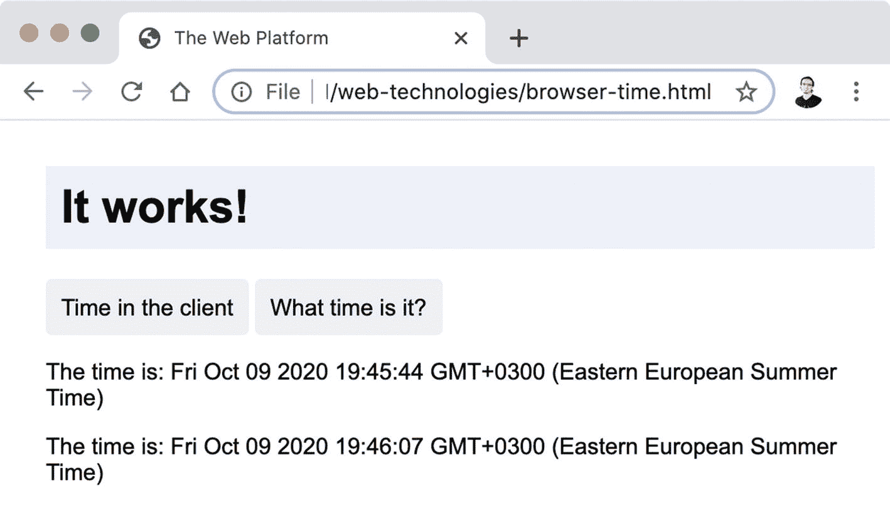

图 1-6

最终的纯客户端 web 应用程序

## 服务器端技术

有了 Web 平台的基础，您现在可以接近等式中同样激动人心的服务器端了。简而言之，这意味着理解什么是 web 服务器，如何向 web 服务器添加自定义功能，以及如何将客户端(浏览器)与 web 服务器连接起来。

### 网络服务器

术语*网络服务器*用于指代硬件和软件实体。在硬件领域，web 服务器是一台包含 web 服务器软件和资源的机器，这些资源包括 HTML 文档、JavaScript 文件、CSS 文件、图像、音频、视频甚至 Java 程序。在软件领域，web 服务器是通过 HTTP(浏览器理解的协议)向客户端(web 浏览器)提供主机(硬件 web 服务器)中的资源的软件。本书使用术语 web 服务器的软件定义。图 [1-7](#Fig7) 显示了客户端-服务器架构中的主要组件以及通过 HTTP 请求和响应的数据流。

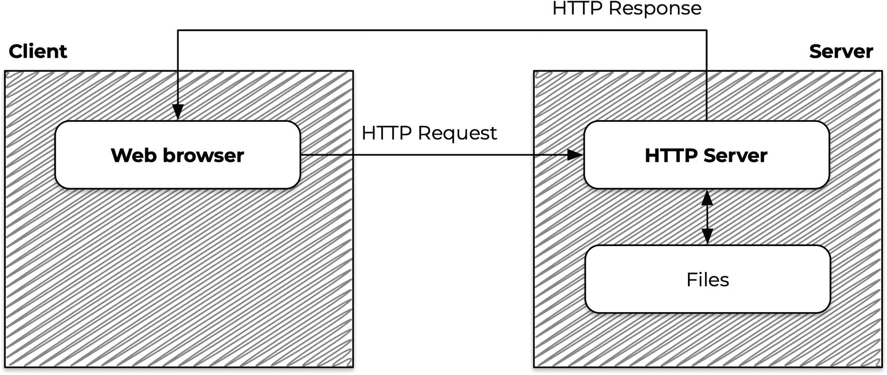

图 1-7

HTTP 上的客户机-服务器体系结构

通常，web 服务器被称为 HTTP 服务器或应用服务器，这取决于所提供的内容是静态的还是动态的。静态 web 服务器将 URL 映射到主机中的文件，并在浏览器请求时发送它们。动态 web 服务器是静态 web 服务器，但它为开发人员提供了在提供托管文件之前处理它们的可能性。

web 服务器是可以在您的机器上安装和运行的软件。您的计算机中可能已经安装了一个(或几个)。事实上，几乎所有的 Unix 平台(Linux、macOs、FreeBSD 和其他平台)都自带 Python，而 Python 又包含一个模块，可以轻松地运行 HTTP web 服务器来为当前目录中的文件提供服务。在 Windows 系统上，您必须安装 Python，或者更好的是，启用 WSL(Linux 的 Windows 子系统)并使用 Windows store 安装 Linux 发行版，例如 Ubuntu，默认情况下它包含 Python。

根据 Python 的版本，您必须运行以下命令之一来启动允许通过 HTTP 访问当前目录中的文件的 web 服务器:

```java
> python -m SimpleHTTPServer 8080
> python3 -m http.server 8080

```

Tip

如果您的计算机上安装了 Node.js，您也可以使用`npm install -g http-server`安装一个 HTTP 服务器，并使用`http-server -p 8080`运行它。

您可以使用 URL 从连接到您的网络甚至互联网的任何设备请求 HTML 文档(假设防火墙和其他安全机制不会阻止对您的 web 服务器的访问)。图 [1-8](#Fig8) 显示了我从手机上请求 HTML 文档时的示例(根据您使用的浏览器和操作系统，您得到的结果可能略有不同)。请注意我是如何使用我的 IP 地址来访问文件，而不是直接在浏览器中打开它的。

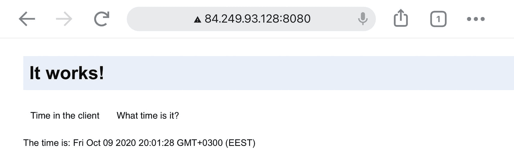

图 1-8

从 web 服务器提供的 HTML 文档

### 公共网关接口

CGI(公共网关接口)是从网络服务器提供动态内容的最简单的方法之一。我就避开 CGI 死了还是好不好的讨论。我的目的是让您向服务器端技术迈进一步，从实用的角度来看，这项技术很容易理解。

CGI 定义了一种方法，允许 web 服务器与服务器中的外部程序进行交互。这些程序可以用任何编程语言实现。CGI 将 URL 映射到这些程序。外部程序使用标准输入(`STDIN`)和标准输出(`STDOUT`)与客户端通信，这在 Java 中可以通过`System.in`和`System.out`对象获得。标准程序和 CGI 程序的主要区别在于输出应该以包含`Content-Type`标题的一行开始。例如，要提供纯文本，输出必须以`Content-Type: text/html`开头，后面跟一个空行，后面跟要提供的文件的内容。

Python HTTP 服务器模块包括 CGI。要启用它，使用`--cgi`参数启动服务器:

```java
> python -m SimpleHTTPServer 8080 --cgi
> python3 -m http.server 8080 --cgi

```

有了这个服务器，当你使用这个服务器的时候，CGI 程序应该放在 *cgi-bin* 目录下。其他 web 服务器可能使用不同的位置，可能需要安装额外的模块才能工作。

让我们看看如何用 Java 实现一个 CGI 程序。从版本 11 开始，可以创建一个可以直接从命令行执行的 Java 程序:

```java
#!/usr/bin/java --source 11
public class ServerTime {
  public static void main(String[] args) {
    System.out.println("Content-Type: text/plain\n");
    System.out.println("It works!");
  }
}

```

Note

上例中的第一行是一个 she bang——一个基于 Unix 的系统识别的幻数，用于确定文件是脚本还是可执行的二进制文件。记得使用完整路径到 *java* 命令，并用 *chmod +x server-time* 使文件可执行。在 Windows 系统中，你可以创建一个*。bat* 文件来调用 *java* 程序。在这种情况下，您需要一个单独的文件来放置 Java 代码。

如果您将这个文件命名为 *server-time* (不要使用*。java* 扩展)并将其放在 *cgi-bin* 目录中(相对于您启动 Python web 服务器的位置)，您将能够在*http://localhost:8080/CGI-bin/server-time*从浏览器访问该程序。图 [1-9](#Fig9) 显示了结果。

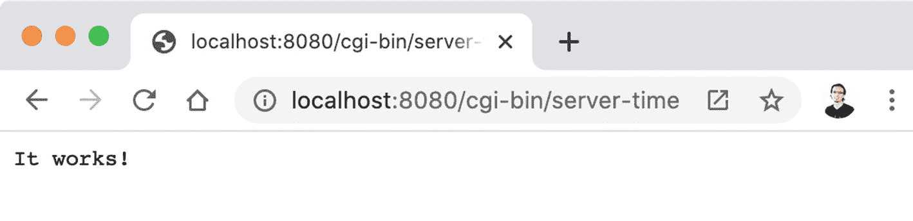

图 1-9

用 Java 编写的 CGI 程序返回的纯文本

前面的例子并没有真正创建动态内容——每次请求页面时，浏览器都显示完全相同的内容。然而，很容易理解 Java 程序可以做的不仅仅是返回硬编码的字符串。它可以读取一个 HTML 文件，并通过替换一个占位符来处理它以添加动态内容，然后将结果发送给`STDOUT`。这是许多 web 框架使用的一种技术。下面是一个可能的实现:

```java
#!/usr/bin/java --source 11

import java.io.IOException;
import java.nio.charset.Charset;
import java.nio.file.Files;
import java.nio.file.Path;
import java.util.Date;

public class ServerTime {

  public static void main(String[] args) throws IOException {
    Path path = Path.of("cgi-bin/template.html");
    String template = Files.readString(path,
        Charset.defaultCharset());

    String content = "Time in the server: " + new Date();
    String output = template.replace("{{placeholder}}", content);

    System.out.println("Content-Type: text/html\n");
    System.out.println(output);
  }
}

```

这个程序获取 *cgi-bin/template.html* 文件，读取其内容，并用包含服务器中计算的时间的字符串替换`{{placeholder}}`。模板文件可能是这样的:

```java
<!DOCTYPE html>
<html lang="en">
<head>
  <title>CGI Example</title>
</head>
<body>

<h1>It works!</h1>
{{placeholder}}

</body>
</html>

```

图 [1-10](#Fig10) 显示了在浏览器中调用程序的结果。现在，这是一个动态页面，每次你请求时，它都会显示不同的内容。

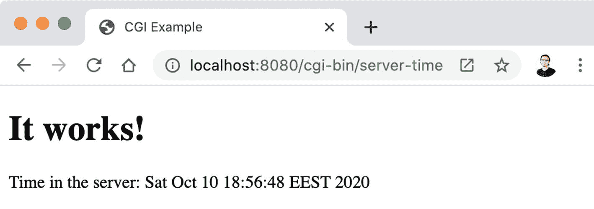

图 1-10

由 CGI 程序生成的动态 HTML 文档

### 小型应用程序

*Jakarta Servlet* (以前称为 Java Servlet)是 Java 的 API 规范，允许开发人员使用 Java 编程语言扩展服务器的功能。虽然在上一节中我已经向您展示了如何用 Java 实现这一点，但是与 Java servlets 相比，CGI 有几个缺点。CGI 的主要挑战与这样一个事实有关，即每次用户请求一个页面时，服务器都会启动一个新的进程(或者服务器中的 CGI 程序)。这降低了对服务器的请求速度，潜在地消耗了更多的内存，使得使用内存中的数据缓存更加困难，并且降低了程序的可移植性。

Servlets 是用于 web 开发的 Java 解决方案，它通过一个可靠的、久经考验的 API 提供了请求-响应协议(如 HTTP)的面向对象的抽象。servlet 是一个 Java 程序(或类),它由一个名为 *servlet 容器*的软件组件管理。servlet 容器是 Jakarta Servlet API 的具体实现。有些 web 服务器包括现成的 servlet 容器实现。最流行的是 Apache Tomcat 和 Eclipse Jetty。

Tip

如何在 Tomcat 和 Jetty 之间抉择？我在这里没有一个好的答案，但是有一个快速的指南可以帮助你开始你自己的研究。两者都可以投入生产，并且经过了许多严肃项目的测试。Tomcat 更受欢迎，更快地结合了最新版本的规范。Jetty 似乎用在高性能是关键的项目中，优先考虑整合社区所需的修复，而不是支持最新版本的规范。

简而言之，操作系统运行进程。JVM 作为执行字节码编译的程序(用 Java、Kotlin、Scala、Groovy 或其他 JVM 语言编写)的进程运行。Tomcat 和 Jetty Java 服务器都是用 Java 实现的(尽管 servlet 容器可以用任何语言实现，只要它们符合 Jakarta Servlet 规范)。Java 服务器读取组成 Java web 应用程序的文件，而 Java web 应用程序又与 servlet API 交互来处理请求并产生响应。图 [1-11](#Fig11) 显示了该堆栈的概况。

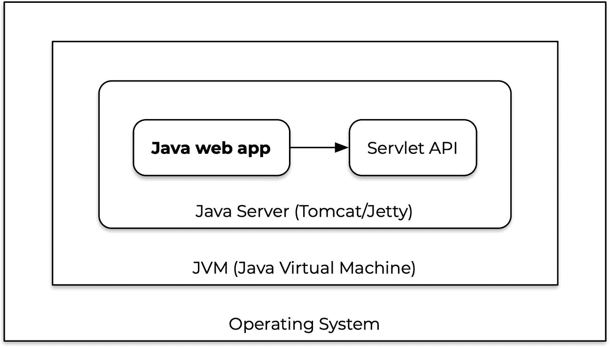

图 1-11

服务器端 Java 堆栈

下面是一个简单的 servlet 实现:

```java
import javax.servlet.ServletException;
import javax.servlet.annotation.WebServlet;
import javax.servlet.http.HttpServlet;
import javax.servlet.http.HttpServletRequest;
import javax.servlet.http.HttpServletResponse;
import java.io.IOException;

@WebServlet("/*")
public class ServletExample extends HttpServlet {
  private String replace;

  public void doGet(HttpServletRequest request,
                    HttpServletResponse response) throws
      IOException, ServletException {

    response.setContentType("text/plain");
    response.getWriter().println("It works!");
  }
}

```

这个类使用 servlet API 将纯文本写入响应，类似于 CGI 程序将响应写入`STDOUT`的方式。`@WebServlet`注释配置了服务器用来向这个 servlet 发送请求的 URL。在这种情况下，对应用程序的所有请求都将被发送到由 servlet 容器创建和管理的`ServletExample`类的一个实例。

要编译这个类，您需要将 servlet API 添加到 JVM 类路径中(下一章将展示如何用 Maven 完成这一步)。Java 服务器附带了这个 API。例如，下载 Apache Tomcat 9.0 的 ZIP 文件，并提取其中的内容。可以在 [`http://tomcat.apache.org`](http://tomcat.apache.org) 下载服务器。您将在 Tomcat 安装的 *lib* 目录中找到一个包含 servlet API 的 *servlet-api.jar* 文件。复制该文件的完整路径，并如下编译`ServletExample`类(更改您自己的 JAR 文件的位置):

```java
javac ServletExample.java -cp /apache-tomcat/lib/servlet-api.jar

```

Java web 应用程序需要特定的目录结构，以便供 Java 服务器使用。在 Tomcat 安装的 *webapps* 目录中创建一个新的 *java-web-development* 目录。这是您的应用程序的根目录。编译好的 Java 类文件应该放在你的应用根目录下的子目录中: *WEB-INF/classes* 。创建这个目录并将 *ServletExample.class* 文件复制到其中。

使用 *bin/startup.sh* 或 *bin/startup.bat* 脚本启动服务器。例如，您可能需要使用`chmod +x *.sh`使这些文件可执行。现在可以在*http://localhost:8080/Java-we b-development*调用 servlet。图 [1-12](#Fig12) 显示了结果。

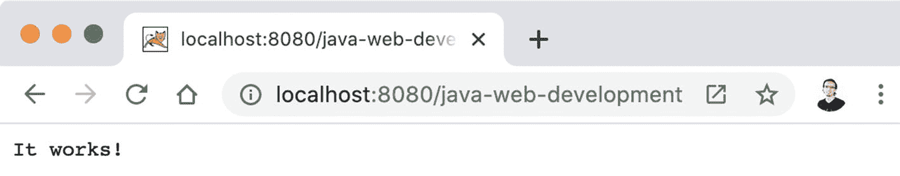

图 1-12

由运行在 Tomcat 上的 Java servlet 生成的文本文档

您还可以使用 Java 服务器提供静态 HTML、CSS 和 JavaScript 文件。作为一个练习，尝试将前面几节中开发的示例文件复制到应用程序的根目录下。您需要将 servlet 映射到不同的 URL 以使文件可用(例如，`@WebServlet("/example")`)，重新编译并重启服务器。你可以通过运行 *shutdown.sh* 或者 *shutdown.bat* 来停止服务器。

## 使用 Vaadin 进行 Web 开发

至此，您应该清楚，不管 HTML、JavaScript 和 CSS 文件是由 Java 程序、Java servlet 还是文件系统生成的，提供这些文件都没有什么神奇之处。大多数 Java web 框架使用这些技术来简化 web 开发。瓦丁就是其中之一。

Vaadin 的核心包括一个 Java servlet ( `VaadinServlet`)，它为您处理一切(或几乎一切)。这个 servlet 扫描您的类并构建一个组成 web 用户界面的*组件树*。这个组件树与浏览器中的 DOM 相似(但不相同)。您使用一个名为 *Vaadin 流*的 Java API 来构建这个树。

当在浏览器中调用 Vaadin 应用程序时，Vaadin servlet 用一个轻量级客户端 JavaScript 引擎进行响应。当用户在浏览器中与应用程序交互时，客户端引擎通过发送请求和接收来自 Vaadin servlet 的响应，动态地添加、删除或修改 DOM 中的元素(实现为 Web 组件)。

客户端引擎是一组静态资源，包括在您构建应用程序时由 Vaadin 自动生成的配置文件、Web 组件和 HTML 文档。这些资源是由一个 Maven 插件创建的，你将在下一章中了解到。

## 摘要

通过教你 web 开发的基础知识，这一章让你处于一个很好的位置，开始学习 Vaadin 的细节。您看到了 web 平台如何允许您使用 HTML 文档呈现 Web 页面，这些文档可以使用 CSS 规则进行样式化，并使用 JavaScript 进行动态修改。您不仅通过使用可以用任何编程语言编写的 CGI 程序，还通过创建部署到实现 Jakarta servlet API 的 Servlet 容器的 Servlet，学习了什么是 web 服务器以及如何为它们添加功能。您还了解了 Vaadin 如何包含一个 servlet 实现，该实现与客户端引擎通信以在浏览器中呈现 Web 组件。

下一章将教你如何设置你的开发环境，以及如何创建和调试 Vaadin 应用程序。在此期间，您将学习框架中的关键基本概念。