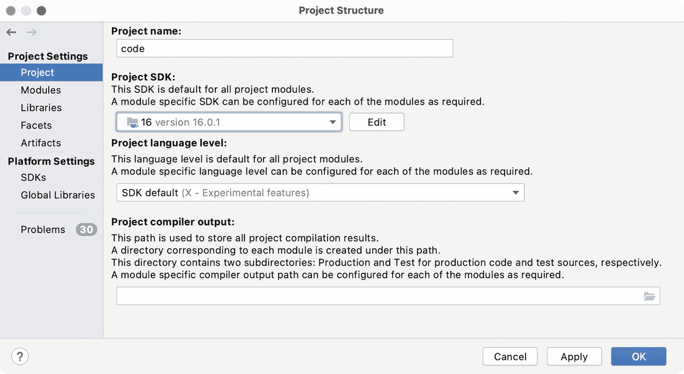
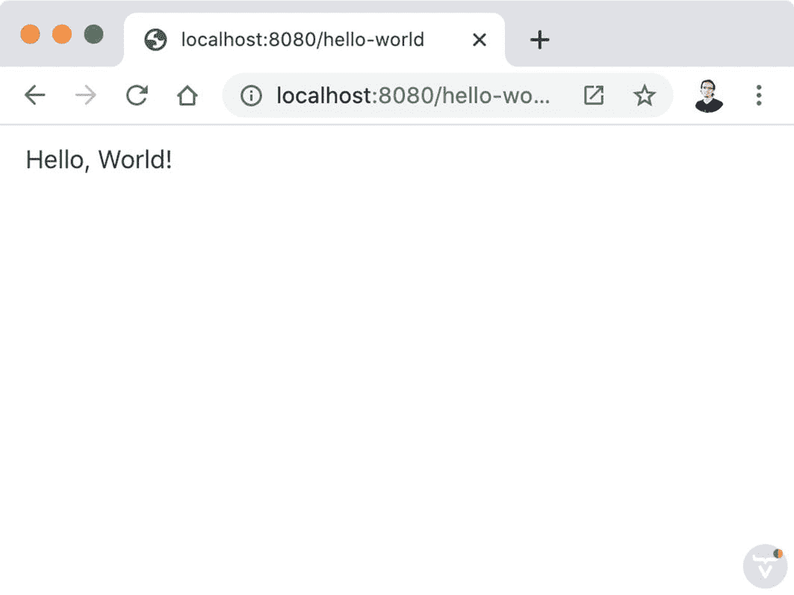
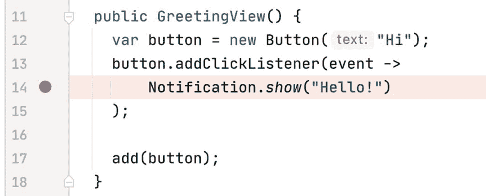

# 2.设置开发环境

本章解释了如何设置开始用 Java 和 Vaadin 编码所需的所有工具。简而言之，您需要 Java 开发工具包和 Java 集成开发环境。您将学习 Vaadin 的基础知识，以及如何编译、运行和调试您自己的程序以及本书中包含的示例。

## 安装 JDK

Java 开发工具包(JDK)是开发 Java 应用所需的工具和库的集合。这包括 Java 编译器，它将您的纯文本源代码文件转换成 Java 运行时环境(JRE)可以运行的二进制文件。任何需要运行编译后的 Java 程序的设备都需要 JRE。对于 Vaadin 应用，设备很可能是 Java 服务器。JRE 是几年前 Java 出现在市场上时创造的著名和经典的“编译一次，在任何地方运行”口号的来源。JDK 包括 JRE 和附加工具。

JDK 有几个高质量的发行版。Vaadin 推荐亚马逊 Corretto，这是一个由亚马逊提供支持的免费开源发行版。Amazon Corretto 基于 JDK 的参考实现 OpenJDK。我个人推荐*改为采用 OpenJDK* 。在写这本书的时候，这个项目正在以 Adoptium 的名字转移到 Eclipse Foundation，所以你可能不得不寻找这个名字而不是 AdoptOpenJDK，这取决于你何时阅读本章。AdoptOpenJDK(或 Adoptium)是 OpenJDK 的高质量、企业就绪版本，符合 Oracle 的技术兼容性工具包(从迁移到 Eclipse Foundation 开始)。该项目是开源的，让社区可以使用所有的构建和测试脚本。

Tip

可以把 JDK 想象成由全球开发者社区开发的一套标准，通过所谓的 Java 社区过程(JCP)来实现整个过程，通过 Java 规范请求(JSR)来实现 JDK 的特定特性或部分。任何人都可以采用这些标准并执行它们。OpenJDK 是一个实际上是源代码的实现。发行版获取源代码并生成二进制文件，然后将它们打包到一个归档文件中，开发人员可以将它们安装到自己的机器上。

要安装 JDK，进入 [`https://adoptopenjdk.net`](https://adoptopenjdk.net) (或 [`https://adoptium.net`](https://adoptium.net) )，选择 OpenJDK 16(或你在那里找到的最新版本)，点击页面底部的大按钮下载安装程序。网页截图如图 [2-1](#Fig1) 所示。


图 2-1

adoptopenjdk 下载页面

Linux、Windows 和 macOS 的安装包都是可用的。点击**其他平台**按钮可以看到所有平台。选择与您的机器相匹配的一个，运行安装程序，并按照显示的步骤操作。

要再次检查 JDK 是否可以使用，请打开终端或命令行窗口，并运行以下命令来确认编译器的版本与您下载并安装的版本相匹配:

```java
> javac -version
javac 16.0.1

```

您还可以通过在命令行中运行`java -version`来检查 JVM 是否准备好被调用。该命令应该报告您刚刚安装的 JDK 的版本和发行版。例如:

```java
> java -version
openjdk version "16.0.1" 2021-04-20
OpenJDK Runtime Environment AdoptOpenJDK-16.0.1+9 (build 16.0.1+9)
OpenJDK 64-Bit Server VM AdoptOpenJDK-16.0.1+9 (build 16.0.1+9, mixed mode, sharing)

```

Tip

如果你安装了旧版本的 JDK，你可以使用像 *SDKMAN 这样的工具！*你可以在 [`https://sdkman.io`](https://sdkman.io) 了解更多。

## 安装 IDE

集成开发环境(IDE)是一种应用，它在单个图形用户界面中包含软件开发所需的工具。一个好的 IDE 应该包括带有语法高亮的源代码编辑器、构建工具和调试器。Java 的主要 IDE 是 Eclipse IDE、Visual Studio 代码、Apache NetBeans，以及本书使用的免费 IntelliJ IDEA 社区版。您可以使用任何 IDE，但是本书中的屏幕截图和说明是为 IntelliJ IDEA 量身定制的，因为本章没有足够的篇幅来涵盖所有内容。我实际上已经使用 Eclipse IDE 开发了这本书的例子，但是我决定展示 IntelliJ IDEA，因为它提供了一种快速运行 Maven 项目的方法(稍后将详细介绍)。

要安装 IntelliJ IDEA，请转到 [`www.jetbrains.com/idea`](http://www.jetbrains.com/idea) 并点击下载选项。网页截图如图 [2-2](#Fig2) 所示。


图 2-2

IntelliJ IDEA 网站

选择您的操作系统，下载免费的社区版安装程序，并运行它。第一次运行 IDE 时，可以使用它提供的默认配置选项。

## 使用本书中的例子

这本书包含多个独立的例子。为了方便起见，所有示例都聚集在一个项目中，您可以将该项目导入到您的 IDE 中。通过位于 [`www.apress.com/9781484271780`](http://www.apress.com/9781484271780) 的图书产品页面下载代码。在这个页面上，您会找到一个 GitHub 上的 Git 资源库的链接，您可以在这里下载 ZIP 文件形式的代码。将 ZIP 文件的内容解压到硬盘中的任意位置。

Tip

或者，如果您是 Git 用户，您可以使用 Git 来克隆存储库。

### 在 IDE 中导入代码

下载并提取源代码后，运行 IntelliJ IDEA，在图 [2-3](#Fig3) 所示的欢迎屏幕中点击*打开或导入*选项。如果您已经是 IntelliJ IDEA 用户，并且打开了项目，要么关闭所有项目以查看欢迎屏幕，要么改为选择*文件* ➤ *打开*。


图 2-3

IntelliJ IDEA 的欢迎屏幕

IntelliJ IDEA 显示一个窗口，用于从硬盘上的文件中选择一个项目。转到解压源代码的目录(或文件夹)，选择该目录下的 *pom.xml* 文件，如图 [2-4](#Fig4) 所示。出现提示时，确保选择*打开为项目*选项。


图 2-4

聚合器项目 pom.xml 文件

项目导入后，检查它是否与您安装的 JDK 相关联。选择包含项目视图中所有其他子目录的根(最顶层)目录，并选择*文件* ➤ *项目结构...*。在*项目结构*窗口的左侧，点击*项目*并确保在窗口右侧的*项目 SDK* 和*项目语言级别*部分选择了 JDK 版本 16 或更高版本。图 [2-5](#Fig5) 显示了该配置。



图 2-5

IntelliJ IDEA 中的 JDK 配置

### 运行示例

由于 Maven 和 IntelliJ IDEA 提供的良好集成，构建和运行示例变得轻而易举。点击 IDE 窗口右侧的 *Maven* 或者在菜单栏中选择*视图* ➤ *工具窗口* ➤ *Maven* 。您会看到书签中包含的所有示例都带有一个蓝色的“m”图标。从第 [2](02.html) 章开始的所有示例均可在此视图中找到。

Caution

第 [1](01.html) 章的例子不是基于 Maven 的。你必须按照第 [1](01.html) 章中的说明来构建和运行这些例子。

从运行我为你准备的欢迎项目开始。在 *Maven* 视图中，选择 *welcome-to-vaadin* 项目并点击上面带有“播放”图标的 *Run Maven Build* 按钮。见图 [2-6](#Fig6) 。


图 2-6

运行欢迎项目

第一次构建 Vaadin(或者一般来说，Maven)项目时，花费的时间可能比您预期的要长。这是因为 Maven 必须将所有依赖项(JAR 文件形式的 Java 库)下载到您的本地 Maven 存储库中。一旦这些依赖项位于您的本地存储库中，运行项目就会变得更快。

Caution

Vaadin 自动在*中安装 Node.js。您的主目录中的 vaadin* 目录。下载所需的客户端依赖项需要 Node.js。你不需要担心这个问题，除非你已经安装了 Node.js。如果是这样，请检查您使用的是 Node.js 版本 10 或更高版本。

运行完项目后，在*运行*窗口(应用的日志)中等待一条消息，显示“前端编译成功”，然后转到 *http://localhost:8080* 。你应该会看到我为你准备的欢迎信息和关于 Vaadin 的有趣事实。

Note

Maven 是一个项目管理工具。它允许你使用一个名为 *pom.xml* 的文件来管理你的项目。在这个文件中，您定义了 Java 项目的依赖项(例如，Vaadin、Spring、Hibernate)以及有助于构建项目的插件。IntelliJ IDEA 对 Maven 有很好的支持，所以你很少需要使用命令行来运行 Maven。解释 Maven 超出了本书的范围。如果你想了解更多，请访问官方网站 [`https://maven.apache.org`](https://maven.apache.org) 。

## 您的第一个 Vaadin 应用

创建新的 Vaadin 项目有多种方法。瓦丁建议使用在 [`https://start.vaadin.com`](https://start.vaadin.com) 可用的工具来创建新项目。不幸的是，在撰写本文时，这个在线工具不包括创建没有生成视图和 Spring Boot 的最小项目的选项。当你读这本书的时候，这可能会改变，但是为了你的方便，我已经创建了一个最小的*空项目*，你可以用它作为模板开始编写你的应用。您可以在本书附带的源代码的 *ch02/empty-project/* 目录中找到这个空项目(参见 [`www.apress.com/9781484271780`](http://www.apress.com/9781484271780) 处的说明)。

要创建一个新项目，复制 *empty-project* 目录及其内容，并将该目录的名称更改为您希望用作新项目名称的名称。例如，如果您在 Linux 计算机上，请在命令行中运行以下命令:

```java
cd ch02
cp -r empty-project ~/my-first-vaadin-app

```

这将把新项目放在主目录中，但是可以随意使用任何其他位置。以与包含本书示例的聚合器项目相同的方式在 IDE 中导入项目，并在 *pom.xml* 文件中将`artifactID`更改为更合适的名称。例如:

```java
<project ...>

    <modelVersion>4.0.0</modelVersion>
    <groupId>com.example</groupId>
    <artifactId>my-first-vaadin-app</artifactId>
    <version>1.0-SNAPSHOT</version>
    <packaging>war</packaging>

    ...

<project>

```

*项目*视图应该类似于图 [2-7](#Fig7) 中的截图。


图 2-7

一个最小的 Vaadin 项目结构

一切就绪，开始编写您的第一个 Vaadin 应用！

Note

Vaadin 允许在服务器端 Java 或客户端 TypeScript 中实现视图。服务器端 Java 是指在你的服务器上运行的 Java 代码。使用 Java 编写视图，这些视图构成了应用的 web 用户图形界面。客户端 TypeScript 意味着用 TypeScript 编程语言实现的视图。这段代码被编译成 JavaScript 并在 web 浏览器中运行。这本书的重点是服务器端 Java 视图。

### 路线和视图

通过右键单击`com.example`包并选择 *New* ➤ *Java Class* 来创建一个名为`HelloWorldView`的新 Java 类。IntelliJ IDEA 将生成以下类:

```java
public class HelloWorldView {
}

```

Note

从现在开始，您将看到的大多数代码片段中都省略了包声明。

您将在这个类中实现 Java 应用的 web 用户界面(UI)。这个类叫做*视图*，在同一个项目中你可以有多个。每个视图应该映射到不同的 URL。视图的完整 URL 由 web 服务器的位置(例如，开发环境中的 *http://localhost:8080/* )和路由后缀组成。要将后缀映射到视图，使用`@Route`注释。例如:

```java
import com.vaadin.flow.router.Route;

@Route("hello-world")
public class HelloWorldView {
}

```

这定义了一个*路由*，允许您使用类似*http://localhost:8080/hello-world*的 URL 访问视图。如果您指定一个空字符串(`@Route("")`)，那么您将使用 *http://localhost:8080* 来访问视图。

Caution

通过将光标放在要导入的类上并点击 *Ctrl+space* ，确保从`com.vaadin`包中导入正确的类。一个常见的错误是从包含与 Vaadin 的类同名的类的`java.awt`包中导入类。请注意这一点，以避免编译错误。

### 用户界面组件和布局

Vaadin 包括一组 UI 组件。UI 组件是可以添加到用户界面中的可重用元素。例如，您可以分别使用`Button`类和`TextField`类来添加按钮和文本字段。

一种特殊的 UI 组件是*布局*。布局允许您向其中添加其他 UI 组件(包括其他布局)，以便垂直、水平或以您需要的任何其他方式排列它们。

用`@Route`标注的类必须是 UI 组件。要使`HelloWorldView`成为一个 UI 组件，您必须扩展一个现有的组件。因为视图通常包含许多 UI 组件，所以视图扩展某种布局类是有意义的。

Tip

或者，您可以扩展`Composite`类，它提供了一种更好的方法来封装视图中的逻辑。下一章将展示如何使用这个类。

当你阅读这本书和使用这个框架时，你会了解到 Vaadin 中许多可用的 UI 组件。现在，只要延长`VerticalLayout`:

```java
import com.vaadin.flow.component.orderedlayout.VerticalLayout;
import com.vaadin.flow.router.Route;

@Route("hello-world")
public class HelloWorldView extends VerticalLayout {
}

```

这应该已经可以工作了，但是在浏览器中看起来会很无聊。实现一个将段落添加到视图的构造函数，如下所示:

```java
public HelloWorldView() {
  add(new Paragraph("Hello, World!"));
}

```

按照前面的说明运行应用，并将浏览器指向*http://localhost:8080/hello-world*。结果如图 [2-8](#Fig8) 所示。



图 2-8

用 Vaadin 实现的“Hello，World”应用

恭喜你！您已经成功实现了您的第一个 Vaadin 应用——用 Java 和 Vaadin 编写的经典“Hello，World”应用。

Caution

在运行一个新的应用之前，确保通过点击工具栏中的*停止*按钮或 IntelliJ IDEA 中的*运行*视图来停止以前运行的应用。否则，服务器会抱怨端口 8080 不可用。

### 事件和侦听器

可以想象，Vaadin 包含了商业应用中常见的各种 UI 组件。当您开发 Vaadin 应用时，您可以组合这些 UI 组件来组成更复杂的视图。例如，将文本字段、组合框和按钮等组件添加到垂直或水平布局中，以构建用于数据输入的表单。

输入组件使用事件编程模型，该模型允许您对诸如单击或 UI 中所选值的更改之类的事情做出反应。为了向您展示这个概念，请尝试将以下类添加到项目中:

```java
@Route("greeting")
public class GreetingView extends VerticalLayout {

  public GreetingView() {
    var button = new Button("Hi");
    button.addClickListener(event ->
        Notification.show("Hello!")
    );

    add(button);
  }

}

```

这段代码创建了一个按钮，并添加了一个事件侦听器来对点击做出反应。侦听器被实现为显示通知的 lambda 表达式。试试看。通过在 IDE 中选择*构建* ➤ *构建项目*来编译项目，并使用浏览器转到*http://localhost:8080/greeting*。

## 排除故障

调试是发现和修复软件缺陷的过程，也称为 bug。调试器是一种允许您暂停正在运行的程序的执行以检查其状态的工具。它还允许您执行任意代码，一次一步地运行您的程序(逐行)。

调试器通常在用特定编程语言实现的应用上工作。IntelliJ IDEA 包括一个用于 Java 应用的调试器。Web 浏览器包括 HTML、CSS 和 JavaScript 代码的调试器。您必须尽早学习如何使用这些调试器来查找您遇到的错误，并帮助您理解程序是如何工作的。

### 服务器端调试

如果您想在示例应用中添加断点，您必须在调试模式下运行它们。停止应用，在 *Maven* 视图中右键单击项目，并在上下文菜单中选择*Debug‘my-first-vaa din-app…’*选项。

尝试在应用中添加一个断点，方法是单击显示通知的代码行的行号右侧。参见图 [2-9](#Fig9) 。



图 2-9

IntelliJ 思想中的一个断点

现在转到浏览器并单击按钮。程序执行暂停，调试器显示在*调试*视图中。您可以看到当前范围内的变量并检查它们的值。例如，您可以通过检查`event`变量中的值来查看屏幕上发生点击的位置。您也可以逐行继续执行程序，或者直到遇到另一个断点(如果有的话)。熟悉此视图中的选项。它们会在项目开发的某个时候变得有用。

### 客户端调试

在客户端，您会遇到需要查看浏览器中 DOM 的当前状态来调整布局问题的情况。所有主要的网络浏览器都包含了对开发者来说很好的工具。在谷歌浏览器的情况下，你可以通过按 F12 来激活这个工具。

找到 UI 特定部分的 HTML 的一个好方法是右键单击您感兴趣的 UI 组件并选择 *Inspect* 。用你的应用的按钮试试这个。图 [2-10](#Fig10) 显示了 Chrome DevTools 和在浏览器中形成按钮的 HTML。


图 2-10

检查完浏览器中的元素后

您还可以修改 HTML 和 CSS 样式，这在您实现视图并尝试微调应用的外观时非常方便。

## 摘要

本章使您能够有效地开始使用 Vaadin。您学习了如何安装 JDK 和 Java IDE。您下载并导入了本书中包含的示例，并学习了如何使用 IntelliJ IDEA 运行它们。您还编写了自己的第一个 Vaadin 应用，并首次尝试了在服务器端用 Java 实现 web 用户界面的方法。您了解了使用`@Route`注释可以将视图映射到 URL，并且理解了 Vaadin 如何允许您通过将 UI 组件添加到布局中来编写视图，以及通过实现事件监听器来对浏览器中的用户操作做出反应。最后但同样重要的是，您快速地看了一下服务器端和客户端上可用的调试器。

下一章将更深入地介绍布局的概念。开发 Vaadin 应用时，掌握布局是关键。你必须确保你能使视图在屏幕上的位置和大小看起来像你想要的那样。