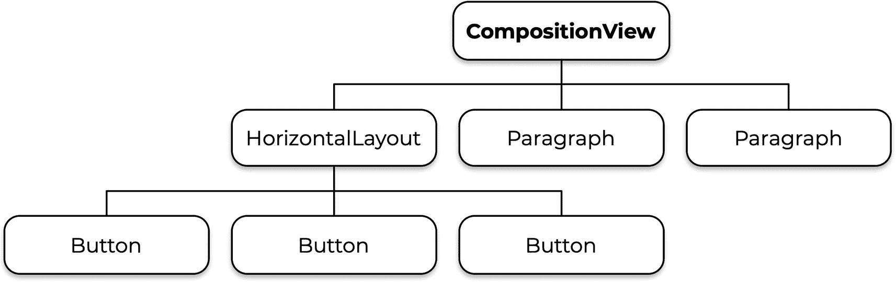

# 三、布局

布局是在屏幕上组织 UI 组件的主要机制。例如，您可能希望创建一个带有垂直对齐的文本字段和组合框的表单。或者您可能想要一个带有文本字段和水平对齐的按钮的搜索栏。Vaadin 包括这些场景的布局和更多。本章教你如何使用 Vaadin 中包含的所有布局组件。

## 垂直和水平布局

可以说，最明显的排列 UI 组件的方式是从上到下或者从左到右。`VerticalLayout`和`HorizontalLayout`类就是为这些场景设计的，是大多数 Vaadin 应用的基本构建模块。

您可以通过创建一个新实例并向其中添加 UI 组件来使用布局。然后，布局负责如何在屏幕上显示所包含的组件。看一下下面的例子:

```java
@Route("vertical-layout")
public class VerticalLayoutView extends VerticalLayout {

  public VerticalLayoutView() {
    add(
        new Paragraph("Paragraph 1"),
        new Paragraph("Paragraph 2"),
        new Button("Button")
    );
  }

}

```

这个视图扩展了`VerticalLayout`并添加了两个段落和一个按钮。如图 [3-1](#Fig1) 所示，这些组件以垂直方式展示，形成一列。


图 3-1

以垂直布局排列的组件

通过更改视图扩展的布局类型，可以更改组件的排列方式。例如，切换到`HorizontalLayout`，下面的视图将组件水平排列成一行，如图 [3-2](#Fig2) 所示:


图 3-2

以水平布局排列的组件

```java
@Route("horizontal-layout")
public class HorizontalLayoutView extends HorizontalLayout {

  public HorizontalLayoutView() {
    add(
        new H1("Horizontal layout"),
        new Paragraph("Paragraph 1"),
        new Paragraph("Paragraph 2"),
        new Button("Button")
    );
  }

}

```

## 成分组成

因为布局是 UI 组件，所以可以将布局添加到布局中。假设您想创建一个包含按钮的工具栏。您可以使用一个`HorizontalLayout`作为工具栏，并将它放在一个`VerticalLayout`中，在这里您还可以添加其他组件。这里有一个例子:

```java
@Route("composition")
public class CompositionView extends VerticalLayout {

  public CompositionView() {
    var toolbar = new HorizontalLayout(
        new Button("Button 1"),
        new Button("Button 2"),
        new Button("Button 3")
    );
    add(
        toolbar,
        new Paragraph("Paragraph 1"),
        new Paragraph("Paragraph 2"),
        new Paragraph("Paragraph 3")
    );
  }

}

```

您可以根据需要设置任意多级嵌套。图 [3-3](#Fig3) 显示了结果。


图 3-3

垂直布局中的水平布局

当您实现一个视图(或者一般的 UI 组件)时，您正在定义一个*组件树*。树的根是视图本身。在前面的例子中，根是`CompositionView`(也是一个`VerticalLayout`)。作为直接孩子，根包含工具栏(`HorizontalLayout`)和三个段落。该组件树的可视化表示如图 [3-4](#Fig4) 所示。



图 3-4

组件树的一个例子

当您请求一个视图时，Vaadin 使用这个组件树在浏览器中显示相应的 HTML。

### 复合类

前面例子中的`CompositionView`类并没有隐藏它是一个`VerticalLayout`的事实。该类的客户将知道这一点，并将能够访问`VerticalLayout`中的方法。实际上，扩展布局很好，因为您很少直接实例化视图——当视图在浏览器中被调用时，Vaadin 扫描用`@Route`注释的类并根据需要创建实例。然而，如果你想隐藏扩展类，你可以使用`Composite`类。下面是对上一个例子的重构，它使用了`Composite`类:

```java
@Route("composition")
public class CompositionView extends Composite<VerticalLayout> {

  public CompositionView() {
    var toolbar = new HorizontalLayout(
        new Button("Button 1"),
        new Button("Button 2"),
        new Button("Button 3")
    );

    var mainLayout = getContent(); // returns a VerticalLayout
    mainLayout.add(
        toolbar,
        new Paragraph("Paragraph 1"),
        new Paragraph("Paragraph 2"),
        new Paragraph("Paragraph 3")
    );
  }

}

```

注意`Composite`类如何接受一个指定要封装的组件类型的参数。因为`CompositionView`不再是`VerticalLayout`，所以不能直接调用`add`方法。相反，您应该使用`getContent()`方法获得一个`VerticalLayout`的实例，然后使用这个实例构建 UI。

这个类的客户也不能直接访问`VerticalLayout`中的方法。然而，`getContent()`方法是公共的，`CompositionView`类的客户端可以使用它来访问底层的`VerticalLayout`。要解决这个问题，您可以用`Component`替换`Composite`类中的参数(`VerticalLayout`)，覆盖`initContent()`方法，并将构建 UI 的所有逻辑移到那里:

```java
@Route("composition")
public class CompositionView extends Composite<Component> {

  @Override
  protected Component initContent() {
    var toolbar = new HorizontalLayout(
        new Button("Button 1"),
        new Button("Button 2"),
        new Button("Button 3")
    );

    return new VerticalLayout(

        toolbar,
        new Paragraph("Paragraph 1"),
        new Paragraph("Paragraph 2"),
        new Paragraph("Paragraph 3")
    );
  }

}

```

`getContent()`方法仍然是公共的，但是它返回一个类型为`Component`的对象，而不是`VerticalLayout`的对象。现在，您可以更改实现，例如，使用不同类型的布局，而不会破坏应用的其他部分。当您开发的可重用组件不是映射到 URL 的视图时(例如，介绍客户或订单数据的表单)，这尤其有用。

Tip

Vaadin 中的所有 UI 组件都直接或间接地从`Component`扩展而来。

### 实现可重用的 UI 组件

您可以使用所有面向对象的技术，通过继承来实现 UI 组件，方法是在`Composite`类的帮助下扩展现有组件、封装和数据隐藏。

前一个例子中的工具栏是视图的一部分，您可能希望将其实现为可重用的 UI 组件。您可以将代码移动到单独的类中，而不是在视图本身中实现工具栏:

```java
public class Toolbar extends Composite<Component> {

  @Override
  protected Component initContent() {
    return new HorizontalLayout(
        new Button("Button 1"),
        new Button("Button 2"),
        new Button("Button 3")
    );
  }

}

```

注意，这个类没有用`@Route`注释。最有可能的是，当浏览器中请求某个 URL 时，您不想只显示一个工具栏，对吗？当您需要工具栏时，您所要做的就是创建一个新的实例并将其添加到布局中:

```java
var toolbar = new Toolbar();
someLayout.add(toolbar);

```

Tip

你不必总是延长`Composite`。有些情况下，扩展`VerticalLayout`、`HorizontalLayout`、`Button`或任何其他类是更好的选择。使用 *is-a* 关系测试来帮助你决定。例如，`Toolbar` *不是* `HorizontalLayout`，因为布局可能甚至在运行时被改变为`VerticalLayout`。另一方面，假设的`SendButton` *是一个* `Button`，因此在这种情况下扩展`Button`类是有意义的。

### 访问组件树

Vaadin 的一个优点是它使得在运行时动态构建视图变得容易。例如，CRUD 组件可以使用 Java 反射 API 来检查给定域类的属性(如`User`、`Order`、`Customer`等)。)并根据 Java 属性的类型创建匹配的 UI 组件(例如，`String`属性的文本字段和`Boolean`的复选框)。另一个例子是根据用户拥有的特权显示某些组件所需的逻辑。

当实现这种动态 ui 时，能够修改布局中的组件树是很有用的。让我们来看看`VerticalLayout`和`HorizontalLayout`中的一些方法，它们将帮助你做到这一点。

您可以使用`getChildren()`方法将布局中的组件作为 Java `Stream`获取:

```java
toolbar.getChildren().forEach(component -> {
  ... do something with component ...
});

```

类似地，您可以使用`getParent()`方法获得父组件:

```java
toolbar.getParent().ifPresent(component -> {
  CompositionView view = (CompositionView) component;
  ... do something with view ...
});

```

您可以分别使用`remove(Component...)`和`removeAll()`方法移除单个组件或所有包含的组件:

```java
var button = new Button();
toolbar.add(button);
toolbar.remove(button); // removes only button
toolbar.removeAll(); // removes all the contained components

```

当动态构建视图时，`replace(Component, Component)`方法会很有用:

```java
var button = new Button();
toolbar.add(button);
toolbar.replace(button, new Button("New!"));

```

### 填充、边距和间距

关于布局区域中的空间，您可以控制三个功能:

*   **填充:**布局内边框周围的空间

*   **边距:**版面外边框周围的空间

*   **间距:**布局中组件之间的间距

您可以使用`setPadding(boolean)`、`setMargin(boolean)`和`setSpacing(boolean)`方法激活或停用这三个功能。有相应的方法返回这些方法中的任何一个是否被激活。以下视图允许您切换这些值，以查看它对 UI 的影响:

```java
@Route("padding-margin-spacing")
public class PaddingMarginSpacingView extends Composite<Component> {

  @Override
  protected Component initContent() {
    var layout = new HorizontalLayout();
    layout.getStyle().set("border", "1px solid");
    layout.setPadding(false);
    layout.setMargin(false);
    layout.setSpacing(false);
    layout.add(
        new Paragraph("Toggle:"),
        new Button("Padding", e ->
            layout.setPadding(!layout.isPadding())),
        new Button("Margin", e ->
            layout.setMargin(!layout.isMargin())),
        new Button("Spacing", e ->
            layout.setSpacing(!layout.isSpacing()))
    );

    return layout;
  }

}

```

这个视图创建了`HorizontalLayout`并使用`getStyle()`方法设置了一个可见的边框，该方法返回一个对象来设置 CSS 属性。

Tip

您可以使用浏览器的开发工具来检查布局，并在选择 HTML 元素时查看边框。我选择用 CSS 在代码中设置边框，这样你就可以在书的截图中看到我在解释什么。

所有功能都被停用，然后三个按钮被添加到布局中。每个按钮切换一个单独的功能。图 [3-5](#Fig5) 显示了所有功能被禁用时的视图。


图 3-5

禁用填充、边距和间距的`HorizontalLayout`

将图 [3-5](#Fig5) 与图 [3-6](#Fig6) 进行比较，其中所有的填充、边距和间距都被激活。


图 3-6

边距、填充和间距已激活

Tip

对于这些特性，布局有合理的默认值。默认情况下，`VerticalLayout`和`HorizontalLayout`都激活了间距并取消了边距。此外，`VerticalLayout`启用填充，而`HorizontalLayout`禁用。

### 胶料

要调整 UI 组件的大小，可以使用`setWidth(String)`和`setHeight(String)`方法，并以 CSS 绝对或相对长度单位指定一个值(见表 [3-1](#Tab1) 中最常用单位的快速参考)。例如:

表 3-1

CSS 中常用的长度单位

<colgroup><col class="tcol1 align-left"> <col class="tcol2 align-left"></colgroup> 
| 

单位

 | 

描述

 |
| --- | --- |
| `cm` | 厘米 |
| `mm` | 毫米 |
| `in` | 英寸 |
| `px` | 像素 |
| `%` | 父规模的百分比 |
| `em` | 父级的字体大小 |
| `rem` | 根字体的大小 |
| `lh` | 行高 |

```java
button1.setWidth("100%");
button2.setWidth("80%");
button3.setWidth("300px");

```

或者，您可以将长度与单位分开:

```java
button4.setWidth(10, Unit.EM);

```

通过设置一个`null`值，也可以有一个未定义的宽度或高度。如果您想为宽度和高度设置未定义的尺寸，您可以使用`setSizeUndefined()`方法。同样，您可以使用`setWidthFull()`、`setHeightFull()`和`setSizeFull()`方法分别设置 100%的宽度、高度或两者。未定义的大小会使组件缩小到只使用显示其内容所需的空间。图 [3-7](#Fig7) 显示了不同宽度的按钮示例。


图 3-7

相对、绝对和未定义的宽度

默认情况下，像`Button`这样的组件具有未定义的大小。对于`HorizontalLayout`也是如此；然而，`VerticalLayout`默认配置为 100%宽度。

Tip

您还可以使用`setMaxWidth(String)`、`setMinWidth(String)`、`setMaxHeight(String)`和`setMinHeight(String)`方法配置组件的最大和最小宽度和高度。

### 生长

实际上，grow 属性决定了组件的大小。但是，此属性是在布局中配置的。grow 属性设置组件在布局中所占的空间比例。您可以通过调用`setFlexGrow(double, HasElement)`方法来进行配置。例如:

```java
var layout = new HorizontalLayout(
    button1,
    button2
);
layout.setWidthFull();
layout.setFlexGrow(1, button1);
layout.setFlexGrow(2, button2);

```

在这段代码中，`button1`使用 1 个单位的空间，而`button2`使用 2 个单位的空间。布局本身使用 1 + 2 = 3 个单元。因为它是全宽的，所以布局占用的空间和窗口中的一样多，这被测量为 3。图 [3-8](#Fig8) 有助于形象化这个概念。


图 3-8

不同生长构型

如果将零(0)设置为增长值，则组件不会调整大小，并将占用容纳其内容所需的空间。

### 对齐

把一个`VerticalLayout`想象成一个有许多行的列，把一个`HorizontalLayout`想象成一个有许多列的行。事实上，我希望 Vaadin 用`ColumnLayout`和`RowLayout`来代替，但那是另一个话题了。对齐意味着元件如何放置在`VerticalLayout`的每一行或`HorizontalLayout`的每一列。副轴的种类:a `VerticalLayout`中的 x 轴和 a `HorizontalLayout`中的 y 轴。

若要对齐组件，请使用布局中的方法，而不是对齐的组件中的方法。例如，如果您认为按钮并不真正“关心”它被放在哪里，这是有意义的——另一方面，布局关心它，以便它可以适当地调整所包含的组件。`setAlignSelf(Alignment, Component...)`方法在指定组件的副轴上设置对齐。例如，假设你有一堆按钮在一个`VerticalLayout`(一个`ColumnLayout`，我只能希望…也许我可以扩展`VerticalLayout`并使用更好的名字来代替…不，我们不要这样做…至少现在…抱歉，回到正题):

```java
var buttons = new VerticalLayout(
    button1,
    button2,
    button3,
    button4
);

```

然后，您可以调整`VerticalLayout`副轴(水平轴)上每个按钮的对齐方式，如下所示:

```java
buttons.setAlignSelf(FlexComponent.Alignment.CENTER, button1);
buttons.setAlignSelf(FlexComponent.Alignment.START, button2);
buttons.setAlignSelf(FlexComponent.Alignment.END, button3);

```

图 [3-9](#Fig9) 显示了结果。你能看到那里的一排排吗？


图 3-9

在 a 的副轴(水平)上对齐`VerticalLayout`

如果您将布局类型更改为`HorizontalLayout`，为其设置 100%的高度(默认情况下`VerticalLayout`的宽度为 100%，因此您不需要这样做)，并保持相同的对齐方式，您将获得如图 [3-10](#Fig10) 所示的效果。你能看到那里的柱子吗？


图 3-10

在`HorizontalLayout`的副轴(垂直)上对齐

您可以使用`setAlignItems(Alignment)`方法为您没有单独指定对齐的组件设置默认对齐。

Tip

有更容易记住的方法来设置副轴中的对准:使用`VerticalLayout`，您可以使用`setHorizontalComponentAlignment`和`setDefaultHorizontalComponentAlignment`。有了`HorizontalLayout`，就可以使用`setVerticalComponentAlignment`和`setDefaultHorizontalComponentAlignment`。不过，我更喜欢较短的名字，因为这样可以很容易地改变类型布局，至少不会破坏代码。

### 调整内容模式

主轴上的对齐(y 轴在`VerticalLayout`中，x 轴在`HorizontalLayout`中)称为*调整内容模式*。在主轴中，在`VerticalLayout`中只有一列，在`HorizontalLayout`中只有一行。使用`setJustifyContentMode(JustifyContentMode)`方法设置该列或行在主轴上的对齐方式(内容对齐模式)。例如:

```java
var layout = new HorizontalLayout(
    new Button(justifyContentMode.name())
);
layout.setWidthFull();
layout.getStyle().set("border", "1px solid");
layout.setJustifyContentMode(JustifyContentMode.START);

```

这段代码创建了一个`HorizontalLayout`，向其添加了一个按钮，使其全幅显示，显示了一个边框，并将其 justify-content 模式设置为`START`。图 [3-11](#Fig11) 显示了三个这样的布局，带有不同的调整内容模式。


图 3-11

具有不同调整内容模式的三个`VerticalLayout`

在第二个轴中，您看到在`HorizontalLayout`中只有一行。添加更多的组件不会增加更多的行，而是增加更多的列。这些列之间(或`VerticalLayout`中的行之间)可以有空格。您可以通过三种额外的内容对齐模式来控制如何使用行(或列)中的空白区域:`BETWEEN`、`AROUND`、`EVENLY`。图 [3-12](#Fig12) 显示了这些模式。


图 3-12

在三个不同的`HorizontalLayout`中调整主轴中组件之间的间距

`BETWEEN`如果看图 [3-12](#Fig12) 的截图就不言自明了。另外两个的区别在于，`AROUND`单独增加每个组件之间的空间(在`HorizontalLayout`的情况下是左和右)，而不考虑那里是否已经有空间，而`EVENLY`在组件之间分配空间，使这些空间具有相同的大小。

Caution

在撰写本文时，有一个问题阻止了布局按预期工作。作为一种变通方法，当您使用影响组件间距的调整内容模式时，您必须在布局调用`setSpacing(false)`中取消间距。访问 [`https://github.com/vaadin/vaadin-ordered-layout/issues/66`](https://github.com/vaadin/vaadin-ordered-layout/issues/66) 了解更多关于这个问题的信息。

### 卷动

假设您有一个包含 100 个按钮的布局，并且您希望该布局的高度为 200 像素(并显示边框，以便我们可以看到我们在做什么):

```java
VerticalLayout layout = new VerticalLayout();
for (int i = 1; i <= 100; i++) {
  layout.add(new Button("Button " + i));
}
layout.setHeight("200px");
layout.getStyle().set("border", "1px solid");

```

当您运行这段代码时，您并没有得到预期的结果。见图 [3-13](#Fig13) 。


图 3-13

组件泄漏到布局之外

此外，滚动发生在页面级别，而不是布局级别。组件允许你控制滚动的方式和位置。您可以控制方向(水平或垂直),并根据需要禁用滚动。`Scroller`组件通过构造函数或`setContent(Component`方法获取要滚动的组件。例如:

```java
VerticalLayout layout = new VerticalLayout();
for (int i = 1; i <= 100; i++) {
  layout.add(new Button("Button " + i));
}
layout.setHeight("200px");

Scroller scroller = new Scroller(layout);
scroller.setHeight("200px");
scroller.getStyle().set("border", "1px solid");

```

现在滚动条只在 200 像素高的布局中显示。见图 [3-14](#Fig14) 。


图 3-14

`Scroller`组件

## 灵活布局

当`VerticalLayout`和`HorizontalLayout`不足以满足您的需求时，您可以通过使用`FlexLayout`类来访问 CSS flexbox 布局的所有特性。

### 方向

`FlexLayout`类的主要特点是它允许你设置包含的组件在主轴上显示的方向。使用`setFlexDirection(FlexDirection)`方法并指定以下选项之一:

*   `ROW`:组件从左到右排成一行。

*   `ROW_REVERSE`:组件从右到左排成一行。

*   `COLUMN`:组件从上到下排成一列。

*   `COLUMN_REVERSE`:组件自下而上排成一列。

例如，以下代码片段使用 ROW_REVERSE 显示按钮，如图 [3-15](#Fig15) 所示:


图 3-15

一个方向为`ROW_REVERSE`的`FlexLayout`

```java
var layout = new FlexLayout(
    new Button("1"),
    new Button("2"),
    new Button("3")
);
layout.setFlexDirection(FlexLayout.FlexDirection.ROW_REVERSE);

```

### 包装

默认情况下，组件排成一行。您可以使用 wrap 属性来更改此行为:

```java
layout.setFlexWrap(FlexLayout.FlexWrap.WRAP);

```

图 [3-16](#Fig16) 显示了`ROW`方向和环绕激活的布局。


图 3-16

在`FlexLayout`中激活包裹

### 对齐

当环绕激活时，您可以使用`setAlignContent(ContentAlignment)`方法对齐行或列(取决于方向设置为`ROW`还是`COLUMN`)。例如:

```java
layout.setAlignContent(
    FlexLayout.ContentAlignment.SPACE_BETWEEN);
layout.setSizeFull();

```

结果如图 [3-17](#Fig17) 所示。


图 3-17

一个`FlexLayout`与`SPACE_BETWEEN`内容对齐

### 收缩

shrink 属性类似于 grow 属性，只是它控制组件在容器中如何收缩。您可以按如下方式配置该属性:

```java
button1.setWidth("200px");
button2.setWidth("200px");

layout.setWidth("300px");
layout.setFlexShrink(1d, button1);
layout.setFlexShrink(2d, button2);

```

注意按钮的组合宽度是 400 像素，而布局只有 300 像素。收缩值的总和为 1 + 2 = 3(单位)，因此整个空间为 3。`button1`使用 1 个单位，而`button2`使用 2 个单位。图 [3-18](#Fig18) 显示了结果。


图 3-18

具有不同收缩值的两个按钮

Tip

收缩定义了当没有足够的空间容纳所包含的组件时如何使用空间。Grow 定义了当容器大于所包含组件的大小时如何使用空间。

## 其他布局

Vaadin 中有更多可用的布局。当我们在本书后面讨论响应式设计时，我们会看到它们的实际应用。作为一个快速的介绍，让我们简单地提一下他们:`SplitLayout`、`FormLayout`和`AppLayout`。

`SplitLayout`允许您将组件添加到两个可调整大小的区域，用户可以在浏览器中通过滑动拆分条来调整这些区域。您可以设定方向以显示垂直或水平分割。

是一个响应式布局，用于显示带有输入组件的表单，如文本字段、组合框和按钮。布局对其大小的变化做出反应，根据配置显示更多或更少的列。

`AppLayout`是一种快速获得屏幕上典型应用区域分布的方法。它在顶部定义了一个导航栏，在左侧定义了一个抽屉(例如，适用于菜单)和一个内容区域。

## 摘要

这一章是你 Vaadin 旅程中的重要一步。在开发 ui 时，理解如何定位和调整组件是关键。首先，您学习了如何使用`Composite`类创建 UI 组合。然后，您了解了`VerticalLayout`和`HorizontalLayout`，以及它们如何通过让您在主轴和副轴上对齐组件来覆盖广泛的用例。您了解了如何启用和禁用边距、填充和间距，以及如何使用 grow 属性设置组件的大小和布局中的可用空间。最后，您了解了强大的`FlexLayout`组件及其附加特性，比如配置方向和环绕模式的可能性。

现在你知道了如何在布局中放置组件和确定组件的大小，下一章将会非常有趣！您将了解 Vaadin 中所有的输入、交互和可视化组件。