# 四、UI 组件

“组件”这个词在软件开发中可能有点超载，以至于感觉任何东西都可以是组件:一个类、一个模块、一个 JAR、一个 HTML 元素、用户界面中的一个输入字段……这个列表还在继续。然而，采用这个词的含义并没有错，在本书中，我使用术语“UI 组件”来指代 UI 的一部分，它可以封装在 Java 类中，其实例可以添加到 Vaadin 布局中。当上下文清楚时，我也使用术语“组件”来指代 UI 组件。

本章是关于数据输入(字段)、动作调用或交互(按钮和菜单)和可视化(图标、图像等)的 UI 组件。Vaadin 包括一组 UI 组件，涵盖了您在开发业务应用时会遇到的大多数需求，所以请准备好查看最常用的 UI 组件。

Note

有一个 UI 组件您在这里看不到:组件`Grid`。别担心。第 6 章深入探讨了这个强大的组件。

## 输入组件

输入组件允许用户以多种格式输入数据(例如，字符串、数字、日期，甚至自定义类型)。这些组件中的大多数都包括`setValue(...)`和`getValue()`方法。使用这些方法，您可以分别修改和返回组件中的值。它们还包括一个设置标题的`setLabel(String)`方法、一个设置组件内部提示文本的`setPlaceholder(String)`方法、一个设置大小的`setWidth(String)`、`setHeight(String)`方法，以及几个使用特定于每个组件的特性的附加方法。

Tip

本章没有足够的篇幅来介绍 Vaadin 中每个组件的所有特性。有关最新列表、示例和 API 文档，请访问 [`https://vaadin.com/components`](https://vaadin.com/components) 。

### 文本输入

最常用的 UI 组件之一是`TextField`。下面是一个基本的用法示例:

```java
TextField textField = new TextField();
textField.setLabel("Name");
textField.setPlaceholder("enter your full name");

```

图 [4-1](#Fig1) 显示了浏览器中的文本字段。

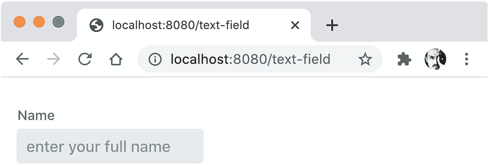

图 4-1

浏览器中呈现的一个`TextField`

大多数输入字段(或简称为字段)都包含控制字段中数据的功能。看看这段代码:

```java
textField.setAutoselect(true);
textField.setAutofocus(true);
textField.setClearButtonVisible(true);
textField.setValue("John Doe");

```

这段代码将文本字段配置为在获得焦点时自动选择组件内的所有文本(光标准备好允许输入)。它将焦点设置在字段上，以便用户可以立即开始输入，显示一个按钮来清除包含的值(字段内的 X 图标)，并在代码示例中用一个流行的名称预设文本值(至少在我的书和讲座中，尤其是讲座中)。图 [4-2](#Fig2) 显示了结果。

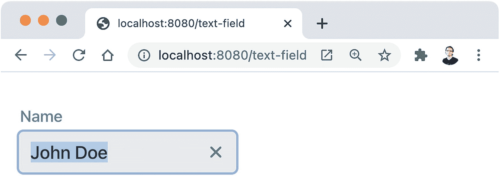

图 4-2

带有自动选择、自动对焦、清除按钮和默认值的`TextField`

这里，有另一套有用的方法:

```java
textField.setRequired(true);
textField.setMinLength(2);
textField.setMaxLength(10);
textField.setPattern("^[a-zA-Z\\s]+");
textField.setErrorMessage("Letters only. Min 2 chars");

```

这段代码激活一个可视指示器，让用户知道该字段需要一个值，并且不能留空。它还设置字段中允许的最小和最大长度，以及该值必须匹配的模式。如果模式与正则表达式不匹配，组件会显示一条错误消息。

Note

Java API for regular expressions 是在 Java 1.4 中引入的，已经成为搜索和操作文本和数据的强大工具。有很多关于这个主题的好资源。Oracle 的 Java 教程有一堂关于正则表达式的精彩课程。您可以在 [`https://docs.oracle.com/javase/tutorial/essential/regex`](https://docs.oracle.com/javase/tutorial/essential/regex) 访问该课程。 *Java 正则表达式* (Apress，2004)是一本讲述 Java 正则表达式引擎的经典之作。JRebel 的备忘单(可从 [`www.jrebel.com/resources/java-regular-expressions-cheat-sheet`](http://www.jrebel.com/resources/java-regular-expressions-cheat-sheet) 获得)是我在使用正则表达式时参考的另一个资源。

Vaadin 组件使用事件侦听器与服务器进行交互。例如，假设我们想要检查前面示例的文本字段中的值，并在值无效时显示通知。实现这一点的一种方法是在字段中添加一个*值改变监听器*:

```java
textField.addValueChangeListener(event -> {
    if (textField.isInvalid()) {
        Notification.show("Invalid name");
    }
});

```

当您按 ENTER 键或通过单击字段外部或按 TAB 键来移除焦点时，将执行 lambda 表达式。例如，当输入中有数字或少于两个字符时，lambda 表达式本身检查字段中的值是否无效，如果是，则显示一个通知。见图 [4-3](#Fig3) 。

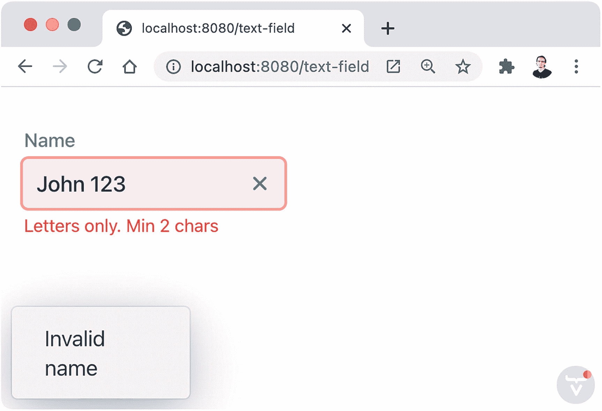

图 4-3

在`TextField`中输入验证

如果您希望在每次值发生变化时都进行处理，而不是等待回车键或焦点丢失发生，您可以按如下方式进行配置:

```java
textField.setValueChangeMode(ValueChangeMode.EAGER);

```

查看`ValueChangeMode`中每个常量的 Javadoc，了解所有可用的配置选项。

Tip

虽然大多数 ide 都能够显示 Javadoc 文档和外部库的源代码，但是你也可以在网上的 [`https://vaadin.com/api`](https://vaadin.com/api) 找到。有关如何显示 Javadoc 或导航外部库的源代码的详细信息，请参考 IDE 文档。

### 密码输入

`PasswordField`类包含了`TextField`的大部分功能，但是提供了一种方便的方式来启用密码输入。这里有一个例子:

```java
PasswordField passwordField = new PasswordField();
passwordField.setLabel("Password");
passwordField.setRevealButtonVisible(true);

```

在浏览器中，输入字符串显示为一组点。参见图 [4-4](#Fig4) 。

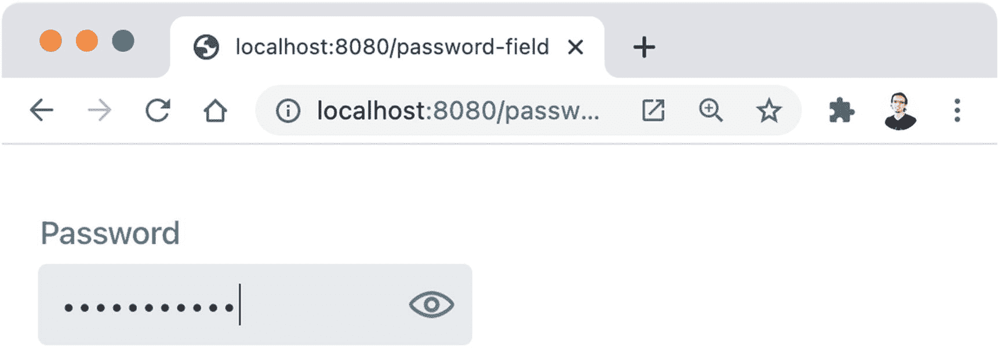

图 4-4

答`PasswordField`

如果启用了“显示”按钮(如前面的示例)，用户可以按“眼睛”按钮来查看输入的密码。参见图 [4-5](#Fig5) 。

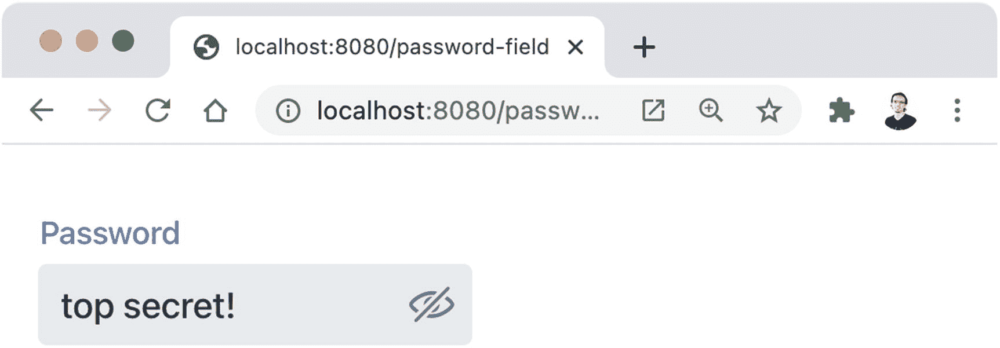

图 4-5

一个`PasswordField`随着它的内容显露出来

当您通过调用`getValue()`方法获得值时，您获得了字段中引入的实际文本(显然不是一堆点):

```java
passwordField.addValueChangeListener(event -> {
    String password = passwordField.getValue();
    System.out.println("Password: " + password);
});

```

您还可以从`event`参数中获取字段值，这样就可以将代码从包含该值的实际字段中分离出来:

```java
passwordField.addValueChangeListener(event -> {
    String password = event.getValue(); // like this
    System.out.println("Password: " + password);
});

```

这种技术适用于本章描述的所有输入字段。

### 布尔输入

`Checkbox`类封装了一个布尔值。这里有一个基本的例子:

```java
Checkbox checkbox = new Checkbox();
checkbox.setLabelAsHtml("I'm <b>learning</b> Vaadin!");

checkbox.addValueChangeListener(event -> {
    Boolean value = event.getValue();
    Notification.show("Value: " + value);
});

```

这一次，代码使用 HTML 字符串设置标签。如果不需要显示 HTML，仍然可以使用常规的`setLabel(String)`方法。

Caution

建议尽可能使用纯文本，以避免跨站点脚本攻击(也称为 XSS 攻击)。确保在将包含 HTML 的字符串传递给 UI 之前对其进行净化，尤其是当它们来自用户输入或外部服务时。开放 Web 应用安全项目(OWASP)为此提供了一个 Java 库。可以在 [`https://owasp.org/www-project-java-html-sanitizer`](https://owasp.org/www-project-java-html-sanitizer) 了解更多。

图 [4-6](#Fig6) 显示了点击组件后上一个例子的截图。

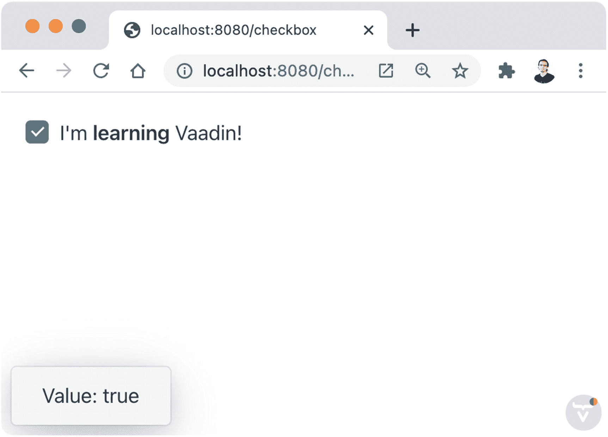

图 4-6

浏览器中呈现的一个`Checkbox`

`Checkbox`类可以采取一个初始的未确定状态来直观地提示用户他们还没有点击复选框。这不会影响复选框中存储的值。这符合复选框的 HTML5 标准。例如，以下代码将该值设置为 true，激活未确定状态，并在通知中显示该值:

```java
checkbox.setValue(true);
checkbox.setIndeterminate(true);
Boolean initialValue = checkbox.getValue();
Notification.show("Initial value: " + initialValue);

```

注意图 [4-7](#Fig7) 中显示的值是`true`(不是`null`，不是`false`)。

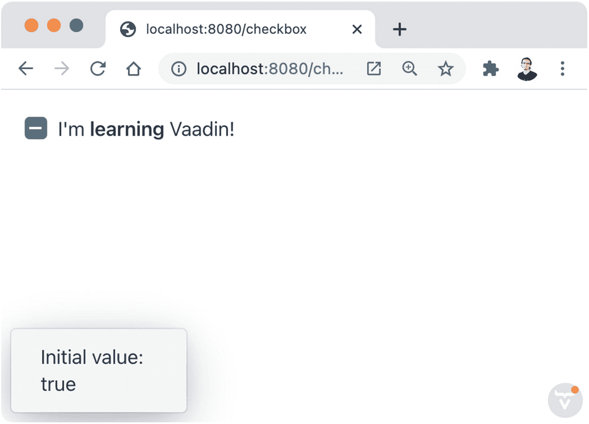

图 4-7

一个状态不确定的`Checkbox`

因为初始值是`true`，一旦你点击复选框，它的值就会变成`false`。

### 日期和时间输入

`DatePicker`类允许你显示一个日期输入的输入框。让我们使用类中的几个构造函数之一，而不是使用缺省的构造函数(当你需要它的时候它是可用的)。研究下面的例子:

```java
@Route("datepicker")
public class DatePickerView extends Composite<Component> {

    @Override
    protected Component initContent() {
        DatePicker datePicker = new DatePicker(
                "Enter a memorable date",
                LocalDate.now(),
                event -> showMessage(event.getValue())
        );

        return new VerticalLayout(datePicker);
    }

    private void showMessage(LocalDate date) {
        Notification.show(
                date + " is great!"
        );
    }
}

```

构造函数接受一个字段标签(相当于使用`setLabel(String)`方法)，后跟一个最初显示的日期值(相当于使用`setValue(LocalDate)`方法)，以及一个值更改监听器(相当于使用`addValueChangeListener(ValueChangeListener)`方法)。这一次，侦听器被实现为一个 lambda 表达式，该表达式调用一个方法并从`event`对象获取值(用户选择的日期)。图 [4-8](#Fig8) 显示了这个例子的截图。

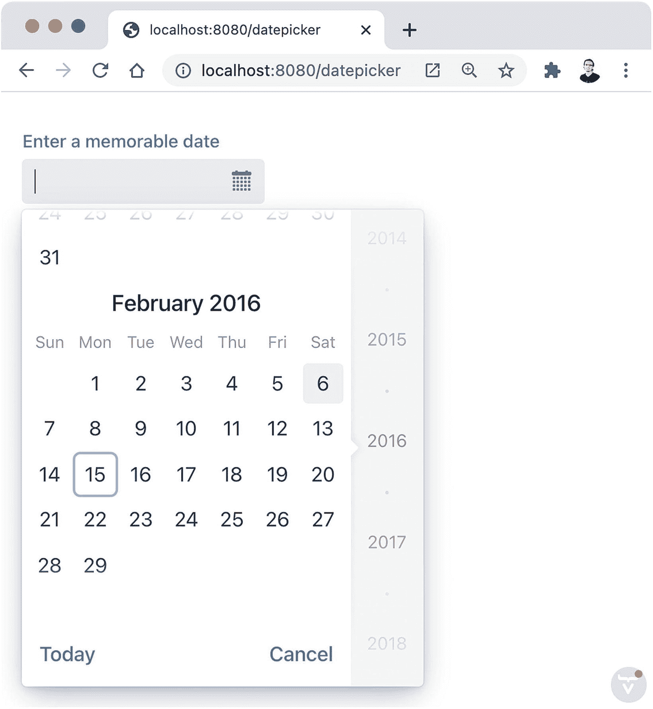

图 4-8

浏览器中呈现的一个`DatePicker`

以下是一些可用于进一步配置日期选取器的方法:

```java
// shows the calendar only when clicking on the calendar icon
// not when clicking the field
datePicker.setAutoOpen(false);

// shows an X button to clear the value
datePicker.setClearButtonVisible(true);

// sets the date that's visible when the calendar is opened
// * works only when no date value is set
datePicker.setInitialPosition(LocalDate.now().minusMonths(1));

// sets the minimum and maximum dates

datePicker.setMin(LocalDate.now().minusMonths(3));
datePicker.setMax(LocalDate.now().plusMonths(3));

```

web 应用中的一个常见需求是配置日期格式，不仅在输入组件中使用，而且在显示日期的任何地方都使用。实现这一点的最佳方式是设置组件的区域设置。例如，如果应用将由加拿大官员或政府机构使用，您可以按如下方式设置区域设置:

```java
datePicker.setLocale(Locale.CANADA);

```

如果未设置语言环境，Vaadin 会在创建新会话时配置浏览器报告的语言环境。

Caution

在写这本书的时候，没有办法直接设置一个`DatePicker`的日期格式。更多信息见 [`https://github.com/vaadin/vaadin-date-picker-flow/issues/156`](https://github.com/vaadin/vaadin-date-picker-flow/issues/156) 期。

如果需要用户输入时间，可以使用`TimePicker`类:

```java
TimePicker timePicker = new TimePicker("Pick a time");
timePicker.addValueChangeListener(event -> {
    LocalTime value = event.getValue();
    Notification.show("Time: " + value);
});

```

存储在字段中的值属于类型`LocalTime`。当您需要获取日期和时间时，您可以使用`DateTimePicker`类:

```java
DateTimePicker dateTimePicker = new DateTimePicker("When?");

```

图 [4-9](#Fig9) 显示了时间组件。`DateTimePicker`显示的是`DatePicker`旁边的`TimePicker`。

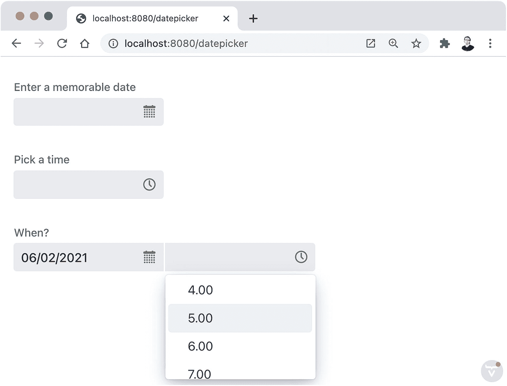

图 4-9

浏览器中呈现的一个`TimePicker`和一个`DateTimePicker`

### 数字输入

NumberField 类允许您从用户那里获取一个`Double`值。这里有一个例子:

```java
NumberField numberField = new NumberField("Rating");
numberField.setHasControls(true);
numberField.setMin(0.0);
numberField.setMax(5.0);
numberField.setStep(0.5);
numberField.setClearButtonVisible(true);
numberField.setHelperText("From 0.0 to 5.0");

numberField.addValueChangeListener(event -> {
    Double value = event.getValue();
    Notification.show("Your rating: " + value);
});

```

大多数方法都是不言自明的。您可以启用控件的可视化，以允许用户使用字段中的+和–按钮调整数值，方法是根据步长值增加或减少数值。方法允许你显示如何使用这个字段的提示。见图 [4-10](#Fig10) 。

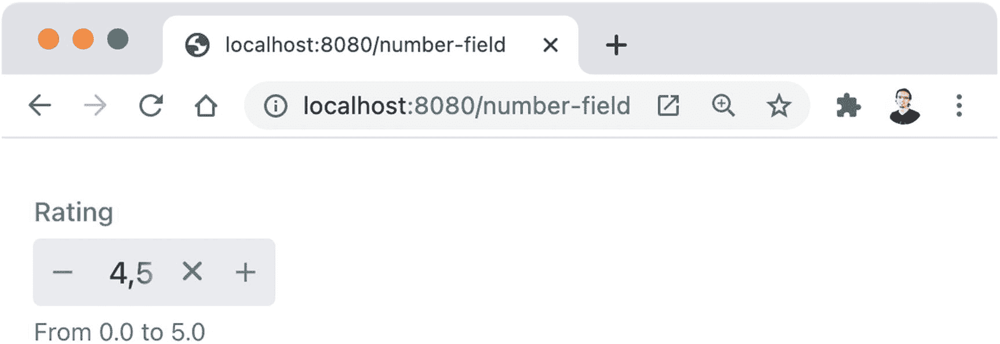

图 4-10

浏览器中呈现的一个`NumberField`

如果你需要用`Integer`而不是`Double`输入，那就用`IntegerField`类来代替。它有一个类似的 API。

### 单项选择输入

有几个组件以在定义的值之间进行选择的形式获得输入。例如，您可以使用`ComboBox`类询问用户他们在公司的哪个部门工作:

```java
ComboBox<String> comboBox = new ComboBox<>("Department");
comboBox.setItems("R&D", "Marketing", "Sales", "HR");

```

结果如图 [4-11](#Fig11) 所示。

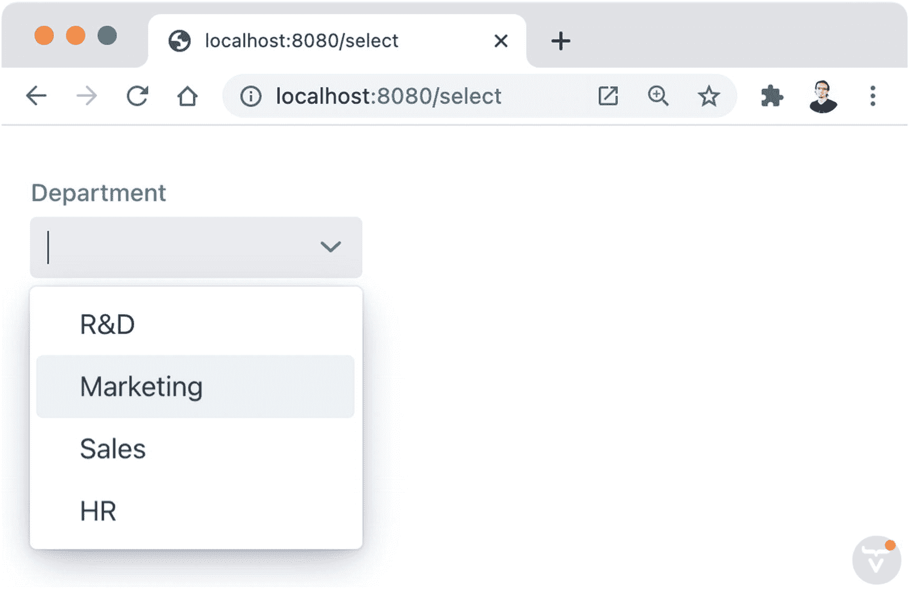

图 4-11

浏览器中的一个`ComboBox`

可用值通过使用`String`作为参数类型的`setItems(T...)`方法来设置。您可以使用任何类型作为参数。例如，您可能有一个封装部门的类或枚举，而不是将它们作为字符串:

```java
public class Department {
    private Integer id;
    private String name;

    public Department(Integer id, String name) {
        this.id = id;
        this.name = name;
    }

    @Override
    public String toString() {
        return name;
    }
}

```

在这种情况下，您可以如下使用`ComboBox`类:

```java
ComboBox<Department> comboBox = new ComboBox<>("Department");
comboBox.setItems(
        new Department(1, "R&D"),
        new Department(2, "Marketing"),
        new Department(3, "Sales")
);

```

有时，您必须配置每个选项在浏览器中显示的字符串。默认情况下，`ComboBox`类使用被指定为参数的类的`toString()`方法(本例中为`Department`)。您可以按如下方式覆盖它:

```java
comboBox.setItemLabelGenerator(Department::toString);

```

此外，您可以包含任何自定义逻辑来生成每个字符串值:

```java
comboBox.setItemLabelGenerator(department -> {
    String text = department.getName() + " department";
    return text;
});

```

结果如图 [4-12](#Fig12) 所示。

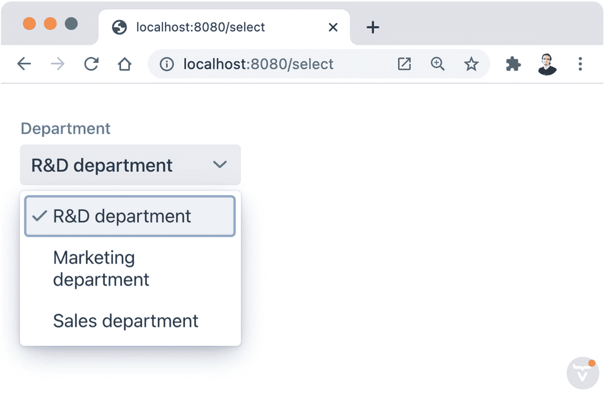

图 4-12

自定义项目标签生成器

在前面的例子中，我通过创建`Department`类的新实例来设置项目。这只是为了向您展示在输入字段中使用 JavaBean 作为条目的想法。在实际的应用中，您最有可能得到一个对象的`Collection`，您可以将它传递给`setItems`方法的一个版本。例如，如果您有一个服务类，代码可能如下所示:

```java
List<Department> list = service.getDepartments();
ComboBox<Department> comboBox = new ComboBox<>("Department");
comboBox.setItems(list);

```

这种可能性是使 Vaadin 如此强大的特性之一——您可以用普通 Java 直接从表示层访问您的后端。服务类可以使用 Hibernate/JPA(Jakarta Persistence API)、Spring、CDI(Contexts and Dependency Injection)等技术，以及在庞大且久经考验的 Java 生态系统中可用的许多其他技术。

Vaadin 中还有两个单选输入字段— `RadioButtonGroup`和`ListBox`。这里有一个`RadioButtonGroup`的例子:

```java
RadioButtonGroup<Department> radio = new RadioButtonGroup<>();
radio.setItems(list);

```

`ListBox`组件以类似的方式工作:

```java
ListBox<Department> listBox = new ListBox<>();
listBox.setItems(list);

```

这两个类的 API 类似于`ComboBox`中的 API，这使得它们几乎完全可以互换。图 [4-13](#Fig13) 显示了浏览器中的这些组件。

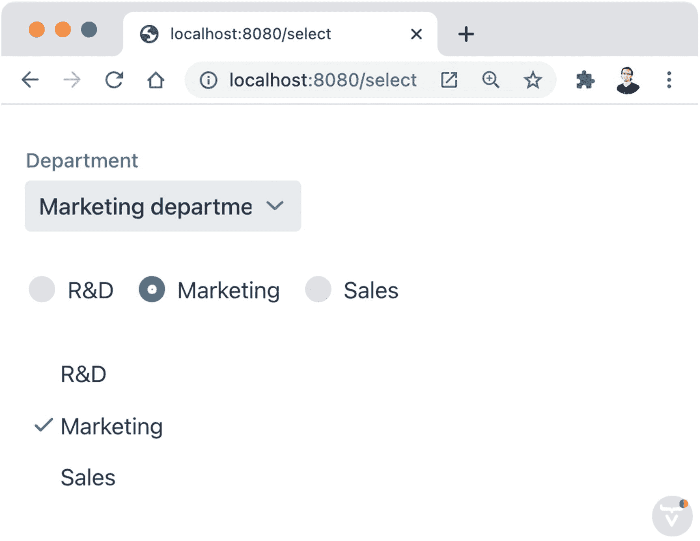

图 4-13

Vaadin 中的单选输入字段

### 多重选择输入

要允许用户从列表中选择一个或多个项目，可以使用`CheckboxGroup`和`MultiSelectListBox`类。这里有一个例子:

```java
CheckboxGroup<Department> checkboxes = new CheckboxGroup<>();
checkboxes.setItems(service.getDepartments());

MultiSelectListBox<Department> listBox = new MultiSelectListBox<>();
listBox.setItems(service.getDepartments());

```

因为这些组件允许用户选择几个值，`getValue()`方法返回一个包含所选值的`Set`:

```java
Set<Department> departments = listBox.getValue();

```

图 [4-14](#Fig14) 显示了浏览器中的这些组件。

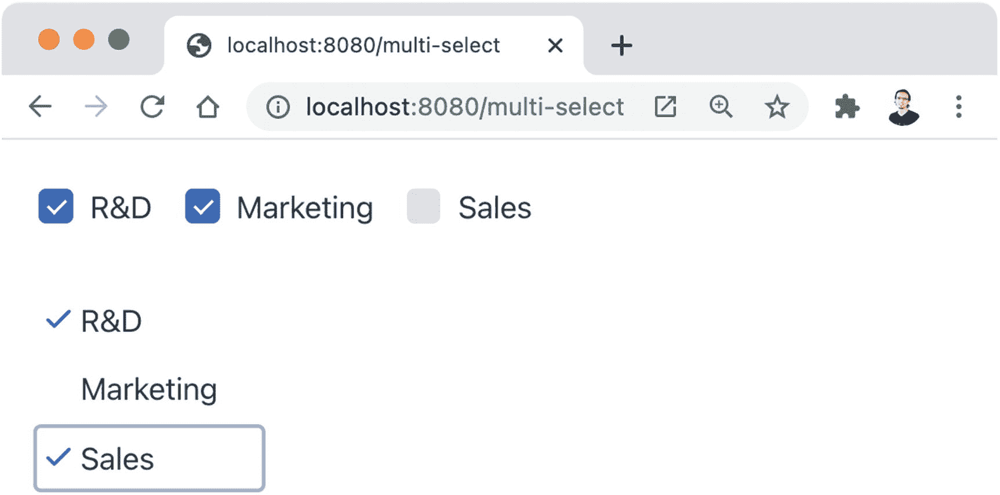

图 4-14

Vaadin 中的多选输入字段

### 文件上传

`Upload`类允许你显示一个输入域，将文件从用户的机器传输到服务器。它支持单个或多个文件，并从桌面拖放。下面是基本用法:

```java
MemoryBuffer receiver = new MemoryBuffer();
Upload upload = new Upload(receiver);
upload.addSucceededListener(event -> {
    InputStream in = receiver.getInputStream();
    ... read the data from in ...
});

```

`MemoryBuffer`类是`Receiver`接口的一个实现。该接口用于向`Upload`组件提供一种写入上传数据的方式。有几种实现方式:

*   `MemoryBuffer`:将数据存储在存储器中

*   `FileBuffer`:使用`File.createTempFile(String, String)`方法创建一个`File`

*   `MultiFileMemoryBuffer`:多个文件上传，将数据存储在内存中

*   `MultiFileBuffer`:使用`File.createTempFile(String, String)`方法创建多个`File`

假设我们想做一个程序来计算字母 A 在一个纯文本文件中出现的次数。这需要限制接受文件的类型并处理其内容。让我们从处理部分开始:

```java
upload.addSucceededListener(event -> {
    InputStream in = receiver.getInputStream();
    long count = new Scanner(in).findAll("[Aa]").count();
    Notification.show("A x " + count + " times");
});

```

当用户上传一个文件时，监听器从`Receiver`获取`InputStream`，并使用 Java `Scanner`查找字母 a 的所有出现次数，然后在通知中显示结果。参见图 [4-15](#Fig15) 。

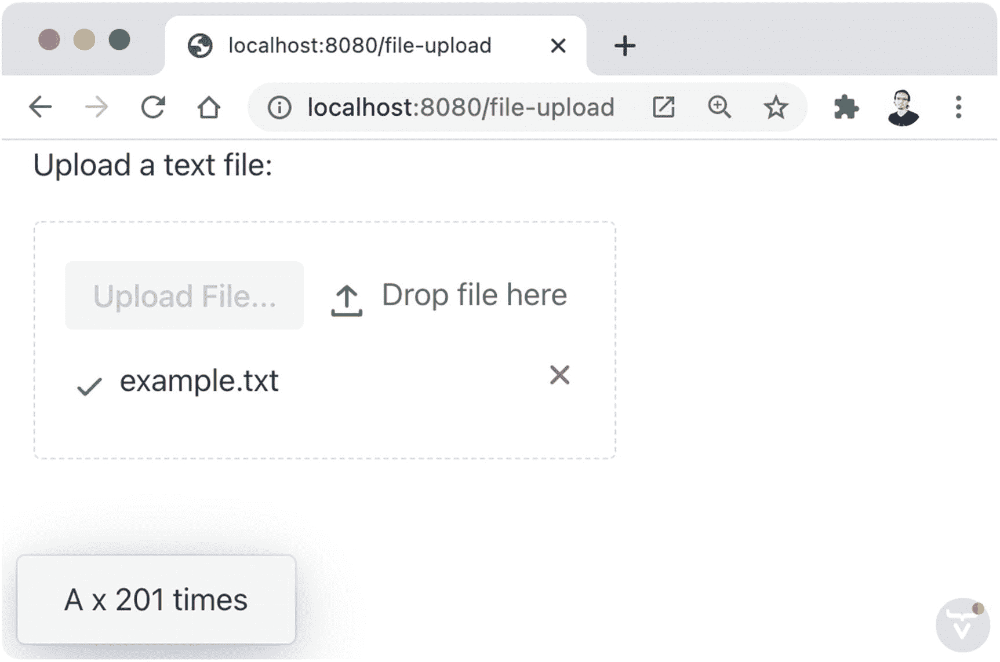

图 4-15

浏览器中呈现的一个`Upload`组件

当用户点击*上传文件时...点击*按钮，会出现一个标准的文件选择器，用户可以在他们的硬盘中选择一个文件。默认情况下允许所有文件。要对此加以限制，您可以设置想要接受的 MIME 类型。例如，纯文本文件的 MIME 类型是`text/plain`:

```java
upload.setAcceptedFileTypes("text/plain");

```

图 [4-16](#Fig16) 显示了如何在 macOS 系统上禁用(灰显)图像文件(JPG)供选择。


图 4-16

macOS 上仅接受文本文件的文件选择器示例

## 交互组件

交互组件允许用户触发应用中的动作。例如，在表单中保存数据或导航到另一个 URL。

### 小跟班

在前一章我们已经看到了按钮，但是我们并没有真正研究它们。到目前为止，您很可能已经猜到了按钮的基本用法(如果我已经很好地完成了我的工作，至少，我真心希望我做到了)。无论如何，这就是:

```java
Button button = new Button("Time in the server, please");
button.addClickListener(event ->
    Notification.show("Sure: " + LocalTime.now())
);

```

代码很容易理解。当单击按钮时，lambda 表达式中的代码在服务器中执行。您可以使用构造函数添加点击侦听器:

```java
Button button = new Button("Time in the server", event ->
    Notification.show("Sure: " + LocalTime.now())
);

```

Tip

我更喜欢通过使用相应的方法而不是构造函数来显式地添加点击侦听器和任何其他类型的事件侦听器。在书籍、教程和演示中，我使用更紧凑的版本，因为我在那里(虚拟地或亲自地)解释代码。然而，在现实生活中的项目中，代码的大小和复杂性可能会增加，我喜欢代码为我说话的清晰性。不仅帮助其他开发者，也帮助我自己。我记得有一次，我试图找到某个按钮被点击时执行的代码。我用我的 IDE 在一堆源文件中搜索“clickListener”。幸运的是，我只有一根火柴。不幸的是，这是错误的按钮。有问题的按钮有一个来自数据库的标题，所以我无法通过它进行搜索。这个按钮可能被命名为“按钮”、“b”或类似的名称。再做一点工作，我找到了实例，并注意到 click listener 是使用构造函数添加的。

假设您希望应用只显示一次时间(为了简单起见，每次页面刷新)。您可以使用`setEnabled(boolean)`方法隐藏点击监听器中的按钮，如下所示:

```java
Button button = new Button("Time in the server", event -> {
    Notification.show("Sure: " + LocalTime.now());
    event.getSource().setVisible(false);
});

```

我们不能使用`button`实例，因为它还没有被定义。相反，您可以使用`getSource()`方法来获取触发事件的组件。

或者，您可以调用`setEnabled(false)`来禁用按钮，而不是完全隐藏它，以避免改变视图的整体外观。如果是这种情况，在点击后禁用按钮的更好方法是使用`setDisableOnClick(boolean)`方法:

```java
button.setDisableOnClick(true);

```

图 [4-17](#Fig17) 显示了浏览器中的示例。

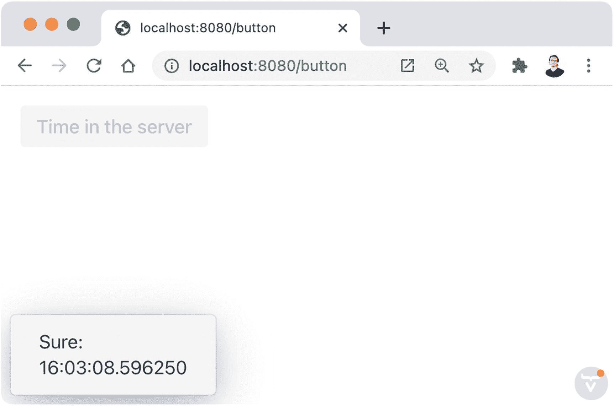

图 4-17

浏览器中呈现的禁用的`Button`

### 事件是如何发送到服务器的？

当用户单击添加了侦听器的组件时，单击侦听器允许您在服务器中运行代码。事实上，当浏览器中发生某个动作时，所有侦听器都会调用服务器中的代码，例如，单击、获得焦点、按键，甚至当组件附加到视图时。您将在 Vaadin 的许多 UI 组件中找到这些事件的方法。

我们知道所有与 web 应用的交互都是通过 HTTP 请求发生的(或者我们将在第 [8](08.html) 章看到的 WebSocket)。如果我们使用网络浏览器的开发工具，我们可以看到当你点击一个按钮时发出的请求。图 [4-18](#Fig18) 显示了当你点击前一个例子中的按钮时，Vaadin 发送给服务器的请求。

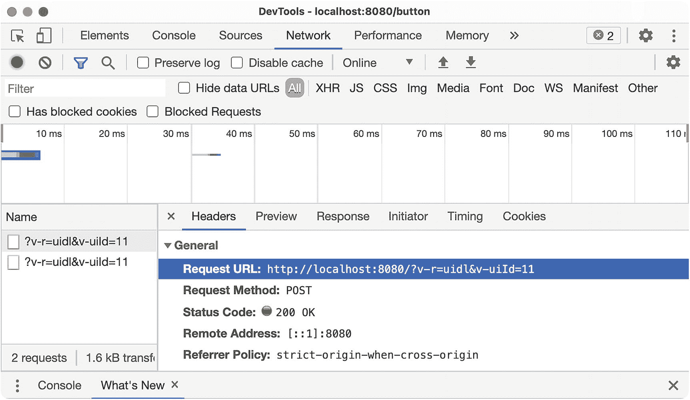

图 4-18

点击事件后的 HTTP 请求

请求 URL 包括两个参数。您可以按如下方式读取这些参数及其值:

*   **V-R = uidl:**A**V**aadin**R**equest of type**U**ser**I**interface**D**定义 **L** 语言这表明该请求旨在处理 UI 状态的变化。

*   V-uiId = 11:Vaadin**U**ser**I**接口 **Id** 标识符。这指示已更改的用户界面的数字标识符；在这种情况下，UI 的标识符被指定为 11。如果您在不同的浏览器选项卡中打开视图，您应该得到不同的值。

这些参数指向`VaadinServlet`类，该类又委托给更专门的类。然后，Vaadin 获取请求的有效负载，并相应地对其进行处理。有效载荷以 JSON 格式发送，如图 [4-19](#Fig19) 所示。

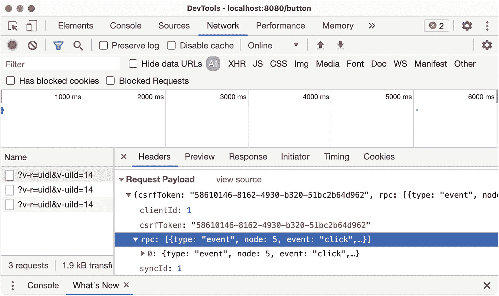

图 4-19

uidl 请求的负载

有效负载包括 UI 中关于更改的所有细节。在这种情况下，单击事件。它还包括事件发生的节点(或组件)(在本例中，按钮被分配了 ID 5)。有了这些信息，Vaadin 就可以在组件树中导航，找到 ID 为 5 的组件，并调用任何可能已经添加到其中的 click 侦听器。

如果您检查响应(在图 [4-19](#Fig19) 所示的响应选项卡中)，您将会看到如下内容(出于清晰和间隔的原因，大部分内容已被省略):

```java
for (;;);
 [{
      "syncId": 2,
      "clientId": 2,
      ...
      "changes": [{
            "node": 5,
            "type": "put",
            "key": "disabled",
            "feat": 3,
            "value": ""
      },
      ...
      {
            "node": 8,
            "type": "put",
            "key": "innerHTML",
            "feat": 1,
            "value": "Sure: 17:19:17.323399"
      }, {
            "node": 9,
            "type": "attach"
      }, {
            "node": 9,
            "type": "put",
            "key": "tag",
            "feat": 0,
            "value": "vaadin-notification"
      },
      ...
      ],
      "timings": [668, 2]
}]

```

响应也是 JSON 格式的，包括请求处理后应该在视图中进行的更改的信息。例如，响应声明应该禁用节点 ID 5(按钮)，并且应该附加文本为“Sure: 17:19:17.323399”的通知(如图所示)。这些正是我们在前一节的例子中在点击监听器中编程的东西。

### 链接

链接(或锚点)允许用户请求不同的 URL。它可以是应用中的 URL，也可以是外部网站。这里有一个不要脸塞的例子:

```java
Anchor blogLink = new Anchor("https://www.programmingbrain.com",
        "Visit my technical blog");

```

您可以使用 UI 组件来代替字符串:

```java
Anchor vaadinLink = new Anchor("https://vaadin.com",
        new Button("Visit vaadin.com"));

```

最后，您可以在运行时生成内容。例如，以下代码创建一个链接，该链接指向运行时在服务器中生成的文本文件:

```java
Anchor textLink = new Anchor(new StreamResource(
        "text.txt",
        () -> {
            String content = "Time: " + LocalTime.now();
            return new StringInputStream(
                    content, Charset.defaultCharset());
        }
), "Server-generated text");

```

当用户点击最后一个锚点时，会生成一个名为 *text.txt* 的新文件，并将其返回给浏览器。Chrome 将这个文件下载到客户机的硬盘上。图 [4-20](#Fig20) 显示了之前示例中的锚。

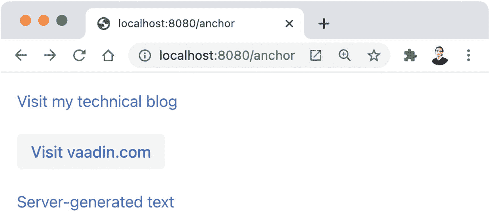

图 4-20

浏览器中的`Anchor`组件

### 菜单

虽然在移动优先的应用中并不流行，但菜单在商业应用中有很大的用途，这些应用通常几乎只在桌面浏览器上使用。即使在移动优先的应用中，你也可以找到显示“...”的典型按钮这告诉用户有更多的选择。Vaadin 包括在 web 应用中显示顶级、多级和上下文菜单的组件。

从顶层开始，使用以下结构构建菜单:

```java
MenuBar > MenuItem > SubMenu > MenuItem > SubMenu > MenuItem > ...

```

一旦你研究了一个例子，这就变得更有意义了:

```java
MenuBar menuBar = new MenuBar();

MenuItem file = menuBar.addItem("File");
file.getSubMenu().addItem("New");
file.getSubMenu().addItem("Open");

MenuItem edit = menuBar.addItem("Edit");
edit.getSubMenu().addItem("Copy");
edit.getSubMenu().addItem("Paste");

```

结果如图 [4-21](#Fig21) 所示。

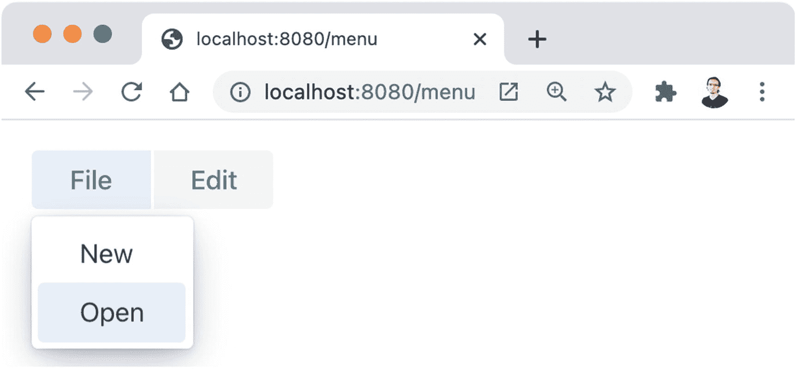

图 4-21

两级菜单

每个包含文本的选项都是一个`MenuItem`。如果你想创建更多的关卡，你必须从一个`MenuItem`中获取`SubMenu`并向其添加更多的`MenuItem`对象。您可以根据需要设置多个级别。

使用`MenuItem`的构造函数或`addClickListener(ComponentEventListener)`方法添加一个点击监听器，当用户点击一个项目时执行代码:

```java
edit.getSubMenu().addItem("Copy", event ->
        Notification.show("Copy selected"));

MenuItem paste = edit.getSubMenu().addItem("Paste");
paste.addClickListener(event ->
        Notification.show("Paste selected"));

```

您还可以使用`setEnable(boolean)`方法启用或禁用项目，或者使用`setCheckable(boolean)`方法使它们可切换。

要添加上下文菜单(当用户右键单击一个组件时显示的菜单)，可以使用`ContextMenu`类并指定一个目标，通常是一个布局组件，用户可以右键单击它来查看菜单:

```java
HorizontalLayout target = new HorizontalLayout(
        new Text("Right click here")
);
ContextMenu contextMenu = new ContextMenu(target);
contextMenu.addItem("Copy");
contextMenu.addItem("Paste");

```

您可以将 click listeners 添加到项目中，并根据需要在上下文菜单中设置多个级别。图 [4-22](#Fig22) 显示了浏览器中的上下文菜单。

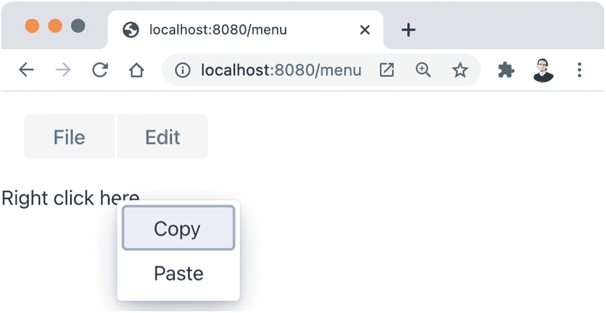

图 4-22

浏览器中的一个`ContextMenu`

## 可视化组件

本章的最后一节介绍了交互式组件，最后一节介绍了一些交互性不强的组件，它们有助于丰富向用户呈现数据的方式。让我们来看看它们。

### 通知和对话框

在这一章中，我们一直在使用`Notification`类，但是它比我们目前所看到的要多。为了了解它的更多特性，让我们定义一些需求。假设我们必须显示一个通知

*   单击视图中的按钮时会显示

*   如果是第一次显示，则保持可见

*   可以通过点击里面的按钮来关闭

*   如果之前显示过，2 秒钟后消失

*   显示在页面的中央

事实是，我认为你有知识和经验来实现这一点。你敢自己去实施吗？试试看！

当你决定尝试这个练习时，让我给你讲个小故事。我在芬兰图尔库的一个下雨的周六晚上写下了这篇文章。我的全职工作没有让我在工作日有太多时间来写这本书，所以我决定在周六全力以赴完成这一章。公式很简单——我从一个代码示例开始，然后将我对它的抽象想法转化为文字。棘手的部分是实际开始写代码和段落，但一旦我开始，想法和文字就流动起来，我就把事情做完了。然后就是练习，到最后，练习总会有回报。现在去打开你的 IDE，用 Vaadin 做一些练习。

我接受的不做这个练习的唯一借口是，你正在飞机上读这篇文章，没有笔记本电脑或互联网连接。因此，清单 [4-1](#PC42) 给出了一个可能的解决方案。我希望你的比我的更好。

```java
import com.vaadin.flow.component.Component;
import com.vaadin.flow.component.Composite;
import com.vaadin.flow.component.Text;
import com.vaadin.flow.component.button.Button;
import com.vaadin.flow.component.notification.Notification;
import com.vaadin.flow.component.orderedlayout.VerticalLayout;
import com.vaadin.flow.router.Route;

@Route("notification")
public class NotificationView extends Composite<Component> {

  private boolean firstTime = true;

  @Override
  protected Component initContent() {
    return new VerticalLayout(
        new Button("Notification", event -> {
          Notification notification = new Notification();
          notification.add(new VerticalLayout(
              new Text("Here it is!")));
          notification.setPosition(Notification.Position.MIDDLE);

          if (firstTime) {
            notification.setDuration(0);
            notification.add(new Button("Close", e ->
                notification.close()));
          } else {
            notification.setDuration(2000);
          }

          firstTime = false;
          notification.open();
        })
    );
  }

}

Listing 4-1Some of the features of the Notification class

```

弹出对话框类似于通知，但是它们有更多的功能。这里有一个基本的例子:

```java
new Dialog(
    new VerticalLayout(
        new H2("Title"),
        new Text("Text!"),
        new Button("Button!!!")
    )
).open();

```

默认情况下，用户可以在对话框打开时与应用的其他部分进行交互。您可以通过使其模式化来改变这一点:

```java
dialog.setModal(true);

```

如果您想避免当用户在对话框外单击时对话框消失，您可以使用以下方法:

```java
dialog.setCloseOnOutsideClick(false);

```

在这种情况下，您可能应该提供一种关闭对话框的方法。一种方法是使用 ESC 键关闭它:

```java
dialog.setCloseOnEsc(true);

```

最后，您可以使对话框可拖动，如下所示:

```java
dialog.setDraggable(true);

```

图 [4-23](#Fig23) 显示了浏览器中的一个对话框。

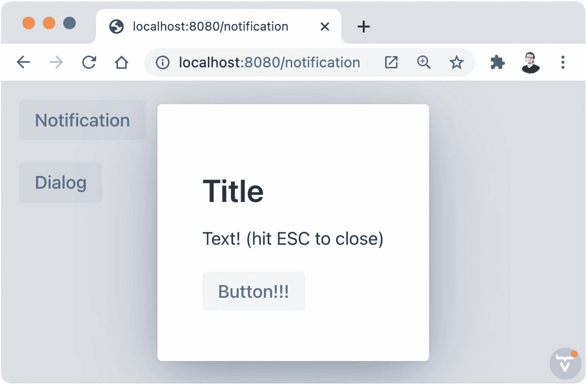

图 4-23

浏览器中呈现的一个`Dialog`

### 制表符

选项卡是允许用户在与共享主题相关的视图之间移动的好方法。在 Vaadin 中，选项卡只是一种以选项卡样式显示一组“按钮”的方式，由程序员决定对这些按钮上的单击做出反应，最有可能的是，当每个选项卡按钮被单击(或选择)时，在视图中显示不同的布局。这里有一个基本的例子:

```java
Tab order = new Tab("Order");
Tab delivery = new Tab("Delivery");
Tabs tabs = new Tabs(order, delivery);

```

结果如图 [4-24](#Fig24) 所示。

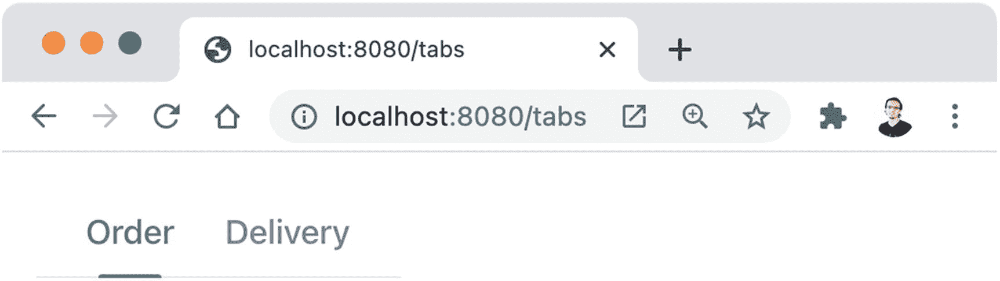

图 4-24

在浏览器中呈现的`Tabs`组件

标签的内容在哪里？就像我之前提到的,`Tabs`组件不包含这个功能。不幸的是。

Tip

在 Vaadin 8 和更早的版本中，选项卡组件的 API 包括一个容器和所有逻辑，当选择一个选项卡时，这些逻辑可以在“页面”之间自动切换。如果您来自这些版本的 Vaadin，并且错过了这种行为，您可能想看看由本书作者开发和维护的位于 [`https://vaadin.com/directory/component/paged-tabs`](https://vaadin.com/directory/component/paged-tabs) 的 Vaadin 目录中的开源免费分页标签组件。哈！两个无耻的插头在一个章节里。

要使标签有用，您必须实现逻辑，使它们按照您的意愿工作。最常见的是，这意味着当选项卡被选中时显示不同的组件。这可以使用侦听器来实现。这里有一个例子:

```java
VerticalLayout tabsContainer = new VerticalLayout();

Tab order = new Tab("Order");
Tab delivery = new Tab("Delivery");
Tabs tabs = new Tabs(order, delivery);

tabs.addSelectedChangeListener(event -> {
  Tab selected = event.getSelectedTab();
  tabsContainer.removeAll();

  if (order.equals(selected)) {
    tabsContainer.add(buildOrderTab());
  } else if (delivery.equals(selected)) {
    tabsContainer.add(buildDeliveryTab());
  }
});

```

`buildOrderTab()`和`buildDeliveryTab()`方法可以返回包含您想要显示的组件的任何布局。该代码使用 if else if 结构，您可以根据需要向其中添加更多事例。或者，您可以使用一个`Map`来匹配标签和布局，以显示或实现您想要在布局之间切换的任何算法。你可以在 [`https://vaadin.com/components/vaadin-tabs/java-examples`](https://vaadin.com/components/vaadin-tabs/java-examples) 找到例子。

Caution

前面的例子有一个错误。当您请求查看时，*订单*选项卡不显示其内容。选择更改侦听器尚未启动。你能解决这个问题吗？提示:将逻辑提取到一个单独的方法中。

### 核标准情报中心

Vaadin 带有一套 600 多个现成的图标。您可以创建图标并将其添加到任何布局中:

```java
Icon icon = VaadinIcon.YOUTUBE.create();
layout.add(icon);

```

像大多数 UI 组件(包括我们在本章中看到的所有组件)一样，您可以设置它的大小:

```java
icon.setSize("4em");

```

许多 UI 组件都包含了`setIcon(Icon)`方法。例如，下面是如何将图标添加到按钮:

```java
Button button = new Button("Edit");
button.setIcon(VaadinIcon.EDIT.create());

```

您可以将这两行合并成一行:

```java
Button button = new Button("Edit", VaadinIcon.EDIT.create());

```

图 [4-25](#Fig25) 显示了这些组件的屏幕截图。

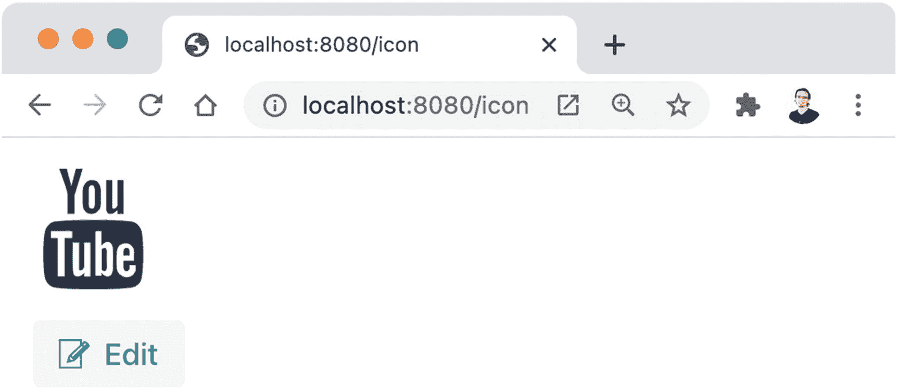

图 4-25

浏览器中呈现的 Vaadin 图标

Tip

在 [`https://vaadin.com/components/vaadin-icons/java-examples`](https://vaadin.com/components/vaadin-icons/java-examples) 可以看到所有图标。

### 形象

在 Vaadin 应用中有两种显示图像的方式。如果您有一个指向图像文件的 URL(内部或外部),您可以简单地创建一个图像组件，如下所示:

```java
Image photo = new Image(
    "https://live.staticflickr.com/65535/50969482201_be1163c6f1_b.jpg",
    "Funny dog"
);
photo.setWidthFull();

```

在构造函数中的 URL 之后，您可以(也应该)传递一个替换文本，如果图像无法显示，web 浏览器可以使用该文本。前面的示例还设置了图像的宽度，以使用尽可能多的水平空间。

如果图像文件来自数据库或文件系统，您可以使用`InputStream`来读取数据。例如，如果您将一个文件放在 Maven 项目的标准 *resources* 目录中，您可以创建一个如下所示的映像:

```java
StreamResource source = new StreamResource("logo", () ->
    getClass().getClassLoader()
        .getResourceAsStream("vaadin-logo.png")
);

Image logo = new Image(source, "Logo");
logo.setWidth("20%");

```

图 [4-26](#Fig26) 可以看到 Vaadin 的 logo 和搞笑狗。

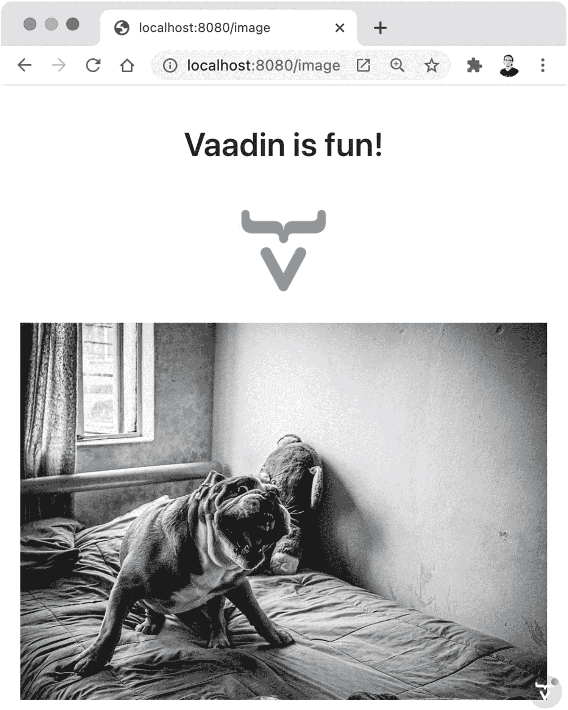

图 4-26

浏览器中呈现的两个`Image`组件

## 摘要

本章向您介绍了在 Vaadin 中用于数据输入、交互和可视化的大多数 UI 组件的关键知识。您了解了输入组件如何工作，如何从用户那里获得不同类型的值，包括字符串、日期、文件等等。当用户与应用交互时，JSON 消息是如何在客户机和服务器之间发送的。您还了解了如何显示通知、弹出对话框、图标和图像，但是请记住，Vaadin 中的 UI 组件比本章的篇幅所能显示的要多。Vaadin 在不断发展，因此新版本中会添加新的 UI 组件。您可以在 [`https://vaadin.com/components`](https://vaadin.com/components) 浏览所有组件及其 API。

下一章将探讨业务应用中的一个关键概念:数据绑定——一种将 Java bean 中的值与输入 UI 组件中的值连接起来的机制。