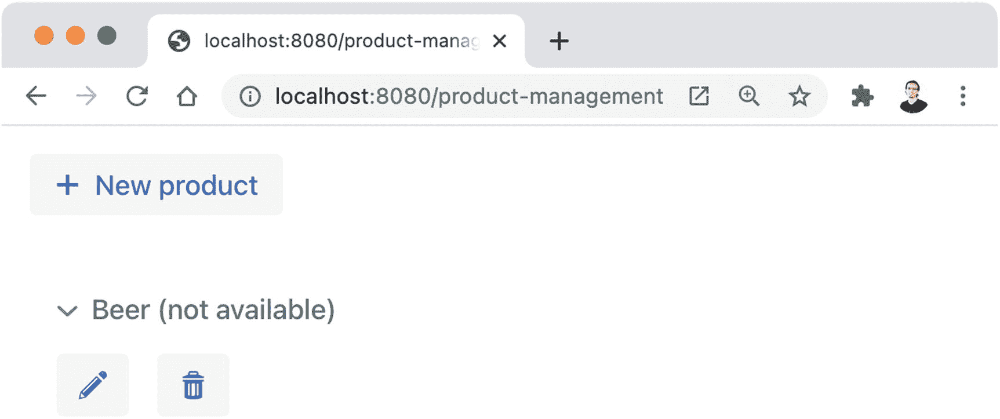
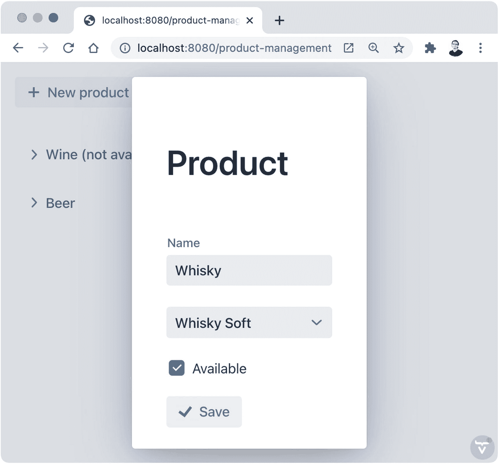
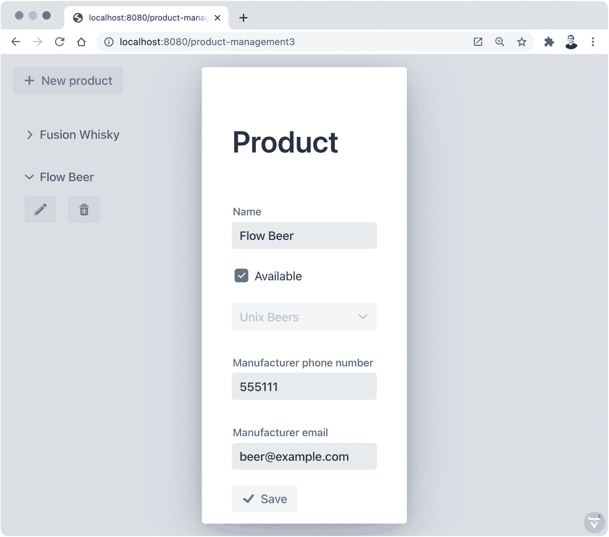
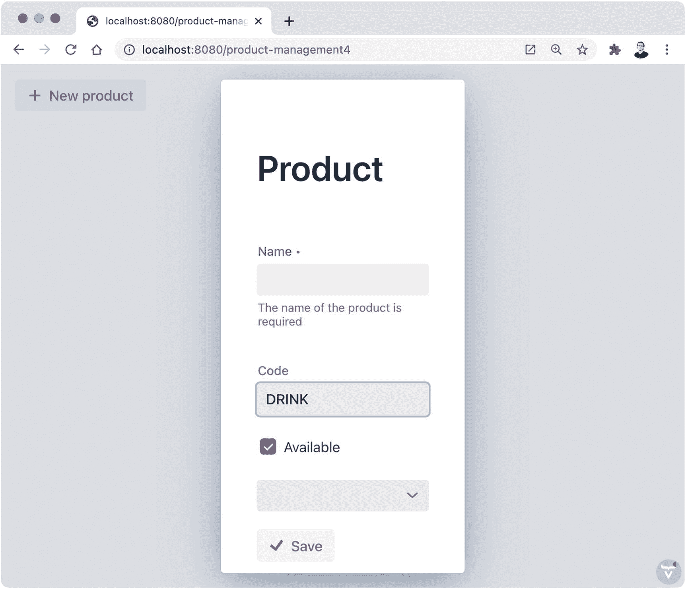

# 5.数据绑定

Vaadin 经常用于实现业务应用程序的表示层。这种应用程序处理通常被建模为一组域类的数据。例如，在一个电子商务应用程序中，您可能会发现诸如`Item`、`Cart`、`Order`、`Customer`、`Payment`等类似的类。表示层作为一种媒介来呈现来自域对象的数据，并将来自用户的数据捕获到域对象中，后端可以使用这些对象来运行任何业务逻辑。

数据从外部服务或用户界面到达应用程序。在最后一种情况下，输入组件中的值需要在业务对象的属性中设置。例如,`TextField`中客户姓名的值(在用户注册用例中)应该设置在`Customer`类的`name`属性中。正如您在前一章中了解到的，您可以使用`getValue()`方法来实现这一点。同样的事情发生在相反的方向。例如，为了允许用户更新他们的名字，您可以从数据库中读取存储的值，并使用`setValue(String)`方法将其显示在一个`TextField`中。

*数据绑定*是将 Java 属性中的值与输入组件中的值连接起来的过程，以及该过程中可能出现的所有错综复杂的情况。这包括验证输入和将数据从表示层支持的格式转换成后端服务所需的格式。

## 手动实现数据绑定

让我们将我们目前所学的一些概念应用到一个假想的销售点(POS)软件中，实现一个简单的视图来管理产品。这类软件的中心思想是产品。假设我们被指派实现一个 UI 来管理产品。UI 应该包括所有产品的列表，每个产品都有一个编辑和删除它的选项，以及一个创建新产品的按钮。

### 实现领域模型

让我们省略任何连接数据库的逻辑，使用一个`Set`将产品保存在内存中。你会从哪里开始？在我的例子中，我会从域模型开始，所以为了简单起见，这里有一个域类的实现来封装 POS 软件所需的数据:

```java
public class Product {

  private String name;
  private boolean available = true;
  private Manufacturer manufacturer;
  public Product() {
  }

  ... getters and setters ...

}

public class Manufacturer {

  private String name;
  private String phoneNumber;
  private String email;

  public Manufacturer() {
  }

  public Manufacturer(String name, String phoneNumber,
      String email) {
    this.name = name;
    this.phoneNumber = phoneNumber;
    this.email = email;
  }

  ... getters and setters ...

}

```

### 实现视图

下一步是什么？说到 UI，我通常从视图级开始——用`@Route`注释的类。我们需要产品的静态`Set`，制造商的`Set`，以及展示产品的布局。静态集，因为我们希望确保所有用户使用相同的数据。为了简单起见，让我们在一个静态块中定义所有的制造商(这个版本的 POS 软件不包括制造商管理)。那么，下面呢？

```java
public class ProductManagementView extends Composite<Component> {

  private static Set<Product> products = new HashSet<>();
  private static Set<Manufacturer> manufacturers =
      new HashSet<>();
  private VerticalLayout productsLayout = new VerticalLayout();

  static {
    manufacturers.add(new Manufacturer("Unix Beers", "555111",
        "beer@example.com"));
    manufacturers.add(new Manufacturer("Whisky Soft", "555222",
        "whisky@example.com"));
    manufacturers.add(new Manufacturer("Wines Java", "555333",
        "wine@example.com"));
  }

}

```

在我们开始编码之前，让我们停下来想一想。这门课我们需要哪些操作？我们需要

*   初始化内容

*   用户创建、编辑或删除产品时，随时更新产品列表

*   当用户单击给定产品中的“新建”按钮或“更新”按钮时显示表单

*   保存和删除产品

考虑到这一点，我们可以向`ProductManagementView`类添加以下方法:

```java
@Override
protected Component initContent() {
}

private void updateList() {
}

private void showProductForm(Product product) {
}

private void delete(Product product) {
}

private void save(Product product) {
}

```

现在让我们开始一次编写一个方法。方法应该返回视图的布局。它还应该更新产品列表，以便它们在页面刷新时可见:

```java
@Override
protected Component initContent() {
  updateList();
  return new VerticalLayout(
      new Button("New product", VaadinIcon.PLUS.create(),
          event -> showProductForm(new Product())),
      productsLayout
  );
}

```

这将显示一个创建新产品的按钮(注意我们如何调用相应的方法传递新产品)和带有产品列表的布局(`productsLayout`)。接下来是`updateList()`法。为了“刷新”产品列表，我们可以通过删除`productsLayout`组件中的所有组件来重建列表，并一次添加一个产品:

```java
private void updateList() {
  productsLayout.removeAll();
  products.stream()
      .map(product -> new Details(
          product.getName() +
              (product.isAvailable() ? "" : " (not available)"),
          new HorizontalLayout(
              new Button(VaadinIcon.PENCIL.create(),
                  event -> showProductForm(product)),
              new Button(VaadinIcon.TRASH.create(),
                  event -> delete(product))
          )
      ))
      .forEach(productsLayout::add);
}

```

这段代码使用一个 Java 流来获取`products`集合中的每个产品，并将其“转换”成一个我们还没有涉及到的 UI 组件。惊喜！`Details`组件是一个可扩展的面板，用于显示和隐藏内容。在这个例子中，带有两个`Button`的`HorizontalLayout`是隐藏的，直到用户点击标题(见图 [5-1](#Fig1) )。每个产品都被映射到一个带有产品和动作按钮信息的`Details`组件，然后被添加到`productsLayout`实例中。



图 5-1

`Details`组件。点击标题(啤酒)显示按钮

让我们继续展示表单。为此，我们将把表单的实际实现委托给一个单独的类(`ProductForm`)，我们将很快开发这个类。这样做是有意义的，因为我们可能希望在应用程序的其他部分重用该表单。下面是`showProduct(Product)`方法的实现:

```java
private void showProductForm(Product product) {
  Dialog dialog = new Dialog();
  dialog.setModal(true);
  dialog.open();

  dialog.add(new ProductForm(product, manufacturers, () -> {
    dialog.close();
    save(product);
  }));
}

```

该方法首先创建并配置一个新的`Dialog`并添加下一个即将诞生的`ProductForm`类的实例。我实现这段代码的方式和我现在描述的完全一样。我通常倾向于在实现类本身之前编写使用类(该类的客户端)的代码。这样，我可以专注于我需要的那个类的 API。我认为 ProductForm 类的构造函数可以接受我希望在表单中显示的产品(新产品或现有产品)、可用制造商列表，以及当用户在表单中保存产品时执行我的代码的回调。因此，当用户完成表单时，我可以关闭对话框，并使用作为 lambda 表达式实现的回调来保存产品。在我们进入实际的`ProductForm`类之前，这里是`save(Product)`和`delete(Product)`方法的实现:

```java
private void save(Product product) {
  products.add(product);
  updateList();
  Notification.show("Product saved: " + product.getName());
}

private void delete(Product product) {
  products.remove(product);
  updateList();
  Notification.show("Product deleted");
}

```

这里没有惊喜成分。这两个方法在静态`Set`中添加或删除产品，更新列表以反映 UI 中的变化，并显示一个通知，通知用户操作已成功完成。

### 实现表单

现在让我们在实现`ProductForm`类时讨论数据绑定。这个类连接(绑定)到一个`Product`实例(bean)。更具体地说，我们希望将`Product`的属性与表单中的输入字段连接起来。当我们创建一个`ProductForm`时，输入字段应该显示 bean 中属性的值。例如，我们需要一个`TextField`来引入或编辑`Product`类中的`name`属性。类似地，当`TextField`中的值改变时，我们需要更新`name`属性。

让我们从定义我们需要的输入组件和数据开始。我们将它们作为属性添加到类中，因为我们以后需要访问它们:

```java
public class ProductForm extends Composite<Component> {

  private final SerializableRunnable saveListener;
  private Product product;

  private TextField name = new TextField("Name");
  private ComboBox<Manufacturer> manufacturer = new ComboBox<>();
  private Checkbox available = new Checkbox("Available");

}

```

顾名思义，`SerializableRunnable`是`Runnable`的可序列化版本。这允许我们对这个类(比如我们在上一节开发的`ProductManagementView`类)的客户端执行回调，并给它们机会处理`product`实例中的数据。我们还有一个代表名称的`TextField`，一个代表制造商的`ComboBox`，以及一个代表产品可用性的`Checkbox`。

Tip

当你在 UI 类中保存对对象的引用时，使用`Serializable`类。例如，当您在 Apache Tomcat 等服务器中使用会话持久性来允许会话在重启后存储在硬盘中时，这是必需的。Vaadin 中包含的所有 UI 组件和其他助手类都实现了`Serializable`。

在上一节中，我们决定这个类应该在构造函数中接受一个`Product`实例(以`SerializableRunnable`的形式与侦听器一起)。为了实现从`Product`到输入字段方向的绑定，我们可以从构造函数中的`Product` bean 的相应 Java 属性中设置每个输入字段的值，如下所示:

```java
public ProductForm(Product product,
    Set<Manufacturer> manufacturers,
    SerializableRunnable saveListener) {
  this.product = product;
  this.saveListener = saveListener;

  manufacturer.setItems(manufacturers);
  manufacturer.setItemLabelGenerator(Manufacturer::getName);

  if (product.getName() != null) {
    name.setValue(product.getName());
    manufacturer.setValue(product.getManufacturer());
    available.setValue(product.isAvailable());
  }
}

```

构造函数中的前两行将值赋给类的实例字段，这样我们以后可以在其他方法中使用它们。然后，`ComboBox`被填充并配置为显示每个项目的制造商名称。因为输入字段中的`setValue(T)`方法会抛出一个`NullPointerException`，如果你传递了`null`，我们必须在调用它之前做一个空检查。通过将值从 bean 设置到输入字段，我们已经在那个方向上实现了数据绑定。

Note

当我谈到*输入字段*时，我指的是用于数据输入的 UI 组件，例如`TextField`和`Checkbox`。当我谈到字段(或 Java 字段，或实例字段)时，我指的是 Java 类中的成员变量。

准备好输入组件后，我们可以实现如下的表单布局:

```java
@Override
protected Component initContent() {
  return new VerticalLayout(
      new H1("Product"),
      name,
      manufacturer,
      available,
      new Button("Save", VaadinIcon.CHECK.create(),
          event -> saveClicked())
  );
}

```

这将创建一个新的布局，带有一个标题(`H1`)、输入字段(`name`和`available`)，以及一个允许用户调用保存操作的按钮。在`saveClicked()`方法中，我们可以实现相反方向的数据绑定——使用 bean 的 setters 和字段的`getValue()`方法将字段输入到`Product`:

```java
private void saveClicked() {
  product.setName(name.getValue());
  product.setManufacturer(manufacturer.getValue());
  product.setAvailable(available.getValue());
  saveListener.run();
}

```

我们已经成功地实现了一个带有数据绑定的表单。结果如图 [5-2](#Fig2) 所示。



图 5-2

带有手动数据绑定的表单

## 活页夹助手类

尽管这种技术是可行的，但是在前面的部分中，数据绑定的实现存在一个问题。当您向`Product`类添加属性时，您必须记住在一个地方设置输入字段值(构造函数)，在另一个地方设置 bean 属性值(`saveClicked()`方法)。这使得代码很难维护，尤其是当您向表单添加更多的输入字段时。

由于在数据源(如域对象)和输入字段之间同步值是业务应用程序中的一项常见任务，Vaadin 提供了简化这一过程的功能——`Binder`类。这个类不是一个 UI 组件，而是一个帮助器类，它根据一个可定制的配置来保持值的同步，这个配置告诉我们哪个输入字段被绑定到哪个 bean 属性。

### 以编程方式定义绑定

让我们修改`ProductForm`类，让 Vaadin 为我们进行数据绑定。下面是该表单的完整实现:

```java
public class ProductForm extends Composite<Component> {

  private final SerializableRunnable saveListener;
  private TextField name = new TextField("Name");
  private ComboBox<Manufacturer> manufacturer = new ComboBox<>();
  private Checkbox available = new Checkbox("Available");

  public ProductForm(Product product,
      Set<Manufacturer> manufacturers,
      SerializableRunnable saveListener) {
    this.saveListener = saveListener;

    manufacturer.setItems(manufacturers);
    manufacturerComboBox.setItemLabelGenerator(
        Manufacturer::getName);

    Binder<Product> binder = new Binder<>();
    binder.bind(name, Product::getName, Product::setName);
    binder.bind(manufacturer,
        Product::getManufacturer, Product::setManufacturer);
    binder.bind(available, Product::isAvailable,
        Product::setAvailable);
    binder.setBean(product);
  }

  @Override
  protected Component initContent() {
    return new VerticalLayout(
        new H1("Product"),
        name,
        manufacturer,
        available,
        new Button("Save", VaadinIcon.CHECK.create(),
            event -> saveListener.run())
    );
  }

}

```

在`Binder`类的帮助下，我们能够大幅减少代码量。我们不再需要保存对`Product`实例的引用，因为所有的数据绑定逻辑都发生在构造函数中。这里，我们创建了一个用`Product`参数化的`Binder`类的新实例，因为我们想将表单绑定到产品。然后，我们通过在域类中指定输入字段以及 Java 属性的 getter 和 setter，将输入字段绑定到它们在`Product`类中对应的 Java 属性。稍后，`Binder`类使用 getter 从 bean 中获取值，并将其设置为输入字段中的值。setter 用于根据输入字段中的值设置 bean 属性中的值。一旦我们定义了绑定，我们通过调用`setBean(BEAN)`方法告诉`Binder`类使用哪个 bean。此时，`Binder`类从 bean 中读取值，并将它们写入匹配的输入字段。从现在开始，当用户在表单中引入数据时，`Binder`类还将从输入字段设置 bean 中的值。

Note

在内部，Binder 类向每个输入字段添加值更改侦听器，以便有机会将值写回 bean。没有魔法。只是为你工作的框架。

`Binder`级提供了大量的多功能性。在前面的例子中，我们使用方法引用来指定在绑定中使用的 getter 和 setter。我们也可以使用 lambda 表达式并包含任何我们想要的逻辑。假设我们的客户要求我们更改 UI，将产品标记为不可用，而不是可用。也就是说，当产品不可用时，用户希望看到复选标记。由于种种原因，我们不想修改数据模型(例如，这是这个需求有意义的唯一视图，但是在这个假设的应用程序的其他 174 个视图中没有)。这是会让我们的客户满意的变化:

```java
private Checkbox unavailable = new Checkbox("Unavailable");
...
  binder.bind(unavailable,
      prod -> !prod.isAvailable(),
      (prod, booleanValue) -> prod.setAvailable(!booleanValue));

```

我们更改了引用`Checkbox`的变量的名称，以使代码更加清晰，并使用 lambda 表达式对 bean(`Product`类型的`prod`)和输入字段(`unavailable`)中的值求反。在这种情况下需要简单的逻辑，但是您已经明白了——当在属性和 UI 中相应的输入字段之间同步值时，您可以运行任何业务或 UI 逻辑(简单的或复杂的)。

当您需要对何时运行数据绑定逻辑进行更细粒度的控制时，请使用`readBean(BEAN)`和`writeBean(BEAN)`方法。第一个读取属性并设置输入字段中的值。第二个获取输入字段中的值，并将它们写入 bean 的属性中。[见`https://vaadin.com/api`](https://vaadin.com/api) 。

### 使用属性名定义绑定

在 Java 中，当您有一个带有匹配的 getter 和 setter 的字段时，您可以将该变量称为*属性*。`Binder`类允许您使用域类中属性的名称来定义绑定，而不是指定 getter 和 setter 函数。例如，如果我们想使用属性名为`Product`类的`manufacturer`属性定义绑定，我们必须做两件事。第一种是使用`Binder(Class)`构造函数而不是默认构造函数来创建实例:

```java
Binder<Product> binder = new Binder<>(Product.class);

```

通过这种改变，我们可以通过字符串的形式引用属性的名称来定义绑定。例如:

```java
binder.bind(manufacturer, "manufacturer");

```

我们还可以更改输入字段的名称，使示例更加清晰:

```java
private ComboBox<Manufacturer> comboBox = new ComboBox<>();

```

现在绑定看起来像这样:

```java
binder.bind(comboBox, "manufacturer");

```

Caution

使用属性名定义绑定的好处是可以使用 Jakarta Bean 验证。然而，您的代码将不再是类型安全的，如果以后您在您的域模型中重命名一个属性，您也必须在您的绑定逻辑中重命名包含该属性名称的字符串。否则会产生运行时错误。通过方法引用和 lambda 表达式，您的代码是类型安全的，并且您可以使用 IDE 的重构工具来重命名属性，因为您知道代码不会中断。这两种方法都没有对错；你必须根据你的需求和设计来决定什么是最好的。正如在下一节中所讨论的，自动绑定包含了一个特性，这个特性减少了与通过属性名进行数据绑定相关的风险。

### 使用自动绑定

我们可以让 Vaadin 为我们定义绑定。这种方法在很多情况下都很方便，尤其是当您想要使用 Jakarta Bean 验证时(将在本章后面介绍)。让我们看一个自动绑定的例子:

```java
public class AutoBindingProductForm extends Composite<Component> {

  private TextField name = new TextField("Name");
  private ComboBox<Manufacturer> manufacturer = new ComboBox<>();
  private Checkbox available = new Checkbox("Available");

  public AutoBindingProductForm(Product product, ...) {
    ...

    Binder<Product> binder = new Binder<>(Product.class);
    binder.bindInstanceFields(this);
    binder.setBean(product);
  }

  ...

}

```

首先，请注意，我使用省略号(`...`)来表示我们目前不感兴趣的额外代码。其次，注意我们使用的`Binder`构造函数。这在使用自动绑定时是必需的，因为属性的名称用于将输入字段与 domain 类中的 Java 属性相匹配，就像我们在上一节中看到的那样。第三，看看我们如何通过调用`bindInstanceFields(Object)`方法来替换绑定定义。

通过自动绑定，Vaadin 检查您传递给`bindInstanceFields(Object)`方法的类，以找到该类中的所有 Java 字段。如果被检查的字段也是`HasValue`(所有 Vaadin UI 输入组件实现的接口)的一个实例，那么它试图在您传递给`setBean(BEAN)`的 bean 中找到一个与被检查字段同名的属性，然后使用相应的 getter 和 setter 来执行数据绑定。

在前面的例子中，我们有三个类型为`HasValue`的 Java 字段，它们在`Product`类的属性中具有匹配的名称。因此，瓦丁绑定

*   `AutoBindingProductForm::name`至`Product::name`

*   `AutoBindingProductForm::manufacturers`至`Product:manufacturers`

*   `AutoBindingProductForm::available`至`Product::available`

为了提高可维护性，我们可以使用`@PropertyId`注释来覆盖命名约定。这允许我们在 UI 类中为输入字段使用任何标识符:

```java
@PropertyId("name")
private TextField nameTextField = new TextField("Name");

@PropertyId("manufacturer")
private ComboBox<Manufacturer> manufacturerComboBox
    = new ComboBox<>();

@PropertyId("available")
private Checkbox availableCheckbox = new Checkbox("Available");

```

例如，看看我们如何将`Checkbox`的标识符改为`availableCheckbox`。我们可以用任何我们喜欢的名字。如果没有注释，绑定就不会发生，因为两个类中 Java 字段的名称不匹配。

Tip

当使用自动绑定时，总是使用`@PropertyId`来使你的代码更容易维护。您可以在不破坏代码的情况下自由更改输入字段的名称。当您在您的域模型中重命名一个属性时，您可以搜索`@PropertyId("nameOfTheProperty")`并相应地进行替换。

### 定义嵌套属性的绑定

假设在一次在线会议后，很明显我们的客户希望能够以编辑产品的相同形式编辑制造商的电话号码和电子邮件。他们声称这将节省大量时间，因为他们目前拥有的系统(用 Fortran 实现)没有这个选项。

Note

我从来没用过 Fortran。然而，当我还是个孩子的时候，当我父亲讲述在大学使用编程的鼓舞人心的故事时，它间接地激励了我去学习更多的编程知识。我接触过的最接近 Fortran 的是一个用 C 实现的在线文本游戏，但它是基于克罗泽和伍兹用 Fortran 为传说中的 PDP-10 主机编写的原版(Adventure)。你可以在 [`https://quuxplusone.github.io/Advent`](https://quuxplusone.github.io/Advent) 玩游戏。

需求表明，当用户想要创建新产品时，我们必须显示组合框来选择制造商。然而，当他们想要编辑一个时，我们必须禁用组合框并显示两个额外的文本字段来更新制造商的电话号码和电子邮件。因此，我们必须向`AutoBindingForm`类添加两个字段:

```java
private TextField phoneNumber = new TextField(
    "Manufacturer phone number");
private TextField email = new TextField("Manufacturer email");

```

这些也应该添加到布局中:

```java
@Override
protected Component initContent() {
  return new VerticalLayout(
      new H1("Product"),
      name,
      available,
      manufacturer,
      phoneNumber,
      email,
      new Button("Save", VaadinIcon.CHECK.create(),
          event -> saveListener.run())
  );
}

```

实现的关键部分在构造函数中。我们有两种场景:表单用于新产品或现有产品。如果产品名称为空，则它一定是新产品。我们可以根据需要使用一个`if...else`语句来隐藏和禁用输入字段。为了创建绑定，我们可以使用“点符号”来指定我们想要绑定的属性。代码如下:

```java
Binder<Product> binder = new Binder<>(Product.class);
binder.bindInstanceFields(this);

if (product.getName() == null) {
  phoneNumber.setVisible(false);
  email.setVisible(false);
} else {
  manufacturer.setEnabled(false);
  binder.bind(phoneNumber, "manufacturer.phoneNumber");
  binder.bind(email, "manufacturer.email");
}

binder.setBean(product);

```

我们使用自动绑定来创建对`Product`类属性的绑定。但是请注意我们是如何创建到`Manufacturer`类的嵌套属性的绑定的。不幸的是，在撰写本文时，Vaadin 不支持使用`@PropertyId`注释的嵌套绑定。我们也可以使用类型安全绑定。因为我们可以使用 lambda 表达式来获取和设置任何我们想要的 Java 逻辑的值，所以我们可以选择这样的方式:

```java
binder.bind(email,
    p -> p.getManufacturer().getEmail(),
    (p, e) -> p.getManufacturer().setEmail(e));

```

在这里，`p`是一个`Product`，`e`是一个`String`。

Caution

更复杂的场景可能需要在创建这种类型的嵌套数据绑定时进行空检查，以避免`NullPointerException` s。

图 [5-3](#Fig3) 显示了编辑模式下的表单。



图 5-3

具有嵌套数据绑定的表单

## 数据转换和验证

为了有效，活页夹工具应该包括管理数据转换和验证的功能。Vaadin 的`Binder`类包含了以灵活和健壮的方式处理这两个方面的方法。

*数据转换*是将数据从输入字段支持的格式(如`TextField`中的`String`)转换为领域模型中的格式并返回的过程。例如，某个产品的可用商品数量可以通过一个`TextField`进行编辑(尽管在这种情况下，我建议使用`NumberField`来代替)，并存储在域模型的一个`int`属性中。

*数据验证*是确保输入字段中的数据在存储到域模型之前根据一组业务规则是有效的过程。例如，在将产品保存到数据库中之前，您可能希望保证产品的名称不为 null 并且不是空字符串。

### 使用转换器

为了说明转换器的使用，假设客户告诉我们 POS 软件必须包含产品代码。他们坚持认为，他们希望能够在文本字段中引入产品代码，即使部分代码被固定为一组预定义的选项，这些选项从来没有机会，而且他们肯定在可预见的未来不会改变。他们称这部分代码为“类型”，其余部分为“数字”(即使它可以包含字母)。这其实是根据一个真实的故事改编的。

总之…在一次软件设计会议之后，很明显我们需要一个枚举来存储类型和一个数字字符串。这是领域模型:

```java
public enum Type {
  DRINK, SNACK
}

public class Code {

  private Type type;
  private String number;

  public Code(Type type, String number) {
    this.type = type;
    this.number = number;
  }

  ... getters and setters ...
}

public class Product {
  ...

  private Code code = new Code(Type.DRINK, "");
  ...
}

```

我们需要一个新的输入字段，格式如下:

```java
public class AutoBindingProductForm extends Composite<Component> {

  ...

  private TextField code = new TextField("Code");
  ...
}

```

我们当然将文本字段添加到布局中(此处省略)。如果您在没有其他更改的情况下尝试该应用程序，您将得到如下错误消息:

```java
Property type 'com.apress.practicalvaadin.ch05.Code' doesn't match the field type 'java.lang.String'. Binding should be configured manually using converter.

```

这是因为 Vaadin 不知道如何将`Code`实例转换为`TextField`的`String`。尽管错误消息确认我们需要一个转换器，但是我们可以使用定义绑定时接受的 getter 和 setter 函数来实现转换:

```java
binder.bind(codeTextField,
    (p) -> p.getCode().getType().toString() +
        p.getCode().getNumber(),
    (p, s) -> {
      for (Type t : Type.values()) {
        if (s.startsWith(t.toString())) {
          p.setCode(
            new Code(t, s.substring(t.toString().length()))
          );
          return;
        }
      }
    }
);

```

这里，`p`是类型`Product`的，`s`是类型`String`的。第一个 lambda 表达式是 getter，所以我们只需要连接类型和数字并返回结果字符串。第二个 lambda 表达式需要解析`TextField`中的字符串，以正确设置`Code`实例中的类型和数量。

虽然这种方法可行，但您可能希望使用转换器来代替。以下是如何:

```java
public class StringToCodeConverter
    implements Converter<String, Code> {

  @Override
  public Result<Code> convertToModel(String value,
      ValueContext context) {
    for (Type t : Type.values()) {
      if (value.startsWith(t.toString())) {
        Code code =
            new Code(t, value.substring(t.toString().length()));
        return Result.ok(code);
      }
    }

    return Result.error("Error parsing the code");
  }

  @Override
  public String convertToPresentation(Code code,
      ValueContext context) {
    return code.getType().toString() + code.getNumber();
  }

}

```

这个类实现了`Converter`及其两个方法。第一个采用一个`String`值并创建一个新的`Code`实例。注意使用`Result`类来告诉 Vaadin 转换是否成功。第二种方法采用一个`Code`实例，并将连接的值作为一个`String`返回。这可能看起来是额外的工作，因为它实际上比以前的方法需要更多的代码行。但是，当您希望在应用程序的多个部分中重用转换逻辑时，这是很有用的。使用转换器，您可以绑定属性并指定转换器，如下所示:

```java
binder.forField(codeTextField)
    .withConverter(new StringToCodeConverter())
    .bind(Product::getCode, Product::setCode);

```

这一次，我们使用不同的方式来定义绑定。首先，我们用`forField(HasValue)`指定输入字段，然后我们使用`Binder`类的 fluent API 通过链接方法调用来配置绑定。

Vaadin 包括最常见数据类型的转换器。以下是他们的名单:

*   `StringToBooleanConverter`

*   `StringToIntegerConverter`

*   `StringToLongConverter`

*   `StringToFloatConverter`

*   `StringToDoubleConverter`

*   `StringToBigDecimalConverter`

*   `StringToBigIntegerConverter`

*   `StringToDateConverter`

*   `LocalDateToDateConverter`

*   `LocalDateTimeToDateConverter`

*   `DateToSqlDateConverter`

*   `StringToUuidConverter`

### 实施验证规则

我们的客户打电话告诉我们，在保存数据之前，产品表单需要检查以下内容:

1.  产品名称是必需的。

2.  产品代码是必需的。

3.  制造商的电话号码应多于七个字符。

4.  制造商的电子邮件应该是格式正确的电子邮件地址。

为了在使用`Binder`类时添加自定义验证逻辑，我们必须在不使用自动绑定的情况下以编程方式定义绑定。因此，让我们将表单中的输入字段重构如下(没有`@PropertyId`注释):

```java
private TextField name = new TextField("Name");
private TextField code = new TextField("Code");
private ComboBox<Manufacturer> manufacturer = new ComboBox<>();
private Checkbox available = new Checkbox("Available");
private TextField phoneNumber =
    new TextField("Manufacturer phone number");
private TextField email = new TextField("Manufacturer email");

```

现在让我们来解决验证 1(姓名是必需的):

```java
Binder<Product> binder = new Binder<>(Product.class);
binder.forField(name)
    .asRequired("The name of the product is required")

```

通过调用`asRequired(String)`，我们告诉 Vaadin 可视地标记所需的字段，并在字段为空时显示指定的错误。见图 [5-4](#Fig4) 。



图 5-4

必填字段

实现验证 2(需要代码)非常相似:

```java
binder.forField(code)
    .asRequired("Please introduce a code")
    .withConverter(new StringToCodeConverter())
    .bind(Product::getCode, Product::setCode);

```

在定义绑定时，我们将调用链接到转换器和验证器。验证 3(超过七个字符的电话号码)需要调用不同的方法:

```java
binder.forField(phoneNumber)
    .withValidator(
        value -> value.length() > 7,
        "Invalid phone number"
    ).bind("manufacturer.phoneNumber");

```

我们使用 lambda 表达式来实现验证。事实上，我们可以使用框架提供的众多验证器之一:

*   `EmailValidator`

*   `LongRangeValidator`

*   `DateTimeRangeValidator`

*   `BigDecimalRangeValidator`

*   `FloatRangeValidator`

*   `ShortRangeValidator`

*   `BigIntegerRangeValidator`

*   `IntegerRangeValidator`

*   `DoubleRangeValidator`

*   `DateRangeValidator`

*   `ByteRangeValidator`

*   `StringLengthValidator`

*   `RangeValidator`

*   `RegexpValidator`

让我们使用其中一个来实现验证 4(正确的电子邮件格式):

```java
binder.forField(email)
    .withValidator(new EmailValidator("Invalid email address"))
    .bind("manufacturer.email");

```

虽然验证是在值被发送到服务器时运行的(例如，当用户编辑一个字段时)，但是我们应该在单击 save 按钮时调用验证。我们使用`Binder`类调用验证，这并不奇怪。所以首先我们需要确保可以从点击监听器访问`binder`对象。我们可以如下移动对象的定义:

```java
 public class AutoBindingProductForm extends Composite<Component> {

  ...

  private Binder<Product> binder = new Binder<>(Product.class);
  ...
}

```

现在，我们可以使用 binder 首先验证字段，使错误在 UI 中可见，然后检查是否有任何错误:

```java
new Button("Save", VaadinIcon.CHECK.create(),
    event -> {
      binder.validate();
      if (binder.isValid()) {
        saveListener.run();
      } else {
        Notification.show("Please fix the errors");
      }
    })

```

### 使用 Jakarta Bean 验证

Jakarta Bean Validation 是由 T2 JSR 380 T3 定义的 Java 规范。它允许您在域类的属性中使用注释来表达验证规则。通过从`Binder`切换到`BeanValidationBinder`类，我们可以使用注释而不是手动设置验证器。

要开始使用 Jakarta Bean 验证，我们需要添加 API 的一个实现。Hibernate 提供了最流行的实现之一。我们可以将其添加到`pom.xml`文件的`<dependencies>`部分:

```java
<dependency>
    <groupId>org.hibernate.validator</groupId>
    <artifactId>hibernate-validator</artifactId>
    <version>6.1.5.Final</version>
</dependency>
<dependency>
    <groupId>org.glassfish</groupId>
    <artifactId>jakarta.el</artifactId>
    <version>     3.0.3</version>
</dependency>

```

Caution

在撰写本文时，Vaadin 与使用`javax.*`名称空间的 Jakarta EE 规范兼容。许多 Jakarta 规范实现的最新版本，包括 Hibernate Validator 版本 7.0.0 和更高版本，都使用了新的`jakarta.*`名称空间。这种变化被称为“大爆炸”，是将 Java 企业版迁移到 Eclipse Foundation 所需的变化的一部分。您可以在 [`https://eclipse-foundation.blog/2020/12/08/jakarta-ee-9-delivers-the-big-bang`](https://eclipse-foundation.blog/2020/12/08/jakarta-ee-9-delivers-the-big-bang) 了解更多相关信息。

让我们定义验证 1(名称是必需的):

```java
public class Product {

  @NotNull
  @NotBlank
  private String name;
  ...
}

```

现在是验证 2(需要代码):

```java
public class Code {
  ...

  @NotNull
  @NotBlank
  private String number;
  ...
}

```

最后，验证 3(超过七个字符的电话号码)和 4(正确的电子邮件格式):

```java
public class Manufacturer {
  ...
  @Size(min = 8)
  private String phoneNumber;

  @Email
  private String email;
  ...
}

```

为了实现这一点，我们需要删除使用`binder`对象时添加的所有验证器，并替换它的类型:

```java
private BeanValidationBinder<Product> binder =
    new BeanValidationBinder<>(Product.class);

```

完成了。我们的 POS 软件版本 1 已经完成。尝试通过添加更多验证来改进它。例如，制造商也应该是必填字段。实验并探索`Binder`类的 API，以了解更多信息。

Note

我写了一篇关于 Jakarta Bean 验证的快速教程，展示了如何向普通 Servlet、Spring 和 Jakarta EE 应用程序添加不同的提供者，如何定制错误消息，以及有哪些可用的注释。可以在 [`https://vaadin.com/learn/tutorials/introduction-to-java-bean-validation`](https://vaadin.com/learn/tutorials/introduction-to-java-bean-validation) 找到教程。位于 [`https://beanvalidation.org`](https://beanvalidation.org) 的 Jakarta Bean 验证项目的官方网站也提供了多种学习资源。

## 摘要

在本章中，你学习了什么是数据绑定，以及如何使用`Binder`类自动或手动定义绑定。您了解了如何使用转换器将数据从输入字段支持的格式转换成领域模型中的格式。您还了解了如何添加验证器来确保表单中的值在发送之前是正确的，例如，发送到后端服务。

在下一章中，您将了解大多数业务应用程序使用的强大组件——`Grid`组件。