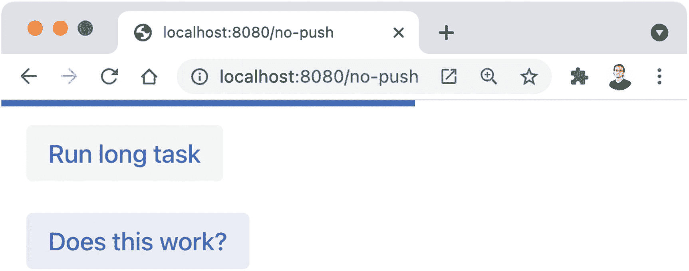
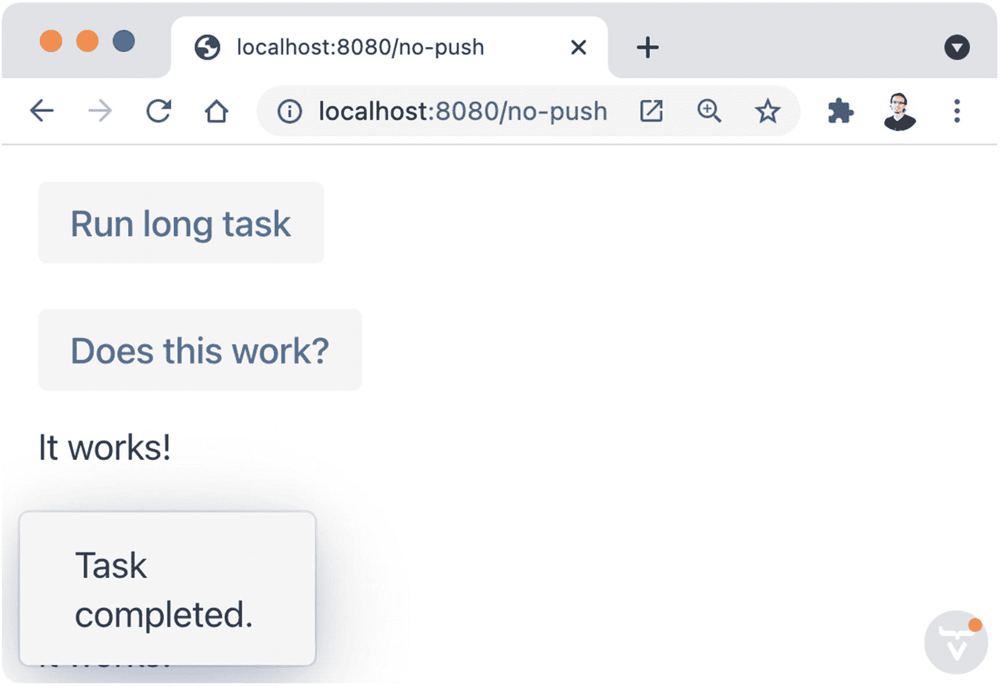
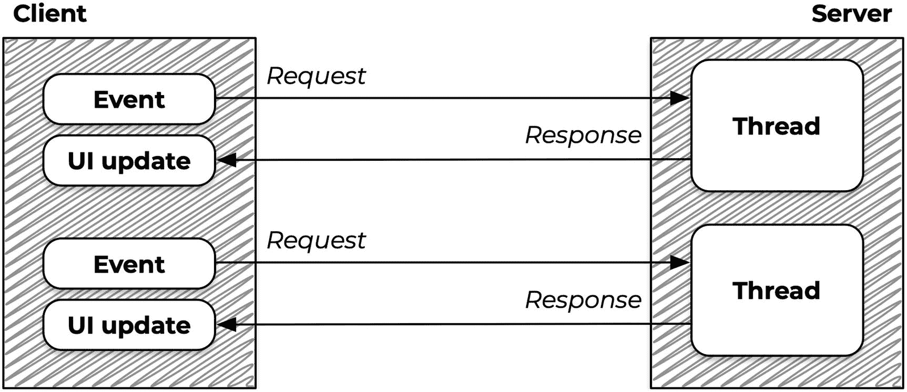
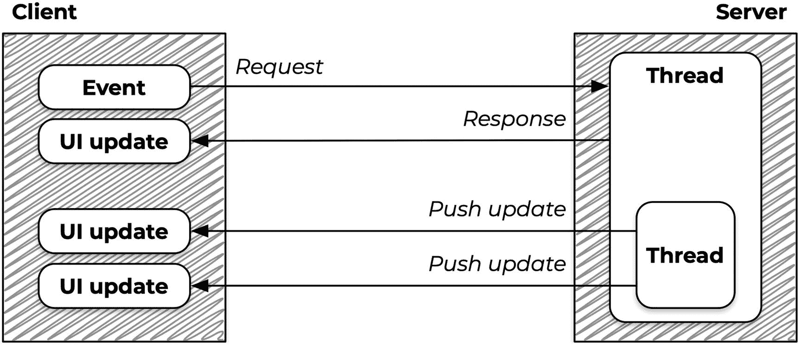
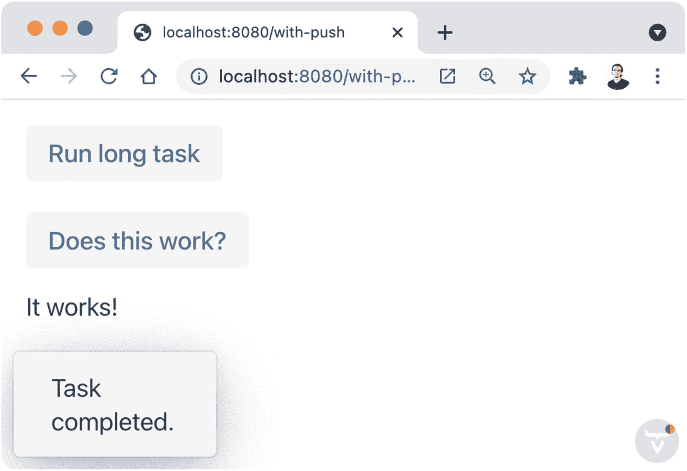
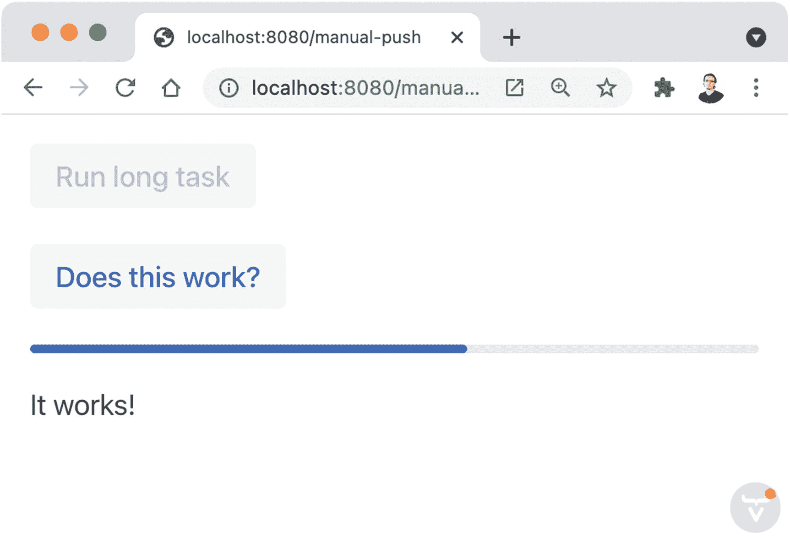
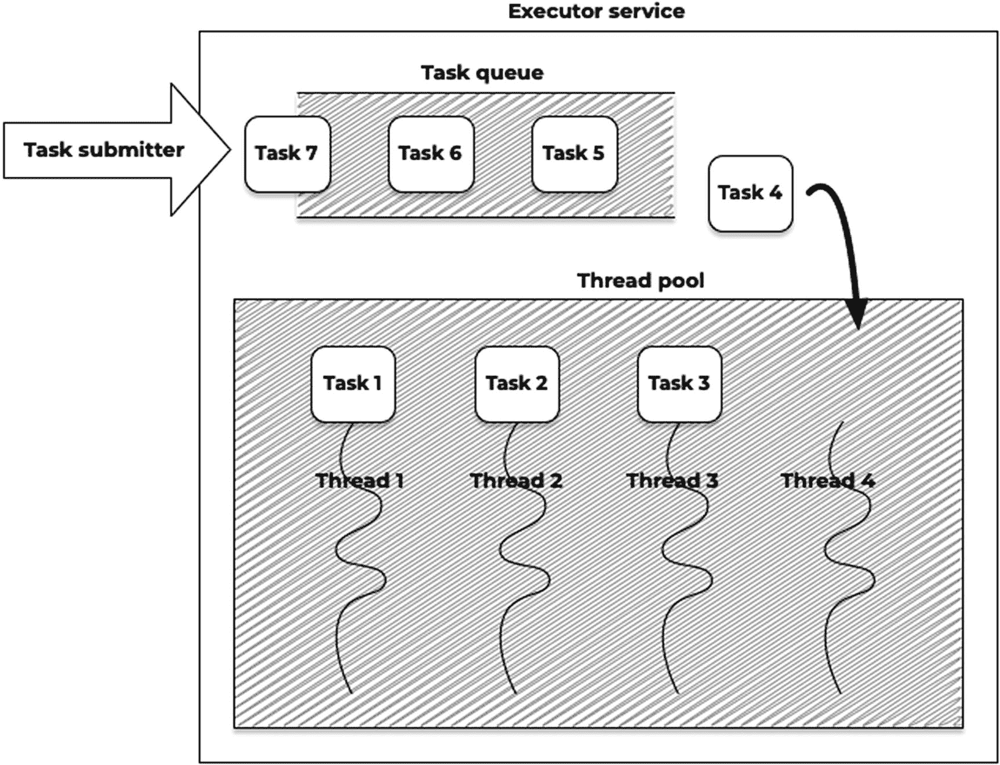
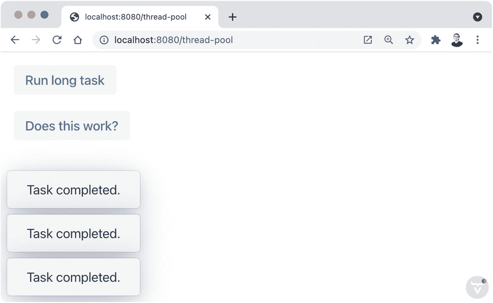

# 8.服务器推送

服务器推送是 Vaadin 中的一个特性，它允许您在不需要用户交互的情况下更新 UI。例如，您可能希望显示服务器上正在运行的任务的进度，或者通知用户有新的工作项目可用。

在 Vaadin 中激活和使用服务器推送非常简单，只需要一个注释和一个对`UI:access(Command)`方法的调用。在本章中，您将了解什么是服务器推送，何时使用，如何使用，以及可供您使用的配置选项。

## 什么时候使用服务器推送？

当您希望从不同于服务器为处理来自客户端的请求而创建的线程的线程中对 UI 进行更改时，可以使用服务器推送。例如，如果您有一个在服务器中执行长期运行任务的按钮，您可能希望创建一个新的`Thread`来运行任务逻辑并立即将控件返回给浏览器，以便用户可以继续使用应用程序中的其他功能。任务完成后，您可以在 UI 中显示结果。您不能简单地从新线程更新 UI，但幸运的是，这是服务器推送解决的问题。

让我们看一个例子来理解为什么以及何时必须使用服务器推送。看看这个视图的实现:

```java
@Route("no-push")
public class NoPushView extends Composite<Component> {

  private VerticalLayout layout;

  @Override
  protected Component initContent() {
    layout = new VerticalLayout(
        new Button("Run long task", event -> runLongTaks()),
        new Button("Does this work?", event -> addText()));
    return layout;
  }

  private void runLongTaks() {
    try {
      Thread.sleep(5000);
      Notification.show("Task completed.");
    } catch (InterruptedException ignored) {
    }
  }

  private void addText() {
    layout.add(new Paragraph("It works!"));
  }

}

```

该视图包含一个带有 click listener 的按钮，该按钮模拟一个需要 5 秒钟才能完成的长时间运行的任务。5 秒钟后，代码尝试在 UI 中显示通知。还有一个按钮可以简单地向布局添加文本。如果您运行这个应用程序，您将看到 UI 被锁定了 5 秒钟。Vaadin 的客户端引擎检测到请求耗时过长，并显示一个进度条(见图 [8-1](#Fig1) )。



图 8-1

长时间运行的任务会导致浏览器中显示进度条

你还会注意到*是这样工作的？显示进度条时，*按钮似乎不起作用。然而，5 秒钟后，通知显示在浏览器中，与 UI 的其他交互的结果也发生了(参见图 [8-2](#Fig2) 中添加到布局中的文本)。这表明，即使客户端可以发送服务器成功处理的附加请求，长时间运行的任务也会阻止对 UI 的更改。



图 8-2

在服务器中长时间运行任务后，用户界面立即发生变化

让我们向改进应用程序迈出一步。由于任务需要很长时间才能完成，我们可以将逻辑转移到一个单独的线程中。这允许初始线程(由服务器启动)完成，并让 Vaadin 处理请求并立即返回响应。我们还可以在启动新线程之前通知用户任务正在运行:

```java
private void runLongTaks() {
  Notification.show("Running the task...");
  new Thread(() -> {
    try {
      Thread.sleep(5000);
      Notification.show("Task completed.");
    } catch (InterruptedException ignored) {
    }
  }).start();
}

```

不幸的是，如果您尝试该应用程序，您将永远看不到任务已完成的通知。相反，您将在服务器日志中看到一个异常:

```java
java.lang.IllegalStateException: UI instance is not available. It means that you are calling this method out of a normal workflow where it's always implicitly set. That may happen if you call the method from the custom thread without 'UI::access' or from tests without proper initialization.

```

## 服务器推送的工作原理

让我们更详细地研究一下上一节的例子。当您单击按钮时，会创建一个新线程来处理服务器中的请求。点击监听器中的代码在这个线程中执行。这段代码又创建了另一个线程。原始线程结束，浏览器和服务器都准备好处理来自用户的未来 UI 交互。稍后，5 秒任务完成，处理对`Notification.show("Task completed.")`的调用。但为时已晚。响应已关闭。浏览器不希望有任何更改，因为它已经在 5 秒钟前处理了响应。对用户界面的新更改会丢失。

只有在原始请求的线程中进行更新时，才会对 UI 进行更新。看一下图 [8-3](#Fig3) 。浏览器中的一个事件(比如单击按钮或更改文本字段的值)会向服务器发出一个请求。通常，这导致 UI 中的变化(例如，显示通知)。这是我们到目前为止使用框架的方式。



图 8-3

更改用户界面的请求和响应

服务器推送是一个使用 Vaadin 中的注释激活的特性(您很快就会了解到)，它允许单独的线程更新浏览器中的 UI。图 [8-4](#Fig4) 说明了这个概念。UI 事件向服务器发送一个请求，服务器产生一个带有 UI 更新的响应。然而，对于服务器推送，如果启动了一个新的单独线程，这个新线程可以发送*推送更新*，导致 UI 中的可见变化。



图 8-4

从服务器中单独的线程推送更新

## 执行异步用户界面更新

为了能够使用服务器推送更新 UI，您必须使用`@Push`注释来启用它。这个注释需要放在实现`AppShellConfigurator`接口的类中:

```java
@Push
public class AppConfiguration implements AppShellConfigurator {
}

```

Note

当用户在浏览器中请求应用程序时，Vaadin 检测并使用实例来配置客户端引擎。

启用服务器推送后，您现在可以向客户端发送更新。这些更新是异步 UI 更新，可以根据您使用的配置手动或自动发送到客户端。

### 自动服务器推送更新

默认情况下，如果您将更改 UI 的代码包含在一个`Command`对象中，并调用`UI`类的`access(Command)`方法，服务器推送更改会自动发送到客户端。例如，要使上一节中的示例起作用，我们需要这样做:

```java
private void runLongTaks() {
  Notification.show("Running the task...");
  var ui = UI.getCurrent();
  new Thread(() -> {
    try {
      Thread.sleep(5000);
      ui.access(() -> {
        Notification.show("Task completed.");
      });
    } catch (InterruptedException ignored) {
    }
  }).start();
}

```

这段代码获取一个对当前`UI`的引用，我们在启动线程之前初始化这个引用。在原始线程(请求线程)的范围内获得这个引用很重要，因为 Vaadin 使用 Java 的`ThreadLocal`来存储这些引用。

Tip

总是将在单独线程中运行的任何代码包含在一个`UI:access(Command)`调用中，并确保从该线程外部获得`UI`实例。

如果您运行该应用程序，您不仅可以在长时间运行的任务运行时向布局添加文本，还可以在任务完成 5 秒后显示通知(参见图 [8-5](#Fig5) )。



图 8-5

服务器推送更新

### 手动服务器推送更新

可以控制服务器推送更新发送到客户端的确切时间。为此，您必须使用`@Push`注释来配置服务器推送模式:

```java
@Push(value = PushMode.MANUAL)
public class AppConfiguration implements AppShellConfigurator {
}

```

当您从一个单独的线程对 UI 执行更改时，您仍然需要使用`access(Command)`方法，但是现在您可以在任何时候调用 UI 类的`push()`方法来将 UI 更改发送到客户端:

```java
doBusinessStuff();
ui.access(() -> {
  updateUI();
  ui.push();
}
doSomeMoreBusinessStuff();
ui.access(() -> {
  updateUI();
  ui.push();
}

```

下面是一个长期运行的任务示例版本，它随着任务的进展更新一个`ProgressBar`组件:

```java
@Route("manual-push")
public class ManualPushView extends Composite<Component> {

  private VerticalLayout layout;
  private ProgressBar progressBar = new ProgressBar(0, 10);
  private Button button;

  @Override
  protected Component initContent() {
    button = new Button("Run long task", event -> runLongTaks());
    button.setDisableOnClick(true);
    layout = new VerticalLayout(button,
        new Button("Does this work?", event -> addText()),
        progressBar);
    return layout;
  }

  private void runLongTaks() {
    Notification.show("Running the task...");
    progressBar.setValue(0);
    var ui = UI.getCurrent();
    new Thread(() -> {
      try {
        for (int i = 0; i <= 10; i++) {
          Thread.sleep(1000);
          double progress = i;
          ui.access(() -> {
            progressBar.setValue(progress);
            ui.push();
          });
        }

        ui.access(() -> {
          Notification.show("Task completed.");
          button.setEnabled(true);
          ui.push();
        });
      } catch (InterruptedException ignored) {
      }
    }).start();
  }

  private void addText() {
    layout.add(new Paragraph("It works!"));
  }

}

```

我们添加了一个值在 0 到 10 之间的`ProgressBar`。`runLongTask()`方法中的一个循环每秒更新一次进度条，并使用`push()`方法将更改发送给客户端。当循环结束时，另一个服务器推送更新被发送到客户机，通知任务完成。

看看我们如何在调用长期运行任务的按钮上调用`setDisableOnClick(boolean)`方法。当您运行这种任务以防止用户多次启动作业时，这很方便。图 8-6 显示了应用程序运行任务时的屏幕截图。



图 8-6

从服务器端线程手动更新的用户界面

该示例还展示了如何仅在我们需要更新 UI 时调用`access(Command` `)`方法。一个典型的错误是在不需要的时候在`Command`中调用业务逻辑。例如:

```java
ui.access(() -> {
  doBusinessStuff();
  updateUI();
  ui.push();
}

```

当业务逻辑需要相当长的时间来运行时，这种负面影响会更加明显。相反，将业务逻辑调用移到`Command`实现之外。

Caution

`access(Command)`方法锁定用户会话。这意味着当`Command`实现中的代码运行时，其他线程不能对 UI 进行更改。

## 使用线程池

在前面的例子中，我们通过直接创建新的`Thread`实例来使用线程。Java 线程很昂贵，而且消耗内存。为了强调这一点，让我们做一个实验(改编自 Petter Holmströ的演讲):

```java
public class MaxThreadsExperiment extends Thread {

  public static void main(String... args) {
    new MaxThreadsExperiment().start();
  }

  public static final AtomicInteger count = new AtomicInteger();

  @Override
  public void run() {
    try {
      System.out.println(count.incrementAndGet());
      new MaxThreadsExperiment().start();
      sleep(Long.MAX_VALUE);

    } catch (InterruptedException e) {
      e.printStackTrace();
    }
  }

}

```

这个 Java 程序递归地创建线程，直到你得到一个`OutOfMemoryError`。在我用来运行这个实验的虚拟机中，我很快就发现了错误:

```java
...
1994
1995
1996
1997
1998
1999
2000
Exception in thread "Thread-1999" java.lang.OutOfMemoryError: unable to create new native thread
      at java.lang.Thread.start0(Native Method)
      at java.lang.Thread.start(Thread.java:717)
      at MaxThreadsExperiment.run(MaxThreadsExperiment.java:15)

```

2000 个线程是极限。根据您部署应用程序的服务器，这个数字可能更小或更大。关键是，考虑到 Servlet 容器创建线程来处理请求，2000(或者当我在我的开发机器上运行它时大约是 4000)对于 web 应用程序来说可能太少了。线程是有限的资源，应该如此对待。

在软件设计中，*池*是在使用资源之前创建和初始化资源的地方。池中的客户端可以请求资源、使用资源，然后将其返回到池中。资源可以是数据库连接、服务、文件、线程或任何其他资源。线程池是一个软件实体，它可以创建预先配置好数量的线程，这些线程可以执行提交者发送的任务。

Java 包含了`ExecutorService`接口以及现成的线程池实现。任务提交者(您的代码)可以提交(执行)任务(`Runnable`对象)，这些任务在线程队列中运行，当池中有线程可用时，在线程中执行。图 [8-7](#Fig7) 描绘了该过程。



图 8-7

具有四个线程池的执行器服务

因为线程池应该在应用程序开始产生任务之前准备好，所以初始化它的好地方是一个`ServletContextListener`。当`ServletContext`被初始化和销毁时，`ServletContextListener`接口允许你运行逻辑。

Note

应用程序启动时会创建一个`ServletContext`对象。web 应用程序的每个实例只有一个`ServletContext`实例。

继续前面几节的例子，我们可以创建一个扩展`ServletContextListener`的新类，或者使用现有的类(如果有的话)。事实上，我们已经有了一个很好的候选对象，所以我们将使用之前创建的`AppConfiguration`类来启用服务器推送，而不是创建一个新的类(如果您愿意，您可以这样做)。我们需要做的就是将该类添加到`extends`列表中，实现这些方法，并用`@WebListener`标记该类，以允许 Servlet 容器检测该类:

```java
@Push
@WebListener
public class AppConfiguration
    implements AppShellConfigurator, ServletContextListener {

  private static ScheduledExecutorService executorService;

  public static ExecutorService getExecutorService() {
    return executorService;
  }

  @Override
  public void contextInitialized(ServletContextEvent event) {
    executorService = Executors.newScheduledThreadPool(3);
  }

  @Override
  public void contextDestroyed(ServletContextEvent event) {
    executorService.shutdown();
  }

}

```

这里，我们使用了类型为`ScheduledExecutorService`的静态实例(它实现了`ExecutorService`)。公共 getter 允许应用程序的其他部分获得对服务的引用并使用它。我们使用`Executors`类创建一个新实例，并配置一个有三个线程的线程池。这个数字在这个演示应用程序中用于演示目的，以便您可以使用它并查看线程的行为，但是您可能应该在生产中使用一个更大的数字，或者甚至在运行时进行配置。此外，为了防止线程“永远”存在于 JVM 中，在应用程序停止时关闭 executor 服务也很重要

下一步是修改视图以使用线程池(或执行器服务),而不是手动创建和启动线程。以下是重构的结果:

```java
private void runLongTaks() {
  Notification.show("Running the task...");
  var ui = UI.getCurrent();

  AppConfiguration.getExecutorService().execute(() -> {
    try {
      Thread.sleep(5000);
      ui.access(() -> {
        Notification.show("Task completed.");
      });
    } catch (InterruptedException ignored) {
    }
  });
}

```

我们获取对`ExecutorService`的引用，并调用`execute(Runnable)`方法来提交一个新任务。这个任务将被分配给池中的一个空闲线程(如果有的话),或者排队直到有一个空闲线程可用。尝试应用程序并点击*运行长任务*按钮，比如说，十次。查看任务是如何提交的，但三个一批地完成。图 [8-8](#Fig8) 显示了一个例子。



图 8-8

在三个线程的池中完成的任务

Note

图 [8-8](#Fig8) 中的结果并不意味着任务三个一批地同时执行。结果是应用程序使用方式的结果。几个任务被快速发送(通过点击按钮)。因为线程在服务器中休眠了 5 秒钟，所以池中的所有三个线程都变得繁忙。由于任务一个接一个地快速发送，所有的线程几乎同时完成它们的任务。

## WebSocket 与长轮询

默认情况下，当您启用服务器推送时，Vaadin 使用 WebSocket 协议将更改发送到客户端。WebSocket 是一种通信协议，就像 HTTP 一样。通过 WebSocket，客户端与服务器建立永久连接，从而实现参与者之间的全双工通信。

作为 WebSocket 的替代方法，您可以通过在`@Push`注释中设置`LONG_POLLING`传输来使用 HTTP 进行服务器推送:

```java
@Push(transport = Transport.LONG_POLLING)
public class AppConfiguration implements AppShellConfigurator {
}

```

*轮询*是一种技术，客户端通过这种技术不断向服务器发送请求，要求更改 UI。如果客户机-服务器是一个对话，那么常规轮询应该是这样的:

*   客户:我有什么变化吗？

*   **服务器:**否

*   客户:我有什么变化吗？

*   **服务器:**否

*   客户:我有什么变化吗？

*   **服务器:**是。添加文本为“Hello”的通知。

*   **客户:**谢谢。对我来说有什么变化吗？

*   **服务器:**否

*   …

向服务器请求更改的客户端代表 HTTP 请求。这些请求是定期进行的，例如，每隔一定的秒数。如果他们完成了，比如说，每 30 秒，用户界面就会慢慢更新。如果将频率降低到 2 秒，UI 更新会更快。越快对用户越好，但对网络流量最不利(尤其是如果你使用的是收费的云提供商)。

*长轮询*是一种技术，通过这种技术，客户端以一种智能的方式轮询服务器，以减少请求的数量，同时保持快速的 UI 更新。对于长轮询，客户端向服务器发出请求，服务器保存请求，直到有更改返回。只有在这时，响应才会被发送到客户端，客户端一直在静静地等待，没有发出新的请求。对话应该是这样的:

*   客户:我有什么变化吗？

*   (2 分钟后...)

*   **服务器:**是。添加文本为“Hello”的通知。

*   **客户:**谢谢。对我来说有什么变化吗？

*   …

在 WebSocket 和长轮询之间进行选择取决于您的应用程序的确切需求、部署它的基础设施以及它的用途。一般来说，WebSocket 效率更高，因此，根据经验，只有当 WebSocket 协议不可用时才使用长轮询，例如，当 web 代理阻止它时。

## 摘要

在这一章中，你学到了很多关于线程、异步 UI 更新以及客户端和服务器之间的对话的知识。您了解了何时需要使用`@Push`注释来启用服务器推送。您了解了如何自动向客户机发送服务器推送更新，以及如何手动发送它们。您还了解了线程池以及它们如何帮助您避免臭名昭著的`OutOfMemoryError`。最后，您大致了解了 WebSocket 和长轮询是如何工作的。

在下一章中，您将通过使用 Vaadin 的 Element API 从服务器控制浏览器中的文档对象模型。