# 十、定制样式和响应能力

在第 [1](01.html) 章中，你学习了层叠样式表(CSS)的基础知识，以及如何编写规则来改变 HTML 文档的外观。Vaadin 不仅允许你通过元素 API 使用 CSS(正如你在第 9 章中所学的)，还允许你在单独的*中使用 CSS。可以添加到项目中的 css* 文件。

除了 CSS 之外，Vaadin 还包括一些组件，可以简化快速实现响应式 ui。响应式 UI 根据呈现它的屏幕的大小来调整它的结构。当你想支撑宽度窄、高度长的手机等设备时，这是很有用的。

## 内置主题

Vaadin 管理主题中的应用样式。主题是一组 CSS 文件和相关资源，如字体和图像，它们定义了应用的外观。诸如主要的背景和前景颜色、字体、间距以及 UI 如何适应不同的视图大小之类的东西是在构成主题的 CSS 规则中定义的。Vaadin 有两个主题:

*   **Lumo:** 默认主题。我们已经在前几章的例子中使用了这个主题。

*   **材质:**一个基于谷歌材质设计的 Vaadin 主题。访问 [`https://material.io`](https://material.io) 了解更多材料设计信息。

这两种主题都有两种变体——亮和暗。

应用可以在实现了`AppShellConfigurator`接口的类中使用`@Theme`注释来定义主题。例如，下面的代码片段显示了如何激活材质主题(参见图 [10-1](#Fig1) ):

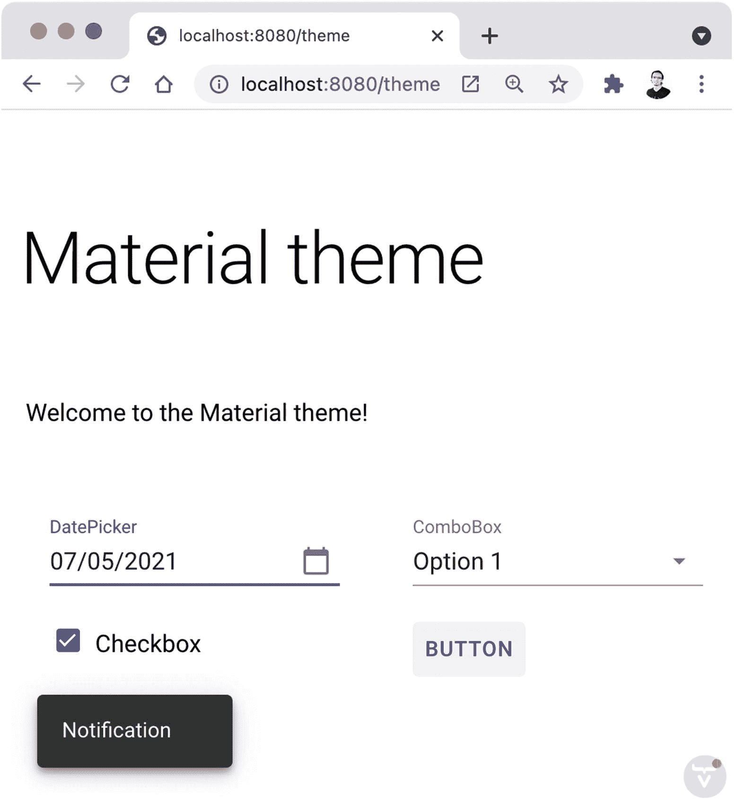

图 10-1

物质主题

```java
@Theme(themeClass = Material.class)
public class AppConfiguration implements AppShellConfigurator {
}

```

Tip

您可以使用`@NoTheme`注释停用默认的 Lumo 主题。当您想要完全控制加载的 CSS 文件并从头开始设计应用时，这很有用。如果 Vaadin 没有找到`@Theme`或`@NoTheme`注释，默认使用 Lumo 主题。

### 使用主题变体

像主题一样，主题变体是一组 CSS 文件和相关资源。不同之处在于，每个应用只能有一个主题，而可以有多个变体，其中一个每次都是活动的。Lumo 和 Material 主题都包含两种变体。以下是如何激活 Lumo 主题的黑暗版本(见图 [10-2](#Fig2) ):

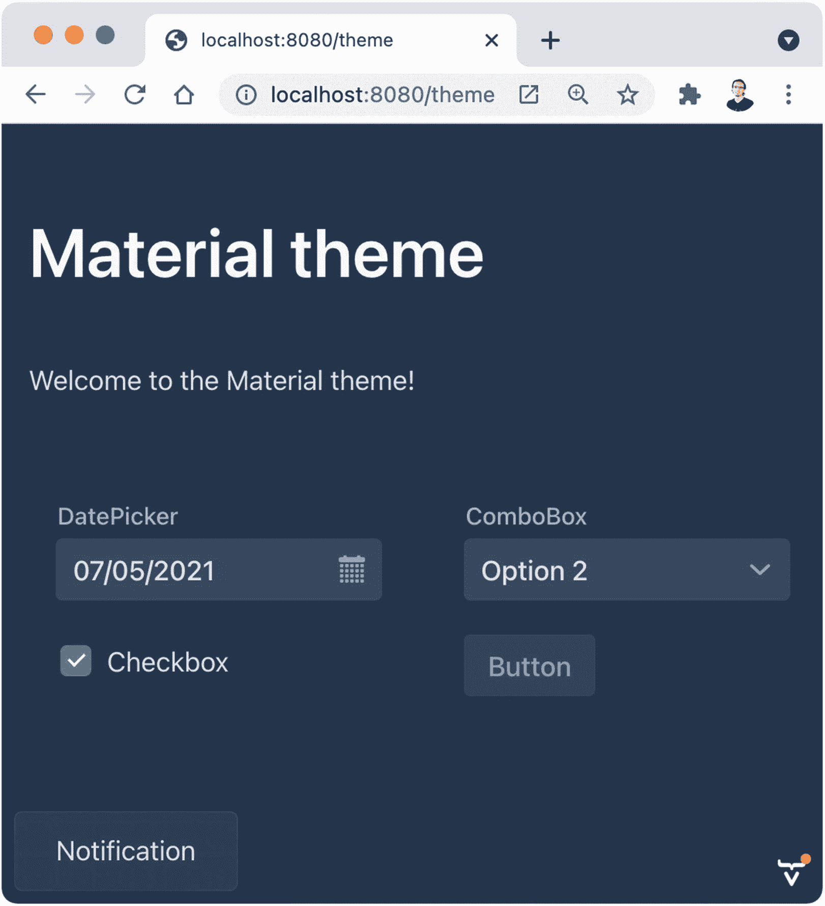

图 10-2

Lumo 主题的黑暗变体

```java
@Theme(themeClass = Lumo.class, variant = Lumo.DARK)
public class AppConfiguration implements AppShellConfigurator {
}

```

Note

如果你一直在尝试这本书的例子或者编写你自己的 Vaadin 应用，试着改变它们的活动主题。就像加个注释那么简单！尝试材质主题的黑暗变体，看看它是什么样子的。请记住，不可能有多个主题。可以有几个主题变体(甚至是自定义的)并在运行时改变它们(见 [`https://vaadin.com/learn/tutorials/toggle-dark-theme`](https://vaadin.com/learn/tutorials/toggle-dark-theme) )。

### 使用组件变体

几个 Vaadin 组件包括主题变体。组件主题变体只影响包含该变体的组件。例如，您可以通过添加`ButtonVariant.LUMO_PRIMARY`变体使按钮看起来更突出:

```java
Button button = new Button("Primary ");
button.addThemeVariants(ButtonVariant.LUMO_PRIMARY);

```

图 [10-3](#Fig3) 显示了具有不同主题变量的几个按钮和文本字段。

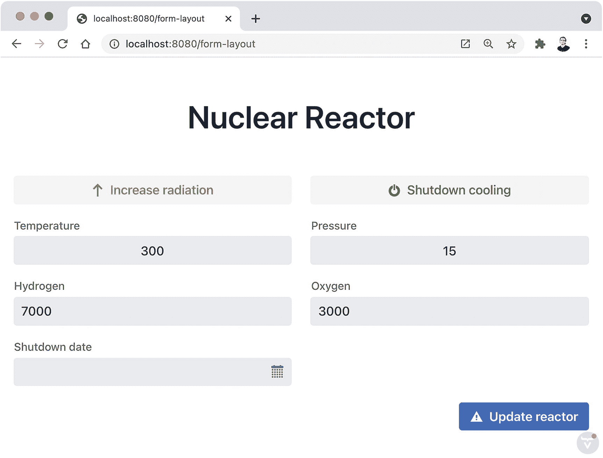

图 10-3

组件主题变体

Tip

使用 IDE 的自动完成功能探索可用的变体。

## 使用 CSS 设置样式

根据我们目前所看到的，我们有四种 Vaadin 应用的可能样式——两种主题，每种主题有两种变体。现在让我们看看如何通过添加修改可用主题的自定义 CSS 规则来扩展选项。

### 导入 CSS 文件

我们在第 9 章中看到了如何使用元素 API 为 UI 中的特定组件或 HTML 元素设置自定义 CSS 属性。例如，我们可以给一个`Div`组件添加一个带阴影的边框，如下所示:

```java
Div div = new Div();
Style style = div.getStyle();
style.set("border", "1em solid #333");
style.set("box-shadow", "1em 1em 1em #777");

```

这是改变 UI 组件样式的一种快速简单的方法。但是，当您想要改变应用的整体外观时，最好拥有可以被多个视图使用的单独的 CSS 文件。

让我们看看如何向 Vaadin 应用添加自定义 CSS 规则。图 [10-4](#Fig4) 显示了一个简单的视图，有一个`H1`，一个`TextField`，一个`Button`，没有自定义 CSS。

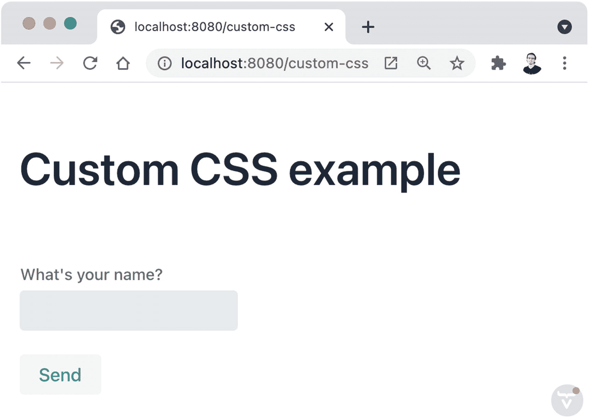

图 10-4

具有默认主题和样式的视图

开发人员经常问我的一个问题是如何减少`H1`组件前后的空间。这是可以理解的，因为通常一个`H1`组件是一个 UI 的视图或部分中最顶层的组件，并且可能有必要优化空间使用。幸运的是，使用 CSS 很容易调整这一点:

```java
h1 {
  margin-top: 0.15em;
  margin-bottom: 0;
}

```

我们可以将这个 CSS 放在*前端/* 目录中的一个文件中，使用我们想要的任何文件名(例如 *custom-styles.css* )，并使用`@CssImport`注释将它加载到一个视图中:

```java
@Route("custom-css")
@CssImport("./custom-styles.css")
public class CustomCss extends Composite<Component> {
}

```

我们可以使用元素 API 并为`H1`组件设置 CSS 属性，但是将样式放在一个单独的文件中允许我们更容易地重用应用中每个`H1`组件的样式。图 [10-5](#Fig5) 显示了结果。

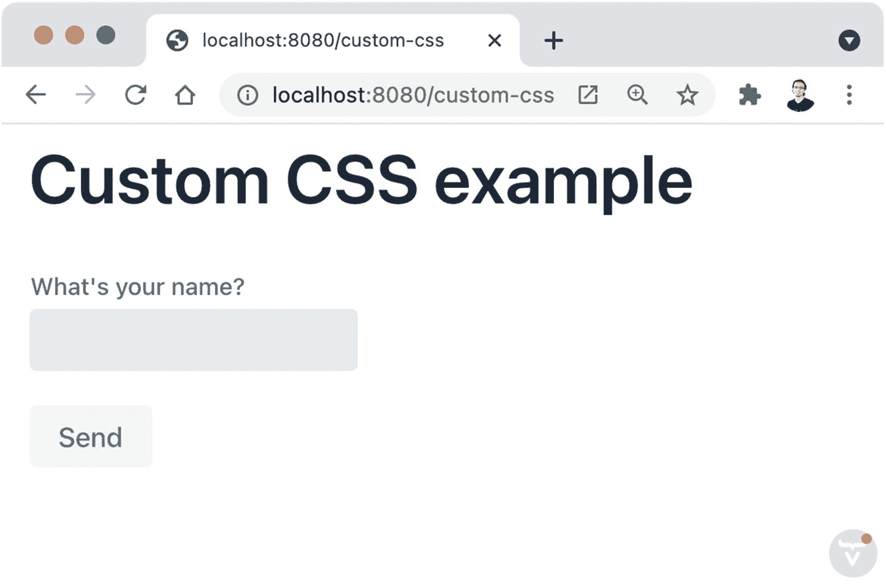

图 10-5

添加到视图中的自定义 CSS 文件

Caution

使用`@CssImport`注释导入的文件包含在应用包中。这意味着一个视图会受到其他视图导入的 CSS 文件内容的影响。

### 使用 Lumo 主题属性

Lumo 主题包括一组 CSS 属性(或变量),允许快速对主题进行常规更改。这些属性可以被视为主题的参数，并在适用时调整所有组件的样式。

Tip

CSS 属性以`--`开头。

您可以在一个 CSS 文件中设置 Lumo 主题所使用的 CSS 属性的值，这个 CSS 文件可以使用前面小节中所示的`@CssImport`注释来导入。以下示例显示了如何更改 UI 组件的字体和圆度(参见图 [10-6](#Fig6) 中的结果):

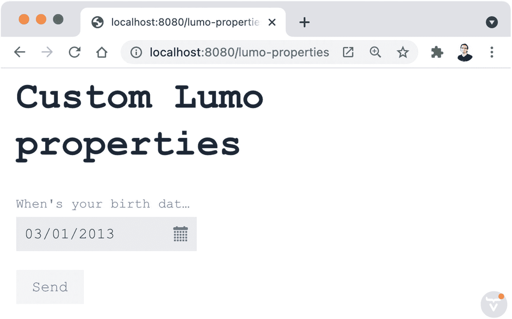

图 10-6

用 CSS 属性自定义 Lumo 主题

```java
html {
  --lumo-font-family: "Courier New", Courier, monospace;
  --lumo-border-radius: 0px;
}

```

Lumo 主题中定义了许多 CSS 属性。清单 [10-1](#PC8) 展示了一些可用属性的例子。

```java
html {
  --lumo-font-family: "Courier New", Courier, monospace;
  --lumo-font-size: 1rem;
  --lumo-font-size-xxxl: 3rem;
  --lumo-font-size-xxl: 2.25rem;
  --lumo-font-size-xl: 1.75rem;
  --lumo-font-size-l: 1.375rem;
  --lumo-font-size-m: 1.125rem;
  --lumo-font-size-s: 1rem;
  --lumo-font-size-xs: 0.875rem;
  --lumo-font-size-xxs: 0.8125rem;
  --lumo-line-height-m: 1.4;
  --lumo-line-height-s: 1.2;
  --lumo-line-height-xs: 1.1;
  --lumo-border-radius: 0px;
  --lumo-size-xl: 4rem;
  --lumo-size-l: 3rem;
  --lumo-size-m: 2.5rem;
  --lumo-size-s: 2rem;
  --lumo-size-xs: 1.75rem;
  --lumo-space-xl: 1.75rem;
  --lumo-space-l: 1.125rem;
  --lumo-space-m: 0.5rem;
  --lumo-space-s: 0.25rem;
  --lumo-space-xs: 0.125rem;
  --lumo-shade-5pct: rgba(26, 26, 26, 0.05);
  --lumo-shade-10pct: rgba(26, 26, 26, 0.1);
  --lumo-shade-20pct: rgba(26, 26, 26, 0.2);
  --lumo-shade-30pct: rgba(26, 26, 26, 0.3);
  --lumo-shade-40pct: rgba(26, 26, 26, 0.4);
  --lumo-shade-50pct: rgba(26, 26, 26, 0.5);
  --lumo-shade-60pct: rgba(26, 26, 26, 0.6);
  --lumo-shade-70pct: rgba(26, 26, 26, 0.7);
  --lumo-shade-80pct: rgba(26, 26, 26, 0.8);
  --lumo-shade-90pct: rgba(26, 26, 26, 0.9);
  --lumo-primary-text-color: rgb(235, 89, 5);
  --lumo-primary-color-50pct: rgba(235, 89, 5, 0.5);
  --lumo-primary-color-10pct: rgba(235, 89, 5, 0.1);
  --lumo-error-text-color: rgb(231, 24, 24);
  --lumo-error-color-50pct: rgba(231, 24, 24, 0.5);
  --lumo-error-color-10pct: rgba(231, 24, 24, 0.1);
  --lumo-success-text-color: rgb(62, 229, 170);
  --lumo-success-color-50pct: rgba(62, 229, 170, 0.5);
  --lumo-success-color-10pct: rgba(62, 229, 170, 0.1);
  --lumo-shade: hsl(0, 0%, 10%);
  --lumo-primary-color: hsl(22, 96%, 47%);
  --lumo-error-color: hsl(0, 81%, 50%);
  --lumo-success-color: hsl(159, 76%, 57%);
  --lumo-success-contrast-color: hsl(159, 29%, 10%);
}

Listing 10-1A custom Vaadin theme based on Lumo properties

```

Note

解释每个属性超出了本书的范围。这些特性在 [`https://vaadin.com/docs/latest/ds/foundation`](https://vaadin.com/docs/latest/ds/foundation) 的官方文档中有详细记载。在撰写本文时，在 [`https://demo.vaadin.com/lumo-editor`](https://demo.vaadin.com/lumo-editor) 有一个在线主题编辑器。

### 向 UI 组件添加 CSS 类

您可以向任何组件添加 CSS 类来设置组件的样式。例如:

```java
Div div = new Div();
div.addClassName("styled-div");

```

以及相应的 CSS 规则:

```java
.styled-div {
  border: 1px solid red;
}

```

随着应用的增长，您需要为自己定义的 CSS 类制定一致的约定。提高可维护性的一个好方法是在 CSS 类名中使用 Java 类名(视图)。假设我们有以下观点:

```java
@Route("css-classes")
public class CssClassesView extends Composite<Component> {

  @Override
  protected Component initContent() {
    var header = new Div(VaadinIcon.VAADIN_H.create(),
        new H1("Title"),
        new Anchor("https://vaadin.com?utm_source=apressbook",
            "Log out"));

    Grid<String> grid = new Grid<>(String.class);
    grid.setItems("item1", "item2", "item3", "");

    var content = new Div(grid);

    var layout = new Div();
    layout.add(header, content);

    return layout;
  }

}

```

我们将组件分组为连贯的部分(使用`Div`类)，但除此之外，我们并不“关心”视图在浏览器中呈现时的样子。图 [10-7](#Fig7) 显示确实如此！

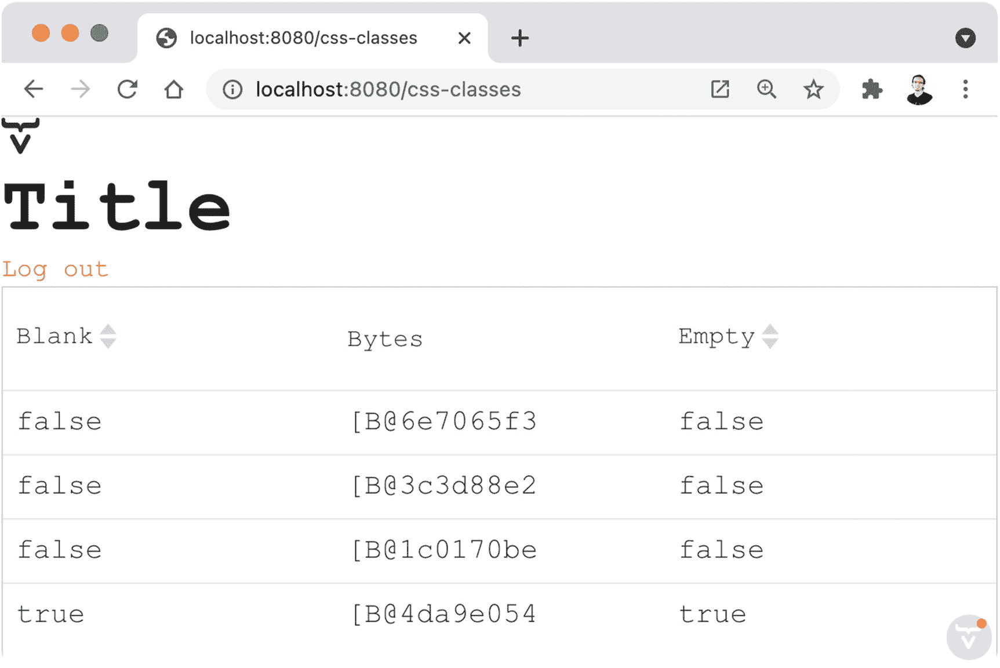

图 10-7

没有 CSS 样式的视图

然而，如果我们将 CSS 类名添加到重要的部分，我们——或者更好，一个掌握 CSS 的网页设计师——可以完全改变视图的外观。我们将在 CSS 类的名称中使用 Java 类的名称(`CssClassesView`)，附加一个适当的字符串来区分我们想要样式化的组件:

```java
layout.addClassName(getClass().getSimpleName());
header.addClassName(getClass().getSimpleName() + "-header");
content.addClassName(getClass().getSimpleName() + "-content");

```

在浏览器中，这些组件呈现为

```java
<div class="CssClassView">
...
 <div class="CSSClassView-header">
...
<div class="CssClassView-content">
...

```

我们可以如下加载一个新的 CSS 文件:

```java
@Route("css-classes")
@CssImport("./custom-classes.css")
public class CssClassesView extends Composite<Component> {
  ...
}

```

最后，我们可以在 *custom-classes.css* 文件中设置视图的样式。下面是一个后端 Java 开发者的尝试(结果见图 [10-8](#Fig8) ):

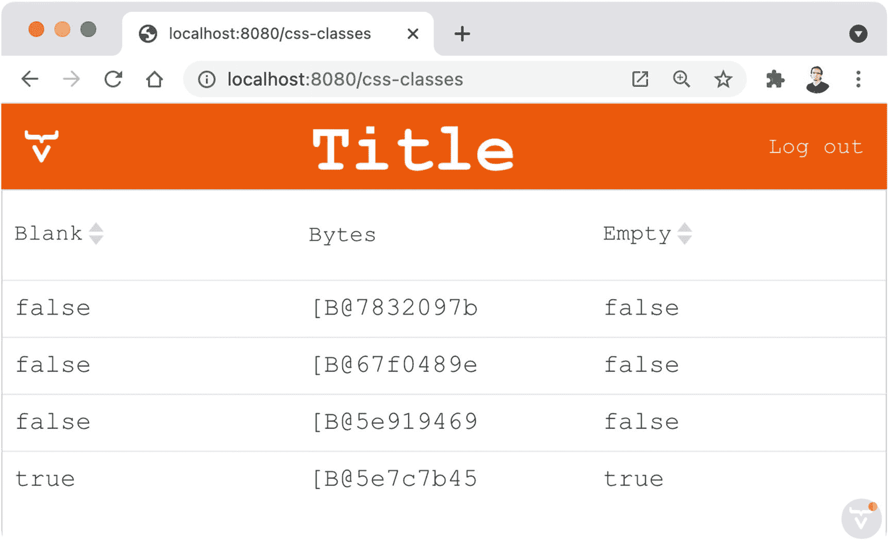

图 10-8

使用 CSS 类设置视图样式

```java
.CssClassesView {
    display: flex;
    flex-direction: column;
}

.CssClassesView-header {
    display: flex;
    flex-direction: row;
    justify-content: space-between;
    align-items: center;
    background: var(--lumo-primary-text-color);
    color: var(--lumo-primary-contrast-color);
    padding-left: 1em;
    padding-right: 1em;
}

.CssClassesView-header h1 {
    color: var(--lumo-primary-contrast-color);
}

.CssClassesView-header a {
    color: var(--lumo-primary-contrast-color);
}

```

### 样式阴影 DOM

Vaadin 组件作为 Web 组件实现。Web 组件是封装在单个可重用单元中的一组 HTML 资源。例如，`Button`在浏览器中呈现为`<vaadin-button>`。Web 组件包括*影子 DOM* ，它是不会“污染”页面中 HTML 文档的 HTML。这意味着 Web 组件中的样式不会泄露给页面的其他部分，页面中的样式也不会影响 Web 组件。您仍然可以设计 Web 组件的样式，但是您需要以一种特殊的方式来完成。

假设我们想要改变上一节示例中的`Grid`的头部样式。如果我们检查浏览器中的 DOM，我们会看到在一个`<vaadin-grid>` Web 组件的影子 DOM 中有一个`<th>`元素。我们可以使用下面的 CSS 选择器来设置这个元素的样式:

```java
:host th {
  background: var(--lumo-primary-color-10pct);
}

```

`:host`选择阴影 DOM。我们在 Web 组件的影子 DOM 中选择了`<th>`元素。哪个 Web 组件？我们在`@CssImport`注解中回答了这个问题。假设我们将前面的 CSS 规则放在一个名为 *vaadin-grid.css* 的文件中(可以使用任何名称)。当我们加载这个文件时，我们可以指定想要样式化的 Vaadin Web 组件(图 [10-9](#Fig9) 显示了结果):

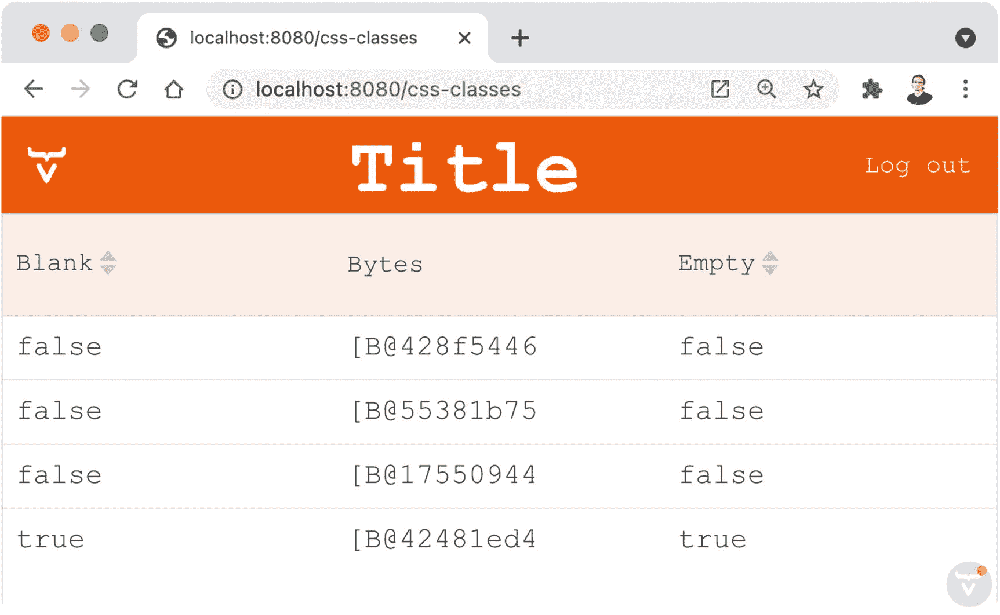

图 10-9

设计 Vaadin Web 组件的样式

```java
...
@CssImport(value = "./vaadin-grid.css", themeFor = "vaadin-grid")
public class CssClassesView extends Composite<Component> {
  ...
}

```

## 响应式网页设计

响应式网页设计是利用技术使布局和组件适应不同的设备。在不同的屏幕尺寸下使用时，响应式 web 应用会改变它们的布局。

Vaadin 提供了一些特殊的组件来简化响应式 ui 的实现。当这些组件不符合您的要求时，您可以随时使用 CSS 来实现您的目标。

### 形状布局

`FormLayout`组件使得在根据屏幕宽度变化的许多列中显示其他组件变得容易。它还将输入组件的标签放在组件的顶部，而不是旁边。事实上，我们在图 [10-3](#Fig3) 中使用了`FormLayout`。下面是实现(请注意构造函数的结尾):

```java
@Route("form-layout")
public class FormLayoutView extends Composite<Component> {

  @Override
  protected Component initContent() {
    Button increaseRadiation = new Button("Increase radiation",
        VaadinIcon.ARROW_UP.create());
    increaseRadiation
        .addThemeVariants(ButtonVariant.LUMO_ERROR);
    Button shutDownCooling = new Button("Shutdown cooling",
        VaadinIcon.POWER_OFF.create());
    shutDownCooling
        .addThemeVariants(ButtonVariant.LUMO_SUCCESS);
    NumberField temperature = new NumberField("Temperature");
    temperature
        .addThemeVariants(TextFieldVariant.LUMO_ALIGN_CENTER);
    NumberField pressure = new NumberField("Pressure");
    pressure
        .addThemeVariants(TextFieldVariant.LUMO_ALIGN_CENTER);
    NumberField hydrogen = new NumberField("Hydrogen");
    hydrogen
        .addThemeVariants(TextFieldVariant.LUMO_ALIGN_CENTER);
    NumberField oxygen = new NumberField("Oxygen");
    oxygen.addThemeVariants(TextFieldVariant.LUMO_ALIGN_CENTER);
    DatePicker shutdownDate = new DatePicker("Shutdown date");
    Button update = new Button("Update reactor",
        VaadinIcon.WARNING.create());
    update.addThemeVariants(ButtonVariant.LUMO_PRIMARY);

    FormLayout form = new FormLayout(increaseRadiation,
        shutDownCooling, temperature, pressure, hydrogen,
        oxygen, shutdownDate);

    VerticalLayout layout = new VerticalLayout(
        new H1("Nuclear Reactor"), form, update);
    layout.setAlignItems(Alignment.CENTER);
    layout.setAlignSelf(Alignment.END, update);
    return layout;
  }

}

```

仅仅通过向一个`FormLayout`添加输入组件，我们就可以在宽屏中得到两列，在窄屏中得到一列。图 [10-10](#Fig10) 显示了狭窄窗口中的视图。

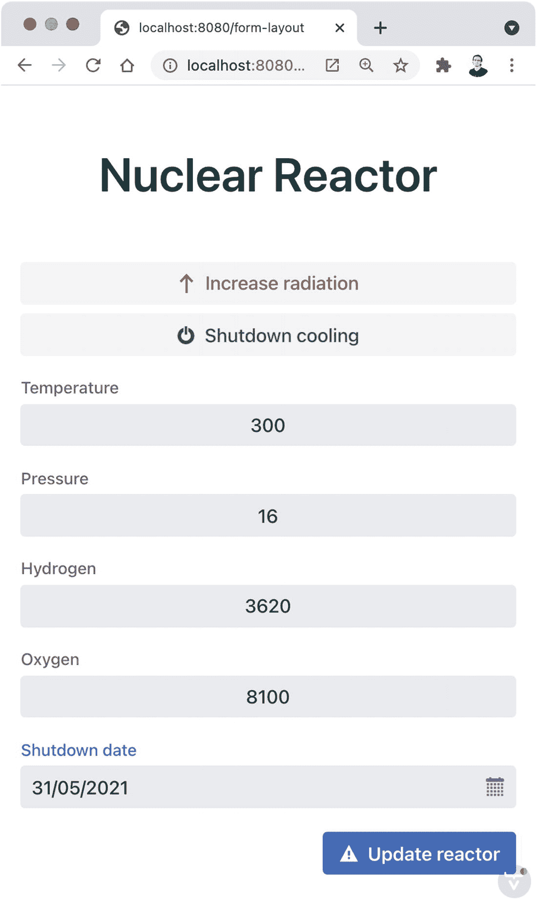

图 10-10

有反应的形式

您可以配置用于特定最小宽度的列数。这里有一个例子:

```java
form.setResponsiveSteps(
    new ResponsiveStep("1px", 1),
    new ResponsiveStep("600px", 2),
    new ResponsiveStep("800px", 3)
);

```

如果一个视窗(屏幕)的宽度大于等于 800 像素，表单将显示三列。如果宽度为 600 像素，则使用两列，依此类推。图 [10-11](#Fig11) 以宽屏显示表单。

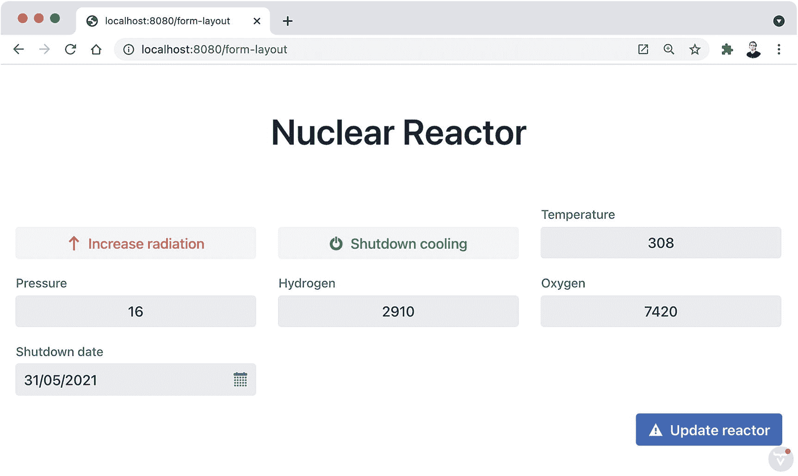

图 10-11

自定义响应步骤

### 应用布局

组件为 web 应用提供了一种流行的布局样式。它包括一个共享的*导航条*(表头)*抽屉*(菜单)，以及内容区。该组件实现了`RouterLayout`，因此您可以在多个视图中使用该布局。要将其用作路由器布局，您需要扩展`AppLayout`。以下示例显示了如何向导航栏添加一个徽标，并向抽屉添加一个`Tabs`组件:

```java
public class BusinessAppLayout extends AppLayout {

  public BusinessAppLayout() {
    Image logo = new Image("https://i.imgur.com/GPpnszs.png",
        "Vaadin Logo");
    logo.setHeight("44px");
    addToNavbar(new DrawerToggle(), logo);

    Tabs tabs = new Tabs(new Tab("Home"), new Tab("CRM"),
        new Tab("Financial"), new Tab("Marketing"),
        new Tab("Sales"), new Tab("Inventory"),
        new Tab("Manufacturing"), new Tab("Supply chain"),
        new Tab("HR"));
    tabs.setOrientation(Tabs.Orientation.VERTICAL);
    addToDrawer(tabs);
  }

}

```

您可以使用`addToNavbar(Component...)`和`addToDrawer(Component...)`方法向每个部分添加组件。您的应用中的视图可以使用如下布局(参见图 [10-12](#Fig12) ):

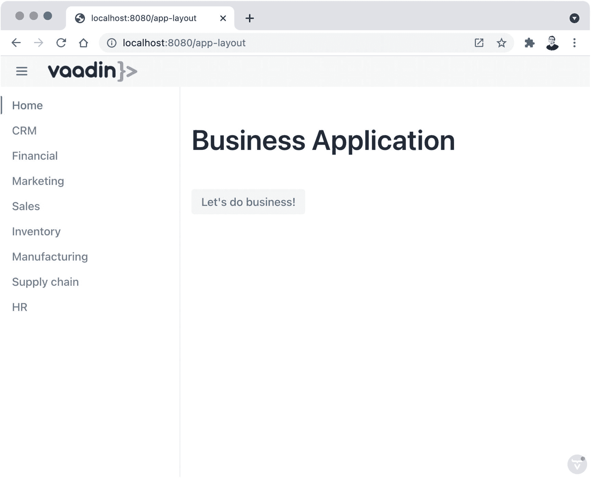

图 10-12

使用由`AppLayout`实现的路由器布局的视图

```java
@Route(value = "app-layout", layout = BusinessAppLayout.class)
public class AppLayoutView extends Composite<Component> {

  @Override
  protected Component initContent() {
    return new VerticalLayout(new H1("Business Application"),
        new Button("Let's do business!",
            event -> Notification.show("Success!")));
  }

}

```

`AppLayout`组件响应迅速。如果您调整浏览器窗口的大小，您会看到抽屉会相应地显示或隐藏。用户可以通过点击视图左上角的`DrawerToggle`来切换抽屉的可见性。图 [10-13](#Fig13) 在一个更小的窗口中显示了相同的视图。

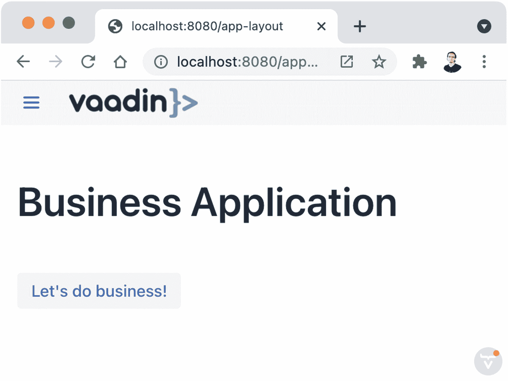

图 10-13

`AppLayout`在小视窗中隐藏抽屉

### CSS 媒体查询

CSS 允许你针对不同的屏幕尺寸有选择地应用样式。当我们开发一个带有菜单和内容区域的响应式视图时，让我们来看看它的实际应用:

```java
@Route("css")
@CssImport("./styles.css")
public class CssView extends Composite<Component> {

  @Override
  protected Component initContent() {
    Div menu = new Div(new RouterLink("Option 1", getClass()),
        new RouterLink("Option 2", getClass()),
        new RouterLink("Option 3", getClass()));

    menu.addClassName(getClass().getSimpleName() + "-menu");

    Div content = new Div(new H1("Hello!"), new Paragraph(
        "Try resizing the window to see the effect in the UI"));
    content
        .addClassName(getClass().getSimpleName() + "-content");

    Div layout = new Div(menu, content);
    layout.addClassName(getClass().getSimpleName());
    return layout;
  }

}

```

我们在重要的部分添加了 CSS 类名，并导入了 *styles.css* 文件。让我们使用移动优先的方法，并设计应用的样式，使其在小屏幕上看起来不错。目前，这是视图在所有屏幕尺寸下的外观。下面是 CSS(图 [10-14](#Fig14) 显示结果):

```java
.CssView {
  display: flex;
  flex-direction: column;
  height: 100%;
}

.CssView-menu {
  display: flex;
  flex-direction: row;
  background-color: var(--lumo-primary-color-10pct);
}

.CssView-menu a {
  margin-left: 1em;
  white-space: nowrap;
}

.CssView-content {
  margin-left: 1em;
}

```

由于我们的目标是最有可能以纵向模式(高度大于宽度)使用的移动设备，因此在一列中显示组件是有意义的。这就是我们在视图的 flex 显示中设置列方向的原因。该菜单被配置为一个灵活的行，以便所有选项以水平方式显示在屏幕顶部。我们还在每个选项(`<a>`元素)的左边添加了一个边距，并配置了`nowrap`以避免在某些浏览器中显示多行文本。对于内容区域，我们添加了一个小的边距，将它与视图的边界分开。

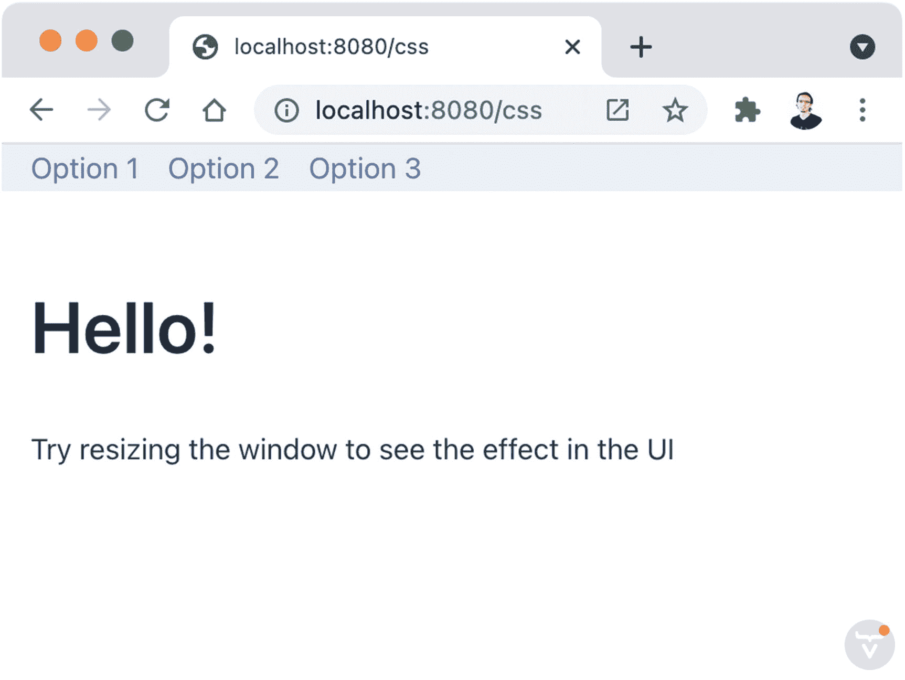

图 10-14

移动优先的设计

随着移动版本的准备就绪和默认设置，我们可以通过添加 CSS 媒体查询来针对更大的屏幕。这些查询允许您根据显示页面的设备的特征应用样式。例如，我们可以将最小宽度为 800 像素的屏幕作为目标，如下所示:

```java
@media screen and (min-width: 800px) {
  .CssView {
    display: flex;
    flex-direction: row;
  }

  .CssView-menu {
    display: flex;
    flex-direction: column;
     padding: 1em;
  }

  .CssView-menu a {
    margin-bottom: 1em;
    margin-left: 0em;
  }
}

```

这些样式将覆盖在媒体查询之外设置的任何样式(即，我们已有的移动样式)。我们正在改变一些事情。首先，视图现在是一行而不是一列。我们可以在左侧显示菜单，而不是在大屏幕的顶部。第二，菜单中的选项是一列。第三，我们调整了选项的边距，在每个选项的底部增加了空间，并删除了我们为移动版本增加的左边空间(请记住，我们正在覆盖样式)。图 [10-15](#Fig15) 显示了一个更大的浏览器窗口对视图的影响。

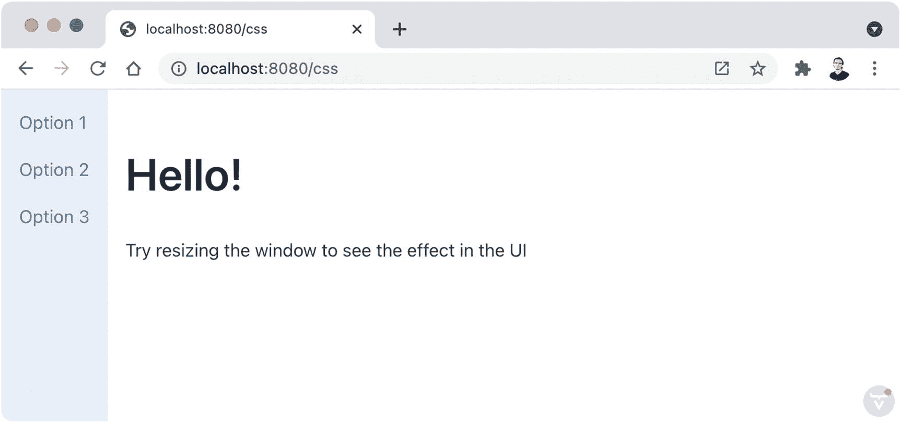

图 10-15

使用 CSS 媒体查询的响应设计

### 摘要

这一章真的提高了你的 Vaadin 技能！您了解了 Vaadin 中可用的内置主题，以及如何使用主题和组件变体。您了解了如何通过导入自定义 CSS 文件来使用 CSS 设计应用的样式，以及如何使用 Lumo 主题属性快速调整外观。您看到了如何向单个 UI 组件添加 CSS 类，以及如何在 Vaadin Web 组件的 shadow DOM 中设置样式。

您还了解了使用`FormLayout`和`AppLayout`组件的响应式 web 设计，以及针对不同屏幕尺寸的 CSS 媒体查询。

下一章通过向您介绍 Vaadin 流——一种在 TypeScript 中实现视图的方法，继续探索客户端技术。