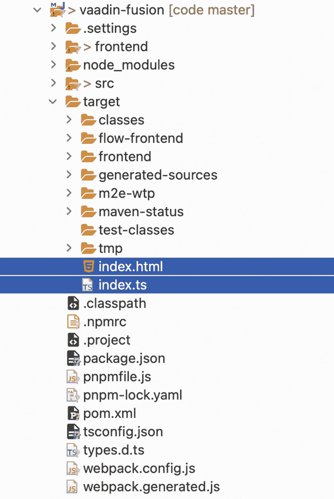
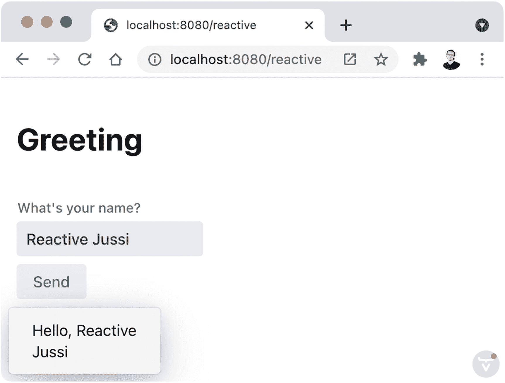

# 十一、使用 TypeScript 的客户端视图

在本书的前几章中，我们一直在编写 Java 代码。让我们休息一下，用另一种编程语言:TypeScript 来实现视图。

## 我要求流动与。我要求合并

术语 *Vaadin* 被广泛用于指代允许你用 Java 编写 web UIs 的服务器端类。但是，Vaadin 也允许您使用 TypeScript 编程语言实现 ui。在网上，你会找到诸如 Vaadin 平台、Vaadin 流、Vaadin 融合和(普通)Vaadin 之类的术语。让我们澄清一些定义:

*   **Vaadin:** 一套开发 Java web 应用的工具。这包括一个免费的开源 web 框架，这是一个生成新项目、文档和付费订阅的在线工具，除了免费提供的工具和服务之外，还有其他工具和服务。您可以使用 Java、TypeScript 或两者来实现 UI。通常，术语*Vaadin*用于指代*Vaadin 流*或*Vaadin 融合*。

*   **Vaadin 平台:**使用量下降的 *Vaadin* 的同义词。

*   **Vaadin 流程:**vaa din 的一部分，允许你用 Java 实现 ui。

*   va adin Fusion:va adin 的一部分，它允许您在 TypeScript 中实现 ui，本章将对此进行介绍。

Note

有人将 Vaadin Flow 和 Vaadin Fusion 称为 Vaadin 中的两个 *web 框架*。有些人使用了*图书馆*这个词。其他的，术语*模块*。我更愿意把它们看作是*的特色*。我把 Vaadin 流看成 Java，把 Vaadin Fusion 看成 TypeScript。

## TypeScript 快速入门

TypeScript 是 JavaScript 的超集。每个 JavaScript 程序也是一个类型脚本程序。TypeScript 增加了静态类型并将程序编译成 JavaScript。

### 安装 TypeScript 编译器

如果您想在 Vaadin 应用中使用 TypeScript，您不必安装任何附加工具。然而，如果您想尝试下一节中的代码，您将需要 *Node.js* 。您可以在 [`https://nodejs.org`](https://nodejs.org) 下载安装程序。Node.js 包含了*NPM*—一个管理 JavaScript 包的工具。您可以通过运行以下命令来检查该工具是否正常工作，并确认您获得了作为输出报告的版本:

```java
> npm --version

```

使用 *npm* ，您可以安装 TypeScript 包，如下所示:

```java
> npm install --global typescript

```

这个包包括一个 TypeScript 编译器。您可以通过运行以下命令来检查编译器是否准备好，并确认您得到了一个版本报告:

```java
> tsc –version
Version 4.2.4

```

### 在 TypeScript 中实现“Hello，World”

TypeScript 中的“Hello，World”需要一行代码:

```java
console.log("Hello, World!");

```

如果我们将这一行放到一个名为 *hello.ts* 的文件中，我们可以使用下面的命令来编译它:

```java
> tsc hello.ts

```

默认情况下，TypeScript 编译器在同一目录中创建新的 *hello.js* 文件。要运行程序，我们可以执行以下命令:

```java
> node hello.js

```

我们应该在终端中得到预期的输出:

```java
Hello, World!

```

让我们与 Java 世界做一个比较。Java 编译器 *javac* 接受一个*。java* 源文件并产生一个*。类*字节码文件。java 工具启动一个 JVM 并运行*。类*文件。在类型脚本方面，类型脚本编译器 *tsc* 接受一个*。ts* 源文件并产生一个*。js* JavaScript 文件。*节点*工具运行*。js* 文件。Node.js 是 JavaScript 的运行时，就像 web 浏览器一样。

### 静态打字

如果您有 Java 经验，阅读 TypeScript 代码是很容易的。看一下这个例子:

```java
class Bicycle {
  private color: string;
  private speed: number = 0;
  private gear: number = 1;

  public constructor(color: string) {
    this.color = color;
  }

  public speedUp(increase: number): void {
    this.speed += increase;
  }

  public applyBreak(decrease: number): number {
    return this.speed -= decrease;
  }

  public changeGear(newGear: number): number {
    return this.gear = newGear;
}

public print(): void {
    console.log(
`${this.color} bicycle: ${this.speed} Km/h (${this.gear})`);
  }
}

```

我很确定你理解了这门课的每一点。我用一种 Java 开发人员尽可能容易理解的方式对它进行了编码，但是 TypeScript 包含了使代码更加简洁的特性。

Note

讲授 TypeScript 的所有特性超出了本书的范围。你可以在网上找到优秀的学习资源。例如，官方 TypeScript 网站( [`www.typescriptlang.org`](http://www.typescriptlang.org) )包括文档和一本手册。如果你想深入学习这门语言及其生态系统，我还推荐亚当·弗里曼的*基本打字稿*。

我们可以通过在文件末尾添加一些代码来使用`Bicycle`类(我已经将其命名为 *bicycle.ts* ):

```java
class Bicycle {
  ...
}

let redBicycle = new Bicycle("red");
redBicycle.print();
redBicycle.speedUp(10);
redBicycle.changeGear(2);
redBicycle.speedUp(10);
redBicycle.changeGear(3);
redBicycle.speedUp(8);
redBicycle.applyBreak(5);
redBicycle.print();

```

我们可以编译该文件，运行它，并查看输出:

```java
> tsc bicycle.ts
> node bicycle.js
red bicycle: 0 Km/h (1)
red bicycle: 23 Km/h (3)

```

与普通 JavaScript 相比，TypeScript 代码的一个优点是它是类型安全的。如果我们在调用时在参数中使用了不正确的类型，比如说，`speedUp`函数错误地传递了一个字符串而不是一个数字，我们将看到一个编译错误:

```java
> tsc bicycle.ts
bicycle.ts:38:20 - error TS2345: Argument of type 'string' is not assignable to parameter of type 'number'.

38 redBicycle.speedUp("10");
                      ~~~~

Found 1 error.

```

类型安全语法在 TypeScript 中是可选的。如果需要，您可以随时随地使用普通 JavaScript。这使得在您的 TypeScript 程序中包含任何其他 JavaScript 库成为可能。

## 带 Lit 的 Web 组件

就像我们在第一章中看到的，Web 组件是一个具有封装的逻辑、样式和结构的定制元素。在客户端，Vaadin 组件被实现为 Web 组件。例如，一个`Button`在浏览器中被渲染为一个`<vaadin-button>`。 *Lit* 是一个用于实现 Web 组件的 JavaScript 库，它是使用 Vaadin Fusion 在 TypeScript 中创建客户端视图的基础。

### 创建新的 Lit 项目

为了帮助您使用 Lit 并试验您自己的 Web 组件，让我们用所需的最低配置创建一个新项目。该项目基于 npm，并将包括一个用于快速实验的网络服务器。我们可以从在硬盘上为项目创建一个新目录开始，命名为 *lit-element/* (你可以使用任何你想要的名字)。在这个项目中，我们需要一个 *package.json* 文件，内容如下:

```java
{
  "scripts": {
    "start": "tsc && wds"
  },
  "dependencies": {
    "lit": "*"
  },
  "devDependencies": {
    "@web/dev-server": "⁰.1.17"
  }
}

```

*package.json* 文件类似于 *pom.xml* 文件，它声明了 Java 项目的依赖关系。您可以在需要时向该文件添加更多的依赖项。在本例中，我们定义了一个名为`start`的脚本，它调用 TypeScript 编译器并启动 web 服务器。我们将 Lit 添加为运行时依赖项，将 web 服务器(`dev-server`)添加为开发依赖项。

接下来，我们需要配置 TypeScript 编译器。这可以通过一个 *tsconfig.json* 文件来完成。这个文件由 *tsc* 工具读取，并允许我们配置诸如源目录、目标目录和许多其他选项。我们现在需要的是:

```java
{
  "compilerOptions": {
    "target": "es2018",
    "module": "esnext",
    "moduleResolution": "node",
    "experimentalDecorators": true
  }
}

```

这设置了我们要生成的编译后的 JavaScript 版本(ES2018)，要使用的模块系统(ESNext)，TypeScript 如何在文件中查找模块(Node)，并启用实验性装饰器。

除此之外，我们需要通过创建一个包含以下内容的 *web-dev-server.config* 文件来配置 web 服务器:

```java
export default ({
  nodeResolve: true
});

```

要安装依赖项，请运行

```java
> npm install

```

*npm* 工具自动生成一个 *package-lock.json* 文件。这个文件可以看作是 Maven 中的*有效 POM* 的等价物，它包含了用于构建项目的确切的依赖树。此外， *npm* 工具创建一个 *node_modules/* 目录，组成库的实际文件就在这个目录中。这类似于 Java WAR 文件中的 *WEB-INF/libs* 。

现在我们准备编码了！

### 创建“Hello，World”Web 组件

我们需要一个新的 TypeScript 文件来实现 Web 组件。姑且称之为 *hello-web-component.ts* 。在这个文件中，我们需要的第一件事是包含我们想要从 Lit 库中使用的对象和类。以下是如何:

```java
import {LitElement, html} from 'lit';
import {customElement } from 'lit/decorators.js';

```

我们正在导入`LitElement`类来创建新的定制元素、`html`标记模板(一个可以处理模板文字的函数)和`customElement`装饰器(类似于 Java 中的注释)。

现在让我们将最简单的“Hello，World”编码为一个 Web 组件:

```java
import { LitElement, html } from 'lit';
import { customElement } from 'lit/decorators.js';

@customElement('hello-web-component')
export class HelloWebComponent extends LitElement {
  render() {
    return html`
      <div>Hello, World!</div>
    `;
  }
}

```

为了定义一个定制的 HTML 元素，我们需要一个扩展了`LitElement`并且用`@customElement`修饰的类。标签的名称应该总是包含一个破折号(`-`)。在`render()`函数中，我们可以使用`html`标记的模板函数返回将在浏览器中形成 Web 组件结构的 HTML。

要使用 Web 组件，我们只需要创建一个 HTML 文件，该文件导入由 TypeScript 编译器生成的 JavaScript 文件，并在文档中的某个位置添加`<hello-web-component>`元素。例如，我们可以创建下面的*demo.html*文件:

```java
<html>
<head>
<meta charset="UTF-8">
<title>Web Component example</title>
</head>
<body>

<script type="module" src="hello-web-component.js"></script>
<hello-web-component></hello-web-component>

</body>
</html>

```

要启动 web 服务器，我们可以调用在 *package.json* 文件中定义的`start`脚本:

```java
> npm run start

```

可以使用*http://localhost:8000/demo . html*请求页面。图 11-1 显示了浏览器中的结果。


图 11-1

用 Lit 实现的 Web 组件

## 使用 Vaadin Fusion 的客户端视图

现在我们对 TypeScript 和 Lit 有了基本的了解，让我们把所有的东西放在一起，用 Vaadin Fusion 实现一个客户端视图。当您想要引入水平扩展(添加更多服务器)或者需要 Vaadin Flow 目前不提供的客户端功能(例如，离线功能)时，客户端视图是一个不错的选择。

### 启用客户端引导

假设您有一个带有一个视图的常规 Vaadin 应用:

```java
@Route("flow")
public class FlowView extends Composite<Div> {

  public FlowView() {
    getContent().add(new Text("Hello from Vaadin Flow!"));
  }

}

```

当您至少有一个用 Vaadin Flow 实现的视图时，框架会检测到它，并设置一个客户端引导来处理服务器和客户端之间的所有进一步的通信。如果你检查一个 Vaadin 应用的 *target/* 目录，你会发现两个由 Vaadin 自动生成的文件(见图 11-2 )。



图 11-2

生成的 index.ts 和 index.ts 文件

当您在浏览器中请求应用时，*index.html*和 *index.ts* 文件被提供，并且在您编译应用时被创建。为了能够使用 Vaadin Fusion 实现客户端视图，我们需要设置这些文件的自己的版本。最简单的方法是编译项目，简单地将两个文件从*目标/* 目录复制到*前端/* 目录。您可以使用 IDE 或命令行来完成此操作:

```java
> mvn package
> cp target/index.* frontend/

```

在*index.html*文件中，我们需要添加一个定制样式来确保客户端视图与应用的主题相匹配。我们只需在`<style>`部分添加以下内容:

```java
<custom-style>
  <style include="lumo-typography"></style>
</custom-style>

```

并在 *index.ts* 文件中，导入 Lumo 主题:

```java
import '@vaadin/vaadin-lumo-styles/all-imports';

```

就这样。该应用已准备好使用 Vaadin 流的客户端视图！

### 添加客户端视图

要添加用 TypeScript 和 Lit 实现的客户端视图，我们需要创建一个新的*。ts* 文件在*前端/* 目录下，导入，在 *index.ts* 文件中定义路线。您可以为该文件使用任何想要的名称。作为一个可选的约定，让我们使用定制 HTML 元素的名称(用`@customElement` decorator 配置)作为添加了*的文件的名称。ts* 扩展( *fusion-view.ts* ):

```java
import { LitElement, customElement, html } from 'lit-element';

@customElement('fusion-view')
export class FusionView extends LitElement {
  render() {
    return html`
      <div>Hello from Vaadin Fusion!</div>
    `;
  }
}

```

在 *index.ts* 文件中，我们可以如下导入该文件(无需指定文件扩展名):

```java
...
import './fusion-view';
...

```

最后，我们需要为视图定义路线。客户端路由指定了一个路由(在 URL 中使用)和一个 HTML 元素，以显示何时调用该路由。为此，我们可以如下修改`routes`常数:

```java
const routes = [
  { path: 'fusion', component: 'fusion-view'},
  // for server-side, the next magic line sends all unmatched routes:
  ...serverSideRoutes // IMPORTANT: this must be the last entry in the array
];

```

这将把`fusion`设置为呈现我们之前创建的`fusion-view` Web 组件的路径。这意味着可以使用*http://localhost:8080/fusion*调用视图。见图 11-3 。


图 11-3

使用 Vaadin Fusion 实现的客户端视图

### 添加 Vaadin 组件

我们在整本书中使用的 Java 组件是作为 Web 组件在客户端实现的。Web 也可以在客户端视图中使用这些 Web 组件，而无需在服务器中安装 Java 组件。要使用 Vaadin 组件，我们必须首先导入它。例如，要使用 Vaadin 按钮，我们可以在包含视图实现的 TypeScript 文件中添加以下导入声明:

```java
import '@vaadin/vaadin-button/vaadin-button';

```

然后，我们可以在`render()`函数中使用`<vaadin-button>`组件:

```java
@customElement('some-view')
export class SomeView extends LitElement {
  render() {
    return html`
      <vaadin-button>Click me!</vaadin-button>
    `;
  }
}

```

我们可以将相同的概念应用于 Vaadin 集合中的所有组件。下面的示例展示了如何在客户端视图中组合输入组件和布局:

```java
import { LitElement, customElement, html } from 'lit-element';
import '@vaadin/vaadin-ordered-layout/vaadin-vertical-layout';
import '@vaadin/vaadin-ordered-layout/vaadin-horizontal-layout';
import '@vaadin/vaadin-combo-box/vaadin-combo-box';
import '@vaadin/vaadin-button/vaadin-button';
import '@vaadin/vaadin-text-field/vaadin-text-field';
import '@vaadin/vaadin-icons';

@customElement('vaadin-components-view')
export class VaadinComponentsView extends LitElement {
  render() {
    return html`
      <vaadin-vertical-layout theme="padding">
        <h1>Vaadin Components</h1>
        <vaadin-horizontal-layout>
          <vaadin-combo-box
            placeholder='Select a language...'
            items='[
              "Java", "TypeScript", "JavaScript"
            ]'
          ></vaadin-combo-box>
          <vaadin-button>
            <iron-icon icon="vaadin:check"></iron-icon>
            Select
          </vaadin-button>
        </vaadin-horizontal-layout>
      </vaadin-vertical-layout>
    `;
  }
}

```

始终记得导入文件并在 *index.ts* 文件中为视图定义一条路线(参见图 11-4 ):


图 11-4

Vaadin web 组件

```java
import './vaadin-components-view';
...

const routes = [
  { path: 'fusion', component: 'fusion-view'},
  { path: 'vaadin-components', component: 'vaadin-components-view'},
  ...serverSideRoutes
];

```

### 事件监听器

为了响应用户交互，我们可以使用监听器。例如，我们可以向按钮添加一个点击监听器，如下所示:

```java
<vaadin-button @click='${this.clickHandler}'>Click me!</vaadin-button>

```

然后在类级别定义 greet 函数:

```java
clickHandler() {
  ... logic here ...
}

```

当我们需要修改其他 HTML 元素时，我们可以使用`query`装饰器。这里有一个视图，包含一个`<vaadin-text-field>`、一个`<vaadin-button>`和一个`<vaadin-notification>`，它们一起向用户显示个性化的问候(见图 11-5 ):

```java
import { LitElement, customElement, html, query } from 'lit-element';
import '@vaadin/vaadin-ordered-layout/vaadin-vertical-layout';
import '@vaadin/vaadin-text-field/vaadin-text-field';
import '@vaadin/vaadin-button/vaadin-button';
import '@vaadin/vaadin-notification/vaadin-notification';

@customElement('greeting-view')
export class GreetingView extends LitElement {

  @query('#greeting-notification')
  private notification: any;

  private name: string = '';

  render() {
    return html`
      <vaadin-vertical-layout theme="padding">
        <h1>Greeting</h1>
        <vaadin-text-field
          id='name'
          label="What's your name?"
          @value-changed=
             '${(event:any) => this.setName(event.detail.value)}'
        ></vaadin-text-field>
        <vaadin-button @click='${this.greet}'>
          Send
        </vaadin-button>
      </vaadin-vertical-layout>
      <vaadin-notification id='greeting-notification'>
      </vaadin-notification>
    `;
  }

  setName(newName: string) {
    this.name = newName;
    this.notification.close();
  }

  greet() {
    let message:string = 'Hello, ' + this.name;
    this.notification.renderer = (root:any) =>
        root.textContent = message;
    this.notification.open();
  }
}

```

`@query`装饰器让`notification`对象保存`<vaadin-notification>`元素。稍后我们可以使用这个对象来设置一个定制的渲染器，以便在通知中向用户显示定制的消息。还要注意当文本字段中的值改变时，我们如何更新*模型*。在这个例子中，模型只是类中的一个字符串对象(`name`)。

### 被动观点

即使上一节的例子是有效的并且运行良好，Lit 最有趣的特性之一是可以将组件的 HTML 内容定义为封装在实现 Web 组件的类中的状态的函数。让我们通过以一种被动的方式重新实现前面的例子来看看这一点。

我们需要一组导入和一个类:

```java
import { LitElement, customElement, html, state } from 'lit-element';
import '@vaadin/vaadin-ordered-layout/vaadin-vertical-layout';
import '@vaadin/vaadin-text-field/vaadin-text-field';
import '@vaadin/vaadin-button/vaadin-button';
import '@vaadin/vaadin-notification/vaadin-notification';

@customElement('reactive-view')
export class ReactiveView extends LitElement {
  // TODO
}

```

在类内部，我们可以定义视图的状态。这个视图的状态是由什么构成的？我们有一个文本字段和一个通知，其中都有我们无法预测的值。视图的状态由文本字段中的名称和通知的可见性(可见/隐藏)决定。我们可以将这两个值相加作为`ReactiveView`类的属性，并用`state()`修饰它们:

```java
...

@customElement('reactive-view')
export class ReactiveView extends LitElement {

  @state()
  private notificationOpen = false;

  @state()
  private name = '';

}

```

`state()` decorator 将属性标记为 reactive。我们可以在`render()`方法中使用这些反应特性。但是在这样做之前，有必要考虑一下其他需要的操作。我们需要对视图做什么改变？当用户输入一个名字时，我们需要更新模型(?? 和 ?? 属性)。当用户点击按钮时，我们需要更新模型(`notificationOpen`属性)。此外，我们还需要设置通知中的文本，但我们将在稍后实现。现在让我们添加以下方法:

```java
...

@customElement('reactive-view')
export class ReactiveView extends LitElement {

 ...

  setName(newName: string) {
    this.name = newName;
    this.notificationOpen = false;
  }

  greet() {
    this.notificationOpen = true;
  }
}

```

现在我们可以将`render()`方法实现为状态的函数:

```java
...

@customElement('reactive-view')
export class ReactiveView extends LitElement {

  ...

  render() {
    return html`
      <vaadin-vertical-layout theme="padding">
        <h1>Greeting</h1>
        <vaadin-text-field
          label="What's your name?"
          @value-changed='${(event:CustomEvent) => this.setName(event.detail.value)}'
        ></vaadin-text-field>
        <vaadin-button @click='${this.greet}'>Send</vaadin-button>
      </vaadin-vertical-layout>
      <vaadin-notification
        .opened="${this.notificationOpen}"
      ></vaadin-notification>
    `;
  }

  setName(newName: string) {
    this.name = newName;
    this.notificationOpen = false;
  }

  greet() {
    this.notificationOpen = true;
  }
}

```

元素的工作方式要求我们定义一个渲染器来显示我们想要在通知中显示的文本。为此，我们可以按如下方式修改元素:

```java
      <vaadin-notification
        .opened="${this.notificationOpen}"
        .renderer=${this.greetingRenderer}
      ></vaadin-notification>

```

而`greetingRenderer`需要定义为类中的一个属性:

```java
  greetingRenderer = (root: HTMLElement) => {
    let message = 'Hello, ' + this.name;
    root.textContent = message;
  }

```

就这样。我们现在有了一个反应视图！图 11-5 为截图。



图 11-5

被动的客户端视图

### 关于离线功能的一句话

到目前为止，我们还没有直接与服务器“对话”。所有的观点是 100%客户端。在浏览器中加载后，即使您停用网络连接，视图仍会继续运行。您不能再次请求视图，也不能请求其他视图，但是已经在浏览器中呈现的视图应该继续工作。客户端和服务器之间没有通信。图 11-6 显示了前一节的例子在没有网络连接的情况下工作的截图(在 Chrome 中，你可以使用开发者工具并在*网络*标签中选择*离线*来模拟这一点)。


图 11-6

客户端视图在没有网络连接的情况下仍然可以工作

实现离线功能超出了本书的范围。如果你想了解更多关于这个主题的知识，Vaadin 官方文档有很多关于这个主题的资源(参见 [`https://vaadin.com/docs/latest/fusion/tutorials/in-depth-course/installing-and-offline-pwa`](https://vaadin.com/docs/latest/fusion/tutorials/in-depth-course/installing-and-offline-pwa) )。

Note

如果你好奇的话，Jussi 是我的一个朋友，他预测我将在今年(2021 年)写一本新书，远在 press 联系我之前。

## 摘要

在本章中，您学习了 Vaadin Fusion 的基础知识。您学习了如何编译 TypeScript 程序，以及如何使用 Lit 实现 Web 组件。您还了解了如何将客户端视图实现为用 TypeScript 和 Lit 库实现的 Web 组件。

我在这一章的目的是向你提供第一种 Vaadin 融合的方法。这里有许多我们没有涉及的主题。我相信深入解释 Vaadin 融合需要一本完整的书。然而，重要的是，您已经掌握了全局，这样您就可以接手更高级的教程和深入的文档。可以在 [` vaadin. com/ docs`](https://vaadin.com/docs) 找到好的学习资源。

下一章回到 Java 和一个令人兴奋的框架:Spring Boot。