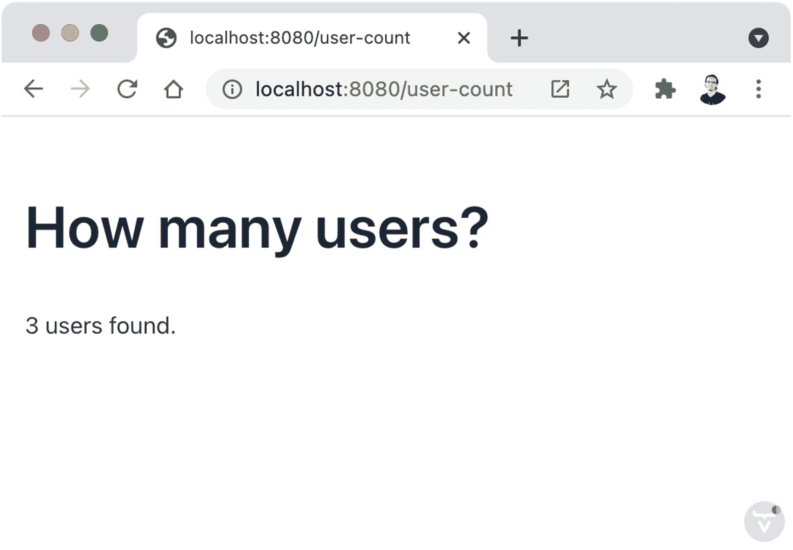

# 十三、Jakarta EE

Jakarta EE(以前的 Java 企业版)是一组帮助开发人员用 Java 实现企业软件的规范。在前面的章节中，我们已经使用了 Jakarta Servlet、Jakarta Bean 验证和 Jakarta 持久性。所有这些规范都是 Jakarta EE 的一部分。为了获得更好的视角，请快速浏览一下 [`https://jakarta.ee/specifications`](https://jakarta.ee/specifications) 的所有规格。

Jakarta EE 为您的 Java 应用提供了一个运行时环境，其编程模型基于*容器*的概念。容器通过拦截对类中方法的调用来封装代码，从而为代码添加功能。这种功能的例子是根据用户角色保护方法调用、在事务上下文中执行代码以将执行作为一个单元、方法的异步调用以及类所需的依赖项的注入。

Jakarta EE 环境可作为应用服务器使用，您可以在其中部署应用。您可以将运行时与您的应用代码一起打包在同一个工件(优步 JAR)中，或者将应用代码与运行时分开放在一个 WAR 文件中。

## 创建新的 Jakarta EE 项目

Jakarta EE 有几种兼容的实现:

*   Eclipse GlassFish

*   Apache Tomcat

*   阿帕契·汤姆

*   码头

*   Payara 平台

*   开放自由

*   野猫队

*   小贱人

*   Eclipse 球衣

在写这本书的时候，Vaadin 支持 Jakarta EE 8(版本 9 是最新的)，所以这限制了我们的选择。我们将使用 Apache TomEE 作为 Maven 插件来简化开发周期，但是您可以将示例应用部署到任何符合 Jakarta EE 8 的服务器上。

我们可以使用现有的 Vaadin 项目并添加以下依赖项，以开始使用 Jakarta EE 提供的 API:

```java
<dependency>
    <groupId>jakarta.platform</groupId>
    <artifactId>jakarta.jakartaee-api</artifactId>
    <version>8.0.0</version>
    <scope>provided</scope>
</dependency>
<dependency>
    <groupId>com.vaadin</groupId>
    <artifactId>vaadin-cdi</artifactId>
</dependency>

```

我们需要在 *src/main/webapp/WEB-INF/* 目录中添加一个新的 *beans.xml* 文件。这个文件是激活上下文和依赖注入所必需的(稍后将详细介绍)。使用以下内容创建它:

```java
<?xml version="1.0" encoding="UTF-8"?>
<beans
        xmlns:="http://xmlns.jcp.org/xml/ns/javaee"
        xmlns:xsi="http://www.w3.org/2001/XMLSchema-instance"
        xsi:schemaLocation="http://xmlns.jcp.org/xml/ns/javaee
                      http://xmlns.jcp.org/xml/ns/javaee/beans_1_1.xsd"
        bean-discovery-mode="all">
</beans>

```

不用安装 Jakarta EE 服务器，我们可以使用 Maven 运行应用，并添加 Apache TomEE 插件，如下所示(这相当于安装应用服务器，只是服务器是通过 Maven 管理的):

```java
<plugin>
    <groupId>org.apache.tomee.maven</groupId>
    <artifactId>tomee-maven-plugin</artifactId>
    <version>8.0.7</version>
    <configuration>
        <context>ROOT</context>

    </configuration>
</plugin>

```

Note

您可以在 [`https://tomee.apache.org`](https://tomee.apache.org) 了解更多关于 Apache TomEE 的信息。

现在我们可以添加一个 Vaadin 视图来检查一切是否正常:

```java
@Route("hello-jakarta-ee")
public class HelloJakartaEEView extends Composite<Component> {

  @Override
  protected Component initContent() {
    return new VerticalLayout(new Text("Hello Jakarta EE!"));
  }

}

```

您可以使用`mvn package`构建应用，并将 WAR 文件部署到任何 Jakarta EE 运行时，或者使用`mvn tomee:` `run`运行应用。图 13-1 显示了结果。


图 13-1

运行在 Apache TomEE 上的 Jakarta EE Vaadin 应用

## 创建新数据库

和前一章一样，在建立连接之前，我们需要数据库服务器运行。确保您安装了 MySQL，并使用用户名和密码连接到服务器。

Note

您可以在 [`https://dev.mysql.com/downloads`](https://dev.mysql.com/downloads) 下载免费的 MySQL 社区服务器。

我将使用默认用户(`root`):

```java
mysql -u root -p

```

引入密码后，为本章的示例应用创建一个新数据库:

```java
CREATE DATABASE jakarta_ee_example;

```

在这个数据库中，让我们创建一个新表来存储用户信息:

```java
USE jakarta_ee_example;

CREATE TABLE users(
  id INT NOT NULL AUTO_INCREMENT,
  email VARCHAR(255),
  user_password VARCHAR(255),
  birth_date DATE,
  favorite_number INT,
  PRIMARY KEY (id)
);

```

最后，我们可以在这个表中插入一些初始数据:

```java
INSERT INTO users(email, user_password, birth_date,
   favorite_number)
VALUES ("marcus@test.com", "pass1", "1990-03-11", 888);
INSERT INTO users(email, user_password, birth_date,
   favorite_number)
VALUES ("sami@test.com", "pass2", "1991-05-13", 777);
INSERT INTO users(email, user_password, birth_date,
   favorite_number)
VALUES ("guillermo@test.com", "pass3", "1992-07-15", 666);

```

检查表中是否有一些行:

```java
SELECT * FROM users;

```

## 配置数据库连接

如果您还记得上一章，Java 应用通过 JDBC 驱动程序连接到特定的数据库系统。数据库连接依赖于应用运行的环境。例如，当您开发一个应用时，您可能在同一台开发机器上运行一个数据库服务器。当您将应用部署到生产服务器时，应用并不连接到您的开发机器，而是连接到生产就绪的机器。因此，数据库连接最好在应用运行的环境中配置，而不是在应用代码中配置。

Jakarta EE 环境允许您在配置文件中定义资源，比如数据库连接。由于我们使用 Apache TomEE Maven 插件，我们的运行时环境驻留在我们工作的同一台机器上，甚至驻留在我们编码的项目中。在这种情况下，我们可以在项目内部的文件中定义连接的细节。然而，当您将应用部署到生产环境中时，您不会使用 Maven 插件。相反，您必须在生产环境中定义数据库连接。应用代码可以通过我们可以建立的名称来引用数据库连接资源。现在，我们将跳过生产设置，为 Apache TomEE Maven 插件配置数据库连接资源。

首先，我们需要将 JDBC 驱动程序添加到在 *pom.xml* 文件中定义的运行时(Apache TomEE)中。我们需要做的就是更新 Apache TomEE 插件声明，以包含 MySQL JDBC 驱动程序:

```java
<plugin>
      <groupId>org.apache.tomee.maven</groupId>
      <artifactId>tomee-maven-plugin</artifactId>
      <version>8.0.7</version>
      <configuration>
            <context>ROOT</context>
            <libs>
                  <lib>mysql:mysql-connector-java:8.0.25</lib>
            </libs>
      </configuration>
</plugin>

```

现在，包含 JDBC 驱动程序的 JAR 文件在运行时是可用的。如果您想将应用部署到一个外部独立服务器上，那么您也必须在那里添加 JAR 文件。

现在我们可以配置数据库连接细节。我们可以在一个名为 *tomee.xml* 的新文件中进行设置，该文件位于 *src/main/tomee/conf/* 目录中:

```java
<tomee>
  <Resource id="mysqlDatasource" type="DataSource">
    JdbcDriver com.mysql.cj.jdbc.Driver
    JdbcUrl jdbc:mysql://localhost:3306/jakarta_ee_example
    UserName root
    Password password
  </Resource>
</tomee>

```

注意我们使用的`id`(`mysqlDatasource`)。我们将使用这个名称从应用代码中引用这个数据源。这允许我们从运行时环境中分离连接细节。例如，生产服务器可以将数据源定义为到 Oracle 数据库的连接，而我们不必对应用代码进行任何更改。

Jakarta EE 将建立一个连接池来连接到已配置的数据库。

Note

*连接池*是应用可用的一组数据库连接。不是在事务发生时创建连接，而是重用池中的连接以避免浪费计算资源。这是自动发生的，你现在不需要担心。

## 实现实体

Jakarta EE 包含 JPA，所以我们可以添加我们在上一章中编写的相同实体，这次在所有属性中使用显式列名，并添加 Jakarta Bean 验证注释:

```java
@Entity
@Table(name = "users")
public class User {

  @Id
  @GeneratedValue(strategy = GenerationType.IDENTITY)
  @Column(name = "id")
  @NotNull
  private Integer id;

  @Column(name = "email")
  @NotNull
  @NotBlank
  @Email
  private String email;

  @Column(name = "user_password")
  @NotNull
  @NotBlank
  @Size(min = 5)
  private String password;

  @Column(name = "birth_date")
  @Past
  private LocalDate birthDate;

  @Column(name = "favorite_number")
  @PositiveOrZero
  private Integer favoriteNumber;

  @Override
  public int hashCode() {
    return Objects.hash(id);
  }

  @Override

  public boolean equals(Object obj) {
    if (this == obj)
      return true;
    if (obj == null)
      return false;
    if (getClass() != obj.getClass())
      return false;
    User other = (User) obj;
    return Objects.equals(id, other.id);
  }

  ... getters and setters ...

}

```

Note

Apache TomEE 使用 Apache OpenJPA 作为 JPA 实现。OpenJPA 用 SQL 列匹配属性名的方式不同于 Hibernate。OpenJPA 使用类和属性的确切名称在数据库中查找相应的表和列。

当在 Jakarta EE 应用中使用 JPA 时，我们需要定义一个*持久性单元*。持久性单元定义实体和与它们一起使用的数据源。为了定义一个持久性单元，我们需要在*src/main/resources/META-INF/*目录下创建一个名为 *persistence.xml* 的新文件:

```java
<persistence xmlns:="http://java.sun.com/xml/ns/persistence"
      version="1.0">

      <persistence-unit name="jakarta-ee-example-pu"
            transaction-type="RESOURCE_LOCAL">
            <jta-data-source>mysqlDatasource</jta-data-source>
            <class>com.apress.practicalvaadin.ch13.User</class>
      </persistence-unit>

</persistence>

```

如您所见，我们使用了在 Jakarta EE 运行时(Apache TomEE)中定义的数据源名称。这个文件是应用代码的一部分，但是它不包含任何数据库连接细节。正如前面指出的，连接细节存在于运行时中。还要注意我们是如何将`User`类添加为托管实体的。如果我们需要更多的实体，我们可以在那里列出它们。如果我们有不止一个数据库，我们可以定义更多的持久性单元，并向其中添加相应的实体。

## 添加存储库

Jakarta EE 本身不包含声明性存储库实现的功能。然而，它确实包含了扩展机制，Apache DeltaSpike ( [`https://deltaspike.apache.org`](https://deltaspike.apache.org) )项目包含了一个创建这种存储库类的库。我们需要在 *pom.xml* 文件的`<dependencyManagement>`部分添加 Apache DeltaSpike 物料清单(BOM ):

```java
<dependency>
      <groupId>org.apache.deltaspike.distribution</groupId>
      <artifactId>distributions-bom</artifactId>
      <version>1.9.4     </version>
      <type>pom</type>
      <scope>import</scope>

</dependency>

```

我们需要在`<dependencies>`部分添加 Apache DeltaSpike 数据模块:

```java
<dependency>
      <groupId>org.apache.deltaspike.core</groupId>
      <artifactId>deltaspike-core-api</artifactId>
      <scope>compile</scope>
</dependency>
<dependency>
      <groupId>org.apache.deltaspike.core</groupId>
      <artifactId>deltaspike-core-impl</artifactId>
      <scope>runtime</scope>
</dependency>
<dependency>
      <groupId>org.apache.deltaspike.modules</groupId>
      <artifactId>deltaspike-data-module-api</artifactId>
      <scope>compile</scope>
</dependency>
<dependency>
      <groupId>org.apache.deltaspike.modules</groupId>
      <artifactId>deltaspike-data-module-impl</artifactId>
      <scope>runtime</scope>
</dependency>

```

Apache DeltaSpike 数据需要一个`EntityManager`。图书馆寻找这个对象的方式是通过一个 *CDI 生产者*。现在不要太担心这些术语，把`EntityManager`类看作是一个助手类，作为 JPA 的接口，供 Apache DeltaSpike 数据内部使用。CDI 生产者只是一个生产`EntityManager`实例的工厂:

```java
@ApplicationScoped
public class EntityManagerProducer {

  @PersistenceUnit(unitName = "jakarta-ee-example-pu")
  private EntityManagerFactory emf;

  @Produces
  public EntityManager create() {
    return emf.createEntityManager();
  }

  public void close(@Disposes EntityManager em) {
    if (em.isOpen()) {
      em.close();
    }
  }

}

```

Jakarta EE 运行时将自动创建该类的一个实例，Apache DeltaSpike 稍后可以使用该实例通过 JPA 与数据库进行通信。我们声明了在`@PersistenceUnit`注释中使用的持久性单元的名称。现在我们看到持久性逻辑是如何通过这个持久性单元和应用服务器中定义的数据源连接到数据源的。

有了这些，我们可以定义一个存储库接口:

```java
@Repository
public interface UserRepository
    extends EntityRepository<User, Integer> {

}

```

和 Spring 一样，我们不需要实现这个接口。

## 上下文和依赖注入

Jakarta EE 和 Vaadin 是通过一个上下文和依赖注入(CDI)库集成的，我们在配置项目时已经将它添加为一个依赖项。CDI 是一个 Jakarta EE 规范，它允许对类的实例进行解耦。为了理解它是如何工作的，让我们回顾一下我们在上一节中实现的`EntityManagerProducer`类:

```java
@ApplicationScoped
public class EntityManagerProducer {

  @PersistenceUnit(unitName = "jakarta-ee-example-pu")
  private EntityManagerFactory emf;

  ...

}

```

CDI 运行时将看到`EntityManagerProducer`类用`@ApplicationScoped`进行了注释，并创建了这个类的一个新实例。该实例将由应用中该类的所有可能的客户端共享。然而，在创建实例之前，CDI 运行时发现需要一个`EntityManagerFactory`，因为有一个用`@PersistenceUnit`注释的这种类型的属性。CDI 要求 JPA 准备这个类的一个实例。JPA 使用持久性单元的名称(`jakarta-ee-example-pu`)来定位配置并创建适当的对象。CDI 获取这个对象，并将其“注入”到它正在创建的`EntityManagerProducer`实例中。这是依赖注入在起作用！

我们可以使用这种机制来注入我们添加到应用代码中的类或接口的实例。事实上，Vaadin 视图是通过 CDI 创建的，这意味着我们可以将 CDI beans(由 CDI 运行时创建和管理的其他对象)注入到 Vaadin 视图中。例如，我们可以注入一个 UserRepository 类型的实例，并按如下方式调用其方法:

```java
@Route("user-count")
public class UserCountView extends Composite<Component> {

  private final UserRepository userRepository;

  @Inject
  public UserCountView(UserRepository userRepository) {
    this.userRepository = userRepository;
  }

  @Override
  protected Component initContent() {
    long count = userRepository.count();
    return new VerticalLayout(new H1("How many users?"),
        new Text(count + " users found."));
  }

}

```

如你所见，我们用`@Inject`标记构造函数。这标记了 CDI 在创建 Vaadin 视图实例之前检测到的注入点。

有了 Vaadin 视图后，我们可以使用`tomee:run` Maven 目标运行应用，以测试一切是否按预期运行。图 13-2 显示了该视图的截图。



图 13-2

vaadin 查看 sql 数据库消费者

## 实现 CRUD

同样，您应该清楚地知道如何结合您在整本书中获得的知识，使用`Binder`类将 Vaadin UI 组件与存储库类连接起来。在本节中，我们将使用我在 [`https://vaadin.com/directory/component/crud-ui-add-on`](https://vaadin.com/directory/component/crud-ui-add-on) 提供的用于 Vaadin 的 Crud-UI 插件实现一个全功能的 CRUD。

首先，让我们将 Crud-UI 附加组件添加到`pom.xml`文件中:

```java
<repositories>
      <repository>
            <id>vaadin-addons</id>
            <url>https://maven.vaadin.com/vaadin-addons</url>
      </repository>
</repositories>
<dependencies>
      ...
      <dependency>
            <groupId>org.vaadin.crudui</groupId>
            <artifactId>crudui</artifactId>
            <version>4.4.1</version>
      </dependency>
<dependencies>

```

在前一章中，您看到了如何使用这个附加组件。这一次，让我们以不同的方式配置 CRUD 组件，以支持 Jakarta Bean 验证，并使 UX 更好一些。下面是该视图的完整实现:

```java
@Route("user-crud")
public class UserCrudView extends Composite<Component> {

  private final UserRepository userRepository;

  @Inject
  public UserCrudView(UserRepository userRepository) {
    this.userRepository = userRepository;
  }

  @Override
  protected Component initContent() {
    var crud = new GridCrud<>(User.class,
        new VerticalCrudLayout());
    crud.setSizeFull();
    crud.getGrid().setHeightByRows(true);
    crud.getCrudFormFactory().setUseBeanValidation(true);
    crud.setClickRowToUpdate(true);
    crud.setUpdateOperationVisible(false);

    crud.getGrid().setColumns("email", "birthDate",
        "favoriteNumber");
    crud.getCrudFormFactory().setVisibleProperties("email",
        "password", "birthDate", "favoriteNumber");
    crud.getCrudFormFactory().setFieldType("password",
        PasswordField.class);
    crud.setFindAllOperation(userRepository::findAll);
    crud.setAddOperation(userRepository::save);
    crud.setUpdateOperation(userRepository::save);
    crud.setDeleteOperation(userRepository::remove);

    VerticalLayout layout = new VerticalLayout(crud);
    layout.setSizeFull();
    return layout;
  }

}

```

这个实现类似于我们在上一章中使用的实现，但是它包括几个不同之处:

*   我们使用一个`VerticalCrudLayout`来可视化页面底部的表单，而不是右边。

*   我们将 CRUD 和包含它的布局设置为全尺寸。

*   我们通过调用`setHeightByRows(true)`方法，配置网格使用尽可能多的垂直空间来可视化所有包含的行。

*   我们将在添加和更新表单中激活 Jakarta Bean 验证。

*   当用户通过调用`setClickRowToUpdate(boolean)`方法点击`Grid`中的一行时，我们激活一个选项使表单可编辑。

*   我们在 UI 中隐藏了 update 按钮，因为它不再需要了(由于前面的原因)。

你可以在图 13-3 中看到应用的截图。


图 13-3

具有数据库连接的 CRUD

如果您在输入字段中引入无效值，CRUD 会显示错误消息。图 13-4 给出了一个例子。


图 13-4

显示 Jakarta Bean 验证错误消息的 CRUD 视图

## 摘要

本章让您开始学习 Jakarta EE 和使用 Apache DeltaSpike 数据的数据库连接。您了解了如何使用 JDBC 和 JPA 配置数据库连接。您了解了创建一个存储库类来读写数据是多么容易，以及如何使用依赖注入来连接 Jakarta EE 应用中的对象。最后，您看到了当您使用 Vaadin 目录中可用的附加组件时，创建 Vaadin 应用是多么简单。

这本书在它开始的地方结束。Crud-UI 插件总是完美地提醒人们为什么 Vaadin 如此强大，使用起来如此有趣。使用 Java 编程语言、Java 虚拟机和 Java 生态系统的力量来实现图形 web 用户界面是非常奢侈的。我希望您继续使用 Vaadin 和 Java 进行现代 web 开发。编码快乐！