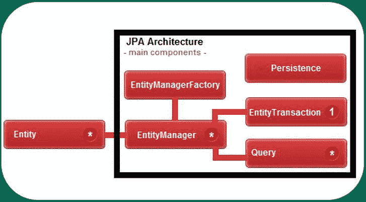
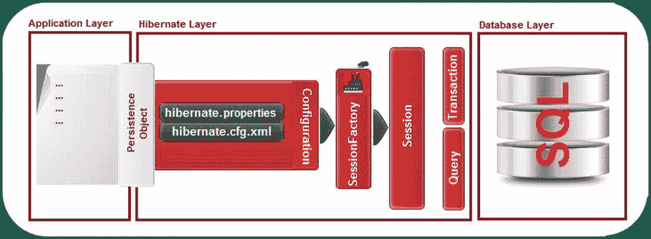
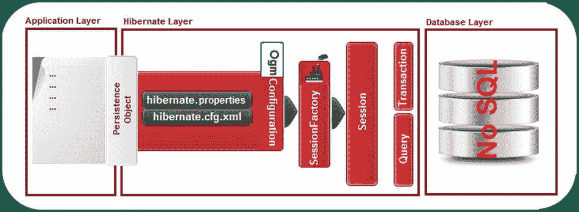

# 三、引导 Hibernate OGM

由于 Hibernate OGM 充当 NoSQL 数据存储的 JPA 实现，很明显我们可以通过 JPA 引导它。此外，它也可以通过 Hibernate 本地 API 进行引导。无论您选择哪种方式来引导 Hibernate OGM，强烈建议您在 Java 事务 API (JTA)环境中使用它，即使您没有使用 Java EE。

在进入实际的引导过程之前，让我们先简要地看一下这些规范。在接下来的章节中，您会希望记住这些技术的主要特性。当然，如果你已经是一个大师，你可以直接跳过。

JPA 简要概述

Java 持久性 API 的目标是为存储、更新和映射关系数据库和 Java 对象之间的数据的操作提供支持，反之亦然。你可以说 JPA 是决定直接使用对象而不是 SQL 语句(ORM 范式)的开发人员的完美工具。

 **注**对象关系映射是一种编程技术，它在关系数据库和面向对象编程语言之间提供了一个虚拟的对象层。编程语言通过这一层读写关系数据库。您不用编写 SQL 语句来与数据库交互，而是使用对象。此外，代码更加清晰易读，因为它没有使用 SQL 语句进行“检测”。在写这本书的时候，JPA 规范有几个实现或*持久性提供者。*有些是受欢迎的、经过测试的、稳定的(EclipseLink、Hibernate 和 Apache OpenJPA)，而有些可能不太常见，但具有非常高的基准性能(BatooJPA)。EclipseLink 是 JPA 的参考实现，它可以在 Java EE 环境和独立的 Java 应用中工作，每个 JPA 实现都应该这样。

JPA 易于使用，这要归功于*持久性元数据* 定义了 Java 对象和数据库表*之间的关系。*您可能熟悉语言级的持久性元数据，如 JDK 5.0 注释或 XDoclet 样式的注释，它们是类型安全的，并在编译时进行检查。可以说 JPA 注释实际上是普通的 JDK 5.0 注释。有些隐藏复杂的任务。一个这样的注释是`javax.persistence.Entity` ( `@Entity`注释)，它用于标记应该在数据库中持久化的 POJO Java 类——用`@Entity`注释的每个类都存储在一个表中，每个表行都是一个实体类实例。实体必须定义主键(一个简单或复杂的主键，如果存在`@GeneratedValue`注释，则显式指定或自动生成)。实体不能是最终的，并且必须定义不带参数的构造函数。表名可以反映类名，也可以通过`@Table`注释显式提供，如`@Table(name="` *my_table_name* `")`。

一个实体类定义了一组字段，每个字段默认为一个表中与该字段同名的列；您可以使用`@Column`注释对此进行更改，例如`@Column(name="` *my_column_name* `")`。JPA 可以通过 *getter* 和 *setter* 方法访问字段。默认情况下，用`@Transient`标注的字段不会被持久化，而其他字段会被持久化。

实体类是定义类(表)之间关系的地方。类与其他类可以有一对一(`@OneToOne`)、一对多(`@OneToMany`)、多对一(`@ManyToOne`)和多对多(`@ManyToMany`)的关系。当两个类存储彼此的引用时，这种关系是双向的，你必须用元素`mappedBy`在另一个类中指定关系的拥有方。当引用只是从一个类到另一个类而不是相反时，关系是*单向的*并且`mappedBy`元素是不必要的。

一旦有了反映数据库表的实体，就需要一个*实体管理器*(应用和*持久性上下文之间的接口，*)，Hibernate 文档将其描述为“一组实体实例，其中对于任何持久性实体标识都有一个唯一的实体实例”，或者更简洁地说，一个实体管理器的所有实体能够提供存储、检索、合并和查找数据库中对象的方法。实际上，这是在 Java EE 环境中自动提供的`javax.persistence.EntityManager`，比如 GlassFish 或 JBoss。如果您在非 Java EE 环境中，比如 Tomcat 或 Java SE，您必须自己管理`EntityManager`生命周期。

可以由给定的`EntityManager`实例管理的一组实体(通常是逻辑相关的)被定义为一个*持久性单元* *，*，其中的每一个都有一个惟一的名称，并驻留在一个名为 *persistence.xml* 的 XML 文档中。 *Persistence.xml* 是 JPA 的标准配置文件。它包含 JPA 提供者、JTA 或非 JTA 数据源、数据库连接信息，比如驱动程序、用户、密码、DDL 生成等等。(在 Java SE 应用中，该文件通常保存在源目录中名为 *META-INF* 的文件夹中，而在 web 应用中，该文件通常保存在 */src/conf* 文件夹中，但是，根据应用的架构，它也可以位于其他位置)。一个 *persistence.xml* 文件可以包含多个持久性单元；根据您的应用使用的数据库，服务器将知道对哪个数据库执行查询。换句话说，通过一个持久性单元，应用用来获取应用管理的实体管理器的`EntityManagerFactory`被配置用于一组实体。您可以将此视为在 JPA 中实例化`EntityManagerFactory`的一种可移植的方式。

图 3-1 显示了 JPA 架构的主要组件之间的关系。



图 3-1 。JPA 体系结构的主要组件之间的关系

嗯，真够快的。现在让我们来看看 JTA。

JTA 概述

Java 事务 API (JTA) 支持分布式事务。基本上，一个事务由一组*任务*(例如，SQL 语句)组成，它们必须作为一个不可分割的单元来处理。这是一个原子操作，事实上，“一个任务对所有人，所有任务对一个人”的规则是事务的首要原则。交易以 ACID 属性为特征，如下所示:

*   *原子性*要求如果任何一个任务失败，那么事务失败，并且它被*回滚。*如果所有任务都成功执行，则事务被*提交*。换句话说，交易是一个要么全有要么全无的命题。
*   *一致性*确保任何提交的事务将以有效状态离开数据库(根据所有定义的规则，写入的数据必须有效)。
*   *隔离*意味着你的交易是你的，是你一个人的；没有其他事务可以接触它，因为数据库使用锁定机制来保护事务，直到它成功或失败地结束。有四种隔离级别:

*   *Read Uncommitted:* 您的事务可以读取其他事务的未提交数据(在多线程环境中从不推荐)。
*   *Read Committed:* 你的事务永远不能读取其他事务的未提交数据。
*   *Repeatable:* 您的事务将在多次读取相同的行时获得相同的数据，直到它结束。
*   *Serializable:* 这种隔离级别保证了您所接触的一切(所有表)在事务处理期间保持不变。这是最严格的隔离级别，开销最大，导致的性能瓶颈也最多。

*   *耐久性*保证系统崩溃后，任何提交的交易都是安全的。

这些概念非常重要，因为事务通常会修改共享资源。

一般来说，有两种管理交易的方式:

*   Container Managed Transactions (CMT) use deployment descriptors or annotations (transaction attributes). In this case, the container is responsible for starting, committing, and rolling back a transaction. This is the *declarative* technique of demarcating transactions. In EJB containers, you can explicitly indicate a container-managed transaction using the annotation `@TransactionManagement`, like this:

    `@TransactionManagement(TransactionManagementType.CONTAINER)`

*   Moreover, you can tell the EJB container how to handle the transaction via the `@TransactionAttribute` annotation, which supports six values: `REQUIRED` (default), `REQUIRES_NEW`, `SUPPORTS`, `MANDATORY`, `NOT_SUPPORTED`, `NEVER`. For example, you can set `MANDATORY` like this:

    `@TransactionAttribute(TransactionAttributeType.MANDATORY)`

*   Bean Managed Transactions (BMT) require you to explicitly (programmatically) start, commit, and roll back transactions. This is the *programmatic* technique of demarcating transactions. In EJB containers, you can explicitly indicate a bean-managed transaction via the annotation `@TransactionManagement`, like this:

    `@TransactionManagement(TransactionManagementType.BEAN)`

有两种类型的交易:

*   *本地*事务访问并更新单个网络资源(一个数据库)上的数据。
*   *分布式*事务访问和更新两个或多个网络资源(多个数据库)上的数据。

从编程角度来说，JTA 是一个基于三个主要接口访问事务的高级 API :

*   `UserTransaction:``javax.transaction.UserTransaction`接口允许开发者以编程方式控制事务边界。为了划分 JTA 事务，您调用该接口的`begin`、`commit`和`rollback`方法。
*   `TransactionManager:``javax.transaction.TransactionManager`允许应用服务器控制事务边界。
*   `XAResource:``javax.transaction.xa.XAResource`是基于 X/Open CAE 规范的标准 XA 接口的 Java 映射。你可以在`www.en.wikipedia.org/wiki/X/Open_XA`和`www.docs.oracle.com/javaee/6/api/javax/transaction/xa/XAResource.html`找到更多关于 XA 的细节。

这是对 JTA 的一瞥。

MongoDB 和事务

MongoDB 不支持事务，这似乎是一种限制，取消了任何潜在的好处。MongoDB 仅在更改影响单个文档或单个文档的多个子文档时支持原子性。当更改(比如写操作)影响多个文档时，它们是*而不是*自动应用的，这可能导致数据不一致、其他操作交错等等。显然，由于对多个文档的更改不是原子性的，回滚是不适用的。

MongoDB 在一致性和持久性方面做得更好。MongoDB 写操作可以跨连接保持一致。此外，MongoDB 支持接近实时的复制，因此可以确保操作在返回之前已经被复制。

Hibernate OGM 减轻了 MongoDB 对事务支持的不足，它在刷新时应用更改之前对所有更改进行排队。即使 MongoDB 不支持事务，Hibernate OGM 也建议使用事务分界来透明地触发刷新操作(在提交时)。但是，正如官方文档所指出的，回滚不是一个选项。因此，本书中开发的应用将使用 Hibernate OGM 推荐的 JTA。

 **注意**根据我提到的限制，很容易得出结论，MongoDB 不能满足我们应用的需求。但是，让我们考虑一下为什么我们会得出这样的结论。我们是否过于沉迷于复杂的数据库模式设计，有许多需要事务的连接和表，以及难以编写和管理的查询？在这里讨论这些问题远不是我的目的，但是也许你会花一点时间去思考它们，并为你的应用找到正确的答案。

Hibernate 原生 API 简介

直接使用 Hibernate API 的应用被称为本地 Hibernate 应用。开发一个本地 Hibernate 应用由几个简单的步骤组成，在这些步骤中，您可以:

*   定义持久性类
*   指定属性和映射文档
*   将这些加载到应用的配置中
*   基于这个配置，创建一个会话工厂
*   从会话工厂获取(打开)会话
*   执行查询和事务

本地 API 的起点和核心是`org.hibernate.cfg.Configuration`类，它使用属性和映射文档(*)。properties* 、 *.cfg.xml* 和 *hbm.xml* 文件)来创建`org.hibernate.SessionFactory`，一个线程安全的对象，它被实例化一次，并提供一个工厂来获取会话(`org.hibernate.Session`)。`Session`实例用于执行交易(JTA)和/或查询。

图 3-2 表示 Hibernate 原生 API 架构。



图 3-2 。Hibernate 本地 API 架构

使用 JPA 引导 Hibernate OGM

使用 JPA 引导 Hibernate OGM 是最简单的情况，因为 Hibernate OGM 充当持久性提供者。如前所述，持久性提供者是在持久性单元内的 *persistence.xml* 文件中指定的。 *persistence.xml* JTA 或非 JTA；特定于数据库的要求；服务器配置；诸如此类。我试图为 Hibernate OGM 编写一个包含最低强制设置的 *persistence.xml* 文件。

1.  The first step is to write a *persistence.xml* skeleton, which (in a Java SE/EE application) generally looks like this:

    ```java
    <?xml version="1.0" encoding="UTF-8"?>
    <persistence version="2.0" FontName2">http://java.sun.com/xml/ns/persistence "                                              xmlns:xsi=" http://www.w3.org/2001/XMLSchema-instance "
    xsi:schemaLocation=" http://java.sun.com/xml/ns/persistence
    http://java.sun.com/xml/ns/persistence/persistence_2_0.xsd ">
    ...
    </persistence>
    ```

    这个文件通常保存在源目录中一个名为 *META-INF* 的文件夹中，尽管在 web 应用中它通常保存在 */src/conf* 文件夹中。

    接下来，您添加一个持久性单元；你想叫它什么都可以。JPA 实现可以通过 *RESOURCE_LOCAL* 自己管理事务，或者让应用服务器的 JTA 实现管理事务。您使用`transaction-type`属性来指定实体管理器工厂为持久性单元提供的实体管理器应该是 JTA 的还是资源本地的。这里我将把事务类型表示为`JTA`，因为我们想要使用 JTA 实体管理器。(无论服务器环境如何，Hibernate OGM 都推荐使用 JTA)。

    ```java
    <persistence-unit name=" *{PU_NAME}*" transaction-type="JTA">
    </persistence-unit>
    ...
    ```

    记住不要使用`RESOURCE_LOCAL`(一个资源本地实体管理器)，因为它使用基本的 JDBC 级事务，并且更特定于 Java SE 应用，而 JTA 是 Java EE 环境中的缺省值。

2.  现在您需要指定持久性提供者。您可能熟悉用于 GlassFish v3 的 EclipseLink 2.0、用于 JBoss AS 7 的 Hibernate 4、用于 WebSphere 6 和 7 的 OpenJPA 以及用于 WebLogic 的 OpenJPA/KODO。对于 Hibernate OGM，提供者被命名为`org.hibernate.ogm.jpa.HibernateOgmPersistence`，它可以被显式地添加到 *persistence.xml* 中，比如:

    ```java
    ...
    <provider>org.hibernate.ogm.jpa.HibernateOgmPersistence</provider>
    ...
    ```

3.  现在我们来到了 *persistence.xml* 的属性部分。使用`hibernate.transaction.jta.platform`设置的第一个属性是 JTA 平台。该属性可以有以下值(这些类属于 Hibernate 核心；它们是部署在不同应用服务器上的事务管理器):

*   JBoss 应用服务器 7 ( `www.jboss.org/as7` ) <sup>1</sup> `org.hibernate.service.jta.platform.internal.JBossAppServerJtaPlatform`
*   Bitronix JTA 交易管理器(`www.docs.codehaus.org/display/BTM/Home` ) `org.hibernate.service.jta.platform.internal.BitronixJtaPlatform`
*   Borland 企业服务器 6.0 ( `www.techpubs.borland.com/am/bes/v6/` ) `org.hibernate.service.jta.platform.internal.BorlandEnterpriseServerJtaPlatform`
*   JBoss 事务(已知与`org.jboss.jbossts:jbossjta:4.9.0.GA`一起工作的独立 JTA 事务管理器)；不适用于 Jboss AS 7) ( `www.jboss.org/jbosstm` ) `org.hibernate.service.jta.platform.internal.JBossStandAloneJtaPlatform`
*   乔纳斯·OSGi 企业服务器(OW2) ( `www.jonas.ow2.org/xwiki/bin/view/Main/` ) `org.hibernate.service.jta.platform.internal.JOnASJtaPlatform`
*   Java 开放事务管理器(JOTM)，一个独立的事务管理器(`www.jotm.objectweb.org/` ) `org.hibernate.service.jta.platform.internal.JOTMJtaPlatform`
*   JRun 4 应用服务器(`www.adobe.com/products/jrun/` ) `org.hibernate.service.jta.platform.internal.JRun4JtaPlatform`
*   `NoJtaPlatform`类，未配置 JTA 时使用的无操作版本(`www.docs.jboss.org/hibernate/orm/4.0/javadocs/org/hibernate/service/jta/platform/internal/NoJtaPlatform.html` ) `org.hibernate.service.jta.platform.internal.NoJtaPlatform`
*   Oracle 应用服务器 10 *g* (OC4J) ( `www.oracle.com/technetwork/middleware/ias/index-099846.html` ) `org.hibernate.service.jta.platform.internal.OC4JJtaPlatform`
*   Caucho 树脂应用服务器(`www.caucho.com/` ) `org.hibernate.service.jta.platform.internal.ResinJtaPlatform`
*   Sun ONE Application Server 7(该事务管理器也与 GlassFish v3 应用服务器一起工作)(`www.docs.oracle.com/cd/E19957-01/817-2180-10/pt_chap1.html` ) `org.hibernate.service.jta.platform.internal.SunOneJtaPlatform`
*   Weblogic 应用服务器(`www.oracle.com/us/products/middleware/cloud-app-foundation/weblogic/overview/index.html` ) `org.hibernate.service.jta.platform.internal.WeblogicJtaPlatform`
*   WebSphere 应用服务器版本 6 ( `www-01.ibm.com/software/webservers/appserv/was/` ) `org.hibernate.service.jta.platform.internal.WebSphereExtendedJtaPlatform`
*   WebSphere 应用服务器版本 4、5.0 和 5.1 ( `www-01.ibm.com/software/webservers/appserv/was/` ) `org.hibernate.service.jta.platform.internal.WebSphereJtaPlatform`
*   事务管理器查找桥，一个到遗留(和废弃的)`org.hibernate.transaction.TransactionManagerLookup`实现(`www.docs.jboss.org/hibernate/orm/4.0/javadocs/org/hibernate/service/jta/platform/internal/TransactionManagerLookupBridge.html` ) `org.hibernate.service.jta.platform.internal.TransactionManagerLookupBridge`的桥
*   猎户座应用服务器——这个服务器好像已经不存在了`org.hibernate.service.jta.platform.internal.OrionJtaPlatform`

 **注意**请记住，这些值在本书写作时是有效的。它们在 Hibernate 4.1 中是可用的，但是很有可能在将来会改变。你可以在`www.docs.jboss.org/hibernate/orm/4.1/devguide/en-US/html_single/`的 *Hibernate 开发者指南*中查看这个列表。

这里有一个为柯乔树脂设置 JTA 平台的例子:

```java
...
<property name="hibernate.transaction.jta.platform"
         value="org.hibernate.service.jta.platform.internal.ResinJtaPlatform"/>
...
```

接下来的五个属性配置使用哪个 NoSQL 数据存储以及如何连接到它。例如，您可以通过设置数据存储提供者、网格方言(可选)、数据库、主机和端口来连接到现成的 MongoDB 发行版，如下所示:

`...`
`<property name="hibernate.ogm.datastore.provider" value="mongodb"/>`
`<property name="hibernate.ogm.datastore.grid_dialect"`
`value="org.hibernate.ogm.dialect.mongodb.MongoDBDialect"/>`
`<property name="hibernate.ogm.mongodb.database" value="test"/>`
`<property name="hibernate.ogm.mongodb.host" value="127.0.0.1"/>`
`<property name="hibernate.ogm.mongodb.port" value="27017"/>`
`...`

就这样！现在我们可以把这些片段粘在一起，为开箱即用的 MongoDB 提供一个通用的 *persistence.xml* ，如清单 3-1 所示。在下一章中，我们将修改这个文件以适应不同的环境。

**清单 3-1。** 一个通用的 *persistence.xml* 文件

```java
<?xml version="1.0" encoding="UTF-8"?>
<persistence version="2.0" FontName2">http://java.sun.com/xml/ns/persistence "
                                           xmlns:xsi=" http://www.w3.org/2001/XMLSchema-instance "
xsi:schemaLocation=" http://java.sun.com/xml/ns/persistence
http://java.sun.com/xml/ns/persistence/persistence_2_0.xsd ">
  <persistence-unit name=" *{PU_NAME}*" transaction-type="JTA">
    <provider>org.hibernate.ogm.jpa.HibernateOgmPersistence</provider>
    <properties>
      <property name="hibernate.transaction.jta.platform"
                value=" *{JTA_PLATFORM}*"/>
      <property name="hibernate.ogm.datastore.provider" value="mongodb"/>
      <property name="hibernate.ogm.datastore.grid_dialect"
                value="org.hibernate.ogm.dialect.mongodb.MongoDBDialect"/>
      <property name="hibernate.ogm.mongodb.database" value="test"/>
      <property name="hibernate.ogm.mongodb.host" value="127.0.0.1"/>
      <property name="hibernate.ogm.mongodb.port" value="27017"/>
    </properties>
  </persistence-unit>
</persistence>
```

使用 Hibernate Native API 引导 Hibernate OGM

前面，您看到了通过简单的几个步骤就可以开发一个本地 API 应用。其中三个步骤——加载属性并将文件映射到应用中；为当前配置创建全局线程安全`SessionFactory`；以及通过`SessionFactory`获得`Session` s(单线程工作单元)——通常在众所周知的`HibernateUtil`类中实现。(你可以写这个类，但是你也可以在网上找到不同的“形状”)不变的是，在这个类中，你会有一些类似这样的代码行(对于 Hibernate 3):

```java
private static final SessionFactory sessionFactory;
...
sessionFactory = new Configuration().configure().buildSessionFactory();
...
```

看第二行，它通过一个`org.hibernate.cfg.Configuration`类的实例构建了`SessionFactory`。实际上，这是设置 Hibernate OGM 与原生 API 一起工作的入口点，因为您需要使用`org.hibernate.ogm.cfg.OgmConfiguration`类，而不是使用特定于 Hibernate ORM 的`org.hibernate.cfg.Configuration`类。因此，第二行将变成:

```java
...
sessionFactory = new OgmConfiguration().configure().buildSessionFactory();
...
```

从 Hibernate 4 开始，这段代码将给出一个关于不推荐使用的方法`buildSessionFactory()`的警告。在这种情况下，javadoc 建议使用形式`buildSessionFactory(ServiceRegistry serviceRegistry)`。因此，如果您使用 Hibernate 4(推荐)，请用下面的代码替换前面的代码:

```java
private static final SessionFactory sessionFactory;
private static final ServiceRegistry serviceRegistry;
...
OgmConfiguration cfgogm = new OgmConfiguration();
cfgogm.configure();
serviceRegistry = new ServiceRegistryBuilder().
applySettings(cfgogm.getProperties()).buildServiceRegistry();
sessionFactory = cfgogm.buildSessionFactory(serviceRegistry);
...
```

这种方法(使用 Hibernate 3 或 4)需要一个包含特定配置的 *hibernate.cfg.xml* 文件。对于 Hibernate OGM，该文件需要包含正确的事务策略和正确的事务管理器查找策略。您必须通过设置 Hibernate 配置属性 `hibernate.transaction.factory_class`来为`Transaction`实例指定一个工厂类。可接受的值为:

*   `org.hibernate.transaction.JDBCTransactionFactory`—这是默认值，它代表数据库(JDBC)事务。
*   `org.hibernate.transaction.JTATransactionFactory`—使用 bean 管理的事务，这意味着您必须手动划分事务边界。
*   `org.hibernate.transaction.CMTTransactionFactory`—该值委托给容器管理的 JTA 事务。

通过编程，您可以像这样实现此设置:

```java
...
OgmConfiguration cfgogm = new OgmConfiguration();
...
cfgogm.setProperty(Environment.TRANSACTION_STRATEGY,
" *{TRANSACTION_STRATEGY}*");
...
```

接下来，您必须通过设置名为`hibernate.transaction.jta.platform` 的属性来指定 JTA 平台。该属性的值必须由查找实现的完全限定类名组成。前面的“*使用 JPA* 引导 Hibernate OGM”一节中列出了可接受的值。

通过编程，您可以像这样实现此设置:

```java
...
OgmConfiguration cfgogm = new OgmConfiguration();
...
cfgogm.setProperty(Environment.JTA_PLATFORM," *{JTA_PLATFORM}*");
...
```

最后，您需要配置您想要使用哪个 NoSQL 数据存储库以及如何连接到它。

对于开箱即用的 MongoDB 发行版，您需要设置数据存储提供者、网格方言(可选)、数据库、主机和端口，如下所示:

```java
...
<property name="hibernate.ogm.datastore.provider">mongodb</property>
<property name="hibernate.ogm.mongodb.database">test</property>
<property name="hibernate.ogm.datastore.grid_dialect">
                org.hibernate.ogm.dialect.mongodb.MongoDBDialect</property>
<property name="hibernate.ogm.mongodb.host">127.0.0.1</property>
<property name="hibernate.ogm.mongodb.port">27017</property>
...
```

通过编程，您可以用清单 3-2 中的代码实现这些设置。

**清单 3-2。** 将 MongoDB 配置为数据存储

```java
...
OgmConfiguration cfgogm = new OgmConfiguration();
...
cfgogm.setProperty("hibernate.ogm.datastore.provider","mongodb");
cfgogm.setProperty("hibernate.ogm.mongodb.database","test");
cfgogm.setProperty("hibernate.ogm.datastore.grid_dialect ","
                    org.hibernate.ogm.dialect.mongodb.MongoDBDialect");
cfgogm.setProperty("hibernate.ogm.mongodb.host","127.0.0.1");
cfgogm.setProperty("hibernate.ogm.mongodb.port","27017");
...  
```

因此，如果您使用非编程设置，那么 *hibernate.cfg.xml* 可能如下所示:

```java
<?xml version="1.0" encoding="UTF-8"?>
<!DOCTYPE hibernate-configuration PUBLIC "-//Hibernate/Hibernate Configuration DTD 3.0//EN" " http://www.hibernate.org/dtd/hibernate-configuration-3.0.dtd ">
<hibernate-configuration>
  <session-factory>
    <property name="hibernate.transaction.factory_class">
       { *TRANSACTION_STRATEGY* }
    </property>
    <property name="hibernate.transaction.jta.platform">
       *{JTA_PLATFORM}*
    </property>
    <property name="hibernate.ogm.datastore.provider">mongodb</property>
    <property name="hibernate.ogm.mongodb.database">test</property>
    <property name="hibernate.ogm.datastore.grid_dialect">
       org.hibernate.ogm.dialect.mongodb.MongoDBDialect</property>
    <property name="hibernate.ogm.mongodb.host">127.0.0.1</property>
    <property name="hibernate.ogm.mongodb.port">27017</property>
    <mapping resource="..."/>
    ...
  </session-factory>
</hibernate-configuration>
```

清单 3-3 显示了使用这个配置文件的 *HibernateUtil* 类。

**清单 3-3。** ibernateUtil

```java
import java.util.logging.Level;
import java.util.logging.Logger;
import org.hibernate.SessionFactory;
import org.hibernate.ogm.cfg.OgmConfiguration;
import org.hibernate.service.ServiceRegistry;
import org.hibernate.service.ServiceRegistryBuilder;

/**
 * HibernateUtil class (based on hibernate.cfg.xml)
 *
 */
public class HibernateUtil {

    private static final Logger log = Logger.getLogger(HibernateUtil.class.getName());
    private static final SessionFactory sessionFactory;
    private static final ServiceRegistry serviceRegistry;

    static {
        try {
            // create a new instance of OmgConfiguration
            OgmConfiguration cfgogm = new OgmConfiguration();

            //process configuration and mapping files
            cfgogm.configure();
            // create the SessionFactory
            serviceRegistry = new ServiceRegistryBuilder().
                 applySettings(cfgogm.getProperties()).buildServiceRegistry();
            sessionFactory = cfgogm.buildSessionFactory(serviceRegistry);
        } catch (Throwable ex) {
            log.log(Level.SEVERE,
                    "Initial SessionFactory creation failed !", ex);
            throw new ExceptionInInitializerError(ex);
        }
    }

    public static SessionFactory getSessionFactory() {
        return sessionFactory;
    }
}
```

如果你使用的是编程设置，你不需要一个 *hibernate.cfg.xml* 文件，你的 *HibernateUtil* 将会如清单 3-4 所示。

**清单 3-4。**?? 一个不需要 Hibernate.cfg.xml 的 HibernateUtil 类

```java
import java.util.logging.Level;
import java.util.logging.Logger;
import org.hibernate.SessionFactory;
import org.hibernate.cfg.Environment;
import org.hibernate.ogm.cfg.OgmConfiguration;
import org.hibernate.service.ServiceRegistry;
import org.hibernate.service.ServiceRegistryBuilder;

/**
 * HibernateUtil class (no need of hibernate.cfg.xml)
 *
 */
public class HibernateUtil {

    private static final Logger log = Logger.getLogger(HibernateUtil.class.getName());
    private static final SessionFactory sessionFactory;
    private static final ServiceRegistry serviceRegistry;

    static {
        try {
            // create a new instance of OmgConfiguration
            OgmConfiguration cfgogm = new OgmConfiguration();

            // enable transaction strategy
            cfgogm.setProperty(Environment.TRANSACTION_STRATEGY,
                                                "{ *TRANSACTION_STRATEGY*}");
            // specify JTA platform
            cfgogm.setProperty(Environment.JTA_PLATFORM, "{ *JTA_PLATFORM*}");

            //configure MongoDB connection
            cfgogm.setProperty("hibernate.ogm.datastore.provider", "mongodb");
            cfgogm.setProperty("hibernate.ogm.datastore.grid_dialect",
              "org.hibernate.ogm.dialect.mongodb.MongoDBDialect");
            cfgogm.setProperty("hibernate.ogm.mongodb.database", "test");
            cfgogm.setProperty("hibernate.ogm.mongodb.host", "127.0.0.1");
            cfgogm.setProperty("hibernate.ogm.mongodb.port", "27017");

            //add our annotated class
            cfgogm.addAnnotatedClass(*.class);

            // create the SessionFactory
            serviceRegistry = new ServiceRegistryBuilder().
               applySettings(cfgogm.getProperties()).buildServiceRegistry();
            sessionFactory = cfgogm.buildSessionFactory(serviceRegistry);
        } catch (Throwable ex) {
            log.log(Level.SEVERE,
                "Initial SessionFactory creation failed !", ex);
            throw new ExceptionInInitializerError(ex);
        }
    }

    public static SessionFactory getSessionFactory() {
        return sessionFactory;
    }
}
```

现在，图 3-2 中呈现的 Hibernate Native API 可以重绘成图 3-3 中的样子。



图 3-3 。Hibernate OGM 中的 Hibernate Native API 架构

 **注意**使用默认配置(*org/hibernate/ogm/datastore/Infinispan/default-config . XML*)设置 infini span 可以通过将`hibernate.ogm.datastore.provider`属性的值指定为`infinispan`来完成。通过将相同的属性设置为`Ehcache`，您可以使用默认配置(*org/hibernate/ogm/datastore/Ehcache/default-Ehcache . XML*)设置 Ehcache。对于这两个 NoSQL 产品，Hibernate OGM 还支持一个特定的属性来指示 XML 配置文件。对于 Infinispan，该属性称为*hibernate . ogm . Infinispan . configuration _ resourcename*，对于 Ehcache，该属性称为*hibernate . ogm . Ehcache . configuration _ resourcename*。因此，对于 Infinispan 和 Ehcache，不需要设置方言、数据库、端口和主机。

Hibernate OGM 过时配置选项

随着 Hibernate OGM 的出现，Hibernate ORM 中的一组选项不再可用。因此，根据 Hibernate OGM 规范，以下选项不应在 OGM 环境中使用:

*   `hibernate.dialect`
*   `hibernate.connection.*`特别是`hibernate.connection.provider_class`
*   `hibernate.show_sql and hibernate.format_sql`
*   `hibernate.default_schema and hibernate.default_catalog`
*   `hibernate.use_sql_comments`
*   `hibernate.jdbc.*`
*   `hibernate.hbm2ddl.auto`和`hibernate.hbm2ddl.import_file`

摘要

在简要了解了 Java 持久性 API (JPA) 、Java 事务 API (JTA) 和 Hibernate 本机 API 之后，您看到了如何使用 JPA 和 Hibernate 本机 API 引导 Hibernate OGM。您了解了如何编写一个通用的 persistence.xml，以及如何为 Hibernate OGM 实现一个 HibernateUtil 类。最后，您看到了 Hibernate OGM 中不再提供的 Hibernate ORM 配置属性列表。

<sup>1</sup>2013 年 4 月 Red Hat，Inc .宣布下一代 JBoss 应用服务器将被称为 Wildfly。参见`http://gb.redhat.com/about/news/press-archive/2013/4/red-hat-reveals-plans-for-its-next-generation-java-application-server-project`