# 六、Hibernate OGM 查询 MongoDB

在前面的章节中，我们完成了几个任务，以便在 NoSQL MongoDB 存储中组织和存储我们的数据。现在，我们将通过应用不同的查询技术来利用这些数据，从 NoSQL MongoDB 商店中只提取我们需要的信息。

正如我在[第 1 章](01.html)中提到的，查询 NoSQL 数据库是一项微妙而复杂的任务——根据对 NoSQL 查询的本地支持，有不同的情况和不同的方法。对于 MongoDB，有许多查询选项；根据查询的复杂性、性能参数等，您可以选择满足自己需求的方法:

*   原生查询技术，这意味着使用 MongoDB 驱动程序查询功能，而不涉及 Hibernate OGM 或任何其他技术。
*   Hibernate ORM/OGM for CRUD ，其中创建/读取/更新/删除操作由 Hibernate ORM 引擎实现。
*   hibernate Search/Apache Lucene，它使用了全文索引和查询引擎(Apache Lucene)。Hibernate Search 是一个强大的查询机制，具有很好的性能和功能，并且提供了一个非常易用的到 Lucene 的桥梁。对于复杂的查询和索引支持，这是正确的选择。
*   Hibernate OGM JP-QL 解析器，使用 Hibernate Search 从 MongoDB 存储中检索所需的信息，适合简单的查询。这个 JP-QL 解析器还处于起步阶段，所以它需要时间变得强大并支持复杂的查询。
*   其他工具，比如 DataNucleus、Morphia 等等，不会在本书中涉及。

 **注意**目前，Hibernate OGM 通过 Hibernate Native API 不提供对 Hibernate 标准的支持。此外，它没有通过 JPA 提供对本地和命名查询的支持。

我们将深入研究这些查询的可能性，并尝试看看它是如何工作的。我们将重点讨论 Hibernate OGM，并从这个角度讨论 MongoDB。然而，为了完整起见，我们将通过首先查看基本的 MongoDB 查询功能来开始关于查询 MongoDB 的旅程，并将 Hibernate OGM 的主题保留到本章的第二部分。通过这种方式，您将对查询 MongoDB 有一个全面的了解，并且能够更好地选择适合您需求的查询解决方案。

MongoDB 原生查询

您可能知道，MongoDB 本身通过`mongo` shell(一个为 MongoDB 提供数据库接口的完全交互式 JavaScript 环境)提供交互式支持，并通过 MongoDB 驱动程序(可用于多种编程语言，如 Java、Ruby 和 PHP)提供编程支持。在这一节中，我们将跳过 shell，专注于使用 MongoDB Java 驱动程序查询 MongoDB 存储。您将需要这个驱动程序的 2.8.0 版本，可以在`www.docs.mongodb.org/manual/applications/drivers/`下载这个名为`mongo-java-driver-2.8.0.jar`的 JAR。

在执行任何查询之前，您需要配置一个 MongoDB 连接并创建一个数据库，然后创建一个集合并用数据填充它。为此，请回到第 4 章中的“Java SE 和 Mongo DB——hello world 示例”一节一旦知道如何将文档连接到 MongoDB 存储并持久化，就可以执行查询了。

我们将创建一个名为`players`的集合，并尝试对其进行一些查询。每个文档都存储一些网球运动员的数据:姓名、年龄和出生日期(允许有重复的文档)。在用几个文档填充集合之后，可以从众所周知的“全选”查询开始。您可以使用`find`方法，该方法返回包含许多文档的光标。如您所见，迭代结果非常容易。这段代码使用`find`提取所有文档:

```java
...
Mongo mongo = new Mongo("127.0.0.1", 27017);
DB db = mongo.getDB("players_db");
DBCollection dbCollection = db.getCollection("players");
...
System.out.println("Find all documents in collection:");
            try (DBCursor cursor = dbCollection.find() ) {
                while (cursor.hasNext()) {
                    System.out.println(cursor.next());
                }
            }
...
```

该查询的结果如[图 6-1](#Fig1) 所示。

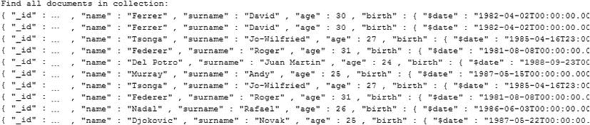

[图 6-1](#_Fig1) 。玩家收藏的所有文件

 **注意**你可以通过调用`getCount`方法来统计一个集合中有多少个文档，就像这样:`dbCollection.getCount();`。

您可以使用`findOne`方法找到单个文档；该方法不返回光标。截取的代码是:

```java
...
System.out.println("Find the first document in collection:");
            DBObject first = dbCollection.findOne() ;
            System.out.println(first);
...
```

结果将是来自`players`集合的第一个文档，如图[图 6-2](#Fig2) 所示。

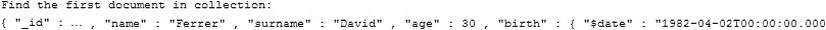

[图 6-2](#_Fig2) 。提取玩家集合的第一个文件

您还可以执行条件查询。例如，我们可以使用`find`方法提取对应于球员拉斐尔·纳达尔的文档，就像这样:

```java
...
System.out.println("Find Rafael Nadal documents:");
            BasicDBObject query = new BasicDBObject("name", "Nadal").append("surname", "Rafael");
            try (DBCursor cursor = dbCollection.find(query) ) {
                while (cursor.hasNext()) {
                    System.out.println(cursor.next());
                }
            }
...
```

结果如[图 6-3](#Fig3) 所示。

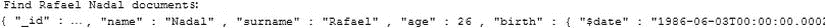

[图 6-3](#_Fig3) 。仅提取包含拉斐尔·纳达尔的文档

结合了`$gt`(大于)操作符的`find`方法允许你提取所有年龄大于 25 岁的玩家:

```java
...
System.out.println("Find players with age > 25:");
            BasicDBObject  query = new BasicDBObject("age", new BasicDBObject("$gt", 25));
            try (DBCursor cursor = dbCollection.find(query) ) {
                while (cursor.hasNext()) {
                    System.out.println(cursor.next());
                }
            }
...
```

你可以在[图 6-4](#Fig4) 中看到结果。

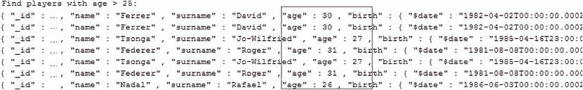

[图 6-4](#_Fig4) 。仅提取时间超过 25 年的文档

结合了`$lt`(小于)操作符的`find`方法允许您提取所有年龄小于 28 岁的玩家:

```java
...
System.out.println("Find players with age < 28:");
            BasicDBObject  query = new BasicDBObject("age", new BasicDBObject("$lt", 28));
            try (DBCursor cursor = dbCollection.find(query) ) {
                while (cursor.hasNext()) {
                    System.out.println(cursor.next());
                }
            }
...
```

结果如[图 6-5](#Fig5) 所示。


[图 6-5](#_Fig5) 。仅提取时间小于 28 年的文档

使用`$gt`和`$lt`，或`$gte`(大于或等于)和`$lte`(小于或等于)运算符和`find`方法，可以提取值区间之内(或之外)的数据。例如，您可以获得所有 1982 年 1 月 1 日至 1985 年 12 月 31 日之间出生的玩家，如下所示:

```java
...
System.out.println("JAVA - Find players with birthday between 1 January, 1982 - 31 December, 1985:");
            Calendar calendar_begin = GregorianCalendar.getInstance();
            calendar_begin.clear();
            calendar_begin.set(1982, Calendar.JANUARY, 1);
            Calendar calendar_end = GregorianCalendar.getInstance();
            calendar_end.clear();
            calendar_end.set(1985, Calendar.DECEMBER, 31);
            BasicDBObject query = new BasicDBObject("birth", new BasicDBObject("$gte",
                                  calendar_begin.getTime()).append("$lte", calendar_end.getTime()));
            try (DBCursor cursor = dbCollection.find(query) ) {
                while (cursor.hasNext()) {
                    System.out.println(cursor.next());
                }
            }
...
```

结果如[图 6-6](#Fig6) 所示:

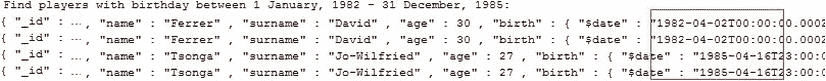

[图 6-6](#_Fig6) 。仅提取出生日期在 1982 年 1 月 1 日至 1985 年 12 月 31 日之间的文档

如果您喜欢使用 Joda Time(Java 日期和时间类的替代，可从`http://joda-time.sourceforge.net`获得)，您可以像这样编写查询:

```java
System.out.println("JODA - Find players with birthday between 1 January, 1982 - 31 December, 1985:");
            DateTime joda_calendar_begin = new DateTime(1982, 1, 1, 0, 0);
            DateTime joda_calendar_end = new DateTime(1985, 12, 31, 0, 0);
            query = new BasicDBObject("birth", new BasicDBObject("$gte", joda_calendar_begin.toDate()).append("$lte", joda_calendar_end.toDate()));
            try (DBCursor cursor = dbCollection.find(query) ) {
                while (cursor.hasNext()) {
                    System.out.println(cursor.next());
                }
            }
```

您还可以使用`$in`操作符和`find`方法提取具有特定值的数据。例如，您可以获得年龄为 25、27 和 30 岁的所有玩家，如下所示:

```java
...
System.out.println("Find players with ages: 25, 27, 30");
            List<Integer> list = new ArrayList<>();
            list.add(25);
            list.add(27);
            list.add(30);
            BasicDBObject  query = new BasicDBObject("age", new BasicDBObject("$in", list));
            try (DBCursor cursor = dbCollection.find(query) ) {
                while (cursor.hasNext()) {
                    System.out.println(cursor.next());
                }
            }
...
```

结果如[图 6-7](#Fig7) 所示。

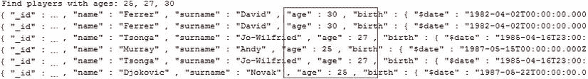

[图 6-7](#_Fig7) 。仅提取年龄等于 25、27 或 30 岁的文档

当需要取反提取数据时，可以使用`$ne`(不等于)运算符和`find`方法。例如，您可以轻松获得所有年龄不等于 27 岁的玩家，如下所示:

```java
...
System.out.println("Find players with ages different from: 27");
            BasicDBObject  query = new BasicDBObject("age", new BasicDBObject("$ne", 27));
            try (DBCursor cursor = dbCollection.find(query) ) {
                while (cursor.hasNext()) {
                    System.out.println(cursor.next());
                }
            }
...
```

结果如[图 6-8](#Fig8) 所示:

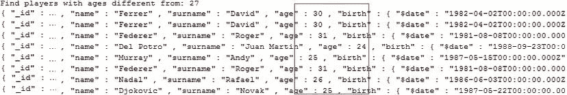

[图 6-8](#_Fig8) 。仅提取年龄不在 27 岁的文档

在前面的例子中，我们使用 MongoDB Java 驱动程序从 MongoDB 创建(插入)和检索(读取)数据。您可以通过调用`save`方法来完成更新。例如，你可以用拉斐尔·纳达尔·帕雷拉代替拉斐尔·纳达尔，就像这样:

```java
...
            System.out.println("UPDATING ...");
            BasicDBObject  query = new BasicDBObject("name", "Nadal").append("surname", "Rafael");
            try (DBCursor cursor = dbCollection.find(query)) {
                while (cursor.hasNext()) {
                    DBObject item = cursor.next();
                    item.put("name", "Nadal Parera");
                    dbCollection.save(item);
                }
            }
...
```

并且可以通过调用`remove`方法来删除数据。例如，您可以删除罗杰·费德勒的所有出现，如下所示:

```java
...
            System.out.println("DELETING ...");
           BasicDBObject  query = new BasicDBObject("name", "Federer").append("surname", "Roger");
            try (DBCursor cursor = dbCollection.find(query)) {
                while (cursor.hasNext()) {
                    DBObject item = cursor.next();
                    dbCollection.remove(item);
                }
            }
...
```

 **注意**关于使用 MongoDB 驱动程序的高级查询，请参见 Eelco Plugge、Tim Hawkins 和 Peter Membrey 编写的*MongoDB 权威指南*(a press，2010)。参观`www.apress.com/9781430230519`。

包含前面代码片段的完整应用可以在 Apress 存储库中获得，并被命名为`MONGODB_QUERY`。它是一个 NetBeans 项目，在 Java 7 下进行了测试。

Hibernate OGM 和 CRUD 操作

针对 NoSQL 数据库执行的四个基本操作——创建、读取、更新和删除——在 Hibernate OGM 中现成可用。实际上，独立于 JPA 或 Hibernate 原生 API，Hibernate ORM 将持久性和加载查询委托给 OGM 引擎，OGM 引擎将 CRUD 操作委托给`DatastoreProvider`和`GridDialect,`，它们与 NoSQL 存储交互。

在第 3 章和第 4 章中，您看到了如何通过 Hibernate Native API 和 Java Persistence API 开发基于 Hibernate OGM 的应用。因此，将清单 6-1 中的`Players`实体包装成这样一个应用应该是小菜一碟。

***[清单 6-1](#_list1) 。*** 玩家实体

```java
package hogm.hnapi.entity;

import java.io.Serializable;
...

@Entity
@Table(name = "atp_players")
@GenericGenerator(name = "mongodb_uuidgg", strategy = "uuid2")
public class Players implements Serializable {

    @Id
    @GeneratedValue(generator = "mongodb_uuidgg")
    private String id;
    @Column(name = "player_name")
    private String name;
    @Column(name = "player_surname")
    private String surname;
    @Column(name = "player_age")
    private int age;
    @Column(name = "player_birth")
    @Temporal(javax.persistence.TemporalType.DATE)
    private Date birth;

    public String getName() {
        return name;
    }

    public void setName(String name) {
        this.name = name;
    }

    public String getSurname() {
        return surname;
    }

    public void setSurname(String surname) {
        this.surname = surname;
    }

    public int getAge() {
        return age;
    }

    public void setAge(int age) {
        this.age = age;
    }

    public Date getBirth() {
        return birth;
    }

    public void setBirth(Date birth) {
        this.birth = birth;
    }

    public String getId() {
        return id;
    }

    public void setId(String id) {
        this.id = id;
    }
}
```

完成后，您就可以访问 CRUD 操作了。假设我们有一个名为`player`的`Players`实例

.

通过 Hibernate 本地 API 使用 Hibernate OGM，您可以用`getCurrentSession`或`openSession`方法获得 Hibernate 会话。

*   要持久化`player`实例，使用`persist`方法:

    ```java
    HibernateUtil.getSessionFactory().getCurrentSession().persist(player);
    ```

*   要更新`player`实例，使用`merge`方法:

    ```java
    HibernateUtil.getSessionFactory().getCurrentSession().merge(player);
    ```

*   通过`id`找到`player`实例，使用`find`方法:

    ```java
    HibernateUtil.getSessionFactory().getCurrentSession().get(Players.class, *id* );
    ```

*   要删除`player`实例，使用`delete`方法:

    ```java
    HibernateUtil.getSessionFactory().getCurrentSession().delete(player);
    ```

您可以在一个名为`HOGM_MONGODB_HNAPI_CRUD`的示例应用中尝试所有这些方法，该应用可以在 Apress 存储库中找到。它是一个 NetBeans 项目，并在 GlassFish 3 AS 下进行了测试。界面应用看起来像[图 6-9](#Fig9) 。

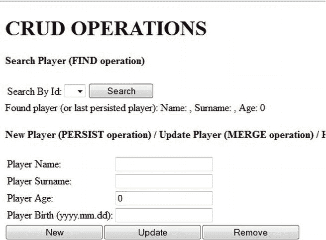

[图 6-9](#_Fig9) 。测试 Hibernate OGM 和 CRUD 操作

通过 Java 持久性 API ( `em`代表`EntityManager`)使用 Hibernate OGM:

*   要持久化`player`实例，使用`persist`方法:

    ```java
    em.persist(player);
    ```

*   要更新`player`实例，使用`merge`方法:

    ```java
    em.merge(player);
    ```

*   通过`id`找到`player`实例，使用`find`方法:

    ```java
    em.find(Players.class, *id* );
    ```

*   要删除`player`实例，使用`delete`方法:

    ```java
    em.delete (player);
    ```

您可以在一个名为`HOGM_MONGODB_JPA_CRUD`的示例应用中尝试所有这些方法，该应用可以在 Apress 存储库中找到。它是一个 NetBeans 项目，并在 GlassFish 3 AS 下进行了测试。界面应用类似于图 6-9 中的[。](#Fig9)

Hibernate 搜索和 Apache Lucene

基本上，Hibernate/JPA 和 Apache Lucene 处理相同的领域——查询数据。它们都提供 CRUD 操作、基本数据单元(Hibernate 中的实体，Lucene 中的文档)和相同的编程概念。主要区别在于 Hibernate/JPA 提倡面向领域模型的编程，而 Lucene 只处理单一的内置数据模型——`Document`类，它太简单了，无法描述复杂的关联。然而，这两者结合起来就产生了一个更高级的 API，叫做 Hibernate Search。

Hibernate Search 和 Apache Lucene 都是强大、健壮的技术。虽然 Apache Lucene 是一个具有出色查询性能的全文索引和查询引擎，但是 Hibernate Search 将它的强大功能带到了持久性域模型中。共生关系运行得相当好:Hibernate Search“挤压”了 Apache Lucene 的查询能力，同时提供了对域模型、数据库和索引同步的支持，并将自由文本查询转换回托管对象。因为我们的重点是 Hibernate OGM 和 MongoDB，所以我不会提供 Hibernate 搜索或 Apache Lucene 教程。相反，我们将快速开发示例，我将为您提供足够的信息来理解新的 Hibernate Search/Apache Lucene 注释和类，而不会深入细节。我们将把 Hibernate ORM、OGM 和 Search 与 Apache Lucene 和 MongoDB 结合到具有查询功能的应用中，以便您可以探索查询过程的复杂性。一旦你有了一个功能性的应用，你将能够尝试各种各样的查询。

我们将开发两个应用。第一个是 Hibernate OGM/via Hibernate Native API 应用，第二个是 Hibernate OGM via JPA(详见第 3 章和第 4 章)。这两个应用将遵循一个共同的、简单的场景:我们将创建一个实体(和相应的 POJO，只针对 Hibernate Native API)，将几个实例持久化到一个 MongoDB 集合中，并通过 Hibernate Search 和 Apache Lucene 执行一些查询示例。

POJO 被命名为`Players`，如[清单 6-2](#list2) 所示(这个 POJO 被映射到一个`hbm.xml`文件中)。

***[清单 6-2](#_list2) 。*** 玩家类

```java
public class Players {

    private String id;
    private String name;
    private String surname;
    private int age;
    private Date birth;

    public String getName() {
        return name;
    }

    public void setName(String name) {
        this.name = name;
    }

    public String getSurname() {
        return surname;
    }

    public void setSurname(String surname) {
        this.surname = surname;
    }

    public int getAge() {
        return age;
    }

    public void setAge(int age) {
        this.age = age;
    }

    public Date getBirth() {
        return birth;
    }

    public void setBirth(Date birth) {
        this.birth = birth;
    }

    public String getId() {
        return id;
    }

    public void setId(String id) {
        this.id = id;
    }
}
And thePlayers.hbm.xml fileis shown in Listing 6-3.
```

***[清单 6-3](#_list3) 。*T5】players . hbm . XML**

```java
<?xml version="1.0" encoding="UTF-8"?>
<!DOCTYPE hibernate-mapping PUBLIC "-//Hibernate/Hibernate Mapping DTD 3.0//EN" " http://www.hibernate.org/dtd/hibernate-mapping-3.0.dtd ">
<hibernate-mapping>
    <class name="hogm.hnapi.pojo.Players" table="atp_players">
        <id name="id" type="string">
            <column name="id" />
            <generator class="uuid2" />
        </id>
        <property name="name" type="string">
            <column name="player_name"/>
        </property>
        <property name="surname" type="string">
            <column name="player_surname"/>
        </property>
        <property name="age" type="int">
            <column name="player_age"/>
        </property>
        <property name="birth" type="date">
            <column name="player_birth"/>
        </property>
    </class>
</hibernate-mapping>
```

或者，如果你喜欢实体版本，POJO 就变成清单 6-4 中所示的样子。(两个应用中都使用了该实体。)

***[清单 6-4](#_list4) 。*** 实体版玩家

```java
import java.io.Serializable;
...

@Entity
@Table(name = "atp_players")
@GenericGenerator(name = "mongodb_uuidgg", strategy = "uuid2")
public class Players implements Serializable {

    @Id
    @GeneratedValue(generator = "mongodb_uuidgg")
    private String id;
    @Column(name = "player_name")
    private String name;
    @Column(name = "player_surname")
    private String surname;
    @Column(name = "player_age")
    private int age;
    @Column(name = "player_birth")
    @Temporal(javax.persistence.TemporalType.DATE)
    private Date birth;

    public String getName() {
        return name;
    }

    public void setName(String name) {
        this.name = name;
    }

    public String getSurname() {
        return surname;
    }

    public void setSurname(String surname) {
        this.surname = surname;
    }

    public int getAge() {
        return age;
    }

    public void setAge(int age) {
        this.age = age;
    }

    public Date getBirth() {
        return birth;
    }

    public void setBirth(Date birth) {
        this.birth = birth;
    }

    public String getId() {
        return id;
    }

    public void setId(String id) {
        this.id = id;
    }
}
```

常见步骤

无论是哪种应用类型(通过 Hibernate Native API 的 OGM 还是通过 JPA )，都有一些添加 Hibernate Search 或 Apache Lucene 支持的通用步骤:

1.  除了 Hibernate OGM 和 MongoDB 库(记得是从[第 1 章](01.html)开始的)，我们至少还需要再添加两个 jar:`hibernate-search-orm-4.2.0.Final.jar`和`avro-1.6.3.jar`。这两个版本都可以在 Hibernate Search 发行版 4.2.0 最终版中获得。注意，许多其他 jar，包括 Apache Lucene 和 Object/Lucene core mapper，都可以在 Hibernate OGM 和 MongoDB 库中找到。
2.  接下来，我们需要关注我们的 POJO(或实体)类。这是将 Hibernate Search 引入等式的第一步——特定于 Hibernate Search 的配置通过注释来表达。更准确地说，我们需要使用一些注释来映射 POJO(实体)。

*   我们将使用`@Indexed`注释将`Players`类标记为可索引的(可搜索的)。没有用`@Indexed`标注的实体将被索引过程忽略。
*   然后，我们指定如何在字段或属性级别使用`@Field`注释进行索引。有一些受支持的属性，但是现在，它足以表明字段或属性是否被索引(使用`index`属性)；是否分析字段或属性(使用`analyze`属性)；以及字段或属性是否存储在 Lucene 索引中(使用`store`属性)。官方文档中提供了更多属性和详细描述。
*   因为我们有一个`Date`字段，所以我们需要知道一些关于 Hibernate Search 如何处理日期的事情。日期以 GMT 时间(200611072203012，2006 年 11 月 7 日下午 4:03 点和美国东部时间 12 点)存储为“*yyyyyymmdhhmmssss”，*”但是我们可以使用`@DateBridge`注释指定在索引中存储日期的适当分辨率(分辨率可以是`DAY`、`HOUR`、`YEAR`、`MINUTE`、`SECOND`、`MONTH`和`MILISECOND`)。我们采用`YEAR`分辨率。
*   对于数值字段，比如`player`年龄，我们可以使用`@NumericField`注释。这是可选的，但是对于支持高效的范围查询、排序以及加速查询来说，这是非常有用的。
*   最后，为了将一个字段或属性表示为文档 id(主键)，我们需要用`@DocumentId`对其进行注释。对于已经包含一个`@Id`注释的实体，该注释是可选的。
*   For our needs, the *@Indexed*, *@Field*, *@NumericField*, *@DateBridge* and *@DocumentId* annotations are enough to configure the indexing process. [Listing 6-5](#list5) shows the *Players* POJO after it has been marked with the Hibernate Search annotations.

    ***[清单 6-5](#_list5) 。*** 玩家 POJO 带注释

    ```java
    package hogm.hnapi.pojo;

    import org.hibernate.search.annotations.Analyze;
    import org.hibernate.search.annotations.DateBridge;
    import org.hibernate.search.annotations.DocumentId;
    import org.hibernate.search.annotations.Field;
    import org.hibernate.search.annotations.Index;
    import org.hibernate.search.annotations.Indexed;
    import org.hibernate.search.annotations.NumericField;
    import org.hibernate.search.annotations.Resolution;
    import org.hibernate.search.annotations.Store;
    ...

    @Indexed
    public class Players {

        @DocumentId
        private String id;
        @Field(index=Index.YES, analyze=Analyze.YES, store=Store.NO)
        private String name;
        @Field(index=Index.YES, analyze=Analyze.NO, store=Store.NO)
        private String surname;
        @NumericField
        @Field(index=Index.YES, analyze=Analyze.NO, store=Store.NO)
        private int age;
        @Field(index=Index.YES, analyze=Analyze.NO, store=Store.NO)
        @DateBridge(resolution = Resolution.YEAR)
        private Date birth;

        public String getName() {
            return name;
        }

        public void setName(String name) {
            this.name = name;
        }

        public String getSurname() {
            return surname;
        }

        public void setSurname(String surname) {
            this.surname = surname;
        }

        public int getAge() {
            return age;
        }

        public void setAge(int age) {
            this.age = age;
        }

        public Date getBirth() {
            return birth;
        }

        public void setBirth(Date birth) {
            this.birth = birth;
        }

        public String getId() {
            return id;
        }

        public void setId(String id) {
            this.id = id;
        }
    }
    ```

或者，如果我们将这些注释应用于`Players`实体，我们会得到[清单 6-6](#list6) 中所示的内容。

***[清单 6-6](#_list6) 。*** 带注释的实体版玩家

```java
package hogm.hnapi.entity;

import org.hibernate.search.annotations.Analyze;
import org.hibernate.search.annotations.DateBridge;
import org.hibernate.search.annotations.DocumentId;
import org.hibernate.search.annotations.Field;
import org.hibernate.search.annotations.Index;
import org.hibernate.search.annotations.Indexed;
import org.hibernate.search.annotations.NumericField;
import org.hibernate.search.annotations.Resolution;
import org.hibernate.search.annotations.Store;
...

@Entity
@Indexed
@Table(name = "atp_players")
@GenericGenerator(name = "mongodb_uuidgg", strategy = "uuid2")
public class Players implements Serializable {

    private static final long serialVersionUID = 1L;
    @DocumentId
    @Id
    @GeneratedValue(generator = "mongodb_uuidgg")
    private String id;
    @Column(name = "player_name")
    @Field(index=Index.YES, analyze=Analyze.YES, store=Store.NO)
    private String name;
    @Column(name = "player_surname")
    @Field(index=Index.YES, analyze=Analyze.NO, store=Store.NO)
    private String surname;
    @Column(name = "player_age")
    @NumericField
    @Field(index=Index.YES, analyze=Analyze.NO, store=Store.NO)
    private int age;
    @Column(name = "player_birth")
    @Field(index=Index.YES, analyze=Analyze.NO, store=Store.NO)
    @DateBridge(resolution = Resolution.YEAR)
    @Temporal(javax.persistence.TemporalType.DATE)
    private Date birth;

    public String getName() {
        return name;
    }

    public void setName(String name) {
        this.name = name;
    }

    public String getSurname() {
        return surname;
    }

    public void setSurname(String surname) {
        this.surname = surname;
    }

    public int getAge() {
        return age;
    }

    public void setAge(int age) {
        this.age = age;
    }

    public Date getBirth() {
        return birth;
    }

    public void setBirth(Date birth) {
        this.birth = birth;
    }

    public String getId() {
        return id;
    }

    public void setId(String id) {
        this.id = id;
    }
}
```

*   3.接下来，我们必须通过 Hibernate 本地 API 应用在`hibernate.cfg.xml`(或者在`HibernateUtil`)中为 OGM 提供一些基本配置信息，或者通过 JPA 在`persistence.xml`中为 OGM 提供一些基本配置信息。

我们必须指定目录提供者；对于 Apache Lucene，目录代表存储索引文件的类型和位置，它与文件系统(`FSDirectoryProvider`)和内存实现(`RAMDirectoryProvider`)捆绑在一起，尽管它也支持定制实现。Hibernate Search 负责 Lucene 资源的配置和初始化，包括通过`DirectoryProviders`的目录。我们想要容易地访问索引文件(能够用外部工具，比如 Luke，物理地检查索引)，所以我们将通过设置`hibernate.search.default.directory_provider`属性为`filesystem`来使用文件系统存储它们。除了目录提供者之外，我们还必须通过`hibernate.search.default.indexBase`属性为所有索引指定默认的基本目录。最后，我们可以通过将`hibernate.search.default.locking_strategy`属性设置为`single;`来指定锁定策略(在本例中是文件系统级的锁)。这是一个保存在内存中的 Java 对象锁。通过 Hibernate Native API 将这些配置添加到 OGM 的`hibernate.cfg.xml`(或`HibernateUtil`)中，或通过 JPA 将这些配置添加到 OGM 的`persistence.xml`中，如下所示:

```java
//in hibernate.cfg.xml
<property name="hibernate.search.default.directory_provider">filesystem</property>
<property name="hibernate.search.default.indexBase">./Indexes</property>
<property name="hibernate.search.default.locking_strategy">single</property>...
```

或者:

```java
//in HibernateUtil
OgmConfiguration cfgogm = new OgmConfiguration();
...
cfgogm.setProperty("hibernate.search.default.directory_provider","filesystem");
cfgogm.setProperty("hibernate.search.default.indexBase","./Indexes");
cfgogm.setProperty("hibernate.search.default.locking_strategy", "single");
...
```

或者:

```java
...
//in persistence.xml
<property name="hibernate.search.default.directory_provider" value="filesystem"/>
<property name="hibernate.search.default.indexBase" value="./Indexes"/>
<property name="hibernate.search.default.locking_strategy" value="single"/>
...
```

最后，一切都配置好了，我们准备开始编写 Lucene 查询。但是，从现在开始，代码将特定于两个应用中的每一个。所以让我们从 OGM via Hibernate Native API 应用开始。

Hibernate 搜索/Apache Lucene 查询——通过本地 API 进行 OGM

第一个目标是编写一个“select all”查询，通过本地 API 应用帮助您熟悉 OGM 中的 Lucene 风格。遵循一步一步的方法，我们可以编写这样一个查询，就像这样:

1.  创建一个`org.hibernate.search.FullTextSession`。这个接口将为 Hibernate 会话增加全文搜索和索引功能。这个会话提供了两种编写查询的方法:使用 Hibernate 搜索查询 DSL(域搜索语言)或本地 Lucene 查询。完成这项工作的代码是:

    ```java
    FullTextSession fullTextSession =
    Search.getFullTextSession(HibernateUtil.getSessionFactory().getCurrentSession());
    ```

2.  创建一个`org.hibernate.search.query.dsl.QueryBuilder and`使用新的会话获得一个查询构建器，帮助简化查询定义。注意，我们指出我们的查询只影响`Players`类:

    ```java
    QueryBuilder queryBuilder = fullTextSession.getSearchFactory().
        buildQueryBuilder().forEntity(Players.class).get();
    ```

3.  创建一个 Lucene 查询。正如您将在官方文档中看到的，有几种方法可以使用`QueryBuilder`构建 Lucene 查询。对于这个例子，我们可以使用`queryBuilder.all`方法，这是一种获取整个文档的简单方法:

    ```java
    org.apache.lucene.search.Query query = queryBuilder.all().createQuery();
    ```

4.  定义排序规则(可选)。我们可以使用 Lucene 的排序功能轻松定义一个排序规则。例如，我们可能需要按照名字对提取的球员进行排序:

    ```java
    org.apache.lucene.search.Sort sort = new Sort(new SortField("name", SortField.STRING));
    ```

5.  将 Lucene 查询包装在一个`org.hibernate.FullTextQuery`中。为了配置排序规则和执行查询，我们需要将 Lucene 查询包装成一个`FullTextQuery`，就像这样:

    ```java
    FullTextQuery fullTextQuery = fullTextSession.createFullTextQuery(query, Players.class);
    ```

6.  指定对象查找方法和数据库检索方法。对于 OGM，您必须指定对象查找和数据库检索方法(`SKIP`指定不检查对象是否已经存在于二级缓存或持久性上下文中；`FIND_BY_ID`按标识符逐一加载每个对象):

    ```java
    fullTextQuery.initializeObjectsWith(ObjectLookupMethod.SKIP, DatabaseRetrievalMethod.FIND_BY_ID);
    ```

7.  设置排序规则。您可以通过调用`setSort`方法:

    ```java
    fullTextQuery.setSort(sort);
    ```

    来设置排序规则
8.  执行查询。最后，我们执行查询并在`java.util.List` :

    ```java
    List<Players> results = fullTextQuery.list();
    ```

    中获得结果
9.  或者，清除会话:

    ```java
    fullTextSession.clear();
    ```

我们可以将这九个步骤放在一个名为`selectAllAction`的方法中，以创建我们的第一个 Hibernate Search/Lucene 查询。您可以在名为 *SampleBean* 的会话 bean 中找到这个方法，它在包`hogm.hnapi.ejb shown in Listing 6-7.`中

***[清单 6-7](#_list7) 。*T5【选择动作法】T6】**

```java
package hogm.hnapi.ejb;
...
public class SampleBean {
  ...
  public List<Players> selectAllAction() {

        log.info("Select all Players instance ...");

        FullTextSession fullTextSession =
```

```java
Search.getFullTextSession(HibernateUtil.getSessionFactory().getCurrentSession());
        QueryBuilder queryBuilder = fullTextSession.getSearchFactory().
```

```java
buildQueryBuilder().forEntity(Players.class).get();
        org.apache.lucene.search.Query query = queryBuilder.all().createQuery();
        org.apache.lucene.search.Sort sort = new Sort(new SortField("name", SortField.STRING));

        FullTextQuery fullTextQuery = fullTextSession.createFullTextQuery(query, Players.class);
        fullTextQuery.initializeObjectsWith(ObjectLookupMethod.SKIP,
```

```java
DatabaseRetrievalMethod.FIND_BY_ID);

        fullTextQuery.setSort(sort);
        List<Players> results = fullTextQuery.list();

        fullTextSession.clear();

        log.info("Search complete ...");

        return results;
    }
...
}
```

这九个步骤可以作为编写许多其他类型查询的快速指南。现在让我们看看如何编写一些常见的查询:

*   *选择所有 1987 年出生的玩家。*这个查询(以及类似的查询)可以使用三种方法轻松编写:`queryBuilder.keyword`，这表示我们正在搜索一个特定的单词；`TermContext.onField`，指定在哪个 Lucene 字段中查找；还有`TermMatchingContext.matching`，它告诉我们要寻找什么。因此，将这个查询包装成一个名为`selectByYearAction`的方法，如清单 6-8 所示。

***[清单 6-8](#_list8) 。*T5【selectByYearAction】方法**

```java
package hogm.hnapi.ejb;
...
public class SampleBean {
  ...
public List<Players> selectByYearAction() {

        log.info("Search only Players instances 'born in 1987' ...");

        Calendar calendar = GregorianCalendar.getInstance(TimeZone.getTimeZone("UTC"));
        calendar.clear();

        calendar.set(Calendar.YEAR, 1987);

        FullTextSession fullTextSession =
```

```java
Search.getFullTextSession(HibernateUtil.getSessionFactory().getCurrentSession());
        QueryBuilder queryBuilder = fullTextSession.getSearchFactory().
buildQueryBuilder().forEntity(Players.class).get();

   org.apache.lucene.search.Query query =
```

```java
queryBuilder.keyword().onField("birth").matching(calendar.getTime()).createQuery();

        FullTextQuery fullTextQuery = fullTextSession.createFullTextQuery(query, Players.class);
       fullTextQuery.initializeObjectsWith(ObjectLookupMethod.SKIP,
```

```java
DatabaseRetrievalMethod.FIND_BY_ID);

        List<Players> results = fullTextQuery.list();

        fullTextSession.clear();

        log.info("Search complete ...");

        return results;
    }
}
```

*   只选择一个叫拉斐尔·纳达尔的球员。这个查询(以及类似的查询)在两个不同的字段中搜索两个单词，“Rafael”和“Nadal”该查询在`player_surname`列(`surname`字段)中查找第一个单词，在`player_name column (name`字段中查找第二个单词。为此，您可以使用一个名为`must.`的聚合操作符(聚合操作符允许您将简单的查询组合成更复杂的查询。)将必要的代码包装到一个名为`selectRafaelNadalAction`的方法中就说明了这一点。`bool`方法表明我们已经创建了一个布尔查询——一个查找与其他查询的布尔组合相匹配的文档的查询。(参见[清单 6-9](#list9) 。)

***[清单 6-9](#_list9) 。*T5【selectRafaelNadalAction】方法**

```java
package hogm.hnapi.ejb;
...
public class SampleBean {
  ...
public List<Players> selectRafaelNadalAction() {

        log.info("Search only Players instances that have the name 'Nadal' and surname 'Rafael' ...");

        FullTextSession fullTextSession =
```

```java
Search.getFullTextSession(HibernateUtil.getSessionFactory().getCurrentSession());
        QueryBuilder queryBuilder = fullTextSession.getSearchFactory().
```

```java
buildQueryBuilder().forEntity(Players.class).get();
        org.apache.lucene.search.Query query = queryBuilder.bool().must(queryBuilder.keyword()
       .onField("name").matching("Nadal").createQuery()).must(queryBuilder.keyword()
      .onField("surname").matching("Rafael").createQuery()).createQuery();

        FullTextQuery fullTextQuery = fullTextSession.createFullTextQuery(query, Players.class);
        fullTextQuery.initializeObjectsWith(ObjectLookupMethod.SKIP,
```

```java
DatabaseRetrievalMethod.FIND_BY_ID);

        List<Players> results = fullTextQuery.list();
        fullTextSession.clear();

        log.info("Search complete ...");

        return results;
    }
}
```

*   *选择姓氏以字母‘j’开头的球员*这个查询(以及类似的查询)可以使用通配符来编写。`?`代表单个字符，`*`代表任何字符序列。`TermContext.wildcard`方法表明后面是通配符查询。将必要的代码包装到名为`selectJAction`的方法中就说明了这一点。(参见[清单 6-10](#list10) 。)

***[清单 6-10](#_list10) 。*T5 的选择方法**

```java
package hogm.hnapi.ejb;
...
public class SampleBean {
  ...
public List<Players> selectJAction() {

        log.info("Search only Players that surnames begins with 'J' ...");

        FullTextSession fullTextSession =
        Search.getFullTextSession(HibernateUtil.getSessionFactory().getCurrentSession());
        QueryBuilder queryBuilder = fullTextSession.getSearchFactory().
                                                       buildQueryBuilder().forEntity(Players.class).get();

        org.apache.lucene.search.Query query = queryBuilder.keyword().wildcard()
                                                  .onField("surname").matching("J*").createQuery();

         FullTextQuery fullTextQuery = fullTextSession.createFullTextQuery(query, Players.class);
         fullTextQuery.initializeObjectsWith(ObjectLookupMethod.SKIP,
                                                                  DatabaseRetrievalMethod.FIND_BY_ID);

        List<Players> results = fullTextQuery.list();
        fullTextSession.clear();

        log.info("Search complete ...");

        return results;
    }
}
```

*   *选择年龄在区间(25，28)的球员。这个查询(以及类似的查询)可以被视为范围查询。这种查询搜索区间中的值(包括或不包括边界)，或者低于或高于区间边界的值(包括或不包括边界)。您通过调用`QueryBuilder.range`方法来指示一个范围查询。通过调用`from`和`to`方法来设置间隔，通过调用`excludeLimit method`可以排除间隔的边界。将必要的代码包装到一个名为`select25To28AgeAction`的方法中就会显示这一点。(参见[清单 6-11](#list11) 。)*

***[清单 6-11](#_list11) 。*T5 选择 25 到 28 岁的动作方法**

```java
package hogm.hnapi.ejb;
...
public class SampleBean {
  ...
public List<Players> select25To28AgeAction() {

        log.info("Search only Players that have ages between 25 and 28, excluding limits ...");

        FullTextSession fullTextSession =
                  Search.getFullTextSession(HibernateUtil.getSessionFactory().getCurrentSession());
        QueryBuilder queryBuilder = fullTextSession.getSearchFactory().
                                   buildQueryBuilder().forEntity(Players.class).get();

        org.apache.lucene.search.Query query = queryBuilder.range()
                                  .onField("age").from(25).to(28).excludeLimit().createQuery();

        FullTextQuery fullTextQuery = fullTextSession.createFullTextQuery(query, Players.class);
        fullTextQuery.initializeObjectsWith(ObjectLookupMethod.SKIP,
                                                                DatabaseRetrievalMethod.FIND_BY_ID);

        List<Players>results = fullTextQuery.list();
        fullTextSession.clear();

        log.info("Search complete ...");

        return results;
    }
}
```

 **注意**正如你所看到的，你可以使用`from`、`to`和`excludeLimit`方法简单地模拟一个范围。除此之外，Lucene 还提供了`below`和`above`方法。在逻辑方法中使用它们，您可以获得众所周知的运算符" "(大于)、"< = "(小于或等于)和"> = "大于或等于)。

您可以编写许多其他类型的查询，您只需浏览更多关于 Hibernate Search 和 Apache Lucene 的文档。对于提到的查询，我开发了一个完整的应用，可以在 Apress 存储库中找到，并命名为`HOGM_MONGODB_HNAPI_HS`。它是一个 NetBeans 项目，并在 GlassFish 3 AS 下进行了测试。图 6-10 显示了这种应用。

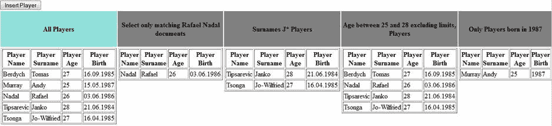

[图 6-10](#_Fig10) 。HOGM_MONGODB_HNAPI_HS 应用

 **注意**您可以通过调用`startAndWait`方法:`fullTextSession.createIndexer().startAndWait();`来重建索引(删除它，然后从数据库中重新加载所有实体)

当您有关联(或嵌入对象)时，您需要提供更多的注释。关联对象(和嵌入对象)可以作为根实体索引的一部分进行索引。为此，该关联标有`@IndexedEmbedded`。当关联是双向时，另一方必须用`@ContainedIn`标注。这有助于 Hibernate Search 更新关联索引过程。

例如，我们假设`Players`实体与`Tournaments`实体是多对多的关联关系(每个玩家参加多个锦标赛，每个锦标赛包含多个玩家)。(请记住，POJOs 注释是在`.hbm.xml`文件中指定的。)带注释的 POJOs 如清单 6-12 中的[和清单 6-13](#list12) 中的[所示。](#list13)

***[清单 6-12](#_list12) 。***`Players`POJO

```java
package hogm.hnapi.pojo

import org.hibernate.search.annotations.Analyze;
import org.hibernate.search.annotations.DateBridge;
import org.hibernate.search.annotations.DocumentId;
import org.hibernate.search.annotations.Field;
import org.hibernate.search.annotations.Index;
import org.hibernate.search.annotations.Indexed;
import org.hibernate.search.annotations.IndexedEmbedded;
import org.hibernate.search.annotations.Resolution;
import org.hibernate.search.annotations.Store;
...

@Indexed
public class Players {

    @DocumentId
    private String id;
    @Field(index = Index.YES, analyze = Analyze.YES, store = Store.NO)
    private String name;
    @Field(index = Index.YES, analyze = Analyze.NO, store = Store.NO)
    private String surname;
    @Field(index = Index.YES, analyze = Analyze.NO, store = Store.NO)
    private int age;
    @Field(index = Index.YES, analyze = Analyze.NO, store = Store.NO)
    @DateBridge(resolution = Resolution.YEAR)
    private Date birth;
    @IndexedEmbedded
    Collection<Tournaments> tournaments = new ArrayList<Tournaments>(0);

    //getters and setters
...
}
```

***[清单 6-13](#_list13) 。*** 锦标赛 POJO

```java
package hogm.hnapi.pojo

import org.hibernate.search.annotations.Analyze;
import org.hibernate.search.annotations.ContainedIn;
import org.hibernate.search.annotations.DocumentId;
import org.hibernate.search.annotations.Field;
import org.hibernate.search.annotations.Index;
import org.hibernate.search.annotations.Indexed;
import org.hibernate.search.annotations.Store;

@Indexed
public class Tournaments {

    @DocumentId
    private String id;
    @Field(index = Index.YES, analyze = Analyze.YES, store = Store.NO)
    private String tournament;
    @ContainedIn
    Collection<Players> players = new ArrayList<Players>(0);

    //getters and setters
...
}
```

现在将这些 POJOs 包装成实体，如清单 6-14 中的[和清单 6-15](#list14) 中的[所示。](#list15)

***[清单 6-14](#_list14) 。*** 玩家实体

```java
package hogm.hnapi.entity;

import org.hibernate.search.annotations.Analyze;
import org.hibernate.search.annotations.DateBridge;
import org.hibernate.search.annotations.DocumentId;
import org.hibernate.search.annotations.Field;
import org.hibernate.search.annotations.Index;
import org.hibernate.search.annotations.Indexed;
import org.hibernate.search.annotations.IndexedEmbedded;
import org.hibernate.search.annotations.Resolution;
import org.hibernate.search.annotations.Store;

@Entity
@Indexed
@Table(name = "atp_players")
@GenericGenerator(name = "mongodb_uuidgg", strategy = "uuid2")
public class Players implements Serializable {

    @DocumentId
    @Id
    @GeneratedValue(generator = "mongodb_uuidgg")
    private String id;
    @Column(name = "player_name")
    @Field(index = Index.YES, analyze = Analyze.YES, store = Store.NO)
    private String name;
    @Column(name = "player_surname")
    @Field(index = Index.YES, analyze = Analyze.NO, store = Store.NO)
    private String surname;
    @Column(name = "player_age")
    @Field(index = Index.YES, analyze = Analyze.NO, store = Store.NO)
    private int age;
    @Column(name = "player_birth")
    @Field
    @DateBridge(resolution = Resolution.YEAR)
    @Temporal(javax.persistence.TemporalType.DATE)
    private Date birth;
    @ManyToMany(cascade = CascadeType.PERSIST,fetch=FetchType.EAGER)
    @IndexedEmbedded
    private Collection<Tournaments> tournaments= new ArrayList<Tournaments>(0);

    //getters and setters
...
}
```

***[清单 6-15](#_list15) 。*** 锦标赛实体

```java
package hogm.hnapi.entity;

import org.hibernate.search.annotations.Analyze;
import org.hibernate.search.annotations.ContainedIn;
import org.hibernate.search.annotations.DocumentId;
import org.hibernate.search.annotations.Field;
import org.hibernate.search.annotations.Index;
import org.hibernate.search.annotations.Indexed;
import org.hibernate.search.annotations.Store;

@Entity
@Indexed
@Table(name = "atp_tournaments")
@GenericGenerator(name = "mongodb_uuidgg", strategy = "uuid2")
public class Tournaments implements Serializable {

    @DocumentId
    @Id
    @GeneratedValue(generator = "mongodb_uuidgg")
    private String id;
    @Field(index = Index.YES, analyze = Analyze.YES, store = Store.NO)
    private String tournament;
    @ManyToMany(mappedBy = "tournaments", fetch = FetchType.EAGER)
    @ContainedIn
    private Collection<Players> players = new ArrayList<Players>(0);

    //getters and setters
...
}
```

现在可以编写 Hibernate Search/Apache Lucene 查询了。(官方文档是开始测试关联查询的好地方。)出于测试目的，我将前面的 POJOs 和实体集成到一个名为`HOGM_MONGODB_HNAPI_ASSOCIATIONS_HS`的应用中，该应用可以从 Apress 存储库中下载(这里涉及到两个查询)。它是一个 NetBeans 项目，并在 GlassFish 3 AS 下进行了测试。图 6-11 显示了这种应用。

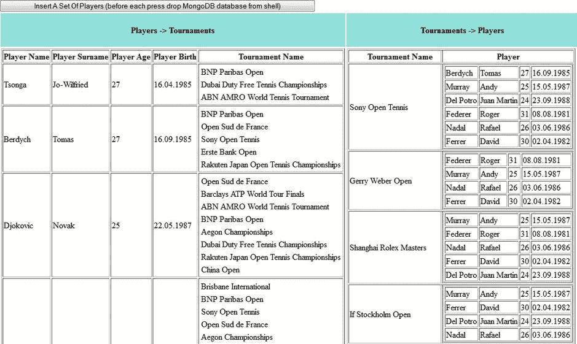

[图 6-11](#_Fig11) 。HOGM _ MONGODB _ HNAPI _ ASSOCIATIONS _ HS 应用

 **注意**您可以通过键入命令`db.dropDatabase();`轻松地从 shell 中删除 MongoDB 数据库。

Hibernate 搜索/Apache Lucene 查询—通过 JPA 的 OGM

还记得我们之前写的“全选”查询吗？这一次，我们将通过 JPA 为基于 OGM 的应用编写相同的查询。完成该任务的步骤是:

1.  创建一个`org.hibernate.search.jpa.FullTextEntityManager`。这个接口为 OGM `EntityManager`增添了全文搜索和索引功能。下面是实现这一点的代码(`em`是`EntityManager`实例):

    ```java
    FullTextEntityManager fullTextEntityManager =
                            org.hibernate.search.jpa.Search.getFullTextEntityManager(em);
    ```

2.  创建一个`org.hibernate.search.query.dsl.QueryBuilder`。使用新的实体管理器获得查询构建器，这将有助于简化查询定义。请注意，您指出该查询只影响`Players`类:

    ```java
    QueryBuilder queryBuilder = fullTextEntityManager.getSearchFactory().
    buildQueryBuilder().forEntity(Players.class).get();
    ```

3.  创建一个 Lucene 查询。正如官方文档所示，使用`queryBuilder`构建 Lucene 查询有几种方法。对于这个例子，我们可以使用`queryBuilder.all`方法，这是一种获取整个文档的简单方法:

    ```java
    org.apache.lucene.search.Query query = queryBuilder.all().createQuery();
    ```

4.  定义排序规则(可选)。您可以使用 Lucene `sort`功能轻松定义一个排序规则。例如，您可能需要按`name` :

    ```java
    org.apache.lucene.search.Sort sort = new Sort(new SortField("name", SortField.STRING));
    ```

    对提取的球员进行排序
5.  将 Lucene 查询包装在一个`org.hibernate.FullTextQuery`中。为了设置排序规则并执行查询，您需要将 Lucene 查询包装在一个`FullTextQuery`中，就像这样:

    ```java
    FullTextQuery fullTextQuery = fullTextEntityManager.createFullTextQuery(query, Players.class);
    ```

6.  指定对象查找方法和数据库检索方法。对于 OGM，您必须指定对象查找和数据库检索方法，就像这样:

    ```java
    fullTextQuery.initializeObjectsWith(ObjectLookupMethod.SKIP, DatabaseRetrievalMethod.FIND_BY_ID);
    ```

7.  设置排序规则。您可以通过调用`setSort`方法来设置排序规则，比如:

    ```java
    fullTextQuery.setSort(sort);
    ```

8.  执行查询。最后，您可以执行查询并在`java.util.List` :

    ```java
    ...
    List<Players> results = fullTextQuery.getResultList();
    ...
    ```

    中获得结果
9.  清除会话(可选):

    ```java
    fullTextEntityManager.clear();
    ```

现在，您可以将这九个步骤放入一个名为`selectAllAction`的方法中，以获得清单 6-16 中所示的 Hibernate Search/Lucene 查询。

***[清单 6-16](#_list16) 。***`selectAllAction`法

```java
package hogm.jpa.ejb;
...
public class SampleBean {
...
public List<Players> selectAllAction() {

        log.info("Select all Players instance ...");

        FullTextEntityManager fullTextEntityManager =
                                     org.hibernate.search.jpa.Search.getFullTextEntityManager(em);

        QueryBuilder queryBuilder = fullTextEntityManager.getSearchFactory().
                                                       buildQueryBuilder().forEntity(Players.class).get();
        org.apache.lucene.search.Sort sort = new Sort(new SortField("name", SortField.STRING));
        org.apache.lucene.search.Query query = queryBuilder.all().createQuery();

        FullTextQuery fullTextQuery = fullTextEntityManager.createFullTextQuery(query, Players.class);
        fullTextQuery.initializeObjectsWith(ObjectLookupMethod.SKIP,
                                                                 DatabaseRetrievalMethod.FIND_BY_ID);

        fullTextQuery.setSort(sort);
        List<Players> results = fullTextQuery.getResultList();

        fullTextEntityManager.clear();

        log.info("Search complete ...");

        return results;
    }
}
```

这九个步骤可以作为编写许多其他类型查询的快速指南。此外，您还可以看到如何编写一些常见的查询(这些查询与“*Hibernate Search/Apache Lucene 通过本机 API 查询 OGM”一节中的查询相同，*“通过 JPA 为 OGM 重写的案例”)。

*   *选择所有 1987 年出生的玩家。*这个查询(以及类似的查询)可以使用三种方法轻松编写:`QueryBuilder.keyword`，这表示我们正在搜索一个特定的单词；`TermContext.onField`，指定在哪个 Lucene 字段中查找；还有`TermMatchingContext.matching`，它告诉我们要寻找什么。因此，将这个查询包装成一个名为`selectByYearAction`的方法，如清单 6-17 所示。

***[清单 6-17](#_list17) 。*T5【selectByYearAction】方法**

```java
package hogm.jpa.ejb;
...
public class SampleBean {
...

public List<Players> selectByYearAction() {

        log.info("Search only Players instances born in 1987 ...");

        Calendar calendar = GregorianCalendar.getInstance(TimeZone.getTimeZone("UTC"));
        calendar.clear();

        calendar.set(Calendar.YEAR, 1987);

        FullTextEntityManager fullTextEntityManager =
                                     org.hibernate.search.jpa.Search.getFullTextEntityManager(em);
        QueryBuilder queryBuilder = fullTextEntityManager.getSearchFactory().
                                             buildQueryBuilder().forEntity(Players.class).get();

         org.apache.lucene.search.Query query = queryBuilder.keyword()
                                       .onField("birth").matching(calendar.getTime()).createQuery();

        FullTextQuery fullTextQuery = fullTextEntityManager.createFullTextQuery(query, Players.class);
        fullTextQuery.initializeObjectsWith(ObjectLookupMethod.SKIP,
                                                                 DatabaseRetrievalMethod.FIND_BY_ID);

        List<Players> results = fullTextQuery.getResultList();

        fullTextEntityManager.clear();

        log.info("Search complete ...");

        return results;
    }
}
```

*   只选择名叫拉斐尔·纳达尔的球员。这个查询(以及类似的查询)在两个不同的字段中搜索两个单词，“Rafael”和“Nadal”。该查询在`player_surname column (surname`字段中查找第一个单词，在`player_name`列(`name`字段)中查找第二个单词。为此，您可以使用一个名为 *must* 的聚合操作符。将必要的代码包装到名为`selectRafaelNadalAction`的方法中就说明了这一点。`bool`方法表明我们已经创建了一个布尔查询。(参见[清单 6-18](#list18) 。)

***[清单 6-18](#_list18) 。*T5【selectRafaelNadalAction】方法**

```java
package hogm.jpa.ejb;
...
public class SampleBean {
...
public List<Players> selectRafaelNadalAction() {

        log.info("Search only Players instances that have the name 'Nadal' and surname 'Rafael' ...");

        FullTextEntityManager fullTextEntityManager =
                                    org.hibernate.search.jpa.Search.getFullTextEntityManager(em);
        QueryBuilder queryBuilder = fullTextEntityManager.getSearchFactory().
                                             buildQueryBuilder().forEntity(Players.class).get();

        org.apache.lucene.search.Query query = queryBuilder.bool().must(queryBuilder.keyword()
                           .onField("name").matching("Nadal").createQuery()).must(queryBuilder.keyword()
                           .onField("surname").matching("Rafael").createQuery()).createQuery();

        FullTextQuery fullTextQuery = fullTextEntityManager.createFullTextQuery(query, Players.class);
        fullTextQuery.initializeObjectsWith(ObjectLookupMethod.SKIP,
                                                                 DatabaseRetrievalMethod.FIND_BY_ID);

        List<Players> results = fullTextQuery.getResultList();
        fullTextEntityManager.clear();

        log.info("Search complete ...");

        return results;
    }
}
```

*   选择姓氏以字母“j”开头的玩家。该查询(以及类似的查询)可以使用通配符编写。`?`代表单个字符，`*`代表任何字符序列。`TermContext.wildcard`方法表明后面是通配符查询。将必要的代码包装到一个名为`selectJAction`的方法中将会显示这一点。(参见[清单 6-19](#list19) 。)

***[清单 6-19](#_list19) 。*T5 的选择方法**

```java
package hogm.jpa.ejb;
...
public class SampleBean {
...
public List<Players> selectJAction() {

        log.info("Search only Players that surnames begins with 'J' ...");

        FullTextEntityManager fullTextEntityManager =
                                       org.hibernate.search.jpa.Search.getFullTextEntityManager(em);

        QueryBuilder queryBuilder = fullTextEntityManager.getSearchFactory()
                                                      .buildQueryBuilder().forEntity(Players.class).get();

        org.apache.lucene.search.Query query = queryBuilder.keyword().wildcard()
                                                      .onField("surname").matching("J*").createQuery();

        FullTextQuery fullTextQuery = fullTextEntityManager.createFullTextQuery(query, Players.class);
        fullTextQuery.initializeObjectsWith(ObjectLookupMethod.SKIP,
                                                                 DatabaseRetrievalMethod.FIND_BY_ID);

        List<Players> results = fullTextQuery.getResultList();
        fullTextEntityManager.clear();

        log.info("Search complete ...");

        return results;
    }
}
```

*   选择年龄在区间(25，28)的球员。该查询(以及类似的查询)可以被视为范围查询。这种查询搜索区间中的值(包括或不包括边界)，或者低于或高于区间边界的值(包括或不包括边界)。您通过调用`queryBuilder.range`方法来指示一个范围查询。通过调用`from`和`to`方法来设置间隔，通过调用`excludeLimit`方法可以排除间隔的边界。将必要的代码包装到一个名为`select25To28AgeAction`的方法中就会显示这一点。(参见[清单 6-20](#list20) 。)

***[清单 6-20](#_list20) 。*T5 选择 25 到 28 岁的动作方法**

```java
package hogm.jpa.ejb;
...
public class SampleBean {
...
public List<Players> select25To28AgeAction() {

        log.info("Search only Players that have ages between 25 and 28, excluding limits ...");

        FullTextEntityManager fullTextEntityManager =
                                      org.hibernate.search.jpa.Search.getFullTextEntityManager(em);

        QueryBuilder queryBuilder = fullTextEntityManager.getSearchFactory()
                                            .buildQueryBuilder().forEntity(Players.class).get();

         org.apache.lucene.search.Query query = queryBuilder.range().onField("age")
                                            .from(25).to(28).excludeLimit().createQuery();

        FullTextQuery fullTextQuery = fullTextEntityManager.createFullTextQuery(query, Players.class);
        fullTextQuery.initializeObjectsWith(ObjectLookupMethod.SKIP,
                                                                 DatabaseRetrievalMethod.FIND_BY_ID);

        List<Players> results = fullTextQuery.getResultList();
        fullTextEntityManager.clear();

        log.info("Search complete ...");

        return results;
    }
}
```

您可以编写许多其他类型的查询，您只需钻研关于 Hibernate Search 和 Apache Lucene 的可用文档。对于所涉及的查询，我开发了一个完整的应用，可以在 Apress 存储库中获得，并命名为`HOGM_MONGODB_JPA_HS`。它是一个 NetBeans 项目，并在 GlassFish 3 AS 下进行了测试。图 6-12 显示了这种应用。

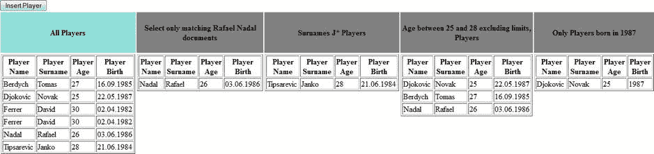

[图 6-12](#_Fig12) 。HOGM_MONGODB_JPA_HS 应用

 **注意**您可以通过调用`startAndWait`方法:`fullTextEntityManager.createIndexer().startAndWait();`来重建索引(删除它，然后从数据库中重新加载所有实体)

当您有关联(或嵌入对象)时，您需要提供更多的注释。关联对象(和嵌入对象)可以作为根实体索引的一部分进行索引。为此，该关联标有`@IndexedEmbedded`。当关联是双向时，另一方必须用`@ContainedIn`标注。这有助于 Hibernate Search 保持关联索引过程是最新的。

例如，我们假设`Players`实体与`Tournaments`实体是多对多的关联关系(每个玩家参加多个锦标赛，每个锦标赛包含多个玩家)。带注释的`Players`实体列表如[列表 6-21](#list21) 所示。

***[清单 6-21](#_list21) 。*** 标注玩家实体

```java
package hogm.jpa.entity;

import org.hibernate.search.annotations.Analyze;
import org.hibernate.search.annotations.DateBridge;
import org.hibernate.search.annotations.DocumentId;
import org.hibernate.search.annotations.Field;
import org.hibernate.search.annotations.Index;
import org.hibernate.search.annotations.Indexed;
import org.hibernate.search.annotations.IndexedEmbedded;
import org.hibernate.search.annotations.Resolution;
import org.hibernate.search.annotations.Store;

@Entity
@Indexed
@Table(name = "atp_players")
@GenericGenerator(name = "mongodb_uuidgg", strategy = "uuid2")
public class Players implements Serializable {

    @DocumentId
    @Id
    @GeneratedValue(generator = "mongodb_uuidgg")
    private String id;
    @Column(name = "player_name")
    @Field(index = Index.YES, analyze = Analyze.YES, store = Store.NO)
    private String name;
    @Column(name = "player_surname")
    @Field(index = Index.YES, analyze = Analyze.NO, store = Store.NO)
    private String surname;
    @Column(name = "player_age")
    @Field(index = Index.YES, analyze = Analyze.NO, store = Store.NO)
    private int age;
    @Column(name = "player_birth")
    @Field
    @DateBridge(resolution = Resolution.YEAR)
    @Temporal(javax.persistence.TemporalType.DATE)
    private Date birth;
    @ManyToMany(cascade = CascadeType.PERSIST,fetch=FetchType.EAGER)
    @IndexedEmbedded
    private Collection<Tournaments> tournaments= new ArrayList<Tournaments>(0);

    //getters and setters
...
}
```

而`Tournaments`实体如[清单 6-22](#list22) 所示。

***[清单 6-22](#_list22) 。*** 标注赛事实体

```java
package hogm.jpa.entity;

import org.hibernate.search.annotations.Analyze;
import org.hibernate.search.annotations.ContainedIn;
import org.hibernate.search.annotations.DocumentId;
import org.hibernate.search.annotations.Field;
import org.hibernate.search.annotations.Index;
import org.hibernate.search.annotations.Indexed;
import org.hibernate.search.annotations.Store;

@Entity
@Indexed
@Table(name = "atp_tournaments")
@GenericGenerator(name = "mongodb_uuidgg", strategy = "uuid2")
public class Tournaments implements Serializable {

    @DocumentId
    @Id
    @GeneratedValue(generator = "mongodb_uuidgg")
    private String id;
    @Field(index = Index.YES, analyze = Analyze.YES, store = Store.NO)
    private String tournament;
    @ManyToMany(mappedBy = "tournaments", fetch = FetchType.EAGER)
    @ContainedIn
    private Collection<Players> players = new ArrayList<Players>(0);

    //getters and setters
...
}
```

现在可以编写 Hibernate Search/Apache Lucene 查询了。(官方文档是开始测试关联查询的好地方。)出于测试目的，我将前面的实体集成到一个名为`HOGM_MONGODB_JPA_ASOCIATIONS_HS`的应用中，该应用可以从 Apress 存储库中下载(这里涉及到两个查询)。它是一个 NetBeans 项目，并在 GlassFish 3 AS 下进行了测试。图 6-13 显示了这种应用。

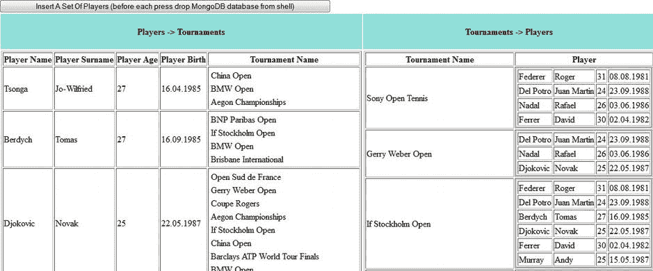

[图 6-13](#_Fig13) 。HOGM _ MONGODB _ JPA _ ASSOCIATIONS _ HS 应用

我们到此为止，但这可能只是你探索 Hibernate Search 和 Apache Lucene 结合起来的惊人力量的开始。我已经为您提供了一个通过 OGM 和 Hibernate Search/Apache Lucene 查询 MongoDB 集合的起点。从现在开始，在 Hibernate Search/Apache Lucene 领域走多远取决于你自己。

Hibernate OGM JP-QL 解析器

根据 Hibernate OGM 文档，版本 4.0.0Beta1 包括一个 JP-QL 基本解析器，能够使用 Hibernate Search 转换简单的查询。目前，使用它有几个限制，包括:

*   不隐含任何连接、聚合或其他关系操作。
*   使用 Hibernate 会话 API(JPA 集成即将到来)。
*   Hibernate Search 对目标实体和属性进行索引(目前还没有验证)。

我试图解决这些限制，但是还不能开发一个功能应用来利用 JP-QL 解析器进行简单的查询。对于用`@Indexed`、`@Field,`等标注的`Players`实体，我尝试了一个简单的查询，如下所示:

```java
Query query = HibernateUtil.getSessionFactory().getCurrentSession().createQuery("from Players p");
```

不幸的是，我的多种方法都失败了，只有一个恼人的错误:`java.lang.NullPointerException`。索引过程似乎工作得很好，但是查询结果列表总是空的。

无论如何，这不是一个大问题，因为 JP-QL 解析器非常年轻，当您阅读本节时，这些信息可能已经过时了。到那时，JP-QL 解析器的查询支持可能会更加慷慨。现在，您可以使用 MongoDB Java 驱动程序，当然还有 Hibernate Search 和 Apache Lucene。

摘要

经过前几章的努力，这一章我们收获了果实。我们能够通过编写针对 MongoDB 数据库的查询来处理存储的数据。特别是，在本章中，您学习了如何使用 Hibernate Search/Apache Lucene 和 MongoDB Java 驱动程序编写查询。我的目标是提供关于编写一个纯 MongoDB Java 驱动程序应用和一个 OGM 的基本信息，通过本地 API 和/或通过 JPA 应用查询 MongoDB 数据库。