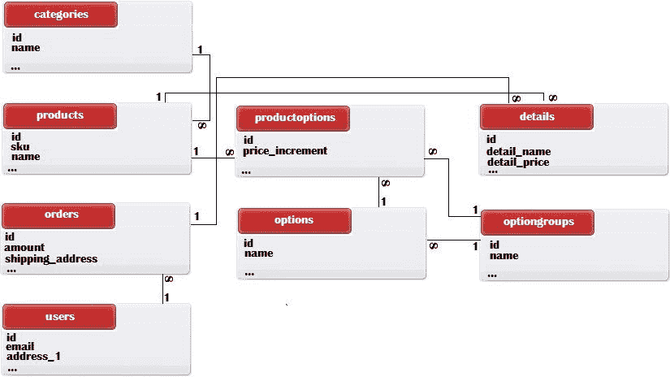
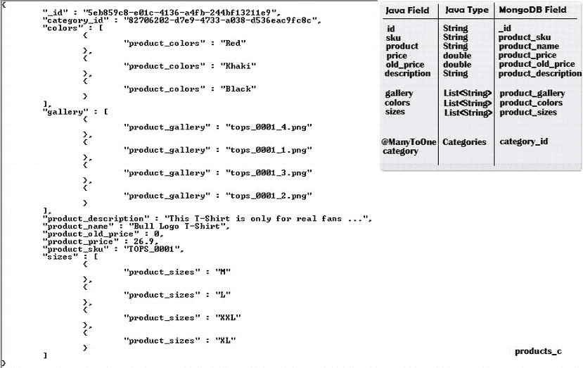
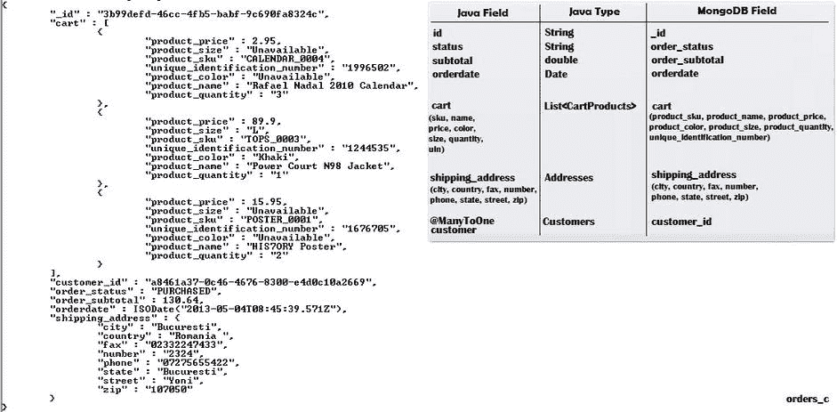
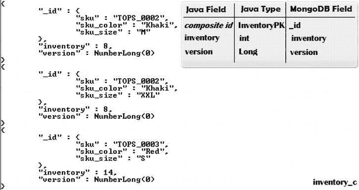

# 七、MongoDB 电子商务数据库模型

开源电子商务软件的市场每年都在增长。为了证明这一点，只需看看今天被用作各种电子商务应用起点的许多流行平台。例如，Magento、Zen Cart 和 Spree 都提供了用于存储和查询类别、产品、订单、库存等的数据库模式。尽管这些平台之间存在差异，但它们都有一些共同点:它们都提供 SQL 数据库。

对于 NoSQL 商店来说，电子商务软件市场是一个挑战，大多数 NoSQL 商店被认为不适合电子商务。然而，MongoDB 是健壮和灵活的，它的特性包括支持丰富的数据模型、索引查询、原子操作和复制写入，这促使我们问:MongoDB 适合电子商务应用吗？嗯，这个问题需要一个权威的答案，这个答案可能会在关于 MongoDB 是否适合电子商务应用的热情和误解开始消退，事情开始平静下来之后出现。

人们普遍认为 MongoDB 很快，通过使用文档(概念上比表简单)减少了表和关联的数量，并提供了灵活的模式。但是它有一些缺点，主要集中在事务、一致性和持久性方面。相比之下，SQL 数据库提供了安全性，但它们没有那么快，具有僵化的模式，需要几十个表(关联)，并且会减慢开发进度(有时我们需要编写复杂的查询)。然而，“安全”似乎是关键词，因为没有一个电子卖家(电子零售商)愿意因为数据库不一致而失去订单或金钱。

尽管如此，名为 Forward ( `http://getfwd.com/`)的“*一个功能齐全、以开发人员为中心的电子商务平台，通过强大的模板&富有表现力的语法*，使定制代码变得容易，已经准备好向所有人展示 MongoDB 非常适合电子商务应用。因此，在较小的范围内，我将通过使用 MongoDB 开发一个电子商务数据模型，并通过 JPA 和 Hibernate Search/Apache Lucene 在一个基于 Hibernate OGM 的企业应用中使用它，来保持这种肯定。

在这一章中，我将把电子商务应用的特定 SQL 模式转换(或改编)为 MongoDB 模式。在图 7-1 中，你可以看到一个中等复杂程度的电子商务应用的数据库模式；在电子商务环境中，大多数表格都是不言自明的。主表是类别、产品、订单和用户。



图 7-1 。SQL 电子商务数据库架构

主要目标是开发一个类似于图 7-1 中的 MongoDB 数据库模式。通过相似，我的意思是我们想要再现主要的功能(相同的查询能力)，而不是相同的表、关联和字段。此外，我们将为它编写相应的 JPA 实体。我们将通过 JPA 使用 Hibernate OGM，所以我们需要 JPA 注释。我们将使用 Hibernate Search 和 Apache Lucene 进行查询，因此我们需要 Hibernate Search 特有的注释来索引 Lucene 中的数据。

即使你不是电子零售商，从客户的角度来看，你可能非常熟悉许多电子商务术语，尤其是类别、产品、促销、订单、购物车、采购订单、付款、送货地址等等。这样的术语是每个互联网用户都熟知的，所以我不会在这里试图解释它们。

MongoDB 电子商务数据库架构

在图 7-2 中，可以看到我提出的 MongoDB 电子商务数据库架构，我将其命名为 *eshop_db* 。该图包含 MongoDB 集合、它们的关联以及相应的 JPA 实体(但不是字段)。


图 7-2 。MongoDB 电子商务数据库模式

对类别集合建模(categories_c)

`categories_c` 集合对应于`categories`表。

按类别对产品进行分类是大多数电子商务网站的常见功能。特定于类别的 SQL 表很可能存储每个类别的名称，以及与负责存储产品的表的一对多(或者有时是多对多)惰性关联。这个想法是非常快速地加载类别名称(没有他们的产品)，因为它们出现在电子商务网站的第一页。在用户选择一个类别后，可以在以后加载产品。但是，尽管这在 SQL 中是可行的，但是在 MongoDB 中，您需要非常小心关联，因为它们可能会启动事务。我们的目的是尽可能避免事务，所以我没有在`categories_c`集合中定义任何关联。

我创建了类别集合(`categories_c`)，其结构如图图 7-3 所示。如您所见，每个文档都存储了一个标识符和类别名称:


图 7-3 。categories_c 集合中的文档示例

这个集合的 JPA 实体显示在清单 7-1 的中。

***清单 7-1 。*??【JPA 实体】为类别 _c**

```java
1       package eshop.entities;
2
3       import java.io.Serializable;
4       import javax.persistence.Column;
5       import javax.persistence.Entity;
6       import javax.persistence.GeneratedValue;
7       import javax.persistence.Id;
8       import javax.persistence.Table;
9       import org.hibernate.annotations.GenericGenerator;
10      import org.hibernate.search.annotations.Analyze;
11      import org.hibernate.search.annotations.DocumentId;
12      import org.hibernate.search.annotations.Field;
13      import org.hibernate.search.annotations.Index;
14      import org.hibernate.search.annotations.Indexed;
15      import org.hibernate.search.annotations.Store;
16
17      @Entity
18      @Indexed
19      @Table(name = "categories_c")
20      public class Categories implements Serializable {
21
22          private static final long serialVersionUID = 1L;
23          @DocumentId
24          @Id
25          @GeneratedValue(generator = "uuid")
26          @GenericGenerator(name = "uuid", strategy = "uuid2")
27          private String id;
28          @Column(name = "category_name")
29          @Field(index = Index.YES, analyze = Analyze.NO, store = Store.YES)
30          private String category;
31
32          public String getId() {
33              return id;
34          }
35
36          public void setId(String id) {
37              this.id = id;
38          }
39
40          public String getCategory() {
41              return category;
42          }
43
44          public void setCategory(String category) {
45              this.category = category;
46          }
47
48          @Override
49          public int hashCode() {
50              int hash = 0;
51              hash += (id != null ? id.hashCode() : 0);
52              return hash;
53          }
54
55          @Override
56          public boolean equals(Object object) {
57              if (!(object instanceof Categories)) {
58                  return false;
59              }
60              Categories other = (Categories) object;
61              if ((this.id == null && other.id != null) || (this.id != null &&
                  !this.id.equals(other.id))) {
62                  return false;
63              }
64              return true;
65          }
66
67          @Override
68          public String toString() {
69              return "eshop.entities.Categories[ id=" + id + " ]";
70          }
71      }
72
```

注意，第 29 行指定类别 id ( *id* 字段)和类别名称( *category_name* 字段)应该可以用 Lucene 进行搜索，并禁用了分析器。我们不需要分析器，因为我们按原样搜索类别(而不是按它包含的单词)，我们将按名称对类别进行排序(Lucene 不允许您分析用于排序操作的字段)。此外，类别名称存储在 Lucene 索引中。这消耗了索引中的空间，但不是很大，因为你不想要太多的类别而引起关注。这允许我们利用投影(注意，id 是自动存储的)。使用 projection 允许我们在将来向这个集合中添加更多可搜索的、非惰性的字段，比如类别代码、类别描述等等，但是仍然只提取类别名称。当然，这只是针对 Lucene 的一种方法(不是规则)。如果您选择使用 JP-QL 查询(当 Hibernate OGM 提供对这种查询的支持时)，事情会有所不同。

为产品集合建模(products_c )

`products_c`集合对应于`products`和`productoptions`表。

在专用于产品的集合(`products_c`)中，每个产品的文档存储两种信息:一般数据，如 SKU、名称、价格、描述等；关系模型中通常需要附加表的数据，如产品的图库和产品选项(例如，颜色、大小、类型等)。我将在嵌入式集合中存储每个产品的图库和选项，而不是使用额外的表和关联。这是有意义的，因为这些物理细节是产品的独特特征。而且， *products_c* 集合是与`categories_c`集合单向多对一关联的所有者方，所以它存储相应类别的外键。

在图 7-4 中，可以看到这样一个文档样本。



图 7-4 。products_c 集合中的示例文档

每个产品都将由这样一个文档来表示。`colors`和`sizes`嵌入式系列仅对拥有这些选项的产品可见。

这个集合的 JPA 实体如清单 7-2 中的所示。

***清单 7-2 。*** 产品的 JPA 实体 _c

```java
1        package eshop.entities;
2
3        import java.io.Serializable;
4        import java.util.ArrayList;
5        import java.util.List;
6        import javax.persistence.Column;
7        import javax.persistence.ElementCollection;
8        import javax.persistence.Entity;
9        import javax.persistence.FetchType;
10       import javax.persistence.GeneratedValue;
11       import javax.persistence.Id;
12       import javax.persistence.ManyToOne;
13       import javax.persistence.Table;
14       import org.hibernate.annotations.GenericGenerator;
15       import org.hibernate.search.annotations.Analyze;
16       import org.hibernate.search.annotations.DocumentId;
17       import org.hibernate.search.annotations.Field;
18       import org.hibernate.search.annotations.Index;
19       import org.hibernate.search.annotations.Indexed;
20       import org.hibernate.search.annotations.IndexedEmbedded;
21       import org.hibernate.search.annotations.NumericField;
22       import org.hibernate.search.annotations.Store;
23
24       @Entity
25       @Indexed
26       @Table(name = "products_c")
27       public class Products implements Serializable {
28
29           private static final long serialVersionUID = 1L;
30           @DocumentId
31           @Id
32           @GeneratedValue(generator = "uuid")
33           @GenericGenerator(name = "uuid", strategy = "uuid2")
34           private String id;
35           @Column(name = "product_sku")
36           @Field(index = Index.YES, analyze = Analyze.NO, store = Store.NO)
37           private String sku;
38           @Column(name = "product_name")
39           @Field(index = Index.YES, analyze = Analyze.YES, store = Store.NO)
40           private String product;
41           @Column(name = "product_price")
42           @NumericField
43           @Field(index = Index.YES, analyze = Analyze.NO, store = Store.NO)
44           private double  price;
45           @Column(name = "product_old_price")
46           @NumericField
47           @Field(index = Index.YES, analyze = Analyze.NO, store = Store.NO)
48           private double old_price;
49           @Column(name = "product_description")
50           @Field(index = Index.YES, analyze = Analyze.NO, store = Store.NO)
51           private String description;
52           @IndexedEmbedded
53           @ManyToOne(fetch = FetchType.LAZY)
54           private Categories category;
55           @IndexedEmbedded
56           @ElementCollection(targetClass = java.lang.String.class,
                              fetch = FetchType.EAGER)
57           @Column(name = "product_gallery")
58           private List<String> gallery = new ArrayList<String>();
59           @IndexedEmbedded
60           @ElementCollection(targetClass = java.lang.String.class,
                              fetch = FetchType.EAGER)
61           @Column(name = "product_colors")
62           private List<String> colors = new ArrayList<String>();
63           @IndexedEmbedded
64           @ElementCollection(targetClass = java.lang.String.class,
                              fetch = FetchType.EAGER)
65           @Column(name = "product_sizes")
66           private List<String> sizes = new ArrayList<String>();
67
68           public String getId() {
69               return id;
70           }
71
72           public void setId(String id) {
73               this.id = id;
74           }
75
76           public List<String> getGallery() {
77               return gallery;
78           }
79
80           public void setGallery(List<String> gallery) {
81               this.gallery = gallery;
82           }
83
84           public double getPrice() {
85               return price;
86           }
87
88           public void setPrice(double price) {
89               this.price = price;
90           }
91
92           public double getOld_price() {
93               return old_price;
94           }
95
96           public void setOld_price(double old_price) {
97               this.old_price = old_price;
98           }
99
100          public String getProduct() {
101              return product;
102          }
103
104          public void setProduct(String product) {
105              this.product = product;
106          }
107
108          public String getSku() {
109              return sku;
110          }
111
112          public void setSku(String sku) {
113              this.sku = sku;
114          }
115
116          public String getDescription() {
117              return description;
118          }
119
120          public List<String> getColors() {
121              return colors;
122          }
123
124          public void setColors(List<String> colors) {
125              this.colors = colors;
126          }
127
128          public List<String> getSizes() {
129              return sizes;
130          }
131
132          public void setSizes(List<String> sizes) {
133              this.sizes = sizes;
134          }
135
136          public void setDescription(String description) {
137              this.description = description;
138          }
139
140          public Categories getCategory() {
141              return category;
142          }
143
144          public void setCategory(Categories category) {
145              this.category = category;
146          }
147
148          @Override
149          public int hashCode() {
150              int hash = 0;
151              hash += (id != null ? id.hashCode() : 0);
152              return hash;
153          }
154
155          @Override
156          public boolean equals(Object object) {
157              if (!(object instanceof Products)) {
158                  return false;
159              }
160              Products other = (Products) object;
161              if ((this.id == null && other.id != null) || (this.id != null &&
                    !this.id.equals(other.id))) {
162                  return false;
163              }
164              return true;
165          }
166
167          @Override
168          public String toString() {
169              return "eshop.entities.Products[ id=" + id + " ]";
170          }
171      }
```

让我们仔细看看一些主要的代码行。

在第 39 行，对应于产品名( *product_name* )的字段是为 Lucene 准备的。我们要注意的部分是`analyze = Analyze.YES`，它告诉 Lucene 对这个字段使用默认的分析器。我们可以通过产品名称中包含的任何单词来搜索产品，而不是通过名称(通常由几个单词组成)来搜索。这有助于我们轻松实现通过产品名称搜索的*功能。*

如您所见，在第 42 行和第 48 行中，产品价格( *product_price* 和 *product_old_price* )是数值(`double` s)。将它们存储为数字而不是字符串是有意义的，这样您就可以执行范围查询和计算，如小计、总计、货币换算等。您可以告诉 Lucene，通过用`@NumericField`对字段进行注释，字段表示数值。当一个属性被索引为数值字段时，它支持高效的范围查询，并且排序比在标准的`@Field`属性上做同样的查询要快。

第 52-54 行定义了`categories_c`和`products_c`集合之间的单向、多对一的关联。对于 Lucene 来说，这个关联应该被标记为`@IndexedEmbedded`，它被用来索引作为拥有实体一部分的关联实体。可能我之前已经说过了，但是现在是时候再次指出 Lucene 不知道关联，这就是为什么它需要`@IndexedEmbedded`和`@ContainedIn`注释。如果没有这些注释，像`@ManyToMany`、`@*ToOne`、`@Embedded,`和`@ElementCollection`这样的关联将不会被索引，因此将无法被搜索。关联让您可以轻松地编写类似于 SQL 查询的 Lucene 查询，其中包含类型为:从类别字段等于某个值的类别中选择所有产品(在 JP-QL 中通常是一个连接)的 *WHERE* 子句。

第 55-66 行定义了产品的选项和图片集。对于这个例子，我们使用最常见的选项，颜色和大小，但你可以添加更多。与其将它们放入另一个表并创建另一个关联，我更喜欢使用`@ElementCollection`来存储它们。当一个产品没有颜色和大小，它只是被跳过。MongoDB 文档允许灵活的结构，所以当没有指定选项时，相应的集合将不会出现在文档中。最后，我们使用 eager 机制加载选项和图库，因为我们希望加载和显示每个产品及其图库和选项。如果您想分两个阶段加载产品:首先是产品的简要概述，然后是用户请求的选项，请使用惰性机制。

为客户集合建模(customers_c)

`customers_c`集合对应于`users`表。

对于用户(潜在客户)，我们需要一个单独的集合来存储个人数据；我们将这个集合命名为`customers_c`。个人数据包括姓名、电子邮件地址、密码、地址等信息(显然，您可以添加更多字段)。当用户登录系统时，您可以通过电子邮件地址和密码轻松识别他，并加载他的个人资料。他的订单没有加载到与他的配置文件相同的查询中。它们只有在执行显式请求时才被延迟加载；这允许我们只装载请求的订单，而不是全部。通常，客户只检查他最近的订单状态，很少想查看过时的订单。许多电子商务网站不提供过期订单，只提供最新订单。

`customers_c`集合中的每个文档(条目)如图图 7-5 所示。


图 7-5 。customers_c 集合中的示例文档

请注意，客户的地址是作为嵌入文档存储的；这让我们可以使用快速查询和延迟加载，在没有额外表的情况下提供多个地址。

这个集合的 JPA 实体显示在清单 7-3 中。

***清单 7-3 。*** 客户的 JPA 实体 _c

```java
1        package eshop.entities;
2
3        import eshop.embedded.Addresses;
4        import java.io.Serializable;
5        import java.util.Date;
6        import javax.persistence.Basic;
7        import javax.persistence.Column;
8        import javax.persistence.Embedded;
9        import javax.persistence.Entity;
10       import javax.persistence.FetchType;
11       import javax.persistence.GeneratedValue;
12       import javax.persistence.Id;
13       import javax.persistence.Table;
14       import javax.persistence.Temporal;
15       import org.hibernate.annotations.GenericGenerator;
16       import org.hibernate.search.annotations.Analyze;
17       import org.hibernate.search.annotations.DateBridge;
18       import org.hibernate.search.annotations.DocumentId;
19       import org.hibernate.search.annotations.Field;
20       import org.hibernate.search.annotations.Index;
21       import org.hibernate.search.annotations.Indexed;
22       import org.hibernate.search.annotations.IndexedEmbedded;
23       import org.hibernate.search.annotations.Resolution;
24       import org.hibernate.search.annotations.Store;
25
26       @Entity
27       @Indexed
28       @Table(name = "customers_c")
29       public class Customers implements Serializable {
30
31           private static final long serialVersionUID = 1L;
32           @DocumentId
33           @Id
34           @GeneratedValue(generator = "uuid")
35           @GenericGenerator(name = "uuid", strategy = "uuid2")
36           private String id;
37           @Column(name = "customer_email")
38           @Field(index = Index.YES, analyze = Analyze.NO, store = Store.NO)
39           private String email;
40           @Column(name = "customer_password")
41           @Field(index = Index.YES, analyze = Analyze.NO, store = Store.NO)
42           private String password;
43           @Column(name = "customer_name")
44           @Field(index = Index.YES, analyze = Analyze.NO, store = Store.NO)
45           private String name;
46           @Column(name = "customer_surname")
47           @Field(index = Index.YES, analyze = Analyze.NO, store = Store.NO)
48           private String surname;
49           @DateBridge(resolution = Resolution.DAY)
50           @Temporal(javax.persistence.TemporalType.DATE)
51           @Column(name = "customer_registration")
52           private Date registration;
53           @Embedded
54           @IndexedEmbedded
55           @Basic(fetch = FetchType.LAZY)
56           private Addresses customer_address_1;
57           @Embedded
58           @IndexedEmbedded
59           @Basic(fetch = FetchType.LAZY)
60           private Addresses customer_address_2;
61
62           public String getId() {
63               return id;
64           }
65
66           public void setId(String id) {
67               this.id = id;
68           }
69
70           public String getEmail() {
71               return email;
72           }
73
74           public void setEmail(String email) {
75               this.email = email;
76           }
77
78           public String getPassword() {
79               return password;
80           }
81
82           public void setPassword(String password) {
83               this.password = password;
84           }
85
86           public String getName() {
87               return name;
88           }
89
90           public void setName(String name) {
91               this.name = name;
92           }
93
94           public String getSurname() {
95               return surname;
96           }
97
98           public void setSurname(String surname) {
99               this.surname = surname;
100          }
101
102          public Date getRegistration() {
103              return registration;
104          }
105
106          public void setRegistration(Date registration) {
107              this.registration = registration;
108          }
109
110          public Addresses getCustomer_address_1() {
111              return customer_address_1;
112          }
113
114          public void setCustomer_address_1(Addresses customer_address_1) {
115              this.customer_address_1 = customer_address_1;
116          }
117
118          public Addresses getCustomer_address_2() {
119              return customer_address_2;
120          }
121
122          public void setCustomer_address_2(Addresses customer_address_2) {
123              this.customer_address_2 = customer_address_2;
124          }
125
126          @Override
127          public int hashCode() {
128              int hash = 0;
129              hash += (id != null ? id.hashCode() : 0);
130              return hash;
131          }
132
133          @Override
134          public boolean equals(Object object) {
135              if (!(object instanceof Customers)) {
136                  return false;
137              }
138              Customers other = (Customers) object;
139              if ((this.id == null && other.id != null) || (this.id != null &&
                    !this.id.equals(other.id))) {
140                  return false;
141              }
142              return true;
143          }
144
145          @Override
146          public String toString() {
147              return "eshop.entities.Customers[ id=" + id + " ]";
148          }
149      }
150
```

这段代码有一些重要的方面值得解释。

第 53-60 行的代码非常有趣。可以看到，同一个可嵌入对象类型在同一个实体中出现了两次(可嵌入对象在一个名为 *Addresses* 的类中映射地址坐标、城市、邮政编码、街道等)。如果您在 SQL 和 JPA 提供程序(如 EclipseLink 或 Hibernate)中使用过这种技术，您就会知道必须显式设置至少一个列，因为列名 default 不起作用。在这种情况下，通用 JPA 用`@AttributeOverride`注释解决了这个问题(参见`www.docs.oracle.com/javaee/6/api/javax/persistence/AttributeOverride.html`)。然而，在 NoSQL 和 Hibernate OGM 中，您不需要对列名进行这种调整。

代表地址的可嵌入类如清单 7-4 中的所示。

***清单 7-4 。*** 可嵌入地址类

```java
1       package eshop.embedded;
2
3       import java.io.Serializable;
4       import javax.persistence.Embeddable;
5       import org.hibernate.search.annotations.Analyze;
6       import org.hibernate.search.annotations.Field;
7       import org.hibernate.search.annotations.Index;
8       import org.hibernate.search.annotations.Store;
9
10      @Embeddable
11      public class Addresses implements Serializable {
12
13          @Field(index = Index.YES, analyze = Analyze.NO, store = Store.NO)
14          private String city;
15          @Field(index = Index.YES, analyze = Analyze.NO, store = Store.NO)
16          private String state;
17          @Field(index = Index.YES, analyze = Analyze.NO, store = Store.NO)
18          private String street;
19          @Field(index = Index.YES, analyze = Analyze.NO, store = Store.NO)
20          private String number;
21          @Field(index = Index.YES, analyze = Analyze.NO, store = Store.NO)
22          private String zip;
23          @Field(index = Index.YES, analyze = Analyze.NO, store = Store.NO)
24          private String country;
25          @Field(index = Index.YES, analyze = Analyze.NO, store = Store.NO)
26          private String phone;
27          @Field(index = Index.YES, analyze = Analyze.NO, store = Store.NO)
28          private String fax;
29
30          public String getCity() {
31              return city;
32          }
33
34          public void setCity(String city) {
35              this.city = city;
36          }
37
38          public String getNumber() {
39              return number;
40          }
41
42          public void setNumber(String number) {
43              this.number = number;
44          }
45
46          public String getState() {
47              return state;
48          }
49
50          public void setState(String state) {
51              this.state = state;
52          }
53
54          public String getStreet() {
55              return street;
56          }
57
58          public void setStreet(String street) {
59              this.street = street;
60          }
61
62          public String getZip() {
63              return zip;
64          }
65
66          public void setZip(String zip) {
67              this.zip = zip;
68          }
69
70          public String getCountry() {
71              return country;
72          }
73
74          public void setCountry(String country) {
75              this.country = country;
76          }
77
78          public String getPhone() {
79              return phone;
80          }
81
82          public void setPhone(String phone) {
83              this.phone = phone;
84          }
85
86          public String getFax() {
87              return fax;
88          }
89
90          public void setFax(String fax) {
91              this.fax = fax;
92          }
93      }
```

对订单集合建模(orders_c)

`orders_c`集合对应于`orders`和`details`表。

订单存储在一个单独的集合中，名为`orders_c`。对于每个订单，我们存储状态(一个订单可以经过多种状态，比如*已购买、已发货、已取消*等等)；小计(这表示订单金额)；订单创建日期；送货地址；以及订单的产品。您可以添加更多的字段，比如订单标识符(例如， *nnnn，*)、订单友好名称、订单到期日期等等。

送货地址由一个嵌入式文档表示，订单的产品存储为一个嵌入式集合。因此，我们不需要额外的集合或关联，查询非常容易执行，我们可以缓慢或急切地加载送货地址和订单产品，这取决于我们如何实现 web 站点 GUI。

在这个集合中，我们需要存储表示购买订单的客户的外键。为此，我定义了订单和客户之间的单向多对一关联。

我还没有说任何关于当前购物车的事情—订单还没有提交。购物车可以在客户的单个(或多个)会话中支持多个内容修改，添加新产品、删除其他产品、清空购物车、修改产品数量等等。在数据库中反映所有这些修改是没有用的，因为每个修改都需要至少一个查询来更新客户和购物车之间的“对话”。为此，您可以采用编程方法，将购物车存储在客户会话中，或者视图范围或对话范围中。您还可以使用 cookies，或者任何有助于实现这一任务的特定设计模式。这个想法是只有在实际下订单时才修改数据库。

当然，如果您的数据非常关键或者您需要在多个会话中持久化(例如，如果用户可能在一周后回来)，那么使用单独的集合或者作为`orders_c`集合中的文档将购物车持久化到数据库是一个好主意。毕竟，购物车只是一个尚未下单的订单，所以它可以像一个正常订单一样存储，状态可能是*未采购*。如果您决定持久化购物车，请注意正确地将其与库存同步。这是防止“超售”的必要条件在某些情况下，应用必须将商品从库存移动到购物车，然后再移动回来，例如，如果用户丢弃了一个或多个产品，甚至放弃了整个购买。从库存中取出产品并将其移动到购物车(或相反)是特定于事务的操作，因此您必须处理回滚问题。显然，如果你没有库存，事情就简单多了。

在图 7-6 中，可以看到一个订单的单据样本。



图 7-6 。orders_c 集合中的示例文档

按照惯例，当产品没有颜色或尺寸时，我们会存储一个类似“不可用”的标志。

这个集合的 JPA 实体显示在清单 7-5 中:

***清单 7-5 。****JPA 实体为*订单 _c

```java
1        package eshop.entities;
2
3        import eshop.embedded.Addresses;
4        import eshop.embedded.CartProducts;
5        import java.io.Serializable;
6        import java.util.ArrayList;
7        import java.util.Date;
8        import java.util.List;
9        import javax.persistence.AttributeOverride;
10       import javax.persistence.AttributeOverrides;
11       import javax.persistence.Basic;
12       import javax.persistence.Column;
13       import javax.persistence.ElementCollection;
14       import javax.persistence.Embedded;
15       import javax.persistence.Entity;
16       import javax.persistence.FetchType;
17       import javax.persistence.GeneratedValue;
18       import javax.persistence.Id;
19       import javax.persistence.ManyToOne;
20       import javax.persistence.Table;
21       import javax.persistence.Temporal;
22       import org.hibernate.annotations.GenericGenerator;
23       import org.hibernate.search.annotations.Analyze;
24       import org.hibernate.search.annotations.DateBridge;
25       import org.hibernate.search.annotations.DocumentId;
26       import org.hibernate.search.annotations.Field;
27       import org.hibernate.search.annotations.Index;
28       import org.hibernate.search.annotations.Indexed;
29       import org.hibernate.search.annotations.IndexedEmbedded;
30       import org.hibernate.search.annotations.NumericField;
31       import org.hibernate.search.annotations.Resolution;
32       import org.hibernate.search.annotations.Store;
33
34       @Entity
35       @Indexed
36       @Table(name = "orders_c")
37       public class Orders implements Serializable {
38
39           private static final long serialVersionUID = 1L;
40           @DocumentId
41           @Id
42           @GeneratedValue(generator = "uuid")
43           @GenericGenerator(name = "uuid", strategy = "uuid2")
44           private String id;
45           @Column(name = "order_status")
46           @Field(index = Index.YES, analyze = Analyze.NO, store = Store.NO)
47           private String status;
48           @Column(name = "order_subtotal")
49           @NumericField
50           @Field(index = Index.YES, analyze = Analyze.NO, store = Store.NO)
51           private double subtotal;
52           @DateBridge(resolution = Resolution.HOUR)
53           @Temporal(javax.persistence.TemporalType.DATE)
54           private Date orderdate;
55           @Embedded
56           @IndexedEmbedded
57           @Basic(fetch = FetchType.EAGER)
58           private Addresses shipping_address;
59           @IndexedEmbedded
60           @ElementCollection(targetClass = eshop.embedded.CartProducts.class,
61           fetch = FetchType.EAGER)
62           @AttributeOverrides({
63               @AttributeOverride(name = "sku",
64               column =
65               @Column(name = "product_sku")),
66               @AttributeOverride(name = "name",
67               column =
68               @Column(name = "product_name")),
69               @AttributeOverride(name = "price",
70               column =
71               @Column(name = "product_price")),
72               @AttributeOverride(name = "color",
73               column =
74               @Column(name = "product_color")),
75               @AttributeOverride(name = "size",
76               column =
77               @Column(name = "product_size")),
78               @AttributeOverride(name = "quantity",
79               column =
80               @Column(name = "product_quantity")),
81               @AttributeOverride(name = "uin",
82               column =
83               @Column(name = "unique_identification_number")),})
84           private List<CartProducts> cart = new ArrayList<CartProducts>(0);
85           @IndexedEmbedded
86           @ManyToOne(fetch = FetchType.LAZY)
87           private Customers customer;
88
89           public String getId() {
90               return id;
91           }
92
93           public void setId(String id) {
94               this.id = id;
95           }
96
97           public String getStatus() {
98               return status;
99           }
100
101          public void setStatus(String status) {
102              this.status = status;
103          }
104
105          public Addresses getShipping_address() {
106              return shipping_address;
107          }
108
109          public void setShipping_address(Addresses shipping_address) {
110              this.shipping_address = shipping_address;
111          }
112
113          public List<CartProducts> getCart() {
114              return cart;
115          }
116
117          public void setCart(List<CartProducts> cart) {
118              this.cart = cart;
119          }
120
121          public Customers getCustomer() {
122              return customer;
123          }
124
125          public void setCustomer(Customers customer) {
126              this.customer = customer;
127          }
128
129          @Override
130          public int hashCode() {
131              int hash = 0;
132              hash += (id != null ? id.hashCode() : 0);
133              return hash;
134          }
135
136          public double getSubtotal() {
137              return subtotal;
138          }
139
140          public void setSubtotal(double subtotal) {
141              this.subtotal = subtotal;
142          }
143
144          public Date getOrderdate() {
145              return orderdate;
146          }
147
148          public void setOrderdate(Date orderdate) {
149              this.orderdate = orderdate;
150          }
151
152          @Override
153          public boolean equals(Object object) {
154              if (!(object instanceof Orders)) {
155                  return false;
156              }
157              Orders other = (Orders) object;
158              if ((this.id == null && other.id != null) || (this.id != null &&
                    !this.id.equals(other.id))) {
159                  return false;
160              }
161              return true;
162          }
163
164          @Override
165          public String toString() {
166              return "eshop.entities.Orders[ id=" + id + " ]";
167          }
168      }
```

让我们讨论这个实体的主要代码行。

第 55-58 行表示送货地址的映射。如您所见，我更喜欢为每个订单使用嵌入式文档。我急切地加载了它，但延迟加载也是一个选项，这取决于您在加载订单时希望显示什么。

从 Lucene 的角度来看，我需要`@IndexedEmbedded`注释，因为我想将这个可嵌入的类作为拥有实体的一部分进行索引。`Addresses`可嵌入类(注释为*@可嵌入*)如上面的清单 7-4 所示。

在第 59-84 行，一个 element-collection(在 MongoDB 中映射为嵌入式集合)存储了一个订单的产品。元素集合的类型是一个可嵌入的类。这里要注意的主要事情是我使用了`@AttributeOverrides`注释；如果我们不覆盖可嵌入集合的列名，它们默认为类似于*cart . collection&&element . price*的名称。这不是很友好，所以在这种情况下`@AttributeOverrides`会非常有用。

这个可嵌入的类被命名为`CartProducts`，如清单 7-6 所示。

***清单 7-6 。*** 可嵌入`CartProducts`类

```java
1       package eshop.embedded;
2
3       import java.io.Serializable;
4       import javax.persistence.Embeddable;
5       import org.hibernate.search.annotations.Analyze;
6       import org.hibernate.search.annotations.Field;
7       import org.hibernate.search.annotations.Index;
8       import org.hibernate.search.annotations.NumericField;
9       import org.hibernate.search.annotations.Store;
10
11      @Embeddable
12      public class CartProducts implements Serializable {
13
14          @Field(index = Index.YES, analyze = Analyze.NO, store = Store.NO)
15          private String sku;
16          @Field(index = Index.YES, analyze = Analyze.NO, store = Store.NO)
17          private String name;
18          @NumericField
19          @Field(index = Index.YES, analyze = Analyze.NO, store = Store.NO)
20          private double price;
21          @Field(index = Index.YES, analyze = Analyze.NO, store = Store.NO)
22          private String color;
23          @Field(index = Index.YES, analyze = Analyze.NO, store = Store.NO)
24          private String size;
25          @Field(index = Index.YES, analyze = Analyze.NO, store = Store.NO)
26          private String quantity;
27          @Field(index = Index.YES, analyze = Analyze.NO, store = Store.NO)
28          private String uin;
29
30          public String getSku() {
31              return sku;
32          }
33
34          public void setSku(String sku) {
35              this.sku = sku;
36          }
37
38          public String getName() {
39              return name;
40          }
41
42          public void setName(String name) {
43              this.name = name;
44          }
45
46          public double getPrice() {
47              return price;
48          }
49
50          public void setPrice(double price) {
51              this.price = price;
52          }
53
54          public String getColor() {
55              return color;
56          }
57
58          public void setColor(String color) {
59              this.color = color;
60          }
61
62          public String getSize() {
63              return size;
64          }
65
66          public void setSize(String size) {
67              this.size = size;
68          }
69
70          public String getQuantity() {
71              return quantity;
72          }
73
74          public void setQuantity(String quantity) {
75              this.quantity = quantity;
76          }
77
78          public String getUin() {
79              return uin;
80          }
81
82          public void setUin(String uin) {
83              this.uin = uin;
84          }
85      }
86
```

从 Lucene 的角度来看，我们需要`@IndexedEmbedded`注释，因为我们想要在实体所有者索引中索引这个可嵌入的集合。

第 85-87 行定义了*订单 _c* 和`customers_c`集合之间的单向关联。对于 Lucene 来说，这个关联应该被标记为`@IndexedEmbedded` ，它用于索引作为拥有实体一部分的关联实体。这种关联允许我们轻松地编写类似于 SQL 查询的 Lucene 查询，包含类型为:从客户字段等于某个值的订单中选择所有订单(在 JP-QL 中，这通常是一个连接)的 *WHERE* 子句。

对库存集合进行建模 (inventory_c)

该集合在图 7-1 中没有对应的表格。不是所有的电子商务网站都需要库存管理。但是，对于那些这样做的人，MongoDB 提供了一些解决方案。一种解决方案是为仓库中的每种实物产品存储一个单独的文档。这将防止对数据的并发访问，因为每个文档在该产品上都有一个唯一的锁。在这种方法中，我们依赖于 MongoDB 支持对单个文档进行原子操作这一事实。对于仓库不包含太多产品的情况(这取决于您对“太多”的定义)，这种方法会非常有效。

另一种方法是存储一组相同产品的文档，并在该文档中使用一个字段来表示产品的数量。在这种情况下，您需要处理多个用户更新该字段的情况，从同一个组中提取或返回一个产品(还有一个管理员偶尔会重新填充库存)。我选择这种方法，并通过使用乐观锁定来处理并发更新。如果您需要锁定一个文档供您独占使用，直到您完成它，使用悲观锁定，但是要小心避免(或处理)死锁。一般来说，当您不期望即将发生冲突时，乐观锁定是好的，但是，由于事务被中止(而不是回滚)，您需要付出代价并以某种方式处理它。另一方面，悲观锁定在预期会发生冲突时使用，在冲突即将发生时使用。决定选择哪个锁定选项可能非常棘手，但这里有一个经验法则:如果您必须保证重要数据(如银行数据)的完整性，请使用悲观锁定，而对其他所有数据使用乐观锁定。

存储库存的 MongoDB 集合被命名为`inventory_c`。对于每组相同的产品，我已经根据产品 SKU 以及颜色和大小创建了一个组合键。除了 id 之外，每个文档还包含一个用于存储可用产品数量的数字字段，名为`inventory`。`version`字段用于乐观锁定。参见图 7-7 。



图 7-7 。customers_c 集合中显示库存字段的示例文档

清单 7-7 中的显示了 inventory_c 的 JPA 实体。

***清单 7-7 。***JPA 实体为库存 _c

```java
1       package eshop.entities;
2
3       import java.io.Serializable;
4       import javax.persistence.Column;
5       import javax.persistence.Entity;
6       import javax.persistence.Id;
7       import javax.persistence.IdClass;
8       import javax.persistence.Table;
9       import javax.persistence.Version;
10
11      @Entity
12      @IdClass(eshop.embedded.InventoryPK.class)
13      @Table(name = "inventory_c")
14      public class Inventory implements Serializable {
15
16          private static final long serialVersionUID = 1L;
17          @Id
18          private String sku;
19          @Id
20          private String sku_color;
21          @Id
22          private String sku_size;
23          @Version
24          private Long version;
25          @Column(name = "inventory")
26          private int inventory;
27
28          public int getInventory() {
29              return inventory;
30          }
31
32          public void setInventory(int inventory) {
33              this.inventory = inventory;
34          }
35
36          public String getSku() {
37              return sku;
38          }
39
40          public void setSku(String sku) {
41              this.sku = sku;
42          }
43
44          public String getSku_color() {
45              return sku_color;
46          }
47
48          public void setSku_color(String sku_color) {
49              this.sku_color = sku_color;
50          }
51
52          public String getSku_size() {
53              return sku_size;
54          }
55
56          public void setSku_size(String sku_size) {
57              this.sku_size = sku_size;
58          }
59
60          public Long getVersion() {
61              return version;
62          }
63
64          protected void setVersion(Long version) {
65              this.version = version;
66          }
67
68          @Override
69          public int hashCode() {
70              int hash = 7;
71              hash = 13 * hash + (this.sku != null ? this.sku.hashCode() : 0);
72              return hash;
73          }
74
75          @Override
76          public boolean equals(Object obj) {
77              if (obj == null) {
78                  return false;
79              }
80              if (getClass() != obj.getClass()) {
81                  return false;
82              }
83              final Inventory other = (Inventory) obj;
84              if ((this.sku == null) ? (other.sku != null) :
                   !this.sku.equals(other.sku)) {
85                  return false;
86              }
87              return true;
88          }
89      }
```

而组合键类 是:

```java
1       package eshop.embedded;
2
3       import java.io.Serializable;
4
5       public class InventoryPK implements Serializable{
6
7           private String sku;
8           private String sku_color;
9           private String sku_size;
10
11          public InventoryPK(){
12          }
13
14          public InventoryPK(String sku, String sku_color, String sku_size) {
15              this.sku = sku;
16              this.sku_color = sku_color;
17              this.sku_size = sku_size;
18          }
19
20          @Override
21          public int hashCode() {
22              int hash = 7;
23              hash = 83 * hash + (this.sku != null ? this.sku.hashCode() : 0);
24              hash = 83 * hash + (this.sku_color != null ?
               this.sku_color.hashCode() : 0);
25              hash = 83 * hash + (this.sku_size != null ?
               this.sku_size.hashCode() : 0);
26              return hash;
27          }
28
29          @Override
30          public boolean equals(Object obj) {
31              if (obj == null) {
32                  return false;
33              }
34              if (getClass() != obj.getClass()) {
35                  return false;
36              }
37              final InventoryPK other = (InventoryPK) obj;
38              if ((this.sku == null) ? (other.sku != null) :
                   !this.sku.equals(other.sku)) {
39                  return false;
40              }
41              if ((this.sku_color == null) ? (other.sku_color != null) :
                   !this.sku_color.equals(other.sku_color)) {
42                  return false;
43              }
44              if ((this.sku_size == null) ? (other.sku_size != null) :
                   !this.sku_size.equals(other.sku_size)) {
45                  return false;
46              }
47              return true;
48          }
49      }
```

摘要

在本章中，您看到了我对 MongoDB 电子商务数据库的提议。当然，这只是一个草图，显然还有待改进。我介绍了提议的架构和数据库集合，并且我们已经创建了必要的实体和可嵌入的类。在下一章中，我们将继续开发基于这个数据库架构的企业应用。