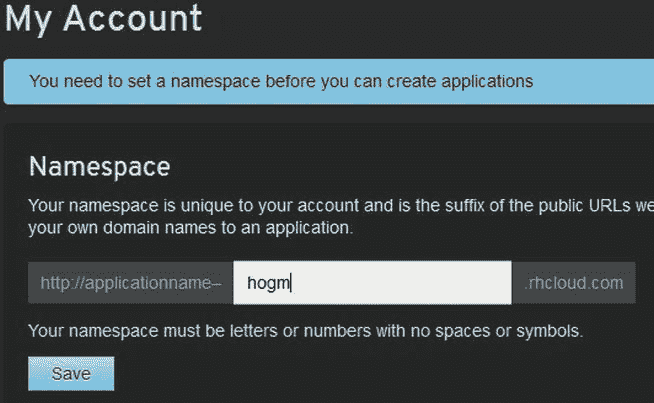
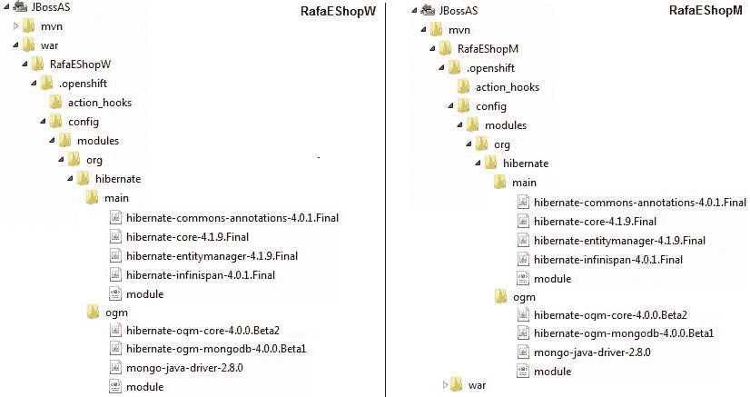

# 十、在 OpenShift 上迁移 RafaEShop 应用

在第九章中，您看到了如何将 MongoDB 数据库迁移到两个云平台——MongoHQ 和 MongoLab。顾名思义，这些平台是基于云的托管数据库解决方案，专用于 MongoDB，这意味着使用这些数据库的应用必须托管在另一个地方。但是如果你没有这样的地方，或者你想把整个应用(不仅仅是数据库)放在云中，你就必须更多地关注云计算平台，比如 Red Hat 的 OpenShift。如`www.openshift.com`网站所述，“ *OpenShift 是 Red Hat 为应用提供的免费、自动扩展的平台即服务(PaaS)。作为云中的一个应用平台，OpenShift 管理堆栈，这样你就可以专注于你的代码*

OpenShift 允许您使用几乎任何编程语言、框架和中间件，支持多种架构和服务器，为各种类型的应用提供现成的模板，维护用于开发和迁移应用的专用工具，并始终专注于为开发人员提供帮助和文档。

OpenShift 使用*插件*的概念来指代所有受支持的服务器、框架、数据库管理系统等等。例如，GlassFish AS、MongoDB、MySQL、SwitchYard、Cron、RockMongo 和 JBoss AS 都是模块，应用构建在一个或多个模块上。正如您将看到的，OpenShift 提供了一个用户界面，用于添加、删除和配置应用模块，但它真正的力量来自于 OpenShift 客户端工具，称为 *rhc* 。对于简单的应用(如一些 web 应用)，使用 OpenShift GUI 非常方便，而对于更复杂的应用(带有数据库、web 服务等的 web 应用)，GUI 和 rhc 的混合提供了完全的控制。

在本章中，您将看到如何将`RafaEShop`应用迁移到 OpenShift 云。该应用在运行于`localhost`上的 GlassFish AS 3 上托管和测试，但现在我们将把它迁移到运行于云中的 GlassFish AS 3 和 JBoss AS 7 上。目的是对源代码(MongoDB 连接凭证、配置文件等)进行必要的修改，并将这些代码迁移到云中，首先在 GlassFish AS 3 上作为 Web 归档(WAR)，其次在 JBoss AS 7 上作为 WAR 和 Maven 项目。最后，您将在云中拥有三个应用:一个部署在 GlassFish AS 3 上，两个部署在 JBoss AS 7 上。

在 OpenShift 上创建免费帐户

在开始使用 OpenShift 之前，您需要在`www.openshift.com/`创建一个免费帐户。这可以通过按下`SIGN UP`链接快速轻松地完成，这将打开如图图 10-1 所示的表单。


图 10-1 。创建免费的 OpenShift 账户

请注意，您必须提供一个有效的电子邮件地址，因为您将收到一封来自 OpenShift 的电子邮件，其中包含一个用于激活帐户的链接(图 10-2 )。


图 10-2 。通过电子邮件激活您的帐户

创建并激活您的帐户后，您必须接受法律条款和条件。阅读它们，然后按下`I Accept`按钮(图 10-3 )。


图 10-3 。OpenShift 法律术语

一旦你接受法律条款，你将被重定向到你的个人管理控制台，在那里你可以看到和创建应用，获得帮助，并修改帐户设置(见图 10-4 )。默认情况下，`Create Application`向导将被激活。


图 10-4 。用户管理控制台选项卡

从现在开始，点击 OpenShift 起始页上的`MY APPS`链接，使用您的邮箱和密码登录即可进入管理控制台页面，如图图 10-5 所示。


图 10-5 。登录到 OpenShift

如果登录成功，应该会看到`Create Application`向导 ( 图 10-6 )。该向导会自动启动，因为您还没有任何可用的应用。一旦你这样做，默认向导将是`My Applications`。请注意，一个免费的 OpenShift 帐户允许您在云中最多拥有三个应用。当您达到三个应用时，您不能创建新的应用，除非您删除或缩减现有的应用。(您将得到的消息是:“*目前您没有足够的可用空闲设备来创建新的应用。您可以缩减或删除现有应用来释放资源*。)


图 10-6 。OpenShift 创建应用向导

在创建你的第一个应用之前，你必须创建一个*名称空间*，它是你的帐户独有的，并且是 OpenShift 将分配给你的应用的公共 URL 的后缀。(如果您现在不创建名称空间，稍后会提示您创建名称空间。)首先，在你的个人管理控制台中，切换到`My Account`向导，如图 图 10-7 所示。(如果您没有看到此图片，请点击`Domain`部分的`Create a domain for your application`链接)。



图 10-7 。打开转移我的帐户向导

键入有效的名称空间并保存。正如你在图 10-7 中看到的，我输入了 *hogm* 。名称空间成功创建后，您会看到一条类似于图 10-8 中的消息。(请注意，在`Public Keys`消息的位置，您可能会看到一个`SSH Keys`部分，其中有一个指向`upload your public key to access the code`的链接。)


图 10-8 。域已成功创建

在图 10-8 中有两条重要信息。第一个确认域创建成功，第二个告诉您需要一个 SSH 公钥来安全地加密本地机器和应用之间的连接。稍后我将向您展示如何从 shell 中完成这项工作，这样您就可以注销了。

此时，您已经有了一个帐户和一个域，但是在您可以开始迁移`RafaEShop`应用之前还有几个步骤。要从本地 shell 与 OpenShift 平台通信，您需要在您的机器上安装和配置 OpenShift RHC 客户端工具(RHC)。这些工具是使用 Ruby 编程语言构建和打包的，将帮助您完成许多任务，比如将应用上传到云或者从云中移除应用；监控服务器状态和日志；控制可用服务(启动/停止/重启)；添加和删除安全权限；转发端口等等。这些工具提供的一些功能也可以通过 OpenShift 向导获得，但是这些工具的功能超出了 OpenShift web GUIs。

在 Windows 上安装 OpenShift RHC 客户端工具

在本节中，您将了解如何在 Windows 上安装 OpenShift RHC 客户端工具。您还将安装 Git 版本控制系统，rhc 使用它来为控制您的应用提供强大的命令行支持。

安装 Ruby

因为 rhc 是用 Ruby 构建和打包的，所以需要在电脑上安装 Ruby。推荐版本是 Ruby 1.9.x 我安装了 Ruby 1.9.3-p392，在`http://rubyinstaller.org/downloads/`可用。对于 Windows，Ruby 是一个可执行文件，因此安装过程由一个直观的向导监控和指导。在安装过程中，许多设置都有适合大多数情况的默认值，但是您必须选中“*将 Ruby 可执行文件添加到您的路径*中”复选框，以便从 shell 中运行 Ruby(图 10-9 )。


图 10-9 。正在安装 Ruby 将 Ruby 可执行文件添加到路径中

 **注意**如果你决定安装 1.9.x 以后的 Ruby 版本(例如 Ruby 2.0.0)，你可能会得到一个类型为“ *DL 被弃用，请在 shell 中使用小提琴*”的警告。其他一切都应该像预期的那样工作。

安装 Git

正如`www.git-scm.com`网站上引用的那样，*“Git 是一个免费的开源分布式版本控制系统，旨在快速高效地处理从小到大的项目。”* OpenShift rhc 需要 Git 为你的源代码提供版本控制，所以你需要从`www.git-scm.com/downloads`下载安装。

我下载了 Git1.8.1.2，并使用安装向导安装了它。在安装过程中，确保将 Git 添加到您的`PATH`中，这样您就可以从 shell 中运行它(图 10-10 )。


图 10-10 。正在安装 Git 将 Git 可执行文件添加到路径中

如果你不想改变你的`PATH,`，你可以使用 Git Bash shell(图 10-10 中的第一个单选按钮)，它会在你的桌面上放一个快捷方式。

从 Shell 中测试 Ruby 和 Git

在继续之前，最好通过执行一些简单的命令来快速测试一下 Ruby 和 Git。要测试 Ruby，打开一个 shell 并输入下面的命令，这也显示在图 10-11 中:

```java
ruby -e 'puts "Hello from Ruby"'
```


图 10-11 。测试 Ruby

此命令的输出也在此图中可见。

现在输入下面的命令，这也显示在图 10-12 中，以测试 Git 已经成功安装并且可以从 shell 中获得:

```java
git –version
```


图 10-12 。测试 Git

在该图中也可以看到预期的输出。

有些情况下，在安装过程中向窗口`PATH`添加 Ruby 和 Git 路径不会产生预期的结果。在这种情况下，Ruby 和/或 Git 将无法从 shell 中获得，您将得到一条错误消息，而不是预期的结果，该消息指出“*‘Ruby 或 Git’未被识别为内部或外部命令、可操作程序或批处理文件。*“如果这发生在你身上，继续读下去。如果您得到了预期的结果，请跳到下一部分。

至少有两种方法可以解决这个问题。我喜欢用批处理(`*.bat)`文件。这个想法很简单:

*   在你的计算机上的任何地方创建一个名为`autoexec.bat`的文件(这个名字实际上不必是 *autoexec* )。
*   在这个文件中，添加一行类似于图 10-13 中的`SET PATH`条目，调整 Ruby 和 Git 路径以符合你的路径。


图 10-13 。创建一个窗口。蝙蝠文件

*   打开一个 shell，导航到`.bat`文件的位置，输入文件名(参见图 10-14 )。


图 10-14 。运行批处理文件

现在，应该可以从 shell 访问 Ruby 了。请记住，每次打开新的 shell 时，都需要运行这个命令来访问 Ruby 和 Git。这可能会很痛苦，但很有效。如果您已经有这样一个`.bat`文件，那么只需在`SET PATH`部分中添加这些条目。比如我的`autoexec.bat`如图图 10-15 所示。


图 10-15 。设置路径的 Windows 批处理文件示例

另一种方法是使用 Windows 向导:

1.  在`Desktop`中，右键点击`My Computer`并点击`Properties`。
2.  Click the `Advanced System Settings` link in the left column (Figure 10-16).

    

    图 10-16 。Windows 7 控制面板

3.  在`System Properties`窗口中，点击`Environment Variables`按钮。
4.  Locate the `Path` variable (Figure 10-17) and add to it the Ruby and Git paths.

    

    图 10-17 。在 Windows 7 中添加 Ruby 和 Git 路径

5.  重启机器，从 shell 中测试 Ruby 和 Git。

安装 OpenShift Gem

最后，我们将安装 OpenShift gem 。正确安装 Ruby 和 Git 之后，我们将使用 RubyGems 包管理器(包含在 Ruby 中)来安装 OpenShift 客户端工具。这很简单，由一个简单的命令`gem install rhc`组成，如图图 10-18 所示。该命令从`www.rubygems.org/gems/rhc`下载并安装 rhc gem。


图 10-18 。下载并安装 OpenShift gem

安装完成后，运行`rhc setup`命令(第一次安装 rhc 工具时推荐使用)。为此，请使用您的电子邮件地址和密码登录，然后系统会提示您回答几个问题。第一个是关于在你的磁盘上创建一个*令牌*，用于不使用你的密码访问服务器。键入 *yes* ，令牌将被保存在`C:/Users/{USER}/.openshift/express.conf`文件中，如图图 10-19 所示。


图 10-19 。rhc 安装外壳向导；生成令牌

还记得安全加密本地机器和应用之间的通信所需的 SSH 公钥吗？现在应该通知您没有这样的密钥，OpenShift 可以为您创建一个 SSH 密钥并上传到服务器。键入*是；*SSH 密钥将保存在本地的`C:/Users/{USER}/.ssh/id_rsa.pub`文件中，并上传到服务器，如图图 10-20 所示。


图 10-20 。rhc 安装外壳向导；创建和上传 SSH 密钥

在几条信息性消息和一个可以在 OpenShift 上创建的应用列表之后，您应该会看到一条类似于“*您的客户端工具现在已经配置好了*”的消息(参见图 10-21 )。


图 10-21 。rhc 安装外壳向导；配置成功

该消息确认 rch 已成功创建，并已准备好开始开发应用。

SSH 密钥已成功生成并上传。你可以在你的个人管理控制台的`My Account`向导中查看，如图图 10-22 所示。


图 10-22 。使用我的帐户向导访问您的 SSH 密钥

 **注**本节介绍仅在 Windows 上安装 rhc 工具。但是 rhc 也可以在其他操作系统上运行，比如 Mac OS X、Fedora 16、17 和 18、Red Hat Enterprise Linux 6.4、Ubuntu 等等。要了解如何在这些操作系统上安装 rhc，请参见`www.openshift.com/developers/rhc-client-tools-install`处的说明。

修复已知问题

在 Windows 7 中，当你试图执行 Git 命令时，很有可能得到错误“*权限被拒绝(publickey，gssapi-keyex，gssapi-with-mic)* ”。解决这个问题最简单的方法是将两个名为`id_rsa`的文件从 C `:/Users/{USER}/.ssh`文件夹复制到`{GIT_HOME}/.ssh`文件夹。这应该可以解决问题！

使用 JBoss AS 7 将 RafaEShop 应用迁移到 OpenShift】

现在让我们看看如何将 *RafaEShop* 应用从您的计算机迁移到 JBoss AS 7 上的 OpenShift cloud。我们将看两个场景:一个是作为 WAR (Web Archive )迁移这个应用，另一个是作为 Maven 项目。

 **注意**当然，如果你只对其中一个场景感兴趣，就只阅读那个场景，忽略其他所有的参考。

不过，首先要完成两者共有的几个步骤。

步骤 1:创建一个基本文件夹。在你的一个本地磁盘上创建一个名为`JBossAS`的文件夹(比如`D:/JBossAS`)。我们将使用它作为我们两个场景的基本文件夹。

第二步:创建两个场景文件夹。在`D:/JBossAS`文件夹中，创建两个子文件夹，一个名为`war`，另一个名为`mvn`。

步骤 3:基于 JBoss Application Server 7.1 插件创建一个默认项目。

在部署一个应用(如 *RafaEShop* )之前，需要创建一个默认的 JBoss Application Server 7.1 应用。这是 OpenShift 支持的之一，如图图 10-23 所示。


图 10-23 。JBoss 应用服务器 7.1 卡盒

这一步可以从 OpenShift GUI 或 shell 中完成。我更喜欢后者，所以打开一个 shell 并导航到`D:/JBossAS/war`文件夹。使用 rhc 工具通过以下命令创建新项目，该命令也显示在图 10-24 中:

```java
rhc app create -a RafaEShopW -t jbossas-7
```


图 10-24 。创建 JBoss Application Server 7.1 默认应用

 **注意**在此步骤中，您可能会收到问题“*您确定要继续连接吗(是/否)？*“答案是肯定的。OpenShift 需要将该主机添加到可信主机列表中。

切换到`D:/JBossAS/mvn`文件夹并重复这一步，这次键入以下内容:

```java
rhc app create -a RafaEShopM -t jbossas-7
```

现在您有了两个相同的默认应用。我们将把 *RafaEShop* 应用作为 WAR 文件部署在`RafaEShopW` 下，作为 Maven 项目部署在`RafaEShopM` 下。

此时，如果您检查`D:/JBossAS/war`和`D:/JBossAS/mvn`文件夹，您会看到应用是在`RafaEShopW`和`RafaEShopM`子文件夹中创建的。在这里你会发现几个文件夹和文件，在`D:/JBossAS/war/RafaEShopW/README.txt`和`D:/JBossAS/war/RafaEShopM/README.txt`文件中有描述，我从中复制了下面的片段:

`deployments/` -建造战争的地点

`src/` - Maven src 结构

`pom.xml` - Maven 构建文件

`.openshift/`-open shift 特定文件的位置

`.openshift/config/` -配置文件的位置，如`standalone.xml`(用于修改 jboss 配置，如数据源)

`.openshift/action_hooks/pre_build` -在构建之前每次 git 推送时运行的脚本(在 CI 系统上，如果可用的话)

`.openshift/action_hooks/build` -作为构建过程的一部分，在每次 git 推送时运行的脚本(在 CI 系统上，如果可用的话)

`.openshift/action_hooks/deploy` -在构建之后、应用重启之前，每次 git 推送时运行的脚本

`.openshift/action_hooks/post_deploy` -应用重启后每次 git 推送时运行的脚本

`.openshift/action_hooks/pre_start_jbossas-7` -在启动 AS7 之前运行的脚本

。`openshift/action_hooks/post_start_jbossas-7`-AS7 启动后运行的脚本

`.openshift/action_hooks/pre_stop_jbossas-7` -在停止 AS7 之前运行的脚本

`.openshift/action_hooks/post_stop_jbossas-7`-AS7 停止后运行的脚本

`.openshift/markers` -用于控制应用行为的文件目录。请参见标记目录中的自述文件

阅读整个文件的完整细节。应用链接在您的个人管理控制台中可用，如图图 10-25 所示。这些链接是功能性的，它们打开应用的默认欢迎页面。


图 10-25 。两个 JBoss 应用服务器 7.1 应用链接

如果你点击一个应用的链接，你会看到应用的详细信息，比如与应用相关联的 Git 存储库，你将能够管理模块(参见图 10-26 )。


图 10-26 。RafaEShopW 应用详细信息

现在您已经看到了默认 JBoss Application Server 7.1 应用的结构，是时候进一步了解了。

第四步:添加一个 MongoDB NoSQL 数据库 2.2 插件(见图 10-27 )。


图 10-27 。MongoDB NoSQL 数据库 2.2 卡盒

这将添加一个准备好填充数据的 MongoDB 服务器实例。默认情况下，OpenShift 将创建一个与应用同名的 MongoDB 数据库。正如你在图 10-27 中看到的，有一个`Select`按钮可以让你使用一个专用的向导来添加这个墨盒。我将让您自己探索这种方法，同时向您展示如何使用 rhc 在 shell 中实现这一点。使用下面的 rhc 命令，如图 10-28 所示，将 MongoDB 添加到 RafaEShopW 应用中:

```java
rhc cartridge add -a RafaEShopW -c mongodb-2.2
```


图 10-28 。使用 rhc 工具添加 MongoDB NoSQL 数据库 2.2 插件

重复这个步骤，通过切换到`D:/JBossAS/mvn`文件夹并键入以下命令，为 *RafaEShopM* 应用获得一个 MongoDB 实例:

```java
rhc cartridge add -a RafaEShopM -c mongodb-2.2
```

注意，添加了 MongoDB 数据库，您可以通过列出的凭证访问它。MongoDB 插件现在可以在您的个人管理控制台中使用，如图 10-29 所示。


图 10-29 。MongoDB 插件列在 RafaEShopW 应用中

第五步:添加 RockMongo 1.1 弹药筒，如图图 10-30 所示。(这一步是可选的。)


图 10-30 。RockMongo 1.1 卡盒

添加 RockMongo 管理工具并不是强制性的，但是通过一个友好的 web GUI 访问 MongoDB 数据库非常有用，这样可以轻松管理数据库内容(添加和删除集合、查询数据、管理用户、导入和导出数据等等)。您可以使用下面的命令从外壳添加这个插件(对于 *RafaEShopW* 应用)，这个命令也显示在图 10-31 中:

```java
rhc cartridge add -a RafaEShopW -c rockmongo-1.1
```


图 10-31 。使用 rhc 工具添加 RockMongo 1.1 插件

当然，你也可以通过按下`Select`按钮来尝试可视化的方法。

添加 RockMongo 插件后，您可以从列出的 URL `https://RafaEShopW-hogm.rhcloud.com/rockmongo/`访问它。(凭证与 MongoDB 托管实例相同:用户:*管理员*，密码: *hi_qnUdFqEBg* )。在图 10-32 中，我访问了属于 *RafaEShopW* 应用的 MongoDB 实例的 RockMongo 接口。


图 10-32 。RafaEShopW 数据库的 RockMongo 接口

重复这个步骤，将 RockMongo 插件添加到 RafaEShopM 应用中。切换到`D:/JBossAS/mvn`并键入以下内容:

```java
rhc cartridge add -a RafaEShopM -c rockmongo-1.1
```

登录 OpenShift 查看 RockMongo 弹夹，如图图 10-33 所示。


图 10-33 。RockMongo 墨盒列在 RafaEShopW 应用中

第六步:将`org.hibernate:ogm`模块添加到 JBoss AS 7 中。

在第四章中，在“*在内置 JTA 环境中 Hibernate OGM(EJB 3，JBoss AS 7)，*”一节中，您看到了如何在 JBoss AS 7 中添加 Hibernate OGM 的模块。必须将相同的模块添加到`D:/JBossAS/war/RafaEShopW/.openshift/config/modules`文件夹(以及`RafaESHopM`的等效文件夹)。简单复制`{JBOSS_HOME}/modules/org/hibernate/main`和`{JBOSS_HOME}/modules/org/hibernate/ogm`文件夹，如图图 10-34 所示。



图 10-34 。将 Hibernate OGM 特有的模块添加到 JBoss AS 7

第七步:调整`persistence.xml`设置。你需要根据你的云应用修改`persistence.xml`文件。我建议你复印一份这份文件。原件位于`{RafaEShop_HOME}/src/conf`文件夹中，目前包含清单 10-1 中显示的设置。

***清单 10-1。*** 原文`persistence.xml File`

```java
<?xml version="1.0" encoding="UTF-8"?>
<persistence version="2.0" FontName2">http://java.sun.com/xml/ns/persistence"
xmlns:xsi=" http://www.w3.org/2001/XMLSchema-instance"
xsi:schemaLocation=" http://java.sun.com/xml/ns/persistence
http://java.sun.com/xml/ns/persistence/persistence_2_0.xsd">
    <persistence-unit name="HOGM_eSHOP-ejbPU" transaction-type="JTA">
        <provider>org.hibernate.ogm.jpa.HibernateOgmPersistence</provider>
        <class>eshop.entities.Categories</class>
        <class>eshop.entities.Customers</class>
        <class>eshop.entities.Inventory</class>
        <class>eshop.entities.Orders</class>
        <class>eshop.entities.Products</class>
    <properties>
        <property name="hibernate.search.default.directory_provider" value="filesystem"/>
        <property name="hibernate.search.default.indexBase" value="D:/eshop"/>
        <property name="hibernate.search.default.locking_strategy" value="single"/>
        <property name="hibernate.transaction.jta.platform"
                        value="org.hibernate.service.jta.platform.internal.SunOneJtaPlatform"/>
        <property name="hibernate.ogm.datastore.provider" value="mongodb"/>
        <property name="hibernate.ogm.datastore.grid_dialect"
                        value="org.hibernate.ogm.dialect.mongodb.MongoDBDialect"/>
        <property name="hibernate.ogm.mongodb.database" value="eshop_db"/>
        <property name="hibernate.ogm.mongodb.host" value="127.0.0.1"/>
        <property name="hibernate.ogm.mongodb.port" value="27017"/>
    </properties>
</persistence-unit>
</persistence>
```

您必须调整几个设置，如以下一组说明所示(这是针对`RafaEShopW`应用的)。

Apache Lucene 索引存储在文件系统的`D:/eshop`文件夹中。您需要使用有效的云文件夹路径修改此文件夹路径(基本文件夹)。或者，为了更简单，您可以通过替换以下代码来使用基于内存的目录:

```java
<property name="hibernate.search.default.directory_provider" value="filesystem"/>
<property name="hibernate.search.default.indexBase" value="D:/eshop"/>
<property name="hibernate.search.default.locking_strategy" value="single"/>
```

使用此代码:

```java
<property name="hibernate.search.default.directory_provider" value="ram"/>
<property name="hibernate.search.default.locking_strategy" value="single"/>
```

因为应用是在 JBoss AS 上部署的，所以您需要通过替换以下设置来调整 JTA 平台:

```java
<property name="hibernate.transaction.jta.platform"
        value="org.hibernate.service.jta.platform.internal.SunOneJtaPlatform"/>
```

使用此设置:

```java
<property name="hibernate.transaction.jta.platform"
        value="org.hibernate.service.jta.platform.internal.JBossAppServerJtaPlatform"/>
```

此外，您需要添加一些属性来帮助 JBoss AS 定位和使用`org.hibernate:ogm`模块，如第四章中的所述，在“*在内置的 JTA 环境中 Hibernate OGM(EJB 3，JBoss AS 7)* 一节中:”

```java
<property name="jboss.as.jpa.adapterModule" value="org.jboss.as.jpa.hibernate:4"/>
<property name="jboss.as.jpa.providerModule" value="org.hibernate:ogm"/>
<property name="jboss.as.jpa.classtransformer" value="false"/>
<property name="hibernate.listeners.envers.autoRegister" value="false"/>
```

最后，您需要设置 MongoDB 数据库名称、主机、端口、用户和密码。为此，请替换以下代码:

```java
<property name="hibernate.ogm.mongodb.database" value="eshop_db"/>
<property name="hibernate.ogm.mongodb.host" value="127.0.0.1"/>
<property name="hibernate.ogm.mongodb.port" value="27017"/>
```

使用此代码:

```java
<property name="hibernate.ogm.mongodb.database" value="RafaEShopW"/>
<property name="hibernate.ogm.mongodb.host" value="127.7.182.129"/>
<property name="hibernate.ogm.mongodb.port" value="27017"/>
<property name="hibernate.ogm.mongodb.username" value="admin"/>
<property name="hibernate.ogm.mongodb.password" value="hi_qnUdFqEBg"/>
```

 **注意**如果使用 RockMongo 连接到 MongoDB 服务器，可以很容易地获得 MongoDB 远程服务器的 IP 地址。在图 10-32 中，你可以看到在`Host`字段中列出的 IP 地址 127.7.182.129。端口始终是 27017，而用户名和密码是用于与 RockMongo 连接的端口，由 OpenShift 在您添加 MongoDB 插件时提供。

“新的”`persistence.xml`如清单 10-2 中的所示。

***清单 10-2。*** 新`persistence.xml File`

```java
<?xml version="1.0" encoding="UTF-8"?>
<persistence version="2.0" FontName2">http://java.sun.com/xml/ns/persistence "
xmlns:xsi=" http://www.w3.org/2001/XMLSchema-instance "
xsi:schemaLocation=" http://java.sun.com/xml/ns/persistence
http://java.sun.com/xml/ns/persistence/persistence_2_0.xsd ">
    <persistence-unit name="HOGM_eSHOP-ejbPU" transaction-type="JTA">
        <provider>org.hibernate.ogm.jpa.HibernateOgmPersistence</provider>
        <class>eshop.entities.Categories</class>
        <class>eshop.entities.Customers</class>
        <class>eshop.entities.Inventory</class>
        <class>eshop.entities.Orders</class>
        <class>eshop.entities.Products</class>
    <properties>
        <property name="hibernate.search.default.directory_provider" value="ram"/>
        <property name="hibernate.search.default.locking_strategy" value="single"/>
        <property name="jboss.as.jpa.adapterModule" value="org.jboss.as.jpa.hibernate:4"/>
        <property name="jboss.as.jpa.providerModule" value="org.hibernate:ogm"/>
        <property name="jboss.as.jpa.classtransformer" value="false"/>
        <property name="hibernate.listeners.envers.autoRegister" value="false"/>
        <property name="hibernate.transaction.jta.platform"
                        value="org.hibernate.service.jta.platform.internal.JBossAppServerJtaPlatform"/>
        <property name="hibernate.ogm.datastore.provider" value="mongodb"/>
        <property name="hibernate.ogm.datastore.grid_dialect"
                        value="org.hibernate.ogm.dialect.mongodb.MongoDBDialect"/>
        <property name="hibernate.ogm.mongodb.database" value="RafaEShopW"/>
        <property name="hibernate.ogm.mongodb.host" value="127.7.182.129"/>
        <property name="hibernate.ogm.mongodb.port" value="27017"/>
        <property name="hibernate.ogm.mongodb.username" value="admin"/>
        <property name="hibernate.ogm.mongodb.password" value="hi_qnUdFqEBg"/>
    </properties>
</persistence-unit>
</persistence>
```

对`RafaEShopM`应用重复步骤 7。您需要修改的只是 MongoDB 数据库名称和凭证。现在，您有两个`persistence.xml`文件，一个用于`RafaEShopW`应用，一个用于`RafaEShopM`应用。把它们放在手边。

现在我们已经完成了 WAR 和 Maven 项目共有的步骤。

监控 JBoss AS 7 日志

OpenShift 将重启 JBoss 作为每个 Git 提交会话的实例。更具体地说，当您提交更改时，OpenShift 将 JBoss 作为实例停止，上传并处理更改，然后再次作为实例启动 JBoss。如果在重启过程中出现问题(例如，如果代码中有错误或者 JAR 丢失)，那么 JBoss AS 实例启动时会出现错误，这意味着应用将无法在线使用。在这种情况下，出于调试目的，将 JBoss 作为日志来查看是非常有帮助的；否则，很难知道发生了什么。

您可以通过向您的应用打开一个安全外壳(SSH)会话 来(实时)监控服务器日志。

 **注意**找到连接到应用所需的特定 SSH 命令的最简单方法是访问应用页面并从那里复制(如图图 10-35 中的`RafaEShopW`应用所示)。关于使用 SSH 进行远程访问的更多详细信息，请访问`www.openshift.com/developers/remote-access`。


图 10-35 。为应用查找特定的 SSH 命令(RafaEShopW 示例)

这可以从外壳使用下面的`ssh`命令来完成，它也显示在图 10-36 中:

```java
ssh 514ffd57500446021e000087@RafaEShopW-hogm.rhcloud.com
```

这是为了向 *RafaEShopW* 应用打开一个安全 Shell 会话；对 *RafaEShopM* 应用做同样的事情非常直观。


图 10-36 。从 shell 执行 ssh 命令

接下来，键入`tail_all`命令，如图图 10-37 所示。请注意，该命令将跟踪当前应用的所有可用日志。(特定于 JBoss AS 的日志是`jbossas-7/logs/boot.log`和`jbossas-7/logs/server.log.)`


图 10-37 。将 JBoss 作为日志结尾

现在，您可以实时监控日志。不要在提交过程中关闭监控器，因为该进程“连接”到日志文件；只需为其他命令打开另一个 shell。

 **注意**除了`tail_all`，安全 Shell 会话还允许你执行其他命令。要查看这些命令的列表及其描述，请在 SSH 会话建立后键入`help`命令。

提交更改

在本地应用文件夹中所做的每个更改都应该在 OpenShift 上提交(您必须将该文件夹的内容与 OpenShift 上的应用同步)。为此，您可以使用 Git 命令(打开一个 shell 来监控服务器日志，如果您还没有这样做的话)。

打开一个新的 shell 并导航到`D:/JBossAS/war/RafaEShopW`文件夹(这对`RafaEShopM`应用也有效)。键入命令`git add .`，如图图 10-38 所示，为下一次提交准备暂存的内容。不要担心低频 CRLF 警告。


图 10-38 。执行 git 添加。命令

值得一提(详情见`www.kernel.org/pub/software/scm/git/docs/git-add.html`):

`git add -A`阶段所有

`git add.`阶段新增和修改，不删除

`git add -u`修改和删除的阶段，没有新增

键入命令`git commit -m "first commit"`(文本 *first commit* 可以是任何文本，只要该命令的每次执行都不同)。在这种情况下，更改作为模块文件存储和列出在新的 JBoss 中，如图 10-39 中的所示。


图 10-39 。执行 git commit -m“第一次提交”命令

值得一提(详情见`www.kernel.org/pub/software/scm/git/docs/git-commit.html`):

如果您提交了一个命令，然后立即发现了一个错误，那么您可以使用`git reset`命令来恢复它。

使用`git push`命令将更改传播到 OpenShift(参见图 10-40 )。在此命令的执行过程中(可能需要几秒到几分钟)，您可以检查实时更新的服务器日志。注意服务器在`push`期间是如何停止和启动的。如果没有检测到任何更改，您将看到一条消息，通知您所有内容都是最新的。


图 10-40 。执行 git push 命令

值得一提(详情见`www.kernel.org/pub/software/scm/git/docs/git-push.html`):

从远程储存库中删除所有列出的更改。

将 RafaEShop 应用迁移为一场战争

做完这些辛苦的工作，是时候准备`RafaEShop`战了，准备在云端部署在 JBoss AS 7 下。首先，在您的本地项目`RafaEShop/dist`文件夹中或者在`RafaEShop/dist`文件夹中的一个 press 存储库中找到 WAR。将这场战争复制到`D:/JBossAS/war/RafaEShopW/deployments`文件夹。最后，覆盖`RafaEShop` WAR 存档中的`persistence.xml`文件(可以使用任何存档工具，比如 WinRAR)。

在发起云战争之前，还有一个步骤需要完成。您需要在`/lib`文件夹中再添加两个 jar，分别命名为`jackson-core-asl-1.9.12.jar` ( `http://mvnrepository.com/artifact/org.codehaus.jackson/jackson-core-asl`)和`jackson-mapper-asl-1.9.12.jar` ( `http://mvnrepository.com/artifact/org.codehaus.jackson/jackson-mapper-asl`)。

最后，提交更改，如图 10-41 所示。


图 10-41 。进行拉斐尔商店战争

应用已成功部署并启动。JBoss 服务器日志应该类似于图 10-42 中所示。


图 10-42 。JBoss AS 日志

如果您仅对这个应用感兴趣，您可以跳到“测试它！”部分。

将 RafaEShop 应用作为 Maven 项目进行迁移

现在我将重点介绍一下 `RafaEShopM`应用。快速浏览一下`/mvn/RafaEShopM`文件夹，会发现一个`pom.xml`文件和一个`/src`文件夹，其中有三个子文件夹:`/main/java`、`/main/resources,`和`/main/webapp`。这其实是 OpenShift 创建的默认应用；这是一个运行在 JBoss AS 7 上的简单演示，可以作为开发人员的起点。

正如您所看到的，这个演示有一个 Maven 项目结构，这意味着我们应该能够用`RafaEShop`应用替换它。为此，我们必须在正确的位置添加`RafaEShop`组件，并相应地调整`pom.xml`。

以下是将`RafaEShop`应用部署为 Maven 项目的步骤:

步骤 1:找到`RafaEShop` NetBeans 项目。您可以从 Apress 存储库中下载`RafaEShop` NetBeans 项目。

第二步:清空`/webapp`文件夹的内容。删除`D:/JBossAS/mvn/RafaEShopM/src/main/webapp`文件夹的当前内容即可。

第 3 步:复制`RafaEShop`源。将文件夹`{RafaEShop_HOME}/src/java/eshop`复制到`D:/JBossAS/mvn/RafaEShopM/src/main/java`文件夹，如图图 10-43 所示。


图 10-43 。将/eshop 文件夹从 RafaEShop 应用复制到 RafaEShopM 应用

第四步:复制`RafaEShop` `/web`文件夹内容。将`{RafaEShop_HOME}/web`文件夹的内容复制到`D:/JBossAS/mvn/RafaEShopM/src/main/webapp`文件夹，如图图 10-44 所示。


图 10-44 。将/web 文件夹内容从 RafaEShop 应用复制到 RafaEShopM 应用

第五步:创建`/META-INF`文件夹。在`D:/JBossAS/mvn/RafaEShopM/src/main/resources`中创建一个名为`META-INF`的空文件夹(参见图 10-45 )。


图 10-45 。创建空的 META-INF 文件夹

第 6 步:复制`persistence.xml.`在前面的章节中，“*使用 JBoss AS 7 将 RafaEShop 应用迁移到 OpenShift，*，您为`RafaEShopM`应用创建了一个`persistence.xml`文件。现在，将其复制到`D:/JBossAS/mvn/RafaEShopM/src/main/resources/META-INF`文件夹中(参见图 10-46 )。


图 10-46 。复制 persistence.xml 文件

第七步:调整`pom.xml.`编辑默认的`pom.xml`文件，如清单 10-3 所示。您必须添加必要的依赖项(Hibernate OGM、Hibernate Search 和 PrimeFaces)。

***清单 10-3。*** 编辑`pom.xml File`

```java
<project FontName2">http://maven.apache.org/POM/4.0.0 " xmlns:xsi=" http://www.w3.org/2001/XMLSchema-instance "
  xsi:schemaLocation=" http://maven.apache.org/POM/4.0.0 http://maven.apache.org/maven-v4_0_0.xsd ">
  <modelVersion>4.0.0</modelVersion>
  <groupId>RafaEShopM</groupId>
  <artifactId>RafaEShopM</artifactId>
  <packaging>war</packaging>
  <version>1.0</version>
  <name>RafaEShopM</name>
  <properties>
    <project.build.sourceEncoding>UTF-8</project.build.sourceEncoding>
    <maven.compiler.source>1.6</maven.compiler.source>
    <maven.compiler.target>1.6</maven.compiler.target>
  </properties>

  <repositories>
       <repository>
            <id>prime-repo</id>
            <name>PrimeFaces Maven Repository</name>
            <url> http://repository.primefaces.org</url >
            <layout>default</layout>
        </repository>
       <repository>
          <id>jboss-public-repository-group</id>
          <name>JBoss Public Maven Repository Group</name>
          <url> https://repository.jboss.org/nexus/content/groups/public-jboss/</url >
          <layout>default</layout>
          <releases>
            <enabled>true</enabled>
            <updatePolicy>never</updatePolicy>
          </releases>
          <snapshots>
            <enabled>true</enabled>
            <updatePolicy>never</updatePolicy>
          </snapshots>
        </repository>
    </repositories>

    <!--
    <pluginRepositories>
        <pluginRepository>
          <id>jboss-public-repository-group</id>
          <name>JBoss Public Maven Repository Group</name>
          <url> https://repository.jboss.org/nexus/content/groups/public-jboss/</url >
          <layout>default</layout>
          <releases>
            <enabled>true</enabled>
            <updatePolicy>never</updatePolicy>
          </releases>
          <snapshots>
            <enabled>true</enabled>
            <updatePolicy>never</updatePolicy>
          </snapshots>
        </pluginRepository>
      </pluginRepositories>
       -->

 <dependencyManagement>
        <dependencies>
            <dependency>
                <groupId>org.primefaces</groupId>
                <artifactId>primefaces</artifactId>
                <version>3.4.2</version>
            </dependency>
            <dependency>
    <groupId>org.hibernate</groupId>
    <artifactId>hibernate-search</artifactId>
    <version>4.2.0.Beta1</version>
            </dependency>
            <dependency>
                <groupId>org.hibernate.ogm</groupId>
                <artifactId>hibernate-ogm-core</artifactId>
                <version>4.0.0.Beta2</version>
            </dependency>
            <dependency>
                <groupId>org.hibernate.ogm</groupId>
                <artifactId>hibernate-ogm-mongodb</artifactId>
                <version>4.0.0.Beta1</version>
            </dependency>
        </dependencies>
  </dependencyManagement>

  <dependencies>
    <dependency>
      <groupId>org.primefaces</groupId>
      <artifactId>primefaces</artifactId>
      <version>3.4.2</version>
    </dependency>
 <dependency>
   <groupId>org.hibernate</groupId>
   <artifactId>hibernate-search</artifactId>
   <version>4.2.0.Beta1</version>
      </dependency>
   <dependency>
        <groupId>org.hibernate.ogm</groupId>
        <artifactId>hibernate-ogm-core</artifactId>
        <version>4.0.0.Beta2</version>
      </dependency>
      <dependency>
        <groupId>org.hibernate.ogm</groupId>
        <artifactId>hibernate-ogm-mongodb</artifactId>
        <version>4.0.0.Beta1</version>
      </dependency>
    <dependency>
      <groupId>org.jboss.spec</groupId>
      <artifactId>jboss-javaee-6.0</artifactId>
      <version>1.0.0.Final</version>
      <type>pom</type>
      <scope>provided</scope>
    </dependency>
  </dependencies>
  <profiles>
    <profile>
     <!-- When built in OpenShift the 'openshift' profile will be used when invoking mvn. -->
     <!-- Use this profile for any OpenShift specific customization your app will need. -->
     <!-- By default that is to put the resulting archive into the 'deployments' folder. -->
     <!-- http://maven.apache.org/guides/mini/guide-building-for-different-environments.html -->
     <id>openshift</id>
     <build>
        <finalName>RafaEShopM</finalName>
        <plugins>
          <plugin>
            <artifactId>maven-war-plugin</artifactId>
            <version>2.1.1</version>
            <configuration>
              <outputDirectory>deployments</outputDirectory>
              <warName>RafaEShop</warName>
            </configuration>
          </plugin>
        </plugins>
      </build>
    </profile>
  </profiles>
</project>
```

最后，提交更改，如图图 10-47 所示。


图 10-47 。将 RafaEShop 提交为 Apache Maven 项目

应用已成功部署并启动。JBoss 服务器日志应该类似于图 10-48 中所示。


图 10-48 。RafaEShop 已成功部署

如果您仅对这个应用感兴趣，现在可以跳到“测试它！”部分。

使用 GlassFish 3 作为将 RafaEShop 应用迁移到 OpenShift

在本章的第一部分，你看到了 OpenShift 为 JBoss AS 提供了出色的支持。只需几分钟，您就可以获得一个在 JBoss AS 上运行的默认应用，并且只需几次点击和命令，您就可以构建和部署自己的应用作为 WARs，甚至作为 Apache Maven 项目。

在本章的第二部分，我们将了解如何将`RafaEShop`应用从您的计算机迁移到 GlassFish 3 AS 上的 OpenShift cloud。在撰写本文时，OpenShift 没有提供默认的 GlassFish 插件，但它允许您使用自己动手的应用类型扩展 OpenShift 以支持 GlassFish(或其他不支持的语言、框架和中间件)，如图图 10-49 所示。


图 10-49 。自己动手做墨盒

以下是创建此类应用的步骤:

第 1 步:像准备 OpenShift 一样准备 GlassFish。在创建 DIY 应用之前，您需要为使用 OpenShift 准备好 GlassFish。有几处修改会影响 GlassFish 域配置，所以不建议您在本地 GlassFish 发行版上执行这些修改。最好从`download.java.net/glassfish/3.1.2.2/release/glassfish-3.1.2.2.zip`下载一个新的 GlassFish 发行版(本例中使用的是 3.1.2.2 版本),并在计算机上一个方便的地方解压缩 ZIP 存档内容。

以下是你需要做的修改:

*   将 HTTP 侦听器绑定到应用 IP(由环境变量`$OPENSHIFT_INTERNAL_IP`表示)。
*   禁用管理员控制台。
*   禁用其他侦听器。
*   将一些端口更新为允许的端口。

这些修改将影响单个 GlassFish 文件，`{GlassFish_HOME}/glassfish/domains/domain1/config/domain.xml.`在我展示修改列表之后，这个文档的修改版本将被完整显示。您将在`http://docs.oracle.com/cd/E19798-01/821-1753/abhar/index.html`找到关于这个文件的内容和格式的更多细节。

您应该进行以下修改。这些修改由 OpenShift 博客在`https://www.openshift.com/blogs`处指明，并按照从文档顶部到底部的顺序显示:

修改 1:将 *localhost* 替换为 *OPENSHIFT_INTERNAL_IP* ，如图图 10-50 所示。


图 10-50 。修改 1

修改 2:将 *localhost* 替换为 *OPENSHIFT_INTERNAL_IP* ，如图图 10-51 所示。


图 10-51 。修改 2

修改 3:删除“ *http-listener-2* ”，如图图 10-52 所示。


图 10-52 。修改 3

修改 4:注释*<iiop-service></iiop-service>、*如图 10-53 所示的线条。


图 10-53 。修改 4

修改 5:将 *0.0.0.0* 替换为 *OPENSHIFT_INTERNAL_IP* ，将 *8686* 替换为 *7600* ，如图图 10-54 所示。


图 10-54 。修改 5

修改 6:将 *localhost* 替换为 *OPENSHIFT_INTERNAL_IP* ，将 *7676* 替换为 *5445* ，如图图 10-55 所示。


图 10-55 。修改 6

修改 7:将 *127.0.0.1* 替换为 *OPENSHIFT_INTERNAL_IP* ，如图图 10-56 所示。


图 10-56 。修改 7

修改 8:对图 10-57 中的 *<协议></协议>、*行进行注释。


图 10-57 。修改 8

修改 9:增加*address = " open shift _ INTERNAL _ IP "，*，如图图 10-58 所示。


图 10-58 。修改 9

修改 10:注释 *<网络监听器></网络监听器>、*如图图所示的线路。


图 10-59 。修改 10

修改 11:删除 *http-listener-2，*如图图 10-60 所示。


图 10-60 。修改 11

修改 12:注释*<iiop-service></iiop-service>、*线，如图 10-61 所示。


图 10-61 。修改 12

修改 13:将 *127.0.0.1* 替换为 *OPENSHIFT_INTERNAL_IP* ，如图图 10-62 所示。


图 10-62 。修改 13

修改 14:对图 10-63 中 *<协议></协议>、*行进行注释。


图 10-63 。修改 14

修改 15:将 *0.0.0.0* 替换为 *OPENSHIFT_INTERNAL_IP* ，将 *${HTTP_LISTENER_PORT}* 替换为 *9999* ，如图 10-64 所示。


图 10-64 。修改 15

修改 16:注释 *<网络监听器></网络监听器>、*如图 10-65 所示的线路。


图 10-65 。修改 16

 **注**真实的环境变量是`$OPENSHIFT_INTERNAL_IP`。字符串`OPENSHIFT_INTERNAL_IP`只是一个占位符，因此您可以使用任何其他文本。

所有的修改完成后，`domain.xml`就变成了你在清单 10-4 中看到的样子。

***清单 10-4。*** 修改后的`domain.xml File`

```java
<!--

    DO NOT ALTER OR REMOVE COPYRIGHT NOTICES OR THIS HEADER.

    Copyright (c) 2010-2012 Oracle and/or its affiliates. All rights reserved.

    The contents of this file are subject to the terms of either the GNU
    General Public License Version 2 only ("GPL") or the Common Development
    and Distribution License("CDDL") (collectively, the "License").  You
    may not use this file except in compliance with the License.  You can
    obtain a copy of the License at
    https://glassfish.dev.java.net/public/CDDL+GPL_1_1.html
    or packager/legal/LICENSE.txt.  See the License for the specific
    language governing permissions and limitations under the License.

    When distributing the software, include this License Header Notice in each
    file and include the License file at packager/legal/LICENSE.txt.

    GPL Classpath Exception:
    Oracle designates this particular file as subject to the "Classpath"
    exception as provided by Oracle in the GPL Version 2 section of the License
    file that accompanied this code.

    Modifications:
    If applicable, add the following below the License Header, with the fields
    enclosed by brackets [] replaced by your own identifying information:
    "Portions Copyright [year] [name of copyright owner]"

    Contributor(s):
    If you wish your version of this file to be governed by only the CDDL or
    only the GPL Version 2, indicate your decision by adding "[Contributor]
    elects to include this software in this distribution under the [CDDL or GPL
    Version 2] license."  If you don't indicate a single choice of license, a
    recipient has the option to distribute your version of this file under
    either the CDDL, the GPL Version 2 or to extend the choice of license to
    its licensees as provided above.  However, if you add GPL Version 2 code
    and therefore, elected the GPL Version 2 license, then the option applies
    only if the new code is made subject to such option by the copyright
    holder.

-->

<?xml version="1.0" encoding="UTF-8"?>
<domain log-root="${com.sun.aas.instanceRoot}/logs" application-root="${com.sun.aas.instanceRoot}/applications" version="10.0">
  <system-applications />
  <applications />
  <resources>
    <jdbc-resource pool-name="__TimerPool" jndi-name="jdbc/__TimerPool" object-type="system-admin" />
    <jdbc-resource pool-name="DerbyPool" jndi-name="jdbc/__default" />
    <jdbc-connection-pool name="__TimerPool" datasource-classname="org.apache.derby.jdbc.EmbeddedXADataSource" res-type="javax.sql.XADataSource">
      <property value="${com.sun.aas.instanceRoot}/lib/databases/ejbtimer" name="databaseName" />
      <property value=";create=true" name="connectionAttributes" />
    </jdbc-connection-pool>
    <jdbc-connection-pool is-isolation-level-guaranteed="false" name="DerbyPool" datasource-classname="org.apache.derby.jdbc.ClientDataSource" res-type="javax.sql.DataSource">
      <property value="1527" name="PortNumber" />
      <property value="APP" name="Password" />
      <property value="APP" name="User" />
      <property value="OPENSHIFT_INTERNAL_IP" name="serverName" />
      <property value="sun-appserv-samples" name="DatabaseName" />
      <property value=";create=true" name="connectionAttributes" />
    </jdbc-connection-pool>
  </resources>
  <servers>
    <server name="server" config-ref="server-config">
      <resource-ref ref="jdbc/__TimerPool" />
      <resource-ref ref="jdbc/__default" />
    </server>
  </servers>
  <nodes>
    <node name="localhost-domain1" type="CONFIG" node-host="OPENSHIFT_INTERNAL_IP" install-dir="${com.sun.aas.productRoot}" />
  </nodes>
  <configs>
    <config name="server-config">
      <http-service>
        <access-log />
        <virtual-server id="server" network-listeners="http-listener-1" />
        <virtual-server id="__asadmin" network-listeners="admin-listener" />
      </http-service>
      <admin-service auth-realm-name="admin-realm" type="das-and-server" system-jmx-connector-name="system">
        <jmx-connector auth-realm-name="admin-realm" security-enabled="false" address="OPENSHIFT_INTERNAL_IP" port="7600" name="system" />
        <property value="/admin" name="adminConsoleContextRoot" />
        <property value="${com.sun.aas.installRoot}/lib/install/applications/admingui.war" name="adminConsoleDownloadLocation" />
        <property value="${com.sun.aas.installRoot}/.." name="ipsRoot" />
      </admin-service>
      <connector-service shutdown-timeout-in-seconds="30" />
      <web-container>
        <session-config>
          <session-manager>
            <manager-properties />
            <store-properties />
          </session-manager>
          <session-properties />
        </session-config>
      </web-container>
      <ejb-container steady-pool-size="0" max-pool-size="32" session-store="${com.sun.aas.instanceRoot}/session-store" pool-resize-quantity="8">
        <ejb-timer-service />
      </ejb-container>
      <mdb-container steady-pool-size="0" max-pool-size="32" pool-resize-quantity="8" />
      <jms-service type="EMBEDDED" default-jms-host="default_JMS_host">
        <jms-host name="default_JMS_host" host="OPENSHIFT_INTERNAL_IP" port="5445" admin-user-name="admin" admin-password="admin" lazy-init="true" />
      </jms-service>
      <security-service>
        <auth-realm classname="com.sun.enterprise.security.auth.realm.file.FileRealm" name="admin-realm">
          <property value="${com.sun.aas.instanceRoot}/config/admin-keyfile" name="file" />
          <property value="fileRealm" name="jaas-context" />
        </auth-realm>
        <auth-realm classname="com.sun.enterprise.security.auth.realm.file.FileRealm" name="file">
          <property value="${com.sun.aas.instanceRoot}/config/keyfile" name="file" />
          <property value="fileRealm" name="jaas-context" />
        </auth-realm>
        <auth-realm classname="com.sun.enterprise.security.auth.realm.certificate.CertificateRealm"name="certificate" />
        <jacc-provider policy-configuration-factory- provider="com.sun.enterprise.security.provider.PolicyConfigurationFactoryImpl" policy-provider="com.sun.enterprise.security.provider.PolicyWrapper" name="default">
          <property value="${com.sun.aas.instanceRoot}/generated/policy" name="repository" />
        </jacc-provider>
        <jacc-provider policy-configuration-factory-provider="com.sun.enterprise.security.jacc.provider.SimplePolicyConfigurationFactory" policy-provider="com.sun.enterprise.security.jacc.provider.SimplePolicyProvider" name="simple" />
        <audit-module classname="com.sun.enterprise.security.Audit" name="default">
          <property value="false" name="auditOn" />
        </audit-module>
        <message-security-config auth-layer="SOAP">
          <provider-config provider-id="XWS_ClientProvider" class-name="com.sun.xml.wss.provider.ClientSecurityAuthModule" provider-type="client">
            <request-policy auth-source="content" />
            <response-policy auth-source="content" />
            <property value="s1as" name="encryption.key.alias" />
            <property value="s1as" name="signature.key.alias" />
            <property value="false" name="dynamic.username.password" />
            <property value="false" name="debug" />
          </provider-config>
          <provider-config provider-id="ClientProvider" class-name="com.sun.xml.wss.provider.ClientSecurityAuthModule" provider-type="client">
            <request-policy auth-source="content" />
            <response-policy auth-source="content" />
            <property value="s1as" name="encryption.key.alias" />
            <property value="s1as" name="signature.key.alias" />
            <property value="false" name="dynamic.username.password" />
            <property value="false" name="debug" />
            <property value="${com.sun.aas.instanceRoot}/config/wss-server-config-1.0.xml"name="security.config" />
          </provider-config>
          <provider-config provider-id="XWS_ServerProvider" class-name="com.sun.xml.wss.provider.ServerSecurityAuthModule" provider-type="server">
            <request-policy auth-source="content" />
            <response-policy auth-source="content" />
            <property value="s1as" name="encryption.key.alias" />
            <property value="s1as" name="signature.key.alias" />
            <property value="false" name="debug" />
          </provider-config>
          <provider-config provider-id="ServerProvider" class-name="com.sun.xml.wss.provider.ServerSecurityAuthModule" provider-type="server">
            <request-policy auth-source="content" />
            <response-policy auth-source="content" />
            <property value="s1as" name="encryption.key.alias" />
            <property value="s1as" name="signature.key.alias" />
            <property value="false" name="debug" />
            <property value="${com.sun.aas.instanceRoot}/config/wss-server-config-1.0.xml"name="security.config" />
          </provider-config>
        </message-security-config>
        <message-security-config auth-layer="HttpServlet">
          <provider-config provider-type="server" provider-id="GFConsoleAuthModule" class-name="org.glassfish.admingui.common.security.AdminConsoleAuthModule">
            <request-policy auth-source="sender" />
            <response-policy />
            <property name="restAuthURL" value=" http://localhost:${ADMIN_LISTENER_PORT}/management/sessions " />
            <property name="loginPage" value="/login.jsf" />
            <property name="loginErrorPage" value="/loginError.jsf" />
          </provider-config>
        </message-security-config>
        <property value="SHA-256" name="default-digest-algorithm" />
      </security-service>
      <transaction-service tx-log-dir="${com.sun.aas.instanceRoot}/logs" />
      <java-config classpath-suffix="" system-classpath="" debug-options="-Xdebug -Xrunjdwp:transport=dt_socket,server=y,suspend=n,address=9009">
        <jvm-options>-XX:MaxPermSize=192m</jvm-options>
        <jvm-options>-XX:PermSize=64m</jvm-options>
        <jvm-options>-client</jvm-options>
        <jvm-options>-Djava.awt.headless=true</jvm-options>
        <jvm-options>-Djavax.management.builder.initial=com.sun.enterprise.v3.admin.AppServerMBeanServerBuilder</jvm-options>
        <jvm-options>-XX:+UnlockDiagnosticVMOptions</jvm-options>
        <jvm-options>-Djava.endorsed.dirs=${com.sun.aas.installRoot}/modules/endorsed${path.separator}${com.sun.aas.installRoot}/lib/endorsed</jvm-options>
        <jvm-options>-Djava.security.policy=${com.sun.aas.instanceRoot}/config/server.policy</jvm-options>
        <jvm-options>-Djava.security.auth.login.config=${com.sun.aas.instanceRoot}/config/login.conf</jvm-options>
        <jvm-options>-Dcom.sun.enterprise.security.httpsOutboundKeyAlias=s1as</jvm-options>
        <jvm-options>-Xmx512m</jvm-options>
        <jvm-options>-Djavax.net.ssl.keyStore=${com.sun.aas.instanceRoot}/config/keystore.jks</jvm-options>
        <jvm-options>-Djavax.net.ssl.trustStore=${com.sun.aas.instanceRoot}/config/cacerts.jks</jvm-options>
        <jvm-options>-Djava.ext.dirs=${com.sun.aas.javaRoot}/lib/ext${path.separator}${com.sun.aas.javaRoot}/jre/lib/ext${path.separator}${com.sun.aas.instanceRoot}/lib/ext</jvm-options>
        <jvm-options>-Djdbc.drivers=org.apache.derby.jdbc.ClientDriver</jvm-options>
        <jvm-options>-DANTLR_USE_DIRECT_CLASS_LOADING=true</jvm-options>
        <jvm-options>-Dcom.sun.enterprise.config.config_environment_factory_class=com.sun.enterprise.config.serverbeans.AppserverConfigEnvironmentFactory</jvm-options>
        <!-- Configuration of various third-party OSGi bundles like
             Felix Remote Shell, FileInstall, etc. -->
        <!-- Port on which remote shell listens for connections.-->
        <jvm-options>-Dosgi.shell.telnet.port=6666</jvm-options>
        <!-- How many concurrent users can connect to this remote shell -->
        <jvm-options>-Dosgi.shell.telnet.maxconn=1</jvm-options>
        <!-- From which hosts users can connect -->
        <jvm-options>-Dosgi.shell.telnet.ip=OPENSHIFT_INTERNAL_IP</jvm-options>
        <!-- Gogo shell configuration -->
        <jvm-options>-Dgosh.args=--nointeractive</jvm-options>
        <!-- Directory being watched by fileinstall. -->
        <jvm-options>-Dfelix.fileinstall.dir=${com.sun.aas.installRoot}/modules/autostart/</jvm-options>
        <!-- Time period fileinstaller thread in ms. -->
        <jvm-options>-Dfelix.fileinstall.poll=5000</jvm-options>
        <!-- log level: 1 for error, 2 for warning, 3 for info and 4 for debug. -->
        <jvm-options>-Dfelix.fileinstall.log.level=2</jvm-options>
        <!-- should new bundles be started or installed only?
             true => start, false => only install
        -->
        <jvm-options>-Dfelix.fileinstall.bundles.new.start=true</jvm-options>
        <!-- should watched bundles be started transiently or persistently -->
        <jvm-options>-Dfelix.fileinstall.bundles.startTransient=true</jvm-options>
        <!-- Should changes to configuration be saved in corresponding cfg file? false: no, true: yes
             If we don't set false, everytime server starts from clean osgi cache, the file gets rewritten.
        -->
        <jvm-options>-Dfelix.fileinstall.disableConfigSave=false</jvm-options>
        <!-- End of OSGi bundle configurations -->
        <jvm-options>-XX:NewRatio=2</jvm-options>
      </java-config>
      <network-config>
        <protocols>
          <protocol name="http-listener-1">
            <http default-virtual-server="server" max-connections="250">
              <file-cache enabled="false" />
            </http>
          </protocol>
          <protocol name="admin-listener">
            <http default-virtual-server="__asadmin" max-connections="250" encoded-slash-enabled="true">
              <file-cache enabled="false" />
            </http>
          </protocol>
        </protocols>
        <network-listeners>
          <network-listener address="OPENSHIFT_INTERNAL_IP" port="8080" protocol="http-listener-1" transport="tcp" name="http-listener-1" thread-pool="http-thread-pool" />
        </network-listeners>
        <transports>
          <transport name="tcp" />
        </transports>
      </network-config>
      <thread-pools>
        <thread-pool name="admin-thread-pool" max-thread-pool-size="50" max-queue-size="256" />
        <thread-pool name="http-thread-pool" max-queue-size="4096" />
        <thread-pool name="thread-pool-1" max-thread-pool-size="200" />
      </thread-pools>
    </config>
    <config name="default-config" dynamic-reconfiguration-enabled="true">
      <http-service>
        <access-log />
        <virtual-server id="server" network-listeners="http-listener-1">
          <property name="default-web-xml" value="${com.sun.aas.instanceRoot}/config/default-web.xml" />
        </virtual-server>
        <virtual-server id="__asadmin" network-listeners="admin-listener" />
      </http-service>
      <admin-service system-jmx-connector-name="system" type="server">
        <!-- JSR 160  "system-jmx-connector" -->
        <jmx-connector address="0.0.0.0" auth-realm-name="admin-realm" name="system" port="${JMX_SYSTEM_CONNECTOR_PORT}" protocol="rmi_jrmp" security-enabled="false" />
        <!-- JSR 160  "system-jmx-connector" -->
        <property value="${com.sun.aas.installRoot}/lib/install/applications/admingui.war"                                                             name="adminConsoleDownloadLocation" />
      </admin-service>
      <web-container>
        <session-config>
          <session-manager>
            <manager-properties />
            <store-properties />
          </session-manager>
          <session-properties />
        </session-config>
      </web-container>
      <ejb-container session-store="${com.sun.aas.instanceRoot}/session-store">
        <ejb-timer-service />
      </ejb-container>
      <mdb-container />
      <jms-service type="EMBEDDED" default-jms-host="default_JMS_host"
addresslist-behavior="priority">
        <jms-host name="default_JMS_host" host="localhost" port="${JMS_PROVIDER_PORT}"
admin-user-name="admin" admin-password="admin" lazy-init="true" />
      </jms-service>
      <log-service log-rotation-limit-in-bytes="2000000"
file="${com.sun.aas.instanceRoot}/logs/server.log">
        <module-log-levels />
      </log-service>
      <security-service>
        <auth-realm classname="com.sun.enterprise.security.auth.realm.file.FileRealm" name="admin-realm">
          <property name="file" value="${com.sun.aas.instanceRoot}/config/admin-keyfile" />
          <property name="jaas-context" value="fileRealm" />
        </auth-realm>
        <auth-realm classname="com.sun.enterprise.security.auth.realm.file.FileRealm" name="file">
          <property name="file" value="${com.sun.aas.instanceRoot}/config/keyfile" />
          <property name="jaas-context" value="fileRealm" />
        </auth-realm>
        <auth-realm classname="com.sun.enterprise.security.auth.realm.certificate.CertificateRealm" name="cetificate" />
        <jacc-provider policy-provider="com.sun.enterprise.security.provider.PolicyWrapper" name="default" policy-configuration-factory-provider="com.sun.enterprise.security.provider.PolicyConfigurationFactoryImpl">
          <property name="repository" value="${com.sun.aas.instanceRoot}/generated/policy" />
        </jacc-provider>
        <jacc-provider policy-provider="com.sun.enterprise.security.jacc.provider.SimplePolicyProvider" name="simple" policy-configuration-factory-provider="com.sun.enterprise.security.jacc.provider.SimplePolicyConfigurationFactory" />
        <audit-module classname="com.sun.enterprise.security.Audit" name="default">
          <property name="auditOn" value="false" />
        </audit-module>
        <message-security-config auth-layer="SOAP">
          <provider-config provider-type="client" provider-id="XWS_ClientProvider"
class-name="com.sun.xml.wss.provider.ClientSecurityAuthModule">
            <request-policy auth-source="content" />
            <response-policy auth-source="content" />
            <property name="encryption.key.alias" value="s1as" />
            <property name="signature.key.alias" value="s1as" />
            <property name="dynamic.username.password" value="false" />
            <property name="debug" value="false" />
          </provider-config>
          <provider-config provider-type="client" provider-id="ClientProvider"
class-name="com.sun.xml.wss.provider.ClientSecurityAuthModule">
            <request-policy auth-source="content" />
            <response-policy auth-source="content" />
            <property name="encryption.key.alias" value="s1as" />
            <property name="signature.key.alias" value="s1as" />
            <property name="dynamic.username.password" value="false" />
            <property name="debug" value="false" />
            <property name="security.config"
value="${com.sun.aas.instanceRoot}/config/wss-server-config-1.0.xml" />
          </provider-config>
          <provider-config provider-type="server" provider-id="XWS_ServerProvider"
class-name="com.sun.xml.wss.provider.ServerSecurityAuthModule">
            <request-policy auth-source="content" />
            <response-policy auth-source="content" />
            <property name="encryption.key.alias" value="s1as" />
            <property name="signature.key.alias" value="s1as" />
            <property name="debug" value="false" />
          </provider-config>
          <provider-config provider-type="server" provider-id="ServerProvider"
class-name="com.sun.xml.wss.provider.ServerSecurityAuthModule">
            <request-policy auth-source="content" />
            <response-policy auth-source="content" />
            <property name="encryption.key.alias" value="s1as" />
            <property name="signature.key.alias" value="s1as" />
            <property name="debug" value="false" />
            <property name="security.config"
value="${com.sun.aas.instanceRoot}/config/wss-server-config-1.0.xml" />
          </provider-config>
        </message-security-config>
      </security-service>
      <transaction-service tx-log-dir="${com.sun.aas.instanceRoot}/logs" automatic-recovery="true" />
      <diagnostic-service />
      <java-config debug-options="-Xdebug -Xrunjdwp:transport=dt_socket,server=y,suspend=n,
address=${JAVA_DEBUGGER_PORT}" system-classpath="" classpath-suffix="">
        <jvm-options>-XX:MaxPermSize=192m</jvm-options>
        <jvm-options>-XX:PermSize=64m</jvm-options>
        <jvm-options>-server</jvm-options>
        <jvm-options>-Djava.awt.headless=true</jvm-options>
        <jvm-options>-XX:+UnlockDiagnosticVMOptions</jvm-options>
        <jvm-options>-Djava.endorsed.dirs=${com.sun.aas.installRoot}/modules/endorsed${path.separator}${com.sun.aas.installRoot}/lib/endorsed</jvm-options>
        <jvm-options>-
Djava.security.policy=${com.sun.aas.instanceRoot}/config/server.policy</jvm-options>
        <jvm-options>-Djava.security.auth.login.config=${com.sun.aas.instanceRoot}/config/                                                                        login.conf</jvm-options>
        <jvm-options>-Dcom.sun.enterprise.security.httpsOutboundKeyAlias=s1as</jvm-options>
        <jvm-options>-Djavax.net.ssl.keyStore=${com.sun.aas.instanceRoot}/config/keystore.jks</jvm-options>
        <jvm-options>-Djavax.net.ssl.trustStore=${com.sun.aas.instanceRoot}/config/cacerts.jks</jvm-options>
        <jvm-options>- Djava.ext.dirs=${com.sun.aas.javaRoot}/lib/ext${path.separator}${com.sun.aas.javaRoot}/jre/lib/ext${path.separator}${com.sun.aas.instanceRoot}/lib/ext</jvm-options>
        <jvm-options>-Djdbc.drivers=org.apache.derby.jdbc.ClientDriver</jvm-options>
        <jvm-options>-DANTLR_USE_DIRECT_CLASS_LOADING=true</jvm-options>
        <jvm-options>-Dcom.sun.enterprise.config.config_environment_factory_class=com.sun.enterprise.config.serverbeans.AppserverConfigEnvironmentFactory</jvm-options>
        <jvm-options>-XX:NewRatio=2</jvm-options>
        <jvm-options>-Xmx512m</jvm-options>
        <!-- Port on which remote shell listens for connections.-->
        <jvm-options>-Dosgi.shell.telnet.port=${OSGI_SHELL_TELNET_PORT}</jvm-options>
        <!-- How many concurrent users can connect to this remote shell -->
        <jvm-options>-Dosgi.shell.telnet.maxconn=1</jvm-options>
        <!-- From which hosts users can connect -->
        <jvm-options>-Dosgi.shell.telnet.ip=OPENSHIFT_INTERNAL_IP</jvm-options>
        <!-- Gogo shell configuration -->
        <jvm-options>-Dgosh.args=--noshutdown -c noop=true</jvm-options>
        <!-- Directory being watched by fileinstall. -->
        <jvm-options>-Dfelix.fileinstall.dir=${com.sun.aas.installRoot}/modules/autostart/</jvm-options>
        <!-- Time period fileinstaller thread in ms. -->
        <jvm-options>-Dfelix.fileinstall.poll=5000</jvm-options>
        <!-- log level: 1 for error, 2 for warning, 3 for info and 4 for debug. -->
        <jvm-options>-Dfelix.fileinstall.log.level=3</jvm-options>
        <!-- should new bundles be started or installed only?
                 true => start, false => only install
             -->
        <jvm-options>-Dfelix.fileinstall.bundles.new.start=true</jvm-options>
        <!-- should watched bundles be started transiently or persistently -->
        <jvm-options>-Dfelix.fileinstall.bundles.startTransient=true</jvm-options>
        <!-- Should changes to configuration be saved in corresponding cfg file? false: no, true: yes
                  If we don't set false, everytime server starts from clean osgi cache, the file gets rewritten.
             -->
        <jvm-options>-Dfelix.fileinstall.disableConfigSave=false</jvm-options>
        <!-- End of OSGi bundle configurations -->
      </java-config>
      <availability-service>
        <web-container-availability />
        <ejb-container-availability sfsb-store-pool-name="jdbc/hastore" />
        <jms-availability />
      </availability-service>
      <network-config>
        <protocols>
          <protocol name="http-listener-1">
            <http default-virtual-server="server">
              <file-cache />
            </http>
          </protocol>
          <protocol name="admin-listener">
            <http default-virtual-server="__asadmin" max-connections="250">
              <file-cache enabled="false" />
            </http>
          </protocol>
          <protocol security-enabled="true" name="sec-admin-listener">
            <http default-virtual-server="__asadmin" encoded-slash-enabled="true">
              <file-cache />
            </http>
            <ssl client-auth="want" classname="com.sun.enterprise.security.ssl.GlassfishSSLImpl"                                                              cert-nickname="glassfish-instance" />
          </protocol>
          <protocol name="admin-http-redirect">
            <http-redirect secure="true" />
          </protocol>
          <protocol name="pu-protocol">
            <port-unification>
              <protocol-finder protocol="sec-admin-listener" name="http-finder"                                           classname="com.sun.grizzly.config.HttpProtocolFinder" />
              <protocol-finder protocol="admin-http-redirect" name="admin-http-redirect"                                           classname="com.sun.grizzly.config.HttpProtocolFinder" />
            </port-unification>
          </protocol>
        </protocols>
        <network-listeners>
          <network-listener address="OPENSHIFT_INTERNAL_IP" port="9999" protocol="http-listener-1"
transport="tcp" name="http-listener-1" thread-pool="http-thread-pool" />
        </network-listeners>
        <transports>
          <transport name="tcp" />
        </transports>
      </network-config>
      <thread-pools>
        <thread-pool name="http-thread-pool" />
        <thread-pool max-thread-pool-size="200" idle-thread-timeout-in-seconds="120"                                                                            name="thread-pool-1" />
      </thread-pools>
      <group-management-service />
      <management-rules />
      <system-property name="ASADMIN_LISTENER_PORT" value="24848" />
      <system-property name="HTTP_LISTENER_PORT" value="28080" />
      <system-property name="HTTP_SSL_LISTENER_PORT" value="28181" />
      <system-property name="JMS_PROVIDER_PORT" value="27676" />
      <system-property name="IIOP_LISTENER_PORT" value="23700" />
      <system-property name="IIOP_SSL_LISTENER_PORT" value="23820" />
      <system-property name="IIOP_SSL_MUTUALAUTH_PORT" value="23920" />
      <system-property name="JMX_SYSTEM_CONNECTOR_PORT" value="28686" />
      <system-property name="OSGI_SHELL_TELNET_PORT" value="26666" />
      <system-property name="JAVA_DEBUGGER_PORT" value="29009" />
    </config>
  </configs>
  <property name="administrative.domain.name" value="domain1" />
  <secure-admin special-admin-indicator="3047aff3-3214-4ac9-aa5e-a5dad78b2eea">
    <secure-admin-principal dn="CN=localhost,OU=GlassFish,O=Oracle Corporation,L=Santa Clara,ST=California,C=US" />
    <secure-admin-principal dn="CN=localhost-instance,OU=GlassFish,O=Oracle Corporation,L=Santa Clara,ST=California,C=US" />
  </secure-admin>
</domain>
```

搞定了。GlassFish 已经准备好了，您可以继续下一步了。

步骤 2:创建 DIY 应用存根。是时候创建 OpenShift 默认 DIY 应用了:

*   在本地磁盘`D:`上创建一个空文件夹，并将其命名为`GlassFishAS.`
*   打开一个 shell 并导航到`GlassFishAS`文件夹。
*   键入命令`rhc app create -a RafaEShop -t diy-0.1,`，如图图 10-66 所示。


图 10-66 。创建默认 DIY 应用

快速检查一下，登录 OpenShift 网站，在你的管理控制台中找到应用链接(图 10-67 )。


图 10-67 。管理控制台中列出的应用链接

 **注意**在继续深入之前，请慢慢阅读`D:/GlassFishAS/RafaEShop/README.txt`文件。该文件描述了应用文件夹和一些环境变量。

第 3 步:复制 GlassFish 文件。现在将 GlassFish 文件复制到`D:/GlassFishAS/RafaEShop/diy`文件夹中，如图图 10-68 所示。


图 10-68 。复制 GlassFish 文件

第四步:修改开始和停止动作钩子(你应该从`README.txt`文件熟悉这些文件)。

您需要在启动 GlassFish 服务器之前调整启动文件。找到文件`D:/GlassFishAS/RafaEShop/.openshift/action_hooks/start`,在它的代码后面添加以下几行。这些修改由 OpenShift 博客在`https://www.openshift.com/blogs`指出:

```java
cd $OPENSHIFT_REPO_DIR/diy/glassfish3/glassfish/domains/domain1/config/
mv domain.xml domain.xml_2
sed 's/'$( grep serverName domain.xml_2 | cut -d\" -f 2 )'/'$OPENSHIFT_INTERNAL_IP'/g' domain.xml_2 > domain.xml
../../../bin/asadmin start-domain &> $OPENSHIFT_DIY_LOG_DIR/server.log
```

开始文件应该像你在图 10-69 中看到的那样。


图 10-69 。修改开始文件

根据`D:/GlassFishAS/RafaEShop/.openshift/action_hooks/stop`文件停止 GlassFish。该文件的默认内容应该替换为以下几行。这些修改由 OpenShift 博客在`https://www.openshift.com/blogs`指出:

```java
#!/bin/bash
# The logic to stop your application should be put in this script.
kill `ps -ef | grep glassfish3 | grep -v grep | awk '{ print $2 }'` > /dev/null 2>&1
exit 0
```

现在它应该看起来像你在图 10-70 中看到的。


图 10-70 。修改停止文件

第 5 步:添加 MongoDB NoSQL 数据库 2.2 插件，正如你之前在图 10-27 中看到的。在本章的第一部分，您看到了如何添加 MongoDB 插件。过程完全相同，所以在 shell 中键入命令`rhc cartridge add -a RafaEShop -c mongodb-2.2`，如图图 10-71 所示。


图 10-71 。添加 MongoDB 插件

第六步:添加 RockMongo 1.1 弹药筒，就像你之前在图 10-30 中看到的那样。

添加 RockMongo 管理工具来使用可视化方法管理 MongoDB 数据库是非常有用的。使用以下命令添加 RockMongo，如图图 10-72 所示:

```java
rhc cartridge add -a RafaEShop -c rockmongo-1.1
```


图 10-72 。添加 RockMongo 卡盒

第七步:调整`persistence.xml`设置。在`RafaEShop`应用中找到`persistence.xml`文件。您需要修改这些文件设置来使用新的 MongoDB 数据库；我建议您在修改之前复制一份。此时，`persistence.xml`文件应该具有如清单 10-5 所示的内容。

***清单 10-5。*** 修改 persistence.xml 文件

```java
<?xml version="1.0" encoding="UTF-8"?>
<persistence version="2.0" FontName2">http://java.sun.com/xml/ns/persistence "
xmlns:xsi=" http://www.w3.org/2001/XMLSchema-instance "
xsi:schemaLocation=" http://java.sun.com/xml/ns/persistence
http://java.sun.com/xml/ns/persistence/persistence_2_0.xsd ">
    <persistence-unit name="HOGM_eSHOP-ejbPU" transaction-type="JTA">
        <provider>org.hibernate.ogm.jpa.HibernateOgmPersistence</provider>
        <class>eshop.entities.Categories</class>
        <class>eshop.entities.Customers</class>
        <class>eshop.entities.Inventory</class>
        <class>eshop.entities.Orders</class>
        <class>eshop.entities.Products</class>
    <properties>
        <property name="hibernate.search.default.directory_provider"
                  value="filesystem"/>
        <property name="hibernate.search.default.indexBase" value="D:/eshop"/>
        <property name="hibernate.search.default.locking_strategy"
                  value="single"/>
        <property name="hibernate.transaction.jta.platform"
                  value="org.hibernate.service.jta.platform.
                                                 internal.SunOneJtaPlatform"/>
        <property name="hibernate.ogm.datastore.provider" value="mongodb"/>
        <property name="hibernate.ogm.datastore.grid_dialect"
                  value="org.hibernate.ogm.dialect.mongodb.MongoDBDialect"/>
        <property name="hibernate.ogm.mongodb.database" value="eshop_db"/>
        <property name="hibernate.ogm.mongodb.host" value="127.0.0.1"/>
        <property name="hibernate.ogm.mongodb.port" value="27017"/>
    </properties>
</persistence-unit>
</persistence>
```

您必须调整几个设置，如下面的一组说明所示。

Apache Lucene 索引存储在文件系统中(在`D:/eshop`文件夹中)。您需要使用有效的云文件夹路径修改此文件夹路径(基本文件夹)。作为一个更简单的选择，您可以通过替换以下代码来使用基于内存的目录:

```java
<property name="hibernate.search.default.directory_provider"
```

```java
value="filesystem"/>
<property name="hibernate.search.default.indexBase" value="D:/eshop"/>
<property name="hibernate.search.default.locking_strategy"
          value="single"/>
```

使用此代码:

```java
<property name="hibernate.search.default.directory_provider"
          value="ram"/>
<property name="hibernate.search.default.locking_strategy"
          value="single"/>
```

设置 MongoDB 数据库的名称、主机、端口、用户和密码。为此，请替换以下代码片段:

```java
<property name="hibernate.ogm.mongodb.database" value="eshop_db"/>
<property name="hibernate.ogm.mongodb.host" value="127.0.0.1"/>
<property name="hibernate.ogm.mongodb.port" value="27017"/>
```

使用此代码:

```java
<property name="hibernate.ogm.mongodb.database" value="RafaEShop"/>
<property name="hibernate.ogm.mongodb.host" value="127.9.57.129"/>
<property name="hibernate.ogm.mongodb.port" value="27017"/>
<property name="hibernate.ogm.mongodb.username" value="admin"/>
<property name="hibernate.ogm.mongodb.password" value="YhH7s7eLYrR4"/>
```

`persistence.xml`中的“新”应该如下:

```java
<?xml version="1.0" encoding="UTF-8"?>
<persistence version="2.0" FontName2">http://java.sun.com/xml/ns/persistence "
xmlns:xsi=" http://www.w3.org/2001/XMLSchema-instance "
xsi:schemaLocation=" http://java.sun.com/xml/ns/persistence
http://java.sun.com/xml/ns/persistence/persistence_2_0.xsd ">
    <persistence-unit name="HOGM_eSHOP-ejbPU" transaction-type="JTA">
        <provider>org.hibernate.ogm.jpa.HibernateOgmPersistence</provider>
        <class>eshop.entities.Categories</class>
        <class>eshop.entities.Customers</class>
        <class>eshop.entities.Inventory</class>
        <class>eshop.entities.Orders</class>
        <class>eshop.entities.Products</class>
    <properties>
        <property name="hibernate.search.default.directory_provider"
                  value="ram"/>
        <property name="hibernate.search.default.locking_strategy"
                  value="single"/>
        <property name="hibernate.transaction.jta.platform"
                  value="org.hibernate.service.jta.platform.
                                              internal.SunOneJtaPlatform"/>
        <property name="hibernate.ogm.datastore.provider" value="mongodb"/>
        <property name="hibernate.ogm.datastore.grid_dialect"
                  value="org.hibernate.ogm.dialect.mongodb.MongoDBDialect"/>
        <property name="hibernate.ogm.mongodb.database" value="RafaEShop"/>
        <property name="hibernate.ogm.mongodb.host" value="127.9.57.129"/>
        <property name="hibernate.ogm.mongodb.port" value="27017"/>
        <property name="hibernate.ogm.mongodb.username" value="admin"/>
        <property name="hibernate.ogm.mongodb.password" value="YhH7s7eLYrR4"/>
    </properties>
</persistence-unit>
</persistence>
```

第八步:在 GlassFish 中添加`RafaEShop`战争。在您的本地项目`RafaEShop/dist`文件夹中或者在 Apress 存储库中的`RafaEShop/dist`文件夹中找到`RafaEShop`应用 WAR。

将这场战争复制到`D:/GlassFishAS/RafaEShop/diy/glassfish3/glassfish/domains/domain1/autodeploy`文件夹中(参见图 10-73 )。最后，覆盖`RafaEShop`战争档案中的`persistence.xml`文件。你可以使用任何存档工具，如 WinRAR。


图 10-73 。复制 RafaEShop 战争

注意，在这个文件夹中，除了你的战争之外，还有一个名为`openshift`的战争。这是您使用 DIY 墨盒时 OpenShift 生成的默认应用。

您已经完成了最后一步。现在，您可以将应用上传到 OpenShift 平台。但是，在提交更改之前，最好打开一个单独的进程来监控 GlassFish 的启动/停止状态。

监控 GlassFish 启动/停止

如果您阅读了本章的第一部分，您已经熟悉了使用安全 shell 会话建立的连接，以及如何从您的计算机打开这样的连接。您现在可以使用以下命令打开一个 SSH 会话来实时监控 GlassFish 的启动/停止状态，如图 10-74 中的所示:

```java
ssh 515466444382ece1bb0001c2@RafaEShop-hogm.rhcloud.com.
```


图 10-74 。监控 GlassFish 的启动/停止状态

接下来，键入`tail_all`命令。该命令将跟踪当前应用的所有可用日志，包括服务器启动/停止状态。最有可能的是，此时您会从 RockoMongo 日志中看到一些错误或通知。暂时忽略它们，让这个过程开放。

提交更改

每次您提交对应用的更改时，OpenShift 将自动停止 GlassFish AS，提交更改，并再次启动 GlassFish AS。打开一个新的 shell，导航到`D:/GlassFishAS/RafaEShop`文件夹，并键入以下三个命令:

```java
git add .
git commit -m "first commit"
git push
```

因为这是第一次提交，所以将所有内容推送到应用需要一些时间。

在提交结束时，GlassFish 启动，在监控该操作的 shell 中，您应该看到类似于图 10-75 所示的内容。


图 10-75 。GlassFish 域已成功启动

显然，这正是我们所期待的信息。如果您看到此消息，请直接跳到“*监控 GlassFish 日志一节。*“如果不是，你有问题，也许是下一个描述的问题。

修复已知问题

有时，你得到的不是成功，而是一条消息，说明“*权限被拒绝* *！*(见图 10-76 )。


图 10-76 。权限被拒绝

要解决这个问题，您需要授予自己对应用文件和目录的某些权限。打开一个新的 SSH 会话(不要关闭监控 GlassFish 启动/停止状态的会话)，并键入以下`chmod`命令(也显示在图 10-77 中)。

```java
chmod +x app-root/runtime/repo/diy/glassfish3/bin/*
chmod +x diy-0.1/repo/diy/glassfish3/glassfish/bin/*
chmod +x diy-0.1/runtime/repo/.openshift/action_hooks/*
```


图 10-77 。授予对应用文件的权限

通过输入命令`ctl_app start` 再次启动应用(参见图 10-78 )。


图 10-78 。从 shell 启动应用

 **注意**要停止应用，键入`ctl_app stop`。要重新启动应用，请键入`ctl_app restart`。关于这些命令(以及其他命令)的更多细节可以通过键入`help`命令获得。

这一次，在监控 GlassFish 域启动/停止状态的 shell 中，您应该会看到类似于图 10-75 中的成功消息。

监控 GlassFish 日志

当 GlassFish 域成功启动时，您可以看到 GlassFish 日志文件的位置和名称，如图 10-79 (这是从图 10-75 中提取的)。


图 10-79 。将 GlassFish 定位为日志文件

`server.log` 的内容可以在一个 shell 中列出(在应用部署之前，您需要耐心等待)。打开一个新的 SSH 会话并键入以下命令，该命令也显示在图 10-80 中:

```java
tail app-root/rutime/repo/diy/glassfish3/glassfish/domains/domain1/logs/server.log
```


图 10-80 。将 GlassFish 的内容作为日志文件列出

基于这些日志内容，您可以轻松地调试您的应用。

在图 10-80 中，日志消息表明应用`RafaEShop`已成功部署。现在你可以关闭所有的外壳，享受应用。

测试一下！

既然您已经做到了这一步，那么您可能已经成功地用三种方法中的至少一种部署了应用。无论您选择哪种方法，测试都可以以相同的方式进行。如果你尝试了所有三种方法，你的 OpenShift 管理控制台应该看起来像图 10-81 中的那个。


图 10-81 。管理控制台中列出的所有应用链接

 **注意**我将介绍在 GlassFish AS 3 上测试作为 WAR 部署的`RafaEShopW`应用的步骤。您可以轻松地将这些步骤用于其他两种方法。

因为这是您第一次运行该应用，所以您需要填充 MongoDB 电子商务数据库。如您所知，这可以从`db.xhml`管理页面完成。这个的链接是`http://rafaeshopw-hogm.rhcloud.com/RafaEShop/faces/db.xhtml`。

填充数据库后，您可以在`http://rafaeshopw-hogm.rhcloud.com/RafaEShop/faces/index.xhtml`访问电子商店(参见图 10-82 )。


图 10-82 。运行 RafaEShopW 应用

谨慎的

如果您需要重新填充 MongoDB 数据库(从`db.xhtml`管理页面)，不要忘记删除现有的集合。你可以在 RockMongo 界面通过按下`Drop All`按钮轻松完成，如图图 10-83 所示。


图 10-83 。从 RockMongo 接口中删除数据库集合

然后重新启动服务器。你可以使用`ctl_app restart`命令或者管理控制台，如图图 10-84 所示。


图 10-84 。重新启动应用

重启服务器将重置 Lucene 索引(因为它们存储在 RAM 中)，这意味着您还需要删除数据库集合并从`db.xhml`管理页面重新填充数据库。

试图在不使用`db.xhtml`管理页面的情况下填充 MongoDB 数据库将会导致错误。因为应用不能索引现有的数据库，所以 Lucene 索引不会被更新。

不要担心最初的`orders_c`集合会丢失。这将在提交第一份采购订单时创建。

很高兴知道

OpenShift 允许您使用端口转发远程连接到可用的服务(一般来说，这种技术允许您将远程计算机连接到私有局域网内的服务)。这可以使用 rhc 命令`rhc port-forward -a RafaEShopW`来完成，如图图 10-85 所示。


图 10-85 。端口转发

在图 10-85 中，您可以看到`RafaEShopW`应用的可用端口。请注意，`mongod`服务器也在列表中。

放弃

在写这本书的时候，我讨论的那些应用在网上都是可用的。我不能保证当你阅读这本书时，OpenShift 会让这些应用可用(如果应用没有太大的流量，OpenShift 可能会关闭服务器)。

摘要

在这最后一章中，您看到了如何将`RafaEShop`应用迁移到 OpenShift PaaS。本章从几个介绍性任务开始，比如在 OpenShift 上创建一个账户，激活并登录这个账户，熟悉 OpenShift web 界面。此外，您还看到了如何将`RafaEShop`部署为 WAR 和运行在云中的 JBoss AS 7 上的 Apache Maven 项目。在本章的第二部分中，您配置了一个 GlassFish AS 3 域用于在 OpenShift 中运行，并且在这个域上部署了`RafaEShop`应用。