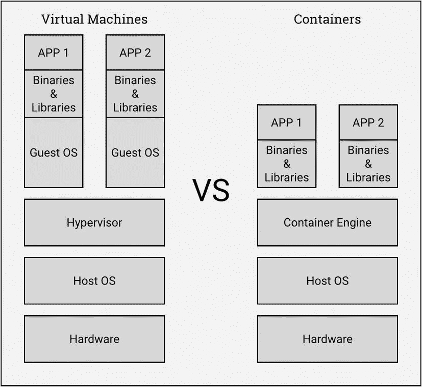
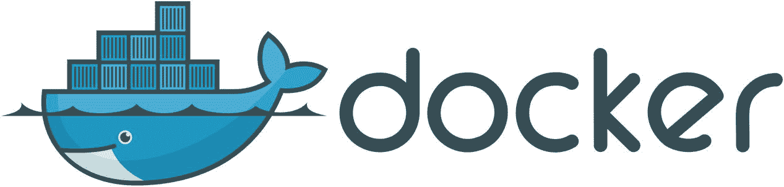
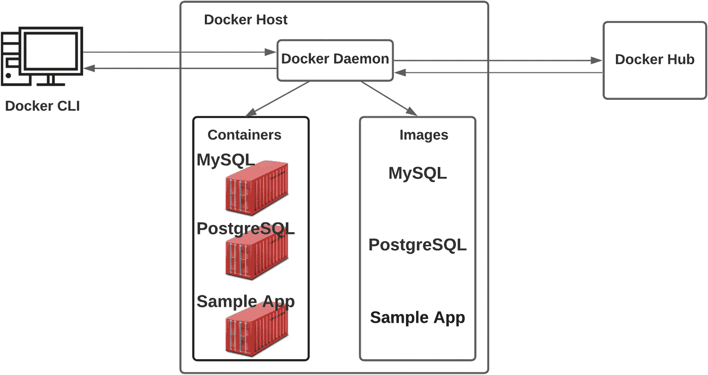
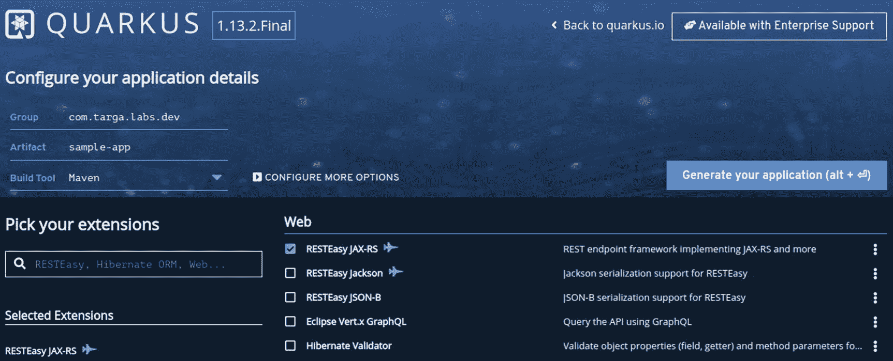
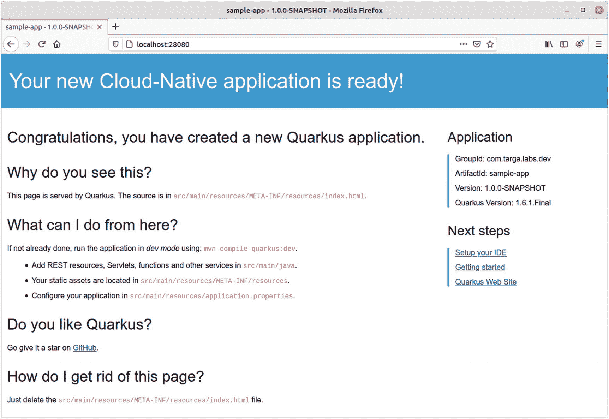
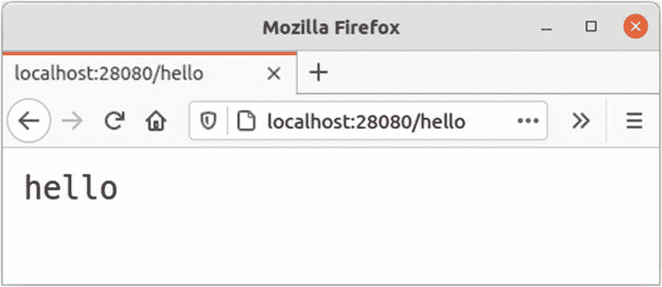
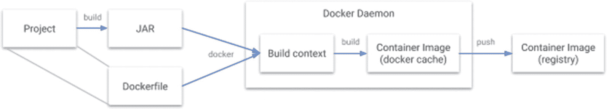
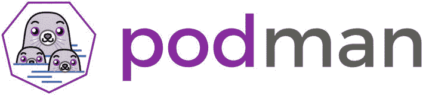

# 一、容器化入门

## 引入容器化

在 Java 世界中，应用在部署到运行时之前被打包成多种格式。这些环境可以是物理机(裸机)或虚拟机。

软件应用的主要风险是运行时更新可能会破坏应用。例如，操作系统更新可能包括其他更新，其库与正在运行的应用不兼容。

通常，软件可以与应用共存于同一主机上，如数据库或代理。它们都共享相同的操作系统和库。因此，即使更新不会直接导致应用崩溃，任何其他服务都可能受到负面影响。

尽管这些升级有风险，但我们不能忽视它们，因为它们关系到安全和稳定。它们包括错误修复和增强。但是我们可以测试我们的应用及其上下文，看看更新是否会导致问题。这项任务可能会令人望而生畏，尤其是当应用非常庞大的时候。

保持冷静！有一个极好的解决方案。我们可以使用*容器*，它是单个操作系统中的一种隔离分区。它们提供了许多与虚拟机相同的优势，如安全性、存储和网络隔离，但它们需要的硬件资源却少得多。容器很棒，因为它们启动和终止更快。

*容器化*允许隔离和跟踪资源利用。这种隔离保护我们的应用免受与主机操作系统更新相关的许多风险。



容器有很多好处:

*   一致的环境:容器是打包应用及其所有依赖项的最佳方式。这为我们在开发和测试阶段准确定义生产环境提供了一个独特的机会。

*   **一次编写，随处运行**:容器可以在任何地方执行:在任何机器、任何操作系统和任何云提供商上。

*   **隔离和抽象**:容器使用操作系统级隔离来抽象资源。

有许多可用的容器解决方案。Docker 是一种流行的开源容器格式。

## 介绍 Docker

Docker 是一个面向开发者的平台，旨在将应用打包、部署和运行为容器。采用容器作为新的应用打包格式被称为*容器化*。



### 文档文件

一个 *Dockerfile* 是一个 Docker 容器的源代码。这是一个描述符文件，其中包含将生成 Docker 映像的指令。

### 图像和容器

一个 *Docker 图像*是一个 Docker 容器的起源。当我们构建 Docker 文件时，我们得到图像，当我们运行 Docker 图像时，我们得到 Docker 容器。

## 安装 Docker

要开始玩 Docker，你需要安装它。您可以从 [`https://docs.docker.com/install/`](https://docs.docker.com/install/) 中抓取与您的平台兼容的版本。

当你访问那个页面时，你会发现两个版本:Docker CE 和 Docker EE:

*   Docker CE 适合开发和基本需求。

*   Docker EE 是一个企业级版本，具有许多使用高度扩展的生产级 Docker 集群所需的额外功能。

安装 Docker 非常容易，你不需要教程来做。

对于 Windows 用户，确保 Docker Desktop for Windows 使用Linux 容器。

要检查 Docker 是否安装正确，您可以通过运行 Docker `version`命令来检查安装的版本:

```java
Client: Docker Engine - Community                   ②
 Cloud integration: 1.0.7
 Version:           20.10.2
 API version:       1.41
 Go version:        go1.13.15
 Git commit:        2291f61
 Built:             Mon Dec 28 16:12:42 2020
 OS/Arch:           darwin/amd64
 Context:           default
 Experimental:      true

Server: Docker Engine - Community                   ①
 Engine:
  Version:          20.10.2
  API version:      1.41 (minimum version 1.12)
  Go version:       go1.13.15
  Git commit:       8891c58
  Built:            Mon Dec 28 16:15:28 2020
  OS/Arch:          linux/amd64
  Experimental:     false
 containerd:
  Version:          1.4.3
  GitCommit:        269548fa27e0089a8b8278fc4fc781d7f65a939b
 runc:
  Version:          1.0.0-rc92
  GitCommit:        ff819c7e9184c13b7c2607fe6c30ae19403a7aff
 docker-init:
  Version:          0.19.0
  GitCommit:        de40ad0

```

## 运行您的第一个容器

与所有编程语言一样，我们将从创建一个 Hello World 示例开始。在 Docker 世界中，我们有`hello-world`图像，它可以作为一个起点:

```java
$ docker run hello-world

Unable to find image "hello-world:latest" locally
latest: Pulling from library/hello-world
0e03bdcc26d7: Pull complete
Digest: sha256:31b9c7d48790f0d8c50ab433d9c3b7e17666d6993084c002c2ff1ca09b96391d
Status: Downloaded newer image for hello-world:latest

Hello from Docker!
This message shows that your installation appears to be working correctly.
...

```

当运行这个 Docker 映像时，我们得到典型的`Hello from Docker!`消息。这张图片的源代码可以在[Docker Library GitHub repository](https://github.com/docker-library/hello-world)中找到。

这张图片来自 Docker Hub，因为在本地找不到。

WHAT IS DOCKER HUB?

*Docker Hub* 是一款公共 Docker 产品，为 Docker 用户提供多种服务:

*   将 Docker 图像存储在公共和私有存储库中。

*   当源代码更新时，创建连续的集成管道来构建映像。

*   处理用户和组的授权和访问管理。

*   包括 GitHub 和 BitBucket 集成，用于自动构建。

要列出现有的本地 Docker 映像，请使用以下命令:

```java
$ docker images

REPOSITORY         TAG        IMAGE ID           CREATED             SIZE
hello-world        latest     bf756fb1ae65       13 months ago       13.3kB

```

 `Image ID`是一个随机生成的*十六进制*值，用于标识每幅图像。

要列出所有 Docker 容器，请使用以下命令:

```java
$ docker ps -a

CONTAINER ID   IMAGE         COMMAND    CREATED          STATUS                     PORTS  NAMES
42feaf1ce560   hello-world   "/hello"   37 minutes ago   Exited (0) 37 minutes ago          vigilant

```

这里解释了一些细节:

*   `Container ID`是一个随机生成的十六进制值，用于标识容器。

*   您在这里看到的`Container Name`是 Docker 守护进程为您创建的一个随机生成的字符串名称，因为您没有指定它。

## 了解 Docker 架构

这一切都太棒了！但是 Docker 是如何工作的呢？

Docker 使用客户端-服务器架构:

*   在*服务器端*，Docker 公开了一个 REST API，它将接收来自客户端调用者的命令。然后，REST API 会将请求转发给一个名为 *Docker 守护进程* ( `dockerd`)的核心组件，它将执行操作并将响应发送回 REST API。然后 API 将它们发送回调用者。

*   在*客户端*上，我们使用 Docker CLI 来键入 Docker 命令。



### Docker 对象

我们已经简要讨论了 Docker 图像和容器。在本节中，我们将更详细地讨论这些和许多其他 Docker 对象。

#### 形象

如前所述，Docker 映像是 Docker 容器的起源。当我们构建 Docker 文件时，我们得到图像，当我们运行 Docker 图像时，我们得到 Docker 容器。

每个 Docker 图像都基于一个特定的图像。例如，我们可以使用`openjdk`作为基于 Java 的 Docker 图像的基础图像。否则，它可以基于 Ubuntu 映像，然后在映像指令中安装 Java 运行时。

使用 *Dockerfile* 构建图像，Dockerfile 是一个简单的文本文件，包含组成图像的指令。Docker 文件中的每条指令都会在 Docker 映像中创建一个单独的层。因此，当我们更改 docker 文件中的指令并重建映像时，只构建新指令的层。通过这种方式，我们可以获得可以快速更新的轻量级映像，这是其他虚拟化技术所不具备的。

#### 容器

当我们运行一个图像时，我们得到一个容器。容器结构和行为由图像内容定义。

Docker 容器通过 Docker CLI 进行管理。我们可以有多种容器设计。例如，我们可以将存储插入容器，甚至将其连接到网络。

当一个容器被删除时，如果它没有保存到存储器中，它的状态将会丢失。

### 码头机器

Docker Machine 是一种工具，可以轻松地远程供应和管理多台 Docker 主机。这个工具使用`docker-machine`命令管理主机:我们可以启动、检查、停止和重启一个被管理的主机，并升级 Docker 安装。我们甚至可以用它来配置 Docker 客户机与给定的主机对话。然后，我们可以直接在该远程主机上使用本地 CLI。

比如说我们在 Azure 上有一个 Docker 机器叫做`azure-env`。如果我们做了`docker-machine env azure-env`，我们将本地的`docker`命令指向那个`azure-env` Docker 引擎。

## 潜入码头容器

了解 Docker 的最好方法是用 Docker 的方式编写一个应用。

### 开发环境中的 Docker 容器

在许多项目中，开发环境不同于生产环境。这可能会导致在为生产部署应用时出现问题。有时，环境之间的微小差异会造成巨大的问题。这就是 Docker 可以提供帮助的地方:您可以在两种环境中使用相同的映像。开发人员和测试人员可以使用与生产环境相同的映像。

除了打包应用代码库，Docker 映像还会打包所有需要的依赖项。这可以保证环境之间的完美匹配。

### 用 Dockerfile 定义一个容器

如前所述，Dockerfile 定义了容器并决定了它将如何被执行。考虑清单 1-1 中的例子。

```java
# Use an OpenJDK Runtime as a parent image
FROM openjdk:11-jre-alpine

# Add Maintainer Info
LABEL maintainer="lnibrass@gmail.com"

# Define environment variables
ENV JAVA_OPTS="-Xmx2048m"

# Set the working directory to /app
WORKDIR /app

# Copy the artifact into the container at /app
ADD some-application-built-somewhere.jar app.jar

# Make port 8080 available to the world outside this container
EXPOSE 8080

# Run app.jar when the container launches
CMD ["java", "-Djava.security.egd=file:/dev/./urandom", "-jar", "/app/app.jar"]

Listing 1-1Example of a Dockerfile

```

该 Dockerfile 文件将:

*   基于 OpenJDK 11 创建一个容器

*   将 JVM 的最大内存分配池的环境变量定义为 2GB

*   将工作目录定义为`/app`

*   将本地路径中的`some-application-built-somewhere.jar`文件复制为`app.jar`

*   打开端口 8080

*   定义容器启动时将执行的`startup`命令

#### 创建一个示例应用

我们将使用 [`code.quarkus.io`](https://code.quarkus.io) 创建`sample-app`:hello world quar kus 应用。我们只需要定义一下`GroupId`和`ArtifactId`。对于扩展，让我们选择`RESTEasy JAX-RS`:



生成的应用附带了一个示例 Rest API:

```java
@Path("/hello-resteasy")
public class GreetingResource {

    @GET
    @Produces(MediaType.TEXT_PLAIN)
    public String hello() {
        return "Hello RESTEasy";
    }
}

```

当我们使用`mvn clean install`编译这个应用时，我们的 JAR 将在`target`文件夹中可用。

在`target`文件夹中运行该命令将只显示当前文件夹中的文件:

```java
$ ls -p target/ | grep -v /

quarkus-artifact.properties
sample-app-1.0.0-SNAPSHOT.jar

```

Quarkus 没有在生成新项目时编写自己的 Dockerfile，而是在`src/main/docker`文件夹中提供了一组 docker file:

```java
$ ls -p src/main/docker | grep -v /

Dockerfile.jvm                  ①
Dockerfile.legacy-jar           ②
Dockerfile.native               ③
Dockerfile.native-distroless    ④

```

这些 docker 文件用于构建运行 Quarkus 应用的容器:

*   ①在 JVM 模式下，使用`fast-jar`打包格式，旨在提供更快的启动时间。

*   ②在 JVM 模式下使用`legacy-jar`打包。

*   ③在本机模式下(无 JVM)。在接下来的章节中，我们将会谈到很多关于本地模式的内容。

*   ④在一个不含酒精的容器中。它包含应用及其运行时依赖项，没有任何额外的组件，如包管理器、shells 或任何标准 Linux 发行版中通常提供的任何其他程序。

让我们构建基于 JVM 模式的 Docker 容器，并将其标记为`nebrass/sample-jvm:1.0.0-SNAPSHOT`:

*   ①由于 Docker 在本地没有找到`ubi8/ubi-minimal`图像，它从`registry.access.redhat.com/ubi8/ubi-minimal:8.3`下载。

*   ②docker 文件中的每个指令都是在一个专用步骤中构建的，它在映像中生成一个单独的层。十六进制代码显示在每个步骤的末尾，是层的 ID。

*   ③构建的图像 ID。

*   ④我们构建的图像用`nebrass/sample-jvm:latest`标记；我们指定了名称(`nebrass/sample-jvm:latest`)，Docker 自动添加了最新的版本标签。

```java
> mvn package && docker build -f src/main/docker/Dockerfile.jvm -t nebrass/sample-jvm:1.0.0-SNAPSHOT .

Sending build context to Docker daemon  51.09MB
Step 1/11 : FROM registry.access.redhat.com/ubi8/ubi-minimal:8.3       ①
8.3: Pulling from ubi8/ubi-minimal                                     ①
77a02d8cede1: Pull complete                                            ①
7777f1ac6191: Pull complete                                            ①
Digest: sha256:e72e188c6b20281e241fb3cf6f8fc974dec4cc6ed0c9d8f2d5460c30c35893b3                                                               ①
Status: Downloaded newer image for registry.access.redhat.com/ubi8/ubi-minimal:8.3                                                        ①
 ---> 91d23a64fdf2                                                     ②
Step 2/11 : ARG JAVA_PACKAGE=java-11-openjdk-headless
 ---> Running in 6f73b83ed808
Removing intermediate container 6f73b83ed808
 ---> 35ba9340154b                                                      ②
Step 3/11 : ARG RUN_JAVA_VERSION=1.3.8
 ---> Running in 695d7dcf4639
Removing intermediate container 695d7dcf4639
 ---> 04e28e22951e                                                      ②
Step 4/11 : ENV LANG="en_US.UTF-8" LANGUAGE="en_US:en"
 ---> Running in 71dc02dbee31
Removing intermediate container 71dc02dbee31
 ---> 7c7c69eead06                                                      ②
Step 5/11 : RUN microdnf install curl ca-certificates ${JAVA_PACKAGE} \
    && microdnf update \
    && microdnf clean all \
    && mkdir /deployments \
    && chown 1001 /deployments \
    && chmod "g+rwX" /deployments \
    && chown 1001:root /deployments \
    && curl https://repo1.maven.org/maven2/io/fabric8/run-java-sh/${RUN_JAVA_VERSION}/run-java-sh-${RUN_JAVA_VERSION}-sh.sh -o /deployments/run-java.sh \
    && chown 1001 /deployments/run-java.sh \
    && chmod 540 /deployments/run-java.sh \
    && echo "securerandom.source=file:/dev/urandom" >> /etc/alternatives/jre/lib/security/java.security
 ---> Running in 2274fdc94d6f
Removing intermediate container 2274fdc94d6f
 ---> 9fd48c2d9482                                                     ②
Step 6/11 : ENV JAVA_OPTIONS="-Dquarkus.http.host=0.0.0.0 -Djava.util.logging.manager=org.jboss.logmanager.LogManager"
 ---> Running in c0e3ddc80993
Removing intermediate container c0e3ddc80993
 ---> 26f287fde6f6                                                     ②
Step 7/11 : COPY target/lib/* /deployments/lib/
 ---> 1c3aa9a683a6                                                     ②
Step 8/11 : COPY target/*-runner.jar /deployments/app.jar
 ---> d1bdd5e96e5e                                                      ②
Step 9/11 : EXPOSE 8080
 ---> Running in 728f82b270d2
Removing intermediate container 728f82b270d2
 ---> 704cd49fd439                                                      ②
Step 10/11 : USER 1001
 ---> Running in 5f7aef93c3d7
Removing intermediate container 5f7aef93c3d7
 ---> 5a773add2a6d                                                      ②
Step 11/11 : ENTRYPOINT [ "/deployments/run-java.sh" ]
 ---> Running in cb6d917592bc
Removing intermediate container cb6d917592bc
 ---> 9bc81f158728                                                      ②
Successfully built 9bc81f158728                                         ③
Successfully tagged nebrass/sample-jvm:latest                           ④

```

WHAT IS THE UBI BASE IMAGE?

提供的 docker 文件使用 UBI ( *通用基础映像*)作为父映像。这个基本图像已经被裁剪为在容器中完美地工作。docker 文件使用基本映像的最小版本来减小生成的映像的大小。

你刚刚建立的形象在哪里？它位于您机器的本地 Docker 映像注册表中:

```java
$ docker images

REPOSITORY           TAG              IMAGE ID       CREATED          SIZE
nebrass/sample-jvm   1.0.0-SNAPSHOT   9bc81f158728   5 minutes ago    501MB
ubi8/ubi-minimal     8.3              ccfb0c83b2fe   4 weeks ago      107MB

```

在本地，有两个映像— `ubi8/ubi-minimal`是基础映像，`nebrass/sample-jvm`是构建映像。

##### 运行应用

现在运行构建好的容器，使用`-p`将机器的端口 28080 映射到容器发布的端口 8080:

```java
$ docker run --rm -p 28080:8080 nebrass/sample-jvm:1.0.0-SNAPSHOT

```

*   第 1 行显示了在容器中启动 Java 应用的命令。

*   第 2-8 行列出了 Quarkus 应用的日志。在那里你会看到一条提到`Listening on:` [`http://0.0.0.0:8080`](http://0.0.0.0:8080) 的消息。这个日志是由打包在容器中的实例打印出来的，我们的调整并没有意识到这一点:我们将容器端口 8080 映射到我们的自定义端口 28080，这显然使 URL 变成了`http://localhost:28080`。

```java
1 exec java -Dquarkus.http.host=0.0.0.0 -Djava.util.logging.manager=org.jboss.logmanager.LogManager -XX:+ExitOnOutOfMemoryError -cp . -jar /deployments/app.jar
2 __  ____  __  _____   ___  __ ____  ______
3  --/ __ \/ / / / _ | / _ \/ //_/ / / / __/
4  -/ /_/ / /_/ / __ |/ , _/ ,< / /_/ /\ \
5 --\___\_\____/_/ |_/_/|_/_/|_|\____/___/
6 2020-08-05 13:53:44,198 INFO  [io.quarkus] (main) sample-app 1.0.0-SNAPSHOT on JVM (powered by Quarkus 1.6.1.Final) started in 0.588s. Listening on: http://0.0.0.0:8080
7 2020-08-05 13:53:44,218 INFO  [io.quarkus] (main) Profile prod activated.
8 2020-08-05 13:53:44,219 INFO  [io.quarkus] (main) Installed features: [cdi, resteasy]

```

如果您在 web 浏览器中打开 URL `http://localhost:28080`，您将进入默认的 Quarkus `index.html`文件，如下图所示:



如果您在 web 浏览器中转到`http://localhost:28080/hello`，您将看到`ExampleResource` REST API 的响应。



如果您在 Windows 7 上使用 Docker Toolbox，并且无法使用 localhost 访问容器，则需要使用 Docker 机器 IP。使用命令`docker-machine ip`找到它。

您还可以在终端中使用`curl`命令来调用 REST API:

```java
$ curl http://localhost:28080/hello

hello%

```

WHAT IS cURL?

`cURL`(客户端 URL 工具)是一个命令行工具，用于使用 HTTP、FTP 等各种协议进行客户端-服务器请求。

端口映射 28080:8080 是用`-p`参数运行`docker run`时定义的`EXPOSED/PUBLISHED`对。

要退出容器连接的控制台会话，只需按 Ctrl+C。

要以*分离模式*(在后台)运行 Docker 容器，只需将`-d`添加到`run`命令中:

```java
$ docker run -d -p 28080:8080 nebrass/sample-jvm:1.0.0-SNAPSHOT

fbf2fba8e9b14a43e3b25aea1cb94b751bbbb6b73af05b84aab3f686ba5019c8

```

在这里，我们获得应用的长容器 ID，然后被踢回终端。容器在后台运行。

我们还可以看到有一个缩写的容器标识符，带有`docker ps`。运行任何命令时，我们都可以使用长格式或短格式:

```java
$ docker ps

CONTAINER ID  IMAGE                 COMMAND                   STATUS  PORTS
fbf2fba8e9b1  nebrass/sample-jvm..  "/deployments/run-ja..."  Up      28080->8080/tcp

```

我们可以看到，我们有一个正在运行的容器，其中有我们的自定义端口映射。我们将使用它的`CONTAINER ID`来管理它。例如，要停止该容器，我们将运行:

```java
docker stop fbf2fba8e9b1

```

运行命令后，为了确认操作，Docker 将再次打印容器 ID。

##### 发布您的图像

局部图像一点用都没有。图像需要存储在一个集中的位置，以便从不同的环境中提取。

Docker 图像存储在一个名为 *Docker 注册表*的集中位置。Docker Hub 的主要职责是注册。每个图像集合都作为存储库托管在注册表中。

默认情况下，Docker CLI 位于 Docker Hub 上。

#### 使用您的 Docker ID 登录

在本节中，我们将使用 Docker Hub 的免费层。如果您没有免费账户，可以在 [`https://hub.docker.com/`](https://hub.docker.com/) 创建一个。

要向 Docker Hub 验证您的 Docker 客户机，只需输入以下命令:

```java
docker login -u <username> -p <password>

```

回想一下，Docker Hub 默认是 Docker 注册中心。如果您想改变这一点，只需使用`docker login`命令指定一个注册表 URL。

#### 给图像加标签

存储在注册表中的图像具有类似于`username/repository:tag`的名称格式。`tag`包含版本信息，这是可选的，但是强烈推荐。如果不显式指定标签，Docker 会将标签定义为`latest`，它不能提供任何关于打包的应用版本的信息。

用于定义图像标签的 Docker 命令如下:

```java
docker tag image username/repository:tag

```

例如，如果您想将一个`SNAPSHOT`版本升级到`Final`，您可以这样做:

```java
docker tag nebrass/sample-jvm:1.0.0-SNAPSHOT nebrass/sample-jvm:1.0.0-Final

```

运行`docker images`命令查看您新标记的图像:

```java
$ docker images

REPOSITORY          TAG             IMAGE ID       CREATED          SIZE
nebrass/sample-jvm  1.0.0-Final     598712377440   43 minutes ago   501MB
nebrass/sample-jvm  1.0.0-SNAPSHOT  598712377440   43 minutes ago   501MB
ubi8/ubi-minimal    8.1             91d23a64fdf2   4 weeks ago      107MB

```

#### 发布图像

发布一个图像就是让它在某个容器的注册表中可用。在我们的例子中，我们将标记的图像推送到注册表:

```java
docker push username/repository:tag

```

标记的图像现在在 Docker Hub 上可用。如果你去 [`https://hub.docker.com/r/username/repository`](https://hub.docker.com/r/username/repository) ，你会发现那里的新形象。

在推送图像之前，您需要使用`docker login`命令进行身份验证。

让我们推送`nebrass/sample-jvm:1.0.0-Final`标签图像:

```java
docker push nebrass/sample-jvm:1.0.0-Final

The push refers to repository [docker.io/nebrass/sample-jvm]
0f8895a56cf0: Pushed
9c443a7a1622: Pushed
fb6a9f86c4e7: Pushed
eddba477a8ae: Pushed
f80c95f61fff: Pushed
1.0.0-Final: digest: sha256:30342f5f4a432a2818040438a24525c8ef9d046f29e3283ed2e84fdbdbe3af55 size: 1371

```

#### 从 Docker Hub 获取并运行映像

打包在`nebrass/sample-jvm` Docker 映像中的应用现在可以在任何 Docker 主机上执行。当您运行`docker run nebrass/sample-jvm`时，如果映像在本地不可用，它将从 Docker Hub 中取出。让我们删除所有与`nebrass/sample-jvm`相关的本地容器:

```java
docker ps -a | awk '{ print $1,$2 }' | grep nebrass/sample-jvm | awk '{print $1 }' | xargs -I {} docker rm {}

```

让我们删除所有与`nebrass/sample-jvm`相关的本地图像:

```java
docker images | awk '{ print $1":"$2 }' | grep nebrass/sample-jvm | xargs -I {} docker rmi {}

```

如果映像在本地不可用，将从 Docker Hub 中提取:

```java
$ docker run -p 28080:8080 nebrass/sample-jvm:1.0.0-Final

Unable to find image 'nebrass/sample-jvm:1.0.0-Final' locally
1.0.0-Final: Pulling from nebrass/sample-jvm
b26afdf22be4: Already exists
218f593046ab: Already exists
284bc7c3a139: Pull complete
775c3b820c36: Pull complete
4d033ca6332d: Pull complete
Digest: sha256:30342f5f4a432a2818040438a24525c8ef9d046f29e3283ed2e84fdbdbe3af55
Status: Downloaded newer image for nebrass/sample-jvm:1.0.0-Final
...

```

打包在`nebrass/sample-jvm:1.0.0-Final`映像中的应用及其所有依赖项现在都可以在您的机器中使用了。不需要安装 Java 运行时或进行任何配置。一切准备就绪！

### 玩谷歌 Jib

Google 创建了 Jib Maven 插件来为 Java 应用构建 Docker 映像。使用 Jib，您不需要为您的应用创建 docker 文件。你甚至不需要在本地机器上安装 Docker。Jib 将自动分析、构建、制作和推送 Docker 映像。

Docker 工作流程如下所示:



Jib 工作流程如下所示:


Jib 不仅适用于 Maven，也适用于 Gradle。它有多种配置和调整的可能性，可以帮助您覆盖任何默认配置或满足特定需求，例如将构建的映像推送到私有 Docker 注册表中。

要使用带有私有注册表的 Google Jib 插件，你需要给 Jib 提供一个凭证助手，比如在[的官方 Jib 文档](https://goo.gl/gDs66G)中描述的 [`https://goo.gl/gDs66G`](https://goo.gl/gDs66G) 。

在 Quarkus 生态系统中，我们有一个随时可以使用的 Jib 扩展，称为`quarkus-container-image-jib`。这个扩展由 Jib 提供支持，用于执行容器映像构建。使用 Jib 和 Quarkus 的主要好处是所有的依赖项(在`target/lib`下找到的所有东西)都缓存在与实际应用不同的层中，因此使得重建非常快速和小(当涉及到推送时)。使用该扩展的另一个重要好处是，它提供了创建容器映像的能力，而不需要任何专用的客户端工具(如 Docker)或运行守护进程(如 Docker 守护进程)，而所需要的只是推送容器映像注册中心的能力。

若要使用此功能，请将以下扩展添加到项目中:

```java
./mvnw quarkus:add-extension -Dextensions="container-image-jib"

```

当您需要做的只是构建一个容器映像，而不是推送到注册表时(基本上是通过设置`quarkus.container-image.build=true`并保留`quarkus.container-image.push`未设置；默认为`false`，这个扩展创建一个容器映像，并向 Docker 守护进程注册它。这意味着，尽管 Docker 不用于构建图像，但它仍然是必要的。

还要注意的是，当使用该模式时，构建的容器图像将在执行`docker images`时出现。

#### 使用 Google Jib 构建

使用以下命令构建容器映像，而不将其推送到容器映像注册表:

```java
mvn clean package -Dquarkus.container-image.build=true

```

如果您想要构建一个映像并将其推送到经过身份验证的容器映像注册中心，请使用以下命令:

```java
mvn clean package -Dquarkus.container-image.build=true -Dquarkus.container-image.push=true

```

有许多配置选项可用于自定义映像或执行特定操作:

<colgroup><col class="tcol1 align-left"> <col class="tcol2 align-left"></colgroup> 
| 

**配置属性**

 | 

**目的**

 |
| --- | --- |
| `quarkus.container-image.group` | 容器图像所属的组。如果未设置，则默认为登录用户。 |
| `quarkus.container-image.name` | 容器图像的名称。如果未设置，则默认为应用名称。 |
| `quarkus.container-image.tag` | 容器图像的标签。如果未设置，则默认为应用版本。 |
| `quarkus.container-image.registry` | 要使用的容器注册表。如果未设置，则默认为经过身份验证的注册表。 |
| `quarkus.container-image.username` | 用于向将推送构建映像的注册表进行身份验证的用户名。 |
| `quarkus.container-image.password` | 用于向推送构建映像的注册表进行身份验证的密码。 |

你可以使用" [Quarkus 容器图片指南](https://quarkus.io/guides/container-image)来深入了解大吊臂延伸部

## 满足码头服务

在企业世界中，应用由许多*服务*组成。例如，一个企业管理应用有许多服务:库存管理服务、员工管理服务等等。在码头化的环境中，这些服务是作为容器运送的。这种选择提供了许多优势，比如伸缩性。

Docker 有一个很棒的工具，叫做 Docker Compose，用于定义具有高级网络和存储选项等强大功能的容器。Docker Compose 对于本地开发非常有用。

### 创建第一个 docker-compose.yml 文件

Docker Compose 的输入是一个`docker-compose.yml`文件，这是一个普通的 YAML 文件，描述了 Docker 容器的设计，以及许多选项，如分配的资源、网络、存储等。参见清单 1-2 。

```java
version: "3"
services:
  web:
    image: nebrass/sample-jvm:1.0.0-Final
    deploy:
      replicas: 5
      restart_policy:
        condition: on-failure
    ports:
      - "8080:8080"
    networks:
      - webnetwork
networks:
  webnetwork:

Listing 1-2Example of a docker-compose.yml File

```

这个`docker-compose.yml`文件将从 Docker Hub 下载`nebrass/sample-jvm:1.0.0-Final`映像，并从这个映像创建五个实例。它会将端口 8080 映射到 8080。如果失败，这些容器将重新启动。这些容器将在`webnetwork`网络中提供。

## 用 Docker 实现更多

Docker 在许多方面优化了开发人员的体验，提高了工作效率。例如，您可以使用 Docker 容器来:

*   非常快速地获得所需的软件和工具。例如，您可以使用 Docker 来获取本地数据库或 SonarQube 实例。

*   构建、调试和运行源代码，即使您没有合适的环境。例如，如果您没有在本地安装 JDK，或者即使您没有与项目相同的所需版本，您也可以在容器中运行和测试它。

*   解决一些技术需求。例如，如果您有一个只能在您的机器上已经使用的特定端口上执行的应用，您可以使用容器端口映射特性来使用通过不同的公开端口容器化的相同应用。

*   还有更多！

### 快速获得所需的工具

您可以在几秒钟内获得一个数据库实例，而不需要任何安装，也不需要接触本地环境，甚至不需要修改本地文件。你不必担心一个 MySQL 守护进程会一直使用端口 3306，甚至在卸载之后。

#### 获取一个 Dockerized PostgreSQL 实例

例如，要拥有本地 PostgreSQL 实例，请运行以下命令:

*   ①在分离模式下运行名为`demo-postgres`的容器(作为后台守护进程)。

*   ②您定义环境变量:
    *   Postgres 用户:`developer`

    *   Postgres 密码:`someCrazyPassword`

    *   Postgres 数据库:`demo`

*   ③你转发端口`5432` → `5432`，使用官方 PostgreSQL 镜像 v13。

```java
docker run -d --name demo-postgres \                ①
        -e POSTGRES_USER=developer \                ②
        -e POSTGRES_PASSWORD=someCrazyPassword \    ②
        -e POSTGRES_DB=demo \                       ②
        -p 5432:5432 postgres:13                    ③

```

您可以在 Java 应用中使用这些凭证，就像任何其他独立的 PostgreSQL 一样。

不幸的是，数据将被专门存储在容器内部。如果它崩溃或被删除，所有的数据都将丢失。

如果希望持久化容器内部的可用数据，需要将本地挂载点作为 Docker 数据卷映射到容器内部的路径。

我在我的主目录中创建一个`volumes`文件夹(您可以给这个文件夹起任何您喜欢的名字),然后为我需要创建数据卷挂载点的每个应用创建子文件夹。

让我们首先创建一个文件夹，用于在主机中存储数据:

```java
mkdir -p $HOME/docker-volumes/postgres

```

这个`$HOME/docker-volumes/postgres`文件夹将被映射到 PostgreSQL 容器的`/var/lib/postgresql/data`文件夹，PostgreSQL 在这里存储物理数据文件。

运行持久 PostgreSQL 容器的 Docker 命令现在将是:

```java
docker run -d --name demo-postgres \
        -e POSTGRES_USER=developer \
        -e POSTGRES_PASSWORD=someCrazyPassword \
        -e POSTGRES_DB=demo \
        -p 5432:5432 \
        -v $HOME/docker/volumes/postgres:/var/lib/postgresql/data \
        postgres:13

```

让我们继续讨论我在讨论 Docker 好处时喜欢谈论的另一个用例:拥有一个本地 SonarQube 服务器。

#### 获取一个 Dockerized SonarQube 实例

只需使用一个 Docker 命令，就可以轻松拥有 SonarQube 实例:

```java
docker run -d --name sonarqube \
        -p 9000:9000 \
        -p 9092:9092 \
        sonarqube:8.4.1-community

```

该命令将基于 Docker 映像`sonarqube:8.4.1-community`运行一个容器，并公开两个 SonarQube 端口 9000 和 9092。

如果您习惯于 SonarQube，您可以拥有您的本地实例，并且您可以导入您的团队正在使用的所有质量概要文件(又名 *gates* )。

### 释放需求链

在搜索用例时，我们不会在这里走得太远。我们可以把 Quarkus 需求作为一个用例:先决条件之一是拥有 GraalVM。如果您没有在本地安装它，您可以使用一个 GraalVM Docker 映像来获得一个容器，该容器允许您进行基于 GraalVM 的构建。

让我们回到之前生成的`sample-app`。如果我们想构建一个基于 GraalVM 的 JAR 文件，而不在本地安装 GraalVM，我们可以使用 Dockerfile 的这个例子，我们将它保存为`src/main/docker/Dockerfile.multistage`。参见清单 1-3 。

```java
 1 ## Stage 1 : build with maven builder image with native capabilities
 2 FROM quay.io/quarkus/centos-quarkus-maven:20.1.0-java11 AS build
 3 COPY pom.xml /usr/src/app/
 4 RUN mvn -f /usr/src/app/pom.xml -B de.qaware.maven:go-offline-maven-plugin:1.2.5:resolve-dependencies
 5 COPY src /usr/src/app/src
 6 USER root
 7 RUN chown -R quarkus /usr/src/app
 8 USER quarkus
 9 RUN mvn -f /usr/src/app/pom.xml -Pnative clean package
10
11 ## Stage 2 : create the docker final image
12 FROM registry.access.redhat.com/ubi8/ubi-minimal
13 WORKDIR /work/
14 COPY --from=build /usr/src/app/target/*-runner /work/application
15
16 # set up permissions for user `1001`
17 RUN chmod 775 /work /work/application \
18   && chown -R 1001 /work \
19   && chmod -R "g+rwX" /work \
20   && chown -R 1001:root /work
21
22 EXPOSE 8080
23 USER 1001
24
25 CMD ["./application", "-Dquarkus.http.host=0.0.0.0"]

Listing 1-3src/main/docker/Dockerfile.multistage

```

这个 Dockerfile 文件包含两个嵌入的 Dockerfile 文件。注意已经有两个`FROM`指令。这个 docker 文件的每个部分被称为一个*阶段*，这就是为什么我们给 docker 文件加上了扩展名`multistage`。

在第一阶段，我们使用 Maven 生成本地 Quarkus 可执行文件，在第二阶段，我们使用构建的 JAR 文件创建 Docker 运行时映像。我们使用安装的 Maven 和 Docker 运行时来完成这项工作。

传统上，我们有两个 docker 文件。第一个专用于开发，第二个专用于生产。开发 Dockerfile 带来了 JDK 和构建工具，而第二个 docker file 只包含应用二进制文件和运行时。这种方法提高了生产率，但提高的幅度不大。我们仍然需要管理两个 Dockerfiles，如果我们有很多应用，这将是很痛苦的。

接下来是多阶段构建。我们只有一个 Dockerfile，它有一个特殊的名字:`Dockerfile.multistage`。在里面，我们将有两个(或更多个)`FROM`指令来定义每个阶段的基础图像。对于开发和生产环境，我们可以有不同的基础映像。我们可以在阶段之间进行互动。例如，我们可以将在开发阶段构建的文件转移到生产阶段。

我们构建多阶段 docker 文件的方式与构建常规(单阶段)docker 文件的方式相同:

```java
docker build -f Dockerfile.multistage -t nebrass/sample-app-multistaged.

```

如果您运行它，它与我们在前面的步骤中构建的 Docker 映像相同，但是更小:

```java
$ docker images | grep nebrass

REPOSITORY                   TAG     IMAGE ID      CREATED         SIZE
nebrass/sample-app-jvm       latest  5e1111eeae2b  13 minutes ago  501MB
nebrass/quarkus-multistaged  latest  50591fb707e7  58 minutes ago  199MB

```

同一个应用打包在两个映像中，为什么它们的大小不同呢？

在多阶段构建时代之前，我们曾经编写将要执行的指令，docker 文件中的每条指令都向映像添加了一层。因此，即使我们有一些清洁说明，他们有一个专门的重量。在某些情况下，就像许多 Red Hat Docker 图像一样，我们过去常常创建脚本，在 Docker 文件中仅用一条指令运行这些脚本。

在多阶段构建变得可用之后，当我们跨不同阶段构建时，除了必需的工件之外，最终的图像不会有任何不必要的内容。

BUILDING THE NATIVE EXECUTABLE WITHOUT GRAALVM

Quarkus 有一个很棒的特性，使开发人员无需安装 GraalVM 就可以构建一个本机可执行文件。您需要像前面的步骤一样安装 Docker，但是不必在 Docker 文件上花费精力。该命令只是一个 Maven 版本:

```java
$ mvn package -Pnative -Dquarkus.native.container-build=true

```

构建使用 Docker。您已经可以注意到正在记录的步骤:

```java
[INFO] --- quarkus-maven-plugin:1.13.2.Final:build (default) @ example ---
...
[INFO] [io.quarkus.deployment.pkg.steps.NativeImageBuildContainerRunner] Using docker to run the native image builder
[INFO] [io.quarkus.deployment.pkg.steps.NativeImageBuildContainerRunner] Checking image status quay.io/quarkus/ubi-quarkus-native-image:21.0-java11
21.0-java11: Pulling from quarkus/ubi-quarkus-native-image
57de4da701b5: Pull complete
...
Status: Downloaded newer image for quay.io/quarkus/ubi-quarkus-native-image:21.0-java11
...
[INFO] [io.quarkus.deployment.pkg.steps.NativeImageBuildStep] Running Quarkus native-image plugin..
[INFO] [io.quarkus.deployment.pkg.steps.NativeImageBuildRunner] docker run --env LANG=C --rm -v ..
[example-1.0.0-SNAPSHOT-runner:26]    classlist:   5 267,45 ms,  0,96 GB
[example-1.0.0-SNAPSHOT-runner:26]        (cap):     446,08 ms,  0,94 GB
[example-1.0.0-SNAPSHOT-runner:26]        setup:   2 105,02 ms,  0,94 GB
...
[example-1.0.0-SNAPSHOT-runner:26]      compile:  30 414,02 ms,  2,10 GB
[example-1.0.0-SNAPSHOT-runner:26]        image:   2 805,44 ms,  2,09 GB
[example-1.0.0-SNAPSHOT-runner:26]        write:   1 604,06 ms,  2,09 GB
[example-1.0.0-SNAPSHOT-runner:26]      [total]:  72 346,32 ms,  2,09 GB
...
[INFO] [io.quarkus.deployment.QuarkusAugmentor] Quarkus augmentation completed in 117871ms

```

## 容器化不仅仅是码头

Docker 并不是市场上唯一可用的容器化解决方案。现在有很多选择。其中许多解决了某些 Docker 限制，如 Podman 和 Buildah。

### Docker 有哪些局限性？

安装 Docker 后，我们有了一个`docker.service`系统，它将保持运行。要检查其状态，只需键入以下命令:

```java
$ sudo service docker status

● docker.service - Docker Application Container Engine
     Loaded: loaded (/lib/systemd/system/docker.service; enabled; vendor preset: enabled)
     Active: active (running) since Thu 2020-08-06 09:23:19 CEST; 8h ago
TriggeredBy: ● docker.socket
       Docs: https://docs.docker.com
   Main PID: 1659 (dockerd)
      Tasks: 30
     Memory: 3.5G
     CGroup: /system.slice/docker.service
             └─1659 /usr/bin/dockerd -H fd:// --containerd=/run/containerd/containerd.sock
...

```

您也可以使用操作系统实用程序，如`sudo systemctl is-active docker`或`sudo status docker`，或者使用 Windows 任务管理器等检查服务状态。

这个永久运行的守护进程是与 Docker 引擎通信的唯一方式。不幸的是，这是一个单点故障。这个守护进程将是所有正在运行的容器进程的父进程。因此，如果这个守护进程被终止或损坏，我们将失去与引擎的通信，并且正在运行的容器进程将保持孤立状态。更有甚者，如果这个过程是对资源的贪婪，我们不能抱怨。

同一个守护进程需要 root 权限才能完成它的工作，当开发人员没有被授予对其工作站的完全 root 权限时，这可能会很烦人。

这些限制为其他工具开始流行创造了机会。接下来我们将讨论两个这样的工具。

### 见见波德曼和 buildhr

Podman 是 Docker 的替代产品，它提供了一种更简单的方法来完成我们通常用 Docker 完成的所有容器化任务，但是不依赖于守护进程。由波德曼处理和制作的图像和容器符合 [*开放容器倡议*](https://www.opencontainers.org/) *。*



Podman 通过`runC`容器运行时进程(不是守护进程)直接与映像注册表、容器和映像存储以及 Linux 内核进行交互。

WHAT IS runC?

[`runC`](https://github.com/opencontainers/runc) `(` [`https://github.com/opencontainers/runc`](https://github.com/opencontainers/runc) )是 Docker 的容器格式和运行时，由 Docker 捐赠给开放容器倡议。

WHAT IS THE OPEN CONTAINERS INITIATIVE?

开放容器倡议(OCI)是由 Linux 基金会主办的一个项目，旨在定义容器的所有标准和规范。它最初于 2015 年由 Docker 等许多容器化领先公司推出。

该项目有两个主要分支。*图像规范*定义了图像的所有标准和要求。*运行时规范*定义了容器运行时的所有标准和要求。

任何寻求符合 OCI 的解决方案都需要符合它的两个分支规范。

有了波德曼，你可以做所有你在 Docker 上做的事情。您可以对 Podman 使用相同的 Docker 命令，只需将单词`docker`改为`podman`。你甚至可以给`podman`起一个`docker`的别名，一切都会变得非常神奇！

没有特权的用户最终可以使用 Podman 运行容器，绝对需要`root`用户。

你可以像使用 Docker 一样使用 Podman 进行构建。Podman 在构建过程中使用了与 Buildah 相同的代码。


使用 *Buildah* ，您可以:

*   从 Dockerfile 文件创建图像。

*   从现有容器创建图像。您甚至可以对容器进行修改，并将它们发布为新图像。

Buildah 是创建和管理容器图像的代码包装器，具有高级图像管理功能。

Buildah 的优势包括:

*   对创建图像层的强大控制。你甚至可以在一个层上提交许多修改，而不是像经典的 Docker 世界那样每层提交一条指令。

*   Buildah CLI 用于编写图像指令，就像创建 Linux 脚本一样。如果您查看 Buildah CLI 帮助，您会发现 CLI 命令在任何 Dockerfile 指令中都有:

```java
  add                    Add content to the container
  commit                 Create an image from a working container
  copy                   Copy content into the container
  from                   Create a working container based on an image
  images                 List images in local storage
  info                   Display Buildah system information
  mount                  Mount a working container's root filesystem
  pull                   Pull an image from the specified location
  push                   Push an image to a specified destination
  rename                 Rename a container
  run                    Run a command inside of the container
  tag                    Add an additional name to a local image
  umount                 Unmount the root file system of the specified working containers
  unshare                Run a command in a modified user namespace

```

波德曼受欢迎有两个主要原因:

*   它使用与 Docker 相同的命令。

*   它使用与 Docker 相同的工具，比如图像注册和容器托管解决方案。

所以每个 Docker 用户都可以转投波德曼。我们可以保留我们和 Docker 做的一切。在有些情况下，你不能使用波德曼作为 Docker 的替代品。例如，在我的例子中，我使用`TestContainers`为我的 JUnit 测试获取数据库的轻量级实例。这个伟大的库非常依赖 Docker 来为测试提供数据库，不幸的是，没有将它迁移到 Podman 的活动任务。 你可以在 [`testcontainers-java#2088`](https://github.com/testcontainers/testcontainers-java/issues/2088) 查看这一期。

## 结论

容器化是进入开发者世界的最强大的技术之一。许多其他的技术都是基于容器诞生的，比如 Podman、Buildah 等等。当然，你不会全部用到它们，但是你可以挑选一些合适的来帮助你完成工作。