# 三、编写单体应用

## 呈现域

注册用户可以从网上商店购买他们在目录中找到的产品。顾客也可以阅读和发表关于他们购买的文章的评论。为了简化支付用例，我们将使用 Stripe 或 PayPal 作为支付网关。

在本书中，我们将不涉及支付事务。

### 用例图

该应用提供以下功能:

*   对于客户:搜索和浏览产品，浏览和撰写评论，创建，查看和更新购物车，更新个人资料，结帐和支付。

*   对于商店经理:添加产品、更新产品和删除产品。

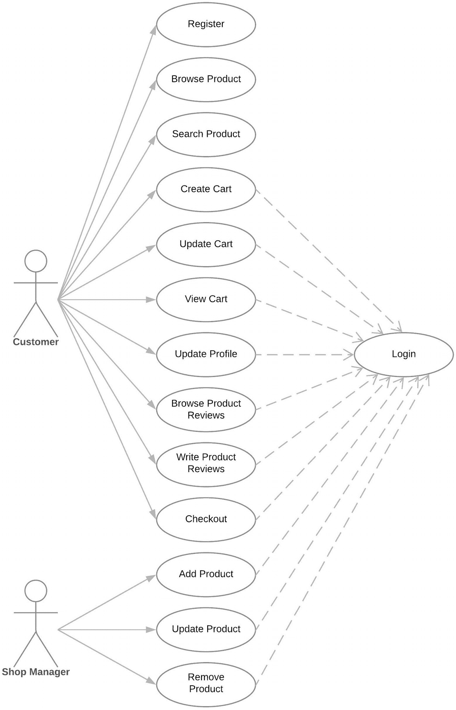

### 类图

类图将如下所示:

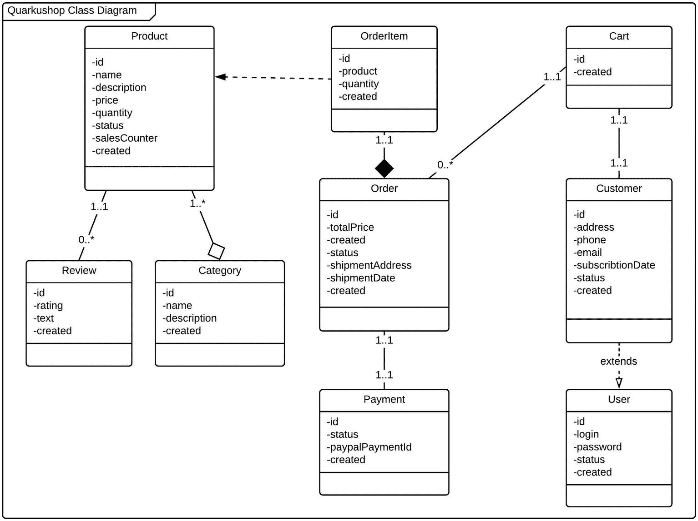

### 程序表

典型购物旅行的序列图如下所示:

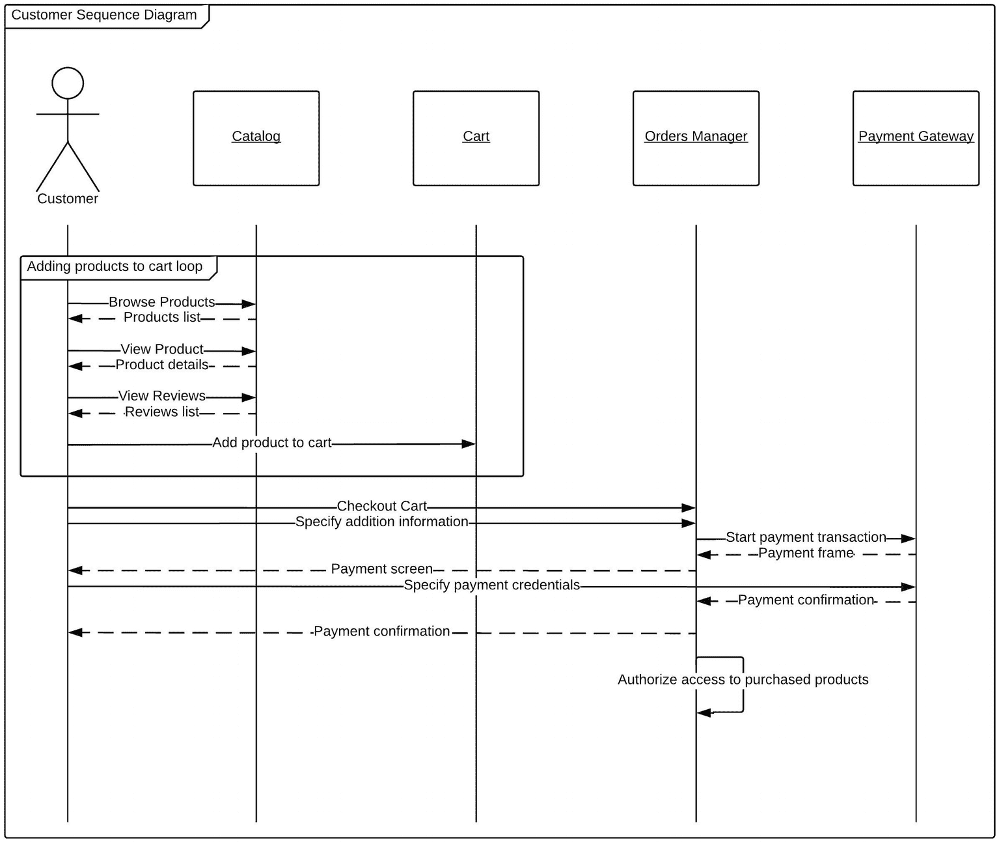

## 编写应用代码

差不多是时候开始编写应用了。在攻击代码之前，让我们看看我们将使用的技术堆栈。

### 展示技术堆栈

在本书中，我们正在实现一个电子商务应用的后端，所以我们的堆栈将是:

*    PostgreSQL 13

*    Java 11 与 GraalVM 21.0.x

*   Maven 3.6.2+版

*   Quarkus 1.13 以上

*   最新版本的 Docker

#### PostgreSQL 数据库

作为一项要求，您需要有一个 PostgreSQL 实例。您可以使用您的 Docker 技能快速创建它，只需输入:

```java
docker run -d --name demo-postgres \          ①
        -e POSTGRES_USER=developer \          ②
        -e POSTGRES_PASSWORD=p4SSW0rd \       ③
        -e POSTGRES_DB=demo \                 ④
        -p 5432:5432 postgres:13              ⑤

```

*   ③转发端口`5432` → `5432`，使用官方 PostgreSQL 镜像 v13。

*   Postgres 用户:`developer`

*   Postgres 密码:`p4SSW0rd`

*   Postgres 数据库:`demo`

*   ①在分离模式下运行名为`demo-postgres`的容器(作为后台守护程序)。

*   ②定义环境变量:

#### Java 11

 Java Standard Edition 11 是一个主要特性版本，于 2018 年 9 月 25 日发布。

你可以在 [`https://openjdk.java.net/projects/jdk/11/`](https://openjdk.java.net/projects/jdk/11/) 查看 Java 11 新特性。

你能看出为什么我们使用 Java 11 而不是 16(写这本书时的最新版本)吗？这是因为 Java 11 是 GraalVM 可用的最高版本。

Quarkus 团队强烈建议使用 Java 11，因为 Quarkus 2.x 不支持 Java 8。

#### 专家

下面是 Maven 的官方介绍，来自其[网站](http://maven.apache.org):

*   Maven 是一个意第绪语单词，意思是知识的积累者，最初是为了简化Jakarta涡轮机项目的建造过程。有几个项目，每个项目都有自己的 Ant 构建文件，这些文件略有不同，jar 被签入 CVS。我们需要一个标准的方法来构建项目，一个清晰的项目组成定义，一个发布项目信息的简单方法，以及一个在几个项目间共享 jar 的方法。

*   结果是一个工具，现在可以用于构建和管理任何基于 Java 的项目。我们希望我们已经创造了一些东西，使 Java 开发人员的日常工作变得更容易，并且通常有助于理解任何基于 Java 的项目。

Maven 的主要目标是让开发人员在最短的时间内理解开发工作的完整状态。为了达到这个目标，Maven 试图解决几个方面的问题:

*   简化构建过程

*   提供统一的构建系统

*   提供高质量的项目信息

*   为最佳实践开发提供指南

*   允许透明迁移到新功能


#### quartus 框架

Quarkus 是一个为 JVM 和原生编译开发的全栈、云原生 Java 框架，专门针对容器优化 Java，使其成为无服务器、云和 Kubernetes 环境的有效平台。

Quarkus 旨在与流行的 Java 标准、框架和库一起工作，如 Eclipse MicroProfile 和 Spring，以及 Apache Kafka、RESTEasy (JAX-RS)、Hibernate ORM (JPA)、Spring、Infinispan 等等。

Quarkus 中的依赖注入机制基于 CDI(contexts and dependency injection ),包括一个扩展框架，用于扩展功能以及配置、引导和集成框架到您的应用中。添加扩展就像添加 Maven 依赖项一样简单。

它还使用构建本机二进制文件所需的必要元数据来配置 GraalVM。

Quarkus 从一开始就被设计为易于使用，其功能只需很少甚至不需要配置就能很好地工作。

开发人员可以为他们的应用选择他们想要的 Java 框架，这些框架可以在 JVM 模式下运行，也可以在本机模式下编译并运行。

Quarkus 还包括以下功能:

*   实时编码，以便开发人员可以立即检查代码更改的效果，并快速解决问题

*   具有嵌入式管理事件总线的统一命令式和反应式编程

*   统一配置

*   轻松生成本机可执行文件


#### JetBrains IntelliJ 想法

IntelliJ IDEA 是 JVM 语言的旗舰 JetBrains IDE，旨在最大限度地提高开发人员的工作效率。


IntelliJ IDEA 通过一系列功能帮助您保持高效开发，如智能编码辅助、可靠重构、动态代码分析、智能代码导航、内置开发工具、web 和企业开发支持等。

IntelliJ IDEA Ultimate 为微服务框架和技术提供一流的支持，包括 Quarkus、Micronaut、Spring、Helidon 和 OpenAPI。

专门针对 Quarkus，IntelliJ IDEA 包括 Quarkus 项目向导，它将引导您完成新项目的初始配置，并允许您指定其名称、Java 版本、构建工具、扩展等等。IDE 为 Quarkus 提供了智能代码洞察。属性和 YAML 配置文件。它还允许您创建 Quarkus 运行配置。您可以从一个位置(服务工具窗口)运行和调试配置、应用服务器、数据库会话、Docker 连接等。

IntelliJ IDEA Ultimate 在“终结点”工具窗口中为 HTTP 和 WebSocket 协议提供了项目中使用的客户端和服务器 API 的聚合视图。

使用集成的基于编辑器的 HTTP 客户端，您可以在测试 web 服务时在编辑器中编写、编辑和执行 HTTP 请求。

IntelliJ IDEA 允许您连接到本地运行的 Docker 机器来管理图像、容器和 Docker 组合服务。此外，IDE 还提供了对 Kubernetes 资源配置文件的支持。

JetBrains 向我所有的读者提供 IntelliJ IDEA Ultimate 的延长试用许可，有效期为三个月，而不是常规的一个月试用许可。

您可以使用优惠券代码 **IJBOOK202** 赎回您的延长试用许可证。前往 [`https://www.jetbrains.com/store/redeem/`](https://www.jetbrains.com/store/redeem/) 赎回。

感谢 JetBrains 的支持！

优惠券代码仅对新用户有效。

### 实施 QuarkuShop

现在我们将开始实现这个应用。我们将使用组成一个典型的 Java EE 应用的层来拆分实现。对于这种划分，我使用了一个旧的架构模式，称为实体控制边界，最初由 Ivar Jacobson 在 1992 年发表。该模式旨在根据职责对每个软件组件进行分类。

*   **实体** → **持久层**保存实体、JPA 存储库和相关的类。

*   **控制** → **服务层**保存服务、配置、批处理等。

*   **边界** → **Web 层**持有 Web 服务端点。

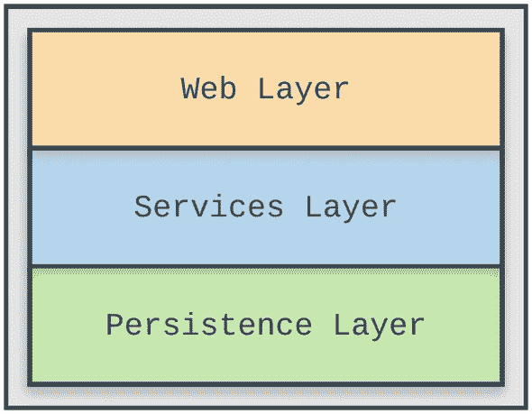

#### 生成头骨计划

开始了。在本节中，您将开始发现并使用 Quarkus 框架提供的强大特性和选项。

为了避免创建新项目和启动时的困难，Quarkus 团队创建了 *Code Quarkus 项目。*这是一个在线工具，用于轻松生成 Quarkus 应用结构。它提供了选择构建工具(Maven 或 Gradle)的能力，并挑选您想要添加到项目中的扩展。

Quarkus Extension

将 Quarkus *扩展*视为项目依赖。扩展配置、引导和集成一个框架或技术到您的 Quarkus 应用中。他们还负责为 GraalVM 提供正确的信息，以便应用进行本地编译。

如果你习惯于 Spring Boot 的生态系统，Quarkus 代码相当于 Spring Initializr，Quarkus 扩展大致类似于 Spring Boot 启动器。

您可以通过几种方式生成基于 Quarkus 的应用:

*   使用网络界面 [`code.quarkus.io`](https://code.quarkus.io/)

*   例如，使用 Quarkus Maven 原型:

```java
mvn io.quarkus:quarkus-maven-plugin:1.13.2.Final:create \
    -DprojectGroupId=org.acme \
    -DprojectArtifactId=getting-started \
    -DclassName="org.acme.getting.started.GreetingResource" \
    -Dpath="/hello"

```

要运行生成的应用，只需运行`mvn quarkus:dev`，如下所示:

```java
$ mvn quarkus:dev
...
[INFO] Scanning for projects...
[INFO]
[INFO] ----------------------< org.acme:getting-started >------------------
[INFO] Building getting-started 1.0.0-SNAPSHOT
[INFO] --------------------------------[ jar ]-----------------------------
[INFO]
[INFO] --- quarkus-maven-plugin:1.13.2.Final:dev (default-cli) @ getting-started ---
[INFO] Using 'UTF-8' encoding to copy filtered resources.
[INFO] Copying 2 resources
[INFO] Nothing to compile - all classes are up to date
Listening for transport dt_socket at address: 5005
__  ____  __  _____   ___  __ ____  ______
 --/ __ \/ / / / _ | / _ \/ //_/ / / / __/
 -/ /_/ / /_/ / __ |/ , _/ ,< / /_/ /\ \
--\___\_\____/_/ |_/_/|_/_/|_|\____/___/
2021-04-24 17:07:20,323 INFO  [io.quarkus] (Quarkus Main Thread) getting-started 1.0.0-SNAPSHOT on JVM (powered by Quarkus 1.13.2.Final) started in 1.476s. Listening on: http://localhost:8080
2021-04-24 17:07:20,336 INFO  [io.quarkus] (Quarkus Main Thread) Profile dev activated. Live Coding activated.
2021-04-24 17:07:20,336 INFO  [io.quarkus] (Quarkus Main Thread) Installed features: [cdi, resteasy]

```

What is the Role of MVN Quarkus:DEV?

您可以使用`mvn quarkus:dev`来运行它，它支持后台编译的热部署，这意味着当您修改 Java 文件或资源文件并刷新浏览器时，这些更改将自动生效。

这也适用于像配置属性文件这样的资源文件。

刷新浏览器的动作会触发对工作区的扫描，如果检测到任何更改，就会编译 Java 文件，并重新部署应用。然后，重新部署的应用将为您的请求提供服务。如果编译或部署有任何问题，错误页面会让您知道。

从 Quarkus 1.11 开始，`mvn quarkus:dev`将启用 Quarkus Dev UI，这是一个开发人员的控制台，可视化当前加载的所有扩展及其状态，以及到它们的文档的直接链接。开发人员用户界面如下所示:

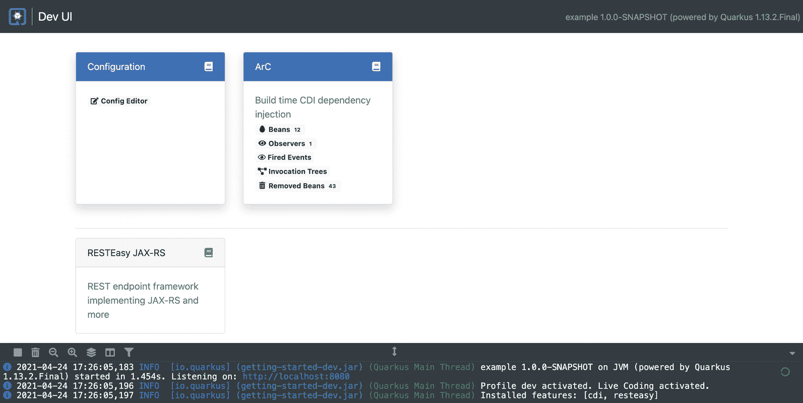

例如，我们可以看到由在`http://localhost:8080/q/dev/io.quarkus.quarkus-arc/beans`可用的 Arc 扩展列出的 Beans:

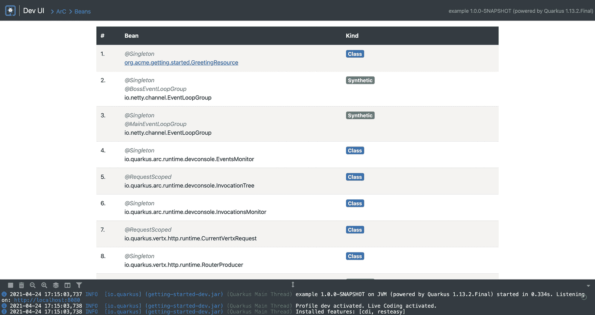

当你去`http://localhost:8080/index.html`:

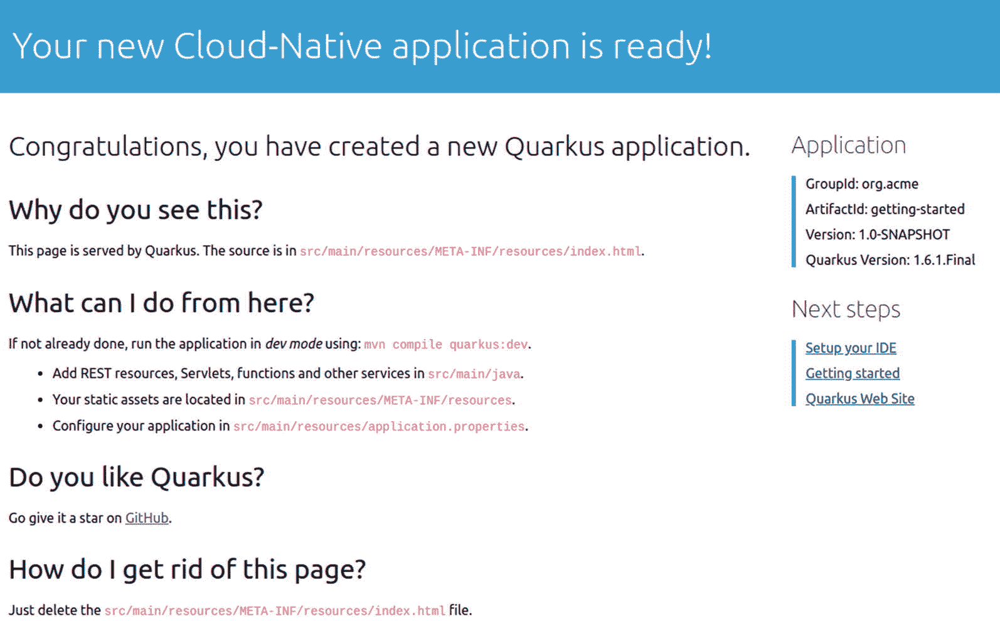

对于这个 Quarkus 项目，您将使用 web 界面来生成项目 skull:

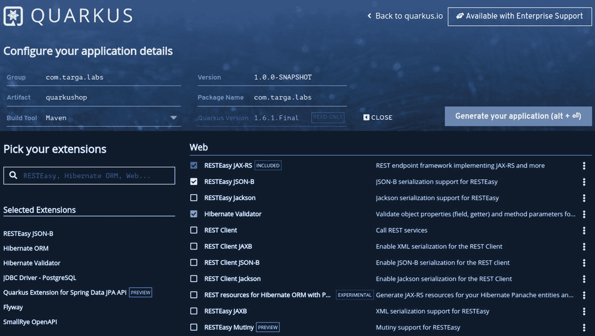

选择这些扩展:

*   **RESTEasy JSON-B** :为 RESTEasy 增加 JSON-B 序列化库支持。

*   SmallRye OpenAPI :基于 OpenAPI 规范记录您的 REST APIs，附带 Swagger UI。

*   **Hibernate ORM** :添加了用 Hibernate ORM 定义持久模型的所有需求，作为 JPA 实现。

*   **Hibernate Validator** :添加用于验证 REST APIs 的输入/输出和/或业务服务方法的参数和返回值的机制。

*   **JDBC 驱动程序- PostgreSQL** :添加了帮助您通过 JDBC 连接到 PostgreSQL 数据库的要求。

*   Quarkus 对 Spring 数据 JPA API 的扩展:将 Spring 数据 JPA 引入 Quarkus 来创建您的数据访问层，就像您在 Spring Boot 所习惯的那样。

*   **Flyway** :处理数据库模式迁移。

您需要将 Lombok 添加到`pom.xml`文件中。Project Lombok 是一个 Java 库，可以自动插入到您的编辑器和构建工具中，为您的 Java 增添趣味。Lombok 节省了编写 getter/setter/constructors/等样板代码的时间和精力。

下面是 Lombok Maven 的依赖关系:

```java
<dependency>
    <groupId>org.projectlombok</groupId>
    <artifactId>lombok</artifactId>
    <version>1.18.16</version>
</dependency>

```

当我们需要时，我们将在这个例子中添加更多的依赖项。

一旦创建了空白项目，就可以开始构建整体层了。让我们从持久层开始。

#### 创建持久层

如果你回头看类图，你会看到这些`Entity`类:

*   `Address`

*   `Cart`

*   `Category`

*   `Customer`

*   `Order`

*   `OrderItem`

*   `Payment`

*   `Product`

*   `Review`

以下是一些列举:

*   `CartStatus`

*   `OrderStatus`

*   `ProductStatus`

*   `PaymentStatus`

下图说明了类别之间的关系:

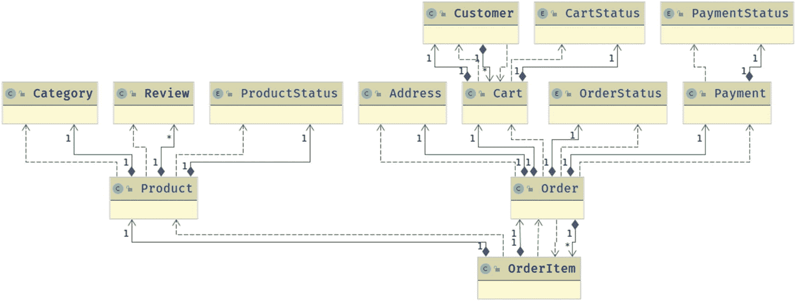

对于列表中的每个实体，您将创建:

*   JPA 实体

*   Spring 数据 JPA 存储库

这些实体将共享一些通常使用的属性，如`id`、`created date`等。这些属性将位于由我们的实体扩展的`AbstractEntity`类中。

`AbstractEntity`看起来是这样的:

*   Lombok 注释为`AbstractEntity`类生成 getters 和 setters。

*   ②将该类声明为 JPA 基类，它包含将由子类实体<sup>【1】</sup>继承的属性。

*   ③使用`AuditingEntityListener`类 <sup>[2]</sup> 激活实体审计:

```java
@Getter ①
@Setter ①
@MappedSuperclass ②
@EntityListeners(AuditingEntityListener.class) ③
public abstract class AbstractEntity {

    @Id
    @GeneratedValue(strategy = GenerationType.AUTO)
    private Long id;

    @Column(name = "created_date", nullable = false)
    private Instant createdDate;

    @Column(name = "last_modified_date")
    private Instant lastModifiedDate;
}

```

*   ①指定在将实体保存在数据库中之前，将调用带注释的方法。

*   ②指定在更新数据库中的实体之前调用带注释的方法。

```java
public class AuditingEntityListener {
    @PrePersist ①
    void preCreate(AbstractEntity auditable) {
        Instant now = Instant.now();
        auditable.setCreatedDate(now);
        auditable.setLastModifiedDate(now);
    }

    @PreUpdate ②
    void preUpdate(AbstractEntity auditable) {
        Instant now = Instant.now();
        auditable.setLastModifiedDate(now);
    }
}

```

##### 手推车

类`Cart`实体看起来像这样:

*   ①这个 Lombok 注释为所有字段生成 getter/setter。

*   ②这个 Lombok 注释生成了一个无参数的构造函数，这是 JPA 需要的**。**

*   ③这个 Lombok 注释基于当前的类字段并包括超类字段来生成`toString()`方法。

*   ④这是一个`@Entity`，它对应的`@Table`将被命名为`carts`。

*   ⑤用于控制数据完整性的验证注释。如果状态为 null，将引发验证异常。<sup>【3】</sup>

*   ⑥列定义:名称、长度和为空性约束的定义。

```java
@Getter ①
@Setter ①
@NoArgsConstructor ②
@ToString(callSuper = true) ③
@Entity ④
@Table(name = "carts") ④
public class Cart extends AbstractEntity {

    @ManyToOne
    private final Customer customer;

    @NotNull ⑤
    @Column(nullable = false) ⑥
    @Enumerated(EnumType.STRING)
    private final CartStatus status;

    public Cart(Customer customer, @NotNull CartStatus status) {
        this.customer = customer;
        this.status = status;
    }

    @Override
    public boolean equals(Object o) {
        if (this == o) return true;
        if (o == null || getClass() != o.getClass()) return false;
        Cart cart = (Cart) o;
        return Objects.equals(customer, cart.customer) &&
                status == cart.status;
    }

    @Override
    public int hashCode() {
        return Objects.hash(customer, status);
    }
}

```

验证注释和`@Column`中定义的约束之间的区别在于，验证注释是应用范围的，而约束是数据库范围的。

`CartRepository`看起来是这样的:

*   ①表示一个带注释的类是一个存储库，最初由*域驱动设计* (Eric Evans，2003)定义为“一种封装存储、检索和搜索行为的机制，它模拟一组对象。”

*   ②JPA Spring Data JPA 中某个知识库的特定扩展。这将使 Spring Data 能够找到这个接口，并自动为它创建一个实现。

*   ③这些方法使用 Spring 数据查询方法构建器机制自动实现查询。

```java
@Repository ①
public interface CartRepository extends JpaRepository<Cart, Long> { ②

    List<Cart> findByStatus(CartStatus status); ③

    List<Cart> findByStatusAndCustomerId(CartStatus status, Long customerId); ③
}

```

What is a Spring Data JpaRepository?

`JpaRepository`延伸`PagingAndSortingRepository`，T1 又延伸`CrudRepository`。他们的主要职能是:

*   `CrudRepository`主要提供 CRUD 功能。

*   提供了对记录进行分页和排序的方法。

*   `JpaRepository`提供了一些 JPA 相关的方法，比如批量刷新持久上下文和删除记录。

因为这里提到的继承，`JpaRepository`会拥有`CrudRepository`和`PagingAndSortingRepository`的所有功能。所以如果你不需要存储库具备`JpaRepository`和`PagingAndSortingRepository`提供的功能，就用`CrudRepository`。

What is the Spring Data Query Methods Builder Mechanism?

Spring 数据存储库基础设施中内置的查询构建器机制对于在存储库的实体上构建约束查询非常有用。该机制从方法中去掉前缀`find` ⋯ `By`、`read` ⋯ `By`、`query` ⋯ `By`、`count` ⋯ `By`和`get` ⋯ `By`，并开始解析其余部分。introducing 子句可以包含更多的表达式，比如在要创建的查询上设置 distinct 标志的`Distinct`。然而，第一个`By`作为一个定界符来指示实际标准的开始。在非常基本的层面上，您可以定义实体属性的条件，并用`And`和`Or`将它们连接起来。

无需编写定制的 JPQL 查询。这就是为什么我使用 Spring Data JPA API 的 Quarkus 扩展来享受 Spring Data JPA 的这些强大特性。

##### 汽车状况

`CartStatus`枚举类如下所示:

```java
public enum CartStatus {
    NEW, CANCELED, CONFIRMED
}

```

##### 地址

`Address`类看起来像这样:

```java
@Getter
@NoArgsConstructor
@AllArgsConstructor
@ToString
@Embeddable
public class Address {

    @Column(name = "address_1")
    private String address1;

    @Column(name = "address_2")
    private String address2;

    @Column(name = "city")
    private String city;

    @NotNull
    @Size(max = 10)
    @Column(name = "postcode", length = 10, nullable = false)
    private String postcode;

    @NotNull
    @Size(max = 2)
    @Column(name = "country", length = 2, nullable = false)
    private String country;

    @Override
    public boolean equals(Object o) {
        if (this == o) return true;
        if (o == null || getClass() != o.getClass()) return false;
        Address address = (Address) o;
        return Objects.equals(address1, address.address1) &&
                Objects.equals(address2, address.address2) &&
                Objects.equals(city, address.city) &&
                Objects.equals(postcode, address.postcode) &&
                Objects.equals(country, address.country);
    }

    @Override
    public int hashCode() {
        return Objects.hash(address1, address2, city, postcode, country);
    }
}

```

`Address`类将被用作可嵌入类。与实体类不同，可嵌入类用于表示实体的状态，但没有自己的持久身份。可嵌入类的实例共享拥有它的实体的身份。可嵌入的类只作为另一个实体的状态存在。

##### 种类

`Category`实体看起来像这样:

```java
@Getter
@NoArgsConstructor
@ToString(callSuper = true)
@Entity
@Table(name = "categories")
public class Category extends AbstractEntity {

    @NotNull
    @Column(name = "name", nullable = false)
    private String name;

    @NotNull
    @Column(name = "description", nullable = false)
    private String description;

    public Category(@NotNull String name, @NotNull String description) {
        this.name = name;
        this.description = description;
    }

    @Override
    public boolean equals(Object o) {
        if (this == o) return true;
        if (o == null || getClass() != o.getClass()) return false;
        Category category = (Category) o;
        return Objects.equals(name, category.name) &&
                Objects.equals(description, category.description);
    }

    @Override
    public int hashCode() {
        return Objects.hash(name, description);
    }
}

```

`CategoryRepository`看起来如下:

```java
@Repository
public interface CategoryRepository extends JpaRepository<Category, Long> {
}

```

##### 顾客

`Customer`实体如下:

```java
@Getter @Setter
@NoArgsConstructor
@ToString(callSuper = true)
@Entity
@Table(name = "customers")
public class Customer extends AbstractEntity {

    @Column(name = "first_name")
    private String firstName;

    @Column(name = "last_name")
    private String lastName;

    @Email
    @Column(name = "email")
    private String email;

    @Column(name = "telephone")
    private String telephone;

    @OneToMany(mappedBy = "customer")
    private Set<Cart> carts;

    @Column(name = "enabled", nullable = false)
    private Boolean enabled;

    public Customer(String firstName, String lastName, @Email String email,
                    String telephone, Set<Cart> carts, Boolean enabled) {
        this.firstName = firstName;
        this.lastName = lastName;
        this.email = email;
        this.telephone = telephone;
        this.carts = carts;
        this.enabled = enabled;
    }

    @Override
    public boolean equals(Object o) {
        if (this == o) return true;
        if (o == null || getClass() != o.getClass()) return false;
        Customer customer = (Customer) o;
        return Objects.equals(firstName, customer.firstName) &&
                Objects.equals(lastName, customer.lastName) &&
                Objects.equals(email, customer.email) &&
                Objects.equals(telephone, customer.telephone) &&
                Objects.equals(carts, customer.carts) &&
                Objects.equals(enabled, customer.enabled);
    }

    @Override
    public int hashCode() {
        return Objects.hash(firstName, lastName, email, telephone, enabled);
    }
}

```

`CustomerRepository`如下所示:

```java
@Repository
public interface CustomerRepository extends JpaRepository<Customer, Long> {
    List<Customer> findAllByEnabled(Boolean enabled);
}

```

##### 命令

`Order`实体如下:

```java
@Getter
@Setter
@NoArgsConstructor
@ToString(callSuper = true)
@Entity
@Table(name = "orders")
public class Order extends AbstractEntity {

    @NotNull
    @Column(name = "total_price", precision = 10, scale = 2, nullable = false)
    private BigDecimal price;

    @NotNull
    @Enumerated(EnumType.STRING)
    @Column(name = "status", nullable = false)
    private OrderStatus status;

    @Column(name = "shipped")
    private ZonedDateTime shipped;

    @OneToOne(cascade = CascadeType.REMOVE)
    @JoinColumn(unique = true)
    private Payment payment;

    @Embedded
    private Address shipmentAddress;

    @OneToMany(mappedBy = "order", fetch = FetchType.LAZY, cascade = CascadeType.REMOVE)
    private Set<OrderItem> orderItems;

    @OneToOne
    private Cart cart;

    public Order(@NotNull BigDecimal price, @NotNull OrderStatus status,
                 ZonedDateTime shipped, Payment payment, Address shipmentAddress,
                 Set<OrderItem> orderItems, Cart cart) {
        this.price = price;
        this.status = status;
        this.shipped = shipped;
        this.payment = payment;
        this.shipmentAddress = shipmentAddress;
        this.orderItems = orderItems;
        this.cart = cart;
    }

    @Override
    public boolean equals(Object o) {
        if (this == o) return true;
        if (o == null || getClass() != o.getClass()) return false;
        Order order = (Order) o;
        return Objects.equals(price, order.price) && status == order.status &&
                Objects.equals(shipped, order.shipped) &&
                Objects.equals(payment, order.payment) &&
                Objects.equals(shipmentAddress, order.shipmentAddress) &&
                Objects.equals(orderItems, order.orderItems) &&
                Objects.equals(cart, order.cart);
    }

    @Override
    public int hashCode() {
        return Objects.hash(price, status, shipped, payment, shipmentAddress, cart);
    }
}

```

`OrderRepository`如下所示:

```java
@Repository
public interface OrderRepository extends JpaRepository<Order, Long> {
    List<Order> findByCartCustomerId(Long customerId);
    Optional<Order> findByPaymentId(Long id);
}

```

##### OrderItem(订单项)

`OrderItem`实体如下:

```java
@Getter @NoArgsConstructor
@ToString(callSuper = true)
@Entity @Table(name = "order_items")
public class OrderItem extends AbstractEntity {

    @NotNull
    @Column(name = "quantity", nullable = false)
    private Long quantity;

    @ManyToOne(fetch = FetchType.LAZY)
    private Product product;

    @ManyToOne(fetch = FetchType.LAZY)
    private Order order;

    public OrderItem(@NotNull Long quantity, Product product, Order order) {
        this.quantity = quantity;
        this.product = product;
        this.order = order;
    }

    @Override
    public boolean equals(Object o) {
        if (this == o) return true;
        if (o == null || getClass() != o.getClass()) return false;
        OrderItem orderItem = (OrderItem) o;
        return Objects.equals(quantity, orderItem.quantity) &&
                Objects.equals(product, orderItem.product) &&
                Objects.equals(order, orderItem.order);
    }

    @Override
    public int hashCode() { return Objects.hash(quantity, product, order); }
}

```

`OrderItemRepository`如下所示:

```java
@Repository
public interface OrderItemRepository extends JpaRepository<OrderItem, Long> {
    List<OrderItem> findAllByOrderId(Long id);
}

```

##### 支付

`Payment`实体如下:

```java
@Getter @NoArgsConstructor
@ToString(callSuper = true)
@Entity @Table(name = "payments")
public class Payment extends AbstractEntity {

    @Column(name = "paypal_payment_id")
    private String paypalPaymentId;

    @NotNull
    @Enumerated(EnumType.STRING)
    @Column(name = "status", nullable = false)
    private PaymentStatus status;

    @NotNull
    @Column(name = "amount", nullable = false)
    private BigDecimal amount;

    public Payment(String paypalPaymentId, @NotNull PaymentStatus status, @NotNull BigDecimal amount) {
        this.paypalPaymentId = paypalPaymentId;
        this.status = status;
        this.amount = amount;
    }

    @Override
    public boolean equals(Object o) {
        if (this == o) return true;
        if (o == null || getClass() != o.getClass()) return false;
        Payment payment = (Payment) o;
        return Objects.equals(paypalPaymentId, payment.paypalPaymentId);
    }

    @Override
    public int hashCode() { return Objects.hash(paypalPaymentId); }
}

```

`PaymentRepository`如下所示:

```java
@Repository
public interface PaymentRepository extends JpaRepository<Payment, Long> {
    List<Payment> findAllByAmountBetween(BigDecimal min, BigDecimal max);
}

```

`PaymentStatus`如下所示:

```java
public enum PaymentStatus {
    ACCEPTED, PENDING, REFUSED, ERROR
}

```

##### 产品

`Product`实体如下:

```java
@Getter
@NoArgsConstructor
@ToString(callSuper = true)
@Entity
@Table(name = "products")
public class Product extends AbstractEntity {

    @NotNull
    @Column(name = "name", nullable = false)
    private String name;

    @NotNull
    @Column(name = "description", nullable = false)
    private String description;

    @NotNull
    @Column(name = "price", precision = 10, scale = 2, nullable = false)
    private BigDecimal price;

    @NotNull
    @Enumerated(EnumType.STRING)
    @Column(name = "status", nullable = false)
    private ProductStatus status;

    @Column(name = "sales_counter")
    private Integer salesCounter;

    @OneToMany(fetch = FetchType.LAZY, cascade = CascadeType.REMOVE)
    @JoinTable(name = "products_reviews",
            joinColumns = @JoinColumn(name = "product_id"),
            inverseJoinColumns = @JoinColumn(name = "reviews_id"))
    private Set<Review> reviews = new HashSet<>();

    @ManyToOne
    @JoinColumn(name = "category_id")
    private Category category;

    public Product(@NotNull String name, @NotNull String description,
                   @NotNull BigDecimal price, @NotNull ProductStatus status,
                   Integer salesCounter, Set<Review> reviews, Category category) {
        this.name = name;
        this.description = description;
        this.price = price;
        this.status = status;
        this.salesCounter = salesCounter;
        this.reviews = reviews;
        this.category = category;
    }

    @Override
    public boolean equals(Object o) {
        if (this == o) return true;
        if (o == null || getClass() != o.getClass()) return false;
        Product product = (Product) o;
        return Objects.equals(name, product.name) &&
                Objects.equals(description, product.description) &&
                Objects.equals(price, product.price) && status == product.status &&
                Objects.equals(salesCounter, product.salesCounter) &&
                Objects.equals(reviews, product.reviews) &&
                Objects.equals(category, product.category);
    }

    @Override
    public int hashCode() {
        return Objects.hash(name, description, price, category);
    }
}

```

`ProductRepository`如下所示:

```java
@Repository
public interface ProductRepository extends JpaRepository<Product, Long> {
    List<Product> findByCategoryId(Long categoryId);

    Long countAllByCategoryId(Long categoryId);

    @Query("select p from Product p JOIN p.reviews r WHERE r.id = ?1")
    Product findProductByReviewId(Long reviewId);

    void deleteAllByCategoryId(Long id);

    List<Product> findAllByCategoryId(Long id);
}

```

##### 产品状态

`ProductStatus`枚举类如下所示:

```java
public enum ProductStatus {
    AVAILABLE, DISCONTINUED
}

```

##### 回顾

`Review`实体如下:

```java
@Getter
@NoArgsConstructor
@ToString(callSuper = true)
@Entity
@Table(name = "reviews")
public class Review extends AbstractEntity {

    @NotNull
    @Column(name = "title", nullable = false)
    private String title;

    @NotNull
    @Column(name = "description", nullable = false)
    private String description;

    @NotNull
    @Column(name = "rating", nullable = false)
    private Long rating;

    public Review(@NotNull String title, @NotNull String description, @NotNull Long rating) {
        this.title = title;
        this.description = description;
        this.rating = rating;
    }

    @Override
    public boolean equals(Object o) {
        if (this == o) return true;
        if (o == null || getClass() != o.getClass()) return false;
        Review review = (Review) o;
        return Objects.equals(title, review.title) &&
                Objects.equals(description, review.description) &&
                Objects.equals(rating, review.rating);
    }

    @Override
    public int hashCode() {
        return Objects.hash(title, description, rating);
    }
}

```

`ReviewRepository`如下所示:

```java
@Repository
public interface ReviewRepository extends JpaRepository<Review, Long> {

    @Query("select p.reviews from Product p where p.id = ?1")
    List<Review> findReviewsByProductId(Long id);
}

```

在这个阶段，您已经完成了实体和存储库的创建。实体图现在看起来像这样:

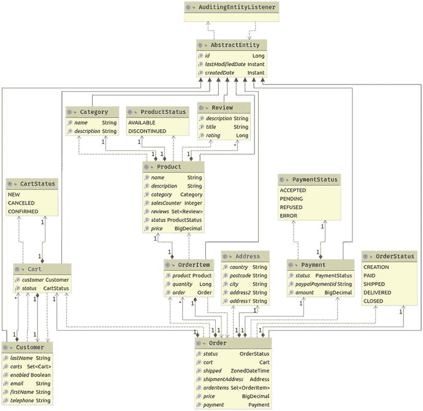

我用 IntelliJ IDEA 生成了这张图。要生成图表，只需右键单击包含目标类的包，然后选择“图表”“➤显示图表”。接下来，在打开的列表中，选择 Java 类图:

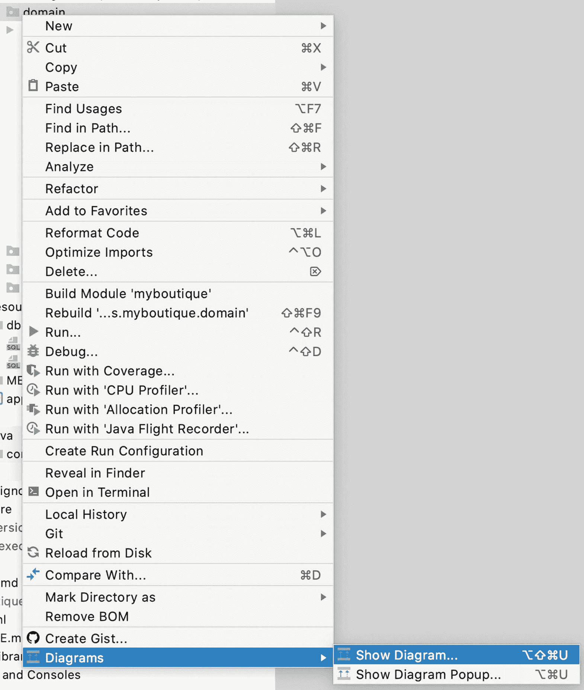

现在您需要为 Quarkus 应用提供 Hibernate/JPA 配置和数据库凭证。

就像 Spring Boot 一样，Quarkus 将其配置和属性存储在位于`src/main/resources`的`application.properties`文件中。

`application.properties`将在本地存储属性。我们可以用很多方法覆盖这些属性，例如，使用环境变量。

QuarkuShop 现在需要两种配置:

*   **数据源配置**:访问数据库所需的所有属性和凭证，包括驱动程序类型、URL、用户名、密码和模式名:

```java
# Datasource config properties
quarkus.datasource.db-kind=postgresql
quarkus.datasource.username=developer
quarkus.datasource.password=p4SSW0rd
quarkus.datasource.jdbc.url=jdbc:postgresql://localhost:5432/demo

```

这些是我们在开始审查源代码之前刚刚创建的 Dockerized PostgreSQL 数据库的凭证。

*   **fly way 配置**:如果您回到您在生成应用时选择的扩展，我们选择 [Flyway](https://flywaydb.org/) ，它将用于版本化数据库。您需要在应用中激活它。

```java
# Flyway minimal config properties
quarkus.flyway.migrate-at-start=true

```

What is Database Versioning?

*版本化数据库*意味着共享应用正常运行所需的数据库的所有更改。数据库版本控制从初始数据库模式开始，也可以从一些数据开始。当应用的新版本中有数据库更改时，我们会发布一个新的补丁文件来对现有数据库执行更改，而不是从更新的转储文件开始，因此在部署新版本时，应用将正常运行。补丁文件描述了如何将现有数据库转换到新状态，以及如何将其恢复到旧状态。

在这种情况下，我们将有两个 Flyway 脚本，它们必须位于默认的 Flyway 文件夹`src/main/resources/db/migration`:

*   `src/main/resources/db/migration/V1.0__Init_app.sql`:初始框架创建脚本，包含创建表的 SQL 查询以及我们在源代码中定义的约束，比如主键、实体间的外键和不可空的列。这个 Flyway 脚本还将带来 ORM 所需的 Hibernate SQL 序列，以便在持久化时为实体提供 id。

*   `src/main/resources/db/migration/V1.1__Insert_samples.sql`:初始样本数据插入脚本，包含我们将插入到数据库中的样本数据，以便在执行过程中有样本数据。

注意这里使用的版本控制——`V1.0`和`V1.1`——这用于保证 Flyway 脚本的执行顺序。

现在我们可以进入下一层:服务层。

#### 创建服务层

既然您已经创建了实体，那么是时候创建服务了。

一个*服务*是一个包装业务逻辑的组件。在这一点上，我们还没有讨论业务逻辑，我们只有 CRUD 操作。您将在服务中实现这些 CRUD 操作。

您需要为每个实体提供单独的服务，以便将单一责任实践应用到您的服务中。

服务层是持久层和 Web 层之间的粘合剂。服务将从存储库中获取数据，并将其业务逻辑应用于加载的数据。它将计算出的数据封装到一个包装器中，用于在服务和 Web 层之间传输数据。这个包装器被称为数据传输对象(DTO)。

Do You Really Need DTOs?

事实上，在许多情况下，您的应用中确实需要 dto。

让我们设想这样一种情况，您有一个列出数据库中可用用户的服务。如果您不使用 d to，而是发送回`User`类，您将把您的用户凭证作为`User`实体的封装字段中的密码传输给 web 服务以及它们背后的调用者。

##### 典型服务:CartService

`CartService`看起来是这样的:

*   ①用于在类中生成一个`logger`的 Lombok 注释。使用时，您有一个`static final log`字段，初始化为您的类名，然后您可以使用它来编写日志语句。

*   ②指定该类是应用范围的。

*   ③ `@Transactional`注释为应用提供了声明式控制事务边界的能力。

*   Java EE 界最著名的注释！它用于请求注释字段类型的实例。

```java
@Slf4j ①
@ApplicationScoped ②
@Transactional ③
public class CartService {

    @Inject ④
    CartRepository cartRepository;

    @Inject ④
    CustomerRepository customerRepository;

    public List<CartDto> findAll() {
        log.debug("Request to get all Carts");
        return this.cartRepository.findAll()
                .stream()
                .map(CartService::mapToDto)
                .collect(Collectors.toList());
    }

    public List<CartDto> findAllActiveCarts() {
        return this.cartRepository.findByStatus(CartStatus.NEW)
                .stream()
                .map(CartService::mapToDto)
                .collect(Collectors.toList());
    }

    public Cart create(Long customerId) {
        if (this.getActiveCart(customerId) == null) {
            var customer =
                    this.customerRepository.findById(customerId).orElseThrow(() ->
                            new IllegalStateException("The Customer does not exist!"));

            var cart = new Cart(customer, CartStatus.NEW);

            return this.cartRepository.save(cart);
        } else {
            throw new IllegalStateException("There is already an active cart");
        }
    }

    public CartDto createDto(Long customerId) {
        return mapToDto(this.create(customerId));
    }

    @Transactional(SUPPORTS)
    public CartDto findById(Long id) {
        log.debug("Request to get Cart : {}", id);
        return this.cartRepository.findById(id).map(CartService::mapToDto).orElse(null);
    }

    public void delete(Long id) {
        log.debug("Request to delete Cart : {}", id);
        Cart cart = this.cartRepository.findById(id)
                .orElseThrow(() -> new IllegalStateException("Cannot find cart with id " + id));

        cart.setStatus(CartStatus.CANCELED);

        this.cartRepository.save(cart);
    }

    public CartDto getActiveCart(Long customerId) {
        List<Cart> carts = this.cartRepository
                .findByStatusAndCustomerId(CartStatus.NEW, customerId);
        if (carts != null) {

            if (carts.size() == 1) {
                return mapToDto(carts.get(0));
            }
            if (carts.size() > 1) {
                throw new IllegalStateException("Many active carts detected !!!");
            }
        }
        return null;
    }

    public static CartDto mapToDto(Cart cart) {
        return new CartDto(
                cart.getId(),
                CustomerService.mapToDto(cart.getCustomer()),
                cart.getStatus().name()
        );
    }
}

```

What is @ApplicationScoped?

用`@ApplicationScoped`标注的对象在应用生命周期中创建一次。

Quarkus 支持 for Java 2.0 的上下文和依赖注入中定义的所有内置作用域，除了`@ConversationScoped`:

*   `@ApplicationScoped`

*   `@Singleton`

*   `@RequestScoped`

*   `@Dependent`

*   `@SessionScoped`

要了解更多关于 CDI 示波器的信息以及它们之间的区别，你可以在 [`https://quarkus.io/guides/cdi`](https://quarkus.io/guides/cdi) 查看 Quarkus CDI 指南。

`CartDto`类看起来像这样:

```java
@Data
@NoArgsConstructor
@AllArgsConstructor
public class CartDto {
    private Long id;
    private CustomerDto customer;
    private String status;
}

```

##### 地址服务

`AddressService`类看起来像这样:

```java
@ApplicationScoped
public class AddressService {

    public static Address createFromDto(AddressDto addressDto) {
        return new Address(
                addressDto.getAddress1(),
                addressDto.getAddress2(),
                addressDto.getCity(),
                addressDto.getPostcode(),
                addressDto.getCountry()
        );
    }

    public static AddressDto mapToDto(Address address) {
        return new AddressDto(
                address.getAddress1(),
                address.getAddress2(),
                address.getCity(),
                address.getPostcode(),
                address.getCountry()
        );
    }
}

```

`AddressDto`类看起来像这样:

```java
@Data
@NoArgsConstructor
@AllArgsConstructor
public class AddressDto {
    private String address1;
    private String address2;
    private String city;
    private String postcode;
    @Size(min = 2, max = 2)
    private String country;
}

```

##### 类别服务

`CategoryService`类看起来像这样:

```java
@Slf4j
@ApplicationScoped
@Transactional
public class CategoryService {
    @Inject
    CategoryRepository categoryRepository;
    @Inject
    ProductRepository productRepository;

    public static CategoryDto mapToDto(Category category, Long productsCount) {
        return new CategoryDto(
                category.getId(),
                category.getName(),
                category.getDescription(),
                productsCount);
    }

    public List<CategoryDto> findAll() {
        log.debug("Request to get all Categories");
        return this.categoryRepository.findAll()
                .stream().map(category ->
                        mapToDto(category,
                                productRepository
                                        .countAllByCategoryId(category.getId())))
                .collect(Collectors.toList());
    }

    public CategoryDto findById(Long id) {
        log.debug("Request to get Category : {}", id);
        return this.categoryRepository.findById(id).map(category ->
                        mapToDto(category,
                                productRepository
                                        .countAllByCategoryId(category.getId())))
                .orElse(null);
    }

    public CategoryDto create(CategoryDto categoryDto) {
        log.debug("Request to create Category : {}", categoryDto);
        return mapToDto(this.categoryRepository
                .save(new Category(
                                categoryDto.getName(),
                                categoryDto.getDescription())
                ), 0L);
    }

    public void delete(Long id) {
        log.debug("Request to delete Category : {}", id);
        log.debug("Deleting all products for the Category : {}", id);
        this.productRepository.deleteAllByCategoryId(id);
        log.debug("Deleting Category : {}", id);
        this.categoryRepository.deleteById(id);
    }

    public List<ProductDto> findProductsByCategoryId(Long id) {
        return this.productRepository.findAllByCategoryId(id)
                .stream()
                .map(ProductService::mapToDto)
                .collect(Collectors.toList());
    }
}

```

`CategoryDto`类看起来像这样:

```java
@Data
@NoArgsConstructor
@AllArgsConstructor
public class CategoryDto {
    private Long id;
    private String name;
    private String description;
    private Long products;
}

```

##### 客户服务

`CustomerService`类看起来像这样:

```java
@Slf4j
@ApplicationScoped
@Transactional
public class CustomerService {

    @Inject
    CustomerRepository customerRepository;

    public CustomerDto create(CustomerDto customerDto) {
        log.debug("Request to create Customer : {}", customerDto);
        return mapToDto(this.customerRepository.save(
                        new Customer(customerDto.getFirstName(),
                                     customerDto.getLastName(),
                                     customerDto.getEmail(),
                                     customerDto.getTelephone(),
                                     Collections.emptySet(),
                                     Boolean.TRUE)
                ));
    }

    public List<CustomerDto> findAll() {
        log.debug("Request to get all Customers");
        return this.customerRepository.findAll()
                .stream()
                .map(CustomerService::mapToDto)
                .collect(Collectors.toList());
    }

    @Transactional
    public CustomerDto findById(Long id) {
        log.debug("Request to get Customer : {}", id);
        return this.customerRepository.findById(id)
                .map(CustomerService::mapToDto).orElse(null);
    }

    public List<CustomerDto> findAllActive() {
        log.debug("Request to get all active customers");
        return this.customerRepository.findAllByEnabled(true)
                .stream().map(CustomerService::mapToDto)
                .collect(Collectors.toList());
    }

    public List<CustomerDto> findAllInactive() {
        log.debug("Request to get all inactive customers");
        return this.customerRepository.findAllByEnabled(false)
                .stream().map(CustomerService::mapToDto)
                .collect(Collectors.toList());
    }

    public void delete(Long id) {
        log.debug("Request to delete Customer : {}", id);

        Customer customer = this.customerRepository.findById(id)
                .orElseThrow(() ->
                        new IllegalStateException("Cannot find Customer with id " + id));

        customer.setEnabled(false);
        this.customerRepository.save(customer);
    }

    public static CustomerDto mapToDto(Customer customer) {
        return new CustomerDto(customer.getId(),
                customer.getFirstName(),
                customer.getLastName(),
                customer.getEmail(),
                customer.getTelephone()
        );
    }
}

```

`CustomerDto`类看起来像这样:

```java
@Data
@NoArgsConstructor
@AllArgsConstructor
public class CustomerDto {
    private Long id;
    private String firstName;
    private String lastName;
    private String email;
    private String telephone;
}

```

##### 订单服务

`OrderItemService`类看起来像这样:

```java
@Slf4j
@ApplicationScoped
@Transactional
public class OrderItemService {

    @Inject
    OrderItemRepository orderItemRepository;
    @Inject
    OrderRepository orderRepository;
    @Inject
    ProductRepository productRepository;

    public static OrderItemDto mapToDto(OrderItem orderItem) {
        return new OrderItemDto(
                orderItem.getId(),
                orderItem.getQuantity(),
                orderItem.getProduct().getId(),
                orderItem.getOrder().getId()
        );
    }

    public OrderItemDto findById(Long id) {
        log.debug("Request to get OrderItem : {}", id);
        return this.orderItemRepository.findById(id)
                .map(OrderItemService::mapToDto).orElse(null);
    }

    public OrderItemDto create(OrderItemDto orderItemDto) {
        log.debug("Request to create OrderItem : {}", orderItemDto);
        var order =
                this.orderRepository
                        .findById(orderItemDto.getOrderId())
                        .orElseThrow(() ->
                           new IllegalStateException("The Order does not exist!"));

        var product =
                this.productRepository
                        .findById(orderItemDto.getProductId())
                        .orElseThrow(() ->
                           new IllegalStateException("The Product does not exist!"));

        var orderItem = this.orderItemRepository.save(
                new OrderItem(
                        orderItemDto.getQuantity(),
                        product,
                        order
                ));
        order.setPrice(order.getPrice().add(orderItem.getProduct().getPrice()));
        this.orderRepository.save(order);

        return mapToDto(orderItem);
    }

    public void delete(Long id) {
        log.debug("Request to delete OrderItem : {}", id);

        var orderItem = this.orderItemRepository.findById(id)
                .orElseThrow(() ->
                        new IllegalStateException("The OrderItem does not exist!"));

        var order = orderItem.getOrder();
        order.setPrice(order.getPrice().subtract(orderItem.getProduct().getPrice()));

        this.orderItemRepository.deleteById(id);

        order.getOrderItems().remove(orderItem);

        this.orderRepository.save(order);
    }

    public List<OrderItemDto> findByOrderId(Long id) {
        log.debug("Request to get all OrderItems of OrderId {}", id);
        return this.orderItemRepository.findAllByOrderId(id)
                .stream()
                .map(OrderItemService::mapToDto)
                .collect(Collectors.toList());
    }
}

```

`OrderItemDto`类看起来像这样:

```java
@Data @NoArgsConstructor @AllArgsConstructor
public class OrderItemDto {
    private Long id;
    private Long quantity;
    private Long productId;
    private Long orderId;
}

```

##### 订单服务

`OrderService`类看起来像这样:

```java
@Slf4j
@ApplicationScoped @Transactional
public class OrderService {

    @Inject OrderRepository orderRepository;
    @Inject PaymentRepository paymentRepository;
    @Inject CartRepository cartRepository;

    public List<OrderDto> findAll() {
        log.debug("Request to get all Orders");
        return this.orderRepository.findAll().stream().map(OrderService::mapToDto)
                .collect(Collectors.toList());
    }

    public OrderDto findById(Long id) {
        log.debug("Request to get Order : {}", id);
        return this.orderRepository.findById(id)
                .map(OrderService::mapToDto).orElse(null);
    }

    public List<OrderDto> findAllByUser(Long id) {
        return this.orderRepository.findByCartCustomerId(id)
                .stream().map(OrderService::mapToDto).collect(Collectors.toList());
    }

    public OrderDto create(OrderDto orderDto) {
        log.debug("Request to create Order : {}", orderDto);

        Long cartId = orderDto.getCart().getId();
        Cart cart = this.cartRepository.findById(cartId)
                .orElseThrow(() -> new IllegalStateException(
                            "The Cart with ID[" + cartId + "] was not found !"));

        return mapToDto(this.orderRepository.save(new Order(BigDecimal.ZERO,
                           OrderStatus.CREATION, null, null,
                           AddressService.createFromDto(orderDto.getShipmentAddress()),
                           Collections.emptySet(), cart)));
    }

    @Transactional
    public void delete(Long id) {
        log.debug("Request to delete Order : {}", id);

        Order order = this.orderRepository.findById(id)
                .orElseThrow(() ->
                    new IllegalStateException(
                        "Order with ID[" + id + "] cannot be found!"));

        Optional.ofNullable(order.getPayment())
                .ifPresent(paymentRepository::delete);

        orderRepository.delete(order);
    }

    public boolean existsById(Long id) {
        return this.orderRepository.existsById(id);
    }

    public static OrderDto mapToDto(Order order) {
        Set<OrderItemDto> orderItems = order.getOrderItems()
                .stream().map(OrderItemService::mapToDto).collect(Collectors.toSet());

        return new OrderDto(
                order.getId(),
                order.getPrice(),
                order.getStatus().name(),
                order.getShipped(),
                order.getPayment() != null ? order.getPayment().getId() : null,
                AddressService.mapToDto(order.getShipmentAddress()),
                orderItems,
                CartService.mapToDto(order.getCart())
        );
    }
}

```

`OrderDto`类看起来像这样:

```java
@Data
@NoArgsConstructor
@AllArgsConstructor
public class OrderDto {
    private Long id;
    private BigDecimal totalPrice;
    private String status;
    private ZonedDateTime shipped;
    private Long paymentId;
    private AddressDto shipmentAddress;
    private Set<OrderItemDto> orderItems;
    private CartDto cart;
}

```

##### 支付服务

`PaymentService`类看起来像这样:

```java
@Slf4j
@ApplicationScoped @Transactional
public class PaymentService {

    @Inject
    PaymentRepository paymentRepository;
    @Inject
    OrderRepository orderRepository;

    public List<PaymentDto> findByPriceRange(Double max) {
        return this.paymentRepository
                .findAllByAmountBetween(BigDecimal.ZERO, BigDecimal.valueOf(max))
                .stream().map(payment -> mapToDto(payment,
                                    findOrderByPaymentId(payment.getId()).getId()))
                .collect(Collectors.toList());
    }

    public List<PaymentDto> findAll() {
        return this.paymentRepository.findAll().stream()
                .map(payment -> findById(payment.getId())).collect(Collectors.toList());
    }

    public PaymentDto findById(Long id) {
        log.debug("Request to get Payment : {}", id);
        Order order = findOrderByPaymentId(id).orElseThrow(() ->
                            new IllegalStateException("The Order does not exist!"));

        return this.paymentRepository.findById(id)
                .map(payment -> mapToDto(payment, order.getId())).orElse(null);
    }

    public PaymentDto create(PaymentDto paymentDto) {
        log.debug("Request to create Payment : {}", paymentDto);

        Order order = this.orderRepository.findById(paymentDto.getOrderId())
                        .orElseThrow(() ->
                            new IllegalStateException("The Order does not exist!"));
        order.setStatus(OrderStatus.PAID);

        Payment payment = this.paymentRepository.saveAndFlush(new Payment(
                paymentDto.getPaypalPaymentId(),
                PaymentStatus.valueOf(paymentDto.getStatus()),
                order.getPrice()
        ));

        this.orderRepository.saveAndFlush(order);

        return mapToDto(payment, order.getId());
    }

    private Order findOrderByPaymentId(Long id) {
        return this.orderRepository.findByPaymentId(id).orElseThrow(() ->
            new IllegalStateException("No Order exists for the Payment ID " + id));
    }

    public void delete(Long id) {
        log.debug("Request to delete Payment : {}", id);
        this.paymentRepository.deleteById(id);
    }

    public static PaymentDto mapToDto(Payment payment, Long orderId) {
        if (payment != null) {
            return new PaymentDto(
                    payment.getId(),
                    payment.getPaypalPaymentId(),
                    payment.getStatus().name(),
                    orderId);
        }
        return null;
    }
}

```

`PaymentDto`类看起来像这样:

```java
@Data
@NoArgsConstructor
@AllArgsConstructor
public class PaymentDto {
    private Long id;
    private String paypalPaymentId;
    private String status;
    private Long orderId;
}

```

##### 产品服务

`ProductService`类看起来像这样:

```java
@Slf4j
@ApplicationScoped
@Transactional
public class ProductService {

    @Inject
    ProductRepository productRepository;
    @Inject
    CategoryRepository categoryRepository;

    public List<ProductDto> findAll() {
        log.debug("Request to get all Products");
        return this.productRepository.findAll()
                .stream().map(ProductService::mapToDto)
                .collect(Collectors.toList());
    }

    public ProductDto findById(Long id) {
        log.debug("Request to get Product : {}", id);
        return this.productRepository.findById(id)
                    .map(ProductService::mapToDto).orElse(null);
    }

    public Long countAll() {
        return this.productRepository.count();
    }

    public Long countByCategoryId(Long id) {
        return this.productRepository.countAllByCategoryId(id);
    }

    public ProductDto create(ProductDto productDto) {
        log.debug("Request to create Product : {}", productDto);

        return mapToDto(this.productRepository.save(
                new Product(
                        productDto.getName(),
                        productDto.getDescription(),
                        productDto.getPrice(),
                        ProductStatus.valueOf(productDto.getStatus()),
                        productDto.getSalesCounter(),
                        Collections.emptySet(),
                        categoryRepository.findById(productDto.getCategoryId())
                                          .orElse(null)
                )));
    }

    public void delete(Long id) {
        log.debug("Request to delete Product : {}", id);
        this.productRepository.deleteById(id);
    }

    public List<ProductDto> findByCategoryId(Long id) {
        return this.productRepository.findByCategoryId(id).stream()
                .map(ProductService::mapToDto).collect(Collectors.toList());
    }

    public static ProductDto mapToDto(Product product) {
        return new ProductDto(
                product.getId(),
                product.getName(),
                product.getDescription(),
                product.getPrice(),
                product.getStatus().name(),
                product.getSalesCounter(),
                product.getReviews().stream().map(ReviewService::mapToDto)
                                    .collect(Collectors.toSet()),
                product.getCategory().getId()
        );
    }
}

```

`ProductDto`类看起来像这样:

```java
@Data
@NoArgsConstructor
@AllArgsConstructor
public class ProductDto {
    private Long id;
    private String name;
    private String description;
    private BigDecimal price;
    private String status;
    private Integer salesCounter;
    private Set<ReviewDto> reviews;
    private Long categoryId;
}

```

##### 审查服务

`ReviewService`类看起来像这样:

```java
@Slf4j
@ApplicationScoped
@Transactional
public class ReviewService {

    @Inject
    ReviewRepository reviewRepository;

    @Inject
    ProductRepository productRepository;

    public List<ReviewDto> findReviewsByProductId(Long id) {
        log.debug("Request to get all Reviews");
        return this.reviewRepository.findReviewsByProductId(id)
                .stream()
                .map(ReviewService::mapToDto)
                .collect(Collectors.toList());
    }

    public ReviewDto findById(Long id) {
        log.debug("Request to get Review : {}", id);
        return this.reviewRepository
                    .findById(id)
                    .map(ReviewService::mapToDto)
                    .orElse(null);
    }

    public ReviewDto create(ReviewDto reviewDto, Long productId) {
        log.debug("Request to create Review : {} ofr the Product {}",
                reviewDto, productId);

        Product product = this.productRepository.findById(productId)
                .orElseThrow(() ->
                    new IllegalStateException(
                        "Product with ID:" + productId + " was not found !"));

        Review savedReview = this.reviewRepository.saveAndFlush(
                new Review(
                        reviewDto.getTitle(),
                        reviewDto.getDescription(),
                        reviewDto.getRating()));

        product.getReviews().add(savedReview);
        this.productRepository.saveAndFlush(product);

        return mapToDto(savedReview);
    }

    public void delete(Long reviewId) {
        log.debug("Request to delete Review : {}", reviewId);

        Review review = this.reviewRepository.findById(reviewId)
                .orElseThrow(() ->
                    new IllegalStateException(
                        "Product with ID:" + reviewId + " was not found !"));

        Product product = this.productRepository.findProductByReviewId(reviewId);

        product.getReviews().remove(review);

        this.productRepository.saveAndFlush(product);
        this.reviewRepository.delete(review);
    }

    public static ReviewDto mapToDto(Review review) {
        return new ReviewDto(
                review.getId(),
                review.getTitle(),
                review.getDescription(),
                review.getRating()
        );
    }
}

```

`ReviewDto`类看起来像这样:

```java
@Data
@NoArgsConstructor
@AllArgsConstructor
public class ReviewDto {
    private Long id;
    private String title;
    private String description;
    private Long rating;
}

```

#### 创建 Web 图层

本节将我们在服务类中实现的操作公开为 REST web 服务。

在 Spring 框架中，可以使用`RestController`实现 REST web 服务。

 * REST API 基路径*

我们希望我们的 RESTful web 服务可以通过`/api/carts`、`/api/orders`等被访问。，所以我们需要将基路径`/api`定义为根路径，供所有 REST web 服务重用。

这可以在 Quarkus 中使用以下属性进行配置:

`quarkus.http.root-path=/api`

##### 典型的 RestController: CartResource

`CartResource`看起来是这样的:

*   ①标识资源类或类方法将用于服务请求的 URI 路径。

*   ②默认情况下，所有方法生成的所有内容都在 JSON 中。如果您想改变这一点，或者如果您想添加另一种序列化格式，请使用`@Produces`注释。

```java
@Path("/carts") ①
public class CartResource { ②

    @Inject CartService cartService;

    @GET
    public List<CartDto> findAll() {
        return this.cartService.findAll();
    }

    @GET @Path("/active")
    public List<CartDto> findAllActiveCarts() {
        return this.cartService.findAllActiveCarts();
    }

    @GET @Path("/customer/{id}")
    public CartDto getActiveCartForCustomer(@PathParam("id") Long customerId) {
        return this.cartService.getActiveCart(customerId);
    }

    @GET @Path("/{id}")
    public CartDto findById(@PathParam("id") Long id) {
        return this.cartService.findById(id);
    }

    @POST @Path("/customer/{id}")
    public CartDto create(@PathParam("id") Long customerId) {
        return this.cartService.createDto(customerId);
    }

    @DELETE @Path("/{id}")
    public void delete(@PathParam("id") Long id) {
        this.cartService.delete(id);
    }
}

```

在这个 REST web 服务中，我们:

*   列出所有购物车:HTTP GET on `/api/carts`。

*   列出活动购物车:HTTP GET on ``/api/carts/active`。

*   为客户列出活动的购物车:HTTP GET on `/api/carts/customer/{id}` with `{id}`，它保存了客户的 ID。

*   列出购物车的所有细节:HTTP GET on `api/carts/{id}` with `{id},`保存购物车的 ID。

*   为给定的客户创建一个新的购物车:HTTP POST on `/api/carts/customer/{id}` with `{id}`，其中包含客户的 ID。

*   删除购物车:HTTP DELETE on `/api/carts/{id}` with `{id}`。

使用 [OpenAPI 规范](https://swagger.io/specification/)来描述这些操作，以方便外部调用者使用 REST web 服务。API 描述是自动生成的。

##### 类别资源

`CategoryResource`类看起来像这样:

```java
@Path("/categories")
public class CategoryResource {
    @Inject CategoryService categoryService;
    @GET
    public List<CategoryDto> findAll() {
        return this.categoryService.findAll();
    }

    @GET @Path("/{id}")
    public CategoryDto findById(@PathParam("id") Long id) {
        return this.categoryService.findById(id);
    }

    @GET @Path("/{id}/products")
    public List<ProductDto> findProductsByCategoryId(@PathParam("id") Long id) {
        return this.categoryService.findProductsByCategoryId(id);
    }

    @POST     public CategoryDto create(CategoryDto categoryDto) {
        return this.categoryService.create(categoryDto);
    }

    @DELETE @Path("/{id}")
    public void delete(@PathParam("id") Long id) {
        this.categoryService.delete(id);
    }
}

```

##### 客户资源

`CustomerResource`类看起来像这样:

```java
@Path("/customers")
public class CustomerResource {

    @Inject
    CustomerService customerService;

    @GET
    public List<CustomerDto> findAll() {
        return this.customerService.findAll();
    }

    @GET
    @Path("/{id}")
    public CustomerDto findById(@PathParam("id") Long id) {
        return this.customerService.findById(id);
    }

    @GET
    @Path("/active")
    public List<CustomerDto> findAllActive() {
        return this.customerService.findAllActive();
    }

    @GET
    @Path("/inactive")
    public List<CustomerDto> findAllInactive() {
        return this.customerService.findAllInactive();
    }

    @POST
        public CustomerDto create(CustomerDto customerDto) {
        return this.customerService.create(customerDto);
    }

    @DELETE
    @Path("/{id}")
    public void delete(@PathParam("id") Long id) {
        this.customerService.delete(id);
    }
}

```

##### 订单项资源

`OrderItemResource`类看起来像这样:

```java
@Path("/order-items")
public class OrderItemResource {

    @Inject
    OrderItemService itemService;

    @GET
    @Path("/order/{id}")
    public List<OrderItemDto> findByOrderId(@PathParam("id") Long id) {
        return this.itemService.findByOrderId(id);
    }

    @GET
    @Path("/{id}")
    public OrderItemDto findById(@PathParam("id") Long id) {
        return this.itemService.findById(id);
    }

    @POST
        public OrderItemDto create(OrderItemDto orderItemDto) {
        return this.itemService.create(orderItemDto);
    }

    @DELETE
    @Path("/{id}")
    public void delete(@PathParam("id") Long id) {
        this.itemService.delete(id);
    }
}

```

##### 订单资源

`OrderResource`类看起来像这样:

```java
@Path("/orders")
public class OrderResource {

    @Inject
    OrderService orderService;

    @GET
    public List<OrderDto> findAll() {
        return this.orderService.findAll();
    }

    @GET
    @Path("/customer/{id}")
    public List<OrderDto> findAllByUser(@PathParam("id") Long id) {
        return this.orderService.findAllByUser(id);
    }

    @GET
    @Path("/{id}")
    public OrderDto findById(@PathParam("id") Long id) {
        return this.orderService.findById(id);
    }

    @POST
        public OrderDto create(OrderDto orderDto) {
        return this.orderService.create(orderDto);
    }

    @DELETE
    @Path("/{id}")
    public void delete(@PathParam("id") Long id) {
        this.orderService.delete(id);
    }

    @GET
    @Path("/exists/{id}")
    public boolean existsById(@PathParam("id") Long id) {
        return this.orderService.existsById(id);
    }
}

```

##### 支付资源

`PaymentResource`类看起来像这样:

```java
@Path("/payments")
public class PaymentResource {

    @Inject
    PaymentService paymentService;

    @GET
    public List<PaymentDto> findAll() {
        return this.paymentService.findAll();
    }

    @GET
    @Path("/{id}")
    public PaymentDto findById(@PathParam("id") Long id) {
        return this.paymentService.findById(id);
    }

    @POST
        public PaymentDto create(PaymentDto orderItemDto) {
        return this.paymentService.create(orderItemDto);
    }

    @DELETE
    @Path("/{id}")
    public void delete(@PathParam("id") Long id) {
        this.paymentService.delete(id);
    }

    @GET
    @Path("/price/{max}")
    public List<PaymentDto> findPaymentsByAmountRangeMax(@PathParam("max") double max) {
        return this.paymentService.findByPriceRange(max);
    }
}

```

##### 产品资源

`ProductResource`类看起来像这样:

```java
@Path("/products")
public class ProductResource {

    @Inject ProductService productService;

    @GET
    public List<ProductDto> findAll() {
        return this.productService.findAll();
    }

    @GET @Path("/count")
    public Long countAllProducts() {
        return this.productService.countAll();
    }

    @GET @Path("/{id}")
    public ProductDto findById(@PathParam("id") Long id) {
        return this.productService.findById(id);
    }

    @POST     public ProductDto create(ProductDto productDto) {
        return this.productService.create(productDto);
    }

    @DELETE @Path("/{id}")
    public void delete(@PathParam("id") Long id) {
        this.productService.delete(id);
    }

    @GET @Path("/category/{id}")
    public List<ProductDto> findByCategoryId(@PathParam("id") Long id) {
        return this.productService.findByCategoryId(id);
    }

    @GET @Path("/count/category/{id}")
    public Long countByCategoryId(@PathParam("id") Long id) {
        return this.productService.countByCategoryId(id);
    }
}

```

##### 查看资源

`ReviewResource`类看起来像这样:

```java
@Path("/reviews")
public class ReviewResource {

    @Inject ReviewService reviewService;

    @GET @Path("/product/{id}")
    public List<ReviewDto> findAllByProduct(@PathParam("id") Long id) {
        return this.reviewService.findReviewsByProductId(id);
    }

    @GET @Path("/{id}")
    public ReviewDto findById(@PathParam("id") Long id) {
        return this.reviewService.findById(id);
    }

    @POST @Path("/product/{id}")
        public ReviewDto create(ReviewDto reviewDto, @PathParam("id") Long id) {
        return this.reviewService.create(reviewDto, id);
    }

    @DELETE @Path("/{id}")
    public void delete(@PathParam("id") Long id) {
        this.reviewService.delete(id);
    }
}

```

#### 自动化 API 文档

Swagger 2 是一个开源项目，用于描述和记录 RESTful APIs。它是语言无关的，可以扩展到 HTTP 之外的新技术和协议。当前版本定义了一组 HTML、JavaScript 和 CSS 资产，以便从符合 Swagger 的 API 动态生成文档。这些文件被 Swagger UI 项目捆绑在一起，以在浏览器上显示 API。除了呈现文档，Swagger UI 还允许其他 API 开发人员和消费者与 API 的资源进行交互，而不需要任何实现逻辑。

Swagger 2 规范，也称为 OpenAPI 规范，有几个实现。我们将在这个项目中使用 SmallRye OpenAPI 实现。

SmallRye OpenAPI 自动生成 API 文档。SmallRye OpenAPI 的工作方式是在构建时检查一次应用，根据 Quarkus 配置、类结构和各种编译时 Java 注释来推断 API 语义。

您已经将`quarkus-smallrye-openapi`依赖项添加到项目中。不需要进行任何额外的配置或开发。这个扩展将很容易生成 OpenAPI 描述符和 Swagger UI！

##### 你好，世界大摇大摆！

要运行 Quarkus 应用，只需运行`mvn quarkus:dev`命令。

该应用将在 8080 端口上运行。要访问 Swagger UI，请转到`http://localhost:8080/api/swagger-ui/`。

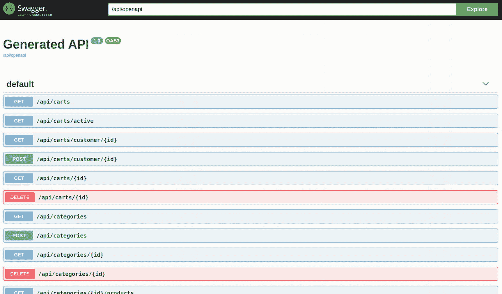

您还可以检查生成的 OpenAPI 描述符，可在`http://localhost:8080/api/openapi`获得:

```java
---
openapi: 3.0.1
info:
  title: Generated API
  version: "1.0"
paths:
  /api/carts:
    get:
      responses:
        "200":
          description: OK
          content:
            application/json:
              schema:
                $ref: '#/components/schemas/ListCartDto'
  /api/carts/active:
    get:
      responses:
        "200":
          description: OK
          content:
            application/json:
              schema:
                $ref: '#/components/schemas/ListCartDto'
...

```

Swagger UI 仅在非生产环境中可用。要永久启用它，您需要向`application.properties`添加一个参数:

```java
# Swagger UI
quarkus.swagger-ui.always-include=true

```

最后，为了更好地组织代码，为所有 REST APIs 类添加一个 OpenAPI `@Tag`注释，以便描述每个类。这有助于将属于同一个 REST API 的所有方法重新组合到一个部分中。考虑一下`CartResource`的例子:

```java
@Path("/carts")
@Tag(name = "cart", description = "All the cart methods")
public class CartResource {
...
}

```

别忘了给每个类加上`@Tag`。

当您重新启动应用并再次访问 Swagger UI 时，您可以看到对每个 REST API 的描述都出现了，并且这些方法都分组在同一个标记名下:

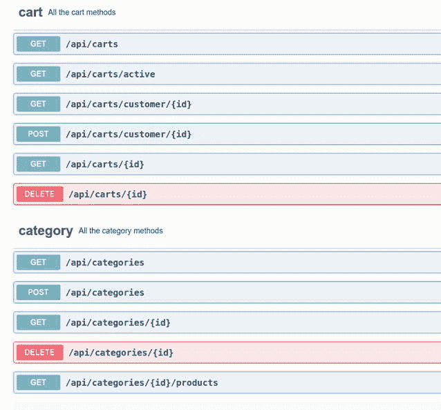

#### 自定义 quartus 横幅

本章的最后一部分将向您展示如何定制应用横幅，就像在 Spring Boot 所做的那样。这个操作在Quarkus非常容易。首先，你需要在`src/main/resources`中创建一个`banner.txt`文件，如清单 [3-1](#PC58) 所示。

```java
___  ____                       __          _____  __
_ __/ __ \ __  __ ____   _____ / /__ __  __/ ___/ / /_   ____   ____
 --/ / / // / / // __ \ / ___// //_// / / /\__ \ / __ \ / __ \ / __ \
 -/ /_/ // /_/ // /_/ // /   / ,<  / /_/ /___/ // / / // /_/ // /_/ /
--\___\_\\____/ \__,_//_/   /_/|_| \____//____//_/ /_/ \____// ,___/
                                                            /_/ Part of the #PlayingWith Series

Listing 3-1src/main/resources/banner.txt

```

然后，您只需要告诉应用您在`banner.txt`文件中有一个定制的横幅:

```java
# Define the custom banner
quarkus.banner.path=banner.txt

```

## 结论

现在您已经拥有了项目的所有必要组件——源代码、API 文档和数据库。

在下一章中，您将创建必要的测试来保护您的代码免受未来的修改或重构。本章还深入探讨了使用最佳 CI/CD 管道构建和部署您的应用。

*   [1]在 [https:// docs 了解更多关于`@MappedSuperclass`的信息。jboss。org/ hibernate/ orm/ 5。4/User Guide/html _ single/Hibernate _ User _ Guide。html #实体-继承-映射-超类](https://docs.jboss.org/hibernate/orm/5.4/userguide/html_single/Hibernate_User_Guide.html%2523entity-inheritance-mapped-superclass)

*   [2]在 [`https://docs.jboss.org/hibernate/stable/entitymanager/reference/en/html/listeners.html`](https://docs.jboss.org/hibernate/stable/entitymanager/reference/en/html/listeners.html) 了解更多关于`@EntityListeners`的信息

*   [3]在 [https:// docs 了解有关验证约束的更多信息。jboss。org/ hibernate/ validator/ 7。0/reference/en-US/html _ single/# _ validating _ constraints](https://docs.jboss.org/hibernate/validator/7.0/reference/en-US/html_single/%2523_validating_constraints)