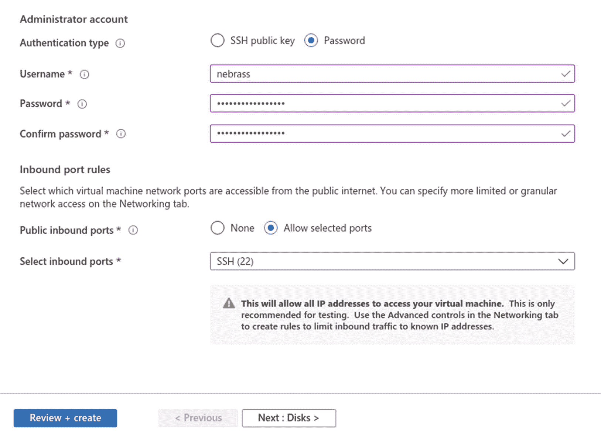
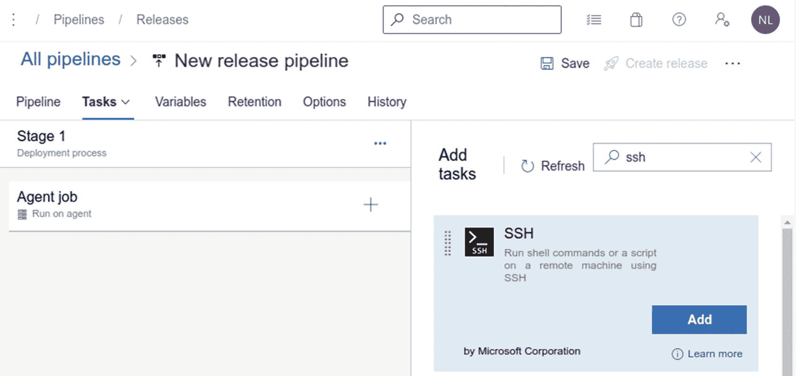

# 5.构建和部署整体应用程序

## 介绍

在 QuarkuShop 中，我们使用 Maven 作为构建工具。可以使用 CI/CD 管道(例如，通过 Jenkins 或 Azure DevOps)轻松构建该应用并将其部署到生产环境中。

## 将项目导入 Azure DevOps

首先，你需要在 Azure DevOps 中创建一个项目。好吧，但是什么是 Azure DevOps？

Azure DevOps 是来自微软的软件即服务(SaaS)产品，为软件团队提供了许多出色的功能。这些特性涵盖了典型应用的生命周期:

*   **Azure pipelines** :可以与任何语言、平台和云(不仅仅是 Azure )一起工作的 CI/CD。

*   Azure boards :强大的工作跟踪功能，包括看板、积压订单、团队仪表盘和定制报告。

*   **Azure 工件**:来自公共和私有来源的 Maven、npm 和 NuGet 包提要。

*   **Azure Repos** :为您的项目提供无限的云托管私有 Git repos。协作拉取请求、高级文件管理等等。

*   **Azure 测试计划**:一体化的计划和探索性测试解决方案。

对于 Java 开发人员来说，Azure DevOps(也称为 ADO)是 Jenkins/Hudson 或 GitHub 操作的一个很好的替代品。本章展示了如何轻松地为这个项目创建一个完整的 CI/CD 管道。

首先，进入 Azure DevOps 门户，点击开始免费创建一个帐户:


接下来，验证您的 Outlook/Hotmail/Live 帐户(或创建一个新帐户)，然后确认注册:


接下来，您需要创建一个 Azure DevOps 组织:


接下来，创建您的第一个 Azure DevOps 项目:


接下来，转到回购➤文件:


在这里，您会对从命令行推送现有存储库感兴趣。

ADO 生成将本地项目推向上游所需的`git`命令。在运行这些命令之前，让本地项目成为支持 git 的项目。

为此，只需运行这些命令，这将启动并添加所有文件，然后进行第一次提交:

```java
git init
git add .
git commit -m "first commit"

```

接下来，您应该运行将整个项目推送到 ADO 的`git`命令:

```java
1 git remote add origin https://nebrass-lamouchi@dev.azure.com/nebrass-lamouchi/quarkushop-monolithic-application/_git/quarkushop-monolithic-application
2 git push -u origin --all

```

源代码现在存放在 ADO 存储库中。现在您将创建 CI/CD 管道。

## 创建 CI/CD 管道

下一步是配置持续集成管道，它将在每次主开发分支(在我们的例子中是`master`分支)上有新代码时运行。

### 创建持续集成管道

要创建第一个 CI 管道，请转到“管道”部分，然后单击“创建管道”:


接下来，选择源代码的存储位置。点按“使用经典编辑器:


接下来，选择 AzureRepos Git 并选择您刚刚创建的 QuarkuShop 存储库:


将出现管道配置屏幕。选择 Maven 管道:


然后插入最重要的部分，使用定义 YAML 文件定义管道配置。你有两个选择:

*   直接在 ADO 中构建基于 Maven 的 Java 项目

*   使用 Docker 多级构建来构建您的项目

#### 创建基于 Maven 的 CI 管道

对于用 ADO 构建的 Maven 项目来说，这是最常见的情况。这也是 Maven 构建最简单的选择。见清单 [5-1](#PC3) 。

不幸的是，这种方法对环境有很强的依赖性。例如，您需要安装 JDK 11 和 Maven 3.6.2+。如果在主机中找不到这些依赖项之一，构建将会失败。

使用这种方法时，您需要根据您的具体需求和工具采用 CI 平台。

*   ①当`master`分支上有更新时，该流水线将被触发。

*   ②使用 Ubuntu 的最新镜像。写这本书的时候是 20.04。

*   ③CI 场景中的第一个任务是运行所有的测试并生成 Sonar 报告。为 Java 11 定义运行时，并为 Maven 任务分配 3GB 内存。

*   ④将目标文件夹的内容复制到预定义的`$(Build.ArtifactStagingDirectory)`。

*   ⑤最后，将`$(Build.ArtifactStagingDirectory)`的内容作为 Azure DevOps 神器上传。

```java
trigger:                                                ①
- master

pool:
  vmImage: 'ubuntu-latest'                              ②

steps:
- task: Maven@3
  displayName: 'Maven verify & Sonar Analysis'          ③
  inputs:
    mavenPomFile: 'pom.xml'
    mavenOptions: '-Xmx3072m'
    javaHomeOption: 'JDKVersion'
    jdkVersionOption: '1.11'
    jdkArchitectureOption: 'x64'
    publishJUnitResults: true
    testResultsFiles: '**/surefire-reports/TEST-*.xml'
    goals: 'verify sonar:sonar'

- task: CopyFiles@2
  displayName: 'CopyFiles for Target'                   ④
  inputs:
    SourceFolder: 'target'
    Contents: '*.*'
    TargetFolder: '$(Build.ArtifactStagingDirectory)'

- task: PublishBuildArtifacts@1
  displayName: 'Publish Artifact: drop'                 ⑤
  inputs:
    pathtoPublish: '$(Build.ArtifactStagingDirectory)'
    artifactName: drop

Listing 5-1azure-pipelines.yml

```

#### 创建基于 Docker 多级的 CI 管道

这是构建项目的时髦方式。这是构建具有非常具体需求的项目的最佳选择。与 QuarkuShop 应用程序一样，您需要安装 JDK 11 和 GraalVM 以及 Maven 3.6.2+。即使在 ADO 中也无法满足这一点，因为 Azure pipelines 中没有 GraalVM(至少到目前为止，在我写这些文字的时候)。

幸运的是，这种构建方法不依赖于环境。每个必需的组件将在不同的 Dockerfile 阶段进行安装和配置。

使用这种方法时，您可以将您特定需要的工具带到 CI 平台。

让我们看看`Dockerfile.multistage`文件的阶段 1，如清单 [5-2](#PC4) 所示。

```java
## Stage 1 : build with maven builder image with native capabilities
FROM quay.io/quarkus/centos-quarkus-maven:20.1.0-java11 AS build

Listing 5-2src/main/docker/Dockerfile.multistage

```

在构建阶段，我们使用的是`centos-quarkus-maven:20.1.0-java11` Docker 基础映像，这是 Java 11 附带的 GraalVM、Maven、Podman 和 Buildah。这些正是我们需要的工具和版本。

你可能注意到了，我正试图说服你采用这种方法。首先，这是唯一可能的方法，因为 ADO 没有 GraalVM，而且这是避免任何意外问题的最合适的方法。

Docker 多级 CI 管道的`azure-pipelines.yml`文件如清单 [5-3](#PC5) 所示。

*   ①使用第一个`Docker@2`任务:
    *   基于`Dockerfile.multistage`文件构建 Docker 映像。

    *   将构建的图像命名为`nebrass/quarkushop-monolithic-application`。

    *   用`$(Build.BuildId)`和`latest`标签标记构建的图像，T0 是一个 ADO 构建变量。

*   ②使用第二个`Docker@2`任务将`nebrass/quarkushop-monolithic-application`图像推送到适当的 Docker Hub 帐户。

*   ③使用名为`nebrass@DockerHub`的 Azure 服务连接，它存储适当的 Docker Hub 凭证。

    `Docker@2`中的`@`定义了 ADO 中 Docker 任务的选定版本。

    要了解更多关于创建到 SonarCloud 的 Azure 服务连接的信息，请在 [`https://www.azuredevopslabs.com/labs/vstsextend/sonarcloud/`](https://www.azuredevopslabs.com/labs/vstsextend/sonarcloud/) 查看[这个优秀的 Azure DevOps 实验室教程](https://www.azuredevopslabs.com/labs/vstsextend/sonarcloud/)。

```java
trigger:
- master

pool:
  vmImage: 'ubuntu-latest'

steps:
- task: Maven@3
  displayName: 'Maven verify & Sonar Analysis'
  inputs:
    mavenPomFile: 'pom.xml'
    mavenOptions: '-Xmx3072m'
    javaHomeOption: 'JDKVersion'
    jdkVersionOption: '1.11'
    jdkArchitectureOption: 'x64'
    publishJUnitResults: true
    testResultsFiles: '**/surefire-reports/TEST-*.xml'
    goals: 'verify sonar:sonar'

- task: Docker@2
  displayName: 'Docker Multistage Build'                      ①
  inputs:
    containerRegistry: 'nebrass@DockerHub'                    ③
    repository: 'nebrass/quarkushop-monolithic-application'
    command: 'build'
    Dockerfile: '**/Dockerfile.multistage'
    buildContext: '.'
    tags: |
      $(Build.BuildId)
      latest

- task: Docker@2
  displayName: 'Push Image to DockerHub'                      ②
  inputs:
    containerRegistry: 'nebrass@DockerHub'                    ③
    repository: 'nebrass/quarkushop-monolithic-application'
    command: 'push'

Listing 5-3azure-pipelines.yml

```

不要惊讶我没有删除 Maven verify & Sonar 分析任务。不幸的是，我们用于这些集成测试的`Testcontainers`库不能从 Docker 上下文中调用。这就是为什么我决定使用 Maven 命令运行测试，然后完成 Docker 容器中的所有步骤。

这个 CI 管道缺少一个需求:Maven 将用来向 SonarCloud 认证以发布管道中生成的分析报告的`SONAR_TOKEN`环境变量。

要在 Azure pipeline 中定义环境变量，请转到 Pipelines ➤选择您的 Pipeline ➤编辑➤变量➤新变量，然后将环境变量定义为`SONAR_TOKEN`，并给它一个创建项目时获得的 SonarCloud 令牌。


如果没有`SONAR_TOKEN`环境变量，`sonar:sonar`将失败，并显示错误消息:`java.lang.IllegalStateException: You're not authorized to run analysis. Please contact the project administrator`。

在这一级别，CI 管道已经准备就绪。您现在需要开始查看持续部署管道。

### 制作持续部署管道

对于部署部分，Docker 容器可以部署到许多产品和位置:

*   Kubernetes 集群:我们还没有到达那里

*   托管 Docker 托管槽:Azure 容器实例、亚马逊容器服务、Docker Enterprise 等。

*   虚拟计算机

在这种情况下，我们将使用 Azure VM 来部署 Docker 容器。您可以按照相同的步骤制作相同的 CD 管道。

#### 创建虚拟机

第一步是创建 Azure 资源组，这是一个保存 Azure 资源的逻辑组，就像您想要创建的虚拟机一样。


接下来，通过定义以下内容来创建虚拟机:

*   **虚拟机名称** : `quarkushop-vm`

*   **地区**:法国中部

*   **影像**:Ubuntu server 18.04 lt

*   **大小**:标准 _B2ms 2 个 vCPUS 加 8GB 内存


接下来，您需要定义以下内容:

*   **认证类型** : `Password`

*   **用户名** : `nebrass`

*   **密码**:创建并确认——我不会给你我的

*   确保将 SSH 端口设置为`allowed`



通过单击“查看+创建”来确认创建。然后在验证屏幕中，单击创建。


通过单击转到资源检查创建的虚拟机:


接下来，您需要在 VM 网络安全规则中为 8080 端口(QuarkuShop HTTP 端口)的传入访问添加一个例外。为此，请转到 Azure 虚拟机的网络部分，并选择添加入站端口规则:


您已经有了创建的虚拟机的 IP 地址。要访问它，只需从终端打开一个 SSH 会话。您可以使用定义的凭据来访问虚拟机实例:

```java
$ ssh nebrass@51.103.26.144
The authenticity of host '51.103.26.144 (51.103.26.144)' can't be established.
ECDSA key fingerprint is SHA256:bioO7HNjtKKgy8g7EAgfR+82Pz4gFyEml0QyMjpLNVk.
Are you sure you want to continue connecting (yes/no/[fingerprint])? yes
Warning: Permanently added '51.103.26.144' (ECDSA) to the list of known hosts.
nebrass@51.103.26.144's password:
Welcome to Ubuntu 18.04.4 LTS (GNU/Linux 5.3.0-1034-azure x86_64)
...
nebrass@quarkushop-vm:~$

```

从更新虚拟机开始:

```java
sudo apt update && sudo apt upgrade

```

安装 Docker 引擎:

```java
$ sudo apt-get install apt-transport-https \
    ca-certificates curl gnupg-agent \
    software-properties-common

```

添加官方码头工人 GPG 键:

```java
$ curl -fsSL https://download.docker.com/linux/ubuntu/gpg | sudo apt-key add -

```

使用以下命令设置稳定的存储库:

```java
$ sudo add-apt-repository \
   "deb [arch=amd64] https://download.docker.com/linux/ubuntu \
   $(lsb_release -cs) \
   stable"

```

现在，是时候安装(最后)Docker 引擎了:

```java
$ sudo apt-get update && sudo apt-get install docker-ce docker-ce-cli containerd.io

```

下一步，安装坞站组成:

```java
$ sudo curl -L \
  "https://github.com/docker/compose/releases/download/1.26.2/docker-compose-$(uname -s)-$(uname -m)" \
    -o /usr/local/bin/docker-compose

```

对二进制文件应用可执行权限:

```java
$ sudo chmod +x /usr/local/bin/docker-compose

```

然后，在`/opt/`文件夹中创建`docker-compose.yml`文件:

```java
version: '3'
services:
  quarkushop:
    image: nebrass/quarkushop-monolithic-application:latest
    environment:
      - QUARKUS_DATASOURCE_JDBC_URL=jdbc:postgresql://postgresql-db:5432/prod
    ports:
      - 8080:8080
  postgresql-db:
    image: postgres:13
    volumes:
      - /opt/postgres-volume:/var/lib/postgresql/data
    environment:
      - POSTGRES_USER=developer
      - POSTGRES_PASSWORD=p4SSW0rd
      - POSTGRES_DB=prod
      - POSTGRES_HOST_AUTH_METHOD=trust
    ports:
      - 5432:5432

```

接下来，您需要在 Azure VM 中创建一个本地文件夹，用作 PostgreSQL 的 Docker 卷:

```java
$ sudo mkdir /opt/postgres-volume
$ sudo chmod 777 /opt/postgres-volume

```

Azure VM 现在可以用作您的生产运行时了。让我们转向 CD 渠道。

#### 创建持续部署管道

回到 Azure DevOps，然后转到 Pipelines ➤发布:


接下来，单击新建管道，然后单击空作业:


添加一个工件。选择“生成”作为源类型，并从列表中选择适当的项目和源:


接下来，单击可用的阶段 1，然后单击代理作业。将代理规格更改为`ubuntu-20.04`。

向管道添加任务:



单击添加的任务，然后单击 SSH 服务连接附近的管理以访问服务连接管理器:


接下来，单击新建服务连接。搜索 SSH 并选择它:


在下一个屏幕中，您需要配置对 Azure VM 实例的访问:


返回到发布管道屏幕，单击 SSH 服务连接的刷新按钮。选择创建的服务连接。

接下来，给`Commands`**添加这些`docker-compose`指令:**

```java
docker login -u $(docker.username) -p $(docker.password)
docker-compose -f /opt/docker-compose.yml stop
docker-compose -f /opt/docker-compose.yml pull
docker-compose -f /opt/docker-compose.yml rm quarkushop
docker-compose -f /opt/docker-compose.yml up -d

```

这些命令将停止所有 Docker 合成服务，提取最新的图像，删除 QuarkuShop 服务，然后重新创建它。

`$(docker.username)``$(docker.password)`是我的 Docker Hub 凭证。我们将它们定义为环境变量。

然后单击保存。


转到变量以定义环境变量:


最后一步是激活触发器:


最后，保存修改并通过点击创建发布来触发发布:


耶！！当释放管道执行完成时，只需在浏览器中打开 URL:`IP_ADDRESS:8080`。

例如，在我的例子中，可以在 [`51.103.26.144:8080`](http://51.103.26.144:8080/) 到达 QuarkuShop。您将得到默认响应:


最后，您可以访问预定义的 Quarkus `index.html`页面:


在 QuarkuShop 生产环境中，您还可以通过 [`51.103.26.144:8080/api/swagger-ui/`](http://51.103.26.144:8080/api/swagger-ui/) 访问 Swagger UI。


Swagger UI 可用于`dev/test`环境，出于安全考虑，需要在生产环境中禁用它。

很好！现在让我们更改此索引页面中列出的版本，并推送修改，以查看 CI/CD 管道是否如预期那样工作:


耶！这家 CI/CD 工厂运转得非常好！恭喜你！

## 结论

QuarkuShop 现在有一个专门的 CI/CD 渠道:

*   **持续集成管道**:在`master`分支上的每次提交时，管道将运行所有测试并构建本机二进制文件，该文件将被打包在 Docker 映像中。

*   **持续部署管道**:当 CI 成功时，Docker 镜像将被部署到 Azure VM。

在下一章中，您将实现更多的层:

*   **安全**:防止未经认证的访客访问应用程序。

*   **监控**:确保应用程序正确运行，避免任何不良意外。

为什么要等待灾难的发生？ **